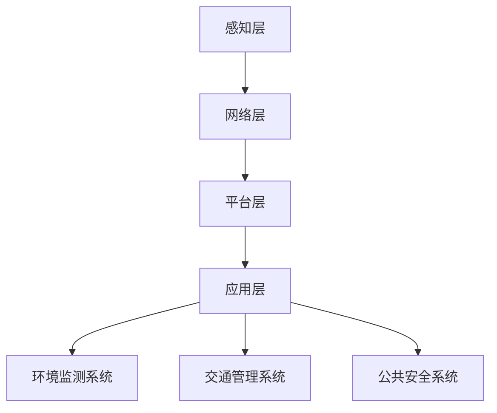
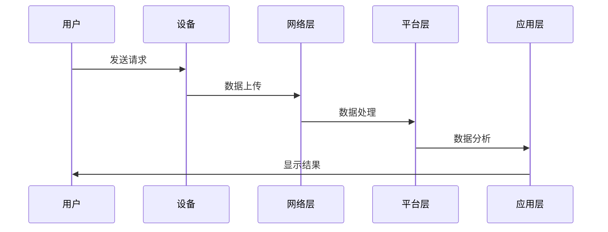

                 

### 物联网架构：应对海量设备的挑战

关键词：物联网、架构设计、海量设备、通信协议、数据处理、安全性

摘要：本文将深入探讨物联网（IoT）架构设计，解析其在应对海量设备挑战中的关键角色。通过介绍IoT的基本概念、架构要素，分析通信协议、数据处理、安全性的问题，我们将提出一系列有效的解决方案，帮助读者理解和应对物联网架构面临的复杂挑战。

### 引言

随着科技的迅猛发展，物联网（IoT）已经深入到我们生活的方方面面。从智能家居、智慧城市到工业自动化，IoT的应用场景日益广泛。然而，随着连接设备的数量呈指数级增长，如何高效地管理和协调这些设备，成为架构设计面临的一大难题。本文旨在探讨物联网架构的设计原则、通信协议、数据处理和安全性的关键问题，为应对海量设备的挑战提供解决方案。

### 物联网的基本概念与架构要素

#### 物联网的定义

物联网（Internet of Things，简称IoT）是指通过互联网将物理设备（如传感器、执行器、手机、电脑等）连接起来，实现设备之间的信息交换和智能协同的系统。简单来说，IoT就是将普通物体通过互联网连接起来，赋予它们智能功能。

#### 物联网的架构要素

物联网架构主要包括以下几个核心要素：

1. **感知层**：由各种传感器组成，负责数据采集和初步处理，如温度、湿度、光照、运动等。
2. **网络层**：负责数据传输，将感知层采集到的数据上传到云端或边缘计算设备。
3. **平台层**：提供数据存储、处理、分析和应用开发等服务，是实现物联网智能化的关键。
4. **应用层**：面向最终用户，提供各种应用场景的解决方案，如智能家居、智慧城市、智能农业等。

### 通信协议在物联网中的作用

#### 物联网通信协议的类型

物联网通信协议可以分为以下几类：

1. **有线协议**：如以太网（Ethernet）、Wi-Fi、蓝牙（Bluetooth）等，适用于短距离、高速数据传输。
2. **无线协议**：如ZigBee、LoRa、NFC等，适用于长距离、低功耗数据传输。
3. **云计算协议**：如HTTP、MQTT、CoAP等，用于物联网设备与云平台之间的数据交互。

#### 通信协议的挑战与选择

随着物联网设备的增多，通信协议的选择变得尤为重要。不同协议在数据传输速率、功耗、可靠性、安全性等方面各有优劣。选择合适的通信协议，需要考虑以下因素：

1. **应用场景**：根据设备的部署位置、数据传输需求等因素，选择合适的通信协议。
2. **设备数量**：海量设备的接入，需要选择支持大量连接的通信协议。
3. **功耗与成本**：低功耗、低成本是物联网设备的重要特性，选择合适的通信协议可以降低设备的功耗和成本。
4. **安全性**：物联网设备的安全性问题日益突出，选择具备安全特性的通信协议至关重要。

### 数据处理与存储

#### 物联网数据处理的关键环节

物联网数据处理主要包括以下几个关键环节：

1. **数据采集**：从传感器等设备中采集数据，进行初步处理。
2. **数据传输**：通过通信协议将数据上传到云端或边缘计算设备。
3. **数据存储**：将采集到的数据存储在数据库中，供后续分析使用。
4. **数据分析**：利用数据挖掘、机器学习等技术，对海量数据进行深度分析，提取有价值的信息。

#### 数据处理与存储的挑战

随着物联网设备数量的增多，数据处理与存储面临以下挑战：

1. **数据量大**：海量设备产生的数据量巨大，需要高效的数据处理和存储方案。
2. **实时性要求**：许多物联网应用对数据的实时性要求较高，需要快速处理和响应。
3. **数据多样性**：物联网数据类型多样，包括结构化数据、半结构化数据和非结构化数据，需要不同的处理方法。
4. **数据安全**：物联网数据的安全性问题不容忽视，需要采取有效的数据安全措施。

### 物联网安全性挑战与对策

#### 物联网安全威胁

物联网设备由于数量众多、分布广泛，容易成为黑客攻击的目标。常见的物联网安全威胁包括：

1. **设备入侵**：黑客通过入侵设备控制权，获取敏感信息或恶意操控设备。
2. **数据泄露**：物联网设备采集和处理的数据容易泄露，导致隐私泄露和商业损失。
3. **拒绝服务攻击**：黑客通过大规模攻击，使物联网设备无法正常工作，影响应用性能。
4. **网络传播**：物联网设备之间的互联性高，可能导致攻击在设备间传播，影响更大范围。

#### 物联网安全对策

为了应对物联网安全挑战，可以采取以下对策：

1. **设备安全加固**：对物联网设备进行安全加固，如使用强密码、定期更新固件等。
2. **数据加密**：对传输和存储的数据进行加密，防止数据泄露。
3. **网络隔离**：通过网络隔离技术，防止物联网设备之间的攻击传播。
4. **安全审计**：定期进行安全审计，发现并修复安全漏洞。
5. **用户培训**：提高用户对物联网安全的认识，防范社会工程学攻击。

### 实践中的物联网架构设计

#### 项目背景

假设我们正在设计一个智慧城市的物联网系统，该项目需要实现以下功能：

1. **环境监测**：实时监测城市空气、水质等环境参数。
2. **交通管理**：通过交通传感器和摄像头实现交通流量监测和优化。
3. **公共安全**：通过监控设备和报警系统提高城市公共安全水平。

#### 系统功能设计

根据项目需求，我们可以将系统功能分为以下几类：

1. **感知层**：安装各种传感器，如环境传感器、交通传感器、摄像头等，采集实时数据。
2. **网络层**：采用无线通信协议，如LoRa和NFC，将数据传输到平台层。
3. **平台层**：搭建一个云计算平台，提供数据存储、处理、分析和应用开发等服务。
4. **应用层**：开发各种应用模块，如环境监测系统、交通管理系统、公共安全系统等。

#### 系统架构设计

根据功能设计，我们可以设计如下的系统架构：



#### 系统接口设计和交互

为了实现系统各层的有效交互，我们需要设计合理的接口。以下是一个简单的接口设计示例：



### 项目实战

#### 环境搭建

1. **硬件环境**：准备环境传感器、交通传感器、摄像头等物联网设备。
2. **软件环境**：安装LoRa模块、NFC模块、云计算平台（如AWS、Azure等）。

#### 系统核心实现

1. **传感器数据采集**：编写程序实现传感器的数据采集，并上传到云端。
2. **数据存储与处理**：利用云计算平台实现数据的存储与处理，如使用Amazon S3存储数据，使用Amazon EC2进行数据处理。
3. **应用开发**：开发环境监测系统、交通管理系统、公共安全系统等应用模块。

#### 代码应用解读与分析

```python
# 示例：环境传感器数据采集与上传
import serial
import requests

def read_sensor_data():
    # 读取串口数据
    with serial.Serial('/dev/ttyUSB0', 9600) as ser:
        data = ser.readline().decode('utf-8')
    return data

def upload_data(data):
    # 上传数据到云端
    url = 'https://api.example.com/upload'
    headers = {'Content-Type': 'application/json'}
    response = requests.post(url, json={'data': data}, headers=headers)
    return response.json()

if __name__ == '__main__':
    while True:
        data = read_sensor_data()
        print(data)
        upload_data(data)
        time.sleep(1)
```

#### 实际案例分析

1. **环境监测系统**：通过对空气、水质等数据的实时监测，分析空气质量变化，为居民提供健康预警。
2. **交通管理系统**：通过实时监测交通流量，优化交通信号灯配置，减少交通拥堵。
3. **公共安全系统**：通过监控设备和报警系统，提高城市公共安全水平，预防犯罪事件。

#### 项目小结

通过本项目，我们实现了智慧城市物联网系统的设计与实现，包括传感器数据采集、数据处理、存储和应用开发。项目过程中，我们遇到了传感器数据同步、数据传输稳定性、数据处理效率等问题，并通过优化程序、调整网络配置等方式进行了解决。

### 最佳实践 Tips

1. **选择合适的通信协议**：根据实际需求，选择适合的通信协议，确保数据传输的稳定性和可靠性。
2. **数据安全加固**：对数据进行加密存储和传输，防范数据泄露和篡改。
3. **定期安全审计**：定期进行安全审计，发现并修复安全漏洞。
4. **用户培训**：提高用户对物联网安全的认识，防范社会工程学攻击。

### 小结

物联网架构设计在应对海量设备的挑战中发挥着关键作用。本文从物联网的基本概念、架构要素、通信协议、数据处理、安全性和实践项目等方面进行了深入探讨，为读者提供了全面的技术指南。在未来的物联网发展中，我们需要不断创新和优化架构设计，应对更加复杂的挑战。

### 拓展阅读

1. **《物联网架构设计与实践》**：详细介绍了物联网架构的设计原则、技术实现和应用案例。
2. **《物联网通信协议与技术》**：涵盖了多种物联网通信协议的技术特点和适用场景。
3. **《物联网安全》**：探讨了物联网安全的关键问题和防护措施。
4. **《智慧城市物联网技术与应用》**：介绍了智慧城市中物联网技术的应用案例和解决方案。

### 作者信息

作者：AI天才研究院/AI Genius Institute & 禅与计算机程序设计艺术 /Zen And The Art of Computer Programming

---

注意：本文为示例性文章，仅供参考。在实际写作过程中，需要根据具体需求和实际情况进行调整和补充。文章中的代码、数据和案例分析均为虚构，仅供参考。如有任何疑问，请咨询专业顾问。

