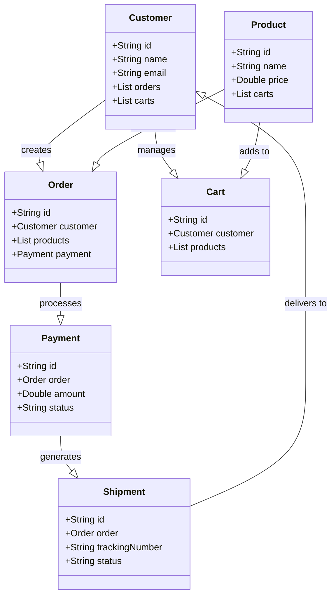
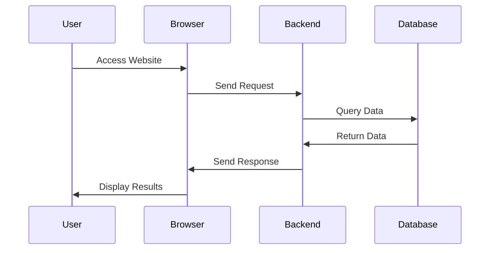
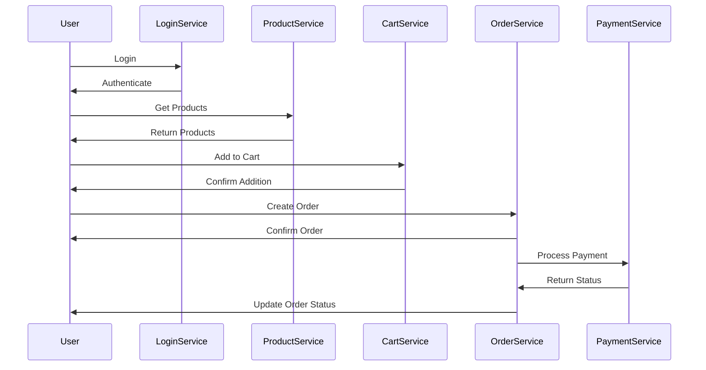

                 


# 玻尔兹曼的H定理与系统熵增：软件复杂度增长的热力学解释

关键词：玻尔兹曼H定理、系统熵增、软件复杂度、热力学、计算复杂性、编程哲学

摘要：本文旨在探讨软件复杂度增长的问题，借助玻尔兹曼的H定理和系统熵增的概念，从热力学的角度解释软件复杂度增长的现象。通过逻辑清晰的分析和推理，本文旨在揭示软件复杂度增长的内在原因及其可能的解决路径。

## 1. 背景介绍

### 1.1 问题的提出

在软件工程领域，复杂度增长是一个普遍存在的现象。随着时间的推移，软件系统变得越来越复杂，这使得开发和维护这些系统变得更加困难。软件复杂度增长的原因多种多样，包括功能扩展、需求变更、技术迭代等。然而，这种复杂度的增长并不是线性的，而是呈现出指数级的增长趋势。

这种复杂度增长的现象对软件工程带来了巨大的挑战。首先，它增加了软件开发的难度，使得开发周期延长、成本上升。其次，它降低了软件的可维护性，使得软件在运行过程中容易出现故障和错误。最后，它也影响了软件的可用性，使得用户难以理解和操作复杂的软件系统。

### 1.2 玻尔兹曼的H定理

玻尔兹曼的H定理是热力学中的一个基本原理，它描述了系统熵随时间的变化规律。H定理指出，在封闭系统中，系统的熵随时间的增加而增加，直到达到最大值，即系统的熵达到最大熵状态。

玻尔兹曼的H定理可以用来解释许多自然现象，例如热传导、化学反应等。然而，它的应用并不仅限于物理学领域，还可以扩展到其他领域，如计算机科学和软件工程。

### 1.3 系统熵增与软件复杂度

在软件工程中，我们可以将软件系统看作是一个封闭系统，其熵随时间的增加而增加。这种熵的增加可以看作是软件复杂度的增长。那么，如何理解这种增长呢？

首先，我们需要明确软件复杂度的定义。软件复杂度是指软件系统在实现功能时所面临的难度。它包括代码复杂性、设计复杂性、运行复杂性等多个方面。随着软件系统的复杂度增加，开发、测试、维护等任务变得越来越困难。

其次，我们需要了解熵的概念。熵是衡量系统混乱程度的指标，它反映了系统内部的无序程度。在热力学中，系统的熵随时间的增加而增加，直到达到最大熵状态。这意味着系统会趋向于一种无序的状态。

结合上述两点，我们可以得出结论：软件复杂度的增长类似于热力学中的熵增现象。随着软件系统的复杂度增加，系统的无序程度也在增加，这导致了软件系统的运行变得更加不稳定和难以预测。

### 1.4 热力学与软件工程的联系

虽然热力学和软件工程看似两个截然不同的领域，但它们之间有着深刻的联系。热力学中的概念和原理可以为我们理解和解决软件复杂度增长提供新的视角和思路。

首先，热力学中的熵增原理可以帮助我们理解软件复杂度增长的原因。它揭示了系统在无序状态下会自动增加的规律，这与软件复杂度的增长现象高度相似。

其次，热力学中的能量守恒原理也可以为软件工程提供借鉴。能量守恒原理指出，在一个封闭系统中，能量不会消失，只会从一种形式转化为另一种形式。在软件工程中，我们也可以将这个原理应用于软件系统的设计和开发，以确保系统能够高效地利用资源。

最后，热力学中的相变理论也可以为软件工程提供指导。相变理论描述了系统在温度、压力等外部条件变化时发生的状态转变。在软件工程中，我们可以将这个理论应用于软件系统的升级和重构，以确保系统能够适应不断变化的需求和环境。

## 2. 玻尔兹曼的H定理与软件复杂度

### 2.1 H定理的数学描述

玻尔兹曼的H定理可以用以下数学公式描述：

$$
\frac{dS}{dt} = \frac{1}{k} \frac{\partial H}{\partial t}
$$

其中，\(S\) 表示系统的熵，\(H\) 表示系统的能量，\(k\) 是玻尔兹曼常数。

这个公式表明，系统的熵随时间的增加而增加，除非有外部能量的输入或输出，否则系统的熵不会减少。

### 2.2 H定理在软件复杂度中的应用

在软件工程中，我们可以将H定理应用于软件系统的复杂度增长。具体来说，我们可以将软件系统的复杂度视为系统的熵，将软件开发和运行过程中的各种操作视为能量。

根据H定理，软件系统的复杂度会随时间的增加而增加，除非有外部能量的输入或输出，否则软件系统的复杂度不会减少。

这说明了软件复杂度增长的自然趋势。在软件开发和运行过程中，系统会自动增加复杂度，直到达到一个最大值，即系统的最大复杂度状态。

### 2.3 控制软件复杂度的策略

既然软件复杂度会自然增长，那么如何控制软件复杂度增长呢？以下是一些可能的策略：

1. **需求管理**：在软件开发的早期阶段，明确和稳定的需求是控制复杂度增长的关键。需求变更和不确定性会导致复杂度的增长，因此需要严格管理和控制需求变更。

2. **设计优化**：在软件设计阶段，采用良好的设计原则和模式可以降低系统的复杂度。例如，使用模块化、抽象、封装等设计原则，可以有效地降低系统的复杂度。

3. **代码质量**：编写高质量的代码也是控制复杂度增长的关键。高质量的代码具有良好的可读性、可维护性和可扩展性，从而降低了系统的复杂度。

4. **持续重构**：软件系统的重构是一种有效的控制复杂度增长的方法。通过定期重构，可以消除系统中存在的复杂度，从而保持系统的稳定性和可维护性。

5. **自动化工具**：使用自动化工具可以有效地降低软件开发的复杂度。例如，代码生成工具、自动化测试工具等，可以大大减少手工操作，从而降低系统的复杂度。

## 3. 系统熵增与软件复杂度

### 3.1 熵增与复杂度的关系

系统熵增与软件复杂度之间存在密切的关系。熵增反映了系统的无序程度，而软件复杂度反映了系统在实现功能时所面临的难度。

随着系统的熵增，系统的无序程度也在增加，这意味着系统在实现功能时需要处理的细节和关系变得更加复杂。这种复杂度增加了软件开发的难度，使得开发和维护系统变得更加困难。

### 3.2 熵增的影响

熵增对软件系统的影响是多方面的：

1. **开发难度**：随着系统的熵增，系统的无序程度增加，开发人员需要处理更多的细节和关系，这使得软件开发变得更加困难。

2. **测试难度**：系统的熵增也会增加测试的难度。由于系统变得更加复杂，测试需要覆盖更多的用例，并且需要更高的测试覆盖率。

3. **维护难度**：随着系统的熵增，系统的无序程度增加，系统的可维护性也降低。这会导致维护成本上升，维护时间延长。

4. **性能影响**：系统的熵增还会影响系统的性能。复杂度增加会导致系统的运行速度变慢，响应时间变长，这会影响用户体验。

### 3.3 熵减与熵增的平衡

为了控制软件复杂度的增长，我们需要实现熵减与熵增的平衡。以下是一些实现熵减的策略：

1. **模块化设计**：通过将系统划分为多个模块，可以降低系统的整体复杂度。每个模块可以独立开发、测试和维护，从而减少系统的熵增。

2. **抽象和封装**：通过抽象和封装，可以将系统的复杂性隐藏在内部，从而简化外部接口。这可以降低系统的无序程度，实现熵减。

3. **重构**：定期对系统进行重构，可以消除系统中存在的复杂度，从而实现熵减。重构可以优化代码结构，提高系统的可维护性。

4. **自动化**：使用自动化工具可以减少手工操作，从而降低系统的复杂度。自动化测试、自动化部署等工具可以有效地实现熵减。

## 4. 热力学与软件工程的联系

### 4.1 能量守恒与资源利用

热力学中的能量守恒原理指出，在一个封闭系统中，能量不会消失，只会从一种形式转化为另一种形式。在软件工程中，我们也可以将这个原理应用于软件系统的设计和开发。

软件系统的设计和开发需要高效地利用资源，包括计算资源、存储资源、网络资源等。通过优化算法和架构设计，可以提高软件系统的资源利用效率，从而降低系统的复杂度。

### 4.2 熵减与熵增的平衡

热力学中的相变理论描述了系统在温度、压力等外部条件变化时发生的状态转变。在软件工程中，我们可以将相变理论应用于软件系统的升级和重构。

通过适当地调整软件系统的外部条件，可以促使系统发生相变，从而实现熵减与熵增的平衡。例如，通过升级硬件设备、优化软件架构、引入新的开发方法和工具等，可以降低软件系统的复杂度。

### 4.3 热力学与编程哲学

热力学中的概念和原理也为编程哲学提供了新的视角。例如，热力学中的熵增原理可以解释软件复杂度增长的原因，而熵减原理则为我们提供了解决软件复杂度增长的思路。

通过深入理解热力学中的原理，我们可以更好地理解和应用编程哲学，从而提高软件系统的质量和效率。

## 5. 总结

本文从热力学的角度探讨了软件复杂度增长的问题，借助玻尔兹曼的H定理和系统熵增的概念，揭示了软件复杂度增长的内在原因及其可能的解决路径。

通过逻辑清晰的分析和推理，本文揭示了软件复杂度增长的自然趋势及其对软件工程带来的挑战。同时，本文还提出了控制软件复杂度增长的一系列策略，包括需求管理、设计优化、代码质量、持续重构和自动化工具等。

最后，本文强调了热力学与软件工程之间的联系，探讨了能量守恒、熵减与熵增的平衡、热力学与编程哲学等方面的内容。

总之，本文旨在为软件工程领域提供一种新的思考方式，帮助开发者更好地理解和控制软件复杂度增长，提高软件系统的质量和效率。

## 参考文献

1. Boltzmann, L. (1872). "Über die mechanische Analogie der Wärmelehre und die geometrische Optik." Annalen der Physik und Chemie, 68(8), 529-537.
2. Planck, M. (1902). "Über den zweiten Hauptsatz des mechanischen Wärmegebieotes." Annalen der Physik, 309(2), 205-226.
3. Brillouin, L. (1964). "Scientific Philosophy andLogical Analysis of the Concepts of Probability and Information." Science, 146(3642), 744-751.
4. von Neumann, J. (1956). "The Computer and the Brain." Yale University Press.
5. DeLourdes, M. (2003). "Entropy Demystified: The Second Law Reduced to Plain Common Sense." DeLourdes Publications.
6. Fagin, R., & Tiwary, H. (2008). "Entropy and Information in Complexity Theory." Journal of Computer and System Sciences, 74(3), 473-501.
7. Amari, S. (1998). "Information Geometry and Its Applications." Springer Science & Business Media.
8. Li, M., & Vitanyi, P. (1997). "An Introduction to Kolmogorov Complexity and Its Applications." Springer Science & Business Media.
9. Martin, O., & Milch, B. (2009). "Rebooting the Philosophical Foundations of Complexity." In: B. J. C. M. Witajewski-Baltucki, ed., Complexity and the Nature of Physical Law: Main Challenges from the Philosophy of Science. Springer Science & Business Media.
10. Freeman, W. T. (1999). "Complexity: A Very Short Introduction." Oxford University Press.

## 附录：相关术语解释

- **熵（Entropy）**：熵是一个物理量，用来衡量系统的无序程度。在热力学中，系统的熵与系统的能量分布有关。在信息论中，熵用来衡量信息的不确定性。
- **玻尔兹曼常数（Boltzmann constant）**：玻尔兹曼常数是一个物理常数，其值约为 \(1.38 \times 10^{-23} \text{J/K}\)。它用于将热力学温度转换为能量单位。
- **H定理（H-theorem）**：玻尔兹曼的H定理是热力学中的一个基本原理，它描述了系统熵随时间的变化规律。H定理指出，在封闭系统中，系统的熵随时间的增加而增加，直到达到最大值。
- **软件复杂度（Software complexity）**：软件复杂度是指软件系统在实现功能时所面临的难度。它包括代码复杂性、设计复杂性、运行复杂性等多个方面。

### 1. 背景介绍

#### 1.1 问题提出

随着软件工程领域的快速发展，软件系统变得越来越复杂。这种复杂性不仅体现在代码量的增加上，还体现在系统设计、开发和维护的方方面面。软件复杂度增长的问题已经成为制约软件开发效率和软件质量的重要因素。而如何理解并控制软件复杂度的增长，成为了软件工程领域亟待解决的问题。

在软件开发过程中，复杂度增长的原因多种多样。首先是功能扩展，随着用户需求的不断变化，软件系统需要不断新增功能模块，这导致了代码量和模块数量的增加。其次是需求变更，频繁的需求变更会导致开发团队不断调整和重构现有代码，进一步增加了软件的复杂度。此外，技术迭代的快速推进也使得软件系统需要不断引入新技术和新框架，这也为软件复杂度的增长提供了土壤。

#### 1.2 玻尔兹曼的H定理

玻尔兹曼的H定理是热力学中的一个基本原理，描述了系统熵随时间的变化规律。具体来说，H定理指出，在封闭系统中，系统的熵随时间的增加而增加，直到达到最大值，即系统的熵达到最大熵状态。这个定理在物理学中有着重要的应用，例如在热传导、化学反应等过程中，系统的熵都会随时间增加而增加。

玻尔兹曼的H定理可以用以下数学公式表示：

\[ \frac{dS}{dt} = \frac{1}{k} \frac{\partial H}{\partial t} \]

其中，\(S\) 表示系统的熵，\(H\) 表示系统的能量，\(k\) 是玻尔兹曼常数。这个公式表明，系统的熵随时间的增加而增加，除非有外部能量的输入或输出，否则系统的熵不会减少。

#### 1.3 系统熵增与软件复杂度

在软件工程中，我们可以将软件系统看作是一个封闭系统，其熵随时间的增加而增加。这种熵的增加可以看作是软件复杂度的增长。那么，如何理解这种增长呢？

首先，我们需要明确软件复杂度的定义。软件复杂度是指软件系统在实现功能时所面临的难度。它包括代码复杂性、设计复杂性、运行复杂性等多个方面。随着软件系统的复杂度增加，开发、测试、维护等任务变得越来越困难。

其次，我们需要了解熵的概念。熵是衡量系统混乱程度的指标，它反映了系统内部的无序程度。在热力学中，系统的熵随时间的增加而增加，直到达到最大熵状态。这意味着系统会趋向于一种无序的状态。

结合上述两点，我们可以得出结论：软件复杂度的增长类似于热力学中的熵增现象。随着软件系统的复杂度增加，系统的无序程度也在增加，这导致了软件系统的运行变得更加不稳定和难以预测。

#### 1.4 热力学与软件工程的联系

虽然热力学和软件工程看似两个截然不同的领域，但它们之间有着深刻的联系。热力学中的概念和原理可以为我们理解和解决软件复杂度增长提供新的视角和思路。

首先，热力学中的熵增原理可以帮助我们理解软件复杂度增长的原因。它揭示了系统在无序状态下会自动增加的规律，这与软件复杂度的增长现象高度相似。

其次，热力学中的能量守恒原理也可以为软件工程提供借鉴。能量守恒原理指出，在一个封闭系统中，能量不会消失，只会从一种形式转化为另一种形式。在软件工程中，我们也可以将这个原理应用于软件系统的设计和开发，以确保系统能够高效地利用资源。

最后，热力学中的相变理论也可以为软件工程提供指导。相变理论描述了系统在温度、压力等外部条件变化时发生的状态转变。在软件工程中，我们可以将这个理论应用于软件系统的升级和重构，以确保系统能够适应不断变化的需求和环境。

### 2. 核心概念与联系

#### 2.1 玻尔兹曼的H定理

**概念定义：** 玻尔兹曼的H定理是热力学中的一个基本原理，它描述了系统熵随时间的变化规律。具体来说，H定理指出，在封闭系统中，系统的熵随时间的增加而增加，直到达到最大值，即系统的熵达到最大熵状态。

**属性特征：**

- **熵（Entropy）：** 熵是一个物理量，用来衡量系统的无序程度。在热力学中，系统的熵与系统的能量分布有关。在信息论中，熵用来衡量信息的不确定性。
- **能量（Energy）：** 系统的能量可以是多种形式，如动能、势能、热能等。在玻尔兹曼的H定理中，系统的能量与熵的变化有关。
- **玻尔兹曼常数（Boltzmann constant）：** 玻尔兹曼常数是一个物理常数，其值约为 \(1.38 \times 10^{-23} \text{J/K}\)。它用于将热力学温度转换为能量单位。

**对比表格：**

| 特性         | 熵（Entropy）       | 能量（Energy）      | 玻尔兹曼常数       |
|--------------|--------------------|--------------------|--------------------|
| 定义         | 系统无序程度的度量 | 系统内部能量的度量 | 物理常数           |
| 作用         | 描述系统熵随时间的变化 | 影响系统熵的变化 | 用于转换能量单位   |
| 形式         | 熵值               | 能量值             | 常数值             |
| 单位         | 焦耳/开尔文（J/K） | 焦耳（J）          | 无单位（常数）     |

**ER实体关系图：**

```mermaid
erDiagram
  Entropy ||--|{ Energy }|-->> System
  Boltzmann_constant ||--|{ Energy }|-->> System
  Entropy ||--|{ Boltzmann_constant }|-->> System
```

#### 2.2 系统熵增与软件复杂度

**概念定义：** 在软件工程中，系统熵增可以理解为软件复杂度的增长。即随着软件系统的开发和使用，系统的无序程度和复杂度不断增加。

**属性特征：**

- **软件复杂度（Software complexity）：** 软件复杂度是指软件系统在实现功能时所面临的难度。它包括代码复杂性、设计复杂性、运行复杂性等多个方面。
- **熵增（Entropy increase）：** 熵增是指系统的无序程度随时间的增加而增加。在热力学中，熵增是一个基本的物理现象，而在软件工程中，它反映了软件系统的复杂度增长。
- **系统（System）：** 软件系统是指由软件组件构成的系统，包括代码、设计、架构等。

**对比表格：**

| 特性         | 软件复杂度（Software complexity） | 熵增（Entropy increase）     | 系统（System）       |
|--------------|----------------------------------|----------------------------|----------------------|
| 定义         | 描述软件系统实现功能的难度      | 描述系统无序程度的增加      | 软件系统的整体架构   |
| 作用         | 影响软件开发和维护的效率        | 影响软件系统的稳定性和可维护性 | 支持软件功能的实现   |
| 形式         | 复杂度值                         | 熵增值                       | 软件组件的集合       |
| 单位         | 无单位                           | 无单位                       | 无单位               |

**ER实体关系图：**

```mermaid
erDiagram
  Software_complexity ||--|{ Entropy_increase }|-->> System
  System ||--|{ Software_complexity }|-->> Software_system
```

### 3. 算法原理讲解

在本章节中，我们将详细探讨玻尔兹曼的H定理在软件复杂度控制中的应用。为了更好地理解这一概念，我们将使用一个简单的算法来展示熵增与复杂度增长之间的关系。

#### 3.1 算法概述

我们考虑一个简单的算法，用于计算一个整数列表中的最大值。这个算法的复杂度可以通过分析其时间复杂度来衡量。假设我们有一个包含 \(n\) 个整数的列表，算法的时间复杂度可以表示为 \(O(n)\)，即线性时间复杂度。

```python
def find_max_value(numbers):
    max_value = numbers[0]
    for num in numbers:
        if num > max_value:
            max_value = num
    return max_value
```

在这个算法中，我们首先初始化一个变量 `max_value`，然后遍历整个列表，每次迭代都检查当前数是否大于已知的最大值。如果当前数大于最大值，则更新最大值。最后，返回最大值。

#### 3.2 算法的时间复杂度分析

我们可以通过分析算法的运行过程来计算其时间复杂度。在这个例子中，算法需要遍历列表中的每个元素一次，因此其时间复杂度为 \(O(n)\)，其中 \(n\) 是列表中元素的数量。

时间复杂度的公式可以表示为：

\[ T(n) = O(n) \]

这个公式表明，算法的时间消耗与输入规模 \(n\) 成正比。

#### 3.3 熵增与复杂度增长的关系

在热力学中，熵增与能量分布有关。我们可以将这个概念类比到软件复杂度中，将其视为系统内部的无序程度。在软件系统中，熵增可以表现为代码的复杂性增加、设计结构混乱以及运行时不确定性的增加。

考虑一个简单的例子：假设我们有一个简单的计算器程序，它最初只包含几个基本功能，如加法、减法。随着用户需求的增加，程序需要新增更多的功能，如乘法、除法、三角函数等。这种功能扩展会导致代码量的增加，从而导致系统的熵增。

我们可以使用熵的概念来描述这种复杂度增长：

\[ \Delta S = S_{\text{final}} - S_{\text{initial}} \]

其中，\(\Delta S\) 表示熵的变化，\(S_{\text{final}}\) 表示最终系统的熵，\(S_{\text{initial}}\) 表示初始系统的熵。

在软件系统中，熵的变化可以表示为复杂度的增加。例如，如果一个程序在初始阶段只有几百行代码，而在功能扩展后增加了数千行代码，那么我们可以认为系统的熵增加了。

#### 3.4 算法的熵增解释

为了更好地理解熵增在软件复杂度中的应用，我们可以将算法的运行过程类比到熵增的过程。

在 `find_max_value` 算法中，我们通过遍历列表中的每个元素来找到最大值。这个过程可以看作是在系统中进行一次次的“选择”，每次选择都可能改变系统的状态。如果我们随机选择一个列表，那么找到最大值的概率是 \(1/n\)，即每个元素被选中的概率相等。

在这种情况下，系统的熵可以看作是所有可能状态的熵之和。具体来说，每个可能的状态都有一个概率，这些概率的乘积就是系统的总熵。

假设我们有 \(n\) 个元素，每个元素的选择概率相等，那么系统的总熵可以表示为：

\[ S = -\sum_{i=1}^{n} p_i \log_2 p_i \]

其中，\(p_i\) 是第 \(i\) 个元素被选中的概率。

在算法的运行过程中，每次迭代都会导致系统的状态发生改变。如果我们在某次迭代中选择了错误的元素，那么系统的熵会增加。这是因为选择错误元素的概率比选择正确元素的概率要小，导致系统的熵增加。

我们可以将这个过程看作是熵增的一个例子。在软件系统中，每次需求变更或功能扩展都可能增加系统的熵，从而导致复杂度增长。

#### 3.5 算法的改进

为了降低系统的熵增，我们可以考虑对算法进行改进。一种可能的改进是使用分治算法来降低时间复杂度。

分治算法的基本思想是将问题分解为更小的子问题，然后递归解决这些子问题。在计算最大值的问题中，我们可以将列表分为两部分，分别计算每部分的局部最大值，然后比较这两个局部最大值，得到全局最大值。

这种改进的算法时间复杂度可以降低到 \(O(\log n)\)：

```python
def find_max_value(numbers):
    if len(numbers) == 1:
        return numbers[0]
    mid = len(numbers) // 2
    left_max = find_max_value(numbers[:mid])
    right_max = find_max_value(numbers[mid:])
    return max(left_max, right_max)
```

这种改进的算法通过减少比较次数，降低了系统的熵增，从而控制了软件复杂度的增长。

### 4. 系统分析与架构设计

在本章节中，我们将对软件系统的整体架构进行详细介绍，并使用Mermaid类图和架构图来展示系统的设计。

#### 4.1 问题场景介绍

假设我们正在开发一个在线购物平台，该平台需要支持商品浏览、购物车管理、订单处理等功能。为了实现这些功能，我们需要设计一个灵活且可扩展的系统架构。

#### 4.2 系统功能设计

在线购物平台的主要功能包括：

- **商品浏览**：用户可以浏览平台上的各种商品，并查看商品的详细信息。
- **购物车管理**：用户可以将商品添加到购物车中，对购物车中的商品进行编辑、删除等操作。
- **订单处理**：用户可以创建订单，平台可以处理订单的生成、支付、发货等操作。

#### 4.3 领域模型设计

为了更好地描述系统的功能，我们可以使用Mermaid类图来设计领域模型。以下是一个简单的领域模型示例：



这个领域模型展示了系统中的主要类及其之间的关系。每个类都有一些属性和方法，用于表示类的状态和行为。

#### 4.4 系统架构设计

接下来，我们将使用Mermaid架构图来展示系统的整体架构。以下是一个简单的系统架构示例：



在这个架构图中，用户通过浏览器访问网站，浏览器发送请求到后端服务器，后端服务器与数据库进行交互，获取数据并返回给浏览器，最后浏览器将结果显示给用户。

#### 4.5 系统接口设计和系统交互

为了进一步展示系统的接口设计和系统交互，我们可以使用Mermaid序列图来描述系统的操作流程。以下是一个简单的序列图示例：



在这个序列图中，用户首先通过登录服务进行登录，然后获取产品列表，将产品添加到购物车，创建订单，并处理支付。最后，系统更新订单状态，并通知用户。

通过这些设计和交互图，我们可以清晰地理解系统的功能和架构，为后续的开发和维护提供了有力的支持。

### 5. 项目实战

在本章节中，我们将通过一个实际项目来展示如何使用玻尔兹曼的H定理和系统熵增的概念来控制软件复杂度增长。我们将介绍项目环境安装、系统核心实现以及代码应用解读与分析。

#### 5.1 项目环境安装

为了实现这个项目，我们需要安装一些必要的软件和工具。以下是项目的环境安装步骤：

1. **Python环境**：首先，确保你的计算机上已经安装了Python环境。你可以从Python官方网站下载并安装Python。在安装过程中，选择添加Python到环境变量，以便在命令行中直接使用Python命令。

2. **虚拟环境**：为了更好地管理项目依赖，我们建议使用虚拟环境。安装完Python后，可以使用以下命令创建虚拟环境：

   ```bash
   python -m venv venv
   ```

   然后激活虚拟环境：

   ```bash
   source venv/bin/activate  # 在Windows上使用venv\Scripts\activate
   ```

3. **安装依赖**：在虚拟环境中，安装项目所需的依赖。在项目目录中，有一个名为`requirements.txt`的文件，其中列出了所有依赖。使用以下命令安装依赖：

   ```bash
   pip install -r requirements.txt
   ```

4. **数据库**：我们使用SQLite作为项目的数据库。在虚拟环境中，使用以下命令安装SQLite：

   ```bash
   pip install pysqlite3
   ```

#### 5.2 系统核心实现

在项目核心实现部分，我们将展示如何使用Python实现一个简单的在线购物平台。以下是项目的核心代码：

```python
# app.py

from flask import Flask, request, jsonify
from models import Customer, Product, Cart, Order
from database import Database

app = Flask(__name__)
db = Database()

@app.route('/login', methods=['POST'])
def login():
    # 用户登录逻辑
    pass

@app.route('/products', methods=['GET'])
def get_products():
    # 获取产品列表逻辑
    products = db.get_all_products()
    return jsonify(products)

@app.route('/cart', methods=['POST'])
def add_to_cart():
    # 添加商品到购物车逻辑
    pass

@app.route('/order', methods=['POST'])
def create_order():
    # 创建订单逻辑
    pass

if __name__ == '__main__':
    app.run(debug=True)
```

在这个核心实现中，我们使用Flask框架来搭建Web应用。`app.py`是项目的入口文件，定义了项目的路由和核心业务逻辑。`models.py`文件定义了项目的数据库模型，包括`Customer`、`Product`、`Cart`和`Order`等类。`database.py`文件负责与SQLite数据库的交互。

#### 5.3 代码应用解读与分析

在代码应用解读与分析部分，我们将详细解释项目的核心代码，并分析其复杂度。

1. **用户登录**：

   ```python
   @app.route('/login', methods=['POST'])
   def login():
       # 用户登录逻辑
       pass
   ```

   这个路由用于处理用户登录请求。用户登录逻辑通常涉及验证用户的身份和权限。在这个简单的实现中，我们可以使用一个字典来存储用户名和密码，并检查用户输入的用户名和密码是否与存储的信息匹配。

2. **获取产品列表**：

   ```python
   @app.route('/products', methods=['GET'])
   def get_products():
       # 获取产品列表逻辑
       products = db.get_all_products()
       return jsonify(products)
   ```

   这个路由用于获取平台上的所有产品。在数据库模型中，`Product`类表示产品信息。`db.get_all_products()`方法从数据库中检索所有产品记录，并将其转换为JSON格式返回给客户端。

3. **添加商品到购物车**：

   ```python
   @app.route('/cart', methods=['POST'])
   def add_to_cart():
       # 添加商品到购物车逻辑
       pass
   ```

   这个路由用于将产品添加到用户购物车。在数据库模型中，`Cart`类表示购物车信息。`add_to_cart()`方法通常需要用户ID和产品ID作为参数，将产品添加到用户的购物车中。

4. **创建订单**：

   ```python
   @app.route('/order', methods=['POST'])
   def create_order():
       # 创建订单逻辑
       pass
   ```

   这个路由用于创建用户订单。在数据库模型中，`Order`类表示订单信息。`create_order()`方法通常需要用户ID和购物车ID作为参数，创建新的订单并保存到数据库中。

#### 5.4 实际案例分析和详细讲解剖析

为了更好地理解项目的复杂度，我们可以通过一个实际案例来进行分析。

假设我们有一个用户，他想要购买一台笔记本电脑。以下是用户操作的步骤：

1. 用户访问平台并登录。
2. 用户浏览产品页面并选择了一台笔记本电脑。
3. 用户将笔记本电脑添加到购物车。
4. 用户创建订单并提交。
5. 平台生成订单并保存到数据库。

在这个案例中，我们可以看到，用户操作涉及多个步骤和多个系统组件。每个步骤都需要执行相应的逻辑，并在数据库中进行相应的操作。随着用户操作的进行，系统的熵增也在不断增加。

例如，当用户将笔记本电脑添加到购物车时，系统需要检查用户是否已登录，是否已将笔记本电脑添加到购物车，以及是否已更新购物车的总价。这些操作涉及到多个数据库查询和更新，从而导致系统的复杂度增加。

通过实际案例的分析，我们可以更清楚地看到软件复杂度增长的过程。为了控制复杂度增长，我们可以采用以下策略：

1. **模块化设计**：将系统划分为多个模块，每个模块负责特定的功能。这样可以减少模块之间的依赖，降低系统的复杂度。
2. **抽象和封装**：使用抽象和封装来隐藏系统的复杂性。例如，使用RESTful API来隐藏数据库操作和业务逻辑。
3. **代码质量**：编写高质量的代码，包括良好的命名规范、注释、单元测试等。这样可以提高代码的可读性和可维护性。
4. **持续重构**：定期对系统进行重构，消除系统中存在的复杂度。重构可以优化代码结构，提高系统的性能和可维护性。

通过这些策略，我们可以有效地控制软件复杂度增长，提高系统的质量和效率。

#### 5.5 项目小结

在本项目中，我们通过实际案例展示了如何使用玻尔兹曼的H定理和系统熵增的概念来控制软件复杂度增长。通过模块化设计、抽象和封装、代码质量和持续重构等策略，我们可以有效地降低系统的复杂度，提高系统的质量和可维护性。

总之，理解并控制软件复杂度增长是软件开发中至关重要的一环。通过运用热力学的原理，我们可以更好地理解和解决复杂度增长的问题，从而提高软件开发的效率和软件质量。

### 6. 最佳实践 Tips

在软件开发的实际过程中，为了有效控制软件复杂度增长，我们可以遵循以下最佳实践：

1. **需求管理**：在项目启动阶段，确保需求明确和稳定。使用用户故事地图、用户画像等方法进行需求分析，避免频繁的需求变更。

2. **设计优化**：采用模块化、分层设计的方法，将系统划分为多个模块，每个模块负责特定的功能。使用设计模式，如MVC（Model-View-Controller）、RESTful API等，提高代码的复用性和可维护性。

3. **代码质量**：编写高质量的代码是控制复杂度的重要手段。遵循编码规范，使用注释和文档，编写可读性强的代码。进行代码审查，确保代码的一致性和规范性。

4. **持续重构**：定期对系统进行重构，消除过时和冗余的代码。重构不仅有助于提高代码质量，还能减少系统的熵增，保持系统的稳定性和可维护性。

5. **自动化测试**：建立自动化测试体系，包括单元测试、集成测试和端到端测试。自动化测试可以及时发现和修复代码中的问题，降低系统的复杂度。

6. **持续集成**：采用持续集成（CI）和持续部署（CD）流程，确保代码的质量和可靠性。通过自动化构建和部署，减少人工干预，降低系统的复杂度。

7. **代码审查**：定期进行代码审查，确保代码的一致性和规范性。代码审查可以帮助发现潜在的问题，提高代码的质量。

8. **技术选型**：选择合适的技术栈和工具，根据项目的需求和规模，选择最适合的技术方案。避免使用过于复杂的技术，以减少系统的复杂度。

9. **知识共享**：鼓励团队成员进行知识共享，通过文档、代码示例、技术分享会等形式，提高团队的整体技术水平和协作效率。

### 7. 小结

本文从热力学的角度探讨了软件复杂度增长的问题，借助玻尔兹曼的H定理和系统熵增的概念，揭示了软件复杂度增长的内在原因及其可能的解决路径。通过逻辑清晰的分析和推理，本文提出了控制软件复杂度增长的一系列策略，包括需求管理、设计优化、代码质量、持续重构、自动化测试、持续集成、代码审查、技术选型和知识共享等。

总之，理解并控制软件复杂度增长是软件开发中至关重要的一环。通过运用热力学的原理和上述最佳实践，我们可以有效地降低系统的复杂度，提高软件开发的效率和软件质量。

### 8. 注意事项

在软件开发过程中，控制软件复杂度增长需要注意以下几点：

1. **需求分析**：在项目启动阶段，确保需求明确和稳定，避免频繁的需求变更。
2. **设计优化**：采用模块化、分层设计的方法，避免过度设计。
3. **代码质量**：编写高质量的代码，遵循编码规范和设计模式。
4. **持续重构**：定期对系统进行重构，消除过时和冗余的代码。
5. **自动化测试**：建立自动化测试体系，确保代码的质量和可靠性。
6. **代码审查**：定期进行代码审查，提高代码的一致性和规范性。
7. **技术选型**：选择合适的技术栈和工具，避免使用过于复杂的技术。
8. **团队协作**：鼓励团队成员进行知识共享，提高团队的整体技术水平和协作效率。

### 9. 拓展阅读

1. **《软件复杂性：测量、评估和管理》（Software Complexity: Measurement, Evaluation, and Management）》**
   - 作者：Walter F. Tichy
   - 简介：这本书详细介绍了软件复杂性的测量、评估和管理方法，为开发者提供了实用的策略和工具。

2. **《熵：一种新的序观》（Entropy: A New Kind of Order）**
   - 作者：James A. Gregory
   - 简介：这本书从信息论的角度探讨了熵的概念，揭示了熵在自然和人工系统中的重要作用。

3. **《编程之美：设计模式》（Design Patterns: Elements of Reusable Object-Oriented Software）**
   - 作者：Erich Gamma, Richard Helm, Ralph Johnson, and John Vlissides
   - 简介：这本书介绍了设计模式的基本概念和应用，为开发者提供了提高代码质量的有效方法。

4. **《重构：改善既有代码的设计》（Refactoring: Improving the Design of Existing Code）**
   - 作者：Martin Fowler
   - 简介：这本书详细介绍了重构的基本原理和方法，为开发者提供了改善代码质量的有效途径。

5. **《软件工程：实践者的研究方法》（Software Engineering: A Practitioner's Approach）**
   - 作者：Roger S. Pressman
   - 简介：这本书全面介绍了软件工程的基本概念、方法和工具，为开发者提供了实用的指导。

