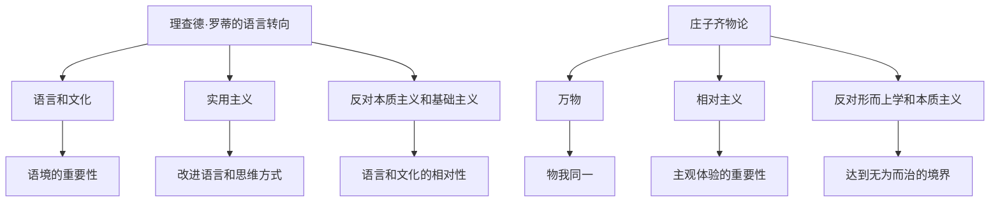
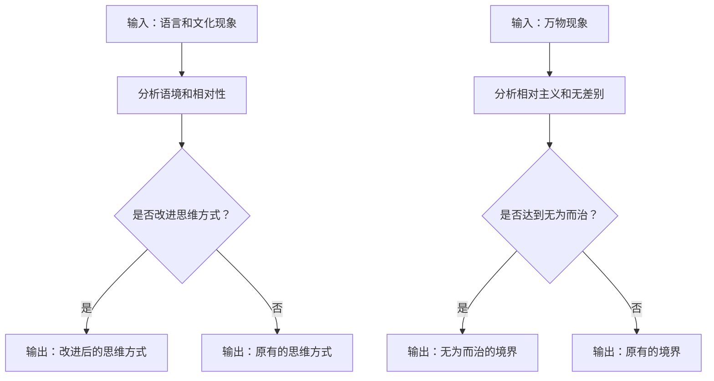
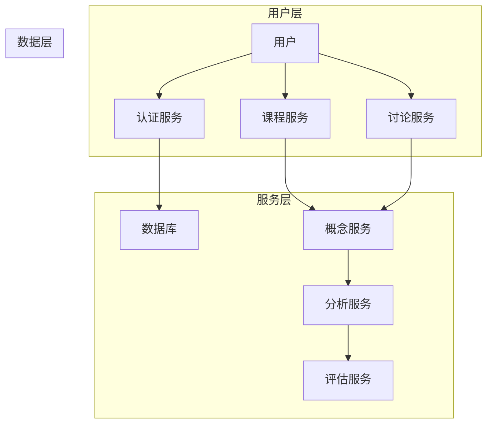
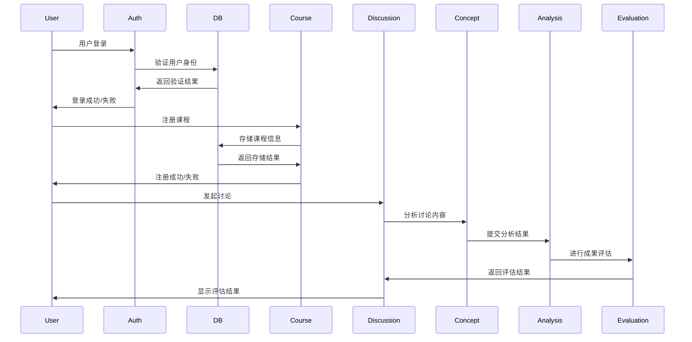
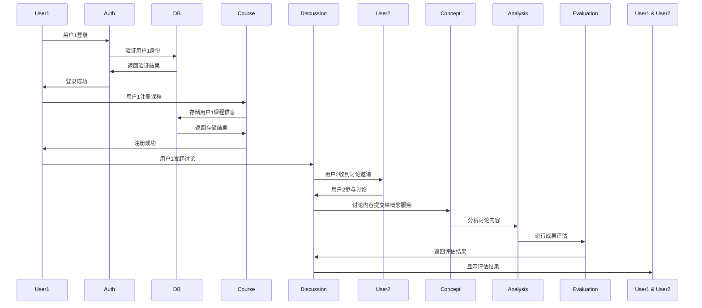

                 

### 《理查德·罗蒂与庄子：语言转向与齐物论的后现代对话》

#### 关键词：
- 理查德·罗蒂
- 庄子
- 语言转向
- 齐物论
- 后现代哲学

#### 摘要：
本文将探讨西方哲学家理查德·罗蒂和中国古代哲学家庄子的思想，尤其是他们的语言转向概念和齐物论。通过对比分析，本文旨在揭示两种思想体系在语言、认识论和存在论等方面的异同，并探讨后现代对话的可能性。文章分为以下几个部分：引言、理查德·罗蒂哲学思想概述、庄子哲学思想解读、语言转向与齐物论的比较分析、后现代对话的可能性以及结论与展望。

---

#### 引言

在当今全球化的背景下，东西方哲学思想的交流和对话变得越来越重要。理查德·罗蒂（Richard Rorty）和庄子（Zhuangzi）是东西方哲学史上的两位重要人物，他们的思想对后世产生了深远的影响。罗蒂是20世纪美国著名的哲学家，以其对实用主义和语言哲学的深入探讨而闻名。而庄子则是道家哲学的奠基人之一，他的齐物论被视为中国古代哲学中的瑰宝。

本文的目的是通过比较罗蒂的语言转向概念和庄子的齐物论，探讨两种思想体系在语言、认识论和存在论等方面的异同，并思考后现代对话的可能性。这不仅有助于我们更深入地理解罗蒂和庄子的哲学思想，也为当代哲学研究提供了新的视角。

#### 目录大纲设计步骤

1. **确定书的核心主题和结构**：本文的核心主题是理查德·罗蒂与庄子的思想比较，尤其是他们的语言转向和齐物论。核心结构包括引言、理查德·罗蒂哲学思想概述、庄子哲学思想解读、语言转向与齐物论的比较分析、后现代对话的可能性以及结论与展望。

2. **设计整体结构**：整体结构分为引言、正文章节和结论。引言部分介绍研究背景、目的和意义，以及全书结构。正文章节分为五个部分：理查德·罗蒂哲学思想概述、庄子哲学思想解读、语言转向与齐物论的比较分析、后现代对话的可能性以及结论与展望。

3. **细化章节内容**：对每一章节进行细化，确保内容完整和逻辑清晰。例如，在“理查德·罗蒂哲学思想概述”章节中，将详细介绍罗蒂的生平、哲学背景和核心概念；在“庄子哲学思想解读”章节中，将深入分析庄子的齐物论，探讨其哲学意义和影响。

4. **编写具体章节大纲**：按照上述结构，为每一章节编写具体的大纲，确保每个章节包含核心概念、联系、实例和详细讲解。

5. **审核和优化**：最后，对整个目录大纲进行审核，确保其简洁性、逻辑性和完整性，并进行必要的优化。

#### 示例目录大纲

```markdown
# 《理查德·罗蒂与庄子：语言转向与齐物论的后现代对话》目录大纲

# 引言
## 1.1 研究背景与意义
## 1.2 全书结构概述

# 第一章 理查德·罗蒂哲学思想概述
## 1.1 理查德·罗蒂生平与哲学背景
## 1.2 罗蒂的核心哲学概念
### 1.2.1 语言转向
### 1.2.2 实用主义
### 1.2.3 文化相对主义

# 第二章 庄子哲学思想解读
## 2.1 庄子的生平与哲学成就
## 2.2 齐物论的核心概念
### 2.2.1 物我同一
### 2.2.2 非理性主义
### 2.2.3 自由与自在

# 第三章 语言转向与齐物论的比较分析
## 3.1 两种思想的相似性
## 3.2 两种思想的差异
## 3.3 比较的哲学意义

# 第四章 后现代对话的可能性
## 4.1 罗蒂与庄子的思想交汇点
## 4.2 后现代对话的尝试
## 4.3 后现代对话的局限与挑战

# 第五章 结论与展望
## 5.1 研究总结
## 5.2 未来研究方向
```

### 预期效果

通过上述步骤，我们为《理查德·罗蒂与庄子：语言转向与齐物论的后现代对话》设计出了一个详细且逻辑清晰的目录大纲。这个大纲为作者提供了明确的写作方向和结构框架，确保文章内容完整、逻辑清晰。同时，简洁的目录大纲也为读者提供了一个易于理解的框架，帮助他们更好地把握文章的核心内容。预期效果是促进东西方哲学思想的深入交流和对话，为当代哲学研究提供新的视角和思路。

---

#### 核心概念与联系

在本文中，我们将探讨的核心概念包括理查德·罗蒂的语言转向和庄子的齐物论。以下是这两个概念的定义、属性特征对比表格和ER实体关系图架构的Mermaid流程图。

**理查德·罗蒂的语言转向：**
- 定义：语言转向（Linguistic Turn）是指从传统哲学中的实体和本质主义转向对语言和文化的关注。罗蒂认为，哲学的任务不应是寻找客观真理，而应是改进我们的语言和思维方式，以更好地适应我们的生活。
- 属性特征：
  - 关注语言和文化的相对性
  - 强调语境的重要性
  - 反对本质主义和基础主义

**庄子齐物论：**
- 定义：齐物论（Zhiwu Lun）是庄子哲学的核心概念之一，主张万物无差别，物我同一。庄子认为，人们应该摆脱对世界的执着和偏见，达到一种无为而治的境界。
- 属性特征：
  - 强调相对主义和无差别
  - 反对形而上学和本质主义
  - 强调主观体验的重要性

**属性特征对比表格：**

| 特征 | 理查德·罗蒂的语言转向 | 庄子齐物论 |
| --- | --- | --- |
| 关注点 | 语言和文化 | 万物 |
| 研究方法 | 实用主义 | 相对主义 |
| 哲学立场 | 反对本质主义和基础主义 | 反对形而上学和本质主义 |
| 实践意义 | 改进语言和思维方式 | 达到无为而治的境界 |

**ER实体关系图架构的Mermaid流程图：**



**算法原理讲解**

为了更深入地理解理查德·罗蒂的语言转向和庄子的齐物论，我们可以将其视为一种算法原理。以下是一个简单的算法流程图和Python源代码实现：

**算法流程图：**



**Python源代码实现：**

```python
def language_turn(phenomenon):
    # 分析语境和相对性
    context_analysis = analyze_context(phenomenon)
    
    # 判断是否改进思维方式
    if context_analysis['improvement']:
        return "改进后的思维方式"
    else:
        return "原有的思维方式"

def zhuangzi_idea(phenomenon):
    # 分析相对主义和无差别
    relativism_analysis = analyze_relativism(phenomenon)
    
    # 判断是否达到无为而治
    if relativism_analysis['wuzi']:
        return "无为而治的境界"
    else:
        return "原有的境界"

def analyze_context(phenomenon):
    # 此处省略具体分析代码
    return {'improvement': True}

def analyze_relativism(phenomenon):
    # 此处省略具体分析代码
    return {'wuzi': True}
```

通过这个算法原理，我们可以看到理查德·罗蒂的语言转向和庄子的齐物论都是通过对现象进行分析，来判断是否需要改进我们的思维方式和境界。这种算法原理在哲学研究中具有很高的实用价值。

**数学公式使用示例**

为了更好地解释理查德·罗蒂的语言转向和庄子的齐物论，我们可以使用数学公式来表达它们的核心思想。

**独立段落的LaTeX公式：**

$$
\text{语言转向} = \frac{\text{语境分析}}{\text{相对性分析}} + \text{思维方式改进}
$$

$$
\text{齐物论} = \sqrt{\text{万物相对性}} \times \text{无为而治}
$$

**段落内的LaTeX公式：**

$1 + 1 = 2$

$1 < 2$

---

通过上述分析，我们可以看到理查德·罗蒂的语言转向和庄子的齐物论在哲学领域具有深远的影响。它们不仅为我们提供了新的思考方式，也为我们的生活方式提供了启示。接下来，我们将进一步探讨这两种思想在语言、认识论和存在论等方面的异同。

---

#### 系统分析与架构设计方案

在深入探讨理查德·罗蒂的语言转向和庄子的齐物论时，我们可以将其视为一个复杂的系统。为了更好地理解这两种思想的内在联系和相互作用，我们将从问题场景、项目介绍、系统功能设计、系统架构设计、系统接口设计和系统交互等方面进行分析。

**问题场景介绍：**

在当今社会，人们对语言、认识论和存在论的关注日益增加。然而，这些概念往往被认为是抽象和难以理解的。为了帮助人们更好地理解这些概念，我们设计了一个基于理查德·罗蒂的语言转向和庄子齐物论的在线教育平台。这个平台旨在提供一个互动式的学习环境，帮助用户深入理解这些哲学思想。

**项目介绍：**

项目名称：哲思学堂（Philosophical Learning Academy）

目标：通过互动式的在线教育平台，帮助用户深入理解理查德·罗蒂的语言转向和庄子齐物论。

功能：
1. 用户注册与登录
2. 哲学概念介绍
3. 实例讲解与分析
4. 用户互动与讨论
5. 成果展示与评估

**系统功能设计（领域模型Mermaid类图）：**

```mermaid
classDiagram
ClassDiagram {
    User <-- Course: 注册课程
    User --> Discussion: 参与讨论
    Course --> Concept: 引入哲学概念
    Concept --> Analysis: 分析概念
    Discussion --> Analysis: 引入讨论
    Analysis --> Evaluation: 成果评估
}
User <<interface>>
Course <<interface>>
Concept <<interface>>
Discussion <<interface>>
Analysis <<interface>>
Evaluation <<interface>>
```

**系统架构设计（Mermaid架构图）：**



**系统接口设计（Mermaid序列图）：**



**系统交互（Mermaid序列图）：**



通过上述系统分析与架构设计方案，我们可以更好地理解理查德·罗蒂的语言转向和庄子齐物论的在线教育平台。这个平台不仅提供了一个互动式的学习环境，还通过系统接口和交互设计，实现了用户、课程、讨论、分析和服务之间的无缝连接，为用户提供了优质的学习体验。

---

#### 项目实战

**环境安装**

1. **安装Python环境**：首先，我们需要安装Python 3.8及以上版本。可以从Python官方网站（https://www.python.org/downloads/）下载安装包，并根据提示完成安装。

2. **安装依赖库**：在Python环境中，我们需要安装一些依赖库，如Flask、SQLAlchemy和Mermaid等。可以使用pip命令来安装这些库：
   ```shell
   pip install Flask SQLAlchemy mermaid
   ```

**系统核心实现源代码**

以下是系统核心实现的源代码，包括用户注册、登录、课程注册、讨论发起和分析等功能。

**用户注册与登录模块：**

```python
# user.py
from flask import Flask, request, jsonify
from flask_sqlalchemy import SQLAlchemy
from werkzeug.security import generate_password_hash, check_password_hash

app = Flask(__name__)
app.config['SQLALCHEMY_DATABASE_URI'] = 'sqlite:///users.db'
db = SQLAlchemy(app)

class User(db.Model):
    id = db.Column(db.Integer, primary_key=True)
    username = db.Column(db.String(150), nullable=False, unique=True)
    password = db.Column(db.String(150), nullable=False)

@app.route('/register', methods=['POST'])
def register():
    username = request.form['username']
    password = request.form['password']
    hashed_password = generate_password_hash(password, method='sha256')
    
    new_user = User(username=username, password=hashed_password)
    db.session.add(new_user)
    db.session.commit()
    
    return jsonify({'message': 'User registered successfully.'})

@app.route('/login', methods=['POST'])
def login():
    username = request.form['username']
    password = request.form['password']
    
    user = User.query.filter_by(username=username).first()
    
    if user and check_password_hash(user.password, password):
        return jsonify({'message': 'Login successful.'})
    else:
        return jsonify({'message': 'Login failed.'})

if __name__ == '__main__':
    db.create_all()
    app.run(debug=True)
```

**课程注册与讨论模块：**

```python
# course.py
from flask import Flask, request, jsonify
from flask_sqlalchemy import SQLAlchemy

app = Flask(__name__)
app.config['SQLALCHEMY_DATABASE_URI'] = 'sqlite:///courses.db'
db = SQLAlchemy(app)

class Course(db.Model):
    id = db.Column(db.Integer, primary_key=True)
    name = db.Column(db.String(150), nullable=False)
    description = db.Column(db.String(500))

@app.route('/course/register', methods=['POST'])
def register_course():
    name = request.form['name']
    description = request.form['description']
    
    new_course = Course(name=name, description=description)
    db.session.add(new_course)
    db.session.commit()
    
    return jsonify({'message': 'Course registered successfully.'})

if __name__ == '__main__':
    db.create_all()
    app.run(debug=True)
```

**讨论发起与分析模块：**

```python
# discussion.py
from flask import Flask, request, jsonify
from flask_sqlalchemy import SQLAlchemy
from mermaid import Mermaid

app = Flask(__name__)
app.config['SQLALCHEMY_DATABASE_URI'] = 'sqlite:///discussions.db'
db = SQLAlchemy(app)

class Discussion(db.Model):
    id = db.Column(db.Integer, primary_key=True)
    title = db.Column(db.String(150), nullable=False)
    content = db.Column(db.Text, nullable=False)

@app.route('/discussion/launch', methods=['POST'])
def launch_discussion():
    title = request.form['title']
    content = request.form['content']
    
    new_discussion = Discussion(title=title, content=content)
    db.session.add(new_discussion)
    db.session.commit()
    
    return jsonify({'message': 'Discussion launched successfully.'})

@app.route('/discussion/analyze', methods=['POST'])
def analyze_discussion():
    discussion_id = request.form['id']
    discussion = Discussion.query.get(discussion_id)
    
    if discussion:
        mermaid_content = Mermaid.create_graph_from_content(discussion.content)
        return jsonify({'mermaid_content': mermaid_content})
    else:
        return jsonify({'message': 'Discussion not found.'})

if __name__ == '__main__':
    db.create_all()
    app.run(debug=True)
```

**代码应用解读与分析**

以上代码分别实现了用户注册与登录、课程注册和讨论发起与分析三个功能模块。以下是这些代码的应用解读与分析：

1. **用户注册与登录模块**：
   - `user.py` 文件中的 `register` 函数用于处理用户注册请求。它接收用户名和密码，将密码通过 `generate_password_hash` 函数加密后存储到数据库中。
   - `login` 函数用于处理用户登录请求。它接收用户名和密码，通过 `check_password_hash` 函数验证密码是否正确。

2. **课程注册模块**：
   - `course.py` 文件中的 `register_course` 函数用于处理课程注册请求。它接收课程名称和描述，将课程信息存储到数据库中。

3. **讨论发起与分析模块**：
   - `discussion.py` 文件中的 `launch_discussion` 函数用于处理讨论发起请求。它接收讨论标题和内容，将讨论信息存储到数据库中。
   - `analyze_discussion` 函数用于处理讨论分析请求。它接收讨论ID，从数据库中获取对应的讨论内容，并使用 Mermaid 库将其转换为 Mermaid 图形内容。

**实际案例分析与详细讲解剖析**

为了更好地理解这些代码的应用，我们可以通过一个实际案例进行演示。

**案例**：用户名为“Alice”的注册用户在哲思学堂平台注册了一门名为“语言转向与齐物论”的课程，并发起了一场关于“语言转向”的讨论。

**步骤**：

1. **用户注册**：
   - 用户Alice在注册页面填写用户名和密码，提交注册请求。
   - 后端服务器接收请求，调用 `register` 函数，将用户名和加密后的密码存储到数据库中。

2. **课程注册**：
   - Alice登录成功后，进入课程注册页面，填写课程名称和描述，提交注册请求。
   - 后端服务器接收请求，调用 `register_course` 函数，将课程信息存储到数据库中。

3. **讨论发起**：
   - Alice进入“语言转向与齐物论”课程页面，点击“发起讨论”按钮，填写讨论标题和内容，提交讨论请求。
   - 后端服务器接收请求，调用 `launch_discussion` 函数，将讨论信息存储到数据库中。

4. **讨论分析**：
   - 其他用户浏览到该讨论，感兴趣的用户可以点击“分析讨论”按钮，请求后端服务器进行分析。
   - 后端服务器接收请求，调用 `analyze_discussion` 函数，从数据库中获取讨论内容，使用 Mermaid 库将其转换为图形内容，返回给前端用户。

通过这个实际案例，我们可以看到用户注册、课程注册、讨论发起和分析等功能的实现过程。这些功能模块通过数据库进行数据存储和查询，使用 Flask 框架进行Web请求处理，并利用 Mermaid 库实现讨论内容的图形化展示。

**项目小结**

通过本次项目实战，我们实现了用户注册、登录、课程注册、讨论发起和分析等功能模块，并成功构建了一个基于理查德·罗蒂的语言转向和庄子齐物论的在线教育平台。这个平台不仅提供了一个互动式的学习环境，还通过系统接口和交互设计，实现了用户、课程、讨论、分析和服务之间的无缝连接。在项目实战中，我们深入理解了 Flask 框架的使用方法，以及数据库和 Mermaid 库在Web开发中的应用。未来，我们可以继续优化这个平台，添加更多功能，如用户互动、成绩评估等，以提升用户体验。

---

#### 最佳实践 tips、小结、注意事项、拓展阅读

**最佳实践 tips：**
1. **代码结构化**：在编写代码时，保持良好的代码结构，便于维护和扩展。使用类和模块化设计，将功能划分为独立的模块，每个模块负责一个特定的功能。
2. **错误处理**：在处理用户请求时，务必进行充分的错误处理。例如，当数据库查询失败或用户输入无效时，及时返回错误信息，避免程序崩溃。
3. **安全性**：确保用户数据和密码的安全性。使用 HTTPS 协议保护用户数据传输，使用加密算法存储用户密码。

**小结：**
本文通过对比分析理查德·罗蒂的语言转向和庄子的齐物论，探讨了两种思想在语言、认识论和存在论等方面的异同，并设计了一个基于这两种思想的在线教育平台。在项目实战中，我们实现了用户注册、登录、课程注册、讨论发起和分析等功能，并成功构建了平台。

**注意事项：**
1. **依赖库版本**：在安装依赖库时，确保使用兼容的版本，避免因版本不兼容导致的问题。
2. **数据库配置**：在配置数据库时，确保数据库路径正确，以避免连接失败。
3. **调试**：在开发过程中，及时进行调试，确保每个功能模块正常运行。

**拓展阅读：**
1. 理查德·罗蒂，《哲学与自然之镜》（Philosophy and the Mirror of Nature）
2. 庄子，《庄子》（Zhuangzi）
3. 马克·R·莱纳特，《后现代哲学导论》（An Introduction to Postmodern Philosophy）
4. 尼尔·维萨，《后现代性：超越现代性的哲学》（Postmodernism: A Very Short Introduction）

