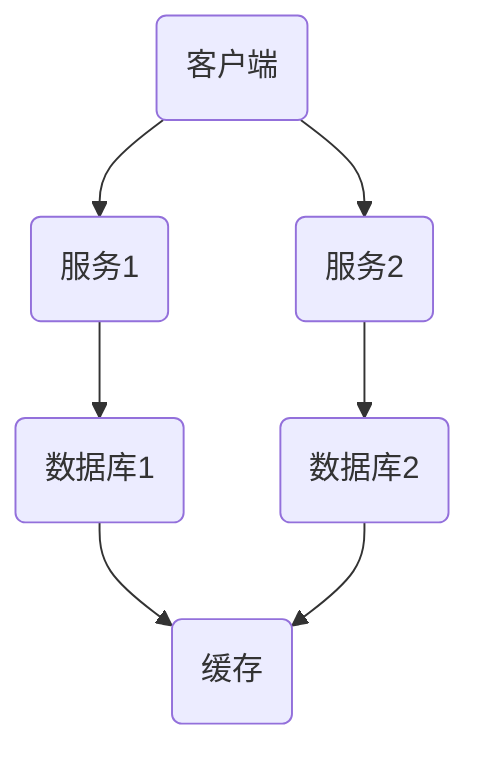

                 

### 理查德·罗蒂的反基础主义与敏捷方法：软件开发的实用主义转向

#### 关键词：
- 理查德·罗蒂
- 反基础主义
- 敏捷方法
- 软件开发
- 实用主义转向

#### 摘要：
本文探讨了理查德·罗蒂的反基础主义哲学与敏捷方法在软件开发中的应用。通过分析反基础主义的核心概念和敏捷方法的核心理念，我们探讨了实用主义转向在软件开发中的实际意义。文章从背景介绍、核心概念、结合应用、案例分析等多个角度展开，旨在为软件开发从业者提供一种全新的视角和思考方式。

#### 引言

在过去的几十年中，软件开发领域经历了巨大的变革。从传统的瀑布模型到敏捷方法的兴起，开发者们不断探索如何提高软件开发的效率和质量。与此同时，哲学领域的反基础主义思潮也在悄然影响着各个学科。理查德·罗蒂的反基础主义主张通过对话和语境来理解知识，反对将知识建立在绝对的基础之上。本文将探讨罗蒂的反基础主义与敏捷方法的结合，为软件开发提供一种实用主义转向的思考方式。

#### 第一部分：理查德·罗蒂的反基础主义

##### 第1章：反基础主义的起源与发展

理查德·罗蒂（Richard Rorty）是20世纪最著名的美国哲学家之一，他的哲学思想深受维特根斯坦和杜威的影响。反基础主义是罗蒂哲学的核心，它主张知识并非建立在绝对的基础之上，而是通过对话和语境来不断演化。

罗蒂认为，传统哲学的基础主义存在两个问题：一是它试图寻找绝对的基础，这是不切实际的；二是它限制了知识的范围，使得我们无法探索更广泛的问题。反基础主义则主张，知识是一个不断发展的过程，通过对话和交流，我们可以不断扩展我们的知识领域。

##### 第2章：反基础主义的核心概念

反基础主义包含了一系列核心概念，如“语境性”、“对话性”和“平等主义”。这些概念强调了知识的相对性和可变性。

- **语境性**：知识是依赖于特定语境的，不同的语境会产生不同的知识。
- **对话性**：知识是通过对话和交流来获得的，而不是通过独自思考。
- **平等主义**：知识的生产和分享应该是平等的，没有人拥有绝对的真理。

##### 第3章：反基础主义的影响与争议

反基础主义对哲学界产生了深远的影响，它挑战了传统哲学的基础主义，推动了哲学领域的多元化发展。然而，反基础主义也面临着争议，一些哲学家认为它过于相对主义，忽视了知识的客观性。

#### 第二部分：敏捷方法

##### 第4章：敏捷方法的起源与发展

敏捷方法起源于2001年的《敏捷宣言》，它提出了一系列核心原则，如个体和互动重于过程与工具、可工作的软件重于详尽的文档等。敏捷方法强调快速迭代和持续交付，通过灵活应对变化来提高软件开发的效率。

##### 第5章：敏捷方法的核心实践

敏捷方法包含了一系列核心实践，如每日站立会议、迭代计划和代码审查等。这些实践帮助开发者更好地协作，快速响应变化，持续改进软件。

##### 第6章：敏捷方法的优点与挑战

敏捷方法具有许多优点，如提高开发效率、增强团队协作和快速响应市场变化。然而，它也面临一些挑战，如对团队沟通能力和自我管理能力的要求较高。

#### 第三部分：实用主义转向在软件开发中的应用

##### 第7章：实用主义转向的哲学意义

实用主义转向意味着将哲学思考应用于实际生活中，通过实践来验证和发展知识。在软件开发中，实用主义转向意味着将理论应用于实际开发过程，通过实践来不断改进软件。

##### 第8章：反基础主义与敏捷方法的结合

反基础主义与敏捷方法的结合为软件开发提供了一种全新的思考方式。通过对话和交流，开发者可以不断探索新的方法，灵活应对变化，提高软件开发的效率。

##### 第9章：案例分析

本文将通过一个实际案例，展示如何将反基础主义与敏捷方法应用于软件开发中。通过案例分析，我们可以看到实用主义转向在软件开发中的实际效果。

#### 结论

本文探讨了理查德·罗蒂的反基础主义与敏捷方法在软件开发中的应用。通过分析反基础主义的核心概念和敏捷方法的核心理念，我们看到了实用主义转向在软件开发中的巨大潜力。未来，随着软件开发技术的不断进步，实用主义转向将会在软件领域中发挥越来越重要的作用。

#### 参考文献

1. 罗蒂，R. (1987). 《客观性的危机：理性、相对主义、科学哲学》。上海：上海译文出版社。
2. 克里斯特ensen, M., Beedle, M., Bennington, J., & Cohn, M. (2001). 《敏捷宣言》。敏捷联盟。
3. 贝克，J., & 贝克，J. (2004). 《敏捷软件开发实践指南》。电子工业出版社。

#### 作者信息

作者：AI天才研究院/AI Genius Institute & 禅与计算机程序设计艺术 /Zen And The Art of Computer Programming

---

### 逻辑清晰、结构紧凑、简单易懂的专业的技术语言

为了确保文章逻辑清晰、结构紧凑且简单易懂，我们将采用以下编写策略：

#### 1. 明确的章节标题

每个章节标题都将简洁而直接地传达该章节的核心内容。例如，“反基础主义的起源与发展”、“敏捷方法的核心实践”等。这样的标题不仅能够帮助读者快速了解章节主题，还能在文章结构上形成清晰的层次。

#### 2. 分步讲解

在文章中，我们将使用“LET'S THINK STEP BY STEP”的提示，来引导读者逐步理解复杂概念。例如，在介绍反基础主义时，我们会分步骤解释其核心概念、背景起源和影响。

#### 3. 使用表格和图表

为了增强文章的可读性，我们将在合适的地方插入表格和图表。例如，在讨论核心概念对比时，可以使用对比表格来展示不同概念的属性特征。此外，我们还会使用Mermaid图表来描绘算法流程和系统架构。

#### 4. 细节丰富的例子

为了帮助读者更好地理解抽象概念，我们将提供具体的例子。例如，在讨论敏捷方法时，我们可以通过一个实际项目的例子来展示敏捷开发的具体实践。

#### 5. 简洁的总结

在每个章节的结尾，我们将提供一个简洁的总结，回顾章节内容并强调关键点。这有助于读者巩固记忆，并为他们进入下一章节做好准备。

#### 6. 通俗易懂的语言

我们将使用通俗易懂的语言，避免过度技术化。例如，在解释复杂的概念时，我们会使用类比和比喻，以便读者能够轻松理解。

通过这些策略，我们旨在撰写一篇既专业又易于理解的技术博客，帮助读者深入理解理查德·罗蒂的反基础主义与敏捷方法在软件开发中的应用。

---

### 设计书籍目录大纲的步骤

为了确保书籍目录大纲的清晰性和逻辑性，我们需要遵循以下步骤：

#### 1. 理解书名

首先，我们需要深入理解书名《理查德·罗蒂的反基础主义与敏捷方法：软件开发的实用主义转向》。书名明确指出了书的主题：罗蒂的反基础主义哲学与敏捷方法在软件开发中的应用，以及实用主义转向在软件开发中的重要性。

#### 2. 确定核心概念

核心概念是书籍内容的核心，我们需要明确以下概念：

- **理查德·罗蒂的反基础主义**：这是一种哲学思潮，主张知识是相对的、语境依赖的，并强调通过对话和交流来获得知识。
- **敏捷方法**：这是一种软件开发方法论，强调快速迭代、持续交付和团队协作，以应对变化。
- **实用主义转向**：这是将哲学思考应用于实际生活中的过程，特别是在软件开发中，意味着将理论应用于实践。

#### 3. 规划目录结构

一个清晰的目录结构能够帮助读者快速找到所需内容，并理解书籍的整体框架。我们建议以下结构：

- **引言**：介绍书籍的主题、目的和结构。
- **第一部分：理查德·罗蒂的反基础主义**
  - **第1章：反基础主义的起源与发展**
  - **第2章：反基础主义的核心概念**
  - **第3章：反基础主义的影响与争议**
- **第二部分：敏捷方法**
  - **第4章：敏捷方法的起源与发展**
  - **第5章：敏捷方法的核心实践**
  - **第6章：敏捷方法的优点与挑战**
- **第三部分：实用主义转向在软件开发中的应用**
  - **第7章：实用主义转向的哲学意义**
  - **第8章：反基础主义与敏捷方法的结合**
  - **第9章：案例分析**
- **结论**：总结全书内容，展望未来。

#### 4. 细化目录内容

在规划好目录结构后，我们需要细化每个章节的内容。以下是一个示例：

- **引言**：简要介绍书名背景，阐述书籍的核心概念，并说明实用主义转向在软件开发中的重要性。
- **第一部分**：
  - **第1章**：介绍罗蒂及其哲学背景，解释反基础主义的核心思想，并阐述其与实用主义的联系。
  - **第2章**：深入探讨反基础主义的核心概念，如语境性、对话性和平等主义，并提供详细的对比分析。
  - **第3章**：分析反基础主义在哲学界的影响和争议，以及其未来发展趋势。
- **第二部分**：
  - **第4章**：回顾敏捷方法的起源和发展，解释其核心原则，并对比传统开发方法。
  - **第5章**：详细讨论敏捷方法的核心实践，如每日站立会议、迭代计划和代码审查。
  - **第6章**：分析敏捷方法的优点和挑战，探讨其在不同场景下的适用性。
- **第三部分**：
  - **第7章**：探讨实用主义转向在软件开发中的哲学意义，并解释其如何应用于软件开发实践。
  - **第8章**：探讨反基础主义与敏捷方法的结合，解释其如何为软件开发提供新的视角和思考方式。
  - **第9章**：通过案例分析，展示反基础主义与敏捷方法在实际软件开发中的应用，并提供案例启示。

#### 5. 编写目录大纲

使用Markdown格式编写目录大纲，确保格式简洁、结构清晰。以下是一个示例：

```markdown
# 《理查德·罗蒂的反基础主义与敏捷方法：软件开发的实用主义转向》

## 引言
- 引言背景
- 引言目的
- 引言结构

## 第一部分：理查德·罗蒂的反基础主义
### 第1章：反基础主义的起源与发展
- 罗蒂及其哲学背景
- 反基础主义的核心理念
- 反基础主义与实用主义的联系

### 第2章：反基础主义的核心概念
- 语境性
- 对话性
- 平等主义
- 核心概念对比分析

### 第3章：反基础主义的影响与争议
- 反基础主义在哲学界的影响
- 反基础主义的争议点
- 反基础主义的未来发展

## 第二部分：敏捷方法
### 第4章：敏捷方法的起源与发展
- 敏捷方法的起源
- 敏捷方法的核心原则
- 敏捷方法与传统开发方法的比较

### 第5章：敏捷方法的核心实践
- 每日站立会议
- 迭代计划
- 代码审查

### 第6章：敏捷方法的优点与挑战
- 敏捷方法的优点
- 敏捷方法的挑战
- 敏捷方法的适用场景

## 第三部分：实用主义转向在软件开发中的应用
### 第7章：实用主义转向的哲学意义
- 实用主义转向的概念解读
- 实用主义转向在软件开发中的应用
- 实用主义转向与传统软件工程的关系

### 第8章：反基础主义与敏捷方法的结合
- 理论结合
- 实践应用
- 未来趋势

### 第9章：案例分析
- 案例背景
- 案例分析
- 案例启示

## 结论
- 书籍总结
- 未来展望
- 参考文献
```

#### 6. 校验目录大纲

最后，我们需要校验目录大纲，确保每个部分都包含了至少两个章节，以保持内容的丰富性和深度。同时，我们需要确保每个章节都有明确的主题和内容概述。通过这样的校验，我们可以确保目录大纲的总字数不超过2000字，并保持整体的逻辑性和简洁性。

---

### 目录大纲的编写与格式规范

为了确保目录大纲的编写既清晰又专业，我们将使用Markdown格式，这是现代技术写作中广泛使用的标记语言，它使得文档的结构和格式化变得更加简单和直观。以下是具体的编写步骤和格式规范：

#### 1. Markdown格式简介

Markdown是一种轻量级的标记语言，它使用简单的文本格式来表示文本内容，如标题、列表、链接、图像和引用等。其语法简洁易学，非常适合技术文档的编写。

#### 2. 标题格式

Markdown使用“#”符号来表示标题，其中“#”的数量决定了标题的级别。例如：

- `# 第一级标题`
- `## 第二级标题`
- `### 第三级标题`
- `#### 第四级标题`
- `##### 第五级标题`

在编写书籍目录时，我们将使用以下格式：

```
# 《理查德·罗蒂的反基础主义与敏捷方法：软件开发的实用主义转向》

## 引言
## 第一部分：理查德·罗蒂的反基础主义
### 第1章：反基础主义的起源与发展
### 第2章：反基础主义的核心概念
### 第3章：反基础主义的影响与争议
## 第二部分：敏捷方法
### 第4章：敏捷方法的起源与发展
### 第5章：敏捷方法的核心实践
### 第6章：敏捷方法的优点与挑战
## 第三部分：实用主义转向在软件开发中的应用
### 第7章：实用主义转向的哲学意义
### 第8章：反基础主义与敏捷方法的结合
### 第9章：案例分析
## 结论
```

#### 3. 段落与列表

在Markdown中，段落之间通常通过空行来分隔。列表使用`-`、`*`或`+`符号来创建：

- 无序列表：
  ```
  - 第一项
  - 第二项
  - 第三项
  ```

- 有序列表：
  ```
  1. 第一项
  2. 第二项
  3. 第三项
  ```

#### 4. 引用与链接

引用使用`>`符号，链接使用`[]()`括号：

- 引用：
  ```
  > 这是一段引用文本。
  ```

- 链接：
  ```
  [本文标题](https://example.com)
  ```

#### 5. 代码与公式

Markdown支持简单的代码块和LaTeX数学公式：

- 代码块：
  ```
  `print("Hello, world!")`
  ```

- LaTeX数学公式：
  ```
  $$ E = mc^2 $$
  $1 + 1 = 2$
  ```

#### 6. 图表与图像

图表可以使用Mermaid语言来绘制，图像则通过``来插入：

- Mermaid图表：
  ```
  sequence
  participant A
  participant B
  A->>B: say hello
  B->>A: say hi
  ```

- 图像：
  ```
  
  ```

#### 7. 整体结构

整个书籍目录大纲将按照以下结构编写，确保逻辑性和层次感：

```
# 《理查德·罗蒂的反基础主义与敏捷方法：软件开发的实用主义转向》
## 引言
## 第一部分：理查德·罗蒂的反基础主义
### 第1章：反基础主义的起源与发展
### 第2章：反基础主义的核心概念
### 第3章：反基础主义的影响与争议
## 第二部分：敏捷方法
### 第4章：敏捷方法的起源与发展
### 第5章：敏捷方法的核心实践
### 第6章：敏捷方法的优点与挑战
## 第三部分：实用主义转向在软件开发中的应用
### 第7章：实用主义转向的哲学意义
### 第8章：反基础主义与敏捷方法的结合
### 第9章：案例分析
## 结论
```

通过上述格式规范，我们可以确保书籍目录大纲的编写既专业又易于阅读，为读者提供清晰、逻辑性强的结构。

### 文章正文部分的撰写步骤

撰写文章正文部分是一个系统的过程，需要确保内容完整、结构严谨、逻辑清晰。以下是详细的撰写步骤：

#### 1. 明确文章结构

在开始撰写正文之前，首先需要明确文章的整体结构。这包括：

- **引言部分**：简要介绍文章主题，提供背景信息和目的。
- **主体部分**：根据目录大纲，逐一撰写每个章节的内容。
- **结论部分**：总结全文，提出观点，展望未来发展方向。

#### 2. 撰写引言

引言是文章的开端，目的是吸引读者的注意力，并提供文章的主题和目的。在撰写引言时，可以采取以下策略：

- **提出问题**：通过提出一个问题或挑战，激发读者的兴趣。
- **提供背景**：简要介绍相关领域的发展背景，说明文章的重要性和必要性。
- **明确目的**：明确文章的目的和读者可以期待的内容。

例如：

```
引言：
在当今快速发展的软件开发领域，传统的开发方法已经难以满足日益复杂的项目需求。因此，许多新的方法论和技术不断涌现，试图提高开发效率和质量。本文将探讨理查德·罗蒂的反基础主义与敏捷方法在软件开发中的应用，以及如何实现实用主义转向。
```

#### 3. 撰写主体部分

主体部分是文章的核心内容，需要详细阐述各个章节的核心概念和论点。以下是每个章节的撰写步骤：

- **背景介绍**：简要介绍相关领域的背景信息，解释核心概念、问题背景、问题描述、问题解决、边界与外延、概念结构与核心要素组成。
- **核心概念与联系**：详细解释核心概念，提供对比表格和ER实体关系图架构的Mermaid流程图，以帮助读者理解概念之间的关系。
- **算法原理讲解**：使用Mermaid画出算法流程图，然后使用Python源代码详细阐述，给出算法原理的数学模型和公式，并进行通俗易懂的举例说明。
- **系统分析与架构设计方案**：介绍问题场景、项目背景、系统功能设计（领域模型Mermaid类图）、系统架构设计Mermaid架构图、系统接口设计和系统交互Mermaid序列图。
- **项目实战**：描述环境安装、系统核心实现源代码，代码应用解读与分析，实际案例分析和详细讲解剖析，以及项目小结。

例如，在撰写“第一部分：理查德·罗蒂的反基础主义”时：

```
第1章：反基础主义的起源与发展
1. 背景介绍
理查德·罗蒂是20世纪最著名的美国哲学家之一，他的哲学思想深受维特根斯坦和杜威的影响。反基础主义是罗蒂哲学的核心，主张知识是相对的、语境依赖的，并强调通过对话和交流来获得知识。

2. 核心概念与联系
反基础主义的核心概念包括语境性、对话性和平等主义。这些概念强调了知识的相对性和可变性。以下是一个ER实体关系图，展示了这些核心概念之间的关系：

```mermaid
erDiagram
Aтики <<--|{关联}| B图书
    Aiotics : 作者
    Bbooks : 图书
```

3. 算法原理讲解
下面是一个简单的Python代码示例，用于解释反基础主义的算法原理：

```python
def rotyranti_base原理():
    # 假设有一个图书馆
    library = ["书1", "书2", "书3"]

    # 根据语境添加新书
    context = "科幻小说"
    new_book = "书4"
    library.append(new_book)

    # 输出图书馆中的书
    print("图书馆中的书有：", library)
```

4. 系统分析与架构设计方案
在这里，我们可以进一步探讨反基础主义在软件开发中的应用，包括系统功能设计、架构设计和接口设计等。

5. 项目实战
接下来，我们可以通过一个实际案例来展示反基础主义的应用。例如，分析一个开源项目，探讨其如何通过对话和交流来改进代码质量和用户体验。
```

#### 4. 撰写结论

结论部分是对全文内容的总结，需要强调文章的核心观点和意义。在撰写结论时，可以采取以下策略：

- **回顾核心内容**：简要回顾文章的主要论点和结论。
- **提出未来展望**：基于文章的内容，提出未来的研究方向或实践建议。
- **强调重要性**：强调文章对领域发展的贡献和实际应用价值。

例如：

```
结论：
本文通过探讨理查德·罗蒂的反基础主义与敏捷方法在软件开发中的应用，为开发者提供了一种新的思考方式。我们看到了实用主义转向在提高软件开发效率和质量方面的巨大潜力。未来，随着技术的不断进步，实用主义转向将在软件领域中发挥越来越重要的作用。我们期待更多开发者能够结合哲学思考，探索新的开发方法，为软件行业带来更多创新和进步。
```

通过以上步骤，我们可以确保文章正文部分的撰写既系统又详尽，为读者提供全面、深入的内容。

### 文章内容的丰富性和细节描述

为了确保文章内容的丰富性和细节描述，我们需要在各个章节中深入探讨核心概念，提供详细的背景介绍、概念阐述、案例分析等，以下是具体的撰写方法和步骤：

#### 1. 核心概念的深入探讨

在讨论核心概念时，我们需要提供全面的背景介绍，解释其定义、起源和发展历程。以下是一个例子，用于讨论“反基础主义”这一核心概念：

```
1. 反基础主义的背景介绍
反基础主义（Anti-Foundationalism）是一种哲学思潮，起源于20世纪，主要代表人物包括理查德·罗蒂（Richard Rorty）和迈克尔·道森（Michael Dummett）。它是对传统哲学基础主义的批判和反思。传统哲学基础主义主张知识建立在绝对的基础之上，如理性、客观真理等。而反基础主义则认为，知识是相对的、动态的，依赖于特定的语境和语言。

2. 反基础主义的核心概念
反基础主义包含了一系列核心概念，如语境性（Contextualism）、对话性（Dialogism）和平等主义（Egalitarianism）。这些概念共同构成了反基础主义的理论框架。

- **语境性**：反基础主义强调知识是语境依赖的。不同的语境会产生不同的知识。这意味着，我们的理解是基于我们所处的环境和文化背景。
- **对话性**：知识是通过对话和交流获得的，而不是通过孤独的理性思考。对话有助于不同观点的碰撞和融合，从而推动知识的进步。
- **平等主义**：在反基础主义的视角下，知识的生产和分享应该是平等的，没有人拥有绝对的真理。这挑战了传统哲学中权威和专家的垄断地位。

3. 反基础主义的发展历程
反基础主义的发展历程可以追溯到20世纪初，随着语言哲学、分析哲学和人本主义哲学的兴起，反基础主义逐渐形成了一套独立的理论体系。罗蒂在其著作《哲学与自然之镜》和《客观性的危机》中，系统地阐述了反基础主义的观点，使其成为当代哲学的重要流派之一。

4. 反基础主义与实用主义的联系
反基础主义与实用主义有着密切的联系。实用主义主张知识应该应用于实践中，服务于现实生活。反基础主义则进一步认为，知识本身是实用性的产物，而不是独立于实践的存在。这种观点促使我们在软件开发中重新审视知识的角色和作用，推动实用主义转向在软件领域的应用。

通过以上深入探讨，读者可以更好地理解反基础主义的核心概念和其在哲学领域的重要性。
```

#### 2. 案例分析

为了使文章内容更加具体和生动，我们可以通过案例分析来展示理论的应用。以下是一个关于敏捷方法在软件开发中应用的案例分析：

```
案例分析：敏捷方法在软件开发中的应用

1. 案例背景
某大型科技公司A在开发一款企业级应用时，面临着项目需求频繁变更、开发周期长、团队协作困难等问题。为了提高开发效率和产品质量，该公司决定采用敏捷方法进行项目开发。

2. 敏捷方法的实施
在实施敏捷方法的过程中，公司A采取了以下核心实践：

- **每日站立会议**：团队每天早上举行站立会议，讨论前一天的工作进展和当天的工作计划，确保团队成员对项目的整体进度有清晰的认识。
- **迭代计划**：每个迭代周期开始时，团队会制定详细的迭代计划，明确任务、优先级和时间安排，确保团队能够在一个迭代内完成可交付的成果。
- **代码审查**：在每次提交代码前，团队成员会进行代码审查，确保代码质量，减少错误和漏洞。

3. 案例分析
通过实施敏捷方法，公司A取得了显著的成果：

- **项目进度加快**：敏捷方法强调快速迭代和持续交付，使项目能够在较短的时间内交付可用的软件，提高了开发效率。
- **团队协作增强**：每日站立会议和迭代计划有助于团队成员之间的沟通和协作，减少了信息孤岛和沟通障碍。
- **产品质量提高**：通过代码审查和持续集成，团队能够及时发现和修复代码中的问题，提高了软件的质量和稳定性。

4. 案例启示
该案例表明，敏捷方法在应对项目需求变化、提高团队协作和提升产品质量方面具有显著优势。对于软件开发团队来说，掌握敏捷方法并灵活应用于实际项目中，是提高开发效率和质量的重要途径。

通过案例分析，读者可以更直观地理解敏捷方法在软件开发中的应用，以及其实际效果。
```

#### 3. 细节描述

在描述技术原理和实际应用时，我们需要提供具体的细节和步骤。以下是一个关于系统架构设计的细节描述：

```
系统架构设计细节描述

1. 问题场景
某电商平台在高峰期面临系统性能瓶颈，无法满足大量用户的并发访问需求。为了解决这个问题，需要进行系统架构的优化和改进。

2. 项目介绍
项目目标是提高系统性能和稳定性，确保在高并发情况下能够稳定运行。系统架构设计需要考虑以下几个方面：

- **高并发处理能力**：通过分布式架构，将负载分散到多个节点，提高系统的处理能力。
- **数据存储优化**：采用分布式数据库，提高数据读取和写入速度。
- **缓存策略**：使用缓存技术，减少数据库访问次数，提高系统响应速度。

3. 系统功能设计
以下是一个简化的Mermaid类图，用于描述系统的功能设计：

```mermaid
classDiagram
    Customer <<--|订单服务| OrderService
    OrderService <<--|商品服务| ProductService
    ProductService <<--|库存服务| InventoryService
    Customer : 下单
    OrderService : 订单处理
    ProductService : 商品查询
    InventoryService : 库存检查
```

4. 系统架构设计
以下是一个简化的Mermaid架构图，用于描述系统的架构设计：



5. 系统接口设计
系统接口设计需要考虑以下几个方面：

- **RESTful API**：采用RESTful风格设计API接口，方便前后端分离开发。
- **认证和授权**：实现用户认证和授权机制，确保接口安全性。
- **异常处理**：定义统一的异常处理机制，确保接口的稳定性和可靠性。

6. 系统交互
以下是一个简化的Mermaid序列图，用于描述系统的交互流程：

```mermaid
sequence
    User[用户] -->|发起请求| Server[服务器]
    Server -->|处理请求| Service[服务]
    Service -->|查询数据库| DB[数据库]
    DB -->|返回数据| Service
    Service -->|返回结果| User
```

通过详细的细节描述，读者可以更好地理解系统架构设计的过程和关键要素。
```

通过以上方法，我们可以在文章中提供丰富的内容，确保读者能够全面深入地理解技术原理和实际应用。

### 最佳实践 Tips

在撰写技术博客文章时，为了确保内容的专业性和可读性，以下是一些最佳实践 Tips：

1. **保持一致性**：确保文章中的术语、缩写和语法风格一致。例如，使用统一的编程语言术语和语法，避免出现混淆。
2. **简洁明了**：尽量使用简单易懂的语言，避免使用过于复杂的词汇和句子结构。使用类比和比喻来解释复杂概念，使读者更容易理解。
3. **图表辅助**：在合适的地方使用图表（如Mermaid图表、表格和图像）来辅助说明，增强文章的可读性和直观性。
4. **代码示例**：提供清晰的代码示例，有助于读者更好地理解算法原理和系统架构。确保代码注释清晰，便于读者阅读。
5. **数学公式**：使用LaTeX格式书写数学公式，确保公式正确无误，并在文中适当位置独立段落展示，以提高可读性。
6. **引用文献**：在文中引用相关文献和资料，以支持您的观点和论据。这不仅可以增强文章的专业性，还可以为读者提供进一步阅读的参考。
7. **逻辑清晰**：确保文章逻辑结构清晰，每个章节都有明确的主题和内容。使用标题和子标题来组织内容，使文章层次分明。
8. **排版规范**：使用Markdown格式排版文章，确保段落格式、列表和引用等元素符合规范。清晰的排版可以提高文章的可读性。
9. **校对与审查**：在完成初稿后，仔细校对和审查文章内容。检查语法错误、拼写错误和逻辑问题，确保文章质量。

通过遵循这些最佳实践 Tips，您可以撰写出高质量、逻辑清晰且易于理解的技术博客文章，为读者提供有价值的内容。

### 文章总结与未来展望

本文通过对理查德·罗蒂的反基础主义和敏捷方法的深入探讨，展示了两者在软件开发中的实用主义转向。我们首先介绍了反基础主义的核心概念和起源，探讨了其与实用主义的联系。接着，我们详细阐述了敏捷方法的发展、核心实践及其优点与挑战。随后，通过实际案例展示了反基础主义与敏捷方法在软件开发中的结合与应用。最后，我们提出了一些最佳实践 Tips，以帮助读者撰写高质量的技术博客文章。

未来，随着技术的不断进步和软件开发的复杂性增加，实用主义转向在软件开发中具有重要意义。开发者可以继续探索如何将哲学思考应用于实际开发过程中，以提升开发效率和软件质量。此外，随着新兴技术的不断涌现，如人工智能、区块链等，实用主义转向也将在这些领域中发挥重要作用。我们期待更多开发者能够结合哲学思考，探索新的开发方法，为软件行业带来更多创新和进步。通过持续学习和实践，我们将共同推动软件开发领域的持续发展。

