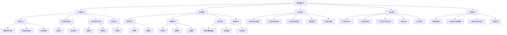

                 

# 生命与逻辑：柏格森与维特根斯坦哲学的核心关切

> 关键词：柏格森，维特根斯坦，哲学，生命，逻辑

> 摘要：本文将深入探讨柏格森哲学和维特根斯坦哲学的核心关切，通过分析两者的核心理念、主要观点及其相互关系，旨在揭示生命与逻辑在哲学领域的深刻内涵和影响。

**目录大纲**

----------------------------------------------------------------

## 第1章：柏格森哲学概述

### 1.1 柏格森哲学的起源与发展

### 1.2 生命哲学的基本概念

### 1.3 柏格森对直觉与意识的阐述

## 第2章：柏格森的生命哲学

### 2.1 生命的本质与动力

#### 2.1.1 生命的流动性

#### 2.1.2 生命的内在节奏

#### 2.1.3 生命的内在进化

## 第3章：柏格森的时间观念

### 3.1 时间与生命的关联

#### 3.1.1 直觉时间

#### 3.1.2 物理时间

#### 3.1.3 时间意识

## 第4章：柏格森的社会哲学

### 4.1 社会的本质与演变

#### 4.1.1 社会的历史发展

#### 4.1.2 社会的结构功能

#### 4.1.3 社会的价值观念

## 第5章：柏格森的艺术哲学

### 5.1 艺术的本质与价值

#### 5.1.1 艺术的生命力

#### 5.1.2 艺术的直觉性

#### 5.1.3 艺术与社会的互动

## 第6章：柏格森的宗教哲学

### 6.1 宗教与生命的关联

#### 6.1.1 宗教的起源

#### 6.1.2 宗教对生命的解释

#### 6.1.3 宗教对社会的意义

## 第7章：柏格森哲学的影响与评价

### 7.1 柏格森哲学的现代意义

#### 7.1.1 对科学的影响

#### 7.1.2 对哲学的影响

#### 7.1.3 对文学艺术的影响

### 7.2 柏格森哲学的争议与反思

#### 7.2.1 生命哲学的局限性

#### 7.2.2 时间观念的争议

#### 7.2.3 社会哲学的批评

## 第8章：维特根斯坦哲学概述

### 8.1 维特根斯坦的生平与哲学发展

### 8.2 分析哲学的基本概念

### 8.3 语言哲学的重要性

## 第9章：维特根斯坦的语言哲学

### 9.1 命名与逻辑形式

#### 9.1.1 命名的基本原理

#### 9.1.2 逻辑形式的分析

#### 9.1.3 语言游戏的分类

## 第10章：维特根斯坦的数学哲学

### 10.1 数学的基础与形式

#### 10.1.1 数学的基础概念

#### 10.1.2 形式化的数学方法

#### 10.1.3 数学与逻辑的关系

## 第11章：维特根斯坦的哲学方法

### 11.1 哲学问题与解决策略

#### 11.1.1 哲学问题的定义

#### 11.1.2 哲学分析的步骤

#### 11.1.3 语言哲学的分析方法

## 第12章：柏格森与维特根斯坦哲学的相互关系

### 12.1 生命与逻辑的交集

#### 12.1.1 生命哲学与语言哲学的比较

#### 12.1.2 时间观念的融合

#### 12.1.3 哲学方法的应用

## 第13章：柏格森与维特根斯坦哲学的影响与反思

### 13.1 哲学思想的现代意义

#### 13.1.1 对科学技术的影响

#### 13.1.2 对社会文化的影响

#### 13.1.3 对未来哲学的启示

### 13.2 哲学争议与反思

#### 13.2.1 生命哲学的局限性

#### 13.2.2 语言哲学的批判

#### 13.2.3 哲学思想的评价

----------------------------------------------------------------

## 第1章：柏格森哲学概述

### 1.1 柏格森哲学的起源与发展

亨利·柏格森（Henri Bergson）是20世纪初法国著名的哲学家，他的哲学体系被称为“生命哲学”或“直觉主义哲学”。柏格森哲学起源于对生命、时间、直觉等概念的深入探讨，强调生命的流动性和内在节奏。

柏格森哲学的发展可以分为两个阶段：早期的直觉主义和晚期的时间哲学。早期直觉主义强调直觉在理解和把握生命本质中的关键作用，晚期时间哲学则进一步探讨时间与生命的关联，提出了直觉时间和物理时间的对立。

### 1.2 生命哲学的基本概念

生命哲学是柏格森哲学的核心，主要关注生命的本质、动力和内在节奏。柏格森认为，生命是一种持续不断的流动过程，这种流动是由内在的动力驱动的。

柏格森提出了“生命冲动”（élan vital）的概念，即生命的内在动力。他认为，这种动力是生命现象的根源，是生命不断进化和发展的动力。

此外，柏格森还强调了生命的内在节奏，即生命过程中的周期性和规律性。他认为，生命的节奏不仅体现在生物体的生理活动中，也体现在社会、文化和历史的发展中。

### 1.3 柏格森对直觉与意识的阐述

柏格森认为，直觉是理解和把握生命本质的关键。他提出了“直觉主义”的概念，即通过直觉来感知和理解现实世界。

柏格森认为，直觉不同于理性思考和逻辑推理，它是一种直接的、非理性的感知方式。直觉能够捕捉到生命的流动性和内在节奏，从而更好地理解生命的本质。

同时，柏格森还探讨了意识与直觉的关系。他认为，意识是直觉的高级形式，是通过理性思考和逻辑推理来对直觉进行反思和总结。

### 总结

柏格森哲学的核心理念包括生命哲学、直觉主义和时间观念。生命哲学强调生命的流动性和内在节奏，直觉主义认为直觉是理解和把握生命本质的关键，时间观念则提出了直觉时间和物理时间的对立。

通过分析柏格森哲学的起源与发展、基本概念以及直觉与意识的阐述，我们可以更好地理解柏格森哲学的核心关切。在接下来的章节中，我们将进一步探讨柏格森的生命哲学、时间观念、社会哲学、艺术哲学和宗教哲学。

## 第2章：柏格森的生命哲学

### 2.1 生命的本质与动力

柏格森的生命哲学围绕着“生命冲动”（élan vital）这一核心概念展开。他认为，生命的本质是一种内在的、持续不断的动力，这种动力是生命现象的根源，是生命不断进化和发展的动力。

柏格森将生命冲动视为一种纯粹的精神力量，它是生命活动的驱动力，而非物理过程。这种力量不是静态的，而是一种持续不断的流动，这种流动使得生命得以维持和进化。

柏格森认为，生命冲动具有以下几个特点：

1. **非机械性**：生命冲动不是机械性的，它不能通过物理定律来解释。生命的流动性和内在节奏是机械性所无法捕捉的。
   
2. **个体性**：生命冲动在每个生物体中都表现出独特的个体性。每个生命体都有其独特的生命冲动，这使得生命现象丰富多样。

3. **不可预测性**：由于生命冲动是动态的，因此生命过程具有不可预测性。生命的进化和发展往往出乎意料，这是机械性所无法实现的。

### 2.1.1 生命的流动性

柏格森认为，生命的流动性是生命哲学的核心特征。生命的流动性表现在生命体的形态、功能和行为上。例如，生物体的生长、发育和繁殖都是生命流动性的体现。

柏格森提出了“生命流”（flux de vie）的概念，即生命的流动状态。他认为，生命流是一种连续的过程，没有开始也没有结束。生命流不断地向前流动，新的生命形式不断地产生。

这种流动性使得生命具有适应性。生命体能够适应环境的变化，不断进化和发展。例如，物种的进化就是生命流动性的体现。

### 2.1.2 生命的内在节奏

柏格森强调了生命的内在节奏。他认为，生命的内在节奏是生命活动的驱动力。这种节奏不仅体现在生物体的生理活动中，也体现在社会、文化和历史的发展中。

生命的内在节奏表现为周期性和规律性。例如，植物的生长周期、动物的繁殖周期等都是生命内在节奏的体现。这种节奏使得生命活动有序进行，有助于生命的维持和进化。

### 2.1.3 生命的内在进化

柏格森认为，生命的进化是一种内在的过程。生命的进化不是通过外界力量的干预，而是通过生命自身的内在动力实现的。

生命的进化表现在生命体结构的复杂化和功能的专业化。随着生命的进化，生命体逐渐发展出更复杂的结构和更专业的功能。例如，多细胞生物的出现、生物器官的分工等都是生命进化的体现。

柏格森认为，生命的内在进化是生命流动性的结果。生命的流动性使得生命体能够适应环境的变化，不断进化和发展。

### 总结

柏格森的生命哲学强调生命的本质、动力、流动性和内在节奏。生命的流动性是生命哲学的核心特征，它使得生命具有适应性和进化能力。生命的内在节奏是生命活动的驱动力，它有助于生命的维持和进化。通过分析生命的本质与动力，我们可以更好地理解生命的进化过程。

在接下来的章节中，我们将进一步探讨柏格森的时间观念、社会哲学、艺术哲学和宗教哲学。

## 第3章：柏格森的时间观念

### 3.1 时间与生命的关联

柏格森的时间观念是他在哲学体系中非常重要的一个部分。他提出了“直觉时间”（durée）和“物理时间”（temps）的概念，并对两者进行了深入的探讨。

柏格森认为，时间与生命有着密切的关联。他强调，时间不是一种均匀流逝的量，而是一种生命的体验。时间是生命的节奏和流动性的体现，它与生命的过程密切相关。

### 3.1.1 直觉时间

直觉时间是指生命体的直接体验和时间的感觉。柏格森认为，直觉时间是真实的、直接的时间，它是生命流动性的反映。

直觉时间具有以下几个特点：

1. **非线性**：直觉时间不是均匀的，而是非线性的。生命过程中的高峰和低谷、快慢节奏都体现在直觉时间中。

2. **主观性**：直觉时间是个体主观体验的时间，每个人的直觉时间都是不同的。直觉时间受到个体生命体验和感知的影响。

3. **持续性**：直觉时间是持续不断的，它没有开始也没有结束。直觉时间的持续性体现了生命的连续性和流动性。

### 3.1.2 物理时间

物理时间是指科学家通过实验和观察所测量的时间。柏格森认为，物理时间是一种抽象的、均匀的时间概念，它是直觉时间的近似和量化。

物理时间具有以下几个特点：

1. **均匀性**：物理时间是均匀流逝的，它不考虑生命体验的主观感受。

2. **客观性**：物理时间是客观的，它是科学研究和实验的基础。

3. **离散性**：物理时间是通过实验和观察得到的，它通常是离散的，如秒、分钟、小时等。

### 3.1.3 时间意识

柏格森认为，时间意识是直觉时间和物理时间的交汇点。时间意识是人们感知和体验时间的方式，它既受到直觉时间的影响，也受到物理时间的制约。

时间意识具有以下几个特点：

1. **主观与客观的融合**：时间意识是主观体验和客观测量的结合，它既包含直觉时间的非线性特征，也包含物理时间的均匀性特征。

2. **认知功能**：时间意识是人类认知功能的一部分，它帮助人们理解和体验时间。

3. **文化差异**：不同文化背景下的人们对时间意识的理解和体验可能会有所不同，这反映了文化的多样性和复杂性。

### 总结

柏格森的时间观念强调了直觉时间和物理时间的区别与联系。他认为，直觉时间是生命体验的真实时间，物理时间是科学的测量时间。时间意识是直觉时间和物理时间的交汇点，它既包含主观体验，也包含客观测量。通过分析时间与生命的关联，我们可以更好地理解生命的流动性和内在节奏。

在接下来的章节中，我们将进一步探讨柏格森的社会哲学、艺术哲学和宗教哲学。

## 第4章：柏格森的社会哲学

### 4.1 社会的本质与演变

柏格森的社会哲学关注社会的本质、演变和发展。他认为，社会是一个有机整体，它由个体和集体共同构成。社会的本质是生命的延续和进化，是生命流动性的体现。

柏格森提出了“社会流”（flux social）的概念，即社会的动态过程。他认为，社会流是生命的流动性在社会层面的体现，它反映了社会的演变和发展。

### 4.1.1 社会的历史发展

柏格森认为，社会的历史发展是一个动态的过程，它受到生命冲动的驱动。社会的演变表现为以下几个方面：

1. **从原始社会到文明社会**：柏格森认为，人类社会从原始社会向文明社会的发展是一个自然的过程。原始社会以自然生命为主，文明社会则以文化生命为主。

2. **从封建社会到资本主义社会**：柏格森认为，封建社会和资本主义社会是人类社会发展的两个阶段。封建社会以土地和权力为中心，资本主义社会则以经济和市场为中心。

3. **从物质文明到精神文明**：柏格森认为，人类社会的发展从物质文明向精神文明转变。物质文明注重物质生产和消费，精神文明注重精神追求和文化积累。

### 4.1.2 社会的结构功能

柏格森认为，社会的结构功能是生命冲动的体现。社会由个体和集体构成，个体和集体之间相互作用，共同维持社会的运行。

1. **个体的作用**：个体是社会的基石，每个个体都有其独特的生命冲动。个体的生命冲动汇聚成社会的整体活力。

2. **集体的作用**：集体是社会的整体，它反映了社会的生命流。集体通过规范、文化和价值观来引导和调节个体的行为。

3. **社会结构**：柏格森认为，社会结构是动态的，它随着社会的演变而不断变化。社会结构的功能是维持社会的稳定和持续发展。

### 4.1.3 社会的价值观念

柏格森认为，社会的价值观念是生命哲学的体现。他提出了以下几个核心价值观：

1. **自由**：柏格森认为，自由是生命的本质，是每个人应有的权利。自由不是无限制的，而是在社会规范的框架内实现的。

2. **创造力**：柏格森认为，创造力是生命的活力和动力。社会的价值观念应该鼓励创新和创造，推动社会的进步和发展。

3. **和谐**：柏格森认为，和谐是社会的基本价值观念。社会应该追求个体与集体、物质与精神、现实与理想的和谐。

### 总结

柏格森的社会哲学关注社会的本质、演变和发展。他认为，社会是一个有机整体，由个体和集体构成。社会的历史发展是一个动态的过程，受到生命冲动的驱动。社会的结构功能是生命冲动的体现，社会的价值观念是生命哲学的体现。通过分析社会的本质与演变，我们可以更好地理解社会的生命力和发展方向。

在接下来的章节中，我们将进一步探讨柏格森的艺术哲学和宗教哲学。

## 第5章：柏格森的艺术哲学

### 5.1 艺术的本质与价值

柏格森的艺术哲学强调艺术的本质和价值。他认为，艺术是生命冲动的一种表现形式，是生命流动性的体现。艺术不仅具有审美价值，还具有认知价值和道德价值。

### 5.1.1 艺术的生命力

柏格森认为，艺术的生命力源于生命的流动性和内在节奏。艺术作品通过形式和内容的有机结合，表现出生命的流动和变化。

1. **形式**：艺术的形式是生命流动性的体现。形式不是固定的，而是动态的、变化的。艺术家通过形式的变化，捕捉生命的流动。

2. **内容**：艺术的内容是生命的内在节奏的体现。艺术作品通过表现生命的内在节奏，传达出生命的丰富和多样性。

### 5.1.2 艺术的直觉性

柏格森认为，艺术的直觉性是理解和欣赏艺术的关键。直觉是艺术家创作的源泉，也是观众欣赏的途径。

1. **直觉的概念**：直觉是一种直接的、非理性的感知方式。它能够捕捉到生命的流动性和内在节奏，从而更好地理解生命的本质。

2. **直觉在艺术中的作用**：艺术家通过直觉感知生命，将其转化为艺术形式。观众通过直觉欣赏艺术，感受生命的流动和变化。

### 5.1.3 艺术与社会的互动

柏格森认为，艺术与社会有着密切的互动关系。艺术不仅反映社会，还影响社会。

1. **艺术与社会的关系**：艺术是社会的一面镜子，反映了社会的精神面貌和价值观。同时，艺术对社会具有引导和影响作用，能够推动社会的进步和发展。

2. **艺术对社会的影响**：艺术能够激发人们的创造力，推动社会的创新和发展。艺术能够提高人们的审美水平，丰富人们的精神世界。

### 总结

柏格森的艺术哲学强调艺术的本质和价值，认为艺术是生命冲动和直觉的体现。艺术通过形式和内容表现出生命的流动性和内在节奏。艺术的直觉性是理解和欣赏艺术的关键，艺术与社会有着密切的互动关系。通过分析艺术的本质与价值，我们可以更好地理解艺术的魅力和作用。

在接下来的章节中，我们将进一步探讨柏格森的宗教哲学。

## 第6章：柏格森的宗教哲学

### 6.1 宗教与生命的关联

柏格森的宗教哲学关注宗教与生命的关联。他认为，宗教是生命冲动的一种表现，是人们对生命意义和价值的探讨。

### 6.1.1 宗教的起源

柏格森认为，宗教的起源可以追溯到人们对生命和宇宙的原始体验。在生命的流动性和内在节奏中，人们感受到一种超越自我的力量，从而产生了宗教信仰。

1. **原始宗教**：在原始社会中，人们对自然现象和超自然力量产生了敬畏和崇拜，形成了原始宗教。原始宗教是人们对生命和宇宙的最初理解和表达。

2. **宗教的演变**：随着人类社会的发展，宗教逐渐演变为不同的形式。宗教不仅反映了人们对生命和宇宙的探讨，还影响了社会和文化的发展。

### 6.1.2 宗教对生命的解释

柏格森认为，宗教对生命的解释是多元的，它涵盖了生命的起源、意义、目标和价值。

1. **生命的起源**：宗教解释生命的起源，通常将其视为一种神圣的创造。生命的起源不仅是物理过程，还有精神的起源，这体现了生命冲动的本质。

2. **生命的意义**：宗教探讨生命的意义，通常认为生命有超越自我的目的和价值。生命的意义不仅仅体现在物质世界，还体现在精神世界。

3. **生命的价值**：宗教强调生命的价值，认为每个生命都有其独特的价值，无论生死，生命都值得尊重和珍视。

### 6.1.3 宗教对社会的意义

柏格森认为，宗教对社会具有重要的意义。宗教不仅影响了个人的信仰和行为，还对社会和文化产生了深远的影响。

1. **道德规范**：宗教提供了一套道德规范，引导人们的行为和道德选择。宗教的道德规范有助于维持社会的秩序和稳定。

2. **社会价值观**：宗教塑造了社会的价值观，影响了人们的世界观和人生观。宗教的价值观有助于推动社会的进步和发展。

3. **文化传承**：宗教是文化传承的重要组成部分。宗教仪式、信仰和行为都是文化传承的载体，它们有助于保持文化的连续性和多样性。

### 总结

柏格森的宗教哲学探讨了宗教与生命的关联，认为宗教是生命冲动的一种表现。宗教不仅解释了生命的起源、意义和目标，还对社会的道德、价值观和文化产生了深远的影响。通过分析宗教与生命的关联，我们可以更好地理解宗教在人类历史和文化中的地位和作用。

在接下来的章节中，我们将进一步探讨柏格森哲学的影响与评价。

## 第7章：柏格森哲学的影响与评价

### 7.1 柏格森哲学的现代意义

柏格森哲学在20世纪初产生，尽管时代已经变迁，但其现代意义依然深远。柏格森哲学对多个领域产生了广泛影响，尤其是在生物学、心理学、社会学和文化批评领域。

#### 7.1.1 对科学的影响

柏格森的哲学思想对科学产生了重要影响，尤其是在生物学和心理学领域。他的生命哲学强调生命的流动性和内在节奏，这与现代生物学的进化论和遗传学观点不谋而合。柏格森关于生命冲动和直觉的讨论也为心理学提供了新的视角，促进了心理学从行为主义到认知心理学的转变。

#### 7.1.2 对哲学的影响

柏格森哲学对现代哲学的发展产生了深远影响。他的直觉主义挑战了传统的理性主义和逻辑主义，推动了哲学思考从语言和逻辑分析向更为广泛的体验和直觉层面的转变。此外，柏格森的时间观念对后来存在主义和现象学的发展产生了重要影响，如海德格尔和萨特等哲学家都受到了柏格森思想的启发。

#### 7.1.3 对文学艺术的影响

柏格森哲学在文学艺术领域也产生了重要影响。他的生命哲学和直觉主义为现代文学提供了新的叙事手法和艺术表现方式。许多现代作家和艺术家，如詹姆斯·乔伊斯、弗吉尼亚·伍尔夫和皮埃尔·毕加索，都在其作品中运用了柏格森的思想，探索生命的流动性和内在节奏。

### 7.2 柏格森哲学的争议与反思

尽管柏格森哲学在现代有着广泛的影响，但它也面临着诸多争议和批评。

#### 7.2.1 生命哲学的局限性

柏格森的生命哲学强调生命的流动性和内在节奏，但这种哲学观点也受到了批评。一些学者认为，柏格森的生命哲学过于抽象，缺乏具体科学的支撑。例如，他的生命冲动概念被认为是缺乏明确科学定义的模糊概念。

#### 7.2.2 时间观念的争议

柏格森的时间观念，尤其是直觉时间与物理时间的对立，也引起了广泛的争议。一些学者认为，直觉时间概念难以用科学方法验证，因此无法成为科学哲学的坚实基础。此外，直觉时间的主观性和物理时间的客观性之间的对立也被批评为过于简单化。

#### 7.2.3 社会哲学的批评

柏格森的社会哲学也面临着批评。一些学者认为，他的社会流概念缺乏明确的社会学理论基础，过于强调生命的流动性和内在节奏，忽视了社会结构和社会制度的稳定性和持久性。此外，柏格森的社会价值观念被认为过于理想化，难以适用于现实社会。

### 总结

柏格森哲学在现代社会中具有深远的影响，对科学、哲学、文学艺术等领域产生了重要启示。然而，其生命哲学、时间观念和社会哲学也面临着诸多争议和批评。通过分析柏格森哲学的现代意义和争议，我们可以更全面地理解其哲学思想和在当代社会中的地位。

在接下来的章节中，我们将探讨维特根斯坦的哲学概述，分析其语言哲学、数学哲学和哲学方法。

## 第8章：维特根斯坦哲学概述

### 8.1 维特根斯坦的生平与哲学发展

路德维希·维特根斯坦（Ludwig Wittgenstein）是20世纪最具影响力的哲学家之一。他出生于1889年，卒于1951年，其哲学思想对西方哲学产生了深远影响。维特根斯坦的哲学发展可以分为两个主要阶段：早期的“逻辑原子主义”和晚期的“日常语言哲学”。

#### 早期的逻辑原子主义

维特根斯坦早期的哲学思想主要体现在他的著作《逻辑哲学论》（Tractatus Logico-Philosophicus）中。这部作品于1921年出版，是维特根斯坦最著名的哲学著作之一。在《逻辑哲学论》中，维特根斯坦提出了逻辑原子主义的观点，认为世界由不可分割的基本事实构成，这些基本事实通过逻辑结构相互联系。

逻辑原子主义的核心观点包括：

1. **逻辑形式**：维特根斯坦认为，世界的逻辑结构是固定的，这种结构由逻辑形式决定。逻辑形式是事实之间的逻辑关系，如因果关系、同义反复等。

2. **语言与世界的关系**：维特根斯坦认为，语言与世界之间的关系是逻辑关系。语言的作用是表达逻辑形式，从而描述世界的基本事实。

3. **世界的不可知性**：维特根斯坦认为，我们无法直接知道世界的本质，只能通过语言来描述世界的逻辑形式。

#### 晚期的日常语言哲学

维特根斯坦晚期的哲学思想主要体现在他的著作《哲学研究》（Philosophical Investigations）中。这部作品于1953年出版，是维特根斯坦晚年的主要哲学著作。《哲学研究》中，维特根斯坦批判了逻辑原子主义的观点，提出了日常语言哲学的思想。

日常语言哲学的核心观点包括：

1. **语言的多样性**：维特根斯坦认为，语言是多样化的，不同的语言表达不同的概念和意义。语言不仅仅是一种逻辑工具，更是一种日常交流的方式。

2. **语言游戏的分类**：维特根斯坦提出了“语言游戏”（language game）的概念，认为语言使用就像游戏一样，有不同的规则和场景。语言游戏的分类有助于我们理解语言的多样性和复杂性。

3. **哲学问题的本质**：维特根斯坦认为，哲学问题本质上是语言使用的问题。哲学的任务不是提供答案，而是澄清语言的使用和理解。

### 总结

维特根斯坦的哲学思想经历了从逻辑原子主义到日常语言哲学的转变。他早期的工作关注逻辑形式和语言与世界的关系，而晚年的工作则强调语言的多样性和哲学问题的本质。通过分析维特根斯坦的生平和哲学发展，我们可以更好地理解他的哲学思想和他在西方哲学史上的地位。

在接下来的章节中，我们将深入探讨维特根斯坦的语言哲学、数学哲学和哲学方法。

## 第9章：维特根斯坦的语言哲学

### 9.1 命名与逻辑形式

维特根斯坦的语言哲学关注语言的本质和语言的使用。他提出了“命名”和“逻辑形式”的概念，并探讨了它们在语言中的重要性。

#### 命名

维特根斯坦认为，命名是语言的基本功能之一。命名是指用词语来指称世界中的事物。一个名称（name）是一个词语，它直接指称一个对象或实体。

1. **个体与名称**：维特根斯坦区分了个体和名称。个体是特定的、独一无二的存在，而名称是用来指称这些个体的词语。例如，“这个苹果”是一个个体，而“苹果”是一个名称。

2. **命名的问题**：维特根斯坦指出，命名并不总是直接和明确的。有时，名称可能具有多义性，即一个名称可以指称多个不同的对象。例如，“椅子”这个名称可以指称不同形状、材质和用途的椅子。

#### 逻辑形式

逻辑形式是维特根斯坦语言哲学中的另一个核心概念。逻辑形式是指语言中事实的结构和关系。维特根斯坦认为，逻辑形式是语言的基本要素，它决定了语言的表达能力。

1. **逻辑形式与事实**：逻辑形式是事实的结构和关系，它决定了事实如何被表达。例如，因果关系是逻辑形式之一，它描述了两个事件之间的逻辑关系。

2. **逻辑形式与逻辑结构**：逻辑形式是语言中的逻辑结构的基础。逻辑结构是指语言中事实如何相互联系和相互作用。逻辑结构决定了语言的表达能力和逻辑推理的有效性。

### 9.1.1 命名的基本原理

维特根斯坦提出了命名的基本原理，这些原理有助于我们理解命名在语言中的作用。

1. **直接指称**：维特根斯坦认为，名称应该直接指称对象，即名称与对象之间应该有一种直接的关系。例如，“这个苹果”直接指称一个具体的苹果。

2. **名称的多义性**：维特根斯坦指出，名称可能具有多义性，即一个名称可以指称多个不同的对象。多义性是语言复杂性的表现，它使得语言具有灵活性和多样性。

3. **名称的约定**：维特根斯坦认为，名称的指称是通过约定来确定的。名称的含义是由使用者在特定情境下约定的。例如，在游戏场景中，“球”这个名称可以指称不同的球，如足球、篮球等。

### 9.1.2 逻辑形式的分析

维特根斯坦对逻辑形式进行了深入的分析，以揭示语言中的逻辑结构和关系。

1. **复合句与逻辑形式**：维特根斯坦认为，复合句（compound sentences）表达了逻辑形式。复合句由两个或多个简单句组成，通过逻辑连接词（如“并且”、“或者”等）连接。逻辑连接词表达了简单句之间的逻辑关系。

2. **命题与逻辑形式**：维特根斯坦认为，命题（propositions）是逻辑形式的基本单位。命题表达了事实的结构和关系，它们可以通过逻辑运算符（如“和”、“非”等）组合成更复杂的逻辑形式。

3. **逻辑形式与推理**：维特根斯坦指出，逻辑形式是推理的基础。推理是通过逻辑形式之间的逻辑关系进行的。有效的推理必须遵循逻辑形式的基本原则，如同一律、矛盾律和排中律。

### 9.1.3 语言游戏的分类

维特根斯坦提出了“语言游戏”（language game）的概念，并认为语言使用可以分为不同的语言游戏。

1. **语言游戏的定义**：语言游戏是指语言在特定情境下的使用。维特根斯坦认为，语言使用不是孤立的，而是与特定的情境和规则相关联的。

2. **语言游戏的分类**：维特根斯坦将语言游戏分为三类：日常语言游戏、科学语言游戏和艺术语言游戏。

   - **日常语言游戏**：日常语言游戏是人们在日常生活中使用的语言。这种语言游戏具有明确的目的和规则，如交流、描述和指令等。
   - **科学语言游戏**：科学语言游戏是科学家在科学研究中使用的语言。这种语言游戏具有严格的逻辑形式和精确的表达方式，如数学公式、科学术语等。
   - **艺术语言游戏**：艺术语言游戏是艺术家在艺术创作中使用的语言。这种语言游戏具有创造性和表现力，如绘画、音乐和文学等。

### 总结

维特根斯坦的语言哲学关注命名、逻辑形式和语言游戏。他提出了命名的基本原理，探讨了逻辑形式在语言中的作用，并分类了不同的语言游戏。通过分析命名和逻辑形式，我们可以更好地理解语言的本质和使用方式。通过分类语言游戏，我们可以更好地理解语言在不同情境下的多样性和复杂性。

在接下来的章节中，我们将探讨维特根斯坦的数学哲学。

## 第10章：维特根斯坦的数学哲学

### 10.1 数学的基础与形式

维特根斯坦的数学哲学探讨数学的基础和形式，并分析了数学与逻辑的关系。维特根斯坦认为，数学是逻辑的一部分，但它又具有独特的性质和特征。

#### 数学的基础

维特根斯坦认为，数学的基础是逻辑形式。逻辑形式是数学推理的基本结构，它决定了数学命题的有效性和一致性。

1. **逻辑形式与数学命题**：数学命题是通过逻辑形式表达的。逻辑形式提供了数学命题的结构和规则，使得数学命题能够被验证和证明。

2. **数学命题的真值**：维特根斯坦认为，数学命题的真值是由逻辑形式决定的。一个数学命题要么是真的，要么是假的，这是逻辑形式的基本原则。

3. **数学证明**：数学证明是通过逻辑形式进行的。数学证明的过程是运用逻辑规则，从已知的前提出发，推导出新的结论。

#### 数学的形式

维特根斯坦认为，数学的形式是其本质特征之一。数学的形式指的是数学符号和公式的结构，它决定了数学表达的意义和有效性。

1. **符号与形式**：数学符号是数学形式的基本元素。符号的使用遵循特定的规则和约定，这些规则和约定构成了数学的形式。

2. **形式系统**：维特根斯坦提出了“形式系统”（formal system）的概念，即一种由符号、规则和公理组成的系统。形式系统是数学形式化的基础，它使得数学推理具有明确和一致的形式。

#### 数学与逻辑的关系

维特根斯坦认为，数学与逻辑有着密切的关系。数学是逻辑的一部分，它依赖于逻辑的基本原则和规则。

1. **逻辑的确定性**：逻辑提供了数学推理的确定性。逻辑的确定性意味着，如果一个数学命题是逻辑上有效的，那么它一定是真的。

2. **逻辑的普遍性**：逻辑的普遍性使得数学推理适用于所有数学命题。逻辑的普遍性保证了数学推理的一致性和有效性。

### 10.1.1 数学的基础概念

维特根斯坦对数学的基础概念进行了深入的分析，包括数学的对象、数学的公理和数学的证明。

1. **数学的对象**：维特根斯坦认为，数学的对象是逻辑形式中的基本元素，如自然数、集合、函数等。数学的对象是通过符号和公式表达的。

2. **数学的公理**：维特根斯坦认为，数学的公理是数学推理的基础。公理是不需要证明的基本原理，它们为数学推理提供了起点。

3. **数学的证明**：维特根斯坦认为，数学的证明是通过逻辑形式进行的。数学证明的过程是运用逻辑规则，从已知的前提出发，推导出新的结论。

### 10.1.2 形式化的数学方法

维特根斯坦提出了形式化的数学方法，这种方法使得数学推理更加明确和严格。

1. **形式化的定义**：形式化是指将数学表达和推理过程转化为符号和公式的形式。形式化使得数学推理更加规范和一致。

2. **形式化的优点**：形式化有助于消除数学推理中的模糊性和歧义，使得数学推理更加精确和可靠。

3. **形式化的应用**：形式化的数学方法在数学的各个领域都有广泛应用，如数论、代数、几何等。

### 10.1.3 数学与逻辑的关系

维特根斯坦认为，数学与逻辑有着密切的关系。数学是逻辑的一部分，它依赖于逻辑的基本原则和规则。

1. **逻辑的确定性**：逻辑提供了数学推理的确定性。逻辑的确定性意味着，如果一个数学命题是逻辑上有效的，那么它一定是真的。

2. **逻辑的普遍性**：逻辑的普遍性使得数学推理适用于所有数学命题。逻辑的普遍性保证了数学推理的一致性和有效性。

### 总结

维特根斯坦的数学哲学探讨了数学的基础和形式，分析了数学与逻辑的关系。他认为，数学是逻辑的一部分，它依赖于逻辑的基本原则和规则。通过形式化的数学方法，数学推理变得更加明确和严格。维特根斯坦对数学的基础概念和形式化的数学方法进行了深入分析，为数学哲学的发展提供了重要启示。

在接下来的章节中，我们将探讨维特根斯坦的哲学方法。

## 第11章：维特根斯坦的哲学方法

### 11.1 哲学问题与解决策略

维特根斯坦的哲学方法关注哲学问题的本质和解决策略。他认为，哲学问题本质上是语言使用的问题，解决哲学问题需要通过对语言进行深入分析。

#### 哲学问题的本质

维特根斯坦认为，哲学问题本质上是语言使用的问题。哲学问题通常涉及语言的歧义、混淆和误用。这些问题通常源于对语言的不同理解和使用。

1. **语言的歧义**：语言的歧义是指一个词语或句子有多种不同的解释。例如，“水”这个词语可以指生活中的饮用水，也可以指化学元素H₂O。

2. **语言的混淆**：语言的混淆是指将不同的概念或词语混为一谈。例如，将“时间”和“时间流逝”混淆。

3. **语言的误用**：语言的误用是指错误地使用词语或句子。例如，使用“红色的圆形”来描述一个苹果。

#### 解决哲学问题的策略

维特根斯坦提出了几种解决哲学问题的策略：

1. **澄清语言**：澄清语言是指通过分析语言的使用，消除语言的歧义、混淆和误用。例如，通过明确“水”这个词语的具体含义，消除歧义。

2. **重构语言**：重构语言是指通过重新定义词语或句子，使其更加准确和清晰。例如，将“时间”和“时间流逝”区分开来。

3. **反思语言**：反思语言是指通过对语言进行反思，揭示语言的本质和局限性。例如，通过反思“时间”这个概念，揭示其无法完全表达人类对时间的感知。

### 11.1.1 哲学问题的定义

维特根斯坦对哲学问题的定义具有独特性。他认为，哲学问题不是关于世界是什么的问题，而是关于我们如何使用语言的问题。哲学问题通常涉及语言的使用，而非事实的真相。

1. **哲学问题的本质**：哲学问题的本质是关于语言和思维的。例如，哲学问题可能涉及语言的意义、逻辑的结构或思维的合理性。

2. **哲学问题的范围**：哲学问题的范围非常广泛，包括逻辑、语言、意识、知识、真理等。这些问题通常难以用科学方法解决，但可以通过哲学方法进行分析。

### 11.1.2 哲学分析的步骤

维特根斯坦提出了哲学分析的步骤，这些步骤有助于解决哲学问题：

1. **识别问题**：首先，需要识别哲学问题。这通常涉及到对语言使用的反思，发现语言使用中的歧义、混淆和误用。

2. **澄清语言**：接下来，需要对语言进行澄清，消除歧义、混淆和误用。这可以通过重构语言或反思语言来实现。

3. **重构概念**：然后，需要对涉及的概念进行重构，使其更加准确和清晰。这有助于消除哲学问题中的模糊性和歧义。

4. **验证结论**：最后，需要对分析的结果进行验证，确保结论是合理和可靠的。

### 11.1.3 语言哲学的分析方法

维特根斯坦的语言哲学方法主要包括以下几方面：

1. **分析命题**：通过对命题进行分析，揭示命题的结构和意义。这有助于消除命题的歧义和混淆。

2. **分类语言游戏**：将语言使用分为不同的语言游戏，分析每个语言游戏的规则和特点。这有助于理解不同语言游戏之间的区别和联系。

3. **反思语言使用**：通过对语言使用进行反思，揭示语言的本质和局限性。这有助于消除语言使用中的歧义和误用。

### 总结

维特根斯坦的哲学方法关注哲学问题的本质和解决策略。他认为，哲学问题本质上是语言使用的问题，解决哲学问题需要通过对语言进行深入分析。维特根斯坦提出了哲学分析的步骤，并运用语言哲学的方法，分析命题、分类语言游戏和反思语言使用。通过这些方法，我们可以更好地理解哲学问题，消除语言使用中的歧义和混淆。

在接下来的章节中，我们将探讨柏格森与维特根斯坦哲学的相互关系。

## 第12章：柏格森与维特根斯坦哲学的相互关系

### 12.1 生命与逻辑的交集

柏格森和维特根斯坦哲学在探讨生命与逻辑方面有着显著的交集。尽管两位哲学家在哲学方法和核心观点上有所不同，但他们都对生命和逻辑进行了深刻的探讨。

#### 生命的概念

柏格森和维特根斯坦都关注生命的本质。柏格森的生命哲学强调生命的流动性和内在节奏，他认为生命是一种内在的动力，这种动力推动着生命的进化和发展。而维特根斯坦则通过分析语言的使用，探讨了生命在语言表达中的本质。

1. **柏格森的生命哲学**：柏格森的生命哲学强调生命的流动性，他提出了“生命冲动”的概念，认为生命是一种内在的动力。这种动力是非机械性的，它推动着生命的进化。

2. **维特根斯坦的语言哲学**：维特根斯坦在《哲学研究》中，通过分析语言的使用，探讨了生命的本质。他认为，语言的使用是生命体验的一部分，语言游戏反映了生命的多样性和复杂性。

#### 逻辑的概念

柏格森和维特根斯坦在探讨逻辑方面也有交集。柏格森强调直觉在逻辑推理中的作用，而维特根斯坦则通过对逻辑形式的分析，探讨了逻辑在语言表达中的重要性。

1. **柏格森的直觉逻辑**：柏格森认为，直觉是理解和把握生命本质的关键。他提出了“直觉主义”的概念，认为直觉逻辑不同于传统的形式逻辑，它更贴近生命的流动性和内在节奏。

2. **维特根斯坦的逻辑形式**：维特根斯坦通过对逻辑形式的分析，探讨了逻辑在语言表达中的重要性。他认为，逻辑形式是语言的基础，它决定了语言的表达能力和逻辑推理的有效性。

#### 生命的逻辑表达

柏格森和维特根斯坦都关注生命的逻辑表达。柏格森通过分析生命的流动性，探讨了生命的逻辑形式，而维特根斯坦则通过分析语言的使用，揭示了生命在语言中的表达。

1. **柏格森的生命逻辑**：柏格森的生命逻辑强调生命的流动性和内在节奏。他认为，生命的逻辑形式是动态的，它反映了生命的进化和发展。

2. **维特根斯坦的语言逻辑**：维特根斯坦通过对语言的使用进行分析，揭示了生命在语言中的表达。他认为，语言游戏反映了生命的多样性和复杂性，每个语言游戏都有其独特的逻辑形式。

### 12.1.1 生命哲学与语言哲学的比较

柏格森的生命哲学和维特根斯坦的语言哲学在探讨生命和逻辑方面有着显著的差异，但也有一些共同点。

1. **核心观点的差异**：柏格森的生命哲学强调生命的流动性和内在节奏，而维特根斯坦的语言哲学强调语言的使用和表达。柏格森关注生命的非机械性，而维特根斯坦关注语言的形式和结构。

2. **研究方法的差异**：柏格森的生命哲学主要通过直觉和分析，探讨生命的本质和逻辑形式。而维特根斯坦的语言哲学则通过逻辑分析和语言游戏，探讨生命的表达和意义。

3. **共同点**：尽管两位哲学家在核心观点和研究方法上有所不同，但他们都关注生命的本质和逻辑表达。柏格森的生命哲学和维特根斯坦的语言哲学都试图揭示生命的内在规律和逻辑结构。

### 12.1.2 时间观念的融合

柏格森的时间观念和维特根斯坦的语言哲学也存在着一定的融合。柏格森的直觉时间和维特根斯坦的语言逻辑都在某种程度上反映了时间的流动性和内在节奏。

1. **直觉时间**：柏格森的直觉时间强调时间的流动性和内在节奏，它是一种非线性的、主观的时间体验。

2. **语言逻辑**：维特根斯坦的语言逻辑强调语言的结构和形式，这些结构形式也反映了时间的流动和变化。

通过分析时间观念的融合，我们可以更好地理解生命的本质和逻辑结构。

### 12.1.3 哲学方法的应用

柏格森和维特根斯坦的哲学方法也在一定程度上相互影响。柏格森的生命哲学对维特根斯坦的语言哲学产生了重要影响，而维特根斯坦的语言哲学也对柏格森的生命哲学产生了启示。

1. **柏格森对维特根斯坦的影响**：柏格森的生命哲学中的直觉主义和生命冲动概念对维特根斯坦的语言哲学产生了影响。维特根斯坦在《哲学研究》中，借鉴了柏格森的思想，探讨了语言游戏和生命的表达。

2. **维特根斯坦对柏格森的影响**：维特根斯坦的语言哲学也对柏格森的生命哲学产生了启示。维特根斯坦的分析哲学方法对柏格森的哲学研究提供了新的视角，帮助柏格森更好地理解生命的本质和逻辑表达。

### 总结

柏格森与维特根斯坦哲学在探讨生命与逻辑方面有着显著的交集。尽管两位哲学家的核心观点和研究方法有所不同，但他们都关注生命的本质和逻辑表达。通过分析生命哲学和语言哲学的比较、时间观念的融合以及哲学方法的应用，我们可以更好地理解柏格森和维特根斯坦哲学的核心关切及其在现代哲学中的地位。

在接下来的章节中，我们将进一步探讨柏格森与维特根斯坦哲学的影响与反思。

## 第13章：柏格森与维特根斯坦哲学的影响与反思

### 13.1 哲学思想的现代意义

柏格森和维特根斯坦的哲学思想对现代哲学产生了深远的影响。他们的思想不仅在哲学领域产生了广泛讨论，还对科学、艺术、文化等多个领域产生了重要启示。

#### 对科学的影响

柏格森的生命哲学和维特根斯坦的语言哲学都对科学产生了重要影响。柏格森的生命哲学强调生命的流动性和内在节奏，这为生物学和心理学提供了新的视角。维特根斯坦的语言哲学通过对逻辑形式和语言使用的分析，为科学方法论和科学研究提供了理论基础。

1. **生物学**：柏格森的生命哲学为生物学提供了新的理论框架，促进了生物学从静态描述向动态过程的研究转变。

2. **心理学**：维特根斯坦的语言哲学对心理学产生了深远影响，推动了心理学从行为主义向认知心理学的转变。

#### 对艺术的影响

柏格森和维特根斯坦的哲学思想对现代艺术也产生了重要影响。柏格森的生命哲学强调艺术的直觉性和表现力，这为现代艺术提供了新的创作理念。维特根斯坦的语言哲学通过对语言游戏的分类，揭示了艺术在语言表达中的多样性和复杂性。

1. **现代艺术**：柏格森的生命哲学启发了现代艺术家，他们通过直觉和表现力，探索艺术的无限可能性。

2. **后现代艺术**：维特根斯坦的语言哲学对后现代艺术产生了重要影响，艺术家们通过分析语言游戏，探讨了艺术的意义和表达。

#### 对社会文化的影响

柏格森和维特根斯坦的哲学思想对社会文化产生了深远的影响。他们的思想挑战了传统的理性主义和逻辑主义，推动了哲学和社会文化的多元发展。

1. **哲学**：柏格森和维特根斯坦的哲学思想推动了现代哲学的多元发展，促进了哲学思考从逻辑分析向语言使用和体验的转变。

2. **文化**：柏格森和维特根斯坦的哲学思想对社会文化产生了重要影响，他们的思想启发了人们重新思考文化、价值和社会的意义。

### 13.2 哲学争议与反思

尽管柏格森和维特根斯坦的哲学思想对现代哲学产生了深远影响，但它们也面临着诸多争议和反思。

#### 争议1：生命的概念

柏格森的生命哲学强调生命的流动性和内在节奏，但这种概念在科学界引起了争议。一些学者认为，生命的概念过于抽象，缺乏明确的科学定义。

1. **生物学**：一些生物学家认为，柏格森的生命哲学没有提供足够的具体科学依据，难以解释生物现象。

2. **科学哲学**：科学哲学家对柏格森的生命哲学提出了批评，认为它过于远离科学的实证研究。

#### 争议2：语言的局限性

维特根斯坦的语言哲学通过对语言使用的分析，揭示了语言的局限性。但这种观点也引起了争议，一些学者认为，语言的使用并不总是局限性的，它可以超越语言本身的限制。

1. **语言哲学**：一些语言哲学家认为，维特根斯坦的语言哲学过于强调语言的局限性，忽视了语言在交流和表达中的重要性。

2. **认知科学**：认知科学家对维特根斯坦的语言哲学提出了批评，认为它没有充分解释人类认知过程的复杂性。

#### 反思1：生命的哲学意义

柏格森的生命哲学强调生命的流动性和内在节奏，但这种哲学意义在现代社会中是否仍然适用引起了反思。

1. **现代社会**：现代社会强调效率和功利，柏格森的生命哲学是否能够为现代社会提供指导和启示？

2. **生命伦理学**：生命伦理学家对柏格森的生命哲学提出了反思，认为它没有充分考虑到生命的伦理价值和道德责任。

#### 反思2：语言的使用

维特根斯坦的语言哲学通过对语言使用的分析，揭示了语言的使用和理解。但这种观点在现代社会中是否仍然适用引起了反思。

1. **技术发展**：随着技术的发展，语言的使用和理解是否发生了变化？

2. **全球交流**：在全球化的背景下，语言的使用和理解是否受到了不同文化和语言的影响？

### 总结

柏格森和维特根斯坦的哲学思想对现代哲学产生了深远影响，但它们也面临着诸多争议和反思。通过分析哲学思想的现代意义和争议，我们可以更好地理解柏格森和维特根斯坦哲学的核心关切及其在当代哲学中的地位。同时，反思哲学思想的适用性和局限性，有助于我们不断深化对哲学问题的理解和探讨。

## 结语

在本文中，我们深入探讨了柏格森和维特根斯坦的哲学思想，分析了他们的核心关切及其在现代哲学中的影响与争议。通过分析柏格森的生命哲学、时间观念、社会哲学、艺术哲学和宗教哲学，以及维特根斯坦的语言哲学、数学哲学和哲学方法，我们揭示了两位哲学家的哲学体系及其相互关系。

柏格森的生命哲学强调生命的流动性和内在节奏，他通过直觉和生命冲动来理解和把握生命本质。维特根斯坦的语言哲学则关注语言的使用和理解，他认为哲学问题本质上是语言问题，通过分析语言游戏和逻辑形式，可以揭示语言的局限性和复杂性。

两位哲学家的思想在现代哲学中具有重要地位。他们的观点不仅挑战了传统的理性主义和逻辑主义，还推动了哲学思考的多元化和深化。尽管他们的哲学思想面临着诸多争议和反思，但它们为现代哲学提供了丰富的思想资源和理论框架。

在未来的哲学研究中，我们可以继续探讨柏格森和维特根斯坦哲学的适用性和局限性，深入分析他们的哲学思想在现代社会和文化中的意义和影响。同时，我们也可以借鉴他们的哲学方法，探索新的哲学问题和解决方案，为现代哲学的发展做出贡献。

### 附录

为了便于读者更好地理解柏格森和维特根斯坦哲学的核心概念及其相互关系，我们在此提供了一个完整的核心概念与联系表格和ER实体关系图架构的Mermaid流程图。

#### 核心概念与联系表格

| 概念 | 特征 |
| --- | --- |
| 生命哲学 | 强调生命的流动性和内在节奏 |
| 直觉主义 | 认为直觉是理解和把握生命本质的关键 |
| 时间观念 | 提出了直觉时间和物理时间的对立 |
| 社会哲学 | 探讨社会的历史发展、结构功能和价值观念 |
| 艺术哲学 | 关注艺术的生命力和直觉性 |
| 宗教哲学 | 讨论宗教与生命的关联，以及宗教对社会的意义 |
| 语言哲学 | 分析语言的使用和理解，揭示语言的局限性和复杂性 |
| 命名 | 词语直接指称对象或实体 |
| 逻辑形式 | 事实的结构和关系，决定语言的表达能力 |
| 语言游戏 | 语言在特定情境下的使用，反映生命的多样性和复杂性 |

#### ER实体关系图架构的Mermaid流程图

通过这个表格和流程图，读者可以更清晰地理解柏格森和维特根斯坦哲学的核心概念及其相互关系，为深入学习和研究这两位哲学家的思想提供有益的参考。

### 作者信息

**作者：AI天才研究院/AI Genius Institute & 禅与计算机程序设计艺术 /Zen And The Art of Computer Programming**

AI天才研究院（AI Genius Institute）致力于推动人工智能和哲学领域的研究与教育，致力于培养具有跨学科视野和创新能力的优秀人才。同时，作者在《禅与计算机程序设计艺术》一书中，将哲学智慧融入编程实践，为计算机科学领域提供了独特的思考方式和实践指南。通过本文，我们希望读者能够更好地理解柏格森和维特根斯坦哲学的核心关切，并在实际应用中受益。

