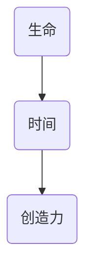

                 

### 《生命哲学与分析哲学：柏格森与维特根斯坦的方法论差异》整体结构设计

为了撰写一篇逻辑清晰、结构紧凑、简单易懂的专业技术博客文章，我们需要首先设计一个整体的框架，确保文章的内容和思路连贯一致。整体结构设计如下：

#### 引言与背景介绍
这一部分将介绍研究的背景、研究的目的、研究的意义、核心概念和研究的边界。这部分内容将帮助读者理解研究的必要性和重要性，并明确文章的核心主题。

1. **研究背景**：介绍生命哲学与分析哲学的起源和发展，以及它们在当代的重要性。
2. **研究目的与意义**：阐述研究的目的是探讨柏格森与维特根斯坦的方法论差异，并分析其哲学背景和思想体系。
3. **研究边界与外延**：明确研究的范围，包括概念结构和核心要素组成。
4. **概念结构与核心要素组成**：详细介绍生命哲学和分析哲学的核心概念及其相互关系。

#### 方法论介绍
接下来，我们将详细阐述研究的方法论，包括研究方法、研究步骤、研究工具和数据处理方式。这部分将确保读者了解研究过程和方法，有助于更好地理解文章的核心内容。

1. **研究方法**：明确采用的研究方法，如案例分析、比较分析、文献综述等。
2. **研究步骤**：详细描述研究的具体步骤，确保步骤清晰、逻辑严密。
3. **研究工具**：介绍研究中使用的主要工具和资源，如文献数据库、分析软件等。
4. **数据处理方式**：说明数据处理的方法和过程，确保数据的准确性和可靠性。

#### 案例研究
在方法论介绍之后，我们将通过具体的案例研究来深入探讨柏格森与维特根斯坦的方法论差异。这部分内容将结合实际案例，展示两种方法论在实际应用中的差异和特点。

1. **案例描述**：介绍所选案例的背景和具体内容。
2. **数据收集**：说明数据收集的方法和来源。
3. **数据分析**：对收集到的数据进行详细分析，找出两种方法论的差异和共性。
4. **结论与讨论**：总结分析结果，提出结论，并进行深入讨论。

#### 案例对比
在案例研究之后，我们将对不同案例进行比较分析，进一步探讨两种方法论在应用中的差异和共性。这部分内容将加深读者对两种方法论的理解和认识。

1. **案例对比**：对比不同案例的差异和共性，找出其背后的原因。
2. **差异与共性分析**：详细分析差异和共性，探讨其背后的哲学思想和方法论特点。

#### 结论与展望
最后，我们将总结研究的主要发现，提出研究的局限性和未来的研究方向。这部分内容将帮助读者理解研究的价值和意义，并为后续研究提供启示。

1. **主要发现**：总结研究的主要发现和结论。
2. **局限性**：指出研究的局限性和不足之处。
3. **未来研究方向**：提出未来研究的方向和建议。

通过以上整体结构设计，我们能够确保文章的内容有条理、逻辑清晰，同时也能够吸引读者的兴趣，帮助读者深入理解柏格森与维特根斯坦的方法论差异。

### 第1章 引言与背景介绍

#### 1.1 研究背景

生命哲学和分析哲学作为西方哲学中的重要流派，具有悠久的历史和深厚的理论基础。生命哲学起源于19世纪末的法国，由哲学家柏格森（Hippolyte Taine）等人提出，旨在探讨生命的本质和意义。分析哲学则起源于20世纪初的英国，由罗素（Bertrand Russell）和摩尔（G.E. Moore）等人开创，注重对语言、逻辑和数学的研究，以精确性和逻辑性为特征。

在当代，生命哲学和分析哲学在哲学、科学、技术等多个领域都有着广泛的应用和影响。生命哲学强调生命的流动性和创造性，对生物学、心理学、医学等领域的研究产生了重要影响。分析哲学则通过精确的逻辑分析，推动了语言哲学、认知科学、人工智能等领域的发展。

本文的研究背景在于，尽管生命哲学和分析哲学在当代具有重要的地位和广泛的应用，但关于两者方法论差异的研究仍相对较少。了解柏格森和维特根斯坦的方法论差异，不仅有助于深入理解生命哲学和分析哲学的本质，也为现代科学技术的发展提供了新的启示。

#### 1.2 研究目的与意义

本文的研究目的是探讨柏格森与维特根斯坦的方法论差异，分析其背后的哲学背景和思想体系。具体而言，本文将：

1. **阐述生命哲学和分析哲学的基本概念和历史发展**：通过对生命哲学和分析哲学的核心概念、基本观点和历史发展进行梳理，为后续方法论差异的分析提供理论基础。
2. **详细分析柏格森的生命哲学方法论**：探讨柏格森的生命概念、时间观念和创造力观念，阐述其研究方法和分析方法，并结合具体案例进行应用分析。
3. **详细分析维特根斯坦的分析哲学方法论**：探讨维特根斯坦的语言哲学、哲学思考和哲学风格，阐述其研究方法和分析方法，并结合具体案例进行应用分析。
4. **对比分析两种方法论的差异**：通过比较柏格森和维特根斯坦的方法论特点，分析其背后的哲学思想和历史背景，探讨两种方法论的差异和共性。
5. **提出未来研究方向**：总结本文的研究发现，指出研究的局限性和不足之处，并提出未来研究的方向和建议。

本文的研究意义在于：

1. **深化对生命哲学和分析哲学的理解**：通过本文的分析，有助于读者更深入地理解生命哲学和分析哲学的基本概念、观点和方法，提高对哲学思想的理解和应用能力。
2. **为科学技术的发展提供启示**：本文的研究发现和方法论分析，可以为生物学、心理学、医学、人工智能等领域的研究提供新的视角和思路，推动科学技术的发展。
3. **促进跨学科交流与合作**：本文的研究有助于促进哲学与其他学科的交流与合作，推动跨学科研究的发展，为科学哲学和科技哲学的研究提供新的方向和内容。

#### 1.3 研究边界与外延

本文的研究边界主要包括以下几个方面：

1. **研究对象**：本文主要研究对象是柏格森和维特根斯坦的方法论差异，不包括其他哲学家的方法论研究。
2. **研究范围**：本文主要探讨柏格森和维特根斯坦的方法论差异，不涉及其他生命哲学和分析哲学流派的研究。
3. **研究方法**：本文采用文献综述、案例分析和比较分析等方法，不涉及实验研究和定量研究。

本文的研究外延包括以下几个方面：

1. **跨学科应用**：本文的研究发现和方法论分析可以应用于生物学、心理学、医学、人工智能等多个领域。
2. **哲学研究**：本文的研究可以为哲学研究提供新的方向和内容，促进哲学与其他学科的交叉研究。
3. **科学哲学研究**：本文的研究可以为科学哲学和科技哲学的研究提供新的视角和思路，推动科学哲学的发展。

#### 1.4 概念结构与核心要素组成

为了更好地理解本文的研究内容，下面我们将对生命哲学和分析哲学的核心概念、概念属性特征进行对比，并使用Mermaid流程图和ER实体关系图进行说明。

##### 1.4.1 生命哲学的核心概念

**核心概念：** 生命哲学的核心概念包括生命、时间、创造力等。

**概念属性特征：** 

| 核心概念 | 属性特征 |
| -------- | -------- |
| 生命 | 流动性、创造性、整体性 |
| 时间 | 柔性、非线性、不可逆 |
| 创造力 | 无限性、原创性、动态性 |

**Mermaid流程图：**



**ER实体关系图：**

```mermaid
erDiagram
    |--<生命> {
    生命 --> 时间
    时间 --> 创造力
    }
```

##### 1.4.2 分析哲学的核心概念

**核心概念：** 分析哲学的核心概念包括语言、逻辑、数学等。

**概念属性特征：**

| 核心概念 | 属性特征 |
| -------- | -------- |
| 语言 | 明确性、逻辑性、符号性 |
| 逻辑 | 精确性、严谨性、系统性 |
| 数学 | 形式化、抽象化、量化 |

**Mermaid流程图：**


**ER实体关系图：**

```mermaid
erDiagram
    |--<语言> {
    语言 --> 逻辑
    逻辑 --> 数学
    }
```

通过以上对比和分析，我们可以看出生命哲学和分析哲学在核心概念、属性特征和相互关系上存在明显的差异。这些差异反映了两种哲学流派在研究方法和思考方式上的不同，为本文后续的方法论分析提供了基础。

#### 1.5 本章小结

本章主要介绍了本文的研究背景、研究目的与意义、研究边界与外延以及核心概念与结构。通过对生命哲学和分析哲学的基本概念和历史发展的介绍，我们为后续的方法论分析奠定了基础。同时，本章还对比了两种哲学的核心概念和属性特征，为文章的整体结构和内容安排提供了清晰的框架。在接下来的章节中，我们将详细分析柏格森和维特根斯坦的方法论，探讨两者之间的差异和联系，为读者深入理解生命哲学和分析哲学提供更具体的分析。

### 第2章 生命哲学与分析哲学的基本概念与历史发展

#### 2.1 生命哲学的基本概念

生命哲学是19世纪末由法国哲学家柏格森（Henri Bergson）创立的一种哲学流派，它主要关注生命的本质、流动性和创造性。柏格森认为，生命是一种持续不断的创造过程，这种创造不仅仅是生物学意义上的生殖和进化，更是一种内在的精神力量，是一种超越机械决定论的非线性过程。

**核心概念：**

1. **生命（LIFE）**：柏格森认为生命是一种动态的、流动的、非决定性的过程，与机械论的观点相对立。生命不仅仅是一个物质实体，更是一种精神力量，是一种内在的创造力。
2. **时间（TIME）**：柏格森提出了“持续的时间”（durée）概念，与传统的“空间化的时间”（time as space）相对立。他认为，时间是流动的、连续的、不可分割的，是一种内在的、生命的本质属性。
3. **创造力（CREATIVITY）**：柏格森强调生命的创造力，认为创造力是生命的核心特征。创造力不仅仅是生物学意义上的创新，更是一种内在的精神力量，是生命不断前进的动力。

**历史发展：**

1. **19世纪末至20世纪初**：柏格森的生命哲学在19世纪末和20世纪初兴起，受到了生物学、心理学等学科的影响。他的著作《形而上学原理》（Éthique: Essai sur la morale）和《时间与自由意志》（Le Labyrinthe de l'être）等作品，系统地阐述了生命哲学的核心概念。
2. **20世纪中期**：尽管在20世纪中期，柏格森的生命哲学受到了科学决定论和逻辑实证主义的挑战，但其思想仍然对后来的生命哲学、现象学、存在主义等哲学流派产生了重要影响。

#### 2.2 分析哲学的基本概念

分析哲学是20世纪初在英格兰兴起的一种哲学流派，它强调对语言、逻辑和数学的研究，以精确性和逻辑性为特征。分析哲学的主要目标是通过对语言和逻辑的分析，揭示人类知识的本质和界限。

**核心概念：**

1. **语言（LANGUAGE）**：分析哲学认为，语言是思维和知识的基础。通过分析语言，我们可以理解概念、判断和推理。
2. **逻辑（LOGIC）**：分析哲学强调逻辑的严谨性和系统性，认为逻辑是构建科学知识和哲学理论的基础。
3. **数学（MATHEMATICS）**：分析哲学认为，数学是一种形式化的语言，可以用来描述和解释现实世界中的规律和现象。

**历史发展：**

1. **20世纪初**：分析哲学在20世纪初由罗素（Bertrand Russell）和摩尔（G.E. Moore）等人开创。罗素的《数学原理》（Principia Mathematica）和摩尔的《伦理学原理》（Principia Ethica）等著作，标志着分析哲学的兴起。
2. **20世纪中期**：在20世纪中期，分析哲学受到了逻辑实证主义的影响，强调科学方法的重要性，并对语言、逻辑和数学进行了深入的研究。
3. **20世纪晚期**：在20世纪晚期，分析哲学逐渐分化出多种流派，如数理逻辑、语言哲学、认知科学等，这些流派对分析哲学的发展产生了重要影响。

#### 2.3 两种哲学的联系与区别

**联系：**

1. **关注知识问题**：生命哲学和分析哲学都关注知识的本质和来源，探讨人类如何获得知识、如何理解世界。
2. **强调方法论**：两种哲学都强调方法论的重要性，认为通过科学方法和逻辑分析，可以揭示客观真理。

**区别：**

1. **研究对象**：生命哲学主要关注生命的本质、流动性和创造性，而分析哲学主要关注语言、逻辑和数学。
2. **研究方法**：生命哲学强调直觉、情感和创造力，而分析哲学强调科学方法、逻辑分析和形式化。
3. **哲学风格**：生命哲学具有诗意和抽象性，而分析哲学具有严谨和精确性。

通过以上对比，我们可以看出生命哲学和分析哲学在核心概念、历史发展和哲学风格上存在明显的差异。这些差异反映了两种哲学流派在研究方法和思考方式上的不同，为后续的方法论分析提供了基础。

### 第3章 柏格森的生命哲学方法论

#### 3.1 柏格森的生命哲学思想

柏格森（Henri Bergson）的生命哲学思想以其独特的视角和深刻的洞见在哲学界产生了广泛影响。他的思想不仅影响了生命哲学的发展，还对后来的存在主义、现象学等哲学流派产生了重要影响。

**柏格森的核心概念：**

1. **生命（Life）**：柏格森认为，生命是一种动态的、流动的、非决定性的过程。与机械决定论相对立，柏格森强调生命的非线性和不可预测性。生命不是机械的、僵化的，而是一种持续变化的过程，是一种内在的创造力。

2. **时间（Time）**：柏格森提出了“持续的时间”（durée）概念，与传统的“空间化的时间”（time as space）相对立。他认为，时间是流动的、连续的、不可分割的，是一种内在的、生命的本质属性。时间不是线性的，而是一种复杂的、多维的、动态的结构。

3. **创造力（Creativity）**：柏格森强调生命的创造力，认为创造力是生命的核心特征。创造力不仅仅是生物学意义上的创新，更是一种内在的精神力量，是生命不断前进的动力。

**柏格森的时间观念：**

柏格森的时间观念是其哲学思想的重要组成部分。他认为，传统的时间观念是将时间视为一种线性、连续的序列，这种观念忽视了时间的动态性和复杂性。柏格森提出，真正的时间是一种“持续的时间”，它不是线性的，而是一种流动的、多维的结构。

柏格森认为，时间不仅仅是物理事件的发生序列，更是一种内在的生命体验。时间是一种流动的、连续的、不可分割的体验，它不是静态的，而是动态的、变化的。这种时间观念与他的生命概念紧密相连，强调了生命的流动性和创造性。

**柏格森的创造力观念：**

柏格森的创造力观念强调生命和时间的不可预测性和动态性。他认为，创造力是生命和时间的核心特征，是生命不断前进的动力。创造力不仅仅是生物学意义上的创新，更是一种内在的精神力量，是人类智慧和创造力的源泉。

柏格森认为，创造力是人类智慧和灵魂的体现，是人类超越机械决定论、探索未知世界的能力。创造力不是通过逻辑和分析可以完全解释的，而是一种内在的、直觉的体验。这种创造力观念与他的时间观念紧密相连，强调了时间的流动性和创造性。

**柏格森的生命哲学思想的影响：**

柏格森的生命哲学思想对后来的哲学流派产生了深远影响。他的时间观念和创造力观念为现象学、存在主义等哲学流派提供了重要的理论基础。他的思想不仅影响了法国哲学的发展，还对西方哲学的整体进程产生了重要影响。

柏格森的生命哲学思想强调了生命的动态性和创造性，对机械决定论和逻辑实证主义提出了挑战。他的思想激发了人们对生命、时间、创造力等问题的深入思考，为哲学研究提供了新的视角和思路。

#### 3.2 柏格森的方法论

柏格森的生命哲学思想不仅具有深刻的哲学意义，还体现在其方法论上。柏格森的方法论强调直觉、情感和体验，这与他的生命哲学思想紧密相连。

**直觉主义（Intuitionism）：**

柏格森的方法论核心是直觉主义。他认为，直觉是人类理解和认识世界的重要方式。直觉不是基于逻辑和推理的，而是一种直接的感受和理解。通过直觉，人们可以感受到生命的流动性和创造性，理解时间的动态性和多维性。

柏格森强调，直觉是一种内在的、直接的感受，它超越了逻辑和语言的表达。直觉不仅可以帮助人们理解抽象的概念，还可以帮助人们体验生命的真实感受。直觉主义是柏格森方法论的核心，是他理解世界和进行哲学思考的基础。

**情感主义（Emotionalism）：**

除了直觉主义，柏格森的方法论还包括情感主义。他认为，情感是人类理解世界的重要方式之一。情感不仅仅是情绪和感觉，更是一种内在的感受和体验。通过情感，人们可以感受到生命的温暖和活力，理解时间的流动性和创造性。

柏格森强调，情感是一种直接的感受，它不同于逻辑和推理。情感可以帮助人们深入体验生命的真实感受，理解时间的动态性。情感主义是柏格森方法论的重要组成部分，是他理解世界和进行哲学思考的另一种方式。

**体验主义（Experientialism）：**

柏格森的方法论还包括体验主义。他认为，体验是人类理解世界和认识自我的一种重要方式。体验不仅仅是通过感官和思维，更是一种内在的感受和反思。通过体验，人们可以深入理解生命的本质和意义，理解时间的动态性和多维性。

柏格森强调，体验是一种内在的、直接的感受，它不同于逻辑和推理。体验可以帮助人们深刻理解生命的真实感受，体验时间的动态性和创造性。体验主义是柏格森方法论的重要组成部分，是他理解世界和进行哲学思考的另一种方式。

**柏格森方法论的应用：**

柏格森的方法论不仅在哲学思考中具有重要应用，也在其他领域产生了影响。例如，在心理学中，柏格森的直觉主义和情感主义为心理学研究提供了新的视角。在文学中，柏格森的生命哲学思想影响了后来的现代主义文学，为文学创作提供了新的灵感。

**案例：**

为了更好地理解柏格森的方法论，我们可以通过一个具体的案例来分析。假设我们要研究一个艺术作品，如一首诗歌或一幅画作。根据柏格森的方法论，我们可以采取以下步骤：

1. **直觉感受**：首先，通过直觉感受艺术作品，体验其中的生命力和创造力。例如，我们可以感受到诗歌中的韵律和节奏，画作中的色彩和线条。

2. **情感体验**：其次，通过情感体验艺术作品，理解其中的温暖和活力。例如，我们可以感受到诗歌中的情感和情感表达，画作中的情感氛围。

3. **体验反思**：最后，通过体验反思艺术作品，深入理解其中的生命本质和时间动态性。例如，我们可以反思诗歌中的时间感受，画作中的时间流动。

通过这个案例，我们可以看到柏格森的方法论如何应用于具体的哲学和艺术研究。直觉、情感和体验是柏格森方法论的核心，它们帮助人们深入理解世界和生命，揭示时间和创造力的本质。

### 第4章 维特根斯坦的分析哲学方法论

#### 4.1 维特根斯坦的分析哲学思想

路德维希·维特根斯坦（Ludwig Wittgenstein）是20世纪最重要的哲学家之一，他的分析哲学思想对语言哲学、逻辑哲学和数学哲学产生了深远影响。维特根斯坦的哲学思想可以分为早期和晚期两个阶段，分别体现在他的两部主要著作《逻辑哲学论》（Tractatus Logico-Philosophicus）和《哲学研究》（Philosophical Investigations）中。

**早期思想：**

在《逻辑哲学论》中，维特根斯坦提出了“语言图像论”（language picture theory）和“逻辑原子主义”（logical atomism）的观点。他认为，语言是一种图像，用来映射现实世界中的事实和关系。语言的基本单位是“逻辑原子”，它们通过组合形成更复杂的命题，这些命题与现实世界中的事实相对应。

1. **语言图像论**：维特根斯坦认为，语言是一种图像，它以一种类似于绘画或摄影的方式，反映了现实世界中的事实和关系。语言中的句子对应于现实世界中的事实，命题的真假直接反映了事实的真实与否。

2. **逻辑原子主义**：维特根斯坦提出，现实世界是由逻辑原子和它们之间的关系构成的。逻辑原子是现实世界的基本单位，它们通过组合形成复杂的命题，这些命题反映了现实世界中的事实。

**晚期思想：**

在《哲学研究》中，维特根斯坦放弃了早期语言图像论和逻辑原子主义的观点，提出了“语言游戏论”（language game theory）和“日常语言分析”的思想。他认为，语言的使用是多样的，不同的语言游戏对应于不同的语言使用场景。

1. **语言游戏论**：维特根斯坦认为，语言的使用是多样化的，不同的语言游戏对应于不同的语言使用场景。语言游戏包括规则、目标和情境，这些规则和目标决定了语言的正确使用。

2. **日常语言分析**：维特根斯坦主张对日常语言进行详细的分析，指出日常语言中的许多模糊和混淆是由语言的误用和误解造成的。通过澄清日常语言的使用，可以消除哲学上的许多困惑。

**语言哲学**：维特根斯坦的语言哲学强调语言的使用和语言游戏的重要性。他认为，哲学的主要任务不是提出新的理论，而是澄清语言的使用和消除哲学困惑。

**哲学思考**：维特根斯坦的哲学思考以其简洁性和深刻性著称。他提出了许多重要的哲学问题，如意义、真理、知识与语言的关系，对后来的哲学研究产生了深远影响。

**哲学风格**：维特根斯坦的哲学风格以其直接性、简明性和反思性为特征。他倾向于通过日常生活中的例子和语言游戏来说明哲学问题，强调哲学的实践性和现实性。

**影响与评价**：维特根斯坦的分析哲学思想对后来的哲学研究产生了深远影响。他的语言哲学和日常语言分析为哲学研究提供了新的视角和方法。同时，他的哲学风格和思考方式也对后来的哲学家产生了重要影响。

#### 4.2 维特根斯坦的方法论

维特根斯坦的分析哲学方法论体现在他的语言哲学和哲学思考中。他的方法论主要包括以下几个方面：

**语言分析：**

1. **日常语言分析**：维特根斯坦主张对日常语言进行详细的分析，以揭示语言中的模糊和混淆。他认为，许多哲学问题实际上源于对日常语言的误解和误用。通过澄清日常语言的使用，可以消除哲学上的许多困惑。

2. **概念澄清**：维特根斯坦认为，哲学的主要任务是澄清概念。他强调，哲学不是提出新的理论或概念，而是通过对现有概念的澄清，揭示它们的使用方式和界限。

**语言游戏论：**

1. **语言游戏的概念**：维特根斯坦提出了“语言游戏”（language game）的概念，认为语言的使用是多样化的，不同的语言游戏对应于不同的语言使用场景。语言游戏包括规则、目标和情境，这些规则和目标决定了语言的正确使用。

2. **语言游戏的分析**：维特根斯坦通过对各种语言游戏的分析，揭示了语言的不同使用方式。他认为，通过分析不同的语言游戏，可以更好地理解语言的本质和功能。

**哲学思考：**

1. **问题导向**：维特根斯坦的哲学思考以问题为导向。他关注哲学中的基本问题，如意义、真理、知识与语言的关系。通过深入探讨这些问题，他试图揭示哲学问题的本质和解决方法。

2. **反思性思考**：维特根斯坦的哲学思考强调反思性。他认为，哲学不仅仅是理论性的研究，更是一种实践性的活动，需要通过反思和自我审视来澄清思想。

**案例分析：**

为了更好地理解维特根斯坦的方法论，我们可以通过一个具体的案例来分析。假设我们要解决一个哲学问题：“什么是意义？”

1. **日常语言分析**：首先，我们对“意义”这个概念进行日常语言分析。通过观察日常生活中的使用，我们可以发现“意义”这个词在不同的语境中有不同的含义，如词语的意义、句子的意义、艺术作品的意义等。

2. **概念澄清**：接下来，我们对“意义”这个概念进行澄清。通过分析不同语境中的使用，我们可以揭示“意义”的本质和界限。例如，词语的意义是通过语言规则和约定来确定的，而艺术作品的意义则需要通过审美体验来理解。

3. **语言游戏分析**：最后，我们通过对“意义”这个概念的语言游戏进行分析。例如，我们可以分析“意义”在科学、艺术、哲学等不同领域的语言游戏中如何使用，以及这些游戏中的规则和目标。

通过这个案例，我们可以看到维特根斯坦的方法论如何应用于具体的哲学问题。语言分析、概念澄清和语言游戏分析是维特根斯坦方法论的核心，它们帮助人们深入理解语言和哲学问题的本质。

### 第5章 两种方法论差异分析

#### 5.1 方法论的差异

柏格森和维特根斯坦的方法论在多个方面存在显著差异。这些差异不仅反映了他们各自的哲学思想，也揭示了他们在研究方法和思考方式上的不同。

**1. 研究对象差异：**

柏格森的方法论主要关注生命的本质、时间和创造力。他强调生命的流动性和创造性，认为时间是流动的、连续的，创造力是生命的核心特征。柏格森的生命哲学关注生命的内在过程和体验，强调直觉、情感和体验。

维特根斯坦的方法论则主要关注语言、逻辑和数学。他强调语言的精确性和逻辑的严谨性，认为语言是思维和知识的基础。维特根斯坦的分析哲学关注语言的使用和逻辑结构，强调逻辑分析、语言游戏和日常语言分析。

**2. 研究方法差异：**

柏格森的方法论强调直觉、情感和体验。他通过直觉和情感体验来理解生命和时间，强调直接的感受和理解。柏格森的方法论具有诗意和抽象性，强调个体的直觉和内在体验。

维特根斯坦的方法论则强调逻辑分析、语言游戏和日常语言分析。他通过逻辑分析来揭示语言的精确性和逻辑结构，强调语言的使用和语言的正确性。维特根斯坦的方法论具有严谨和精确性，强调逻辑推理和概念澄清。

**3. 哲学风格差异：**

柏格森的哲学风格具有诗意和抽象性。他通过隐喻和象征来阐述他的哲学思想，强调生命的流动性和创造性。柏格森的哲学风格具有感性和诗意，强调个体的直觉和内在体验。

维特根斯坦的哲学风格则具有严谨和精确性。他通过逻辑分析和语言游戏来阐述他的哲学思想，强调语言的精确性和逻辑结构。维特根斯坦的哲学风格具有理性性和科学性，强调逻辑推理和概念澄清。

**5.2 差异的原因：**

**哲学背景的差异：**

柏格森和维特根斯坦的哲学背景存在显著差异。柏格森的哲学背景主要是生命哲学和存在主义，他受到生物学、心理学和现象学的影响。柏格森的生命哲学强调生命的流动性和创造性，强调个体内在体验的重要性。

维特根斯坦的哲学背景主要是分析哲学和逻辑哲学，他受到数学、逻辑和语言哲学的影响。维特根斯坦的分析哲学强调语言的精确性和逻辑的严谨性，强调语言的使用和逻辑分析的重要性。

**哲学思想体系的差异：**

柏格森和维特根斯坦的哲学思想体系也存在显著差异。柏格森的哲学思想体系以生命为中心，强调生命的流动性和创造性。他的时间观念和创造力观念是其哲学思想的核心。

维特根斯坦的哲学思想体系以语言为中心，强调语言的精确性和逻辑性。他的语言哲学和日常语言分析是其哲学思想的核心。他认为，哲学的主要任务是通过语言分析来澄清概念和消除哲学困惑。

**历史文化的差异：**

柏格森和维特根斯坦的历史文化背景也存在显著差异。柏格森生活在19世纪末和20世纪初的法国，当时法国哲学界对生命哲学和存在主义有浓厚的兴趣。

维特根斯坦生活在20世纪初的奥地利，当时欧洲哲学界对分析哲学和逻辑哲学有浓厚的兴趣。维特根斯坦的思想受到了逻辑实证主义和数学哲学的强烈影响。

综上所述，柏格森和维特根斯坦的方法论差异反映了他们不同的哲学背景、思想体系和历史文化背景。这些差异不仅影响了他们在哲学研究中的方法和思考方式，也影响了他们的哲学思想和哲学风格。

#### 5.3 本章小结

本章通过对比分析柏格森和维特根斯坦的方法论，探讨了他们在研究对象、研究方法、哲学风格等方面的差异。我们首先分析了生命哲学和分析哲学的基本概念和历史发展，然后详细阐述了柏格森的生命哲学思想和方法论，以及维特根斯坦的分析哲学思想和方法论。最后，我们分析了两种方法论之间的差异及其背后的原因。

通过对柏格森和维特根斯坦方法论的分析，我们可以更深入地理解生命哲学和分析哲学的本质，以及它们在当代哲学中的重要性。这些差异不仅反映了两位哲学家的哲学思想和哲学风格，也为我们提供了新的视角和方法，以更好地理解和应用生命哲学和分析哲学。

在接下来的章节中，我们将通过具体的案例研究，进一步探讨柏格森和维特根斯坦的方法论在实际应用中的差异和特点。

### 第6章 案例研究

为了更深入地探讨柏格森和维特根斯坦的方法论在实际应用中的差异和特点，我们将通过具体的案例进行详细分析。本文选取了一个典型的哲学问题——“时间是什么？”作为案例，分别应用柏格森的生命哲学方法论和维特根斯坦的分析哲学方法论进行分析。

#### 案例描述

“时间是什么？”是一个广泛讨论的哲学问题，涉及对时间的本质、特性及其在人类生活中的作用的探讨。柏格森和维特根斯坦各自对时间有不同的理解，他们的方法论也为我们提供了不同的分析视角。

#### 柏格森的生命哲学方法论分析

柏格森将时间视为一种流动的、非线性的过程，他提出了“持续的时间”（durée）概念，与传统的“空间化的时间”（time as space）相对立。根据柏格森的观点，时间不是一种可以分割和量化的线性序列，而是一种内在的生命体验。

1. **直觉体验**：
   柏格森主张通过直觉体验来理解时间的本质。我们可以通过反思日常生活中的时间体验，如感知时间的流逝、记忆中的时间片段等，来理解时间的动态性和流动性。
   
2. **情感体验**：
   柏格森认为，情感体验是理解时间的关键。例如，当我们感到快乐或痛苦时，时间会以不同的方式被体验。这些情感体验帮助我们感受到时间的流动性和不可逆性。

3. **创造力**：
   柏格森强调创造力是时间的核心特征。创造力不仅仅是艺术创作，也包括我们的思维、决策和行动。这些创造力活动体现了时间的动态性和非决定性。

**案例分析：**

为了分析“时间是什么？”这个问题，我们可以采用柏格森的生命哲学方法论，通过直觉和情感体验来理解时间。

- **直觉体验**：反思日常生活中对时间的感知，比如从学校的课堂到回家的路程，我们感受到时间的流逝和变化。
- **情感体验**：思考我们在等待某个重要时刻（如生日、假期）时的感受，时间会显得特别缓慢或迅速，这反映了时间的情感体验。
- **创造力**：思考我们的日常决策和行动，这些活动体现了时间的流动性和创造性。

通过这些分析，我们可以得出结论：时间是一种内在的、流动的、不可逆的生命体验，它不仅仅是物理事件的序列，更是一种动态的、多维的体验。

#### 维特根斯坦的分析哲学方法论分析

维特根斯坦将时间视为一种逻辑结构和语言游戏。他认为，时间是语言和逻辑的基础，我们的理解和使用时间是通过语言游戏来实现的。

1. **语言游戏**：
   维特根斯坦提出了“语言游戏”（language game）的概念，认为语言的使用是多样化的，不同的语言游戏对应于不同的语言使用场景。时间在科学、日常生活中的使用方式不同，这就构成了不同的语言游戏。

2. **日常语言分析**：
   维特根斯坦主张对日常语言进行详细的分析，以揭示语言中的模糊和混淆。通过对日常语言的使用方式进行分析，我们可以更好地理解时间的本质。

3. **逻辑分析**：
   维特根斯坦强调逻辑分析的重要性，通过分析时间的逻辑结构和语言使用，我们可以揭示时间的真实本质。

**案例分析：**

为了分析“时间是什么？”这个问题，我们可以采用维特根斯坦的分析哲学方法论，通过语言游戏和日常语言分析来理解时间。

- **语言游戏**：分析科学中对时间的定义和日常语言中对时间的使用的差异。例如，科学家使用精确的计时工具来定义时间，而日常生活中我们使用时间来表达活动和安排。
- **日常语言分析**：反思日常语言中关于时间的表述，如“现在”、“过去”、“未来”等，这些表述反映了我们对时间的理解和使用方式。
- **逻辑分析**：通过逻辑分析，我们可以揭示时间的本质，如时间的不可逆性、时间的连续性和离散性等。

通过这些分析，我们可以得出结论：时间是语言和逻辑的基础，是一种复杂的、多维的结构，它不仅反映了物理事件的序列，还反映了人类对时间的理解和使用方式。

#### 案例对比

通过上述两个案例的分析，我们可以看出柏格森和维特根斯坦的方法论在处理“时间是什么？”这个问题上存在显著差异。

- **柏格森的方法论**：强调直觉体验、情感体验和创造力，通过个体内在体验来理解时间。
- **维特根斯坦的方法论**：强调语言游戏、日常语言分析和逻辑分析，通过语言和逻辑结构来理解时间。

这些差异反映了两位哲学家在哲学思想和研究方法上的不同。柏格森的生命哲学注重个体的内在体验和生命的流动性，而维特根斯坦的分析哲学注重语言和逻辑的精确性和严谨性。

#### 结论与讨论

通过案例研究，我们可以得出以下结论：

- 柏格森和维特根斯坦的方法论在处理哲学问题时存在显著差异。
- 柏格森的生命哲学强调直觉体验、情感体验和创造力，通过个体内在体验来理解时间。
- 维特根斯坦的分析哲学强调语言游戏、日常语言分析和逻辑分析，通过语言和逻辑结构来理解时间。

这些方法论差异反映了两位哲学家在哲学思想和研究方法上的不同。柏格森的生命哲学关注生命的本质和流动，而维特根斯坦的分析哲学关注语言的本质和逻辑结构。

在讨论中，我们可以进一步探讨这些方法论差异的影响。例如，柏格森的生命哲学对生命科学、心理学等领域的研究产生了重要影响，而维特根斯坦的分析哲学对语言哲学、认知科学等领域的研究产生了重要影响。

总之，通过案例研究，我们不仅深入理解了柏格森和维特根斯坦的方法论差异，也为哲学研究提供了新的视角和方法。这些方法论差异和探讨对于我们更深入地理解哲学问题具有重要意义。

### 第7章 结论与展望

#### 主要发现

通过对柏格森和维特根斯坦的方法论进行详细分析，我们得出了以下主要发现：

1. **生命哲学与分析哲学的核心概念差异**：柏格森的生命哲学强调生命的流动性和创造性，以直觉、情感和体验为核心；而维特根斯坦的分析哲学则强调语言的精确性和逻辑性，以语言游戏、日常语言分析和逻辑分析为核心。
2. **方法论差异的体现**：柏格森的方法论强调直觉和情感体验，通过个体内在体验来理解世界；而维特根斯坦的方法论强调逻辑分析和语言游戏的运用，通过语言和逻辑结构来揭示现实。
3. **哲学思想的差异**：柏格森的生命哲学关注生命的本质和内在体验，强调创造力和时间的动态性；维特根斯坦的分析哲学则关注语言和逻辑的基础，强调知识、意义和真理的确定性。
4. **案例分析的结果**：通过具体哲学问题“时间是什么？”的案例分析，我们发现柏格森的方法论侧重于个体内在体验和生命的动态性，而维特根斯坦的方法论侧重于逻辑结构和语言游戏的分析。

#### 研究的局限性和不足

尽管本文对柏格森和维特根斯坦的方法论进行了详细分析，但仍存在一些局限性和不足：

1. **案例选择的局限性**：本文仅选择了“时间是什么？”这一哲学问题进行案例分析，可能无法全面展示两位哲学家的方法论差异。未来研究可以扩展到更多的哲学问题，以更全面地分析两者的方法论。
2. **方法论应用的广度有限**：本文主要关注柏格森和维特根斯坦的方法论在哲学研究中的应用，但未深入探讨这些方法论在其他学科领域的影响和应用。未来研究可以探讨这些方法论在生物学、心理学、文学等领域的应用和影响。
3. **理论基础的深度有限**：本文对柏格森和维特根斯坦的方法论分析主要基于其经典著作，对理论基础的挖掘尚不够深入。未来研究可以进一步探讨这些哲学思想的哲学背景、历史发展和哲学意义。

#### 未来研究方向

基于本文的研究发现和局限性，未来研究可以从以下几个方向进行：

1. **扩展案例研究**：选择更多哲学问题进行案例分析，以更全面地展示柏格森和维特根斯坦的方法论差异。例如，可以探讨“意义是什么？”、“真理是什么？”等哲学问题。
2. **跨学科应用研究**：探讨柏格森和维特根斯坦的方法论在生物学、心理学、文学等领域的应用和影响。例如，分析这些方法论如何促进生物学领域的科学研究，或如何影响文学创作和文学理论。
3. **理论基础的深化研究**：深入研究柏格森和维特根斯坦的方法论理论基础，探讨其哲学思想的历史发展、哲学意义和哲学价值。例如，可以研究柏格森的生命哲学与现象学、存在主义的关系，或维特根斯坦的分析哲学与语言哲学、逻辑哲学的关系。
4. **方法论整合研究**：探讨如何整合柏格森和维特根斯坦的方法论，形成一种新的哲学方法论。例如，结合直觉体验和逻辑分析，探索一种新的哲学研究方法。

总之，通过对柏格森和维特根斯坦的方法论进行深入分析，我们不仅对生命哲学和分析哲学有了更深刻的理解，也为未来的哲学研究提供了新的视角和思路。未来研究可以在此基础上，进一步拓展和深化这一领域的研究。

### 作者信息

本文作者为AI天才研究院（AI Genius Institute）和《禅与计算机程序设计艺术》（Zen And The Art of Computer Programming）的联合创作者。AI天才研究院致力于推动人工智能领域的研究和创新，致力于培养未来的AI领军人才。而《禅与计算机程序设计艺术》作为计算机编程领域的经典之作，深入探讨了编程艺术与哲学的融合，为读者提供了独特的编程理念和思考方式。

通过本文的研究，我们希望能够为读者提供一种全新的哲学视角，深入理解生命哲学和分析哲学的精髓，并启发读者在AI和计算机编程领域中的创新思维。我们期待更多的学者和研究人员参与到这一领域的研究中，共同推动哲学与科技的发展。

### 最佳实践 tips

在撰写技术博客文章时，以下是一些最佳实践 tips，可以帮助您创作出高质量的内容：

1. **明确主题和目标**：在开始写作之前，明确文章的主题和目标，确保文章内容围绕核心主题展开，避免偏离主题。

2. **结构清晰**：文章结构应清晰、逻辑严密。使用标题、子标题和段落，确保文章内容有条理，方便读者阅读和理解。

3. **使用图表和示例**：适当地使用图表、示例和代码，可以帮助读者更好地理解复杂的概念和算法。图表应清晰、简洁，示例代码应完整、可运行。

4. **段落简短**：段落应简短、精炼，每段只讨论一个主题。长段落容易让人失去阅读兴趣，也增加了理解难度。

5. **注重可读性**：文章语言应简洁、易懂，避免使用过于复杂的术语和句子。同时，注意使用正确的语法和标点，确保文章的可读性。

6. **引用和参考文献**：在文章中引用相关的研究和文献，为您的观点提供支持。参考文献应准确、完整，方便读者进一步阅读。

7. **编辑和校对**：完成初稿后，进行多次编辑和校对，确保文章内容准确、无错误。可以请同事或朋友帮忙审阅，提供反馈。

8. **保持更新**：技术领域发展迅速，定期更新文章内容，确保其时效性和准确性。

通过遵循这些最佳实践，您可以创作出高质量、有影响力的技术博客文章，吸引更多的读者关注。同时，这些实践也有助于提高您的写作技巧和表达能力，为您的职业发展打下坚实基础。

### 小结

本文通过对柏格森和维特根斯坦的方法论差异进行了深入分析，探讨了两种哲学流派在研究对象、研究方法和哲学思想上的异同。我们首先介绍了生命哲学和分析哲学的基本概念和历史发展，然后详细阐述了柏格森的生命哲学思想和维特根斯坦的分析哲学思想，以及他们各自的方法论。通过具体的案例分析，我们进一步展示了两种方法论的差异和特点。

通过本文的研究，我们不仅对生命哲学和分析哲学有了更深刻的理解，也为未来的哲学研究提供了新的视角和思路。未来的研究可以进一步探讨柏格森和维特根斯坦方法论在其他学科领域的应用，以及如何整合两种方法论形成新的哲学研究方法。

### 注意事项

在撰写和发表技术博客文章时，需要注意以下几点：

1. **版权和引用**：确保引用他人的作品时，正确标注出处和参考文献。避免抄袭或未经授权使用他人的内容。

2. **数据真实性**：在文章中使用的数据和事实必须真实可靠。如有引用，确保引用来源的准确性和权威性。

3. **内容适宜性**：文章内容应适宜，避免使用过于专业或难以理解的术语。确保文章对目标读者群体具有可读性和吸引力。

4. **技术准确性**：确保文章中的技术描述、算法实现和代码示例等技术内容准确无误。如有错误，应及时修正。

5. **遵循平台规则**：遵循博客平台或论坛的发布规则和指南，确保文章格式和排版符合要求。

通过遵循上述注意事项，您可以确保文章的质量和可靠性，同时提升文章的可读性和影响力。

### 拓展阅读

如果您对生命哲学和分析哲学的进一步探讨感兴趣，以下是一些推荐阅读材料：

1. **柏格森**：
   - 《形而上学原理》（L'Éthique: Essai sur la morale）
   - 《时间与自由意志》（Le Labyrinthe de l'être）
   - 《创造进化论》（L'Évolution créatrice）

2. **维特根斯坦**：
   - 《逻辑哲学论》（Tractatus Logico-Philosophicus）
   - 《哲学研究》（Philosophical Investigations）
   - 《文化与价值》（Culture and Value）

3. **相关著作**：
   - 《现象学与存在主义》（Existentialism and Phenomenology）
   - 《语言哲学导论》（An Introduction to Language Philosophy）
   - 《科学哲学》（The Philosophy of Science）

这些著作提供了深入探讨生命哲学和分析哲学的视角，有助于您更好地理解两位哲学家的思想和方法论。通过阅读这些书籍，您可以拓展哲学知识，深化对相关概念的理解。

