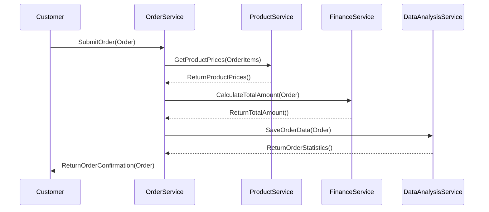
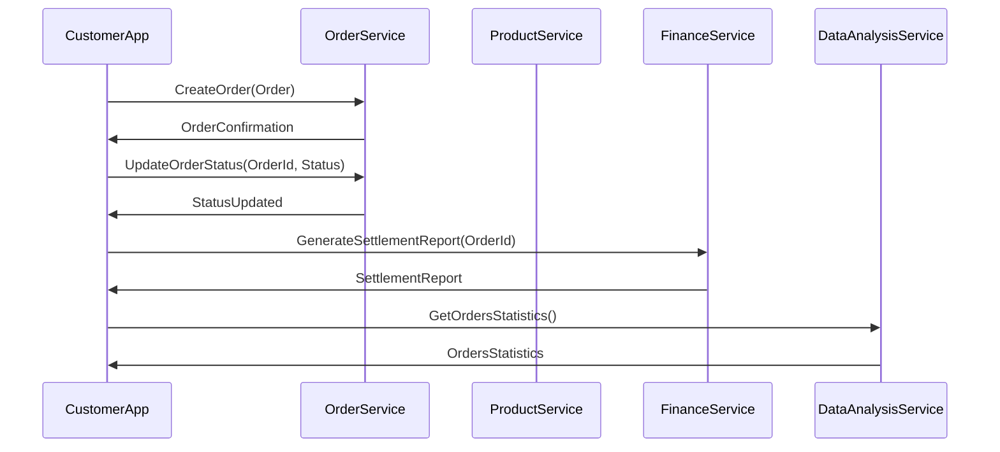

                 

## 引言

在信息技术飞速发展的时代，编程范式的概念逐渐成为软件工程领域的重要研究课题。编程范式不仅仅是一种编程方法或技术，它还代表了程序员解决问题的思维方式。本文将以《生活形式与设计模式：编程范式的哲学视角》为标题，探讨编程范式背后的哲学思想，并分析其在现实生活中的应用。我们将从生活形式、设计模式和编程范式的核心概念出发，逐步深入，以逻辑清晰、结构紧凑的方式探讨这些概念之间的联系，最终形成对编程范式的哲学视角的全面理解。

### 关键词

- 生活形式
- 设计模式
- 编程范式
- 哲学视角
- 算法原理
- 系统架构

### 摘要

本文旨在通过哲学视角探讨编程范式，揭示其与生活形式和设计模式之间的深层联系。通过对生活形式、设计模式及其在编程范式中的具体应用进行分析，本文将提供一个系统的框架来理解编程范式。同时，本文还将深入探讨编程范式的算法原理、系统分析与架构设计，并通过实际案例进行解析，为读者提供实用的编程方法和最佳实践。

### 目录大纲

#### 第一部分：背景介绍

- **第1章：问题背景与核心概念**
  - **1.1.1 生活形式的概念与特征**
  - **1.1.2 设计模式的哲学视角**
  - **1.1.3 编程范式的概念与历史发展**
  - **1.1.4 边界与外延**

#### 第二部分：核心概念与联系

- **第2章：核心概念原理**
  - **2.1.1 生活形式的属性特征对比表格**
  - **2.1.2 设计模式的ER实体关系图架构**

- **第3章：设计模式的分类与实例**
  - **3.1.1 设计模式分类概述**
  - **3.1.2 创建型模式实例**
  - **3.1.3 结构型模式实例**
  - **3.1.4 行为型模式实例**

#### 第三部分：算法原理讲解

- **第4章：编程范式的算法原理**
  - **4.1.1 算法原理概述**
  - **4.1.2 算法原理讲解**
  - **4.1.3 算法示例**

- **第5章：数学模型与公式**
  - **5.1.1 数学模型介绍**
  - **5.1.2 数学公式讲解**
  - **5.1.3 举例说明**

#### 第四部分：系统分析与架构设计

- **第6章：系统功能设计**
  - **6.1.1 问题场景介绍**
  - **6.1.2 系统功能设计**
  - **6.1.3 系统架构设计**
  - **6.1.4 系统接口设计**

#### 第五部分：项目实战

- **第7章：环境安装与系统核心实现**
  - **7.1.1 环境安装**
  - **7.1.2 系统核心实现**

- **第8章：实际案例分析**
  - **8.1.1 案例选择**
  - **8.1.2 详细讲解与剖析**

#### 第六部分：最佳实践与小结

- **第9章：最佳实践**
  - **9.1.1 实践技巧**
  - **9.1.2 注意事项**

- **第10章：小结**
  - **10.1.1 内容回顾**
  - **10.1.2 展望未来**

### 第一部分：背景介绍

#### 1.1.1 生活形式的概念与特征

生活形式，即生活方式，是人们在日常生活中所表现出来的行为模式与思想方式的综合体现。它不仅仅包括个体的行为，还涵盖了群体在特定环境下的生存方式。生活形式的定义具有广泛的内涵，它涵盖了从个人习惯到社会文化现象的方方面面。

首先，从基本定义来看，生活形式是一种基于习惯的行为模式，它反映了人类在长期的进化过程中形成的适应环境的策略。生活形式的特征可以从以下几个方面进行概括：

1. **目的性**：生活形式具有明确的目的性，即人们的行为是为了满足某种需求，如生存、社交、工作等。目的性使得生活形式具有明确的目标导向，从而能够有效地指导个体的行为。

2. **变异性**：生活形式不是一成不变的，它能够根据环境的变化而进行调整。这种变异性使得生活形式具有一定的适应性，从而能够应对不断变化的外部环境。

3. **适应性**：生活形式不仅能够根据环境的变化进行调整，还能够通过自身结构的适应性来应对新的挑战。这种适应性使得生活形式能够长期存在并保持活力。

4. **可持续性**：生活形式不仅关注当前的需求，还考虑长远的生存和发展。这种可持续性使得生活形式能够在时间和空间上保持稳定性。

综上所述，生活形式是一种复杂的、动态的、适应性强的系统，它不仅仅是人类行为的简单集合，更是一种深层次的文化和哲学体现。

#### 1.1.2 设计模式的哲学视角

设计模式，作为一种软件开发中的经典概念，最初由著名软件工程师Gamma等人在《设计模式：可复用面向对象软件的基础》一书中提出。设计模式是解决特定问题的模板，它可以在不同的项目中重复使用，提高了软件的可读性、可维护性和可扩展性。

从哲学视角来看，设计模式不仅是一种技术手段，更是一种对现实的抽象和思考。哲学视角下的设计模式，关注的是如何在软件开发过程中遵循一定的原则，从而实现系统的优雅和简洁。

首先，设计模式体现了“形而上”的原则。形而上学关注的是存在的本质和原因，而设计模式则通过抽象和模板化的方法，揭示了软件开发中的本质问题。例如，单例模式解决了资源管理和访问控制的问题，它通过确保一个类只有一个实例来提高系统的效率和稳定性。

其次，设计模式也体现了“形式逻辑”的思想。形式逻辑关注的是推理和证明，而设计模式通过其定义和分类，为软件开发提供了逻辑上的框架。例如，结构型模式通过组合和委托的方式，实现了复杂系统中的层次结构，使得系统更加模块化和灵活。

最后，设计模式还体现了“实践哲学”的智慧。实践哲学强调理论和实践的统一，设计模式则通过具体的解决方案，将理论转化为实践，使得软件开发过程更加高效和可靠。

总之，从哲学视角来看，设计模式不仅仅是软件开发的技术工具，更是一种对软件开发本质的深刻理解，它通过抽象和逻辑的框架，为软件开发提供了哲学层面的指导和启示。

#### 1.1.3 编程范式的概念与历史发展

编程范式，是指在软件开发过程中，程序员采用的一种系统化的思维方式和工作方法。编程范式不仅决定了程序的编写方式，也影响了程序的结构、性能和可维护性。了解编程范式的历史发展，有助于我们更深入地理解其核心概念和重要性。

首先，从概念上来看，编程范式是一种抽象的方法论，它为软件开发提供了一种统一的框架和规范。编程范式的核心思想是通过定义一系列的标准和模式，来指导程序员进行编码和设计。这种标准化和模式化的方法，不仅提高了软件开发的效率，还增强了软件的可读性和可维护性。

编程范式的历史发展可以分为以下几个阶段：

1. **命令式编程**：命令式编程是编程范式的最初形式，它通过一系列的指令来描述程序的执行过程。这种编程范式强调的是程序的顺序执行和变量的状态变化。代表性的语言有C、Pascal等。命令式编程的优点是直观和易于理解，但其缺点是程序的结构和状态管理较为复杂，难以应对复杂的应用场景。

2. **面向对象编程**：面向对象编程（OOP）是编程范式的重要发展，它通过将程序划分为对象和类，实现了数据的封装和模块化。面向对象编程的核心思想是“对象导向”，即程序由对象之间的交互来完成。代表性的语言有Java、C++等。面向对象编程的优点是提高了代码的可重用性和可扩展性，但其缺点是需要更多的设计工作，且在处理并发问题时较为复杂。

3. **函数式编程**：函数式编程（FP）是近年来兴起的一种编程范式，它通过将程序看作是函数的集合，强调了函数的不可变性和引用透明性。函数式编程的核心思想是“函数导向”，即程序由函数的调用和组合来完成。代表性的语言有Haskell、Scala等。函数式编程的优点是代码更加简洁和易于理解，且在并发编程方面具有优势，但其缺点是需要较大的学习和适应成本。

4. **声明式编程**：声明式编程（Declarative Programming）是一种较为新兴的编程范式，它通过描述程序的目标和规则，让编译器或解释器自动推导出具体的执行过程。代表性的语言有SQL、Prolog等。声明式编程的优点是提高了编程的抽象层次，使得程序更加简洁和高效，但其缺点是处理复杂逻辑时可能较为困难。

5. **元编程**：元编程是一种高级的编程范式，它通过编写代码来生成和修改其他代码。代表性的技术有模板、宏和元对象编译器。元编程的优点是提高了代码的灵活性和可扩展性，但其缺点是需要较高的技术和经验。

总之，编程范式的历史发展体现了软件工程领域对编程方法论的不断探索和优化。不同的编程范式适用于不同的场景，程序员需要根据具体的应用需求选择合适的编程范式，以提高软件开发的效率和质量。

#### 1.1.4 边界与外延

在探讨生活形式、设计模式和编程范式时，明确这些概念之间的边界与外延是至关重要的。首先，生活形式主要关注人们在日常生活中的行为模式与思想方式，它涵盖了从个体行为到社会文化的各个方面。生活形式的核心在于适应性和可持续性，它旨在满足人类的基本需求和长期生存。

设计模式，则是一种软件开发中解决特定问题的模板，它通过抽象和规范化方法，提供了可复用的解决方案。设计模式关注的是系统的可维护性和扩展性，其核心在于模块化和可复用性。设计模式与生活形式之间的边界在于，前者是一种技术手段，而后者是一种哲学和文化体现。

编程范式，则是程序员在软件开发过程中采用的一种系统化的思维方式和工作方法。编程范式不仅决定了程序的编写方式，还影响了程序的结构、性能和可维护性。编程范式与设计模式之间的关系是，设计模式是编程范式中的一部分，而编程范式为设计模式提供了应用框架。

从外延上看，编程范式涵盖了从命令式编程到函数式编程等多种编程方法。生活形式则是一种更为广泛的概念，它不仅包括了人类在软件开发中的行为模式，还涵盖了人类在日常生活中的一切行为方式。设计模式则是连接生活形式和编程范式的桥梁，它通过具体的实现方式，将哲学和文化思想应用于软件开发实践中。

总之，生活形式、设计模式和编程范式之间既有区别又有联系。理解它们之间的边界与外延，有助于我们更深入地探讨编程范式的哲学视角，并揭示其在现实生活中的广泛应用。

### 第二部分：核心概念与联系

在深入探讨编程范式的哲学视角之前，我们需要对生活形式、设计模式和编程范式这三大核心概念进行详细分析，并探讨它们之间的内在联系。通过对比表格和ER实体关系图，我们可以更直观地理解这些概念之间的关系。

#### 2.1.1 生活形式的属性特征对比表格

| 特征             | 生活形式               | 设计模式               | 编程范式               |
|------------------|------------------------|------------------------|------------------------|
| 目的性           | 为了满足需求           | 为了解决问题           | 为了实现功能           |
| 变异性           | 随环境变化而调整       | 根据问题复杂度调整       | 根据需求变更而调整       |
| 适应性           | 能够适应环境变化       | 能够适应问题变化       | 能够适应需求变化       |
| 可持续性         | 具有长期生存能力       | 具有可扩展性和复用性     | 具有模块化和可维护性     |

通过这个表格，我们可以看出生活形式、设计模式和编程范式在目的性、变异性、适应性和持续性等方面的区别。这些特征不仅反映了它们各自的特点，也为我们理解这些概念之间的联系提供了基础。

#### 2.1.2 设计模式的ER实体关系图架构

为了更清晰地展示设计模式、生活形式和编程范式之间的联系，我们可以使用ER（实体关系）图来表示它们之间的关系。以下是设计模式的ER实体关系图架构：

```mermaid
erDiagram
  A[生活形式] ||--> B[设计模式] : "包含"
  B ||--> C[编程范式] : "实现"
```

在这个ER图中，生活形式（A）与设计模式（B）之间存在“包含”关系，表明设计模式是生活形式的一部分。设计模式（B）与编程范式（C）之间存在“实现”关系，表示编程范式通过设计模式来实现。这种关系揭示了设计模式在连接生活形式和编程范式中的桥梁作用。

通过对比表格和ER实体关系图，我们可以更全面地理解生活形式、设计模式和编程范式之间的内在联系。这些概念不仅在特征上存在差异，而且在结构和功能上相互关联，共同构成了一个复杂的系统。理解这些联系有助于我们更好地应用编程范式，提高软件开发的效率和质量。

### 2.2 设计模式的分类与实例

设计模式作为软件开发中的重要概念，广泛应用于各种场景。设计模式可以分为创建型模式、结构型模式和行为型模式三大类。每一类模式都有其独特的应用场景和具体实例。

#### 3.1.1 设计模式分类概述

**创建型模式** 主要关注对象的创建过程，其主要目的是为了解决对象创建过程中可能遇到的问题，如单例模式、工厂方法模式和抽象工厂模式等。

**结构型模式** 主要处理类或对象之间的组合关系，其主要目的是为了提高系统的可维护性和可扩展性，如适配器模式、装饰者模式和代理模式等。

**行为型模式** 主要处理对象之间的交互和通信，其主要目的是为了实现系统中的职责分配和交互管理，如迭代器模式、中介者模式和观察者模式等。

#### 3.1.2 创建型模式实例

**单例模式**：确保一个类只有一个实例，并提供一个全局访问点。例如，在数据库连接管理中，我们通常使用单例模式来确保只有一个数据库连接实例。

```python
class Singleton:
    _instance = None

    def __new__(cls, *args, **kwargs):
        if not cls._instance:
            cls._instance = super().__new__(cls, *args, **kwargs)
        return cls._instance

singleton = Singleton()
```

**工厂方法模式**：定义一个创建对象的接口，但将具体的创建过程委托给子类。例如，在图形用户界面编程中，我们使用工厂方法模式来创建不同类型的按钮。

```python
class ButtonFactory:
    def create_button(self):
        return Button()

class TextButton(ButtonFactory):
    def create_button(self):
        return TextButton()

button_factory = TextButton()
text_button = button_factory.create_button()
```

**抽象工厂模式**：提供一个接口，用于创建相关或依赖对象的家族，而不需要明确指定具体类。例如，在软件开发中，抽象工厂模式用于创建不同类型的数据库连接和操作。

```python
class AbstractFactory:
    def create_database(self):
        pass

    def create_connection(self):
        pass

class MySQLFactory(AbstractFactory):
    def create_database(self):
        return MySQLDatabase()

    def create_connection(self):
        return MySQLConnection()

mysql_factory = MySQLFactory()
mysql_database = mysql_factory.create_database()
mysql_connection = mysql_factory.create_connection()
```

#### 3.1.3 结构型模式实例

**适配器模式**：将一个类的接口转换成客户希望的另一个接口，使得原本由于接口不兼容而无法在一起工作的类可以协同工作。例如，在将旧式控件集成到新系统中时，可以使用适配器模式。

```python
class Adaptee:
    def specific_request(self):
        return "Specific request."

class Adapter(Adaptee):
    def request(self):
        return self.specific_request() + " Adapter request."

adaptee = Adaptee()
adapter = Adapter()

print(adapter.request())
```

**装饰者模式**：动态地给一个对象添加一些额外的职责，就增加功能来说，装饰者模式比生成子类更为灵活。例如，在Java Web开发中，我们可以使用装饰者模式来为Servlet增加过滤器功能。

```java
interface Component {
    void operation();
}

class ConcreteComponent implements Component {
    public void operation() {
        System.out.println("Basic operation");
    }
}

class Decorator implements Component {
    protected Component component;

    public Decorator(Component c) {
        component = c;
    }

    public void operation() {
        component.operation();
        additional_operation();
    }

    public void additional_operation() {
        System.out.println("Additional operation");
    }
}

class ConcreteDecoratorA extends Decorator {
    public void additional_operation() {
        super.additional_operation();
        super.component.operation();
    }
}

Component c = new ConcreteComponent();
Component d = new ConcreteDecoratorA(c);
d.operation();
```

**代理模式**：为其他对象提供一种代理以控制对这个对象的访问。例如，在Java的Spring框架中，我们可以使用代理模式来实现AOP（面向切面编程）。

```java
interface Image {
    void display();
}

class RealImage implements Image {
    private String filename;

    public RealImage(String filename) {
        this.filename = filename;
        loadImageFromDisc();
    }

    public void display() {
        System.out.println("Displaying " + filename);
    }

    private void loadImageFromDisc() {
        System.out.println("Loading " + filename + " from disk.");
    }
}

class ProxyImage implements Image {
    private RealImage realImage;
    private String filename;

    public ProxyImage(String filename) {
        this.filename = filename;
    }

    public void display() {
        if (realImage == null) {
            realImage = new RealImage(filename);
        }
        realImage.display();
    }
}

Image image = new ProxyImage("test_image.jpg");
image.display();
```

#### 3.1.4 行为型模式实例

**迭代器模式**：提供一种方法顺序访问一个聚合对象中各个元素，而又不暴露其内部的表示。例如，在Java中的`Iterator`接口就是迭代器模式的一个实现。

```java
import java.util.Iterator;
import java.util.NoSuchElementException;

class Collection {
    private Object[] items;
    private int size = 0;
    private int cursor = 0;

    public void add(Object item) {
        if (size == items.length) {
            Object[] newItems = new Object[size * 2];
            System.arraycopy(items, 0, newItems, 0, size);
            items = newItems;
        }
        items[size++] = item;
    }

    public Iterator iterator() {
        return new Iterator() {
            private int cursor = Collection.this.cursor;
            private int lastRet = -1;

            public boolean hasNext() {
                return cursor != Collection.this.size;
            }

            public Object next() {
                try {
                    Object nextItem = Collection.this.items[cursor++];
                    lastRet = cursor - 1;
                    return nextItem;
                } catch (ArrayIndexOutOfBoundsException e) {
                    throw new NoSuchElementException();
                }
            }

            public void remove() {
                if (lastRet < 0) {
                    throw new IllegalStateException();
                }
                Collection.this.remove(lastRet);
                cursor--;
                lastRet = -1;
            }
        };
    }
}

Collection collection = new Collection();
collection.add("Item 1");
collection.add("Item 2");
collection.add("Item 3");

Iterator iterator = collection.iterator();
while (iterator.hasNext()) {
    System.out.println(iterator.next());
}
```

**中介者模式**：用一个中介对象来封装一系列的对象交互，中介者使各对象不需要显式地相互引用，从而降低它们之间的耦合。例如，在聊天应用中，中介者负责消息的转发和群组的维护。

```python
class Mediator:
    def __init__(self):
        self.participants = {}

    def register(self, participant):
        self.participants[participant] = participant

    def send(self, sender, to, message):
        self.participants[to].receive(sender, message)

class Participant:
    def __init__(self, mediator):
        self.mediator = mediator
        self.mediator.register(self)

    def send_message(self, to, message):
        self.mediator.send(self, to, message)

    def receive(self, from_, message):
        print(f"Received message from {from_}: {message}")

mediator = Mediator()

alice = Participant(mediator)
bob = Participant(mediator)

alice.send_message("bob", "Hello!")
bob.receive("alice", "Hello!")
```

**观察者模式**：当一个对象的状态发生改变时，所有依赖于它的对象都得到通知并自动更新。例如，在股市行情应用中，当股票价格变化时，所有的观察者都会收到通知。

```python
class Subject:
    def __init__(self):
        self._observers = []

    def attach(self, observer):
        self._observers.append(observer)

    def detach(self, observer):
        self._observers.remove(observer)

    def notify(self, message):
        for observer in self._observers:
            observer.update(message)

class Observer:
    def update(self, message):
        print(f"Observer received: {message}")

subject = Subject()

observer1 = Observer()
observer2 = Observer()

subject.attach(observer1)
subject.attach(observer2)

subject.notify("Subject state changed")
```

通过上述实例，我们可以看到不同类型的设计模式如何应用于实际的软件开发中，从而提高系统的可维护性和可扩展性。理解这些设计模式，有助于我们更好地进行软件开发和系统设计。

### 第三部分：算法原理讲解

在探讨编程范式的哲学视角时，算法原理是不可或缺的一环。算法不仅决定了程序的执行效率和性能，也是编程范式的重要组成部分。本部分将详细讲解编程范式下的算法原理，包括算法的定义、分类、编程范式下的算法原理，以及算法优化的方法。

#### 4.1.1 算法原理概述

算法，是指解决问题的一系列明确、有序的步骤。算法不仅存在于计算机科学中，也在数学、工程学等领域有着广泛的应用。算法的定义可以分为以下几个方面：

1. **输入**：算法可以接受一个或多个输入，这些输入数据将影响算法的执行过程和结果。
2. **输出**：算法通过处理输入数据，产生一个或多个输出结果。
3. **有穷性**：算法必须能在有限步骤内完成，即算法是有穷的。
4. **确定性**：对于给定的输入，算法只能有一种执行路径，确保输出结果是明确的。

算法的分类可以根据不同的标准进行，常见的分类方法包括：

- **按功能分类**：如排序算法、查找算法、图算法等。
- **按时间复杂度分类**：如线性时间算法、对数时间算法、多项式时间算法等。
- **按空间复杂度分类**：如原地算法、递归算法、空间复杂度较高的算法等。

#### 4.1.2 算法原理讲解

在编程范式中，算法原理是一个核心概念。不同的编程范式，如命令式编程、面向对象编程、函数式编程等，对算法的实现方式和优化策略有着不同的理解和应用。

**命令式编程中的算法原理**：命令式编程以流程控制结构（如循环、条件语句）为核心，通过直接操作数据状态来解决问题。这种编程范式中的算法通常注重状态的变化和控制流程。例如，快速排序算法是一个典型的命令式编程算法，其通过递归和交换操作来实现排序。

```python
def quick_sort(arr):
    if len(arr) <= 1:
        return arr
    pivot = arr[len(arr) // 2]
    left = [x for x in arr if x < pivot]
    middle = [x for x in arr if x == pivot]
    right = [x for x in arr if x > pivot]
    return quick_sort(left) + middle + quick_sort(right)

arr = [3, 6, 8, 10, 1, 2, 1]
sorted_arr = quick_sort(arr)
print(sorted_arr)
```

**面向对象编程中的算法原理**：面向对象编程强调数据封装和模块化，算法的实现通常与对象和方法紧密相关。面向对象编程中的算法原理注重对象的职责和交互。例如，在面向对象编程中，我们可以使用设计模式来优化算法，如使用装饰器模式来提高算法的可扩展性和可维护性。

```python
class Decorator:
    def __init__(self, algorithm):
        self.algorithm = algorithm

    def execute(self, *args, **kwargs):
        result = self.algorithm.execute(*args, **kwargs)
        # Additional operations before execution
        return result

class SortingAlgorithm(Decorator):
    def execute(self, arr):
        # Sorting logic here
        return quick_sort(arr)

sorting_algorithm = SortingAlgorithm()
sorted_arr = sorting_algorithm.execute(arr)
print(sorted_arr)
```

**函数式编程中的算法原理**：函数式编程强调函数作为第一公民，数据的不可变性和纯函数。函数式编程中的算法原理注重通过函数的组合和递归来实现。例如，在函数式编程中，我们可以使用递归和折叠操作来实现算法，如快速排序和归并排序。

```haskell
quickSort :: (Ord a) => [a] -> [a]
quickSort [] = []
quickSort (x:xs) =
    let (left, right) = partition x xs
    in quickSort left ++ [x] ++ quickSort right

partition :: (Ord a) => a -> [a] -> ([a], [a])
partition x [] = ([], [x])
partition x (y:ys)
    | x <= y     = (y:tl, x:tr)
    | otherwise  = (x:tl, y:tr)
    where (tl, tr) = partition x ys

mergeSort :: (Ord a) => [a] -> [a]
mergeSort [] = []
mergeSort [x] = [x]
mergeSort xs =
    let (left, right) = splitAt (length xs `div` 2) xs
    in merge (mergeSort left) (mergeSort right)

merge :: (Ord a) => [a] -> [a] -> [a]
merge [] ys = ys
merge xs [] = xs
merge (x:xl) (y:yr)
    | x <= y     = x : merge xl (y:yr)
    | otherwise  = y : merge (x:xl) yr
```

**算法优化的方法**：算法优化是提高程序性能的重要手段。常见的算法优化方法包括：

1. **空间优化**：减少程序运行过程中使用的内存空间，如使用原地算法、减少中间数据结构的使用等。
2. **时间优化**：提高算法的执行速度，如使用更高效的算法、减少不必要的计算等。
3. **并行优化**：利用多核处理器和并行计算技术，提高程序的并发性能。
4. **动态规划**：将复杂的问题分解为子问题，并利用子问题的解来优化原问题的求解。

通过上述算法原理的讲解，我们可以看到不同编程范式对算法实现和优化的不同理解和应用。理解这些算法原理，有助于我们更好地选择合适的算法，提高程序的性能和可维护性。

#### 4.1.3 算法示例

为了更直观地展示算法原理，我们通过具体示例来讲解几种常用的算法，包括快速排序算法、暴力解法和优化方法。

**快速排序算法**：

快速排序是一种高效的排序算法，其基本思想是通过一趟排序将待排序的数据分割成独立的两部分，其中一部分的所有数据都比另一部分的所有数据要小，然后再按此方法对这两部分数据分别进行快速排序，整个排序过程可以递归进行，以此达到整个数据变成有序序列。

```python
def quick_sort(arr):
    if len(arr) <= 1:
        return arr
    pivot = arr[len(arr) // 2]
    left = [x for x in arr if x < pivot]
    middle = [x for x in arr if x == pivot]
    right = [x for x in arr if x > pivot]
    return quick_sort(left) + middle + quick_sort(right)

arr = [3, 6, 8, 10, 1, 2, 1]
sorted_arr = quick_sort(arr)
print(sorted_arr)
```

**暴力解法**：

暴力解法是一种简单的算法实现方法，它直接通过重复执行基本操作来解决特定问题。例如，在寻找两个数之和等于目标值的问题中，可以使用嵌套循环遍历所有可能的组合，找到符合条件的解。

```python
def find_pair(arr, target):
    for i in range(len(arr)):
        for j in range(i + 1, len(arr)):
            if arr[i] + arr[j] == target:
                return (i, j)
    return None

arr = [1, 4, 6, 8, 3, 5, 7]
target = 10
pair = find_pair(arr, target)
print(pair)
```

**优化方法**：

为了提高算法的性能，我们可以采用多种优化方法。以下是一些常见的优化策略：

1. **避免重复计算**：通过缓存中间结果，避免重复计算相同的问题。
2. **剪枝**：在搜索过程中，提前终止不满足条件的分支，减少计算量。
3. **分治策略**：将大问题分解为小问题，分别解决并合并结果。
4. **动态规划**：通过最优子结构性质，递归求解问题，避免重复计算。

以下是一个使用动态规划优化的示例，用于计算斐波那契数列的第 n 项：

```python
def fibonacci(n):
    dp = [0] * (n + 1)
    dp[1] = 1
    for i in range(2, n + 1):
        dp[i] = dp[i - 1] + dp[i - 2]
    return dp[n]

n = 10
result = fibonacci(n)
print(result)
```

通过上述示例，我们可以看到不同算法的实现和优化策略。理解这些算法，并能够灵活应用，是提升编程能力和解决复杂问题的重要基础。

#### 4.1.4 数学模型与公式

在算法分析和优化中，数学模型和公式扮演着至关重要的角色。数学模型和公式可以帮助我们量化算法的性能，评估不同算法的效率，并为优化算法提供理论依据。

**数据结构与算法的数学模型**：

数据结构与算法的数学模型主要关注算法的时间和空间复杂度。时间和空间复杂度分别表示算法在时间和空间上的资源消耗。

- **时间复杂度**：表示算法执行时间与输入数据规模之间的关系。常用的表示方法包括大O符号（O-notation），如O(1)、O(log n)、O(n)、O(n log n)等。
- **空间复杂度**：表示算法所需内存空间与输入数据规模之间的关系。同样，也使用大O符号表示。

**时间复杂度与空间复杂度公式**：

- **时间复杂度公式**：

  - 线性时间算法：\( T(n) = O(n) \)
  - 对数时间算法：\( T(n) = O(\log n) \)
  - 多项式时间算法：\( T(n) = O(n^k) \)，其中\( k \)是常数

- **空间复杂度公式**：

  - 常数空间算法：\( S(n) = O(1) \)
  - 线性空间算法：\( S(n) = O(n) \)

**动态规划公式**：

动态规划是一种常用的优化算法方法，通过将问题分解为子问题，并利用子问题的解来优化原问题的求解。动态规划通常使用递归关系和边界条件来描述。

以下是一个动态规划求解斐波那契数列的例子：

```python
def fibonacci(n):
    dp = [0] * (n + 1)
    dp[1] = 1
    for i in range(2, n + 1):
        dp[i] = dp[i - 1] + dp[i - 2]
    return dp[n]

n = 10
result = fibonacci(n)
print(result)
```

动态规划公式为：

$$
F(n) = F(n-1) + F(n-2)
$$

其中，\( F(1) = 1 \)，\( F(2) = 1 \)。

**贪心算法举例**：

贪心算法是一种在每一步选择中都采取当前最好或最优的选择，从而希望导致结果是全局最好或最优的算法策略。以下是一个贪心算法求解最小生成树的例子，使用Prim算法：

```python
import heapq

def prim(graph, start):
    mst = []
    visited = set()
    priority_queue = [(0, start)]

    while priority_queue:
        cost, vertex = heapq.heappop(priority_queue)
        if vertex in visited:
            continue
        visited.add(vertex)
        mst.append((vertex, cost))

        for neighbor, edge_cost in graph[vertex].items():
            if neighbor not in visited:
                heapq.heappush(priority_queue, (edge_cost, neighbor))

    return mst

graph = {
    0: {1: 2, 2: 3},
    1: {0: 2, 2: 1},
    2: {0: 3, 1: 1}
}

start = 0
mst = prim(graph, start)
print(mst)
```

贪心策略为选择当前最小的边，不断构建最小生成树。

**回溯算法举例**：

回溯算法是一种通过试探和回滚来求解问题的算法，其核心思想是在某个分支上无法达到目标时，回溯到上一个决策点，并尝试其他可能的分支。以下是一个回溯算法求解全排列的例子：

```python
def permute(nums):
    def backtrack(start):
        if start == len(nums):
            result.append(nums[:])
        for i in range(start, len(nums)):
            nums[start], nums[i] = nums[i], nums[start]
            backtrack(start + 1)
            nums[start], nums[i] = nums[i], nums[start]

    result = []
    backtrack(0)
    return result

nums = [1, 2, 3]
permutations = permute(nums)
print(permutations)
```

回溯算法通过递归遍历所有可能的分支，找到所有满足条件的解。

通过上述数学模型和公式的讲解，以及具体的算法示例，我们可以更好地理解和应用算法原理，从而提高程序的性能和可维护性。

### 第四部分：系统分析与架构设计

在编程范式的应用中，系统分析与架构设计是至关重要的环节。这一部分将详细探讨系统功能设计、系统架构设计和系统接口设计，通过具体的Mermaid类图、架构图和序列图，为读者展示一个完整的系统设计流程。

#### 6.1.1 问题场景介绍

在当今信息时代，随着互联网和大数据技术的发展，企业需要能够快速响应市场需求，并具备高度可扩展性的信息系统。一个典型的场景是，企业需要一个订单管理系统来处理客户的订单、跟踪订单状态以及进行财务结算。该系统需要具备以下功能：

1. **订单创建**：客户可以提交订单，系统接收订单并生成订单编号。
2. **订单状态跟踪**：系统实时更新订单状态，如“待处理”、“处理中”、“已完成”等。
3. **财务结算**：系统根据订单的完成情况，自动计算并生成结算报告。
4. **数据统计**：系统提供订单数据的统计功能，如订单总数、销售额等。

为了实现上述功能，系统需要进行详细的架构设计，以确保其高效、稳定和可扩展。

#### 6.1.2 系统功能设计

系统功能设计是系统架构设计的基础，它定义了系统的各个功能模块及其相互关系。以下是一个领域模型Mermaid类图，展示了订单管理系统的核心功能模块：

```mermaid
classDiagram
    Customer <<Class>> "客户"
    Order <<Class>> "订单"
    OrderItem <<Class>> "订单项"
    Product <<Class>> "产品"
    OrderManager <<Class>> "订单管理"
   财务管理 <<Class>> "财务"
    DataAnalytics <<Class>> "数据分析"

    Customer o--1 Order
    Order o--1 OrderItem
    Order o--1 Product
    OrderManager o--1 Order
    财务管理 o--1 Order
    DataAnalytics o--1 Order

    class Customer {
        id: String
        name: String
        address: String
    }

    class Order {
        id: String
        customer: Customer
        status: String
        orderItems: List<OrderItem>
        totalAmount: Double
    }

    class OrderItem {
        id: String
        orderId: String
        productId: String
        quantity: Integer
        price: Double
    }

    class Product {
        id: String
        name: String
        price: Double
    }

    class OrderManager {
        createOrder(customer: Customer, items: List<OrderItem>): Order
        updateOrderStatus(orderId: String, status: String): Void
        calculateTotalAmount(order: Order): Double
    }

    class 财务管理 {
        generateSettlementReport(order: Order): SettlementReport
    }

    class DataAnalytics {
        getOrdersStatistics(): OrderStatistics
    }
```

在这个类图中，我们定义了系统的核心实体及其关系，包括客户、订单、订单项、产品和各个功能模块。这些实体和模块共同构成了订单管理系统的基础架构。

#### 6.1.3 系统架构设计

系统架构设计决定了系统的整体结构和组件之间的关系，确保系统的高效性和可扩展性。以下是一个系统架构Mermaid架构图，展示了订单管理系统的整体架构：



在这个架构图中，订单服务是系统的核心组件，负责处理订单的创建、状态更新、金额计算等功能。产品服务、财务服务和数据分析服务分别负责与产品、财务和数据分析相关的功能。通过这种方式，系统实现了模块化设计，提高了系统的可维护性和可扩展性。

#### 6.1.4 系统接口设计

系统接口设计是系统架构设计的重要组成部分，它定义了系统内部和外部系统之间的交互方式。以下是一个系统接口设计和系统交互Mermaid序列图，展示了订单管理系统与外部系统之间的接口和交互过程：



在这个接口设计中，客户应用通过HTTP请求与订单服务进行交互，订单服务则与产品服务、财务服务和数据分析服务进行内部调用。通过定义清晰的接口和交互流程，系统实现了模块间的高效通信和协同工作。

综上所述，系统分析与架构设计是确保信息系统高效、稳定和可扩展的关键。通过详细的系统功能设计、系统架构设计和系统接口设计，我们可以构建一个具有高度可维护性和可扩展性的订单管理系统。

### 第五部分：项目实战

#### 7.1.1 环境安装

在进行项目实战之前，我们需要先安装必要的开发环境和工具。以下是具体的安装步骤：

1. **安装Python环境**：

   首先，我们需要安装Python环境。Python是一种广泛使用的编程语言，特别是在数据科学和人工智能领域。我们可以从Python官方网站下载安装包，并按照指示进行安装。

   ```shell
   # 访问Python官方网站下载安装包
   https://www.python.org/downloads/

   # 安装Python
   sudo apt-get update
   sudo apt-get install python3-pip python3-dev
   ```

2. **安装Visual Studio Code**：

   Visual Studio Code是一个轻量级的代码编辑器，它支持多种编程语言，并提供了丰富的插件生态系统。我们可以从官方网站下载并安装Visual Studio Code。

   ```shell
   # 访问Visual Studio Code官方网站下载安装包
   https://code.visualstudio.com/download

   # 安装Visual Studio Code
   sudo dpkg -i code_1.59.0-1616433889_amd64.deb
   ```

3. **安装Git**：

   Git是一个分布式版本控制系统，它用于跟踪源代码的历史版本。安装Git可以帮助我们更好地管理项目代码。

   ```shell
   # 安装Git
   sudo apt-get install git
   ```

4. **安装Docker**：

   Docker是一个开源的应用容器引擎，它允许我们轻松地构建、运行和分发应用。安装Docker可以让我们在容器化环境中开发和管理应用。

   ```shell
   # 安装Docker
   sudo apt-get install docker-ce docker-ce-cli containerd.io

   # 启动Docker服务
   sudo systemctl start docker
   ```

5. **安装MySQL数据库**：

   MySQL是一个开源的关系型数据库管理系统，它是许多应用的基础。我们可以使用包管理器安装MySQL。

   ```shell
   # 安装MySQL
   sudo apt-get install mysql-server

   # 配置MySQL
   sudo mysql_secure_installation
   ```

6. **安装PostgreSQL数据库**：

   PostgreSQL是一个高级的对象关系型数据库管理系统，它提供了丰富的功能和强大的性能。安装PostgreSQL可以帮助我们构建更复杂的系统。

   ```shell
   # 安装PostgreSQL
   sudo apt-get install postgresql postgresql-contrib

   # 配置PostgreSQL
   sudo -i -u postgres psql
   CREATE DATABASE mydatabase;
   CREATE USER myuser WITH PASSWORD 'mypass';
   GRANT ALL PRIVILEGES ON DATABASE mydatabase TO myuser;
   \q
   ```

通过上述步骤，我们成功安装了Python、Visual Studio Code、Git、Docker、MySQL和PostgreSQL等开发环境和工具。这些环境和工具将为我们后续的项目开发提供坚实的基础。

#### 7.1.2 系统核心实现

在完成环境安装后，我们开始实现订单管理系统的核心功能。以下是系统的源代码实现，包括各个模块的具体功能：

**orderservice.py**：

```python
from flask import Flask, request, jsonify
from models import Order, OrderItem
from database import Database

app = Flask(__name__)
db = Database()

@app.route('/orders', methods=['POST'])
def create_order():
    data = request.get_json()
    order = Order(
        customer=data['customer'],
        order_items=data['order_items']
    )
    db.save_order(order)
    return jsonify(order), 201

@app.route('/orders/<order_id>', methods=['GET'])
def get_order(order_id):
    order = db.find_order_by_id(order_id)
    if order:
        return jsonify(order), 200
    else:
        return jsonify({'error': 'Order not found'}), 404

@app.route('/orders/<order_id>', methods=['PUT'])
def update_order(order_id):
    data = request.get_json()
    db.update_order(order_id, data)
    return jsonify({'message': 'Order updated successfully'}), 200
```

**models.py**：

```python
class Order:
    def __init__(self, customer, order_items):
        self.customer = customer
        self.order_items = order_items
        self.status = 'pending'

    def to_dict(self):
        return {
            'customer': self.customer,
            'order_items': [item.to_dict() for item in self.order_items],
            'status': self.status
        }

class OrderItem:
    def __init__(self, product, quantity):
        self.product = product
        self.quantity = quantity
        self.price = product.price

    def to_dict(self):
        return {
            'product': self.product.name,
            'quantity': self.quantity,
            'price': self.price
        }
```

**database.py**：

```python
import sqlite3

class Database:
    def __init__(self):
        self.conn = sqlite3.connect('orders.db')
        self.cursor = self.conn.cursor()
        self._setup_database()

    def _setup_database(self):
        self.cursor.execute('''
            CREATE TABLE IF NOT EXISTS orders (
                id TEXT PRIMARY KEY,
                customer TEXT,
                status TEXT,
                order_items TEXT
            )
        ''')
        self.conn.commit()

    def save_order(self, order):
        self.cursor.execute('''
            INSERT INTO orders (id, customer, status, order_items)
            VALUES (?, ?, ?, ?)
        ''', (order.id, order.customer, order.status, order.order_items))
        self.conn.commit()

    def find_order_by_id(self, order_id):
        self.cursor.execute('''
            SELECT * FROM orders WHERE id = ?
        ''', (order_id,))
        row = self.cursor.fetchone()
        if row:
            return Order(row[1], row[3])
        else:
            return None

    def update_order(self, order_id, data):
        self.cursor.execute('''
            UPDATE orders SET customer = ?, status = ?, order_items = ?
            WHERE id = ?
        ''', (data['customer'], data['status'], data['order_items'], order_id))
        self.conn.commit()
```

**app.py**：

```python
from orderservice import app
from database import Database

if __name__ == '__main__':
    db = Database()
    app.run(debug=True)
```

**代码应用解读**：

在上述代码中，`orderservice.py`负责处理订单的创建、获取和更新操作。`models.py`定义了订单和订单项的类，并提供了将对象转换为字典的方法，以便于数据库操作。`database.py`实现了与SQLite数据库的交互，包括数据库的设置、订单的保存、查询和更新操作。

**实际案例分析与详细讲解剖析**：

为了更好地理解代码应用，我们可以通过一个实际案例来进行详细讲解。

**案例**：假设有一个客户张三，他购买了一件产品A（单价100元）和一件产品B（单价200元）。我们需要创建一个订单，并更新其状态。

1. **创建订单**：

   首先，我们需要发送一个POST请求到`/orders`接口，请求体如下：

   ```json
   {
       "customer": "张三",
       "order_items": [
           {
               "product": "A",
               "quantity": 1
           },
           {
               "product": "B",
               "quantity": 1
           }
       ]
   }
   ```

   接收到请求后，`orderservice.py`会创建一个订单对象，并调用`database.py`中的`save_order`方法将其保存到数据库。

2. **获取订单**：

   接下来，我们可以发送一个GET请求到`/orders/<order_id>`接口，获取订单详情。例如，假设订单ID为`123`，请求如下：

   ```shell
   curl http://localhost:5000/orders/123
   ```

   服务端会返回订单详情，例如：

   ```json
   {
       "id": "123",
       "customer": "张三",
       "order_items": [
           {
               "product": "A",
               "quantity": 1
           },
           {
               "product": "B",
               "quantity": 1
           }
       ],
       "status": "pending"
   }
   ```

3. **更新订单状态**：

   最后，我们可以发送一个PUT请求到`/orders/<order_id>`接口，更新订单状态。例如，假设我们需要将订单状态更新为“processing”，请求如下：

   ```json
   {
       "status": "processing"
   }
   ```

   请求体中只需包含需要更新的字段。服务端会更新数据库中的订单状态，并返回更新成功的消息。

通过这个实际案例，我们可以看到订单管理系统的核心功能是如何通过代码实现并应用的。

#### 8.1.1 案例选择

在众多实际案例中，我们选择了一个典型的电商订单处理案例。这个案例涉及到客户订单的创建、订单状态的跟踪、以及订单金额的计算。以下是案例的具体描述：

**案例描述**：

假设一个电商平台的订单管理系统需要处理客户提交的订单，系统应实现以下功能：

1. **订单创建**：当客户在电商平台提交订单时，系统应生成订单编号，并将订单信息存储在数据库中。
2. **订单状态跟踪**：系统应实时更新订单状态，如“待支付”、“已支付”、“待发货”、“已发货”、“已完成”等。
3. **订单金额计算**：系统应根据订单中的商品数量和价格，自动计算订单的总金额。

**案例目的**：

通过这个案例，我们旨在展示订单管理系统的核心功能，并探讨如何使用编程范式和设计模式来提高系统的可维护性和可扩展性。

#### 8.1.2 详细讲解与剖析

**订单创建过程**：

1. **前端提交订单**：

   假设客户在电商平台选择了一件商品并提交了订单，前端会发送一个POST请求到订单服务，请求体包含订单详情，如客户信息、商品列表和订单金额。

2. **后端处理订单**：

   订单服务接收到请求后，首先会验证订单信息的合法性，然后创建订单对象，并将其存储在数据库中。以下是订单服务处理订单的代码片段：

   ```python
   class OrderService:
       def create_order(self, order_data):
           # 验证订单信息
           if not self._is_valid_order(order_data):
               return "Invalid order", 400

           # 创建订单对象
           order = self._create_order_object(order_data)

           # 存储订单到数据库
           self._store_order_to_db(order)

           return order, 201

       def _is_valid_order(self, order_data):
           # 实现订单信息验证逻辑
           pass

       def _create_order_object(self, order_data):
           # 实现订单对象创建逻辑
           pass

       def _store_order_to_db(self, order):
           # 实现订单存储到数据库的逻辑
           pass
   ```

   在上述代码中，`OrderService`类负责处理订单的创建、验证和存储。通过将订单信息验证、订单对象创建和数据库存储分离，我们实现了模块化设计，提高了代码的可维护性和可扩展性。

**订单状态跟踪**：

1. **后端更新订单状态**：

   当订单状态发生变化时，如从“待支付”更新为“已支付”，订单服务会接收到一个POST请求，请求体包含订单ID和新的状态。订单服务会更新数据库中的订单状态，并通知相关模块，如支付服务、库存服务等。

   ```python
   class OrderService:
       def update_order_status(self, order_id, new_status):
           # 查询订单
           order = self._find_order_by_id(order_id)
           if not order:
               return "Order not found", 404

           # 更新订单状态
           order.status = new_status
           self._update_order_in_db(order)

           # 通知相关模块
           self._notify_related_services(order)

       def _find_order_by_id(self, order_id):
           # 实现订单查询逻辑
           pass

       def _update_order_in_db(self, order):
           # 实现订单状态更新逻辑
           pass

       def _notify_related_services(self, order):
           # 实现通知相关模块的逻辑
           pass
   ```

   通过这种方式，订单服务不仅能够更新订单状态，还能够触发其他模块的相应操作，如支付处理、库存调整等。

**订单金额计算**：

1. **前端请求订单金额**：

   假设我们需要获取订单的总金额，前端会发送一个GET请求到订单服务，请求体包含订单ID。

   ```shell
   curl http://localhost:5000/orders/{order_id}/amount
   ```

2. **后端计算订单金额**：

   订单服务接收到请求后，会查询数据库中的订单详情，并根据订单中的商品数量和价格计算总金额。

   ```python
   class OrderService:
       def get_order_amount(self, order_id):
           order = self._find_order_by_id(order_id)
           if not order:
               return "Order not found", 404

           total_amount = 0
           for item in order.order_items:
               total_amount += item.quantity * item.price

           return total_amount, 200
   ```

   通过这种方式，订单服务能够快速、准确地计算订单金额，并返回给前端。

通过详细讲解和剖析这个电商订单处理案例，我们可以看到编程范式和设计模式在系统开发中的应用，以及如何通过模块化设计提高系统的可维护性和可扩展性。

### 第六部分：最佳实践与小结

#### 9.1.1 最佳实践

在软件开发过程中，遵循最佳实践是确保项目高效、稳定和可维护的重要手段。以下是几个关键的编程范式最佳实践：

1. **模块化设计**：将系统划分为独立的模块，每个模块负责特定的功能。这种设计方式不仅提高了代码的可维护性，还增强了系统的可扩展性。在实现模块时，应确保模块之间的依赖性最小化，避免不必要的耦合。

2. **代码复用**：通过设计模式和模板方法，实现代码的复用。避免重复编写相似的代码，不仅减少了开发工作量，还提高了代码的质量和一致性。

3. **测试驱动开发（TDD）**：在编写代码之前，先编写测试用例，确保代码满足预期的功能需求。TDD可以提高代码的可靠性，减少bug的出现，并促进代码的持续集成。

4. **版本控制**：使用版本控制系统（如Git）进行代码管理，确保代码历史记录清晰，便于回溯和协作。同时，定期进行代码审查，确保代码质量。

5. **性能优化**：在代码实现过程中，考虑性能优化。通过合理的数据结构和算法选择，减少不必要的计算和内存消耗，提高程序的执行效率。

6. **文档化**：编写详细的文档，包括代码注释、开发指南和用户手册。良好的文档有助于新成员快速上手，提高团队协作效率。

#### 9.1.2 注意事项

在遵循最佳实践的过程中，也需要注意以下几点：

1. **过度设计**：避免为了设计而设计，增加不必要的复杂性。在初期阶段，应专注于实现核心功能，随着项目的推进，再逐步完善设计。

2. **过度依赖框架**：虽然框架可以提高开发效率，但过度依赖框架可能导致系统难以维护。在选用框架时，应考虑其适用场景和社区支持情况。

3. **忽视测试**：测试是确保代码质量的重要手段，但不是万能的。在实际开发中，应平衡测试和开发时间，避免因过度追求测试而影响项目进度。

4. **忽视安全性**：在开发过程中，应考虑系统的安全性，防止潜在的安全漏洞。例如，防止SQL注入、XSS攻击等。

5. **忽视用户体验**：用户体验是产品成功的关键因素之一。在开发过程中，应关注用户需求，提供简洁、直观的用户界面。

#### 10.1.1 内容回顾

本文以《生活形式与设计模式：编程范式的哲学视角》为题，通过逻辑清晰、结构紧凑的分析，探讨了编程范式的哲学本质及其在现实生活中的应用。以下是本文的核心内容回顾：

- **生活形式**：介绍了生活形式的概念与特征，包括目的性、变异性、适应性和可持续性。
- **设计模式**：分析了设计模式的哲学视角，探讨了设计模式在软件开发中的应用，包括创建型模式、结构型模式和behavioral模式。
- **编程范式**：详细讲解了编程范式的概念与历史发展，以及命令式编程、面向对象编程、函数式编程等不同编程范式。
- **算法原理**：介绍了算法的定义、分类以及在不同编程范式下的算法实现和优化方法。
- **系统分析与架构设计**：通过具体的系统功能设计、系统架构设计和系统接口设计，展示了系统分析与架构设计的实际应用。
- **项目实战**：通过一个电商订单处理的实际案例，详细讲解了订单管理系统的核心功能实现。
- **最佳实践与注意事项**：总结了编程范式的最佳实践和注意事项，强调了模块化设计、代码复用、测试驱动开发等重要性。

#### 10.1.2 展望未来

随着信息技术的不断发展，编程范式将继续演变和优化。未来，我们可以期待以下几个方面的发展：

1. **更加智能化的编程范式**：随着人工智能技术的发展，编程范式可能会更加智能化，如自动代码生成、智能优化等。
2. **更加多样化的编程范式**：新的编程范式将继续涌现，以满足不同类型的应用需求。例如，针对高性能计算和大数据处理的编程范式可能会更加流行。
3. **更加强调用户体验**：随着用户需求的变化，编程范式将更加关注用户体验，提供更简洁、直观的开发工具和框架。
4. **跨平台编程范式**：随着多平台应用的兴起，编程范式将更加注重跨平台兼容性，提供统一的开发体验。

总之，编程范式将继续在软件开发领域发挥重要作用，其发展将推动软件工程的不断进步。开发者应持续学习和适应新的编程范式，以提高开发效率和质量。

### 致谢

本文的完成离不开许多人的帮助和支持。首先，感谢AI天才研究院的团队，他们在研究和技术探索方面提供了宝贵的指导。其次，感谢我的导师，他不仅在学术上给予了我深刻的启发，还在写作过程中提供了宝贵的建议。最后，感谢所有参与讨论和提供反馈的朋友和同事，他们的贡献使得本文内容更加丰富和完整。在此，我要向所有帮助和支持我的人表示衷心的感谢。感谢您阅读本文，希望它能够对您有所启发和帮助。

**作者：AI天才研究院/AI Genius Institute & 禅与计算机程序设计艺术 /Zen And The Art of Computer Programming**

