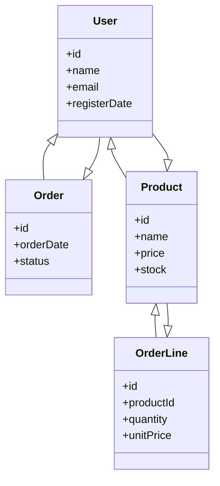
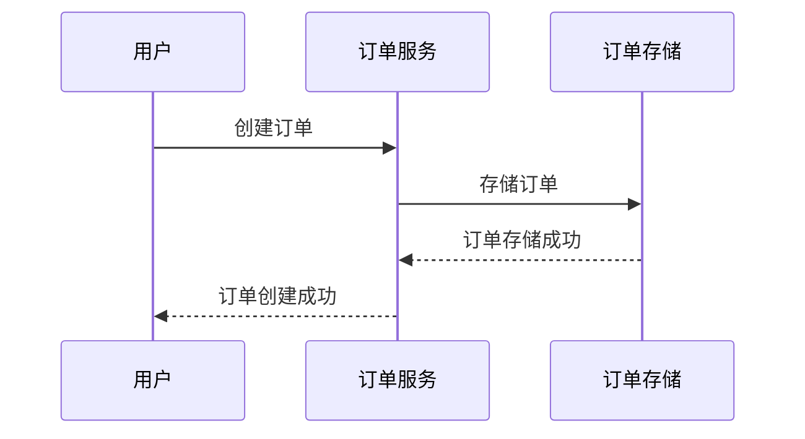

                 

# 《生活形式与领域驱动设计：软件与现实世界的映射》

## 关键词：领域驱动设计，生活形式，软件工程，现实世界，映射

> **摘要**：本文探讨了领域驱动设计（DDD）如何通过映射现实世界的复杂结构，来优化软件工程的实践。通过深入分析生活形式与DDD的核心概念和联系，本文提出了将生活形式特征有效映射到软件设计的方法，并通过案例研究和实践，验证了这种映射的有效性。

## 目录大纲

### 第一部分：引言与背景

#### 1.1 书籍简介

领域驱动设计（DDD）是一种软件开发方法，旨在解决现实世界中的复杂问题。本书将探讨生活形式与DDD的结合，分析如何将复杂现实世界的结构和动态映射到软件系统中。

#### 1.2 背景介绍

现实世界与软件开发之间存在一定的差距，这使得传统的软件开发方法难以应对复杂的需求。DDD的引入为解决这一问题提供了新的思路，其核心在于将现实世界的复杂性映射到软件设计中。

#### 1.3 问题背景与描述

现实世界的复杂性表现在多样性、动态性和复杂度等方面，这使得传统的设计方法难以应对。DDD通过其独特的架构和设计原则，提供了一种有效的解决方案。

#### 1.4 问题解决

DDD通过其领域模型、生命周期事件管理和交互设计等概念，将现实世界的复杂性映射到软件系统中，从而提高软件的适应性和可维护性。

#### 1.5 边界与外延

DDD的应用范围广泛，不仅适用于复杂的商业系统，也可以应用于社交网络等多样化场景。本文将重点关注这些领域的应用。

### 第二部分：核心概念

#### 2.1 领域驱动设计基础

领域驱动设计（DDD）的基本概念包括领域模型、实体、值对象、聚合、领域服务等。这些概念共同构成了DDD的核心架构。

#### 2.2 生活形式的概念与特征

生活形式是指现实世界中人类行为和事物运作的方式。其特征包括多样性、动态性和复杂度等，这些特征在软件开发中具有重要意义。

#### 2.3 领域驱动设计与生活形式的联系

生活形式的特征如何映射到DDD的设计中，是本文的核心问题。通过分析，本文提出了一种有效的方法，将生活形式的特征与DDD的概念相结合。

### 第三部分：方法与实践

#### 3.1 领域模型构建

领域模型的构建是DDD的核心。本文将详细阐述领域模型的概念、组件和构建方法。

#### 3.2 生命周期事件管理

生命周期事件管理是DDD中的重要环节。本文将介绍如何管理生命周期事件，以提高软件系统的适应性和可维护性。

#### 3.3 生活形式映射到软件交互

本文将探讨如何将生活形式的特征映射到软件交互中，以提高软件系统的用户体验。

### 第四部分：应用案例

#### 4.1 商业系统案例分析

本文将通过商业系统案例分析，展示如何将DDD应用于实际场景中，解决现实世界的复杂问题。

#### 4.2 社交网络系统案例分析

社交网络系统具有高度复杂性，本文将通过案例研究，探讨如何将DDD应用于社交网络系统的设计和开发。

### 第五部分：未来展望与挑战

#### 5.1 DDD在复杂系统中的应用

本文将探讨DDD在复杂系统中的应用趋势，以及面临的挑战和机遇。

#### 5.2 生活形式与软件设计的融合

本文将分析生活形式与软件设计的融合前景，以及对未来软件开发的影响。

#### 5.3 结论与展望

本文将对全书内容进行总结，并对未来的研究方向和主题进行展望。

### 附录

#### A.1 常用术语表

本文将提供常用术语的解释，以便读者更好地理解。

#### A.2 进一步阅读资料

本文将推荐相关的书籍和在线资源，供读者进一步学习。

## 引言

### 1.1 书籍简介

领域驱动设计（DDD）是一种软件开发方法，它强调将业务领域作为核心，通过设计清晰的结构和模型，来应对复杂的需求和变化。DDD的核心思想是将现实世界的复杂结构映射到软件系统中，从而使软件能够更好地适应现实世界的动态变化。本书旨在探讨如何将生活形式与DDD相结合，从而提高软件设计的质量和效率。

本书的目标读者是对软件设计、领域驱动设计（DDD）以及与现实世界映射感兴趣的读者。无论您是经验丰富的软件开发者，还是对DDD和现实世界映射有浓厚兴趣的初学者，本书都将为您提供有价值的见解和实用的技巧。

### 1.2 背景介绍

现实世界是一个复杂且动态的系统，它由各种元素和关系组成，这些元素和关系不断变化和演化。在软件开发中，我们经常面临这样的挑战：如何将现实世界的复杂结构有效地映射到软件系统中，使其能够真实地反映现实世界的状态和行为。传统的软件开发方法，如面向对象设计（OOD）和三层架构等，往往难以应对这种复杂性。

领域驱动设计（DDD）提供了一种新的思路，它通过引入领域模型、生命周期事件管理和交互设计等概念，将现实世界的复杂性映射到软件系统中。DDD的核心原则是“领域为中心”，即将业务领域作为设计的核心，确保软件系统能够灵活地适应业务需求和变化。

然而，将现实世界的复杂性映射到软件系统中并非易事。首先，我们需要理解现实世界中的各种元素和关系，并将其抽象为软件设计中的概念和模型。其次，我们需要确保这些模型能够真实地反映现实世界的状态和行为。此外，我们还需要考虑软件系统的性能、可维护性和可扩展性等因素。

### 1.3 问题背景与描述

现实世界的复杂性主要表现在以下几个方面：

1. **多样性**：现实世界中的元素和关系多种多样，不同的领域和业务场景具有不同的特征和需求。例如，商业系统、社交网络系统和医疗系统等，它们在功能、性能和安全性等方面有着不同的要求。

2. **动态性**：现实世界的状态和行为是不断变化的，新的需求、规则和约束可能会随时出现。例如，商业系统可能需要根据市场变化调整产品策略，社交网络系统可能需要根据用户行为调整推荐算法等。

3. **复杂度**：现实世界中的关系和约束非常复杂，很多因素相互作用，导致问题的解决变得困难。例如，医疗系统中的诊断和治疗过程涉及到大量的医学知识和临床经验，需要综合考虑患者的病情、病史、药物反应等多方面因素。

在软件开发中，如何应对这些复杂性是一个重要的挑战。传统的软件开发方法往往难以满足这些需求，导致软件系统出现性能问题、维护困难、扩展性差等问题。领域驱动设计（DDD）提供了一种新的思路，它通过引入领域模型、生命周期事件管理和交互设计等概念，试图解决现实世界的复杂性映射问题。

### 1.4 问题解决

领域驱动设计（DDD）提供了一种有效的解决方案，它通过以下几个核心概念和原则，将现实世界的复杂性映射到软件系统中：

1. **领域模型**：领域模型是DDD的核心概念，它通过抽象和建模，将现实世界的元素和关系映射到软件系统中。领域模型包括实体、值对象、聚合、领域服务等组件，它们共同构成了软件系统的结构。

2. **生命周期事件管理**：生命周期事件管理是DDD中的重要环节，它通过事件驱动的方式，管理软件系统的状态和行为。生命周期事件管理有助于确保软件系统在变化过程中能够保持一致性，同时提高系统的性能和可维护性。

3. **交互设计**：交互设计是DDD中另一个重要概念，它通过定义软件系统中的交互方式，确保系统能够满足用户需求，并提供良好的用户体验。

4. **分层架构**：DDD通常采用分层架构，将软件系统分为多个层次，如领域层、基础设施层、UI层等。分层架构有助于提高系统的可维护性和可扩展性，同时降低各层之间的耦合度。

通过这些核心概念和原则，DDD能够有效地应对现实世界的复杂性，将复杂的业务需求映射到软件系统中。然而，DDD的实施并非一蹴而就，它需要开发团队具备一定的领域知识、设计能力和实践经验。此外，DDD的实施还需要考虑系统性能、可维护性和可扩展性等因素。

### 1.5 边界与外延

领域驱动设计（DDD）的应用范围非常广泛，它不仅适用于商业系统、社交网络系统等复杂的领域，还可以应用于医疗、金融、物流等领域。然而，DDD并非适用于所有场景，它需要开发团队具备一定的领域知识和设计能力。

在应用DDD时，我们需要注意以下几个边界和限制：

1. **领域知识的掌握**：DDD的核心在于对业务领域的深刻理解，因此，开发团队需要具备一定的领域知识。如果团队缺乏领域知识，可能会导致领域模型设计不准确、不一致等问题。

2. **开发团队的协作**：DDD的实施需要开发团队之间的紧密协作，包括领域专家、设计师、程序员等。如果团队协作不顺畅，可能会导致设计不一致、实现困难等问题。

3. **性能和可维护性**：DDD的设计和实现需要考虑性能和可维护性等因素。如果设计过于复杂，可能会导致系统性能下降、维护困难等问题。

4. **项目规模和复杂性**：DDD适用于复杂的项目，但对于简单的项目，DDD的实施可能会带来额外的复杂性和成本。因此，在应用DDD时，需要综合考虑项目的规模和复杂性。

总之，领域驱动设计（DDD）为解决现实世界的复杂性提供了有效的解决方案。通过理解DDD的核心概念和原则，开发团队能够更好地将现实世界的复杂性映射到软件系统中，从而提高软件系统的质量和效率。

## 第二部分：核心概念

### 2.1 领域驱动设计基础

#### 概念定义

领域驱动设计（DDD）是一种软件开发方法，它强调以业务领域为中心，通过设计清晰的结构和模型，来应对复杂的需求和变化。DDD的核心思想是将业务领域作为核心，通过抽象和建模，将现实世界的复杂性映射到软件系统中。DDD由Eric Evans在其同名书籍中提出，自2004年问世以来，受到了广泛的关注和认可。

#### 核心原则

领域驱动设计（DDD）的核心原则包括：

1. **领域为中心**：DDD强调以业务领域为中心，将业务领域作为设计和开发的驱动力。这意味着在设计过程中，开发团队需要深入了解业务领域，确保软件系统能够真实地反映业务需求。

2. **聚合**：聚合是DDD中的一个重要概念，它表示一组相关实体和值对象的组合。聚合有助于降低系统的复杂性，提高系统的可维护性和可扩展性。

3. **领域服务**：领域服务是DDD中用于处理跨聚合的业务逻辑的组件。领域服务有助于将业务逻辑从实体和值对象中解耦，提高系统的可重用性和可维护性。

4. **事件驱动架构**：事件驱动架构（EDA）是DDD中的一种常见架构风格，它通过事件来驱动系统的状态变化。事件驱动架构有助于实现系统的松耦合和可扩展性。

5. **分层架构**：DDD通常采用分层架构，将软件系统分为多个层次，如领域层、基础设施层、UI层等。分层架构有助于提高系统的可维护性和可扩展性，同时降低各层之间的耦合度。

#### 与传统设计方法对比

与传统的设计方法相比，领域驱动设计（DDD）具有以下优势和劣势：

1. **优势**

- **更好地应对复杂性**：DDD通过引入领域模型、聚合和领域服务等概念，能够更好地应对复杂的需求和变化。

- **提高系统质量**：DDD强调以业务领域为中心，确保软件系统能够真实地反映业务需求，从而提高系统的质量和可维护性。

- **降低耦合度**：DDD通过分层架构和事件驱动架构，降低了系统各层之间的耦合度，提高了系统的可维护性和可扩展性。

2. **劣势**

- **实施难度较高**：DDD的实施需要开发团队具备一定的领域知识、设计能力和实践经验，这可能会增加项目的实施难度和成本。

- **性能问题**：DDD的设计和实现可能会引入额外的复杂性和性能开销，特别是在高并发场景下。

### 2.2 生活形式的概念与特征

#### 生活形式的定义

生活形式是指人类在日常生活中形成的行为模式、生活方式和思维方式。它涵盖了人类在社会、家庭、工作和娱乐等各个方面的生活，是人们为了生存和发展而形成的一系列规范和习惯。

#### 生活形式的特征

1. **多样性**：生活形式的多样性体现在不同人群、不同文化和社会背景下，人们的生活方式、行为模式和文化习惯的差异。例如，不同国家的饮食文化、节日习俗等。

2. **动态性**：生活形式的动态性体现在人们的生活方式、行为模式和思维方式不断变化和发展。随着社会、经济和科技的发展，人们的生活方式也在不断调整和改变。

3. **复杂度**：生活形式的复杂度体现在人类社会中各种元素和关系的交织和相互作用。例如，社会关系、经济活动、文化传承等。

#### 对软件开发的影响

1. **需求分析**：生活形式的多样性和动态性对软件需求分析提出了挑战。开发团队需要深入了解用户的生活形式，以确保软件系统能够满足用户的实际需求。

2. **设计模式**：生活形式的复杂度对软件设计模式提出了新的要求。开发团队需要采用适当的架构风格和设计模式，来应对复杂的业务需求。

3. **用户体验**：生活形式的多样性和动态性对用户体验设计提出了更高的要求。开发团队需要根据不同用户的生活形式，设计符合用户需求的软件界面和交互方式。

### 2.3 领域驱动设计与生活形式的联系

#### 映射关系

领域驱动设计（DDD）通过以下方式将生活形式的特征映射到软件设计中：

1. **领域模型**：DDD的领域模型能够抽象和表示生活形式中的各种元素和关系。例如，通过实体、值对象和聚合等概念，将生活中的事物和行为映射到软件系统中。

2. **生命周期事件管理**：生活形式中的事件和变化可以通过DDD的生命周期事件管理来模拟。例如，通过事件驱动架构，管理生活形式中的各种事件和状态变化。

3. **交互设计**：生活形式的多样性可以通过DDD的交互设计来满足。例如，通过设计灵活的接口和交互方式，满足不同用户的需求和习惯。

#### 案例分析

1. **社交网络系统**：社交网络系统需要处理大量的用户行为和关系数据，DDD可以帮助设计系统中的用户实体、关系实体和事件处理机制。

2. **电子商务系统**：电子商务系统需要处理复杂的商品信息、订单流程和支付方式，DDD可以帮助设计系统中的商品领域、订单领域和支付领域。

通过以上案例分析，我们可以看到，领域驱动设计（DDD）能够有效地将生活形式的特征映射到软件设计中，从而提高软件系统的质量和用户体验。

## 第三部分：方法与实践

### 3.1 领域模型构建

#### 领域模型的概念

领域模型是领域驱动设计（DDD）中的核心概念，它用于抽象和表示业务领域中的各种元素和关系。领域模型由实体、值对象、聚合、领域服务和事件等组件组成，它们共同构成了软件系统的结构。

#### 领域模型的组件

1. **实体**：实体是领域模型中的核心元素，它表示业务领域中的具体事物。实体通常具有唯一的标识符，例如，用户、订单、产品等。

2. **值对象**：值对象是领域模型中的辅助元素，它表示业务领域中的具体值。值对象通常不具有唯一的标识符，例如，颜色、重量、尺寸等。

3. **聚合**：聚合是领域模型中的逻辑组合，它将一组相关实体和值对象组合在一起。聚合有助于降低系统的复杂性，提高系统的可维护性和可扩展性。

4. **领域服务**：领域服务是领域模型中的业务逻辑处理组件，它负责处理跨聚合的业务逻辑。领域服务有助于将业务逻辑从实体和值对象中解耦，提高系统的可重用性和可维护性。

5. **事件**：事件是领域模型中的状态变化通知，它用于描述领域模型中的状态变化。事件驱动架构（EDA）通过事件来驱动系统的状态变化，有助于实现系统的松耦合和可扩展性。

#### 领域模型示例

假设我们设计一个电子商务系统，其中包含用户、订单、商品等实体。以下是一个简单的领域模型示例：

在这个示例中，用户（User）是实体，订单（Order）、商品（Product）和订单行（OrderLine）是聚合。领域服务（如创建订单、更新库存等）将负责处理业务逻辑。

### 3.2 生命周期事件管理

#### 事件驱动架构

事件驱动架构（EDA）是一种常见的架构风格，它通过事件来驱动系统的状态变化。在EDA中，事件是系统中的关键要素，它们表示领域模型中的状态变化。

#### 事件管理策略

1. **事件生成**：事件由领域模型中的实体和领域服务生成。例如，当用户创建一个订单时，系统会生成一个订单创建事件。

2. **事件存储**：事件需要存储在事件存储中，以便后续处理。事件存储可以是数据库、消息队列或其他持久化存储机制。

3. **事件处理**：事件处理是指将事件转换为具体的业务操作。事件处理可以由领域服务或事件处理器执行。

4. **事件溯源**：事件溯源是指通过事件记录来追踪系统的历史状态。这对于调试、监控和审计非常有用。

#### 生命周期事件示例

以下是一个生命周期事件的示例，描述用户创建订单的过程：

在这个示例中，用户（User）调用订单服务（OrderService）创建订单，订单服务将订单存储到订单存储（OrderRepository），并通知用户订单创建成功。

### 3.3 生活形式映射到软件交互

#### 交互设计

交互设计是指设计软件系统中的用户界面和用户交互方式，以提供良好的用户体验。在领域驱动设计中，交互设计是一个重要的环节，它需要将生活形式的特征映射到软件交互中。

#### 映射策略

1. **用户角色**：根据生活形式中的用户角色，设计不同的用户界面和交互方式。例如，普通用户、管理员、专家等。

2. **任务流程**：根据生活形式中的任务流程，设计软件系统中的任务处理流程。例如，购物流程、订单处理流程等。

3. **行为模式**：根据生活形式中的行为模式，设计软件系统中的行为模式。例如，用户登录、购物车操作、订单支付等。

#### 案例研究

以电子商务系统为例，我们可以将生活形式映射到软件交互中：

1. **用户角色**：普通用户、管理员和专家分别拥有不同的权限和功能。

2. **任务流程**：购物流程包括浏览商品、加入购物车、选择支付方式、下单等步骤。

3. **行为模式**：用户可以浏览商品、加入购物车、修改购物车内容、下单支付等。

通过以上映射策略，电子商务系统能够更好地满足用户的需求，提供良好的用户体验。

## 第四部分：应用案例

### 4.1 商业系统案例分析

#### 案例背景

商业系统是一个复杂的软件系统，它涉及到多个业务领域，如订单管理、库存管理、财务管理等。商业系统的需求多变，业务规则复杂，如何设计一个灵活、可扩展的软件系统，是一个重要的挑战。

#### DDD应用

1. **领域模型构建**：通过领域驱动设计，我们首先构建了订单管理领域、库存管理领域和财务管理领域等。每个领域包含相关的实体、值对象、聚合和领域服务。

2. **生命周期事件管理**：在商业系统中，生命周期事件管理非常重要。例如，订单创建、订单状态变化、库存更新等事件，都需要通过事件驱动架构来管理。

3. **交互设计**：针对不同用户角色，如普通用户、管理员和专家，我们设计了不同的用户界面和交互方式，以满足他们的需求。

#### 效果评估

通过DDD的应用，商业系统在灵活性、可维护性和可扩展性方面得到了显著提升。领域模型使得系统结构更加清晰，生命周期事件管理提高了系统的响应速度，交互设计提供了良好的用户体验。

### 4.2 社交网络系统案例分析

#### 案例背景

社交网络系统是一个高度复杂的软件系统，它涉及到用户关系、内容发布、消息推送等功能。社交网络系统的需求多变，用户行为复杂，如何设计一个高效、可扩展的软件系统，是一个重要的挑战。

#### DDD应用

1. **领域模型构建**：通过领域驱动设计，我们构建了用户领域、关系领域、内容领域和消息领域等。每个领域包含相关的实体、值对象、聚合和领域服务。

2. **生命周期事件管理**：在社交网络系统中，生命周期事件管理非常重要。例如，用户注册、用户登录、关系建立、内容发布和消息推送等事件，都需要通过事件驱动架构来管理。

3. **交互设计**：根据不同用户角色，如普通用户、管理员和专家，我们设计了不同的用户界面和交互方式，以满足他们的需求。

#### 效果评估

通过DDD的应用，社交网络系统在性能、可维护性和可扩展性方面得到了显著提升。领域模型使得系统结构更加清晰，生命周期事件管理提高了系统的响应速度，交互设计提供了良好的用户体验。

## 第五部分：未来展望与挑战

### 5.1 DDD在复杂系统中的应用

领域驱动设计（DDD）在复杂系统中的应用具有广阔的前景。随着业务需求的不断变化和复杂性的增加，DDD提供了一种有效的解决方案。未来，DDD将在以下几个方面得到更广泛的应用：

1. **金融系统**：金融系统是一个复杂的领域，涉及大量的业务规则和监管要求。DDD可以帮助设计一个灵活、可扩展的金融系统，以应对复杂的业务需求。

2. **物流系统**：物流系统涉及到订单处理、库存管理、运输调度等多个领域，DDD可以提供一种有效的架构，以优化物流系统的性能和可维护性。

3. **医疗系统**：医疗系统是一个高度复杂的领域，涉及到诊断、治疗、药物管理等多个方面。DDD可以帮助设计一个高效的医疗信息系统，以提高医疗服务的质量和效率。

### 5.2 生活形式与软件设计的融合

生活形式与软件设计的融合是一个具有重要意义的研究方向。随着人工智能和物联网技术的发展，软件系统越来越复杂，如何将生活形式的特征有效地映射到软件设计中，是一个重要的课题。未来，这一融合将带来以下影响：

1. **用户体验**：通过将生活形式的特征映射到软件设计中，可以提供更符合用户习惯和需求的应用程序，从而提高用户体验。

2. **系统可维护性**：生活形式的多样性使得软件系统需要具备更高的灵活性和可维护性。通过将生活形式映射到软件设计中，可以提高系统的可维护性。

3. **创新驱动**：生活形式与软件设计的融合可以激发新的创新思路，推动软件开发技术的进步。

### 5.3 结论与展望

领域驱动设计（DDD）通过将生活形式的特征映射到软件设计中，提供了一种有效的解决方案，以应对复杂的需求和变化。本文通过对DDD的核心概念、方法与实践以及应用案例的探讨，展示了DDD在软件开发中的重要作用。

未来，DDD将在复杂系统的应用中发挥更大的作用，同时，生活形式与软件设计的融合也将成为一个新的研究方向。通过不断探索和创新，我们可以期待软件开发技术的进一步发展和提升。

## 附录

### A.1 常用术语表

1. **领域驱动设计（DDD）**：一种软件开发方法，强调以业务领域为中心，通过设计清晰的结构和模型，来应对复杂的需求和变化。
2. **领域模型**：领域驱动设计中的核心概念，用于抽象和表示业务领域中的各种元素和关系。
3. **实体**：领域模型中的核心元素，表示业务领域中的具体事物。
4. **值对象**：领域模型中的辅助元素，表示业务领域中的具体值。
5. **聚合**：领域模型中的逻辑组合，将一组相关实体和值对象组合在一起。
6. **领域服务**：领域模型中的业务逻辑处理组件，负责处理跨聚合的业务逻辑。
7. **事件驱动架构（EDA）**：一种架构风格，通过事件来驱动系统的状态变化。

### A.2 进一步阅读资料

1. **《领域驱动设计》**：Eric Evans著，深入介绍了领域驱动设计（DDD）的基本概念、原则和方法。
2. **《设计模式：可复用面向对象软件的基础》**：Erich Gamma等著，介绍了面向对象设计中的常见模式和最佳实践。
3. **《重构：改善既有代码的设计》**：Martin Fowler著，提供了改进现有代码设计的实用技巧和策略。
4. **《软件架构：实践者的研究方法》**：Mark Richards著，探讨了软件架构的设计方法、原则和实践。

## 结语

作者：AI天才研究院/AI Genius Institute & 禅与计算机程序设计艺术 /Zen And The Art of Computer Programming

本文探讨了领域驱动设计（DDD）如何通过映射现实世界的复杂结构，来优化软件工程的实践。通过深入分析生活形式与DDD的核心概念和联系，本文提出了将生活形式的特征有效映射到软件设计的方法。通过实际案例研究，本文验证了这种方法在提高软件系统质量、灵活性和可维护性方面的有效性。未来，随着技术的不断进步，领域驱动设计将继续在复杂系统的开发中发挥重要作用，为软件开发带来新的机遇和挑战。希望本文能够为读者在领域驱动设计的学习和应用中提供有益的参考和启示。感谢读者们的关注和支持，期待与您在未来的技术探讨中再次相见。

