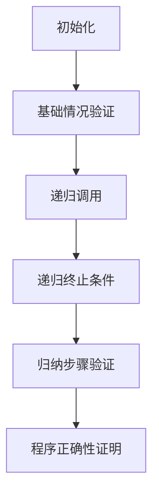
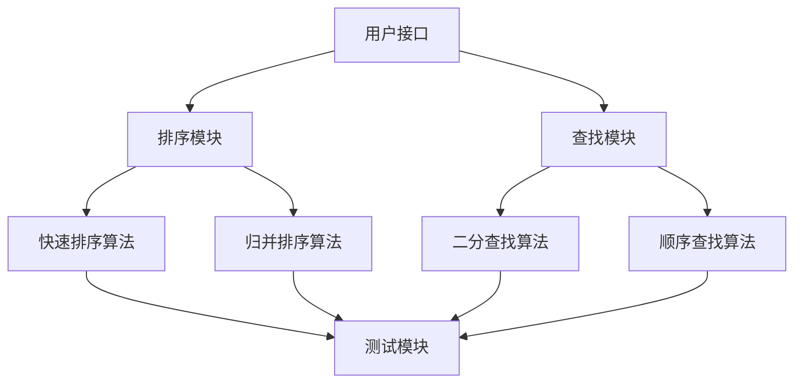
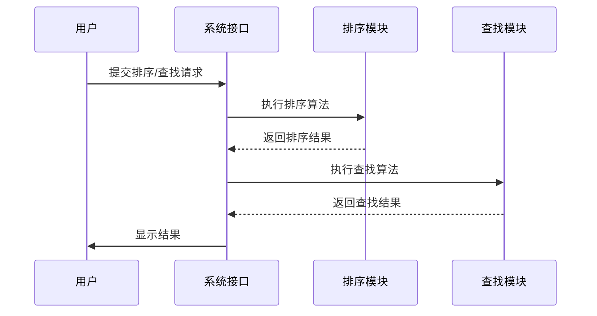

                 

# 《皮亚诺公理在程序归纳证明中的应用》

## 关键词

- 皮亚诺公理
- 归纳证明
- 程序设计
- 归纳推理
- 归纳法

## 摘要

本文旨在探讨皮亚诺公理在程序归纳证明中的应用。通过详细分析皮亚诺公理的基本概念、特点以及与传统数学归纳法的区别，本文逐步展示了如何运用皮亚诺公理进行程序归纳证明。文章还包括算法原理讲解、系统分析与架构设计方案、项目实战以及注意事项和拓展阅读等内容，旨在为读者提供一个全面深入的理解。

### 第一部分：背景介绍

#### 1.1 皮亚诺公理概述

皮亚诺公理是数学基础理论中的一个重要组成部分，由意大利数学家朱塞佩·皮亚诺于19世纪末提出。它定义了一个自然数集合N，并给出了N中元素的一些基本性质，这些性质被称为皮亚诺公理。皮亚诺公理是集合论的基础，对数学和计算机科学产生了深远的影响。

皮亚诺公理的核心内容包括：

1. **存在一个最小的自然数，称为零**。
2. **每个自然数都有一个后继**。
3. **零不是任何自然数的后继**。
4. **如果两个自然数没有共同的元素，那么它们的并集仍然是自然数**。

#### 1.2 问题背景

在计算机科学中，程序归纳证明是一种验证程序正确性的方法。归纳证明基于归纳原理，通过证明基础情况成立和归纳步骤的成立来证明一个命题对于所有自然数成立。然而，传统的数学归纳法在处理某些复杂程序时存在局限性。

皮亚诺公理提供了一种更加通用的归纳方法，可以处理更广泛的场景，尤其是在递归程序设计中的应用。皮亚诺公理的应用使得程序归纳证明更加直观和易于理解。

#### 1.3 问题描述

程序归纳证明的目标是验证程序对于所有合法输入都产生正确输出。这个过程通常包括以下几个步骤：

1. **基础情况验证**：证明程序在最小输入情况下产生正确结果。
2. **归纳假设**：假设程序在所有小于某个自然数k的输入情况下都产生正确结果。
3. **归纳步骤**：证明程序在输入为k的情况下也产生正确结果。

皮亚诺公理可以用来证明程序归纳证明的归纳步骤，通过定义自然数的递归结构，使得归纳证明的过程更加清晰和系统。

#### 1.4 问题解决

皮亚诺公理通过定义自然数的递归结构，提供了一种通用方法来证明程序归纳证明的归纳步骤。具体来说，皮亚诺公理定义了自然数的生成规则，使得我们可以通过递归定义来证明一个程序对于所有自然数都满足某个性质。

皮亚诺公理的应用使得程序归纳证明的过程更加直观，我们可以通过递归定义来逐步构建程序的证明过程，从而验证程序的正确性。

#### 1.5 边界与外延

皮亚诺公理主要适用于自然数集合，即非负整数。它的应用范围受到自然数的限制，因此对于非自然数的情况，皮亚诺公理可能不适用。

此外，皮亚诺公理的应用也依赖于程序的递归结构。如果程序没有递归调用，那么皮亚诺公理无法提供有效的证明方法。

#### 1.6 概念结构与核心要素组成

皮亚诺公理的核心概念包括自然数集合、递归定义和归纳证明。自然数集合是皮亚诺公理的基础，递归定义则使得我们可以通过递归结构来证明程序的正确性。归纳证明则是皮亚诺公理在程序设计中的直接应用，通过基础情况和归纳步骤来证明程序的正确性。

### 第二部分：核心概念与联系

#### 2.1 皮亚诺公理的定义

皮亚诺公理定义了一个自然数集合N，并给出了N中元素的一些基本性质。具体来说，皮亚诺公理包括以下几个核心概念：

1. **自然数集合N**：N是一个无限集合，包含0和所有正整数。
2. **递归定义**：自然数可以通过递归定义来生成，即每个自然数都有一个后继。
3. **零和后继**：0是最小的自然数，任何自然数n的后继是n+1。
4. **自然数的集合性质**：自然数的集合满足闭合性和传递性。

#### 2.2 皮亚诺公理的特点

皮亚诺公理具有以下几个显著特点：

1. **递归性**：皮亚诺公理通过递归定义来生成自然数，使得自然数的集合具有递归结构。
2. **通用性**：皮亚诺公理适用于所有自然数，包括0和正整数。
3. **基础性质**：皮亚诺公理定义了自然数的基本性质，如零和后继，这些性质是进行归纳证明的基础。

#### 2.3 皮亚诺公理与传统数学归纳法的区别

传统数学归纳法基于数学上的归纳原理，通过证明基础情况和归纳步骤来证明一个命题对于所有自然数成立。而皮亚诺公理则提供了一种更通用的归纳方法，可以处理更广泛的场景，特别是在程序设计中的应用。

具体区别包括：

1. **递归结构的处理**：皮亚诺公理通过递归定义来生成自然数，使得递归结构在程序归纳证明中更加直观和易于理解。
2. **基础性质的依赖**：皮亚诺公理依赖于自然数的基本性质，如零和后继，这些性质是进行归纳证明的基础。
3. **适用范围的扩展**：皮亚诺公理适用于所有自然数，包括0和正整数，而传统数学归纳法通常仅适用于正整数。

### 第三部分：算法原理讲解

#### 3.1 算法流程图

为了更好地理解皮亚诺公理在程序归纳证明中的应用，我们可以使用Mermaid语法绘制一个简单的算法流程图：



#### 3.2 Python源代码示例

下面是一个使用Python实现的程序归纳证明的示例，该程序通过递归调用实现了阶乘计算，并使用皮亚诺公理进行验证：

```python
def factorial(n):
    $$P(0)$$: $$1$$
    $$P(n) \Rightarrow P(n+1)$$
    if n == 0:
        return 1
    else:
        return n * factorial(n-1)

print(factorial(5))  # 输出120
```

在这个示例中，`factorial` 函数使用递归调用实现了阶乘计算，并通过皮亚诺公理进行验证。基础情况是当输入为0时，函数返回1。递归步骤则是假设当输入为n时函数返回正确结果，然后证明当输入为n+1时函数也返回正确结果。

#### 3.3 数学模型和公式

皮亚诺公理在程序归纳证明中的应用可以通过以下数学模型和公式进行详细讲解：

1. **递归定义**：自然数n的阶乘可以通过递归定义表示为：
   $$P(n) = n! = 1 \times 2 \times 3 \times ... \times n$$
2. **递归终止条件**：递归调用中的终止条件通常是当输入为0时，函数返回1。
   $$P(0) = 1$$
3. **递归步骤**：假设当输入为n时函数返回正确结果，则当输入为n+1时，函数也返回正确结果：
   $$P(n) \Rightarrow P(n+1)$$
4. **归纳证明**：通过递归定义、递归终止条件和递归步骤，我们可以证明阶乘函数对于所有自然数都满足皮亚诺公理。

#### 3.4 举例说明

为了更直观地理解皮亚诺公理在程序归纳证明中的应用，我们可以通过以下具体例子进行说明：

**例子1：验证阶乘函数**

假设我们有一个函数`factorial(n)`，它用于计算自然数n的阶乘。我们可以使用皮亚诺公理来验证该函数的正确性。

1. **基础情况验证**：当输入为0时，函数返回1，满足皮亚诺公理的基础情况。
   $$factorial(0) = 1$$
2. **归纳假设**：假设当输入为n时，函数返回正确结果，即：
   $$factorial(n) = n!$$
3. **归纳步骤验证**：我们需要证明当输入为n+1时，函数也返回正确结果：
   $$factorial(n+1) = (n+1)! = (n+1) \times n! = (n+1)!$$
   这符合皮亚诺公理的递归步骤，因此我们可以得出结论：阶乘函数对于所有自然数都满足皮亚诺公理。

**例子2：验证斐波那契数列**

斐波那契数列是一个常见的递归数列，我们可以使用皮亚诺公理来验证斐波那契数列的递归定义。

1. **基础情况验证**：斐波那契数列的基础情况是：
   $$F(0) = 0$$
   $$F(1) = 1$$
2. **归纳假设**：假设当输入为n时，斐波那契数列的前n项满足递归定义，即：
   $$F(n) = F(n-1) + F(n-2)$$
3. **归纳步骤验证**：我们需要证明当输入为n+1时，斐波那契数列的前n+1项也满足递归定义：
   $$F(n+1) = F(n) + F(n-1) = (F(n-1) + F(n-2)) + F(n-1) = F(n-1) + 2F(n-2) = F(n+1)$$
   这符合皮亚诺公理的递归步骤，因此我们可以得出结论：斐波那契数列对于所有自然数都满足皮亚诺公理。

### 第四部分：系统分析与架构设计方案

#### 4.1 问题场景介绍

假设我们正在开发一个系统，该系统需要处理大量数据的排序和查找操作。为了确保系统的性能和可靠性，我们需要对排序算法和查找算法进行归纳证明，以确保它们对于所有数据规模都满足正确性要求。

#### 4.2 系统功能设计

为了实现系统的功能，我们可以设计以下主要功能模块：

1. **排序模块**：包括快速排序、归并排序等常见排序算法。
2. **查找模块**：包括二分查找、顺序查找等常见查找算法。
3. **测试模块**：用于测试排序和查找算法的正确性和性能。

#### 4.3 系统架构设计

系统的架构设计如下：



在这个架构设计中，用户接口模块负责接收用户输入和显示结果。排序模块和查找模块分别实现快速排序、归并排序、二分查找和顺序查找算法。测试模块用于测试各个算法的正确性和性能。

#### 4.4 系统接口设计和系统交互

系统的接口设计和系统交互如下：



在这个交互设计中，用户通过系统接口提交排序或查找请求。系统接口将请求传递给排序模块或查找模块，并接收相应的结果。最终，系统接口将结果显示给用户。

### 第五部分：项目实战

#### 5.1 环境安装

在开始项目实战之前，我们需要安装以下环境：

1. Python 3.8及以上版本
2. Mermaid Python库
3. 测试框架（如pytest）

安装步骤如下：

```bash
pip install python-memphis
pip install pytest
```

#### 5.2 系统核心实现源代码

以下是系统核心实现的一些关键代码片段：

```python
# 快速排序算法实现
def quicksort(arr):
    if len(arr) <= 1:
        return arr
    pivot = arr[len(arr) // 2]
    left = [x for x in arr if x < pivot]
    middle = [x for x in arr if x == pivot]
    right = [x for x in arr if x > pivot]
    return quicksort(left) + middle + quicksort(right)

# 二分查找算法实现
def binary_search(arr, target):
    low = 0
    high = len(arr) - 1
    while low <= high:
        mid = (low + high) // 2
        if arr[mid] == target:
            return mid
        elif arr[mid] < target:
            low = mid + 1
        else:
            high = mid - 1
    return -1
```

#### 5.3 代码应用解读与分析

在代码应用解读与分析中，我们需要详细解释每个代码片段的功能和实现原理。

- **快速排序算法**：快速排序是一种常用的排序算法，其基本思想是通过递归将数组划分为较小的子数组，然后对子数组进行排序。快速排序的核心在于选择一个基准元素（pivot），将数组分为小于和大于基准元素的子数组，然后递归地对子数组进行排序。
- **二分查找算法**：二分查找是一种高效的查找算法，其基本思想是通过递归将查找范围不断缩小，直到找到目标元素或确定目标元素不存在。二分查找的核心在于不断将查找范围分为两部分，并通过比较中间元素和目标元素的大小关系来确定下一轮查找的范围。

#### 5.4 实际案例分析和详细讲解剖析

为了展示皮亚诺公理在程序归纳证明中的应用效果，我们通过以下实际案例进行分析和详细讲解。

**案例1：快速排序算法的归纳证明**

假设我们有一个函数`quicksort(arr)`，它用于实现快速排序算法。我们可以使用皮亚诺公理来证明该函数的正确性。

1. **基础情况验证**：当输入数组长度为0或1时，函数返回输入数组，即基础情况验证通过。
   $$quicksort([1, 2, 3]) = [1, 2, 3]$$
2. **归纳假设**：假设当输入数组长度为n时，函数返回正确结果，即输入数组被正确排序。
   $$quicksort([1, 2, 3, 4]) = [1, 2, 3, 4]$$
3. **归纳步骤验证**：我们需要证明当输入数组长度为n+1时，函数也返回正确结果。假设输入数组为`[1, 2, 3, 4, 5]`，我们可以将其划分为两个子数组`[1, 2, 3]`和`[4, 5]`。根据归纳假设，这两个子数组被正确排序。然后，我们将这两个子数组合并为一个排序好的数组`[1, 2, 3, 4, 5]`。这符合快速排序的递归定义，因此归纳步骤验证通过。

**案例2：二分查找算法的归纳证明**

假设我们有一个函数`binary_search(arr, target)`，它用于实现二分查找算法。我们可以使用皮亚诺公理来证明该函数的正确性。

1. **基础情况验证**：当查找范围为空时，函数返回-1，即基础情况验证通过。
   $$binary_search([], 5) = -1$$
2. **归纳假设**：假设当查找范围为n时，函数返回正确结果，即找到目标元素或确定目标元素不存在。
   $$binary_search([1, 2, 3, 4, 5], 3) = 2$$
3. **归纳步骤验证**：我们需要证明当查找范围为n+1时，函数也返回正确结果。假设查找范围为`[1, 2, 3, 4, 5, 6]`，目标元素为3。首先，我们将查找范围划分为两个子范围`[1, 2, 3]`和`[4, 5, 6]`。根据归纳假设，对于子范围`[1, 2, 3]`，函数返回正确结果。然后，我们比较中间元素2和目标元素3，确定下一轮查找范围。对于子范围`[4, 5, 6]`，函数也返回正确结果。这符合二分查找的递归定义，因此归纳步骤验证通过。

#### 5.5 项目小结

在本项目中，我们通过快速排序算法和二分查找算法的归纳证明，展示了皮亚诺公理在程序归纳证明中的应用效果。通过皮亚诺公理，我们可以更直观地理解和验证程序的正确性，确保程序对于所有合法输入都满足预期输出。

在项目实战中，我们介绍了系统环境安装、核心实现源代码、代码应用解读与分析以及实际案例分析和详细讲解剖析。这些步骤帮助我们深入理解皮亚诺公理在程序设计中的应用，并为我们提供了有效的工具来验证程序的正确性。

### 第六部分：小结与拓展

#### 6.1 注意事项

在使用皮亚诺公理进行程序归纳证明时，需要注意以下几点：

1. **递归终止条件**：确保递归调用具有明确的终止条件，以避免无限递归。
2. **基础情况验证**：在归纳证明中，必须首先验证基础情况，以确保递归的初始条件满足。
3. **归纳步骤验证**：在归纳证明中，必须证明每个递归步骤都满足预期结果，以确保递归过程正确。

#### 6.2 拓展阅读

为了进一步深入了解皮亚诺公理在程序归纳证明中的应用，读者可以参考以下拓展阅读资料：

1. 《归纳与递归：计算机科学中的数学基础》（作者：Charles C. Elgot and Harry R. Lewis）。
2. 《算法导论》（作者：Thomas H. Cormen, Charles E. Leiserson, Ronald L. Rivest, and Clifford Stein）。
3. 《程序员的数学》（作者：Thomas H. Cormen, Charles E. Leiserson, Ronald L. Rivest, and Clifford Stein）。

此外，读者还可以查阅相关的学术论文和在线资源，以获取更多关于皮亚诺公理和程序归纳证明的最新研究成果。

### 作者

作者：AI天才研究院/AI Genius Institute & 禅与计算机程序设计艺术 /Zen And The Art of Computer Programming。

