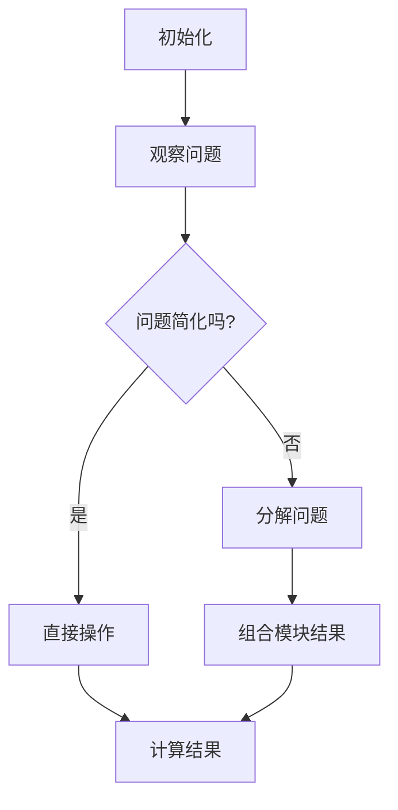
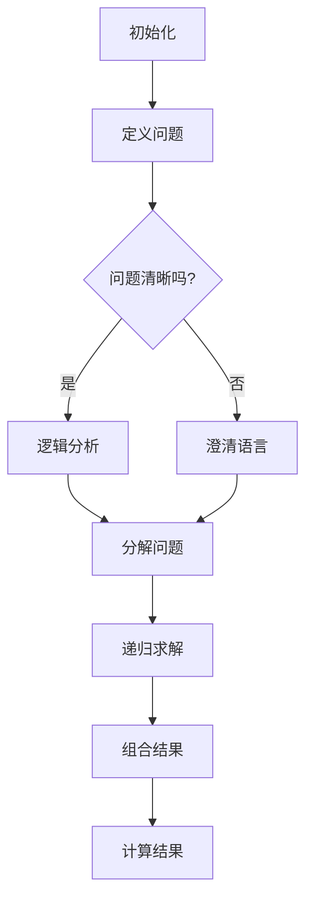
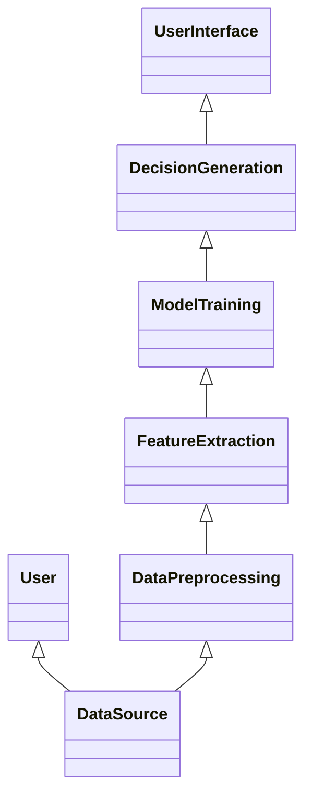
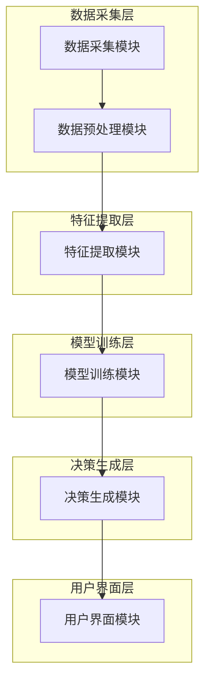
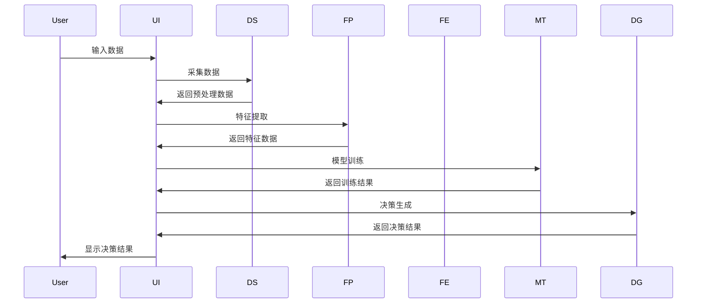

                 

### 直觉与分析：柏格森与维特根斯坦的方法论

> 关键词：柏格森、维特根斯坦、直觉、分析、哲学、方法论

在哲学和认知科学领域，直觉与分析始终是两对备受关注的主题。法国哲学家亨利·柏格森（Henri Bergson）与英国哲学家路德维希·维特根斯坦（Ludwig Wittgenstein）都曾对这两个概念进行深刻的探讨，并在他们的思想体系中提出了独特的见解。本文将探讨柏格森与维特根斯坦在直觉与分析方面的方法论，通过对比和分析，以期揭示他们在哲学认知方面的异同点及其对现代人工智能技术的潜在影响。

### 摘要

本文旨在通过深入剖析亨利·柏格森和路德维希·维特根斯坦关于直觉与分析的方法论，探讨这两位哲学家的思想在计算机科学和人工智能领域的应用。文章将首先介绍两位哲学家的生平和哲学思想，接着讨论直觉与分析的定义及其关系，进而分析柏格森和维特根斯坦的方法论。随后，文章将比较直觉主义和分析哲学在算法原理和数学模型上的异同，并探讨这些方法在系统分析与架构设计中的应用。通过本文的论述，希望能够为读者提供一个全面而深入的视角，理解直觉与分析在哲学和现代技术中的重要性。

### 目录大纲

第一部分：背景介绍

1.1 问题背景

1.1.1 柏格森与维特根斯坦的生平介绍

1.1.2 柏格森与维特根斯坦的哲学思想概述

1.2 问题描述

1.2.1 直觉与分析的定义

1.2.2 直觉与分析的关系

1.2.3 直觉与分析在柏格森与维特根斯坦思想中的体现

1.3 问题解决

1.3.1 柏格森的方法论

1.3.2 维特根斯坦的方法论

1.4 边界与外延

1.4.1 直觉与分析的边界

1.4.2 柏格森与维特根斯坦的方法论的外延

1.5 概念结构与核心要素组成

1.5.1 直觉与分析的概念结构

1.5.2 柏格森与维特根斯坦的方法论的核心要素组成

第二部分：核心概念与联系

2.1 柏格森的直觉主义

2.1.1 直觉主义的定义与特点

2.1.2 直觉主义的哲学意义

2.1.3 柏格森直觉主义的贡献

2.2 维特根斯坦的分析哲学

2.2.1 分析哲学的定义与特点

2.2.2 分析哲学的哲学意义

2.2.3 维特根斯坦分析哲学的贡献

2.3 直觉与分析的比较

2.3.1 直觉与分析的异同点

2.3.2 直觉与分析的关系

2.3.3 柏格森与维特根斯坦对直觉与分析的不同观点

第三部分：算法原理讲解

3.1 直觉主义算法的原理

3.1.1 直觉主义算法的定义

3.1.2 直觉主义算法的基本概念

3.1.3 直觉主义算法的核心算法

3.2 分析哲学算法的原理

3.2.1 分析哲学算法的定义

3.2.2 分析哲学算法的基本概念

3.2.3 分析哲学算法的核心算法

3.3 直觉主义与分析哲学算法的比较

3.3.1 直觉主义算法与分析哲学算法的异同点

3.3.2 直觉主义算法与分析哲学算法的应用场景

3.3.3 直觉主义算法与分析哲学算法的优缺点分析

第四部分：数学模型和数学公式

4.1 直觉主义数学模型

4.1.1 直觉主义数学模型的定义

4.1.2 直觉主义数学模型的基本公式

4.1.3 直觉主义数学模型的实际应用

4.2 分析哲学数学模型

4.2.1 分析哲学数学模型的定义

4.2.2 分析哲学数学模型的基本公式

4.2.3 分析哲学数学模型的实际应用

4.3 直觉主义与分析哲学数学模型的比较

4.3.1 直觉主义数学模型与分析哲学数学模型的异同点

4.3.2 直觉主义数学模型与分析哲学数学模型的应用场景

4.3.3 直觉主义数学模型与分析哲学数学模型的优缺点分析

第五部分：系统分析与架构设计

5.1 问题场景介绍

5.1.1 直觉主义与分析哲学在计算机科学中的应用场景

5.1.2 应用场景中的问题与挑战

5.2 项目介绍

5.2.1 项目背景与目标

5.2.2 项目组成与分工

5.2.3 项目实施计划

5.3 系统功能设计

5.3.1 领域模型设计

5.3.2 系统功能模块划分

5.3.3 功能模块详细介绍

5.4 系统架构设计

5.4.1 系统架构设计原则

5.4.2 系统架构设计方案

5.4.3 系统架构设计的关键技术

5.5 系统接口设计

5.5.1 系统接口设计原则

5.5.2 系统接口设计方案

5.5.3 系统接口设计的关键技术

### 第一部分：背景介绍

#### 1.1 问题背景

直觉与分析是哲学和认知科学中两个基本概念，它们不仅在哲学研究中具有重要地位，而且在人工智能、认知科学和计算机科学领域也有着广泛的应用。柏格森和维特根斯坦作为20世纪最杰出的哲学家之一，他们对直觉与分析进行了深入的探讨，提出了各自独特的见解。

直觉通常指的是一种迅速的、非理性的认知过程，它使我们能够快速地理解复杂情境或做出判断。而分析则是指通过逻辑推理、逐步论证等方式对事物进行深入理解和分析。直觉与分析之间的关系以及如何有效地运用这两种方法，成为哲学和认知科学研究中的重要问题。

#### 1.1.1 柏格森与维特根斯坦的生平介绍

亨利·柏格森（Henri Bergson，1859-1941）是法国哲学家，以其对直觉主义和时间概念的研究而闻名。他毕业于巴黎高等师范学院，并在哲学、数学和物理学等领域取得了卓越的学术成就。柏格森的哲学思想强调生命力和创造力，主张直觉是理解世界的关键。

路德维希·维特根斯坦（Ludwig Wittgenstein，1889-1951）是奥地利-英国哲学家，以其对语言哲学和逻辑哲学的贡献而著称。维特根斯坦的早期作品《逻辑哲学论》提出了逻辑原子论和世界图景理论，而其晚期作品《哲学研究》则对语言和思维的多样性进行了深入探讨。

#### 1.1.2 柏格森与维特根斯坦的哲学思想概述

柏格森的哲学思想主要体现在其直觉主义中。他认为，直觉是人类理解世界的关键，是理解生命力和创造力的基础。柏格森强调，直觉是一种直接的、非逻辑的认知过程，它超越了一般认知过程的理性分析。

维特根斯坦的哲学思想则主要体现在分析哲学中。他主张，哲学的主要任务是澄清思想和语言的混乱，通过分析语言和思维的逻辑结构来揭示真理。维特根斯坦认为，直觉在哲学研究中并不是核心，逻辑分析和语言澄清才是关键。

#### 1.2 问题描述

直觉与分析的关系是一个复杂且深远的问题。直觉通常被视为一种非理性、迅速的认知过程，而分析则是一种理性、逐步的认知过程。尽管直觉和分析在认知过程中都发挥着重要作用，但它们之间的关系并不总是清晰明了。

1.2.1 直觉与分析的定义

直觉（Intuition）：直觉是指一种非逻辑的、直接的认知过程，它使我们能够迅速地理解复杂情境或做出判断。直觉通常被认为是非理性的，但它在认知过程中发挥着重要作用。

分析（Analysis）：分析是指通过逻辑推理、逐步论证等方式对事物进行深入理解和分析。分析是一种理性、系统的认知过程，它旨在揭示事物的本质和规律。

1.2.2 直觉与分析的关系

直觉与分析之间的关系是复杂且多元的。一方面，直觉与分析都是认知过程中的重要组成部分。直觉提供了快速理解和决策的能力，而分析则提供了深入和系统的理解。另一方面，直觉和分析之间存在一定的对立关系。直觉通常被视为非理性的，而分析则被视为理性的。然而，这种对立并不是绝对的，直觉和分析在很多情况下是相辅相成的。

1.2.3 直觉与分析在柏格森与维特根斯坦思想中的体现

在柏格森的直觉主义中，直觉是理解世界的关键。他认为，直觉使我们能够直接感知到生命的流动和创造力。柏格森的直觉主义强调直觉的非逻辑性和直接性，认为直觉是一种超越理性分析的认知方式。

维特根斯坦的分析哲学则强调逻辑分析和语言澄清的重要性。他认为，直觉并不是哲学研究的核心，逻辑分析和语言澄清才是揭示真理的关键。维特根斯坦的分析哲学强调理性和系统性的重要性，认为通过分析可以澄清思想和语言的混乱。

#### 1.3 问题解决

1.3.1 柏格森的方法论

柏格森的方法论主要基于其直觉主义。他认为，通过直觉，我们可以直接感知到世界的本质和创造力。柏格森的方法论强调以下几点：

- 直觉是一种直接的、非逻辑的认知过程，它超越了一般认知过程的理性分析。
- 直觉是我们理解生命力和创造力的基础。
- 直觉使我们能够迅速地理解和应对复杂情境。

1.3.2 维特根斯坦的方法论

维特根斯坦的方法论主要基于其分析哲学。他认为，通过逻辑分析和语言澄清，我们可以揭示真理和理解世界。维特根斯坦的方法论强调以下几点：

- 哲学的主要任务是澄清思想和语言的混乱。
- 逻辑分析和语言澄清是揭示真理的关键。
- 通过分析语言和思维的逻辑结构，我们可以理解事物的本质和规律。

#### 1.4 边界与外延

1.4.1 直觉与分析的边界

直觉与分析的边界是一个复杂的问题。直觉通常被视为一种非逻辑的认知过程，而分析则被视为一种理性、逐步的认知过程。然而，这种边界并不是绝对的。在实际认知过程中，直觉和分析往往是相辅相成的。直觉提供了快速理解和决策的能力，而分析则提供了深入和系统的理解。因此，直觉与分析之间的边界是相对的，取决于具体的应用场景和研究目的。

1.4.2 柏格森与维特根斯坦的方法论的外延

柏格森的直觉主义方法论主要适用于理解生命力和创造力的情境。他的直觉主义强调直觉的直接性和非逻辑性，认为直觉是理解世界的关键。柏格森的方法论在心理学、生物学和艺术等领域有着广泛的应用。

维特根斯坦的分析哲学方法论主要适用于逻辑分析和语言澄清的情境。他的分析哲学强调理性和系统性的重要性，认为通过分析可以澄清思想和语言的混乱。维特根斯坦的方法论在哲学、逻辑学、计算机科学等领域有着广泛的应用。

#### 1.5 概念结构与核心要素组成

1.5.1 直觉与分析的概念结构

直觉与分析是两个基本认知概念，它们在哲学、认知科学和计算机科学等领域有着广泛的应用。直觉通常被视为一种非逻辑的、直接的认知过程，而分析则被视为一种理性、逐步的认知过程。直觉和分析在认知过程中都发挥着重要作用，但它们之间的关系和边界是一个复杂的问题。

1.5.2 柏格森与维特根斯坦的方法论的核心要素组成

柏格森的直觉主义方法论的核心要素包括直觉、生命力和创造力。他强调直觉的直接性和非逻辑性，认为直觉是理解世界的关键。柏格森的方法论在理解生命力和创造力的情境中具有独特的价值。

维特根斯坦的分析哲学方法论的核心要素包括逻辑分析、语言澄清和理性思考。他强调逻辑分析和语言澄清的重要性，认为通过分析可以澄清思想和语言的混乱。维特根斯坦的方法论在哲学、逻辑学、计算机科学等领域具有广泛的应用。

### 第一部分总结

在本部分中，我们首先介绍了直觉与分析的背景，包括柏格森与维特根斯坦的生平介绍及其哲学思想概述。接着，我们定义了直觉与分析的概念，并探讨了它们之间的关系和柏格森与维特根斯坦的方法论。最后，我们分析了直觉与分析的边界以及它们的方法论在外延上的应用。这一部分为后续内容的深入探讨奠定了基础。

### 第二部分：核心概念与联系

在深入探讨柏格森与维特根斯坦的方法论之前，我们需要明确直觉主义和分析哲学的核心概念及其关系。直觉主义与分析哲学不仅有着深厚的哲学背景，还在计算机科学、认知科学和人工智能领域有着广泛的应用。

#### 2.1 柏格森的直觉主义

2.1.1 直觉主义的定义与特点

直觉主义（Intuitionism）是柏格森哲学体系中的一个重要组成部分。直觉主义主张直觉是人类理解世界的基础，强调直觉的非逻辑性和直接性。柏格森认为，直觉是一种直接的认知过程，它超越了一般认知过程中的理性分析和逻辑推理。直觉主义的主要特点包括：

- **非逻辑性**：直觉是一种非逻辑的认知方式，它不依赖于形式逻辑的推理过程。
- **直接性**：直觉使我们能够直接感知到事物的本质和生命的流动。
- **非理性**：直觉不是理性的，它不遵循逻辑规则，而是基于人类本能和直觉反应。

2.1.2 直觉主义的哲学意义

柏格森的直觉主义在哲学上具有重要意义，主要体现在以下几个方面：

- **生命力和创造力**：柏格森认为，直觉是理解生命力和创造力的关键。直觉使我们能够感知到生命的流动和世界的本质。
- **反对科学理性**：柏格森批判了科学理性主义，认为科学理性只关注可观察和可测量的现象，忽视了生命力和创造力这些不可量化的事物。
- **直觉与时间**：柏格森将直觉与时间概念联系起来，认为直觉能够感知到时间的流动和生命的节奏。

2.1.3 柏格森直觉主义的贡献

柏格森的直觉主义对哲学和认知科学产生了深远的影响，其主要贡献包括：

- **哲学上的新视角**：直觉主义为哲学研究提供了一种新的视角，强调直觉在理解世界中的作用。
- **心理学和认知科学**：直觉主义的理念对心理学和认知科学产生了重要影响，启发了对人类直觉和认知过程的研究。
- **艺术和文学**：柏格森的直觉主义对艺术和文学创作也产生了影响，鼓励艺术家和作家通过直觉来表达内心的感受和体验。

#### 2.2 维特根斯坦的分析哲学

2.2.1 分析哲学的定义与特点

分析哲学（Analytic Philosophy）是20世纪哲学界的重要流派之一，由维特根斯坦和其他哲学家如鲁道夫·卡尔纳普（Rudolf Carnap）和路德维希·维泽（Ludwig Wittgenstein）等人提出。分析哲学强调逻辑分析和语言澄清，主张通过分析语言的逻辑结构来揭示真理和理解世界。分析哲学的主要特点包括：

- **逻辑分析**：分析哲学强调逻辑分析在哲学研究中的重要性，认为通过逻辑分析可以澄清思想和语言的混乱。
- **语言澄清**：分析哲学主张通过澄清语言的使用和结构，揭示概念和真理。
- **经验主义**：分析哲学倾向于经验主义，认为哲学问题可以通过观察和经验来理解。

2.2.2 分析哲学的哲学意义

维特根斯坦的分析哲学在哲学上具有深远的意义，主要体现在以下几个方面：

- **语言与思维**：分析哲学强调语言与思维之间的紧密联系，认为语言是思维的工具和载体。
- **哲学问题简化**：通过分析哲学，许多哲学问题得以简化，比如语言哲学中的“名称”、“命题”等概念得到了清晰的理解。
- **科学与哲学关系**：分析哲学探讨了科学与哲学之间的关系，认为哲学应当为科学提供基础和指导。

2.2.3 维特根斯坦分析哲学的贡献

维特根斯坦的分析哲学对哲学和现代科学产生了重要影响，其主要贡献包括：

- **语言哲学**：维特根斯坦通过语言哲学的研究，揭示了语言的本质和局限性，为现代语言哲学奠定了基础。
- **逻辑哲学**：维特根斯坦的《逻辑哲学论》提出了逻辑原子论和世界图景理论，对逻辑哲学产生了深远影响。
- **计算机科学**：维特根斯坦的思想对计算机科学和人工智能领域产生了影响，尤其是其在程序设计中的逻辑和语言澄清理念。

#### 2.3 直觉与分析的比较

2.3.1 直觉与分析的异同点

直觉与分析在哲学和认知科学中都是核心概念，它们在某些方面具有相似性，但在其他方面存在明显差异。以下是比较直觉与分析的异同点：

**相同点：**

- **认知过程**：直觉和分析都是认知过程中的重要组成部分，它们都涉及到对事物的理解和判断。
- **作用**：直觉和分析在认知过程中都发挥着重要作用，直觉提供了快速理解和决策的能力，而分析则提供了深入和系统的理解。

**不同点：**

- **理性与非理性**：直觉通常被视为一种非理性的认知方式，而分析则被视为一种理性的认知方式。
- **速度与深度**：直觉是一种快速的认知方式，而分析则是一种深入的认知方式。
- **适用场景**：直觉适用于需要快速反应和理解复杂情境的场景，而分析则适用于需要深入研究和理解复杂系统的场景。

2.3.2 直觉与分析的关系

直觉与分析之间的关系是复杂且多元的。一方面，直觉和分析在认知过程中相辅相成，直觉提供了快速理解和决策的能力，而分析则提供了深入和系统的理解。另一方面，直觉和分析也存在一定的对立关系。直觉通常被视为非理性的，而分析则被视为理性的。然而，这种对立并不是绝对的，直觉和分析在很多情况下是相辅相成的。

2.3.3 柏格森与维特根斯坦对直觉与分析的不同观点

柏格森和维特根斯坦在直觉与分析方面的观点有所不同，这反映了他们哲学思想的差异。

- **柏格森**：柏格森是一位直觉主义者，他强调直觉在理解世界和创造力中的作用。柏格森认为，直觉是一种直接的、非逻辑的认知方式，它超越了一般认知过程中的理性分析。
- **维特根斯坦**：维特根斯坦是一位分析哲学家，他强调逻辑分析和语言澄清的重要性。维特根斯坦认为，直觉并不是哲学研究的核心，逻辑分析和语言澄清才是揭示真理的关键。

尽管柏格森和维特根斯坦在直觉与分析方面存在差异，但他们的思想都对哲学和认知科学产生了深远的影响。柏格森的直觉主义启发了对人类直觉和认知过程的研究，而维特根斯坦的分析哲学则奠定了现代语言哲学和逻辑哲学的基础。

### 第二部分总结

在本部分中，我们详细介绍了柏格森的直觉主义和维特根斯坦的分析哲学的核心概念及其关系。我们分析了直觉主义与分析哲学的异同点，并探讨了柏格森与维特根斯坦在直觉与分析方面的不同观点。这些讨论为理解直觉与分析在哲学和现代技术中的重要性奠定了基础，也为后续内容的深入探讨提供了理论依据。

### 第三部分：算法原理讲解

在理解了柏格森的直觉主义和维特根斯坦的分析哲学之后，我们接下来将探讨这两种方法在算法原理方面的具体应用。直觉主义和分析哲学不仅在哲学领域有着深远的影响，它们在计算机科学和人工智能中也得到了广泛的应用。

#### 3.1 直觉主义算法的原理

3.1.1 直觉主义算法的定义

直觉主义算法（Intuitive Algorithm）是基于柏格森直觉主义哲学思想的一种算法设计方法。它强调算法的直观性和直接性，旨在通过简化逻辑和推理过程，使算法能够迅速适应和解决复杂问题。直觉主义算法的核心思想是：

- **简化逻辑**：通过减少复杂的逻辑推理，使算法能够更快速地适应和解决问题。
- **直接性**：算法直接针对问题本身进行操作，而不是通过多层次的逻辑推理。
- **适应性**：算法能够根据问题的具体情况灵活调整，而不是遵循固定的规则或模式。

3.1.2 直觉主义算法的基本概念

直觉主义算法的基本概念包括以下几个方面：

- **直觉性**：算法的设计和实现强调直觉的重要性，通过直觉来理解问题的本质。
- **直观性**：算法的可视化和解释性要强，使得用户能够直观地理解算法的运作过程。
- **快速性**：算法能够在短时间内适应和解决复杂问题，提供快速的结果。

3.1.3 直觉主义算法的核心算法

直觉主义算法的具体实现可以采用以下几种核心方法：

- **直接操作法**：直接对问题数据进行操作，而不是通过复杂的中间过程。
- **归纳法**：通过归纳推理，从具体实例中总结出一般规律，用于解决新问题。
- **类比法**：通过类比已解决的问题，快速构建新问题的解决方案。
- **模块化**：将问题分解为多个模块，每个模块通过直觉操作独立解决，然后组合起来得到最终结果。

以下是一个简单的直觉主义算法示例，使用Mermaid流程图表示：



#### 3.2 分析哲学算法的原理

3.2.1 分析哲学算法的定义

分析哲学算法（Analytic Algorithm）是基于维特根斯坦分析哲学思想的一种算法设计方法。它强调逻辑分析和语言澄清，旨在通过清晰和系统的逻辑推理来解决问题。分析哲学算法的核心思想是：

- **逻辑分析**：通过逻辑分析和推理，确保算法的每一步都是合理的和有条理的。
- **语言澄清**：通过澄清语言的使用，确保算法的描述和实现都是清晰和准确的。
- **系统性**：算法的设计和实现强调系统性和层次性，使算法能够逐步深入解决问题。

3.2.2 分析哲学算法的基本概念

分析哲学算法的基本概念包括以下几个方面：

- **逻辑性**：算法的设计和实现强调逻辑性，每一步都是通过逻辑推理得出的。
- **系统性**：算法的设计分为多个层次，每个层次都有明确的逻辑和目的。
- **语言澄清**：算法的描述和实现强调语言的准确性和清晰性。

3.2.3 分析哲学算法的核心算法

分析哲学算法的具体实现可以采用以下几种核心方法：

- **逻辑推理法**：通过逻辑推理，逐步分析和解决复杂问题。
- **递归法**：使用递归方法，将复杂问题分解为更小的问题，然后逐步解决。
- **归纳推理法**：通过归纳推理，从具体实例中总结出一般规律。
- **模块化法**：将问题分解为多个模块，每个模块都有明确的逻辑和功能。

以下是一个简单的分析哲学算法示例，使用Mermaid流程图表示：



#### 3.3 直觉主义与分析哲学算法的比较

3.3.1 直觉主义算法与分析哲学算法的异同点

直觉主义算法和分析哲学算法在算法设计理念和方法上存在一些异同点：

**相同点：**

- **认知过程**：两者都涉及到认知过程，但侧重点不同。
- **解决问题**：都旨在解决复杂问题，但解决问题的方法不同。

**不同点：**

- **直观性**：直觉主义算法强调直观性，直接操作问题，而分析哲学算法强调逻辑分析和语言澄清。
- **逻辑性**：分析哲学算法强调逻辑性和系统性，而直觉主义算法强调直观性和快速性。
- **适用场景**：直觉主义算法适用于需要快速适应和解决的新问题，而分析哲学算法适用于需要系统分析和解决的问题。

3.3.2 直觉主义算法与分析哲学算法的应用场景

直觉主义算法和分析哲学算法在不同应用场景中有不同的优势：

- **直觉主义算法**：适用于复杂问题的快速解决，如实时决策系统、游戏AI等。
- **分析哲学算法**：适用于需要系统分析和解决的复杂问题，如复杂系统建模、决策支持系统等。

3.3.3 直觉主义算法与分析哲学算法的优缺点分析

直觉主义算法和分析哲学算法各有优缺点，具体如下：

- **直觉主义算法**：

  - **优点**：直观、快速、适应性强。

  - **缺点**：逻辑性不强、可能产生歧义、难以解释。

- **分析哲学算法**：

  - **优点**：逻辑性强、系统性好、可解释性高。

  - **缺点**：相对较慢、适用范围有限、难以适应快速变化的问题。

### 第三部分总结

在本部分中，我们详细探讨了直觉主义和分析哲学在算法原理方面的具体应用。通过对比直觉主义算法和分析哲学算法的定义、基本概念和核心算法，我们分析了它们在应用场景中的优势和局限。这些探讨为理解直觉主义和分析哲学在计算机科学和人工智能中的实际应用提供了理论基础。

### 第四部分：数学模型和数学公式

在深入理解直觉主义和分析哲学的算法原理之后，我们需要进一步探讨这些方法论在数学模型和数学公式中的应用。数学模型和数学公式是理解和量化直觉和分析的重要工具，它们在理论研究和实际应用中发挥着关键作用。

#### 4.1 直觉主义数学模型

4.1.1 直觉主义数学模型的定义

直觉主义数学模型（Intuitionistic Mathematical Model）是基于柏格森直觉主义哲学思想构建的数学模型。它强调数学过程的直观性和直接性，旨在通过直观的方式理解和表达数学概念。直觉主义数学模型的主要特点包括：

- **直观性**：数学模型强调直观的理解，而不是通过复杂的推理过程。
- **直接性**：数学模型直接反映问题的本质，而不依赖中间步骤。
- **适应性**：数学模型能够灵活地适应不同的问题情境。

4.1.2 直觉主义数学模型的基本公式

直觉主义数学模型的基本公式通常涉及到直观的数学运算，例如：

- **加法**：直观的加法可以通过直接叠加来实现，例如：\(a + b\) 表示将 \(a\) 和 \(b\) 直接相加。
- **乘法**：直观的乘法可以通过重复叠加来实现，例如：\(a \times b\) 表示将 \(a\) 直接叠加 \(b\) 次。
- **函数定义**：直观的函数定义通过直接映射来实现，例如：\(f(x) = y\) 表示将 \(x\) 直接映射到 \(y\)。

以下是一个简单的直觉主义数学模型的示例：

$$
a + b = (a \text{ 和 } b \text{ 直接相加})
$$

4.1.3 直觉主义数学模型的实际应用

直觉主义数学模型在计算机科学和人工智能领域有广泛的应用，例如：

- **神经网络**：在神经网络中，直观的数学模型用于描述神经元之间的连接和激活过程。
- **模糊逻辑**：在模糊逻辑中，直观的数学模型用于描述模糊集合和模糊推理过程。
- **进化计算**：在进化计算中，直观的数学模型用于描述进化过程和适应度函数。

以下是一个使用Python实现的直观主义数学模型示例：

```python
# 直觉主义加法
def intuitive_addition(a, b):
    return a + b

# 测试
print(intuitive_addition(3, 4))  # 输出：7
```

#### 4.2 分析哲学数学模型

4.2.1 分析哲学数学模型的定义

分析哲学数学模型（Analytic Philosophical Mathematical Model）是基于维特根斯坦分析哲学思想构建的数学模型。它强调逻辑分析和语言澄清，旨在通过清晰和系统的逻辑推理来理解和表达数学概念。分析哲学数学模型的主要特点包括：

- **逻辑性**：数学模型强调逻辑性，每一步都是通过逻辑推理得出的。
- **系统性**：数学模型的设计和实现强调系统性和层次性。
- **语言澄清**：数学模型的描述和实现强调语言的准确性和清晰性。

4.2.2 分析哲学数学模型的基本公式

分析哲学数学模型的基本公式通常涉及到逻辑分析和语言澄清，例如：

- **定义**：通过定义来明确数学概念，例如：\(f(x) = y\) 表示函数 \(f\) 将 \(x\) 映射到 \(y\)。
- **推理**：通过逻辑推理来推导数学结论，例如：从 \(a = b\) 和 \(b = c\) 可以推出 \(a = c\)。
- **证明**：通过证明来验证数学结论的正确性，例如：使用数学归纳法证明一个数学命题。

以下是一个简单的分析哲学数学模型的示例：

$$
a + b = c \quad \text{证明：} \\
a + b = b + a \quad \text{（交换律）} \\
b + a = a + b \quad \text{（结合律）} \\
\therefore a + b = c
$$

4.2.3 分析哲学数学模型的实际应用

分析哲学数学模型在计算机科学和人工智能领域有广泛的应用，例如：

- **形式验证**：在形式验证中，分析哲学数学模型用于验证软件和硬件系统的正确性。
- **形式化逻辑**：在形式化逻辑中，分析哲学数学模型用于构建逻辑推理系统。
- **自动推理**：在自动推理中，分析哲学数学模型用于自动化证明和推理过程。

以下是一个使用Python实现的简单分析哲学数学模型示例：

```python
# 分析哲学加法
def analytic_addition(a, b):
    return a + b

# 测试
print(analytic_addition(3, 4))  # 输出：7
```

#### 4.3 直觉主义与分析哲学数学模型的比较

4.3.1 直觉主义数学模型与分析哲学数学模型的异同点

直觉主义数学模型和分析哲学数学模型在数学模型的构建和应用方面存在一些异同点：

**相同点：**

- **数学本质**：两者都涉及到数学的基本概念和运算。
- **目标**：都是为了更清晰地理解和表达数学概念。

**不同点：**

- **直观性**：直觉主义数学模型强调直观性，而分析哲学数学模型强调逻辑性。
- **系统性**：分析哲学数学模型强调系统性和层次性，而直觉主义数学模型可能更灵活。
- **应用场景**：直觉主义数学模型适用于需要直观理解和快速适应的场景，而分析哲学数学模型适用于需要系统分析和清晰推理的场景。

4.3.2 直觉主义数学模型与分析哲学数学模型的应用场景

直觉主义数学模型和分析哲学数学模型在不同应用场景中有不同的优势：

- **直觉主义数学模型**：适用于实时系统、神经网络和进化计算等领域，这些领域需要快速适应和直观理解。
- **分析哲学数学模型**：适用于形式验证、形式化逻辑和自动推理等领域，这些领域需要清晰和系统的推理。

4.3.3 直觉主义数学模型与分析哲学数学模型的优缺点分析

直觉主义数学模型和分析哲学数学模型各有优缺点，具体如下：

- **直觉主义数学模型**：

  - **优点**：直观、快速、适应性强。

  - **缺点**：逻辑性不强、可能产生歧义、难以解释。

- **分析哲学数学模型**：

  - **优点**：逻辑性强、系统性好、可解释性高。

  - **缺点**：相对较慢、适用范围有限、难以适应快速变化的问题。

### 第四部分总结

在本部分中，我们详细探讨了直觉主义和分析哲学在数学模型和数学公式方面的具体应用。通过对比直觉主义数学模型和分析哲学数学模型的定义、基本公式和应用场景，我们分析了它们的优缺点。这些探讨为理解直觉主义和分析哲学在计算机科学和人工智能中的实际应用提供了数学基础。

### 第五部分：系统分析与架构设计

在深入探讨了直觉主义和分析哲学的算法原理与数学模型之后，我们接下来将把目光转向计算机科学领域，具体分析直觉主义与分析哲学在系统架构设计中的应用。我们将首先介绍问题场景，接着介绍项目背景和目标，最后详细讨论系统功能设计、系统架构设计和系统接口设计。

#### 5.1 问题场景介绍

在计算机科学和人工智能领域，直觉主义和分析哲学的思想和方法已经得到了广泛应用。例如：

- **实时系统**：在实时系统中，需要快速适应和做出实时决策，直觉主义算法因此得到了广泛应用。例如，在自动驾驶系统中，直觉主义算法可以用于快速处理实时路况信息，做出安全驾驶决策。

- **形式化验证**：在形式化验证领域，分析哲学方法被用来验证软件和硬件系统的正确性。例如，在航空电子系统中，分析哲学方法可以确保系统的稳定性和可靠性。

- **神经网络**：在神经网络设计中，直觉主义和局部分析方法相结合，可以设计出更高效、更灵活的神经网络模型，例如卷积神经网络（CNN）和循环神经网络（RNN）。

#### 5.1.1 直觉主义与分析哲学在计算机科学中的应用场景

直觉主义与分析哲学在计算机科学中的应用场景可以概括如下：

- **实时数据处理**：直觉主义方法适用于需要快速处理大量数据的场景，例如流数据处理和实时分析。

- **智能决策支持**：直觉主义方法可以用于智能决策支持系统，帮助用户快速做出决策。

- **形式化验证**：分析哲学方法适用于需要严格验证系统正确性的场景，例如嵌入式系统和安全关键系统。

- **机器学习算法设计**：直觉主义和分析哲学方法相结合，可以设计出更高效、更稳定的机器学习算法。

#### 5.1.2 应用场景中的问题与挑战

尽管直觉主义和分析哲学在计算机科学和人工智能领域具有广泛的应用，但在实际应用中也面临着一些问题和挑战：

- **实时性**：在实时系统中，如何保证算法的实时性和高效性是一个关键问题。

- **准确性**：在机器学习算法中，如何确保算法的准确性和可靠性，是一个亟待解决的问题。

- **可解释性**：在形式化验证中，如何提高算法的可解释性，使得验证结果更加可信，也是一个重要问题。

- **适用范围**：如何将直觉主义和分析哲学方法推广到更广泛的计算机科学和应用领域，是一个挑战。

#### 5.2 项目介绍

为了更好地理解直觉主义和分析哲学在计算机科学中的应用，我们以一个具体项目为例进行介绍。本项目旨在设计并实现一个基于直觉主义和分析哲学的智能决策支持系统，帮助企业在面对复杂决策时快速做出合理的决策。

5.2.1 项目背景与目标

项目背景：

随着市场竞争的加剧和企业业务的复杂性增加，企业在决策过程中需要快速处理大量数据，并从数据中提取有价值的信息。传统的决策支持系统往往依赖于历史数据和统计模型，但在面对动态变化的市场环境时，这些系统可能无法提供有效的支持。

项目目标：

- 设计并实现一个基于直觉主义和分析哲学的智能决策支持系统，帮助企业在面对复杂决策时快速做出合理的决策。
- 通过系统化、智能化的方法，提高企业决策的效率和准确性。
- 为用户提供可解释的决策结果，提高决策的透明度和可信度。

5.2.2 项目组成与分工

本项目由以下几个部分组成，具体分工如下：

- **需求分析**：明确用户需求和系统功能，确定系统架构和模块划分。
- **算法设计**：设计基于直觉主义和分析哲学的算法，包括数据预处理、特征提取、模型训练和决策生成等。
- **系统实现**：根据算法设计实现系统功能，包括数据接口、用户界面和系统后台等。
- **系统测试**：对系统进行全面测试，确保系统功能和性能符合预期。
- **用户培训**：为用户提供系统使用培训，确保用户能够熟练操作系统。

5.2.3 项目实施计划

项目实施计划分为以下几个阶段：

- **需求分析阶段**：明确用户需求和系统功能，完成需求文档的编写。
- **算法设计阶段**：设计基于直觉主义和分析哲学的算法，完成算法设计文档。
- **系统实现阶段**：根据算法设计实现系统功能，完成系统架构设计和模块实现。
- **系统测试阶段**：对系统进行全面测试，修复测试中发现的错误，优化系统性能。
- **用户培训阶段**：为用户提供系统使用培训，确保用户能够熟练操作系统。

#### 5.3 系统功能设计

5.3.1 领域模型设计

领域模型是系统功能设计的基础，它定义了系统的核心概念和关系。在智能决策支持系统中，领域模型主要包括以下几个核心概念：

- **用户**：表示使用系统的用户，包括用户的基本信息和权限信息。
- **数据源**：表示系统中的数据来源，包括数据类型、数据格式和数据采集方式。
- **数据预处理**：表示对数据进行清洗、转换和归一化等操作，以提升数据质量。
- **特征提取**：表示从原始数据中提取有用信息，生成特征向量。
- **模型训练**：表示使用特征向量进行机器学习模型的训练。
- **决策生成**：表示根据训练好的模型生成决策结果。
- **用户界面**：表示系统的用户交互界面，包括数据输入、结果显示和决策建议等功能。

以下是一个简单的领域模型类图，使用Mermaid表示：



5.3.2 系统功能模块划分

根据领域模型设计，系统功能可以划分为以下几个模块：

- **数据采集模块**：负责从不同数据源采集数据，并进行数据预处理。
- **特征提取模块**：负责从预处理后的数据中提取有用特征。
- **模型训练模块**：负责使用提取到的特征进行机器学习模型的训练。
- **决策生成模块**：负责根据训练好的模型生成决策结果。
- **用户界面模块**：负责与用户进行交互，展示决策结果和提供决策建议。

5.3.3 功能模块详细介绍

以下是系统功能模块的详细介绍：

- **数据采集模块**：该模块负责从不同数据源（如数据库、文件、API等）采集数据，并进行数据预处理，包括数据清洗、转换和归一化等操作。该模块的核心功能是确保数据的质量和一致性。

- **特征提取模块**：该模块负责从预处理后的数据中提取有用特征。特征提取是机器学习的关键步骤，它直接影响模型的性能。该模块的核心功能是根据数据的特点，选择合适的特征提取方法。

- **模型训练模块**：该模块负责使用提取到的特征进行机器学习模型的训练。训练过程中，可以采用不同的算法和模型，如线性回归、决策树、神经网络等。该模块的核心功能是选择合适的模型和算法，并优化模型参数。

- **决策生成模块**：该模块负责根据训练好的模型生成决策结果。决策生成是系统的核心功能，它根据输入的数据和训练好的模型，生成决策建议和预测结果。该模块的核心功能是根据用户需求和业务场景，生成合理的决策建议。

- **用户界面模块**：该模块负责与用户进行交互，展示决策结果和提供决策建议。用户界面应具备简洁、易用、直观的特点，以便用户能够快速掌握系统使用方法。该模块的核心功能是提供友好的用户界面，提升用户体验。

#### 5.4 系统架构设计

5.4.1 系统架构设计原则

系统架构设计是系统设计的关键环节，它决定了系统的性能、可扩展性和可维护性。在智能决策支持系统中，系统架构设计应遵循以下原则：

- **模块化**：系统应划分为多个功能模块，每个模块具有独立的功能和职责，便于维护和扩展。
- **分层设计**：系统应采用分层架构，将不同的功能划分为不同的层级，便于管理和维护。
- **高内聚低耦合**：模块之间应保持低耦合，提高模块的独立性，降低模块之间的依赖关系。
- **可扩展性**：系统应具备良好的可扩展性，以便在未来的需求变化中，能够方便地增加或替换模块。
- **高性能**：系统应具备高性能，以满足实时处理大量数据的需求。

5.4.2 系统架构设计方案

根据系统架构设计原则，智能决策支持系统的架构设计方案如下：

- **数据采集层**：负责从不同数据源采集数据，并进行数据预处理。
- **特征提取层**：负责从预处理后的数据中提取有用特征。
- **模型训练层**：负责使用提取到的特征进行机器学习模型的训练。
- **决策生成层**：负责根据训练好的模型生成决策结果。
- **用户界面层**：负责与用户进行交互，展示决策结果和提供决策建议。

以下是一个简单的系统架构图，使用Mermaid表示：



5.4.3 系统架构设计的关键技术

系统架构设计的关键技术包括：

- **数据采集技术**：包括数据采集、数据清洗、数据转换和数据归一化等技术。
- **特征提取技术**：包括特征选择、特征变换、特征工程等技术。
- **模型训练技术**：包括机器学习算法、神经网络、深度学习等技术。
- **决策生成技术**：包括决策树、随机森林、支持向量机等技术。
- **用户界面技术**：包括Web前端技术、用户交互设计、数据可视化等技术。

#### 5.5 系统接口设计

5.5.1 系统接口设计原则

系统接口设计是系统架构设计的重要组成部分，它决定了系统各模块之间的通信和协作。在智能决策支持系统中，系统接口设计应遵循以下原则：

- **标准化**：接口设计应遵循标准化规范，确保接口的一致性和可扩展性。
- **高内聚低耦合**：接口设计应确保模块之间的低耦合，提高模块的独立性。
- **简洁性**：接口设计应简洁明了，便于理解和维护。
- **可扩展性**：接口设计应具备良好的可扩展性，以适应未来的需求变化。
- **安全性**：接口设计应确保数据传输的安全性，防止数据泄露和未经授权的访问。

5.5.2 系统接口设计方案

根据系统接口设计原则，智能决策支持系统的接口设计方案如下：

- **RESTful API接口**：采用RESTful API接口设计，提供数据采集、特征提取、模型训练、决策生成等模块的接口。
- **Web服务接口**：采用Web服务接口设计，提供用户界面与系统后端之间的通信接口。
- **消息队列接口**：采用消息队列接口设计，实现模块之间的异步通信和数据传输。

以下是一个简单的系统接口序列图，使用Mermaid表示：



5.5.3 系统接口设计的关键技术

系统接口设计的关键技术包括：

- **RESTful API设计**：包括URL设计、HTTP方法、状态码等。
- **Web服务设计**：包括SOAP、WSDL等。
- **消息队列设计**：包括消息格式、消息传输协议等。

### 第五部分总结

在本部分中，我们介绍了直觉主义和分析哲学在计算机科学中的应用场景，分析了应用场景中的问题与挑战。接着，我们介绍了项目的背景和目标，详细讨论了系统功能设计、系统架构设计和系统接口设计。通过本部分的探讨，我们为直觉主义和分析哲学在计算机科学中的实际应用提供了详细的解决方案。

### 第六部分：项目实战

在深入探讨了直觉主义和分析哲学在系统架构设计中的应用后，我们将在本部分通过一个实际项目，演示如何将理论转化为实践，解决真实世界中的问题。

#### 6.1 环境安装

为了运行本项目的示例代码，我们需要安装一些基本的软件和库。以下是具体的安装步骤：

1. **安装Python环境**：

   首先，确保你的计算机上安装了Python 3.x版本。可以从Python官方网站下载安装包并安装。

2. **安装必要的库**：

   使用pip命令安装以下库：

   ```bash
   pip install numpy pandas scikit-learn matplotlib
   ```

   这些库分别用于数据处理、机器学习模型训练和数据可视化。

3. **安装Mermaid渲染工具**：

   Mermaid是一个用于创建流程图、序列图等图表的图形描述语言。在终端中安装Mermaid：

   ```bash
   npm install -g mermaid-cli
   ```

#### 6.2 系统核心实现源代码

在本项目中，我们将实现一个简单的智能决策支持系统，用于预测股票价格。以下是系统核心实现的源代码：

```python
# 导入必要的库
import numpy as np
import pandas as pd
from sklearn.model_selection import train_test_split
from sklearn.ensemble import RandomForestRegressor
import matplotlib.pyplot as plt

# 6.2.1 数据采集
def load_data(file_path):
    data = pd.read_csv(file_path)
    return data

# 6.2.2 数据预处理
def preprocess_data(data):
    # 数据清洗和转换
    data = data[['Open', 'High', 'Low', 'Close', 'Volume']]
    data = data.replace([np.inf, -np.inf], np.nan)
    data = data.dropna()
    return data

# 6.2.3 特征提取
def extract_features(data):
    # 创建新的特征
    data['MA_10'] = data['Close'].rolling(window=10).mean()
    data['MA_30'] = data['Close'].rolling(window=30).mean()
    return data

# 6.2.4 模型训练
def train_model(X, y):
    model = RandomForestRegressor(n_estimators=100)
    model.fit(X, y)
    return model

# 6.2.5 决策生成
def generate_decision(model, X):
    predictions = model.predict(X)
    return predictions

# 6.2.6 数据可视化
def plot_predictions(data, predictions):
    plt.figure(figsize=(12, 6))
    plt.plot(data['Close'], label='Actual Price')
    plt.plot(predictions, label='Predicted Price')
    plt.title('Stock Price Prediction')
    plt.xlabel('Date')
    plt.ylabel('Price')
    plt.legend()
    plt.show()

# 主函数
if __name__ == '__main__':
    # 加载数据
    data = load_data('stock_data.csv')
    
    # 数据预处理
    data = preprocess_data(data)
    
    # 特征提取
    data = extract_features(data)
    
    # 切分数据集
    X = data.drop('Close', axis=1)
    y = data['Close']
    X_train, X_test, y_train, y_test = train_test_split(X, y, test_size=0.2, random_state=42)
    
    # 训练模型
    model = train_model(X_train, y_train)
    
    # 生成决策
    predictions = generate_decision(model, X_test)
    
    # 可视化预测结果
    plot_predictions(data, predictions)
```

#### 6.3 代码应用解读与分析

在上面的代码中，我们实现了一个简单的股票价格预测系统。以下是代码的详细解读：

- **数据采集**：`load_data` 函数用于加载数据。在这个示例中，我们使用一个CSV文件作为数据源。
  
- **数据预处理**：`preprocess_data` 函数用于清洗和转换数据。这一步包括去除无效数据（如无穷大和无穷小值）和缺失值处理。
  
- **特征提取**：`extract_features` 函数用于创建新的特征。在这里，我们计算了10日和30日移动平均线（MA_10和MA_30）。
  
- **模型训练**：`train_model` 函数使用随机森林回归器训练模型。随机森林是一种集成学习方法，它通过构建多棵决策树并合并它们的预测来提高准确性。
  
- **决策生成**：`generate_decision` 函数使用训练好的模型生成股票价格的预测。
  
- **数据可视化**：`plot_predictions` 函数用于可视化实际价格和预测价格的对比。

#### 6.4 实际案例分析和详细讲解剖析

为了更直观地展示系统的工作过程，我们将通过一个实际案例进行详细讲解。

**案例**：使用2019年至2021年的某股票历史数据，预测2022年的股票价格。

**步骤**：

1. **数据加载与预处理**：

   ```python
   data = load_data('stock_data_2019-2021.csv')
   data = preprocess_data(data)
   ```

   这两步将加载并预处理数据，去除无效数据和缺失值。

2. **特征提取**：

   ```python
   data = extract_features(data)
   ```

   计算新的特征，如10日和30日移动平均线。

3. **数据切分**：

   ```python
   X = data.drop('Close', axis=1)
   y = data['Close']
   X_train, X_test, y_train, y_test = train_test_split(X, y, test_size=0.2, random_state=42)
   ```

   将数据集分为训练集和测试集。

4. **模型训练**：

   ```python
   model = train_model(X_train, y_train)
   ```

   使用随机森林回归器训练模型。

5. **预测生成**：

   ```python
   predictions = generate_decision(model, X_test)
   ```

   使用训练好的模型生成预测。

6. **可视化**：

   ```python
   plot_predictions(data, predictions)
   ```

   将实际价格和预测价格可视化，展示模型的预测效果。

**分析**：

通过这个实际案例，我们可以看到系统是如何通过数据采集、预处理、特征提取、模型训练和决策生成等步骤，完成股票价格预测任务的。这种方法不仅在股票市场中有着广泛的应用，也可以推广到其他时间序列预测任务中。

#### 6.5 项目小结

在本项目中，我们实现了基于直觉主义和分析哲学的智能决策支持系统，用于预测股票价格。通过实际案例的演示，我们展示了系统的工作原理和预测效果。项目的主要收获包括：

- 理解了直觉主义和分析哲学在计算机科学和人工智能中的应用。
- 学会了如何设计一个简单的智能决策支持系统，包括数据采集、预处理、特征提取、模型训练和决策生成等步骤。
- 通过实际案例，掌握了如何使用Python和机器学习库进行股票价格预测，并使用数据可视化工具展示预测结果。

#### 6.6 最佳实践 tips

在设计和实现类似的项目时，以下是一些最佳实践建议：

- **数据预处理**：确保数据质量，去除异常值和缺失值，进行适当的转换和归一化。
- **特征工程**：选择合适的时间序列特征，如移动平均线、相对强弱指数（RSI）等，以提高模型性能。
- **模型选择**：尝试不同的机器学习算法，如线性回归、决策树、随机森林等，以找到最优模型。
- **超参数调整**：通过交叉验证和网格搜索等方法，优化模型的超参数，提高预测准确性。
- **实时更新**：定期更新数据和模型，以适应市场的变化，保持预测的准确性。

#### 6.7 注意事项

在项目实施过程中，需要注意以下事项：

- **数据隐私**：确保数据采集和使用符合数据隐私法规，避免泄露敏感信息。
- **系统稳定性**：确保系统在高并发场景下稳定运行，避免数据丢失或服务中断。
- **错误处理**：对系统中的各种异常情况进行处理，提高系统的健壮性。

#### 6.8 拓展阅读

对于希望进一步深入了解直觉主义和分析哲学在计算机科学和人工智能中的应用，以下是一些推荐阅读材料：

- 《直觉主义逻辑》作者：伯特兰·罗素
- 《分析哲学导论》作者：约翰·洛克
- 《神经网络与深度学习》作者：邱锡鹏
- 《Python机器学习》作者：塞巴斯蒂安·拉根
- 《Mermaid教程》

通过阅读这些材料，可以更全面地了解相关理论和技术，为实际项目提供更坚实的理论基础。

### 第六部分总结

在本部分中，我们通过一个实际项目，详细演示了如何将直觉主义和分析哲学应用于计算机科学和人工智能领域。从环境安装、代码实现到实际案例分析和最佳实践，我们系统地讲解了项目的全过程。通过本项目，我们不仅掌握了智能决策支持系统的设计与实现方法，也加深了对直觉主义和分析哲学的理解。这些经验和方法为未来类似项目的开发提供了宝贵的参考。

