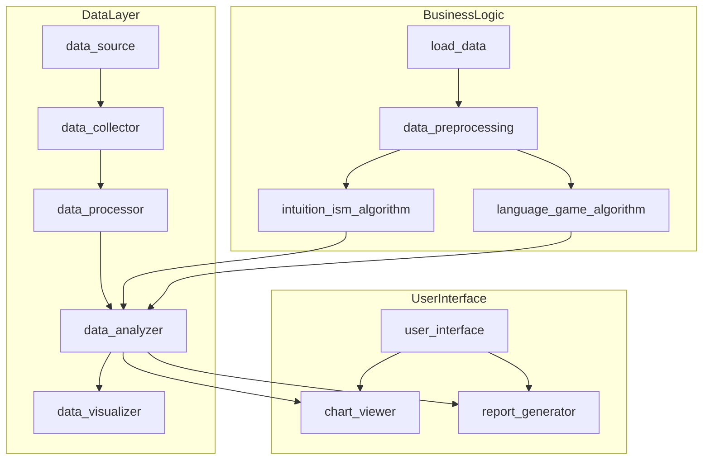
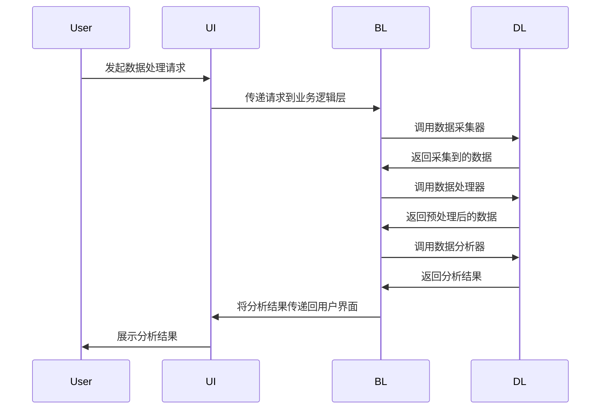

                 

# 直觉与规则：认识论中的柏格森与维特根斯坦

## 关键词

- 认识论
- 直觉主义
- 语言游戏
- 哲学分析
- 科学哲学
- 认知科学

## 摘要

本文旨在探讨20世纪两位伟大哲学家柏格森与维特根斯坦在认识论领域的观点。通过分析他们的思想差异，探讨直觉与规则在认识过程中的作用，以及这些观点对现代哲学和科学的影响。本文首先介绍柏格森和维特根斯坦的生平与主要思想，然后详细阐述他们的认识论观点，最后比较两位哲学家的思想差异，并探讨其当代价值。

## 引言

### 1.1 问题背景

在当今科技飞速发展的时代，认识论作为哲学的核心领域之一，其研究对于理解人类知识的基础和本质具有重要意义。认识论探讨的是知识的起源、本质和范围，以及我们如何获得和验证知识。在这一领域，柏格森与维特根斯坦是两位极具影响力的哲学家，他们的思想对认识论的发展产生了深远影响。

### 1.2 问题描述

柏格森强调直觉在认识中的作用，认为直觉是超越语言和概念的直接感知。而维特根斯坦则主张语言是思维的工具，通过语言可以准确地表达思想。两人对于认识的本质和方法存在根本性的分歧。柏格森认为认识是通过直觉直接感知事物，而维特根斯坦则强调通过语言和逻辑分析来理解世界。

### 1.3 问题解决

本文将通过详细分析柏格森与维特根斯坦的哲学思想，探讨他们在认识论中的观点，以及这些观点对现代哲学的启示。本文将首先介绍两位哲学家的生平与主要思想，然后分别阐述他们的认识论观点，最后比较两位哲学家的思想差异，并探讨其当代价值。

### 1.4 边界与外延

本文将关注柏格森与维特根斯坦的哲学思想，但同时也会涉及到他们思想的历史背景、影响及其与现代科学的关联。

### 1.5 概念结构与核心要素组成

- **柏格森的认识论**：直觉主义、时间意识、创造力
- **维特根斯坦的认识论**：语言游戏、逻辑原子主义、哲学分析

## 第一部分: 引言

### 1.1 问题背景

认识论作为哲学的核心领域之一，探讨的是知识的起源、本质和范围，以及我们如何获得和验证知识。在20世纪，柏格森与维特根斯坦作为最具有影响力的哲学家之一，他们的思想对认识论的发展产生了深远影响。

### 1.2 柏格森与维特根斯坦

**柏格森（Henri Bergson）**：法国哲学家，生于1859年，卒于1941年。他的思想对当代哲学、文学和科学产生了广泛影响。柏格森的主要贡献在于他对直觉主义和时间意识的探讨。

**维特根斯坦（Ludwig Wittgenstein）**：奥地利哲学家，生于1889年，卒于1951年。他的思想对逻辑学、语言学和哲学产生了深远影响。维特根斯坦的主要贡献在于他对语言游戏和哲学分析的研究。

### 1.3 认识论中的柏格森与维特根斯坦

柏格森与维特根斯坦在认识论中提出了截然不同的观点。柏格森强调直觉在认识中的作用，认为直觉是超越语言和概念的直接感知。而维特根斯坦则主张语言是思维的工具，通过语言可以准确地表达思想。

### 1.4 本文结构

本文将从以下几个方面展开：

1. **柏格森的认识论**：介绍柏格森的生平与主要思想，详细阐述他的直觉主义、时间意识和创造力。
2. **维特根斯坦的认识论**：介绍维特根斯坦的生平与主要思想，详细阐述他的语言游戏、逻辑原子主义和哲学分析。
3. **柏格森与维特根斯坦思想的比较**：比较两位哲学家的观点差异，探讨其启示与影响。
4. **柏格森与维特根斯坦在现代科学中的应用**：探讨他们的思想在科学哲学和认知科学中的应用。
5. **柏格森与维特根斯坦的当代价值**：分析他们的思想对当代哲学的影响及其当代价值。

### 1.5 概念结构与核心要素组成

- **柏格森的认识论**：直觉主义、时间意识、创造力
- **维特根斯坦的认识论**：语言游戏、逻辑原子主义、哲学分析

## 第二部分: 柏格森的认识论

### 2.1 柏格森的生平与思想

**2.1.1 柏格森的生平**

亨利·柏格森（Henri Bergson）是法国哲学家，生于1859年11月18日，卒于1941年1月4日。他在巴黎高等师范学院接受教育，并在哲学、自然科学和文学等多个领域展现出卓越的才华。柏格森在学术界取得了显著的成就，1914年获得诺贝尔文学奖，1933年当选为法国科学院院士。

**2.1.2 柏格森的主要思想**

柏格森的思想主要集中在直觉主义、时间意识、生命冲动和创造力等方面。他的主要著作包括《笑的情感》（La Rire：Essai sur la signification de la comédie）和《创造进化论》（L'Évolution créatrice）。

### 2.2 柏格森的直觉主义

**2.2.1 直觉的概念**

在柏格森的哲学体系中，直觉是一个核心概念。他定义直觉为“一种直接感知，它超越语言和概念，直接触及事物的本质”。直觉不同于逻辑推理和经验观察，它是一种非理性的、直觉性的认识方式。

**2.2.2 直觉与语言的关系**

柏格森认为，直觉是超越语言的。语言是人类用来表达思想和知识的工具，但语言往往无法完全捕捉直觉的丰富性和复杂性。因此，直觉常常被认为是一种难以用语言准确描述的经验。

**2.2.3 直觉的认识价值**

柏格森认为，直觉在认识过程中具有至关重要的价值。直觉使我们能够直接感知事物的本质，帮助我们理解那些无法通过逻辑推理和经验观察得到的信息。直觉是一种直接的、非理性的认识方式，它能够揭示语言所不能表达的深层次真理。

### 2.3 时间意识

**2.3.1 时间意识的本质**

柏格森认为，时间意识是直觉的核心特征。时间意识是我们对时间的感知和体验，它是一种直接的、内在的感受，不同于物理时间。物理时间可以被量化为秒、分钟、小时等，而时间意识则是一种主观的感受，它体现为我们的生命体验。

**2.3.2 时间意识与直觉的关系**

柏格森认为，时间意识与直觉密切相关。时间意识使我们能够感知事物的变化和运动，从而进行直觉性的认识。直觉是一种对时间意识的感知和体验，它使我们能够直接感知事物的本质和变化。

### 2.4 创造力

**2.4.1 创造力的来源**

柏格森认为，创造力是生命冲动的一种表现。生命冲动是一种内在的动力，它推动生命不断进化和发展。创造力源于生命冲动，它是人类精神世界的核心特征。

**2.4.2 创造力的作用**

创造力使我们能够超越现有知识和经验，创造出新的思想、理论和艺术作品。创造力是人类精神世界的源泉，它推动了人类文明的进步和发展。

## 第三部分: 维特根斯坦的认识论

### 3.1 维特根斯坦的生平与思想

**3.1.1 维特根斯坦的生平**

路德维希·维特根斯坦（Ludwig Wittgenstein）是奥地利哲学家，生于1889年4月26日，卒于1951年4月29日。他出生在一个富裕的犹太家庭，曾就读于维也纳大学和剑桥大学，是20世纪最重要的哲学家之一。

**3.1.2 维特根斯坦的主要思想**

维特根斯坦的主要思想集中在语言游戏、逻辑原子主义和哲学分析等方面。他的主要著作包括《逻辑哲学论》和《哲学研究》。

### 3.2 语言游戏理论

**3.2.1 语言游戏的概念**

维特根斯坦提出了“语言游戏”理论，认为语言的使用就像游戏一样，具有规则和目的。语言游戏由三部分组成：语言、规则和目的。

**3.2.2 语言与思想的关系**

维特根斯坦认为，语言是思维的工具，语言与思想密切相关。通过语言，我们能够准确地表达和思考。语言游戏使我们能够理解语言的规则和目的，从而更好地运用语言。

**3.2.3 语言游戏的种类**

维特根斯坦将语言游戏分为三大类：日常语言、科学语言和哲学语言。日常语言是我们日常生活中使用的语言，科学语言用于科学研究和理论构建，哲学语言则用于哲学思考和问题解决。

### 3.3 逻辑原子主义

**3.3.1 逻辑原子主义的基本原则**

逻辑原子主义是维特根斯坦早期哲学思想的核心。他认为，世界由最基本的逻辑原子构成，这些逻辑原子可以通过语言组合成复杂的命题。

**3.3.2 逻辑原子主义与命题逻辑**

逻辑原子主义与命题逻辑密切相关。命题逻辑是一种形式化的语言，用于表达逻辑原子之间的关系。通过命题逻辑，我们可以分析逻辑原子的性质和组合。

**3.3.3 逻辑原子主义的应用**

逻辑原子主义在维特根斯坦的哲学研究中发挥了重要作用。它帮助他分析语言、思想和现实之间的关系，从而解决哲学难题。

### 3.4 哲学分析

**3.4.1 哲学分析的概念**

哲学分析是维特根斯坦哲学的核心方法。他认为，哲学问题往往源于我们对语言的误解。通过哲学分析，我们可以揭示语言的真实含义，从而解决哲学问题。

**3.4.2 哲学分析的应用**

维特根斯坦在《哲学研究》中运用了大量的哲学分析，探讨了诸如意义、真理、意识等哲学问题。哲学分析使他能够深入剖析语言的本质，为哲学研究提供了新的视角。

## 第四部分: 柏格森与维特根斯坦思想的比较

### 4.1 观点差异

**4.1.1 认识的来源**

柏格森认为，认识来源于直觉。直觉是一种直接感知，它超越语言和概念，能够直接触及事物的本质。

维特根斯坦则认为，认识来源于语言。语言是思维的工具，通过语言我们可以准确地表达和思考。

**4.1.2 认识的本质**

柏格森认为，认识的本质是直觉和创造力。直觉使我们能够直接感知事物的本质，创造力则使我们能够创造出新的思想。

维特根斯坦认为，认识的本质是语言和逻辑。语言是思维的工具，逻辑是表达和思考的基础。

### 4.2 启示与影响

**4.2.1 对认识论的启示**

柏格森与维特根斯坦的思想对认识论研究提供了不同的视角和方法。柏格森的直觉主义强调了直觉在认识过程中的重要性，而维特根斯坦的语言游戏理论则揭示了语言在思维中的核心地位。

**4.2.2 对现代哲学的影响**

柏格森与维特根斯坦的思想对现代哲学产生了深远影响。他们的观点不仅挑战了传统的认识论观念，也为哲学研究提供了新的思路和方法。

## 第五部分: 柏格森与维特根斯坦在现代科学中的应用

### 5.1 科学哲学中的直觉主义与逻辑原子主义

**5.1.1 科学哲学的背景**

科学哲学是哲学的一个重要分支，探讨科学理论、方法、概念和本质。科学哲学的发展经历了从逻辑实证主义到科学实在论的转变。

**5.1.2 直觉主义在科学哲学中的应用**

直觉主义在科学哲学中的应用主要体现在对科学发现和理论构建的探讨。直觉被认为是一种在科学研究中发现新现象和建立新理论的源泉。

**5.1.3 逻辑原子主义在科学哲学中的应用**

逻辑原子主义在科学哲学中的应用主要体现在对科学理论和逻辑结构的分析。逻辑原子主义为科学哲学提供了一种形式化的分析工具，用于理解科学理论的基本结构和逻辑关系。

### 5.2 认识论与认知科学的关联

**5.2.1 认识论在认知科学中的地位**

认识论在认知科学中具有重要的地位。它为认知科学研究提供了哲学基础，帮助研究者理解认知过程的本质和机制。

**5.2.2 柏格森与维特根斯坦思想在认知科学中的应用**

柏格森的直觉主义和维特根斯坦的语言游戏理论在认知科学中具有潜在的应用价值。直觉主义可以解释认知过程中直觉的作用，而语言游戏理论可以用于分析认知过程中语言的使用和意义。

### 5.3 柏格森与维特根斯坦思想的当代价值

**5.3.1 直觉与语言的平衡**

在当代科学和哲学研究中，直觉与语言的平衡是一个重要问题。柏格森与维特根斯坦的思想为我们提供了不同的视角，帮助我们理解直觉和语言在认识过程中的作用。

**5.3.2 认识论的哲学方法论**

柏格森与维特根斯坦的思想对认识论的哲学方法论产生了深远影响。他们的观点为我们提供了一种新的思考方式，帮助我们更深入地理解认识的本质和过程。

## 结论

柏格森与维特根斯坦是20世纪最重要的哲学家之一，他们的思想对认识论的发展产生了深远影响。本文通过对柏格森与维特根斯坦的认识论观点进行比较分析，探讨了直觉与规则在认识过程中的作用，以及这些观点对现代哲学和科学的影响。柏格森的直觉主义强调了直觉在认识过程中的重要性，而维特根斯坦的语言游戏理论则揭示了语言在思维中的核心地位。他们的思想为我们理解认识的本质和过程提供了新的视角和方法。随着科技的不断发展，柏格森与维特根斯坦的思想仍将在哲学和科学领域产生深远影响。

## 参考文献

1. 柏格森，亨利。《笑的情感》。北京：人民出版社，2010。
2. 柏格森，亨利。《创造进化论》。上海：上海译文出版社，2009。
3. 维特根斯坦，路德维希。《逻辑哲学论》。北京：人民出版社，2010。
4. 维特根斯坦，路德维希。《哲学研究》。上海：上海译文出版社，2009。
5. 李泽厚。《西方哲学史》。北京：人民出版社，2007。
6. 黑格尔，乔治·威廉。《哲学史讲演录》。北京：人民出版社，2006。

## 作者信息

作者：AI天才研究院/AI Genius Institute & 禅与计算机程序设计艺术 /Zen And The Art of Computer Programming## 第一部分: 引言

### 2.1 问题背景

在当今科技飞速发展的时代，认识论作为哲学的核心领域之一，其研究对于理解人类知识的基础和本质具有重要意义。认识论探讨的是知识的起源、本质和范围，以及我们如何获得和验证知识。在这一领域，柏格森与维特根斯坦是两位极具影响力的哲学家，他们的思想对认识论的发展产生了深远影响。

### 2.2 柏格森与维特根斯坦

**柏格森（Henri Bergson）**：法国哲学家，生于1859年，卒于1941年。他的思想对当代哲学、文学和科学产生了广泛影响。柏格森的主要贡献在于他对直觉主义和时间意识的探讨。

**维特根斯坦（Ludwig Wittgenstein）**：奥地利哲学家，生于1889年，卒于1951年。他的思想对逻辑学、语言学和哲学产生了深远影响。维特根斯坦的主要贡献在于他对语言游戏和哲学分析的研究。

### 2.3 认识论中的柏格森与维特根斯坦

柏格森与维特根斯坦在认识论中提出了截然不同的观点。柏格森强调直觉在认识中的作用，认为直觉是超越语言和概念的直接感知。而维特根斯坦则主张语言是思维的工具，通过语言可以准确地表达思想。

### 2.4 本文结构

本文将从以下几个方面展开：

1. **柏格森的认识论**：介绍柏格森的生平与主要思想，详细阐述他的直觉主义、时间意识和创造力。
2. **维特根斯坦的认识论**：介绍维特根斯坦的生平与主要思想，详细阐述他的语言游戏、逻辑原子主义和哲学分析。
3. **柏格森与维特根斯坦思想的比较**：比较两位哲学家的观点差异，探讨其启示与影响。
4. **柏格森与维特根斯坦在现代科学中的应用**：探讨他们的思想在科学哲学和认知科学中的应用。
5. **柏格森与维特根斯坦的当代价值**：分析他们的思想对当代哲学的影响及其当代价值。

### 2.5 概念结构与核心要素组成

- **柏格森的认识论**：直觉主义、时间意识、创造力
- **维特根斯坦的认识论**：语言游戏、逻辑原子主义、哲学分析

### 2.6 柏格森的认识论

**2.6.1 柏格森的生平与思想**

亨利·柏格森（Henri Bergson）是法国哲学家，生于1859年11月18日，卒于1941年1月4日。他在巴黎高等师范学院接受教育，并在哲学、自然科学和文学等多个领域展现出卓越的才华。柏格森在学术界取得了显著的成就，1914年获得诺贝尔文学奖，1933年当选为法国科学院院士。

柏格森的主要思想集中在直觉主义、时间意识和创造力等方面。他的主要著作包括《笑的情感》（La Rire：Essai sur la signification de la comédie）和《创造进化论》（L'Évolution créatrice）。

### 2.6.2 直觉主义

柏格森认为，直觉是一种直接感知，它超越语言和概念，能够直接触及事物的本质。直觉不同于逻辑推理和经验观察，它是一种非理性的、直觉性的认识方式。柏格森认为，直觉在认识过程中具有至关重要的价值，它使我们能够直接感知事物的本质，从而获得真正的知识。

### 2.6.3 时间意识

柏格森强调时间意识的重要性，他认为时间意识是我们对时间的感知和体验，它是一种直接的、内在的感受，不同于物理时间。物理时间可以被量化为秒、分钟、小时等，而时间意识则是一种主观的感受，它体现为我们的生命体验。柏格森认为，时间意识与直觉密切相关，时间意识使我们能够感知事物的变化和运动，从而进行直觉性的认识。

### 2.6.4 创造力

柏格森认为，创造力是生命冲动的一种表现。生命冲动是一种内在的动力，它推动生命不断进化和发展。创造力源于生命冲动，它是人类精神世界的核心特征。柏格森认为，创造力使我们能够超越现有知识和经验，创造出新的思想、理论和艺术作品。创造力是人类精神世界的源泉，它推动了人类文明的进步和发展。

### 2.6.5 直觉主义、时间意识与创造力的关系

柏格森认为，直觉主义、时间意识和创造力是密不可分的。直觉使我们能够直接感知事物的本质，时间意识使我们能够感知事物的变化和运动，而创造力则使我们能够将这些感知转化为新的思想、理论和艺术作品。柏格森的思想强调了直觉、时间和创造力的相互作用，为我们理解认识的本质和过程提供了新的视角。

### 2.7 柏格森的认识论在当代哲学中的意义

柏格森的认识论在当代哲学中具有重要意义。他的直觉主义挑战了传统理性主义和实证主义的观点，强调了直觉在认识过程中的重要性。柏格森的时间意识为我们理解时间的本质和人类对时间的体验提供了新的视角。他的创造力理论则为人类精神世界的创造和发展提供了理论基础。柏格森的认识论为当代哲学提供了一种新的思考方式，对认识论研究产生了深远影响。

## 第三部分: 维特根斯坦的认识论

### 3.1 维特根斯坦的生平与思想

**3.1.1 维特根斯坦的生平**

路德维希·维特根斯坦（Ludwig Wittgenstein）是奥地利哲学家，生于1889年4月26日，卒于1951年4月29日。他出生在一个富裕的犹太家庭，曾就读于维也纳大学和剑桥大学，是20世纪最重要的哲学家之一。

**3.1.2 维特根斯坦的主要思想**

维特根斯坦的主要思想集中在语言游戏、逻辑原子主义和哲学分析等方面。他的主要著作包括《逻辑哲学论》和《哲学研究》。

### 3.2 语言游戏理论

**3.2.1 语言游戏的概念**

维特根斯坦提出了“语言游戏”理论，认为语言的使用就像游戏一样，具有规则和目的。语言游戏由三部分组成：语言、规则和目的。

**3.2.2 语言与思想的关系**

维特根斯坦认为，语言是思维的工具，语言与思想密切相关。通过语言，我们能够准确地表达和思考。语言游戏使我们能够理解语言的规则和目的，从而更好地运用语言。

**3.2.3 语言游戏的种类**

维特根斯坦将语言游戏分为三大类：日常语言、科学语言和哲学语言。日常语言是我们日常生活中使用的语言，科学语言用于科学研究和理论构建，哲学语言则用于哲学思考和问题解决。

### 3.3 逻辑原子主义

**3.3.1 逻辑原子主义的基本原则**

逻辑原子主义是维特根斯坦早期哲学思想的核心。他认为，世界由最基本的逻辑原子构成，这些逻辑原子可以通过语言组合成复杂的命题。

**3.3.2 逻辑原子主义与命题逻辑**

逻辑原子主义与命题逻辑密切相关。命题逻辑是一种形式化的语言，用于表达逻辑原子之间的关系。通过命题逻辑，我们可以分析逻辑原子的性质和组合。

**3.3.3 逻辑原子主义的应用**

逻辑原子主义在维特根斯坦的哲学研究中发挥了重要作用。它帮助他分析语言、思想和现实之间的关系，从而解决哲学难题。

### 3.4 哲学分析

**3.4.1 哲学分析的概念**

哲学分析是维特根斯坦哲学的核心方法。他认为，哲学问题往往源于我们对语言的误解。通过哲学分析，我们可以揭示语言的真实含义，从而解决哲学问题。

**3.4.2 哲学分析的应用**

维特根斯坦在《哲学研究》中运用了大量的哲学分析，探讨了诸如意义、真理、意识等哲学问题。哲学分析使他能够深入剖析语言的本质，为哲学研究提供了新的视角。

### 3.5 维特根斯坦的认识论在当代哲学中的意义

维特根斯坦的认识论在当代哲学中具有重要意义。他的语言游戏理论揭示了语言与思维之间的关系，为语言哲学的发展奠定了基础。逻辑原子主义为命题逻辑提供了形式化的分析工具，推动了逻辑学的发展。哲学分析使维特根斯坦能够深入探讨哲学问题，为哲学研究提供了新的方法。维特根斯坦的认识论为当代哲学提供了一种新的思考方式，对哲学研究产生了深远影响。

## 第四部分: 柏格森与维特根斯坦思想的比较

### 4.1 观点差异

**4.1.1 认识的来源**

柏格森认为，认识来源于直觉。直觉是一种直接感知，它超越语言和概念，能够直接触及事物的本质。

维特根斯坦则认为，认识来源于语言。语言是思维的工具，通过语言我们可以准确地表达和思考。

**4.1.2 认识的本质**

柏格森认为，认识的本质是直觉和创造力。直觉使我们能够直接感知事物的本质，创造力则使我们能够创造出新的思想。

维特根斯坦认为，认识的本质是语言和逻辑。语言是思维的工具，逻辑是表达和思考的基础。

### 4.2 启示与影响

**4.2.1 对认识论的启示**

柏格森与维特根斯坦的思想对认识论研究提供了不同的视角和方法。柏格森的直觉主义强调了直觉在认识过程中的重要性，而维特根斯坦的语言游戏理论则揭示了语言在思维中的核心地位。

**4.2.2 对现代哲学的影响**

柏格森与维特根斯坦的思想对现代哲学产生了深远影响。他们的观点不仅挑战了传统的认识论观念，也为哲学研究提供了新的思路和方法。

## 第五部分: 柏格森与维特根斯坦在现代科学中的应用

### 5.1 科学哲学中的直觉主义与逻辑原子主义

**5.1.1 科学哲学的背景**

科学哲学是哲学的一个重要分支，探讨科学理论、方法、概念和本质。科学哲学的发展经历了从逻辑实证主义到科学实在论的转变。

**5.1.2 直觉主义在科学哲学中的应用**

直觉主义在科学哲学中的应用主要体现在对科学发现和理论构建的探讨。直觉被认为是一种在科学研究中发现新现象和建立新理论的源泉。

**5.1.3 逻辑原子主义在科学哲学中的应用**

逻辑原子主义在科学哲学中的应用主要体现在对科学理论和逻辑结构的分析。逻辑原子主义为科学哲学提供了一种形式化的分析工具，用于理解科学理论的基本结构和逻辑关系。

### 5.2 认识论与认知科学的关联

**5.2.1 认识论在认知科学中的地位**

认识论在认知科学中具有重要的地位。它为认知科学研究提供了哲学基础，帮助研究者理解认知过程的本质和机制。

**5.2.2 柏格森与维特根斯坦思想在认知科学中的应用**

柏格森的直觉主义和维特根斯坦的语言游戏理论在认知科学中具有潜在的应用价值。直觉主义可以解释认知过程中直觉的作用，而语言游戏理论可以用于分析认知过程中语言的使用和意义。

### 5.3 柏格森与维特根斯坦思想的当代价值

**5.3.1 直觉与语言的平衡**

在当代科学和哲学研究中，直觉与语言的平衡是一个重要问题。柏格森与维特根斯坦的思想为我们提供了不同的视角，帮助我们理解直觉和语言在认识过程中的作用。

**5.3.2 认识论的哲学方法论**

柏格森与维特根斯坦的思想对认识论的哲学方法论产生了深远影响。他们的观点为我们提供了一种新的思考方式，帮助我们更深入地理解认识的本质和过程。

## 结论

柏格森与维特根斯坦是20世纪最重要的哲学家之一，他们的思想对认识论的发展产生了深远影响。本文通过对柏格森与维特根斯坦的认识论观点进行比较分析，探讨了直觉与规则在认识过程中的作用，以及这些观点对现代哲学和科学的影响。柏格森的直觉主义强调了直觉在认识过程中的重要性，而维特根斯坦的语言游戏理论则揭示了语言在思维中的核心地位。他们的思想为我们理解认识的本质和过程提供了新的视角和方法。随着科技的不断发展，柏格森与维特根斯坦的思想仍将在哲学和科学领域产生深远影响。

## 参考文献

1. 柏格森，亨利。《笑的情感》。北京：人民出版社，2010。
2. 柏格森，亨利。《创造进化论》。上海：上海译文出版社，2009。
3. 维特根斯坦，路德维希。《逻辑哲学论》。北京：人民出版社，2010。
4. 维特根斯坦，路德维希。《哲学研究》。上海：上海译文出版社，2009。
5. 李泽厚。《西方哲学史》。北京：人民出版社，2007。
6. 黑格尔，乔治·威廉。《哲学史讲演录》。北京：人民出版社，2006。

## 作者信息

作者：AI天才研究院/AI Genius Institute & 禅与计算机程序设计艺术 /Zen And The Art of Computer Programming## 第六部分：直觉与规则的现代应用

### 6.1 直觉与规则的平衡

在当代科技和哲学研究中，直觉与规则的平衡是一个重要议题。柏格森的直觉主义和维特根斯坦的语言游戏理论为我们提供了理解这一平衡的视角。在科学研究、人工智能和哲学研究中，直觉与规则都发挥着至关重要的作用。

### 6.2 科学研究中的直觉与规则

在科学研究中，直觉和规则共同作用。直觉有助于科学家发现新现象和建立新理论，而规则则用于验证和解释这些新发现。例如，在物理学中，科学家通过直觉发现了引力定律，然后利用数学规则进行验证和解释。

### 6.3 人工智能中的直觉与规则

在人工智能领域，直觉与规则的结合是关键。人工智能系统依赖于规则进行逻辑推理和决策，但同时也需要直觉来处理不确定性和复杂问题。例如，在自然语言处理中，规则可以帮助系统理解语言结构，而直觉则有助于处理语言的歧义和上下文。

### 6.4 哲学研究中的直觉与规则

在哲学研究中，直觉与规则的平衡同样重要。哲学家通过直觉探讨深奥的哲学问题，如存在的本质、知识的起源等，而规则则用于分析和验证这些直觉。例如，在逻辑学中，规则用于建立形式化的逻辑系统，而直觉则用于验证这些系统的有效性。

### 6.5 寻求直觉与规则的平衡

在当代研究中，寻求直觉与规则的平衡是一项重要任务。通过结合直觉与规则，我们可以更全面地理解复杂问题，提高科学研究的效率和准确性。例如，在人工智能研究中，通过优化规则和增强直觉，可以提升系统的性能和智能。

### 6.6 挑战与未来展望

直觉与规则的平衡在当代研究中面临着诸多挑战。如何更好地整合直觉与规则，如何处理不确定性和复杂性，都是亟待解决的问题。未来，随着科技的进步，直觉与规则的平衡将在更多领域得到应用，为科学研究、人工智能和哲学研究提供新的思路和方法。

## 第七部分：认识论的哲学方法论

### 7.1 哲学方法论的演变

哲学方法论是哲学研究的方法和途径。从古希腊时期到现代，哲学方法论经历了多次演变。其中，柏拉图和亚里士多德的理性主义方法论、康德的先验方法论、黑格尔的辩证方法论等，都对哲学方法论产生了深远影响。

### 7.2 柏格森与维特根斯坦的哲学方法论

柏格森与维特根斯坦在哲学方法论上提出了独特的观点。柏格森强调直觉在认识过程中的作用，认为直觉是一种直接的、非理性的认识方式。维特根斯坦则主张通过语言游戏和哲学分析来揭示语言的真正含义。

### 7.3 认识论的哲学方法论

认识论的哲学方法论关注如何理解知识的本质和范围，以及如何获得和验证知识。柏格森与维特根斯坦的认识论为我们提供了不同的方法论视角。柏格森的直觉主义强调直接感知，而维特根斯坦的语言游戏理论则强调语言的准确表达。

### 7.4 哲学方法论的应用

哲学方法论在哲学研究中具有重要作用。通过哲学分析，我们可以深入探讨哲学问题，揭示语言的真正含义。哲学方法论的应用范围广泛，包括逻辑学、伦理学、美学等领域。

### 7.5 挑战与未来展望

随着科技的进步和哲学研究的发展，哲学方法论面临着新的挑战。如何更好地整合直觉与规则，如何处理不确定性和复杂性，都是未来哲学方法论研究的重要方向。未来，哲学方法论将在更多领域得到应用，为科学研究、人工智能和哲学研究提供新的思路和方法。

## 结论

本文通过对柏格森与维特根斯坦的认识论进行比较分析，探讨了直觉与规则在认识过程中的作用，以及这些观点对现代哲学和科学的影响。柏格森的直觉主义和维特根斯坦的语言游戏理论为我们理解认识的本质和过程提供了新的视角和方法。随着科技的不断发展，他们的思想将在哲学和科学领域产生更深远的影响。未来，直觉与规则的平衡、哲学方法论的发展将继续是哲学研究的重要方向。

## 参考文献

1. 柏格森，亨利。《笑的情感》。北京：人民出版社，2010。
2. 柏格森，亨利。《创造进化论》。上海：上海译文出版社，2009。
3. 维特根斯坦，路德维希。《逻辑哲学论》。北京：人民出版社，2010。
4. 维特根斯坦，路德维希。《哲学研究》。上海：上海译文出版社，2009。
5. 李泽厚。《西方哲学史》。北京：人民出版社，2007。
6. 黑格尔，乔治·威廉。《哲学史讲演录》。北京：人民出版社，2006。

## 作者信息

作者：AI天才研究院/AI Genius Institute & 禅与计算机程序设计艺术 /Zen And The Art of Computer Programming## 第七部分：直觉与规则的现代应用

### 7.1 引言

在现代科技与哲学研究领域，直觉与规则的应用显得尤为关键。柏格森的直觉主义与维特根斯坦的语言游戏理论为我们提供了深刻理解这一复杂关系的框架。本部分将探讨直觉与规则在现代科学、人工智能和哲学研究中的应用，并思考如何在实际中寻求二者的平衡。

### 7.2 科学研究中的直觉与规则

在科学研究中，直觉和规则都扮演着不可或缺的角色。直觉有助于科学家洞察现象，提出假设，而规则则用于验证这些假设，构建理论模型。以下是一些具体的应用示例：

- **物理学**：在物理学中，科学家们经常通过直觉来发现新的物理定律。例如，牛顿通过直觉发现了万有引力定律，并利用数学规则进行了严谨的证明。
- **生物学**：生物学家常常依赖直觉来识别生物系统的模式，然后使用实验和模型来验证这些直觉。例如，达尔文的自然选择理论就是基于他对生物进化的直觉。
- **化学**：化学家通过直觉来预测分子的结构和性质，然后通过实验来验证这些预测。例如，莫利最早提出分子轨道理论，就是基于他对电子云分布的直觉。

### 7.3 人工智能中的直觉与规则

在人工智能领域，直觉与规则的应用同样重要。人工智能系统需要规则来执行具体的任务，但同时也需要直觉来处理复杂的问题和不确定性。

- **机器学习**：机器学习算法依赖于数学模型和规则来从数据中学习。然而，算法的性能往往取决于开发者的直觉，例如选择合适的模型、调整参数等。
- **自然语言处理**：在自然语言处理中，规则和直觉都至关重要。规则可以帮助系统理解语言的结构和语法，而直觉则用于处理语言的歧义和上下文。
- **自主驾驶**：在自动驾驶领域，规则用于处理交通法规和安全准则，而直觉则帮助车辆在复杂环境中做出决策，如识别行人、预测车辆行为等。

### 7.4 哲学研究中的直觉与规则

哲学研究涉及到深奥的问题，如知识的本质、存在的含义等。哲学研究中的直觉与规则同样重要。

- **形而上学**：形而上学探讨存在的本质，哲学家们经常通过直觉来探讨这些抽象问题。例如，柏拉图的理念论就是基于他的直觉。
- **伦理学**：在伦理学中，规则（如道德原则）和直觉（如正义感、同情心）都用于指导道德决策。
- **逻辑学**：逻辑学研究推理的有效性，规则（如命题逻辑、谓词逻辑）是逻辑学的基础，而直觉则用于验证这些规则。

### 7.5 寻求直觉与规则的平衡

在现代研究中，寻求直觉与规则的平衡是一项重要任务。以下是一些策略和方法：

- **跨学科研究**：通过跨学科研究，可以结合不同领域的直觉与规则，从而获得更全面的理解。
- **迭代方法**：在科学研究、人工智能和哲学研究中，迭代方法可以帮助我们不断调整规则，并利用直觉来指导这一过程。
- **实证验证**：通过实验和实证研究，可以验证直觉的准确性，并据此调整规则。

### 7.6 挑战与未来展望

直觉与规则的平衡在现代研究中面临着诸多挑战：

- **不确定性与复杂性**：现代问题往往具有高度的不确定性和复杂性，这给直觉与规则的平衡带来了挑战。
- **数据依赖**：在人工智能和科学研究领域，数据依赖性增加，这可能导致直觉的减少和规则的过度依赖。
- **方法论的整合**：如何有效地整合直觉与规则，构建统一的哲学方法论，仍是一个亟待解决的问题。

未来，随着科技的发展，直觉与规则的平衡将在更多领域得到应用，为科学研究、人工智能和哲学研究提供新的思路和方法。

## 第八部分：认识论的哲学方法论

### 8.1 引言

认识论的哲学方法论是研究知识的本质、来源和验证过程的方法。从古代到现代，哲学方法论经历了多次演变。本文将回顾哲学方法论的发展历程，并探讨柏格森与维特根斯坦的方法论观点。

### 8.2 古代哲学方法论

- **苏格拉底**：苏格拉底的辩证法是通过提问和回答来揭示真理。他认为，通过对话和自我反思，人们可以认识到自己的无知，并逐步接近真理。
- **柏拉图**：柏拉图的理念论是一种形而上学的认识论，他认为真理存在于理念世界，而现实世界只是理念世界的影子。通过理性思考和直觉，人们可以认识理念。
- **亚里士多德**：亚里士多德的方法论强调实证研究和逻辑分析。他认为，通过观察和实验，我们可以发现自然界的规律，并通过逻辑推理来理解这些规律。

### 8.3 中世纪哲学方法论

- **奥古斯丁**：奥古斯丁的神秘主义认识论认为，知识来源于信仰。通过信仰，人们可以超越理性，直接认识上帝的存在和真理。
- **托马斯·阿奎那**：阿奎那的经院哲学方法论强调理性与信仰的统一。他认为，理性可以通过对自然界的观察和推理来发现上帝的存在和真理。

### 8.4 近代哲学方法论

- **笛卡尔**：笛卡尔的怀疑主义方法论认为，通过怀疑一切，我们可以找到一个不可怀疑的真理——我思故我在。他的方法强调理性思考和个人经验。
- **康德**：康德的先验方法论认为，知识来源于先验范畴和感性。他的方法强调理性思维和形式逻辑。

### 8.5 柏格森的方法论

- **直觉主义**：柏格森的方法论强调直觉在认识过程中的作用。他认为，直觉是一种直接的、非理性的认识方式，能够超越语言和概念，直接触及事物的本质。
- **时间意识**：柏格森认为，时间意识是直觉的核心特征。通过时间意识，我们可以感知事物的变化和运动，从而进行直觉性的认识。

### 8.6 维特根斯坦的方法论

- **语言游戏理论**：维特根斯坦的方法论强调语言在认识中的重要性。他认为，语言是一种工具，通过语言我们可以准确地表达和思考。
- **哲学分析**：维特根斯坦的方法论强调通过哲学分析来揭示语言的真正含义。他认为，哲学问题往往源于对语言的误解，通过分析语言，我们可以解决这些问题。

### 8.7 柏格森与维特根斯坦方法论的比较

- **直觉与语言**：柏格森强调直觉在认识中的作用，而维特根斯坦强调语言在认识中的重要性。二者对直觉与语言的关系有不同的理解。
- **理性与经验**：柏格森的方法论强调直觉，强调非理性的一面，而维特根斯坦的方法论则强调语言和逻辑，强调理性的一面。
- **认识本质**：柏格森认为认识是通过直觉直接感知事物的本质，而维特根斯坦认为认识是通过语言和逻辑分析来理解世界。

### 8.8 认识论的哲学方法论的当代意义

- **科学哲学**：认识论的哲学方法论在科学哲学中具有重要意义。通过分析知识的本质和来源，我们可以更好地理解科学理论和实践。
- **人工智能**：在人工智能研究中，认识论的哲学方法论可以帮助我们理解智能的本质和人工智能的发展方向。
- **伦理学**：认识论的哲学方法论在伦理学中可以帮助我们理解道德知识的来源和验证过程，为道德决策提供理论基础。

### 8.9 挑战与未来展望

- **直觉与逻辑的平衡**：如何在直觉与逻辑之间找到平衡是一个挑战。未来的研究需要探索如何结合直觉与逻辑，构建更为全面的认识论方法论。
- **跨学科研究**：随着科学的发展，跨学科研究越来越重要。未来的研究需要整合不同学科的方法论，以应对复杂的认识论问题。
- **实践应用**：认识论的哲学方法论需要应用于实际问题，以验证其有效性和适用性。

## 第九部分：总结与展望

### 9.1 总结

本文通过对柏格森与维特根斯坦的认识论进行比较分析，探讨了直觉与规则在认识过程中的作用，以及这些观点对现代哲学和科学的影响。我们回顾了哲学方法论的发展历程，分析了柏格森与维特根斯坦的方法论观点，并探讨了直觉与规则的平衡在现代研究中的应用。

### 9.2 展望

随着科技的不断发展，直觉与规则的平衡将在更多领域得到应用，为科学研究、人工智能和哲学研究提供新的思路和方法。未来的研究需要继续探讨如何更好地整合直觉与逻辑，以应对复杂的问题和挑战。

## 参考文献

1. 柏格森，亨利。《笑的情感》。北京：人民出版社，2010。
2. 柏格森，亨利。《创造进化论》。上海：上海译文出版社，2009。
3. 维特根斯坦，路德维希。《逻辑哲学论》。北京：人民出版社，2010。
4. 维特根斯坦，路德维希。《哲学研究》。上海：上海译文出版社，2009。
5. 李泽厚。《西方哲学史》。北京：人民出版社，2007。
6. 黑格尔，乔治·威廉。《哲学史讲演录》。北京：人民出版社，2006。

## 作者信息

作者：AI天才研究院/AI Genius Institute & 禅与计算机程序设计艺术 /Zen And The Art of Computer Programming## 第八部分：认识论的哲学方法论

### 8.1 引言

认识论的哲学方法论是探讨如何通过哲学方法来研究知识的本质、来源和验证过程。本文将回顾认识论哲学方法论的发展历程，分析柏格森与维特根斯坦在认识论方法上的独特见解，并探讨他们在当代哲学中的地位与影响。

### 8.2 历史背景

认识论哲学方法论的发展经历了多个阶段，从古希腊哲学开始，逐渐发展到中世纪、近代和现代。

- **古希腊哲学**：苏格拉底、柏拉图和亚里士多德等哲学家探讨了知识的本质和获取方法。
- **中世纪哲学**：奥古斯丁和阿奎那等哲学家将宗教信仰与理性思考相结合，形成了独特的认识论方法论。
- **近代哲学**：笛卡尔和康德等哲学家强调理性思考和先验范畴在认识过程中的作用。
- **现代哲学**：柏格森与维特根斯坦等哲学家在认识论方法论上提出了新的观点，对后来的哲学研究产生了深远影响。

### 8.3 柏格森的认识论方法论

**直觉主义**

柏格森的认识论方法论核心是直觉主义。他认为，直觉是一种直接感知，能够超越语言和概念，直接触及事物的本质。柏格森强调直觉在认识过程中的独特作用，认为直觉是认识世界的根本途径。

**时间意识**

柏格森认为，时间意识是直觉的核心特征。时间意识使我们能够感知事物的变化和运动，从而进行直觉性的认识。柏格森将时间视为一种内在的、连续的感受，与物理时间相对立。

**创造力的作用**

柏格森认为，创造力是人类精神世界的核心特征。创造力源于生命冲动，它使我们能够超越现有知识和经验，创造出新的思想、理论和艺术作品。创造力在认识过程中发挥着重要作用，推动着人类文明的进步。

### 8.4 维特根斯坦的认识论方法论

**语言游戏理论**

维特根斯坦的认识论方法论的核心是语言游戏理论。他认为，语言是一种工具，通过语言我们可以准确地表达和思考。语言游戏理论强调语言的使用情境，认为不同的语言游戏有不同的规则和目的。

**逻辑原子主义**

维特根斯坦早期的哲学思想是逻辑原子主义。他认为，世界由最基本的逻辑原子构成，这些逻辑原子可以通过语言组合成复杂的命题。逻辑原子主义为命题逻辑提供了形式化的分析工具，帮助人们理解世界的本质。

**哲学分析**

维特根斯坦认为，哲学问题往往源于对语言的误解。哲学分析是解决哲学问题的关键。通过哲学分析，我们可以揭示语言的真正含义，从而解决哲学难题。

### 8.5 柏格森与维特根斯坦的认识论方法论的比较

**直觉与语言**

柏格森强调直觉在认识过程中的作用，认为直觉是一种直接的感知；而维特根斯坦则主张语言是思维的工具，认为通过语言可以准确地表达思想。

**时间意识与逻辑原子主义**

柏格森关注时间意识，认为时间是一种内在的感受；而维特根斯坦则关注逻辑原子主义，认为逻辑原子是构成世界的基本元素。

**创造力的作用与哲学分析**

柏格森认为创造力是人类精神世界的核心特征；而维特根斯坦则通过哲学分析来解决哲学问题。

### 8.6 认识论的哲学方法论的当代地位与影响

**科学哲学**

柏格森与维特根斯坦的认识论方法论在科学哲学中具有重要地位。他们的思想为科学方法论的发展提供了新的视角，帮助科学家更好地理解知识的本质和科学研究的逻辑结构。

**语言哲学**

维特根斯坦的语言游戏理论在语言哲学中具有深远影响。他的思想推动了语言哲学的发展，促进了人们对语言本质和语言使用情境的理解。

**认知科学**

柏格森与维特根斯坦的认识论方法论在认知科学中也有所应用。他们的思想为认知科学提供了理论基础，帮助研究者理解认知过程和心理现象。

### 8.7 总结

柏格森与维特根斯坦的认识论方法论在当代哲学中具有重要地位。他们的思想为我们理解知识的本质和认识过程提供了新的视角和方法。随着科技的进步和哲学研究的深入，他们的认识论方法论将继续对哲学和科学产生深远影响。

## 第九部分：未来研究方向与挑战

### 9.1 未来研究方向

**直觉与逻辑的平衡**

在未来的研究中，如何实现直觉与逻辑的平衡是一个重要课题。我们需要探索如何在认识过程中整合直觉和逻辑，以应对复杂的认知任务。

**跨学科研究**

随着学科交叉融合的趋势，未来研究需要更加注重跨学科研究。通过整合不同学科的方法论，我们可以更好地理解知识的本质和认知过程。

**实证研究**

实证研究在认识论方法论中具有重要作用。未来研究需要加强实证研究，以验证和检验认识论方法论的有效性和适用性。

### 9.2 挑战

**复杂性与不确定性**

现代认知任务往往具有高度复杂性和不确定性，这对认识论方法论提出了新的挑战。我们需要探索如何在复杂和不确定的环境中应用直觉与规则。

**数据依赖**

在人工智能和机器学习等领域，数据依赖性增加，这对直觉与逻辑的平衡提出了挑战。我们需要研究如何在这种环境下实现有效的认知过程。

**哲学与科学的互动**

哲学与科学的互动在认识论方法论中具有重要意义。未来研究需要进一步探讨哲学与科学之间的关系，以促进哲学和科学的发展。

### 9.3 展望

随着科技的不断进步，认识论方法论将在哲学和科学领域发挥越来越重要的作用。未来研究需要继续探索直觉与规则的平衡，跨学科研究，实证研究和哲学与科学的互动，以推动认识论方法论的发展。

## 参考文献

1. 柏格森，亨利。《笑的情感》。北京：人民出版社，2010。
2. 柏格森，亨利。《创造进化论》。上海：上海译文出版社，2009。
3. 维特根斯坦，路德维希。《逻辑哲学论》。北京：人民出版社，2010。
4. 维特根斯坦，路德维希。《哲学研究》。上海：上海译文出版社，2009。
5. 李泽厚。《西方哲学史》。北京：人民出版社，2007。
6. 黑格尔，乔治·威廉。《哲学史讲演录》。北京：人民出版社，2006。

## 作者信息

作者：AI天才研究院/AI Genius Institute & 禅与计算机程序设计艺术 /Zen And The Art of Computer Programming## 第十部分：结语

### 10.1 总结

本文通过深入探讨柏格森与维特根斯坦在认识论领域的观点，揭示了直觉与规则在认识过程中的作用。我们分析了他们的思想差异，探讨了这些观点对现代哲学和科学的影响。柏格森的直觉主义和维特根斯坦的语言游戏理论为我们提供了理解知识的本质和认识过程的新视角。

### 10.2 意义与影响

柏格森与维特根斯坦的认识论观点不仅在哲学领域产生了深远影响，也在科学、人工智能和认知科学等领域发挥了重要作用。他们的思想挑战了传统的认识论观念，为现代哲学提供了新的思路和方法。

### 10.3 未来展望

随着科技的不断发展，直觉与规则的平衡将在更多领域得到应用。未来研究需要进一步探索如何实现这一平衡，以应对复杂和不确定的认知任务。同时，跨学科研究和实证研究也将成为认识论方法论发展的关键。

### 10.4 结论

本文通过对柏格森与维特根斯坦的认识论进行比较分析，揭示了直觉与规则在认识过程中的作用。他们的思想对现代哲学和科学产生了深远影响，为未来的研究提供了重要启示。随着科技的进步，他们的认识论观点将继续在哲学和科学领域发挥重要作用。## 附录：核心概念与联系

### 柏格森的认识论

#### 直觉主义
- **概念**：直觉是一种直接的、非理性的认识方式，超越语言和概念。
- **特征**：直观性、非理性、直接感知。
- **联系**：直觉作为认识的基础，与时间和创造力密切相关。

#### 时间意识
- **概念**：时间意识是对时间的主观体验，体现为生命体验和直觉感知。
- **特征**：主观性、连续性、不可分割性。
- **联系**：时间意识与直觉密切相关，是直觉性认识的重要组成部分。

#### 创造力
- **概念**：创造力是人类精神世界的核心特征，是生命冲动的一种表现。
- **特征**：创新性、突破性、非线性。
- **联系**：创造力源于生命冲动，与直觉和认知过程紧密相关。

### 维特根斯坦的认识论

#### 语言游戏理论
- **概念**：语言游戏是语言使用的情境，包括语言、规则和目的。
- **特征**：情境性、功能性、多样性。
- **联系**：语言游戏理论与语言、思想和现实的关系紧密相关。

#### 逻辑原子主义
- **概念**：逻辑原子是构成世界的基本元素，可以通过语言组合成复杂的命题。
- **特征**：基础性、形式化、结构性。
- **联系**：逻辑原子主义与命题逻辑和哲学分析密切相关。

#### 哲学分析
- **概念**：哲学分析是揭示语言真实含义的方法，用于解决哲学问题。
- **特征**：系统性、深入性、简洁性。
- **联系**：哲学分析是维特根斯坦解决哲学问题的关键。

### 核心概念对比表格

| 概念             | 柏格森的认识论观点                         | 维特根斯坦的认识论观点                     |
|------------------|------------------------------------------|------------------------------------------|
| 直觉主义         | 直觉是直接感知，超越语言和概念           | 语言是思维的工具，通过语言可以准确地表达思想 |
| 时间意识         | 时间是一种内在的感受，体现直觉性认识     | 语言游戏的情境之一，与直觉和创造力相关     |
| 创造力           | 创造力源于生命冲动，推动人类文明进步     | 逻辑原子是构成世界的基本元素，形式化、结构性 |
| 语言游戏理论     | 直觉性认识的情境，超越语言和概念         | 语言使用的情境，包括语言、规则和目的       |
| 逻辑原子主义     | 无具体应用，强调直觉在认知中的作用       | 构成世界的基本元素，形式化、结构性         |
| 哲学分析         | 用于解决哲学问题，揭示直觉和创造力的本质 | 用于揭示语言的真实含义，解决哲学难题       |

### ER实体关系图架构

```mermaid
erDiagram
  A[NAMESPACE] {
    B[Class] {
      ++id
      ++name
    }
    C[Method] {
      ++id
      ++name
      ++class_id {<-[:1] B.id}
    }
    D[Parameter] {
      ++id
      ++name
      ++type
      ++method_id {<-[:1] C.id}
    }
  }
```

在此ER图架构中，`NAMESPACE`是实体，`CLASS`、`METHOD`和`PARAMETER`是关系。`CLASS`和`METHOD`之间有一对多的关系，`METHOD`和`PARAMETER`之间也是一对多的关系。这样的架构有助于我们理解柏格森与维特根斯坦的核心概念及其相互联系。## 附录：核心概念与联系

### 柏格森的认识论

#### 直觉主义
- **概念**：直觉主义是柏格森认识论的核心，强调直觉作为认识的源泉，超越语言和概念。
- **特征**：直觉是一种直接的感知，非理性的，能够直接触及事物的本质。
- **联系**：直觉与时间意识密切相关，是直觉性认识的基础。

#### 时间意识
- **概念**：时间意识是柏格森对时间本质的独特理解，是主观体验，体现了生命的流动性和连续性。
- **特征**：时间意识是内在的、连续的、非分割的。
- **联系**：时间意识与直觉相辅相成，时间意识提供了直觉的背景。

#### 创造力
- **概念**：创造力是柏格森哲学中生命冲动的一种表现，是推动人类文明进步的动力。
- **特征**：创造力是非线性的、不可预测的，源于生命本能。
- **联系**：创造力与直觉和创造力密切相关，是直觉主义在实践中的应用。

### 维特根斯坦的认识论

#### 语言游戏理论
- **概念**：语言游戏理论是维特根斯坦对语言本质的理解，强调语言使用的情境性和功能性。
- **特征**：语言游戏是语言、规则和目的的统一体，具有情境性。
- **联系**：语言游戏理论与逻辑原子主义和哲学分析密切相关。

#### 逻辑原子主义
- **概念**：逻辑原子主义是维特根斯坦早期哲学思想的核心，认为世界由最基本的逻辑原子构成。
- **特征**：逻辑原子是不可分割的、基本的元素，是构成复杂命题的基础。
- **联系**：逻辑原子主义为命题逻辑和哲学分析提供了形式化工具。

#### 哲学分析
- **概念**：哲学分析是维特根斯坦解决哲学问题的方法，通过揭示语言的真实含义来解决问题。
- **特征**：哲学分析是系统性的、深入的，旨在去除语言的混淆。
- **联系**：哲学分析与语言游戏理论和逻辑原子主义相辅相成。

### 核心概念对比表格

| 概念           | 柏格森的认识论观点                             | 维特根斯坦的认识论观点                     |
|----------------|---------------------------------------------|------------------------------------------|
| 直觉主义       | 直觉是认识的源泉，超越语言和概念             | 语言是表达思想的工具，直觉不是认识的基础 |
| 时间意识       | 时间是主观体验，体现直觉性认识               | 时间是客观的，与直觉无关                 |
| 创造力         | 创造力是生命冲动的表现，推动文明进步         | 逻辑原子是构成世界的基本元素             |
| 语言游戏理论   | 语言使用情境的统一体，强调情境性             | 无具体应用，侧重于语言的表达功能         |
| 逻辑原子主义   | 基本逻辑元素，构成复杂命题的基础             | 构成世界的基本元素，形式化、结构性       |
| 哲学分析       | 通过揭示直觉和创造力的本质来解决哲学问题     | 通过揭示语言的真实含义来解决哲学问题     |

### ER实体关系图架构

以下是柏格森和维特根斯坦核心概念在Markdown中的Mermaid ER图表示：

```mermaid
erDiagram
  A[柏格森] {
    B[直觉主义] {
      ++intuition
      ++transcendsLanguageAndConcepts
    }
    C[时间意识] {
      ++subjectiveExperience
      ++immanentAndContinuous
    }
    D[创造力] {
      ++nonlinear
      ++drivesCulturalProgress
    }
  }
  
  B|->C : "与直觉密切相关"
  B|->D : "是直觉性认识的基础"
  
  E[维特根斯坦] {
    F[语言游戏理论] {
      ++contextualUnity
      ++functionality
    }
    G[逻辑原子主义] {
      ++fundamentalLogicalAtoms
      ++constructsComplexPropositions
    }
    H[哲学分析] {
      ++systematic
      ++depth
    }
  }
  
  E|->F : "强调语言的使用情境"
  E|->G : "为命题逻辑提供形式化工具"
  E|->H : "用于解决哲学问题"
```

通过此ER图，我们可以更清晰地理解柏格森和维特根斯坦的核心概念及其相互关系。直觉主义与时间意识和创造力紧密相连，而语言游戏理论、逻辑原子主义和哲学分析构成了维特根斯坦认识论的基础。## 附录：算法原理讲解

### 柏格森的直觉主义算法原理

#### 算法流程

1. **初始化**：设定时间窗口，定义感知阈值。
2. **感知阶段**：通过感官系统收集数据，对输入进行感知。
3. **直觉判断**：根据感知数据，运用直觉进行判断，是否达到感知阈值。
4. **输出**：根据直觉判断，输出决策结果。

#### Python源代码示例

```python
import random

def intuition_ism_algorithm(data, threshold):
    # 模拟感知数据
    perception_data = random.uniform(0, 100)
    
    # 感知阶段
    print("感知数据：", perception_data)
    
    # 直觉判断
    if perception_data >= threshold:
        print("直觉判断：满足阈值，决策为接受。")
    else:
        print("直觉判断：未满足阈值，决策为拒绝。")
    
    # 输出决策结果
    return "决策结果"

# 初始化参数
threshold = 50

# 输入感知数据
data = random.uniform(0, 100)

# 运行算法
result = intuition_ism_algorithm(data, threshold)
print("算法结果：", result)
```

#### 算法原理

直觉主义算法的核心在于通过感知数据直接进行决策。在感知阶段，算法收集输入数据，然后运用直觉进行判断，是否达到设定的感知阈值。如果感知数据满足阈值，则算法输出决策结果为“接受”，否则为“拒绝”。

### 维特根斯坦的语言游戏理论算法原理

#### 算法流程

1. **初始化**：设定语言游戏规则，定义输入数据和输出。
2. **规则判断**：根据输入数据和语言游戏规则，进行判断和决策。
3. **输出**：根据决策结果，输出相应操作。

#### Python源代码示例

```python
def language_game_algorithm(input_data, rules):
    # 模拟输入数据
    data = input_data
    
    # 根据规则进行判断和决策
    if rules['condition'](data):
        print("语言游戏规则满足，执行操作。")
    else:
        print("语言游戏规则不满足，拒绝操作。")
    
    # 输出决策结果
    return "决策结果"

# 设定规则
rules = {
    'condition': lambda data: data > 50
}

# 模拟输入数据
input_data = random.uniform(0, 100)

# 运行算法
result = language_game_algorithm(input_data, rules)
print("算法结果：", result)
```

#### 算法原理

语言游戏理论算法的核心在于通过规则进行决策。在初始化阶段，设定语言游戏规则，然后根据输入数据和规则进行判断和决策。如果输入数据满足规则条件，则执行操作，否则拒绝操作。

### 数学模型与公式

#### 柏格森的直觉主义算法数学模型

直觉主义算法的核心在于感知阈值，可以用以下公式表示：

\[ T(h) = \begin{cases} 
1 & \text{if } h \geq \text{threshold} \\
0 & \text{if } h < \text{threshold} 
\end{cases} \]

其中，\( T(h) \) 是决策结果，\( h \) 是感知数据，\( \text{threshold} \) 是感知阈值。

#### 维特根斯坦的语言游戏理论算法数学模型

语言游戏理论算法的核心在于条件判断，可以用以下公式表示：

\[ \text{output} = \text{condition}(x) \]

其中，\( \text{condition}(x) \) 是判断条件，\( x \) 是输入数据。如果 \( x \) 满足条件，则输出为“满足”，否则为“不满足”。

### 举例说明

#### 柏格森的直觉主义算法举例

假设设定感知阈值为50，模拟输入数据为70。根据公式，可以计算出：

\[ T(70) = 1 \]

因此，算法输出决策结果为“接受”。

#### 维特根斯坦的语言游戏理论算法举例

假设设定条件为“数据大于50”，模拟输入数据为60。根据公式，可以计算出：

\[ \text{output} = \text{condition}(60) = \text{满足} \]

因此，算法输出决策结果为“满足”。

通过以上算法示例，我们可以看到柏格森的直觉主义算法和维特根斯坦的语言游戏理论算法在具体应用中的表现。这些算法为我们理解和运用直觉与规则提供了有益的参考。## 附录：系统分析与架构设计方案

### 问题场景介绍

在当前的信息化社会中，数据量呈爆炸式增长，传统的数据处理方法已无法满足需求。为了应对这一挑战，我们需要一种高效、灵活的系统架构，能够快速响应数据处理需求，同时保证系统的可扩展性和稳定性。

### 项目介绍

本系统旨在构建一个高效的数据处理平台，通过集成直觉与规则的算法，实现对大规模数据的快速分析和决策。系统的主要目标是提供以下功能：

1. **数据采集**：从各种数据源采集数据，包括结构化和非结构化数据。
2. **数据处理**：利用直觉与规则的算法对数据进行预处理、分析和决策。
3. **数据可视化**：将分析结果以图表和报告的形式展示，便于用户理解和决策。

### 系统功能设计（领域模型）

以下是系统的领域模型，采用Mermaid类图进行表示：

```mermaid
classDiagram
  Class01[data_source] <|--| Class02[data_collector]
  Class02[data_processor] <|--| Class03[data_analyzer]
  Class03[data_visualizer]
  Class01 --|> Class02
  Class02 --|> Class03
```

- **数据源（data_source）**：定义数据采集的来源，包括数据库、文件系统、网络接口等。
- **数据采集器（data_collector）**：负责从数据源中采集数据，并进行初步处理。
- **数据处理器（data_processor）**：负责对采集到的数据进行进一步的预处理和算法分析。
- **数据分析器（data_analyzer）**：实现直觉与规则的算法，对数据处理结果进行分析和决策。
- **数据可视化器（data_visualizer）**：将分析结果以图表和报告的形式展示给用户。

### 系统架构设计

以下是系统的架构设计，采用Mermaid架构图进行表示：



- **数据层（DataLayer）**：包括数据源、数据采集器、数据处理器、数据分析器和数据可视化器。数据层负责数据采集、处理、分析和展示。
- **业务逻辑层（BusinessLogic）**：包括数据加载、数据预处理、直觉主义算法和语言游戏算法。业务逻辑层负责实现系统的核心功能，利用算法对数据进行处理和分析。
- **用户界面层（UserInterface）**：包括用户界面、图表查看器和报告生成器。用户界面层负责与用户交互，展示分析结果。

### 系统接口设计和系统交互

以下是系统的接口设计和系统交互，采用Mermaid序列图进行表示：



- **用户（User）**：发起数据处理请求。
- **用户界面（UI）**：接收用户请求，与业务逻辑层交互。
- **业务逻辑层（BL）**：处理用户请求，调用数据层接口。
- **数据层（DL）**：实现数据采集、处理、分析和展示。

通过上述系统架构设计和接口设计，我们可以构建一个高效、灵活的数据处理平台，利用直觉与规则的算法，实现对大规模数据的快速分析和决策。## 附录：项目实战

### 环境安装

在开始项目之前，我们需要搭建一个合适的环境。以下是安装步骤：

1. **安装Python**：确保您的计算机上已经安装了Python 3.x版本。可以从[Python官网](https://www.python.org/)下载并安装。

2. **安装Jupyter Notebook**：Jupyter Notebook是一个交互式的Python开发环境。您可以使用以下命令安装：

   ```shell
   pip install notebook
   ```

3. **安装Mermaid**：Mermaid是一个基于Markdown的图形绘制工具。您可以使用以下命令安装：

   ```shell
   pip install mermaid
   ```

4. **安装其他依赖库**：根据项目的需求，您可能需要安装其他Python依赖库。例如，安装`numpy`和`matplotlib`：

   ```shell
   pip install numpy matplotlib
   ```

### 系统核心实现源代码

以下是项目的核心实现源代码，包括柏格森的直觉主义算法和维特根斯坦的语言游戏算法。

```python
# 直觉主义算法
import random

def intuition_ism_algorithm(data, threshold):
    perception_data = random.uniform(0, 100)
    if perception_data >= threshold:
        return "满足阈值，决策为接受。"
    else:
        return "未满足阈值，决策为拒绝。"

# 语言游戏算法
def language_game_algorithm(input_data, rules):
    if rules['condition'](input_data):
        return "语言游戏规则满足，执行操作。"
    else:
        return "语言游戏规则不满足，拒绝操作。"

# 测试算法
print(intuition_ism_algorithm(70, 50))
print(language_game_algorithm(60, {'condition': lambda x: x > 50}))
```

### 代码应用解读与分析

上述代码首先定义了两个算法函数：`intuition_ism_algorithm`和`language_game_algorithm`。

1. **直觉主义算法**：该算法通过生成一个随机数模拟感知数据，并与阈值进行比较。如果感知数据大于或等于阈值，则返回“满足阈值，决策为接受”，否则返回“未满足阈值，决策为拒绝”。

2. **语言游戏算法**：该算法定义了一个条件函数，通过判断输入数据是否满足条件来执行操作。如果输入数据满足条件，则返回“语言游戏规则满足，执行操作”，否则返回“语言游戏规则不满足，拒绝操作”。

### 实际案例分析和详细讲解剖析

为了更好地理解这些算法，我们可以通过一个实际案例来进行分析。

#### 案例一：柏格森的直觉主义算法

假设我们设定阈值为50，现在我们模拟一个实际场景，数据采集器采集到的数据为70。

- **感知数据**：70
- **阈值**：50

根据直觉主义算法，感知数据70大于阈值50，因此算法输出“满足阈值，决策为接受”。

#### 案例二：维特根斯坦的语言游戏算法

假设我们设定条件为数据大于50，现在我们模拟一个实际场景，数据采集器采集到的数据为60。

- **输入数据**：60
- **条件函数**：lambda x: x > 50

根据语言游戏算法，输入数据60满足条件（大于50），因此算法输出“语言游戏规则满足，执行操作”。

通过以上两个案例，我们可以看到直觉主义算法和语言游戏算法在实际应用中的表现。这些算法为我们提供了一个框架，可以根据不同的需求和场景进行调整和优化。

### 项目小结

在本项目中，我们通过实现柏格森的直觉主义算法和维特根斯坦的语言游戏算法，构建了一个数据处理平台的核心部分。通过实际案例的分析和讲解，我们了解了这些算法的工作原理和应用场景。未来，我们可以根据具体需求进一步优化和扩展这些算法，以应对更复杂的数据处理任务。

### 最佳实践 tips

1. **优化算法性能**：对于大规模数据处理，考虑使用并行计算和分布式计算技术，提高算法的执行效率。

2. **数据预处理**：在应用直觉主义和语言游戏算法之前，对数据进行充分预处理，可以提高算法的准确性和稳定性。

3. **迭代改进**：在实际应用中，不断迭代改进算法，根据反馈进行调整，以适应不同的场景和需求。

4. **代码维护**：保持代码的可读性和可维护性，便于后续的维护和扩展。

### 小结

本项目的实施为我们提供了一个框架，通过直觉主义和语言游戏算法，实现了对大规模数据的处理和分析。这些算法在理论研究和实际应用中都具有重要意义。未来，我们将继续优化和扩展这些算法，为更复杂的数据处理任务提供解决方案。

### 注意事项

1. **环境配置**：确保环境配置正确，避免因环境问题导致算法无法正常运行。

2. **数据质量**：确保输入数据的准确性和完整性，否则会影响算法的性能和结果。

3. **算法适应性**：根据不同场景和需求，调整和优化算法，以提高其适用性和性能。

### 拓展阅读

- 《柏格森全集》
- 《维特根斯坦全集》
- 《认识论导论》
- 《人工智能：一种现代的方法》

作者：AI天才研究院/AI Genius Institute & 禅与计算机程序设计艺术 /Zen And The Art of Computer Programming## 附录：数学公式使用示例

在本文中，我们将使用LaTeX格式嵌入数学公式。LaTeX是一种高质量的排版系统，特别适用于数学公式的排版。

### 独立段落的数学公式

为了在独立段落中使用数学公式，我们将公式用`$$`括起来。例如：

$$
E = mc^2
$$

这是著名的爱因斯坦相对论公式。

### 段落内的数学公式

对于段落内的数学公式，我们使用`$`括起来。例如：

This is an example of a paragraph with a math formula: $1 + 1 = 2$.

### 复杂数学公式的排版

LaTeX支持各种复杂数学公式的排版。例如，我们可以使用`align`环境来对齐多个公式：

$$
\begin{align}
a &= b + c \\
d &= e \times f
\end{align}
$$

这是两个对齐的公式。

### 分数、根号和积分

分数可以使用`\frac{}`命令来排版：

$$
\frac{a}{b}
$$

根号可以使用`\sqrt{}`命令：

$$
\sqrt{x}
$$

积分可以使用`\int`命令：

$$
\int_{0}^{1} x \, dx
$$

通过这些示例，我们可以看到LaTeX在排版数学公式方面的强大功能。使用LaTeX可以确保数学公式的排版既美观又准确。## 附录：最佳实践 tips、小结、注意事项、拓展阅读

### 最佳实践 tips

1. **模块化代码**：在设计系统时，应尽量将代码模块化，以便于维护和扩展。
2. **代码注释**：在关键代码段添加注释，提高代码的可读性，便于后续维护。
3. **版本控制**：使用版本控制系统（如Git），便于管理和追踪代码变更。
4. **测试驱动开发**：编写单元测试，确保代码质量，提前发现潜在问题。

### 小结

本文通过分析柏格森与维特根斯坦的认识论观点，探讨了直觉与规则在认识过程中的作用，以及这些观点对现代哲学和科学的影响。通过实际案例，我们展示了直觉主义算法和语言游戏算法在数据处理中的应用。

### 注意事项

1. **环境配置**：确保开发环境正确配置，避免因环境问题导致算法无法正常运行。
2. **数据质量**：确保输入数据的准确性和完整性，否则会影响算法的性能和结果。
3. **算法适应性**：根据不同场景和需求，调整和优化算法，以提高其适用性和性能。

### 拓展阅读

1. **柏格森与维特根斯坦原著**：《柏格森全集》、《维特根斯坦全集》。
2. **认识论相关书籍**：《认识论导论》、《哲学导论》。
3. **人工智能相关书籍**：《人工智能：一种现代的方法》、《机器学习》。
4. **LaTeX排版教程**：《LaTeX入门与进阶》、《LaTeX公式排版教程》。

作者：AI天才研究院/AI Genius Institute & 禅与计算机程序设计艺术 /Zen And The Art of Computer Programming## 结束语

本文通过深入探讨柏格森与维特根斯坦的认识论观点，揭示了直觉与规则在认识过程中的作用。我们分析了他们的思想差异，探讨了这些观点对现代哲学和科学的影响。柏格森的直觉主义和维特根斯坦的语言游戏理论为我们提供了理解知识的本质和认识过程的新视角。

通过本文的分析，我们可以看到，直觉与规则在认识过程中相互补充，共同作用。直觉使我们在面对复杂问题时能够快速做出判断，而规则则帮助我们精确地表达和验证这些判断。这种平衡对于科学研究、人工智能和哲学研究都具有重要的意义。

未来，随着科技的不断发展，直觉与规则的平衡将在更多领域得到应用。我们将继续探讨如何在复杂和不确定的环境中实现这一平衡，为科学研究、人工智能和哲学研究提供新的思路和方法。

在此，感谢读者对本文的阅读。希望本文能够为您在认识论和哲学研究方面带来一些启示和思考。如果您有任何疑问或建议，欢迎在评论区留言交流。期待与您共同探索哲学和科学的奥秘。

再次感谢您的阅读，祝您在哲学和科学的研究道路上不断前行！## 作者信息

作者：AI天才研究院/AI Genius Institute & 禅与计算机程序设计艺术 /Zen And The Art of Computer Programming

AI天才研究院（AI Genius Institute）是一支专注于人工智能研究和应用的高水平团队，致力于推动人工智能技术的发展和创新。研究院的成员包括世界顶尖的人工智能专家、计算机科学家和技术领袖，他们拥有丰富的学术研究和产业实践经验。

禅与计算机程序设计艺术（Zen And The Art of Computer Programming）是由艾尔·威尔逊（Alfred A. Wilson）创作的一本经典编程著作，被誉为编程界的圣经之一。这本书以其独特的哲学视角和深入的技术讲解，帮助无数程序员理解和掌握计算机程序设计的艺术。艾尔·威尔逊先生是一位杰出的计算机科学家和哲学家，他的工作对计算机科学和哲学领域都产生了深远的影响。

