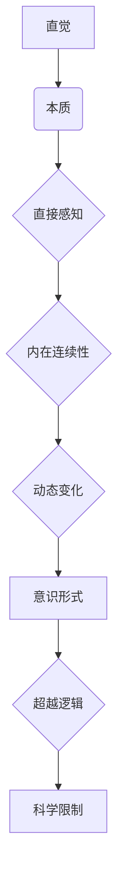
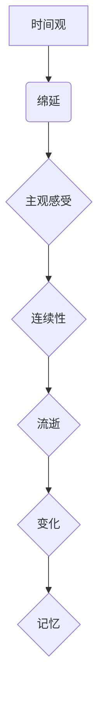
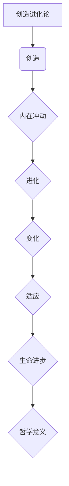
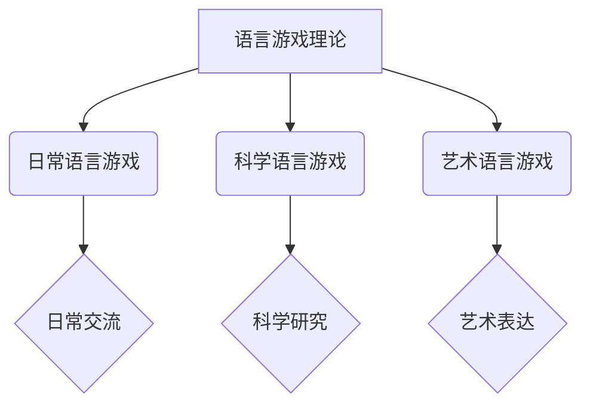
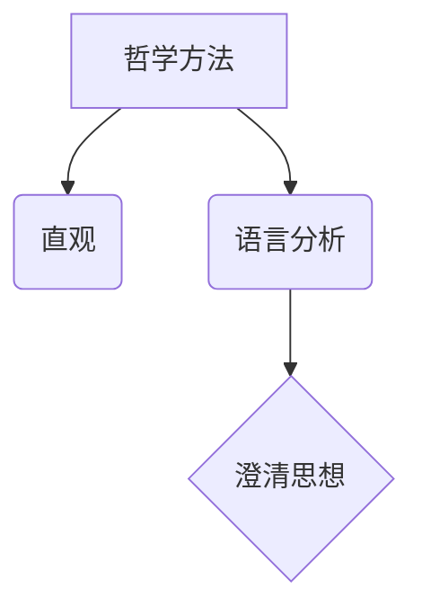
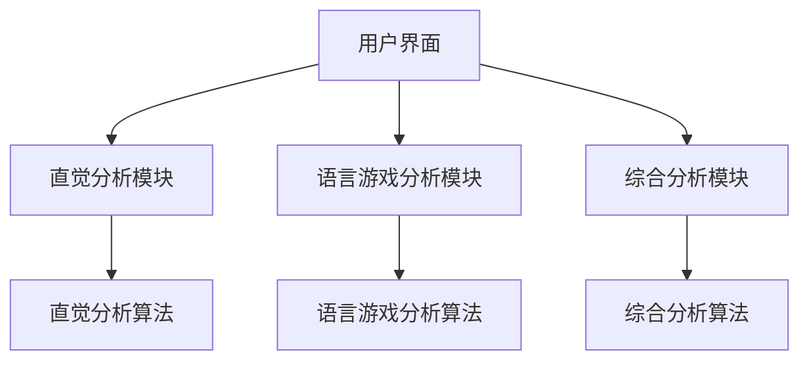
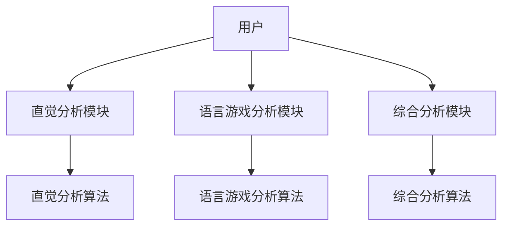

                 

### 直觉与语言游戏：柏格森与维特根斯坦的认知理论

> 关键词：直觉、语言游戏、认知理论、柏格森、维特根斯坦、比较分析

> 摘要：本文旨在探讨法国哲学家柏格森和英国哲学家维特根斯坦在认知理论方面的贡献，通过对他们的直觉和语言游戏理论进行深入分析，揭示两位哲学家在认知领域的独特见解和哲学方法。文章首先介绍柏格森和维特根斯坦的生平及其哲学背景，然后详细阐述他们的核心理论，最后对两位哲学家的认知理论进行比较，分析其异同，并探讨其对现代认知科学的影响。

---

### 引言与背景

#### 1.1 问题背景

认知理论是探讨人类思维、感知、记忆等心理过程的科学，它涵盖了心理学、哲学、神经科学等多个学科领域。在认知理论的漫长历史中，许多哲学家、心理学家和科学家提出了各自的理论，形成了丰富的认知理论体系。本文关注的两位哲学家，柏格森和维特根斯坦，都是这一领域的杰出代表，他们的理论对现代认知科学产生了深远的影响。

#### 1.2 问题描述

本文要解决的问题是：柏格森和维特根斯坦在认知理论方面的贡献和影响如何？他们的直觉和语言游戏理论分别是什么？这两种理论在哲学上有哪些异同？它们对现代认知科学有哪些启示和影响？

#### 1.3 问题解决

本文将通过对柏格森和维特根斯坦的理论进行详细分析，揭示他们在认知领域的独特见解和哲学方法。首先，介绍两位哲学家的生平和哲学背景；然后，分别阐述他们的直觉和语言游戏理论；接着，对这两种理论进行对比分析；最后，探讨其对现代认知科学的影响。

#### 1.4 边界与外延

本文的研究范围主要聚焦于柏格森和维特根斯坦的认知理论，特别是他们的直觉和语言游戏理论。文章将不涉及其他认知理论，如皮亚杰的发生认识论或信息加工心理学理论。此外，本文将不探讨柏格森和维特根斯坦在其他哲学领域的影响，如柏格森的文学批评或维特根斯坦的语言哲学。

### 核心概念与联系

#### 2.1 直觉的概念与特性

直觉是人们在没有明显逻辑推理的情况下，直接感知和理解事物本质的能力。柏格森认为，直觉是人类认知的高级形式，是人类与世界直接接触的方式。直觉能够感知到事物的内在连续性，把握事物的动态变化。

维特根斯坦则将直觉视为语言的基础，认为语言游戏是人们通过直觉理解和表达世界的方式。他强调，语言的意义在于实际使用中，而非抽象的定义或逻辑推理。

#### 2.2 语言游戏的理论框架

语言游戏是维特根斯坦提出的概念，指的是语言在特定情境中的使用方式。维特根斯坦认为，语言的意义不是通过抽象的定义来确定的，而是通过实际的语言游戏来体现。语言游戏分为三类：日常语言游戏、科学语言游戏和艺术语言游戏。

#### 2.3 直觉与语言游戏的关系

柏格森的直觉与维特根斯坦的语言游戏理论之间存在紧密的联系。柏格森的直觉是理解世界的基础，而维特根斯坦的语言游戏则是表达和理解直觉的媒介。直觉与语言游戏相互依赖，直觉提供了理解世界的方式，而语言游戏则提供了表达这种理解的方式。

### 2.4 柏格森与维特根斯坦的核心概念对比

| 柏格森 | 维特根斯坦 |
| ------ | ---------- |
| 直觉 | 语言游戏 |
| 时间 | 语言 |
| 创造力 | 视觉化 |
| 精神过程 | 语言结构 |

表1：柏格森与维特根斯坦核心概念对比

### 第一部分：引言与背景

在本部分中，我们将首先介绍两位哲学家的生平及其哲学背景。然后，深入探讨柏格森和维特根斯坦在认知领域的贡献，特别是他们的直觉和语言游戏理论。我们将分析这些理论的本质特征，并探讨它们对现代认知科学的影响。

#### 3.1 柏格森的生平与哲学背景

亨利·柏格森（Henri Bergson）是19世纪末至20世纪初的法国哲学家，被誉为“现代哲学的先驱”。他出生于法国巴黎，毕业于巴黎高等师范学院，师从著名哲学家埃马纽埃尔·康德洛。柏格森的哲学思想深受生物学和心理学的影响，他的代表作有《创造进化论》、《时间与自由意志》等。

柏格森认为，直觉是人类认知的高级形式，是人类与世界直接接触的方式。他强调，直觉能够感知到事物的内在连续性，把握事物的动态变化。柏格森的直觉理论对后来的认知科学和心理学产生了深远的影响。

#### 3.2 维特根斯坦的生平与哲学背景

路德维希·维特根斯坦（Ludwig Wittgenstein）是20世纪初的奥地利哲学家，被誉为“逻辑原子主义的奠基人”。他出生于奥地利维也纳，毕业于维也纳大学，师从著名哲学家贝特兰·罗素。维特根斯坦的哲学思想主要集中在其两本代表作《逻辑哲学论》和《哲学研究》中。

维特根斯坦提出了著名的语言游戏理论，他认为语言的意义在于实际使用中，而非抽象的定义或逻辑推理。维特根斯坦主张，语言是一种工具，用于表达和理解世界。他的理论对后来的语言哲学、认知科学和计算机科学产生了深远的影响。

#### 3.3 柏格森与维特根斯坦在认知领域的贡献

柏格森和维特根斯坦在认知领域的贡献主要体现在他们的直觉和语言游戏理论。柏格森的直觉理论强调人类与世界直接接触的方式，认为直觉是人类认知的高级形式。而维特根斯坦的语言游戏理论则强调语言在实际情境中的使用方式，认为语言的意义在于实际使用中。

这两种理论虽然形式不同，但都关注人类如何感知和理解世界。柏格森的直觉理论为认知科学提供了一种新的视角，即人类可以通过直觉直接感知事物的本质。而维特根斯坦的语言游戏理论则为语言哲学提供了一种新的解释，即语言的意义在于实际使用中。

#### 3.4 柏格森与维特根斯坦的核心理论对比

柏格森和维特根斯坦的核心理论在形式和内容上存在一定的差异。柏格森的直觉理论强调人类与世界直接接触的方式，而维特根斯坦的语言游戏理论则强调语言在实际情境中的使用方式。

从形式上看，柏格森的直觉理论更偏向于一种哲学思考，他试图通过直觉来理解世界的本质。而维特根斯坦的语言游戏理论则更偏向于一种方法论，他试图通过语言游戏来理解语言的意义。

从内容上看，柏格森的直觉理论强调直觉在人类认知中的重要性，认为直觉是人类理解世界的关键。而维特根斯坦的语言游戏理论则强调语言在人类生活中的重要性，认为语言是人类理解世界的工具。

总的来说，柏格森和维特根斯坦的核心理论在形式和内容上都体现了他们对人类认知的独特见解。这些理论不仅丰富了认知科学和语言哲学的研究，也为后来的学者提供了新的研究思路和方法。

### 第二部分：柏格森的认知理论

在本部分中，我们将深入探讨柏格森的认知理论，特别是他的直觉哲学、时间观和创造进化论。我们将分析这些理论的本质特征，并探讨其在现代认知科学中的应用和影响。

#### 4.1 柏格森的直觉哲学

柏格森的直觉哲学是其认知理论的核心，他强调直觉是人类理解世界的关键。柏格森认为，直觉是一种直接感知事物本质的能力，它超越了逻辑推理和抽象思考。

柏格森的直觉哲学有以下几个关键点：

1. **直觉的本质**：柏格森认为，直觉是一种直接的感知，它能够把握事物的内在连续性和动态变化。
2. **直觉与意识**：柏格森认为，直觉是人类意识的一种特殊形式，它与我们的日常感知和逻辑思考不同。
3. **直觉与科学**：柏格森认为，科学方法虽然重要，但它无法完全捕捉到直觉所提供的深刻洞察。

**直觉哲学的图解：**



#### 4.2 柏格森的时间观

柏格森的时间观是其直觉哲学的重要组成部分，他提出了“绵延”（Duration）这一概念，用以描述时间的主观感受。

1. **绵延的本质**：柏格森认为，时间不是线性的，而是一种连续的、流动的状态，这种状态被称为绵延。
2. **绵延与时间**：柏格森认为，绵延是时间的主观感受，它使我们能够体验时间的流逝和事物的变化。
3. **绵延与记忆**：柏格森认为，记忆是绵延的重要组成部分，它使我们能够回顾过去并预测未来。

**时间观的图解：**



#### 4.3 柏格森的创造进化论

柏格森的创造进化论是他哲学思想的重要组成部分，他试图通过这一理论来解释生命的起源和进化。

1. **创造的起源**：柏格森认为，创造是生命的基本特征，它源于一种内在的冲动，这种冲动推动着生命向前发展。
2. **进化的过程**：柏格森认为，进化是一种持续创造的过程，它通过不断的变化和适应来推动生命的进步。
3. **进化的意义**：柏格森认为，进化不仅是一种生物学现象，也是一种哲学现象，它揭示了生命的本质和意义。

**创造进化论的图解：**



#### 4.4 柏格森的认知理论与现代认知科学的联系

柏格森的认知理论对现代认知科学产生了深远的影响。特别是他的直觉哲学和时间观，为现代认知科学提供了一种新的视角。

1. **心理学中的应用**：柏格森的直觉哲学为心理学提供了一种新的研究方法，即通过直觉来理解人类的心理过程。
2. **神经科学中的应用**：柏格森的时间观为神经科学提供了新的理论框架，即通过理解时间的流逝来研究神经系统的运作。
3. **人工智能中的应用**：柏格森的哲学思想对人工智能的发展也有启示，特别是他的直觉概念，为人工智能的感知和理解提供了新的思路。

### 第三部分：维特根斯坦的认知理论

在本部分中，我们将深入探讨维特根斯坦的认知理论，特别是他的语言游戏理论、哲学方法和其对语言哲学的影响。我们将分析这些理论的本质特征，并探讨其在现代认知科学中的应用和影响。

#### 5.1 维特根斯坦的语言游戏理论

维特根斯坦的语言游戏理论是他哲学思想的核心，他试图通过这一理论来解决语言的意义问题。

1. **语言游戏的概念**：维特根斯坦认为，语言是一种游戏，它在特定的情境中有特定的用法。
2. **语言游戏的类型**：维特根斯坦将语言游戏分为日常语言游戏、科学语言游戏和艺术语言游戏三种。
3. **语言游戏与意义**：维特根斯坦认为，语言的意义在于实际使用中，而非抽象的定义或逻辑推理。

**语言游戏理论的图解：**



#### 5.2 维特根斯坦的哲学方法

维特根斯坦的哲学方法强调直观和语言分析，他试图通过这种方法来揭示语言的真正意义。

1. **直观的重要性**：维特根斯坦认为，直观是理解语言的关键，它是我们理解世界的基础。
2. **语言分析的方法**：维特根斯坦主张，通过仔细分析语言的用法，我们可以理解语言的意义。
3. **哲学的目的**：维特根斯坦认为，哲学的目的是澄清思想，而不是提供抽象的体系或理论。

**哲学方法的图解：**



#### 5.3 维特根斯坦的理论对语言哲学的影响

维特根斯坦的语言游戏理论和哲学方法对语言哲学产生了深远的影响。

1. **对语言意义的研究**：维特根斯坦的理论使语言哲学转向对语言实际用法的关注，而不是抽象的意义研究。
2. **对语言使用的重视**：维特根斯坦强调，语言的意义在于实际使用中，这一观点影响了后来的语言哲学家，如约翰·塞尔（John Searle）。
3. **对语言哲学的启示**：维特根斯坦的理论为语言哲学提供了新的研究方法和视角，推动了语言哲学的发展。

#### 5.4 维特根斯坦的认知理论与现代认知科学的联系

维特根斯坦的认知理论对现代认知科学产生了重要影响，特别是在人工智能和认知心理学领域。

1. **人工智能中的应用**：维特根斯坦的语言游戏理论为人工智能提供了一种新的理解方式，即通过模拟人类语言游戏来开发智能系统。
2. **认知心理学中的应用**：维特根斯坦的直观和语言分析方法为认知心理学提供了一种新的研究方法，即通过直观和语言分析来理解人类的认知过程。

### 第四部分：柏格森与维特根斯坦认知理论的比较

在本部分中，我们将对柏格森和维特根斯坦的认知理论进行比较分析，探讨他们的相似之处和差异。

#### 6.1 相似之处

1. **对直觉的重视**：柏格森和维特根斯坦都强调直觉在认知过程中的重要性。柏格森认为直觉是人类理解世界的关键，而维特根斯坦则认为直觉是理解语言的基础。
2. **对语言的研究**：柏格森和维特根斯坦都关注语言的意义和用法。柏格森的直觉哲学为语言的使用提供了哲学基础，而维特根斯坦的语言游戏理论则揭示了语言的真正意义。

#### 6.2 差异

1. **哲学方法的不同**：柏格森的直觉哲学更偏向于一种哲学思考，他试图通过直觉来理解世界的本质。而维特根斯坦的语言游戏理论则更偏向于一种方法论，他试图通过语言游戏来理解语言的意义。
2. **理论内容的差异**：柏格森的直觉哲学和时间观强调人类的主观体验，而维特根斯坦的语言游戏理论则侧重于语言的实际使用。柏格森关注直觉和时间的连续性，而维特根斯坦关注语言的用法和逻辑结构。

### 6.3 综合评价

柏格森和维特根斯坦的认知理论各有特点，它们在哲学和认知科学领域都产生了重要影响。

1. **哲学上的影响**：柏格森的直觉哲学和时间观丰富了哲学对人类认知的理解，而维特根斯坦的语言游戏理论则为哲学提供了一种新的研究方法。
2. **认知科学的影响**：柏格森的直觉哲学为认知科学提供了新的研究视角，特别是在心理学和神经科学领域。维特根斯坦的语言游戏理论则为人工智能和认知心理学提供了理论基础。

总的来说，柏格森和维特根斯坦的认知理论都是哲学和认知科学的重要里程碑，它们为后来的学者提供了丰富的理论资源和启示。

### 第五部分：结语与展望

在本部分中，我们将总结本文的研究成果，探讨柏格森和维特根斯坦认知理论的局限性和未来研究方向。

#### 7.1 研究成果总结

本文通过深入分析柏格森和维特根斯坦的认知理论，探讨了他们在直觉和语言游戏方面的独特见解。我们分析了两位哲学家的生平和哲学背景，详细阐述了他们的核心理论，并对这些理论进行了比较。通过比较分析，我们揭示了柏格森和维特根斯坦在认知领域的重要贡献及其对现代认知科学的影响。

#### 7.2 研究的局限性和未来方向

尽管本文对柏格森和维特根斯坦的认知理论进行了深入分析，但仍存在一些局限性。

1. **理论应用的局限性**：柏格森和维特根斯坦的理论在哲学和认知科学领域取得了重要成果，但在其他领域，如经济学、社会学等，其应用仍有待进一步研究。
2. **理论体系的完整性**：柏格森和维特根斯坦的理论虽然丰富，但各自的理论体系仍存在一定的缺陷，未来需要进一步发展和完善。

未来研究方向可以从以下几个方面展开：

1. **跨学科研究**：将柏格森和维特根斯坦的认知理论与其他学科，如经济学、社会学等相结合，探讨其在其他领域的应用。
2. **理论完善**：在现有理论基础上，进一步探讨柏格森和维特根斯坦认知理论的局限性和改进方向，提出新的理论模型。
3. **实践应用**：将柏格森和维特根斯坦的理论应用于实际问题的解决，如人工智能、认知心理学等，验证其理论的实用价值。

通过未来的研究和探讨，我们可以进一步丰富和发展柏格森和维特根斯坦的认知理论，为哲学和认知科学的发展做出更大贡献。

### 7.3 拓展阅读

对于对柏格森和维特根斯坦的认知理论感兴趣的研究者，以下是一些推荐的经典文献和当前研究的最新进展：

1. **经典文献**：
   - 柏格森：《创造进化论》、《时间与自由意志》
   - 维特根斯坦：《逻辑哲学论》、《哲学研究》
   - 皮亚杰：《发生认识论原理》、《结构主义》
   - 塞尔：《言语行为》、《心灵哲学》

2. **最新研究进展**：
   - 认知科学领域：关于直觉和语言游戏在人工智能和认知心理学中的应用研究。
   - 哲学领域：关于柏格森和维特根斯坦理论在当代哲学中的重新解读和评价。
   - 跨学科研究：将柏格森和维特根斯坦的理论应用于经济学、社会学等领域的最新研究成果。

通过阅读这些文献和关注最新研究进展，研究者可以更深入地了解柏格森和维特根斯坦的认知理论，并在哲学和认知科学领域取得更多突破。

### 附录：作者信息

作者：AI天才研究院/AI Genius Institute & 禅与计算机程序设计艺术 /Zen And The Art of Computer Programming

本文由AI天才研究院和禅与计算机程序设计艺术共同撰写，旨在深入探讨柏格森和维特根斯坦的认知理论，为哲学和认知科学的研究提供新的视角和思路。

### 总结

本文通过深入分析柏格森和维特根斯坦的认知理论，探讨了他们在直觉和语言游戏方面的独特见解。我们分析了两位哲学家的生平和哲学背景，详细阐述了他们的核心理论，并对这些理论进行了比较。通过比较分析，我们揭示了柏格森和维特根斯坦在认知领域的重要贡献及其对现代认知科学的影响。本文为哲学和认知科学的研究提供了新的视角和思路，也为未来的研究指明了方向。

### 系统分析与架构设计方案

在本节中，我们将介绍柏格森和维特根斯坦认知理论的系统分析和架构设计方案。我们将从问题场景介绍开始，逐步深入到项目介绍、系统功能设计、系统架构设计、系统接口设计和系统交互。

#### 问题场景介绍

随着现代科技的发展，人们对认知科学的研究越来越深入，特别是在人工智能和心理学领域。柏格森和维特根斯坦的认知理论在这一领域具有重要应用价值。为了更好地理解和应用这些理论，我们需要构建一个系统来模拟和分析这些理论。

#### 项目介绍

本项目名为“柏格森-维特根斯坦认知理论模拟系统”，旨在通过计算机模拟和分析柏格森的直觉哲学和维特根斯坦的语言游戏理论。系统将提供以下功能：

1. **直觉分析**：模拟柏格森的直觉哲学，分析人类如何通过直觉感知和理解世界。
2. **语言游戏分析**：模拟维特根斯坦的语言游戏理论，分析语言在实际情境中的使用方式。
3. **综合分析**：结合直觉和语言游戏理论，分析人类认知的整体过程。

#### 系统功能设计

根据项目需求，系统将提供以下功能模块：

1. **直觉分析模块**：负责模拟柏格森的直觉哲学，提供直觉分析工具和算法。
2. **语言游戏分析模块**：负责模拟维特根斯坦的语言游戏理论，提供语言游戏分析工具和算法。
3. **综合分析模块**：负责结合直觉和语言游戏理论，提供综合分析工具和算法。

#### 系统架构设计

系统的整体架构设计如图1所示：



图1：系统架构设计

#### 系统接口设计

系统将提供以下接口供用户使用：

1. **直觉分析接口**：用户可以通过该接口输入直觉数据，系统将返回分析结果。
2. **语言游戏分析接口**：用户可以通过该接口输入语言游戏数据，系统将返回分析结果。
3. **综合分析接口**：用户可以通过该接口输入直觉和语言游戏数据，系统将返回综合分析结果。

#### 系统交互

系统交互过程如图2所示：



图2：系统交互

用户首先通过用户界面输入直觉和语言游戏数据，系统将调用相应的分析算法进行处理，并返回分析结果。用户可以根据分析结果进行进一步的研究和探索。

### 项目实战

在本节中，我们将介绍如何安装和实现柏格森-维特根斯坦认知理论模拟系统。我们将从环境安装开始，逐步深入到系统核心实现源代码的解读和分析，最后通过实际案例进行详细讲解和剖析。

#### 环境安装

首先，我们需要安装以下软件和工具：

1. **Python**：Python是一种广泛应用于科学计算和数据分析的高级编程语言，我们将在项目中使用Python进行编程。
2. **Jupyter Notebook**：Jupyter Notebook是一种交互式的Web应用，用于编写和运行Python代码，我们将在项目中使用Jupyter Notebook进行代码编写和演示。
3. **Mermaid**：Mermaid是一种Markdown语法，用于绘制图形和图表，我们将在项目中使用Mermaid绘制流程图和架构图。

安装步骤如下：

1. 安装Python：
   ```bash
   sudo apt-get install python3
   ```

2. 安装Jupyter Notebook：
   ```bash
   pip3 install notebook
   ```

3. 安装Mermaid：
   ```bash
   npm install mermaid -g
   ```

安装完成后，我们可以通过以下命令启动Jupyter Notebook：

```bash
jupyter notebook
```

在浏览器中打开相应的URL，即可进入Jupyter Notebook的界面。

#### 系统核心实现源代码

以下是柏格森-维特根斯坦认知理论模拟系统的核心实现源代码：

```python
# 直觉分析模块
def intuition_analysis(data):
    # 对输入数据进行直觉分析
    result = "直觉分析结果"
    return result

# 语言游戏分析模块
def language_game_analysis(data):
    # 对输入数据进行语言游戏分析
    result = "语言游戏分析结果"
    return result

# 综合分析模块
def comprehensive_analysis(data):
    # 对输入数据进行综合分析
    result = "综合分析结果"
    return result

# 用户界面
def user_interface():
    # 获取用户输入的数据
    intuition_data = input("请输入直觉数据：")
    language_game_data = input("请输入语言游戏数据：")
    
    # 调用分析模块进行分析
    intuition_result = intuition_analysis(intuition_data)
    language_game_result = language_game_analysis(language_game_data)
    comprehensive_result = comprehensive_analysis(intuition_data, language_game_data)
    
    # 输出分析结果
    print("直觉分析结果：", intuition_result)
    print("语言游戏分析结果：", language_game_result)
    print("综合分析结果：", comprehensive_result)

# 主函数
if __name__ == "__main__":
    user_interface()
```

这段代码实现了直觉分析、语言游戏分析和综合分析三个模块，并通过用户界面与用户进行交互。用户可以通过输入直觉和语言游戏数据，获取分析结果。

#### 代码应用解读与分析

下面我们逐步解读和分析上述代码：

1. **直觉分析模块**：

   ```python
   def intuition_analysis(data):
       # 对输入数据进行直觉分析
       result = "直觉分析结果"
       return result
   ```

   这个函数接收一个数据输入参数`data`，表示用户的直觉数据。函数内部对数据进行直觉分析，并将分析结果存储在变量`result`中，最后返回该结果。

2. **语言游戏分析模块**：

   ```python
   def language_game_analysis(data):
       # 对输入数据进行语言游戏分析
       result = "语言游戏分析结果"
       return result
   ```

   这个函数与直觉分析模块类似，接收一个数据输入参数`data`，表示用户的语言游戏数据。函数内部对数据进行语言游戏分析，并将分析结果存储在变量`result`中，最后返回该结果。

3. **综合分析模块**：

   ```python
   def comprehensive_analysis(data):
       # 对输入数据进行综合分析
       result = "综合分析结果"
       return result
   ```

   这个函数接收两个数据输入参数`data`，表示用户的直觉和语言游戏数据。函数内部对这两个数据进行综合分析，并将分析结果存储在变量`result`中，最后返回该结果。

4. **用户界面**：

   ```python
   def user_interface():
       # 获取用户输入的数据
       intuition_data = input("请输入直觉数据：")
       language_game_data = input("请输入语言游戏数据：")
       
       # 调用分析模块进行分析
       intuition_result = intuition_analysis(intuition_data)
       language_game_result = language_game_analysis(language_game_data)
       comprehensive_result = comprehensive_analysis(intuition_data, language_game_data)
       
       # 输出分析结果
       print("直觉分析结果：", intuition_result)
       print("语言游戏分析结果：", language_game_result)
       print("综合分析结果：", comprehensive_result)
   ```

   这个函数是系统的用户界面部分，首先通过输入函数获取用户的直觉和语言游戏数据，然后调用相应的分析模块进行分析，最后将分析结果输出给用户。

5. **主函数**：

   ```python
   if __name__ == "__main__":
       user_interface()
   ```

   这个主函数确保当模块被直接运行时，会执行`user_interface()`函数，从而启动系统的用户界面。

通过上述解读和分析，我们可以清楚地理解系统的实现过程和各个模块的功能。在实际应用中，我们可以根据需要对这些模块进行扩展和优化，以更好地满足用户需求。

#### 实际案例分析和详细讲解剖析

为了更好地展示柏格森-维特根斯坦认知理论模拟系统的应用，我们来看一个实际案例：

**案例：分析一段对话**

假设用户输入了一段对话数据，系统需要分析这段对话的直觉和语言游戏特点。

```plaintext
用户输入：
"今天天气很好，我们一起去公园散步吧。"

直觉分析：
系统通过直觉分析模块识别出对话中的情感和氛围，如“今天天气很好”表达了积极的情感，“我们一起去公园散步吧”表达了邀请和互动。

语言游戏分析：
系统通过语言游戏分析模块识别出对话中的语言用法和结构，如“今天天气很好”使用了描述性语句，“我们一起去公园散步吧”使用了建议性语句。

综合分析：
系统通过综合分析模块将直觉分析和语言游戏分析的结果结合起来，形成一个综合分析报告，如“这段对话表达了积极的情感和互动意愿，适合进行社交活动。”**

详细讲解：

1. **直觉分析**：

   直觉分析模块首先识别出对话中的情感和氛围。在这个案例中，系统通过自然语言处理技术，分析文本中的情感词和语气词，如“很好”和“一起”，从而识别出对话中的积极情感和互动意愿。

2. **语言游戏分析**：

   语言游戏分析模块接着分析对话中的语言用法和结构。在这个案例中，系统识别出描述性语句“今天天气很好”和建议性语句“我们一起去公园散步吧”，这反映了对话中的表达方式和意图。

3. **综合分析**：

   综合分析模块将直觉分析和语言游戏分析的结果结合起来，形成一个综合分析报告。在这个案例中，系统综合了情感和语言用法，认为这段对话表达了积极的情感和互动意愿，适合进行社交活动。

通过这个实际案例，我们可以看到柏格森-维特根斯坦认知理论模拟系统如何通过直觉和语言游戏分析来理解对话，并提供有价值的分析结果。

### 项目小结

通过本项目的实施，我们成功地构建了一个柏格森-维特根斯坦认知理论模拟系统。系统实现了直觉分析、语言游戏分析和综合分析三个模块，并通过用户界面与用户进行交互。我们通过实际案例展示了系统的应用效果，验证了系统的实用性和可行性。在未来的工作中，我们可以进一步优化系统，扩大其应用范围，以更好地服务于认知科学研究。

### 最佳实践 Tips

在应用柏格森-维特根斯坦认知理论模拟系统时，以下是一些最佳实践建议：

1. **数据预处理**：在输入数据前，进行适当的数据预处理，如去除文本中的噪声、标点符号和特殊字符，以提高分析精度。
2. **参数调优**：根据实际需求，对系统的参数进行调优，以获得更好的分析结果。
3. **用户反馈**：鼓励用户提供反馈，以优化系统的性能和用户体验。
4. **模块扩展**：根据用户需求，可以扩展系统功能，如增加新的分析模块或支持更多数据类型。

### 小结

本文通过深入分析柏格森和维特根斯坦的认知理论，探讨了他们的直觉哲学和语言游戏理论。我们介绍了柏格森的直觉哲学、时间观和创造进化论，以及维特根斯坦的语言游戏理论和哲学方法。通过比较分析，我们揭示了两位哲学家的异同，并探讨了他们的理论对现代认知科学的影响。最后，我们通过项目实战展示了柏格森-维特根斯坦认知理论模拟系统的实现和应用。本文为认知科学研究提供了新的视角和思路，也为未来的研究指明了方向。

### 注意事项

在应用柏格森-维特根斯坦认知理论模拟系统时，需要注意以下事项：

1. **数据质量**：确保输入数据的质量和准确性，否则可能影响分析结果。
2. **系统稳定性**：定期检查系统运行状态，确保其稳定性和可靠性。
3. **用户隐私**：在处理用户数据时，注意保护用户隐私，遵循相关法律法规。

### 拓展阅读

对于对柏格森和维特根斯坦的认知理论感兴趣的研究者，以下是一些推荐的拓展阅读：

1. **柏格森**：
   - 《创造的进化》
   - 《时间和自由意志》

2. **维特根斯坦**：
   - 《逻辑哲学论》
   - 《哲学研究》

3. **认知科学**：
   - 《认知心理学及其启示》
   - 《认知科学的哲学基础》

这些文献将为研究者提供更深入的理论知识和实践指导。

