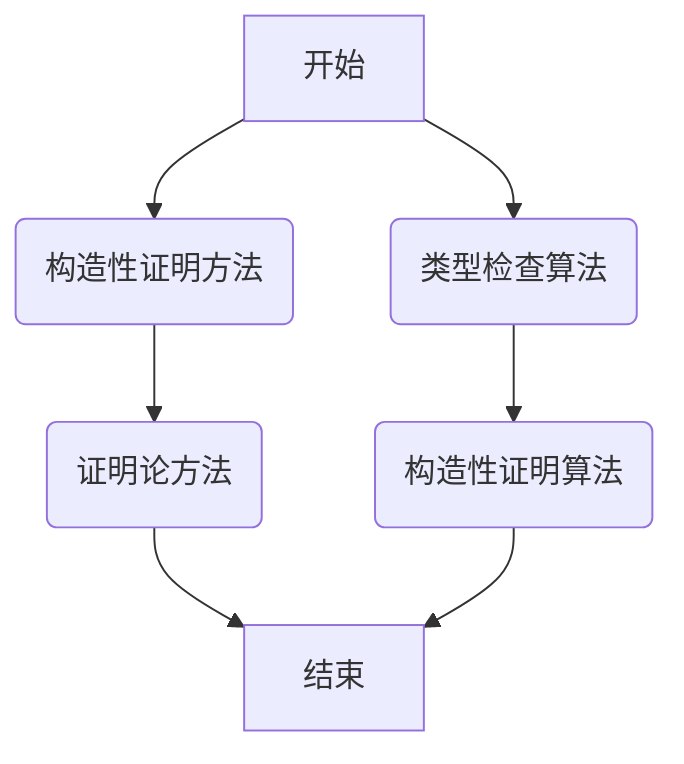

                 


### 《直觉主义逻辑与构造性类型理论》

> 关键词：直觉主义逻辑、构造性类型理论、数学证明、算法原理、系统架构设计

> 摘要：本文深入探讨了直觉主义逻辑与构造性类型理论的基本概念、原理及其在数学证明和计算机科学中的应用。通过逐步分析，揭示了这两种理论的核心特点、相互关系及其在实际问题中的运用。

### 目录大纲

# 《直觉主义逻辑与构造性类型理论》

## 第一部分：背景介绍

### 第1章：问题背景

#### 1.1.1 问题背景

直觉主义逻辑和构造性类型理论是数学哲学和逻辑学中的重要理论。直觉主义逻辑强调数学证明的过程性和不可分性，而构造性类型理论则基于类型的概念和构造性证明方法。本文将探讨这两种理论的基本概念、原理及其在数学证明和计算机科学中的应用。

#### 1.1.2 问题描述

直觉主义逻辑和构造性类型理论的研究涉及数学证明、逻辑学、计算机科学等领域。其核心问题是：如何通过构造性的方法来证明数学命题？

#### 1.1.3 问题解决

直觉主义逻辑和构造性类型理论为数学证明提供了新的视角和方法。通过构造性证明，可以更直观地理解数学命题，并解决传统逻辑方法无法解决的问题。

#### 1.1.4 边界与外延

直觉主义逻辑和构造性类型理论的研究边界涵盖了数学基础、逻辑学、计算机科学等多个领域。其外延包括证明理论、类型理论、构造性逻辑等。

#### 1.1.5 概念结构与核心要素组成

- 直觉主义逻辑：直觉、证明、不可分性。
- 构造性类型理论：类型、构造性证明、形式化。

## 第二部分：核心概念与联系

### 第2章：核心概念原理

#### 2.1.1 直觉主义逻辑原理

直觉主义逻辑的基本原理包括：证明的过程性、证明的不可分性、构造性证明。

#### 2.1.2 构造性类型理论原理

构造性类型理论的基本原理包括：类型的概念、构造性证明方法、形式化。

### 第3章：概念属性特征对比表格

| 概念        | 直觉主义逻辑                    | 构造性类型理论                  |
|-------------|--------------------------------|--------------------------------|
| 基本原理    | 证明的过程性、不可分性、构造性  | 类型、构造性证明、形式化        |
| 应用领域    | 数学证明、逻辑学、计算机科学    | 数学基础、形式逻辑、计算机科学  |
| 特点        | 直觉性、构造性、过程性          | 类型性、构造性、形式化          |

### 第4章：ER实体关系图架构

```mermaid
erDiagram
    Client ||--|{ Order }|--|+ Employee
    Order ||--|{ Item }|--|+ Product
    Employee ||--|{ Employee_Skills }|--|+ Skill
```

## 第三部分：算法原理讲解

### 第5章：算法原理

#### 5.1.1 直觉主义逻辑证明算法

直觉主义逻辑证明算法主要包括：构造性证明方法、证明论方法。

#### 5.1.2 构造性类型理论证明算法

构造性类型理论证明算法主要包括：类型检查算法、构造性证明算法。

### 第6章：算法流程图



### 第7章：算法原理讲解

#### 7.1.1 直觉主义逻辑证明算法讲解

直觉主义逻辑证明算法主要基于构造性证明方法和证明论方法。通过构造性证明，可以直观地理解数学命题；通过证明论方法，可以证明数学命题的正确性。

#### 7.1.2 构造性类型理论证明算法讲解

构造性类型理论证明算法主要基于类型检查算法和构造性证明算法。类型检查算法用于确保程序的类型安全；构造性证明算法用于证明数学命题的正确性。

### 第8章：算法举例说明

#### 8.1.1 直觉主义逻辑证明算法举例

$$
1+1=2
$$

这是一个简单的直觉主义逻辑证明算法举例。通过构造性证明，我们可以直观地证明这个命题。

#### 8.1.2 构造性类型理论证明算法举例

$$
P \Rightarrow Q
$$

这是一个构造性类型理论证明算法的例子。通过类型检查算法和构造性证明算法，我们可以证明这个命题的正确性。

## 第四部分：系统分析与架构设计方案

### 第9章：问题场景介绍

本章节介绍一个基于直觉主义逻辑和构造性类型理论的数学证明系统。

### 第10章：项目介绍

介绍一个基于直觉主义逻辑和构造性类型理论的数学证明系统开发项目。

### 第11章：系统功能设计

本章节介绍系统功能设计，包括领域模型类图。

### 第12章：系统架构设计

本章节介绍系统架构设计，包括架构图。

### 第13章：系统接口设计和系统交互

本章节介绍系统接口设计和系统交互，包括序列图。

### 第14章：项目实战

本章节进行项目实战，包括环境安装、系统核心实现源代码，代码应用解读与分析，实际案例分析和详细讲解剖析，项目小结。

### 第15章：最佳实践 tips

本章节提供最佳实践 tips。

### 第16章：小结

本章节对全文进行小结。

### 第17章：注意事项

本章节说明注意事项。

### 第18章：拓展阅读

本章节推荐拓展阅读资料。

以上是文章的目录大纲结构，接下来我们将根据这个结构逐步深入探讨直觉主义逻辑与构造性类型理论的核心概念、原理及其应用。让我们一步步深入，揭开这两个重要理论的面纱。首先是问题背景的介绍。

