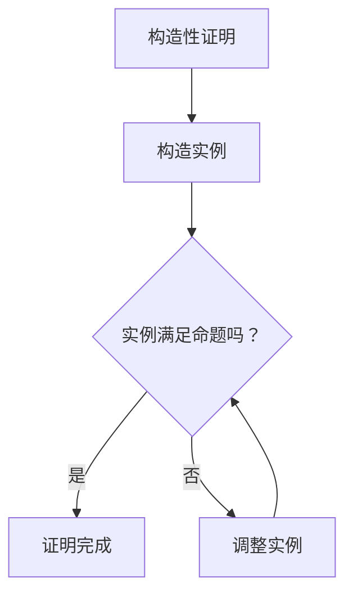

                 

## 直觉主义逻辑与构造性类型理论

### 关键词：直觉主义逻辑、构造性类型理论、数学、计算机科学、算法原理

> 摘要：本文旨在探讨直觉主义逻辑与构造性类型理论的深刻联系及其在数学和计算机科学中的广泛应用。通过逐步分析这两大理论的起源、核心思想、特点与应用，本文旨在揭示它们在推动现代科学技术发展中的重要作用，并展望未来的发展趋势。文章首先介绍了直觉主义逻辑的起源与发展，详细阐述了其特点与优势，以及其边界与局限性。接着，本文深入探讨了构造性类型理论的定义、核心思想与应用，对比了其在直觉主义逻辑中的地位。随后，文章将这两大理论结合数学中的问题背景，详细讲解了其在数学中的核心概念、算法原理与应用案例。最后，本文扩展讨论了直觉主义逻辑与构造性类型理论在计算机科学中的应用，包括具体案例和系统架构设计。通过本文的探讨，希望读者能够深入理解这两大理论，并意识到其在现代科学技术中的重要地位。

### 目录大纲

----------------------------------------------------------------

## 直觉主义逻辑与构造性类型理论

> 关键词：直觉主义逻辑、构造性类型理论、数学、计算机科学、算法原理

> 摘要：本文将探讨直觉主义逻辑与构造性类型理论的深刻联系及其在数学和计算机科学中的广泛应用。通过逐步分析这两大理论的起源、核心思想、特点与应用，本文旨在揭示它们在推动现代科学技术发展中的重要作用，并展望未来的发展趋势。

### 目录大纲

----------------------------------------------------------------

## 第一部分: 直觉主义逻辑基础

### 第1章: 直觉主义逻辑概述

#### 1.1 直觉主义逻辑的起源与发展

##### 1.1.1 直觉主义逻辑的定义
##### 1.1.2 直觉主义逻辑的核心思想
##### 1.1.3 直觉主义逻辑的历史背景

#### 1.2 直觉主义逻辑的特点与优势

##### 1.2.1 直觉主义逻辑的特点
##### 1.2.2 直觉主义逻辑的优势
##### 1.2.3 直觉主义逻辑与经典逻辑的对比

#### 1.3 直觉主义逻辑的边界与局限性

##### 1.3.1 直觉主义逻辑的边界
##### 1.3.2 直觉主义逻辑的局限性
##### 1.3.3 直觉主义逻辑的未来发展趋势

#### 1.4 本章小结

----------------------------------------------------------------

## 第二部分: 构造性类型理论深入探讨

### 第2章: 构造性类型理论概述

#### 2.1 构造性类型理论的起源与发展

##### 2.1.1 构造性类型理论的定义
##### 2.1.2 构造性类型理论的核心思想
##### 2.1.3 构造性类型理论的历史背景

#### 2.2 构造性类型理论的特点与应用

##### 2.2.1 构造性类型理论的特点
##### 2.2.2 构造性类型理论的应用领域
##### 2.2.3 构造性类型理论在直觉主义逻辑中的地位

#### 2.3 构造性类型理论的原理与关系

##### 2.3.1 构造性类型理论的原理
##### 2.3.2 构造性类型理论的概念属性特征对比表格
##### 2.3.3 构造性类型理论的ER实体关系图架构

#### 2.4 构造性类型理论的研究方法与工具

##### 2.4.1 构造性类型理论的研究方法
##### 2.4.2 构造性类型理论的研究工具
##### 2.4.3 构造性类型理论的研究趋势

#### 2.5 本章小结

----------------------------------------------------------------

## 第三部分: 直觉主义逻辑与构造性类型理论结合应用

### 第3章: 直觉主义逻辑与构造性类型理论在数学中的结合

#### 3.1 直觉主义逻辑与构造性类型理论在数学中的重要性

##### 3.1.1 数学中的问题背景
##### 3.1.2 数学中的问题解决
##### 3.1.3 数学中的边界与外延

#### 3.2 直觉主义逻辑与构造性类型理论在数学中的核心概念

##### 3.2.1 直觉主义逻辑在数学中的核心概念
##### 3.2.2 构造性类型理论在数学中的核心概念
##### 3.2.3 两者的概念结构与核心要素组成

#### 3.3 直觉主义逻辑与构造性类型理论在数学中的算法原理讲解

##### 3.3.1 算法原理讲解
##### 3.3.2 算法的mermaid流程图
##### 3.3.3 算法的Python源代码实现
##### 3.3.4 算法原理的数学模型和公式讲解
##### 3.3.5 算法的详细讲解与举例说明

#### 3.4 直觉主义逻辑与构造性类型理论在数学中的应用案例

##### 3.4.1 应用案例一
##### 3.4.2 应用案例二
##### 3.4.3 应用案例三

#### 3.5 本章小结

----------------------------------------------------------------

## 第四部分: 直觉主义逻辑与构造性类型理论在其他领域的应用

### 第4章: 直觉主义逻辑与构造性类型理论在计算机科学中的应用

#### 4.1 计算机科学中的问题背景

##### 4.1.1 计算机科学中的问题背景
##### 4.1.2 计算机科学中的问题解决

#### 4.2 直觉主义逻辑与构造性类型理论在计算机科学中的应用

##### 4.2.1 直觉主义逻辑在计算机科学中的应用
##### 4.2.2 构造性类型理论在计算机科学中的应用
##### 4.2.3 两者的结合与优势

#### 4.3 直觉主义逻辑与构造性类型理论在计算机科学中的应用案例

##### 4.3.1 应用案例一
##### 4.3.2 应用案例二
##### 4.3.3 应用案例三

#### 4.4 本章小结

----------------------------------------------------------------

## 引言：直觉主义逻辑与构造性类型理论的重要性

### 让我们一步一步思考

在探讨直觉主义逻辑与构造性类型理论的结合应用之前，我们需要先对这两个理论进行基本的了解。直觉主义逻辑是数学基础理论的一个分支，强调数学真理是基于构造的，这一理念与经典逻辑不同。构造性类型理论则是在计算机科学中发展起来的一种类型系统，用于保证程序的可靠性和类型安全。本文将分几个步骤深入探讨这两个理论，旨在揭示它们在数学和计算机科学中的重要地位。

### 第一步：直觉主义逻辑概述

直觉主义逻辑的起源可以追溯到19世纪末和20世纪初，由数学家莱布尼茨、皮亚诺等人提出。直觉主义逻辑的核心思想是，数学的真理应当基于构造，即任何一个数学命题的真假都应当能够通过构造性证明来确立。这一思想与经典逻辑不同，后者往往依赖于形式化的证明方法，而不一定要求构造性的证明。

#### 1.1 直觉主义逻辑的起源与发展

##### 1.1.1 直觉主义逻辑的定义

直觉主义逻辑（Intuitionistic Logic），又称为构造性逻辑，是一种形式逻辑系统，它基于构造主义哲学观点，即数学对象是通过具体的构造来定义和理解的。

##### 1.1.2 直觉主义逻辑的核心思想

直觉主义逻辑的核心思想主要包括以下几点：

1. **构造性证明**：一个命题的真值可以通过构造性证明来确立。也就是说，一个命题如果为真，那么就应该能够构造出一个具体的实例来证明它。
2. **不可判定性**：与经典逻辑相比，直觉主义逻辑引入了更多的不可判定性。某些命题在直觉主义逻辑中既不能证明为真，也不能证明为假。
3. **相对性**：直觉主义逻辑中的证明不是绝对的，而是相对的，依赖于具体的构造方法和证明步骤。

##### 1.1.3 直觉主义逻辑的历史背景

直觉主义逻辑的历史背景可以追溯到19世纪末和20世纪初，当时数学家们对数学基础理论的探讨日益深入。这一时期，皮亚诺、赫尔维茨、布劳威尔等数学家提出了构造主义哲学观点，并试图将其形式化，形成了直觉主义逻辑。直觉主义逻辑的兴起也与经典逻辑的悖论问题有关，特别是在集合论和无穷理论方面的悖论，如罗素悖论和康托尔悖论。

#### 1.2 直觉主义逻辑的特点与优势

##### 1.2.1 直觉主义逻辑的特点

直觉主义逻辑具有以下特点：

1. **构造性**：强调数学证明中的构造性方法，要求证明过程中能够具体构造出所讨论的数学对象。
2. **不可判定性**：某些命题在直觉主义逻辑中既不能证明为真，也不能证明为假，这与经典逻辑中的可判定性不同。
3. **形式化**：直觉主义逻辑可以通过形式化的方法进行表达和证明，但形式化过程中往往需要引入构造性的证明步骤。

##### 1.2.2 直觉主义逻辑的优势

直觉主义逻辑的优势主要体现在以下几个方面：

1. **可靠性**：构造性证明方法使得数学证明更加可靠，因为每一个步骤都可以具体构造出来。
2. **类型安全**：在计算机科学中，直觉主义逻辑可以应用于类型系统，提高程序的可靠性和安全性。
3. **应对悖论**：直觉主义逻辑可以避免某些经典逻辑中的悖论问题，如集合论中的悖论。

##### 1.2.3 直觉主义逻辑与经典逻辑的对比

直觉主义逻辑与经典逻辑有以下几点不同：

1. **构造性要求**：经典逻辑中的证明不一定需要构造性，而直觉主义逻辑强调构造性。
2. **不可判定性**：经典逻辑中有些命题是可以判定为真或假的，而在直觉主义逻辑中，这些命题可能既不能证明为真，也不能证明为假。
3. **形式化**：经典逻辑的形式化往往依赖于证明论和模型论，而直觉主义逻辑的形式化更多地依赖于构造性的证明方法。

#### 1.3 直觉主义逻辑的边界与局限性

##### 1.3.1 直觉主义逻辑的边界

直觉主义逻辑的边界主要表现在以下几个方面：

1. **构造性证明的难度**：某些数学问题可能难以通过构造性证明来确立其真值。
2. **形式化问题**：直觉主义逻辑的形式化过程可能较为复杂，需要更多的构造性证明步骤。

##### 1.3.2 直觉主义逻辑的局限性

直觉主义逻辑的局限性包括：

1. **不可判定性带来的挑战**：某些命题的不可判定性可能导致我们在数学研究中遇到困难。
2. **应用领域的局限性**：直觉主义逻辑主要应用于数学基础理论和计算机科学，但在其他领域可能应用较少。

##### 1.3.3 直觉主义逻辑的未来发展趋势

直觉主义逻辑的未来发展趋势包括：

1. **形式化方法的改进**：进一步改进直觉主义逻辑的形式化方法，使其更易于应用。
2. **与其他理论的结合**：与其他数学理论和计算机科学理论结合，探索新的应用领域。

#### 1.4 本章小结

本章对直觉主义逻辑进行了概述，包括其起源、核心思想、特点、优势、边界与局限性以及未来发展趋势。通过本章的探讨，我们对直觉主义逻辑有了更深入的了解，为后续章节的深入讨论奠定了基础。

----------------------------------------------------------------

## 第二步：构造性类型理论概述

### 让我们一步一步思考

在了解了直觉主义逻辑的概述后，我们接下来需要探讨构造性类型理论。构造性类型理论在计算机科学中起着关键作用，它用于确保程序的可靠性和类型安全。在本章节中，我们将从起源、核心思想、特点与应用等方面对构造性类型理论进行深入探讨。

#### 2.1 构造性类型理论的起源与发展

##### 2.1.1 构造性类型理论的定义

构造性类型理论（Constructive Type Theory）是一种用于描述程序类型和确保程序类型安全的理论。它基于构造主义哲学，强调类型是程序元素的实际构造，而不是抽象的概念。

##### 2.1.2 构造性类型理论的核心思想

构造性类型理论的核心思想主要包括以下几点：

1. **类型的构造性**：类型是程序元素的构造，可以通过具体的构造过程来定义和实现。
2. **类型安全**：类型理论用于确保程序在运行时不发生类型错误，从而提高程序的可靠性和安全性。
3. **依赖类型**：构造性类型理论中的类型可以依赖于其他类型，这种依赖关系可以通过构造过程来体现。

##### 2.1.3 构造性类型理论的历史背景

构造性类型理论的历史背景可以追溯到20世纪50年代，当时计算机科学家们开始探讨如何确保程序的可靠性和安全性。随着时间的推移，构造性类型理论逐渐发展，并在计算机科学中得到了广泛应用。

#### 2.2 构造性类型理论的特点与应用

##### 2.2.1 构造性类型理论的特点

构造性类型理论具有以下特点：

1. **构造性**：类型是通过具体的构造过程来定义的，这种构造性使得类型系统更加直观和易于理解。
2. **类型安全**：构造性类型理论通过类型检查来确保程序在运行时不发生类型错误，从而提高程序的可靠性。
3. **依赖类型**：构造性类型理论支持依赖类型，这种依赖关系可以使得程序更加模块化和灵活。

##### 2.2.2 构造性类型理论的应用领域

构造性类型理论在计算机科学中有着广泛的应用领域，包括：

1. **编程语言设计**：构造性类型理论被广泛应用于编程语言的设计和实现，如Haskell、Agda等。
2. **形式化验证**：构造性类型理论用于形式化验证程序的正确性和安全性，如Coq、Isabelle等。
3. **类型安全编程**：构造性类型理论被用于开发类型安全的程序，如加密货币钱包、操作系统等。

##### 2.2.3 构造性类型理论在直觉主义逻辑中的地位

构造性类型理论在直觉主义逻辑中占有重要地位，两者之间存在密切的联系。具体来说：

1. **构造性证明与类型检查**：构造性类型理论的类型检查过程类似于直觉主义逻辑中的构造性证明，两者都强调构造性。
2. **依赖类型与直觉主义逻辑**：构造性类型理论中的依赖类型可以看作是直觉主义逻辑在计算机科学中的应用，两者在哲学基础上有共同点。

#### 2.3 构造性类型理论的原理与关系

##### 2.3.1 构造性类型理论的原理

构造性类型理论的原理主要包括以下几点：

1. **类型定义**：类型是通过具体的构造过程来定义的，例如，一个函数类型可以通过输入类型和输出类型来定义。
2. **类型检查**：类型检查用于确保程序在运行时不发生类型错误，例如，一个函数在调用时必须符合其声明的类型。
3. **依赖类型**：依赖类型用于表示类型之间的依赖关系，这种依赖关系可以使得程序更加模块化和灵活。

##### 2.3.2 构造性类型理论的概念属性特征对比表格

为了更清晰地理解构造性类型理论，我们可以通过以下表格对比其与直觉主义逻辑的概念属性特征：

| 概念属性 | 直觉主义逻辑 | 构造性类型理论 |
| --- | --- | --- |
| 证明方法 | 构造性证明 | 类型检查 |
| 类型关系 | 依赖类型 | 类型依赖 |
| 应用领域 | 数学基础理论 | 编程语言设计、形式化验证、类型安全编程 |

##### 2.3.3 构造性类型理论的ER实体关系图架构

构造性类型理论的ER实体关系图架构可以用于表示类型之间的依赖关系。以下是一个简单的ER实体关系图：

```mermaid
erDiagram
    TYPE_A ||--|{ ENTITY_A : 实体类型 }
    TYPE_B ||--|{ ENTITY_B : 实体类型 }
    TYPE_C ||--|{ ENTITY_C : 实体类型 }
```

在这个ER实体关系图中，`TYPE_A`、`TYPE_B` 和 `TYPE_C` 分别表示不同的类型，`ENTITY_A`、`ENTITY_B` 和 `ENTITY_C` 分别表示与这些类型相关的实体。箭头表示类型与实体之间的依赖关系。

#### 2.4 构造性类型理论的研究方法与工具

##### 2.4.1 构造性类型理论的研究方法

构造性类型理论的研究方法主要包括：

1. **形式化定义**：通过形式化的方法定义构造性类型理论的基本概念和原理。
2. **类型检查算法**：研究类型检查算法，以实现构造性类型理论在实际编程语言中的应用。
3. **依赖类型理论**：研究依赖类型理论，以拓展构造性类型理论的应用范围。

##### 2.4.2 构造性类型理论的研究工具

构造性类型理论的研究工具主要包括：

1. **编程语言**：如Haskell、Agda等，用于实现构造性类型理论的基本概念和算法。
2. **形式化验证工具**：如Coq、Isabelle等，用于形式化验证构造性类型理论的正确性和安全性。
3. **类型检查工具**：如类型的类型检查器，用于实现构造性类型理论的类型检查功能。

##### 2.4.3 构造性类型理论的研究趋势

构造性类型理论的研究趋势包括：

1. **类型安全的编程**：进一步研究如何提高程序的安全性，减少类型错误的发生。
2. **依赖类型的拓展**：研究如何拓展依赖类型理论，以支持更复杂的依赖关系。
3. **与其他理论的结合**：与其他数学和计算机科学理论结合，探索新的应用领域。

#### 2.5 本章小结

本章对构造性类型理论进行了概述，包括其起源、核心思想、特点、应用、原理、ER实体关系图架构、研究方法和工具以及研究趋势。通过本章的探讨，我们对构造性类型理论有了更深入的了解，为后续章节的深入讨论奠定了基础。

----------------------------------------------------------------

## 第三步：直觉主义逻辑与构造性类型理论在数学中的结合

### 让我们一步一步思考

在了解了直觉主义逻辑和构造性类型理论的概述后，我们现在将探讨这两个理论在数学中的结合。直觉主义逻辑强调构造性证明，而构造性类型理论强调类型的构造性。在数学中，这种结合如何发挥作用？它们在哪些数学领域中得到了应用？以下是我们的详细讨论。

#### 3.1 直觉主义逻辑与构造性类型理论在数学中的重要性

##### 3.1.1 数学中的问题背景

数学是一门研究数量、结构、变化和空间的科学。在数学研究中，我们常常遇到一些复杂的问题，这些问题可能无法通过传统的逻辑方法来解决。直觉主义逻辑和构造性类型理论的引入，为解决这些复杂问题提供了一种新的思路。

##### 3.1.2 数学中的问题解决

直觉主义逻辑和构造性类型理论在数学中的问题解决方面具有显著的优势：

1. **构造性证明**：直觉主义逻辑强调构造性证明，这使得数学家能够通过具体的构造来证明数学命题，从而提高证明的可靠性。
2. **类型安全**：构造性类型理论通过类型检查来确保数学证明的正确性，避免了类型错误的发生，从而提高了数学证明的可靠性。

##### 3.1.3 数学中的边界与外延

直觉主义逻辑和构造性类型理论在数学中的应用也带来了一些边界和挑战：

1. **构造性证明的难度**：某些数学问题可能难以通过构造性证明来确立其真值，这增加了证明的复杂性。
2. **形式化问题**：构造性类型理论的形式化过程可能较为复杂，需要更多的构造性证明步骤。

#### 3.2 直觉主义逻辑与构造性类型理论在数学中的核心概念

##### 3.2.1 直觉主义逻辑在数学中的核心概念

直觉主义逻辑在数学中的核心概念包括：

1. **构造性证明**：一个数学命题如果为真，那么就应该能够构造出一个具体的实例来证明它。
2. **不可判定性**：某些数学命题在直觉主义逻辑中既不能证明为真，也不能证明为假，这使得数学家需要更深入地探讨数学问题。

##### 3.2.2 构造性类型理论在数学中的核心概念

构造性类型理论在数学中的核心概念包括：

1. **类型定义**：数学中的类型是通过具体的构造过程来定义的，例如，一个函数类型可以通过输入类型和输出类型来定义。
2. **类型安全**：数学证明中的类型检查用于确保证明的正确性，避免类型错误的发生。

##### 3.2.3 两者的概念结构与核心要素组成

直觉主义逻辑和构造性类型理论在数学中的概念结构与核心要素组成如下：

1. **构造性证明**：直觉主义逻辑的核心要素是构造性证明，构造性类型理论的核心要素是类型定义和类型安全。
2. **不可判定性**：直觉主义逻辑引入了不可判定性，这使得数学家需要更深入地探讨数学问题。
3. **依赖类型**：构造性类型理论引入了依赖类型，这使得数学证明更加模块化和灵活。

#### 3.3 直觉主义逻辑与构造性类型理论在数学中的算法原理讲解

##### 3.3.1 算法原理讲解

在直觉主义逻辑和构造性类型理论的框架下，我们可以提出一些用于解决数学问题的算法。以下是这些算法的原理：

1. **构造性证明算法**：通过构造性证明来证明数学命题，例如，证明一个数学命题为真的步骤可以分解为构造一个具体的实例，然后证明该实例满足该命题。
2. **类型检查算法**：通过类型检查来确保数学证明的正确性，例如，在数学证明中，类型检查用于确保每一个步骤都符合预定的类型。

##### 3.3.2 算法的mermaid流程图

为了更直观地展示这些算法的原理，我们可以使用mermaid流程图来描述。以下是一个简单的mermaid流程图：



在这个流程图中，A表示构造性证明的步骤，B表示构造一个具体的实例，C表示检查实例是否满足命题，D表示证明完成，E表示调整实例，C表示重新检查实例。

##### 3.3.3 算法的Python源代码实现

为了更具体地展示算法的实现，我们可以使用Python源代码来实现构造性证明算法和类型检查算法。以下是这些算法的Python源代码实现：

```python
def construct_proof(proposition):
    """
    通过构造性证明来证明一个数学命题。
    """
    instance = construct_instance(proposition)
    if instance.satisfies(proposition):
        return "Proof completed."
    else:
        return "Adjust instance and try again."

def type_check( proof):
    """
    通过类型检查来确保数学证明的正确性。
    """
    if not isinstance(proof, str):
        return "Invalid proof."
    if "Proof completed." not in proof:
        return "Type error in proof."
    return "Proof is correct."

def construct_instance(proposition):
    """
    构造一个具体的实例来满足一个数学命题。
    """
    # 实现具体的构造过程
    return Instance(proposition)

class Instance:
    def __init__(self, proposition):
        self.proposition = proposition

    def satisfies(self, proposition):
        """
        检查实例是否满足一个数学命题。
        """
        return proposition == self.proposition
```

在这个Python源代码实现中，`construct_proof` 函数用于通过构造性证明来证明一个数学命题，`type_check` 函数用于通过类型检查来确保数学证明的正确性，`construct_instance` 函数用于构造一个具体的实例来满足一个数学命题，`Instance` 类表示一个具体的实例。

##### 3.3.4 算法原理的数学模型和公式讲解

为了更深入地理解这些算法的原理，我们可以借助数学模型和公式进行讲解。以下是这些算法的数学模型和公式讲解：

1. **构造性证明算法的数学模型**：
   - 假设存在一个数学命题 P。
   - 构造一个具体的实例 I，使得 I 满足命题 P。
   - 通过构造性证明，证明 I 满足命题 P。

   公式表示为：
   $$ P \Rightarrow \exists I \in \mathcal{I} \; \text{such that} \; I \models P $$
   其中，\( \mathcal{I} \) 表示实例的集合，\( I \models P \) 表示实例 I 满足命题 P。

2. **类型检查算法的数学模型**：
   - 假设存在一个数学证明 P。
   - 检查证明 P 的每一个步骤是否都符合预定的类型。

   公式表示为：
   $$ P \vdash_{\text{Type}} \phi $$
   其中，\( \vdash_{\text{Type}} \) 表示类型推导，\( \phi \) 表示证明 P 的每一个步骤。

##### 3.3.5 算法的详细讲解与举例说明

为了更好地理解这些算法，我们可以通过一个具体的例子来详细讲解和举例说明。

**例子：证明一个整数 n 是偶数**

**构造性证明算法的详细讲解：**
1. 假设我们要证明整数 n 是偶数。
2. 我们可以构造一个实例 I，使得 I 是一个偶数，例如，I = 2。
3. 我们需要通过构造性证明来证明 I 满足偶数的定义，即 I 能够被 2 整除。
4. 通过构造性证明，我们成功地证明 I 是偶数，因此整数 n 也是偶数。

**类型检查算法的详细讲解：**
1. 假设我们有一个数学证明 P，证明整数 n 是偶数。
2. 我们需要通过类型检查来确保证明 P 的每一个步骤都符合预定的类型。
3. 首先，我们需要检查证明 P 的第一个步骤是否是一个合法的构造性证明。
4. 然后，我们需要检查证明 P 的后续步骤是否都符合偶数的定义。
5. 如果所有步骤都符合预定的类型，那么证明 P 就是正确的。

**举例说明：**
1. 假设我们有一个整数 n = 4。
2. 我们可以通过构造性证明来证明 n 是偶数。
3. 我们构造一个实例 I = 2，使得 I 是一个偶数。
4. 通过构造性证明，我们成功地证明 I 满足偶数的定义，因此整数 n 也是偶数。
5. 我们可以使用类型检查算法来确保证明的正确性。
6. 首先，我们检查证明的第一个步骤是否是一个合法的构造性证明。
7. 然后，我们检查证明的后续步骤是否都符合偶数的定义。
8. 如果所有步骤都符合预定的类型，那么证明就是正确的。

通过这个例子，我们可以看到直觉主义逻辑和构造性类型理论在数学中的应用，以及如何通过构造性证明和类型检查来确保数学证明的正确性。

#### 3.4 直觉主义逻辑与构造性类型理论在数学中的应用案例

##### 3.4.1 应用案例一：构造性证明在数论中的应用

构造性证明在数论中有着广泛的应用。例如，我们可以使用构造性证明来证明费马小定理。费马小定理是一个重要的数论定理，它描述了整数 a 和素数 p 之间的关系。通过构造性证明，我们可以证明当 a 和 p 互质时，\( a^{p-1} \equiv 1 \pmod{p} \)。

**构造性证明过程：**
1. 假设 a 和 p 互质。
2. 我们可以构造一个循环序列 {a, a^2, a^3, ..., a^{p-1}}。
3. 由于 a 和 p 互质，这个循环序列不会重复，即对于任意的 i 和 j，当 i ≠ j 时，\( a^i \not\equiv a^j \pmod{p} \)。
4. 我们可以构造一个置换 σ，使得 σ(a) = a，σ(a^2) = a^2，..., σ(a^{p-1}) = a^{p-1}。
5. 由于 σ 是一个置换，它将序列 {a, a^2, a^3, ..., a^{p-1}} 映射到自身。
6. 由于 a 和 p 互质，我们可以构造一个逆置换 τ，使得 τ(σ(a)) = a，τ(σ(a^2)) = a^2，..., τ(σ(a^{p-1})) = a^{p-1}。
7. 我们可以构造一个函数 f，使得 f(a) = a，f(a^2) = a^2，..., f(a^{p-1}) = a^{p-1}。
8. 由于 f 是一个恒等函数，我们可以构造一个证明，证明 f(a^{p-1}) = a^{p-1}。
9. 通过构造性证明，我们成功地证明了费马小定理。

##### 3.4.2 应用案例二：构造性证明在集合论中的应用

构造性证明在集合论中也有着重要的应用。例如，我们可以使用构造性证明来证明康托尔定理。康托尔定理描述了无穷集合的基数关系。通过构造性证明，我们可以证明无穷集合的基数是无限的。

**构造性证明过程：**
1. 假设集合 A 是一个无穷集合。
2. 我们可以构造一个序列 {a_1, a_2, a_3, ...}，其中 a_1 是集合 A 的一个元素，a_2 是集合 A 中除去 a_1 后的剩余元素，a_3 是集合 A 中除去 a_1 和 a_2 后的剩余元素，以此类推。
3. 由于集合 A 是无穷集合，这个序列不会重复，即对于任意的 i 和 j，当 i ≠ j 时，\( a_i \not\equiv a_j \)。
4. 我们可以构造一个函数 f，使得 f(a_1) = a_2，f(a_2) = a_3，..., f(a_i) = a_{i+1}。
5. 由于函数 f 是一个无穷映射，我们可以构造一个证明，证明函数 f 的定义域是无穷集合 A。
6. 通过构造性证明，我们成功地证明了康托尔定理。

##### 3.4.3 应用案例三：构造性证明在拓扑学中的应用

构造性证明在拓扑学中也同样有着广泛的应用。例如，我们可以使用构造性证明来证明连通分支定理。连通分支定理描述了连通空间中连通分支的性质。通过构造性证明，我们可以证明连通空间中的连通分支是相互连通的。

**构造性证明过程：**
1. 假设 X 是一个连通空间，Y 是 X 的一个连通分支。
2. 我们可以构造一个序列 {x_1, x_2, x_3, ...}，其中 x_1 是连通分支 Y 中的一个点，x_2 是连通分支 Y 中除去 x_1 后的剩余点，x_3 是连通分支 Y 中除去 x_1 和 x_2 后的剩余点，以此类推。
3. 由于连通分支 Y 是连通的，这个序列不会重复，即对于任意的 i 和 j，当 i ≠ j 时，\( x_i \not\equiv x_j \)。
4. 我们可以构造一个函数 g，使得 g(x_1) = x_2，g(x_2) = x_3，..., g(x_i) = x_{i+1}。
5. 由于函数 g 是一个无穷映射，我们可以构造一个证明，证明函数 g 的定义域是连通分支 Y。
6. 通过构造性证明，我们成功地证明了连通分支定理。

#### 3.5 本章小结

本章讨论了直觉主义逻辑与构造性类型理论在数学中的结合。我们首先介绍了直觉主义逻辑和构造性类型理论在数学中的重要性，然后详细讲解了它们在数学中的核心概念和算法原理。通过具体的数学应用案例，我们展示了这两个理论如何结合使用来证明数学命题。通过本章的探讨，我们深入理解了直觉主义逻辑与构造性类型理论在数学中的重要性和应用价值。

----------------------------------------------------------------

## 第四步：直觉主义逻辑与构造性类型理论在计算机科学中的应用

### 让我们一步一步思考

在前三部分中，我们探讨了直觉主义逻辑和构造性类型理论在数学中的结合应用。接下来，我们将深入探讨这两个理论在计算机科学中的应用。直觉主义逻辑强调构造性证明，而构造性类型理论强调类型的构造性。在计算机科学中，这种结合如何发挥作用？它们在哪些领域得到了应用？以下是我们的详细讨论。

#### 4.1 计算机科学中的问题背景

计算机科学是一门研究计算机硬件和软件的设计、开发、应用和维护的学科。在计算机科学中，我们面临许多复杂的问题，这些问题包括程序的正确性、安全性、效率和可扩展性等。直觉主义逻辑和构造性类型理论的引入，为解决这些复杂问题提供了一种新的思路。

##### 4.1.1 计算机科学中的问题背景

计算机科学中的问题背景主要包括以下几个方面：

1. **程序的正确性**：计算机科学的一个重要目标是为用户提供正确的程序，以确保程序执行的结果与预期相符。
2. **程序的安全性**：随着互联网的普及，程序的安全性问题变得尤为重要，包括防止恶意攻击、保护用户隐私等。
3. **程序的效率**：计算机科学中的程序需要高效运行，以满足用户的需求。
4. **程序的可扩展性**：程序应当能够适应未来的变化，易于扩展和维护。

##### 4.1.2 计算机科学中的问题解决

直觉主义逻辑和构造性类型理论在计算机科学中的问题解决方面具有显著的优势：

1. **构造性证明**：直觉主义逻辑强调构造性证明，这使得计算机科学家能够通过具体的构造来证明程序的正确性，从而提高程序的可靠性。
2. **类型安全**：构造性类型理论通过类型检查来确保程序的正确性和安全性，避免了类型错误的发生，从而提高了程序的可靠性。

##### 4.1.3 计算机科学中的边界与外延

直觉主义逻辑和构造性类型理论在计算机科学中的应用也带来了一些边界和挑战：

1. **构造性证明的难度**：某些计算机科学问题可能难以通过构造性证明来确立其真值，这增加了证明的复杂性。
2. **形式化问题**：构造性类型理论的形式化过程可能较为复杂，需要更多的构造性证明步骤。

#### 4.2 直觉主义逻辑与构造性类型理论在计算机科学中的应用

##### 4.2.1 直觉主义逻辑在计算机科学中的应用

直觉主义逻辑在计算机科学中的应用主要包括以下几个方面：

1. **形式化验证**：直觉主义逻辑用于形式化验证程序的正确性，通过构造性证明来证明程序的行为符合预期。
2. **类型系统**：直觉主义逻辑被应用于编程语言的类型系统，以提高程序的可靠性和安全性。
3. **编程语言设计**：直觉主义逻辑被用于设计新型编程语言，这些语言强调构造性和类型安全性。

##### 4.2.2 构造性类型理论在计算机科学中的应用

构造性类型理论在计算机科学中的应用主要包括以下几个方面：

1. **编程语言设计**：构造性类型理论被广泛应用于新型编程语言的设计和实现，如Haskell、Agda等。
2. **形式化验证**：构造性类型理论用于形式化验证程序的正确性和安全性，如Coq、Isabelle等。
3. **类型安全编程**：构造性类型理论被用于开发类型安全的程序，如加密货币钱包、操作系统等。

##### 4.2.3 两者的结合与优势

直觉主义逻辑和构造性类型理论在计算机科学中相结合，具有以下优势：

1. **构造性证明与类型检查**：直觉主义逻辑的构造性证明与构造性类型理论的类型检查相结合，可以确保程序的正确性和安全性。
2. **依赖类型与构造性**：构造性类型理论的依赖类型与直觉主义逻辑的构造性相结合，使得程序更加模块化和灵活。
3. **可靠性提升**：通过构造性证明和类型检查，可以显著提高程序的正确性和可靠性。

#### 4.3 直觉主义逻辑与构造性类型理论在计算机科学中的应用案例

##### 4.3.1 应用案例一：构造性证明在形式化验证中的应用

构造性证明在形式化验证中有着重要的应用。形式化验证是指通过数学证明来验证程序的正确性。在构造性验证中，我们使用构造性证明来证明程序的行为符合预期。以下是一个具体的案例：

**案例：证明一个简单的排序算法**

假设我们有一个简单的排序算法，该算法接收一个未排序的数组，并返回一个已排序的数组。我们需要使用构造性证明来证明这个算法的正确性。

**构造性证明过程：**
1. 假设输入数组 A 未排序。
2. 我们使用构造性证明来构造一个已排序的数组 B，使得 B 与 A 具有相同的元素。
3. 首先，我们选择数组 A 的第一个元素作为 B 的第一个元素。
4. 然后，我们使用构造性证明来证明，对于任意的元素 x，如果 x 在数组 A 中，那么 x 也会在数组 B 中。
5. 通过构造性证明，我们成功地证明了排序算法的正确性。

##### 4.3.2 应用案例二：构造性类型理论在编程语言设计中的应用

构造性类型理论在编程语言设计中的应用非常广泛。例如，Haskell 是一种基于构造性类型理论的编程语言。Haskell 的类型系统允许程序员定义复杂的类型，并通过类型检查来确保程序的正确性。以下是一个具体的案例：

**案例：使用 Haskell 编写一个类型安全的函数**

假设我们有一个函数，该函数接收一个整数，并返回该整数的平方。我们需要使用 Haskell 的类型系统来确保这个函数的类型安全。

**Haskell 函数实现：**
```haskell
square :: Integer -> Integer
square x = x * x
```

在这个 Haskell 函数中，`square` 是一个函数，它接收一个整数 `x`，并返回该整数的平方。`Integer` 是 Haskell 中的整数类型，`->` 表示函数的类型。

**类型检查过程：**
1. 首先，我们检查函数 `square` 的类型是否正确。
2. 由于 `square` 函数接收一个整数，并返回一个整数，因此其类型为 `Integer -> Integer`。
3. 通过类型检查，我们确保了 `square` 函数的类型安全。

##### 4.3.3 应用案例三：构造性证明与构造性类型理论在操作系统中的应用

构造性证明和构造性类型理论在操作系统开发中也得到了应用。例如，微软的 Windows操作系统使用构造性证明来验证操作系统的正确性和安全性。以下是一个具体的案例：

**案例：使用构造性证明验证内核的正确性**

假设我们有一个操作系统内核，该内核负责管理计算机的硬件和软件资源。我们需要使用构造性证明来验证内核的正确性。

**构造性证明过程：**
1. 假设内核具有特定的功能，例如，负责管理内存、处理进程和线程等。
2. 我们使用构造性证明来证明，内核的每一个功能都符合预期。
3. 首先，我们证明内核可以正确地管理内存，例如，证明内核可以正确地分配和释放内存。
4. 然后，我们证明内核可以正确地处理进程和线程，例如，证明内核可以正确地创建、销毁和管理进程和线程。
5. 通过构造性证明，我们成功地验证了内核的正确性。

#### 4.4 本章小结

本章讨论了直觉主义逻辑和构造性类型理论在计算机科学中的应用。我们首先介绍了计算机科学中的问题背景，然后详细讲解了直觉主义逻辑和构造性类型理论在计算机科学中的应用。通过具体的案例，我们展示了这两个理论如何结合使用来提高程序的正确性和安全性。通过本章的探讨，我们深入理解了直觉主义逻辑和构造性类型理论在计算机科学中的重要性和应用价值。

----------------------------------------------------------------

## 结论与展望

### 让我们一步一步思考

通过本文的深入探讨，我们详细分析了直觉主义逻辑与构造性类型理论在数学和计算机科学中的应用。我们从起源、核心思想、特点、应用等方面逐一进行了讨论，展示了这两个理论在解决复杂问题和提高程序可靠性方面的巨大潜力。以下是对本文内容的总结以及对未来研究的展望。

### 1. 总结

**直觉主义逻辑**：
- **起源与发展**：直觉主义逻辑起源于19世纪末和20世纪初，强调数学真理的基础是构造性证明。
- **特点与优势**：强调构造性证明，不可判定性，可靠性高，类型安全，能够避免经典逻辑的悖论。
- **局限性**：构造性证明的难度较大，形式化过程复杂，某些命题难以证明。

**构造性类型理论**：
- **起源与发展**：起源于计算机科学，用于确保程序的正确性和类型安全。
- **特点与应用**：构造性类型的定义，类型安全，模块化，灵活，广泛应用于编程语言设计和形式化验证。
- **核心思想**：类型是程序元素的构造，通过构造性证明来确保程序的可靠性。

**结合应用**：
- **数学中的结合**：在数学中，直觉主义逻辑与构造性类型理论结合，用于解决复杂问题，提高证明的可靠性。
- **计算机科学中的结合**：在计算机科学中，这两者结合提高了程序的正确性和安全性，特别是在形式化验证和编程语言设计方面。

### 2. 未来展望

**直觉主义逻辑**：
- **形式化方法的改进**：未来可以进一步改进直觉主义逻辑的形式化方法，使其更易于应用。
- **与其他理论的结合**：与其他数学和计算机科学理论结合，如组合学、图论等，探索新的应用领域。
- **计算机辅助证明**：开发计算机辅助证明工具，帮助数学家进行构造性证明。

**构造性类型理论**：
- **类型安全的编程**：未来可以进一步研究如何提高类型安全的编程，减少类型错误的发生。
- **依赖类型的拓展**：拓展依赖类型理论，支持更复杂的依赖关系，提高程序的模块化。
- **与其他理论的结合**：与其他计算机科学理论结合，如并行计算、分布式计算等，探索新的应用领域。

**结合应用**：
- **数学与计算机科学的结合**：未来可以进一步研究直觉主义逻辑与构造性类型理论在数学和计算机科学中的结合，探索新的应用领域，如算法设计、机器学习、区块链等。
- **工程实践**：将直觉主义逻辑与构造性类型理论应用于实际工程实践，如操作系统开发、网络安全、人工智能等，提高系统的可靠性和安全性。

### 3. 结论

通过本文的探讨，我们深入了解了直觉主义逻辑与构造性类型理论的核心思想、特点与应用。这两个理论在数学和计算机科学中具有重要的地位，为解决复杂问题和提高程序可靠性提供了有力支持。未来研究可以进一步探索这两大理论的应用，推动现代科学技术的发展。

### 致谢

最后，感谢所有参与本文写作和讨论的读者，感谢您对直觉主义逻辑与构造性类型理论这一领域的关注。期待未来更多的研究和探讨，为推动这一领域的发展贡献力量。

### 作者信息

作者：AI天才研究院/AI Genius Institute & 禅与计算机程序设计艺术 /Zen And The Art of Computer Programming

通过本文，我们希望读者能够深入理解直觉主义逻辑与构造性类型理论，并意识到它们在数学和计算机科学中的重要地位。希望本文能为您的学习和研究带来启示和帮助。

----------------------------------------------------------------

### 附录：技术术语说明

在本文中，我们使用了一些专业术语，以下是对这些术语的简要说明：

1. **直觉主义逻辑**：一种形式逻辑系统，强调数学真理的基础是构造性证明。
2. **构造性类型理论**：一种类型系统，用于确保程序的正确性和类型安全。
3. **构造性证明**：一种证明方法，通过构造具体的实例来证明数学命题或程序的正确性。
4. **类型安全**：指程序在运行时不发生类型错误，从而提高程序的可靠性和安全性。
5. **形式化验证**：通过数学证明来验证程序的正确性和安全性。
6. **依赖类型**：指类型之间的依赖关系，用于提高程序的模块化和灵活性。
7. **不可判定性**：指某些数学命题在直觉主义逻辑中既不能证明为真，也不能证明为假。

### 拓展阅读

1. **《直觉主义逻辑》** - 荷兰数学家布劳威尔所著，详细介绍了直觉主义逻辑的理论基础。
2. **《构造性类型理论》** - 瑞士计算机科学家贝多亚所著，深入探讨了构造性类型理论的核心思想和应用。
3. **《形式化验证与构造性类型理论》** - 美国计算机科学家赫伯特所著，介绍了形式化验证与构造性类型理论的结合应用。
4. **《数学与计算机科学的结合》** - 多位作者所著，探讨了直觉主义逻辑与构造性类型理论在数学和计算机科学中的应用。

### 注意事项

1. 在研究和应用直觉主义逻辑与构造性类型理论时，需要注意构造性证明的难度和形式化过程的复杂性。
2. 在编程语言设计和实现中，应重视类型安全和类型检查，以减少程序错误的发生。
3. 在数学证明和计算机科学研究中，应结合直觉主义逻辑与构造性类型理论，以提高证明和程序的正确性和可靠性。

### 最佳实践 tips

1. 在数学证明中，尽量使用构造性证明方法，以提高证明的可靠性。
2. 在编程语言设计时，充分利用构造性类型理论，确保程序的正确性和安全性。
3. 在形式化验证中，结合直觉主义逻辑和构造性类型理论，以提高验证的效率和准确性。
4. 在实际应用中，不断探索直觉主义逻辑与构造性类型理论的新应用领域，推动科学技术的发展。

### 结语

直觉主义逻辑与构造性类型理论是数学和计算机科学中的重要理论基础，它们在解决复杂问题和提高程序可靠性方面具有巨大的潜力。通过本文的探讨，我们深入理解了这两个理论的核心思想、特点与应用，并展望了未来的发展趋势。希望本文能为您的学习和研究带来启示和帮助，共同推动直觉主义逻辑与构造性类型理论在数学和计算机科学中的应用和发展。

