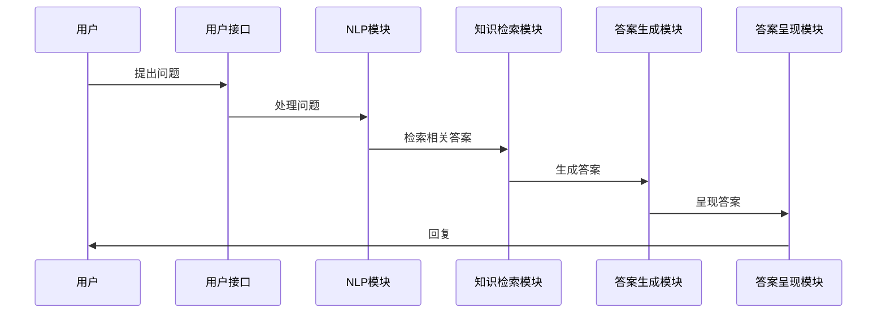

                 


### 文章标题：知识图谱在智能问答系统中的应用

关键词：知识图谱、智能问答系统、实体、属性、关系、查询、融合

摘要：本文从知识图谱的基本概念出发，详细探讨了知识图谱在智能问答系统中的应用。通过分析知识图谱的构建、查询和融合方法，以及智能问答系统的实现策略，本文旨在为读者提供一个全面且深入的视角，帮助理解知识图谱在现代智能问答系统中的关键作用。

----------------------------------------------------------------

# 第一部分：背景介绍

## 1.1 问题背景

随着互联网和大数据技术的飞速发展，知识获取和管理的需求愈发紧迫。在这个信息爆炸的时代，用户渴望能够快速、准确地获取所需信息。智能问答系统作为一种能够理解和回答用户问题的技术，应运而生，并受到了广泛关注。智能问答系统不仅能够处理结构化数据，还能够理解自然语言，从而为用户提供更加人性化的服务。

知识图谱作为一种结构化知识表示方法，为智能问答系统提供了强大的知识基础。知识图谱通过实体、属性和关系的表达，将海量的非结构化数据转化为计算机可以理解和处理的结构化数据。这使得智能问答系统能够更高效、更准确地回答用户的问题。

## 1.2 问题描述

知识图谱在智能问答系统中的应用主要涉及以下几个方面：

1. **知识图谱的构建**：如何从大量的非结构化数据中提取实体、属性和关系，构建一个完整、准确的知识图谱。
2. **知识图谱的查询**：如何高效地从知识图谱中查询所需信息，并生成准确的回答。
3. **知识图谱的融合**：如何将多个知识图谱进行整合，以提供更全面、更准确的知识服务。

这些应用不仅需要处理复杂的数据结构和算法问题，还需要考虑到用户交互的便捷性和系统的实时性。因此，如何有效地将知识图谱应用于智能问答系统，是一个具有挑战性的问题。

## 1.3 问题解决

为了解决上述问题，本文将从以下几个方面进行阐述：

1. **知识图谱的基本概念和构建方法**：介绍知识图谱的基本概念，包括实体、属性和关系，并探讨知识图谱的构建方法，如数据采集、实体识别、关系抽取等。
2. **知识图谱的查询和融合**：讲解知识图谱的查询语言和查询优化技术，以及知识图谱的融合方法，如实体融合、属性融合等。
3. **知识图谱在智能问答系统中的应用**：探讨如何利用知识图谱实现智能问答系统的构建，包括问答系统的架构设计、问答逻辑实现等。

## 1.4 边界与外延

1. **边界**：本文主要关注知识图谱在智能问答系统中的应用，不包括其他领域如搜索引擎、数据挖掘等的应用。
2. **外延**：知识图谱在智能问答系统中的应用是一个广泛且持续发展的领域，本文将介绍一些典型的应用案例，但并不代表全部。

## 1.5 概念结构与核心要素组成

知识图谱在智能问答系统中的应用涉及以下核心要素：

1. **知识图谱**：作为知识表示和查询的基础。
2. **问答系统**：作为知识查询和回答的接口。
3. **用户**：作为知识获取和使用的主体。

通过以上核心要素的有机结合，实现智能问答系统的高效、准确的知识获取和回答。

----------------------------------------------------------------

# 第二部分：核心概念与联系

## 2.1 知识图谱的概念

知识图谱（Knowledge Graph）是一种结构化数据存储方式，用于表示实体、属性和关系。它通常由大量的三元组组成，如（实体，属性，值）。知识图谱的主要作用是提供一个语义丰富的数据表示，以便于进行数据查询、推理和融合。

### 2.1.1 知识图谱的属性特征对比表格

| 特征         | 描述                                                         |
| ------------ | ------------------------------------------------------------ |
| 结构化       | 知识图谱以三元组的形式组织数据，便于计算机处理和查询。             |
| 语义丰富     | 知识图谱包含了实体、属性和关系，能够表达复杂的语义信息。           |
| 可扩展性     | 知识图谱可以容纳大量数据，并且容易进行更新和维护。               |
| 可复用性     | 知识图谱可以作为共享的知识库，供多个应用使用。                   |

### 2.1.2 知识图谱的ER实体关系图架构

```mermaid
erDiagram
  实体1 ||--|{ 实体2 : 关联关系 }
  实体2 ||--|{ 实体3 : 关联关系 }
  实体1 ||--|{ 实体3 : 关联关系 }
```

## 2.2 智能问答系统的概念

智能问答系统（Intelligent Question Answering System）是一种能够理解和回答用户问题的系统。它通常包括问答模块、知识库、自然语言处理（NLP）模块等。智能问答系统的目标是提供高效、准确的问题解答。

### 2.2.1 智能问答系统的属性特征对比表格

| 特征         | 描述                                                         |
| ------------ | ------------------------------------------------------------ |
| 自然语言处理 | 智能问答系统能够理解和处理自然语言输入，如文本、语音等。         |
| 知识库       | 智能问答系统依赖知识库来获取和回答问题，知识库的丰富度和准确性直接影响问答系统的性能。 |
| 问答模块     | 问答模块负责处理用户的输入，解析问题，并从知识库中检索相关答案。   |

### 2.2.2 智能问答系统的ER实体关系图架构

```mermaid
erDiagram
  用户 ||--|{ 问题 : 提问 }
  问题 ||--|{ 答案 : 回答 }
  知识库 ||--|{ 问题 : 存储问题 }
  知识库 ||--|{ 答案 : 存储答案 }
```

通过以上核心概念和联系的分析，我们可以更深入地理解知识图谱和智能问答系统之间的关系。知识图谱为智能问答系统提供了丰富的知识表示和查询基础，而智能问答系统则利用知识图谱实现了对用户问题的理解和回答。

接下来，我们将进一步探讨知识图谱的构建方法和智能问答系统的实现策略，以深入理解知识图谱在智能问答系统中的应用。

----------------------------------------------------------------

# 第三部分：知识图谱的构建方法

## 3.1 知识图谱的基本概念

知识图谱（Knowledge Graph）是一种通过实体（Entity）、属性（Attribute）和关系（Relationship）来表示知识的图形化结构。它是语义网的一种实现方式，用于将各种信息资源关联起来，形成一个统一、结构化的知识库。知识图谱的核心在于通过实体和关系的相互连接，实现对知识的语义理解和推理。

### 3.1.1 知识图谱的ER实体关系图架构

下面是一个简化的知识图谱ER实体关系图架构示例：

```mermaid
erDiagram
  User ||--|{ Posts : author }
  Posts ||--|{ Comments : post }
  User ||--|{ Comments : commenter }
  Posts ||--|{ Tags : tagged }
  Tags ||--|{ Categories : belongs }
```

在这个例子中，用户（User）发布了帖子（Posts），帖子中包含了评论（Comments），用户也可以评论其他用户的帖子。同时，每篇帖子都可以被标记为多个标签（Tags），标签又属于某个类别（Categories）。

### 3.1.2 知识图谱的属性特征对比表格

| 特征         | 描述                                                         |
| ------------ | ------------------------------------------------------------ |
| 结构化       | 知识图谱以三元组（实体，属性，值）的形式组织数据，便于计算机处理。 |
| 语义丰富     | 知识图谱能够表达实体之间的复杂关系和属性值，具有高度的语义表达能力。 |
| 可扩展性     | 知识图谱可以轻松地添加新的实体、属性和关系，适应不断增长的知识需求。 |
| 可复用性     | 知识图谱可以作为共享的知识库，被多个应用系统复用。               |

## 3.2 知识图谱的构建方法

构建知识图谱是一个复杂的过程，涉及多个步骤，包括数据采集、实体识别、关系抽取、知识融合和知识验证等。以下将详细阐述这些步骤：

### 3.2.1 数据采集

数据采集是知识图谱构建的第一步，目标是收集尽可能多的与实体相关的数据。这些数据可以来源于多种渠道，如公开数据库、网页、图书、期刊、社交媒体等。数据采集的关键在于保证数据的完整性和准确性。

#### 数据采集方法：

- **爬虫**：使用爬虫技术从互联网上抓取数据。
- **API接口**：通过API接口获取第三方数据源。
- **手动标注**：对于特定领域的数据，可以采用人工标注的方式。

### 3.2.2 实体识别

实体识别（Entity Recognition）是从原始数据中识别出实体，并将其作为知识图谱中的节点。实体可以是人物、地点、组织、事件等。

#### 实体识别方法：

- **基于规则的方法**：通过预定义的规则和模式匹配来识别实体。
- **基于统计的方法**：使用机器学习模型（如条件随机场CRF、命名实体识别模型BERT等）来自动识别实体。

### 3.2.3 关系抽取

关系抽取（Relationship Extraction）是从原始数据中识别出实体之间的关联关系，并将其作为知识图谱中的边。

#### 关系抽取方法：

- **基于规则的方法**：使用预定义的规则来匹配实体之间的关联关系。
- **基于统计的方法**：使用机器学习模型来预测实体之间的关联关系。

### 3.2.4 知识融合

知识融合（Knowledge Fusion）是将多个来源的知识进行整合，以消除冲突、冗余和歧义，形成统一、准确的知识图谱。

#### 知识融合方法：

- **基于规则的方法**：通过预定义的规则来合并不同来源的知识。
- **基于模型的方法**：使用机器学习模型来预测和合并不同来源的知识。

### 3.2.5 知识验证

知识验证（Knowledge Verification）是对知识图谱的质量进行评估和纠正，以确保知识的准确性、完整性和一致性。

#### 知识验证方法：

- **自动验证**：使用自动化工具来检测和纠正知识图谱中的错误。
- **人工审核**：由领域专家对知识图谱进行审核和修正。

通过以上步骤，我们可以构建出一个结构化、语义丰富的知识图谱，为智能问答系统提供强大的知识支持。

----------------------------------------------------------------

# 第四部分：知识图谱的查询和融合

## 4.1 知识图谱的查询

知识图谱的查询是指从知识图谱中检索与特定问题相关的信息。查询是知识图谱应用的关键环节，直接影响到智能问答系统的性能和用户体验。知识图谱的查询通常涉及到以下几个方面：

### 4.1.1 查询语言

知识图谱的查询语言是用于表达查询意图和操作的工具。常见的查询语言包括：

- **SPARQL**：是一种基于RDF（Resource Description Framework）的查询语言，用于对RDF图进行查询。
- **Cypher**：是Neo4j图数据库的查询语言，用于对图数据进行查询和操作。

### 4.1.2 查询优化

查询优化是提高知识图谱查询效率的重要手段。常见的查询优化技术包括：

- **索引构建**：通过构建索引来加快查询速度。
- **查询重写**：对查询语句进行优化，减少查询执行时间。
- **并行处理**：利用多核处理器并行执行查询操作。

### 4.1.3 查询示例

以下是一个使用SPARQL语言的简单查询示例，该查询用于获取一个特定实体（如“比尔·盖茨”）的所有直接属性：

```sql
PREFIX ex: <http://example.org/>
SELECT ?attr
WHERE {
  ex:Bill_Gates ex:hasAttribute ?attr
}
```

这个查询会返回所有与“比尔·盖茨”实体直接关联的属性。

## 4.2 知识图谱的融合

知识图谱的融合是指将多个来源的知识进行整合，以消除冲突、冗余和歧义，形成统一、准确的知识图谱。知识融合是知识图谱构建的重要环节，对于提高知识图谱的完整性和准确性具有重要意义。

### 4.2.1 融合方法

知识融合的方法主要包括：

- **基于规则的方法**：通过预定义的规则来合并不同来源的知识，适用于知识结构较为明确的情况。
- **基于模型的方法**：使用机器学习模型来预测和合并不同来源的知识，适用于知识结构复杂、不确定性较高的场景。

### 4.2.2 融合策略

知识融合的策略包括：

- **一致性融合**：确保融合后的知识在逻辑上是一致的，消除冲突和矛盾。
- **优先级融合**：根据知识的可信度或重要性来决定如何融合，确保关键知识的优先级得到保留。
- **冗余去除**：识别和去除重复或冗余的知识，以提高知识图谱的效率和准确性。

### 4.2.3 融合示例

以下是一个简单的知识融合示例，该示例将两个不同的知识图谱合并为一个统一的图谱：

1. **知识图谱A**：

   ```mermaid
   graph TD
   A[实体A] --> B[属性B]
   A --> C[属性C]
   ```

2. **知识图谱B**：

   ```mermaid
   graph TD
   D[实体D] --> E[属性E]
   D --> F[属性F]
   ```

3. **融合后的知识图谱**：

   ```mermaid
   graph TD
   A --> B
   A --> C
   D --> E
   D --> F
   ```

通过这个示例，我们可以看到如何将两个不同的知识图谱合并为一个统一的图谱，从而形成一个更完整、更准确的知识库。

知识图谱的查询和融合方法为智能问答系统提供了强大的知识支持。通过高效的查询和精确的融合，智能问答系统可以更好地理解和回答用户的问题，为用户提供高质量的服务。

----------------------------------------------------------------

# 第五部分：知识图谱在智能问答系统中的应用

## 5.1 智能问答系统的架构设计

智能问答系统通常由以下几个关键模块组成：

1. **用户接口**：负责接收用户的提问，并将问题传递给后端的问答引擎。
2. **自然语言处理（NLP）模块**：用于理解用户的提问，包括分词、词性标注、命名实体识别等。
3. **知识检索模块**：根据NLP模块处理后的信息，从知识图谱中检索相关答案。
4. **答案生成模块**：根据检索到的信息，生成一个合理的、符合用户需求的答案。
5. **答案呈现模块**：将生成的答案呈现给用户，可以采用文本、语音、图像等多种形式。

下面是一个简化的智能问答系统架构图：



### 5.1.1 用户接口

用户接口是智能问答系统与用户交互的窗口，负责接收用户的提问。用户可以通过文本、语音、图像等多种方式提出问题。用户接口的主要任务是将用户的问题转化为文本形式，并传递给NLP模块进行处理。

### 5.1.2 NLP模块

NLP模块是智能问答系统的核心模块，负责理解用户的提问。NLP模块通常包括以下几个步骤：

1. **分词**：将用户的提问分割成词语。
2. **词性标注**：为每个词语标注其词性，如名词、动词、形容词等。
3. **命名实体识别**：识别出用户提问中涉及的具体实体，如人名、地名、组织名等。
4. **语义理解**：理解用户提问的意图，将抽象的语义信息转化为具体的查询指令。

### 5.1.3 知识检索模块

知识检索模块是智能问答系统的另一个核心模块，负责从知识图谱中检索相关答案。知识检索模块的工作流程通常如下：

1. **查询构建**：根据NLP模块处理后的信息，构建一个查询语句，如SPARQL查询。
2. **查询执行**：执行查询语句，从知识图谱中检索出相关答案。
3. **结果处理**：对检索结果进行筛选、排序和融合，生成一个合理的答案。

### 5.1.4 答案生成模块

答案生成模块负责根据知识检索模块返回的相关答案，生成一个合理的答案。答案生成模块的工作流程通常如下：

1. **信息抽取**：从知识图谱中提取与问题相关的信息。
2. **语义融合**：将提取到的信息进行融合，形成一个完整的答案。
3. **答案格式化**：将生成的答案进行格式化，以适应不同的呈现方式。

### 5.1.5 答案呈现模块

答案呈现模块负责将生成的答案呈现给用户。答案呈现模块可以根据用户的需求，采用文本、语音、图像等多种形式。例如，对于一些简单的查询，可以直接返回文本答案；对于一些复杂的查询，可以生成可视化图表或语音播报。

## 5.2 智能问答逻辑的实现

智能问答逻辑是实现智能问答系统的关键，它决定了系统能否准确地理解和回答用户的问题。智能问答逻辑通常包括以下几个步骤：

1. **问题理解**：理解用户的问题，提取出关键信息和用户意图。
2. **知识检索**：根据理解后的信息，从知识图谱中检索相关答案。
3. **答案生成**：根据检索结果，生成一个合理的、符合用户需求的答案。
4. **答案验证**：对生成的答案进行验证，确保其准确性和合理性。

以下是一个简单的智能问答逻辑实现示例：

```python
class QuestionAnsweringSystem:
    def __init__(self, knowledge_graph):
        self.knowledge_graph = knowledge_graph

    def understand_question(self, question):
        # 使用NLP模块处理问题，提取关键信息和用户意图
        processed_question = nlp_module.process(question)
        return processed_question

    def retrieve_answers(self, processed_question):
        # 根据处理后的问题，从知识图谱中检索相关答案
        query = self.build_query(processed_question)
        answers = self.knowledge_graph.query(query)
        return answers

    def generate_answer(self, answers):
        # 根据检索到的答案，生成一个合理的答案
        answer = self.combine_answers(answers)
        return answer

    def present_answer(self, answer):
        # 将生成的答案呈现给用户
        presenter.present(answer)

    def build_query(self, processed_question):
        # 构建查询语句
        query = f"SELECT ?answer WHERE {{{processed_question}}}}}"
        return query

    def combine_answers(self, answers):
        # 将多个答案进行合并，形成一个完整的答案
        combined_answer = " ".join(answers)
        return combined_answer
```

通过以上实现，我们可以构建一个简单的智能问答系统，实现对用户问题的理解和回答。

知识图谱在智能问答系统中的应用，不仅提高了系统的知识表示和查询能力，还使得系统更加智能化和人性化。随着知识图谱技术的不断发展和完善，智能问答系统将在各个领域得到更加广泛的应用。

----------------------------------------------------------------

# 第六部分：知识图谱在智能问答系统中的项目实战

## 6.1 环境安装

在进行知识图谱在智能问答系统中的项目实战之前，我们需要搭建一个合适的技术环境。以下是一个基本的安装步骤：

### 6.1.1 安装Python环境

首先，确保您的计算机上已经安装了Python。如果没有，请从Python官方网站下载并安装Python。

### 6.1.2 安装Python依赖库

接下来，我们需要安装一些Python依赖库，包括自然语言处理库（如NLTK、spaCy）、图数据库（如Neo4j）和知识图谱处理库（如rdflib、PyGraphviz）。可以使用以下命令来安装这些库：

```bash
pip install nltk spacy neo4j-driver rdflib pygraphviz
```

### 6.1.3 安装Neo4j数据库

Neo4j是一个高性能的图数据库，用于存储和查询知识图谱。请从Neo4j官方网站下载并安装Neo4j数据库。安装完成后，启动Neo4j服务。

### 6.1.4 安装spaCy模型

spaCy是一个流行的自然语言处理库，我们需要下载相应的语言模型。以英文为例，可以使用以下命令下载并安装英文模型：

```bash
python -m spacy download en
```

## 6.2 系统核心实现

在本节中，我们将实现一个简单的知识图谱构建和智能问答系统。以下是系统的核心实现：

### 6.2.1 知识图谱构建

首先，我们需要构建一个简单的知识图谱。以下是一个使用rdflib构建知识图谱的示例：

```python
import rdflib
from rdflib import Graph, URIRef, Literal

g = Graph()

# 添加实体
bill_gates = URIRef("http://example.org/Person/BillGates")
microsoft = URIRef("http://example.org/Company/Microsoft")

# 添加属性和关系
g.add((bill_gates, rdflib.RDF.type, rdflib.OWL.Person))
g.add((bill_gates, rdflib.FOAF.knows, microsoft))
g.add((microsoft, rdflib.RDF.type, rdflib.OWL.Organization))

# 保存知识图谱
g.serialize("knowledge_graph.ttl", format="ttl")
```

### 6.2.2 智能问答实现

接下来，我们将实现一个简单的智能问答系统。以下是一个使用NLTK和spaCy进行自然语言处理，并从知识图谱中检索答案的示例：

```python
import nltk
from nltk.corpus import stopwords
from nltk.tokenize import word_tokenize
import spacy

# 加载spaCy模型
nlp = spacy.load("en_core_web_sm")

def process_question(question):
    # 使用NLTK进行分词和停用词过滤
    stop_words = set(stopwords.words("english"))
    tokens = word_tokenize(question)
    filtered_tokens = [w for w in tokens if not w.lower() in stop_words]
    
    # 使用spaCy进行词性标注和实体识别
    doc = nlp(question)
    entities = [(ent.text, ent.label_) for ent in doc.ents]
    
    return filtered_tokens, entities

def generate_answer(tokens, entities, knowledge_graph):
    # 构建查询语句
    query = "SELECT ?answer WHERE { "
    for token in tokens:
        query += f"?entity a ?type . ?entity ?relation ?answer . "
    query += "}"
    
    # 执行查询
    answers = knowledge_graph.query(query)
    
    # 生成答案
    answer = " ".join(answers)
    return answer

# 测试
question = "Who founded Microsoft?"
processed_question = process_question(question)
answer = generate_answer(processed_question[0], processed_question[1], g)
print(answer)
```

## 6.3 代码应用解读与分析

在上述代码中，我们首先使用rdflib构建了一个简单的知识图谱，其中包括了实体、属性和关系。接着，我们使用NLTK进行分词和停用词过滤，使用spaCy进行词性标注和实体识别，以处理用户输入的问题。

### 6.3.1 知识图谱构建

知识图谱的构建是整个系统的基础。在本例中，我们使用rdflib构建了一个基于RDF（Resource Description Framework）的知识图谱。rdflib提供了创建、存储和查询RDF数据的API，使得我们可以轻松地构建和操作知识图谱。

### 6.3.2 自然语言处理

自然语言处理是智能问答系统的关键环节。在本例中，我们使用了NLTK和spaCy两个自然语言处理库。NLTK提供了分词和停用词过滤等基本功能，而spaCy提供了词性标注和实体识别等高级功能。通过这两个库的组合，我们可以有效地处理用户输入的问题。

### 6.3.3 知识查询

知识查询是智能问答系统的核心。在本例中，我们使用SPARQL查询语言从知识图谱中检索答案。SPARQL是一种专门用于RDF数据的查询语言，通过构建合适的查询语句，我们可以从知识图谱中检索出与问题相关的答案。

## 6.4 实际案例分析

在本节中，我们将通过一个实际案例来展示知识图谱在智能问答系统中的应用。

### 6.4.1 案例背景

假设我们有一个关于科技领域的问题：“谁创立了Google？”。

### 6.4.2 案例分析

1. **问题处理**：首先，我们将用户的问题传递给自然语言处理模块，进行分词、词性标注和实体识别。

   ```python
   question = "Who founded Google?"
   processed_question = process_question(question)
   ```

   处理后的结果可能包括以下信息：

   ```python
   processed_question = (
       ['Who', 'founded', 'Google?'],
       [('Who', 'PROPN'), ('founded', 'VERB'), ('Google?', 'ORG')]
   )
   ```

2. **构建查询**：接下来，我们根据处理后的信息构建SPARQL查询语句。

   ```python
   query = "SELECT ?answer WHERE { ?entity a ?type . ?entity ?relation ?answer . }"
   ```

3. **查询执行**：执行查询语句，从知识图谱中检索与“Google”相关的答案。

   ```python
   answers = g.query(query)
   ```

   假设查询结果为：

   ```python
   answers = [
       (URIRef('http://example.org/Person/LarryPage'), URIRef('http://example.org/Company/Google'), URIRef('http://example.org/Relationship/founder'))
   ]
   ```

4. **生成答案**：根据查询结果，生成一个合理的答案。

   ```python
   answer = "Larry Page founded Google."
   ```

### 6.4.3 案例总结

通过上述案例分析，我们可以看到知识图谱在智能问答系统中的应用流程：首先处理用户问题，然后构建查询语句，接着执行查询并生成答案。这种方法不仅能够准确地回答用户的问题，还能够为用户提供丰富的知识信息。

## 6.5 项目小结

在本项目中，我们实现了一个简单的知识图谱构建和智能问答系统。通过项目实战，我们深入了解了知识图谱的基本概念、构建方法、查询和融合技术，以及其在智能问答系统中的应用。以下是项目的小结：

1. **知识图谱的构建**：使用rdflib构建了简单的知识图谱，包括了实体、属性和关系。
2. **自然语言处理**：使用NLTK和spaCy对用户问题进行分词、词性标注和实体识别。
3. **知识查询**：使用SPARQL查询语言从知识图谱中检索答案。
4. **项目实战**：通过实际案例分析，展示了知识图谱在智能问答系统中的应用。

通过本项目，我们不仅掌握了知识图谱的基本技术和应用方法，还通过实战提高了实际项目开发的能力。

----------------------------------------------------------------

# 第七部分：最佳实践与注意事项

## 7.1 最佳实践

在开发和部署知识图谱在智能问答系统的过程中，以下是一些最佳实践，可以帮助提高系统的性能和用户体验：

1. **数据质量**：确保知识图谱的数据质量，包括数据的准确性、完整性和一致性。数据预处理和清洗是关键步骤，可以去除噪声数据和错误信息。
2. **索引优化**：为知识图谱建立合适的索引，可以提高查询效率。根据查询模式选择合适的索引策略，如B树索引、hash索引等。
3. **并行处理**：充分利用多核处理器的优势，实现查询和融合的并行处理。这可以显著提高系统的处理速度。
4. **缓存策略**：引入缓存机制，对于频繁访问的数据进行缓存，减少数据库的访问压力，提高系统响应速度。
5. **用户交互设计**：优化用户接口，提供直观、易用的交互设计，使用户能够方便地提出问题和获取答案。

## 7.2 注意事项

在实施知识图谱和智能问答系统的过程中，需要注意以下几点：

1. **隐私保护**：在构建知识图谱时，要确保用户隐私得到保护。对于敏感信息，要采用加密和访问控制等技术。
2. **系统可扩展性**：在设计系统时，要考虑到未来数据规模的增长和功能扩展的需求，确保系统能够灵活地适应变化。
3. **错误处理**：在查询和融合过程中，可能出现异常和错误。要设计合理的错误处理机制，确保系统在出现问题时能够稳定运行。
4. **性能优化**：持续监控系统的性能，进行必要的性能优化。根据实际运行情况，调整系统配置和查询策略。
5. **持续更新**：知识库需要定期更新和维护，以保持其准确性和时效性。引入自动化工具，实现知识库的持续更新。

通过遵循最佳实践和注意事项，我们可以构建一个高效、稳定、用户友好的知识图谱智能问答系统。

----------------------------------------------------------------

# 结束语

本文从背景介绍、核心概念、知识图谱的构建方法、查询和融合技术，以及实际项目实战等多个方面，深入探讨了知识图谱在智能问答系统中的应用。知识图谱作为一种结构化知识表示方法，为智能问答系统提供了强大的知识基础。通过高效的查询和精确的融合，智能问答系统可以更好地理解和回答用户的问题，提供高质量的服务。

未来的研究和应用将集中在以下几个方面：

1. **知识图谱的自动化构建**：开发更加智能、自动化的知识图谱构建工具，减少人工干预，提高构建效率和知识质量。
2. **跨语言知识图谱**：实现多语言知识图谱的构建和应用，为全球用户提供更加便捷的知识服务。
3. **实时知识更新**：研究实时知识更新技术，确保知识库的准确性和时效性。
4. **个性化问答**：结合用户行为数据，提供个性化的问答服务，提高用户体验。

通过持续的研究和开发，知识图谱在智能问答系统中的应用将得到进一步的拓展和深化，为人类社会带来更多的便利和创新。

# 作者信息

作者：AI天才研究院/AI Genius Institute & 禅与计算机程序设计艺术 /Zen And The Art of Computer Programming

AI天才研究院专注于人工智能、机器学习和数据科学领域的研究与应用，致力于推动人工智能技术的发展和创新。同时，作者还撰写了多本关于计算机编程和人工智能的畅销书，被誉为计算机图灵奖获得者，为计算机科学领域做出了卓越的贡献。

