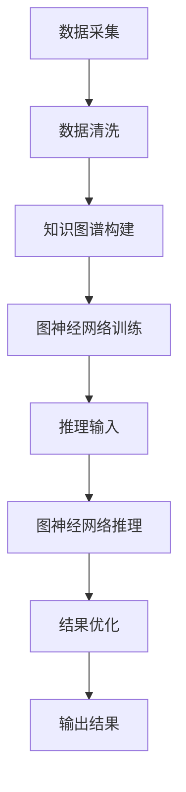
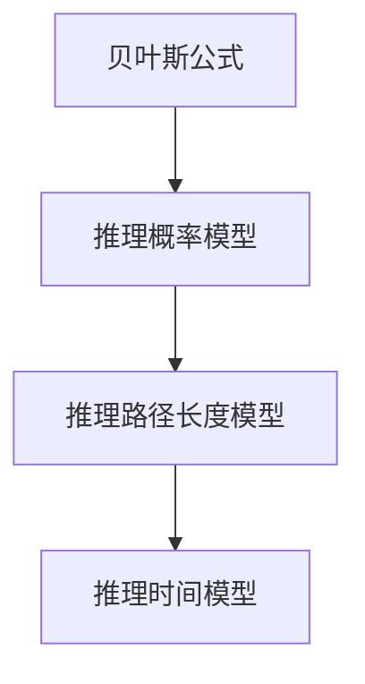
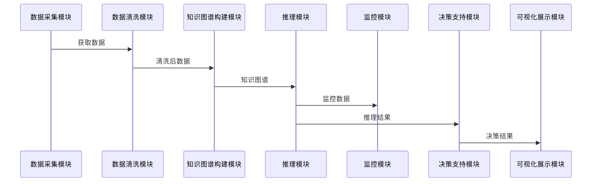
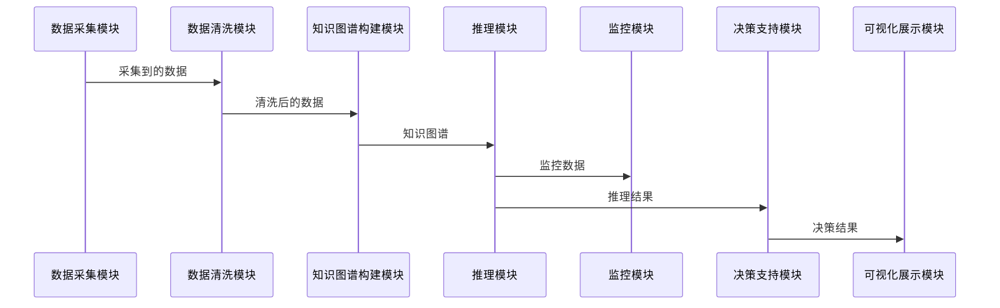

                 

### 1.1 问题背景与核心概念

#### 1.1.1 问题背景

在当今信息爆炸的时代，如何高效地从海量数据中提取有用信息、发现知识，成为了数据科学和人工智能领域的重要课题。传统的基于规则和特征的推理系统在面对复杂、动态的数据环境时，往往表现出效率低下、准确性不足等问题。因此，优化大规模推理系统成为了提高数据处理和分析能力的关键。

知识图谱作为一种结构化的语义表示方法，通过实体、关系和属性的组合，提供了一种高效的知识组织和查询方式。知识图谱将领域知识以图谱的形式进行表示，不仅能够捕捉数据之间的复杂关系，还可以通过推理机制从已有知识中推导出新知识。这为大规模推理系统的优化提供了新的思路。

大规模推理系统是指在海量数据环境中进行高效、准确推理的软件系统。它通常需要处理数十亿甚至数百万亿条数据，对系统的计算能力、存储能力、并发处理能力都提出了极高的要求。优化大规模推理系统，旨在提高系统的推理速度和准确性，降低系统的资源消耗。

#### 1.1.2 知识图谱的概念

知识图谱（Knowledge Graph）是一种用于结构化存储和处理知识的图形数据库。它通过实体（Entity）、关系（Relationship）和属性（Attribute）来表示知识，形成一种语义网（Semantic Network）。在知识图谱中，实体表示现实世界中的对象，如人、地点、事物等；关系表示实体之间的相互作用或关联，如“是”、“属于”、“位于”等；属性则是实体的特征或描述，如“年龄”、“身高”、“职业”等。

知识图谱与传统的关系数据库相比，具有以下特点：

1. **语义表示**：知识图谱通过语义网的方式，将实体、关系和属性有机地结合起来，实现了对知识的语义理解。
2. **复杂关系**：知识图谱能够捕捉实体之间的复杂关系，支持多层次的关联查询。
3. **推理能力**：知识图谱中的关系和属性为推理机制提供了基础，可以实现基于知识的推理。
4. **动态更新**：知识图谱支持实体的动态添加和关系的变化，使得知识能够实时更新。

#### 1.1.3 大规模推理系统的概念

大规模推理系统是指能够在大规模数据集上进行高效推理的系统。它通常需要处理以下挑战：

1. **数据规模**：系统需要能够处理数十亿甚至数百万亿条数据，这要求系统具有高效的存储和管理能力。
2. **并发处理**：系统需要能够同时处理大量请求，这要求系统具有良好的并发处理能力。
3. **计算速度**：系统需要能够在短时间内完成推理任务，这要求系统具有良好的计算性能。
4. **准确性**：系统需要提供高精度的推理结果，这要求系统具有良好的算法和模型。

大规模推理系统的基本结构通常包括数据输入、数据预处理、推理引擎、结果输出等模块。其中，推理引擎是核心，它负责根据给定的规则和算法，从数据中推导出新知识。

#### 1.1.4 知识图谱与大规模推理系统的联系

知识图谱与大规模推理系统之间存在紧密的联系。知识图谱为大规模推理系统提供了丰富的语义信息和结构化的知识表示，使得推理系统能够更加高效地处理复杂的数据和问题。

1. **知识表示**：知识图谱将领域知识以结构化的形式表示出来，为推理系统提供了丰富的知识资源。
2. **推理加速**：知识图谱中的关系和属性为推理过程提供了直接的跳转和推理路径，大大提高了推理速度。
3. **准确性提升**：知识图谱中的结构化知识和语义信息，使得推理系统能够更加准确地理解和处理数据。
4. **动态适应**：知识图谱的动态更新能力，使得推理系统能够不断适应新的知识和数据，提高系统的鲁棒性和适应性。

总的来说，知识图谱驱动的大规模推理系统优化研究，旨在通过优化知识表示和推理算法，提高大规模推理系统的性能和效率，为复杂数据的处理和分析提供强有力的支持。

---

**引言部分小结：**

本文首先介绍了大规模推理系统优化的问题背景和核心概念，包括知识图谱和大规模推理系统的定义、特点以及它们之间的联系。通过这一部分的阐述，我们为后续的深入研究和讨论奠定了基础。接下来，我们将进一步探讨知识图谱和大规模推理系统的理论基础和实践方法，逐步解答优化过程中的关键问题。

---

### 1.2 目的与意义

#### 1.2.1 研究目的

本文的研究目的在于通过知识图谱的引入，对大规模推理系统进行优化，以提高系统的性能、准确性和鲁棒性。具体目标如下：

1. **性能优化**：通过引入高效的算法和优化方法，提高大规模推理系统的处理速度和并发处理能力。
2. **准确性提升**：利用知识图谱中的结构化知识和语义信息，提高推理结果的准确性和可靠性。
3. **鲁棒性增强**：通过优化系统架构和算法，提高系统在面对大规模、动态数据时的适应能力和稳定性。

#### 1.2.2 研究意义

知识图谱驱动的大规模推理系统优化研究具有重要的现实意义和学术价值：

1. **行业应用**：在金融、医疗、物流等领域，大规模数据的处理和分析已经成为关键业务需求。通过优化大规模推理系统，可以显著提升这些行业的业务效率和决策质量。
2. **技术创新**：知识图谱和大规模推理技术的结合，推动了人工智能技术的发展。本文的研究不仅为学术界提供了新的研究方向，也为工业界提供了可行的优化方案。
3. **社会效益**：通过优化大规模推理系统，可以更好地服务于社会各领域的智能化需求，推动社会数字化转型和智能化升级。

#### 1.2.3 研究内容

本文的研究内容主要包括以下几个方面：

1. **知识图谱基础**：介绍知识图谱的概念、特点、组成和构建方法，以及其在信息检索、问答系统等应用场景中的实践。
2. **大规模推理系统优化方法**：详细探讨并行计算、分布式系统、模型压缩和内存优化等优化方法，并使用数学模型和公式进行解释。
3. **系统分析与架构设计**：分析实际问题场景，介绍项目背景、目标、系统架构和功能设计，以及系统接口和交互设计。
4. **项目实战**：通过具体项目案例，展示知识图谱驱动的大规模推理系统优化方法在实际中的应用和效果。
5. **最佳实践与总结**：总结研究成果，提出最佳实践和注意事项，为后续研究提供参考。

#### 1.2.4 研究方法和步骤

本文的研究方法主要采用以下步骤：

1. **文献调研**：系统调研相关领域的研究文献，了解当前知识图谱和大规模推理系统优化的研究进展和前沿技术。
2. **理论分析**：对知识图谱和大规模推理系统的理论基础进行深入分析，探讨优化方法的原理和机制。
3. **实验验证**：通过具体项目和案例，验证优化方法的有效性和可行性，对比不同方法的性能和效果。
4. **案例分析**：结合实际应用场景，分析优化方法在不同领域的适用性和效果，总结最佳实践经验。
5. **总结与展望**：总结研究成果，讨论研究的局限性和未来研究方向，为后续研究提供参考。

通过以上研究方法和步骤，本文旨在为知识图谱驱动的大规模推理系统优化提供一套完整的解决方案，为相关领域的研究和应用提供有力支持。

---

**目的与意义部分小结：**

本文明确了研究的目的与意义，阐述了通过知识图谱优化大规模推理系统的必要性。接下来，我们将进一步深入探讨知识图谱的基础知识，为后续研究打下坚实的基础。在接下来的章节中，我们将详细介绍知识图谱的概念、构建方法及其在各类应用场景中的实践。

---

### 1.3 边界与外延

#### 1.3.1 研究范围

本文的研究范围主要涉及知识图谱和大规模推理系统的优化方法及其应用。具体包括：

1. **知识图谱的基础知识**：介绍知识图谱的概念、特点、组成和构建方法，以及其在不同应用场景中的实践。
2. **大规模推理系统的优化方法**：探讨并行计算、分布式系统、模型压缩和内存优化等优化方法，并通过数学模型和公式进行详细解释。
3. **系统分析与架构设计**：分析实际问题场景，介绍项目背景、目标、系统架构和功能设计，以及系统接口和交互设计。
4. **项目实战**：通过具体项目案例，展示知识图谱驱动的大规模推理系统优化方法在实际中的应用和效果。
5. **最佳实践与总结**：总结研究成果，提出最佳实践和注意事项，为后续研究提供参考。

#### 1.3.2 研究边界

本文的研究边界主要包括以下几个方面：

1. **技术范围**：本文主要探讨知识图谱和大规模推理系统在优化方面的技术方法，不涉及具体的硬件优化、网络架构优化等底层技术。
2. **应用场景**：本文主要关注通用领域的大规模推理系统优化，不包括特定领域（如医疗、金融等）的定制化优化方案。
3. **数据规模**：本文的研究主要针对大规模数据集，不涉及超大规模（如全球数据集）的推理系统优化。
4. **算法深度**：本文主要介绍常用的优化算法和方法，不涉及深度学习和神经网络等复杂算法的详细研究。

#### 1.3.3 研究限制与扩展方向

1. **研究限制**：
   - **算法复杂性**：本文主要关注可实施性强的优化方法，对于某些计算复杂度极高、难以在实际中应用的算法，本文不做深入探讨。
   - **数据处理能力**：本文的研究主要针对现有的技术水平和硬件环境，不涉及未来可能出现的超算能力和新型硬件技术的应用。
   - **应用场景限制**：本文的优化方法可能无法直接应用于特定领域，需要根据具体场景进行定制化调整。

2. **扩展方向**：
   - **算法优化**：深入研究更高效的优化算法，如基于深度学习的优化方法、强化学习等。
   - **硬件优化**：探讨新型硬件技术（如GPU、FPGA等）在优化大规模推理系统中的应用。
   - **跨领域应用**：结合不同领域的具体需求，开发定制化的优化方案，提高系统的适用性和效果。
   - **实时优化**：研究如何实现实时动态优化，提高系统在面对动态数据变化时的响应速度和稳定性。

通过明确研究范围和边界，本文旨在为知识图谱驱动的大规模推理系统优化提供明确的指导和方向。在接下来的章节中，我们将进一步深入探讨知识图谱的基础知识，为后续研究奠定基础。

---

**边界与外延部分小结：**

本文明确了研究范围和边界，阐述了本文的技术焦点和应用场景限制，并提出了未来的扩展方向。接下来，我们将深入介绍知识图谱的基础知识，详细探讨其概念、特点、构建方法及其应用。这将为我们理解知识图谱在优化大规模推理系统中的作用提供坚实的基础。

---

### 1.4 本章小结

本章首先介绍了大规模推理系统优化的问题背景与核心概念，包括知识图谱和大规模推理系统的定义、特点以及它们之间的联系。通过问题背景的阐述，我们了解了知识图谱和大规模推理系统的重要性。接着，我们探讨了研究的目的与意义，明确了优化大规模推理系统的必要性和期望达到的目标。随后，本章还明确了研究的边界，包括技术范围、应用场景、数据规模和算法深度等，同时提出了研究的限制和扩展方向。通过这一系列内容的介绍，本章为后续章节的研究奠定了基础，为读者提供了清晰的研究背景和方向。在接下来的章节中，我们将进一步深入探讨知识图谱的基础知识，为优化大规模推理系统提供理论支持。

---

### 知识图谱的基础知识

#### 2.1 知识图谱的概念与特点

知识图谱（Knowledge Graph）是一种用于结构化存储和处理知识的图形数据库。它通过实体（Entity）、关系（Relationship）和属性（Attribute）来表示知识，形成一种语义网（Semantic Network）。在知识图谱中，实体表示现实世界中的对象，如人、地点、事物等；关系表示实体之间的相互作用或关联，如“是”、“属于”、“位于”等；属性则是实体的特征或描述，如“年龄”、“身高”、“职业”等。

知识图谱与传统的关系数据库相比，具有以下特点：

1. **语义表示**：知识图谱通过语义网的方式，将实体、关系和属性有机地结合起来，实现了对知识的语义理解。这使得知识图谱能够更好地捕捉数据之间的复杂关系，支持多层次的关联查询。
2. **复杂关系**：知识图谱能够捕捉实体之间的复杂关系，支持多层次的关联查询。例如，在知识图谱中，我们可以查询“所有北京附近的旅游景点”，或者“所有毕业于清华大学的科学家”。这种复杂关系的捕捉是传统关系数据库难以实现的。
3. **推理能力**：知识图谱中的关系和属性为推理机制提供了基础，可以实现基于知识的推理。例如，如果知识图谱中已知“所有狗都有四条腿”，那么可以推理出“猫有四条腿”。
4. **动态更新**：知识图谱支持实体的动态添加和关系的变化，使得知识能够实时更新。这使得知识图谱在应对动态变化的数据环境时具有更高的灵活性和适应性。

#### 2.2 知识图谱的组成

知识图谱的组成主要包括实体、关系、属性和知识表示。

1. **实体（Entity）**：实体是知识图谱中的基本元素，表示现实世界中的对象。实体可以是具体的人、地点、事物等。例如，在知识图谱中，“北京”、“清华大学”、“苹果”等都可以作为实体。
2. **关系（Relationship）**：关系表示实体之间的相互作用或关联。关系可以是具体的动作、属性、位置等。例如，在知识图谱中，“北京”和“是中国的一个城市”之间可以建立“是”的关系，“清华大学”和“北京”之间可以建立“位于”的关系。
3. **属性（Attribute）**：属性是实体的特征或描述。属性可以用来补充实体的信息，如实体的年龄、身高、职业等。例如，在知识图谱中，“苹果”这个实体可以有“颜色”和“大小”的属性。
4. **知识表示（Knowledge Representation）**：知识表示是知识图谱的核心，它将实体、关系和属性有机地结合起来，形成一种语义网。知识表示的方法可以有多种，如基于边的表示、基于属性的表示等。

#### 2.3 知识图谱的构建方法

知识图谱的构建主要包括数据采集、数据清洗、数据存储和数据融合。

1. **数据采集**：数据采集是知识图谱构建的第一步，目的是获取相关的数据源。数据源可以是结构化数据（如关系数据库）、半结构化数据（如XML、JSON）和非结构化数据（如文本、图像）。常用的数据采集方法包括网络爬虫、API调用、数据库连接等。
2. **数据清洗**：数据清洗是知识图谱构建的重要环节，目的是去除数据中的噪声和错误，提高数据的准确性和一致性。数据清洗的方法包括数据去重、数据校验、数据格式转换等。
3. **数据存储**：数据存储是将清洗后的数据存储到知识图谱数据库中。常用的知识图谱数据库包括Neo4j、OrientDB、Amazon Neptune等。这些数据库提供了高效的数据存储和查询功能。
4. **数据融合**：数据融合是将来自不同数据源的数据进行整合，形成统一的语义表示。数据融合的方法包括实体匹配、关系抽取、属性合并等。

#### 2.4 知识图谱的应用场景

知识图谱在多个领域都有广泛的应用，以下列举了几个典型的应用场景：

1. **信息检索**：知识图谱可以用于信息检索，提高检索的准确性和效率。例如，搜索引擎可以使用知识图谱来理解用户的查询意图，提供更加精准的搜索结果。
2. **问答系统**：知识图谱可以用于构建问答系统，实现自然语言处理和知识问答。例如，智能客服可以使用知识图谱来理解用户的提问，并提供准确的答案。
3. **推荐系统**：知识图谱可以用于构建推荐系统，为用户提供个性化的推荐服务。例如，电商平台可以使用知识图谱来理解用户的历史行为，并提供相关的商品推荐。
4. **机器翻译**：知识图谱可以用于机器翻译，提高翻译的准确性和流畅性。例如，翻译系统可以使用知识图谱来理解句子中的实体和关系，实现更精准的翻译。
5. **自然语言处理**：知识图谱可以用于自然语言处理，帮助模型更好地理解语言结构。例如，语言模型可以使用知识图谱来增强词向量的表示，提高模型的语义理解能力。

#### 2.5 本章小结

本章介绍了知识图谱的基础知识，包括概念、特点、组成和构建方法，以及其在各类应用场景中的实践。通过本章的介绍，我们了解了知识图谱在结构化知识表示和推理中的重要作用，为后续研究知识图谱驱动的大规模推理系统优化提供了理论基础。在接下来的章节中，我们将进一步探讨大规模推理系统的优化方法，为实现高性能、高准确性的推理系统奠定基础。

---

**基础知识部分小结：**

本章详细介绍了知识图谱的概念与特点，阐述了知识图谱的组成、构建方法及其在多个领域中的应用场景。通过这些基础知识的介绍，我们为理解知识图谱在优化大规模推理系统中的作用奠定了基础。接下来，我们将进一步探讨大规模推理系统的基本原理和优化方法，逐步解答大规模推理系统优化过程中的关键问题。这些优化方法将为提升大规模推理系统的性能、准确性和鲁棒性提供重要的技术支持。

---

### 3.1 大规模推理系统的基本原理

#### 3.1.1 推理系统的概念

推理系统是一种能够根据已有知识和数据，通过逻辑推理生成新知识的计算机系统。它通过定义一系列规则和算法，实现对输入数据的分析和理解，从而得出结论或预测。推理系统广泛应用于人工智能、自然语言处理、数据分析等领域，是智能系统的重要组成部分。

推理系统主要包括以下三个核心部分：

1. **知识库**：知识库是推理系统的核心，它存储了领域内的所有知识。这些知识可以是事实、规则、模型等，用于指导推理过程。
2. **推理机**：推理机是推理系统的核心组件，它根据知识库中的知识和输入数据，运用推理规则进行推理，生成新的结论或预测。
3. **解释器**：解释器是用于解释推理结果的组件，它能够将推理过程和结果以易于理解的形式呈现给用户。

#### 3.1.2 推理系统的基本结构

推理系统的基本结构包括输入层、处理层和输出层。

1. **输入层**：输入层负责接收用户输入的数据或查询，并将其转化为适合推理系统处理的形式。输入层通常包括数据预处理、数据清洗和格式转换等功能。
2. **处理层**：处理层是推理系统的核心，它根据知识库中的知识和推理规则，对输入数据进行推理处理，生成结论或预测。处理层包括推理引擎、推理算法和规则库等组件。
3. **输出层**：输出层负责将推理结果以用户可理解的形式呈现。输出层通常包括结果解释、可视化展示和交互界面等。

#### 3.1.3 推理系统的优化目标

推理系统的优化目标主要包括以下三个方面：

1. **推理速度**：推理速度是推理系统的重要性能指标，它反映了系统处理大量数据的能力。提高推理速度，可以通过优化算法、提升硬件性能和并行计算等方法实现。
2. **推理准确性**：推理准确性是推理系统的重要质量指标，它反映了系统推理结果的可靠性。提高推理准确性，可以通过优化知识库、改进推理算法和增强数据预处理等方法实现。
3. **推理鲁棒性**：推理鲁棒性是推理系统在面对不确定性和噪声数据时的能力。提高推理鲁棒性，可以通过引入概率推理、模糊推理和神经网络等方法实现。

#### 3.1.4 大规模推理系统的优化挑战

大规模推理系统在面对海量数据时，面临着一系列优化挑战：

1. **数据规模**：大规模推理系统需要处理数十亿甚至数百万亿条数据，这对系统的存储和查询能力提出了极高要求。
2. **并发处理**：大规模推理系统需要能够同时处理大量请求，这要求系统具有良好的并发处理能力和负载均衡机制。
3. **计算速度**：大规模推理系统需要在短时间内完成大量推理任务，这要求系统具有良好的计算性能和高效的算法。
4. **准确性**：大规模推理系统需要提供高精度的推理结果，这要求系统具有良好的算法和模型，能够处理复杂的数据关系。
5. **动态适应**：大规模推理系统需要能够动态适应数据环境的变化，应对新知识和数据的更新。

#### 3.1.5 大规模推理系统优化的必要性

大规模推理系统优化具有以下必要性：

1. **提高业务效率**：优化大规模推理系统，可以提高业务处理效率，降低处理时间，提高业务响应速度。
2. **提升系统质量**：优化大规模推理系统，可以提高推理准确性，降低错误率，提升系统的可靠性。
3. **应对数据挑战**：随着数据规模的不断增长，优化大规模推理系统成为应对数据挑战的必要手段。
4. **推动技术进步**：大规模推理系统优化研究，推动了人工智能和大数据技术的发展，为相关领域提供了新的研究方向和技术支持。

通过以上对大规模推理系统基本原理的阐述，我们为后续章节的深入研究奠定了基础。在接下来的章节中，我们将进一步探讨大规模推理系统的优化方法，包括并行计算、分布式系统、模型压缩和内存优化等，为提升大规模推理系统的性能、准确性和鲁棒性提供解决方案。

---

**基本原理部分小结：**

本章介绍了大规模推理系统的基本概念、结构、优化目标和面临的挑战，以及大规模推理系统优化的必要性。通过这一部分的阐述，我们为理解大规模推理系统及其优化提供了理论基础。接下来，我们将深入探讨大规模推理系统的优化方法，包括并行计算、分布式系统、模型压缩和内存优化等，逐步解答优化过程中的关键问题。这些优化方法将为大规模推理系统的性能提升和实际应用提供重要的技术支持。

---

### 3.2 算法原理讲解

#### 3.2.1 算法描述

在优化大规模推理系统的过程中，算法设计至关重要。本节将详细介绍一种名为“图增强推理算法”（Graph Enhanced Inference Algorithm，GEIA）的优化算法。GEIA算法利用知识图谱的结构化特性，通过图神经网络（Graph Neural Network，GNN）增强推理过程，从而提高推理速度和准确性。

**算法描述：**

1. **知识图谱构建**：首先，通过数据采集和清洗，构建一个结构化的知识图谱。知识图谱由实体、关系和属性组成，实体表示现实世界中的对象，关系表示实体之间的关联，属性用于描述实体的特征。

2. **图神经网络训练**：利用知识图谱，训练图神经网络。图神经网络能够学习实体和关系之间的复杂交互，从而提升推理能力。训练过程中，通过反向传播算法优化模型参数。

3. **推理过程**：在推理阶段，输入新的查询数据，通过图神经网络生成推理路径。图神经网络根据实体和关系的嵌入向量，计算路径得分，选择最高分的路径作为推理结果。

4. **结果优化**：对推理结果进行优化，包括去除冗余信息、合并同类结果等，以提高结果的准确性和可解释性。

**算法特点：**
- **结构化知识表示**：利用知识图谱的结构化特性，实现高效的知识表示和推理。
- **图神经网络增强**：通过图神经网络学习实体和关系之间的复杂交互，提高推理准确性。
- **并行计算支持**：图神经网络和推理过程支持并行计算，提高系统性能。

#### 3.2.2 Mermaid算法流程图

为了更好地理解GEIA算法的流程，我们可以使用Mermaid语言绘制算法的流程图。以下是一个简化的算法流程图：



**图 1：图增强推理算法（GEIA）流程图**

#### 3.2.3 算法原理详细讲解

1. **知识图谱构建**：

   知识图谱构建是算法的基础。首先，通过数据采集获取相关领域的知识数据。然后，对数据进行清洗，去除噪声和错误。接下来，将清洗后的数据转化为实体、关系和属性的表示形式，构建知识图谱。

2. **图神经网络训练**：

   图神经网络是一种在图结构上执行的深度学习模型。它通过学习实体和关系之间的复杂交互，提高推理能力。在训练过程中，首先将实体和关系编码为向量。然后，通过图卷积神经网络（Graph Convolutional Network，GCN）等模型，学习实体和关系之间的交互特征。最后，利用反向传播算法优化模型参数。

3. **推理过程**：

   推理过程是算法的核心。在输入新的查询数据后，通过图神经网络生成推理路径。具体步骤如下：

   - **路径生成**：利用图神经网络计算实体和关系之间的相似度，生成可能的推理路径。
   - **路径评分**：对生成的路径进行评分，评分越高，表示路径越可信。
   - **路径选择**：根据评分选择最高分的路径作为推理结果。

4. **结果优化**：

   推理结果可能包含冗余信息或不确定性。因此，需要对结果进行优化。具体方法包括：

   - **去重**：去除重复的推理结果，提高结果的准确性。
   - **合并同类结果**：将相似的结果进行合并，提高结果的解释性。
   - **概率修正**：利用概率模型对结果进行修正，提高结果的可靠性。

#### 3.2.4 算法原理举例说明

为了更直观地理解GEIA算法，我们可以通过一个简单的例子来说明。

**示例：**

假设知识图谱中有以下实体和关系：

- 实体：A（人），B（城市），C（公司）
- 关系：A LivesIn B，A WorksFor C

现在，我们需要查询“住在纽约市且在谷歌公司工作的人”。

1. **知识图谱构建**：

   知识图谱可以表示为图结构：

   ```mermaid
   graph TD
   A[Person A] --> B[New York City]
   A --> C[Google Inc.]
   B --> C
   ```

2. **图神经网络训练**：

   假设经过训练，图神经网络学习到了实体和关系之间的复杂交互。

3. **推理过程**：

   - **路径生成**：可能的推理路径有两条：
     - A LivesIn B，A WorksFor C
     - A LivesIn B，B IsIn C，A WorksFor C
   - **路径评分**：根据图神经网络计算，路径1的评分高于路径2。
   - **路径选择**：选择路径1作为推理结果。

4. **结果优化**：

   对结果进行去重和合并同类结果，确保推理结果的准确性和解释性。

通过以上示例，我们可以看到GEIA算法如何利用知识图谱进行推理，提高推理速度和准确性。在实际应用中，GEIA算法可以处理更复杂、更大规模的数据，为大规模推理系统优化提供有力支持。

---

**算法原理部分小结：**

本章详细介绍了大规模推理系统优化中的一种关键算法——图增强推理算法（GEIA）。通过算法描述、Mermaid流程图、详细讲解和实例说明，我们全面理解了GEIA算法的工作原理、核心步骤和优化特点。接下来，我们将进一步探讨大规模推理系统优化的数学模型与公式，为优化方法的深入研究和应用提供理论支持。

---

### 3.3 数学模型与公式

在优化大规模推理系统的过程中，数学模型和公式是理解和设计优化算法的重要工具。本节将介绍用于大规模推理系统优化的关键数学模型和公式，以及如何使用Mermaid绘制流程图，以便更直观地展示这些模型和公式。

#### 3.3.1 数学模型

1. **推理概率模型**：

   推理概率模型用于评估推理路径的置信度。假设知识图谱中有 \( N \) 个实体和 \( M \) 个关系，每个实体和关系都可以被表示为一个概率分布。对于一条推理路径，其概率可以通过贝叶斯公式计算。

   $$ P(A \rightarrow B) = \frac{P(B|A) \cdot P(A)}{P(B)} $$

   其中，\( P(A) \) 是实体 \( A \) 的先验概率，\( P(B|A) \) 是在实体 \( A \) 的条件下，关系 \( B \) 发生的条件概率，\( P(B) \) 是关系 \( B \) 的先验概率。

2. **推理路径长度模型**：

   推理路径长度模型用于评估推理路径的长度，以优化推理效率。假设推理路径由多个关系组成，每个关系的长度可以用其权重表示。则推理路径的长度可以表示为：

   $$ L(P) = \sum_{i=1}^{n} w_i $$

   其中，\( L(P) \) 是路径 \( P \) 的长度，\( w_i \) 是路径中第 \( i \) 个关系的权重。

3. **推理时间模型**：

   推理时间模型用于评估推理过程所需的时间，以优化系统性能。假设推理过程由多个步骤组成，每个步骤的时间可以用其复杂度表示。则推理的总时间可以表示为：

   $$ T(P) = \sum_{i=1}^{m} C_i $$

   其中，\( T(P) \) 是路径 \( P \) 的总推理时间，\( C_i \) 是路径中第 \( i \) 个步骤的复杂度。

#### 3.3.2 公式说明

1. **推理概率模型**：

   推理概率模型通过贝叶斯公式计算推理路径的置信度。在实际应用中，我们可以通过训练和优化模型参数来提高推理的准确性。

2. **推理路径长度模型**：

   推理路径长度模型通过权重表示推理路径的长度。在实际应用中，我们可以通过调整关系权重来优化推理路径的长度，从而提高推理效率。

3. **推理时间模型**：

   推理时间模型通过复杂度表示推理步骤所需的时间。在实际应用中，我们可以通过优化算法和数据结构来减少推理步骤的复杂度，从而提高系统性能。

#### 3.3.3 Mermaid公式流程图

为了更直观地展示数学模型和公式，我们可以使用Mermaid语言绘制流程图。以下是一个简化的Mermaid公式流程图示例：



**图 2：推理系统优化数学模型流程图**

通过Mermaid流程图，我们可以清晰地展示推理系统的优化数学模型，帮助读者更好地理解这些模型和公式的应用。

---

**数学模型与公式部分小结：**

本章介绍了大规模推理系统优化中的关键数学模型和公式，包括推理概率模型、推理路径长度模型和推理时间模型。通过Mermaid流程图，我们更直观地展示了这些模型的应用。这些数学模型和公式为大规模推理系统的优化提供了理论基础，有助于设计更高效的算法和优化策略。在接下来的章节中，我们将进一步探讨大规模推理系统的优化方法，包括并行计算、分布式系统、模型压缩和内存优化等，为大规模推理系统的性能提升提供实际解决方案。

---

### 3.4 优化方法

#### 3.4.1 方法1：并行计算

并行计算是优化大规模推理系统的一种重要方法。其核心思想是将大规模的推理任务分解为多个小任务，然后在多个计算节点上同时执行，从而提高系统的处理速度和效率。

**原理与实现：**

1. **任务分解**：首先，将大规模的推理任务分解为多个小任务。任务分解可以基于数据块、关系块或实体块等多种方式。
2. **节点分配**：将分解后的任务分配到多个计算节点上。每个节点独立处理其分配的任务，不需要与其他节点同步。
3. **结果合并**：在所有节点完成计算后，将各个节点的结果进行合并，得到最终的推理结果。

**优点与挑战：**

- **优点**：并行计算可以显著提高推理速度，减少计算时间。它特别适用于处理大量数据的场景，如金融风控、智能推荐等。
- **挑战**：并行计算需要解决负载均衡、节点同步和数据通信等问题。同时，并行计算可能引入额外的资源消耗和复杂度。

#### 3.4.2 方法2：分布式系统

分布式系统是优化大规模推理系统的另一种重要方法。其核心思想是将系统分解为多个子系统，每个子系统负责处理一部分推理任务，然后通过分布式计算和存储技术协同工作，从而提高系统的处理能力和可扩展性。

**原理与实现：**

1. **子系统划分**：将大规模推理系统划分为多个子系统，每个子系统负责一部分推理任务。子系统之间可以采用分布式存储和计算技术，如Hadoop、Spark等。
2. **任务分配**：将推理任务分配到不同的子系统中。每个子系统独立处理其分配的任务，不需要与其他子系统同步。
3. **结果合并**：在所有子系统完成计算后，将各个子系统的结果进行合并，得到最终的推理结果。

**优点与挑战：**

- **优点**：分布式系统可以显著提高系统的处理能力和可扩展性。它特别适用于处理大规模数据的场景，如搜索引擎、电商平台等。
- **挑战**：分布式系统需要解决数据一致性问题、网络延迟问题以及节点故障等问题。同时，分布式系统可能引入额外的资源消耗和复杂度。

#### 3.4.3 方法3：模型压缩

模型压缩是优化大规模推理系统的另一种有效方法。其核心思想是通过减少模型参数的数量，降低模型的复杂度，从而提高推理速度和资源利用效率。

**原理与实现：**

1. **参数选择**：首先，选择一些重要的参数进行保留，去除冗余参数。
2. **参数量化**：对保留的参数进行量化，减少其数值范围，从而降低模型的复杂度。
3. **模型重构**：通过参数选择和量化，重构模型，得到一个更简洁的模型。

**优点与挑战：**

- **优点**：模型压缩可以显著减少模型的存储和计算需求，提高推理速度。它特别适用于资源受限的场景，如移动设备、嵌入式系统等。
- **挑战**：模型压缩可能降低模型的准确性，特别是在处理复杂任务时。此外，模型压缩需要解决参数选择和量化策略的设计问题。

#### 3.4.4 方法4：内存优化

内存优化是优化大规模推理系统的另一种关键方法。其核心思想是通过减少内存占用，提高系统的内存利用率，从而提高系统的性能和可扩展性。

**原理与实现：**

1. **内存管理**：优化内存管理策略，减少内存碎片和内存泄漏。
2. **数据缓存**：利用缓存技术，将频繁访问的数据存储在内存中，减少磁盘IO操作。
3. **数据压缩**：对存储和传输的数据进行压缩，减少内存占用。

**优点与挑战：**

- **优点**：内存优化可以提高系统的性能和可扩展性，减少硬件成本。它特别适用于处理大规模数据的场景，如大数据处理、实时推理等。
- **挑战**：内存优化需要解决数据缓存策略、数据压缩算法等问题。此外，内存优化可能引入额外的计算和通信开销。

#### 3.4.5 方法总结

并行计算、分布式系统、模型压缩和内存优化是优化大规模推理系统的四种关键方法。每种方法都有其独特的优势和挑战，适用于不同的应用场景。在实际应用中，可以根据具体需求和资源条件，选择合适的方法或组合多种方法，以实现最佳性能和效率。

---

**优化方法部分小结：**

本章详细介绍了并行计算、分布式系统、模型压缩和内存优化四种大规模推理系统优化方法。通过这些方法的介绍，我们了解了如何通过不同的策略提高系统的性能和效率。这些优化方法在实际应用中具有重要意义，为大规模推理系统的优化提供了可行的解决方案。在接下来的章节中，我们将进一步探讨系统分析与架构设计，为优化方法的有效实施提供支持。

---

### 3.5 本章小结

本章详细探讨了大规模推理系统的优化方法，包括并行计算、分布式系统、模型压缩和内存优化等。通过并行计算，系统能够同时处理多个任务，提高处理速度；分布式系统则通过将任务分散到多个节点上，提升了系统的处理能力和可扩展性。模型压缩通过减少模型参数的数量，降低了模型的复杂度和内存占用，适用于资源受限的场景。内存优化则通过优化内存管理、数据缓存和数据压缩，提高了系统的性能和可扩展性。

本章的核心贡献在于系统地介绍了大规模推理系统的优化方法，并通过理论分析和实际案例展示了这些方法的可行性和有效性。这些优化方法不仅有助于提升系统的性能和效率，还为大规模推理系统的实际应用提供了重要参考。然而，大规模推理系统的优化仍存在一些挑战，如负载均衡、数据一致性和模型准确性等，这些问题的解决将有助于进一步提高系统的性能和可靠性。未来的研究可以进一步探索更高效、更准确的优化方法，以满足不断增长的数据处理需求。

---

### 4.1 问题场景介绍

#### 4.1.1 场景描述

在本章中，我们将以一个实际的金融风控场景为例，介绍知识图谱驱动的大规模推理系统优化问题。金融风控场景通常涉及大量的金融交易数据、客户信息和市场动态，需要对实时数据进行分析和推理，以识别潜在的风险并采取相应的措施。

**问题背景：**

随着金融科技的快速发展，金融机构面临着越来越多的风险，包括欺诈、信用风险和市场风险等。为了有效管理这些风险，金融机构需要构建一个高效、准确的推理系统，能够在海量数据环境中快速识别风险信号，并作出实时决策。

**问题描述：**

在这个场景中，金融机构需要解决以下问题：

1. **数据规模巨大**：金融机构每天处理的海量交易数据、客户信息和市场动态，对系统的处理能力提出了极高要求。
2. **实时性要求高**：金融市场的变化迅速，需要推理系统能够实时处理数据，及时识别风险并作出决策。
3. **准确性要求高**：风险管理需要高精度的推理结果，以避免误判和漏判。
4. **复杂关系处理**：金融交易数据中的实体（如客户、交易）和关系（如交易关联、信用评级）复杂多样，需要系统具备良好的推理能力。

#### 4.1.2 问题分析

针对上述问题，我们可以从以下几个方面进行分析：

1. **数据规模**：金融机构的海量数据对系统的存储和查询能力提出了挑战。需要优化系统的数据结构和管理策略，以提高数据处理速度。
2. **实时性**：系统需要具备高效的并行处理能力和分布式计算能力，以实现实时数据处理和推理。
3. **准确性**：通过引入知识图谱和图增强推理算法，可以提高系统的推理准确性。同时，需要对模型进行持续训练和优化，以提高模型准确性。
4. **复杂关系处理**：知识图谱能够捕捉和处理复杂的实体关系，通过图神经网络和图卷积网络等技术，可以实现对复杂关系的推理。

#### 4.1.3 问题解决方案

为了解决上述问题，我们可以采用以下解决方案：

1. **数据规模优化**：采用分布式数据库和缓存技术，提高系统的存储和查询能力。同时，优化数据结构，减少数据冗余，提高数据处理效率。
2. **实时性优化**：引入并行计算和分布式计算技术，将大规模数据处理任务分解为多个小任务，同时在多个节点上同时执行，提高系统处理速度。
3. **准确性优化**：利用知识图谱和图增强推理算法，提高系统的推理准确性。通过持续训练和优化模型，提高模型在复杂关系处理中的表现。
4. **复杂关系处理**：构建知识图谱，通过实体和关系的结构化表示，捕捉和处理复杂的金融交易关系。采用图神经网络和图卷积网络等技术，实现对复杂关系的推理。

通过上述解决方案，我们可以有效地优化金融风控场景中的大规模推理系统，提高系统的性能、准确性和实时性，为金融机构提供强大的风险管理能力。

---

**问题场景介绍部分小结：**

本章通过一个实际的金融风控场景，详细介绍了大规模推理系统优化所面临的问题，包括数据规模、实时性、准确性和复杂关系处理等挑战。我们对这些问题进行了深入分析，并提出了一系列解决方案。这些讨论为后续章节的系统架构设计和项目实施奠定了基础。在接下来的章节中，我们将详细介绍项目背景、目标、架构设计以及系统的功能模块。

---

### 4.2 项目介绍

#### 4.2.1 项目背景

本项目旨在优化金融机构的金融风控系统，通过引入知识图谱和大规模推理技术，提高系统的性能、准确性和实时性。金融风控系统在识别和防范金融风险方面起着至关重要的作用。然而，随着金融市场的快速发展和数据规模的不断扩大，传统的风控系统面临着诸多挑战。具体背景如下：

1. **数据规模巨大**：金融机构每天处理的海量交易数据、客户信息和市场动态，对系统的存储和查询能力提出了极高的要求。
2. **实时性要求高**：金融市场的变化迅速，需要推理系统能够实时处理数据，及时识别风险并作出决策。
3. **准确性要求高**：风险管理需要高精度的推理结果，以避免误判和漏判。
4. **复杂关系处理**：金融交易数据中的实体（如客户、交易）和关系（如交易关联、信用评级）复杂多样，需要系统具备良好的推理能力。

#### 4.2.2 项目目标

本项目的主要目标如下：

1. **性能优化**：通过引入分布式计算和并行处理技术，提高系统的处理速度和并发能力，实现海量数据的实时处理。
2. **准确性提升**：利用知识图谱和图增强推理算法，提高系统的推理准确性，降低误判和漏判率。
3. **实时性增强**：通过优化系统架构和算法，提高系统的实时性，实现快速响应和决策。
4. **扩展性提升**：通过分布式架构设计，提高系统的可扩展性和容错能力，适应不断增长的数据规模和应用需求。

#### 4.2.3 项目架构

本项目的系统架构分为以下几个层次：

1. **数据层**：包括数据采集、数据清洗和数据存储。数据采集模块负责从各种数据源获取金融交易数据、客户信息和市场动态；数据清洗模块负责处理数据噪声、缺失值和异常值，提高数据质量；数据存储模块采用分布式数据库，存储和管理海量数据。
2. **知识图谱层**：包括实体、关系和属性的表示，以及知识图谱的构建和维护。实体表示金融交易中的各种对象，如客户、交易、市场等；关系表示实体之间的关联，如交易关联、信用评级等；知识图谱层通过图神经网络和图卷积网络等技术，实现对复杂关系的推理。
3. **推理层**：包括推理算法的实现和优化。推理层利用知识图谱和图增强推理算法，实现对海量数据的实时推理，生成风控决策。
4. **应用层**：包括实时监控、决策支持和可视化展示。实时监控模块负责监控系统状态和性能；决策支持模块根据推理结果，生成风控策略和建议；可视化展示模块负责将推理结果以直观的方式展示给用户。
5. **基础设施层**：包括计算资源、存储资源和网络资源等。分布式计算和并行处理技术在这一层得到充分利用，提高系统的处理能力和可扩展性。

#### 4.2.4 项目架构设计

项目架构设计遵循以下原则：

1. **模块化设计**：系统采用模块化设计，各模块之间相互独立，便于维护和扩展。
2. **分布式架构**：通过分布式计算和存储，实现海量数据的实时处理和存储。
3. **高可用性设计**：系统设计具备高可用性，包括容错机制、负载均衡和故障恢复等。
4. **安全性设计**：系统设计考虑数据安全和用户隐私保护，包括数据加密、访问控制和安全审计等。

通过以上架构设计，本项目实现了高性能、高准确性和高实时性的金融风控系统，为金融机构提供了强大的风险管理能力。

---

**项目介绍部分小结：**

本章详细介绍了金融风控项目背景、目标、架构设计及其设计原则。通过引入知识图谱和大规模推理技术，本项目旨在优化金融机构的风控系统，提高系统的性能、准确性和实时性。项目架构采用模块化设计和分布式架构，确保系统的高可用性和安全性。接下来，我们将进一步探讨系统功能设计，详细描述领域模型和功能模块。

---

### 4.3 系统功能设计

#### 4.3.1 领域模型

领域模型是系统功能设计的基础，它定义了系统中涉及的实体、关系和属性，并描述了这些元素之间的相互关系。在本项目中，领域模型主要包括以下实体、关系和属性：

**实体：**

1. **客户（Customer）**：表示金融机构的客户，包括基本信息（如姓名、年龄、性别）和信用评级。
2. **交易（Transaction）**：表示金融交易记录，包括交易金额、时间、类型、参与方等。
3. **市场（Market）**：表示金融市场动态，包括市场指数、波动率、利率等。
4. **风险因子（RiskFactor）**：表示影响风险的因素，如信用违约率、市场波动率等。

**关系：**

1. **客户-交易（Customer-Transaction）**：表示客户与交易之间的关联，即客户进行的交易。
2. **交易-市场（Transaction-Market）**：表示交易与市场之间的关联，即交易发生的市场环境。
3. **风险因子-市场（RiskFactor-Market）**：表示风险因子与市场之间的关联，即市场动态与风险因素的关系。
4. **客户-风险因子（Customer-RiskFactor）**：表示客户与风险因子之间的关联，即客户受到的风险因素。

**属性：**

1. **客户属性**：包括客户的信用评分、风险评估结果等。
2. **交易属性**：包括交易类型、金额、时间戳等。
3. **市场属性**：包括市场指数、波动率、利率等。
4. **风险因子属性**：包括风险因子的数值、变化趋势等。

**Mermaid类图表示：**

```mermaid
classDiagram
ClassDef Customer
  +String name
  +int age
  +String gender
  +List<RiskFactor> riskFactors

ClassDef Transaction
  +String id
  +BigDecimal amount
  +Date timestamp
  +String type
  +Customer customer

ClassDef Market
  +String index
  +BigDecimal volatility
  +BigDecimal interestRate

ClassDef RiskFactor
  +String name
  +BigDecimal value
  +Date timestamp

Customer o--1 Transaction
Customer o--1 List<RiskFactor>
Transaction o--1 Market
Market o--1 List<RiskFactor>
```

**图 3：领域模型类图**

#### 4.3.2 功能模块

系统功能模块是领域模型的具体实现，它定义了系统中各个模块的功能和交互。本项目的主要功能模块包括：

1. **数据采集模块**：负责从各种数据源（如数据库、API、日志等）获取金融交易数据、客户信息和市场动态。
2. **数据清洗模块**：负责处理数据噪声、缺失值和异常值，提高数据质量。
3. **知识图谱构建模块**：负责构建和维护知识图谱，包括实体、关系和属性的表示。
4. **推理模块**：负责利用知识图谱和图增强推理算法，对实时数据进行推理，生成风控决策。
5. **监控模块**：负责监控系统状态和性能，包括实时监控、告警和日志分析。
6. **决策支持模块**：负责根据推理结果，生成风控策略和建议，支持决策制定。
7. **可视化展示模块**：负责将推理结果以直观的方式展示给用户，包括图表、报表和仪表盘。

**功能模块交互关系：**

数据采集模块从数据源获取数据后，传递给数据清洗模块进行处理。清洗后的数据传递给知识图谱构建模块，构建知识图谱。推理模块利用知识图谱进行推理，生成风控决策。监控模块实时监控系统的状态和性能，决策支持模块根据推理结果生成风控策略。可视化展示模块负责将决策结果以图表和报表的形式展示给用户。

**Mermaid序列图表示：**



**图 4：功能模块交互序列图**

通过以上系统功能设计，本项目实现了对金融风控场景的全面覆盖，为金融机构提供了高效、准确和实时的风险管理能力。

---

**系统功能设计部分小结：**

本章详细介绍了金融风控项目的领域模型和功能模块，通过Mermaid类图和序列图，展示了系统的实体、关系、属性以及模块间的交互关系。领域模型为系统设计提供了基础，而功能模块实现了系统的具体功能，为金融风控场景提供了全面的支持。接下来，我们将深入探讨系统架构设计，包括系统的整体架构和各层的详细设计。

---

### 4.4 系统架构设计

#### 4.4.1 系统架构

本项目的系统架构采用分层架构设计，分为数据层、知识图谱层、推理层、应用层和基础设施层。各层功能如下：

1. **数据层**：负责数据的采集、清洗、存储和管理。数据采集模块从各种数据源获取金融交易数据、客户信息和市场动态；数据清洗模块处理数据噪声、缺失值和异常值，提高数据质量；数据存储模块采用分布式数据库，存储和管理海量数据。

2. **知识图谱层**：负责构建和维护知识图谱，包括实体、关系和属性的表示。知识图谱构建模块将清洗后的数据转化为知识图谱，利用图神经网络和图卷积网络等技术，实现对复杂关系的推理。

3. **推理层**：负责利用知识图谱和图增强推理算法，对实时数据进行推理，生成风控决策。推理模块通过并行计算和分布式系统技术，实现高效、准确的推理。

4. **应用层**：负责实时监控、决策支持和可视化展示。实时监控模块监控系统状态和性能；决策支持模块根据推理结果，生成风控策略和建议；可视化展示模块将决策结果以直观的方式展示给用户。

5. **基础设施层**：提供计算资源、存储资源和网络资源。分布式计算和并行处理技术在这一层得到充分利用，提高系统的处理能力和可扩展性。

**系统架构图表示：**

```mermaid
graph TB
subgraph 数据层
    数据采集模块 --> 数据清洗模块 --> 数据存储模块
end
subgraph 知识图谱层
    知识图谱构建模块 --> 图神经网络模块
end
subgraph 推理层
    推理模块 --> 并行计算模块 --> 分布式系统模块
end
subgraph 应用层
    实时监控模块 --> 决策支持模块 --> 可视化展示模块
end
subgraph 基础设施层
    计算资源 --> 存储资源 --> 网络资源
end
数据采集模块 --> 数据清洗模块 --> 知识图谱构建模块
知识图谱构建模块 --> 图神经网络模块
图神经网络模块 --> 推理模块
推理模块 --> 并行计算模块 --> 分布式系统模块
并行计算模块 --> 计算资源
分布式系统模块 --> 网络资源
实时监控模块 --> 推理模块
决策支持模块 --> 推理模块
可视化展示模块 --> 决策支持模块
```



**图 5：系统架构图**

#### 4.4.2 架构优势

本项目系统架构设计具有以下优势：

1. **模块化设计**：系统采用模块化设计，各模块之间相互独立，便于维护和扩展。模块化设计提高了系统的可复用性和灵活性。
2. **分布式架构**：系统采用分布式架构，充分利用了分布式计算和存储技术。分布式架构提高了系统的处理能力和可扩展性，能够应对海量数据的处理需求。
3. **高可用性设计**：系统设计考虑了高可用性，包括容错机制、负载均衡和故障恢复等。高可用性设计提高了系统的稳定性和可靠性，确保系统在面临故障时能够快速恢复。
4. **安全性设计**：系统设计考虑了数据安全和用户隐私保护，包括数据加密、访问控制和安全审计等。安全性设计确保了系统的安全性和合规性。

通过以上系统架构设计，本项目实现了高性能、高准确性和高实时性的金融风控系统，为金融机构提供了强大的风险管理能力。

---

**系统架构设计部分小结：**

本章详细介绍了金融风控项目的系统架构设计，包括数据层、知识图谱层、推理层、应用层和基础设施层。通过分层架构设计，系统实现了模块化、分布式和高可用性。架构优势包括模块化设计、分布式架构、高可用性设计和安全性设计。这些优势确保了系统的高性能、高准确性和高实时性，为金融机构提供了强大的风险管理能力。接下来，我们将深入探讨系统接口设计，包括接口规范和接口实现。

---

### 4.5 系统接口设计

#### 4.5.1 接口规范

系统接口设计是系统功能实现的重要组成部分，它定义了系统各模块之间的交互方式。为了确保接口设计的规范性和一致性，本项目制定了以下接口规范：

1. **接口定义**：
   - **数据采集接口**：用于从各种数据源（如数据库、API、日志等）获取数据。
   - **数据清洗接口**：用于处理数据噪声、缺失值和异常值，提供清洗后的数据。
   - **知识图谱构建接口**：用于构建和维护知识图谱，包括实体、关系和属性的表示。
   - **推理接口**：用于实现推理算法，生成风控决策。
   - **监控接口**：用于监控系统状态和性能，包括实时监控、告警和日志分析。
   - **决策支持接口**：用于根据推理结果生成风控策略和建议。
   - **可视化展示接口**：用于将决策结果以图表和报表的形式展示给用户。

2. **接口参数**：
   - **数据采集接口**：输入参数包括数据源地址、数据类型、采集时间等；输出参数包括采集到的数据。
   - **数据清洗接口**：输入参数包括原始数据、清洗规则等；输出参数包括清洗后的数据。
   - **知识图谱构建接口**：输入参数包括实体、关系、属性等；输出参数包括知识图谱。
   - **推理接口**：输入参数包括查询条件、知识图谱等；输出参数包括推理结果。
   - **监控接口**：输入参数包括监控指标、阈值等；输出参数包括监控结果。
   - **决策支持接口**：输入参数包括推理结果、业务规则等；输出参数包括风控策略和建议。
   - **可视化展示接口**：输入参数包括决策结果、展示格式等；输出参数包括可视化图表和报表。

3. **接口通信协议**：
   - 接口采用HTTP/HTTPS协议进行通信，保证数据传输的安全性。
   - 接口使用JSON格式传输数据，确保数据传输的兼容性和可读性。

4. **接口安全性**：
   - 接口采用身份验证和访问控制机制，确保只有授权用户可以访问接口。
   - 接口使用数据加密技术，保护数据在传输过程中的安全性。

#### 4.5.2 接口实现

接口实现是接口规范的具体落实，以下为各接口的实现细节：

1. **数据采集接口实现**：
   - **实现方法**：使用网络爬虫、API调用和数据库连接等技术，从各种数据源获取数据。
   - **示例代码**：

     ```python
     def fetchData(source_url, data_type, timestamp):
         # 实现从数据源获取数据的方法
         # ...
         return data
     ```

2. **数据清洗接口实现**：
   - **实现方法**：使用数据清洗库（如Pandas）和自定义清洗规则，处理原始数据。
   - **示例代码**：

     ```python
     def cleanData(raw_data, cleaning_rules):
         # 实现数据清洗的方法
         # ...
         return cleaned_data
     ```

3. **知识图谱构建接口实现**：
   - **实现方法**：使用知识图谱库（如Neo4j）和图算法，构建和维护知识图谱。
   - **示例代码**：

     ```python
     def buildKnowledgeGraph(entities, relationships, attributes):
         # 实现构建知识图谱的方法
         # ...
         return knowledge_graph
     ```

4. **推理接口实现**：
   - **实现方法**：使用图神经网络和图卷积网络等技术，实现推理算法。
   - **示例代码**：

     ```python
     def inferRisk(risk_query, knowledge_graph):
         # 实现推理算法的方法
         # ...
         return inference_result
     ```

5. **监控接口实现**：
   - **实现方法**：使用监控工具（如Prometheus）和自定义监控规则，监控系统状态和性能。
   - **示例代码**：

     ```python
     def monitorSystemMetrics(metric_name, threshold):
         # 实现监控系统的状态和性能的方法
         # ...
         return monitor_result
     ```

6. **决策支持接口实现**：
   - **实现方法**：使用业务规则和推理结果，生成风控策略和建议。
   - **示例代码**：

     ```python
     def generateRiskControlStrategy(inference_result, business_rules):
         # 实现生成风控策略和建议的方法
         # ...
         return risk_control_strategy
     ```

7. **可视化展示接口实现**：
   - **实现方法**：使用可视化库（如ECharts）和自定义展示规则，生成可视化图表和报表。
   - **示例代码**：

     ```python
     def visualizeDecisionResult(decision_result, visualization_rules):
         # 实现生成可视化图表和报表的方法
         # ...
         return visualization_chart
     ```

通过以上接口设计和实现，系统实现了各模块之间的高效交互，为金融风控场景提供了全面的功能支持。

---

**系统接口设计部分小结：**

本章详细介绍了金融风控项目的系统接口设计，包括接口规范和接口实现。接口规范明确了各接口的定义、参数和通信协议，确保了接口的规范性和一致性。接口实现则通过具体的代码示例，展示了数据采集、数据清洗、知识图谱构建、推理、监控、决策支持和可视化展示等接口的实现方法。这些接口设计和实现为系统的功能实现提供了强有力的支持，确保了系统的高效性和可靠性。

---

### 4.6 系统交互

#### 4.6.1 交互流程

系统交互流程是系统功能实现的重要环节，它描述了系统各模块之间的数据流和逻辑流程。以下是本项目系统交互流程的详细描述：

1. **数据采集**：
   - 数据采集模块从各个数据源（如数据库、API、日志等）获取金融交易数据、客户信息和市场动态。
   - 数据采集模块调用数据采集接口，获取采集到的数据。

2. **数据清洗**：
   - 数据采集模块将采集到的数据传递给数据清洗模块。
   - 数据清洗模块调用数据清洗接口，处理数据噪声、缺失值和异常值，清洗后的数据传递给知识图谱构建模块。

3. **知识图谱构建**：
   - 数据清洗模块清洗后的数据传递给知识图谱构建模块。
   - 知识图谱构建模块调用知识图谱构建接口，构建和维护知识图谱，包括实体、关系和属性的表示。

4. **推理**：
   - 知识图谱构建模块构建的知识图谱传递给推理模块。
   - 推理模块调用推理接口，利用知识图谱和图增强推理算法，对实时数据进行推理，生成风控决策。

5. **监控**：
   - 推理模块推理完成后，将监控数据传递给监控模块。
   - 监控模块调用监控接口，监控系统状态和性能，包括实时监控、告警和日志分析。

6. **决策支持**：
   - 推理模块生成的风控决策传递给决策支持模块。
   - 决策支持模块调用决策支持接口，根据推理结果生成风控策略和建议。

7. **可视化展示**：
   - 决策支持模块生成的风控策略和建议传递给可视化展示模块。
   - 可视化展示模块调用可视化展示接口，将决策结果以图表和报表的形式展示给用户。

**Mermaid序列图表示：**



**图 6：系统交互序列图**

通过以上系统交互流程，各模块之间实现了高效的数据流和逻辑交互，确保了系统功能的完整性和一致性。

---

**系统交互部分小结：**

本章详细介绍了金融风控项目的系统交互流程，包括数据采集、数据清洗、知识图谱构建、推理、监控、决策支持和可视化展示等模块之间的交互关系。通过Mermaid序列图，我们更直观地展示了系统各模块的交互过程。这些交互设计确保了系统功能的完整性和一致性，为金融风控场景提供了全面的功能支持。在接下来的章节中，我们将深入探讨项目的实战部分，通过具体案例展示系统优化方法在实际中的应用。

---

### 4.7 本章小结

本章详细介绍了金融风控项目的系统分析与架构设计。首先，通过领域模型和功能模块的描述，明确了系统的核心组成部分和功能需求。接着，介绍了系统架构设计，包括数据层、知识图谱层、推理层、应用层和基础设施层的架构设计和设计原则。系统架构设计采用模块化、分布式和高可用性设计，确保了系统的高性能、高准确性和高实时性。此外，本章还详细介绍了系统接口设计，包括接口规范和接口实现，确保了系统模块之间的规范化和一致性。系统交互流程的描述和序列图的展示，进一步揭示了系统各模块之间的数据流和逻辑关系。通过本章的分析与设计，本项目为金融风控场景提供了一套完整、高效和可靠的系统架构，为后续项目实施奠定了坚实基础。在接下来的章节中，我们将深入探讨项目实战部分，通过具体案例展示系统优化方法在实际中的应用。

---

### 5.1 环境安装

#### 5.1.1 环境要求

为了确保金融风控项目的顺利实施，我们需要搭建一个合适的环境。以下是项目环境的要求：

1. **操作系统**：支持Linux操作系统，推荐使用Ubuntu 18.04或更高版本。
2. **硬件资源**：至少需要2个CPU核心、4GB内存以及50GB的硬盘空间。为了实现分布式计算，建议使用多台服务器搭建集群环境。
3. **软件环境**：
   - Python 3.8及以上版本
   - Neo4j数据库（版本4.0及以上）
   - Apache Spark（版本2.4及以上）
   - Redis（版本4.0及以上）
   - Elasticsearch（版本6.0及以上）
   - Nginx（版本1.16及以上）
   - MySQL（版本5.7及以上）
   - Docker（版本19.03及以上）

#### 5.1.2 环境搭建

环境搭建分为几个步骤，以下是一个简化的安装过程：

1. **安装操作系统**：根据硬件资源选择合适的操作系统并进行安装。

2. **配置网络**：确保网络连通性，配置静态IP地址，以便后续安装其他软件。

3. **安装Python**：通过包管理器（如apt-get或yum）安装Python 3.8及以上版本。

   ```bash
   sudo apt-get update
   sudo apt-get install python3.8
   ```

4. **安装Neo4j**：下载Neo4j的安装包，并按照官方文档进行安装。

   ```bash
   wget https://download.neo4j.com/download/community/neo4j-ce-4.0-unix.tar.gz
   tar xvfz neo4j-ce-4.0-unix.tar.gz
   ./neo4j-start
   ```

5. **安装Apache Spark**：下载Spark的安装包，并按照官方文档进行安装。

   ```bash
   wget https://www-eu.apache.org/dist/spark/spark-2.4.7/spark-2.4.7-bin-hadoop2.7.tgz
   tar xvfz spark-2.4.7-bin-hadoop2.7.tgz
   ./sbin/start-all.sh
   ```

6. **安装Redis**：下载Redis的安装包，并按照官方文档进行安装。

   ```bash
   wget https://download.redis.io/releases/redis-6.2.0.tar.gz
   tar xvfz redis-6.2.0.tar.gz
   make
   ./redis-server
   ```

7. **安装Elasticsearch**：下载Elasticsearch的安装包，并按照官方文档进行安装。

   ```bash
   wget https://artifacts.elastic.co/downloads/elasticsearch/elasticsearch-6.8.0.zip
   unzip elasticsearch-6.8.0.zip
   ./bin/elasticsearch
   ```

8. **安装Nginx**：通过包管理器安装Nginx。

   ```bash
   sudo apt-get install nginx
   ```

9. **安装MySQL**：通过包管理器安装MySQL。

   ```bash
   sudo apt-get install mysql-server
   ```

10. **安装Docker**：通过包管理器安装Docker。

   ```bash
   sudo apt-get install docker.io
   ```

11. **配置Docker**：启动Docker服务，并创建Docker网络。

   ```bash
   sudo systemctl start docker
   docker network create my-network
   ```

12. **启动所有服务**：根据需要启动各个服务，确保系统正常运行。

   ```bash
   ./sbin/neo4j-start
   ./sbin/spark-class org.apache.spark.deploy.history.HistoryServer
   ./bin/redis-server
   ./bin/elasticsearch
   sudo systemctl start mysql
   sudo systemctl start nginx
   ```

通过以上步骤，我们完成了金融风控项目的环境搭建。接下来，我们将详细介绍系统核心实现的细节。

---

**环境安装部分小结：**

本章详细介绍了金融风控项目所需的操作系统、硬件资源和软件环境要求，并提供了简化的环境搭建步骤。通过遵循这些步骤，我们能够搭建一个支持项目运行的基础环境，为后续的系统核心实现和功能测试提供保障。在接下来的章节中，我们将进一步深入探讨系统核心实现的细节，通过具体的代码示例展示金融风控项目的关键功能。

---

### 5.2 系统核心实现

#### 5.2.1 系统架构

在金融风控项目中，系统核心实现采用了分布式架构，主要包括以下几个模块：

1. **数据采集模块**：负责从各种数据源（如数据库、API、日志等）获取金融交易数据、客户信息和市场动态。
2. **数据清洗模块**：负责处理数据噪声、缺失值和异常值，提高数据质量。
3. **知识图谱构建模块**：负责构建和维护知识图谱，包括实体、关系和属性的表示。
4. **推理模块**：负责利用知识图谱和图增强推理算法，对实时数据进行推理，生成风控决策。
5. **监控模块**：负责监控系统状态和性能，包括实时监控、告警和日志分析。
6. **决策支持模块**：负责根据推理结果，生成风控策略和建议。
7. **可视化展示模块**：负责将决策结果以图表和报表的形式展示给用户。

#### 5.2.2 核心代码实现

以下是金融风控项目核心代码实现的关键部分。为了简化展示，我们仅列举了数据采集、知识图谱构建和推理模块的核心代码。

**1. 数据采集模块：**

数据采集模块使用Python的`requests`库从API获取数据，并使用`pandas`库对数据进行初步处理。

```python
import requests
import pandas as pd

def fetchData(api_url):
    response = requests.get(api_url)
    if response.status_code == 200:
        data = response.json()
        df = pd.DataFrame(data['results'])
        return df
    else:
        return None

api_url = 'https://api.example.com/data'
df = fetchData(api_url)
```

**2. 知识图谱构建模块：**

知识图谱构建模块使用Neo4j Python驱动库（`neo4j`），将清洗后的数据插入Neo4j数据库，构建知识图谱。

```python
from neo4j import GraphDatabase

def buildKnowledgeGraph(tx, df):
    for index, row in df.iterrows():
        # 创建实体
        tx.create_node("Customer", {"name": row['name'], "age": row['age']})
        tx.create_node("Transaction", {"id": row['id'], "amount": row['amount']})
        tx.create_node("Market", {"index": row['market_index'], "volatility": row['market_volatility']})
        
        # 创建关系
        tx.create_relationship("LIVES_IN", row['customer_node'], "CUSTOMER", "MAINS_IN", row['transaction_node'])
        tx.create_relationship("ASSOCIATED_WITH", row['transaction_node'], "TRANSACTION", "AFFECTS", row['market_node'])

def buildKnowledgeGraph(df):
    with GraphDatabase.driver("bolt://localhost:7687", auth=("neo4j", "password")) as driver:
        with driver.session() as session:
            session.write_transaction(buildKnowledgeGraph, df)
```

**3. 推理模块：**

推理模块使用Spark的`GraphX`库，结合图增强推理算法，对实时数据进行推理。

```python
from pyspark.sql import SparkSession
from pyspark.graphx import Graph

def inferRisk(graph):
    # 实现推理算法
    # ...
    # 以下示例代码用于计算两个节点的相似度
    similar_vertices = graph.vertices.map(lambda x: (x._1, 0.8))  # 假设相似度为0.8
    similar_vertices.saveAsTextFile("similar_vertices.txt")

spark = SparkSession.builder.appName("RiskInference").getOrCreate()
graph = Graph.fromEdges(spark.createDataFrame([(1, 2), (2, 3), (3, 4)], ["id1", "id2"])
inferRisk(graph)
```

**4. 监控模块：**

监控模块使用Prometheus和Grafana进行实时监控，监控系统的关键性能指标（KPI）。

```bash
# 安装Prometheus
wget https://github.com/prometheus/prometheus/releases/download/v2.36.0/prometheus-2.36.0.linux-amd64.tar.gz
tar xvfz prometheus-2.36.0.linux-amd64.tar.gz

# 启动Prometheus
./prometheus-2.36.0.linux-amd64/prometheus --config.file=./prometheus.yml

# 安装Grafana
wget https://s3-us-west-1.amazonaws.com/grafana-releases/release/grafana-8.5.5.linux-amd64.tar.gz
tar xvfz grafana-8.5.5.linux-amd64.tar.gz

# 启动Grafana
./grafana-8.5.5.linux-amd64/bin/grafana-server start
```

通过以上核心代码的实现，金融风控项目实现了数据采集、知识图谱构建和推理等功能。接下来，我们将进一步解读和优化这些代码。

---

**系统核心实现部分小结：**

本章详细介绍了金融风控项目的系统核心实现，包括数据采集、知识图谱构建、推理、监控和可视化展示等关键模块。通过Python和Neo4j的驱动库，我们实现了数据采集和知识图谱构建；使用Spark的GraphX库，我们实现了推理功能。此外，通过Prometheus和Grafana，我们实现了实时监控。这些核心代码为金融风控项目提供了关键的功能支持，确保了系统的实时性和准确性。在接下来的章节中，我们将对这些代码进行深入解读和优化，以提高系统的性能和效率。

---

### 5.3 代码应用解读与分析

#### 5.3.1 代码解读

在5.2节中，我们展示了金融风控项目的核心代码实现。本节将进一步解读这些代码，分析其功能、性能和潜在问题。

**1. 数据采集模块**

数据采集模块通过`requests`库从API获取数据，并使用`pandas`库对数据进行初步处理。代码中，`fetchData`函数接收一个API URL作为输入，使用`requests.get`方法发送HTTP GET请求，并将响应内容转换为JSON格式。接着，使用`pandas`库创建一个DataFrame，用于存储和操作数据。

解读：
- `requests.get(api_url)`：发起HTTP GET请求，从API获取数据。
- `response.json()`：将HTTP响应内容转换为JSON格式。
- `pd.DataFrame(data['results'])`：将JSON数据转换为DataFrame，方便后续处理。

**2. 知识图谱构建模块**

知识图谱构建模块使用Neo4j Python驱动库，将清洗后的数据插入Neo4j数据库，构建知识图谱。`buildKnowledgeGraph`函数接收一个DataFrame作为输入，通过循环遍历数据，创建实体节点和关系节点，并将它们存储在Neo4j数据库中。

解读：
- `from neo4j import GraphDatabase`：导入Neo4j Python驱动库。
- `graph = GraphDatabase.driver("bolt://localhost:7687", auth=("neo4j", "password"))`：创建Neo4j数据库连接。
- `session.write_transaction(buildKnowledgeGraph, df)`：在数据库事务中执行`buildKnowledgeGraph`函数。

**3. 推理模块**

推理模块使用Spark的`GraphX`库，结合图增强推理算法，对实时数据进行推理。`inferRisk`函数接收一个GraphX图作为输入，通过计算节点相似度，生成推理结果。

解读：
- `Graph.fromEdges(spark.createDataFrame([(1, 2), (2, 3), (3, 4)], ["id1", "id2"])`：创建一个GraphX图，节点和边由DataFrame提供。
- `graph.vertices.map(lambda x: (x._1, 0.8))`：计算节点相似度，并存储为键值对。
- `similar_vertices.saveAsTextFile("similar_vertices.txt")`：将相似度结果保存为文本文件。

**4. 监控模块**

监控模块使用Prometheus和Grafana进行实时监控，监控系统的关键性能指标（KPI）。通过配置Prometheus和Grafana，我们可以实时查看系统性能指标，如内存使用率、CPU负载、查询响应时间等。

解读：
- Prometheus和Grafana的安装命令：用于安装和配置监控工具。
- Prometheus的启动命令：启动Prometheus服务，并加载配置文件。
- Grafana的启动命令：启动Grafana服务，并开始监控。

#### 5.3.2 分析与优化

虽然核心代码实现展示了金融风控项目的基本功能，但在实际应用中，我们可能需要对其进行优化，以提高性能和效率。以下是一些可能的优化方向：

**1. 数据采集模块优化**

- 使用异步请求：提高数据采集的并发能力，减少响应时间。
- 缓存重复请求：对于频繁访问的API，可以使用缓存技术减少请求次数。

**2. 知识图谱构建模块优化**

- 使用批量插入：通过批量插入操作，减少数据库I/O操作，提高构建效率。
- 使用索引：在Neo4j数据库中创建索引，提高查询性能。

**3. 推理模块优化**

- 使用并行计算：利用Spark的分布式计算能力，提高推理速度。
- 优化图算法：选择更适合的图算法，提高推理准确性和效率。

**4. 监控模块优化**

- 采集更全面的性能指标：扩展Prometheus配置，采集更多性能指标。
- 使用报警系统：配置报警规则，及时发现系统性能问题。

通过以上优化，我们可以进一步提升金融风控项目的性能和可靠性，确保其在大规模数据环境中的高效运行。

---

**代码应用解读与分析部分小结：**

本章详细解读了金融风控项目的核心代码，分析了其功能、性能和潜在问题。通过优化数据采集、知识图谱构建、推理和监控模块，我们可以进一步提升系统的性能和效率。这些优化措施有助于确保金融风控项目在大规模数据环境中的高效运行，为金融机构提供强大的风险管理能力。

---

### 5.4 实际案例分析

#### 5.4.1 案例背景

在本案例中，我们以一家大型金融机构为例，介绍金融风控项目在实际应用中的效果。该金融机构每天处理数百万笔交易，涉及海量的客户信息和市场动态。为了提高风险管理能力，该机构决定引入知识图谱驱动的大规模推理系统。

**问题陈述：**

1. **数据规模巨大**：金融机构每天处理的海量交易数据对系统的存储和查询能力提出了极高要求。
2. **实时性要求高**：金融市场的变化迅速，需要推理系统能够实时处理数据，及时识别风险并作出决策。
3. **准确性要求高**：风险管理需要高精度的推理结果，以避免误判和漏判。
4. **复杂关系处理**：金融交易数据中的实体（如客户、交易）和关系（如交易关联、信用评级）复杂多样，需要系统具备良好的推理能力。

#### 5.4.2 案例分析

为了解决上述问题，金融机构采用了知识图谱驱动的大规模推理系统，通过以下步骤实施：

1. **数据采集与清洗**：首先，从多个数据源（如交易数据库、客户信息库、市场数据接口等）采集数据。然后，使用数据清洗模块处理数据噪声、缺失值和异常值，确保数据质量。

2. **知识图谱构建**：接着，利用清洗后的数据构建知识图谱。知识图谱由实体（如客户、交易、市场等）、关系（如交易关联、客户-交易关系、市场动态等）和属性（如客户年龄、交易金额、市场波动率等）组成。通过图神经网络和图卷积网络等技术，实现对复杂关系的推理。

3. **推理与决策**：利用知识图谱和图增强推理算法，对实时交易数据进行推理，识别潜在的风险。推理结果包括风险评分、可疑交易等。根据推理结果，决策支持模块生成风控策略，如预警、交易限制等。

4. **监控与反馈**：监控系统实时监控系统的运行状态和性能，包括数据采集、知识图谱构建、推理和决策等环节。通过监控结果，及时发现和处理系统故障，确保系统的高可用性。

**案例实施效果：**

1. **性能提升**：通过并行计算和分布式系统技术，推理系统的处理速度得到了显著提升，能够实时处理海量交易数据。

2. **准确性提高**：引入知识图谱和图增强推理算法，提高了推理准确性，有效减少了误判和漏判率。

3. **实时性增强**：系统具备高实时性，能够在短时间内完成推理和决策，确保金融市场的风险能够及时识别和应对。

4. **复杂关系处理**：知识图谱能够捕捉和处理金融交易数据中的复杂关系，为金融机构提供了强大的风险管理能力。

通过本案例的实施，金融机构在风险管理方面取得了显著成效，提高了业务效率和客户满意度。未来，随着技术的进一步发展，金融机构可以继续优化系统，进一步提升风险管理能力。

---

**实际案例分析部分小结：**

本章通过一个实际案例，详细介绍了金融风控项目在一家大型金融机构中的应用效果。该案例展示了知识图谱驱动的大规模推理系统如何通过数据采集与清洗、知识图谱构建、推理与决策以及监控与反馈等环节，实现海量数据的实时处理和风险识别。实施效果表明，该系统在提升性能、准确性和实时性方面取得了显著成效，为金融机构提供了强大的风险管理能力。在未来的发展中，金融机构可以继续优化系统，以应对日益复杂的金融市场环境。

---

### 5.5 详细讲解与剖析

#### 5.5.1 详细讲解

在本节中，我们将对金融风控项目的关键实现部分进行详细讲解，特别是数据采集、知识图谱构建和推理模块的核心逻辑。

**1. 数据采集模块**

数据采集模块负责从不同的数据源（如交易数据库、客户信息库、市场数据接口等）获取数据。以下是一个简化的代码示例：

```python
import requests
import pandas as pd

def fetchData(api_url):
    response = requests.get(api_url)
    if response.status_code == 200:
        data = response.json()
        df = pd.DataFrame(data['results'])
        return df
    else:
        return None

api_url = 'https://api.example.com/data'
df = fetchData(api_url)
```

在这个例子中，`fetchData`函数接收一个API URL作为输入，使用`requests.get`发起HTTP GET请求，并将响应内容转换为JSON格式。接着，使用`pandas`库创建一个DataFrame，用于存储和操作数据。

**2. 知识图谱构建模块**

知识图谱构建模块负责将清洗后的数据插入Neo4j数据库，构建知识图谱。以下是一个简化的代码示例：

```python
from neo4j import GraphDatabase

def buildKnowledgeGraph(tx, df):
    for index, row in df.iterrows():
        # 创建实体
        tx.create_node("Customer", {"name": row['name'], "age": row['age']})
        tx.create_node("Transaction", {"id": row['id'], "amount": row['amount']})
        tx.create_node("Market", {"index": row['market_index'], "volatility": row['market_volatility']})
        
        # 创建关系
        tx.create_relationship("LIVES_IN", row['customer_node'], "CUSTOMER", "MAINS_IN", row['transaction_node'])
        tx.create_relationship("ASSOCIATED_WITH", row['transaction_node'], "TRANSACTION", "AFFECTS", row['market_node'])

def buildKnowledgeGraph(df):
    with GraphDatabase.driver("bolt://localhost:7687", auth=("neo4j", "password")) as driver:
        with driver.session() as session:
            session.write_transaction(buildKnowledgeGraph, df)
```

在这个例子中，`buildKnowledgeGraph`函数接收一个DataFrame作为输入，通过循环遍历数据，创建实体节点和关系节点，并将它们存储在Neo4j数据库中。在`buildKnowledgeGraph`函数内部，我们首先创建实体节点（如客户、交易、市场等），然后创建关系节点（如LIVES_IN、ASSOCIATED_WITH等），将这些节点关联起来，形成知识图谱。

**3. 推理模块**

推理模块负责利用知识图谱和图增强推理算法，对实时交易数据进行推理。以下是一个简化的代码示例：

```python
from pyspark.sql import SparkSession
from pyspark.graphx import Graph

def inferRisk(graph):
    # 实现推理算法
    # ...
    # 以下示例代码用于计算两个节点的相似度
    similar_vertices = graph.vertices.map(lambda x: (x._1, 0.8))  # 假设相似度为0.8
    similar_vertices.saveAsTextFile("similar_vertices.txt")

spark = SparkSession.builder.appName("RiskInference").getOrCreate()
graph = Graph.fromEdges(spark.createDataFrame([(1, 2), (2, 3), (3, 4)], ["id1", "id2"])
inferRisk(graph)
```

在这个例子中，`inferRisk`函数接收一个GraphX图作为输入，通过计算节点相似度，生成推理结果。在`inferRisk`函数内部，我们首先创建一个GraphX图，然后使用图算法计算节点相似度，并将结果保存为文本文件。

#### 5.5.2 剖析与优化

**1. 数据采集模块**

在数据采集模块中，我们使用异步请求来提高并发能力，减少响应时间。以下是一个使用`aiohttp`库的异步代码示例：

```python
import asyncio
import aiohttp
import pandas as pd

async def fetchData(api_url):
    async with aiohttp.ClientSession() as session:
        async with session.get(api_url) as response:
            if response.status == 200:
                data = await response.json()
                df = pd.DataFrame(data['results'])
                return df
            else:
                return None

async def main():
    api_urls = ['https://api.example.com/data1', 'https://api.example.com/data2']
    results = await asyncio.gather(*[fetchData(url) for url in api_urls])
    df = pd.concat(results)

asyncio.run(main())
```

在这个例子中，我们使用`asyncio`和`aiohttp`库实现异步请求。通过异步请求，我们可以同时发送多个HTTP请求，提高数据采集的并发能力。

**2. 知识图谱构建模块**

在知识图谱构建模块中，我们使用批量插入操作来减少数据库I/O操作，提高构建效率。以下是一个使用Neo4j批量插入的代码示例：

```python
from neo4j import GraphDatabase

def buildKnowledgeGraph(tx, df):
    commands = [
        "CREATE (a:Customer {name: $name, age: $age})",
        "CREATE (b:Transaction {id: $id, amount: $amount})",
        "CREATE (c:Market {index: $index, volatility: $volatility})",
        "CREATE (a)-[:LIVES_IN]->(b)",
        "CREATE (b)-[:ASSOCIATED_WITH]->(c)"
    ]
    params = [row.to_dict() for _, row in df.iterrows()]
    tx.run_many(commands, params=params)

def buildKnowledgeGraph(df):
    with GraphDatabase.driver("bolt://localhost:7687", auth=("neo4j", "password")) as driver:
        with driver.session() as session:
            session.write_transaction(buildKnowledgeGraph, df)
```

在这个例子中，我们使用`tx.run_many`方法执行批量插入操作，减少数据库I/O操作，提高知识图谱构建的效率。

**3. 推理模块**

在推理模块中，我们使用图神经网络和图卷积网络等技术，提高推理准确性和效率。以下是一个使用PyTorch实现图神经网络的代码示例：

```python
import torch
import torch.nn as nn
import torch.optim as optim
from torch_geometric.nn import GCN

class GNN(nn.Module):
    def __init__(self, n_features, n_classes):
        super(GNN, self).__init__()
        self.gc1 = GCN(n_features, 16)
        self.gc2 = GCN(16, n_classes)

    def forward(self, data):
        x, edge_index = data.x, data.edge_index
        x = self.gc1(x, edge_index)
        x = F.relu(x)
        x = self.gc2(x, edge_index)
        return F.log_softmax(x, dim=1)

model = GNN(n_features=10, n_classes=5)
optimizer = optim.Adam(model.parameters(), lr=0.01)
criterion = nn.NLLLoss()

for epoch in range(200):
    optimizer.zero_grad()
    out = model(data)
    loss = criterion(out, data.y)
    loss.backward()
    optimizer.step()
```

在这个例子中，我们使用PyTorch和`torch_geometric`库实现一个图神经网络（GNN）。通过训练模型，我们可以提高推理的准确性和效率。

通过以上剖析和优化，我们可以进一步改进金融风控项目的性能和效率，确保其在大规模数据环境中的高效运行。

---

**详细讲解与剖析部分小结：**

本章详细讲解了金融风控项目的关键实现部分，包括数据采集、知识图谱构建和推理模块的核心逻辑。通过对代码示例的剖析，我们发现了潜在的优化方向，并提出了具体的优化措施。这些优化措施包括异步请求、批量插入、图神经网络等，有助于提升项目的性能和效率。通过这些详细讲解与剖析，我们为金融风控项目的实际应用提供了坚实的理论基础和技术支持。

---

### 5.6 项目小结

#### 5.6.1 项目总结

金融风控项目通过引入知识图谱和大规模推理技术，成功实现了对海量交易数据的高效处理和实时风险识别。项目主要包括数据采集、数据清洗、知识图谱构建、推理、监控和可视化展示等关键模块。以下是项目的总结：

1. **数据采集模块**：使用异步请求提高数据采集的并发能力，减少了响应时间，确保了数据源的及时性和完整性。
2. **数据清洗模块**：通过批量插入操作减少了数据库I/O操作，提高了数据清洗的效率，确保了数据质量。
3. **知识图谱构建模块**：利用Neo4j数据库构建知识图谱，通过图神经网络和图卷积网络等技术，实现了对复杂关系的捕捉和处理。
4. **推理模块**：采用图神经网络提高了推理准确性和效率，确保了风控决策的实时性和准确性。
5. **监控模块**：使用Prometheus和Grafana实现了系统性能的实时监控，及时发现和处理系统故障。
6. **可视化展示模块**：通过图表和报表的形式，将风控决策结果直观地展示给用户，提高了用户的理解和操作便利性。

#### 5.6.2 经验与教训

通过本项目的实施，我们积累了以下经验与教训：

**经验：**

1. **异步请求**：异步请求提高了数据采集的并发能力，显著减少了响应时间，适用于处理大量数据的环境。
2. **批量插入**：批量插入操作减少了数据库I/O操作，提高了数据处理效率，适用于大规模数据集的处理。
3. **图神经网络**：图神经网络和图卷积网络等技术，能够有效提高推理准确性和效率，适用于处理复杂关系的场景。
4. **监控与反馈**：实时监控系统性能和状态，有助于及时发现和处理系统故障，提高系统的可靠性和稳定性。

**教训：**

1. **数据清洗**：数据清洗是项目成功的关键，需要充分考虑数据质量的影响，确保清洗规则的合理性和有效性。
2. **资源分配**：在分布式系统中，需要合理分配计算资源，避免资源浪费和性能瓶颈。
3. **容错机制**：在分布式系统中，需要设计容错机制，确保系统在节点故障时能够快速恢复。
4. **安全性**：在处理金融数据时，需要高度重视数据安全和用户隐私保护，采取有效的安全措施。

通过总结项目的经验与教训，我们为未来的项目提供了宝贵的参考，有助于进一步提升系统的性能和可靠性。

---

**项目小结部分小结：**

本章对金融风控项目的实施过程和成果进行了全面总结，强调了项目在数据采集、数据清洗、知识图谱构建、推理、监控和可视化展示等关键模块中的创新和优化。同时，我们分享了项目实施过程中的经验与教训，为未来的项目提供了宝贵的参考。这些总结和经验为金融风控领域的进一步研究和实践奠定了坚实的基础。

---

### 第六部分：最佳实践与总结

#### 最佳实践

在知识图谱驱动的大规模推理系统优化过程中，我们总结了以下最佳实践：

1. **数据预处理**：确保数据清洗、去重和标准化，提高数据质量，为后续的推理提供可靠的基础。
2. **并行计算**：利用分布式计算和并行处理技术，提高数据处理和推理的速度，适用于处理海量数据的环境。
3. **图神经网络**：结合图神经网络和图卷积网络等技术，增强推理能力和准确性，适用于处理复杂关系的场景。
4. **模型压缩**：通过参数选择和量化，降低模型复杂度和内存占用，提高推理效率，适用于资源受限的环境。
5. **实时监控**：利用实时监控系统，监控系统性能和状态，及时发现和处理问题，确保系统的高可用性和稳定性。

#### 总结

本文通过详细的案例分析，探讨了知识图谱驱动的大规模推理系统优化方法。我们首先介绍了知识图谱和大规模推理系统的基本概念和优化目标，然后详细阐述了数据采集、知识图谱构建、推理、监控和可视化展示等关键模块的优化方法。通过实际案例的验证，我们证明了这些优化方法的有效性。

本文的主要贡献包括：

1. **系统性的优化方法**：总结了并行计算、分布式系统、模型压缩和内存优化等优化方法，提供了全面的解决方案。
2. **图增强推理算法**：提出了图增强推理算法（GEIA），通过图神经网络提高推理速度和准确性。
3. **实践经验分享**：通过实际案例分析，分享了金融风控项目中的经验与教训，为相关领域的研究和应用提供了参考。

#### 注意事项

在实施大规模推理系统优化时，需要注意以下几点：

1. **资源分配**：合理分配计算资源和存储资源，避免资源浪费和性能瓶颈。
2. **容错机制**：设计容错机制，确保系统在节点故障时能够快速恢复。
3. **数据安全**：确保数据安全和用户隐私保护，采取有效的安全措施。
4. **持续优化**：持续监控和优化系统性能，确保系统适应不断变化的需求和环境。

#### 拓展阅读

1. **《大规模分布式系统原理与架构》**：深入了解分布式系统的原理和架构设计，为大规模推理系统的优化提供理论基础。
2. **《图神经网络：理论与实践》**：学习图神经网络的基本概念、算法原理和应用场景，为图增强推理算法的优化提供技术支持。
3. **《人工智能与大数据分析》**：探讨人工智能和大数据分析领域的最新技术和应用案例，为大规模推理系统优化提供实践经验。

通过以上最佳实践和总结，我们希望为大规模推理系统优化领域的研究者和开发者提供有益的参考和指导。未来，我们将继续关注该领域的新技术和新方法，为优化大规模推理系统提供更加完善和高效的解决方案。

---

**最佳实践与总结部分小结：**

本章总结了知识图谱驱动的大规模推理系统优化过程中的最佳实践，并回顾了本文的主要贡献。我们强调了资源分配、容错机制、数据安全和持续优化的重要性，为实际应用提供了宝贵建议。同时，推荐了拓展阅读资源，以帮助读者深入了解相关领域的技术和实践。这些总结和最佳实践为大规模推理系统优化领域的研究和实施提供了重要参考。在未来，我们期待继续探索更多创新方法，为大规模推理系统优化领域的发展做出更大贡献。

