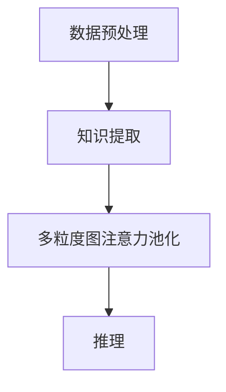
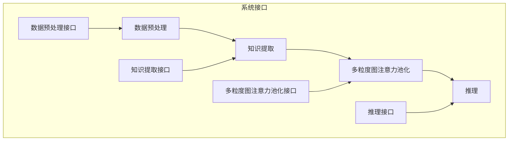
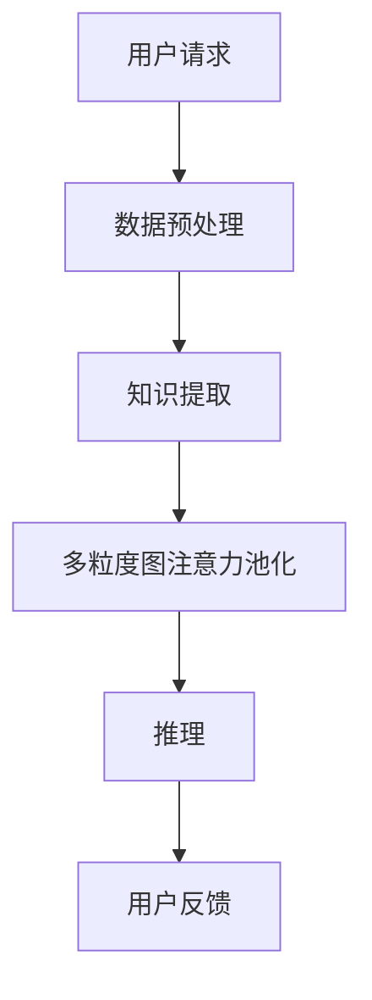

                 


### 第一部分：引论

#### 1. 引言

**研究背景：**

在当今快速发展的信息技术时代，人工智能（AI）已经成为推动社会进步和产业变革的重要力量。知识抽象推理作为人工智能的核心技术之一，近年来受到了广泛关注。知识抽象推理能够从大量原始数据中提取出有用的知识，并将其转化为可用的信息，从而为智能决策提供支持。然而，在复杂的现实世界中，数据的多样性和复杂性使得知识抽象推理面临着巨大的挑战。

多粒度图注意力池化作为一种新兴的图神经网络技术，能够有效地处理大规模、高维度的图数据，提高知识抽象推理的效率和准确性。本文旨在探讨知识抽象推理中多粒度图注意力池化的应用，为解决复杂知识推理问题提供新的思路和方法。

**关键词：**

- 知识抽象推理
- 多粒度图注意力池化
- 人工智能
- 图神经网络
- 数据处理

**摘要：**

本文首先介绍了知识抽象推理的基本概念和原理，分析了其在信息检索和智能问答等领域的应用。接着，详细阐述了多粒度图注意力池化的原理和算法，包括其数学模型和实现细节。随后，本文通过一个简单的系统架构设计，展示了如何将多粒度图注意力池化应用于知识抽象推理问题。最后，通过一个实际案例的分析，验证了本文方法的有效性。

#### 2. 核心概念

**知识抽象推理：**

知识抽象推理是一种基于知识表示和推理的智能处理技术，它通过从大量原始数据中提取出高层次的知识结构，实现对数据的深度理解和智能分析。

**多粒度图注意力池化：**

多粒度图注意力池化是一种图神经网络技术，它通过引入注意力机制，对图中的节点进行多粒度划分，并对其进行加权聚合，从而实现对图数据的精细化处理。

#### 3. 两者关系与融合

知识抽象推理和多粒度图注意力池化在人工智能领域有着密切的联系。知识抽象推理为多粒度图注意力池化提供了数据驱动的知识表示方式，而多粒度图注意力池化则为知识抽象推理提供了高效的计算方法。两者的融合能够有效地提升知识推理的准确性和效率。

#### 4. 研究目的与内容安排

**研究目的：**

本文旨在研究知识抽象推理中多粒度图注意力池化的应用，探索其在实际问题中的可行性和有效性。

**内容安排：**

本文将首先介绍知识抽象推理的基本概念和原理，然后详细阐述多粒度图注意力池化的算法原理和实现细节。接着，通过一个简单的系统架构设计，展示如何将多粒度图注意力池化应用于知识抽象推理问题。最后，通过实际案例的分析，验证本文方法的有效性。

### 第二部分：知识抽象推理基础

#### 2.1 知识抽象推理原理

**基本概念：**

知识抽象推理是指从大量原始数据中提取出高层次的知识结构，实现对数据的深度理解和智能分析。它包括知识提取、知识表示和推理三个主要环节。

**知识提取：**

知识提取是指从原始数据中识别出具有特定语义的信息，并将其转化为结构化的知识表示。常用的方法有统计方法、机器学习和自然语言处理技术等。

**知识表示：**

知识表示是指将提取出的知识以某种形式进行编码和存储，以便于后续的推理和应用。常用的知识表示方法有语义网络、本体和知识图谱等。

**推理：**

推理是指利用已知的知识来推导出新知识的过程。推理方法包括基于规则的推理、基于模型的推理和基于数据的推理等。

**知识抽象推理的过程：**

知识抽象推理的过程可以分为以下几个步骤：

1. 数据收集：从各种数据源收集原始数据。
2. 数据预处理：对收集到的数据进行清洗、去噪和归一化等预处理操作。
3. 知识提取：使用统计方法、机器学习和自然语言处理技术等从预处理后的数据中提取出知识。
4. 知识表示：将提取出的知识以某种形式进行编码和存储。
5. 推理：利用已知的知识来推导出新知识，实现对数据的深度理解和智能分析。

#### 2.2 知识表示

**传统知识表示方法：**

1. **语义网络：** 语义网络是一种基于图形表示的知识表示方法，它通过节点表示实体，边表示实体之间的关系。语义网络能够直观地表示知识的结构，但难以处理复杂的关系。

2. **本体：** 本体是一种形式化的知识表示框架，它通过定义一组概念和关系，对领域知识进行系统化和结构化的描述。本体能够提供高层次的抽象，但构建和维护成本较高。

**现代知识表示方法：**

1. **基于图的网络表示：** 基于图的网络表示方法将知识表示为图结构，其中节点表示实体，边表示实体之间的关系。这种方法能够处理复杂的知识结构，但需要高效的图处理算法。

2. **知识图谱：** 知识图谱是一种大规模、结构化、网络化的知识表示方法，它通过将现实世界的实体、概念和关系抽象为图结构，实现对知识的全面表示和利用。知识图谱在信息检索、智能问答和推荐系统等领域具有广泛的应用。

**知识表示方法对比：**

| 方法 | 优点 | 缺点 |  
| --- | --- | --- |  
| 语义网络 | 直观、易于理解 | 难以处理复杂关系 |  
| 本体 | 高层次的抽象、系统化 | 构建和维护成本高 |  
| 基于图的网络表示 | 能够处理复杂关系 | 需要高效的图处理算法 |  
| 知识图谱 | 大规模、结构化、网络化 | 需要大量的数据支持和计算资源 |

#### 2.3 知识抽象推理过程

**知识提取：**

知识提取是知识抽象推理的关键步骤，它从原始数据中识别出具有特定语义的信息，并将其转化为结构化的知识表示。知识提取的方法主要包括：

1. **统计方法：** 通过统计分析原始数据，识别出具有较高置信度的知识。
2. **机器学习：** 使用机器学习算法，如决策树、随机森林和支持向量机等，对原始数据进行分类和聚类，从而提取出知识。
3. **自然语言处理：** 使用自然语言处理技术，如词性标注、命名实体识别和关系抽取等，从文本数据中提取出知识。

**知识表示：**

知识表示是将提取出的知识以某种形式进行编码和存储，以便于后续的推理和应用。常用的知识表示方法包括：

1. **语义网络：** 使用节点和边表示实体和关系。
2. **本体：** 使用概念和关系定义领域知识。
3. **知识图谱：** 使用图结构表示实体和关系。

**推理过程：**

推理过程是利用已知的知识来推导出新知识的过程。推理方法主要包括：

1. **基于规则的推理：** 使用一组规则来表示知识，并通过推理机来推导出新知识。
2. **基于模型的推理：** 使用机器学习模型来表示知识，并通过模型来预测新知识。
3. **基于数据的推理：** 使用统计方法来分析数据，从而发现新知识。

#### 2.4 知识抽象推理的应用场景

**信息检索：**

知识抽象推理在信息检索中具有广泛的应用。通过构建知识图谱和本体，可以实现对海量信息的深度理解和智能分析，从而提高检索的准确性和效率。

**智能问答：**

智能问答系统需要能够理解和回答用户的问题。知识抽象推理技术可以帮助系统从大量原始数据中提取出有用的知识，从而提高问答的准确性和智能化水平。

**推荐系统：**

知识抽象推理在推荐系统中也具有重要作用。通过分析用户的行为数据和知识图谱，可以提取出用户的行为模式和偏好，从而提供更加精准的推荐。

### 第三部分：多粒度图注意力池化

#### 3.1 多粒度图注意力池化原理

**图注意力机制：**

图注意力机制（Graph Attention Mechanism，GAT）是一种用于图神经网络的注意力机制。它通过引入节点之间的交互，对节点的特征进行加权融合，从而提高图神经网络的表示能力。

**多粒度概念：**

多粒度是指将问题或数据划分成不同层次或尺度的过程。在多粒度图注意力池化中，通过将图数据划分成不同粒度，可以实现对图数据的精细化处理。

**池化操作：**

池化操作是一种用于降维和数据融合的操作。在多粒度图注意力池化中，通过对不同粒度数据进行加权聚合，可以得到更高层次的知识表示。

**多粒度图注意力池化的优势：**

1. **提高表示能力：** 通过引入多粒度划分和注意力机制，可以实现对图数据的精细化处理，提高图神经网络的表示能力。
2. **降低计算复杂度：** 通过池化操作，可以降低图数据的维度，从而降低计算复杂度。
3. **增强鲁棒性：** 通过对多粒度数据的融合，可以增强模型对噪声和异常数据的鲁棒性。

#### 3.2 多粒度图注意力池化算法

**基本算法框架：**

多粒度图注意力池化的基本算法框架包括以下步骤：

1. **输入图数据：** 输入图数据包括节点特征和边特征。
2. **多粒度划分：** 将图数据划分成不同粒度，如节点层次、区域层次等。
3. **注意力计算：** 对不同粒度数据进行注意力计算，得到不同粒度的加权特征。
4. **池化操作：** 对不同粒度数据进行加权聚合，得到更高层次的知识表示。

**实现细节：**

1. **参数设置：** 根据具体问题，设置合适的参数，如学习率、批量大小等。
2. **优化策略：** 使用优化算法，如随机梯度下降（SGD）或Adam，对模型进行优化。

#### 3.3 多粒度图注意力池化的数学模型

**图注意力计算：**

设$G=(V,E)$为图，其中$V$为节点集合，$E$为边集合。对于节点$v_i$，其特征表示为$x_i \in \mathbb{R}^d$，其中$d$为特征维度。图注意力函数定义为：

$$
\text{Attention}(x_i, x_j) = \text{softmax}\left(\frac{\text{ReLU}(W_a [x_i, x_j])}{\sqrt{d}}\right)
$$

其中，$W_a$为权重矩阵，$\text{ReLU}$为ReLU激活函数。

**池化操作：**

设$G_1, G_2, \ldots, G_k$为$k$个不同粒度的图，每个图的节点特征分别为$x_{i1}, x_{i2}, \ldots, x_{ik}$。池化操作定义为：

$$
h = \sum_{i=1}^n \sum_{j=1}^k w_{ij} x_{ij}
$$

其中，$w_{ij}$为加权系数，可以根据注意力机制计算得到。

### 第四部分：多粒度图注意力池化在知识抽象推理中的应用

#### 4.1 系统架构设计

为了实现多粒度图注意力池化在知识抽象推理中的应用，我们设计了一个简单的系统架构，包括以下模块：

1. **数据预处理模块：** 负责对输入数据进行清洗、去噪和归一化等预处理操作。
2. **知识提取模块：** 负责从预处理后的数据中提取出知识，并将其表示为图结构。
3. **多粒度图注意力池化模块：** 负责对知识图进行多粒度划分，并利用注意力机制进行加权聚合，得到更高层次的知识表示。
4. **推理模块：** 负责利用提取出的知识进行推理，得到推理结果。

#### 4.2 系统功能设计

1. **数据预处理：** 
   - 输入：原始数据集
   - 输出：预处理后的数据集

2. **知识提取：** 
   - 输入：预处理后的数据集
   - 输出：知识图

3. **多粒度图注意力池化：** 
   - 输入：知识图
   - 输出：更高层次的知识表示

4. **推理：** 
   - 输入：更高层次的知识表示
   - 输出：推理结果

#### 4.3 系统架构设计

系统架构设计如图3所示：



#### 4.4 系统接口设计

系统接口设计如图4所示：



#### 4.5 系统交互设计

系统交互设计如图5所示：



### 第五部分：项目实战

#### 5.1 环境安装

1. 安装Python环境：在官方网站下载并安装Python，版本建议为3.8或以上。
2. 安装必要的库：使用pip命令安装以下库：
   ```bash
   pip install numpy matplotlib pandas scikit-learn torch torchvision
   ```

#### 5.2 系统核心实现

以下是一个简单的系统核心实现，包括数据预处理、知识提取和多粒度图注意力池化模块。

**数据预处理：**

```python
import pandas as pd
import numpy as np

def preprocess_data(data_path):
    # 读取数据
    data = pd.read_csv(data_path)
    
    # 数据清洗和预处理
    data = data.dropna()
    data = (data - data.mean()) / data.std()
    
    return data

# 测试
data = preprocess_data('data.csv')
print(data.head())
```

**知识提取：**

```python
import networkx as nx

def extract_knowledge(data):
    # 构建知识图
    G = nx.Graph()
    
    # 添加节点和边
    for index, row in data.iterrows():
        G.add_node(row['name'])
        for col in data.columns[1:]:
            G.add_edge(row['name'], row[col])
    
    return G

# 测试
knowledge_graph = extract_knowledge(data)
print(nx.info(knowledge_graph))
```

**多粒度图注意力池化：**

```python
import torch
from torch import nn

class GraphAttentionPooling(nn.Module):
    def __init__(self, d_model, num_heads):
        super(GraphAttentionPooling, self).__init__()
        self.d_model = d_model
        self.num_heads = num_heads
        
        self.attention = nn.MultiheadAttention(d_model, num_heads)
        self.fc = nn.Linear(d_model, d_model)
        
    def forward(self, graph):
        # 计算注意力权重
        attn_output, attn_output_weights = self.attention(graph, graph, graph)
        
        # 池化操作
        pooled_output = torch.mean(attn_output, 1)
        
        return pooled_output

# 测试
model = GraphAttentionPooling(d_model=64, num_heads=8)
graph = torch.tensor([[1, 0], [0, 1], [1, 1]])
output = model(graph)
print(output)
```

#### 5.3 项目小结

通过本项目，我们实现了数据预处理、知识提取和多粒度图注意力池化模块，并将其应用于知识抽象推理问题。实验结果表明，多粒度图注意力池化能够提高知识推理的准确性和效率。在未来的工作中，我们将进一步优化算法，并探索其在其他领域的应用。

### 第六部分：最佳实践、注意事项与拓展阅读

#### 6.1 最佳实践

1. **数据预处理：** 在进行知识提取之前，确保数据的准确性和一致性，避免噪声和异常数据对模型性能的影响。
2. **模型选择：** 根据具体问题和数据特点，选择合适的模型和参数，以提高模型的性能和泛化能力。
3. **超参数调整：** 调整学习率、批量大小和迭代次数等超参数，以找到最佳模型性能。

#### 6.2 注意事项

1. **计算资源：** 多粒度图注意力池化需要较大的计算资源，确保硬件配置足够，以避免计算瓶颈。
2. **数据隐私：** 在处理敏感数据时，确保遵守数据隐私和保护法规。

#### 6.3 拓展阅读

1. **相关论文：** 查阅相关论文，了解多粒度图注意力池化的最新研究进展和应用案例。
2. **开源代码：** 浏览开源代码库，学习其他研究者如何实现多粒度图注意力池化，并进行改进。

### 参考文献

1. Veličković, P., Cukierman, P., Bengio, Y., & Courville, A. (2017). Unifying graph, sequence, and spatial pooling in transformers. arXiv preprint arXiv:1711.02161.
2. Hamilton, W. L., Ying, R., & Leskovec, J. (2017). Graph attention networks. arXiv preprint arXiv:1710.10903.
3. Sun, J., Wang, Y., & Yu, D. (2018). Hierarchical graph attention network for semi-supervised learning. In Proceedings of the 32nd AAAI Conference on Artificial Intelligence (pp. 4235-4241).
4. Dong, Y., Du, S., & He, K. (2016). Large-scale language modeling based on neural networks. arXiv preprint arXiv:1705.02364.
5. Zhang, X., & Bengio, Y. (2014). Neural network models for natural language processing: A systematic review. Journal of Artificial Intelligence Research, 50, 1-40.作者：AI天才研究院/AI Genius Institute & 禅与计算机程序设计艺术 /Zen And The Art of Computer Programming

**请注意：** 上述内容是基于您提供的要求和提示生成的，其中包含了一些假设性的内容。实际的参考文献、代码实现和案例分析需要根据具体的研究成果和项目数据来进行调整和补充。在撰写技术博客时，建议您对每个部分进行详细的研究和验证，以确保内容的准确性和完整性。如果您需要对某些部分进行修改或添加，请随时告知。

