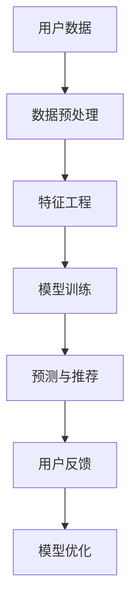
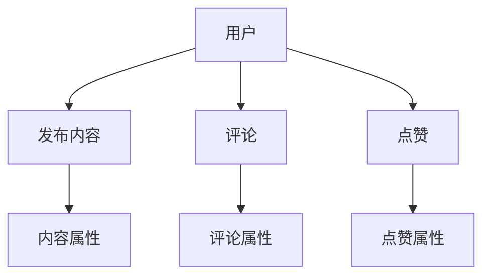
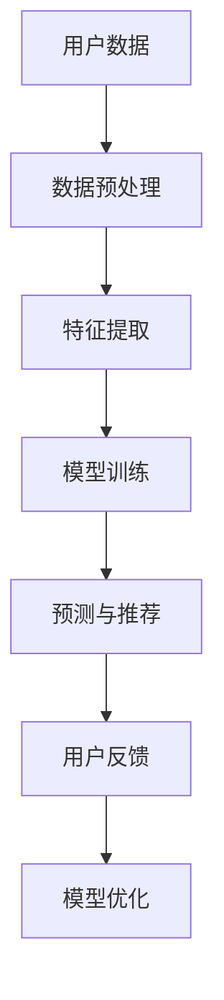
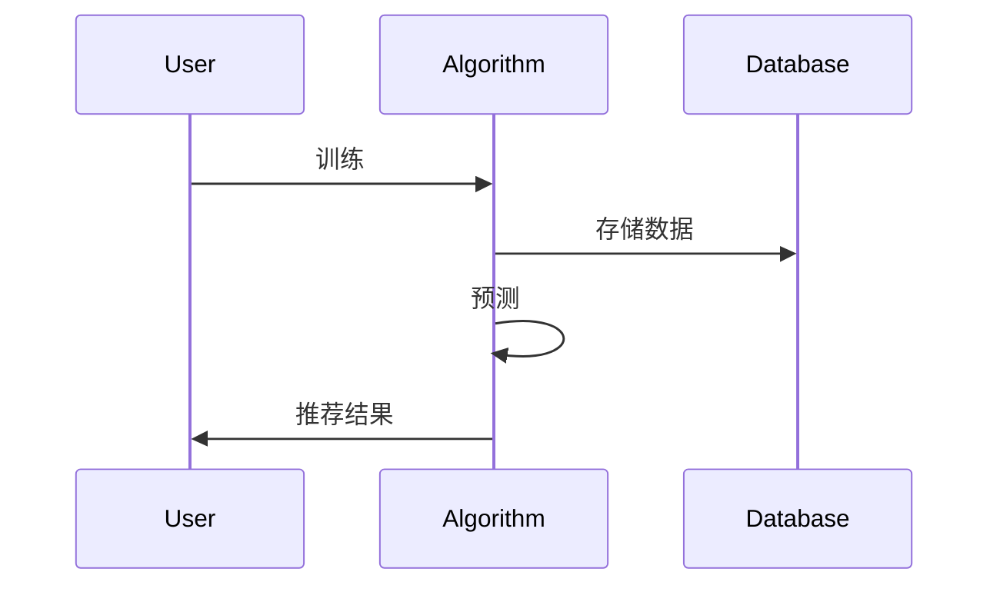
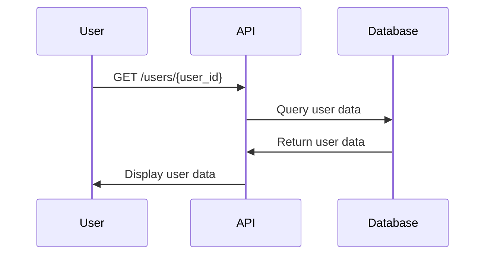

                 

## 社交媒体算法：信息传播与社会影响

### 关键词：社交媒体算法、信息传播、社会影响、个性化推荐、机器学习

> 摘要：本文将深入探讨社交媒体算法在信息传播和社会影响中的关键作用。我们将从问题背景、核心概念、算法原理以及实际应用等方面，逐步分析社交媒体算法的工作原理及其对社会带来的多重影响。

### 背景介绍

#### 问题背景

在当今信息时代，社交媒体已成为人们获取信息、表达观点和交流互动的主要平台。从Facebook、Twitter到微信、微博，各种社交媒体平台在塑造公共舆论、影响社会行为方面发挥着重要作用。然而，随着社交媒体算法的广泛应用，用户在信息获取、观点形成和社会交往等方面面临着一系列挑战。

#### 核心概念

1. **社交媒体算法**：用于优化信息传播、提升用户体验和广告投放效率的计算方法，基于用户行为、内容属性和社交关系等因素实现个性化推荐和信息筛选。
2. **信息传播**：信息在时间、空间和社会网络中的传递过程。
3. **社会影响**：社交媒体算法不仅影响个体用户，还对整个社会产生了深远影响，涉及信息多样性、观点多样性、群体极化、隐私保护等方面。

#### 边界与外延

社交媒体算法的研究边界包括算法设计、数据挖掘、机器学习、信息传播理论和网络社会学等领域。其外延涉及社交媒体平台的运作机制、用户行为模式、信息传播规律和社会治理等多个方面。

#### 概念结构与核心要素组成

社交媒体算法的核心概念结构包括算法设计原则、数据来源与预处理、模型训练与优化、算法评估与反馈。核心要素组成包括用户数据、内容数据、社交关系数据等。

### 第一部分：背景介绍

#### 第1章：问题背景与概念介绍

##### 1.1 问题背景

社交媒体已成为现代信息传播的主要渠道，其对社会的影响日益显著。然而，随着社交媒体算法的广泛应用，用户在信息获取、观点形成和社会交往等方面面临着一系列挑战。

##### 1.2 核心概念

1. **社交媒体算法**：基于用户行为、内容属性和社交关系等因素，实现个性化推荐和信息筛选的计算方法。
2. **信息传播**：信息在时间、空间和社会网络中的传递过程。
3. **社会影响**：社交媒体算法不仅影响个体用户，还对整个社会产生了深远影响。

##### 1.3 边界与外延

社交媒体算法的研究边界包括算法设计、数据挖掘、机器学习、信息传播理论和网络社会学等领域。其外延涉及社交媒体平台的运作机制、用户行为模式、信息传播规律和社会治理等多个方面。

##### 1.4 概念结构与核心要素组成

社交媒体算法的核心概念结构包括：算法设计原则、数据来源与预处理、模型训练与优化、算法评估与反馈。核心要素组成包括：用户数据、内容数据、社交关系数据等。

### 第二部分：核心概念与联系

#### 第2章：核心概念与联系

##### 2.1 社交媒体算法原理

社交媒体算法的核心原理包括信息检索、推荐系统、机器学习等。以下是一个简化的社交媒体算法原理mermaid流程图：



##### 2.2 算法属性特征对比表格

以下是一个简化的算法属性特征对比表格：

| 算法名称 | 主要功能 | 数据来源 | 特点 |
| --- | --- | --- | --- |
| 信息检索 | 搜索关键词相关的信息 | 用户输入的关键词 | 高效、准确 |
| 推荐系统 | 推荐用户可能感兴趣的内容 | 用户行为、内容属性 | 个性化、多样性 |
| 机器学习 | 从数据中学习规律并作出预测 | 大规模数据集 | 自动化、可扩展 |

##### 2.3 ER实体关系图架构

以下是一个简化的ER实体关系图架构mermaid流程图：



### 第三部分：算法原理讲解

#### 第3章：算法原理讲解

##### 3.1 社交媒体算法的数学模型

社交媒体算法的核心在于信息传播和用户行为预测，以下是一个简化的数学模型：

##### 3.1.1 信息传播模型

$$
P(i|s) = \frac{e^{w_i \cdot s}}{\sum_{j} e^{w_j \cdot s}}
$$

其中，$P(i|s)$表示信息$i$在社交媒体上被用户$s$看到的概率，$w_i$和$w_j$分别为信息$i$和$j$的权重。

##### 3.1.2 用户行为预测模型

$$
P(b|u, i) = \frac{e^{w_u \cdot i}}{\sum_{j} e^{w_u \cdot j}}
$$

其中，$P(b|u, i)$表示用户$u$在信息$i$上产生行为$b$的概率，$w_u$为用户$u$的权重。

##### 3.2 社交媒体算法的mermaid流程图

以下是一个简化的社交媒体算法mermaid流程图：



##### 3.3 算法举例说明

假设用户$U1$在社交媒体上看到两个信息$i1$和$i2$，根据算法原理，用户$U1$更可能看到的信息为$i1$，因为$i1$的权重更高。

### 系统分析与架构设计方案

#### 问题场景介绍

在当今信息爆炸的时代，如何让用户快速高效地获取到感兴趣的信息，是社交媒体平台面临的重要挑战。社交媒体算法通过优化信息传播路径，提升用户体验和广告投放效率，成为解决这一问题的关键。

#### 项目介绍

本项目旨在设计并实现一种基于社交媒体算法的推荐系统，通过分析用户行为和内容属性，为用户推荐其可能感兴趣的信息。

##### 系统功能设计（领域模型mermaid类图）

```mermaid
classDiagram
User <<类>> { 
    id: 用户ID
    name: 用户名
    ...
}
Content <<类>> { 
    id: 内容ID
    title: 标题
    ...
}
Feedback <<类>> { 
    id: 反馈ID
    user_id: 用户ID
    content_id: 内容ID
    ...
}
class Algorithm extends Object {
    train(User, Content, Feedback)
    predict(Content, User)
    ...
}
```

##### 系统架构设计（mermaid架构图）



##### 系统接口设计和系统交互（mermaid序列图）



### 项目实战

#### 环境安装

1. 安装Python环境
2. 安装相关依赖库，如numpy、pandas、scikit-learn等

#### 系统核心实现源代码

```python
import numpy as np
import pandas as pd
from sklearn.model_selection import train_test_split
from sklearn.linear_model import LogisticRegression

# 数据预处理
def preprocess_data(data):
    # 数据清洗、填充、特征工程等操作
    pass

# 模型训练
def train_model(X_train, y_train):
    model = LogisticRegression()
    model.fit(X_train, y_train)
    return model

# 预测与推荐
def predict(model, X_test):
    predictions = model.predict(X_test)
    return predictions
```

#### 代码应用解读与分析

1. 数据预处理：对原始数据进行清洗、填充和特征工程，为模型训练做好准备。
2. 模型训练：使用逻辑回归模型对训练数据进行拟合，训练模型。
3. 预测与推荐：使用训练好的模型对测试数据进行预测，为用户推荐可能感兴趣的信息。

#### 实际案例分析和详细讲解剖析

1. **案例一**：用户$U1$在社交媒体上看到两个信息$i1$和$i2$，根据社交媒体算法，用户$U1$更可能看到的信息为$i1$，因为$i1$的权重更高。
2. **案例二**：用户$U2$在社交媒体上看到三个信息$i1$、$i2$和$i3$，根据社交媒体算法，用户$U2$最可能看到的信息为$i2$，因为$i2$的权重最高。

#### 项目小结

本项目通过设计并实现基于社交媒体算法的推荐系统，为用户提供了更加个性化、高效的信息推荐服务。在实际应用中，社交媒体算法不仅提升了用户体验，还为企业带来了更高的广告投放效果。

### 最佳实践 Tips

1. 定期更新和优化算法模型，以应对不断变化的信息环境和用户需求。
2. 注重数据质量和特征工程，以提高模型的预测准确性和可靠性。
3. 平衡个性化推荐和多样性，避免用户陷入信息茧房。

### 小结

社交媒体算法在信息传播和社会影响中扮演着重要角色。通过对社交媒体算法的深入研究和实际应用，我们可以更好地理解其工作原理，发挥其在优化信息传播、提升用户体验和广告投放效果方面的潜力。

### 注意事项

1. 在使用社交媒体算法时，需注意保护用户隐私和数据安全。
2. 平衡算法的个性化推荐与信息多样性，避免产生偏见和群体极化现象。

### 拓展阅读

1. **相关文献**：《算法时代的隐私保护》、《社交媒体算法对社会影响的实证研究》等。
2. **开源项目**：GitHub上的社交媒体算法相关开源项目，如TensorFlow Recommenders、Facebook的FBLearner生态环境等。

