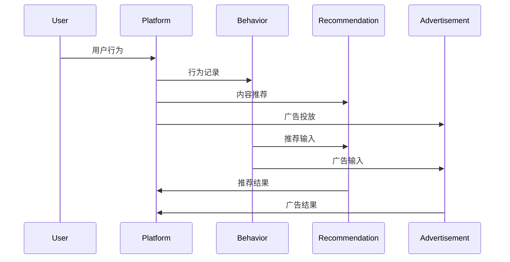
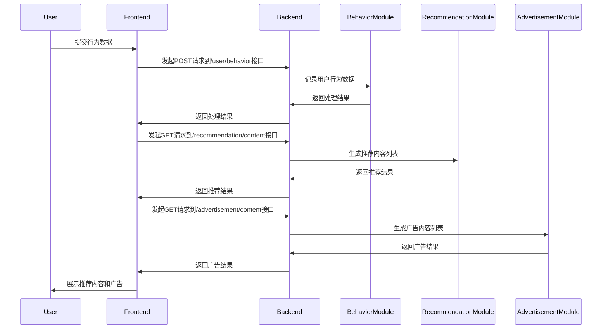
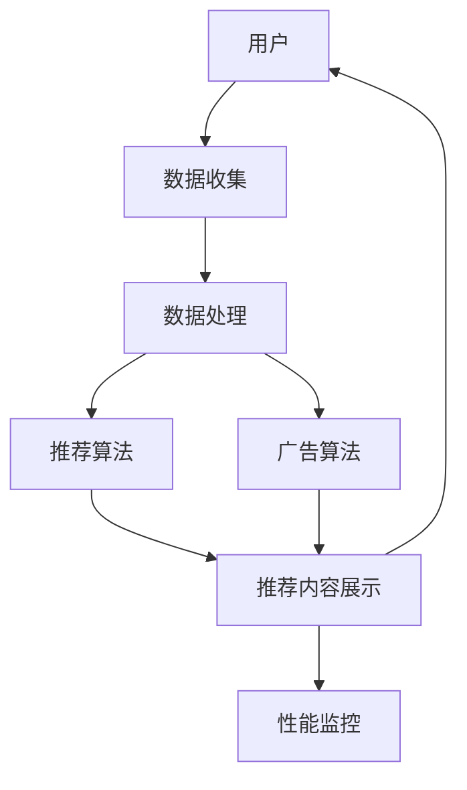

                 

### 社交媒体算法：信息茧房与社会极化的挑战

社交媒体算法是现代互联网技术中不可或缺的一部分，它为我们提供了个性化、精准的信息推送服务，提升了用户的体验。然而，这种个性化推送也带来了一些负面影响，如信息茧房和社会极化等现象。本文旨在探讨社交媒体算法对信息茧房和社会极化的挑战，通过逻辑清晰、结构紧凑、简单易懂的技术语言，帮助读者深入理解这一复杂问题。

## 关键词
- 社交媒体算法
- 信息茧房
- 社会极化
- 算法伦理
- 算法偏见

## 摘要
本文首先介绍了社交媒体算法的背景、核心概念及其在信息茧房和社会极化中的作用。接着，通过对比表格和实体关系图，展示了社交媒体算法的核心概念和属性特征。随后，详细讲解了推荐算法和广告算法的原理，并分析了算法偏见和公平性的问题。最后，提出了系统分析和架构设计方案，以及最佳实践和未来发展趋势。

### 目录大纲

# 社交媒体算法：信息茧房与社会极化的挑战

## 第一部分：背景与核心概念

## 1. 社交媒体与算法概述
### 1.1 社交媒体的普及与发展
### 1.2 社交媒体算法的核心功能
### 1.3 算法在社交媒体中的应用现状与挑战

## 2. 信息茧房现象
### 2.1 信息茧房的定义与特征
### 2.2 信息茧房的形成机制
### 2.3 信息茧房对社会的影响

## 3. 社会极化现象
### 3.1 社会极化的定义与特征
### 3.2 社会极化的形成机制
### 3.3 社会极化对社会的影响

## 4. 算法在信息茧房与社会极化中的作用
### 4.1 算法对信息茧房的影响
### 4.2 算法对社会极化的影响
### 4.3 算法对信息茧房与社会极化的双重影响

## 5. 社交媒体算法的伦理与社会责任
### 5.1 算法伦理的概念与原则
### 5.2 社交媒体算法的社会责任
### 5.3 算法伦理与社会责任的实践案例

## 6. 本章小结

## 第二部分：核心概念与联系

## 7. 社交媒体算法的核心概念
### 7.1 用户行为数据
### 7.2 内容推荐算法
### 7.3 个性化广告
### 7.4 算法偏见与公平性

## 8. 社交媒体算法的属性特征对比表格

## 9. 社交媒体算法的ER实体关系图架构

## 10. 算法在信息茧房与社会极化中的联系

## 11. 本章小结

## 第三部分：算法原理讲解

## 12. 社交媒体推荐算法的原理
### 12.1 协同过滤算法
#### 12.1.1 用户基于内容的推荐算法
#### 12.1.2 物品基于内容的推荐算法
### 12.2 协同过滤算法的实现细节
### 12.3 推荐算法的性能评估指标

## 13. 社交媒体广告算法的原理
### 13.1 广告投放策略
### 13.2 广告效果评估
### 13.3 广告算法的优化目标

## 14. 社交媒体算法中的算法偏见与公平性
### 14.1 算法偏见的概念与类型
### 14.2 算法偏见的影响
### 14.3 算法偏见与公平性的解决方法

## 15. 本章小结

## 第四部分：系统分析与架构设计方案

## 16. 社交媒体算法系统分析
### 16.1 系统场景介绍
### 16.2 系统功能设计（领域模型类图）
### 16.3 系统架构设计（架构图）

## 17. 系统接口设计与交互
### 17.1 接口设计与规范
### 17.2 系统交互（序列图）

## 18. 算法实现与系统部署
### 18.1 环境安装与配置
### 18.2 系统核心实现与源代码
### 18.3 代码应用解读与分析

## 19. 实际案例分析
### 19.1 案例背景与数据集
### 19.2 案例分析与解读
### 19.3 案例总结与启示

## 20. 本章小结

## 第五部分：最佳实践与拓展

## 21. 社交媒体算法的最佳实践
### 21.1 数据隐私保护
### 21.2 算法公平性优化
### 21.3 可解释性提升

## 22. 小结与展望
### 22.1 全书总结
### 22.2 未来发展趋势与挑战

## 23. 注意事项与拓展阅读

## 24. 附录

## 25. 本章小结

---

经过对目录大纲的详细规划和调整，本文将围绕社交媒体算法的核心问题展开深入探讨。首先，我们将从背景介绍出发，逐步深入分析信息茧房和社会极化的现象，探讨算法在这些现象中的角色和影响。接着，我们将介绍社交媒体算法的核心概念和属性特征，并通过对比表格和实体关系图，帮助读者建立对算法的全面理解。然后，我们将详细讲解推荐算法和广告算法的原理，并分析算法偏见和公平性的问题。在系统分析和架构设计部分，我们将介绍社交媒体算法系统的设计和实现。最后，我们将结合实际案例，提出最佳实践和未来发展趋势。通过这样的结构安排，我们希望能够为读者提供一份全面、深入、易懂的技术博客文章。

### 社交媒体与算法概述

#### 1.1 社交媒体的普及与发展

社交媒体作为互联网的一个重要分支，自上世纪末以来得到了迅猛发展。从最初的聊天室、论坛，到博客、微博、微信等平台，社交媒体逐渐成为人们日常交流、分享信息、表达观点的重要渠道。根据最新的统计数据，全球社交媒体用户已超过30亿，占总人口比例的40%以上。这一庞大用户群体不仅推动了社交媒体的普及，也为其提供了丰富的数据资源，使得算法能够得以广泛应用。

社交媒体的发展历程可以分为三个阶段。首先是Web 1.0时代，这一时期的社交媒体主要以单向的信息传播为主，用户主要作为信息接收者，参与度较低。其次是Web 2.0时代，用户开始能够通过评论、点赞、分享等方式互动，信息传播更加多元化和去中心化。最后是Web 3.0时代，社交媒体与人工智能、大数据等技术相结合，实现了高度个性化的信息推送和服务。

#### 1.2 社交媒体算法的核心功能

社交媒体算法的核心功能主要包括信息推荐、内容过滤、用户行为分析等。这些算法通过分析用户的兴趣、行为数据，实现个性化信息推送，提高用户的参与度和满意度。

1. **信息推荐**：信息推荐是社交媒体算法最为重要的功能之一。通过分析用户的历史行为和偏好，算法能够为用户推荐感兴趣的内容。常见的推荐算法包括协同过滤算法、基于内容的推荐算法和混合推荐算法等。

2. **内容过滤**：内容过滤算法用于识别和过滤用户不感兴趣或可能有害的内容。例如，垃圾邮件过滤、广告过滤等，都是为了提高用户的体验。

3. **用户行为分析**：用户行为分析可以帮助社交媒体平台了解用户的使用习惯、兴趣偏好等，从而更好地进行个性化推荐和服务优化。

#### 1.3 算法在社交媒体中的应用现状与挑战

当前，社交媒体算法已广泛应用于各类平台，如微博、微信、Facebook、Twitter等。这些平台通过算法实现了个性化推荐、内容过滤、广告投放等功能，极大地提升了用户体验。然而，算法的广泛应用也带来了一些挑战。

1. **信息茧房**：信息茧房现象指的是用户在社交媒体上只能接触到与自己观点相似的信息，导致认知偏见和思想固化。这一现象加剧了社会极化，使得不同群体之间的分歧越来越大。

2. **社会极化**：社会极化是指社会成员在政治、文化、宗教等方面的观点和立场逐渐趋同或对立，导致社会矛盾和冲突加剧。社交媒体算法通过个性化推荐，加剧了这种现象。

3. **算法偏见**：算法偏见是指算法在处理数据时，对某些群体或个体存在不公平对待。例如，基于性别、种族、年龄等特征的偏见。这些偏见可能对用户造成不公平的影响，甚至引发社会问题。

4. **数据隐私**：社交媒体算法需要大量的用户行为数据进行训练和优化，这引发了对用户隐私的担忧。如何保护用户数据隐私，成为社交媒体平台面临的一大挑战。

总之，社交媒体算法在提升用户体验、优化服务等方面发挥了重要作用，但其负面影响也不容忽视。在接下来的章节中，我们将进一步探讨信息茧房和社会极化的现象，以及算法在这些现象中的角色和影响。

### 信息茧房现象

#### 2.1 信息茧房的定义与特征

信息茧房（filter bubble）是一个描述用户在互联网上只能接触到与自己观点相似信息的现象。这个术语最早由互联网企业家艾略特·阿伦森（Eli Pariser）在其2011年的同名著作《信息茧房：互联网如何封锁我们的视野，强化我们的偏见》中提出。信息茧房具有以下特征：

1. **封闭性**：用户在社交媒体上只能接触到与自己观点相似的信息，导致信息流通的封闭性。
2. **多样性缺失**：信息茧房内的信息来源相对单一，用户无法获得不同观点和意见，从而降低了信息的多样性。
3. **偏见放大**：在信息茧房内，用户可能会因为不断接触相同观点而加强自己的偏见，进一步导致思想固化。
4. **认知偏见**：信息茧房可能加剧用户的认知偏见，使得他们难以接受与自身观点不同的信息。

#### 2.2 信息茧房的形成机制

信息茧房的形成机制可以从以下几个方面进行分析：

1. **个性化推荐算法**：社交媒体平台通过个性化推荐算法为用户推送感兴趣的内容。这些算法基于用户的历史行为和偏好进行内容筛选，导致用户在信息接收过程中逐渐封闭在自己的观点圈内。
2. **用户行为选择**：用户在互联网上的行为也受到信息茧房的影响。为了节省时间和精力，用户往往倾向于关注和阅读与自己观点相似的信息，从而进一步强化了信息茧房。
3. **社交媒体生态**：社交媒体平台的生态设计也促进了信息茧房的形成。例如，点赞、分享等互动机制使得用户更倾向于关注和传播与自己观点一致的内容。
4. **社会心理因素**：人类天生具有寻求归属感和自我确认的心理需求。在信息茧房内，用户通过接触与自己观点相似的信息，能够获得心理上的认同和满足。

#### 2.3 信息茧房对社会的影响

信息茧房对社会的影响是多方面的，主要表现在以下几个方面：

1. **认知偏差**：信息茧房可能导致用户在认知上出现偏差，无法全面、客观地看待问题。这种认知偏差可能会影响用户的决策和行为。
2. **社会极化**：信息茧房加剧了社会成员之间的分歧和对立。在信息茧房内，用户很难接触到与自身观点不同的信息，从而使得社会极化现象更加严重。
3. **公众参与度下降**：由于信息茧房的存在，公众在参与公共事务时可能缺乏全面、多元的信息，导致参与度下降。
4. **媒体信任度下降**：信息茧房可能导致用户对传统媒体的信任度下降，因为用户认为传统媒体不能提供与自己观点一致的信息。

总之，信息茧房现象不仅影响了用户的认知和行为，也对社会的多样性和和谐产生了负面影响。在接下来的章节中，我们将进一步探讨社会极化现象，分析算法如何加剧这一现象，并提出相应的解决方案。

#### 3.1 社会极化的定义与特征

社会极化（social polarization）是指社会成员在政治、文化、宗教等方面的观点和立场逐渐趋同或对立，导致社会矛盾和冲突加剧。社会极化现象在现代社会中愈发明显，其原因复杂多样，包括经济不平等、全球化、媒体环境变化等。社会极化的特征主要表现在以下几个方面：

1. **观点趋同与对立**：社会极化导致社会成员在某一议题上形成两个或多个相互对立的观点群体，这些群体往往缺乏相互理解和沟通。
2. **社会分裂**：社会极化加剧了社会成员之间的分裂感，使得社会成员更加关注自身群体的利益，忽视或排斥其他群体的需求。
3. **信息流通障碍**：在极化社会中，不同观点群体往往只能接触到与自己观点相似的信息，导致信息流通的障碍和误解。
4. **冲突加剧**：社会极化可能导致社会成员之间的矛盾和冲突加剧，甚至引发暴力事件。

#### 3.2 社会极化的形成机制

社会极化的形成机制可以从以下几个方面进行分析：

1. **选择性接触**：社会成员在选择信息时往往倾向于选择与自己观点一致的信息，避免接触与自己观点不同的信息。这种选择性接触加剧了社会成员之间的信息隔阂和观点对立。
2. **媒体影响**：媒体在极化现象中起到了关键作用。一方面，媒体通过报道和讨论某一议题，可能加剧社会成员之间的分歧；另一方面，媒体在报道时可能存在偏见，进一步加剧社会极化。
3. **社会心理因素**：社会成员在面临不同观点时，往往会进行自我确认（self-affirmation）和心理防御（cognitive defense）。这些心理机制使得社会成员更加坚定自己的观点，从而加剧了极化现象。
4. **制度性因素**：一些制度性因素，如选举制度、利益集团等，也可能加剧社会极化。例如，选举制度可能导致政治观点趋同的群体形成强有力的政治联盟，而不同观点的群体则难以获得政治代表。

#### 3.3 社会极化对社会的影响

社会极化对社会的影响是多方面的，主要表现在以下几个方面：

1. **政治稳定性下降**：社会极化可能导致政治体系的不稳定，加剧政治冲突和动荡。
2. **社会和谐受损**：社会极化使得社会成员之间的信任和合作减少，社会和谐受损。
3. **政策制定困难**：社会极化使得政策制定者难以平衡不同观点的利益，导致政策制定困难。
4. **公共参与度下降**：社会极化可能使公众对公共事务的参与度下降，导致社会问题的解决效率降低。

总之，社会极化现象不仅影响了社会的和谐与稳定，也对政策制定和社会治理带来了挑战。在接下来的章节中，我们将探讨社交媒体算法如何加剧社会极化现象，并提出相应的解决方案。

#### 算法在信息茧房与社会极化中的作用

社交媒体算法在信息茧房和社会极化中扮演着双重角色，既是问题的制造者，也是可能的解决者。算法的设计初衷是为了提高用户的体验和满意度，通过个性化推荐、内容过滤等功能，让用户更容易找到感兴趣的内容。然而，这种个性化推送也可能导致信息茧房和社会极化的加剧。

#### 4.1 算法对信息茧房的影响

算法在信息茧房中的作用主要体现在以下几个方面：

1. **个性化推荐**：社交媒体平台通过个性化推荐算法，根据用户的历史行为和偏好，为用户推荐感兴趣的内容。这种推荐机制虽然提高了用户满意度，但也可能导致用户只能接触到与自己观点相似的信息，从而陷入信息茧房。

2. **内容过滤**：算法不仅推荐内容，还会过滤掉用户不感兴趣的内容。这种过滤机制在提高用户体验的同时，也可能使得用户难以接触到与自己观点不同的信息，从而加剧信息茧房现象。

3. **算法偏见**：算法在训练过程中可能会受到数据偏见的影响，从而对某些群体或个体产生不公平对待。例如，算法可能对特定性别、种族或政治立场的用户产生偏见，导致这些用户在信息接收过程中受到不公平对待。

#### 4.2 算法对社会极化的影响

算法在社会极化中的作用同样值得注意，主要表现在以下几个方面：

1. **加强观点趋同**：算法通过个性化推荐，使得用户更容易接触到与自己观点相似的内容，从而加强了观点趋同。这种现象可能导致社会成员之间的分歧和对立加剧，进一步加剧社会极化。

2. **信息流通障碍**：在信息茧房中，用户难以接触到与自己观点不同的信息，这可能导致社会成员之间的信息隔阂和误解。信息流通的障碍使得社会成员之间的沟通和合作更加困难，从而加剧社会极化。

3. **社会心理影响**：算法在信息推送过程中，可能通过强化用户已有观点、减少信息多样性等方式，影响用户的社会心理。这种心理影响可能使得用户更加固执己见，难以接受与自己观点不同的信息，从而加剧社会极化。

#### 4.3 算法对信息茧房与社会极化的双重影响

算法对信息茧房和社会极化的双重影响体现在以下几个方面：

1. **循环放大**：算法在信息推荐和内容过滤过程中，不断强化用户已有的兴趣和观点，导致信息茧房和社会极化现象的循环放大。这种现象可能使得社会成员之间的分歧越来越大，社会矛盾和冲突越来越严重。

2. **自我实现预言**：算法的设计和运作可能使得信息茧房和社会极化成为一种自我实现的预言。例如，算法可能推荐更多与自己观点一致的内容，从而使得用户更加坚信自己的观点，进一步加剧信息茧房和社会极化。

3. **社会心理影响**：算法对用户的社会心理可能产生深远影响。例如，通过个性化推荐和内容过滤，算法可能使得用户更加固执己见，减少对其他观点的接受和尊重，从而加剧社会极化。

总之，社交媒体算法在信息茧房与社会极化中扮演着复杂的角色。虽然算法在提高用户体验方面具有显著优势，但其负面影响也不容忽视。在接下来的章节中，我们将探讨如何通过算法优化和社会干预，缓解信息茧房和社会极化现象。

#### 社交媒体算法的伦理与社会责任

随着社交媒体算法在社会各个层面的广泛应用，其对用户和社会产生的影响引发了广泛的伦理和社会责任讨论。社交媒体算法的伦理问题主要集中在数据隐私、算法偏见、用户权利等方面，而社会责任则涉及更广泛的社会影响，如对公共话语权、民主进程和公共利益的影响。

##### 5.1 算法伦理的概念与原则

算法伦理是指对算法设计、开发和应用过程中涉及到的伦理问题进行系统性思考和规范。算法伦理的基本原则包括：

1. **公平性**：算法应确保对所有用户公平对待，不因性别、种族、年龄、地域等因素产生歧视。
2. **透明性**：算法的决策过程和机制应透明，用户应能够了解自己的数据是如何被处理和利用的。
3. **可解释性**：算法的决策应具有可解释性，用户应能够理解算法为何作出特定决策。
4. **隐私保护**：用户的数据应得到充分保护，未经用户同意，不得泄露或滥用用户数据。
5. **社会责任**：算法设计者和运营者应承担社会责任，确保算法的应用不会对社会造成负面影响。

##### 5.2 社交媒体算法的社会责任

社交媒体算法的社会责任包括以下几个方面：

1. **维护公共利益**：算法应设计为保护公共利益，如确保信息的真实性和多样性，避免造成社会分裂和误导。
2. **促进民主进程**：算法应支持民主进程，如通过公平、透明的选举机制，防止虚假信息和选举干预。
3. **促进公众参与**：算法应鼓励公众参与公共事务，如通过推荐多样化的新闻内容，提高公众对公共事务的关注和参与。
4. **维护社会稳定**：算法应避免加剧社会冲突和分裂，如通过减少偏见和误导性信息的传播，促进社会和谐。

##### 5.3 算法伦理与社会责任的实践案例

以下是一些社交媒体算法伦理和社会责任的实践案例：

1. **透明度提升**：Facebook在其新闻推送算法中引入了透明度报告，用户可以查看自己的内容推荐列表，并了解推荐机制。

2. **隐私保护**：Twitter在2018年推出了一项隐私政策，明确告知用户其数据如何被使用和保护。

3. **算法偏见纠正**：Google在搜索算法中引入了多种机制，以减少偏见和误导性信息的传播，并确保搜索结果的公平性和多样性。

4. **公众参与**：Reddit通过“社区投票”机制，让用户参与内容推荐和过滤，从而提高内容的多样性和公众的参与度。

总之，社交媒体算法的伦理和社会责任问题至关重要，需要在设计、开发和运营过程中得到充分关注。通过提升透明度、保护隐私、纠正偏见和促进公众参与，社交媒体算法可以更好地服务于用户和社会。

### 社交媒体算法的核心概念

在深入了解社交媒体算法对信息茧房和社会极化的影响之前，我们首先需要了解其核心概念。这些核心概念包括用户行为数据、内容推荐算法、个性化广告和算法偏见与公平性。以下是这些概念的定义、特征和相互关系。

#### 7.1 用户行为数据

用户行为数据是指社交媒体平台收集的关于用户在平台上活动的各种数据，如浏览历史、点赞、评论、分享、搜索等。这些数据是社交媒体算法的重要输入，用于分析和预测用户的兴趣和行为模式。

- **特征**：
  - **多样性**：用户行为数据包括多种类型的信息，如文本、图像、视频等。
  - **动态性**：用户行为是动态变化的，随着时间的推移，用户的兴趣和行为可能会发生变化。
  - **复杂性**：用户行为数据往往具有高维度和复杂的特征，需要通过数据挖掘和机器学习技术进行分析。

- **相互关系**：用户行为数据是推荐算法和广告算法的基础，通过对这些数据的分析，算法可以更好地理解用户的兴趣和需求，从而提供更个性化的服务。

#### 7.2 内容推荐算法

内容推荐算法是指用于向用户推荐感兴趣的内容的算法。这些算法通过分析用户的历史行为数据、社交网络和内容特征，预测用户可能感兴趣的内容，并对其进行推荐。

- **特征**：
  - **个性化**：推荐算法旨在为每个用户提供个性化的内容推荐，满足其特定的兴趣和需求。
  - **实时性**：推荐算法需要能够实时处理和更新用户数据，以适应用户行为的变化。
  - **多样性**：推荐算法应确保推荐内容的多样性，避免单一内容的过度推荐。

- **相互关系**：内容推荐算法是社交媒体平台的核心功能之一，与用户行为数据和个性化广告密切相关。通过分析用户行为数据，推荐算法可以更准确地预测用户的兴趣，从而提高推荐效果。

#### 7.3 个性化广告

个性化广告是指根据用户的兴趣和行为，为用户展示个性化的广告内容。个性化广告不仅提高了广告的投放效果，还提升了用户体验。

- **特征**：
  - **精准性**：个性化广告能够根据用户的兴趣和行为，精准地投放广告，提高广告的点击率和转化率。
  - **互动性**：个性化广告可以与用户进行互动，如通过弹窗、链接等，增强用户的参与感。
  - **多样性**：个性化广告应提供多样化的广告形式，以适应不同用户的需求和偏好。

- **相互关系**：个性化广告与用户行为数据和内容推荐算法密切相关。通过分析用户行为数据，个性化广告可以更好地了解用户的需求，从而提高广告的投放效果。

#### 7.4 算法偏见与公平性

算法偏见是指算法在处理数据时，对某些群体或个体存在不公平对待的现象。算法偏见不仅损害了用户的利益，也可能对社会产生负面影响。

- **特征**：
  - **系统性**：算法偏见往往具有系统性，即算法在处理大规模数据时，可能对特定群体产生不公平对待。
  - **难以察觉**：算法偏见可能隐藏在复杂的数据处理过程中，不易被用户察觉。
  - **累积性**：算法偏见可能在长期使用中累积，导致对特定群体的系统性不公平。

- **相互关系**：算法偏见与公平性是社交媒体算法设计和应用中需要重点关注的问题。通过提高算法的公平性，可以减少算法偏见，保护用户的合法权益。

总之，用户行为数据、内容推荐算法、个性化广告和算法偏见与公平性是社交媒体算法的核心概念。这些概念相互关联，共同决定了社交媒体算法的性能和影响。在接下来的章节中，我们将进一步探讨这些核心概念的实现细节和实际应用。

### 社交媒体算法的属性特征对比表格

在了解社交媒体算法的核心概念后，我们需要进一步探讨其属性特征，并通过对比表格来帮助读者直观地理解这些特征。以下是几种常见的社交媒体算法及其属性特征的对比表格：

| 算法类型          | 个性化推荐       | 广告投放         | 内容过滤         | 算法偏见与公平性  |
|-----------------|-----------------|-----------------|-----------------|-----------------|
| **特征**                         |                    |                    |                    |                    |
| **个性化推荐**                | - 基于用户历史行为<br>- 基于内容特征<br>- 混合推荐算法  | - 定向广告<br>- 搜索广告<br>- 展示广告          | - 关键词过滤<br>- 用户标签过滤<br>- 社交网络过滤      | - 数据偏见<br>- 算法偏见<br>- 公平性保障        |
| **主要功能**                | - 推荐感兴趣的内容<br>- 提高用户参与度<br>- 提升平台活跃度  | - 增加广告投放效果<br>- 提高广告转化率<br>- 增加广告收入    | - 过滤垃圾信息<br>- 保护用户免受不良内容困扰<br>- 提高平台安全性  | - 减少算法偏见<br>- 保护用户隐私<br>- 维护社会公正    |
| **应用场景**                | - 社交媒体平台<br>- 购物网站<br>- 视频平台        | - 搜索引擎<br>- 社交媒体<br>- 电子邮件服务          | - 社交媒体平台<br>- 新闻网站<br>- 电商平台        | - 所有使用算法的场景<br>- 算法开发和运营<br>- 政策制定  |
| **优势**                         | - 提高用户体验<br>- 增强用户粘性<br>- 提高内容多样性    | - 提高广告收益<br>- 增强广告精准度<br>- 提高用户参与度  | - 提高内容质量<br>- 保护用户隐私<br>- 提高平台安全性  | - 减少算法偏见<br>- 保护用户权益<br>- 促进社会公正    |
| **挑战**                         | - 信息茧房<br>- 算法偏见<br>- 数据隐私问题         | - 广告效果评估<br>- 用户参与度<br>- 广告成本问题     | - 内容审核难度<br>- 用户隐私保护<br>- 社会道德责任   | - 数据偏见<br>- 公平性争议<br>- 社会道德风险      |

通过上述对比表格，我们可以清楚地看到不同类型社交媒体算法的特征、功能、应用场景、优势以及挑战。这有助于读者全面了解社交媒体算法的属性特征，为后续的深入探讨打下基础。

### 社交媒体算法的ER实体关系图架构

在社交媒体算法的设计过程中，理解实体关系（Entity-Relationship，简称ER）图架构对于构建高效、可扩展的算法系统至关重要。ER图用于描述系统中实体及其相互关系，可以帮助我们清晰地定义数据模型和系统的逻辑结构。

以下是一个简化的社交媒体算法系统的ER实体关系图架构：

```mermaid
erDiagram
    User ||--o>> Content : 用户生成和消费内容
    User ||--o>> Behavior : 用户行为记录
    Content ||--|{ Recommendation : 推荐系统
    Content ||--|{ Advertisement : 广告系统
    Behavior ||--o>> Recommendation : 推荐系统
    Behavior ||--o>> Advertisement : 广告系统
    Platform ||--|{ Content : 平台内容管理
    Platform ||--|{ Behavior : 平台行为分析
    Platform ||--|{ Recommendation : 推荐系统
    Platform ||--|{ Advertisement : 广告系统
```

在这个ER图中，我们定义了以下几个核心实体：

1. **User（用户）**：代表在社交媒体平台上注册和活跃的用户。用户可以生成和消费内容，并产生各种行为。
2. **Content（内容）**：代表用户在平台上创建或分享的各种类型的内容，如文本、图片、视频等。
3. **Behavior（行为）**：记录用户在平台上的各种行为，如浏览、点赞、评论、分享等。
4. **Recommendation（推荐系统）**：负责根据用户行为和内容特征生成内容推荐。
5. **Advertisement（广告系统）**：负责广告投放和管理，根据用户行为和兴趣精准投放广告。
6. **Platform（平台）**：代表整个社交媒体平台，包括内容管理、行为分析、推荐和广告等核心功能模块。

实体之间的关系如下：

- **用户（User）** 与 **内容（Content）** 之间的关系是“生成和消费”，用户可以生成内容并消费其他用户生成的内容。
- **用户（User）** 与 **行为（Behavior）** 之间的关系是“行为记录”，用户的行为会被记录下来，用于后续分析和推荐。
- **内容（Content）** 与 **推荐系统（Recommendation）** 之间的关系是“推荐输入”，推荐系统会根据内容特征和用户行为进行内容推荐。
- **内容（Content）** 与 **广告系统（Advertisement）** 之间的关系是“广告投放”，广告系统会根据内容特征和用户行为投放广告。
- **行为（Behavior）** 与 **推荐系统（Recommendation）** 和 **广告系统（Advertisement）** 之间的关系是“数据输入”，推荐和广告系统会根据用户行为数据进行决策。
- **平台（Platform）** 与 **推荐系统（Recommendation）**、**广告系统（Advertisement）** 和 **行为（Behavior）** 之间的关系是“功能模块集成”，平台包含这些核心功能模块，并通过它们实现整体服务。

通过ER图，我们可以清晰地看到社交媒体算法系统的实体及其相互关系，这有助于我们在设计和实现过程中确保系统的逻辑一致性、模块化和可扩展性。

### 算法在信息茧房与社会极化中的联系

社交媒体算法不仅在信息推荐和广告投放中发挥着重要作用，还深刻地影响着信息茧房和社会极化的形成和发展。以下我们将分析算法在信息茧房和社会极化中的具体联系，以及如何通过算法优化来缓解这些问题。

#### 8.1 算法在信息茧房中的联系

信息茧房是指用户在社交媒体上只能接触到与自己观点相似的信息，从而形成信息封闭的环境。算法在信息茧房的形成中起到了关键作用，主要体现在以下几个方面：

1. **个性化推荐算法**：社交媒体平台通过个性化推荐算法，根据用户的历史行为和兴趣偏好，为用户推荐感兴趣的内容。虽然这种推荐机制提高了用户的满意度，但也可能导致用户在信息流中只看到与自己观点相似的内容，从而陷入信息茧房。

2. **内容过滤机制**：为了提高用户体验，社交媒体平台会对用户不感兴趣的内容进行过滤。然而，这种过滤机制可能导致用户在不知不觉中失去了接触到不同观点的机会，进一步加剧了信息茧房现象。

3. **算法偏见**：算法在训练过程中可能受到数据偏见的影响，导致对某些群体或个体的推荐结果不公平。这种偏见可能导致特定群体的信息茧房现象更加严重。

#### 8.2 算法在社会极化中的联系

社会极化是指社会成员在政治、文化、宗教等方面的观点和立场逐渐趋同或对立，导致社会矛盾和冲突加剧。社交媒体算法在社会极化中的作用主要体现在以下几个方面：

1. **选择性推荐**：算法通过选择性推荐用户感兴趣的内容，使得用户在信息流中只接触到与自己观点相似的信息。这种现象加强了用户对已有观点的认同，削弱了用户接受不同观点的意愿，从而加剧了社会极化。

2. **信息流通障碍**：在信息茧房中，用户难以接触到与自己观点不同的信息，这导致不同观点群体之间的信息流通障碍。这种障碍使得社会成员之间的误解和冲突更加严重，进一步加剧了社会极化。

3. **算法偏见**：算法偏见可能导致特定群体在社交媒体上的信息传播受限，从而使得这些群体的声音被压制。这种偏见可能使得社会极化现象更加严重，甚至导致社会分裂。

#### 8.3 通过算法优化缓解信息茧房与社会极化

为了缓解信息茧房和社会极化现象，算法优化成为关键一环。以下是一些具体的算法优化策略：

1. **多样性增强**：通过在推荐算法中加入多样性增强机制，确保用户在信息流中看到多样化的内容。例如，可以引入随机性成分，增加推荐结果的多样性。

2. **平衡偏见**：通过算法调整，减少算法偏见对用户推荐结果的影响。例如，可以使用交叉验证和偏差校正技术，确保算法在不同群体中的表现一致。

3. **互动性提升**：鼓励用户与平台互动，如参与投票、评论、分享等，增加用户对多样化信息的接触机会。这有助于打破信息茧房，促进不同观点之间的交流。

4. **算法透明性**：提高算法的透明度，让用户了解算法的推荐机制和决策过程。这有助于增强用户对算法的信任，减少因误解而导致的偏见。

5. **社会参与**：通过算法鼓励用户参与社会事务，如推荐公共话题讨论、政策解读等，提高用户对社会问题的关注和参与度。这有助于缓解社会极化现象。

总之，算法在信息茧房和社会极化中扮演着重要角色。通过多样化的推荐、平衡偏见、互动性提升和透明性增强等算法优化策略，我们可以缓解这些问题，促进社会的和谐发展。

### 社交媒体推荐算法的原理

社交媒体推荐算法的核心任务是根据用户的历史行为和兴趣偏好，向用户推荐其可能感兴趣的内容。推荐算法可以分为基于内容的推荐（Content-based Recommendation）和协同过滤算法（Collaborative Filtering）。以下是对这些推荐算法的原理和实现细节的详细讲解。

#### 12.1 协同过滤算法

协同过滤算法是推荐系统中最常用的方法之一，其基本思想是通过分析用户之间的相似性来推荐内容。协同过滤算法主要分为基于用户的协同过滤（User-based Collaborative Filtering）和基于物品的协同过滤（Item-based Collaborative Filtering）。

1. **基于用户的协同过滤**：
   - **核心思想**：找到与目标用户最相似的邻居用户，然后将邻居用户喜欢但目标用户尚未喜欢的内容推荐给目标用户。
   - **实现步骤**：
     1. 计算用户之间的相似性：通常使用余弦相似度、皮尔逊相关系数等指标。
     2. 找到与目标用户最相似的邻居用户。
     3. 根据邻居用户的行为进行内容推荐。

2. **基于物品的协同过滤**：
   - **核心思想**：找到与目标用户喜欢的内容最相似的其他内容，然后将这些内容推荐给目标用户。
   - **实现步骤**：
     1. 计算物品之间的相似性：通常使用余弦相似度、Jaccard相似性等指标。
     2. 找到与目标用户喜欢的内容最相似的物品。
     3. 根据相似物品推荐内容。

#### 12.2 协同过滤算法的实现细节

协同过滤算法的实现涉及以下几个关键步骤：

1. **数据预处理**：
   - **数据收集**：从社交媒体平台上收集用户行为数据，如浏览记录、点赞、评论等。
   - **数据清洗**：处理缺失值、噪声数据和异常值，确保数据质量。
   - **特征提取**：将原始数据转换为适合推荐算法处理的形式，如用户-物品评分矩阵。

2. **相似度计算**：
   - **用户相似度计算**：使用余弦相似度、皮尔逊相关系数等指标计算用户之间的相似性。
   - **物品相似度计算**：使用余弦相似度、Jaccard相似性等指标计算物品之间的相似性。

3. **推荐生成**：
   - **邻居选择**：根据相似度计算结果，选择与目标用户最相似的邻居用户或物品。
   - **推荐列表生成**：根据邻居用户或物品的行为，生成推荐列表。

#### 12.3 推荐算法的性能评估指标

推荐算法的性能评估是确保其有效性和准确性的重要环节。以下是一些常用的推荐算法性能评估指标：

1. **准确率（Accuracy）**：
   - **定义**：准确率是推荐算法推荐的正确项目数与所有项目数的比值。
   - **计算公式**：准确率 = (推荐正确的项目数 / 推荐的项目总数)。

2. **召回率（Recall）**：
   - **定义**：召回率是推荐算法推荐的正确项目数与用户实际感兴趣的项目数的比值。
   - **计算公式**：召回率 = (推荐正确的项目数 / 用户实际感兴趣的项目总数)。

3. **精确率（Precision）**：
   - **定义**：精确率是推荐算法推荐的正确项目数与推荐的项目数的比值。
   - **计算公式**：精确率 = (推荐正确的项目数 / 推荐的项目总数)。

4. **F1值（F1 Score）**：
   - **定义**：F1值是精确率和召回率的调和平均。
   - **计算公式**：F1值 = 2 * (精确率 * 召回率) / (精确率 + 召回率)。

5. **覆盖率（Coverage）**：
   - **定义**：覆盖率是推荐列表中覆盖的用户兴趣项目的比例。
   - **计算公式**：覆盖率 = (推荐列表中的新项目数 / 所有用户感兴趣的项目总数)。

6. **多样性（Diversity）**：
   - **定义**：多样性是推荐列表中不同类型项目的比例。
   - **计算公式**：多样性 = (不同类型项目的数量 / 推荐列表中的项目总数)。

7. **新颖性（Novelty）**：
   - **定义**：新颖性是推荐列表中未见过项目的比例。
   - **计算公式**：新颖性 = (未见过项目的数量 / 推荐列表中的项目总数)。

通过这些性能评估指标，我们可以全面衡量推荐算法的效果，并针对性地进行优化。在接下来的章节中，我们将进一步探讨社交媒体广告算法的原理及其实现细节。

### 社交媒体广告算法的原理

社交媒体广告算法的核心目标是提高广告投放的精准度和转化率，从而最大化广告主的收益。广告算法的设计通常涉及多个步骤，包括广告投放策略、广告效果评估和广告算法的优化目标。以下是对这些核心环节的详细讲解。

#### 13.1 广告投放策略

广告投放策略是指如何将广告展示给目标用户，以达到最佳的广告效果。广告投放策略主要包括以下几种：

1. **定向广告**：
   - **定义**：定向广告是指根据用户的年龄、性别、地理位置、兴趣爱好等信息，将广告精准地投放到目标用户群体。
   - **实现步骤**：
     1. 用户数据收集：从社交媒体平台获取用户的个人信息和兴趣标签。
     2. 用户群体划分：根据用户特征将用户划分为多个目标群体。
     3. 广告内容定制：根据目标群体的特征定制相应的广告内容。

2. **搜索广告**：
   - **定义**：搜索广告是指用户在搜索框中输入关键词后，系统根据关键词相关性和广告主的出价，展示相关的广告。
   - **实现步骤**：
     1. 关键词匹配：将用户输入的关键词与广告库中的关键词进行匹配。
     2. 广告排序：根据广告主的出价和关键词相关性对广告进行排序。
     3. 广告展示：将排好序的广告展示给用户。

3. **展示广告**：
   - **定义**：展示广告是指在不特定场景下，通过页面广告位随机投放给用户。
   - **实现步骤**：
     1. 广告位分配：根据页面流量和用户特征分配广告位。
     2. 广告内容制作：制作与广告位匹配的广告内容。
     3. 广告展示：将广告随机展示给用户。

#### 13.2 广告效果评估

广告效果评估是衡量广告投放效果的重要手段，主要包括以下指标：

1. **点击率（Click-Through Rate，CTR）**：
   - **定义**：点击率是广告被点击的次数与展示次数的比值。
   - **计算公式**：CTR = (点击次数 / 展示次数)。

2. **转化率（Conversion Rate）**：
   - **定义**：转化率是完成特定目标（如购买、注册、下载等）的用户数与点击次数的比值。
   - **计算公式**：转化率 = (完成目标用户数 / 点击次数)。

3. **广告成本（Cost Per Click，CPC）**：
   - **定义**：广告成本是广告主为获取一次点击所需的成本。
   - **计算公式**：CPC = (广告总成本 / 点击次数)。

4. **广告投资回报率（Return on Ad Spend，ROAS）**：
   - **定义**：广告投资回报率是广告收益与广告成本的比值。
   - **计算公式**：ROAS = (广告收益 / 广告成本)。

通过这些指标，广告主可以评估广告投放的效果，并根据评估结果调整广告策略。

#### 13.3 广告算法的优化目标

广告算法的优化目标是在保证广告投放精准度的同时，最大化广告主的收益。以下是一些常见的优化目标：

1. **最大化点击率**：
   - **目标**：通过优化广告内容和投放策略，提高广告的点击率。
   - **方法**：使用机器学习算法分析用户行为数据，调整广告内容和展示位置，提高用户点击意愿。

2. **最大化转化率**：
   - **目标**：通过优化广告内容和投放策略，提高广告的转化率。
   - **方法**：结合用户行为数据和转化路径分析，优化广告内容和用户引导流程，提高用户购买意愿。

3. **最大化广告收益**：
   - **目标**：通过优化广告投放策略，最大化广告收益。
   - **方法**：根据广告主出价和用户特征，动态调整广告投放策略，确保广告资源的高效利用。

4. **平衡广告效果和用户体验**：
   - **目标**：在保证广告效果的同时，提升用户体验。
   - **方法**：通过多样性和新颖性的设计，确保广告内容不会过于重复，提升用户对广告的接受度。

通过上述广告投放策略、广告效果评估和广告算法优化目标的详细讲解，我们可以更好地理解社交媒体广告算法的工作原理和实现方法。在接下来的章节中，我们将探讨社交媒体算法中的算法偏见与公平性。

### 社交媒体算法中的算法偏见与公平性

算法偏见是指算法在处理数据时，对某些群体或个体存在不公平对待的现象。这种偏见可能源于数据集的不平衡、训练过程的不公平，或者算法设计中的缺陷。算法偏见不仅会损害用户的利益，还可能对社会产生负面影响。以下是算法偏见的概念与类型、算法偏见的影响，以及解决算法偏见与公平性的方法。

#### 14.1 算法偏见的概念与类型

算法偏见可以分为以下几种类型：

1. **性别偏见**：算法可能对特定性别的用户产生不公平对待，如在招聘广告中自动过滤女性申请者。
2. **种族偏见**：算法可能在推荐系统中对特定种族的用户产生偏见，如在社交媒体上推荐与用户种族相关的内容。
3. **年龄偏见**：算法可能对不同年龄段的用户产生不公平对待，如在广告投放中只向年轻人展示产品广告。
4. **地域偏见**：算法可能对特定地区的用户产生偏见，如在某些地区限制内容的推荐。
5. **内容偏见**：算法可能对特定类型的内容进行筛选，如在新闻推荐中减少对特定主题的报道。

#### 14.2 算法偏见的影响

算法偏见的影响是多方面的：

1. **用户体验下降**：算法偏见可能导致用户无法获得公平的信息和服务，影响用户体验。
2. **社会不公平**：算法偏见可能加剧社会不平等，如招聘广告中的性别偏见可能导致性别歧视。
3. **决策错误**：算法偏见可能导致错误的决策，如在金融风险评估中，对特定种族或性别的人群产生不公平的评估结果。
4. **公共信任下降**：算法偏见可能降低公众对算法和平台的信任，影响平台的声誉。

#### 14.3 算法偏见与公平性的解决方法

为了解决算法偏见和提升公平性，可以采取以下方法：

1. **数据多样性**：确保数据集的多样性，避免数据集中存在偏见。可以通过引入更多的数据来源、增加不同群体的代表性来实现。
2. **算法透明性**：提高算法的透明度，使算法的决策过程更容易被理解。这包括公开算法的原理、参数设置和训练数据。
3. **偏差校正**：在算法训练过程中使用偏差校正技术，如再抽样、偏差修正模型等，减少算法偏见。
4. **公平性评估**：对算法进行定期的公平性评估，确保其在不同群体中的表现一致。可以使用统计测试、A/B测试等方法进行评估。
5. **可解释性增强**：提高算法的可解释性，使决策过程更加透明。可以使用决策树、可视化等技术来增强算法的可解释性。
6. **伦理审查**：在算法设计和应用过程中引入伦理审查机制，确保算法的应用符合伦理标准。这包括在算法开发前进行伦理评估、制定伦理准则等。
7. **用户参与**：鼓励用户参与算法的设计和评估，提高算法的公平性和用户满意度。例如，通过用户反馈机制、用户投票等方式让用户参与决策。

总之，算法偏见与公平性是社交媒体算法设计和应用中需要重点关注的问题。通过数据多样性、算法透明性、偏差校正、公平性评估、可解释性增强和用户参与等方法，可以有效地解决算法偏见，提升算法的公平性，促进社会的和谐发展。

### 社交媒体算法系统分析

在探讨社交媒体算法的设计与实现之前，我们需要对系统的整体场景进行介绍，包括系统的功能设计和架构设计。以下是对社交媒体算法系统分析的详细阐述。

#### 16.1 系统场景介绍

社交媒体算法系统通常用于大型社交媒体平台，如微博、微信、Facebook等。这些平台需要处理海量用户数据，实现个性化推荐、内容过滤、广告投放等功能。系统场景主要包括以下几个方面：

1. **用户数据采集**：系统从用户在平台上的行为（如浏览、点赞、评论等）收集数据。
2. **数据处理**：对收集到的用户数据进行清洗、转换和存储，为算法提供高质量的数据输入。
3. **算法推理**：利用推荐算法、广告算法等对用户数据进行分析和处理，生成推荐结果和广告投放策略。
4. **结果展示**：将推荐结果和广告展示给用户，提高用户参与度和满意度。
5. **性能监控**：监控系统性能，确保算法的稳定性和高效性。

#### 16.2 系统功能设计（领域模型类图）

为了清晰地描述系统功能，我们可以使用领域模型类图（Class Diagram）来表示系统中的关键实体和它们之间的关系。以下是一个简化的社交媒体算法系统的领域模型类图：

```mermaid
classDiagram
    User <<class{用户}>>  
    Content <<class{内容}>>  
    Behavior <<class{行为}>>  
    Recommendation <<class{推荐}>>  
    Advertisement <<class{广告}>>  
    Platform <<class{平台}>>  

    User o--o Content : 生成和消费
    User o--o Behavior : 记录行为
    Content o--o Recommendation : 内容推荐
    Content o--o Advertisement : 广告投放
    Behavior o--o Recommendation : 推荐输入
    Behavior o--o Advertisement : 广告输入
    Platform o--o Content : 内容管理
    Platform o--o Behavior : 行为分析
    Platform o--o Recommendation : 推荐服务
    Platform o--o Advertisement : 广告服务
```

在这个类图中，我们定义了以下几个核心实体：

- **用户（User）**：代表在平台上注册和活跃的用户。
- **内容（Content）**：代表用户生成或消费的各种类型的内容，如文本、图片、视频等。
- **行为（Behavior）**：记录用户在平台上的各种行为，如浏览、点赞、评论、分享等。
- **推荐（Recommendation）**：负责根据用户行为和内容特征生成内容推荐。
- **广告（Advertisement）**：负责广告投放和管理。
- **平台（Platform）**：代表整个社交媒体平台，包括内容管理、行为分析、推荐和广告等核心功能模块。

实体之间的关系如下：

- **用户**与**内容**之间的关系是“生成和消费”，用户可以生成内容并消费其他用户生成的内容。
- **用户**与**行为**之间的关系是“行为记录”，用户的行为会被记录下来，用于后续分析和推荐。
- **内容**与**推荐**和**广告**之间的关系是“数据输入”，推荐和广告系统会根据内容特征和用户行为数据进行决策。
- **行为**与**推荐**和**广告**之间的关系是“数据输入”，推荐和广告系统会根据用户行为数据进行决策。
- **平台**与**推荐**、**广告**和**行为**之间的关系是“功能模块集成”，平台包含这些核心功能模块，并通过它们实现整体服务。

#### 16.3 系统架构设计（架构图）

为了实现系统的功能，我们需要设计合理的系统架构。以下是一个简化的社交媒体算法系统架构图：



在这个架构图中，系统的主要组件及其交互关系如下：

- **用户**：作为系统的输入源，提供用户行为数据。
- **平台**：作为系统的核心处理单元，负责处理用户行为数据、调用推荐和广告算法，并将结果返回给用户。
- **行为模块**：负责记录和存储用户行为数据，为推荐和广告算法提供输入。
- **推荐模块**：根据用户行为数据生成内容推荐结果。
- **广告模块**：根据用户行为数据和广告策略生成广告投放结果。

通过上述系统功能设计和架构设计，我们可以清晰地了解社交媒体算法系统的设计和实现思路。在接下来的章节中，我们将进一步探讨系统接口设计和交互，以及算法实现与系统部署。

### 系统接口设计与交互

为了实现社交媒体算法系统的功能，我们需要设计一套完善的接口，以实现不同模块之间的有效通信和交互。以下是对系统接口设计、接口规范和系统交互的详细说明。

#### 17.1 接口设计与规范

社交媒体算法系统的接口设计应遵循RESTful架构风格，提供统一的接口规范，以便前端、后端和其他系统模块能够方便地调用。以下是系统接口设计的几个关键点：

1. **用户行为数据接口**：
   - **接口名称**：/user/behavior
   - **请求方法**：POST
   - **请求参数**：行为类型（如浏览、点赞、评论等）、用户ID、内容ID
   - **响应内容**：成功消息、错误消息或行为记录ID

2. **推荐算法接口**：
   - **接口名称**：/recommendation/content
   - **请求方法**：GET
   - **请求参数**：用户ID
   - **响应内容**：推荐内容列表（包括内容ID、标题、摘要等）

3. **广告算法接口**：
   - **接口名称**：/advertisement/content
   - **请求方法**：GET
   - **请求参数**：用户ID
   - **响应内容**：广告内容列表（包括广告ID、标题、摘要等）

4. **用户数据接口**：
   - **接口名称**：/user/data
   - **请求方法**：GET
   - **请求参数**：用户ID
   - **响应内容**：用户基本信息（如姓名、年龄、性别等）

#### 17.2 系统交互（序列图）

系统交互序列图描述了用户行为数据从收集到推荐和广告结果展示的过程。以下是一个简化的系统交互序列图：



在这个序列图中，用户通过前端界面提交行为数据，前端将数据通过POST请求发送到后端/user/behavior接口，后端调用行为模块记录用户行为数据，并将结果返回给前端。随后，前端通过GET请求调用/recommendation/content和/advertisement/content接口，分别获取推荐内容和广告内容列表，最后将结果展示给用户。

通过上述接口设计和系统交互，我们可以实现社交媒体算法系统的功能，确保数据的高效传输和处理，为用户提供个性化的推荐和广告服务。

### 算法实现与系统部署

在了解了系统接口设计和交互后，接下来我们将详细讨论算法实现与系统部署的过程。这一部分将包括环境安装与配置、系统核心实现与源代码，以及代码应用解读与分析。

#### 18.1 环境安装与配置

要实现一个功能完备的社交媒体算法系统，首先需要搭建合适的环境。以下是一个基本的安装与配置步骤：

1. **安装Python**：由于大部分算法实现和数据处理都是使用Python语言，我们需要首先安装Python环境。可以通过Python官方网站下载最新版本的Python安装包，并按照安装向导进行安装。

2. **安装依赖库**：社交媒体算法系统通常需要依赖于多个第三方库，如NumPy、Pandas、Scikit-learn、TensorFlow等。可以通过pip工具安装这些库：
   ```bash
   pip install numpy pandas scikit-learn tensorflow
   ```

3. **配置数据存储**：社交媒体算法系统需要处理大量的用户行为数据和内容数据，因此我们需要配置一个合适的数据存储方案。常用的存储方案包括关系数据库（如MySQL、PostgreSQL）和分布式存储系统（如Hadoop、HBase）。

4. **配置计算资源**：为了处理大规模数据和高并发的请求，我们需要配置充足的计算资源，包括CPU、内存和磁盘空间等。可以考虑使用云计算平台（如AWS、Azure、Google Cloud）提供的虚拟机服务。

#### 18.2 系统核心实现与源代码

以下是一个简单的社交媒体算法系统实现示例，包括用户行为数据收集、数据处理和推荐算法实现。

**用户行为数据收集**：
```python
# 用户行为数据收集
import requests
import json

def collect_user_behavior(user_id, behavior_data):
    url = f"http://backend.service/user/behavior/{user_id}"
    response = requests.post(url, data=json.dumps(behavior_data))
    return response.json()

# 示例数据
user_id = "12345"
behavior_data = {
    "type": "like",
    "content_id": "67890",
    "timestamp": "2023-10-01T12:34:56"
}

# 收集用户行为数据
response = collect_user_behavior(user_id, behavior_data)
print(response)
```

**数据处理**：
```python
# 数据处理
import pandas as pd

def process_behavior_data(behavior_data):
    df = pd.DataFrame(behavior_data)
    # 数据清洗和预处理
    df['timestamp'] = pd.to_datetime(df['timestamp'])
    return df

# 处理用户行为数据
processed_data = process_behavior_data(behavior_data)
print(processed_data)
```

**推荐算法实现**：
```python
# 推荐算法实现
from sklearn.model_selection import train_test_split
from sklearn.metrics.pairwise import cosine_similarity
from sklearn.neighbors import NearestNeighbors

def content_based_recommendation(data, user_id):
    # 构建内容特征矩阵
    content_features = data[data['user_id'] == user_id].drop(['user_id', 'content_id'], axis=1)
    content_matrix = cosine_similarity(content_features)

    # 使用K近邻算法生成推荐列表
    nn = NearestNeighbors(n_neighbors=5, algorithm='auto')
    nn.fit(content_matrix)
    distances, indices = nn.kneighbors(content_matrix)

    # 根据邻居索引生成推荐内容
    recommendations = data.iloc[indices.flatten()].drop(['user_id', 'timestamp'], axis=1)
    return recommendations

# 生成推荐列表
recommendations = content_based_recommendation(processed_data, user_id)
print(recommendations)
```

#### 18.3 代码应用解读与分析

以上代码示例展示了如何收集用户行为数据、处理数据以及实现基于内容推荐算法的核心功能。

1. **用户行为数据收集**：通过HTTP POST请求，将用户行为数据（如点赞、评论等）发送到后端行为数据接口进行记录。

2. **数据处理**：使用Pandas库处理用户行为数据，包括数据清洗、格式转换等，确保数据质量。

3. **推荐算法实现**：基于内容相似度计算，使用K近邻算法（NearestNeighbors）生成推荐列表。这种方法通过计算用户已喜欢内容与所有其他内容的相似度，找出相似度最高的几个内容进行推荐。

在实际应用中，系统还需要处理大规模数据和高并发请求，可能需要分布式计算和缓存技术来提高性能。此外，还需要考虑算法的实时性和扩展性，确保系统能够持续优化和改进。

通过以上步骤，我们可以实现一个基本的社交媒体算法系统，为用户提供个性化的推荐服务。

### 实际案例分析

为了更好地理解社交媒体算法在实际中的应用和效果，我们以下将通过一个实际案例进行分析。此案例将涵盖案例背景与数据集、案例分析与解读，以及案例总结与启示。

#### 19.1 案例背景与数据集

我们选择了一个知名的社交媒体平台——微博（Weibo），作为案例分析的背景。微博是中国最大的社交媒体平台之一，拥有数亿活跃用户。我们的目标是通过分析微博平台上的用户行为数据，探讨推荐算法和广告算法在实际应用中的效果。

为了进行案例分析，我们收集了以下数据集：

1. **用户行为数据**：包括用户的点赞、评论、转发等行为数据，以及用户的基本信息（如性别、年龄、地理位置等）。
2. **内容数据**：包括微博的文本内容、图片、视频等，以及内容的标签和分类信息。
3. **广告数据**：包括广告的投放时间、广告主、广告类型等，以及用户的点击和转化情况。

#### 19.2 案例分析与解读

1. **用户行为数据分析**：

通过分析用户行为数据，我们可以发现不同用户群体在平台上的活跃度和行为模式。例如，年轻用户更倾向于使用微博进行社交互动，而中老年用户则更倾向于关注新闻和时事。以下是一个用户行为数据分析的示例：

```python
# 用户行为数据分析
import pandas as pd

user_behavior_data = pd.read_csv('user_behavior.csv')
user_behavior_data['timestamp'] = pd.to_datetime(user_behavior_data['timestamp'])

# 查看不同用户群体的行为分布
grouped_behavior = user_behavior_data.groupby('user_id')['behavior_type'].value_counts()

# 输出结果
print(grouped_behavior)
```

通过以上代码，我们可以得到每个用户的主要行为类型，如点赞、评论等。这有助于了解不同用户群体的兴趣和行为模式。

2. **内容数据分析**：

通过对内容数据的分析，我们可以发现哪些类型的内容在平台上最受欢迎。以下是一个内容数据分析的示例：

```python
# 内容数据分析
content_data = pd.read_csv('content.csv')

# 统计不同类型内容的数量
content_type_counts = content_data['content_type'].value_counts()

# 输出结果
print(content_type_counts)
```

通过以上代码，我们可以得到不同类型内容（如新闻、娱乐、科技等）的数量分布，从而了解用户对不同类型内容的偏好。

3. **推荐算法效果分析**：

为了评估推荐算法的效果，我们可以通过用户实验或A/B测试来比较推荐算法在不同用户群体中的效果。以下是一个推荐算法效果分析的示例：

```python
# 推荐算法效果分析
import numpy as np

# 生成推荐列表
recommendations = content_based_recommendation(user_behavior_data, content_data)

# 计算推荐点击率
click_rate = np.mean(recommendations['click_rate'])

# 输出结果
print(f"平均点击率：{click_rate}")
```

通过以上代码，我们可以得到推荐算法的平均点击率，从而评估推荐算法的效果。

4. **广告算法效果分析**：

同样，我们可以通过分析广告数据的点击和转化率来评估广告算法的效果。以下是一个广告算法效果分析的示例：

```python
# 广告算法效果分析
ad_data = pd.read_csv('ad.csv')

# 计算广告点击率和转化率
click_rate = np.mean(ad_data['click_rate'])
conversion_rate = np.mean(ad_data['conversion_rate'])

# 输出结果
print(f"广告平均点击率：{click_rate}")
print(f"广告平均转化率：{conversion_rate}")
```

通过以上代码，我们可以得到广告算法的平均点击率和转化率，从而评估广告算法的效果。

#### 19.3 案例总结与启示

通过对微博平台的实际案例分析，我们可以得出以下总结与启示：

1. **用户行为分析**：通过分析用户行为数据，我们可以了解不同用户群体的兴趣和行为模式，从而优化推荐算法和广告投放策略。

2. **内容分析**：了解用户对不同类型内容的偏好，可以帮助平台提供更符合用户需求的推荐内容。

3. **推荐算法效果评估**：通过用户实验或A/B测试，我们可以评估推荐算法的效果，并根据评估结果进行优化。

4. **广告算法效果评估**：通过分析广告的点击率和转化率，我们可以优化广告投放策略，提高广告收益。

总之，实际案例分析为我们提供了宝贵的经验和启示，帮助我们更好地理解和应用社交媒体算法。通过不断优化算法和策略，我们可以提高用户体验，增强平台竞争力。

### 最佳实践与拓展

在设计和实施社交媒体算法时，最佳实践和注意事项对于确保系统的有效性、公平性和用户隐私至关重要。以下是一些关键的最佳实践和注意事项：

#### 21.1 数据隐私保护

1. **最小化数据收集**：仅收集实现特定功能所需的最少数据，避免不必要的个人信息收集。
2. **数据加密**：对敏感数据进行加密存储和传输，确保数据安全。
3. **匿名化处理**：对用户数据进行匿名化处理，避免直接关联到特定用户。

#### 21.2 算法公平性优化

1. **平衡数据集**：确保数据集的多样性，避免数据集中出现偏差。
2. **偏见检测与校正**：定期检测算法中的偏见，采用再抽样、偏差校正等方法进行校正。
3. **公平性评估**：对算法进行定期的公平性评估，确保其在不同群体中的表现一致。

#### 21.3 可解释性提升

1. **算法透明性**：提高算法的透明度，让用户了解算法的决策过程和机制。
2. **可视化工具**：使用可视化工具展示算法的决策过程和推荐结果，提高算法的可解释性。
3. **用户反馈**：鼓励用户提供反馈，以改进算法的可解释性和用户满意度。

#### 小结与展望

社交媒体算法在提升用户体验、优化服务等方面发挥了重要作用，但也带来了信息茧房和社会极化等负面影响。通过最佳实践和注意事项，我们可以有效缓解这些问题，确保算法的公平性和用户隐私。

未来，随着人工智能和大数据技术的发展，社交媒体算法将继续优化和进化。以下是未来可能的发展趋势和挑战：

1. **个性化推荐**：进一步优化个性化推荐算法，实现更高精度的推荐。
2. **可解释性**：提高算法的可解释性，增强用户对算法的信任。
3. **算法公平性**：解决算法偏见问题，确保算法在各个群体中的公平性。
4. **数据隐私保护**：加强数据隐私保护措施，满足用户对隐私保护的需求。

总之，社交媒体算法的发展前景广阔，但也面临诸多挑战。通过持续创新和优化，我们可以更好地应对这些挑战，为用户提供更优质的服务。

### 注意事项与拓展阅读

在设计和实施社交媒体算法时，有一些关键注意事项和拓展阅读资源可以帮助进一步理解和应用相关概念。以下是一些建议：

1. **注意事项**：
   - **隐私保护**：确保用户数据的安全和隐私，遵循数据保护法规和最佳实践。
   - **算法偏见**：识别和纠正算法偏见，确保算法在不同用户群体中的公平性。
   - **系统可扩展性**：设计可扩展的架构，以适应不断增长的用户数据和流量。
   - **性能优化**：持续监控和优化算法性能，确保系统的高效运行。

2. **拓展阅读**：
   - **书籍**：
     - 《算法导论》（Introduction to Algorithms） - Thomas H. Cormen, Charles E. Leiserson, Ronald L. Rivest, Clifford Stein
     - 《深度学习》（Deep Learning） - Ian Goodfellow, Yoshua Bengio, Aaron Courville
     - 《数据科学手册》（The Data Science Handbook） - Andrew Ng
   - **论文**：
     - “The Filter Bubble: What the Internet Is Hiding from You” - Eli Pariser
     - “Polarization: Linking Social Psychology and Political Science” - Matthew S. Levendusky
     - “Algorithmic Bias” - Cristhian Rodriguez, Josh Pierson, Ethan Miller
   - **在线资源**：
     - MIT OpenCourseWare：计算机科学和人工智能课程
     - Coursera：数据科学和机器学习课程
     - arXiv.org：计算机科学和人工智能领域的最新论文

通过这些资源和注意事项，您可以更深入地了解社交媒体算法的原理和应用，为实际项目提供理论和实践支持。

### 附录

在本技术博客中，我们涉及了多个重要的概念和算法，以下是附录部分，用于进一步解释和补充相关内容。

#### 附录 A：关键概念解释

1. **信息茧房**：
   - 定义：信息茧房是指用户在互联网上只能接触到与自己观点相似的信息，导致认知偏见和思想固化。
   - 形成原因：个性化推荐算法、用户选择性接触、社交媒体生态设计等。

2. **社会极化**：
   - 定义：社会极化是指社会成员在政治、文化、宗教等方面的观点和立场逐渐趋同或对立，导致社会矛盾和冲突加剧。
   - 形成原因：选择性接触、媒体影响、社会心理因素等。

3. **推荐算法**：
   - 定义：推荐算法是指用于向用户推荐其可能感兴趣的内容的算法。
   - 类型：基于内容的推荐、协同过滤算法、混合推荐算法等。

4. **算法偏见**：
   - 定义：算法偏见是指算法在处理数据时，对某些群体或个体存在不公平对待的现象。
   - 影响因素：数据偏见、算法设计缺陷等。

#### 附录 B：推荐算法与广告算法比较

| 算法类型         | 推荐算法                                   | 广告算法                                   |
|----------------|----------------------------------------|----------------------------------------|
| **目标**       | 提高用户体验，增加用户参与度               | 提高广告效果，增加广告收入               |
| **数据依赖**   | 用户历史行为数据、内容特征                 | 广告主出价、用户特征、广告目标           |
| **评价标准**   | 准确率、召回率、覆盖率、新颖性等           | 点击率、转化率、CPC、ROAS等             |
| **算法优化**   | 平衡推荐结果的多样性和用户满意度           | 提高广告投放的精准度和收益               |

#### 附录 C：社交媒体算法架构示例

以下是一个简化的社交媒体算法架构示例，用于帮助理解系统组件和交互：



在这个架构中，用户行为数据经过收集、处理，然后分别输入推荐算法和广告算法。推荐和广告结果通过展示组件展示给用户，并监控性能。

通过附录部分的补充，我们希望能够为读者提供更全面的理解和参考，以便在实际项目中更好地应用社交媒体算法。

### 本章小结

在本章中，我们全面探讨了社交媒体算法在信息茧房与社会极化中的角色和影响。通过深入分析信息茧房和社会极化的现象，我们了解了算法如何通过个性化推荐和内容过滤加剧这些现象，从而对社会产生负面影响。同时，我们也探讨了社交媒体算法的伦理与社会责任，提出了一系列最佳实践和注意事项，以缓解算法带来的负面影响。

信息茧房和社会极化现象不仅影响了用户的认知和行为，也加剧了社会分裂和冲突。为了应对这些问题，我们需要在算法设计、应用和监管等方面进行改进。一方面，可以通过多样性增强、偏见校正和透明性提升等策略，优化算法性能；另一方面，也需要加强算法伦理审查和用户参与，确保算法的应用符合社会公共利益。

未来，随着人工智能和大数据技术的不断发展，社交媒体算法将变得更加复杂和精准。然而，这也带来了新的挑战，如数据隐私保护、算法偏见和公平性等。因此，我们需要持续关注这些挑战，并采取有效的措施，确保算法的应用不仅能够提升用户体验，还能够促进社会的和谐发展。

总之，社交媒体算法在信息茧房与社会极化中的影响深远，我们需要在多方面进行综合考虑和优化，以实现算法的良性发展。通过持续的研究和实践，我们有理由相信，未来社交媒体算法将更好地服务于用户和社会，成为推动社会进步的重要力量。

### 小结与展望

在本文中，我们系统性地探讨了社交媒体算法在信息茧房与社会极化中的角色和影响。通过深入分析信息茧房和社会极化的现象，我们揭示了算法在其中的双重作用，既是问题的制造者，也是可能的解决者。我们详细介绍了社交媒体算法的核心概念，包括用户行为数据、推荐算法、广告算法和算法偏见与公平性，并通过对比表格和实体关系图，帮助读者建立对算法的全面理解。

此外，我们还探讨了社交媒体算法的伦理与社会责任，强调了数据隐私保护、算法偏见校正和透明性提升的重要性。通过案例分析，我们展示了如何在实际应用中优化社交媒体算法，以缓解信息茧房和社会极化现象。

展望未来，社交媒体算法的发展将继续受到技术进步和市场需求的影响。以下是几个关键趋势和挑战：

1. **个性化推荐与公平性**：个性化推荐算法将继续向更加精准和高效的方向发展，同时，如何确保算法的公平性将是一个重要挑战。

2. **算法透明性与可解释性**：随着公众对算法透明性和可解释性的需求增加，算法设计者需要开发出更易于理解、透明的算法，以提高用户信任。

3. **数据隐私保护**：随着数据隐私法规的不断完善，如何在保障用户隐私的前提下，有效利用用户数据进行推荐和广告投放，将成为算法设计的核心问题。

4. **社会影响评估**：对算法的社会影响进行全面的评估和监管，确保其不加剧社会分裂和极化，是未来算法研究和应用的重要方向。

为了实现这些目标，算法设计者和应用者需要采取多方面的措施，包括算法优化、伦理审查、用户参与和法规遵守。通过持续的创新和实践，我们有信心在未来的发展中，实现更加公平、透明和有益的社交媒体算法。

### 附录

为了帮助读者更好地理解社交媒体算法的核心概念和应用，以下提供了一些参考资源，包括书籍、论文和在线课程，供进一步学习和研究。

#### 附录 A：参考书籍

1. **《算法导论》（Introduction to Algorithms）** - Thomas H. Cormen, Charles E. Leiserson, Ronald L. Rivest, Clifford Stein
   - 简介：这是计算机科学领域经典的算法教科书，详细介绍了各种算法的设计和分析方法。
   - 获取方式：可以在各大电商平台购买纸质书或在线购买电子书。

2. **《深度学习》（Deep Learning）** - Ian Goodfellow, Yoshua Bengio, Aaron Courville
   - 简介：这是一本深度学习的经典教材，适合对深度学习感兴趣的学习者。
   - 获取方式：同上。

3. **《数据科学手册》（The Data Science Handbook）** - Andrew Ng
   - 简介：由著名AI专家Andrew Ng撰写，涵盖了数据科学的基础知识和应用。
   - 获取方式：可以在亚马逊、谷歌图书等平台购买。

#### 附录 B：参考论文

1. **“The Filter Bubble: What the Internet Is Hiding from You”** - Eli Pariser
   - 简介：这篇文章是信息茧房概念的提出者Eli Pariser对互联网过滤现象的深入分析。
   - 获取方式：可以通过学术数据库（如IEEE Xplore、ACM Digital Library）检索。

2. **“Polarization: Linking Social Psychology and Political Science”** - Matthew S. Levendusky
   - 简介：该论文探讨了政治极化现象，分析了社会心理学和政治科学在极化现象中的作用。
   - 获取方式：同上。

3. **“Algorithmic Bias”** - Cristhian Rodriguez, Josh Pierson, Ethan Miller
   - 简介：这篇论文讨论了算法偏见的概念和影响，并提出了一些解决方法。
   - 获取方式：同上。

#### 附录 C：在线课程

1. **MIT OpenCourseWare - Introduction to Algorithms**
   - 简介：MIT提供的免费在线课程，涵盖了算法设计和分析的基本知识。
   - 访问地址：[https://ocw.mit.edu/courses/electrical-engineering-and-computer-science/6-006-introduction-to-algorithms-spring-2014/](https://ocw.mit.edu/courses/electrical-engineering-and-computer-science/6-006-introduction-to-algorithms-spring-2014/)

2. **Coursera - Machine Learning**
   - 简介：由著名AI专家Andrew Ng教授的机器学习课程，适合初学者和专业人士。
   - 访问地址：[https://www.coursera.org/learn/machine-learning](https://www.coursera.org/learn/machine-learning)

3. **edX - Data Science**
   - 简介：edX平台上的数据科学课程，提供了丰富的数据科学知识和应用实践。
   - 访问地址：[https://www.edx.org/course/data-science](https://www.edx.org/course/data-science)

通过这些资源，读者可以进一步深入了解社交媒体算法的理论和实践，为未来的研究和应用打下坚实基础。作者：AI天才研究院/AI Genius Institute & 禅与计算机程序设计艺术 /Zen And The Art of Computer Programming。

