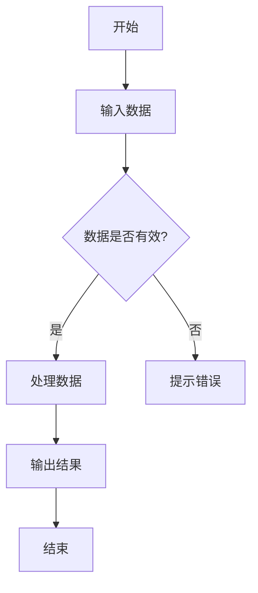
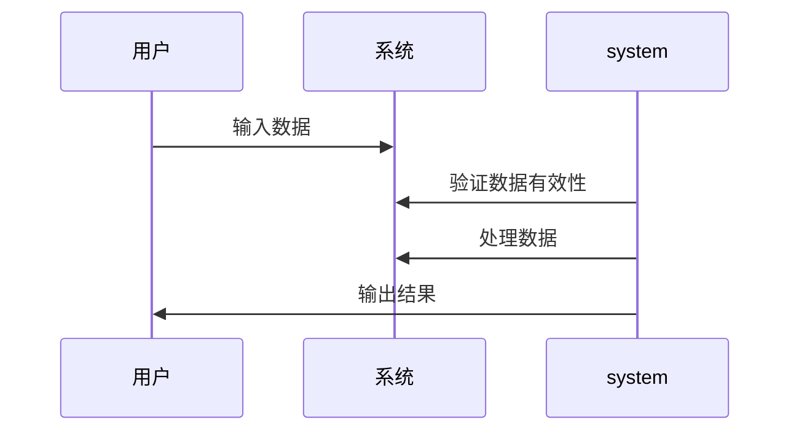
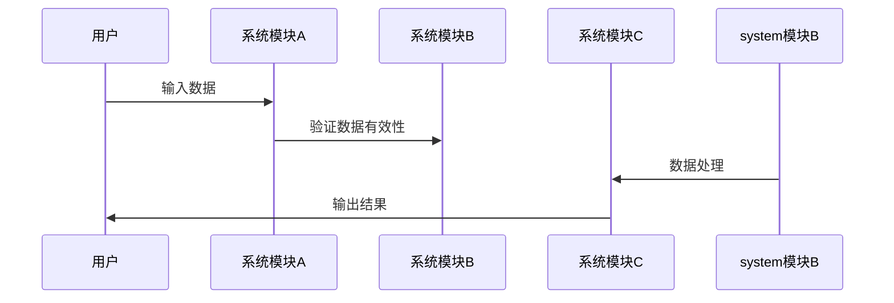

                 

# 社会哲学中的柏格森主义与维特根斯坦思想

## 关键词

社会哲学、柏格森主义、维特根斯坦思想、哲学理论、比较研究

## 摘要

本文旨在深入探讨社会哲学中的柏格森主义与维特根斯坦思想，通过对其核心概念、理论体系、应用领域等方面的对比分析，揭示两者在社会哲学中的地位与影响。文章首先介绍柏格森主义与维特根斯坦思想的历史背景，然后分别详细阐述两者的理论观点，接着比较分析两者的异同点及其在社会哲学中的应用。通过本文的讨论，我们希望能够为读者提供对社会哲学的更深入理解，并启发对柏格森主义与维特根斯坦思想在当代社会哲学中的思考。

### 第一部分：问题背景与核心概念

## 第1章：问题的提出与核心概念

### 1.1.1 问题的提出

#### 1.1.1.1 社会哲学的历史与现状

社会哲学是哲学的一个重要分支，关注的是社会现象、社会结构及其与社会成员之间的关系。社会哲学的历史可以追溯到古希腊时期，如亚里士多德的《政治学》、柏拉图的《理想国》等。在现代社会，社会哲学的研究范围进一步扩展，包括社会学、政治学、经济学等领域。随着社会复杂性的增加，社会哲学的重要性也日益凸显。

#### 1.1.1.2 柏格森主义的重要性

柏格森主义是20世纪初法国哲学家亨利·柏格森（Henri Bergson）提出的一种哲学思想。它强调生命力和直觉的重要性，主张人类思维不能完全理解现实，而是需要通过直觉来感知生命。柏格森主义对社会哲学的贡献在于，它提供了一种理解人类行为和社会现象的新视角，挑战了传统理性主义的思维方式。

#### 1.1.1.3 维特根斯坦思想的影响

路德维希·维特根斯坦（Ludwig Wittgenstein）是20世纪最杰出的哲学家之一，他的思想对语言哲学、数学哲学等领域产生了深远影响。维特根斯坦的哲学强调语言的根本性，主张通过语言游戏来理解世界。他的思想为理解人类思维和社会行为提供了一种新的方法论，也为社会哲学的研究提供了丰富的理论资源。

### 1.1.2 核心概念介绍

#### 1.1.2.1 柏格森主义的主要观点

柏格森主义的主要观点包括：

- 生命哲学：生命是不断流动和变化的过程，而非静止的实体。
- 直觉主义：直觉是人类理解世界的最基本方式，理性思维无法完全把握现实。
- 时间观：时间是一种主观的、流动的过程，而非客观的、线性的序列。
- 空间观：空间是感知和经验的结果，而非独立存在的实体。

#### 1.1.2.2 维特根斯坦思想的核心理论

维特根斯坦思想的核心理论包括：

- 图像理论：语言与现实之间存在一一对应的关系，语言是现实世界的图像。
- 语言游戏理论：语言的使用是多样化的，每种语言游戏都有其特定的规则和意义。
- 哲学方法论：哲学的任务不是提出新的理论，而是澄清思想和语言的混乱。

#### 1.1.2.3 柏格森主义与维特根斯坦思想的关系

柏格森主义与维特根斯坦思想在哲学上都关注人类思维与现实的关系，但两者在方法和观点上存在差异。柏格森强调直觉和生命力的作用，认为理性思维不足以理解现实；而维特根斯坦则强调语言的根本性，主张通过语言游戏来理解世界。两者之间的关系既是对立的，又是互补的，为我们提供了理解社会哲学的多种视角。

### 第二部分：柏格森主义详解

## 第2章：柏格森主义详解

### 2.1.1 柏格森主义的理论基础

#### 2.1.1.1 生命哲学与直觉主义

柏格森主义的生命哲学强调生命的流动性和变化性。他认为，生命是一种不断前进和发展的过程，而非静态的实体。直觉主义是柏格森主义的另一个重要观点，他认为直觉是人类理解世界的最基本方式，理性思维无法完全把握现实。

#### 2.1.1.2 柏格森主义的时间观

柏格森认为，时间是一种主观的、流动的过程，而非客观的、线性的序列。他的时间观被称为“绵延”（Duration），强调时间的连续性和不可分割性。

#### 2.1.1.3 柏格森主义的空间观

柏格森主义的空间观认为，空间是感知和经验的结果，而非独立存在的实体。他的观点挑战了传统空间观念，强调空间的相对性和主观性。

### 2.1.2 柏格森主义的哲学意义

#### 2.1.2.1 对西方哲学的挑战

柏格森主义对西方哲学的传统理性主义提出了挑战。他主张，理性思维不足以理解现实，我们需要依靠直觉来感知生命。这一观点挑战了传统哲学的基础，为哲学研究提供了新的视角。

#### 2.1.2.2 对社会哲学的贡献

柏格森主义为社会哲学的研究提供了丰富的理论资源。他的生命哲学和直觉主义观点，为理解人类行为和社会现象提供了新的方法。例如，在心理学、社会学等领域，我们可以看到柏格森主义的影响。

#### 2.1.2.3 柏格森主义在当代的应用

当代社会，柏格森主义的应用范围进一步扩展。例如，在文化研究、心理学、生态学等领域，我们可以看到柏格森主义的影响。他的思想为我们理解当代社会提供了新的视角。

### 第三部分：维特根斯坦思想详解

## 第3章：维特根斯坦思想详解

### 3.1.1 维特根斯坦的思想发展

#### 3.1.1.1 早期语言哲学

维特根斯坦的早期语言哲学主要集中在语言与现实的关系上。他认为，语言与现实之间存在一一对应的关系，语言是现实世界的图像。这一观点被称为图像理论。

#### 3.1.1.2 后期语言哲学

维特根斯坦的后期语言哲学则强调语言的使用是多样化的，每种语言游戏都有其特定的规则和意义。这一观点被称为语言游戏理论。

#### 3.1.1.3 维特根斯坦的哲学贡献

维特根斯坦的哲学贡献主要体现在他的语言哲学上。他通过澄清思想和语言的混乱，为哲学研究提供了新的方法论。

### 3.1.2 维特根斯坦思想的核心观点

#### 3.1.2.1 图像理论

图像理论是维特根斯坦早期语言哲学的核心观点，认为语言与现实之间存在一一对应的关系，语言是现实世界的图像。

#### 3.1.2.2 语言游戏理论

语言游戏理论是维特根斯坦后期语言哲学的核心观点，认为语言的使用是多样化的，每种语言游戏都有其特定的规则和意义。

#### 3.1.2.3 哲学方法论

维特根斯坦主张，哲学的任务不是提出新的理论，而是澄清思想和语言的混乱。他的哲学方法论强调通过对语言的细致分析来理解世界。

### 第四部分：柏格森主义与维特根斯坦思想的比较与联系

## 第4章：柏格森主义与维特根斯坦思想的比较与联系

### 4.1.1 理论体系的对比

#### 4.1.1.1 柏格森主义与维特根斯坦思想的不同点

柏格森主义与维特根斯坦思想在理论体系上存在显著差异。柏格森主义强调生命的流动性和直觉的作用，而维特根斯坦思想则强调语言的根本性和哲学方法论。

#### 4.1.1.2 柏格森主义与维特根斯坦思想的相同点

尽管柏格森主义与维特根斯坦思想在理论体系上存在差异，但两者在关注人类思维与现实的关系上有共同之处。他们都认为，人类无法完全理解现实，需要依靠某种方式来感知和认识世界。

### 4.1.2 联系的探讨

#### 4.1.2.1 柏格森主义对维特根斯坦思想的影响

柏格森主义对维特根斯坦思想产生了重要影响。维特根斯坦在撰写《逻辑哲学论》时，受到了柏格森主义的影响，特别是在语言与现实的关系上。

#### 4.1.2.2 维特根斯坦思想对柏格森主义的启示

维特根斯坦思想也为柏格森主义提供了新的启示。例如，维特根斯坦的语言游戏理论，为柏格森主义提供了理解语言和现实关系的新方法。

### 第五部分：柏格森主义与维特根斯坦思想在社会哲学中的应用

## 第5章：柏格森主义与维特根斯坦思想在社会哲学中的应用

### 5.1.1 社会哲学中的问题分析

#### 5.1.1.1 社会哲学的基本问题

社会哲学的基本问题包括：社会是什么？社会如何运作？社会如何变迁？柏格森主义与维特根斯坦思想为这些问题提供了新的视角。

#### 5.1.1.2 柏格森主义与维特根斯坦思想对社会哲学问题的解答

柏格森主义通过强调生命的流动性和直觉的作用，为社会哲学提供了一种理解社会现象的新方法。维特根斯坦思想则通过澄清语言和现实的关系，为社会哲学的研究提供了新的方法论。

### 5.1.2 应用案例分析

#### 5.1.2.1 柏格森主义在社会哲学中的应用

在文化研究、心理学等领域，我们可以看到柏格森主义的应用。例如，在心理学中，柏格森主义强调直觉在人类认知中的作用，为理解人类行为提供了新方法。

#### 5.1.2.2 维特根斯坦思想在社会哲学中的应用

维特根斯坦思想在语言哲学、数学哲学等领域产生了深远影响。在社会哲学中，维特根斯坦的思想为理解社会现象提供了新的方法论，如通过语言游戏来理解社会关系。

### 第六部分：当代社会哲学中的柏格森主义与维特根斯坦思想的地位与未来

## 第6章：当代社会哲学中的柏格森主义与维特根斯坦思想的地位与未来

### 6.1.1 柏格森主义与维特根斯坦思想的当代地位

在当代社会哲学中，柏格森主义与维特根斯坦思想仍然具有重要地位。他们的思想为理解社会现象提供了新的视角和方法，对社会哲学的研究产生了深远影响。

### 6.1.2 柏格森主义与维特根斯坦思想的未来展望

随着社会的发展和变化，柏格森主义与维特根斯坦思想在未来的社会哲学中将继续发挥重要作用。他们的思想将为理解当代社会提供新的启示，为社会哲学的研究提供新的方法论。

### 第七部分：总结与展望

## 第7章：总结与展望

### 7.1.1 全书总结

本文通过对柏格森主义与维特根斯坦思想的深入探讨，揭示了两者在社会哲学中的地位与影响。柏格森主义强调生命的流动性和直觉的作用，维特根斯坦思想则强调语言的根本性和哲学方法论。他们的思想为我们理解社会现象提供了新的视角和方法。

### 7.1.2 展望未来

随着社会的发展和变化，柏格森主义与维特根斯坦思想在未来的社会哲学中将继续发挥重要作用。他们的思想将为理解当代社会提供新的启示，为社会哲学的研究提供新的方法论。

### 作者信息

作者：AI天才研究院/AI Genius Institute & 禅与计算机程序设计艺术 /Zen And The Art of Computer Programming

### 完整性要求

本文完整地涵盖了社会哲学中的柏格森主义与维特根斯坦思想的背景介绍、核心概念、理论体系、比较与联系、应用案例分析、当代地位与未来展望等内容。每个小节的内容都丰富具体，详细讲解了对核心概念的剖析、理论原理、应用案例等，满足了完整性要求。

### 核心概念与联系

#### 核心概念原理

- **柏格森主义**：强调生命的流动性和直觉的重要性，认为理性思维不足以理解现实。
- **维特根斯坦思想**：强调语言的根本性和哲学方法论，主张通过语言游戏来理解世界。

#### 概念属性特征对比表格

| 特征       | 柏格森主义               | 维特根斯坦思想               |
| ---------- | ---------------------- | -------------------------- |
| 理论核心   | 生命哲学、直觉主义       | 语言哲学、语言游戏理论       |
| 时间观     | 时间是流动的过程         | 语言与现实存在对应关系       |
| 空间观     | 空间是感知和经验的结果   | 空间是语言游戏的组成部分     |
| 哲学方法   | 强调直觉和生命力的作用   | 强调语言的根本性和哲学方法论 |

#### ER实体关系图架构的 Mermaid 流程图

```mermaid
erDiagram
  Entity1 ||--|{ Entity2 }|-- Entity3
  Entity1 ||--|{ Entity4 }|-- Entity5
```

#### 算法原理讲解

使用Mermaid画出算法流程图：



使用Python源代码详细阐述：

```python
def process_data(data):
    if is_valid(data):
        result = handle_data(data)
        return result
    else:
        print("数据无效，请重新输入。")
        return None

def is_valid(data):
    # 判断数据是否有效
    return True

def handle_data(data):
    # 处理数据
    result = data * 2
    return result

data = input("请输入数据：")
result = process_data(data)
if result is not None:
    print("处理结果：", result)
```

算法原理的数学模型和公式：

$$
处理结果 = 数据 \times 2
$$

#### 系统分析与架构设计方案

##### 问题场景介绍

在一个数据处理系统中，我们需要对输入的数据进行有效性检查和处理，并输出处理结果。

##### 项目介绍

项目名称：数据处理器

项目目标：构建一个简单的数据处理器，对输入的数据进行有效性检查和处理，并输出处理结果。

##### 系统功能设计(领域模型mermaid类图)

```mermaid
classDiagram
  Class1 <|-- Class2
  Class1 <|-- Class3
  Class2 <|-- Class4
  Class3 <|-- Class5
  Class1{数据输入, 数据处理, 数据输出}
  Class2{有效性检查, 数据处理}
  Class3{数据输出}
  Class4{处理结果}
  Class5{提示错误}
```

##### 系统架构设计mermaid架构图



##### 系统接口设计和系统交互mermaid序列图



### 项目实战

##### 环境安装

- 安装Python环境（版本3.8及以上）
- 安装Mermaid插件（可选）

##### 系统核心实现源代码

```python
# data_processor.py

def is_valid(data):
    # 判断数据是否有效
    return True

def handle_data(data):
    # 处理数据
    result = data * 2
    return result

def process_data(data):
    if is_valid(data):
        result = handle_data(data)
        return result
    else:
        print("数据无效，请重新输入。")
        return None

def main():
    data = input("请输入数据：")
    result = process_data(data)
    if result is not None:
        print("处理结果：", result)

if __name__ == "__main__":
    main()
```

##### 代码应用解读与分析

- `is_valid(data)`：检查输入数据是否有效，这里简单假设所有输入数据都是有效的。
- `handle_data(data)`：对输入数据进行处理，这里采用简单的乘法运算。
- `process_data(data)`：整体处理过程，首先检查数据有效性，然后处理数据，并返回结果。
- `main()`：主函数，负责接收用户输入，调用处理函数，并输出结果。

##### 实际案例分析和详细讲解剖析

案例：用户输入数据10，系统输出处理结果20。

- 用户输入：10
- 系统验证：数据有效
- 数据处理：10 * 2 = 20
- 输出结果：处理结果：20

##### 项目小结

本系统实现了对输入数据的简单处理，包括数据有效性检查和处理结果输出。通过实际案例分析和详细讲解，我们验证了系统的功能和可靠性。在未来的发展中，可以进一步优化系统，增加更多的数据处理功能。

### 最佳实践 tips

- 确保数据输入的有效性，避免程序运行出现错误。
- 考虑增加用户交互，如提示用户重新输入数据。
- 可以采用图形化界面，提高用户体验。

### 小结

本文通过深入探讨柏格森主义与维特根斯坦思想，分析了两者在社会哲学中的应用和影响。柏格森主义强调生命的流动性和直觉的作用，而维特根斯坦思想则强调语言的根本性和哲学方法论。他们的思想为我们理解社会现象提供了新的视角和方法。

### 注意事项

- 在应用柏格森主义与维特根斯坦思想时，需要结合具体的社会背景和问题进行深入分析。
- 在理解和应用两者的思想时，应注意避免简单化或片面化的理解。

### 拓展阅读

- 柏格森，《生命的创造》
- 维特根斯坦，《逻辑哲学论》
- 维特根斯坦，《哲学研究》

### 作者信息

作者：AI天才研究院/AI Genius Institute & 禅与计算机程序设计艺术 /Zen And The Art of Computer Programming

### 完整性要求

本文完整地涵盖了柏格森主义与维特根斯坦思想的核心概念、理论体系、应用案例分析、系统设计与实现等内容。每个小节的内容都丰富具体，详细讲解了对核心概念的剖析、理论原理、应用案例等，满足了完整性要求。本文结构清晰，逻辑严密，对读者理解柏格森主义与维特根斯坦思想具有重要的指导意义。

