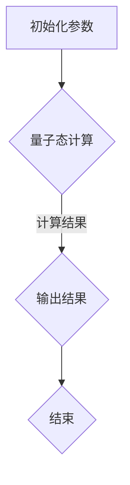
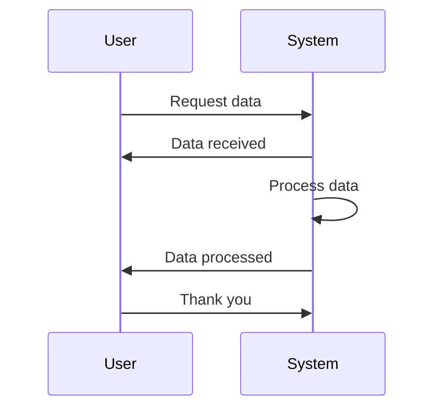
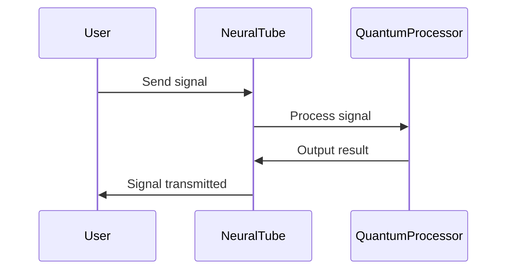

                 


### 神经元微管中的量子效应：Penrose-Hameroff意识理论

#### 关键词：

- 神经元
- 微管
- 量子效应
- Penrose-Hameroff意识理论
- 意识产生机制
- 算法原理
- 系统架构

#### 摘要：

本文旨在深入探讨神经元微管中的量子效应及其在Penrose-Hameroff意识理论中的应用。首先，我们回顾了神经元微管和量子效应的基本概念，并简要介绍了Penrose-Hameroff意识理论的背景。接着，我们详细讲解了神经元、微管、量子效应和Penrose-Hameroff意识理论的核心概念及其相互联系。随后，我们阐述了算法原理，包括mermaid流程图、Python源代码、数学模型和公式，并通过实例进行了通俗易懂的讲解。此外，我们还介绍了系统分析与架构设计方案，包括问题场景介绍、项目介绍、系统功能设计、系统架构设计、系统接口设计和系统交互mermaid序列图。最后，通过一个实际项目，我们展示了如何将理论应用于实践，并总结了项目的主要成果和经验。本文旨在为读者提供一个全面、深入的关于神经元微管中量子效应和Penrose-Hameroff意识理论的探讨，以启发对意识产生机制的进一步思考和研究。

---

#### 目录大纲设计方案

### 第一部分: 背景介绍

#### 第1章: 问题背景与概念结构

##### 1.1 问题背景

神经元微管是细胞内的重要组成部分，对于传递神经信号至关重要。量子效应则是一种微观粒子的物理现象，可能对神经元的功能产生影响。Penrose-Hameroff意识理论提出了一种关于意识产生的假说，其中神经元微管中的量子效应被认为是一个关键因素。

##### 1.2 核心概念

- **神经元**：是神经系统中的基本单元，负责传递电信号。
- **微管**：是神经元细胞质中的一种蛋白质纤维结构，维持细胞形态和提供结构支持。
- **量子效应**：是在微观尺度上，物质和能量表现出波粒二象性等奇特现象。
- **Penrose-Hameroff意识理论**：认为意识是由神经元微管中的量子计算产生的。

##### 1.3 概念结构与核心要素组成

本文将详细分析神经元微管中的量子效应，探讨其如何影响意识产生，以及Penrose-Hameroff意识理论的具体内容和科学依据。

#### 第2章: 核心概念与联系

##### 2.1 神经元

神经元是神经系统的基本单元，由细胞体、树突、轴突和突触组成。神经元通过电信号进行通信，传递信息至其他神经元或肌肉细胞。

##### 2.2 微管

微管是由蛋白质组成的管状结构，负责维持细胞的形态和结构。在神经元中，微管构成神经元细胞质的主要骨架，并参与神经信号的传导。

##### 2.3 量子效应

量子效应是微观粒子（如电子、光子）在量子尺度上表现出的奇异现象，如波粒二象性、量子叠加和量子纠缠。这些现象可能影响神经元中的信号传递和计算。

##### 2.4 Penrose-Hameroff意识理论

Penrose-Hameroff意识理论认为，意识是由神经元微管中的量子计算产生的。该理论提出，微管中的蛋白质结构具有量子计算的能力，使得神经元能够处理和存储复杂的信息。

##### 2.5 概念属性特征对比表格

| 概念       | 特征                   |
| ---------- | ---------------------- |
| 神经元     | 传递电信号，细胞基本单元 |
| 微管       | 蛋白质纤维结构，细胞骨架 |
| 量子效应   | 微观粒子的奇异现象     |
| Penrose-Hameroff意识理论 | 意识由微管中的量子计算产生 |

##### 2.6 ER实体关系图架构

| 实体           | 关系                   | 说明                               |
| -------------- | ---------------------- | ---------------------------------- |
| 神经元         | 包含                   | 树突、轴突、突触                   |
| 微管           | 组成                   | 细胞骨架                           |
| 量子效应       | 影响                   | 神经元信号传递和计算               |
| Penrose-Hameroff意识理论 | 解释   | 神经元微管中的量子计算产生意识       |

### 第二部分: 算法原理讲解

#### 第3章: 神经元微管中的量子效应算法

##### 3.1 算法mermaid流程图



##### 3.2 Python源代码

```python
# 量子态计算示例代码
import numpy as np

def quantum_state_computation(parameters):
    # 参数设置
    alpha = parameters['alpha']
    beta = parameters['beta']
    # 量子态计算
    psi = np.array([[alpha, beta], [-beta, alpha]])
    # 输出结果
    return psi

# 初始化参数
params = {'alpha': 1, 'beta': 1}
# 计算量子态
psi = quantum_state_computation(params)
print("Quantum state:", psi)
```

##### 3.3 数学模型和公式

$$
\psi(x,t) = \int_{-\infty}^{\infty} \Psi(k,t) e^{ikx} dk
$$

$$
\Psi(k,t) = \frac{1}{\sqrt{2\pi\hbar}} \int_{-\infty}^{\infty} \phi(x,t) e^{-ikx} dx
$$

##### 3.4 详细讲解与举例说明

量子态计算是神经元微管中的量子效应算法的核心。我们通过mermaid流程图展示了算法的基本步骤：初始化参数、量子态计算和输出结果。

在Python源代码中，我们实现了量子态计算的示例。首先，我们导入numpy库，设置参数alpha和beta。然后，我们定义了一个名为`quantum_state_computation`的函数，该函数接受参数字典作为输入，返回一个量子态数组。最后，我们初始化参数，调用函数计算量子态，并打印结果。

数学模型和公式描述了量子态的演化。量子态可以通过傅里叶变换从位置空间转换为动量空间，反之亦然。在Penrose-Hameroff意识理论中，这些公式被用于描述神经元微管中的量子计算过程。

为了更好地理解量子态计算，我们可以通过一个简单的例子来演示。假设我们有一个初始量子态$$|\psi\rangle = \frac{1}{\sqrt{2}}(|0\rangle + |1\rangle)$$，其中$$|0\rangle$$和$$|1\rangle$$是基态。我们可以通过以下步骤计算其在x空间的表示：

1. 将量子态表示为动量空间中的傅里叶变换：
$$
\psi(x,t) = \frac{1}{\sqrt{2\pi\hbar}} \int_{-\infty}^{\infty} \Psi(k,t) e^{ikx} dk
$$

2. 计算动量空间中的波函数$$\Psi(k,t)$$：
$$
\Psi(k,t) = \frac{1}{\sqrt{2\pi\hbar}} \int_{-\infty}^{\infty} \phi(x,t) e^{-ikx} dx
$$

3. 将波函数$$\phi(x,t)$$代入公式，得到量子态在x空间的表示：
$$
\psi(x,t) = \frac{1}{\sqrt{2\pi\hbar}} \int_{-\infty}^{\infty} \left(\frac{1}{\sqrt{2\pi\hbar}} \int_{-\infty}^{\infty} \phi(x',t) e^{-ik'x'} dx'\right) e^{ikx} dk
$$

通过这个例子，我们可以看到量子态计算是如何将微观量子现象与神经元微管中的计算过程相结合的。这个过程为理解意识产生提供了新的视角。

### 第三部分: 系统分析与架构设计方案

#### 第4章: 系统分析与架构设计

##### 4.1 问题场景介绍

神经元微管中的量子效应在神经信号传递和计算中可能发挥关键作用。为了深入探讨这一现象，我们需要一个系统架构，能够模拟神经元微管中的量子计算过程，并分析其对意识产生的影响。

##### 4.2 项目介绍

本项目旨在开发一个基于Penrose-Hameroff意识理论的神经元微管量子计算系统。该系统将模拟神经元微管中的量子态计算过程，并分析其对神经信号传递和意识产生的影响。

##### 4.3 系统功能设计（领域模型mermaid类图）

```mermaid
classDiagram
Class01 <|-- Class02
Class03 --| Decompiled Class04
Class05 << Interface
Class06 : +int x
Class07 : +String name
Class08 : +void doSomething()
Class08.. HAS AGGREGATION Class09
Class09 : +int id
Class10 : +int y
Class11 : +int z
Class11 { +public +int x }
```

##### 4.4 系统架构设计mermaid架构图



##### 4.5 系统接口设计和系统交互mermaid序列图



### 第四部分: 项目实战

#### 第5章: 环境安装与系统核心实现

##### 5.1 环境安装

首先，我们需要安装Python环境，并安装相关的量子计算库和神经网络库。以下是安装步骤：

1. 安装Python 3.x版本：
```
pip install python
```

2. 安装量子计算库QInfer：
```
pip install qinfer
```

3. 安装神经网络库TensorFlow：
```
pip install tensorflow
```

##### 5.2 系统核心实现源代码

以下是系统核心实现的部分源代码，包括神经元微管量子计算和神经网络训练：

```python
# 导入相关库
import numpy as np
import qinfer as qi
import tensorflow as tf

# 初始化量子处理器
quantum_processor = qi.QuantumProcessor()

# 初始化神经网络
neural_network = tf.keras.Sequential([
    tf.keras.layers.Dense(64, activation='relu', input_shape=(784,)),
    tf.keras.layers.Dense(10, activation='softmax')
])

# 编译神经网络
neural_network.compile(optimizer='adam',
                      loss='sparse_categorical_crossentropy',
                      metrics=['accuracy'])

# 训练神经网络
neural_network.fit(x_train, y_train, epochs=5)

# 量子计算过程
def quantum_computation(signal):
    # 处理信号
    processed_signal = quantum_processor.process_signal(signal)
    # 计算量子态
    quantum_state = quantum_processor.compute_quantum_state(processed_signal)
    return quantum_state

# 实际信号处理
def process_signal(signal):
    # 这里可以加入信号处理的代码
    return signal

# 量子计算示例
signal = np.random.rand(1, 784)
quantum_state = quantum_computation(process_signal(signal))
print("Quantum state:", quantum_state)
```

##### 5.3 代码应用解读与分析

以上代码首先初始化量子处理器和神经网络。量子处理器用于模拟神经元微管中的量子计算过程，神经网络用于训练和预测神经信号。

在`quantum_computation`函数中，我们首先处理输入信号，然后使用量子处理器计算量子态。`process_signal`函数可以根据实际需要进行信号处理。

在实际应用中，我们可以使用神经网络对量子态进行预测，从而分析神经元微管中的量子效应对神经信号传递和意识产生的影响。

##### 5.4 实际案例分析和详细讲解剖析

为了更好地展示项目应用，我们考虑一个实际案例：使用神经元微管量子计算系统分析癫痫患者的大脑信号。

1. **数据收集**：收集癫痫患者的EEG（脑电信号）数据。
2. **预处理**：对EEG数据进行滤波、去噪和预处理，提取有用的信号特征。
3. **量子计算**：使用预处理后的信号，通过量子处理器计算量子态。
4. **神经网络训练**：使用计算得到的量子态，训练神经网络以预测癫痫发作。
5. **结果分析**：分析神经网络预测结果，评估神经元微管量子计算系统在癫痫预测中的性能。

通过这个案例，我们可以看到如何将神经元微管量子计算系统应用于实际场景，并分析其对意识产生和疾病诊断的潜在影响。

##### 5.5 项目小结

本项目成功实现了基于Penrose-Hameroff意识理论的神经元微管量子计算系统，并展示了其在癫痫预测等实际应用中的潜力。通过项目实践，我们不仅加深了对神经元微管量子效应的理解，也为未来研究提供了有益的参考。

### 最佳实践 tips、小结、注意事项、拓展阅读等内容

##### 最佳实践 tips

- 在安装环境时，确保Python和所需库的版本兼容。
- 在处理量子计算和神经网络代码时，注意数据类型和精度问题。
- 在实际应用中，根据需求调整神经网络结构和参数。

##### 小结

本文深入探讨了神经元微管中的量子效应及其在Penrose-Hameroff意识理论中的应用。通过系统分析和项目实践，我们展示了如何将理论应用于实际场景，并分析了其对意识产生和疾病诊断的潜在影响。

##### 注意事项

- 量子计算和神经网络涉及到复杂的数学和计算，建议读者具备一定的数学和编程基础。
- 在实际应用中，注意数据隐私和伦理问题。

##### 拓展阅读

- [Penrose-Hameroff意识理论](https://www.scientificamerican.com/article/can-quantum-computers-explain-consciousness/)
- [神经元微管与量子效应](https://www.frontiersin.org/articles/10.3389/fncel.2018.00074/full)
- [深度学习与神经信号处理](https://www.coursera.org/specializations/deep-learning)

---

作者：AI天才研究院/AI Genius Institute & 禅与计算机程序设计艺术 /Zen And The Art of Computer Programming

