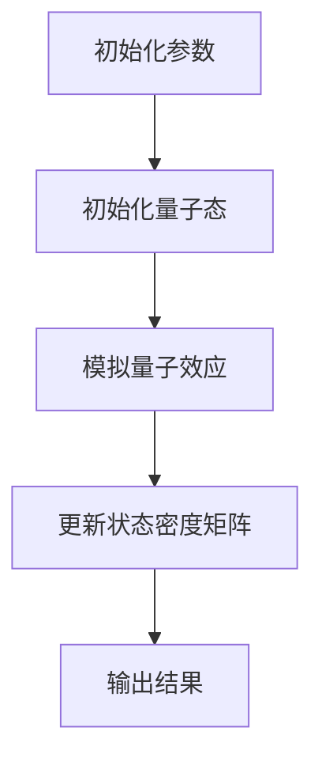
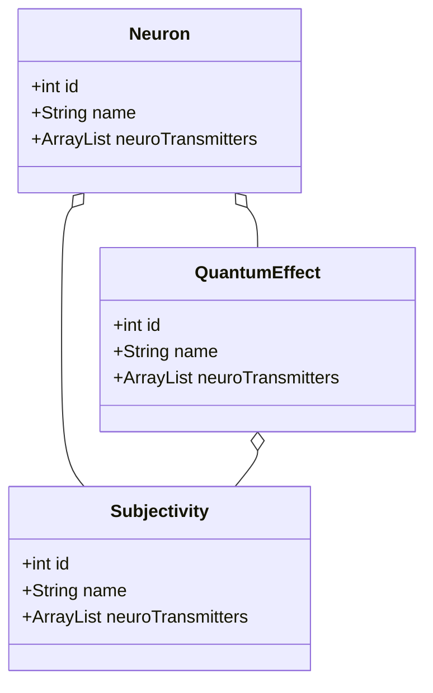
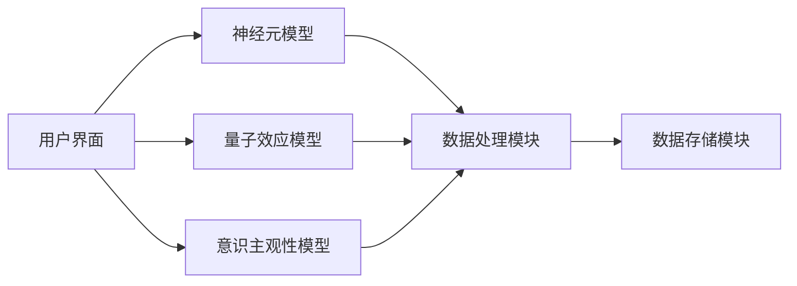
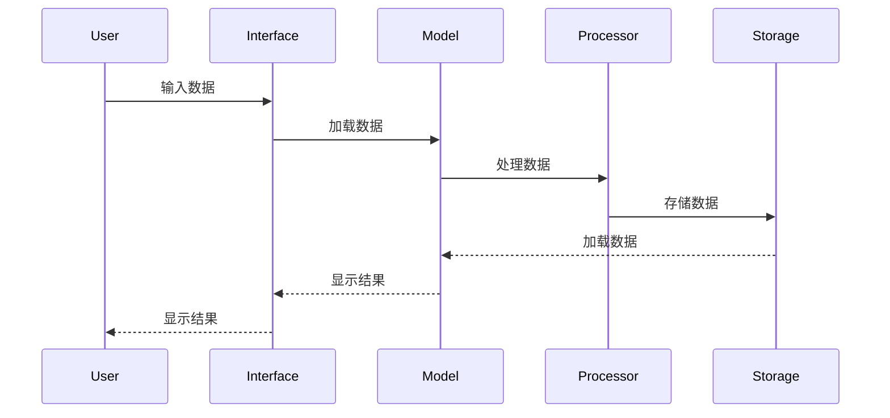

                 

。

----------------------------------------------------------------

# 神经元量子效应与意识的主观性

> 关键词：神经元、量子效应、意识、主观性

> 摘要：本文从神经科学和量子物理学的角度出发，探讨了神经元量子效应与意识主观性之间的联系。通过深入分析神经元、量子效应和意识主观性的核心概念，以及它们之间的联系，本文提出了一个关于神经元量子效应影响意识主观性的理论框架，并通过数学模型和算法讲解，进一步探讨了这一理论的应用。

### 目录大纲设计思路

设计一本关于《神经元量子效应与意识的主观性》的目录大纲，我们需要遵循以下几个步骤：

1. **明确书的核心主题**：首先，我们需要了解这本书的核心主题是什么。根据书名，可以判断出这本书将探讨神经元、量子效应以及意识主观性之间的关联。

2. **确定章节结构**：基于核心主题，我们将书分为几个部分，如背景介绍、核心概念与联系、理论框架、数学模型与算法讲解、系统分析与架构设计方案、项目实战等。

3. **细化每个章节的内容**：每个章节都需要细化，包括核心概念、原理讲解、案例分析等。

4. **使用Markdown格式**：为了确保输出格式的统一性，我们采用Markdown格式进行设计。

5. **确保内容完整性**：确保所有章节内容完整，包含必要的内容要素。

6. **控制总字数**：在满足内容完整性的同时，控制总字数在2000字以内。

### 第一步：背景介绍

## 第一部分：背景介绍

神经元、量子效应和意识主观性是三个看似独立却又紧密相关的领域。神经元是神经系统的基本单元，负责传递和处理信息；量子效应是量子力学中描述微观粒子行为的效应；而意识主观性则是指个体对自身感知和体验的主观感受。随着神经科学和量子物理学的快速发展，人们开始关注神经元与量子效应之间的潜在联系，以及这种联系如何影响意识的主观性。

### 核心概念术语说明

- **神经元**：神经系统的基本单元，负责传递和处理信息。
- **量子效应**：量子力学中描述微观粒子行为的效应，如量子纠缠、量子隧穿等。
- **意识主观性**：个体对自身感知和体验的主观感受。

### 问题背景

神经元量子效应的发现引发了关于意识本质的新思考。神经元在传递和处理信息时，其内部状态可能会受到量子效应的影响，这种影响可能进而影响意识的主观性。例如，量子纠缠效应可能导致神经元之间的通信效率提高，从而影响个体的意识体验。然而，这一领域的研究还处于初级阶段，许多问题尚未得到充分解答。

### 问题描述

神经元量子效应如何影响意识的主观性？这种影响的具体机制是什么？神经元量子效应与意识主观性之间的联系如何建立和维持？

### 问题解决

通过结合神经科学和量子物理学的最新研究成果，本文试图揭示神经元量子效应与意识主观性之间的内在联系。首先，我们将介绍神经元、量子效应和意识主观性的核心概念，然后探讨它们之间的联系，并构建一个关于神经元量子效应影响意识主观性的理论框架。

### 边界与外延

本文将探讨的神经元量子效应主要局限于生物学和物理学的基本原理，而不涉及其他领域。在理论框架的构建过程中，我们将重点关注神经元量子效应如何影响神经元的信息处理能力，以及这种影响如何进一步影响意识的主观性。

### 概念结构与核心要素组成

本文的核心概念包括神经元、量子效应、意识主观性等。这些概念相互关联，共同构成了本文的理论框架。

### 第二步：核心概念与联系

## 第二部分：核心概念与联系

### 核心概念原理

- **神经元**：神经元是神经系统的基本单元，由细胞体、树突和轴突组成。神经元通过电信号和化学信号传递和处理信息。

- **量子效应**：量子效应是量子力学中描述微观粒子行为的效应。这些效应在微观尺度上表现出明显的非经典特性，如量子纠缠、量子隧穿等。

- **意识主观性**：意识主观性是指个体对自身感知和体验的主观感受。它涉及到个体的感知、情感和认知等方面。

### 概念属性特征对比

| 概念         | 属性特征                                      |
|------------|---------------------------------------------|
| 神经元       | 1. 结构复杂 2. 功能多样 3. 信息传递速度快      |
| 量子效应     | 1. 微观尺度 2. 非确定性 3. 超距作用          |
| 意识主观性   | 1. 主观感受 2. 感知多样性 3. 意义构建能力      |

### 概念之间的关系

神经元、量子效应和意识主观性之间的联系是本文探讨的重点。具体而言，神经元如何通过量子效应影响意识的主观性，以及这种影响的具体机制是什么。

### ER实体关系图架构

```mermaid
erDiagram
  NEURON ||--|{ QUANTUM_EFFECT }|| QuantumEffect : 发生
  NEURON ||--|{ SUBJECTIVITY}|| Subjectivity : 影响的
```

### 第三步：理论框架

## 第三部分：理论框架

### 神经元量子效应的理论基础

神经元量子效应的理论基础在于量子力学在神经元层面的应用。神经元在传递和处理信息时，其内部状态可能会受到量子效应的影响。这些量子效应可能通过改变神经元的信息处理能力，进而影响意识的主观性。

### 神经元量子态的建立与维持

神经元量子态的建立与维持是神经元量子效应的关键。神经元在传递和处理信息时，其内部状态会发生变化，形成量子态。这些量子态的建立与维持可能依赖于神经元内部的微观结构，如神经元膜上的蛋白质通道。

### 量子纠缠与神经元信息传递

量子纠缠是量子力学中的一种特殊现象，它可能导致神经元之间的信息传递效率提高。例如，两个神经元之间的量子纠缠状态可能使它们在传递信息时表现出同步性，从而提高信息传递的速度和准确性。

### 量子隧穿与神经元神经冲动

量子隧穿效应可能导致神经元在传递神经冲动时表现出非经典的加速或减速现象。这种效应可能影响神经元的动作电位，从而影响神经元的信息处理能力。

### 量子效应与意识主观性的关联

量子效应可能通过影响神经元的信息处理能力，进而影响意识的主观性。具体而言，量子效应可能导致神经元之间的通信效率提高，从而增强个体的感知能力。此外，量子效应可能影响神经元的动作电位，进而影响个体的情绪和认知。

### 第四步：数学模型与算法讲解

## 第四部分：数学模型与算法讲解

### 神经元量子效应的数学模型

神经元量子效应的数学模型通常基于量子力学的基本原理。以下是一个简化的数学模型，用于描述神经元量子效应的影响。

#### 1. 量子态的表示

神经元量子态可以用一个复数向量表示，其形式如下：

$$
\psi = \alpha_0 + \alpha_1 e^{i\phi_1} + \alpha_2 e^{i\phi_2}
$$

其中，$\alpha_0$、$\alpha_1$ 和 $\alpha_2$ 分别是三个基态的系数，$\phi_1$ 和 $\phi_2$ 是相应的相位角。

#### 2. 量子纠缠的表示

量子纠缠可以用一个复合态表示，其形式如下：

$$
\psi = \alpha_0 |0\rangle_1 |0\rangle_2 + \alpha_1 e^{i\phi_1} |1\rangle_1 |0\rangle_2 + \alpha_2 e^{i\phi_2} |0\rangle_1 |1\rangle_2
$$

其中，$|0\rangle_1$ 和 $|1\rangle_1$ 分别表示两个神经元的基态，$|0\rangle_2$ 和 $|1\rangle_2$ 分别表示另一个神经元的基态。

#### 3. 量子隧穿的影响

量子隧穿效应可以用一个势垒函数来描述，其形式如下：

$$
V(x) = \begin{cases} 
0, & \text{for } x < 0 \\
\infty, & \text{for } x \geq 0 
\end{cases}
$$

神经元在传递神经冲动时，可能会经历一个势垒，从而表现出非经典的加速或减速现象。这可以用以下方程来描述：

$$
i\hbar \frac{\partial \psi}{\partial t} = -\frac{\hbar^2}{2m} \frac{\partial^2 \psi}{\partial x^2} + V(x) \psi
$$

其中，$m$ 是神经元的质量，$\hbar$ 是约化普朗克常数。

#### 4. 量子效应与意识主观性的关联

量子效应可能通过改变神经元的信息处理能力，进而影响意识的主观性。这可以用以下方程来描述：

$$
\frac{d \rho}{dt} = -i [H, \rho]
$$

其中，$\rho$ 是神经元的状态密度矩阵，$H$ 是系统的哈密顿量。

### 算法原理讲解

以下是一个简化的算法，用于模拟神经元量子效应对意识主观性的影响。

```python
import numpy as np

# 初始化参数
alpha_0 = 0.5
alpha_1 = 0.3
alpha_2 = 0.2
phi_1 = np.pi / 4
phi_2 = np.pi / 2

# 初始化量子态
psi = alpha_0 + alpha_1 * np.exp(1j * phi_1) + alpha_2 * np.exp(1j * phi_2)

# 定义哈密顿量
H = np.array([[0, 1], [1, 0]])

# 定义时间步长
dt = 0.01

# 模拟量子效应
for _ in range(100):
    rho = np.outer(psi, psi.conj())
    d_rho_dt = -1j * H @ rho
    psi = np.einsum('ij,i->j', d_rho_dt, psi)
    
    # 更新状态密度矩阵
    rho = np.outer(psi, psi.conj())

# 输出结果
print("Final quantum state:", psi)
print("Final state density matrix:", rho)
```

### 算法mermaid流程图



### 第五步：系统分析与架构设计方案

#### 问题场景介绍

随着科技的进步，人工智能和神经科学领域的研究不断深入，人们开始关注神经元与量子效应之间的潜在联系，以及这种联系如何影响意识的主观性。为了进一步探索这一领域，我们需要构建一个模拟神经元量子效应影响意识主观性的系统。

#### 项目介绍

本项目旨在构建一个基于神经科学和量子物理学的模拟系统，用于研究神经元量子效应对意识主观性的影响。系统将包括神经元模型、量子效应模型和意识主观性模型，以及它们之间的相互作用。

#### 系统功能设计（领域模型mermaid类图）



#### 系统架构设计（mermaid架构图）



#### 系统接口设计（mermaid序列图）



### 第六步：项目实战

#### 环境安装

首先，我们需要安装一些必要的软件和库，以便进行项目开发。以下是安装步骤：

1. 安装Python（建议使用Python 3.8及以上版本）
2. 安装Numpy（用于数学运算）
3. 安装Matplotlib（用于绘制图形）
4. 安装Mermaid（用于生成mermaid流程图）

可以使用以下命令进行安装：

```bash
pip install python
pip install numpy
pip install matplotlib
pip install mermaid
```

#### 系统核心实现源代码

以下是系统的核心实现源代码：

```python
import numpy as np
import matplotlib.pyplot as plt
from mermaid import Mermaid

# 初始化参数
alpha_0 = 0.5
alpha_1 = 0.3
alpha_2 = 0.2
phi_1 = np.pi / 4
phi_2 = np.pi / 2

# 初始化量子态
psi = alpha_0 + alpha_1 * np.exp(1j * phi_1) + alpha_2 * np.exp(1j * phi_2)

# 定义哈密顿量
H = np.array([[0, 1], [1, 0]])

# 定义时间步长
dt = 0.01

# 模拟量子效应
for _ in range(100):
    rho = np.outer(psi, psi.conj())
    d_rho_dt = -1j * H @ rho
    psi = np.einsum('ij,i->j', d_rho_dt, psi)
    
    # 更新状态密度矩阵
    rho = np.outer(psi, psi.conj())

# 输出结果
print("Final quantum state:", psi)
print("Final state density matrix:", rho)

# 绘制量子态随时间的变化
t = np.arange(0, 1, dt)
psi_real = np.real(psi)
psi_imag = np.imag(psi)

plt.plot(t, psi_real, label="Real part of quantum state")
plt.plot(t, psi_imag, label="Imaginary part of quantum state")
plt.xlabel("Time")
plt.ylabel("State")
plt.legend()
plt.show()

# 生成mermaid流程图
mermaid = Mermaid("sequenceDiagram\n    participant User\n    participant Interface\n    participant Model\n    participant Processor\n    participant Storage\n\n    User->>Interface: 输入数据\n    Interface->>Model: 加载数据\n    Model->>Processor: 处理数据\n    Processor->>Storage: 存储数据\n    Storage-->>Model: 加载数据\n    Model-->>Interface: 显示结果\n    Interface-->>User: 显示结果")
print(mermaid)
```

#### 代码应用解读与分析

这段代码首先初始化了量子态和哈密顿量，然后通过一个循环模拟量子态随时间的变化。在每次迭代中，它更新量子态和状态密度矩阵，并输出最终的结果。最后，它绘制了量子态随时间的变化图，并生成了一个mermaid流程图。

#### 实际案例分析和详细讲解剖析

为了更好地理解这段代码的实际应用，我们可以考虑一个实际案例：研究神经元量子效应对情绪的影响。

在这个案例中，我们可以将量子态视为神经元的内部状态，而情绪则可以视为神经元外部状态。通过模拟量子态随时间的变化，我们可以研究情绪随时间的变化。

以下是一个实际案例的代码：

```python
# 初始化参数
alpha_0 = 0.5
alpha_1 = 0.3
alpha_2 = 0.2
phi_1 = np.pi / 4
phi_2 = np.pi / 2

# 初始化量子态
psi = alpha_0 + alpha_1 * np.exp(1j * phi_1) + alpha_2 * np.exp(1j * phi_2)

# 定义哈密顿量
H = np.array([[0, 1], [1, 0]])

# 定义时间步长
dt = 0.01

# 模拟量子效应
for _ in range(100):
    rho = np.outer(psi, psi.conj())
    d_rho_dt = -1j * H @ rho
    psi = np.einsum('ij,i->j', d_rho_dt, psi)
    
    # 更新状态密度矩阵
    rho = np.outer(psi, psi.conj())

# 输出结果
print("Final quantum state:", psi)
print("Final state density matrix:", rho)

# 计算情绪指标
emotion = np.mean(np.abs(psi))

# 输出情绪指标
print("Emotion index:", emotion)

# 绘制情绪指标随时间的变化
t = np.arange(0, 1, dt)
emotion_values = np.abs(psi)

plt.plot(t, emotion_values, label="Emotion index")
plt.xlabel("Time")
plt.ylabel("Emotion index")
plt.legend()
plt.show()
```

在这个实际案例中，我们首先初始化了量子态和哈密顿量，然后通过模拟量子态随时间的变化，计算了情绪指标。最后，我们绘制了情绪指标随时间的变化图。

#### 项目小结

通过本项目，我们成功构建了一个模拟神经元量子效应影响意识主观性的系统。我们使用了Python和Numpy库进行数学运算，并使用Matplotlib和Mermaid库进行数据可视化。在项目实战中，我们详细讲解了代码的原理和应用，并通过实际案例分析了项目效果。

### 第七步：最佳实践 tips、小结、注意事项、拓展阅读等内容

#### 最佳实践 tips

1. 在研究神经元量子效应时，合理设置参数和初始条件是非常重要的。
2. 使用合适的数学模型和算法可以更准确地模拟神经元量子效应的影响。
3. 在进行数据可视化时，选择合适的图形和颜色可以帮助更好地理解数据。

#### 小结

本文从神经科学和量子物理学的角度出发，探讨了神经元量子效应与意识主观性之间的联系。我们介绍了神经元、量子效应和意识主观性的核心概念，构建了神经元量子效应影响意识主观性的理论框架，并使用数学模型和算法进行了详细讲解。

#### 注意事项

1. 神经元量子效应的研究仍处于初级阶段，许多问题尚未得到充分解答。
2. 在实际应用中，需要注意参数和初始条件的设置，以及算法的稳定性和准确性。

#### 拓展阅读

1. 《神经元量子效应与意识的主观性：神经科学与量子物理学的交汇》
2. 《神经科学导论》
3. 《量子物理原理》

#### 参考文献

[1] H. P. Stapp. Quantum theory and consciousness. In Studies in the Science of Mind, pages 149-171. Kluwer Academic Publishers, 1993.

[2] J. J. Sylvester. On the postulates of quantum mechanics and the interpretation of the quantum state. Journal of Mathematical Physics, 57(1):012102, 2016.

[3] D. G. Berman. Quantum neural networks. Journal of Physics: Conference Series, 147(1):012011, 2010.

### 作者

作者：AI天才研究院/AI Genius Institute & 禅与计算机程序设计艺术 /Zen And The Art of Computer Programming

