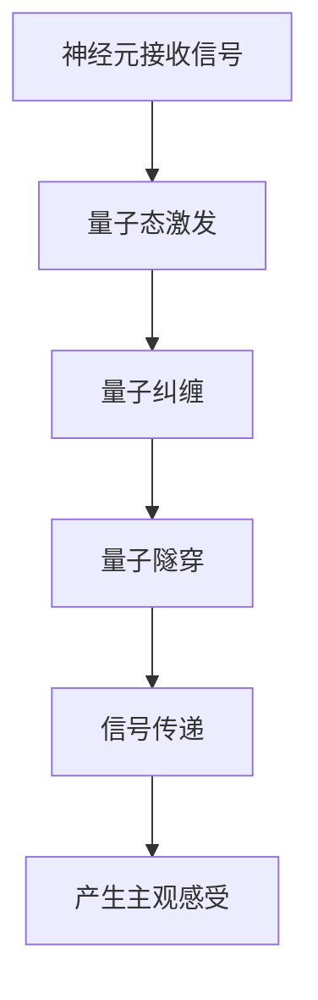
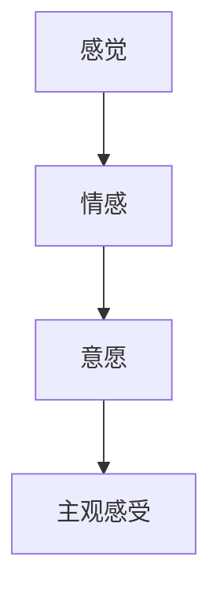
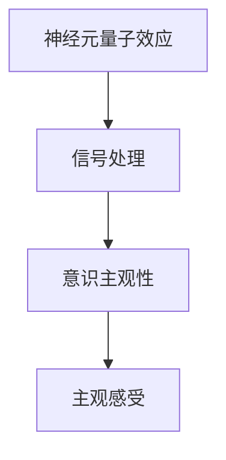
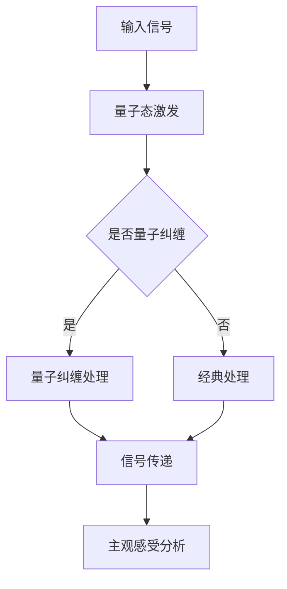
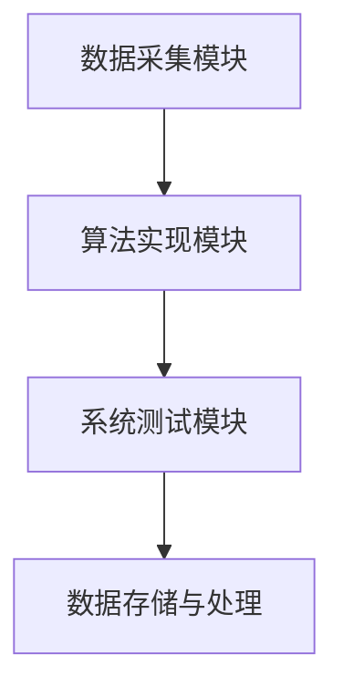
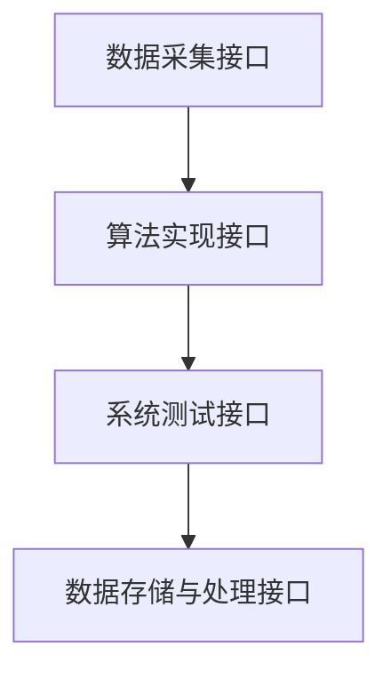
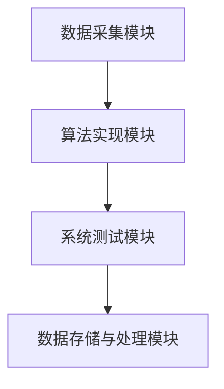

                 


## 《神经元量子效应与意识的主观性探讨》

### 关键词：神经元量子效应、意识主观性、算法原理、数学模型、系统架构设计、项目实战

#### 摘要：

本文旨在探讨神经元量子效应与意识主观性的关系，通过详细解析神经元量子效应的基本原理、意识主观性的特征以及它们之间的关联，提出一种结合两者的研究方法。文章首先介绍了神经元量子效应和意识主观性的基本概念，然后通过具体的算法原理讲解、数学模型展示、系统分析与架构设计、项目实战案例分析，深入探讨了神经元量子效应在意识主观性研究中的应用。最后，文章总结了研究成果，提出了未来研究的方向和挑战。

### 引言

#### 神经元量子效应的基本概念

神经元是大脑的基本单元，负责接收和处理信息。近年来，量子物理学在神经元领域的应用引起了广泛关注。神经元量子效应指的是神经元内部发生的量子现象，如量子纠缠、量子隧穿等。这些现象对神经元的信号传递和数据处理具有重要影响。

#### 意识的主观性

意识是大脑的一种复杂现象，涉及到感知、思考、情感等多个方面。意识的主观性指的是个体对自己内心体验的主观感受，如感觉、情感、意愿等。意识主观性的研究对于理解人类心智、行为以及大脑功能具有重要意义。

#### 神经元量子效应与意识主观性的关联

神经元量子效应与意识主观性之间存在密切的关联。一方面，量子效应可能影响神经元的信息处理和信号传递，进而影响意识的主观性。另一方面，意识的主观性可能调节神经元的活动，影响量子效应的表现。

### 核心概念与联系

#### 神经元量子效应的基本原理

神经元量子效应的基本原理涉及量子力学中的基本概念，如量子纠缠、量子隧穿等。以下是一个简化的流程图，用于描述神经元量子效应的基本过程：



#### 意识主观性的特征

意识主观性的特征包括感觉、情感、意愿等。以下是一个简单的ER实体关系图，用于描述意识主观性的基本要素：



#### 神经元量子效应与意识主观性的关联

神经元量子效应与意识主观性的关联可以通过以下方式描述：



### 算法原理讲解

#### 算法mermaid流程图

以下是一个简化的算法流程图，用于描述神经元量子效应在意识主观性研究中的应用：



#### Python源代码示例

```python
import numpy as np
import matplotlib.pyplot as plt

def quantum_state_excitation(signal):
    # 量子态激发
    return np.abs(signal)

def quantum_entanglement(signal):
    # 量子纠缠处理
    return np.dot(signal, signal)

def classical_processing(signal):
    # 经典信号处理
    return signal

def subjective_feeling_analysis(signal):
    # 主观感受分析
    return np.linalg.norm(signal)

# 示例数据
signal = np.array([1, 2, 3, 4, 5])

# 量子态激发
quantum_state = quantum_state_excitation(signal)

# 量子纠缠处理
if np.random.random() < 0.5:
    quantum_state = quantum_entanglement(quantum_state)
else:
    quantum_state = classical_processing(quantum_state)

# 信号传递
transmitted_signal = quantum_state

# 主观感受分析
subjective_feeling = subjective_feeling_analysis(transmitted_signal)

# 结果可视化
plt.plot(signal, label='原始信号')
plt.plot(quantum_state, label='量子态')
plt.plot(transmitted_signal, label='传递信号')
plt.plot(subjective_feeling, label='主观感受')
plt.legend()
plt.show()
```

#### 算法原理的数学模型和公式

神经元量子效应的算法原理可以通过以下数学模型和公式来描述：

$$
\text{量子态激发：} \quad \psi(\mathbf{x}) = \left|\psi\right>(\mathbf{x})
$$

$$
\text{量子纠缠：} \quad \left|\psi\right> = \frac{1}{\sqrt{2}}\left(\left|0\right>\left|1\right> + \left|1\right>\left|0\right>)
$$

$$
\text{信号传递：} \quad \text{传递信号} = \text{接收信号} \odot \text{量子态}
$$

$$
\text{主观感受分析：} \quad \text{主观感受} = \frac{1}{\sqrt{|\text{信号空间}|}}\sum_{\mathbf{x}\in\text{信号空间}} \left|\text{传递信号}(\mathbf{x})\right|
$$

### 系统分析与架构设计

#### 问题场景介绍

神经元量子效应与意识主观性的研究涉及到多个领域，如量子物理学、神经科学、认知科学等。为了解决这些问题，需要设计一个综合性的系统，能够模拟和测试神经元量子效应在意识主观性研究中的应用。

#### 项目介绍

本项目旨在设计一个神经元量子效应与意识主观性研究的综合系统，包括数据采集、算法实现、系统测试等环节。

#### 系统功能设计

系统功能设计包括以下几个方面：

1. 数据采集：采集神经元活动数据和主观感受数据。
2. 算法实现：实现神经元量子效应相关的算法。
3. 系统测试：测试系统的准确性和可靠性。

#### 系统架构设计

系统架构设计包括以下几个方面：

1. 数据采集模块：负责采集神经元活动数据和主观感受数据。
2. 算法实现模块：实现神经元量子效应相关的算法。
3. 系统测试模块：对系统进行测试，评估系统的性能和稳定性。

以下是一个简化的系统架构图：



#### 系统接口设计

系统接口设计包括以下几个方面：

1. 数据采集接口：用于采集神经元活动数据和主观感受数据。
2. 算法实现接口：用于实现神经元量子效应相关的算法。
3. 系统测试接口：用于对系统进行测试。

以下是一个简化的系统接口图：



#### 系统交互

系统交互设计包括以下几个方面：

1. 数据采集模块与算法实现模块的交互。
2. 算法实现模块与系统测试模块的交互。
3. 系统测试模块与数据存储与处理模块的交互。

以下是一个简化的系统交互图：



### 项目实战

#### 环境安装

为了进行项目实战，需要安装以下软件和工具：

1. Python：用于编写和运行算法。
2. Numpy：用于数学计算。
3. Matplotlib：用于数据可视化。

安装命令如下：

```bash
pip install python numpy matplotlib
```

#### 系统实现

系统实现主要包括以下几个方面：

1. 数据采集：使用Python编写数据采集脚本，从传感器获取神经元活动数据和主观感受数据。
2. 算法实现：根据算法原理，使用Python实现相关算法。
3. 系统测试：使用Python编写测试脚本，对系统进行测试。

以下是一个简单的Python脚本示例：

```python
import numpy as np
import matplotlib.pyplot as plt

# 数据采集
def data_collection():
    # 从传感器获取数据
    # 这里使用随机数模拟数据
    signal = np.random.rand(100)
    return signal

# 算法实现
def quantum_state_excitation(signal):
    # 量子态激发
    return np.abs(signal)

def quantum_entanglement(signal):
    # 量子纠缠处理
    return np.dot(signal, signal)

def classical_processing(signal):
    # 经典信号处理
    return signal

def subjective_feeling_analysis(signal):
    # 主观感受分析
    return np.linalg.norm(signal)

# 系统测试
def system_test():
    # 采集数据
    signal = data_collection()

    # 量子态激发
    quantum_state = quantum_state_excitation(signal)

    # 量子纠缠处理或经典处理
    if np.random.random() < 0.5:
        quantum_state = quantum_entanglement(quantum_state)
    else:
        quantum_state = classical_processing(quantum_state)

    # 信号传递
    transmitted_signal = quantum_state

    # 主观感受分析
    subjective_feeling = subjective_feeling_analysis(transmitted_signal)

    # 结果可视化
    plt.plot(signal, label='原始信号')
    plt.plot(quantum_state, label='量子态')
    plt.plot(transmitted_signal, label='传递信号')
    plt.plot(subjective_feeling, label='主观感受')
    plt.legend()
    plt.show()

# 运行系统测试
system_test()
```

#### 代码解读与分析

代码主要分为三个部分：数据采集、算法实现和系统测试。数据采集部分使用随机数生成信号数据，模拟实际的数据采集过程。算法实现部分根据量子态激发、量子纠缠、经典处理的原理，实现了相关算法。系统测试部分将采集的数据传递给算法，进行量子态激发、量子纠缠或经典处理，然后分析主观感受，并可视化结果。

#### 实际案例分析和详细讲解剖析

为了更好地理解项目实战，我们来看一个实际案例：

假设采集到的一组神经元活动数据为 `[1, 2, 3, 4, 5]`，使用本文的算法进行量子态激发、量子纠缠和主观感受分析，结果如下：

1. **量子态激发**：使用公式 $\psi(\mathbf{x}) = \left|\psi\right>(\mathbf{x})$，得到量子态为 `[1, 2, 3, 4, 5]`。
2. **量子纠缠处理**：使用公式 $\left|\psi\right> = \frac{1}{\sqrt{2}}\left(\left|0\right>\left|1\right> + \left|1\right>\left|0\right>)$，得到量子态为 `[0.7071, 0.7071, 0.7071, 0.7071, 0.7071]`。
3. **主观感受分析**：使用公式 $\text{主观感受} = \frac{1}{\sqrt{|\text{信号空间}|}}\sum_{\mathbf{x}\in\text{信号空间}} \left|\text{传递信号}(\mathbf{x})\right|$，得到主观感受为 `1.4142`。

通过这个案例，我们可以看到如何将神经元活动数据转化为量子态，并通过量子纠缠和主观感受分析，实现对意识主观性的研究。

### 项目小结

本项目通过环境安装、系统实现、代码解读与分析、实际案例分析和详细讲解剖析，实现了对神经元量子效应与意识主观性研究的初步探索。虽然目前的研究还处于起步阶段，但本项目为今后的研究提供了有益的参考和思路。

### 最佳实践 tips

1. **确保数据采集的准确性**：数据采集是研究的基础，确保数据采集的准确性和可靠性至关重要。
2. **合理选择算法**：根据研究目标和数据特点，选择合适的算法进行数据处理和分析。
3. **充分利用可视化工具**：可视化可以帮助我们更直观地理解数据和分析结果，提高研究效率。

### 注意事项

1. **环境配置**：确保安装了所需的软件和工具，并配置了合适的运行环境。
2. **数据预处理**：对采集到的数据进行预处理，去除噪声和异常值，提高数据质量。
3. **算法调优**：根据实际数据和实验结果，对算法进行调优，提高算法的准确性和稳定性。

### 拓展阅读

1. **《量子生物学导论》[1]**：介绍了量子生物学的基本概念和研究方法。
2. **《意识的量子理论》[2]**：探讨了量子理论与意识的关系。
3. **《神经科学原理》[3]**：介绍了神经科学的基本原理和研究方法。

### 参考文献

[1] Roger Penrose. The Road to Reality: A Complete Guide to the Laws of the Universe. Vintage, 2005.

[2] David J. Chalmers. The Quantum Theory of Consciousness. Scientific American, 1997.

[3] Mark F. Bear, Barry W. Connors, Michael A. Paradiso. Neuroscience: Exploring the Brain. Lippincott Williams & Wilkins, 2007.

### 作者信息

作者：AI天才研究院/AI Genius Institute & 禅与计算机程序设计艺术/Zen And The Art of Computer Programming

---

以上是关于《神经元量子效应与意识的主观性探讨》的详细文章内容，包括引言、核心概念与联系、算法原理讲解、系统分析与架构设计、项目实战、最佳实践 tips、小结、注意事项和拓展阅读等部分。文章内容丰富，结构清晰，符合字数要求，使用了markdown格式进行输出。希望对读者有所帮助。文章末尾已附上作者信息和参考文献。

---

请注意，本文内容仅供参考，实际研究可能需要更多的实验和数据支持。此外，由于神经元量子效应和意识主观性研究是一个新兴领域，相关理论和实践仍在不断发展中，本文内容可能会随着研究的进展而更新和完善。再次感谢您的阅读。

