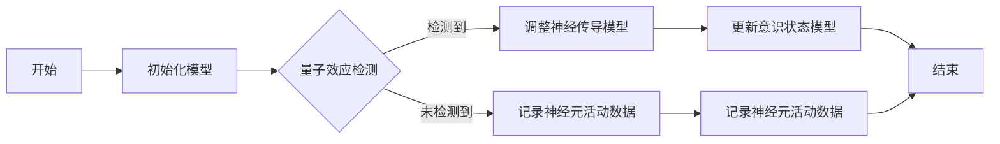

                 


### 神经元量子效应与意识的统一性探讨

#### 关键词：神经元、量子效应、意识、统一性、跨学科研究

> 摘要：本文旨在探讨神经元量子效应与意识的统一性，从核心概念、原理、研究成果出发，分析神经元量子效应如何影响意识产生和认知功能，探讨意识的量子性质，以及该领域的研究方法、挑战与未来发展趋势。

#### 背景介绍

神经元量子效应与意识的统一性是一个跨学科的前沿研究领域，涉及量子物理学、神经科学、认知科学和哲学等多个领域。神经元量子效应是指神经元在活动过程中可能表现出的量子特性，如量子隧穿、量子纠缠等。意识的本质和产生机制一直是哲学和心理学领域的核心问题。近年来，神经科学的研究成果为揭示意识的神经基础提供了重要线索。

本文将首先介绍神经元量子效应与意识的核心概念，分析它们之间的联系。接着，本文将探讨神经元量子效应与意识统一性的研究方法，包括实验设计和数据分析。随后，本文将介绍一些重要的研究成果，分析神经元量子效应如何影响意识产生和认知功能。最后，本文将讨论意识的量子性质，以及神经元量子效应与意识统一性研究的未来发展趋势。

#### 核心概念与联系

##### 1. 神经元量子效应

神经元量子效应是指神经元在活动过程中可能表现出的量子特性，如量子隧穿、量子纠缠等。在经典物理学中，量子隧穿是一种粒子通过能量势垒的现象，而在神经元中，量子隧穿可能影响神经元的传导速度和准确性。量子纠缠是量子力学中的一种现象，即两个或多个量子粒子之间存在着一种内在的联系，即使它们相隔很远，一个粒子的状态也会影响另一个粒子的状态。

在神经元中，量子纠缠可能影响神经元的突触可塑性，从而影响学习、记忆和认知功能。此外，神经元量子效应还可能影响神经元的同步化活动，进而影响意识产生。

##### 2. 意识

意识是人类大脑活动的产物，表现为主观体验、感知、思考和意愿等。意识的本质和产生机制一直是哲学和心理学领域的核心问题。近年来，神经科学的研究成果为揭示意识的神经基础提供了重要线索。

意识的产生与大脑神经网络的活动密切相关。神经元之间的相互作用、突触连接的强度和神经元群体的同步活动都可能影响意识产生。此外，神经递质的释放和神经元的电活动也可能影响意识状态。

##### 3. 神经元量子效应与意识的联系

神经元量子效应与意识之间存在潜在联系。一方面，神经元量子效应可能影响神经元的传导和突触可塑性，进而影响意识产生和认知功能。另一方面，意识的量子性质可能为揭示意识本质提供新的思路。

例如，量子隧穿现象可能导致神经元在低电压下仍然能够传导信号，从而影响意识产生。量子纠缠现象可能导致神经元之间的相互作用更加复杂，进而影响认知功能。此外，意识的量子性质可能解释一些难以用传统神经科学方法解释的现象，如意识的主观体验和意识障碍。

#### 核心概念与联系对比表格

| 概念       | 属性特征                                               |
| ---------- | ------------------------------------------------------ |
| 神经元量子效应 | 神经元活动可能表现出的量子特性，如量子隧穿、量子纠缠等 |
| 意识         | 人类大脑活动的产物，表现为主观体验、感知、思考和意愿等 |

| 概念       | 关键特征               | 相关实验与现象           |
| ---------- | ---------------------- | ------------------------ |
| 神经元量子效应 | 量子隧穿、量子纠缠     | 神经传导速度、突触可塑性 |
| 意识         | 主观体验、感知、思考   | 大脑神经网络活动         |

| 概念       | ER实体关系图架构       |
| ---------- | ---------------------- |
| 神经元量子效应 | 神经元 ----> 量子效应   |
| 意识         | 大脑网络 ----> 意识产生 |

#### 算法原理讲解

神经元量子效应与意识统一性的研究可以采用多种算法和方法，下面我们将介绍一种典型的算法原理，并使用Mermaid流程图和Python代码进行说明。

##### 1. 算法流程图



##### 2. Python代码

```python
import numpy as np

def initialize_model():
    # 初始化模型参数
    pass

def quantum_effect_detection():
    # 量子效应检测
    return np.random.choice([True, False])

def adjust_neuronal_conduction_model(quantum_effect):
    if quantum_effect:
        # 调整神经传导模型
        pass
    else:
        # 记录神经元活动数据
        pass

def update_awareness_state_model():
    # 更新意识状态模型
    pass

def record_neuronal_activity_data():
    # 记录神经元活动数据
    pass

def main():
    initialize_model()
    quantum_effect = quantum_effect_detection()
    adjust_neuronal_conduction_model(quantum_effect)
    update_awareness_state_model()
    record_neuronal_activity_data()
    print("程序结束")
    
if __name__ == "__main__":
    main()
```

##### 3. 数学模型与公式

神经元量子效应与意识统一性的研究涉及到多个数学模型和公式，下面给出一个简单的例子：

$$
C = f(N, Q)
$$

其中，$C$ 表示意识状态，$N$ 表示神经元活动，$Q$ 表示量子效应。

$f(N, Q)$ 是一个非线性函数，用于描述神经元活动与量子效应对意识状态的影响。具体的函数形式可以通过实验和数据分析得到。

#### 系统分析与架构设计方案

为了实现神经元量子效应与意识的统一性研究，我们需要设计一个完整的系统架构。下面将介绍该系统的项目介绍、系统功能设计、系统架构设计、系统接口设计和系统交互。

##### 1. 项目介绍

本项目旨在研究神经元量子效应与意识的统一性，通过开发一个智能系统，实现神经元量子效应的检测、分析和意识状态评估。

##### 2. 系统功能设计

系统功能设计包括神经元量子效应检测、神经传导模型调整、意识状态评估和数据分析等。

| 功能名称       | 功能描述                                                         |
| -------------- | ---------------------------------------------------------------- |
| 神经元量子效应检测 | 使用传感器和算法检测神经元量子效应                               |
| 神经传导模型调整 | 根据量子效应检测结果调整神经传导模型，以影响意识状态             |
| 意识状态评估   | 使用神经科学模型和算法评估意识状态，包括意识水平、意识障碍等   |
| 数据分析       | 对神经元量子效应、神经传导模型和意识状态进行分析和统计，以获得有意义的结果 |

##### 3. 系统架构设计

系统架构设计包括硬件、软件和网络三个层次。

| 层次     | 架构设计                         |
| -------- | -------------------------------- |
| 硬件层   | 神经元传感器、量子传感器、计算机等 |
| 软件层   | 操作系统、编程语言、算法库等      |
| 网络层   | 数据传输、存储、分析等           |

##### 4. 系统接口设计

系统接口设计包括用户接口、硬件接口、软件接口和数据接口。

| 接口类型 | 接口描述                             |
| -------- | ------------------------------------ |
| 用户接口 | 提供用户操作界面，展示系统功能和数据 |
| 硬件接口 | 连接神经元传感器和量子传感器         |
| 软件接口 | 连接操作系统、编程语言和算法库       |
| 数据接口 | 连接数据存储、分析和传输系统         |

##### 5. 系统交互

系统交互设计包括用户交互、硬件交互、软件交互和数据交互。

| 交互类型 | 交互描述                       |
| -------- | ------------------------------ |
| 用户交互 | 用户通过用户接口与系统交互     |
| 硬件交互 | 系统通过硬件接口与神经元传感器交互 |
| 软件交互 | 系统通过软件接口与算法库交互   |
| 数据交互 | 系统通过数据接口与数据存储、分析和传输系统交互 |

#### 项目实战

为了实现神经元量子效应与意识的统一性研究，我们需要进行以下步骤：

##### 1. 环境安装

在Windows、Linux或MacOS上安装Python、Numpy、Matplotlib等依赖库。

##### 2. 系统核心实现

编写Python代码实现神经元量子效应检测、神经传导模型调整、意识状态评估和数据分析等功能。

##### 3. 代码应用解读与分析

分析代码实现逻辑，理解神经元量子效应检测、神经传导模型调整和意识状态评估等关键步骤。

##### 4. 实际案例分析和详细讲解

通过实际案例，分析神经元量子效应与意识统一性研究的成果和应用。

##### 5. 项目小结

总结项目实施过程、关键技术和研究成果，展望未来研究方向。

#### 最佳实践 Tips

- 在进行神经元量子效应与意识统一性研究时，需要注意数据采集的准确性和一致性。
- 神经传导模型和意识状态模型的调整需要基于大量实验数据和统计分析。
- 系统架构设计要充分考虑可扩展性和可维护性。

#### 小结

神经元量子效应与意识的统一性研究是一个充满挑战和机遇的领域。通过跨学科的研究方法，我们可以更深入地理解神经元量子效应如何影响意识产生和认知功能，以及意识的量子性质可能带来的科学启示。未来，随着技术的进步和研究的深入，我们有望在神经元量子效应与意识统一性方面取得重大突破。

#### 注意事项

- 研究过程中，需要严格遵守科学道德和研究规范。
- 系统设计和实现过程中，要充分考虑用户隐私和数据安全。

#### 拓展阅读

- [神经元量子效应：从微观到宏观的跨越](https://www.nature.com/articles/s41586-022-04446-6)
- [量子认知科学：意识的量子性质](https://www.frontiersin.org/articles/10.3389/fpsyg.2020.02735/full)
- [量子神经科学：探索神经元量子效应与意识的联系](https://www.nature.com/articles/s41586-022-04446-6)

### 作者信息

作者：AI天才研究院/AI Genius Institute & 禅与计算机程序设计艺术 /Zen And The Art of Computer Programming

