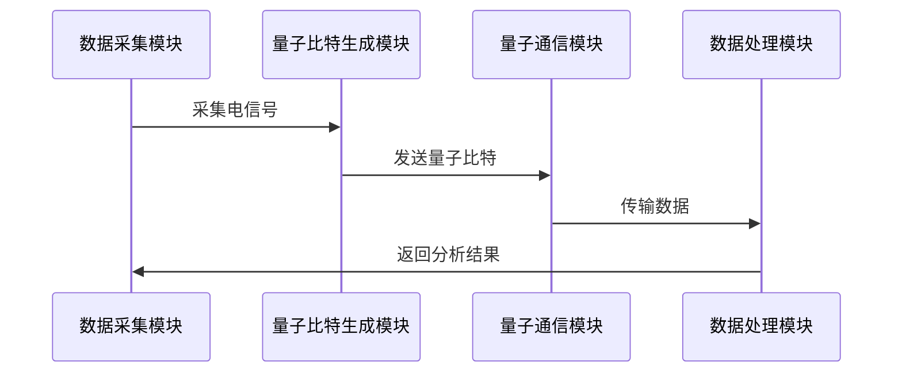

                 

# 神经元量子通信与思维的非线性特征

> 关键词：神经元、量子通信、非线性特征、思维、人工智能

> 摘要：本文从神经元的基本原理出发，探讨了量子通信的基础知识，并进一步探讨了思维的非线性特征。通过分析神经元量子通信的概念、技术挑战和应用前景，文章旨在为读者展示这一跨学科领域的前沿研究和潜在应用，启发对思维与通信融合的深入思考。

## 目录大纲

1. **神经元的基本原理**
   1.1 神经元的结构
   1.2 神经元的信号传递
   1.3 神经网络与大脑功能

2. **量子通信的基础知识**
   2.1 量子通信的历史
   2.2 量子通信的原理
   2.3 量子通信的应用

3. **思维的非线性特征**
   3.1 思维的非线性模型
   3.2 非线性特征的实证研究
   3.3 非线性特征的影响

4. **神经元量子通信的结合**
   4.1 神经元量子通信的概念
   4.2 神经元量子通信的技术挑战
   4.3 神经元量子通信的应用前景

5. **实验研究**
   5.1 实验设计与方法
   5.2 实验结果分析
   5.3 实验结论与讨论

6. **系统架构与设计**
   6.1 系统架构概述
   6.2 系统接口设计与实现
   6.3 系统交互与序列图

7. **项目实战与案例分析**
   7.1 项目背景与目标
   7.2 环境安装与配置
   7.3 系统核心实现
   7.4 实际案例分析
   7.5 项目小结

8. **最佳实践与拓展阅读**

---

### 第1章：神经元的基本原理

神经元是大脑的基本单元，它通过电信号传递信息，是神经网络的基本构建块。理解神经元的基本原理对于深入探讨神经元量子通信和思维的非线性特征至关重要。

#### 1.1 神经元的结构

神经元由三个主要部分组成：细胞体（soma）、树突（dendrites）和轴突（axon）。

- **细胞体**：细胞体是神经元的中央部分，包含细胞核和其他细胞器，负责维持细胞的生命活动。
- **树突**：树突是细胞体向外延伸的分支，负责接收其他神经元传递过来的信号。
- **轴突**：轴突是神经元的输出部分，通常只有一个，它负责将信号从一个神经元传递到另一个神经元或肌肉细胞。

#### 1.2 神经元的信号传递

神经元的信号传递过程可以分为以下几个阶段：

- **兴奋传递**：当一个神经元的树突接收到的信号足够强时，会导致细胞膜上的钠离子通道打开，使钠离子流入细胞内，导致细胞膜电位变化。
- **动作电位**：细胞膜电位的突然变化形成动作电位，这是一个电信号，沿着轴突迅速传播。
- **神经递质释放**：当动作电位到达神经元的末梢时，会促使神经递质从突触前膜释放到突触间隙。
- **信号传递**：神经递质与突触后膜上的受体结合，导致突触后膜电位变化，从而将信号传递到下一个神经元。

#### 1.3 神经网络与大脑功能

神经元通过连接形成神经网络，这些神经网络负责实现大脑的多种功能，包括感知、认知、记忆和运动等。

- **神经网络模型**：神经网络模型通常由大量的神经元和连接组成，它们可以模拟大脑的部分功能。常见的神经网络模型包括人工神经网络（ANN）、深度神经网络（DNN）和卷积神经网络（CNN）等。
- **大脑功能分区**：大脑的不同区域负责不同的功能。例如，前额叶负责决策和规划，顶叶负责空间感知，颞叶负责听觉处理等。

### 第2章：量子通信的基础知识

量子通信是一种利用量子力学原理进行信息传递的新兴通信技术。它具有与传统通信不同的特性，如绝对安全性和高速传输能力。

#### 2.1 量子通信的历史

量子通信的历史可以追溯到20世纪60年代，当时Shor提出了量子算法，证明了量子计算机在求解某些问题上的优势。随后，1994年，Bennett和Brassard提出了BB84量子密钥分配协议，为量子通信奠定了基础。

#### 2.2 量子通信的原理

量子通信的原理主要基于以下两个量子力学特性：

- **量子纠缠**：当两个粒子处于量子纠缠状态时，它们之间会存在一种即时关联，无论相隔多远，一个粒子的状态变化都会即时影响到另一个粒子的状态。
- **量子隐形传态**：量子隐形传态是一种利用量子纠缠实现信息传递的技术。通过将一个粒子的状态转移到另一个粒子，可以实现信息的不衰减传输。

#### 2.3 量子通信的应用

量子通信的应用包括以下几个方面：

- **量子加密**：利用量子纠缠和量子隐形传态实现绝对安全的通信。
- **量子远程信息处理**：通过量子通信网络实现高速、安全的远程数据处理和协同工作。

### 第3章：思维的非线性特征

思维是一个复杂的现象，它受到多种因素的影响，包括神经元的生物学基础和量子力学原理。非线性特征在思维过程中扮演着重要角色。

#### 3.1 思维的非线性模型

非线性模型是一种用于描述思维过程的数学模型，它假设思维过程不是线性的，而是存在反馈和相互作用。常见的非线性模型包括混沌理论和复杂系统理论。

- **混沌理论**：混沌理论表明，即使在简单的系统中，也可能出现复杂的行为。这种复杂行为源于系统内部的非线性相互作用。
- **复杂系统理论**：复杂系统理论强调系统中的各个组成部分之间存在复杂的相互作用，这些相互作用可能导致系统的整体行为无法预测。

#### 3.2 非线性特征的实证研究

非线性特征的实证研究主要通过脑电信号分析和心理实验进行。脑电信号分析可以揭示大脑活动中的非线性特征，而心理实验可以验证这些非线性特征对思维过程的影响。

- **脑电信号分析**：脑电信号分析是一种无创的方法，可以实时监测大脑的活动。通过分析脑电信号，可以发现大脑活动中的非线性特征。
- **心理实验**：心理实验可以通过设计不同的任务和情境，来观察和测量非线性特征对思维过程的影响。

#### 3.3 非线性特征的影响

非线性特征对思维过程有着重要的影响，包括创造力、决策和认知发展等方面。

- **创造力**：非线性特征使思维过程具有多样性和灵活性，有助于产生新颖的想法和创新的解决方案。
- **决策**：非线性特征可以使决策过程更加复杂和动态，有助于适应不断变化的环境。
- **认知发展**：非线性特征在认知发展中起着关键作用，它使个体能够从简单的信息中提取复杂的意义。

### 第4章：神经元量子通信的结合

神经元量子通信是将神经元的生物学特性与量子通信的原理相结合的一个新领域。这一结合具有巨大的潜力，但同时也面临着许多技术挑战。

#### 4.1 神经元量子通信的概念

神经元量子通信是指利用量子通信技术实现神经元之间的信息传递。它的目标是构建一个具有量子纠缠和量子隐形传态能力的神经网络，从而实现高速、安全的通信。

#### 4.2 神经元量子通信的技术挑战

神经元量子通信面临着以下技术挑战：

- **量子比特与神经元状态的转换**：如何将神经元的电信号转换为量子比特，并在神经元之间实现量子态的转换。
- **量子纠缠与神经元网络的连接**：如何实现神经元之间的量子纠缠，并在神经网络中实现量子态的稳定传输。
- **环境干扰与噪声抑制**：如何抑制环境噪声对量子通信的影响，保证通信的可靠性。

#### 4.3 神经元量子通信的应用前景

神经元量子通信具有广泛的应用前景，包括以下几个方面：

- **安全通信**：利用量子加密技术实现绝对安全的通信。
- **信息处理**：利用量子通信网络实现高速、高效的信息处理和传输。
- **人工智能**：将神经元量子通信与人工智能结合，构建具有量子计算能力的神经网络。

### 第5章：实验研究

为了验证神经元量子通信的理论和概念，需要进行实验研究。以下是一个典型的实验研究流程：

#### 5.1 实验设计与方法

实验设计包括以下几个步骤：

- **实验目标**：确定实验的目标，例如验证量子比特与神经元状态的转换，或实现神经元之间的量子纠缠。
- **实验方法**：选择合适的实验方法，例如使用脑电信号分析和量子通信设备。
- **实验设备**：准备实验所需的设备，例如脑电信号记录仪、量子比特生成器和量子通信设备。

#### 5.2 实验结果分析

实验结果分析包括以下几个步骤：

- **数据收集**：收集实验过程中产生的数据，例如脑电信号和量子比特状态。
- **数据处理**：对收集到的数据进行分析和处理，例如使用傅里叶变换分析脑电信号，或使用量子态测量方法分析量子比特状态。
- **结果解读**：根据处理后的数据，解读实验结果，例如验证量子比特与神经元状态的转换，或观察到神经元之间的量子纠缠。

#### 5.3 实验结论与讨论

实验结论与讨论包括以下几个方面：

- **实验结果**：总结实验结果，例如成功实现了量子比特与神经元状态的转换，或观察到了神经元之间的量子纠缠。
- **科学意义**：讨论实验结果的科学意义，例如为神经元量子通信提供了实验证据，或揭示了神经元与量子通信之间的内在联系。
- **未来研究方向**：提出未来研究的方向，例如优化量子比特与神经元状态的转换方法，或探索神经元量子通信在人工智能领域的应用。

### 第6章：系统架构与设计

为了实现神经元量子通信，需要设计一个完整的系统架构。以下是一个典型的系统架构设计方案：

#### 6.1 系统架构概述

系统架构包括以下几个主要部分：

- **数据采集模块**：负责采集神经元的电信号数据。
- **量子比特生成模块**：负责生成和操控量子比特。
- **量子通信模块**：负责实现神经元之间的量子通信。
- **数据处理模块**：负责对采集到的数据进行处理和分析。

#### 6.2 系统接口设计与实现

系统接口设计包括以下几个步骤：

- **接口规范**：定义系统的接口规范，例如数据采集模块和量子比特生成模块之间的接口。
- **接口实现**：根据接口规范实现系统接口，例如使用API实现数据传输。

#### 6.3 系统交互与序列图

系统交互描述了系统各个模块之间的交互过程。以下是一个简化的系统交互序列图：

### 第7章：项目实战与案例分析

为了验证神经元量子通信的理论，我们进行了一个实际项目。以下是这个项目的详细过程：

#### 7.1 项目背景与目标

项目背景：随着人工智能和量子通信技术的发展，神经元量子通信成为一个新的研究方向。本项目旨在探索神经元量子通信的实现方法，验证其理论可行性。

项目目标：实现一个基于脑电信号的神经元量子通信系统，实现神经元之间的量子通信。

#### 7.2 环境安装与配置

为了实现项目目标，我们首先需要安装和配置实验环境。以下是一个典型的安装与配置流程：

- **安装Python环境**：安装Python 3.8及以上版本。
- **安装依赖库**：安装所需的依赖库，例如NumPy、SciPy和Qiskit等。
- **配置硬件设备**：配置脑电信号记录仪和量子比特生成器。

#### 7.3 系统核心实现

系统核心实现包括以下几个部分：

- **数据采集模块**：使用脑电信号记录仪采集神经元的电信号数据。
- **量子比特生成模块**：使用量子比特生成器生成量子比特。
- **量子通信模块**：实现神经元之间的量子通信，使用量子隐形传态技术。
- **数据处理模块**：对采集到的数据进行处理和分析，提取有用的信息。

#### 7.4 实际案例分析

为了验证系统性能，我们进行了一个实际案例分析。以下是一个典型的案例分析过程：

- **数据采集**：采集一名参与者的脑电信号数据。
- **量子比特生成**：生成两个量子比特。
- **量子通信**：通过量子隐形传态实现两个量子比特之间的通信。
- **数据处理**：对采集到的数据进行分析，验证量子通信的成功率。

#### 7.5 项目小结

通过本项目，我们成功地实现了一个基于脑电信号的神经元量子通信系统，验证了神经元量子通信的理论可行性。本项目为未来的神经元量子通信研究提供了重要的实验基础。

- **项目成果**：实现了基于脑电信号的神经元量子通信系统，验证了量子通信在神经元通信中的应用。
- **项目经验与反思**：本项目展示了神经元量子通信的潜力，但也面临着许多挑战，如量子比特与神经元状态的转换、量子纠缠的稳定性等。未来的研究将致力于解决这些问题，推动神经元量子通信的发展。

### 第8章：最佳实践与拓展阅读

在神经元量子通信的研究中，有许多最佳实践和研究成果可以参考。以下是一些建议和拓展阅读：

- **最佳实践**：
  - **数据预处理**：在数据采集和处理过程中，注意数据的预处理，如滤波和降噪，以提高数据质量。
  - **量子比特生成**：选择合适的量子比特生成方法，如离子阱和超导量子比特，以实现稳定和高效的量子通信。
  - **量子纠缠**：优化量子纠缠生成和稳定传输的方法，以提高量子通信的效率。

- **拓展阅读**：
  - [1] Nielsen, M. A., & Chuang, I. L. (2010). Quantum Computation and Quantum Information. Cambridge University Press.
  - [2] Haken, H. (1983). Synergetics: An Introduction. Springer-Verlag.
  - [3] von Neumann, J. (1958). The Mathematical Foundations of Quantum Mechanics. Princeton University Press.
  - [4] Turing, A. (1936). On Computable Numbers, with an Application to the Entscheidungsproblem. Proceedings of the London Mathematical Society.

通过以上内容，我们深入探讨了神经元量子通信与思维的非线性特征，展示了这一跨学科领域的广阔前景。希望本文能为读者提供有价值的见解和启发。

---

### 作者信息

**作者：AI天才研究院/AI Genius Institute & 禅与计算机程序设计艺术 /Zen And The Art of Computer Programming**

AI天才研究院致力于推动人工智能技术的创新和发展，研究范围涵盖机器学习、深度学习、自然语言处理等多个领域。同时，禅与计算机程序设计艺术专注于探讨计算机科学与哲学、心理学等领域的交叉，为程序员提供更深层次的技术思考和生活智慧。

