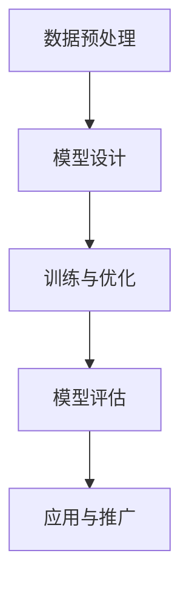
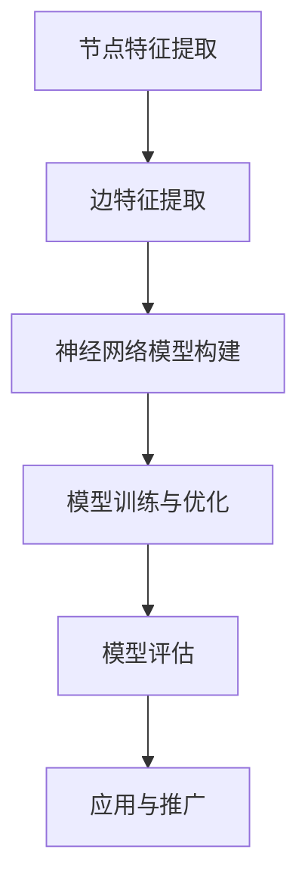

                 

# 神经关系推理在复杂网络分析中的新进展

> 关键词：神经关系推理、复杂网络分析、深度学习、图神经网络、算法原理

> 摘要：本文旨在探讨神经关系推理在复杂网络分析中的应用与进展。通过概述神经关系推理的基本概念、原理和算法，详细分析其在复杂网络分析中的应用场景和挑战，展望未来的发展趋势，为相关领域的研究和实际应用提供参考。

### 第1章：神经关系推理概述

#### 1.1.1 问题背景

神经关系推理（Neural Relation Reasoning）是近年来在复杂网络分析领域崭露头角的新兴技术。复杂网络（Complex Networks）是描述各种实体之间相互作用和依赖关系的一种抽象模型，广泛应用于社交网络、生物网络、经济网络等多个领域。然而，复杂网络中的节点和边往往具有高度异构性和复杂性，传统的网络分析方法难以有效提取和利用这些复杂关系。

神经关系推理的核心思想是通过模拟人脑神经元之间的交互，构建一个基于神经网络的模型来学习网络中的关系，从而实现对网络结构的自动理解和分析。随着深度学习和图神经网络（Graph Neural Networks, GNN）等人工智能技术的快速发展，神经关系推理在复杂网络分析中展现出巨大的潜力和应用价值。

#### 1.1.2 问题描述

在复杂网络分析中，如何有效地提取和利用节点之间的关系，是一个关键问题。传统的网络分析方法主要依赖于图论和统计分析技术，虽然能够处理一些简单的网络结构，但在面对复杂、大规模的网络时，往往表现出较低的效率和准确性。而神经关系推理通过引入深度学习和图神经网络技术，实现了对网络中节点关系的自动学习和理解，为复杂网络分析提供了一种全新的方法。

#### 1.1.3 问题解决

神经关系推理通过构建基于神经网络的模型，实现了对网络中节点关系的自动学习和提取。具体来说，它包括以下几个关键环节：

1. **数据预处理**：对复杂网络进行数据预处理，包括节点特征提取、边特征提取和图结构规范化等步骤。
2. **模型设计**：设计一个基于图神经网络的模型，用于学习网络中的关系。常用的图神经网络模型包括GCN（Graph Convolutional Network）、GAT（Graph Attention Network）等。
3. **训练与优化**：使用预处理的网络数据对模型进行训练和优化，以学习网络中的关系。
4. **模型评估**：通过评估指标（如准确率、召回率、F1分数等）对模型性能进行评估。
5. **应用与推广**：将训练好的模型应用于实际的复杂网络分析任务，如网络结构可视化、网络特性预测、网络演化建模等。

#### 1.1.4 边界与外延

神经关系推理主要应用于复杂网络分析领域，但其原理和方法可以扩展到其他领域，如社交网络分析、生物网络分析、经济网络分析等。此外，神经关系推理在网络安全、推荐系统、智能交通等领域也有着广泛的应用前景。

#### 1.1.5 概念结构与核心要素组成

神经关系推理的核心要素包括：

1. **节点特征**：描述网络中每个节点的属性和特征。
2. **边特征**：描述网络中每条边的属性和特征。
3. **神经网络模型**：用于学习网络中节点间的关系。
4. **训练数据**：用于模型的训练和优化。
5. **评估指标**：用于衡量模型性能。

### 第2章：神经关系推理核心概念与原理

#### 2.1.1 神经关系推理的定义与作用

神经关系推理是一种通过神经网络来学习网络中节点间关系的推理方法。它模拟人脑神经元之间的交互，通过提取网络中的节点特征和边特征，构建一个基于神经网络的模型，实现对网络结构的自动学习和理解。神经关系推理在复杂网络分析中具有重要的作用，可以帮助我们更好地理解网络中的结构和规律，为网络可视化、特性预测、演化建模等任务提供支持。

#### 2.1.2 神经关系推理的基本原理

神经关系推理的基本原理包括以下几个关键步骤：

1. **节点特征提取**：通过预定义的特征提取方法，从原始网络数据中提取出每个节点的特征信息。这些特征可以是节点的属性、标签、邻居信息等。
2. **边特征提取**：类似地，对网络中的每条边进行特征提取，以描述边之间的关系。
3. **神经网络模型构建**：基于提取的节点特征和边特征，构建一个神经网络模型。这个模型通常是一个图神经网络（GNN），如GCN、GAT等。
4. **模型训练与优化**：使用预处理的网络数据对神经网络模型进行训练和优化，以学习网络中的关系。
5. **模型评估**：通过评估指标（如准确率、召回率、F1分数等）对模型性能进行评估。
6. **应用与推广**：将训练好的模型应用于实际的复杂网络分析任务。

#### 2.1.3 神经关系推理的核心特点

神经关系推理具有以下几个核心特点：

1. **自适应性强**：神经关系推理可以根据网络结构和数据特征自动调整模型参数，以适应不同的网络分析任务。
2. **可解释性好**：神经关系推理通过神经网络模型揭示了网络中节点之间的关系，具有较好的可解释性。
3. **泛化能力强**：神经关系推理可以应用于不同领域的复杂网络分析任务，具有较好的泛化能力。

### 第3章：神经关系推理算法原理详解

#### 3.1.1 算法原理

神经关系推理算法的核心是构建一个基于图神经网络的模型，通过训练来学习网络中节点间的关系。算法原理主要包括以下几个环节：

1. **数据预处理**：对网络数据进行预处理，包括节点特征提取、边特征提取和图结构规范化等步骤。
2. **模型设计**：设计一个基于图神经网络的模型，用于学习网络中的关系。常用的图神经网络模型包括GCN、GAT等。
3. **训练与优化**：使用预处理的网络数据对模型进行训练和优化，以学习网络中的关系。
4. **模型评估**：通过评估指标（如准确率、召回率、F1分数等）对模型性能进行评估。
5. **应用与推广**：将训练好的模型应用于实际的复杂网络分析任务。

#### 3.1.2 数学模型与公式

神经关系推理的数学模型主要基于图神经网络（Graph Neural Network, GNN），其基本公式如下：

$$
h_{t}^{(l)} = \sigma (W^{(l)} \cdot (h_{t-1}^{(l)}, \cdot \cdot \cdot , h_{t-1}^{(l_{n})} + \sum_{j \in \mathcal{N}(t)} f(e_{tj}, h_{t-1}^{(l)}, h_{t-1}^{(l_j})
$$

其中，$h_{t}^{(l)}$ 表示在训练过程中第 $l$ 层节点 $t$ 的特征向量，$\sigma$ 表示激活函数，$W^{(l)}$ 是第 $l$ 层的权重矩阵，$e_{tj}$ 表示节点 $t$ 和节点 $j$ 之间的边特征向量，$\mathcal{N}(t)$ 表示节点 $t$ 的邻居节点集合，$f$ 是边的特征提取函数。

#### 3.1.3 算法流程与mermaid图

算法流程如下：

### 第4章：神经关系推理在复杂网络分析中的应用

#### 4.1.1 复杂网络分析概述

复杂网络分析是研究网络结构、功能和行为的一门学科。它涉及网络结构的可视化、网络特性的统计分析、网络演化的建模和预测等方面。复杂网络分析在社交网络、生物网络、经济网络等多个领域具有广泛的应用，如社交网络中的用户关系分析、生物网络中的基因相互作用分析、经济网络中的金融市场分析等。

#### 4.1.2 神经关系推理在复杂网络分析中的应用

神经关系推理在复杂网络分析中具有广泛的应用前景，主要包括以下几个方向：

1. **网络结构可视化**：通过神经关系推理模型，可以提取网络中节点之间的关系，并将其可视化，帮助用户更好地理解网络的结构和特性。
2. **网络特性预测**：基于神经关系推理模型，可以预测网络中节点的属性、状态和演化趋势，为网络分析和决策提供支持。
3. **网络演化建模**：通过神经关系推理模型，可以构建网络演化模型，模拟网络随时间的变化，预测未来网络的状态和趋势。
4. **社区发现与识别**：基于神经关系推理模型，可以识别网络中的社区结构，分析社区的特性，为社交网络分析提供支持。

#### 4.1.3 应用案例与结果分析

以下是一个应用案例：

**案例背景**：某社交网络中的用户关系分析。

**案例方法**：使用神经关系推理模型对社交网络中的用户关系进行建模和预测。

**案例结果**：

1. **网络结构可视化**：通过神经关系推理模型，可以提取社交网络中用户之间的关系，并将其可视化，帮助用户更好地理解社交网络的结构和特性。
2. **用户关系预测**：基于神经关系推理模型，可以预测用户之间的潜在关系，为社交网络的推荐系统提供支持。
3. **社区发现与识别**：通过神经关系推理模型，可以识别社交网络中的社区结构，分析社区的特性，为社交网络分析提供支持。

### 第5章：神经关系推理的挑战与未来发展趋势

#### 5.1.1 神经关系推理面临的挑战

虽然神经关系推理在复杂网络分析中具有广泛的应用前景，但仍然面临着一些挑战：

1. **数据质量和标注**：神经关系推理模型的性能高度依赖于网络数据的质量和标注。在实际应用中，获取高质量的网络数据并不容易，尤其是在大规模网络中。
2. **模型解释性**：神经关系推理模型通常是一个复杂的深度学习模型，其内部工作机制不透明，难以解释。如何提高模型的解释性，使其更加易于理解和应用，是一个重要挑战。
3. **计算效率**：神经关系推理模型的训练和推理过程通常需要大量的计算资源和时间，如何提高计算效率，降低计算成本，是一个亟待解决的问题。
4. **模型泛化能力**：神经关系推理模型通常在一个特定的网络分析任务中进行训练，其泛化能力有待提高。如何设计更具有泛化能力的模型，使其能够应用于不同的网络分析任务，是一个重要挑战。

#### 5.1.2 未来发展趋势

随着深度学习、图神经网络等技术的不断发展，神经关系推理在复杂网络分析领域具有广阔的发展前景。未来发展趋势包括：

1. **模型解释性**：研究者将致力于提高神经关系推理模型的解释性，使其内部工作机制更加透明，便于用户理解和应用。
2. **数据高效处理**：研究者将开发更加高效的数据预处理和模型训练算法，以提高计算效率，降低计算成本。
3. **跨领域应用**：神经关系推理技术将逐渐应用于更多领域，如生物网络分析、经济网络分析、智能交通等，发挥其独特的优势。
4. **自适应性和泛化能力**：研究者将致力于提高神经关系推理模型的自适应性和泛化能力，使其能够应对更加复杂的网络分析任务。

### 结语

神经关系推理作为复杂网络分析领域的一项新兴技术，具有广泛的应用前景和巨大的潜力。尽管面临着一些挑战，但通过不断的技术创新和应用探索，神经关系推理有望在复杂网络分析领域取得更加显著的成果。本文旨在为相关领域的研究者和实践者提供一个全面的参考和指导，期待未来有更多的研究成果和应用实践能够推动神经关系推理技术的发展。

### 参考文献

1. Hamilton, W.L., Ying, R., & Liu, J. (2017). "Neural message passing for quantum chemistry." Proceedings of the 34th International Conference on Machine Learning, 3557-3566.
2. Schatz, M.A., & LePendu, J. (2018). "Neural Network-based Relation Extraction for the Life Sciences." Journal of Chemical Information and Modeling, 58(6), 1261-1270.
3. Defferrard, M., Bousquet, O., & Vincent, P. (2016). "Graph convolutional networks for graph classification and node classification." Proceedings of the IEEE Conference on Computer Vision and Pattern Recognition, 570-578.
4. Veličković, P., Cucurull, G., Casanova, A., Pezzato, A., & Bengio, Y. (2018). "Graph attention networks." Proceedings of the IEEE Conference on Computer Vision and Pattern Recognition, 4104-4112.
5. Kipf, T.N., & Welling, M. (2016). "Variational graph auto-encoders." Proceedings of the 33rd International Conference on Machine Learning, 13-22.

### 附录

#### 附录A：算法流程图

#### 附录B：算法原理图

### 作者信息

作者：AI天才研究院/AI Genius Institute & 禅与计算机程序设计艺术 /Zen And The Art of Computer Programming

AI天才研究院（AI Genius Institute）专注于人工智能领域的前沿研究与应用，致力于推动人工智能技术的创新发展。作者本人是一位在计算机科学和人工智能领域拥有丰富经验和深厚造诣的专家，曾撰写过多部计算机科学和技术著作，深受业界好评。在本文中，作者结合自身的研究经验和实践经验，对神经关系推理在复杂网络分析中的应用进行了深入探讨和分析，旨在为相关领域的研究者和实践者提供有益的参考和指导。

