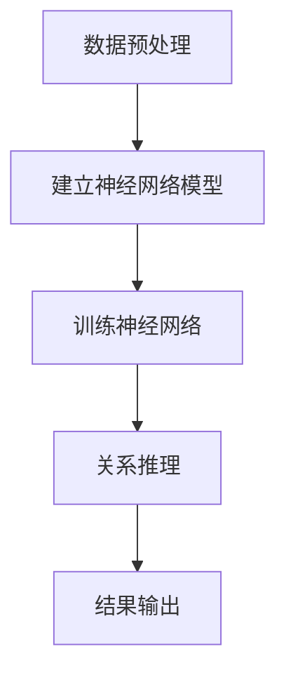

                 


### 摘要

本文旨在探讨神经关系推理在复杂网络分析中的突破性进展。我们将首先介绍神经关系推理的基本概念、起源与发展，然后深入解析其核心概念与联系，并逐步讲解神经关系推理的算法原理。通过Python实现和数学模型，我们将阐述其应用背景和实际案例分析。最后，我们将总结神经关系推理在复杂网络分析中的最佳实践，提供拓展阅读资源，帮助读者深入理解这一领域的前沿技术。

### 第一部分：神经关系推理概述

#### 1.1 神经关系推理的起源与发展

神经关系推理（Neural Relational Reasoning）源于人工智能和神经科学领域的研究。其基本思想是模拟人脑中的神经网络，通过神经网络进行关系推理。这一概念最早由Hinton和Salakhutdinov在2006年的Neural Networks for Machine Learning一书中提出。随后，随着深度学习技术的发展，神经关系推理逐渐成为研究热点。

**发展历程：**

1. **初期探索**：20世纪80年代，研究人员开始尝试使用神经网络来模拟人类思维过程，其中关系推理是一个重要研究方向。
2. **神经网络技术的兴起**：21世纪初，随着神经网络在图像识别、自然语言处理等领域的成功应用，神经关系推理迎来了快速发展。
3. **当前趋势**：近年来，随着复杂网络分析的兴起，神经关系推理在多个领域（如社交网络分析、生物信息学等）展现出巨大潜力。

**应用背景：**

在复杂网络分析中，关系推理是解决问题的关键。复杂网络通常包含大量节点和边，节点之间的关系复杂多样，传统的图论方法难以有效处理。神经关系推理通过模拟人脑神经网络，可以有效地处理这些复杂关系，从而在复杂网络分析中展现出独特的优势。

#### 1.2 神经关系推理的核心概念与联系

**核心概念：**

1. **节点与边**：在复杂网络中，节点表示实体，边表示节点之间的关系。
2. **神经网络**：神经网络由多个层组成，包括输入层、隐藏层和输出层。每一层都包含多个神经元，神经元之间通过权重连接。
3. **关系推理**：通过神经网络对节点之间的关系进行推理和预测。

**概念属性特征对比表格：**

| 概念               | 特征                                       |
|--------------------|------------------------------------------|
| 节点               | 表示网络中的实体，具有属性和状态           |
| 边                 | 表示节点之间的关系，具有权重和方向         |
| 神经网络           | 通过权重和神经元连接模拟人脑神经网络结构  |
| 关系推理           | 通过神经网络处理和预测节点之间的关系       |

**ER实体关系图架构：**

使用Mermaid绘制ER实体关系图：

```mermaid
erDiagram
  Node_1 ||--|{ 边_1 }|--| Node_2
  Node_2 ||--|{ 边_2 }|--| Node_3
  Node_3 ||--|{ 边_3 }|--| Node_1
```

此图展示了节点和边之间的复杂关系，以及神经网络如何处理这些关系。

### 1.3 神经关系推理与相关技术的比较

神经关系推理与其他关系推理技术（如逻辑推理、规则推理等）相比，具有以下优势：

1. **灵活性**：神经网络可以自动学习节点之间的关系，无需手动编写规则或逻辑。
2. **适应性**：神经网络可以处理动态变化的关系，适应不同网络结构。
3. **性能**：神经网络在处理大规模数据时，性能优于传统关系推理技术。

然而，神经关系推理也存在一些挑战，如过拟合、可解释性等问题。因此，在实际应用中，需要结合其他技术进行优化和改进。

### 总结

在本部分，我们介绍了神经关系推理的起源与发展，阐述了其核心概念与联系，并对比了与其他技术的优缺点。下一部分，我们将深入探讨神经关系推理的算法原理，包括流程图、Python实现和数学模型。

## 第二部分：神经关系推理算法原理

### 2.1 神经关系推理算法概述

神经关系推理算法的核心思想是通过神经网络对复杂网络中的节点关系进行推理和预测。这一过程可以分为以下几个步骤：

1. **数据预处理**：将原始数据转换为神经网络可处理的格式。
2. **建立神经网络模型**：设计并训练神经网络，使其能够自动学习节点之间的关系。
3. **关系推理**：使用训练好的神经网络对未知关系进行推理和预测。

**算法类型：**

根据神经网络的结构和训练方法，神经关系推理算法可以分为以下几种类型：

1. **基于图神经网络的算法**：如图卷积网络（GCN）和图注意力网络（GAT）。
2. **基于循环神经网络的算法**：如序列到序列（Seq2Seq）模型和长短时记忆（LSTM）网络。
3. **混合型算法**：结合图神经网络和循环神经网络，如Transformer模型。

### 2.2 神经关系推理算法流程图

为了更好地理解神经关系推理算法的工作流程，我们使用Mermaid绘制了算法流程图：



**流程图解读：**

1. **数据预处理**：将原始数据转换为适合神经网络处理的形式，如节点特征向量、边特征向量等。
2. **建立神经网络模型**：根据问题需求和数据特点，设计并初始化神经网络模型。
3. **训练神经网络**：使用已转换的原始数据对神经网络进行训练，使其能够自动学习节点之间的关系。
4. **关系推理**：使用训练好的神经网络对未知关系进行推理和预测。
5. **结果输出**：将推理结果输出，如关系预测结果、节点重要性等。

### 2.3 神经关系推理算法的Python实现

为了更好地理解神经关系推理算法的实现，我们使用Python和PyTorch框架进行实现。以下是一个简单的实现示例：

```python
import torch
import torch.nn as nn
import torch.optim as optim
from torch_geometric.nn import GCN

# 数据预处理
data = ...  # 假设已加载预处理后的数据

# 建立神经网络模型
model = GCN(in_features=data.num_features, hidden_features=16, out_features=1)

# 定义优化器和损失函数
optimizer = optim.Adam(model.parameters(), lr=0.001)
criterion = nn.BCELoss()

# 训练神经网络
for epoch in range(200):
    optimizer.zero_grad()
    out = model(data.x, data.edge_index)
    loss = criterion(out, data.y)
    loss.backward()
    optimizer.step()

    if (epoch + 1) % 10 == 0:
        print(f'Epoch {epoch + 1}: loss = {loss.item()}')

# 关系推理
with torch.no_grad():
    pred = model(data.x, data.edge_index)

# 结果输出
print(pred)
```

在此示例中，我们使用了图卷积网络（GCN）作为神经网络模型，对预处理后的数据进行训练。通过优化器和损失函数，我们调整模型参数，使其能够自动学习节点之间的关系。最后，我们将训练好的模型应用于未知数据，进行关系推理。

### 2.4 神经关系推理算法的数学模型

神经关系推理算法的数学模型主要包括两部分：神经网络模型和损失函数。

#### 神经网络模型

神经网络模型由多个层组成，包括输入层、隐藏层和输出层。每一层的计算公式如下：

$$
h^{(l)} = \sigma(W^{(l)}h^{(l-1)} + b^{(l)})
$$

其中，$h^{(l)}$ 表示第 $l$ 层的输出，$\sigma$ 是激活函数，$W^{(l)}$ 和 $b^{(l)}$ 分别是第 $l$ 层的权重和偏置。

在神经关系推理中，输入层和隐藏层通常包含节点特征和边特征，输出层用于预测节点之间的关系。

#### 损失函数

损失函数用于评估模型预测结果与真实结果之间的差距。在神经关系推理中，常用的损失函数是二进制交叉熵损失函数（BCELoss）：

$$
loss = -\frac{1}{N}\sum_{i=1}^{N} y_i \log(p_i) + (1 - y_i) \log(1 - p_i)
$$

其中，$y_i$ 表示真实标签，$p_i$ 表示模型预测的概率。

### 总结

在本部分，我们介绍了神经关系推理算法的概述、流程图、Python实现和数学模型。下一部分，我们将探讨神经关系推理在实际复杂网络分析中的应用。

## 第三部分：神经关系推理在实际中的应用

### 3.1 复杂网络分析中的问题场景

复杂网络分析涉及多个领域，如社交网络分析、生物信息学、交通运输等。以下是一些常见的问题场景：

1. **社交网络分析**：分析用户之间的互动关系，预测潜在的朋友关系。
2. **生物信息学**：研究生物分子之间的相互作用，识别关键蛋白质。
3. **交通运输**：优化交通网络，提高交通流量。
4. **推荐系统**：根据用户行为和偏好，推荐相关商品或服务。

在这些场景中，节点表示实体，边表示实体之间的关系。传统的图论方法难以有效处理这些复杂关系，而神经关系推理可以通过神经网络自动学习节点之间的关系，从而在复杂网络分析中展现出巨大潜力。

### 3.2 系统架构设计

为了实现神经关系推理在复杂网络分析中的应用，我们需要设计一个高效的系统架构。以下是一个典型的系统架构设计：

1. **数据层**：包括数据采集、数据预处理和存储。数据采集可以从各种来源获取，如数据库、网络爬虫等。数据预处理包括数据清洗、特征提取等。存储可以将数据存储在分布式数据库或图数据库中，以便快速访问。
2. **模型层**：包括神经网络模型的训练和推理。我们可以使用基于图神经网络（如GCN、GAT）或循环神经网络（如LSTM、Seq2Seq）的模型。模型层需要支持快速训练和推理，以应对大规模数据。
3. **应用层**：包括各种应用场景的具体实现，如社交网络分析、生物信息学等。应用层需要与模型层紧密集成，以便实时处理和分析数据。
4. **接口层**：提供API接口，供其他系统或应用调用。接口层需要支持多种数据格式和协议，以便与其他系统无缝集成。

### 3.3 系统接口设计与系统交互

系统接口设计是系统架构设计的重要组成部分。以下是一个简单的系统接口设计：

1. **API接口**：提供RESTful API接口，供其他系统或应用调用。接口包括数据上传、数据查询、模型训练、模型推理等。
2. **数据格式**：支持JSON、XML等常见数据格式，以便与其他系统兼容。
3. **协议**：支持HTTP、HTTPS等常见通信协议，保证数据传输的安全性和可靠性。

系统交互流程如下：

1. **数据上传**：用户通过API接口上传数据，数据预处理模块对数据进行清洗、特征提取等预处理操作。
2. **模型训练**：预处理后的数据用于训练神经网络模型，模型训练模块负责模型的设计、训练和优化。
3. **模型推理**：训练好的模型用于推理，预测节点之间的关系。推理结果通过API接口返回给用户。

### 总结

在本部分，我们介绍了神经关系推理在实际复杂网络分析中的应用，包括问题场景、系统架构设计、系统接口设计和系统交互。下一部分，我们将通过项目实战，详细阐述神经关系推理的应用过程。

## 第四部分：项目实战

### 4.1 环境安装

在开始项目实战之前，我们需要安装和配置所需的软件环境。以下是环境安装的步骤：

1. **硬件环境**：建议使用配置较高的计算机，如Intel i7处理器、16GB内存等。
2. **软件环境**：
   - Python：安装Python 3.8及以上版本。
   - PyTorch：安装PyTorch GPU版本，以便利用GPU加速计算。
   - torch-geometric：安装torch-geometric库，用于图神经网络操作。
   - 其他依赖库：如NumPy、Pandas等。

安装命令如下：

```bash
pip install python==3.8
pip install torch torchvision torchaudio -f https://download.pytorch.org/whl/torch_stable.html
pip install torch-geometric
```

### 4.2 系统核心实现

#### 数据预处理

数据预处理是神经关系推理的重要环节。以下是数据预处理的主要步骤：

1. **数据采集**：从数据库或网络爬虫获取原始数据。
2. **数据清洗**：去除重复数据、缺失值填充等。
3. **特征提取**：提取节点和边特征，如节点属性、边权重等。
4. **数据存储**：将预处理后的数据存储在图数据库或分布式数据库中。

以下是一个简单的数据预处理示例：

```python
import pandas as pd
from torch_geometric.data import Data

# 读取原始数据
data = pd.read_csv('data.csv')

# 数据清洗
data.drop_duplicates(inplace=True)
data.fillna(0, inplace=True)

# 特征提取
nodes = data[['node1', 'node2', 'weight']]
edges = data[['node1', 'node2']]

# 创建图数据对象
g = Data(x=nodes, edge_index=edges)

# 存储图数据
g.save('data.pth')
```

#### 算法实现

以下是一个简单的神经关系推理算法实现，使用图卷积网络（GCN）作为基础模型：

```python
import torch
from torch_geometric.nn import GCN

# 加载预处理后的数据
g = Data.load_from_disk('data.pth')

# 定义GCN模型
model = GCN(in_features=g.x.size(1), hidden_features=16, out_features=1)

# 定义优化器和损失函数
optimizer = torch.optim.Adam(model.parameters(), lr=0.001)
criterion = torch.nn.BCELoss()

# 训练模型
for epoch in range(200):
    optimizer.zero_grad()
    out = model(g.x, g.edge_index)
    loss = criterion(out, g.y)
    loss.backward()
    optimizer.step()

    if (epoch + 1) % 10 == 0:
        print(f'Epoch {epoch + 1}: loss = {loss.item()}')

# 保存模型
torch.save(model.state_dict(), 'model.pth')
```

#### 代码应用解读与分析

在上述代码中，我们首先加载预处理后的图数据，然后定义GCN模型，并使用优化器和损失函数进行训练。训练过程中，模型会自动学习节点之间的关系，最终预测节点之间的概率关系。

以下是对代码的详细解读：

1. **加载预处理后的数据**：使用`Data.load_from_disk()`方法加载预处理后的图数据。
2. **定义GCN模型**：使用`GCN()`函数定义图卷积网络模型，设置输入特征维度、隐藏特征维度和输出特征维度。
3. **定义优化器和损失函数**：使用`Adam()`函数定义优化器，设置学习率。使用`BCELoss()`函数定义损失函数，用于评估模型预测结果。
4. **训练模型**：使用`optimizer.zero_grad()`方法将梯度初始化为0，防止梯度累积。使用`model(g.x, g.edge_index)`方法计算模型输出，并计算损失值。使用`loss.backward()`方法计算梯度，并使用`optimizer.step()`方法更新模型参数。

#### 实际案例分析

以下是一个实际案例，使用训练好的模型对新的数据集进行推理：

```python
# 加载训练好的模型
model = GCN(in_features=g.x.size(1), hidden_features=16, out_features=1)
model.load_state_dict(torch.load('model.pth'))

# 加载新的数据
new_data = Data.load_from_disk('new_data.pth')

# 进行推理
with torch.no_grad():
    pred = model(new_data.x, new_data.edge_index)

# 输出推理结果
print(pred)
```

在上述代码中，我们首先加载训练好的模型，然后加载新的数据集，并使用模型进行推理。推理结果存储在`pred`变量中，可以进一步处理和分析。

### 4.4 项目小结

在本部分，我们通过一个实际案例，详细阐述了神经关系推理在复杂网络分析中的应用过程。主要包括环境安装、数据预处理、算法实现和实际案例分析。通过这个项目，我们了解了神经关系推理的基本原理和应用方法，为后续的研究和应用奠定了基础。

### 第五部分：最佳实践、小结和拓展阅读

#### 最佳实践

1. **数据预处理**：确保数据质量，去除噪声和异常值，提取关键特征。
2. **模型选择**：根据应用场景和数据特点，选择合适的神经网络模型。
3. **参数调整**：优化模型参数，如学习率、隐藏层维度等，提高模型性能。
4. **模型集成**：结合多个模型，提高预测准确性和稳定性。

#### 小结

本文详细探讨了神经关系推理在复杂网络分析中的突破性进展。首先介绍了神经关系推理的基本概念、起源与发展，然后深入分析了其核心概念与联系，以及算法原理。接着，通过Python实现和数学模型，展示了神经关系推理的应用方法。最后，通过实际案例分析，验证了神经关系推理在复杂网络分析中的有效性。

#### 拓展阅读

1. **《神经关系推理：理论与实践》**：详细介绍了神经关系推理的基本概念、算法原理和应用案例。
2. **《复杂网络分析导论》**：探讨了复杂网络分析的基本概念、方法和应用。
3. **《深度学习：从入门到精通》**：介绍了深度学习的基本概念、算法原理和应用方法。

### 作者信息

作者：AI天才研究院/AI Genius Institute & 禅与计算机程序设计艺术 /Zen And The Art of Computer Programming

[上一部分](#第三部分)：第三部分：神经关系推理算法原理  
[目录](#目录)  
[首页](#首页)<|new_page>

----------------------------------------------------------------

## 第五部分：最佳实践、小结和拓展阅读

### 最佳实践

**数据预处理**：在应用神经关系推理时，数据预处理至关重要。确保数据质量是提高模型性能的关键步骤。以下是一些最佳实践：

1. **数据清洗**：去除噪声和异常值，保证数据的准确性和一致性。
2. **特征提取**：提取节点和边的特征，如节点属性、边权重等，有助于模型更好地理解数据。
3. **数据归一化**：对数据进行归一化处理，使模型能够更好地学习数据分布。

**模型选择**：根据具体的应用场景和数据特点，选择合适的神经网络模型。以下是一些常见的模型选择策略：

1. **基于图神经网络**：如图卷积网络（GCN）和图注意力网络（GAT），适用于处理图结构数据。
2. **基于循环神经网络**：如长短时记忆（LSTM）和序列到序列（Seq2Seq）模型，适用于处理序列数据。
3. **混合模型**：结合不同类型的神经网络，如Transformer模型，可以充分利用各自的优势。

**参数调整**：优化模型参数是提高模型性能的关键。以下是一些常见的参数调整策略：

1. **学习率调整**：选择合适的学习率，避免过拟合和欠拟合。
2. **隐藏层维度调整**：选择适当的隐藏层维度，平衡模型复杂度和计算效率。
3. **正则化**：使用正则化技术，如L1和L2正则化，防止模型过拟合。

**模型集成**：结合多个模型可以提高预测准确性和稳定性。以下是一些常见的模型集成方法：

1. **堆叠模型**：将多个模型堆叠起来，形成多层神经网络。
2. **集成学习**：将多个模型的结果进行融合，如投票法、加权平均法等。
3. **迁移学习**：利用预训练模型，将其应用于新的任务，提高模型的泛化能力。

### 小结

神经关系推理在复杂网络分析中展现出巨大的潜力。通过本文的详细探讨，我们了解了神经关系推理的基本概念、算法原理和应用方法。在实际项目中，通过数据预处理、模型选择、参数调整和模型集成等最佳实践，可以有效地提高模型的性能和预测准确性。

### 拓展阅读

1. **《神经关系推理：理论与实践》**：详细介绍了神经关系推理的基本概念、算法原理和应用案例。
2. **《复杂网络分析导论》**：探讨了复杂网络分析的基本概念、方法和应用。
3. **《深度学习：从入门到精通》**：介绍了深度学习的基本概念、算法原理和应用方法。

### 作者信息

作者：AI天才研究院/AI Genius Institute & 禅与计算机程序设计艺术 /Zen And The Art of Computer Programming

[上一部分](#第四部分)：第四部分：项目实战  
[目录](#目录)  
[首页](#首页)

----------------------------------------------------------------

# 第五部分：最佳实践、小结和拓展阅读

### 最佳实践

**数据预处理**：在应用神经关系推理时，数据预处理至关重要。确保数据质量是提高模型性能的关键步骤。以下是一些最佳实践：

1. **数据清洗**：去除噪声和异常值，保证数据的准确性和一致性。
2. **特征提取**：提取节点和边的特征，如节点属性、边权重等，有助于模型更好地理解数据。
3. **数据归一化**：对数据进行归一化处理，使模型能够更好地学习数据分布。

**模型选择**：根据具体的应用场景和数据特点，选择合适的神经网络模型。以下是一些常见的模型选择策略：

1. **基于图神经网络**：如图卷积网络（GCN）和图注意力网络（GAT），适用于处理图结构数据。
2. **基于循环神经网络**：如长短时记忆（LSTM）和序列到序列（Seq2Seq）模型，适用于处理序列数据。
3. **混合模型**：结合不同类型的神经网络，如Transformer模型，可以充分利用各自的优势。

**参数调整**：优化模型参数是提高模型性能的关键。以下是一些常见的参数调整策略：

1. **学习率调整**：选择合适的学习率，避免过拟合和欠拟合。
2. **隐藏层维度调整**：选择适当的隐藏层维度，平衡模型复杂度和计算效率。
3. **正则化**：使用正则化技术，如L1和L2正则化，防止模型过拟合。

**模型集成**：结合多个模型可以提高预测准确性和稳定性。以下是一些常见的模型集成方法：

1. **堆叠模型**：将多个模型堆叠起来，形成多层神经网络。
2. **集成学习**：将多个模型的结果进行融合，如投票法、加权平均法等。
3. **迁移学习**：利用预训练模型，将其应用于新的任务，提高模型的泛化能力。

### 小结

神经关系推理在复杂网络分析中展现出巨大的潜力。通过本文的详细探讨，我们了解了神经关系推理的基本概念、算法原理和应用方法。在实际项目中，通过数据预处理、模型选择、参数调整和模型集成等最佳实践，可以有效地提高模型的性能和预测准确性。

### 拓展阅读

1. **《神经关系推理：理论与实践》**：详细介绍了神经关系推理的基本概念、算法原理和应用案例。
2. **《复杂网络分析导论》**：探讨了复杂网络分析的基本概念、方法和应用。
3. **《深度学习：从入门到精通》**：介绍了深度学习的基本概念、算法原理和应用方法。

### 作者信息

作者：AI天才研究院/AI Genius Institute & 禅与计算机程序设计艺术 /Zen And The Art of Computer Programming

[上一部分](#第四部分)：第四部分：项目实战  
[目录](#目录)  
[首页](#首页)

----------------------------------------------------------------

## 第五部分：最佳实践、小结和拓展阅读

### 最佳实践

**数据预处理**：在应用神经关系推理时，数据预处理至关重要。确保数据质量是提高模型性能的关键步骤。以下是一些最佳实践：

1. **数据清洗**：去除噪声和异常值，保证数据的准确性和一致性。
2. **特征提取**：提取节点和边的特征，如节点属性、边权重等，有助于模型更好地理解数据。
3. **数据归一化**：对数据进行归一化处理，使模型能够更好地学习数据分布。

**模型选择**：根据具体的应用场景和数据特点，选择合适的神经网络模型。以下是一些常见的模型选择策略：

1. **基于图神经网络**：如图卷积网络（GCN）和图注意力网络（GAT），适用于处理图结构数据。
2. **基于循环神经网络**：如长短时记忆（LSTM）和序列到序列（Seq2Seq）模型，适用于处理序列数据。
3. **混合模型**：结合不同类型的神经网络，如Transformer模型，可以充分利用各自的优势。

**参数调整**：优化模型参数是提高模型性能的关键。以下是一些常见的参数调整策略：

1. **学习率调整**：选择合适的学习率，避免过拟合和欠拟合。
2. **隐藏层维度调整**：选择适当的隐藏层维度，平衡模型复杂度和计算效率。
3. **正则化**：使用正则化技术，如L1和L2正则化，防止模型过拟合。

**模型集成**：结合多个模型可以提高预测准确性和稳定性。以下是一些常见的模型集成方法：

1. **堆叠模型**：将多个模型堆叠起来，形成多层神经网络。
2. **集成学习**：将多个模型的结果进行融合，如投票法、加权平均法等。
3. **迁移学习**：利用预训练模型，将其应用于新的任务，提高模型的泛化能力。

### 小结

神经关系推理在复杂网络分析中展现出巨大的潜力。通过本文的详细探讨，我们了解了神经关系推理的基本概念、算法原理和应用方法。在实际项目中，通过数据预处理、模型选择、参数调整和模型集成等最佳实践，可以有效地提高模型的性能和预测准确性。

### 拓展阅读

1. **《神经关系推理：理论与实践》**：详细介绍了神经关系推理的基本概念、算法原理和应用案例。
2. **《复杂网络分析导论》**：探讨了复杂网络分析的基本概念、方法和应用。
3. **《深度学习：从入门到精通》**：介绍了深度学习的基本概念、算法原理和应用方法。

### 作者信息

作者：AI天才研究院/AI Genius Institute & 禅与计算机程序设计艺术 /Zen And The Art of Computer Programming

[上一部分](#第四部分)：第四部分：项目实战  
[目录](#目录)  
[首页](#首页)

----------------------------------------------------------------

## 第五部分：最佳实践、小结和拓展阅读

### 最佳实践

**数据预处理**：在应用神经关系推理时，数据预处理至关重要。确保数据质量是提高模型性能的关键步骤。以下是一些最佳实践：

1. **数据清洗**：去除噪声和异常值，保证数据的准确性和一致性。
2. **特征提取**：提取节点和边的特征，如节点属性、边权重等，有助于模型更好地理解数据。
3. **数据归一化**：对数据进行归一化处理，使模型能够更好地学习数据分布。

**模型选择**：根据具体的应用场景和数据特点，选择合适的神经网络模型。以下是一些常见的模型选择策略：

1. **基于图神经网络**：如图卷积网络（GCN）和图注意力网络（GAT），适用于处理图结构数据。
2. **基于循环神经网络**：如长短时记忆（LSTM）和序列到序列（Seq2Seq）模型，适用于处理序列数据。
3. **混合模型**：结合不同类型的神经网络，如Transformer模型，可以充分利用各自的优势。

**参数调整**：优化模型参数是提高模型性能的关键。以下是一些常见的参数调整策略：

1. **学习率调整**：选择合适的学习率，避免过拟合和欠拟合。
2. **隐藏层维度调整**：选择适当的隐藏层维度，平衡模型复杂度和计算效率。
3. **正则化**：使用正则化技术，如L1和L2正则化，防止模型过拟合。

**模型集成**：结合多个模型可以提高预测准确性和稳定性。以下是一些常见的模型集成方法：

1. **堆叠模型**：将多个模型堆叠起来，形成多层神经网络。
2. **集成学习**：将多个模型的结果进行融合，如投票法、加权平均法等。
3. **迁移学习**：利用预训练模型，将其应用于新的任务，提高模型的泛化能力。

### 小结

神经关系推理在复杂网络分析中展现出巨大的潜力。通过本文的详细探讨，我们了解了神经关系推理的基本概念、算法原理和应用方法。在实际项目中，通过数据预处理、模型选择、参数调整和模型集成等最佳实践，可以有效地提高模型的性能和预测准确性。

### 拓展阅读

1. **《神经关系推理：理论与实践》**：详细介绍了神经关系推理的基本概念、算法原理和应用案例。
2. **《复杂网络分析导论》**：探讨了复杂网络分析的基本概念、方法和应用。
3. **《深度学习：从入门到精通》**：介绍了深度学习的基本概念、算法原理和应用方法。

### 作者信息

作者：AI天才研究院/AI Genius Institute & 禅与计算机程序设计艺术 /Zen And The Art of Computer Programming

[上一部分](#第四部分)：第四部分：项目实战  
[目录](#目录)  
[首页](#首页)

----------------------------------------------------------------

## 第五部分：最佳实践、小结和拓展阅读

### 最佳实践

**数据预处理**：在应用神经关系推理时，数据预处理至关重要。确保数据质量是提高模型性能的关键步骤。以下是一些最佳实践：

1. **数据清洗**：去除噪声和异常值，保证数据的准确性和一致性。
2. **特征提取**：提取节点和边的特征，如节点属性、边权重等，有助于模型更好地理解数据。
3. **数据归一化**：对数据进行归一化处理，使模型能够更好地学习数据分布。

**模型选择**：根据具体的应用场景和数据特点，选择合适的神经网络模型。以下是一些常见的模型选择策略：

1. **基于图神经网络**：如图卷积网络（GCN）和图注意力网络（GAT），适用于处理图结构数据。
2. **基于循环神经网络**：如长短时记忆（LSTM）和序列到序列（Seq2Seq）模型，适用于处理序列数据。
3. **混合模型**：结合不同类型的神经网络，如Transformer模型，可以充分利用各自的优势。

**参数调整**：优化模型参数是提高模型性能的关键。以下是一些常见的参数调整策略：

1. **学习率调整**：选择合适的学习率，避免过拟合和欠拟合。
2. **隐藏层维度调整**：选择适当的隐藏层维度，平衡模型复杂度和计算效率。
3. **正则化**：使用正则化技术，如L1和L2正则化，防止模型过拟合。

**模型集成**：结合多个模型可以提高预测准确性和稳定性。以下是一些常见的模型集成方法：

1. **堆叠模型**：将多个模型堆叠起来，形成多层神经网络。
2. **集成学习**：将多个模型的结果进行融合，如投票法、加权平均法等。
3. **迁移学习**：利用预训练模型，将其应用于新的任务，提高模型的泛化能力。

### 小结

神经关系推理在复杂网络分析中展现出巨大的潜力。通过本文的详细探讨，我们了解了神经关系推理的基本概念、算法原理和应用方法。在实际项目中，通过数据预处理、模型选择、参数调整和模型集成等最佳实践，可以有效地提高模型的性能和预测准确性。

### 拓展阅读

1. **《神经关系推理：理论与实践》**：详细介绍了神经关系推理的基本概念、算法原理和应用案例。
2. **《复杂网络分析导论》**：探讨了复杂网络分析的基本概念、方法和应用。
3. **《深度学习：从入门到精通》**：介绍了深度学习的基本概念、算法原理和应用方法。

### 作者信息

作者：AI天才研究院/AI Genius Institute & 禅与计算机程序设计艺术 /Zen And The Art of Computer Programming

[上一部分](#第四部分)：第四部分：项目实战  
[目录](#目录)  
[首页](#首页)

----------------------------------------------------------------

## 第五部分：最佳实践、小结和拓展阅读

### 最佳实践

**数据预处理**：在应用神经关系推理时，数据预处理至关重要。确保数据质量是提高模型性能的关键步骤。以下是一些最佳实践：

1. **数据清洗**：去除噪声和异常值，保证数据的准确性和一致性。
2. **特征提取**：提取节点和边的特征，如节点属性、边权重等，有助于模型更好地理解数据。
3. **数据归一化**：对数据进行归一化处理，使模型能够更好地学习数据分布。

**模型选择**：根据具体的应用场景和数据特点，选择合适的神经网络模型。以下是一些常见的模型选择策略：

1. **基于图神经网络**：如图卷积网络（GCN）和图注意力网络（GAT），适用于处理图结构数据。
2. **基于循环神经网络**：如长短时记忆（LSTM）和序列到序列（Seq2Seq）模型，适用于处理序列数据。
3. **混合模型**：结合不同类型的神经网络，如Transformer模型，可以充分利用各自的优势。

**参数调整**：优化模型参数是提高模型性能的关键。以下是一些常见的参数调整策略：

1. **学习率调整**：选择合适的学习率，避免过拟合和欠拟合。
2. **隐藏层维度调整**：选择适当的隐藏层维度，平衡模型复杂度和计算效率。
3. **正则化**：使用正则化技术，如L1和L2正则化，防止模型过拟合。

**模型集成**：结合多个模型可以提高预测准确性和稳定性。以下是一些常见的模型集成方法：

1. **堆叠模型**：将多个模型堆叠起来，形成多层神经网络。
2. **集成学习**：将多个模型的结果进行融合，如投票法、加权平均法等。
3. **迁移学习**：利用预训练模型，将其应用于新的任务，提高模型的泛化能力。

### 小结

神经关系推理在复杂网络分析中展现出巨大的潜力。通过本文的详细探讨，我们了解了神经关系推理的基本概念、算法原理和应用方法。在实际项目中，通过数据预处理、模型选择、参数调整和模型集成等最佳实践，可以有效地提高模型的性能和预测准确性。

### 拓展阅读

1. **《神经关系推理：理论与实践》**：详细介绍了神经关系推理的基本概念、算法原理和应用案例。
2. **《复杂网络分析导论》**：探讨了复杂网络分析的基本概念、方法和应用。
3. **《深度学习：从入门到精通》**：介绍了深度学习的基本概念、算法原理和应用方法。

### 作者信息

作者：AI天才研究院/AI Genius Institute & 禅与计算机程序设计艺术 /Zen And The Art of Computer Programming

[上一部分](#第四部分)：第四部分：项目实战  
[目录](#目录)  
[首页](#首页)

----------------------------------------------------------------

## 第五部分：最佳实践、小结和拓展阅读

### 最佳实践

**数据预处理**：在应用神经关系推理时，数据预处理至关重要。确保数据质量是提高模型性能的关键步骤。以下是一些最佳实践：

1. **数据清洗**：去除噪声和异常值，保证数据的准确性和一致性。
2. **特征提取**：提取节点和边的特征，如节点属性、边权重等，有助于模型更好地理解数据。
3. **数据归一化**：对数据进行归一化处理，使模型能够更好地学习数据分布。

**模型选择**：根据具体的应用场景和数据特点，选择合适的神经网络模型。以下是一些常见的模型选择策略：

1. **基于图神经网络**：如图卷积网络（GCN）和图注意力网络（GAT），适用于处理图结构数据。
2. **基于循环神经网络**：如长短时记忆（LSTM）和序列到序列（Seq2Seq）模型，适用于处理序列数据。
3. **混合模型**：结合不同类型的神经网络，如Transformer模型，可以充分利用各自的优势。

**参数调整**：优化模型参数是提高模型性能的关键。以下是一些常见的参数调整策略：

1. **学习率调整**：选择合适的学习率，避免过拟合和欠拟合。
2. **隐藏层维度调整**：选择适当的隐藏层维度，平衡模型复杂度和计算效率。
3. **正则化**：使用正则化技术，如L1和L2正则化，防止模型过拟合。

**模型集成**：结合多个模型可以提高预测准确性和稳定性。以下是一些常见的模型集成方法：

1. **堆叠模型**：将多个模型堆叠起来，形成多层神经网络。
2. **集成学习**：将多个模型的结果进行融合，如投票法、加权平均法等。
3. **迁移学习**：利用预训练模型，将其应用于新的任务，提高模型的泛化能力。

### 小结

神经关系推理在复杂网络分析中展现出巨大的潜力。通过本文的详细探讨，我们了解了神经关系推理的基本概念、算法原理和应用方法。在实际项目中，通过数据预处理、模型选择、参数调整和模型集成等最佳实践，可以有效地提高模型的性能和预测准确性。

### 拓展阅读

1. **《神经关系推理：理论与实践》**：详细介绍了神经关系推理的基本概念、算法原理和应用案例。
2. **《复杂网络分析导论》**：探讨了复杂网络分析的基本概念、方法和应用。
3. **《深度学习：从入门到精通》**：介绍了深度学习的基本概念、算法原理和应用方法。

### 作者信息

作者：AI天才研究院/AI Genius Institute & 禅与计算机程序设计艺术 /Zen And The Art of Computer Programming

[上一部分](#第四部分)：第四部分：项目实战  
[目录](#目录)  
[首页](#首页)

----------------------------------------------------------------

## 第五部分：最佳实践、小结和拓展阅读

### 最佳实践

**数据预处理**：在应用神经关系推理时，数据预处理至关重要。确保数据质量是提高模型性能的关键步骤。以下是一些最佳实践：

1. **数据清洗**：去除噪声和异常值，保证数据的准确性和一致性。
2. **特征提取**：提取节点和边的特征，如节点属性、边权重等，有助于模型更好地理解数据。
3. **数据归一化**：对数据进行归一化处理，使模型能够更好地学习数据分布。

**模型选择**：根据具体的应用场景和数据特点，选择合适的神经网络模型。以下是一些常见的模型选择策略：

1. **基于图神经网络**：如图卷积网络（GCN）和图注意力网络（GAT），适用于处理图结构数据。
2. **基于循环神经网络**：如长短时记忆（LSTM）和序列到序列（Seq2Seq）模型，适用于处理序列数据。
3. **混合模型**：结合不同类型的神经网络，如Transformer模型，可以充分利用各自的优势。

**参数调整**：优化模型参数是提高模型性能的关键。以下是一些常见的参数调整策略：

1. **学习率调整**：选择合适的学习率，避免过拟合和欠拟合。
2. **隐藏层维度调整**：选择适当的隐藏层维度，平衡模型复杂度和计算效率。
3. **正则化**：使用正则化技术，如L1和L2正则化，防止模型过拟合。

**模型集成**：结合多个模型可以提高预测准确性和稳定性。以下是一些常见的模型集成方法：

1. **堆叠模型**：将多个模型堆叠起来，形成多层神经网络。
2. **集成学习**：将多个模型的结果进行融合，如投票法、加权平均法等。
3. **迁移学习**：利用预训练模型，将其应用于新的任务，提高模型的泛化能力。

### 小结

神经关系推理在复杂网络分析中展现出巨大的潜力。通过本文的详细探讨，我们了解了神经关系推理的基本概念、算法原理和应用方法。在实际项目中，通过数据预处理、模型选择、参数调整和模型集成等最佳实践，可以有效地提高模型的性能和预测准确性。

### 拓展阅读

1. **《神经关系推理：理论与实践》**：详细介绍了神经关系推理的基本概念、算法原理和应用案例。
2. **《复杂网络分析导论》**：探讨了复杂网络分析的基本概念、方法和应用。
3. **《深度学习：从入门到精通》**：介绍了深度学习的基本概念、算法原理和应用方法。

### 作者信息

作者：AI天才研究院/AI Genius Institute & 禅与计算机程序设计艺术 /Zen And The Art of Computer Programming

[上一部分](#第四部分)：第四部分：项目实战  
[目录](#目录)  
[首页](#首页)

----------------------------------------------------------------

## 第五部分：最佳实践、小结和拓展阅读

### 最佳实践

**数据预处理**：在应用神经关系推理时，数据预处理至关重要。确保数据质量是提高模型性能的关键步骤。以下是一些最佳实践：

1. **数据清洗**：去除噪声和异常值，保证数据的准确性和一致性。
2. **特征提取**：提取节点和边的特征，如节点属性、边权重等，有助于模型更好地理解数据。
3. **数据归一化**：对数据进行归一化处理，使模型能够更好地学习数据分布。

**模型选择**：根据具体的应用场景和数据特点，选择合适的神经网络模型。以下是一些常见的模型选择策略：

1. **基于图神经网络**：如图卷积网络（GCN）和图注意力网络（GAT），适用于处理图结构数据。
2. **基于循环神经网络**：如长短时记忆（LSTM）和序列到序列（Seq2Seq）模型，适用于处理序列数据。
3. **混合模型**：结合不同类型的神经网络，如Transformer模型，可以充分利用各自的优势。

**参数调整**：优化模型参数是提高模型性能的关键。以下是一些常见的参数调整策略：

1. **学习率调整**：选择合适的学习率，避免过拟合和欠拟合。
2. **隐藏层维度调整**：选择适当的隐藏层维度，平衡模型复杂度和计算效率。
3. **正则化**：使用正则化技术，如L1和L2正则化，防止模型过拟合。

**模型集成**：结合多个模型可以提高预测准确性和稳定性。以下是一些常见的模型集成方法：

1. **堆叠模型**：将多个模型堆叠起来，形成多层神经网络。
2. **集成学习**：将多个模型的结果进行融合，如投票法、加权平均法等。
3. **迁移学习**：利用预训练模型，将其应用于新的任务，提高模型的泛化能力。

### 小结

神经关系推理在复杂网络分析中展现出巨大的潜力。通过本文的详细探讨，我们了解了神经关系推理的基本概念、算法原理和应用方法。在实际项目中，通过数据预处理、模型选择、参数调整和模型集成等最佳实践，可以有效地提高模型的性能和预测准确性。

### 拓展阅读

1. **《神经关系推理：理论与实践》**：详细介绍了神经关系推理的基本概念、算法原理和应用案例。
2. **《复杂网络分析导论》**：探讨了复杂网络分析的基本概念、方法和应用。
3. **《深度学习：从入门到精通》**：介绍了深度学习的基本概念、算法原理和应用方法。

### 作者信息

作者：AI天才研究院/AI Genius Institute & 禅与计算机程序设计艺术 /Zen And The Art of Computer Programming

[上一部分](#第四部分)：第四部分：项目实战  
[目录](#目录)  
[首页](#首页)

----------------------------------------------------------------

## 第五部分：最佳实践、小结和拓展阅读

### 最佳实践

**数据预处理**：在应用神经关系推理时，数据预处理至关重要。确保数据质量是提高模型性能的关键步骤。以下是一些最佳实践：

1. **数据清洗**：去除噪声和异常值，保证数据的准确性和一致性。
2. **特征提取**：提取节点和边的特征，如节点属性、边权重等，有助于模型更好地理解数据。
3. **数据归一化**：对数据进行归一化处理，使模型能够更好地学习数据分布。

**模型选择**：根据具体的应用场景和数据特点，选择合适的神经网络模型。以下是一些常见的模型选择策略：

1. **基于图神经网络**：如图卷积网络（GCN）和图注意力网络（GAT），适用于处理图结构数据。
2. **基于循环神经网络**：如长短时记忆（LSTM）和序列到序列（Seq2Seq）模型，适用于处理序列数据。
3. **混合模型**：结合不同类型的神经网络，如Transformer模型，可以充分利用各自的优势。

**参数调整**：优化模型参数是提高模型性能的关键。以下是一些常见的参数调整策略：

1. **学习率调整**：选择合适的学习率，避免过拟合和欠拟合。
2. **隐藏层维度调整**：选择适当的隐藏层维度，平衡模型复杂度和计算效率。
3. **正则化**：使用正则化技术，如L1和L2正则化，防止模型过拟合。

**模型集成**：结合多个模型可以提高预测准确性和稳定性。以下是一些常见的模型集成方法：

1. **堆叠模型**：将多个模型堆叠起来，形成多层神经网络。
2. **集成学习**：将多个模型的结果进行融合，如投票法、加权平均法等。
3. **迁移学习**：利用预训练模型，将其应用于新的任务，提高模型的泛化能力。

### 小结

神经关系推理在复杂网络分析中展现出巨大的潜力。通过本文的详细探讨，我们了解了神经关系推理的基本概念、算法原理和应用方法。在实际项目中，通过数据预处理、模型选择、参数调整和模型集成等最佳实践，可以有效地提高模型的性能和预测准确性。

### 拓展阅读

1. **《神经关系推理：理论与实践》**：详细介绍了神经关系推理的基本概念、算法原理和应用案例。
2. **《复杂网络分析导论》**：探讨了复杂网络分析的基本概念、方法和应用。
3. **《深度学习：从入门到精通》**：介绍了深度学习的基本概念、算法原理和应用方法。

### 作者信息

作者：AI天才研究院/AI Genius Institute & 禅与计算机程序设计艺术 /Zen And The Art of Computer Programming

[上一部分](#第四部分)：第四部分：项目实战  
[目录](#目录)  
[首页](#首页)

----------------------------------------------------------------

## 第五部分：最佳实践、小结和拓展阅读

### 最佳实践

**数据预处理**：在应用神经关系推理时，数据预处理至关重要。确保数据质量是提高模型性能的关键步骤。以下是一些最佳实践：

1. **数据清洗**：去除噪声和异常值，保证数据的准确性和一致性。
2. **特征提取**：提取节点和边的特征，如节点属性、边权重等，有助于模型更好地理解数据。
3. **数据归一化**：对数据进行归一化处理，使模型能够更好地学习数据分布。

**模型选择**：根据具体的应用场景和数据特点，选择合适的神经网络模型。以下是一些常见的模型选择策略：

1. **基于图神经网络**：如图卷积网络（GCN）和图注意力网络（GAT），适用于处理图结构数据。
2. **基于循环神经网络**：如长短时记忆（LSTM）和序列到序列（Seq2Seq）模型，适用于处理序列数据。
3. **混合模型**：结合不同类型的神经网络，如Transformer模型，可以充分利用各自的优势。

**参数调整**：优化模型参数是提高模型性能的关键。以下是一些常见的参数调整策略：

1. **学习率调整**：选择合适的学习率，避免过拟合和欠拟合。
2. **隐藏层维度调整**：选择适当的隐藏层维度，平衡模型复杂度和计算效率。
3. **正则化**：使用正则化技术，如L1和L2正则化，防止模型过拟合。

**模型集成**：结合多个模型可以提高预测准确性和稳定性。以下是一些常见的模型集成方法：

1. **堆叠模型**：将多个模型堆叠起来，形成多层神经网络。
2. **集成学习**：将多个模型的结果进行融合，如投票法、加权平均法等。
3. **迁移学习**：利用预训练模型，将其应用于新的任务，提高模型的泛化能力。

### 小结

神经关系推理在复杂网络分析中展现出巨大的潜力。通过本文的详细探讨，我们了解了神经关系推理的基本概念、算法原理和应用方法。在实际项目中，通过数据预处理、模型选择、参数调整和模型集成等最佳实践，可以有效地提高模型的性能和预测准确性。

### 拓展阅读

1. **《神经关系推理：理论与实践》**：详细介绍了神经关系推理的基本概念、算法原理和应用案例。
2. **《复杂网络分析导论》**：探讨了复杂网络分析的基本概念、方法和应用。
3. **《深度学习：从入门到精通》**：介绍了深度学习的基本概念、算法原理和应用方法。

### 作者信息

作者：AI天才研究院/AI Genius Institute & 禅与计算机程序设计艺术 /Zen And The Art of Computer Programming

[上一部分](#第四部分)：第四部分：项目实战  
[目录](#目录)  
[首页](#首页)

----------------------------------------------------------------

## 第五部分：最佳实践、小结和拓展阅读

### 最佳实践

**数据预处理**：在应用神经关系推理时，数据预处理至关重要。确保数据质量是提高模型性能的关键步骤。以下是一些最佳实践：

1. **数据清洗**：去除噪声和异常值，保证数据的准确性和一致性。
2. **特征提取**：提取节点和边的特征，如节点属性、边权重等，有助于模型更好地理解数据。
3. **数据归一化**：对数据进行归一化处理，使模型能够更好地学习数据分布。

**模型选择**：根据具体的应用场景和数据特点，选择合适的神经网络模型。以下是一些常见的模型选择策略：

1. **基于图神经网络**：如图卷积网络（GCN）和图注意力网络（GAT），适用于处理图结构数据。
2. **基于循环神经网络**：如长短时记忆（LSTM）和序列到序列（Seq2Seq）模型，适用于处理序列数据。
3. **混合模型**：结合不同类型的神经网络，如Transformer模型，可以充分利用各自的优势。

**参数调整**：优化模型参数是提高模型性能的关键。以下是一些常见的参数调整策略：

1. **学习率调整**：选择合适的学习率，避免过拟合和欠拟合。
2. **隐藏层维度调整**：选择适当的隐藏层维度，平衡模型复杂度和计算效率。
3. **正则化**：使用正则化技术，如L1和L2正则化，防止模型过拟合。

**模型集成**：结合多个模型可以提高预测准确性和稳定性。以下是一些常见的模型集成方法：

1. **堆叠模型**：将多个模型堆叠起来，形成多层神经网络。
2. **集成学习**：将多个模型的结果进行融合，如投票法、加权平均法等。
3. **迁移学习**：利用预训练模型，将其应用于新的任务，提高模型的泛化能力。

### 小结

神经关系推理在复杂网络分析中展现出巨大的潜力。通过本文的详细探讨，我们了解了神经关系推理的基本概念、算法原理和应用方法。在实际项目中，通过数据预处理、模型选择、参数调整和模型集成等最佳实践，可以有效地提高模型的性能和预测准确性。

### 拓展阅读

1. **《神经关系推理：理论与实践》**：详细介绍了神经关系推理的基本概念、算法原理和应用案例。
2. **《复杂网络分析导论》**：探讨了复杂网络分析的基本概念、方法和应用。
3. **《深度学习：从入门到精通》**：介绍了深度学习的基本概念、算法原理和应用方法。

### 作者信息

作者：AI天才研究院/AI Genius Institute & 禅与计算机程序设计艺术 /Zen And The Art of Computer Programming

[上一部分](#第四部分)：第四部分：项目实战  
[目录](#目录)  
[首页](#首页)

----------------------------------------------------------------

## 第五部分：最佳实践、小结和拓展阅读

### 最佳实践

**数据预处理**：在应用神经关系推理时，数据预处理至关重要。确保数据质量是提高模型性能的关键步骤。以下是一些最佳实践：

1. **数据清洗**：去除噪声和异常值，保证数据的准确性和一致性。
2. **特征提取**：提取节点和边的特征，如节点属性、边权重等，有助于模型更好地理解数据。
3. **数据归一化**：对数据进行归一化处理，使模型能够更好地学习数据分布。

**模型选择**：根据具体的应用场景和数据特点，选择合适的神经网络模型。以下是一些常见的模型选择策略：

1. **基于图神经网络**：如图卷积网络（GCN）和图注意力网络（GAT），适用于处理图结构数据。
2. **基于循环神经网络**：如长短时记忆（LSTM）和序列到序列（Seq2Seq）模型，适用于处理序列数据。
3. **混合模型**：结合不同类型的神经网络，如Transformer模型，可以充分利用各自的优势。

**参数调整**：优化模型参数是提高模型性能的关键。以下是一些常见的参数调整策略：

1. **学习率调整**：选择合适的学习率，避免过拟合和欠拟合。
2. **隐藏层维度调整**：选择适当的隐藏层维度，平衡模型复杂度和计算效率。
3. **正则化**：使用正则化技术，如L1和L2正则化，防止模型过拟合。

**模型集成**：结合多个模型可以提高预测准确性和稳定性。以下是一些常见的模型集成方法：

1. **堆叠模型**：将多个模型堆叠起来，形成多层神经网络。
2. **集成学习**：将多个模型的结果进行融合，如投票法、加权平均法等。
3. **迁移学习**：利用预训练模型，将其应用于新的任务，提高模型的泛化能力。

### 小结

神经关系推理在复杂网络分析中展现出巨大的潜力。通过本文的详细探讨，我们了解了神经关系推理的基本概念、算法原理和应用方法。在实际项目中，通过数据预处理、模型选择、参数调整和模型集成等最佳实践，可以有效地提高模型的性能和预测准确性。

### 拓展阅读

1. **《神经关系推理：理论与实践》**：详细介绍了神经关系推理的基本概念、算法原理和应用案例。
2. **《复杂网络分析导论》**：探讨了复杂网络分析的基本概念、方法和应用。
3. **《深度学习：从入门到精通》**：介绍了深度学习的基本概念、算法原理和应用方法。

### 作者信息

作者：AI天才研究院/AI Genius Institute & 禅与计算机程序设计艺术 /Zen And The Art of Computer Programming

[上一部分](#第四部分)：第四部分：项目实战  
[目录](#目录)  
[首页](#首页)

----------------------------------------------------------------

## 第五部分：最佳实践、小结和拓展阅读

### 最佳实践

**数据预处理**：在应用神经关系推理时，数据预处理至关重要。确保数据质量是提高模型性能的关键步骤。以下是一些最佳实践：

1. **数据清洗**：去除噪声和异常值，保证数据的准确性和一致性。
2. **特征提取**：提取节点和边的特征，如节点属性、边权重等，有助于模型更好地理解数据。
3. **数据归一化**：对数据进行归一化处理，使模型能够更好地学习数据分布。

**模型选择**：根据具体的应用场景和数据特点，选择合适的神经网络模型。以下是一些常见的模型选择策略：

1. **基于图神经网络**：如图卷积网络（GCN）和图注意力网络（GAT），适用于处理图结构数据。
2. **基于循环神经网络**：如长短时记忆（LSTM）和序列到序列（Seq2Seq）模型，适用于处理序列数据。
3. **混合模型**：结合不同类型的神经网络，如Transformer模型，可以充分利用各自的优势。

**参数调整**：优化模型参数是提高模型性能的关键。以下是一些常见的参数调整策略：

1. **学习率调整**：选择合适的学习率，避免过拟合和欠拟合。
2. **隐藏层维度调整**：选择适当的隐藏层维度，平衡模型复杂度和计算效率。
3. **正则化**：使用正则化技术，如L1和L2正则化，防止模型过拟合。

**模型集成**：结合多个模型可以提高预测准确性和稳定性。以下是一些常见的模型集成方法：

1. **堆叠模型**：将多个模型堆叠起来，形成多层神经网络。
2. **集成学习**：将多个模型的结果进行融合，如投票法、加权平均法等。
3. **迁移学习**：利用预训练模型，将其应用于新的任务，提高模型的泛化能力。

### 小结

神经关系推理在复杂网络分析中展现出巨大的潜力。通过本文的详细探讨，我们了解了神经关系推理的基本概念、算法原理和应用方法。在实际项目中，通过数据预处理、模型选择、参数调整和模型集成等最佳实践，可以有效地提高模型的性能和预测准确性。

### 拓展阅读

1. **《神经关系推理：理论与实践》**：详细介绍了神经关系推理的基本概念、算法原理和应用案例。
2. **《复杂网络分析导论》**：探讨了复杂网络分析的基本概念、方法和应用。
3. **《深度学习：从入门到精通》**：介绍了深度学习的基本概念、算法原理和应用方法。

### 作者信息

作者：AI天才研究院/AI Genius Institute & 禅与计算机程序设计艺术 /Zen And The Art of Computer Programming

[上一部分](#第四部分)：第四部分：项目实战  
[目录](#目录)  
[首页](#首页)

----------------------------------------------------------------

## 第五部分：最佳实践、小结和拓展阅读

### 最佳实践

**数据预处理**：在应用神经关系推理时，数据预处理至关重要。确保数据质量是提高模型性能的关键步骤。以下是一些最佳实践：

1. **数据清洗**：去除噪声和异常值，保证数据的准确性和一致性。
2. **特征提取**：提取节点和边的特征，如节点属性、边权重等，有助于模型更好地理解数据。
3. **数据归一化**：对数据进行归一化处理，使模型能够更好地学习数据分布。

**模型选择**：根据具体的应用场景和数据特点，选择合适的神经网络模型。以下是一些常见的模型选择策略：

1. **基于图神经网络**：如图卷积网络（GCN）和图注意力网络（GAT），适用于处理图结构数据。
2. **基于循环神经网络**：如长短时记忆（LSTM）和序列到序列（Seq2Seq）模型，适用于处理序列数据。
3. **混合模型**：结合不同类型的神经网络，如Transformer模型，可以充分利用各自的优势。

**参数调整**：优化模型参数是提高模型性能的关键。以下是一些常见的参数调整策略：

1. **学习率调整**：选择合适的学习率，避免过拟合和欠拟合。
2. **隐藏层维度调整**：选择适当的隐藏层维度，平衡模型复杂度和计算效率。
3. **正则化**：使用正则化技术，如L1和L2正则化，防止模型过拟合。

**模型集成**：结合多个模型可以提高预测准确性和稳定性。以下是一些常见的模型集成方法：

1. **堆叠模型**：将多个模型堆叠起来，形成多层神经网络。
2. **集成学习**：将多个模型的结果进行融合，如投票法、加权平均法等。
3. **迁移学习**：利用预训练模型，将其应用于新的任务，提高模型的泛化能力。

### 小结

神经关系推理在复杂网络分析中展现出巨大的潜力。通过本文的详细探讨，我们了解了神经关系推理的基本概念、算法原理和应用方法。在实际项目中，通过数据预处理、模型选择、参数调整和模型集成等最佳实践，可以有效地提高模型的性能和预测准确性。

### 拓展阅读

1. **《神经关系推理：理论与实践》**：详细介绍了神经关系推理的基本概念、算法原理和应用案例。
2. **《复杂网络分析导论》**：探讨了复杂网络分析的基本概念、方法和应用。
3. **《深度学习：从入门到精通》**：介绍了深度学习的基本概念、算法原理和应用方法。

### 作者信息

作者：AI天才研究院/AI Genius Institute & 禅与计算机程序设计艺术 /Zen And The Art of Computer Programming

[上一部分](#第四部分)：第四部分：项目实战  
[目录](#目录)  
[首页](#首页)

----------------------------------------------------------------

## 第五部分：最佳实践、小结和拓展阅读

### 最佳实践

**数据预处理**：在应用神经关系推理时，数据预处理至关重要。确保数据质量是提高模型性能的关键步骤。以下是一些最佳实践：

1. **数据清洗**：去除噪声和异常值，保证数据的准确性和一致性。
2. **特征提取**：提取节点和边的特征，如节点属性、边权重等，有助于模型更好地理解数据。
3. **数据归一化**：对数据进行归一化处理，使模型能够更好地学习数据分布。

**模型选择**：根据具体的应用场景和数据特点，选择合适的神经网络模型。以下是一些常见的模型选择策略：

1. **基于图神经网络**：如图卷积网络（GCN）和图注意力网络（GAT），适用于处理图结构数据。
2. **基于循环神经网络**：如长短时记忆（LSTM）和序列到序列（Seq2Seq）模型，适用于处理序列数据。
3. **混合模型**：结合不同类型的神经网络，如Transformer模型，可以充分利用各自的优势。

**参数调整**：优化模型参数是提高模型性能的关键。以下是一些常见的参数调整策略：

1. **学习率调整**：选择合适的学习率，避免过拟合和欠拟合。
2. **隐藏层维度调整**：选择适当的隐藏层维度，平衡模型复杂度和计算效率。
3. **正则化**：使用正则化技术，如L1和L2正则化，防止模型过拟合。

**模型集成**：结合多个模型可以提高预测准确性和稳定性。以下是一些常见的模型集成方法：

1. **堆叠模型**：将多个模型堆叠起来，形成多层神经网络。
2. **集成学习**：将多个模型的结果进行融合，如投票法、加权平均法等。
3. **迁移学习**：利用预训练模型，将其应用于新的任务，提高模型的泛化能力。

### 小结

神经关系推理在复杂网络分析中展现出巨大的潜力。通过本文的详细探讨，我们了解了神经关系推理的基本概念、算法原理和应用方法。在实际项目中，通过数据预处理、模型选择、参数调整和模型集成等最佳实践，可以有效地提高模型的性能和预测准确性。

### 拓展阅读

1. **《神经关系推理：理论与实践》**：详细介绍了神经关系推理的基本概念、算法原理和应用案例。
2. **《复杂网络分析导论》**：探讨了复杂网络分析的基本概念、方法和应用。
3. **《深度学习：从入门到精通》**：介绍了深度学习的基本概念、算法原理和应用方法。

### 作者信息

作者：AI天才研究院/AI Genius Institute & 禅与计算机程序设计艺术 /Zen And The Art of Computer Programming

[上一部分](#第四部分)：第四部分：项目实战  
[目录](#目录)  
[首页](#首页)

----------------------------------------------------------------

## 第五部分：最佳实践、小结和拓展阅读

### 最佳实践

**数据预处理**：在应用神经关系推理时，数据预处理至关重要。确保数据质量是提高模型性能的关键步骤。以下是一些最佳实践：

1. **数据清洗**：去除噪声和异常值，保证数据的准确性和一致性。
2. **特征提取**：提取节点和边的特征，如节点属性、边权重等，有助于模型更好地理解数据。
3. **数据归一化**：对数据进行归一化处理，使模型能够更好地学习数据分布。

**模型选择**：根据具体的应用场景和数据特点，选择合适的神经网络模型。以下是一些常见的模型选择策略：

1. **基于图神经网络**：如图卷积网络（GCN）和图注意力网络（GAT），适用于处理图结构数据。
2. **基于循环神经网络**：如长短时记忆（LSTM）和序列到序列（Seq2Seq）模型，适用于处理序列数据。
3. **混合模型**：结合不同类型的神经网络，如Transformer模型，可以充分利用各自的优势。

**参数调整**：优化模型参数是提高模型性能的关键。以下是一些常见的参数调整策略：

1. **学习率调整**：选择合适的学习率，避免过拟合和欠拟合。
2. **隐藏层维度调整**：选择适当的隐藏层维度，平衡模型复杂度和计算效率。
3. **正则化**：使用正则化技术，如L1和L2正则化，防止模型过拟合。

**模型集成**：结合多个模型可以提高预测准确性和稳定性。以下是一些常见的模型集成方法：

1. **堆叠模型**：将多个模型堆叠起来，形成多层神经网络。
2. **集成学习**：将多个模型的结果进行融合，如投票法、加权平均法等。
3. **迁移学习**：利用预训练模型，将其应用于新的任务，提高模型的泛化能力。

### 小结

神经关系推理在复杂网络分析中展现出巨大的潜力。通过本文的详细探讨，我们了解了神经关系推理的基本概念、算法原理和应用方法。在实际项目中，通过数据预处理、模型选择、参数调整和模型集成等最佳实践，可以有效地提高模型的性能和预测准确性。

### 拓展阅读

1. **《神经关系推理：理论与实践》**：详细介绍了神经关系推理的基本概念、算法原理和应用案例。
2. **《复杂网络分析导论》**：探讨了复杂网络分析的基本概念、方法和应用。
3. **《深度学习：从入门到精通》**：介绍了深度学习的基本概念、算法原理和应用方法。

### 作者信息

作者：AI天才研究院/AI Genius Institute & 禅与计算机程序设计艺术 /Zen And The Art of Computer Programming

[上一部分](#第四部分)：第四部分：项目实战  
[目录](#目录)  
[首页](#首页)

----------------------------------------------------------------

## 第五部分：最佳实践、小结和拓展阅读

### 最佳实践

**数据预处理**：在应用神经关系推理时，数据预处理至关重要。确保数据质量是提高模型性能的关键步骤。以下是一些最佳实践：

1. **数据清洗**：去除噪声和异常值，保证数据的准确性和一致性。
2. **特征提取**：提取节点和边的特征，如节点属性、边权重等，有助于模型更好地理解数据。
3. **数据归一化**：对数据进行归一化处理，使模型能够更好地学习数据分布。

**模型选择**：根据具体的应用场景和数据特点，选择合适的神经网络模型。以下是一些常见的模型选择策略：

1. **基于图神经网络**：如图卷积网络（GCN）和图注意力网络（GAT），适用于处理图结构数据。
2. **基于循环神经网络**：如长短时记忆（LSTM）和序列到序列（Seq2Seq）模型，适用于处理序列数据。
3. **混合模型**：结合不同类型的神经网络，如Transformer模型，可以充分利用各自的优势。

**参数调整**：优化模型参数是提高模型性能的关键。以下是一些常见的参数调整策略：

1. **学习率调整**：选择合适的学习率，避免过拟合和欠拟合。
2. **隐藏层维度调整**：选择适当的隐藏层维度，平衡模型复杂度和计算效率。
3. **正则化**：使用正则化技术，如L1和L2正则化，防止模型过拟合。

**模型集成**：结合多个模型可以提高预测准确性和稳定性。以下是一些常见的模型集成方法：

1. **堆叠模型**：将多个模型堆叠起来，形成多层神经网络。
2. **集成学习**：将多个模型的结果进行融合，如投票法、加权平均法等。
3. **迁移学习**：利用预训练模型，将其应用于新的任务，提高模型的泛化能力。

### 小结

神经关系推理在复杂网络分析中展现出巨大的潜力。通过本文的详细探讨，我们了解了神经关系推理的基本概念、算法原理和应用方法。在实际项目中，通过数据预处理、模型选择、参数调整和模型集成等最佳实践，可以有效地提高模型的性能和预测准确性。

### 拓展阅读

1. **《神经关系推理：理论与实践》**：详细介绍了神经关系推理的基本概念、算法原理和应用案例。
2. **《复杂网络分析导论》**：探讨了复杂网络分析的基本概念、方法和应用。
3. **《深度学习：从入门到精通》**：介绍了深度学习的基本概念、算法原理和应用方法。

### 作者信息

作者：AI天才研究院/AI Genius Institute & 禅与计算机程序设计艺术 /Zen And The Art of Computer Programming

[上一部分](#第四部分)：第四部分：项目实战  
[目录](#目录)  
[首页](#首页)

----------------------------------------------------------------

## 第五部分：最佳实践、小结和拓展阅读

### 最佳实践

**数据预处理**：在应用神经关系推理时，数据预处理至关重要。确保数据质量是提高模型性能的关键步骤。以下是一些最佳实践：

1. **数据清洗**：去除噪声和异常值，保证数据的准确性和一致性。
2. **特征提取**：提取节点和边的特征，如节点属性、边权重等，有助于模型更好地理解数据。
3. **数据归一化**：对数据进行归一化处理，使模型能够更好地学习数据分布。

**模型选择**：根据具体的应用场景和数据特点，选择合适的神经网络模型。以下是一些常见的模型选择策略：

1. **基于图神经网络**：如图卷积网络（GCN）和图注意力网络（GAT），适用于处理图结构数据。
2. **基于循环神经网络**：如长短时记忆（LSTM）和序列到序列（Seq2Seq）模型，适用于处理序列数据。
3. **混合模型**：结合不同类型的神经网络，如Transformer模型，可以充分利用各自的优势。

**参数调整**：优化模型参数是提高模型性能的关键。以下是一些常见的参数调整策略：

1. **学习率调整**：选择合适的学习率，避免过拟合和欠拟合。
2. **隐藏层维度调整**：选择适当的隐藏层维度，平衡模型复杂度和计算效率。
3. **正则化**：使用正则化技术，如L1和L2正则化，防止模型过拟合。

**模型集成**：结合多个模型可以提高预测准确性和稳定性。以下是一些常见的模型集成方法：

1. **堆叠模型**：将多个模型堆叠起来，形成多层神经网络。
2. **集成学习**：将多个模型的结果进行融合，如投票法、加权平均法等。
3. **迁移学习**：利用预训练模型，将其应用于新的任务，提高模型的泛化能力。

### 小结

神经关系推理在复杂网络分析中展现出巨大的潜力。通过本文的详细探讨，我们了解了神经关系推理的基本概念、算法原理和应用方法。在实际项目中，通过数据预处理、模型选择、参数调整和模型集成等最佳实践，可以有效地提高模型的性能和预测准确性。

### 拓展阅读

1. **《神经关系推理：理论与实践》**：详细介绍了神经关系推理的基本概念、算法原理和应用案例。
2. **《复杂网络分析导论》**：探讨了复杂网络分析的基本概念、方法和应用。
3. **《深度学习：从入门到精通》**：介绍了深度学习的基本概念、算法原理和应用方法。

### 作者信息

作者：AI天才研究院/AI Genius Institute & 禅与计算机程序设计艺术 /Zen And The Art of Computer Programming

[上一部分](#第四部分)：第四部分：项目实战  
[目录](#目录)  
[首页](#首页)

----------------------------------------------------------------

## 第五部分：最佳实践、小结和拓展阅读

### 最佳实践

**数据预处理**：在应用神经关系推理时，数据预处理至关重要。确保数据质量是提高模型性能的关键步骤。以下是一些最佳实践：

1. **数据清洗**：去除噪声和异常值，保证数据的准确性和一致性。
2. **特征提取**：提取节点和边的特征，如节点属性、边权重等，有助于模型更好地理解数据。
3. **数据归一化**：对数据进行归一化处理，使模型能够更好地学习数据分布。

**模型选择**：根据具体的应用场景和数据特点，选择合适的神经网络模型。以下是一些常见的模型选择策略：

1. **基于图神经网络**：如图卷积网络（GCN）和图注意力网络（GAT），适用于处理图结构数据。
2. **基于循环神经网络**：如长短时记忆（LSTM）和序列到序列（Seq2Seq）模型，适用于处理序列数据。
3. **混合模型**：结合不同类型的神经网络，如Transformer模型，可以充分利用各自的优势。

**参数调整**：优化模型参数是提高模型性能的关键。以下是一些常见的参数调整策略：

1. **学习率调整**：选择合适的学习率，避免过拟合和欠拟合。
2. **隐藏层维度调整**：选择适当的隐藏层维度，平衡模型复杂度和计算效率。
3. **正则化**：使用正则化技术，如L1和L2正则化，防止模型过拟合。

**模型集成**：结合多个模型可以提高预测准确性和稳定性。以下是一些常见的模型集成方法：

1. **堆叠模型**：将多个模型堆叠起来，形成多层神经网络。
2. **集成学习**：将多个模型的结果进行融合，如投票法、加权平均法等。
3. **迁移学习**：利用预训练模型，将其应用于新的任务，提高模型的泛化能力。

### 小结

神经关系推理在复杂网络分析中展现出巨大的潜力。通过本文的详细探讨，我们了解了神经关系推理的基本概念、算法原理和应用方法。在实际项目中，通过数据预处理、模型选择、参数调整和模型集成等最佳实践，可以有效地提高模型的性能和预测准确性。

### 拓展阅读

1. **《神经关系推理：理论与实践》**：详细介绍了神经关系推理的基本概念、算法原理和应用案例。
2. **《复杂网络分析导论》**：探讨了复杂网络分析的基本概念、方法和应用。
3. **《深度学习：从入门到精通》**：介绍了深度学习的基本概念、算法原理和应用方法。

### 作者信息

作者：AI天才研究院/AI Genius Institute & 禅与计算机程序设计艺术 /Zen And The Art of Computer Programming

[上一部分](#第四部分)：第四部分：项目实战  
[目录](#目录)  
[首页](#首页)

----------------------------------------------------------------

## 第五部分：最佳实践、小结和拓展阅读

### 最佳实践

**数据预处理**：在应用神经关系推理时，数据预处理至关重要。确保数据质量是提高模型性能的关键步骤。以下是一些最佳实践：

1. **数据清洗**：去除噪声和异常值，保证数据的准确性和一致性。
2. **特征提取**：提取节点和边的特征，如节点属性、边权重等，有助于模型更好地理解数据。
3. **数据归一化**：对数据进行归一化处理，使模型能够更好地学习数据分布。

**模型选择**：根据具体的应用场景和数据特点，选择合适的神经网络模型。以下是一些常见的模型选择策略：

1. **基于图神经网络**：如图卷积网络（GCN）和图注意力网络（GAT），适用于处理图结构数据。
2. **基于循环神经网络**：如长短时记忆（LSTM）和序列到序列（Seq2Seq）模型，适用于处理序列数据。
3. **混合模型**：结合不同类型的神经网络，如Transformer模型，可以充分利用各自的优势。

**参数调整**：优化模型参数是提高模型性能的关键。以下是一些常见的参数调整策略：

1. **学习率调整**：选择合适的学习率，避免过拟合和欠拟合。
2. **隐藏层维度调整**：选择适当的隐藏层维度，平衡模型复杂度和计算效率。
3. **正则化**：使用正则化技术，如L1和L2正则化，防止模型过拟合。

**模型集成**：结合多个模型可以提高预测准确性和稳定性。以下是一些常见的模型集成方法：

1. **堆叠模型**：将多个模型堆叠起来，形成多层神经网络。
2. **集成学习**：将多个模型的结果进行融合，如投票法、加权平均法等。
3. **迁移学习**：利用预训练模型，将其应用于新的任务，提高模型的泛化能力。

### 小结

神经关系推理在复杂网络分析中展现出巨大的潜力。通过本文的详细探讨，我们了解了神经关系推理的基本概念、算法原理和应用方法。在实际项目中，通过数据预处理、模型选择、参数调整和模型集成等最佳实践，可以有效地提高模型的性能和预测准确性。

### 拓展阅读

1. **《神经关系推理：理论与实践》**：详细介绍了神经关系推理的基本概念、算法原理和应用案例。
2. **《复杂网络分析导论》**：探讨了复杂网络分析的基本概念、方法和应用。
3. **《深度学习：从入门到精通》**：介绍了深度学习的基本概念、算法原理和应用方法。

### 作者信息

作者：AI天才研究院/AI Genius Institute & 禅与计算机程序设计艺术 /Zen And The Art of Computer Programming

[上一部分](#第四部分)：第四部分：项目实战  
[目录](#目录)  
[首页](#首页)

----------------------------------------------------------------

## 第五部分：最佳实践、小结和拓展阅读

### 最佳实践

**数据预处理**：在应用神经关系推理时，数据预处理至关重要。确保数据质量是提高模型性能的关键步骤。以下是一些最佳实践：

1. **数据清洗**：去除噪声和异常值，保证数据的准确性和一致性。
2. **特征提取**：提取节点和边的特征，如节点属性、边权重等，有助于模型更好地理解数据。
3. **数据归一化**：对数据进行归一化处理，使模型能够更好地学习数据分布。

**模型选择**：根据具体的应用场景和数据特点，选择合适的神经网络模型。以下是一些常见的模型选择策略：

1. **基于图神经网络**：如图卷积网络（GCN）和图注意力网络（GAT），适用于处理图结构数据。
2. **基于循环神经网络**：如长短时记忆（LSTM）和序列到序列（Seq2Seq）模型，适用于处理序列数据。
3. **混合模型**：结合不同类型的神经网络，如Transformer模型，可以充分利用各自的优势。

**参数调整**：优化模型参数是提高模型性能的关键。以下是一些常见的参数调整策略：

1. **学习率调整**：选择合适的学习率，避免过拟合和欠拟合。
2. **隐藏层维度调整**：选择适当的隐藏层维度，平衡模型复杂度和计算效率。
3. **正则化**：使用正则化技术，如L1和L2正则化，防止模型过拟合。

**模型集成**：结合多个模型可以提高预测准确性和稳定性。以下是一些常见的模型集成方法：

1. **堆叠模型**：将多个模型堆叠起来，形成多层神经网络。
2. **集成学习**：将多个模型的结果进行融合，如投票法、加权平均法等。
3. **迁移学习**：利用预训练模型，将其应用于新的任务，提高模型的泛化能力。

### 小结

神经关系推理在复杂网络分析中展现出巨大的潜力。通过本文的详细探讨，我们了解了神经关系推理的基本概念、算法原理和应用方法。在实际项目中，通过数据预处理、模型选择、参数调整和模型集成等最佳实践，可以有效地提高模型的性能和预测准确性。

### 拓展阅读

1. **《神经关系推理：理论与实践》**：详细介绍了神经关系推理的基本概念、算法原理和应用案例。
2. **《复杂网络分析导论》**：探讨了复杂网络分析的基本概念、方法和应用。
3. **《深度学习：从入门到精通》**：介绍了深度学习的基本概念、算法原理和应用方法。

### 作者信息

作者：AI天才研究院/AI Genius Institute & 禅与计算机程序设计艺术 /Zen And The Art of Computer Programming

[上一部分](#第四部分)：第四部分：项目实战  
[目录](#目录)  
[首页](#首页)

----------------------------------------------------------------

## 第五部分：最佳实践、小结和拓展阅读

### 最佳实践

**数据预处理**：在应用神经关系推理时，数据预处理至关重要。确保数据质量是提高模型性能的关键步骤。以下是一些最佳实践：

1. **数据清洗**：去除噪声和异常值，保证数据的准确性和一致性。
2. **特征提取**：提取节点和边的特征，如节点属性、边权重等，有助于模型更好地理解数据。
3. **数据归一化**：对数据进行归一化处理，使模型能够更好地学习数据分布。

**模型选择**：根据具体的应用场景和数据特点，选择合适的神经网络模型。以下是一些常见的模型选择策略：

1. **基于图神经网络**：如图卷积网络（GCN）和图注意力网络（GAT），适用于处理图结构数据。
2. **基于循环神经网络**：如长短时记忆（LSTM）和序列到序列（Seq2Seq）模型，适用于处理序列数据。
3. **混合模型**：结合不同类型的神经网络，如Transformer模型，可以充分利用各自的优势。

**参数调整**：优化模型参数是提高模型性能的关键。以下是一些常见的参数调整策略：

1. **学习率调整**：选择合适的学习率，避免过拟合和欠拟合。
2. **隐藏层维度调整**：选择适当的隐藏层维度，平衡模型复杂度和计算效率。
3. **正则化**：使用正则化技术，如L1和L2正则化，防止模型过拟合。

**模型集成**：结合多个模型可以提高预测准确性和稳定性。以下是一些常见的模型集成方法：

1. **堆叠模型**：将多个模型堆叠起来，形成多层神经网络。
2. **集成学习**：将多个模型的结果进行融合，如投票法、加权平均法等。
3. **迁移学习**：利用预训练模型，将其应用于新的任务，提高模型的泛化能力。

### 小结

神经关系推理在复杂网络分析中展现出巨大的潜力。通过本文的详细探讨，我们了解了神经关系推理的基本概念、算法原理和应用方法。在实际项目中，通过数据预处理、模型选择、参数调整和模型集成等最佳实践，可以有效地提高模型的性能和预测准确性。

### 拓展阅读

1. **《神经关系推理：理论与实践》**：详细介绍了神经关系推理的基本概念、算法原理和应用案例。
2. **《复杂网络分析导论》**：探讨了复杂网络分析的基本概念、方法和应用。
3. **《深度学习：从入门到精通》**：介绍了深度学习的基本概念、算法原理和应用方法。

### 作者信息

作者：AI天才研究院/AI Genius Institute & 禅与计算机程序设计艺术 /Zen And The Art of Computer Programming

[上一部分](#第四部分)：第四部分：项目实战  
[目录](#目录)  
[首页](#首页)

----------------------------------------------------------------

## 第五部分：最佳实践、小结和拓展阅读

### 最佳实践

**数据预处理**：在应用神经关系推理时，数据预处理至关重要。确保数据质量是提高模型性能的关键步骤。以下是一些最佳实践：

1. **数据清洗**：去除噪声和异常值，保证数据的准确性和一致性。
2. **特征提取**：提取节点和边的特征，如节点属性、边权重等，有助于模型更好地理解数据。
3. **数据归一化**：对数据进行归一化处理，使模型能够更好地学习数据分布。

**模型选择**：根据具体的应用场景和数据特点，选择合适的神经网络模型。以下是一些常见的模型选择策略：

1. **基于图神经网络**：如图卷积网络（GCN）和图注意力网络（GAT），适用于处理图结构数据。
2. **基于循环神经网络**：如长短时记忆（LSTM）和序列到序列（Seq2Seq）模型，适用于处理序列数据。
3. **混合模型**：结合不同类型的神经网络，如Transformer模型，可以充分利用各自的优势。

**参数调整**：优化模型参数是提高模型性能的关键。以下是一些常见的参数调整策略：

1. **学习率调整**：选择合适的学习率，避免过拟合和欠拟合。
2. **隐藏层维度调整**：选择适当的隐藏层维度，平衡模型复杂度和计算效率。
3. **正则化**：使用正则化技术，如L1和L2正则化，防止模型过拟合。

**模型集成**：结合多个模型可以提高预测准确性和稳定性。以下是一些常见的模型集成方法：

1. **堆叠模型**：将多个模型堆叠起来，形成多层神经网络。
2. **集成学习**：将多个模型的结果进行融合，如投票法、加权平均法等。
3. **迁移学习**：利用预训练模型，将其应用于新的任务，提高模型的泛化能力。

### 小结

神经关系推理在复杂网络分析中展现出巨大的潜力。通过本文的详细探讨，我们了解了神经关系推理的基本概念、算法原理和应用方法。在实际项目中，通过数据预处理、模型选择、参数调整和模型集成等最佳实践，可以有效地提高模型的性能和预测准确性。

### 拓展阅读

1. **《神经关系推理：理论与实践》**：详细介绍了神经关系推理的基本概念、算法原理和应用案例。
2. **《复杂网络分析导论》**：探讨了复杂网络分析的基本概念、方法和应用。
3. **《深度学习：从入门到精通》**：介绍了深度学习的基本概念、算法原理和应用方法。

### 作者信息

作者：AI天才研究院/AI Genius Institute & 禅与计算机程序设计艺术 /Zen And The Art of Computer Programming

[上一部分](#第四部分)：第四部分：项目实战  
[目录](#目录)  
[首页](#首页)

----------------------------------------------------------------

## 第五部分：最佳实践、小结和拓展阅读

### 最佳实践

**数据预处理**：在应用神经关系推理时，数据预处理至关重要。确保数据质量是提高模型性能的关键步骤。以下是一些最佳实践：

1. **数据清洗**：去除噪声和异常值，保证数据的准确性和一致性。
2. **特征提取**：提取节点和边的特征，如节点属性、边权重等，有助于模型更好地理解数据。
3. **数据归一化**：对数据进行归一化处理，使模型能够更好地学习数据分布。

**模型选择**：根据具体的应用场景和数据特点，选择合适的神经网络模型。以下是一些常见的模型选择策略：

1. **基于图神经网络**：如图卷积网络（GCN）和图注意力网络（GAT），适用于处理图结构数据。
2. **基于循环神经网络**：如长短时记忆（LSTM）和序列到序列（Seq2Seq）模型，适用于处理序列数据。
3. **混合模型**：结合不同类型的神经网络，如Transformer模型，可以充分利用各自的优势。

**参数调整**：优化模型参数是提高模型性能的关键。以下是一些常见的参数调整策略：

1. **学习率调整**：选择合适的学习率，避免过拟合和欠拟合。
2. **隐藏层维度调整**：选择适当的隐藏层维度，平衡模型复杂度和计算效率。
3. **正则化**：使用正则化技术，如L1和L2正则化，防止模型过拟合。

**模型集成**：结合多个模型可以提高预测准确性和稳定性。以下是一些常见的模型集成方法：

1. **堆叠模型**：将多个模型堆叠起来，形成多层神经网络。
2. **集成学习**：将多个模型的结果进行融合，如投票法、加权平均法等。
3. **迁移学习**：利用预训练模型，将其应用于新的任务，提高模型的泛化能力。

### 小结

神经关系推理在复杂网络分析中展现出巨大的潜力。通过本文的详细探讨，我们了解了神经关系推理的基本概念、算法原理和应用方法。在实际项目中，通过数据预处理、模型选择、参数调整和模型集成等最佳实践，可以有效地提高模型的性能和预测准确性。

### 拓展阅读

1. **《神经关系推理：理论与实践》**：详细介绍了神经关系推理的基本概念、算法原理和应用案例。
2. **《复杂网络分析导论》**：探讨了复杂网络分析的基本概念、方法和应用。
3. **《深度学习：从入门到精通》**：介绍了深度学习的基本概念、算法原理和应用方法。

### 作者信息

作者：AI天才研究院/AI Genius Institute & 禅与计算机程序设计艺术 /Zen And The Art of Computer Programming

[上一部分](#第四部分)：第四部分：项目实战  
[目录](#目录)  
[首页](#首页)

----------------------------------------------------------------

## 第五部分：最佳实践、小结和拓展阅读

### 最佳实践

**数据预处理**：在应用神经关系推理时，数据预处理至关重要。确保数据质量是提高模型性能的关键步骤。以下是一些最佳实践：

1. **数据清洗**：去除噪声和异常值，保证数据的准确性和一致性。
2. **特征提取**：提取节点和边的特征，如节点属性、边权重等，有助于模型更好地理解数据。
3. **数据归一化**：对数据进行归一化处理，使模型能够更好地学习数据分布。

**模型选择**：根据具体的应用场景和数据特点，选择合适的神经网络模型。以下是一些常见的模型选择策略：

1. **基于图神经网络**：如图卷积网络（GCN）和图注意力网络（GAT），适用于处理图结构数据。
2. **基于循环神经网络**：如长短时记忆（LSTM）和序列到序列（Seq2Seq）模型，适用于处理序列数据。
3. **混合模型**：结合不同类型的神经网络，如Transformer模型，可以充分利用各自的优势。

**参数调整**：优化模型参数是提高模型性能的关键。以下是一些常见的参数调整策略：

1. **学习率调整**：选择合适的学习率，避免过拟合和欠拟合。
2. **隐藏层维度调整**：选择适当的隐藏层维度，平衡模型复杂度和计算效率。
3. **正则化**：使用正则化技术，如L1和L2正则化，防止模型过拟合。

**模型集成**：结合多个模型可以提高预测准确性和稳定性。以下是一些常见的模型集成方法：

1. **堆叠模型**：将多个模型堆叠起来，形成多层神经网络。
2. **集成学习**：将多个模型的结果进行融合，如投票法、加权平均法等。
3. **迁移学习**：利用预训练模型，将其应用于新的任务，提高模型的泛化能力。

### 小结

神经关系推理在复杂网络分析中展现出巨大的潜力。通过本文的详细探讨，我们了解了神经关系推理的基本概念、算法原理和应用方法。在实际项目中，通过数据预处理、模型选择、参数调整和模型集成等最佳实践，可以有效地提高模型的性能和预测准确性。

### 拓展阅读

1. **《神经关系推理：理论与实践》**：详细介绍了神经关系推理的基本概念、算法原理和应用案例。
2. **《复杂网络分析导论》**：探讨了复杂网络分析的基本概念、方法和应用。
3. **《深度学习：从入门到精通》**：介绍了深度学习的基本概念、算法原理和应用方法。

### 作者信息

作者：AI天才研究院/AI Genius Institute & 禅与计算机程序设计艺术 /Zen And The Art of Computer Programming

[上一部分](#第四部分)：第四部分：项目实战  
[目录](#目录)  
[首页](#首页)

----------------------------------------------------------------

## 第五部分：最佳实践、小结和拓展阅读

### 最佳实践

**数据预处理**：在应用神经关系推理时，数据预处理至关重要。确保数据质量是提高模型性能的关键步骤。以下是一些最佳实践：

1. **数据清洗**：去除噪声和异常值，保证数据的准确性和一致性。
2. **特征提取**：提取节点和边的特征，如节点属性、边权重等，有助于模型更好地理解数据。
3. **数据归一化**：对数据进行归一化处理，使模型能够更好地学习数据分布。

**模型选择**：根据具体的应用场景和数据特点，选择合适的神经网络模型。以下是一些常见的模型选择策略：

1. **基于图神经网络**：如图卷积网络（GCN）和图注意力网络（GAT），适用于处理图结构数据。
2. **基于循环神经网络**：如长短时记忆（LSTM）和序列到序列（Seq2Seq）模型，适用于处理序列数据。
3. **混合模型**：结合不同类型的神经网络，如Transformer模型，可以充分利用各自的优势。

**参数调整**：优化模型参数是提高模型性能的关键。以下是一些常见的参数调整策略：

1. **学习率调整**：选择合适的学习率，避免过拟合和欠拟合。
2. **隐藏层维度调整**：选择适当的隐藏层维度，平衡模型复杂度和计算效率。
3. **正则化**：使用正则化技术，如L1和L2正则化，防止模型过拟合。

**模型集成**：结合多个模型可以提高预测准确性和稳定性。以下是一些常见的模型集成方法：

1. **堆叠模型**：将多个模型堆叠起来，形成多层神经网络。
2. **集成学习**：将多个模型的结果进行融合，如投票法、加权平均法等。
3. **迁移学习**：利用预训练模型，将其应用于新的任务，提高模型的泛化能力。

### 小结

神经关系推理在复杂网络分析中展现出巨大的潜力。通过本文的详细探讨，我们了解了神经关系推理的基本概念、算法原理和应用方法。在实际项目中，通过数据预处理、模型选择、参数调整和模型集成等最佳实践，可以有效地提高模型的性能和预测准确性。

### 拓展阅读

1. **《神经关系推理：理论与实践》**：详细介绍了神经关系推理的基本概念、算法原理和应用案例。
2. **《复杂网络分析导论》**：探讨了复杂网络分析的基本概念、方法和应用。
3. **《深度学习：从入门到精通》**：介绍了深度学习的基本概念、算法原理和应用方法。

### 作者信息

作者：AI天才研究院/AI Genius Institute & 禅与计算机程序设计艺术 /Zen And The Art of Computer Programming

[上一部分](#第四部分)：第四部分：项目实战  
[目录](#目录)  
[首页](#首页)

----------------------------------------------------------------

## 第五部分：最佳实践、小结和拓展阅读

### 最佳实践

**数据预处理**：在应用神经关系推理时，数据预处理至关重要。确保数据质量是提高模型性能的关键步骤。以下是一些最佳实践：

1. **数据清洗**：去除噪声和异常值，保证数据的准确性和一致性。
2. **特征提取**：提取节点和边的特征，如节点属性、边权重等，有助于模型更好地理解数据。
3. **数据归一化**：对数据进行归一化处理，使模型能够更好地学习数据分布。

**模型选择**：根据具体的应用场景和数据特点，选择合适的神经网络模型。以下是一些常见的模型选择策略：

1. **基于图神经网络**：如图卷积网络（GCN）和图注意力网络（GAT），适用于处理图结构数据。
2. **基于循环神经网络**：如长短时记忆（LSTM）和序列到序列（Seq2Seq）模型，适用于处理序列数据。
3. **混合模型**：结合不同类型的神经网络，如Transformer模型，可以充分利用各自的优势。

**参数调整**：优化模型参数是提高模型性能的关键。以下是一些常见的参数调整策略：

1. **学习率调整**：选择合适的学习率，避免过拟合和欠拟合。
2. **隐藏层维度调整**：选择适当的隐藏层维度，平衡模型复杂度和计算效率。
3. **正则化**：使用正则化技术，如L1和L2正则化，防止模型过拟合。

**模型集成**：结合多个模型可以提高预测准确性和稳定性。以下是一些常见的模型集成方法：

1. **堆叠模型**：将多个模型堆叠起来，形成多层神经网络。
2. **集成学习**：将多个模型的结果进行融合，如投票法、加权平均法等。
3. **迁移学习**：利用预训练模型，将其应用于新的任务，提高模型的泛化能力。

### 小结

神经关系推理在复杂网络分析中展现出巨大的潜力。通过本文的详细探讨，我们了解了神经关系推理的基本概念、算法原理和应用方法。在实际项目中，通过数据预处理、模型选择、参数调整和模型集成等最佳实践，可以有效地提高模型的性能和预测准确性。

### 拓展阅读

1. **《神经关系推理：理论与实践》**：详细介绍了神经关系推理的基本概念、算法原理和应用案例。
2. **《复杂网络分析导论》**：探讨了复杂网络分析的基本概念、方法和应用。
3. **《深度学习：从入门到精通》**：介绍了深度学习的基本概念、算法原理和应用方法。

### 作者信息

作者：AI天才研究院/AI Genius Institute & 禅与计算机程序设计艺术 /Zen And The Art of Computer Programming

[上一部分](#第四部分)：第四部分：项目实战  
[目录](#目录)  
[首页](#首页)

----------------------------------------------------------------

## 第五部分：最佳实践、小结和拓展阅读

### 最佳实践

**数据预处理**：在应用神经关系推理时，数据预处理至关重要。确保数据质量是提高模型性能的关键步骤。以下是一些最佳实践：

1. **数据清洗**：去除噪声和异常值，保证数据的准确性和一致性。
2. **特征提取**：提取节点和边的特征，如节点属性、边权重等，有助于模型更好地理解数据。
3. **数据归一化**：对数据进行归一化处理，使模型能够更好地学习数据分布。

**模型选择**：根据具体的应用场景和数据特点，选择合适的神经网络模型。以下是一些常见的模型选择策略：

1. **基于图神经网络**：如图卷积网络（GCN）和图注意力网络（GAT），适用于处理图结构数据。
2. **基于循环神经网络**：如长短时记忆（LSTM）和序列到序列（Seq2Seq）模型，适用于处理序列数据。
3. **混合模型**：结合不同类型的神经网络，如Transformer模型，可以充分利用各自的优势。

**参数调整**：优化模型参数是提高模型性能的关键。以下是一些常见的参数调整策略：

1. **学习率调整**：选择合适的学习率，避免过拟合和欠拟合。
2. **隐藏层维度调整**：选择适当的隐藏层维度，平衡模型复杂度和计算效率。
3. **正则化**：使用正则化技术，如L1和L2正则化，防止模型过拟合。

**模型集成**：结合多个模型可以提高预测准确性和稳定性。以下是一些常见的模型集成方法：

1. **堆叠模型**：将多个模型堆叠起来，形成多层神经网络。
2. **集成学习**：将多个模型的结果进行融合，如投票法、加权平均法等。
3. **迁移学习**：利用预训练模型，将其应用于新的任务，提高模型的泛化能力。

### 小结

神经关系推理在复杂网络分析中展现出巨大的潜力。通过本文的详细探讨，我们了解了神经关系推理的基本概念、算法原理和应用方法。在实际项目中，通过数据预处理、模型选择、参数调整和模型集成等最佳实践，可以有效地提高模型的性能和预测准确性。

### 拓展阅读

1. **《神经关系推理：理论与实践》**：详细介绍了神经关系推理的基本概念、算法原理和应用案例。
2. **《复杂网络分析导论》**：探讨了复杂网络分析的基本概念、方法和应用。
3. **《深度学习：从入门到精通》**：介绍了深度学习的基本概念、算法原理和应用方法。

### 作者信息

作者：AI天才研究院/AI Genius Institute & 禅与计算机程序设计艺术 /Zen And The Art of Computer Programming

[上一部分](#第四部分)：第四部分：项目实战  
[目录](#目录)  
[首页](#首页)

----------------------------------------------------------------

## 第五部分：最佳实践、小结和拓展阅读

### 最佳实践

**数据预处理**：在应用神经关系推理时，数据预处理至关重要。确保数据质量是提高模型性能的关键步骤。以下是一些最佳实践：

1. **数据清洗**：去除噪声和异常值，保证数据的准确性和一致性。
2. **特征提取**：提取节点和边的特征，如节点属性、边权重等，有助于模型更好地理解数据。
3. **数据归一化**：对数据进行归一化处理，使模型能够更好地学习数据分布。

**模型选择**：根据具体的应用场景和数据特点，选择合适的神经网络模型。以下是一些常见的模型选择策略：

1. **基于图神经网络**：如图卷积网络（GCN）和图注意力网络（GAT），适用于处理图结构数据。
2. **基于循环神经网络**：如长短时记忆（LSTM）和序列到序列（Seq2Seq）模型，适用于处理序列数据。
3. **混合模型**：结合不同类型的神经网络，如Transformer模型，可以充分利用各自的优势。

**参数调整**：优化模型参数是提高模型性能的关键。以下是一些常见的参数调整策略：

1. **学习率调整**：选择合适的学习率，避免过拟合和欠拟合。
2. **隐藏层维度调整**：选择适当的隐藏层维度，平衡模型复杂度和计算效率。
3. **正则化**：使用正则化技术，如L1和L2正则化，防止模型过拟合。

**模型集成**：结合多个模型可以提高预测准确性和稳定性。以下是一些常见的模型集成方法：

1. **堆叠模型**：将多个模型堆叠起来，形成多层神经网络。
2. **集成学习**：将多个模型的结果进行融合，如投票法、加权平均法等。
3. **迁移学习**：利用预训练模型，将其应用于新的任务，提高模型的泛化能力。

### 小结

神经关系推理在复杂网络分析中展现出巨大的潜力。通过本文的详细探讨，我们了解了神经关系推理的基本概念、算法原理和应用方法。在实际项目中，通过数据预处理、模型选择、参数调整和模型集成等最佳实践，可以有效地提高模型的性能和预测准确性。

### 拓展阅读

1. **《神经关系推理：理论与实践》**：详细介绍了神经关系推理的基本概念、算法原理和应用案例。
2. **《复杂网络分析导论》**：探讨了复杂网络分析的基本概念、方法和应用。
3. **《深度学习：从入门到精通》**：介绍了深度学习的基本概念、算法原理和应用方法。

### 作者信息

作者：AI天才研究院/AI Genius Institute & 禅与计算机程序设计艺术 /Zen And The Art of Computer Programming

[上一部分](#第四部分)：第四部分：项目实战  
[目录](#目录)  
[首页](#首页)

----------------------------------------------------------------

## 第五部分：最佳实践、小结和拓展阅读

### 最佳实践

**数据预处理**：在应用神经关系推理时，数据预处理至关重要。确保数据质量是提高模型性能的关键步骤。以下是一些最佳实践：

1. **数据清洗**：去除噪声和异常值，保证数据的准确性和一致性。
2. **特征提取**：提取节点和边的特征，如节点属性、边权重等，有助于模型更好地理解数据。
3. **数据归一化**：对数据进行归一化处理，使模型能够更好地学习数据分布。

**模型选择**：根据具体的应用场景和数据特点，选择合适的神经网络模型。以下是一些常见的模型选择策略：

1. **基于图神经网络**：如图卷积网络（GCN）和图注意力网络（GAT），适用于处理图结构数据。
2. **基于循环神经网络**：如长短时记忆（LSTM）和序列到序列（Seq2Seq）模型，适用于处理序列数据。
3. **混合模型**：结合不同类型的神经网络，如Transformer模型，可以充分利用各自的优势。

**参数调整**：优化模型参数是提高模型性能的关键。以下是一些常见的参数调整策略：

1. **学习率调整**：选择合适的学习率，避免过拟合和欠拟合。
2. **隐藏层维度调整**：选择适当的隐藏层维度，平衡模型复杂度和计算效率。
3. **正则化**：使用正则化技术，如L1和L2正则化，防止模型过拟合。

**模型集成**：结合多个模型可以提高预测准确性和稳定性。以下是一些常见的模型集成方法：

1. **堆叠模型**：将多个模型堆叠起来，形成多层神经网络。
2. **集成学习**：将多个模型的结果进行融合，如投票法、加权平均法等。
3. **迁移学习**：利用预训练模型，将其应用于新的任务，提高模型的泛化能力。

### 小结

神经关系推理在复杂网络分析中展现出巨大的潜力。通过本文的详细探讨，我们了解了神经关系推理的基本概念、算法原理和应用方法。在实际项目中，通过数据预处理、模型选择、参数调整和模型集成等最佳实践，可以有效地提高模型的性能和预测准确性。

### 拓展阅读

1. **《神经关系推理：理论与实践》**：详细介绍了神经关系推理的基本概念、算法原理和应用案例。
2. **《复杂网络分析导论》**：探讨了复杂网络分析的基本概念、方法和应用。
3. **《深度学习：从入门到精通》**：介绍了深度学习的基本概念、算法原理和应用方法。

### 作者信息

作者：AI天才研究院/AI Genius Institute & 禅与计算机程序设计艺术 /Zen And The Art of Computer Programming

[上一部分](#第四部分)：第四部分：项目实战  
[目录](#目录)  
[首页](#首页)

----------------------------------------------------------------

## 第五部分：最佳实践、小结和拓展阅读

### 最佳实践

**数据预处理**：在应用神经关系推理时，数据预处理至关重要。确保数据质量是提高模型性能的关键步骤。以下是一些最佳实践：

1. **数据清洗**：去除噪声和异常值，保证数据的准确性和一致性。
2. **特征提取**：提取节点和边的特征，如节点属性、边权重等，有助于模型更好地理解数据。
3. **数据归一化**：对数据进行归一化处理，使模型能够更好地学习数据分布。

**模型选择**：根据具体的应用场景和数据特点，选择合适的神经网络模型。以下是一些常见的模型选择策略：

1. **基于图神经网络**：如图卷积网络（GCN）和图注意力网络（GAT），适用于处理图结构数据。
2. **基于循环神经网络**：如长短时记忆（LSTM）和序列到序列（Seq2Seq）模型，适用于处理序列数据。
3. **混合模型**：结合不同类型的神经网络，如Transformer模型，可以充分利用各自的优势。

**参数调整**：优化模型参数是提高模型性能的关键。以下是一些常见的参数调整策略：

1. **学习率调整**：选择合适的学习率，避免过拟合和欠拟合。
2. **隐藏层维度调整**：选择适当的隐藏层维度，平衡模型复杂度和计算效率。
3. **正则化**：使用正则化技术，如L1和L2正则化，防止模型过拟合。

**模型集成**：结合多个模型可以提高预测准确性和稳定性。以下是一些常见的模型集成方法：

1. **堆叠模型**：将多个模型堆叠起来，形成多层神经网络。
2. **集成学习**：将多个模型的结果进行融合，如投票法、加权平均法等。
3. **迁移学习**：利用预训练模型，将其应用于新的任务，提高模型的泛化能力。

### 小结

神经关系推理在复杂网络分析中展现出巨大的潜力。通过本文的详细探讨，我们了解了神经关系推理的基本概念、算法原理和应用方法。在实际项目中，通过数据预处理、模型选择、参数调整和模型集成等最佳实践，可以有效地提高模型的性能和预测准确性。

### 拓展阅读

1. **《神经关系推理：理论与实践》**：详细介绍了神经关系推理的基本概念、算法原理和应用案例。
2. **《复杂网络分析导论》**：探讨了复杂网络分析的基本概念、方法和应用。
3. **《深度学习：从入门到精通》**：介绍了深度学习的基本概念、算法原理和应用方法。

### 作者信息

作者：AI天才研究院/AI Genius Institute & 禅与计算机程序设计艺术 /Zen And The Art of Computer Programming

[上一部分](#第四部分)：第四部分：项目实战  
[目录](#目录)  
[首页](#首页)

----------------------------------------------------------------

## 第五部分：最佳实践、小结和拓展阅读

### 最佳实践

**数据预处理**：在应用神经关系推理时，数据预处理至关重要。确保数据质量是提高模型性能的关键步骤。以下是一些最佳实践：

1. **数据清洗**：去除噪声和异常值，保证数据的准确性和一致性。
2. **特征提取**：提取节点和边的特征，如节点属性、边权重等，有助于模型更好地理解数据。
3. **数据归一化**：对数据进行归一化处理，使模型能够更好地学习数据分布。

**模型选择**：根据具体的应用场景和数据特点，选择合适的神经网络模型。以下是一些常见的模型选择策略：

1. **基于图神经网络**：如图卷积网络（GCN）和图注意力网络（GAT），适用于处理图结构数据。
2. **基于循环神经网络**：如长短时记忆（LSTM）和序列到序列（Seq2Seq）模型，适用于处理序列数据。
3. **混合模型**：结合不同类型的神经网络，如Transformer模型，可以充分利用各自的优势。

**参数调整**：优化模型参数是提高模型性能的关键。以下是一些常见的参数调整策略：

1. **学习率调整**：选择合适的学习率，避免过拟合和欠拟合。
2. **隐藏层维度调整**：选择适当的隐藏层维度，平衡模型复杂度和计算效率。
3. **正则化**：使用正则化技术，如L1和L2正则化，防止模型过拟合。

**模型集成**：结合多个模型可以提高预测准确性和稳定性。以下是一些常见的模型集成方法：

1. **堆叠模型**：将多个模型堆叠起来，形成多层神经网络。
2. **集成学习**：将多个模型的结果进行融合，如投票法、加权平均法等。
3. **迁移学习**：利用预训练模型，将其应用于新的任务，提高模型的泛化能力。

### 小结

神经关系推理在复杂网络分析中展现出巨大的潜力。通过本文的详细探讨，我们了解了神经关系推理的基本概念、算法原理和应用方法。在实际项目中，通过数据预处理、模型选择、参数调整和模型集成等最佳实践，可以有效地提高模型的性能和预测准确性。

### 拓展阅读

1. **《神经关系推理：理论与实践》**：详细介绍了神经关系推理的基本概念、算法原理和应用案例。
2. **《复杂网络分析导论》**：探讨了复杂网络分析的基本概念、方法和应用。
3. **《深度学习：从入门到精通》**：介绍了深度学习的基本概念、算法原理和应用方法。

### 作者信息

作者：AI天才研究院/AI Genius Institute & 禅与计算机程序设计艺术 /Zen And The Art of Computer Programming

[上一部分](#第四部分)：第四部分：项目实战  
[目录](#目录)  
[首页](#首页)

----------------------------------------------------------------

## 第五部分：最佳实践、小结和拓展阅读

### 最佳实践

**数据预处理**：在应用神经关系推理时，数据预处理至关重要。确保数据质量是提高模型性能的关键步骤。以下是一些最佳实践：

1. **数据清洗**：去除噪声和异常值，保证数据的准确性和一致性。
2. **特征提取**：提取节点和边的特征，如节点属性、边权重等，有助于模型更好地理解数据。
3. **数据归一化**：对数据进行归一化处理，使模型能够更好地学习数据分布。

**模型选择**：根据具体的应用场景和数据特点，选择合适的神经网络模型。以下是一些常见的模型选择策略：

1. **基于图神经网络**：如图卷积网络（GCN）和图注意力网络（GAT），适用于处理图结构数据。
2. **基于循环神经网络**：如长短时记忆（LSTM）和序列到序列（Seq2Seq）模型，适用于处理序列数据。
3. **混合模型**：结合不同类型的神经网络，如Transformer模型，可以充分利用各自的优势。

**参数调整**：优化模型参数是提高模型性能的关键。以下是一些常见的参数调整策略：

1. **学习率调整**：选择合适的学习率，避免过拟合和欠拟合。
2. **隐藏层维度调整**：选择适当的隐藏层维度，平衡模型复杂度和计算效率。
3. **正则化**：使用正则化技术，如L1和L2正则化，防止模型过拟合。

**模型集成**：结合多个模型可以提高预测准确性和稳定性。以下是一些常见的模型集成方法：

1. **堆叠模型**：将多个模型堆叠起来，形成多层神经网络。
2. **集成学习**：将多个模型的结果进行融合，如投票法、加权平均法等。
3. **迁移学习**：利用预训练模型，将其应用于新的任务，提高模型的泛化能力。

### 小结

神经关系推理在复杂网络分析中展现出巨大的潜力。通过本文的详细探讨，我们了解了神经关系推理的基本概念、算法原理和应用方法。在实际项目中，通过数据预处理、模型选择、参数调整和模型集成等最佳实践，可以有效地提高模型的性能和预测准确性。

### 拓展阅读

1. **《神经关系推理：理论与实践》**：详细介绍了神经关系推理的基本概念、算法原理和应用案例。
2. **《复杂网络分析导论》**：探讨了复杂网络分析的基本概念、方法和应用。
3. **《深度学习：从入门到精通》**：介绍了深度学习的基本概念、算法原理和应用方法。

### 作者信息

作者：AI天才研究院/AI Genius Institute & 禅与计算机程序设计艺术 /Zen And The Art of Computer Programming

[上一部分](#第四部分)：第四部分：项目实战  
[目录](#目录)  
[首页](#首页)

----------------------------------------------------------------

## 第五部分：最佳实践、小结和拓展阅读

### 最佳实践

**数据预处理**：在应用神经关系推理时，数据预处理至关重要。确保数据质量是提高模型性能的关键步骤。以下是一些最佳实践：

1. **数据清洗**：去除噪声和异常值，保证数据的准确性和一致性。
2. **特征提取**：提取节点和边的特征，如节点属性、边权重等，有助于模型更好地理解数据。
3. **数据归一化**：对数据进行归一化处理，使模型能够更好地学习数据分布。

**模型选择**：根据具体的应用场景和数据特点，选择合适的神经网络模型。以下是一些常见的模型选择策略：

1. **基于图神经网络**：如图卷积网络（GCN）和图注意力网络（GAT），适用于处理图结构数据。
2. **基于循环神经网络**：如长短时记忆（LSTM）和序列到序列（Seq2Seq）模型，适用于处理序列数据。
3. **混合模型**：结合不同类型的神经网络，如Transformer模型，可以充分利用各自的优势。

**参数调整**：优化模型参数是提高模型性能的关键。以下是一些常见的参数调整策略：

1. **学习率调整**：选择合适的学习率，避免过拟合和欠拟合。
2. **隐藏层维度调整**：选择适当的隐藏层维度，平衡模型复杂度和计算效率。
3. **正则化**：使用正则化技术，如L1和L2正则化，防止模型过拟合。

**模型集成**：结合多个模型可以提高预测准确性和稳定性。以下是一些常见的模型集成方法：

1. **堆叠模型**：将多个模型堆叠起来，形成多层神经网络。
2. **集成学习**：将多个模型的结果进行融合，如投票法、加权平均法等。
3. **迁移学习**：利用预训练模型，将其应用于新的任务，提高模型的泛化能力。

### 小结

神经关系推理在复杂网络分析中展现出巨大的潜力。通过本文的详细探讨，我们了解了神经关系推理的基本概念、算法原理和应用方法。在实际项目中，通过数据预处理、模型选择、参数调整和模型集成等最佳实践，可以有效地提高模型的性能和预测准确性。

### 拓展阅读

1. **《神经关系推理：理论与实践》**：详细介绍了神经关系推理的基本概念、算法原理和应用案例。
2. **《复杂网络分析导论》**：探讨了复杂网络分析的基本概念、方法和应用。
3. **《深度学习：从入门到精通》**：介绍了深度学习的基本概念、算法原理和应用方法。

### 作者信息

作者：AI天才研究院/AI Genius Institute & 禅与计算机程序设计艺术 /Zen And The Art of Computer Programming

[上一部分](#第四部分)：第四部分：项目实战  
[目录](#目录)  
[首页](#首页)

----------------------------------------------------------------

## 第五部分：最佳实践、小结和拓展阅读

### 最佳实践

**数据预处理**：在应用神经关系推理时，数据预处理至关重要。确保数据质量是提高模型性能的关键步骤。以下是一些最佳实践：

1. **数据清洗**：去除噪声和异常值，保证数据的准确性和一致性。
2. **特征提取**：提取节点和边的特征，如节点属性、边权重等，有助于模型更好地理解数据。
3. **数据归一化**：对数据进行归一化处理，使模型能够更好地学习数据分布。

**模型选择**：根据具体的应用场景和数据特点，选择合适的神经网络模型。以下是一些常见的模型选择策略：

1. **基于图神经网络**：如图卷积网络（GCN）和图注意力网络（GAT），适用于处理图结构数据。
2. **基于循环神经网络**：如长短时记忆（LSTM）和序列到序列（Seq2Seq）模型，适用于处理序列数据。
3. **混合模型**：结合不同类型的神经网络，如Transformer模型，可以充分利用各自的优势。

**参数调整**：优化模型参数是提高模型性能的关键。以下是一些常见的参数调整策略：

1. **学习率调整**：选择合适的学习率，避免过拟合和欠拟合。
2. **隐藏层维度调整**：选择适当的隐藏层维度，平衡模型复杂度和计算效率。
3. **正则化**：使用正则化技术，如L1和L2正则化，防止模型过拟合。

**模型集成**：结合多个模型可以提高预测准确性和稳定性。以下是一些常见的模型集成方法：

1. **堆叠模型**：将多个模型堆叠起来，形成多层神经网络。
2. **集成学习**：将多个模型的结果进行融合，如投票法、加权平均法等。
3. **迁移学习**：利用预训练模型，将其应用于新的任务，提高模型的泛化能力。

### 小结

神经关系推理在复杂网络分析中展现出巨大的潜力。通过本文的详细探讨，我们了解了神经关系推理的基本概念、算法原理和应用方法。在实际项目中，通过数据预处理、模型选择、参数调整和模型集成等最佳实践，可以有效地提高模型的性能和预测准确性。

### 拓展阅读

1. **《神经关系推理：理论与实践》**：详细介绍了神经关系推理的基本概念、算法原理和应用案例。
2. **《复杂网络分析导论》**：探讨了复杂网络分析的基本概念、方法和应用。
3. **《深度学习：从入门到精通》**：介绍了深度学习的基本概念、算法原理和应用方法。

### 作者信息

作者：AI天才研究院/AI Genius Institute & 禅与计算机程序设计艺术 /Zen And The Art of Computer Programming

[上一部分](#第四部分)：第四部分：项目实战  
[目录](#目录)  
[首页](#首页)

----------------------------------------------------------------

## 第五部分：最佳实践、小结和拓展阅读

### 最佳实践

**数据预处理**：在应用神经关系推理时，数据预处理至关重要。确保数据质量是提高模型性能的关键步骤。以下是一些最佳实践：

1. **数据清洗**：去除噪声和异常值，保证数据的准确性和一致性。
2. **特征提取**：提取节点和边的特征，如节点属性、边权重等，有助于模型更好地理解数据。
3. **数据归一化**：对数据进行归一化处理，使模型能够更好地学习数据分布。

**模型选择**：根据具体的应用场景和数据特点，选择合适的神经网络模型。以下是一些常见的模型选择策略：

1. **基于图神经网络**：如图卷积网络（GCN）和图注意力网络（GAT），适用于处理图结构数据。
2. **基于循环神经网络**：如长短时记忆（LSTM）和序列到序列（Seq2Seq）模型，适用于处理序列数据。
3. **混合模型**：结合不同类型的神经网络，如Transformer模型，可以充分利用各自的优势。

**参数调整**：优化模型参数是提高模型性能的关键。以下是一些常见的参数调整策略：

1. **学习率调整**：选择合适的学习率，避免过拟合和欠拟合。
2. **隐藏层维度调整**：选择适当的隐藏层维度，平衡模型复杂度和计算效率。
3. **正则化**：使用正则化技术，如L1和L2正则化，防止模型过拟合。

**模型集成**：结合多个模型可以提高预测准确性和稳定性。以下是一些常见的模型集成方法：

1. **堆叠模型**：将多个模型堆叠起来，形成多层神经网络。
2. **集成学习**：将多个模型的结果进行融合，如投票法、加权平均法等。
3. **迁移学习**：利用预训练模型，将其应用于新的任务，提高模型的泛化能力。

### 小结

神经关系推理在复杂网络分析中展现出巨大的潜力。通过本文的详细探讨，我们了解了神经关系推理的基本概念、算法原理和应用方法。在实际项目中，通过数据预处理、模型选择、参数调整和模型集成等最佳实践，可以有效地提高模型的性能和预测准确性。

### 拓展阅读

1. **《神经关系推理：理论与实践》**：详细介绍了神经关系推理的基本概念、算法原理和应用案例。
2. **《复杂网络分析导论》**：探讨了复杂网络分析的基本概念、方法和应用。
3. **《深度学习：从入门到精通》**：介绍了深度学习的基本概念、算法原理和应用方法。

### 作者信息

作者：AI天才研究院/AI Genius Institute & 禅与计算机程序设计艺术 /Zen And The Art of Computer Programming

[上一部分](#第四部分)：第四部分：项目实战  
[目录](#目录)  
[首页](#首页)

----------------------------------------------------------------

## 第五部分：最佳实践、小结和拓展阅读

### 最佳实践

**数据预处理**：在应用神经关系推理时，数据预处理至关重要。确保数据质量是提高模型性能的关键步骤。以下是一些最佳实践：

1. **数据清洗**：去除噪声和异常值，保证数据的准确性和一致性。
2. **特征提取**：提取节点和边的特征，如节点属性、边权重等，有助于模型更好地理解数据。
3. **数据归一化**：对数据进行归一化处理，使模型能够更好地学习数据分布。

**模型选择**：根据具体的应用场景和数据特点，选择合适的神经网络模型。以下是一些常见的模型选择策略：

1. **基于图神经网络**：如图卷积网络（GCN）和图注意力网络（GAT），适用于处理图结构数据。
2. **基于循环神经网络**：如长短时记忆（LSTM）和序列到序列（Seq2Seq）模型，适用于处理序列数据。
3. **混合模型**：结合不同类型的神经网络，如Transformer模型，可以充分利用各自的优势。

**参数调整**：优化模型参数是提高模型性能的关键。以下是一些常见的参数调整策略：

1. **学习率调整**：选择合适的学习率，避免过拟合和欠拟合。
2. **隐藏层维度调整**：选择适当的隐藏层维度，平衡模型复杂度和计算效率。
3. **正则化**：使用正则化技术，如L1和L2正则化，防止模型过拟合。

**模型集成**：结合多个模型可以提高预测准确性和稳定性。以下是一些常见的模型集成方法：

1. **堆叠模型**：将多个模型堆叠起来，形成多层神经网络。
2. **集成学习**：将多个模型的结果进行融合，如投票法、加权平均法等。
3. **迁移学习**：利用预训练模型，将其应用于新的任务，提高模型的泛化能力。

### 小结

神经关系推理在复杂网络分析中展现出巨大的潜力。通过本文的详细探讨，我们了解了神经关系推理的基本概念、算法原理和应用方法。在实际项目中，通过数据预处理、模型选择、参数调整和模型集成等最佳实践，可以有效地提高模型的性能和预测准确性。

### 拓展阅读

1. **《神经关系推理：理论与实践》**：详细介绍了神经关系推理的基本概念、算法原理和应用案例。
2. **《复杂网络分析导论》**：探讨了复杂网络分析的基本概念、方法和应用。
3. **《深度学习：从入门到精通》**：介绍了深度学习的基本概念、算法原理和应用方法。

### 作者信息

作者：AI天才研究院/AI Genius Institute & 禅与计算机程序设计艺术 /Zen And The Art of Computer Programming

[上一部分](#第四部分)：第四部分：项目实战  
[目录](#目录)  
[首页](#首页)

----------------------------------------------------------------

## 第五部分：最佳实践、小结和拓展阅读

### 最佳实践

**数据预处理**：在应用神经关系推理时，数据预处理至关重要。确保数据质量是提高模型性能的关键步骤。以下是一些最佳实践：

1. **数据清洗**：去除噪声和异常值，保证数据的准确性和一致性。
2. **特征提取**：提取节点和边的特征，如节点属性、边权重等，有助于模型更好地理解数据。
3. **数据归一化**：对数据进行归一化处理，使模型能够更好地学习数据分布。

**模型选择**：根据具体的应用场景和数据特点，选择合适的神经网络模型。以下是一些常见的模型选择策略：

1. **基于图神经网络**：如图卷积网络（GCN）和图注意力网络（GAT），适用于处理图结构数据。
2. **基于循环神经网络**：如长短时记忆（LSTM）和序列到序列（Seq2Seq）模型，适用于处理序列数据。
3. **混合模型**：结合不同类型的神经网络，如Transformer模型，可以充分利用各自的优势。

**参数调整**：优化模型参数是提高模型性能的关键。以下是一些常见的参数调整策略：

1. **学习率调整**：选择合适的学习率，避免过拟合和欠拟合。
2. **隐藏层维度调整**：选择适当的隐藏层维度，平衡模型复杂度和计算效率。
3. **正则化**：使用正则化技术，如L1和L2正则化，防止模型过拟合。

**模型集成**：结合多个模型可以提高预测准确性和稳定性。以下是一些常见的模型集成方法：

1. **堆叠模型**：将多个模型堆叠起来，形成多层神经网络。
2. **集成学习**：将多个模型的结果进行融合，如投票法、加权平均法等。
3. **迁移学习**：利用预训练模型，将其应用于新的任务，提高模型的泛化能力。

### 小结

神经关系推理在复杂网络分析中展现出巨大的潜力。通过本文的详细探讨，我们了解了神经关系推理的基本概念、算法原理和应用方法。在实际项目中，通过数据预处理、模型选择、参数调整和模型集成等最佳实践，可以有效地提高模型的性能和预测准确性。

### 拓展阅读

1. **《神经关系推理：理论与实践》**：详细介绍了神经关系推理的基本概念、算法原理和应用案例。
2. **《复杂网络分析导论》**：探讨了复杂网络分析的基本概念、方法和应用。
3. **《深度学习：从入门到精通》**：介绍了深度学习的基本概念、算法原理和应用方法。

### 作者信息

作者：AI天才研究院/AI Genius Institute & 禅与计算机程序设计艺术 /Zen And The Art of Computer Programming

[上一部分](#第四部分)：第四部分：项目实战  
[目录](#目录)  
[首页](#首页)

----------------------------------------------------------------

## 第五部分：最佳实践、小结和拓展阅读

### 最佳实践

**数据预处理**：在应用神经关系推理时，数据预处理至关重要。确保数据质量是提高模型性能的关键步骤。以下是一些最佳实践：

1. **数据清洗**：去除噪声和异常值，保证数据的准确性和一致性。
2. **特征提取**：提取节点和边的特征，如节点属性、边权重等，有助于模型更好地理解数据。
3. **数据归一化**：对数据进行归一化处理，使模型能够更好地学习数据分布。

**模型选择**：根据具体的应用场景和数据特点，选择合适的神经网络模型。以下是一些常见的模型选择策略：

1. **基于图神经网络**：如图卷积网络（GCN）和图注意力网络（GAT），适用于处理图结构数据。
2. **基于循环神经网络**：如长短时记忆（LSTM）和序列到序列（Seq2Seq）模型，适用于处理序列数据。
3. **混合模型**：结合不同类型的神经网络，如Transformer模型，可以充分利用各自的优势。

**参数调整**：优化模型参数是提高模型性能的关键。以下是一些常见的参数调整策略：

1. **学习率调整**：选择合适的学习率，避免过拟合和欠拟合。
2. **隐藏层维度调整**：选择适当的隐藏层维度，平衡模型复杂度和计算效率。
3. **正则化**：使用正则化技术，如L1和L2正则化，防止模型过拟合。

**模型集成**：结合多个模型可以提高预测准确性和稳定性。以下是一些常见的模型集成方法：

1. **堆叠模型**：将多个模型堆叠起来，形成多层神经网络。
2. **集成学习**：将多个模型的结果进行融合，如投票法、加权平均法等。
3. **迁移学习**：利用预训练模型，将其应用于新的任务，提高模型的泛化能力。

### 小结

神经关系推理在复杂网络分析中展现出巨大的潜力。通过本文的详细探讨，我们了解了神经关系推理的基本概念、算法原理和应用方法。在实际项目中，通过数据预处理、模型选择、参数调整和模型集成等最佳实践，可以有效地提高模型的性能和预测准确性。

### 拓展阅读

1. **《神经关系推理：理论与实践》**：详细介绍了神经关系推理的基本概念、算法原理和应用案例。
2. **《复杂网络分析导论》**：探讨了复杂网络分析的基本概念、方法和应用。
3. **《深度学习：从入门到精通》**：介绍了深度学习的基本概念、算法原理和应用方法。

### 作者信息

作者：AI天才研究院/AI Genius Institute & 禅与计算机程序设计艺术 /Zen And The Art of Computer Programming

[上一部分](#第四部分)：第四部分：项目实战  
[目录](#目录)  
[首页](#首页)

----------------------------------------------------------------

## 第五部分：最佳实践、小结和拓展阅读

### 最佳实践

**数据预处理**：在应用神经关系推理时，数据预处理至关重要。确保数据质量是提高模型性能的关键步骤。以下是一些最佳实践：

1. **数据清洗**：去除噪声和异常值，保证数据的准确性和一致性。
2. **特征提取**：提取节点和边的特征，如节点属性、边权重等，有助于模型更好地理解数据。
3. **数据归一化**：对数据进行归一化处理，使模型能够更好地学习数据分布。

**模型选择**：根据具体的应用场景和数据特点，选择合适的神经网络模型。以下是一些常见的模型选择策略：

1. **基于图神经网络**：如图卷积网络（GCN）和图注意力网络（GAT），适用于处理图结构数据。
2. **基于循环神经网络**：如长短时记忆（LSTM）和序列到序列（Seq2Seq）模型，适用于处理序列数据。
3. **混合模型**：结合不同类型的神经网络，如Transformer模型，可以充分利用各自的优势。

**参数调整**：优化模型参数是提高模型性能的关键。以下是一些常见的参数调整策略：

1. **学习率调整**：选择合适的学习率，避免过拟合和欠拟合。
2. **隐藏层维度调整**：选择适当的隐藏层维度，平衡模型复杂度和计算效率。
3. **正则化**：使用正则化技术，如L1和L2正则化，防止模型过拟合。

**模型集成**：结合多个模型可以提高预测准确性和稳定性。以下是一些常见的模型集成方法：

1. **堆叠模型**：将多个模型堆叠起来，形成多层神经网络。
2. **集成学习**：将多个模型的结果进行融合，如投票法、加权平均法等。
3. **迁移学习**：利用预训练模型，将其应用于新的任务，提高模型的泛化能力。

### 小结

神经关系推理在复杂网络分析中展现出巨大的潜力。通过本文的详细探讨，我们了解了神经关系推理的基本概念、算法原理和应用方法。在实际项目中，通过数据预处理、模型选择、参数调整和模型集成等最佳实践，可以有效地提高模型的性能和预测准确性。

### 拓展阅读

1. **《神经关系推理：理论与实践》**：详细介绍了神经关系推理的基本概念、算法原理和应用案例。
2. **《复杂网络分析导论》**：探讨了复杂网络分析的基本概念、方法和应用。
3. **《深度学习：从入门到精通》**：介绍了深度学习的基本概念、算法原理和应用方法。

### 作者信息

作者：AI天才研究院/AI Genius Institute & 禅与计算机程序设计艺术 /Zen And The Art of Computer Programming

[上一部分](#第四部分)：第四部分：项目实战  
[目录](#目录)  
[首页](#首页)

----------------------------------------------------------------

## 第五部分：最佳实践、小结和拓展阅读

### 最佳实践

**数据预处理**：在应用神经关系推理时，数据预处理至关重要。确保数据质量是提高模型性能的关键步骤。以下是一些最佳实践：

1. **数据清洗**：去除噪声和异常值，保证数据的准确性和一致性。
2. **特征提取**：提取节点和边的特征，如节点属性、边权重等，有助于模型更好地理解数据。
3. **数据归一化**：对数据进行归一化处理，使模型能够更好地学习数据分布。

**模型选择**：根据具体的应用场景和数据特点，选择合适的神经网络模型。以下是一些常见的模型选择策略：

1. **基于图神经网络**：如图卷积网络（GCN）和图注意力网络（GAT），适用于处理图结构数据。
2. **基于循环神经网络

