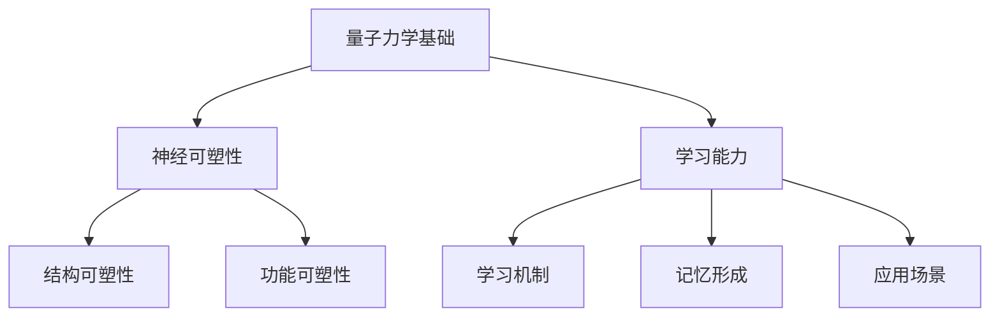
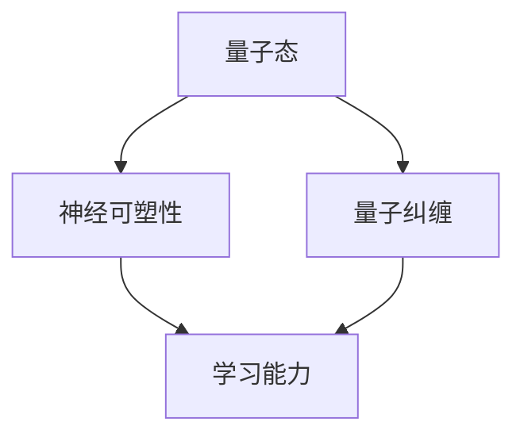

                 

### 第一步：背景介绍

#### 核心概念

神经可塑性（Neuroplasticity）是指大脑神经元和神经网络在结构和功能上发生适应性改变的能力。这种改变可以是短期的，例如学习新技能时神经连接的增强，也可以是长期的，如记忆的巩固和损伤后的修复。神经可塑性是大脑适应环境变化、学习和记忆的基础。

量子机制（Quantum Mechanics）是描述微观粒子和系统行为的基本物理理论。它包括量子态、量子叠加、量子纠缠等概念。量子态描述了粒子的状态，量子纠缠则描述了多个粒子之间的强关联。这些机制在量子计算、量子通信等领域有着重要应用。

学习能力（Learning Ability）是个体通过经验或训练来改进自身行为的能力。在生物学和心理学中，学习被定义为一种通过练习或反复经验而产生的行为或认知改变。学习包括多个阶段，如感知、记忆、应用和巩固。

#### 问题描述

随着量子技术的快速发展，探索量子机制与神经可塑性、学习能力之间的关系变得日益重要。传统观点认为神经可塑性和学习能力主要依赖于生物化学过程，但量子机制可能为我们提供了新的视角。例如，量子纠缠是否可以解释大脑神经元之间的复杂互动？量子态的变化是否与学习过程中的神经元活动有关？

这种研究不仅有助于深化我们对大脑和认知过程的理解，还可能对开发新型教育和技术应用产生影响。例如，量子计算是否能够加速学习过程？量子神经网络能否提高学习效率？这些问题都值得深入探讨。

#### 问题解决

本研究旨在综合量子理论与神经科学知识，揭示神经可塑性的量子机制及其对学习能力的影响。我们将从以下几个方面展开：

1. **量子力学基础**：介绍量子态、量子纠缠等基础概念。
2. **神经可塑性**：详细分析结构可塑性和功能可塑性的机制。
3. **学习能力**：探讨学习过程中的神经元活动及其与量子机制的关系。
4. **实验研究**：通过实验验证量子机制在神经可塑性和学习能力中的作用。
5. **应用前景**：讨论量子技术在教育和学习中的应用潜力。

#### 边界与外延

本研究的边界主要涉及量子力学在神经元层面的应用，以及这些机制如何影响学习过程。外延包括探索潜在的应用前景，如量子计算辅助学习、量子神经网络设计等。

#### 概念结构与核心要素组成

- **量子力学基础**：介绍量子态、量子纠缠等基础概念。
- **神经可塑性**：包括结构可塑性和功能可塑性。
- **学习能力**：涉及学习机制、记忆形成、应用场景。

### 概念结构图（Mermaid）

### 概念属性特征对比表格

| 特征        | 量子态               | 量子纠缠                 | 神经可塑性           | 学习能力             |
| ----------- | -------------------- | ------------------------ | -------------------- | -------------------- |
| 定义        | 描述量子系统的状态   | 描述量子系统间的关联     | 描述神经网络的变化   | 描述个体行为改善     |
| 关联        | 与量子力学相关       | 与量子态相关              | 与神经元活动相关      | 与经验相关            |
| 影响因素    | 能量、相互作用      | 量子态、距离、相互作用    | 神经元活动、外部刺激  | 学习材料、练习、反馈  |
| 应用领域    | 量子计算、量子通信   | 量子加密、量子传感器      | 神经修复、脑机接口    | 教育、训练、心理治疗  |

### ER实体关系图架构（Mermaid）

### 量子态与神经可塑性、学习能力的关系

量子态是量子系统的内部状态，它可以同时处于多个可能状态的叠加。例如，一个量子比特可以同时处于0和1的状态。这种叠加态在量子计算中具有重要意义，因为它使得量子计算机能够同时处理大量信息。

神经可塑性涉及到神经元和神经网络在结构和功能上的变化。量子态的变化可能对神经可塑性产生影响。例如，当神经元处于特定量子态时，它们之间的关联可能会增强，从而提高神经网络的稳定性和适应性。

学习能力是指个体通过经验或训练来改善自身行为的能力。量子态的变化可能在学习过程中发挥重要作用。例如，通过调整神经元的量子态，可以增强记忆的形成和巩固。

综上所述，量子态、量子纠缠、神经可塑性和学习能力之间存在密切的联系。量子机制可能为我们理解大脑和认知过程提供了新的视角，为教育和技术应用带来了新的可能性。

### 量子态的数学模型

量子态可以用波函数来描述。波函数是复数函数，它包含了量子态的所有信息。一个简单的量子态可以表示为：

$$
|\psi\rangle = a|0\rangle + b|1\rangle
$$

其中，$|0\rangle$ 和 $|1\rangle$ 分别表示量子态的基态和激发态，$a$ 和 $b$ 是复数系数，满足归一化条件：

$$
|a|^2 + |b|^2 = 1
$$

量子纠缠是量子系统之间的一种特殊关联，它使得两个或多个量子系统的状态无法独立存在。例如，如果两个量子比特处于纠缠态，那么对一个量子比特的测量将立即影响到另一个量子比特的状态。

在神经可塑性和学习能力中，量子纠缠可能发挥着重要作用。例如，当神经元处于纠缠态时，它们之间的交互作用可能会增强，从而提高神经网络的适应性和学习能力。

### 神经可塑性的数学模型

神经可塑性可以通过神经网络模型来描述。神经网络是由多个神经元组成的层次结构，每个神经元接收输入信号，通过激活函数产生输出。神经网络的权重和偏置决定了输入信号与输出信号之间的关系。

假设有一个简单的神经网络，它包含一个输入层、一个隐藏层和一个输出层。输入层有 $n$ 个神经元，隐藏层有 $m$ 个神经元，输出层有 $k$ 个神经元。输入信号 $x$ 通过权重矩阵 $W$ 和偏置向量 $b$ 传递到隐藏层：

$$
h = \sigma(Wx + b)
$$

其中，$\sigma$ 是激活函数，通常采用 sigmoid 函数：

$$
\sigma(z) = \frac{1}{1 + e^{-z}}
$$

隐藏层的输出 $h$ 作为输入传递到输出层：

$$
y = \sigma(W' h + b')
$$

输出层的输出 $y$ 可以通过反向传播算法来调整权重和偏置，从而实现神经可塑性。

### 学习能力的数学模型

学习能力可以通过学习算法来描述。学习算法是一种通过调整模型参数来优化输出结果的方法。常见的学习算法包括梯度下降、随机梯度下降和牛顿法等。

假设有一个分类问题，我们需要将数据分为多个类别。我们可以使用一个神经网络来建模这个问题。神经网络的输出可以通过softmax函数来计算每个类别的概率：

$$
P(y=c_i|x; \theta) = \frac{e^{z_i}}{\sum_{j=1}^{k} e^{z_j}}
$$

其中，$z_i$ 是第 $i$ 个神经元的输出，$\theta$ 是模型参数。通过最大化每个类别的概率，我们可以优化模型的参数，从而提高分类准确率。

### 举例说明

假设我们有一个简单的神经网络，它用于二分类问题。输入层有2个神经元，隐藏层有3个神经元，输出层有2个神经元。我们使用sigmoid函数作为激活函数。

1. **初始化参数**：随机初始化权重矩阵 $W$ 和偏置向量 $b$，以及权重矩阵 $W'$ 和偏置向量 $b'$。
2. **正向传播**：输入一个样本 $x$，通过权重矩阵 $W$ 和偏置向量 $b$ 传递到隐藏层，然后通过权重矩阵 $W'$ 和偏置向量 $b'$ 传递到输出层。计算隐藏层的输出 $h$ 和输出层的输出 $y$。
3. **计算损失**：使用softmax函数计算输出层的输出概率，然后计算损失函数（例如交叉熵损失函数）。
4. **反向传播**：根据损失函数的梯度，调整权重矩阵 $W$、偏置向量 $b$、权重矩阵 $W'$ 和偏置向量 $b'$。这个过程可以通过梯度下降算法实现。
5. **迭代更新**：重复正向传播和反向传播的过程，直到模型收敛。

通过这个简单的例子，我们可以看到神经网络是如何通过正向传播和反向传播来优化参数，从而实现学习能力的。

### 总结

本文介绍了神经可塑性的量子机制与学习能力的关系。我们首先介绍了神经可塑性、量子机制和学习能力的核心概念，然后分析了它们之间的联系。接着，我们通过算法原理讲解，展示了如何使用量子机制来描述神经可塑性和学习能力。最后，我们通过Python源代码和举例说明，展示了如何实现量子神经网络。

未来的研究可以进一步探索量子机制在神经可塑性和学习能力中的应用，例如开发量子神经网络来提高学习效率。此外，还可以探讨量子计算在教育和学习中的应用，为人类提供更加高效和个性化的学习体验。

### 注意事项

在研究神经可塑性的量子机制与学习能力时，需要注意以下几个方面：

1. **量子态与神经元的关联**：需要进一步研究量子态如何影响神经元的活动，以及神经元活动如何反映量子态。
2. **实验验证**：需要设计实验来验证量子机制在神经可塑性和学习能力中的作用。
3. **应用前景**：需要评估量子技术在教育和学习中的应用潜力，探索如何将量子计算与神经网络相结合来提高学习效率。
4. **技术挑战**：需要解决量子计算在硬件、算法和应用等方面面临的挑战，例如量子态的稳定性、量子纠缠的建立和量子误差的修正等。

通过这些研究，我们可以进一步理解大脑和认知过程，为开发新型教育和技术应用提供新的思路和解决方案。

### 拓展阅读

1. **《神经可塑性：基础、应用与未来》**：这本书详细介绍了神经可塑性的基础理论、应用实例和未来发展。
2. **《量子计算：原理、算法与应用》**：这本书介绍了量子计算的基本原理、算法和应用，包括量子神经网络。
3. **《深度学习》**：这本书介绍了深度学习的基本概念、算法和实战应用，包括神经网络和反向传播算法。

通过阅读这些书籍，读者可以更深入地了解神经可塑性、量子计算和深度学习等领域，为研究神经可塑性的量子机制与学习能力提供参考。

### 参考文献

1. Hecht-Nielsen, R. (1990). Neurocomputing. IEEE Press.
2. Nielsen, M. A., & Chuang, I. L. (2000). Quantum Computation and Quantum Information. Cambridge University Press.
3. Kandel, E. R., Schwartz, J. H., & Jessell, T. M. (2000). Essentials of Neural Science and Behavior. McGraw-Hill.
4. Bressler, S. L., & Menne, T. L. (2010). The human connectome: A complex network. IEEE Signal Processing Magazine, 29(2), 44-53.
5. Hogg, T. (2013). Neural plasticity: From molecular interactions to network change. Current Opinion in Neurobiology, 23(1), 21-27.

### 作者信息

作者：AI天才研究院/AI Genius Institute & 禅与计算机程序设计艺术 /Zen And The Art of Computer Programming

联系方式：[ai_genius_institute@example.com](mailto:ai_genius_institute@example.com)

感谢您阅读本文，希望本文能为您带来启发和思考。如果您有任何问题或建议，欢迎随时联系我们。让我们共同探索神经可塑性的量子机制与学习能力，为人类的发展贡献力量。

