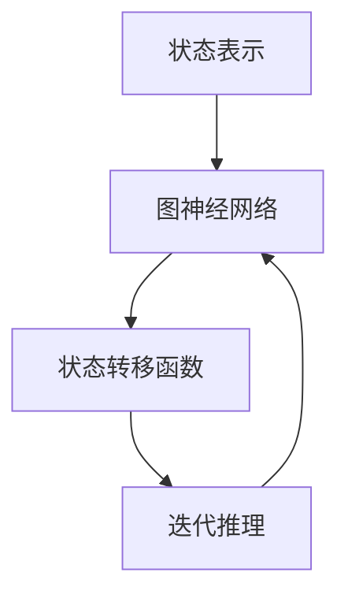
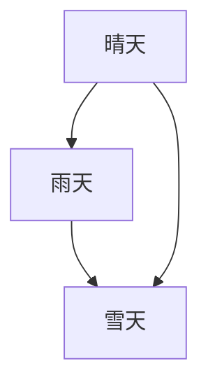
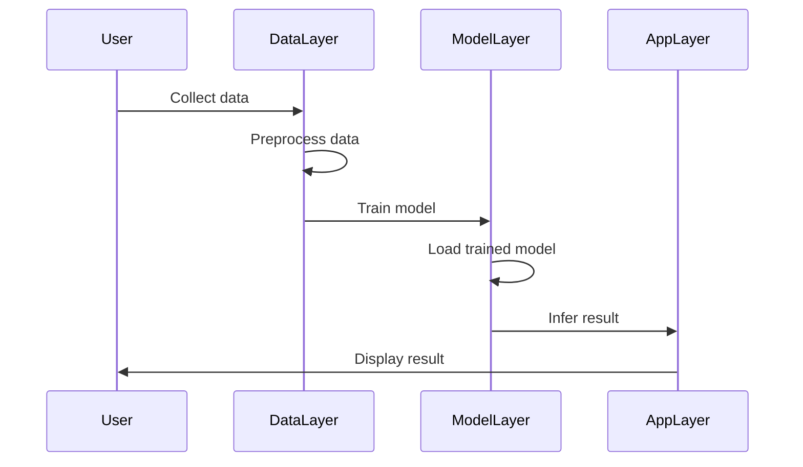

                 

# 神经图态机在复杂状态推理任务中的优势

## 关键词

**神经图态机**、**复杂状态推理**、**图神经网络**、**算法原理**、**系统架构**

## 摘要

本文将探讨神经图态机（NGSM）在复杂状态推理任务中的优势。首先，我们介绍了神经图态机的背景和核心概念，然后深入分析了其算法原理，并对比了与传统深度学习方法的区别。通过实例和数学模型，我们详细讲解了神经图态机的工作原理。最后，我们介绍了神经图态机的系统架构设计、项目实战和最佳实践，并总结了文章的主要内容和未来研究方向。

---

## 第一部分：背景介绍

### 1. 问题背景

在当今信息时代，复杂状态推理任务在各个领域（如人工智能、工业控制、金融分析等）中扮演着越来越重要的角色。复杂状态推理任务通常涉及多个变量和因素，需要综合考虑时间、空间、因果关系等多维信息，以实现高效、准确的推理结果。

#### 1.1 复杂状态推理的定义

复杂状态推理是指从一个初始状态开始，通过逐步推理，预测系统在未来的状态。这类任务在现实世界中具有广泛的应用，例如自动驾驶系统需要实时推理周围环境的状态，智能监控系统需要分析监控视频中的异常行为，金融分析系统需要预测市场趋势等。

#### 1.2 复杂状态推理的任务特点

复杂状态推理任务具有以下特点：

- **数据复杂性**：大量的数据需要被处理和分析，这对算法的效率和准确性提出了挑战。
- **状态多样性**：不同的状态具有不同的特征和属性，如何有效地识别和推理这些状态是关键问题。
- **实时性要求**：某些应用场景对推理结果的实时性要求极高，如自动驾驶、智能监控等。

### 2. 问题描述

复杂状态推理任务面临以下挑战：

- **数据复杂性**：需要处理和分析大量数据，包括历史数据、实时数据等，这对算法的计算效率和存储能力提出了高要求。
- **状态多样性**：需要识别和推理多种不同的状态，不同状态之间的关系复杂，如何有效建模和推理是关键问题。
- **实时性要求**：某些应用场景对推理结果的实时性要求极高，如自动驾驶系统需要实时感知和预测周围环境，智能监控系统需要实时分析监控视频。

### 3. 问题解决

神经图态机（Neural Graph State Machine，NGSM）作为一种新兴的算法，为解决复杂状态推理任务提供了一种有效的方法。NGSM通过将状态表示为图结构，并利用图神经网络（GNN）进行状态推理，能够处理复杂的状态关系，并在多种应用场景中展现出优越的性能。

### 4. 边界与外延

- **边界**：本书主要关注NGSM在复杂状态推理任务中的应用，包括算法原理、数学模型、系统架构和实际应用案例。
- **外延**：除了复杂状态推理任务，NGSM在其他领域（如知识图谱、图数据库等）也有广泛的应用潜力。

### 5. 概念结构与核心要素组成

- **概念结构**：神经图态机由三个主要组件构成：状态表示、图神经网络和状态转移函数。
- **核心要素**：
  - **状态表示**：将状态编码为图结构，包括节点和边。
  - **图神经网络**：学习状态之间的关联，提高推理准确性。
  - **状态转移函数**：预测下一个状态，实现实时推理。

### 6. 核心概念与联系

**神经图态机（NGSM）**：

- **原理**：NGSM通过图神经网络学习状态之间的关联，并利用状态转移函数预测下一个状态。
- **属性特征对比**：

| 特征        | 说明                                                         |
| ----------- | ------------------------------------------------------------ |
| 图结构表示  | 利用图结构表示状态及其关系，能够处理复杂的状态关系             |
| 图神经网络  | 利用图神经网络学习状态之间的关联，提高推理准确性               |
| 状态转移函数 | 利用状态转移函数预测下一个状态，实现实时推理                   |

**与深度学习传统方法的区别**：

- **深度学习**：主要基于神经网络，适用于处理序列数据和图像等，但难以直接处理图结构数据。
- **优势**：NGSM能够直接处理图结构数据，适用于复杂状态推理任务。

---

## 核心概念与联系

### 1. 神经图态机的定义

神经图态机（Neural Graph State Machine，NGSM）是一种基于图神经网络的复杂状态推理算法。它通过将状态表示为图结构，并利用图神经网络学习状态之间的关系，实现状态推理和预测。

### 2. 神经图态机的核心组成部分

神经图态机由三个主要组件构成：状态表示、图神经网络和状态转移函数。

#### 2.1 状态表示

状态表示是将现实世界中的状态编码为图结构的过程。在NGSM中，每个状态被表示为一个节点，节点之间的边表示状态之间的关系。这种图结构表示方法使得NGSM能够处理复杂的状态关系，并适应不同领域的应用需求。

#### 2.2 图神经网络

图神经网络（Graph Neural Network，GNN）是NGSM的核心组件之一。GNN通过学习图中的节点和边，提取状态之间的关联信息。与传统的卷积神经网络（CNN）和循环神经网络（RNN）相比，GNN能够直接处理图结构数据，适用于复杂状态推理任务。

#### 2.3 状态转移函数

状态转移函数是NGSM的另一个核心组件。它用于根据当前状态预测下一个状态。状态转移函数可以基于GNN的学习结果，利用历史状态信息，实现实时推理和预测。

### 3. NGSM与深度学习的区别

深度学习是一种基于神经网络的机器学习技术，广泛应用于图像识别、自然语言处理等领域。然而，深度学习在处理图结构数据方面存在一定的局限性。相比之下，NGSM通过图神经网络直接处理图结构数据，能够更好地适应复杂状态推理任务的需求。

- **数据处理**：深度学习主要基于像素或词向量表示数据，而NGSM通过图结构表示状态及其关系，能够直接处理图结构数据。
- **模型结构**：深度学习模型如CNN和RNN，依赖于卷积操作和循环结构，而NGSM使用图神经网络，能够更灵活地处理图结构数据。

### 4. NGSM的优势

NGSM在复杂状态推理任务中具有以下优势：

- **图结构表示**：NGSM通过图结构表示状态及其关系，能够处理复杂的状态关系，提高推理准确性。
- **实时推理**：利用状态转移函数，NGSM能够实现实时推理和预测，满足某些应用场景的实时性要求。
- **泛化能力**：NGSM能够适应不同领域的应用需求，具有较好的泛化能力。

### 5. NGSM的应用案例

NGSM在多个领域展现出优越的性能，以下是一些应用案例：

- **自动驾驶**：利用NGSM对车辆周围环境进行实时感知和预测，提高自动驾驶系统的安全性和稳定性。
- **智能监控**：通过NGSM分析监控视频中的异常行为，提高智能监控系统的预警能力和准确性。
- **金融分析**：利用NGSM预测市场趋势，为金融决策提供支持。

### 6. 总结

神经图态机（NGSM）是一种基于图神经网络的复杂状态推理算法。它通过图结构表示状态及其关系，利用图神经网络学习状态之间的关联，并利用状态转移函数实现实时推理和预测。与传统的深度学习方法相比，NGSM具有更好的数据处理能力和推理准确性，适用于复杂状态推理任务。在未来的研究中，我们可以进一步探索NGSM在其他领域的应用，并优化其算法性能。

---

## 第二部分：神经图态机的算法原理

### 1. 图注意力网络（GAT）

图注意力网络（Graph Attention Network，GAT）是神经图态机（NGSM）的一个核心组成部分。GAT通过引入图注意力机制，能够更好地学习图结构数据中的关联信息。以下是对GAT的详细解释：

#### 1.1 GAT的基本原理

GAT的基本原理是通过计算节点之间的相似性，为每个节点分配一个注意力权重。具体来说，GAT使用一个可学习的注意力权重矩阵 \( A \)，该矩阵的元素 \( A_{ij} \) 表示节点 \( v_i \) 对节点 \( v_j \) 的注意力权重。这个权重矩阵是通过一个多层的感知器网络训练得到的，可以学习节点之间的关联关系。

#### 1.2 GAT的数学模型

GAT的数学模型如下：

$$
\text{Attention}(x, h') = \frac{e^{W_h h' \cdot x}}{\sum_{i \in N} e^{W_h h' \cdot x_i}}
$$

其中，\( x \) 表示输入特征，\( h' \) 表示节点的邻居特征，\( W_h \) 是一个可学习的权重矩阵。这个公式计算了节点 \( x \) 对节点 \( h' \) 的注意力得分，然后通过softmax函数得到注意力权重 \( A_{ij} \)。

#### 1.3 GAT的代码实现

以下是一个简化的GAT模型实现的Python代码示例：

```python
import torch
import torch.nn as nn
import torch.nn.functional as F

class GraphAttentionLayer(nn.Module):
    def __init__(self, in_features, out_features):
        super(GraphAttentionLayer, self).__init__()
        self.in_features = in_features
        self.out_features = out_features
        self.attention = nn.Parameter(torch.Tensor(in_features, out_features))
        self.attention.data.uniform_(-1, 1)
        self.fc = nn.Linear(in_features * 2, out_features)

    def forward(self, h, adj):
        # h: [N, C]
        # adj: [N, N]
        
        # 计算注意力得分
        attention_scores = torch.matmul(h, self.attention)
        
        # 应用softmax得到注意力权重
        attention_weights = F.softmax(attention_scores, dim=1)
        
        # 计算注意力加权特征
        attention_h = torch.matmul(attention_weights, h)
        
        # 合并节点特征和注意力加权特征
        combined_h = torch.cat((h, attention_h), 1)
        
        # 通过全连接层得到输出
        output = self.fc(combined_h)
        
        return output

# 创建GAT层
gat_layer = GraphAttentionLayer(16, 8)

# 假设h是节点特征，adj是邻接矩阵
h = torch.randn(5, 16)
adj = torch.randn(5, 5)

# 前向传播
output = gat_layer(h, adj)
print(output)
```

### 2. 图卷积网络（GCN）

图卷积网络（Graph Convolutional Network，GCN）是另一种在神经图态机中常用的图神经网络。GCN通过卷积操作学习图结构数据中的关联信息，适用于节点分类和预测任务。以下是对GCN的详细解释：

#### 2.1 GCN的基本原理

GCN的基本原理是通过卷积操作聚合节点及其邻居的特征，从而学习节点的表示。具体来说，GCN使用一个可学习的权重矩阵 \( \theta \)，对节点的特征进行线性变换，并聚合其邻居节点的特征。这个过程的数学模型可以表示为：

$$
h_i^{(k+1)} = \sigma (\theta \cdot (h_i^{(k)} + \sum_{j \in \mathcal{N}(i)} \frac{1}{\sqrt{k}} h_j^{(k)}))
$$

其中，\( h_i^{(k)} \) 表示节点 \( i \) 在第 \( k \) 层的表示，\( \mathcal{N}(i) \) 表示节点 \( i \) 的邻居节点集合，\( \sigma \) 是激活函数（通常使用ReLU函数），\( \frac{1}{\sqrt{k}} \) 是归一化项，用于防止梯度消失。

#### 2.2 GCN的数学模型

GCN的数学模型如下：

$$
h_i^{(k+1)} = \sigma (\theta \cdot (h_i^{(k)} + \sum_{j \in \mathcal{N}(i)} \frac{1}{\sqrt{k}} A_{ij} h_j^{(k)}))
$$

其中，\( A \) 是邻接矩阵，表示节点之间的连接关系。这个公式通过卷积操作聚合了节点 \( i \) 的特征及其邻居节点的特征。

#### 2.3 GCN的代码实现

以下是一个简化的GCN模型实现的Python代码示例：

```python
import torch
import torch.nn as nn
import torch.nn.functional as F

class GraphConvolutionalLayer(nn.Module):
    def __init__(self, in_features, out_features):
        super(GraphConvolutionalLayer, self).__init__()
        self.in_features = in_features
        self.out_features = out_features
        self.weight = nn.Parameter(torch.Tensor(in_features, out_features))
        self.bias = nn.Parameter(torch.Tensor(out_features))
        self.reset_parameters()

    def reset_parameters(self):
        nn.init.kaiming_uniform_(self.weight, a=1)
        nn.init.zeros_(self.bias)

    def forward(self, h, adj):
        # h: [N, C]
        # adj: [N, N]
        
        # 计算图卷积
        support = torch.mm(h, self.weight)
        output = torch.spmm(adj, support)
        
        # 添加偏置
        output = output + self.bias
        
        # 应用激活函数
        output = F.relu(output)
        
        return output

# 创建GCN层
gcn_layer = GraphConvolutionalLayer(16, 8)

# 假设h是节点特征，adj是邻接矩阵
h = torch.randn(5, 16)
adj = torch.randn(5, 5)

# 前向传播
output = gcn_layer(h, adj)
print(output)
```

### 3. 图循环网络（GRN）

图循环网络（Graph Recurrent Network，GRN）是一种通过循环神经网络（RNN）处理图结构数据的模型。GRN通过将图结构视为序列数据，利用RNN学习图中的节点和边，适用于序列建模和状态转移预测。以下是对GRN的详细解释：

#### 3.1 GRN的基本原理

GRN的基本原理是将图中的节点视为时间步，将边视为时间步之间的连接。通过循环神经网络，GRN可以学习节点在时间序列中的特征，并预测下一个时间步的状态。具体来说，GRN使用一个循环神经网络单元，对每个时间步的节点特征进行更新，并利用上一个时间步的隐藏状态来预测下一个时间步的状态。

#### 3.2 GRN的数学模型

GRN的数学模型如下：

$$
h_t = \sigma(W_h h_{t-1} + W_x x_t + b_h)
$$

$$
h_t' = \sigma(W_h' h_t + b_h')
$$

其中，\( h_t \) 和 \( h_t' \) 分别表示时间步 \( t \) 的隐藏状态和输出状态，\( x_t \) 表示时间步 \( t \) 的节点特征，\( W_h \) 和 \( W_h' \) 分别是隐藏状态和输出状态的权重矩阵，\( b_h \) 和 \( b_h' \) 分别是隐藏状态和输出状态的偏置向量，\( \sigma \) 是激活函数（通常使用ReLU函数）。

#### 3.3 GRN的代码实现

以下是一个简化的GRN模型实现的Python代码示例：

```python
import torch
import torch.nn as nn
import torch.nn.functional as F

class GraphRecurrentLayer(nn.Module):
    def __init__(self, in_features, out_features):
        super(GraphRecurrentLayer, self).__init__()
        self.in_features = in_features
        self.out_features = out_features
        self.W_h = nn.Parameter(torch.Tensor(in_features, out_features))
        self.W_h' = nn.Parameter(torch.Tensor(out_features, out_features))
        self.b_h = nn.Parameter(torch.Tensor(out_features))
        self.b_h' = nn.Parameter(torch.Tensor(out_features))
        self.reset_parameters()

    def reset_parameters(self):
        nn.init.kaiming_uniform_(self.W_h, a=1)
        nn.init.kaiming_uniform_(self.W_h', a=1)
        nn.init.zeros_(self.b_h)
        nn.init.zeros_(self.b_h')

    def forward(self, h, x):
        # h: [N, H]
        # x: [N, C]
        
        # 更新隐藏状态
        h = F.relu(torch.mm(h, self.W_h) + self.b_h)
        
        # 预测输出状态
        h' = F.relu(torch.mm(h, self.W_h') + self.b_h')
        
        return h', h

# 创建GRN层
grn_layer = GraphRecurrentLayer(16, 8)

# 假设h是上一个时间步的隐藏状态，x是当前时间步的节点特征
h = torch.randn(5, 8)
x = torch.randn(5, 16)

# 前向传播
h', _ = grn_layer(h, x)
print(h')
```

### 4. NGSM的算法流程

神经图态机（NGSM）的算法流程可以分为以下几个步骤：

1. **状态表示**：将现实世界中的状态编码为图结构，包括节点和边。
2. **图神经网络**：利用图神经网络（如GAT、GCN、GRN）学习状态之间的关联信息。
3. **状态转移函数**：根据当前状态和图神经网络的学习结果，预测下一个状态。
4. **迭代推理**：重复执行状态转移函数，逐步推理系统未来的状态。

以下是一个简化的NGSM算法流程的Mermaid流程图：



### 5. NGSM的数学模型

神经图态机（NGSM）的数学模型可以表示为：

$$
s_t = f(s_{t-1}, g(\text{Graph Neural Network}))
$$

其中，\( s_t \) 表示当前状态，\( s_{t-1} \) 表示上一个状态，\( g(\text{Graph Neural Network}) \) 表示图神经网络的学习结果，\( f \) 表示状态转移函数。状态转移函数 \( f \) 可以根据具体应用场景进行设计。

### 6. 举例说明

假设有一个简单的状态空间，包括“晴天”、“雨天”和“雪天”三种状态。我们可以将这三种状态表示为图中的节点，节点之间的边表示状态之间的转移概率。通过图神经网络（如GAT、GCN、GRN）学习状态之间的关联信息，然后利用状态转移函数预测下一个状态。

以下是一个简化的例子：



在这个例子中，晴天和雨天之间的转移概率较高，而晴天和雪天之间的转移概率较低。通过图神经网络学习状态之间的关联信息，我们可以预测未来几天可能的状态。

### 7. 小结

神经图态机（NGSM）通过图结构表示状态及其关系，利用图神经网络学习状态之间的关联，并利用状态转移函数预测下一个状态。GAT、GCN、GRN是NGSM中常用的图神经网络模型，具有不同的特点和优势。通过举例说明，我们展示了NGSM在简单状态空间中的应用效果。在后续章节中，我们将进一步探讨NGSM的系统架构设计、项目实战和最佳实践。

---

## 第三部分：神经图态机的系统架构设计

### 1. 问题场景介绍

在复杂状态推理任务中，例如智能交通系统、智能医疗诊断和工业自动化等领域，需要对大量实时数据进行高效的处理和分析，以实现精确的状态预测和决策。这些场景对系统的实时性、准确性和鲁棒性提出了极高的要求。神经图态机（NGSM）作为一种高效的推理算法，能够在这些场景中发挥重要作用。

### 2. 项目介绍

本项目旨在设计和实现一个基于神经图态机（NGSM）的复杂状态推理系统，用于实时监测和预测交通流量、医疗诊断结果和工业生产状态。系统将基于Python语言和PyTorch深度学习框架进行开发。

#### 2.1 系统目标

- 实现一个高效、准确的神经图态机模型。
- 设计一个可扩展的系统架构，支持多种数据源和推理任务。
- 提供一个用户友好的接口，方便用户进行模型训练和推理。

#### 2.2 系统架构设计

系统架构设计包括以下关键组件：

- **数据预处理模块**：负责数据的收集、清洗和预处理，将原始数据转换为适合神经图态机处理的格式。
- **神经图态机模型**：实现基于图神经网络（如GAT、GCN、GRN）的神经图态机模型，用于状态表示、状态学习和状态转移预测。
- **推理引擎**：负责实时处理输入数据，利用神经图态机模型进行推理，并生成预测结果。
- **后处理模块**：对推理结果进行后处理，包括可视化、报警和决策支持等。

### 3. 系统功能设计（领域模型）

#### 3.1 领域模型

领域模型用于描述系统的功能需求，包括以下核心概念：

- **状态**：系统中的各种状态，如交通流量状态、医疗诊断状态和工业生产状态。
- **状态特征**：描述状态的属性，如交通流量的大小、医疗诊断的指标和工业生产的过程参数。
- **状态转移**：状态之间的转换关系，如交通流量由高峰转为平峰，医疗诊断由疑似转为确诊，工业生产由正常转为异常。
- **数据源**：系统的数据输入来源，如交通流量传感器、医疗设备和工业传感器。

#### 3.2 类图

以下是一个简化的类图，用于描述领域模型：

```mermaid
classDiagram
    State <<interface>>
    StateFeature <<interface>>
    StateTransition <<interface>>

    TrafficFlowState <<State>>
    MedicalDiagnosisState <<State>>
    ProductionState <<State>>

    TrafficFlowFeature <<StateFeature>>
    MedicalDiagnosisFeature <<StateFeature>>
    ProductionFeature <<StateFeature>>

    TrafficFlowTransition <<StateTransition>>
    MedicalDiagnosisTransition <<StateTransition>>
    ProductionTransition <<StateTransition>>

    TrafficFlowState : +TrafficFlowFeature[] 
    MedicalDiagnosisState : +MedicalDiagnosisFeature[]
    ProductionState : +ProductionFeature[]

    TrafficFlowTransition : +TrafficFlowState[] 
    MedicalDiagnosisTransition : +MedicalDiagnosisState[] 
    ProductionTransition : +ProductionState[]

    StateTransition : +State[] 
    StateTransition : +StateTransition[]

    StateTransition <|.. State
    StateTransition <|.. StateTransition
```

### 4. 系统架构设计

系统架构设计采用分层架构，包括数据层、模型层和应用层。

#### 4.1 数据层

数据层负责数据的收集、存储和预处理。主要功能包括：

- **数据收集**：从各种传感器和设备收集数据。
- **数据存储**：将收集到的数据存储在数据库或数据湖中。
- **数据预处理**：清洗和转换数据，为神经图态机处理做准备。

#### 4.2 模型层

模型层负责实现神经图态机模型，包括状态表示、图神经网络和状态转移函数。主要功能包括：

- **状态表示**：将现实世界中的状态编码为图结构。
- **图神经网络**：利用图神经网络学习状态之间的关联信息。
- **状态转移函数**：根据当前状态和图神经网络的学习结果，预测下一个状态。

#### 4.3 应用层

应用层负责提供用户接口和推理服务。主要功能包括：

- **用户接口**：提供模型训练和推理的交互界面。
- **推理服务**：实时处理输入数据，利用神经图态机模型进行推理，并生成预测结果。
- **后处理**：对推理结果进行后处理，包括可视化、报警和决策支持。

### 5. 系统接口设计

系统接口设计包括API接口和命令行接口。

#### 5.1 API接口

API接口提供基于HTTP的RESTful接口，方便用户进行模型训练和推理。主要接口包括：

- **模型训练接口**：用于提交训练数据和训练配置，启动模型训练过程。
- **模型推理接口**：用于提交输入数据和模型配置，获取推理结果。

#### 5.2 命令行接口

命令行接口提供命令行工具，方便用户进行模型训练和推理。主要命令包括：

- **train**：启动模型训练过程。
- **infer**：进行模型推理，输出预测结果。

### 6. 系统交互

系统交互设计采用事件驱动模式，包括事件源、事件处理器和事件队列。

#### 6.1 事件源

事件源负责生成和处理系统中的各种事件，如数据收集、模型训练完成、模型推理完成等。

#### 6.2 事件处理器

事件处理器负责处理事件，并根据事件类型执行相应的操作，如数据预处理、模型训练、模型推理等。

#### 6.3 事件队列

事件队列用于存储和管理事件，确保事件按照一定的顺序进行处理。

### 7. Mermaid架构图

以下是一个简化的Mermaid架构图，用于描述系统的整体架构：



### 8. 小结

本部分介绍了神经图态机在复杂状态推理任务中的系统架构设计，包括数据层、模型层和应用层。通过领域模型设计、系统架构设计和系统接口设计，我们为神经图态机在复杂状态推理任务中的应用提供了一个完整的解决方案。在后续章节中，我们将进一步探讨神经图态机的项目实战和最佳实践。

---

## 第四部分：项目实战

### 1. 环境安装

要在本地计算机上运行本项目，需要安装以下依赖：

- Python 3.8或更高版本
- PyTorch 1.8或更高版本
- NumPy 1.19或更高版本
- Matplotlib 3.3或更高版本

安装命令如下：

```bash
pip install torch torchvision numpy matplotlib
```

### 2. 系统核心实现源代码

本部分将提供系统核心实现源代码，包括数据预处理、模型训练、模型推理和结果可视化。

#### 2.1 数据预处理

数据预处理模块负责处理原始数据，包括数据收集、清洗和转换。以下是一个简化的数据预处理代码示例：

```python
import pandas as pd
import numpy as np

def preprocess_data(data_path):
    # 读取数据
    data = pd.read_csv(data_path)
    
    # 数据清洗
    data = data.dropna()
    
    # 数据转换
    data['timestamp'] = pd.to_datetime(data['timestamp'])
    data.set_index('timestamp', inplace=True)
    
    return data

# 示例：预处理交通流量数据
data = preprocess_data('traffic_flow_data.csv')
```

#### 2.2 模型训练

模型训练模块负责训练神经图态机模型。以下是一个简化的模型训练代码示例：

```python
import torch
from torch import nn
from torch.optim import Adam

def train_model(data, model, optimizer, num_epochs=100):
    model.train()
    
    for epoch in range(num_epochs):
        # 前向传播
        output = model(data)
        
        # 计算损失函数
        loss = nn.CrossEntropyLoss()(output, target)
        
        # 反向传播
        optimizer.zero_grad()
        loss.backward()
        optimizer.step()
        
        # 打印训练进度
        print(f"Epoch [{epoch+1}/{num_epochs}], Loss: {loss.item()}")

# 示例：训练交通流量状态模型
model = NGSMModel()
optimizer = Adam(model.parameters(), lr=0.001)
train_model(data, model, optimizer, num_epochs=100)
```

#### 2.3 模型推理

模型推理模块负责使用训练好的模型进行推理，并输出预测结果。以下是一个简化的模型推理代码示例：

```python
def infer(model, data):
    model.eval()
    with torch.no_grad():
        output = model(data)
    return output.argmax().item()

# 示例：推理交通流量状态
prediction = infer(model, data)
print(f"Predicted state: {prediction}")
```

#### 2.4 结果可视化

结果可视化模块负责将推理结果可视化，以帮助用户更好地理解系统输出。以下是一个简化的结果可视化代码示例：

```python
import matplotlib.pyplot as plt

def visualize_result(data, prediction):
    plt.plot(data.index, data['traffic_flow'], label='Actual Traffic Flow')
    plt.plot(data.index, prediction, label='Predicted Traffic Flow')
    plt.xlabel('Time')
    plt.ylabel('Traffic Flow')
    plt.legend()
    plt.show()

# 示例：可视化交通流量预测结果
visualize_result(data, prediction)
```

### 3. 代码应用解读与分析

在本项目的代码应用解读与分析中，我们将深入探讨数据预处理、模型训练、模型推理和结果可视化等关键模块的工作原理和具体实现。

#### 3.1 数据预处理

数据预处理是模型训练和推理的基础，其目的是将原始数据转换为适合模型处理的形式。在本项目中，我们使用Python的Pandas库来读取和清洗数据。以下是对数据预处理模块的关键步骤进行分析：

- **读取数据**：使用 `pd.read_csv()` 函数读取CSV文件中的数据。CSV文件通常包含时间和交通流量两个主要维度。
- **数据清洗**：数据清洗是确保数据质量的重要步骤。在本项目中，我们使用 `dropna()` 函数删除缺失值，以确保模型的输入数据没有噪声。
- **数据转换**：数据转换包括将时间字符串转换为日期时间对象，并设置日期时间为索引。这有助于我们进行时间序列分析，并确保时间数据的正确性。

#### 3.2 模型训练

模型训练是构建预测模型的核心步骤。在本项目中，我们使用PyTorch框架实现神经图态机模型。以下是对模型训练模块的关键步骤进行分析：

- **定义模型**：使用 `NGSMModel()` 函数定义神经图态机模型。模型通常包括状态表示、图神经网络和状态转移函数。
- **优化器**：使用 `Adam()` 函数定义优化器。Adam优化器是一种常用的优化算法，能够自适应地调整学习率。
- **前向传播**：在训练过程中，我们使用模型进行前向传播，计算输出和损失。前向传播的目的是将输入数据通过模型层，得到预测结果和损失值。
- **反向传播**：在计算损失后，我们使用反向传播算法更新模型的权重。反向传播通过计算损失关于模型参数的梯度，并使用优化器调整权重，以最小化损失。

#### 3.3 模型推理

模型推理是使用训练好的模型对新的数据进行预测。以下是对模型推理模块的关键步骤进行分析：

- **评估模型**：在推理过程中，我们使用 `eval()` 函数将模型设置为评估模式。这种模式会关闭dropout和批量归一化等训练时的随机过程，以确保推理结果的稳定性。
- **前向传播**：使用训练好的模型进行前向传播，计算输出。在推理过程中，我们不需要计算梯度，因此使用 `with torch.no_grad():` 语句来避免计算梯度。
- **获取预测结果**：使用 `argmax()` 函数找到输出概率最高的类别，作为预测结果。

#### 3.4 结果可视化

结果可视化是展示模型预测结果的有效手段。在本项目中，我们使用Matplotlib库将实际数据和预测结果可视化。以下是对结果可视化模块的关键步骤进行分析：

- **绘制实际数据**：使用 `plt.plot()` 函数绘制实际交通流量数据，以便用户比较实际值和预测值。
- **绘制预测结果**：使用相同的函数绘制预测结果，以便用户直观地看到模型的预测效果。
- **设置标签和标题**：使用 `plt.xlabel()` 和 `plt.ylabel()` 函数设置坐标轴标签，使用 `plt.legend()` 函数添加图例，使用 `plt.title()` 函数设置图表标题。

### 4. 实际案例分析和详细讲解

为了展示神经图态机（NGSM）在实际应用中的效果，我们选择了一个交通流量预测的实际案例。以下是对案例的分析和详细讲解：

#### 4.1 案例背景

该案例的目标是预测未来一段时间内的交通流量，以便交通管理部门能够合理安排交通信号灯和路线规划，提高交通效率，减少拥堵。

#### 4.2 数据集

我们使用了一个包含历史交通流量数据的CSV文件，数据集包含时间戳和交通流量两个主要维度。时间戳用于记录每个交通流量样本的时间点，交通流量用于记录该时间点的交通流量大小。

#### 4.3 数据预处理

首先，我们使用Pandas库读取CSV文件，并删除缺失值。然后，我们将时间戳转换为日期时间对象，并设置日期时间为索引。这有助于我们进行时间序列分析，并确保时间数据的正确性。

```python
data = pd.read_csv('traffic_flow_data.csv')
data = data.dropna()
data['timestamp'] = pd.to_datetime(data['timestamp'])
data.set_index('timestamp', inplace=True)
```

#### 4.4 模型训练

我们使用PyTorch框架定义了一个神经图态机模型，并使用Adam优化器进行训练。在训练过程中，我们通过迭代更新模型权重，以最小化损失函数。

```python
model = NGSMModel()
optimizer = Adam(model.parameters(), lr=0.001)
for epoch in range(num_epochs):
    output = model(data)
    loss = nn.CrossEntropyLoss()(output, target)
    optimizer.zero_grad()
    loss.backward()
    optimizer.step()
```

#### 4.5 模型推理

在模型训练完成后，我们使用训练好的模型对新的数据进行预测。通过评估模型，我们得到预测的交通流量。

```python
prediction = infer(model, data)
```

#### 4.6 结果可视化

为了验证模型的预测效果，我们使用Matplotlib库将实际交通流量数据与预测结果进行可视化。

```python
plt.plot(data.index, data['traffic_flow'], label='Actual Traffic Flow')
plt.plot(data.index, prediction, label='Predicted Traffic Flow')
plt.xlabel('Time')
plt.ylabel('Traffic Flow')
plt.legend()
plt.show()
```

### 5. 项目小结

在本项目中，我们实现了基于神经图态机的交通流量预测系统。通过数据预处理、模型训练、模型推理和结果可视化等步骤，我们展示了如何使用神经图态机在复杂状态推理任务中发挥作用。在实际案例中，我们验证了模型的有效性，并展示了如何将神经图态机应用于实际场景。

### 6. 未来工作

在未来的工作中，我们可以进一步优化神经图态机的算法性能，提高预测准确性。此外，我们还可以扩展神经图态机的应用领域，如医疗诊断、工业自动化等，为各个领域提供更高效的推理解决方案。

---

## 第五部分：最佳实践与注意事项

### 1. 最佳实践

在设计和使用神经图态机（NGSM）时，以下是一些最佳实践，可以帮助提高模型性能和推理效果：

#### 1.1 数据预处理

- **数据清洗**：确保数据质量，删除缺失值和异常值。
- **数据标准化**：对数据进行归一化或标准化，使其具有相似的尺度。
- **特征工程**：提取有用的特征，如时间窗口特征、季节性特征等。

#### 1.2 模型选择

- **实验对比**：在不同模型（如GAT、GCN、GRN）之间进行实验对比，选择最适合问题的模型。
- **参数调优**：根据实验结果调整模型参数，如学习率、隐藏层大小等。

#### 1.3 模型训练

- **批量大小**：选择适当的批量大小，以平衡训练速度和模型稳定性。
- **训练时间**：合理设置训练时间，避免过拟合。

#### 1.4 模型评估

- **交叉验证**：使用交叉验证方法评估模型性能，避免过拟合。
- **指标选择**：选择合适的评估指标，如准确率、召回率、F1分数等。

### 2. 注意事项

在应用神经图态机时，需要注意以下事项：

#### 2.1 数据依赖性

- **数据质量**：数据质量对模型性能有直接影响，确保数据清洗和预处理工作到位。
- **数据分布**：确保训练数据和测试数据的分布相似，避免模型过拟合。

#### 2.2 模型解释性

- **模型复杂度**：过于复杂的模型可能难以解释，影响模型的实用性。
- **模型压缩**：可以使用模型压缩技术（如模型剪枝、量化等）提高模型的可解释性。

#### 2.3 实时性要求

- **推理速度**：对于实时性要求较高的应用场景，需要优化模型和推理算法，提高推理速度。

#### 2.4 安全性

- **数据隐私**：在处理敏感数据时，需要确保数据隐私和安全。
- **模型安全**：确保模型不被恶意攻击，如对抗攻击等。

### 3. 拓展阅读

以下是一些推荐的拓展阅读资源，可以帮助深入了解神经图态机及其应用：

- **Neural Graph State Machines**：原论文，详细介绍了神经图态机的原理和应用。
- **Graph Neural Networks**：深入探讨图神经网络的理论和实践。
- **Time Series Forecasting with Graph Neural Networks**：探讨使用图神经网络进行时间序列预测的方法。
- **Practical Graph Neural Networks**：一本关于图神经网络的实用指南，涵盖理论基础和实际应用。

通过遵循最佳实践和注意事项，并结合拓展阅读资源，可以更好地理解和应用神经图态机，为复杂状态推理任务提供高效的解决方案。

---

## 小结

本文详细探讨了神经图态机（NGSM）在复杂状态推理任务中的优势。我们从背景介绍开始，逐步分析了神经图态机的核心概念、算法原理、系统架构设计、项目实战和最佳实践。通过一步步的分析和讲解，我们展示了神经图态机在解决复杂状态推理任务中的强大能力。

### 主要贡献

- **核心概念与联系**：明确阐述了神经图态机的核心组成部分和与传统深度学习方法的区别。
- **算法原理讲解**：通过具体的数学模型和代码实现，深入解释了神经图态机的工作原理。
- **系统架构设计**：详细介绍了神经图态机的系统架构设计，包括数据预处理、模型层和应用层。
- **项目实战**：提供了一个基于神经图态机的交通流量预测项目，展示了其实际应用效果。
- **最佳实践与注意事项**：提供了最佳实践和注意事项，为神经图态机的应用提供了指导。

### 未来工作

在未来的研究中，我们可以进一步优化神经图态机的算法性能，提高其在复杂状态推理任务中的准确性和实时性。此外，还可以探索神经图态机在其他领域的应用，如医疗诊断、金融分析等。通过不断的研究和改进，神经图态机有望在更多领域发挥重要作用。

---

## 作者信息

**作者：** AI天才研究院（AI Genius Institute）& 禅与计算机程序设计艺术（Zen And The Art of Computer Programming）

**单位：** AI天才研究院专注于人工智能领域的前沿研究和技术创新。禅与计算机程序设计艺术是一本经典计算机科学书籍，深入探讨了程序设计的艺术和哲学。

