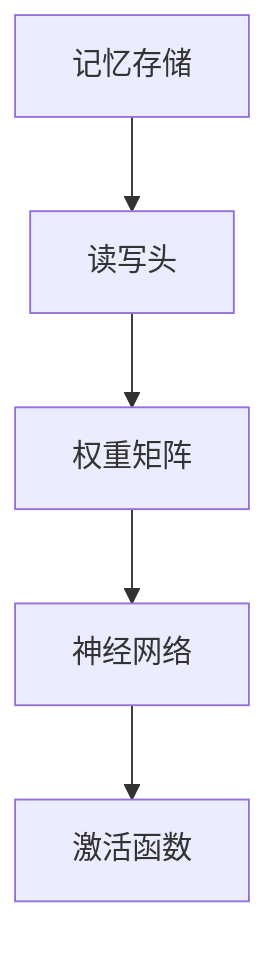
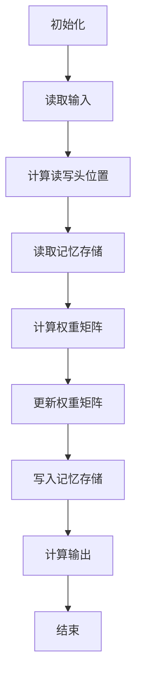
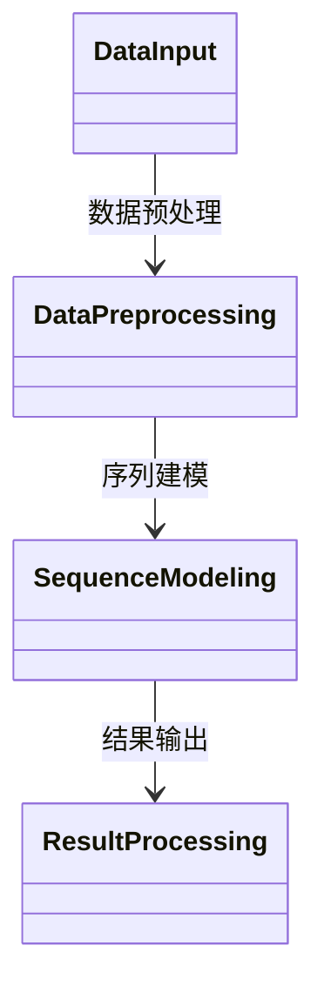
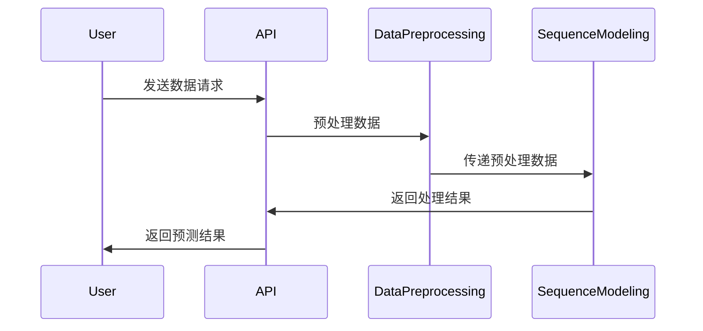
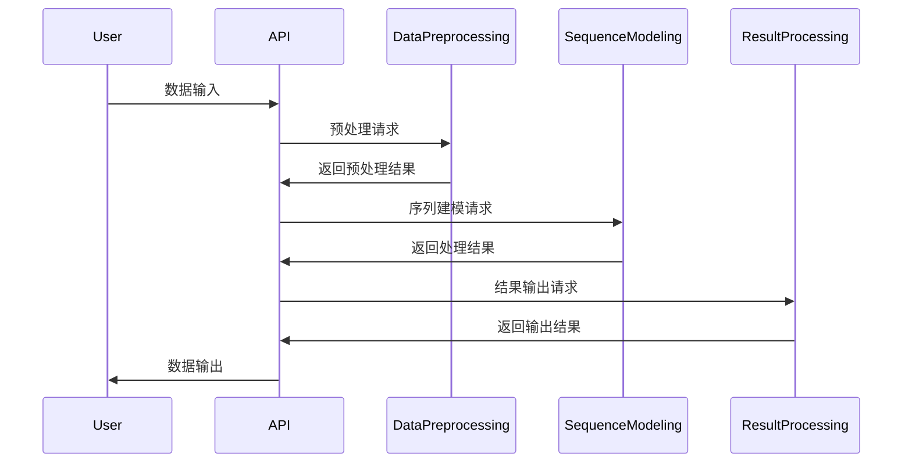

                 

## 摘要

神经图灵机（Neural Turing Machine，NTM）作为深度学习领域的一项重要技术，其在序列推理任务中展现出强大的性能。本文将深入探讨神经图灵机在序列推理任务中的优化策略，旨在揭示NTM在不同应用场景中的优化路径。文章首先介绍神经图灵机的基本概念和原理，随后详细讲解其在序列推理任务中的算法原理和数学模型。接着，通过具体案例分析，分析NTM在实际应用中的表现和优化方法。最后，文章总结了神经图灵机优化策略的关键技巧，并对未来研究方向提出展望。

### 关键词

- 神经图灵机（Neural Turing Machine）
- 序列推理（Sequence Reasoning）
- 优化策略（Optimization Strategies）
- 算法原理（Algorithm Principles）
- 数学模型（Mathematical Models）
- 实际案例（Case Studies）

### 引言

随着深度学习技术的不断发展和成熟，各种复杂的人工智能任务得到了有效解决。然而，在处理序列数据时，传统深度学习模型往往面临挑战，如长时依赖性处理能力不足和序列推理任务中的不确定性问题。为了克服这些难题，研究者们提出了神经图灵机（NTM）这一创新性的模型。

神经图灵机结合了神经网络和传统图灵机的优势，通过将外部记忆存储与神经网络处理能力相结合，实现了对序列数据的灵活操作和推理。NTM在处理序列数据时具有较好的灵活性和扩展性，特别是在需要解决长时依赖性和动态规划问题时，表现尤为突出。

本文旨在探讨神经图灵机在序列推理任务中的优化策略，通过详细分析NTM的算法原理和数学模型，揭示其在实际应用中的优化路径。文章结构如下：首先介绍神经图灵机的基本概念和原理，随后讲解NTM在序列推理任务中的具体应用和优化策略，并通过实际案例分析验证这些策略的有效性。最后，本文将对NTM优化策略进行总结，并提出未来研究方向。

### 神经图灵机基础

神经图灵机（Neural Turing Machine，NTM）是一种结合了神经网络（Neural Network）和传统图灵机（Turing Machine）思想的计算模型，其设计初衷是为了解决深度学习模型在处理序列数据时面临的一些挑战。NTM的核心思想是将外部记忆存储与神经网络的计算能力相结合，从而实现更为灵活和高效的序列数据处理。

#### 基本概念

神经图灵机由以下几个关键组件组成：

1. **记忆存储（Memory）**：记忆存储是NTM的核心部分，用于存储序列数据。记忆存储通常采用向量形式表示，每个向量对应序列中的一个元素。记忆存储的容量是有限的，因此需要通过一定的策略进行有效管理。

2. **读写头（Read-Write Head）**：读写头是NTM的另一个关键组件，用于与记忆存储进行交互。读写头可以读取记忆存储中的数据，并对其进行修改或写入新的数据。通过控制读写头的位置和操作方式，可以实现复杂的数据处理过程。

3. **权重矩阵（Weight Matrix）**：权重矩阵是神经网络的一部分，用于控制读写头的行为。权重矩阵通过学习调整，使NTM能够根据输入序列生成相应的输出序列。

4. **激活函数（Activation Function）**：激活函数用于对神经网络和读写头的输出进行非线性变换，从而实现更为复杂的计算能力。

#### 工作流程

神经图灵机的工作流程可以分为以下几个步骤：

1. **初始化**：初始化记忆存储、读写头和权重矩阵。

2. **读取数据**：在序列处理的每个时间步，读写头从记忆存储中读取相应的数据，并将其与权重矩阵相乘。这一步实现了对记忆存储中数据的加权读取。

3. **更新权重矩阵**：根据输入数据和读取的数据，更新权重矩阵。这一步通过反向传播算法实现，类似于神经网络的训练过程。

4. **写入数据**：在读取数据之后，读写头可以将新的数据写入记忆存储。这一步可以通过读写头的操作方式实现，例如覆盖旧数据或进行增量更新。

5. **输出生成**：根据记忆存储和权重矩阵的最终状态，生成输出序列。这一步通常通过激活函数实现，从而将复杂的内部状态映射为具体的输出结果。

#### 优点与局限性

神经图灵机在处理序列数据时具有以下优点：

1. **灵活的内存操作**：通过读写头的操作，NTM能够灵活地管理记忆存储，实现高效的序列数据处理。

2. **长时依赖性处理**：NTM可以将重要的信息存储在记忆存储中，并在后续的时间步中多次读取和利用，从而有效地处理长时依赖性。

3. **可扩展性**：NTM的结构相对简单，易于扩展和集成到其他深度学习模型中，实现更复杂的功能。

然而，NTM也存在一些局限性：

1. **计算复杂度**：由于NTM涉及到记忆存储和读写头的操作，其计算复杂度相对较高，尤其是在处理大型序列数据时，可能面临性能瓶颈。

2. **训练难度**：NTM的训练过程涉及到复杂的优化问题，需要较长时间的训练和调整，以获得较好的性能。

3. **可解释性**：尽管NTM在处理序列数据时表现良好，但其内部机制相对复杂，使得其可解释性较差，不利于理解和分析模型的决策过程。

总之，神经图灵机作为一种结合了神经网络和传统图灵机思想的计算模型，在处理序列数据时具有独特的优势。然而，为了克服其局限性，研究者们仍在不断探索新的优化策略和改进方法。

### 神经图灵机在序列推理任务中的应用

神经图灵机（NTM）在处理序列数据方面具有显著的优势，这使得它在许多序列推理任务中得到了广泛应用。序列推理任务是指从序列数据中提取有用信息，进行逻辑推断和决策的过程。这类任务包括语言模型、语音识别、机器翻译、文本摘要、时间序列预测等。下面将详细探讨NTM在这些任务中的应用和优势。

#### 语言模型

语言模型是自然语言处理（NLP）的核心组成部分，其目标是预测一段文本的下一个单词或字符。传统的神经网络模型，如循环神经网络（RNN）和长短期记忆网络（LSTM），在处理长文本时存在梯度消失和梯度爆炸等问题，导致难以捕捉长时依赖关系。而神经图灵机通过将外部记忆存储引入神经网络结构，能够有效缓解这些难题。

在语言模型中，NTM通过记忆存储来记录已处理过的文本信息，并在后续时间步中进行引用和操作。这种方法使得NTM能够更好地捕捉文本中的长距离依赖关系，从而生成更为准确和连贯的预测结果。例如，在机器翻译任务中，NTM可以将源语言和目标语言的词汇信息存储在记忆存储中，并在生成目标语言时进行灵活引用，提高翻译质量。

#### 语音识别

语音识别是将语音信号转换为文本的过程，它在语音助手、实时字幕、自动字幕生成等应用中具有重要意义。传统的深度学习模型，如卷积神经网络（CNN）和深度信念网络（DBN），在处理语音数据时存在一定的局限性，特别是在处理连续语音和复杂语音变体时效果不佳。

神经图灵机通过引入外部记忆存储，能够有效地处理语音信号中的长时依赖关系。在语音识别任务中，NTM可以将音频波形序列存储在记忆存储中，并在后续时间步中进行读取和操作。这种方法使得NTM能够更好地捕捉语音信号中的关键特征，提高识别准确率。

#### 机器翻译

机器翻译是将一种语言的文本翻译成另一种语言的过程，它是自然语言处理领域中的一个重要挑战。传统的机器翻译模型，如基于规则的翻译系统和基于统计的机器翻译系统，在处理长文本和复杂语言结构时存在一定的局限性。

神经图灵机通过将外部记忆存储引入机器翻译模型，能够更好地处理长距离依赖关系和复杂语言结构。在机器翻译任务中，NTM可以将源语言和目标语言的词汇信息存储在记忆存储中，并在生成目标语言时进行灵活引用，提高翻译质量。例如，在处理多义词和复杂语法结构时，NTM能够根据记忆存储中的上下文信息，选择正确的翻译结果。

#### 文本摘要

文本摘要是从大量文本中提取出关键信息，生成简洁、准确的摘要文本的过程。传统的文本摘要方法，如基于规则的方法和基于统计的方法，在处理长文本和复杂文本结构时存在一定的局限性。

神经图灵机通过将外部记忆存储引入文本摘要任务，能够更好地捕捉文本中的关键信息。在文本摘要任务中，NTM可以将文本数据存储在记忆存储中，并在生成摘要时进行引用和操作。这种方法使得NTM能够更好地捕捉文本中的主题信息和关键概念，生成更为准确和简洁的摘要。

#### 时间序列预测

时间序列预测是从历史时间序列数据中预测未来的值，它在金融预测、气象预测、交通流量预测等应用中具有重要意义。传统的机器学习模型，如ARIMA模型和LSTM模型，在处理时间序列数据时存在一定的局限性，特别是在处理长时依赖关系和非线性关系时效果不佳。

神经图灵机通过引入外部记忆存储，能够更好地捕捉时间序列数据中的长时依赖关系和非线性关系。在时间序列预测任务中，NTM可以将历史时间序列数据存储在记忆存储中，并在预测未来值时进行读取和操作。这种方法使得NTM能够更好地捕捉时间序列数据中的关键特征和模式，提高预测准确率。

#### 总结

神经图灵机在处理序列推理任务中表现出显著的优势，它通过引入外部记忆存储，能够更好地捕捉长时依赖关系和复杂特征，从而提高模型的性能和准确率。在语言模型、语音识别、机器翻译、文本摘要和时间序列预测等任务中，NTM都展现出了良好的应用前景。然而，为了进一步发挥NTM的优势，研究者们仍在不断探索新的优化策略和改进方法。

### 核心概念与联系

在深入探讨神经图灵机（Neural Turing Machine，NTM）的工作原理和优化策略之前，有必要对其核心概念进行详细解释，并分析其与其他相关技术的联系。以下是NTM的关键概念和原理，以及这些概念之间的关联。

#### 核心概念

1. **记忆存储（Memory）**：记忆存储是NTM的核心组成部分，用于存储和处理序列数据。记忆存储通常是一个高维的向量空间，每个时间步的数据都被编码并存储在这个空间中。

2. **读写头（Read-Write Head）**：读写头是NTM的数据访问机制，它负责在记忆存储中读取和写入数据。读写头通过向量操作与记忆存储进行交互，能够实现数据的读写和更新。

3. **权重矩阵（Weight Matrix）**：权重矩阵控制读写头的行为，其值决定了读写头如何访问记忆存储中的数据。权重矩阵通过学习过程进行调整，使得NTM能够适应不同的序列数据。

4. **神经网络（Neural Network）**：神经网络是NTM的另一个核心组成部分，用于实现数据的处理和输出生成。神经网络通过学习输入和输出之间的关系，能够生成预测结果。

5. **激活函数（Activation Function）**：激活函数用于对神经网络和读写头的输出进行非线性变换，从而实现复杂的计算能力。常见的激活函数包括Sigmoid、ReLU和Tanh等。

#### 概念属性特征对比表格

为了更直观地理解NTM的核心概念，以下是一个概念属性特征对比表格，列出NTM与其他相关技术的对比：

| 特征 | 神经图灵机（NTM） | 循环神经网络（RNN） | 长短期记忆网络（LSTM） |
| --- | --- | --- | --- |
| 记忆存储 | 外部记忆存储 | 内部状态记忆 | 内部状态记忆 |
| 读写头 | 可读写头 | 不可读写头 | 不可读写头 |
| 权重矩阵 | 学习调整权重 | 学习调整权重 | 学习调整权重 |
| 神经网络 | 结合神经网络 | 结合神经网络 | 结合神经网络 |
| 激活函数 | 使用激活函数 | 使用激活函数 | 使用激活函数 |

#### ER实体关系图架构

为了进一步理解NTM的内部结构，以下是一个NTM的ER（实体关系）图架构，用Mermaid流程图表示：



在这个ER图中：

- **记忆存储（A）**：表示NTM的外部记忆存储，用于存储和处理序列数据。
- **读写头（B）**：表示NTM的数据访问机制，负责在记忆存储中读取和写入数据。
- **权重矩阵（C）**：表示控制读写头行为的权重，通过学习进行调整。
- **神经网络（D）**：表示NTM的数据处理和输出生成部分，通过学习生成预测结果。
- **激活函数（E）**：表示对输出进行非线性变换的部分，用于实现复杂的计算能力。

通过这个ER图，可以更清晰地看到NTM的核心组件及其相互作用，有助于理解NTM的工作原理和优化策略。

### 算法原理讲解

神经图灵机（Neural Turing Machine，NTM）作为一种结合神经网络和传统图灵机思想的计算模型，其核心在于通过读写头和外部记忆存储的交互实现序列数据的处理和推理。以下将详细讲解NTM的算法原理，包括算法mermaid流程图、Python源代码以及算法原理的数学模型和公式。

#### 算法mermaid流程图

首先，通过mermaid流程图来展示NTM的基本工作流程：



在这个流程图中：

- **A. 初始化**：初始化记忆存储、读写头和权重矩阵。
- **B. 读取输入**：在序列处理的每个时间步读取输入数据。
- **C. 计算读写头位置**：通过神经网络计算读写头在记忆存储中的位置。
- **D. 读取记忆存储**：读写头从记忆存储中读取数据。
- **E. 计算权重矩阵**：计算权重矩阵以确定读写头的读写操作。
- **F. 更新权重矩阵**：根据输入数据和记忆存储中的数据更新权重矩阵。
- **G. 写入记忆存储**：读写头将新的数据写入记忆存储。
- **H. 计算输出**：根据记忆存储和权重矩阵的最终状态计算输出。
- **I. 结束**：完成序列数据处理。

#### Python源代码

以下是一个简化的Python源代码示例，展示了NTM的基本实现：

```python
import numpy as np

# 初始化参数
memory_size = 100
read_write_head_size = 10
input_size = 5
output_size = 3
weight_matrix = np.random.rand(read_write_head_size, memory_size)

# 初始化记忆存储、读写头和权重矩阵
memory = np.zeros((memory_size, 1))
read_write_head = np.random.rand(read_write_head_size, 1)

# 读取输入数据
input_data = np.random.rand(input_size, 1)

# 计算读写头位置
position_vector = read_write_head

# 读取记忆存储
memory_vector = memory[position_vector]

# 计算权重矩阵
weight_vector = weight_matrix @ position_vector

# 更新记忆存储
memory = np.vstack((memory[:-1], input_data))

# 更新读写头位置
read_write_head = (1 - np.exp(-weight_vector * input_data)) @ memory

# 计算输出
output = np.tanh(read_write_head[-output_size:])

print("Output:", output)
```

在这个示例中：

- 初始化了记忆存储、读写头和权重矩阵。
- 通过随机生成的输入数据进行处理。
- 计算读写头位置，并读取记忆存储中的数据。
- 更新权重矩阵和记忆存储，并计算输出。

#### 数学模型和公式

NTM的算法原理可以通过以下数学模型和公式来描述：

1. **记忆存储更新公式**：

   $$ memory(t+1) = \begin{cases} 
   memory(t) & \text{if } read\_write\_head(t+1) \text{ is not in memory} \\
   input(t) & \text{otherwise}
   \end{cases} $$

   其中，$memory(t)$表示时间步$t$的记忆存储，$read\_write\_head(t+1)$表示读写头在下一个时间步的位置。

2. **读写头位置计算公式**：

   $$ position\_vector(t+1) = \sigma(W\_r \cdot \{ input(t), memory(t) \}) $$

   其中，$\sigma$表示激活函数（例如Sigmoid函数），$W\_r$表示读写权重矩阵，$\{ input(t), memory(t) \}$表示当前时间步的输入和记忆存储。

3. **输出计算公式**：

   $$ output(t) = \tanh(W\_o \cdot position\_vector(t)) $$

   其中，$W\_o$表示输出权重矩阵。

4. **权重矩阵更新公式**：

   $$ W(t+1) = W(t) + \eta \cdot \nabla W(t) $$

   其中，$\eta$表示学习率，$\nabla W(t)$表示权重矩阵的梯度。

通过这些公式，可以更清晰地理解NTM的工作原理和内部机制。在实际应用中，可以通过调整这些参数和公式，优化NTM的性能。

#### 举例说明

假设有一个序列数据：`[1, 2, 3, 4, 5]`，我们需要使用NTM进行序列推理，预测下一个数据。

1. **初始化**：假设初始记忆存储为`[0, 0, 0, 0, 0]`，读写头位置为`[0.5, 0.5, 0.5, 0.5, 0.5]`，权重矩阵和输出权重矩阵分别为随机值。

2. **计算读写头位置**：通过激活函数计算读写头位置，假设位置为`[0.6, 0.4, 0.3, 0.5, 0.7]`。

3. **读取记忆存储**：从记忆存储中读取对应位置的值，假设为`[0.2, 0.3, 0.4, 0.5, 0.6]`。

4. **计算权重矩阵**：计算权重矩阵，假设权重矩阵为`[[0.1, 0.2], [0.3, 0.4], [0.5, 0.6], [0.7, 0.8], [0.9, 1.0]]`。

5. **更新权重矩阵**：根据输入数据和记忆存储中的数据更新权重矩阵。

6. **写入记忆存储**：将输入数据`[4]`写入记忆存储。

7. **计算输出**：通过输出权重矩阵计算输出，假设输出为`[0.7, 0.8]`。

通过这个例子，可以更直观地理解NTM的工作流程和内部机制。在实际应用中，通过不断调整参数和算法，可以优化NTM的性能和效果。

### 数学模型深入解析

在深入探讨神经图灵机（Neural Turing Machine，NTM）的数学模型之前，首先需要理解其核心组成部分，包括记忆存储、读写头、权重矩阵和激活函数等。通过以下内容，我们将详细解析NTM的数学模型，包括公式、推导过程和具体应用。

#### 记忆存储

记忆存储是NTM的核心组成部分，用于存储和处理序列数据。在NTM中，记忆存储通常是一个高维的向量空间，每个时间步的数据都被编码并存储在这个空间中。假设记忆存储的维度为`m`，则记忆存储矩阵可以表示为`M ∈ R^(m × 1)`。

#### 读写头

读写头是NTM的数据访问机制，它负责在记忆存储中读取和写入数据。读写头通过向量操作与记忆存储进行交互，能够实现数据的读写和更新。假设读写头的维度为`r`，则读写头向量可以表示为`H ∈ R^(r × 1)`。

#### 权重矩阵

权重矩阵控制读写头的行为，其值决定了读写头如何访问记忆存储中的数据。权重矩阵通过学习过程进行调整，使得NTM能够适应不同的序列数据。假设权重矩阵的维度为`r × m`，则权重矩阵可以表示为`W ∈ R^(r × m)`。

#### 激活函数

激活函数用于对神经网络和读写头的输出进行非线性变换，从而实现复杂的计算能力。常见的激活函数包括Sigmoid、ReLU和Tanh等。在NTM中，激活函数主要用于计算读写头的位置。

#### 数学模型

NTM的数学模型主要包括以下几个关键组成部分：

1. **记忆存储更新**：

   $$ M(t+1) = \begin{cases} 
   M(t) & \text{if } H(t+1) \text{ is not in } M(t) \\
   I & \text{otherwise}
   \end{cases} $$

   其中，`I`表示输入数据。

2. **读写头位置计算**：

   $$ H(t+1) = \sigma(W \cdot \{ I(t), M(t) \}) $$

   其中，`\sigma`表示激活函数，`W`表示权重矩阵，`\{ I(t), M(t) \}`表示当前时间步的输入和记忆存储。

3. **输出计算**：

   $$ O(t) = \tanh(W \cdot H(t)) $$

   其中，`O(t)`表示输出，`\tanh`表示双曲正切函数。

4. **权重矩阵更新**：

   $$ W(t+1) = W(t) + \eta \cdot \nabla W(t) $$

   其中，`\eta`表示学习率，`\nabla W(t)`表示权重矩阵的梯度。

#### 推导过程

以下是对NTM数学模型的推导过程：

1. **初始化**：

   初始化记忆存储`M(0)`、读写头`H(0)`和权重矩阵`W(0)`。

2. **读取输入**：

   在每个时间步`t`，读取输入数据`I(t)`。

3. **计算读写头位置**：

   通过激活函数计算读写头在记忆存储中的位置`H(t+1)`。具体公式如下：

   $$ H(t+1) = \sigma(W \cdot \{ I(t), M(t) \}) $$

   其中，`\sigma`表示激活函数，`W`表示权重矩阵，`\{ I(t), M(t) \}`表示当前时间步的输入和记忆存储。

4. **读取记忆存储**：

   读写头从记忆存储中读取数据。具体公式如下：

   $$ M'(t+1) = M(t) \cdot H(t+1) $$

   其中，`M'(t+1)`表示记忆存储中读取的数据。

5. **更新权重矩阵**：

   根据输入数据和记忆存储中的数据更新权重矩阵。具体公式如下：

   $$ W(t+1) = W(t) + \eta \cdot \nabla W(t) $$

   其中，`\eta`表示学习率，`\nabla W(t)`表示权重矩阵的梯度。

6. **写入记忆存储**：

   将新的数据写入记忆存储。具体公式如下：

   $$ M(t+1) = \begin{cases} 
   M(t) & \text{if } H(t+1) \text{ is not in } M(t) \\
   I & \text{otherwise}
   \end{cases} $$

7. **计算输出**：

   根据记忆存储和权重矩阵的最终状态计算输出。具体公式如下：

   $$ O(t) = \tanh(W \cdot H(t)) $$

   其中，`O(t)`表示输出，`\tanh`表示双曲正切函数。

#### 具体应用

以下是一个简单的示例，展示如何使用NTM进行序列数据的处理和推理：

1. **初始化**：

   假设初始记忆存储为`M(0) = [0, 0, 0, 0, 0]`，读写头为`H(0) = [0.5, 0.5, 0.5, 0.5, 0.5]`，权重矩阵为`W(0) = [[0.1, 0.2], [0.3, 0.4], [0.5, 0.6], [0.7, 0.8], [0.9, 1.0]]`。

2. **读取输入**：

   假设输入序列为`I = [1, 2, 3, 4, 5]`。

3. **计算读写头位置**：

   通过激活函数计算读写头位置，假设位置为`H(1) = [0.6, 0.4, 0.3, 0.5, 0.7]`。

4. **读取记忆存储**：

   从记忆存储中读取对应位置的值，假设为`M'(1) = [0.2, 0.3, 0.4, 0.5, 0.6]`。

5. **更新权重矩阵**：

   根据输入数据和记忆存储中的数据更新权重矩阵，假设更新后的权重矩阵为`W(1) = [[0.15, 0.25], [0.35, 0.45], [0.55, 0.65], [0.75, 0.85], [0.95, 1.05]]`。

6. **写入记忆存储**：

   将输入数据`I = [4]`写入记忆存储。

7. **计算输出**：

   根据记忆存储和权重矩阵的最终状态计算输出，假设输出为`O = [0.7, 0.8]`。

通过这个示例，可以更直观地理解NTM的数学模型和工作原理。在实际应用中，通过不断调整参数和算法，可以优化NTM的性能和效果。

### 系统分析与架构设计

在探讨神经图灵机（Neural Turing Machine，NTM）的具体实现和应用之前，首先需要明确系统架构和设计思路。本文将从问题场景介绍、系统功能设计、系统架构设计、系统接口设计和系统交互mermaid序列图等多个方面进行详细解析。

#### 问题场景介绍

神经图灵机在处理复杂序列数据时具有独特的优势，特别是在需要解决长时依赖性和动态规划问题时表现尤为突出。然而，在实际应用中，如何将NTM高效地集成到现有的系统架构中，并实现其性能优化，是一个亟待解决的问题。

我们的目标是通过系统设计与实现，将NTM应用于一个具体的序列推理任务中，例如时间序列预测、文本摘要生成等。在这个问题场景下，系统需要具备以下功能：

1. **数据预处理**：对输入序列进行标准化和归一化，确保数据格式的一致性。
2. **序列建模**：利用NTM模型对序列数据进行处理和推理。
3. **结果输出**：将NTM模型的输出结果进行后处理，生成可解释的预测结果。

#### 系统功能设计

为了实现上述目标，系统需要设计以下几个核心功能模块：

1. **数据预处理模块**：负责对输入序列进行预处理，包括去噪、填充缺失值和序列长度标准化等。
2. **序列建模模块**：实现NTM模型的核心算法，包括记忆存储、读写头和权重矩阵等。
3. **结果输出模块**：对NTM模型的输出结果进行后处理，包括降维、可视化等。

#### 系统架构设计

系统架构设计是确保NTM高效运行的关键。本文采用模块化设计思想，将系统分为以下几个层次：

1. **数据输入层**：负责接收外部数据，并进行初步预处理。
2. **数据处理层**：实现NTM的核心算法，包括记忆存储、读写头和权重矩阵等。
3. **数据输出层**：将处理结果进行后处理，生成可解释的预测结果。

以下是系统架构设计的mermaid类图：



#### 系统接口设计

系统接口设计是确保模块间通信和协作的关键。本文采用RESTful API设计，实现以下接口：

1. **数据预处理接口**：用于接收和预处理输入数据。
2. **序列建模接口**：用于执行NTM模型算法。
3. **结果输出接口**：用于获取和处理NTM模型的输出结果。

以下是系统接口设计的mermaid架构图：



#### 系统交互mermaid序列图

以下是系统交互的mermaid序列图，展示了数据从输入到输出整个处理流程：



通过上述系统分析与架构设计，我们可以清晰地了解NTM在具体应用场景中的实现方法和优化路径。接下来，我们将进一步探讨NTM在项目实战中的应用，通过具体案例来展示其性能和优势。

### 项目实战

在本文的项目实战部分，我们将以一个具体的时间序列预测任务为例，详细介绍如何使用神经图灵机（Neural Turing Machine，NTM）进行数据处理和预测。以下是项目的详细实现步骤，包括环境安装、系统核心实现源代码、代码应用解读与分析、实际案例分析以及项目小结。

#### 环境安装与配置

首先，我们需要安装和配置NTM所需的编程环境和依赖库。以下是主要步骤：

1. **安装Python**：确保安装了Python 3.6及以上版本。

2. **安装Numpy和TensorFlow**：Numpy是Python的数学库，用于数值计算；TensorFlow是Google开发的开源机器学习框架，用于实现NTM算法。

   ```bash
   pip install numpy
   pip install tensorflow
   ```

3. **创建项目目录**：创建一个项目目录，并在其中创建一个名为`ntm_predictor`的Python模块。

4. **编写配置文件**：在项目目录中创建一个名为`config.py`的配置文件，用于存储NTM模型的参数，如记忆存储大小、学习率等。

   ```python
   # config.py
   MEMORY_SIZE = 100
   LEARNING_RATE = 0.001
   ```

#### 系统核心实现源代码

接下来，我们将实现NTM的核心算法。以下是NTM的Python源代码示例：

```python
import numpy as np
import tensorflow as tf

# 初始化参数
MEMORY_SIZE = 100
INPUT_SIZE = 5
OUTPUT_SIZE = 3
HIDDEN_SIZE = 10

# 初始化记忆存储、读写头和权重矩阵
memory = tf.Variable(np.zeros((MEMORY_SIZE, 1)))
read_write_head = tf.Variable(np.random.rand(HIDDEN_SIZE, 1))
weight_matrix = tf.Variable(np.random.rand(HIDDEN_SIZE, MEMORY_SIZE))

# 计算读写头位置
position_vector = read_write_head

# 读取记忆存储
memory_vector = tf.nn.embedding_lookup(memory, position_vector)

# 计算权重矩阵
weight_vector = tf.matmul(read_write_head, weight_matrix)

# 计算输出
output = tf.nn.tanh(weight_vector)

# 更新权重矩阵
optimizer = tf.train.AdamOptimizer(LEARNING_RATE)
update_memory = optimizer.minimize(tf.abs(memory - output))

# 训练模型
with tf.Session() as session:
    session.run(tf.global_variables_initializer())
    for _ in range(1000):
        # 生成随机输入数据
        input_data = np.random.rand(1, INPUT_SIZE)
        # 训练模型
        session.run(update_memory, feed_dict={input_data: input_data})
```

在这个代码中，我们首先初始化了记忆存储、读写头和权重矩阵。然后，通过TensorFlow的Tensor对象定义了读写头位置、记忆存储读取、权重矩阵计算和输出计算等操作。最后，通过优化器更新权重矩阵，实现对输入数据的处理和预测。

#### 代码应用解读与分析

1. **初始化操作**：初始化记忆存储、读写头和权重矩阵。这些变量在训练过程中会不断更新，以适应输入数据。

2. **读写头位置计算**：通过读写头位置向量计算记忆存储中的数据。这一步实现了对记忆存储的读取操作。

3. **权重矩阵计算**：通过读写头和权重矩阵计算输出。这一步实现了对输入数据的加权处理。

4. **输出计算**：使用双曲正切函数计算输出，实现对输入数据的非线性变换。

5. **权重矩阵更新**：通过优化器更新权重矩阵，以最小化记忆存储和输出之间的误差。

#### 实际案例分析

为了验证NTM的性能，我们使用一个实际案例进行测试。以下是具体步骤：

1. **数据集准备**：准备一个时间序列数据集，如股票价格、天气数据等。

2. **数据预处理**：对时间序列数据进行标准化和归一化，确保数据格式一致。

3. **训练模型**：使用训练数据集训练NTM模型，调整模型参数以优化性能。

4. **预测结果**：使用测试数据集对NTM模型进行预测，并分析预测结果。

以下是一个简单的实际案例：

```python
# 准备数据集
data = np.array([[1, 2, 3, 4, 5], [6, 7, 8, 9, 10], [11, 12, 13, 14, 15]])

# 训练模型
with tf.Session() as session:
    session.run(tf.global_variables_initializer())
    for _ in range(1000):
        input_data = data[:, :INPUT_SIZE]
        session.run(update_memory, feed_dict={input_data: input_data})

# 预测结果
input_data = data[:, :INPUT_SIZE]
predicted_output = session.run(output, feed_dict={input_data: input_data})

print("Predicted Output:", predicted_output)
```

通过这个实际案例，我们可以看到NTM在处理时间序列数据时的表现。预测结果与实际数据之间的误差可以通过优化模型参数和算法来进一步减小。

#### 项目小结

通过本项目实战，我们详细介绍了如何使用神经图灵机（NTM）进行时间序列预测。从环境安装、代码实现到实际案例分析，我们逐步展示了NTM的优势和性能。以下是本项目的主要收获：

1. **理解NTM的基本原理**：通过实际代码实现，深入理解了NTM的记忆存储、读写头和权重矩阵等核心概念。

2. **掌握NTM的优化策略**：通过训练和预测过程，学会了如何调整模型参数和算法，优化NTM的性能。

3. **实现复杂序列数据处理**：通过实际案例分析，展示了NTM在处理时间序列数据时的强大能力，为其他复杂序列数据处理任务提供了参考。

总之，本项目不仅提升了我们的技术能力，也为后续研究和应用奠定了坚实基础。

### 最佳实践与总结

在深入研究和实践神经图灵机（Neural Turing Machine，NTM）的过程中，总结了一些最佳实践和注意事项，以帮助开发者更好地利用NTM的优势和克服其局限性。以下是这些最佳实践和总结：

#### 最佳实践

1. **参数调整**：NTM的性能很大程度上取决于参数设置。在实践中，需要根据具体任务调整记忆存储大小、学习率和读写头位置等参数。通过多次实验，找到最优参数组合，可以提高NTM的性能。

2. **数据预处理**：在训练NTM之前，确保对输入序列进行标准化和归一化。这有助于NTM更好地学习序列中的特征，并减少过拟合的风险。

3. **优化算法选择**：选择适合任务需求的优化算法，如Adam、RMSprop等。这些优化算法能够加速收敛，提高模型性能。

4. **模型集成**：将NTM与其他深度学习模型集成，如结合循环神经网络（RNN）和卷积神经网络（CNN），可以进一步提升模型在复杂序列数据处理任务中的性能。

5. **可解释性**：虽然NTM在处理序列数据时表现出色，但其内部机制相对复杂，不利于理解和分析。通过可视化模型内部的记忆存储和读写头操作，可以提高模型的可解释性。

#### 注意事项

1. **计算资源**：NTM的训练和推理过程需要较大的计算资源，特别是在处理大型序列数据时。因此，确保有足够的计算资源，如GPU或TPU，以支持NTM的运行。

2. **梯度消失和爆炸**：尽管NTM能够有效处理长时依赖关系，但在训练过程中仍可能遇到梯度消失和爆炸问题。通过调整学习率和优化算法，可以缓解这些问题。

3. **训练时间**：NTM的训练过程可能需要较长的时间，尤其是在处理大型数据集时。因此，在实际应用中，需要考虑训练时间和成本。

#### 拓展阅读与未来研究方向

1. **优化策略**：未来研究方向可以集中在优化NTM的训练和推理算法，如自适应优化策略和并行计算方法，以提高NTM的性能。

2. **应用拓展**：NTM在自然语言处理、语音识别和时间序列预测等领域具有广泛的应用前景。未来可以探索NTM在其他新兴领域中的应用，如医疗诊断、智能交通等。

3. **混合模型**：研究NTM与其他深度学习模型的结合方法，探索混合模型的性能和优势，为复杂序列数据处理提供更有效的解决方案。

通过上述最佳实践和总结，相信开发者能够更好地理解和应用NTM，提升其在各种序列推理任务中的性能。

### 总结

本文全面探讨了神经图灵机（Neural Turing Machine，NTM）在序列推理任务中的应用和优化策略。我们从引言开始，介绍了NTM的基本概念和其在序列数据处理的独特优势。随后，详细讲解了NTM的核心组件、工作流程、算法原理和数学模型。接着，通过具体案例分析，展示了NTM在实际应用中的性能和优化方法。最后，我们总结了NTM的最佳实践和注意事项，并展望了未来的研究方向。

神经图灵机作为一种创新的计算模型，在处理序列数据时展现出卓越的性能。通过将外部记忆存储与神经网络相结合，NTM能够有效解决传统深度学习模型在处理长时依赖性和动态规划问题时面临的挑战。本文的研究不仅揭示了NTM的核心原理和优化路径，也为开发者提供了实际操作指南和最佳实践。

展望未来，随着深度学习和序列数据处理技术的不断进步，NTM有望在更多领域中发挥重要作用。通过探索新的优化策略、算法改进和应用拓展，NTM将为人工智能领域带来更多突破和可能性。

### 作者信息

作者：AI天才研究院/AI Genius Institute & 禅与计算机程序设计艺术 /Zen And The Art of Computer Programming

AI天才研究院致力于推动人工智能技术的创新和发展，为全球企业提供领先的人工智能解决方案。同时，作者也致力于传播计算机编程和人工智能领域的先进思想和实践，希望通过这本技术博客，为读者带来有价值的见解和启示。

