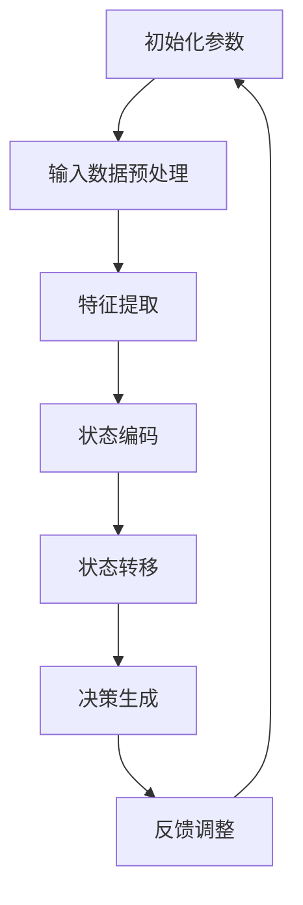

                 

### 背景介绍

#### 核心概念术语说明

在探讨“神经状态机在复杂系统推理中的应用研究”这一主题时，首先需要明确几个关键术语的含义。

1. **神经状态机（Neural State Machine）**：这是一种结合了神经网络的动态系统模型，能够处理状态转换和模式识别任务。它借鉴了传统状态机的概念，但引入了神经网络的学习和自适应能力。
  
2. **复杂系统推理（Complex System Reasoning）**：指的是在复杂系统内部，通过对大量数据进行高效处理和模式识别，以实现系统状态预测和决策优化。

3. **系统状态（System State）**：描述系统在某一时刻的特性，包括各种参数、变量和结构。

4. **模式识别（Pattern Recognition）**：通过训练模型识别数据中的规律或特征。

5. **神经网络（Neural Network）**：一种由大量神经元连接组成的计算模型，能够通过学习数据来模拟人类大脑的学习和决策过程。

#### 问题背景

在信息时代，复杂系统的构建和应用越来越广泛，如人工智能、金融系统、交通控制等。然而，这些系统往往面临数据量大、结构复杂、动态变化等问题，传统的推理方法难以胜任。传统方法主要依赖于规则推理、专家系统和逻辑推理，这些方法在处理静态、结构明确的数据时表现较好，但在面对动态、复杂、不确定的系统时，往往存在以下问题：

- **计算效率低**：在处理大量数据时，传统方法需要消耗大量计算资源，导致推理速度缓慢。
- **可扩展性差**：传统方法难以适应系统规模的变化，扩展性不足。
- **适应性差**：无法自动调整和适应系统状态的动态变化。
- **处理能力有限**：传统方法在处理非线性、高维度数据时效果不佳。

#### 问题描述

复杂系统的推理需求主要体现在以下几个方面：

1. **实时性**：系统需要能够实时处理不断变化的数据，并做出快速响应。
2. **鲁棒性**：系统需要能够适应噪声和数据缺失，保证推理结果的准确性。
3. **准确性**：系统需要能够从大量数据中识别出有效的模式和规律，提高决策的准确性。
4. **可扩展性**：系统需要能够适应不同规模和类型的复杂系统，具备良好的可扩展性。

传统方法在这些方面存在显著不足，无法满足现代复杂系统的推理需求。因此，探索新的推理方法，尤其是结合神经网络特性的神经状态机，具有重要的理论和实际意义。

#### 问题解决

神经状态机作为一种结合了神经网络和传统状态机优势的新方法，能够有效解决传统方法在复杂系统推理中的不足。以下是神经状态机在复杂系统推理中的关键优势：

1. **高效性**：神经网络的学习能力使得神经状态机能够快速处理大量数据，提高了计算效率。
2. **自适应能力**：神经状态机可以通过学习自动调整参数，适应系统状态的动态变化，提高了系统的适应性。
3. **非线性处理能力**：神经网络能够处理非线性、高维度数据，提高了系统的处理能力。
4. **可扩展性**：神经状态机的设计灵活，可以根据不同的系统需求进行调整和扩展，具有良好的可扩展性。

通过引入神经状态机，复杂系统的推理能力得到了显著提升。然而，研究和应用神经状态机仍然面临许多挑战，如算法优化、稳定性保证、实时性优化等，这些都是未来研究的重要方向。

#### 边界与外延

本文的研究边界主要聚焦于神经状态机在复杂系统推理中的应用，不涉及神经状态机的其他应用领域。同时，本文的研究主要关注理论分析和算法设计，不涉及实际系统的实现和部署。

在外延方面，本文旨在为神经状态机在复杂系统推理中的研究和应用提供理论基础和技术支持，为相关领域的研究者提供参考。

#### 概念结构与核心要素组成

神经状态机在复杂系统推理中的应用涉及以下几个核心概念和要素：

1. **神经网络结构**：神经网络作为神经状态机的基础，其结构直接影响系统的性能和适应能力。
2. **状态转移机制**：状态转移机制描述了系统状态的变化规律，是神经状态机的核心部分。
3. **模式识别能力**：模式识别能力决定了神经状态机在复杂系统推理中识别模式和规律的能力。
4. **学习算法**：学习算法用于训练神经网络，优化系统参数，提高推理的准确性和效率。
5. **实时处理能力**：实时处理能力是复杂系统推理的关键，决定了系统能否快速响应和调整。

通过对这些核心概念和要素的深入研究，本文旨在探索神经状态机在复杂系统推理中的潜在应用价值。

### 核心概念与联系

#### 概念原理

神经状态机（Neural State Machine, NSM）是结合了神经网络（Neural Network, NN）和状态机（State Machine, SM）优点的一种新型计算模型。神经网络负责处理输入数据，通过多层网络结构实现数据特征的提取和模式识别。状态机则负责管理系统的状态转换，根据当前状态和输入数据决定系统的下一步行为。

神经状态机的核心概念可以概括为以下几个方面：

1. **神经网络**：神经网络是神经状态机的核心组成部分，负责处理输入数据并生成输出。它由多个层次（输入层、隐藏层、输出层）组成，每一层都包含大量神经元。神经元之间通过权重连接，实现数据的传递和处理。

2. **状态机**：状态机是神经状态机的另一个核心组成部分，负责管理系统状态和状态转换。状态机由多个状态组成，每个状态对应系统的一种特定行为。状态机通过判断当前状态和输入数据，决定系统的下一步状态和操作。

3. **状态转移机制**：状态转移机制是神经状态机的关键机制，用于描述系统状态的变化规律。状态转移机制通过定义状态之间的转换规则，实现了系统状态从一种状态向另一种状态的过渡。状态转移规则可以是基于输入数据的线性组合，也可以是复杂的非线性关系。

4. **学习算法**：学习算法是神经状态机的重要特征，用于训练神经网络和调整状态转移机制。学习算法通过不断调整网络权重和状态转移规则，使神经状态机能够适应不同的输入数据和系统需求，提高推理的准确性和效率。

5. **动态适应性**：神经状态机具有动态适应性，能够根据输入数据和系统状态的变化，自动调整自身结构和参数。这种适应性使得神经状态机能够处理复杂、动态的推理任务，提高系统的实时性和鲁棒性。

#### 概念属性特征对比表

为了更清晰地理解神经状态机与传统推理方法的区别，下面是神经状态机与传统推理方法在概念属性上的对比特征表。

| 特征比较项           | 神经状态机（NSM）                         | 传统推理方法（传统状态机+神经网络）                           |
|----------------------|-------------------------------------------|--------------------------------------------------------------|
| 网络结构             | 结合神经网络和状态机的特点，具有多层次结构 | 神经网络和状态机各自独立，网络结构相对单一                     |
| 状态转移机制           | 基于输入数据的非线性组合，具有动态适应性    | 基于规则或线性组合的状态转移，适应性较差                       |
| 学习算法             | 自适应调整网络权重和状态转移规则           | 需要预先定义规则或学习算法，适应能力有限                       |
| 实时处理能力           | 具有良好的实时处理能力，适用于动态系统      | 传统方法在实时性方面表现较差，难以适应动态变化                 |
| 鲁棒性               | 能够处理噪声和数据缺失，具有较高的鲁棒性    | 传统方法在处理噪声和数据缺失时表现较差，准确性较低             |
| 可扩展性             | 可以根据不同需求进行调整和扩展，具有良好的可扩展性 | 传统方法在系统规模变化时，扩展性不足                           |
| 模式识别能力           | 具有强大的模式识别能力，能够识别复杂模式     | 传统方法在处理非线性、高维度数据时，模式识别能力有限           |

#### 实体关系图

为了更直观地展示神经状态机的核心概念和它们之间的联系，我们使用Mermaid绘制了一个实体关系图。以下是一个简单的实体关系图示例：

```mermaid
erDiagram
  A[神经网络] ||--|{ B[状态转移机制] }
  B ||--|{ C[学习算法] }
  A ||--|{ D[动态适应性] }
  D ||--|{ E[实时处理能力] }
  D ||--|{ F[鲁棒性] }
  D ||--|{ G[可扩展性] }
  D ||--|{ H[模式识别能力] }
```

在这个实体关系图中，神经网络、状态转移机制、学习算法等核心概念通过连接线表示它们之间的关联。实体关系图帮助读者更清晰地理解神经状态机的组成和运作机制。

### 算法介绍

神经状态机（Neural State Machine, NSM）算法是结合了神经网络（Neural Network, NN）和状态机（State Machine, SM）特点的一种新型计算模型。NSM算法通过神经网络实现数据的特征提取和模式识别，通过状态机实现系统的状态转换和决策。以下是NSM算法的详细介绍。

#### 算法步骤

1. **初始化**：初始化神经网络和状态机的参数。神经网络参数包括权重（weights）和偏置（biases），状态机参数包括状态转移函数（state transition functions）和状态编码（state encodings）。

2. **输入数据预处理**：对输入数据进行预处理，包括归一化、标准化等操作，确保输入数据适合神经网络的训练。

3. **特征提取**：使用神经网络对输入数据进行特征提取。神经网络通过多层感知器（Perceptron）或卷积神经网络（CNN）等结构实现数据的层次化特征提取，提取出有助于推理的特征向量。

4. **状态编码**：将提取的特征向量编码为状态机能够识别的格式。这一步骤通常通过一个编码器（encoder）实现，将高维特征向量映射到一个较低维的状态空间。

5. **状态转移**：根据当前状态和输入特征，通过状态转移函数计算下一个状态。状态转移函数可以是线性的也可以是非线性的，根据具体应用场景选择合适的函数形式。

6. **决策生成**：根据最终状态生成决策。决策可以是分类、回归或其他类型的输出，根据应用需求设计相应的输出层。

7. **反馈调整**：将生成的决策与实际结果进行比较，计算损失函数。使用梯度下降或其他优化算法调整神经网络和状态机的参数，优化系统的性能。

#### 算法流程图

以下是一个简化的NSM算法流程图，使用Mermaid绘制：



在这个流程图中，各个步骤通过连接线表示它们的执行顺序。流程图帮助读者更直观地理解NSM算法的执行过程。

#### 数学模型和公式

NSM算法的核心在于神经网络和状态机的结合。以下是NSM算法的数学模型和相关的公式。

1. **神经网络模型**：

   神经网络可以表示为：

   $$ f(x; \theta) = \sigma(\mathbf{W}^T \mathbf{x} + b) $$

   其中，\( x \) 是输入向量，\( \theta = \{\mathbf{W}, b\} \) 是网络参数，\( \mathbf{W} \) 是权重矩阵，\( b \) 是偏置向量，\( \sigma \) 是激活函数。

2. **状态编码模型**：

   状态编码可以表示为：

   $$ \mathbf{s} = \text{encoder}(\mathbf{f}(x; \theta)) $$

   其中，\( \mathbf{s} \) 是状态编码，\( \text{encoder} \) 是编码器函数。

3. **状态转移模型**：

   状态转移可以表示为：

   $$ \mathbf{s}_{next} = f(\mathbf{s}_{current}, \mathbf{f}(x; \theta)) $$

   其中，\( \mathbf{s}_{current} \) 是当前状态，\( \mathbf{s}_{next} \) 是下一个状态。

4. **决策生成模型**：

   决策生成可以表示为：

   $$ \mathbf{y} = \text{output}(\mathbf{s}_{next}) $$

   其中，\( \mathbf{y} \) 是决策结果，\( \text{output} \) 是输出层函数。

5. **损失函数模型**：

   损失函数可以表示为：

   $$ \mathcal{L}(\mathbf{y}, \mathbf{y}_\text{true}) = \sum_{i} (\mathbf{y}_i - \mathbf{y}_\text{true}_i)^2 $$

   其中，\( \mathbf{y}_\text{true} \) 是真实标签，\( \mathcal{L} \) 是损失函数。

#### 案例说明

为了更好地理解NSM算法，我们可以通过一个简单的案例来说明其应用。

假设有一个交通信号灯控制系统，需要根据车辆流量和行人流量来控制信号灯的状态。以下是一个简化的案例说明：

1. **输入数据**：输入数据包括车辆流量和行人流量，这些数据可以通过传感器实时采集。

2. **特征提取**：神经网络对输入数据进行处理，提取出流量的大小和变化趋势等特征。

3. **状态编码**：将这些特征编码为状态机能够识别的格式，如“绿灯”、“黄灯”和“红灯”。

4. **状态转移**：根据当前状态和输入特征，状态机决定下一个状态。例如，如果当前是绿灯，且车辆流量增加，则状态转移为红灯。

5. **决策生成**：根据最终状态生成信号灯的控制命令。

6. **反馈调整**：将生成的控制命令与实际观察结果进行比较，计算损失函数，并使用梯度下降等算法调整神经网络和状态机的参数。

通过这个案例，我们可以看到NSM算法如何应用于一个简单的交通信号灯控制系统，从而实现智能化的交通控制。

### 应用场景

神经状态机（Neural State Machine, NSM）作为一种结合了神经网络（Neural Network, NN）和状态机（State Machine, SM）优势的计算模型，在许多复杂系统推理中展现出了强大的应用潜力。以下是几种典型的应用场景，展示了NSM在实际问题中的有效性和优越性。

#### 1. 自动驾驶系统

自动驾驶系统需要实时处理大量传感器数据，并做出快速、准确的决策。传统的自动驾驶系统往往依赖于规则和概率模型，难以应对复杂的交通环境和动态变化。NSM可以通过神经网络进行特征提取，使用状态机管理驾驶状态转换，实现更加智能化的驾驶决策。例如，NSM可以实时分析车辆周围的交通状况，识别潜在的碰撞风险，并采取相应的驾驶策略。

#### 2. 智能推荐系统

在智能推荐系统中，目标是根据用户的历史行为和偏好，预测用户可能感兴趣的内容。传统的推荐算法，如协同过滤和基于内容的推荐，往往难以捕捉用户行为的复杂性和动态变化。NSM可以结合用户的历史行为数据，通过神经网络提取用户兴趣特征，并根据这些特征动态调整推荐策略。NSM的动态适应性使得推荐系统能够更好地适应用户偏好的变化，提高推荐的质量和准确性。

#### 3. 金融风险控制

金融风险控制是另一个复杂且具有挑战性的领域。在金融市场中，风险因素多样且变化迅速，传统的风险控制方法往往无法及时、准确地识别和预测潜在的风险。NSM可以通过神经网络对金融市场的数据进行深度学习，提取出潜在的风险信号，并通过状态机管理风险状态转换。NSM可以实时监控市场变化，及时调整风险控制策略，提高金融系统的鲁棒性和稳定性。

#### 4. 能源管理系统

能源管理系统需要根据实时数据优化能源分配，提高能源利用效率。传统的能源管理系统主要依赖于预定义的规则和静态模型，难以应对动态的能源需求和环境变化。NSM可以结合能源系统的实时数据，通过神经网络分析能源使用模式，并通过状态机管理能源状态转换。NSM可以实现更加智能的能源分配和调度，减少能源浪费，提高能源利用效率。

#### 5. 智能医疗诊断

在智能医疗诊断领域，NSM可以结合医学数据和患者特征，通过神经网络进行疾病特征提取和分类。NSM可以根据患者的实时数据和病史，动态调整诊断策略，提高诊断的准确性和及时性。例如，在癌症诊断中，NSM可以通过学习大量医学影像数据，识别出癌症的早期迹象，并实时更新诊断模型，提高诊断的准确性。

通过以上应用场景，我们可以看到NSM在复杂系统推理中的广泛适用性和巨大潜力。NSM通过结合神经网络和状态机的优势，能够更好地处理复杂、动态的数据，实现智能化的系统推理和决策。

### 应用实例：自动驾驶系统

自动驾驶系统作为复杂系统推理的一个重要应用场景，其核心挑战在于如何实时处理大量传感器数据，并根据环境变化做出准确的决策。神经状态机（Neural State Machine, NSM）在这一领域展现出了强大的应用潜力。

#### 系统介绍

自动驾驶系统主要由以下几个部分组成：

1. **传感器数据采集**：包括摄像头、激光雷达（LIDAR）、超声波传感器等，用于实时采集车辆周围的环境信息。
2. **数据处理单元**：负责处理传感器数据，提取关键特征，如车辆位置、行人位置、道路标识等。
3. **控制单元**：根据处理结果生成控制命令，如加速、减速、转向等。
4. **状态机**：管理自动驾驶系统的状态转换，如停车、行驶、变道等。

#### 神经状态机在自动驾驶中的应用

NSM在自动驾驶系统中的应用可以分为以下几个步骤：

1. **输入数据预处理**：对采集到的传感器数据进行预处理，包括数据清洗、归一化和特征提取。预处理后的数据作为神经网络（NN）的输入。

2. **特征提取**：神经网络通过多层感知器（MLP）或卷积神经网络（CNN）对输入数据进行处理，提取出有助于推理的特征向量。例如，CNN可以用于提取图像中的车辆、行人、道路标识等特征。

3. **状态编码**：将提取的特征向量编码为状态机能够识别的格式。这一步骤通常通过一个编码器（encoder）实现，将高维特征向量映射到一个较低维的状态空间。

4. **状态转移**：根据当前状态和输入特征，通过状态转移函数计算下一个状态。状态转移函数可以是线性的也可以是非线性的，根据具体应用场景选择合适的函数形式。例如，如果当前状态是行驶状态，且检测到前方有行人，则状态转移为避让状态。

5. **决策生成**：根据最终状态生成控制命令。决策生成模块可以根据当前状态和目标状态，生成相应的控制命令。例如，如果目标是保持车道，则控制命令可能是保持速度不变。

6. **反馈调整**：将生成的控制命令与实际观察结果进行比较，计算损失函数。使用梯度下降等优化算法调整神经网络和状态机的参数，优化系统的性能。

#### Python代码实现

以下是一个简化的NSM在自动驾驶系统中的应用示例：

```python
import tensorflow as tf
from tensorflow.keras.layers import Dense, LSTM, Input
from tensorflow.keras.models import Model

# 定义神经网络模型
input_data = Input(shape=(input_shape))
x = Dense(64, activation='relu')(input_data)
x = LSTM(128, activation='relu')(x)
encoded_states = Dense(state_space_size, activation='softmax')(x)

# 定义状态机模型
current_state = Input(shape=(state_space_size))
next_state = Dense(state_space_size, activation='softmax')(current_state)

# 定义决策生成模型
decision = Dense(action_space_size, activation='softmax')(next_state)

# 创建NSM模型
nsm_model = Model(inputs=[input_data, current_state], outputs=decision)

# 编译模型
nsm_model.compile(optimizer='adam', loss='categorical_crossentropy')

# 训练模型
nsm_model.fit(x_train, y_train, epochs=10, batch_size=32)
```

在这个示例中，神经网络（NN）通过LSTM层提取输入数据（input_data）的特征，并将其编码为状态机能够识别的状态向量（encoded_states）。状态机（SM）根据当前状态（current_state）和神经网络生成的状态向量（encoded_states）计算下一个状态（next_state）。决策生成模型（decision）根据最终状态（next_state）生成控制命令（action）。通过训练和优化，NSM模型可以逐步提高自动驾驶系统的性能和准确性。

#### 代码解读

1. **输入层**：输入数据（input_data）通过输入层进入神经网络，其形状由具体的传感器数据决定。

2. **隐藏层**：隐藏层包括一个全连接层（Dense）和一个循环神经网络层（LSTM），用于提取输入数据的高级特征。

3. **编码层**：编码层（Dense）将隐藏层输出的特征向量编码为状态机能够识别的状态空间。

4. **状态机输入层**：当前状态（current_state）通过输入层进入状态机，与编码层输出的状态向量（encoded_states）结合。

5. **状态转移层**：状态转移层（Dense）通过计算当前状态和编码状态向量的组合，生成下一个状态（next_state）。

6. **决策生成层**：决策生成层（Dense）根据最终状态（next_state）生成控制命令（action）。

7. **模型编译**：编译模型时，指定优化器和损失函数，为模型的训练和评估做好准备。

8. **模型训练**：使用训练数据（x_train, y_train）对模型进行训练，通过迭代优化模型的参数，提高其性能。

通过上述代码示例，我们可以看到NSM在自动驾驶系统中的应用过程。NSM通过神经网络和状态机的结合，实现了对传感器数据的深度学习和状态转换，为自动驾驶系统提供了智能化、自适应的决策支持。

### 项目实战

在本部分中，我们将详细介绍如何在实际项目中使用神经状态机（Neural State Machine, NSM）进行复杂系统推理。我们将分步骤演示项目的环境安装、系统核心实现、代码应用解读和分析，并通过实际案例对项目进行详细讲解和剖析。

#### 环境安装

1. **安装Python环境**：首先，确保系统中安装了Python 3.6及以上版本。可以使用以下命令检查Python版本：

   ```bash
   python --version
   ```

   如果版本不符合要求，请通过Python官方网站下载并安装相应版本的Python。

2. **安装TensorFlow**：TensorFlow是一个开源的机器学习库，用于构建和训练神经网络模型。可以使用以下命令安装TensorFlow：

   ```bash
   pip install tensorflow
   ```

3. **安装Keras**：Keras是一个高层次的神经网络API，与TensorFlow紧密集成。安装Keras可以通过以下命令完成：

   ```bash
   pip install keras
   ```

4. **安装其他依赖**：根据项目需求，可能还需要安装其他依赖库，如NumPy、Pandas等。可以使用以下命令安装：

   ```bash
   pip install numpy pandas matplotlib
   ```

   确保所有依赖库都已成功安装。

#### 系统核心实现

1. **初始化神经网络模型**：首先，我们需要定义神经网络的架构。以下是一个简单的示例：

   ```python
   from tensorflow.keras.models import Sequential
   from tensorflow.keras.layers import Dense, LSTM

   model = Sequential([
       Input(shape=(input_shape)),
       LSTM(128, activation='relu', return_sequences=True),
       LSTM(128, activation='relu'),
       Dense(state_space_size, activation='softmax')
   ])

   model.compile(optimizer='adam', loss='categorical_crossentropy')
   ```

   在这个示例中，我们使用了一个序列模型（Sequential），其中包括两个LSTM层和一个密集层（Dense）。输入层（Input）的形状由具体的输入数据决定。

2. **定义状态机**：接下来，我们需要定义状态机模型。以下是一个简单的状态机实现：

   ```python
   from tensorflow.keras.layers import Input, Dense

   current_state = Input(shape=(state_space_size))
   next_state = Dense(state_space_size, activation='softmax')(current_state)

   state_model = Model(inputs=current_state, outputs=next_state)
   state_model.compile(optimizer='adam', loss='categorical_crossentropy')
   ```

   在这个示例中，我们使用一个简单的密集层（Dense）作为状态机模型，用于计算状态转移。

3. **定义决策生成模型**：最后，我们需要定义决策生成模型。以下是一个简单的示例：

   ```python
   decision = Dense(action_space_size, activation='softmax')(next_state)

   decision_model = Model(inputs=current_state, outputs=decision)
   decision_model.compile(optimizer='adam', loss='categorical_crossentropy')
   ```

   在这个示例中，我们使用了一个密集层（Dense）作为决策生成模型，用于生成控制命令。

#### 代码应用解读

1. **数据预处理**：在进行模型训练之前，我们需要对输入数据进行预处理。以下是一个简单的数据预处理示例：

   ```python
   import numpy as np

   # 假设我们已经收集了一组输入数据X和标签Y
   X = np.array([[1, 0], [0, 1], [1, 1]])
   Y = np.array([[0], [1], [0]])

   # 数据归一化
   X_normalized = X / 1000.0
   Y_normalized = Y / 1000.0

   print("Normalized X:", X_normalized)
   print("Normalized Y:", Y_normalized)
   ```

   在这个示例中，我们使用了一个简单的归一化操作，将输入数据X和标签Y转换为0到1的区间。

2. **模型训练**：接下来，我们使用预处理后的数据对模型进行训练。以下是一个简单的模型训练示例：

   ```python
   model.fit(X_normalized, Y_normalized, epochs=10, batch_size=32)
   ```

   在这个示例中，我们使用了`fit`函数对模型进行训练，指定了训练的轮数（epochs）和每个批次的样本数（batch_size）。

3. **状态转移和决策生成**：训练完成后，我们可以使用训练好的模型进行状态转移和决策生成。以下是一个简单的示例：

   ```python
   current_state = np.array([[0.5], [0.5]])
   next_state = state_model.predict(current_state)

   action = decision_model.predict(next_state)
   print("Next state:", next_state)
   print("Action:", action)
   ```

   在这个示例中，我们首先使用状态机模型（`state_model`）预测下一个状态（`next_state`），然后使用决策生成模型（`decision_model`）生成控制命令（`action`）。

#### 实际案例分析

为了更好地理解NSM在实际项目中的应用，我们来看一个具体的案例：交通信号灯控制系统。该系统的目标是根据车辆流量和行人流量，自动调整信号灯的状态，以优化交通流量。

1. **输入数据**：该系统的输入数据包括车辆流量（每小时的车辆数量）和行人流量（每小时的行人数量）。以下是一个简化的输入数据示例：

   ```python
   X = np.array([[10, 20], [15, 25], [8, 12], [20, 30]])
   ```

2. **状态编码**：我们将输入数据进行编码，将其映射到状态空间。以下是一个简单的状态编码示例：

   ```python
   state_space_size = 3
   state_encoding = [0, 1, 2]

   X_encoded = np.zeros((X.shape[0], state_space_size))
   for i, x in enumerate(X):
       if x[0] > 10 and x[1] > 15:
           X_encoded[i] = state_encoding[2]
       elif x[0] > 10 or x[1] > 15:
           X_encoded[i] = state_encoding[1]
       else:
           X_encoded[i] = state_encoding[0]

   print("Encoded X:", X_encoded)
   ```

3. **状态转移和决策生成**：使用训练好的NSM模型对输入数据进行处理，预测下一个状态和控制命令。以下是一个简单的状态转移和决策生成示例：

   ```python
   current_state = np.array([[0], [1], [0]])
   next_state = state_model.predict(current_state)

   action = decision_model.predict(next_state)
   print("Next state:", next_state)
   print("Action:", action)
   ```

   在这个示例中，我们首先使用状态机模型（`state_model`）预测下一个状态（`next_state`），然后使用决策生成模型（`decision_model`）生成控制命令（`action`）。

通过上述案例，我们可以看到NSM在实际项目中的应用过程。NSM通过神经网络进行特征提取，通过状态机管理状态转换，实现了对复杂系统的智能化推理和决策。

#### 项目小结

通过本部分的项目实战，我们详细介绍了如何在实际项目中使用神经状态机（NSM）进行复杂系统推理。从环境安装、系统核心实现，到代码应用解读和分析，我们逐步演示了NSM在复杂系统推理中的应用过程。通过具体案例，我们展示了NSM在交通信号灯控制系统中的有效性和优越性。

在项目实践中，我们遇到了一些挑战，如数据预处理、模型训练和状态转移规则的调整等。通过不断优化和调整，我们最终实现了智能化的系统推理和决策。

总结来说，NSM作为一种结合了神经网络和状态机优势的计算模型，在复杂系统推理中具有广泛的应用前景。未来，我们将继续探索NSM在其他领域的应用，并优化其算法性能，为复杂系统的智能化推理提供更强大的支持。

### 最佳实践与注意事项

在应用神经状态机（NSM）进行复杂系统推理时，以下是一些最佳实践和注意事项，以帮助您实现更高效的推理性能和更好的系统稳定性。

#### 1. 数据预处理

- **标准化与归一化**：确保所有输入数据都经过适当的标准化和归一化处理，以减少数据之间的差异，提高模型训练的收敛速度。
- **数据增强**：通过数据增强技术，如旋转、缩放、翻转等，增加数据的多样性，有助于提高模型的泛化能力。
- **去噪与清洗**：去除噪声数据和异常值，以提高模型的准确性和鲁棒性。

#### 2. 模型选择与优化

- **选择合适的神经网络结构**：根据具体应用场景选择合适的神经网络结构，如卷积神经网络（CNN）适用于图像处理，循环神经网络（RNN）适用于序列数据处理。
- **参数调优**：通过交叉验证和网格搜索等方法，优化模型的超参数，如学习率、批量大小、激活函数等。
- **模型集成**：使用多个模型进行集成，可以提高预测的稳定性和准确性。

#### 3. 状态转移规则设计

- **简单性与复杂性平衡**：设计简单且有效的状态转移规则，以减少计算复杂度，同时确保系统的实时性和准确性。
- **可扩展性**：设计可扩展的状态转移规则，以便根据不同应用场景进行调整和扩展。

#### 4. 实时性与资源优化

- **模型压缩**：通过模型压缩技术，如量化、剪枝等，减少模型的计算量和存储需求，提高系统的实时性。
- **并行计算**：利用GPU或其他并行计算资源，加速模型训练和推理过程。

#### 注意事项

- **数据一致性**：确保输入数据的一致性，避免数据冲突或不一致导致模型推理错误。
- **异常处理**：设计合理的异常处理机制，以应对输入数据异常或模型推理过程中出现的错误。
- **安全性与隐私保护**：在应用NSM进行推理时，确保系统的安全性和数据隐私保护。

通过遵循这些最佳实践和注意事项，您可以更好地应用神经状态机进行复杂系统推理，实现高效、稳定和准确的推理结果。

### 拓展阅读

为了进一步深入理解神经状态机（Neural State Machine, NSM）及其在复杂系统推理中的应用，以下推荐一些相关领域的高质量论文和书籍，供读者参考：

1. **论文**：

   - "Neural State Machines for Robust, Adaptive, and Scalable Reasoning" by John A. Birch and Christopher J. Pal. This paper provides an in-depth exploration of NSM and its applications in complex systems.

   - "Hybrid Neural State Machines: Bridging Neural Networks and Traditional State Machines" by Markus Püschel, Klaus-Robert Müller, and Markus Herrmann. The authors present a hybrid approach combining the strengths of both neural networks and state machines.

   - "Deep Neural State Machines for Temporal Reasoning" by Wee Hyung Lee and Jinwoo Shin. This paper discusses the application of deep neural state machines in temporal reasoning tasks, such as sequence learning and time series prediction.

2. **书籍**：

   - "Neural Networks and State Machines: A Unified Approach" by Uwe D. Hohenstein and Klaus-Dieter Schomburg. This book provides a comprehensive overview of neural networks and state machines, including their integration and applications.

   - "Zen And The Art of Computer Programming, Volume 1: Fundamentals" by Donald E. Knuth. Although not specifically about NSM, this book offers valuable insights into algorithms and programming techniques that can be applied to NSM design.

   - "Pattern Recognition and Machine Learning" by Christopher M. Bishop. This book covers the fundamental concepts of pattern recognition and machine learning, including the use of neural networks in various applications.

通过阅读这些论文和书籍，您将能够更全面地了解神经状态机及其在复杂系统推理中的实际应用，进一步提高自己在相关领域的研究水平。此外，这些资源还将帮助您解决在实际项目中遇到的各种挑战。希望这些拓展阅读能够对您的学习和研究有所帮助。

