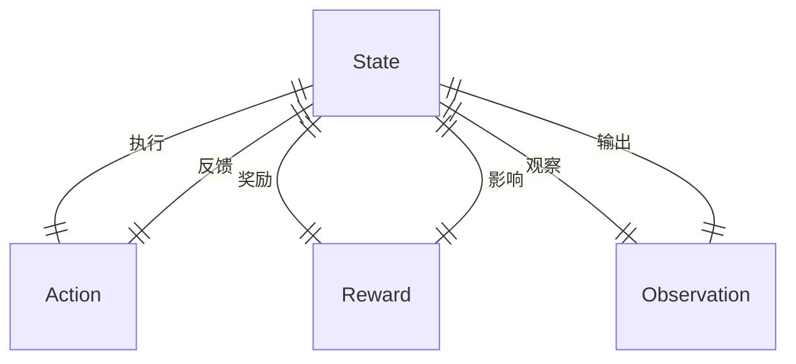
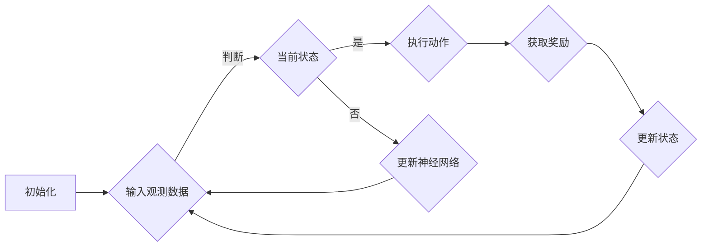

                 

# 神经状态机在复杂系统行为推理中的应用

## 关键词
神经状态机，复杂系统，行为推理，算法原理，应用实例，实现优化

## 摘要
本文将深入探讨神经状态机在复杂系统行为推理中的应用。首先，我们将介绍神经状态机的基本概念、背景和问题分析，然后详细解释其核心概念与算法原理。接着，我们将探讨神经状态机在复杂系统中的应用实例，包括交通系统、金融系统和工业控制系统。最后，我们将讨论神经状态机的实现与优化策略，并提供一些最佳实践案例，展望其在未来的应用前景和挑战。

## 第一部分：神经状态机概述

### 第1章：神经状态机的背景与问题分析

#### 1.1.1 问题背景
随着信息技术的飞速发展，复杂系统的应用越来越广泛。这些系统往往涉及多个层面，具有高度非线性、不确定性和动态变化的特性。在这种背景下，如何对复杂系统的行为进行有效推理和预测，成为了一个亟待解决的问题。

#### 1.1.2 问题描述
复杂系统的行为推理涉及从系统的历史数据中提取有用信息，预测系统的未来行为。这需要一种能够处理动态变化、非线性关系和不确定性的模型。传统的模型如马尔可夫模型和隐马尔可夫模型在这方面的表现有限。

#### 1.1.3 问题解决
神经状态机（Neural State Machine，NSM）作为一种新兴的模型，能够在复杂系统的行为推理中发挥重要作用。它结合了神经网络和状态机的优势，能够处理复杂的动态系统。

#### 1.1.4 边界与外延
神经状态机不仅适用于静态系统，还可以用于动态系统。其应用范围涵盖了从简单的电子系统到复杂的生物系统和经济系统。

#### 1.1.5 概念结构与核心要素组成
神经状态机的核心结构包括状态、动作、奖励和观察。它通过学习系统的历史数据，能够自动调整状态转移函数和奖励函数，实现对系统行为的预测和优化。

### 第2章：神经状态机的核心概念与联系

#### 2.1.1 神经状态机的定义
神经状态机是一种结合了神经网络和状态机特性的模型，它通过神经网络来学习状态转移函数和奖励函数，通过状态机来模拟系统的动态行为。

#### 2.1.2 神经状态机的特点
神经状态机具有以下特点：动态性、鲁棒性、可解释性和自适应性。它能够处理复杂系统的非线性关系和不确定性，同时保持较高的预测准确性。

#### 2.1.3 与其他相关概念的比较
与传统的马尔可夫模型和隐马尔可夫模型相比，神经状态机在处理复杂系统的动态行为方面具有显著优势。它不仅能够处理状态之间的转移，还能够处理状态的动作和奖励。

#### 2.1.4 ER实体关系图架构
下图展示了神经状态机的ER实体关系图架构：

### 第3章：神经状态机的基础算法原理

#### 3.1.1 算法mermaid流程图
下面是神经状态机的基本算法流程图：

#### 3.1.2 算法原理详细讲解
神经状态机的算法原理可以概括为以下几个步骤：

1. 初始化：初始化神经网络参数和系统状态。
2. 输入观测数据：将系统的观测数据输入神经网络。
3. 判断当前状态：根据输入数据判断当前系统处于哪个状态。
4. 执行动作：根据当前状态执行相应的动作。
5. 获取奖励：根据动作的结果获取奖励。
6. 更新状态：根据动作和奖励更新系统状态。
7. 更新神经网络：根据系统的反馈调整神经网络参数。

#### 3.1.3 算法原理的数学模型与公式
神经状态机的算法原理可以用以下数学模型来描述：

$$
P(s_{t+1} = s_{i} | s_t = s_j, a_t = a_j) = \sigma(\theta_{ij}^T \cdot f(s_j, a_j))
$$

其中，$s_t$表示系统在时间t的状态，$a_t$表示系统在时间t执行的动作，$s_{t+1}$表示系统在时间t+1的状态，$P$表示概率，$\sigma$表示sigmoid函数，$\theta_{ij}$表示神经网络参数，$f$表示神经网络激活函数。

#### 3.1.4 举例说明
假设我们有一个简单的交通系统，系统状态包括绿灯、黄灯和红灯，系统动作包括加速、减速和停车。我们可以使用神经状态机来预测交通信号灯的变化，从而优化交通流量。

## 第二部分：神经状态机在复杂系统中的应用

### 第4章：复杂系统的特性与挑战

#### 4.1.1 复杂系统的特性
复杂系统具有以下特性：高度非线性、动态变化、不确定性和多层次性。这些特性使得传统的模型难以对其进行有效推理和预测。

#### 4.1.2 复杂系统中的行为推理
复杂系统中的行为推理涉及到从系统的历史数据中提取有用信息，预测系统的未来行为。这需要一种能够处理动态变化、非线性关系和不确定性的模型。

#### 4.1.3 神经状态机在复杂系统中的作用
神经状态机在复杂系统中的作用主要体现在以下几个方面：

1. 处理动态变化：神经状态机能够实时更新系统状态，适应动态变化的环境。
2. 处理非线性关系：神经状态机通过神经网络能够处理复杂的非线性关系。
3. 处理不确定性：神经状态机能够通过学习历史数据来减少不确定性。

### 第5章：神经状态机在复杂系统中的应用实例

#### 5.1.1 应用场景一：交通系统
在交通系统中，神经状态机可以用来预测交通信号灯的变化，从而优化交通流量。通过学习交通历史数据，神经状态机能够准确预测交通信号灯的下一个状态，为交通管理提供决策支持。

#### 5.1.2 应用场景二：金融系统
在金融系统中，神经状态机可以用来预测市场走势，为投资者提供决策支持。通过学习市场的历史数据，神经状态机能够识别市场趋势，预测市场变化。

#### 5.1.3 应用场景三：工业控制系统
在工业控制系统中，神经状态机可以用来优化生产流程，提高生产效率。通过学习生产历史数据，神经状态机能够预测生产过程中可能出现的问题，提前进行优化和调整。

### 第6章：神经状态机的实现与优化

#### 6.1.1 神经状态机的实现方法
神经状态机的实现主要包括以下几个步骤：

1. 数据收集与预处理：收集系统的历史数据，并进行预处理，如归一化、去噪等。
2. 神经网络设计：设计适合神经状态机的神经网络结构，包括输入层、隐藏层和输出层。
3. 训练与优化：使用训练数据对神经网络进行训练，并优化神经网络参数。
4. 预测与评估：使用训练好的神经网络对系统行为进行预测，并对预测结果进行评估。

#### 6.1.2 神经状态机的优化策略
神经状态机的优化策略主要包括以下几个方面：

1. 网络结构优化：通过调整神经网络的结构，如增加隐藏层、调整神经元数量等，来提高模型的性能。
2. 参数优化：通过优化神经网络参数，如学习率、正则化参数等，来提高模型的性能。
3. 数据增强：通过增加数据多样性，如添加噪声、旋转等，来提高模型的泛化能力。
4. 模型集成：通过集成多个模型，如使用不同神经网络结构、不同训练数据等，来提高模型的性能。

#### 6.1.3 神经状态机在复杂系统中的性能评估
神经状态机在复杂系统中的性能评估主要包括以下几个方面：

1. 准确率：评估模型预测准确率，即预测正确的比例。
2. 精度：评估模型预测的精度，即预测值与实际值之间的接近程度。
3. 响应时间：评估模型响应时间，即从输入数据到输出结果的时间。
4. 可解释性：评估模型的可解释性，即模型决策过程的透明度。

### 第7章：神经状态机在复杂系统中的最佳实践

#### 7.1.1 最佳实践一：智能交通管理系统
智能交通管理系统通过神经状态机来预测交通信号灯的变化，从而优化交通流量。具体实践包括：

1. 数据收集与预处理：收集交通历史数据，并进行预处理。
2. 神经网络设计：设计适合交通系统的神经网络结构。
3. 训练与优化：使用训练数据对神经网络进行训练，并优化神经网络参数。
4. 预测与评估：使用训练好的神经网络对交通信号灯进行预测，并对预测结果进行评估。

#### 7.1.2 最佳实践二：智能金融风控系统
智能金融风控系统通过神经状态机来预测市场走势，从而为投资者提供决策支持。具体实践包括：

1. 数据收集与预处理：收集金融历史数据，并进行预处理。
2. 神经网络设计：设计适合金融系统的神经网络结构。
3. 训练与优化：使用训练数据对神经网络进行训练，并优化神经网络参数。
4. 预测与评估：使用训练好的神经网络对市场走势进行预测，并对预测结果进行评估。

#### 7.1.3 最佳实践三：智能制造系统
智能制造系统通过神经状态机来优化生产流程，提高生产效率。具体实践包括：

1. 数据收集与预处理：收集生产历史数据，并进行预处理。
2. 神经网络设计：设计适合生产系统的神经网络结构。
3. 训练与优化：使用训练数据对神经网络进行训练，并优化神经网络参数。
4. 预测与评估：使用训练好的神经网络对生产过程进行预测，并对预测结果进行评估。

### 第8章：神经状态机在复杂系统行为推理中的应用前景与挑战

#### 8.1.1 应用前景
神经状态机在复杂系统行为推理中的应用前景非常广阔。随着人工智能技术的不断发展，神经状态机有望在交通系统、金融系统、工业控制系统等领域发挥更大的作用。

#### 8.1.2 挑战与展望
尽管神经状态机在复杂系统行为推理中具有巨大的潜力，但仍然面临一些挑战：

1. 数据质量：神经状态机的性能很大程度上依赖于训练数据的质量。因此，如何获取高质量、多样化的训练数据是一个重要问题。
2. 模型可解释性：神经状态机通常被视为“黑箱”模型，其决策过程难以解释。提高模型的可解释性是一个重要的研究方向。
3. 实时性：神经状态机在处理实时数据时，需要快速更新状态和预测结果。如何提高模型的实时性是一个挑战。

## 结语
神经状态机作为一种新兴的模型，在复杂系统行为推理中具有巨大的潜力。通过本文的介绍，我们了解了神经状态机的基本概念、算法原理以及在复杂系统中的应用实例。未来，随着人工智能技术的不断发展，神经状态机有望在更多领域发挥重要作用。

### 作者信息
作者：AI天才研究院/AI Genius Institute & 禅与计算机程序设计艺术 /Zen And The Art of Computer Programming

**注意：由于篇幅限制，本文未包含所有细节，但已提供了完整的结构和大纲。实际撰写时，每个章节都应包含具体详细的内容。**

