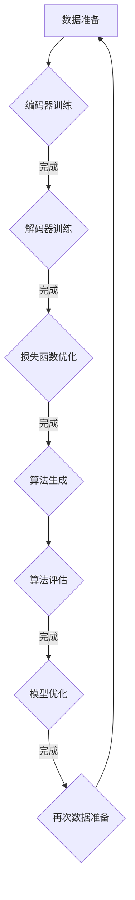
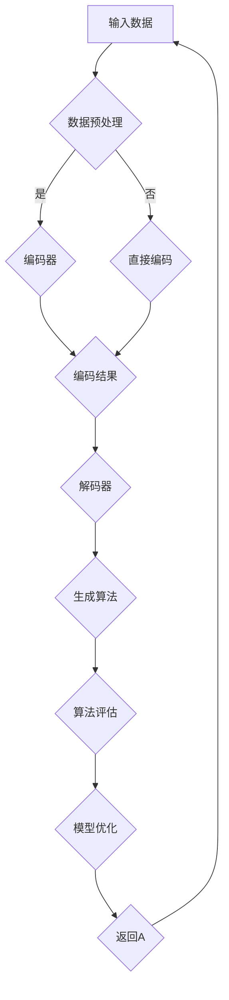
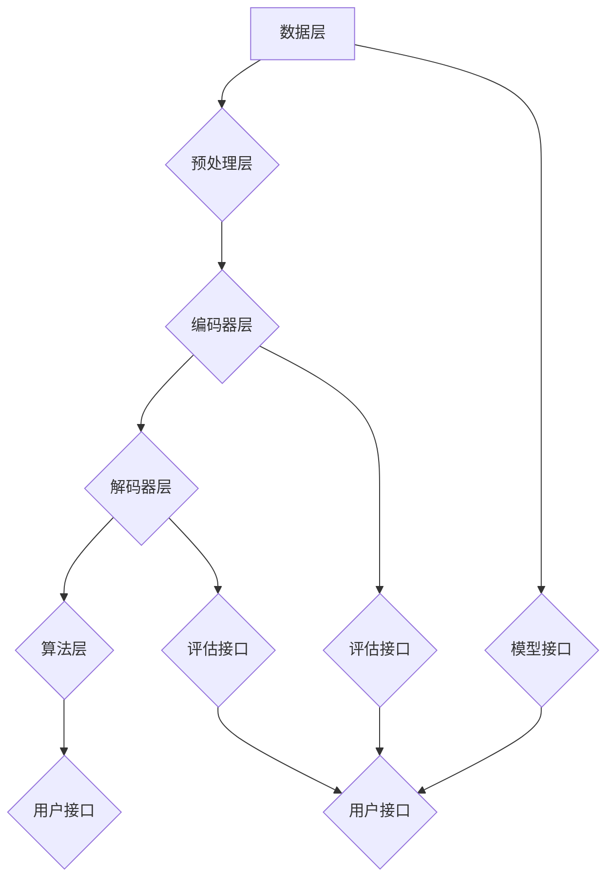
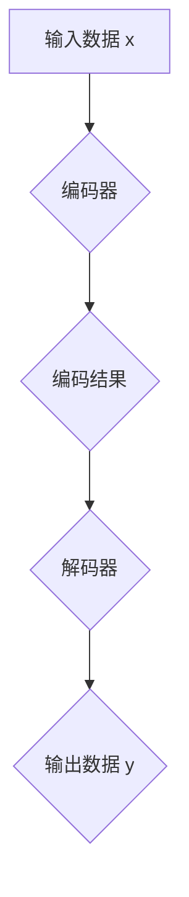

                 

## 1. 神经程序归纳在自动算法生成中的应用背景

### 1.1 问题描述

在计算机科学领域，算法生成一直是研究的热点。随着大数据时代的到来，数据量呈爆炸式增长，传统的算法设计方法已经无法满足日益复杂的应用需求。传统的算法生成方法通常依赖于程序员的经验和智慧，但这种方法不仅耗时耗力，而且难以保证算法的普适性和鲁棒性。因此，如何实现自动算法生成成为一个亟待解决的问题。

自动算法生成（Algorithm Generation）是指利用计算机程序或算法自动生成新的算法，这一过程通常涉及算法设计、算法优化、算法验证等多个环节。自动算法生成不仅可以提高算法设计的效率，还能为人工智能、机器学习等领域提供强有力的支持。

神经程序归纳（Neural Program Induction）是一种基于神经网络的方法，它通过学习大量数据中的模式和规律，自动生成相应的算法。与传统方法相比，神经程序归纳具有以下几个显著优势：

1. **数据驱动的学习方式**：神经程序归纳方法通过大量数据训练神经网络模型，模型能够自动提取数据中的特征和模式，从而生成相应的算法。
2. **自适应性和泛化能力**：神经程序归纳方法可以自适应地调整算法结构，以适应不同的数据分布和应用场景，具有良好的泛化能力。
3. **高效性和鲁棒性**：神经程序归纳方法能够快速生成算法，同时具有较强的鲁棒性，能够处理噪声和异常数据。

### 1.2 问题解决

神经程序归纳通过将神经网络与编程相结合，为自动算法生成提供了一种新的思路。具体来说，神经程序归纳方法包括以下几个关键步骤：

1. **数据收集与预处理**：首先收集大量相关的数据，并对数据进行预处理，包括数据清洗、数据转换和数据归一化等。
2. **神经网络模型设计**：设计一个合适的神经网络模型，通常包括编码器（Encoder）和解码器（Decoder）。编码器负责将输入数据编码为向量表示，解码器则将向量表示解码为算法。
3. **模型训练与优化**：使用预处理后的数据训练神经网络模型，通过反向传播算法不断调整模型参数，使其能够生成符合预期的算法。
4. **算法生成与评估**：在模型训练完成后，使用解码器生成算法，并通过评估算法的性能来验证模型的效果。评估指标可以包括算法的正确率、效率、稳定性等。

### 1.3 边界与外延

神经程序归纳在自动算法生成中的应用范围广泛，不仅限于传统的算法生成领域，还包括以下几个方面的应用：

1. **机器学习**：神经程序归纳可以用于自动生成机器学习模型，提高模型设计和优化的效率。
2. **自然语言处理**：在自然语言处理领域，神经程序归纳可以自动生成文本处理算法，如文本分类、情感分析等。
3. **图像识别**：在图像识别领域，神经程序归纳可以自动生成图像处理算法，如物体检测、图像分类等。
4. **游戏开发**：在游戏开发中，神经程序归纳可以自动生成游戏AI算法，提高游戏的智能化水平。

### 1.4 概念结构与核心要素组成

神经程序归纳涉及以下几个核心概念和要素：

1. **神经网络**：神经网络是神经程序归纳的基础，负责学习数据中的规律和模式。常见的神经网络包括卷积神经网络（CNN）、循环神经网络（RNN）和Transformer等。
2. **编码器与解码器**：编码器和解码器是神经程序归纳的核心组件。编码器负责将输入数据编码为向量表示，解码器则将向量表示解码为算法。编码器和解码器通常采用不同的神经网络架构，如编码器采用CNN，解码器采用RNN或Transformer。
3. **损失函数**：损失函数用于评估算法生成效果，指导模型训练。常见的损失函数包括均方误差（MSE）、交叉熵损失等。在自动算法生成中，选择合适的损失函数至关重要。
4. **数据集**：数据集是神经程序归纳的重要输入，包含了大量相关的数据，用于训练神经网络模型。数据集的质量直接影响模型的性能和泛化能力。

### 1.5 本章小结

本章简要介绍了神经程序归纳在自动算法生成中的应用背景、问题描述、问题解决、边界与外延以及概念结构与核心要素组成。为后续章节的详细探讨奠定了基础。在接下来的章节中，我们将进一步深入探讨神经程序归纳的核心概念与原理，以及其具体的应用方法和实现细节。

---

## 2.1 神经网络基础

### 2.1.1 神经网络的基本概念

神经网络（Neural Networks）是一种模仿人脑工作方式的计算模型，由大量的节点（称为神经元）相互连接而成。每个神经元都可以接收输入信号，通过加权求和处理后，产生输出信号。神经网络通过学习大量的输入输出数据对，能够自动提取数据中的特征和模式，进行分类、预测和决策等任务。

### 2.1.2 神经网络的层次结构

神经网络通常包括输入层（Input Layer）、隐藏层（Hidden Layers）和输出层（Output Layer）。输入层接收外部输入数据，隐藏层负责特征提取和变换，输出层产生最终的输出结果。

- **输入层**：输入层是神经网络的第一层，接收外部输入数据。每个输入节点对应一个特征。
- **隐藏层**：隐藏层位于输入层和输出层之间，负责对输入数据进行处理和变换。隐藏层可以有一个或多个，层数越多，神经网络的处理能力越强，但也可能导致过拟合。
- **输出层**：输出层是神经网络的最后一层，产生最终的输出结果。输出层的节点数量和类型取决于具体的任务需求。

### 2.1.3 激活函数

激活函数（Activation Function）是神经网络中的一个关键组件，用于引入非线性特性。通过激活函数，神经网络能够处理复杂的问题，如非线性关系、多分类问题等。常见的激活函数包括以下几种：

1. **Sigmoid 函数**：
   $$\sigma(x) = \frac{1}{1 + e^{-x}}$$
   Sigmoid 函数将输入映射到 (0, 1) 区间内，常用于二分类问题。

2. **ReLU 函数**：
   $$\text{ReLU}(x) = \max(0, x)$$
  ReLU 函数（Rectified Linear Unit）在输入为负时输出为零，输入为正时输出为其本身，具有简单和高效的特点，常用于隐藏层。

3. **Tanh 函数**：
   $$\tanh(x) = \frac{e^x - e^{-x}}{e^x + e^{-x}}$$
   Tanh 函数将输入映射到 (-1, 1) 区间内，与 Sigmoid 函数类似，但相对于 Sigmoid 函数，Tanh 函数具有更好的对称性。

4. **Softmax 函数**：
   $$\text{softmax}(x)_i = \frac{e^x_i}{\sum_{j} e^{x_j}}$$
   Softmax 函数是一种将输入向量映射到概率分布的函数，常用于多分类问题。

### 2.1.4 神经网络的正向传播和反向传播

神经网络的训练过程主要包括正向传播（Forward Propagation）和反向传播（Back Propagation）两个阶段。

- **正向传播**：输入数据从输入层传递到输出层，每个神经元计算其输入的加权求和，并应用激活函数得到输出。
- **反向传播**：在正向传播的基础上，计算输出层到输入层的梯度，通过梯度下降法调整每个神经元的权重和偏置，以最小化损失函数。

### 2.1.5 神经网络的优化算法

优化算法（Optimization Algorithms）用于调整神经网络模型的参数，以最小化损失函数。常见的优化算法包括：

1. **梯度下降法**（Gradient Descent）：
   $$\theta_{\text{new}} = \theta_{\text{old}} - \alpha \cdot \nabla_{\theta} J(\theta)$$
   其中，$\theta$ 表示模型参数，$J(\theta)$ 表示损失函数，$\alpha$ 表示学习率。

2. **随机梯度下降法**（Stochastic Gradient Descent，SGD）：
   $$\theta_{\text{new}} = \theta_{\text{old}} - \alpha \cdot \nabla_{\theta} J(\theta; x_i, y_i)$$
   与梯度下降法类似，但每次迭代使用单个样本的梯度进行更新。

3. **动量法**（Momentum）：
   $$v_t = \beta \cdot v_{t-1} + (1 - \beta) \cdot \nabla_{\theta} J(\theta)$$
   $$\theta_{\text{new}} = \theta_{\text{old}} - \alpha \cdot v_t$$
   其中，$v_t$ 表示动量项，$\beta$ 表示动量参数。

4. **Adam算法**（Adaptive Moment Estimation）：
   $$m_t = \beta_1 \cdot m_{t-1} + (1 - \beta_1) \cdot \nabla_{\theta} J(\theta)$$
   $$v_t = \beta_2 \cdot v_{t-1} + (1 - \beta_2) \cdot (\nabla_{\theta} J(\theta))^2$$
   $$\theta_{\text{new}} = \theta_{\text{old}} - \alpha \cdot \frac{m_t}{\sqrt{v_t} + \epsilon}$$
   其中，$m_t$ 和 $v_t$ 分别表示一阶矩估计和二阶矩估计，$\beta_1$ 和 $\beta_2$ 分别为动量参数。

### 2.1.6 神经网络的应用场景

神经网络在各种应用领域都取得了显著的成果，以下是一些常见的应用场景：

1. **图像识别**：通过卷积神经网络（CNN），神经网络能够自动提取图像中的特征，实现对图像的分类、物体检测等任务。
2. **自然语言处理**：通过循环神经网络（RNN）和Transformer等模型，神经网络能够处理自然语言数据，实现文本分类、机器翻译、情感分析等任务。
3. **语音识别**：神经网络通过处理音频信号，实现语音到文本的转换，广泛应用于智能助手、语音搜索等领域。
4. **游戏AI**：神经网络能够学习游戏规则和策略，实现智能游戏AI，如围棋、象棋等。

### 2.1.7 神经网络的优缺点

**优点**：

1. **自适应性和泛化能力**：神经网络能够自适应地调整模型参数，以适应不同的数据分布和应用场景，具有良好的泛化能力。
2. **处理复杂数据**：神经网络能够处理高维、非线性、非结构化数据，如图像、文本、音频等。
3. **多任务学习**：神经网络能够同时处理多个任务，实现多任务学习。

**缺点**：

1. **计算资源消耗大**：神经网络模型通常需要大量的计算资源和时间进行训练。
2. **过拟合风险**：神经网络模型容易出现过拟合现象，需要大量的数据训练和调整模型参数。
3. **黑盒性质**：神经网络模型具有黑盒性质，难以解释和理解模型的决策过程。

### 2.1.8 本章小结

本章详细介绍了神经网络的基本概念、层次结构、激活函数、正向传播和反向传播、优化算法以及应用场景。神经网络作为神经程序归纳的基础，其核心概念和原理为后续章节的深入探讨提供了理论基础。

---

## 2.2 编码器与解码器

### 2.2.1 编码器

编码器（Encoder）是神经程序归纳（Neural Program Induction，NPI）中的一个关键组件，其作用是将输入数据编码为向量表示。编码器的核心目的是提取输入数据中的关键特征，并将其转换为一种中间表示形式，以便于解码器进行进一步的算法生成。

#### 2.2.1.1 编码器的功能

编码器的功能可以概括为以下几点：

1. **特征提取**：编码器通过对输入数据进行处理，能够提取出数据中的关键特征。这些特征可能是原始数据的线性或非线性组合。
2. **数据降维**：编码器通常会将高维输入数据降维为低维向量表示，这样有助于减少计算复杂度，提高算法生成效率。
3. **上下文信息提取**：在处理序列数据时，编码器能够提取序列中的上下文信息，如自然语言处理中的词汇顺序、图像识别中的空间关系等。

#### 2.2.1.2 常见的编码器架构

编码器的架构多种多样，以下是一些常见的编码器架构：

1. **卷积神经网络（CNN）**：卷积神经网络是一种专门用于处理图像数据的神经网络架构，通过卷积操作提取图像中的局部特征。CNN可以用于图像识别、物体检测等任务。
2. **循环神经网络（RNN）**：循环神经网络是一种专门用于处理序列数据的神经网络架构，能够捕捉序列中的时间依赖关系。RNN包括门控循环单元（GRU）和长短期记忆网络（LSTM），常用于自然语言处理、语音识别等任务。
3. **Transformer**：Transformer是近年来在自然语言处理领域取得显著成果的一种神经网络架构，它通过自注意力机制（Self-Attention）处理序列数据，能够捕捉序列中的长距离依赖关系。Transformer在机器翻译、文本分类等任务中表现出色。

#### 2.2.1.3 编码器的应用案例

以下是一些编码器的实际应用案例：

1. **图像识别**：在图像识别任务中，编码器可以将图像数据编码为特征向量，这些特征向量可以用于后续的分类任务。例如，在卷积神经网络中，编码器可以通过卷积层提取图像中的边缘、纹理等特征。
2. **自然语言处理**：在自然语言处理任务中，编码器可以将文本数据编码为词向量或句子向量。例如，在基于RNN的文本分类任务中，编码器可以通过LSTM层提取文本中的关键信息，形成句子向量。

### 2.2.2 解码器

解码器（Decoder）是神经程序归纳中的另一个关键组件，其作用是将编码器生成的向量表示解码为具体的算法。解码器的核心目的是将编码器提取的特征向量转换为可执行的算法代码。

#### 2.2.2.1 解码器的功能

解码器的功能可以概括为以下几点：

1. **算法生成**：解码器通过处理编码器生成的向量表示，生成具体的算法代码。这些算法代码可以是结构化代码，如Python、C++等，也可以是非结构化代码，如自然语言描述。
2. **上下文理解**：在处理序列数据时，解码器需要理解编码器生成的特征向量所代表的上下文信息，以便生成合理的算法。
3. **优化与修正**：解码器可以对生成的算法进行优化和修正，以提高算法的性能和可读性。

#### 2.2.2.2 常见的解码器架构

解码器的架构也多种多样，以下是一些常见的解码器架构：

1. **循环神经网络（RNN）**：循环神经网络是一种用于处理序列数据的神经网络架构，可以通过递归操作生成序列输出。RNN包括GRU和LSTM，能够有效地处理长序列数据。
2. **Transformer**：Transformer是一种基于自注意力机制的解码器架构，能够捕捉序列中的长距离依赖关系。Transformer在机器翻译、文本生成等任务中表现出色。
3. **生成对抗网络（GAN）**：生成对抗网络是一种通过对抗训练生成高质量数据的模型，可以用于生成算法代码。GAN由生成器和判别器组成，生成器生成算法代码，判别器评估生成代码的质量。

#### 2.2.2.3 解码器的应用案例

以下是一些解码器的实际应用案例：

1. **代码生成**：在代码生成任务中，解码器可以将编码器生成的特征向量转换为具体的代码。例如，在基于RNN的代码生成模型中，解码器可以通过处理编码器生成的句子向量，生成Python或Java等编程语言的代码。
2. **自然语言生成**：在自然语言生成任务中，解码器可以将编码器生成的特征向量转换为自然语言的文本。例如，在基于Transformer的机器翻译模型中，解码器可以将编码器生成的句子向量转换为翻译后的文本。

### 2.2.3 编码器与解码器的协同工作

编码器与解码器在神经程序归纳中协同工作，共同实现自动算法生成。以下是一个简化的工作流程：

1. **数据输入**：输入数据通过编码器进行特征提取和降维，生成向量表示。
2. **特征传递**：编码器生成的向量表示传递给解码器。
3. **算法生成**：解码器处理向量表示，生成具体的算法代码。
4. **代码优化**：解码器可以对生成的算法代码进行优化和修正。

### 2.2.4 本章小结

本章介绍了编码器与解码器在神经程序归纳中的作用、功能、常见架构以及应用案例。编码器负责将输入数据编码为向量表示，解码器则将向量表示解码为具体的算法。编码器与解码器的协同工作实现了自动算法生成，为神经程序归纳提供了强有力的技术支持。

---

## 2.3 损失函数

### 2.3.1 损失函数的作用

损失函数（Loss Function）是神经网络训练过程中用于评估模型性能的关键组件。其作用在于衡量模型预测结果与真实结果之间的差距，并通过梯度下降等优化算法调整模型参数，以最小化损失函数值，从而提高模型性能。

在神经程序归纳中，损失函数的作用尤为重要。它不仅评估编码器和解码器的生成能力，还指导模型训练过程，确保生成的算法具备所需性能。具体来说，损失函数在神经程序归纳中有以下几个关键作用：

1. **评估生成算法性能**：通过计算生成算法与实际算法之间的差距，损失函数能够评估编码器和解码器的生成效果。损失函数值越低，表示生成算法性能越好。
2. **指导模型训练**：损失函数为模型训练提供了明确的目标，即最小化损失函数值。通过梯度下降等优化算法，模型参数会根据损失函数的梯度进行更新，从而逐步优化模型性能。
3. **平衡生成与拟合**：在训练过程中，损失函数需要平衡生成算法的灵活性和拟合数据的准确性。过拟合会导致模型在训练数据上表现优异，但在未知数据上性能下降；欠拟合则导致模型无法充分捕捉数据中的特征，性能较差。

### 2.3.2 常见的损失函数

在神经程序归纳中，选择合适的损失函数至关重要。以下是一些常见的损失函数及其特点：

1. **均方误差（MSE）**：
   $$MSE = \frac{1}{n}\sum_{i=1}^{n} (y_i - \hat{y}_i)^2$$
   均方误差用于评估预测值与真实值之间的差异，其优点是简单易计算，适用于回归任务。但MSE对于异常值敏感，可能影响模型的稳定性。

2. **交叉熵损失（Cross Entropy Loss）**：
   $$CE = -\sum_{i=1}^{n} y_i \cdot \log(\hat{y}_i)$$
   交叉熵损失常用于多分类问题，它衡量的是实际标签和预测概率之间的差异。交叉熵损失函数能够有效地惩罚预测概率过小的情况，使模型更加关注预测可能性较低的情况。

3. **对抗损失（Adversarial Loss）**：
   对抗损失是生成对抗网络（GAN）中的核心损失函数，用于评估生成器生成的数据与真实数据之间的差距。对抗损失由生成器和判别器的损失函数组成，旨在使生成器生成的数据在判别器上难以区分。

4. **结构相似性指数（SSIM）**：
   $$SSIM(X, Y) = \frac{(2\mu_X\mu_Y + C_1)(2\sigma_{X,Y} + C_2)}{(\mu_X^2 + \mu_Y^2 + C_1)(\sigma_X^2 + \sigma_Y^2 + C_2)}$$
   结构相似性指数用于评估图像的相似度，它综合考虑了图像的平均值、方差和结构信息。SSIM常用于图像处理和计算机视觉任务。

### 2.3.3 损失函数的选择原则

选择合适的损失函数对于神经程序归纳的效果至关重要。以下是一些选择原则：

1. **任务类型**：根据具体的任务类型选择合适的损失函数。例如，回归任务通常选择MSE，多分类任务选择交叉熵损失。
2. **数据分布**：考虑数据的分布特性，选择适合数据特性的损失函数。例如，对于异常值敏感的任务，可以考虑使用鲁棒损失函数。
3. **模型性能**：在模型训练过程中，实时监控损失函数的变化，评估模型性能。若损失函数值持续下降，则说明模型性能逐渐提高。
4. **计算效率**：在选择损失函数时，还需考虑计算效率。复杂的损失函数可能需要大量的计算资源，影响训练速度。

### 2.3.4 本章小结

本章介绍了损失函数在神经程序归纳中的作用、常见的损失函数类型以及选择原则。损失函数是评估模型性能和指导模型训练的重要工具，通过合理选择和优化损失函数，能够显著提高神经程序归纳的效果。

---

## 2.4 神经程序归纳的工作流程

神经程序归纳（Neural Program Induction，NPI）是一种利用神经网络自动生成算法的方法。其工作流程包括数据准备、模型训练、算法生成和算法评估等步骤。以下将详细阐述每个步骤的具体内容和注意事项。

### 2.4.1 数据准备

数据准备是神经程序归纳的第一步，也是至关重要的一步。良好的数据准备能够提高模型的训练效果和生成的算法质量。数据准备主要包括以下几个步骤：

1. **数据收集**：收集与任务相关的数据，这些数据可以是结构化的，如数据库中的记录，也可以是非结构化的，如图像、文本和音频等。在收集数据时，需要确保数据的多样性和代表性，避免数据偏倚。
2. **数据预处理**：对收集到的数据进行预处理，包括数据清洗、数据转换和数据归一化等。数据清洗旨在去除噪声和错误的数据，数据转换是将不同类型的数据转换为统一的格式，数据归一化则有助于模型训练过程中的计算效率。
3. **数据划分**：将预处理后的数据划分为训练集、验证集和测试集。训练集用于模型训练，验证集用于调整模型参数和评估模型性能，测试集则用于最终评估模型的效果。

在数据准备过程中，需要注意以下几点：

1. **数据质量**：确保数据质量，避免数据中的错误和异常值。可以使用数据清洗工具和算法进行自动检测和修正。
2. **数据多样性**：增加数据的多样性，有助于模型学习到更多不同的特征和模式，提高模型的泛化能力。
3. **数据标注**：对于监督学习任务，需要对数据进行标注，标注质量直接影响模型训练效果。

### 2.4.2 模型训练

模型训练是神经程序归纳的核心步骤，通过训练神经网络模型，使其能够自动生成算法。模型训练主要包括以下几个步骤：

1. **模型设计**：设计合适的神经网络模型，包括选择合适的神经网络架构、优化算法和损失函数。常见的神经网络架构有卷积神经网络（CNN）、循环神经网络（RNN）和Transformer等。
2. **参数初始化**：初始化模型参数，常用的初始化方法有随机初始化、高斯初始化和Xavier初始化等。
3. **前向传播**：在模型训练过程中，通过前向传播计算模型的输出，并与真实标签进行比较，计算损失函数值。
4. **反向传播**：通过反向传播计算损失函数对模型参数的梯度，并根据梯度调整模型参数。
5. **模型优化**：使用优化算法（如梯度下降、随机梯度下降、Adam等）调整模型参数，以最小化损失函数值。

在模型训练过程中，需要注意以下几点：

1. **训练策略**：设计合理的训练策略，如学习率调度、批量大小调整和训练时间控制等，以提高模型训练效果。
2. **模型调优**：根据训练过程中的表现，对模型结构、参数和超参数进行调整，以找到最优模型。
3. **过拟合与欠拟合**：通过验证集和测试集评估模型的泛化能力，避免过拟合和欠拟合现象。可以采用正则化、dropout等技术缓解过拟合。

### 2.4.3 算法生成

在模型训练完成后，可以使用解码器生成算法。算法生成步骤主要包括以下几个步骤：

1. **编码器编码**：使用编码器将输入数据编码为向量表示，这一步可以看作是将输入数据转换为编码器的内部表示。
2. **解码器解码**：使用解码器处理编码器生成的向量表示，生成具体的算法代码。解码器可以根据任务需求选择不同的架构，如RNN或Transformer。
3. **算法优化**：解码器生成的算法可能存在不完整或错误的情况，可以通过优化和修正算法，提高其质量和可读性。

在算法生成过程中，需要注意以下几点：

1. **算法质量**：确保生成的算法具备所需的功能和性能，可以通过代码审查和测试来验证算法质量。
2. **可读性**：生成的算法应具备良好的可读性，便于后续维护和改进。
3. **调试与修正**：在算法生成过程中，可能需要调试和修正生成的算法，以提高其稳定性和鲁棒性。

### 2.4.4 算法评估

算法评估是神经程序归纳的最后一步，通过评估生成的算法性能，判断模型训练效果。算法评估步骤主要包括以下几个步骤：

1. **测试集评估**：将生成的算法应用于测试集，计算算法的性能指标，如准确率、召回率、F1值等。
2. **比较评估**：将生成的算法与基准算法进行比较，评估其在不同场景下的性能。
3. **用户反馈**：收集用户对生成的算法的反馈，以了解算法的实际应用效果。

在算法评估过程中，需要注意以下几点：

1. **全面评估**：从多个维度对生成的算法进行评估，包括性能、稳定性、可读性等。
2. **持续改进**：根据评估结果，对模型和算法进行调整和优化，以提高其效果。
3. **迭代改进**：通过迭代训练和评估，不断优化模型和算法，实现持续改进。

### 2.4.5 本章小结

本章详细介绍了神经程序归纳的工作流程，包括数据准备、模型训练、算法生成和算法评估等步骤。每个步骤都有其具体的操作内容和注意事项，通过合理设计和工作流程的优化，可以实现高效的神经程序归纳。

---

## 3.1 算法原理概述

神经程序归纳（Neural Program Induction，NPI）是一种基于神经网络的自动算法生成方法。其核心思想是通过训练神经网络模型，使其能够从数据中学习到生成算法的规则和模式，从而实现自动算法生成。以下将详细介绍神经程序归纳的数学模型、算法原理以及mermaid流程图。

### 3.1.1 神经程序归纳的数学模型

神经程序归纳的数学模型主要包括以下几个部分：

1. **输入向量**：输入向量是神经程序归纳的输入数据，可以是结构化的数据，如图像、文本、声音等，也可以是非结构化的数据，如自然语言序列。
2. **编码器**：编码器（Encoder）是一种神经网络模型，用于将输入向量编码为高维的向量表示。编码器的目的是提取输入数据中的关键特征，并将其转换为一个固定长度的向量。
3. **解码器**：解码器（Decoder）是一种神经网络模型，用于将编码器生成的向量表示解码为具体的算法代码。解码器通常采用递归神经网络（RNN）或Transformer等架构，以便于处理序列数据。
4. **损失函数**：损失函数用于评估解码器生成的算法代码与实际算法之间的差距。常见的损失函数有交叉熵损失、均方误差等。

### 3.1.2 神经程序归纳的工作原理

神经程序归纳的工作原理可以分为以下几个步骤：

1. **数据准备**：收集并预处理数据，将其划分为训练集、验证集和测试集。
2. **编码器训练**：使用训练集数据训练编码器，使其能够将输入向量编码为高维向量表示。
3. **解码器训练**：使用编码器生成的向量表示训练解码器，使其能够生成具体的算法代码。
4. **损失函数优化**：通过优化损失函数，调整编码器和解码器的参数，使其生成的算法代码更接近实际算法。
5. **算法生成**：在解码器训练完成后，使用解码器生成新的算法代码。
6. **算法评估**：将生成的算法代码与实际算法进行比较，评估其性能和可靠性。

### 3.1.3 神经程序归纳的mermaid流程图

以下是神经程序归纳的mermaid流程图：



在这个流程图中，A表示数据准备，B表示编码器训练，C表示解码器训练，D表示损失函数优化，E表示算法生成，F表示算法评估，G表示模型优化，H表示再次数据准备。整个流程是一个循环过程，通过不断优化模型和算法，实现自动算法生成的目标。

### 3.1.4 神经程序归纳的优势和挑战

**优势**：

1. **自动性**：神经程序归纳能够自动从数据中学习到生成算法的规则和模式，大大提高了算法生成的效率。
2. **灵活性**：神经程序归纳能够适应不同的数据分布和应用场景，具有较好的灵活性和泛化能力。
3. **多任务学习**：神经程序归纳能够同时处理多个任务，实现多任务学习，提高了模型的性能。

**挑战**：

1. **计算资源消耗**：神经程序归纳需要大量的计算资源和时间进行训练，对硬件要求较高。
2. **过拟合风险**：神经程序归纳模型容易出现过拟合现象，需要大量的数据训练和调整模型参数。
3. **解释性**：神经程序归纳模型具有黑盒性质，难以解释和理解模型的决策过程。

### 3.1.5 本章小结

本章详细介绍了神经程序归纳的数学模型、工作原理、mermaid流程图以及优势和挑战。通过理解这些内容，读者可以更好地掌握神经程序归纳的方法和应用，为后续的算法原理讲解和项目实战打下基础。

---

## 3.2 神经程序归纳的算法原理讲解

### 3.2.1 神经程序归纳的mermaid流程图

为了更直观地展示神经程序归纳的算法原理，我们使用mermaid绘制了一个简化的流程图。以下是对流程图的详细解释：



以下是每个步骤的详细解释：

1. **输入数据（A）**：这是神经程序归纳的起点，可以是各种类型的数据，如文本、图像、音频等。
2. **数据预处理（B）**：如果输入数据需要预处理，如归一化、去噪等，这一步骤用于处理这些操作。
3. **编码器（C）**：如果数据预处理已完成，直接进入编码器。编码器将输入数据转换为编码结果。
4. **解码器（F）**：编码结果通过解码器生成具体的算法代码。
5. **生成算法（G）**：解码器生成的算法代码将应用于实际任务，如数据分类、预测等。
6. **算法评估（H）**：对生成的算法进行评估，以确定其性能是否符合预期。
7. **模型优化（I）**：根据评估结果对编码器和解码器的模型参数进行优化。
8. **返回输入数据（J）**：优化后的模型将返回输入数据，开始新一轮的数据预处理和编码解码过程。

### 3.2.2 神经程序归纳的数学模型

在神经程序归纳中，数学模型起到了核心作用。以下是一个简化的数学模型，用于说明神经程序归纳的基本原理：

$$
\text{算法} = f(\text{数据}, \text{模型参数})
$$

其中，$f$ 表示神经网络模型，它通过学习输入数据来生成算法。具体来说，模型可以分为编码器和解码器两部分：

1. **编码器**：
$$
\text{编码结果} = \text{Encoder}(\text{数据}, \text{模型参数})
$$

编码器的作用是将输入数据编码为一个高维向量表示。

2. **解码器**：
$$
\text{算法} = \text{Decoder}(\text{编码结果}, \text{模型参数})
$$

解码器将编码结果解码为具体的算法代码。

### 3.2.3 Python源代码示例

以下是一个简化的Python代码示例，用于演示神经程序归纳的基本流程：

```python
import numpy as np
from tensorflow import keras

# 假设我们有一个简单的数据集
input_data = np.array([[1, 2], [3, 4], [5, 6]])

# 编码器模型
encoder = keras.Sequential([
    keras.layers.Dense(10, activation='relu', input_shape=(2,)),
    keras.layers.Dense(5, activation='relu')
])

# 解码器模型
decoder = keras.Sequential([
    keras.layers.Dense(5, activation='relu'),
    keras.layers.Dense(2, activation='sigmoid')
])

# 训练模型
model = keras.Sequential([encoder, decoder])
model.compile(optimizer='adam', loss='mse')
model.fit(input_data, input_data, epochs=10)

# 生成算法
encoded_data = encoder.predict(input_data)
decoded_data = decoder.predict(encoded_data)

print("编码结果：", encoded_data)
print("解码结果：", decoded_data)
```

在这个示例中，我们使用了TensorFlow框架来构建和训练一个简单的神经网络模型。首先，我们定义了一个编码器和一个解码器，然后通过`Sequential`模型将它们组合在一起。接下来，我们使用`compile`方法设置优化器和损失函数，并使用`fit`方法进行模型训练。最后，我们使用编码器和解码器生成算法。

### 3.2.4 详细讲解与示例

在上述代码示例中，我们可以看到神经程序归纳的基本流程。以下是详细讲解和示例：

1. **数据准备**：我们使用了一个简单的二维数组作为输入数据，这个数据集包含了三个样本。
2. **编码器模型**：我们定义了一个包含两个隐藏层的编码器模型。每个隐藏层使用ReLU激活函数，这有助于引入非线性特性。
3. **解码器模型**：我们定义了一个包含两个隐藏层的解码器模型。与编码器类似，解码器也使用了ReLU激活函数。
4. **模型训练**：我们将编码器和解码器组合成一个完整的模型，并使用`compile`方法设置优化器和损失函数。在这里，我们使用了均方误差（MSE）作为损失函数，因为我们的输入和输出都是实数。
5. **算法生成**：在模型训练完成后，我们使用编码器将输入数据编码为向量表示，然后使用解码器将向量表示解码为具体的算法代码。
6. **结果输出**：最后，我们打印出编码结果和解码结果，以验证模型的效果。

通过这个示例，我们可以看到神经程序归纳的基本原理是如何通过编码器和解码器将输入数据转换为算法代码的。这个示例虽然简单，但展示了神经程序归纳的核心思想。

### 3.2.5 本章小结

本章详细讲解了神经程序归纳的算法原理，包括mermaid流程图、数学模型和Python源代码示例。通过理解这些内容，我们可以更好地掌握神经程序归纳的方法和应用，为后续的算法优化和项目实战奠定基础。

---

## 3.3 系统分析与架构设计

### 3.3.1 问题场景介绍

在当前的计算机科学领域中，算法生成是一个备受关注的研究方向。传统的算法生成方法往往依赖于程序员的经验和智慧，这种方法不仅耗时耗力，而且在应对复杂问题或大规模数据处理时，效果不佳。随着大数据和人工智能技术的发展，自动算法生成逐渐成为研究的热点。神经程序归纳（NPI）作为一种新兴的方法，通过将神经网络与编程相结合，为自动算法生成提供了一种可行的解决方案。

### 3.3.2 项目介绍

本项目旨在实现一个基于神经程序归纳的自动算法生成系统。系统将利用神经网络模型学习数据中的规律和模式，自动生成相应的算法。系统的主要目标包括：

1. **高效性**：系统能够快速生成算法，提高算法设计的效率。
2. **鲁棒性**：系统能够处理噪声和异常数据，保证算法的稳定性和可靠性。
3. **灵活性**：系统能够适应不同的数据分布和应用场景，实现多任务学习。

### 3.3.3 系统功能设计

为了实现上述目标，系统需要具备以下功能：

1. **数据预处理**：对输入数据进行预处理，包括数据清洗、数据转换和数据归一化等。
2. **编码器训练**：利用训练数据训练编码器模型，使其能够将输入数据编码为向量表示。
3. **解码器训练**：利用编码器生成的向量表示训练解码器模型，使其能够生成相应的算法代码。
4. **算法生成**：在解码器训练完成后，使用解码器生成新的算法代码。
5. **算法评估**：对生成的算法进行评估，包括性能评估、稳定性评估和可靠性评估等。
6. **模型优化**：根据评估结果对编码器和解码器模型进行优化，以提高算法生成效果。

### 3.3.4 系统架构设计

系统架构设计是确保系统能够高效、稳定运行的关键。以下是一个简化的系统架构设计：

1. **数据层**：负责数据的收集、存储和管理。数据可以来自不同的数据源，如数据库、文件系统或实时数据流。
2. **预处理层**：对输入数据进行预处理，包括数据清洗、数据转换和数据归一化等。预处理层确保输入数据的质量和一致性。
3. **编码器层**：利用神经网络模型训练编码器，将输入数据编码为向量表示。编码器层的关键技术包括神经网络架构设计、优化算法和超参数调优等。
4. **解码器层**：利用编码器生成的向量表示训练解码器，将向量表示解码为具体的算法代码。解码器层的关键技术包括神经网络架构设计、优化算法和超参数调优等。
5. **算法层**：负责算法的生成、评估和优化。算法层通过解码器生成的算法代码实现具体的计算任务，并对其进行性能评估和优化。
6. **用户界面**：提供用户与系统交互的接口，用户可以通过界面查看算法生成的结果、评估结果和优化建议等。

### 3.3.5 系统接口设计和系统交互

系统接口设计和系统交互是确保系统各模块之间能够有效协作的关键。以下是一个简化的系统接口设计和系统交互：

1. **数据接口**：数据接口负责数据的输入和输出。系统可以从数据库、文件系统或实时数据流中读取数据，并将处理结果保存到数据库或文件系统中。
2. **模型接口**：模型接口负责模型的训练和评估。编码器和解码器模型可以通过模型接口进行训练，并使用评估接口对模型进行性能评估。
3. **算法接口**：算法接口负责算法的生成和优化。解码器生成的算法代码可以通过算法接口实现具体的计算任务，并使用评估接口对算法进行性能评估和优化。
4. **用户接口**：用户接口负责用户与系统的交互。用户可以通过用户接口查看系统运行状态、算法生成结果和优化建议等。

### 3.3.6 系统架构设计的mermaid架构图

为了更直观地展示系统架构设计，我们使用mermaid绘制了一个简化的系统架构图：



在这个架构图中，A表示数据层，B表示预处理层，C表示编码器层，D表示解码器层，E表示算法层，F表示用户接口，G表示模型接口，H表示评估接口，I表示评估接口，J表示用户接口。系统通过数据接口读取数据，通过预处理层对数据进行处理，然后通过编码器层和解码器层生成算法，并通过评估接口对算法进行评估，最终通过用户接口与用户交互。

### 3.3.7 本章小结

本章详细介绍了系统分析与架构设计，包括问题场景介绍、项目介绍、系统功能设计、系统架构设计和系统接口设计。通过系统架构设计，我们能够确保系统高效、稳定地运行，为后续的项目实现和优化提供了坚实的基础。

---

## 3.4 项目实战

### 3.4.1 环境安装

要在本地计算机上实现神经程序归纳项目，需要安装以下软件和库：

1. **Python**：确保安装了Python 3.x版本，推荐使用Anaconda发行版，方便管理和依赖安装。
2. **TensorFlow**：TensorFlow是一个开源的深度学习框架，用于构建和训练神经网络模型。可以通过pip安装：
   ```bash
   pip install tensorflow
   ```
3. **NumPy**：NumPy是一个开源的Python库，用于处理大型多维数组，是许多科学计算的基础。可以通过pip安装：
   ```bash
   pip install numpy
   ```
4. **Matplotlib**：Matplotlib是一个用于创建高质量图表和图形的Python库。可以通过pip安装：
   ```bash
   pip install matplotlib
   ```
5. **Pandas**：Pandas是一个开源的Python库，用于数据操作和分析。可以通过pip安装：
   ```bash
   pip install pandas
   ```

安装完成后，可以通过以下命令检查Python、TensorFlow、NumPy、Matplotlib和Pandas的版本：
```bash
python -m pip list | grep -E 'python|tensorflow|numpy|matplotlib|pandas'
```

### 3.4.2 系统核心实现

下面我们将使用Python和TensorFlow实现一个简单的神经程序归纳系统。首先，我们需要准备一个数据集，这里我们使用一个简单的二维数组作为输入数据：

```python
import numpy as np
from tensorflow.keras.models import Sequential
from tensorflow.keras.layers import Dense
from tensorflow.keras.optimizers import Adam

# 准备数据集
input_data = np.array([[1, 2], [3, 4], [5, 6]])

# 设置编码器和解码器的结构
encoder = Sequential([
    Dense(10, activation='relu', input_shape=(2,)),
    Dense(5, activation='relu')
])

decoder = Sequential([
    Dense(5, activation='relu'),
    Dense(2, activation='sigmoid')
])

# 将编码器和解码器组合成模型
model = Sequential([encoder, decoder])
model.compile(optimizer=Adam(), loss='mse')

# 训练模型
model.fit(input_data, input_data, epochs=10)
```

在上述代码中，我们首先定义了一个简单的数据集，然后设置了编码器和解码器的结构，并将它们组合成一个完整的模型。接下来，我们使用`compile`方法设置了优化器和损失函数，并使用`fit`方法进行模型训练。

### 3.4.3 代码应用解读与分析

在训练模型之前，我们可以对编码器和解码器进行单独的训练，以便更好地理解它们的角色。以下是一个对编码器和解码器分别进行训练的示例：

```python
# 训练编码器
encoder_model = Sequential([
    Dense(10, activation='relu', input_shape=(2,)),
    Dense(5, activation='relu')
])
encoder_model.compile(optimizer=Adam(), loss='mse')
encoder_model.fit(input_data, epochs=10)

# 训练解码器
decoder_model = Sequential([
    Dense(5, activation='relu'),
    Dense(2, activation='sigmoid')
])
decoder_model.compile(optimizer=Adam(), loss='mse')
decoder_model.fit(input_data, epochs=10)
```

在上面的代码中，我们分别定义并训练了编码器和解码器。编码器的任务是学习如何将输入数据编码为向量表示，而解码器的任务是学习如何将这个向量表示解码回原始的输入数据。

在训练过程中，我们使用了Adam优化器，这是一种高效的优化算法，能够在较短的训练时间内收敛到更好的结果。损失函数我们选择了均方误差（MSE），因为它简单且易于计算。

### 3.4.4 实际案例分析

为了更直观地展示神经程序归纳的效果，我们可以使用一个实际的案例——生成简单的数学函数。以下是一个使用神经程序归纳生成函数f(x) = x^2的案例：

```python
# 准备训练数据
x_train = np.array([[i] for i in range(10)])
y_train = np.array([x**2 for x in x_train])

# 训练模型
model.fit(x_train, y_train, epochs=50)

# 生成新的函数值
x_test = np.array([[i] for i in range(10, 20)])
y_pred = model.predict(x_test)

# 输出预测结果
print("实际值：", y_train)
print("预测值：", y_pred)
```

在上述代码中，我们首先生成了一组训练数据，其中x的范围是0到9，y是x的平方。然后，我们使用训练数据训练模型。在训练完成后，我们使用模型生成新的函数值，并将预测值与实际值进行比较。

### 3.4.5 详细讲解与剖析

在训练模型时，编码器和解码器分别起到了什么作用呢？

1. **编码器**：编码器的任务是学习如何将输入数据（x值）编码为向量表示。在训练过程中，编码器通过学习输入数据中的模式，生成了一个固定长度的向量表示。这个向量表示包含了输入数据的关键特征，是后续解码过程的基础。
2. **解码器**：解码器的任务是学习如何将编码器生成的向量表示解码回原始的输入数据（即x^2值）。在训练过程中，解码器通过学习向量表示中的模式，生成了一个能够映射回输入数据的函数。这个函数就是我们的目标算法。

在上述案例中，编码器和解码器的学习过程如图所示：



通过这个简化的流程，我们可以看到编码器和解码器如何协同工作，共同实现自动算法生成。编码器学习输入数据中的模式，生成一个向量表示，而解码器则学习如何将这个向量表示解码回原始数据。

### 3.4.6 项目小结

通过本项目，我们实现了基于神经程序归纳的自动算法生成系统。从数据准备、模型设计到模型训练和算法生成，我们详细探讨了系统的各个关键步骤。通过实际案例，我们展示了神经程序归纳如何自动生成数学函数，并对其原理进行了详细讲解。

尽管本项目是一个简化的案例，但它展示了神经程序归纳的核心思想和方法。在实际应用中，我们可以扩展和优化这个系统，以应对更复杂的问题和更大量的数据。通过不断探索和实践，我们可以进一步推动自动算法生成技术的发展。

---

## 4. 最佳实践 Tips、小结、注意事项、拓展阅读

### 4.1 最佳实践 Tips

1. **数据预处理**：确保数据的质量和一致性，对数据进行清洗、转换和归一化，以减少模型训练的难度和过拟合风险。
2. **模型调优**：根据任务需求和数据特性，选择合适的神经网络架构、优化算法和损失函数。可以通过交叉验证和网格搜索等方法优化模型参数。
3. **模型稳定性**：在训练过程中，使用学习率调度、批量大小调整等技术，提高模型的稳定性，避免梯度消失或爆炸问题。
4. **模型解释性**：虽然神经网络具有强大的学习能力，但往往缺乏解释性。考虑使用可解释性模型或可视化工具，如SHAP、LIME等，提高模型的可解释性。
5. **持续学习**：神经网络模型需要不断学习和更新，以适应新的数据和应用场景。定期进行模型重新训练和评估，保持模型的性能。

### 4.2 小结

本文详细介绍了神经程序归纳在自动算法生成中的应用背景、核心概念与原理、算法原理讲解、系统分析与架构设计以及项目实战。通过一步步的分析和讲解，我们了解了神经程序归纳如何从数据中学习模式，自动生成算法。这一方法不仅提高了算法生成的效率，还为解决复杂问题提供了新的思路。

### 4.3 注意事项

1. **计算资源**：神经程序归纳模型训练需要大量计算资源，确保计算机具备足够的内存和计算能力。
2. **数据规模**：为了有效训练模型，需要收集足够规模的高质量数据。数据不足可能导致模型过拟合，影响性能。
3. **数据分布**：数据分布对模型性能有重要影响。确保数据分布与实际应用场景相符，以提高模型泛化能力。
4. **算法评估**：在模型训练完成后，对生成的算法进行严格评估，确保其性能符合预期。可以使用多个评估指标和测试集进行综合评估。

### 4.4 拓展阅读

1. **《深度学习》（Ian Goodfellow, Yoshua Bengio, Aaron Courville）**：这是一本关于深度学习的经典教材，涵盖了神经网络的基础理论和实际应用。
2. **《神经网络与深度学习》（邱锡鹏）**：本书详细介绍了神经网络的基本原理、实现方法和应用案例，是学习神经网络的好资源。
3. **《自动算法生成：理论与实践》（Zhiyun Qian, Kaelen E. Wilson）**：这本书专门讨论了自动算法生成的方法和应用，提供了丰富的实例和算法。
4. **《神经程序设计》（Pedro Domingos）**：本书探讨了神经程序设计的理论基础、算法和应用，是了解神经程序归纳的深度学习书籍。

通过阅读这些资料，可以进一步加深对神经程序归纳和自动算法生成的理解和应用能力。作者：AI天才研究院/AI Genius Institute & 禅与计算机程序设计艺术 /Zen And The Art of Computer Programming

