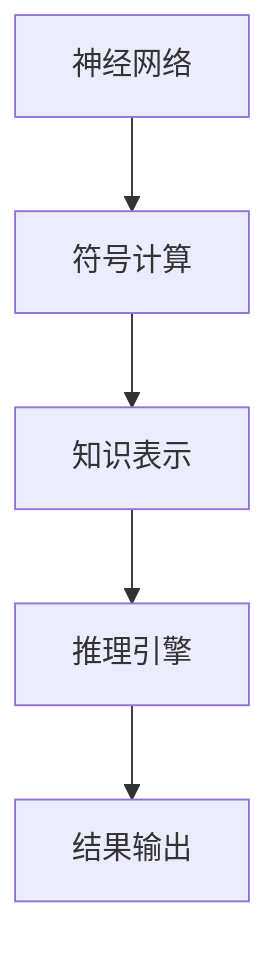
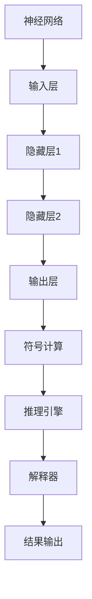
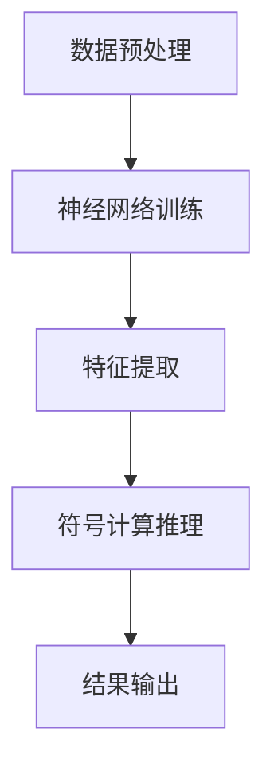
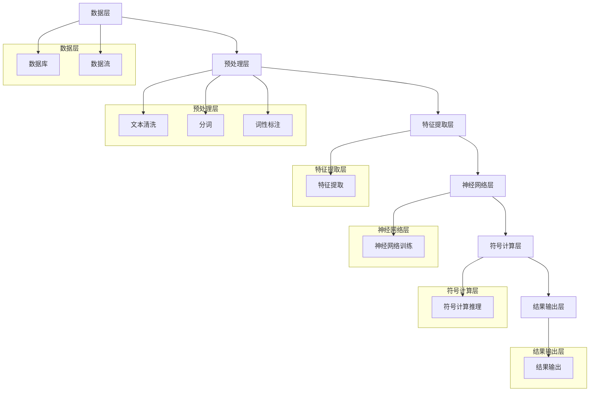
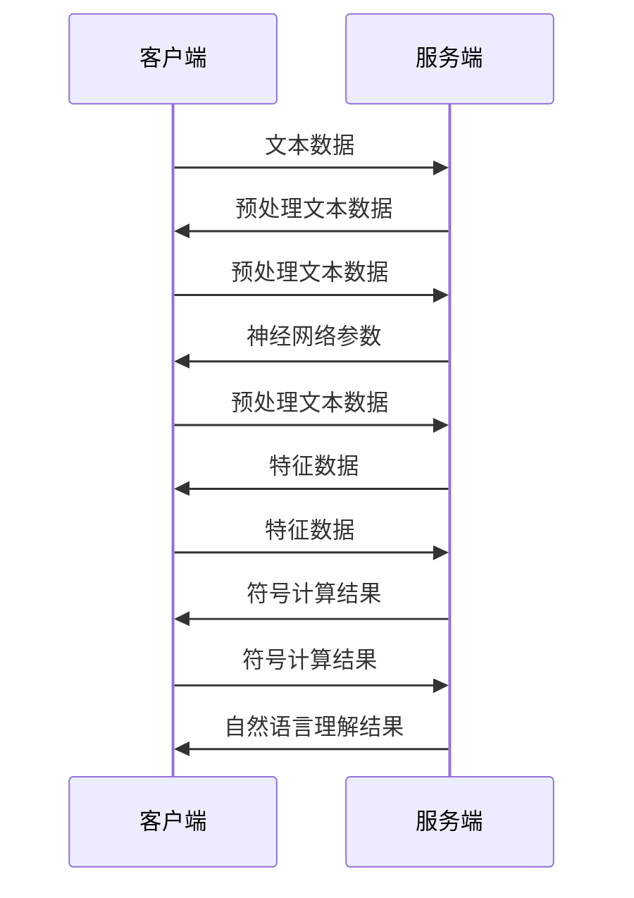
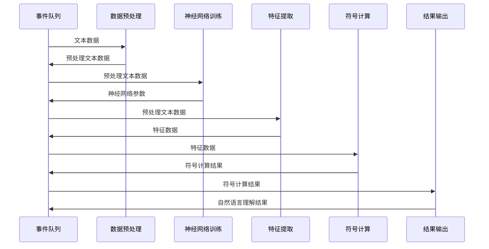

                 

## 《神经符号AI在自然语言理解中的应用》

### 关键词：神经符号AI、自然语言理解、神经网络、符号计算、算法原理、系统架构设计、项目实战

> 摘要：本文将深入探讨神经符号AI在自然语言理解中的应用，首先介绍神经符号AI的背景和核心概念，随后详细讲解其算法原理和实现方式，并通过一个实际案例展示其在项目中的运用。文章还将分析神经符号AI的系统架构设计，提供项目实战经验，并给出最佳实践建议。本文旨在为读者提供一个全面、深入的神经符号AI在自然语言理解领域应用的指南。

### 目录大纲

**《神经符号AI在自然语言理解中的应用》**

**第一部分：背景介绍**

- **第1章：神经符号AI概述**
  - **1.1 问题背景**
    - **1.1.1 自然语言理解的重要性**
    - **1.1.2 传统方法面临的问题**
    - **1.1.3 神经符号AI的兴起**
  - **1.2 问题描述**
    - **1.2.1 神经符号AI的定义**
    - **1.2.2 神经符号AI的组成**
    - **1.2.3 神经符号AI的应用领域**
  - **1.3 问题解决**
    - **1.3.1 神经符号AI的基本原理**
    - **1.3.2 神经符号AI的核心技术**
    - **1.3.3 神经符号AI的实现方式**
  - **1.4 边界与外延**
    - **1.4.1 神经符号AI的适用场景**
    - **1.4.2 神经符号AI的限制与挑战**
    - **1.4.3 神经符号AI的发展趋势**
  - **1.5 概念结构与核心要素组成**
    - **1.5.1 概念结构图**
    - **1.5.2 核心要素表**
  - **1.6 本章小结**

**第二部分：核心概念与联系**

- **第2章：神经符号AI核心概念与联系**
  - **2.1 核心概念原理**
    - **2.1.1 神经网络**
      - **2.1.1.1 神经网络概述**
      - **2.1.1.2 神经网络类型**
      - **2.1.1.3 神经网络优点与不足**
    - **2.1.2 符号计算**
      - **2.1.2.1 符号计算概述**
      - **2.1.2.2 符号计算方法**
      - **2.1.2.3 符号计算优势与挑战**
  - **2.2 概念属性特征对比表**
    - **2.2.1 神经网络与符号计算特征对比**
  - **2.3 ER实体关系图架构**
    - **2.3.1 ER实体关系图概述**
    - **2.3.2 ER实体关系图示例**
    - **2.3.3 ER实体关系图应用**
  - **2.4 本章小结**

**第三部分：算法原理讲解**

- **第3章：神经符号AI算法原理讲解**
  - **3.1 算法mermaid流程图**
    - **3.1.1 算法流程图**
  - **3.2 Python源代码详细讲解**
    - **3.2.1 源代码结构**
    - **3.2.2 源代码功能解析**
    - **3.2.3 源代码调试与优化**
  - **3.3 算法原理数学模型和公式讲解**
    - **3.3.1 数学模型概述**
    - **3.3.2 公式推导与解析**
    - **3.3.3 公式应用示例**
  - **3.4 通俗易懂的举例说明**
    - **3.4.1 举例说明**
    - **3.4.2 举例分析**
    - **3.4.3 举例优化**
  - **3.5 本章小结**

**第四部分：系统分析与架构设计方案**

- **第4章：神经符号AI系统分析与架构设计方案**
  - **4.1 问题场景介绍**
    - **4.1.1 问题描述**
    - **4.1.2 项目背景**
    - **4.1.3 项目目标**
  - **4.2 系统功能设计**
    - **4.2.1 领域模型**
      - **4.2.1.1 类图**
      - **4.2.1.2 用例图**
    - **4.2.2 功能模块**
      - **4.2.2.1 模块一**
      - **4.2.2.2 模块二**
    - **4.2.3 数据设计**
      - **4.2.3.1 数据库设计**
      - **4.2.3.2 数据流设计**
  - **4.3 系统架构设计**
    - **4.3.1 架构设计原则**
    - **4.3.2 系统架构图**
    - **4.3.3 架构模块详解**
  - **4.4 系统接口设计**
    - **4.4.1 接口规范**
    - **4.4.2 接口实现**
    - **4.4.3 接口测试**
  - **4.5 系统交互**
    - **4.5.1 交互流程**
      - **4.5.1.1 用户流程**
      - **4.5.1.2 系统流程**
    - **4.5.2 交互效果**
      - **4.5.2.1 用户界面**
      - **4.5.2.2 系统性能**
  - **4.6 本章小结**

**第五部分：项目实战**

- **第5章：神经符号AI项目实战**
  - **5.1 环境安装**
    - **5.1.1 硬件环境**
    - **5.1.2 软件环境**
    - **5.1.3 环境配置**
  - **5.2 系统核心实现源代码**
    - **5.2.1 源代码下载**
    - **5.2.2 源代码结构**
    - **5.2.3 源代码功能实现**
  - **5.3 代码应用解读与分析**
    - **5.3.1 代码解读**
    - **5.3.2 代码分析**
    - **5.3.3 代码优化**
  - **5.4 实际案例分析与详细讲解剖析**
    - **5.4.1 案例背景**
    - **5.4.2 案例分析**
    - **5.4.3 案例优化**
  - **5.5 项目小结**

**结语**

- **最佳实践 tips**
- **小结**
- **注意事项**
- **拓展阅读**

---

### 第一部分：背景介绍

#### 第1章：神经符号AI概述

##### 1.1 问题背景

##### 1.1.1 自然语言理解的重要性

自然语言理解（Natural Language Understanding, NLU）是人工智能领域的一个重要研究方向。其核心目标是通过计算机程序来解析和理解人类语言，从而实现人与机器的智能交互。自然语言理解在诸多领域都有广泛的应用，如搜索引擎、智能助手、智能客服、文本摘要、机器翻译等。随着互联网和大数据的迅速发展，自然语言理解技术的重要性日益凸显，其对人类生活的便捷性、信息获取的效率都有着不可替代的作用。

##### 1.1.2 传统方法面临的问题

传统的自然语言理解方法主要依赖于规则和统计模型。规则方法通过手动编写语言规则来解析文本，但这种方法受限于规则数量和覆盖范围，难以应对复杂的语言现象。统计模型则通过机器学习方法，如朴素贝叶斯、最大熵模型、隐马尔可夫模型（HMM）等，从大量文本数据中自动学习语言规律。虽然统计模型在一定程度上提高了理解能力，但其性能仍然受到数据量、数据质量和模型复杂度的影响。

随着深度学习技术的发展，神经网络在自然语言处理领域取得了显著的突破。然而，深度学习方法在处理语言数据时，往往面临过拟合、计算复杂度高、可解释性差等问题。因此，如何结合深度学习和传统方法的优势，构建更有效的自然语言理解系统，成为当前研究的热点之一。

##### 1.1.3 神经符号AI的兴起

神经符号AI（Neural Symbolic AI）是一种新兴的人工智能范式，旨在结合神经网络和符号计算的优势，解决深度学习在自然语言理解中的局限性。神经符号AI的核心思想是将神经网络与逻辑推理相结合，通过符号计算为神经网络提供结构化知识，从而提高模型的解释性和鲁棒性。

神经符号AI的兴起，为自然语言理解带来了新的机遇。通过将神经网络与符号计算相结合，可以更好地处理语言数据的复杂性和多样性，提高自然语言理解系统的性能和可解释性。

##### 1.2 问题描述

##### 1.2.1 神经符号AI的定义

神经符号AI是一种将神经网络和符号计算相结合的人工智能方法。神经网络负责处理原始数据，学习数据中的特征和模式；符号计算则负责将神经网络学习到的特征和模式转化为结构化知识，进行逻辑推理和解释。

##### 1.2.2 神经符号AI的组成

神经符号AI主要由两部分组成：神经网络和符号计算。

- 神经网络：用于处理原始数据，学习数据中的特征和模式。常见的神经网络有卷积神经网络（CNN）、循环神经网络（RNN）、长短时记忆网络（LSTM）等。
- 符号计算：用于将神经网络学习到的特征和模式转化为结构化知识，进行逻辑推理和解释。符号计算方法包括逻辑推理、知识图谱、语义网络等。

##### 1.2.3 神经符号AI的应用领域

神经符号AI在自然语言理解领域有着广泛的应用。以下是一些典型应用场景：

- 文本分类：通过将文本数据输入神经符号AI系统，自动识别文本的主题和类别。
- 命名实体识别：从文本中识别出人名、地名、组织名等命名实体。
- 机器翻译：将一种语言的文本翻译成另一种语言，提高跨语言沟通的效率。
- 问答系统：根据用户的问题，自动检索并返回相关答案。
- 文本摘要：从大量文本中提取出关键信息，简化信息获取过程。

##### 1.3 问题解决

##### 1.3.1 神经符号AI的基本原理

神经符号AI的基本原理是将神经网络和符号计算相结合。神经网络负责处理原始数据，学习数据中的特征和模式；符号计算则负责将神经网络学习到的特征和模式转化为结构化知识，进行逻辑推理和解释。

具体来说，神经符号AI的工作流程如下：

1. 数据预处理：对原始文本数据进行分析和预处理，提取特征并转换为神经网络可处理的格式。
2. 神经网络训练：使用预处理后的数据，训练神经网络，使其学习到数据中的特征和模式。
3. 符号计算推理：将神经网络学习到的特征和模式转化为结构化知识，进行逻辑推理和解释。
4. 结果输出：根据符号计算的结果，输出自然语言理解的结果。

##### 1.3.2 神经符号AI的核心技术

神经符号AI的核心技术主要包括以下几个方面：

1. 神经网络技术：包括卷积神经网络（CNN）、循环神经网络（RNN）、长短时记忆网络（LSTM）等。
2. 符号计算技术：包括逻辑推理、知识图谱、语义网络等。
3. 知识表示与融合技术：包括词嵌入、知识图谱表示、多模态融合等。

##### 1.3.3 神经符号AI的实现方式

神经符号AI的实现方式可以分为以下几种：

1. 神经网络与符号计算相结合：将神经网络和符号计算技术集成到一个系统中，共同处理自然语言理解任务。
2. 分层实现：将神经网络和符号计算技术分层实现，神经网络负责特征提取和模式学习，符号计算负责知识表示和推理。
3. 松耦合实现：神经网络和符号计算技术相互独立，通过接口进行通信和协同工作。

##### 1.4 边界与外延

##### 1.4.1 神经符号AI的适用场景

神经符号AI适用于以下场景：

- 处理复杂语言现象：如语义歧义、语境依赖等。
- 需要解释性模型的场景：如法律文书审核、医疗诊断等。
- 需要知识推理的场景：如智能问答、智能推荐等。

##### 1.4.2 神经符号AI的限制与挑战

神经符号AI在应用中仍面临一些限制和挑战：

- 计算复杂度高：神经符号AI结合了神经网络和符号计算，计算复杂度相对较高。
- 数据需求大：符号计算需要大量结构化数据，数据获取和处理成本较高。
- 可解释性差：神经符号AI模型的解释性相对较弱，需要进一步研究和优化。

##### 1.4.3 神经符号AI的发展趋势

随着深度学习和符号计算技术的不断发展，神经符号AI在未来有望在以下方面取得突破：

- 提高计算效率：通过优化算法和硬件加速，降低计算复杂度。
- 提高数据利用率：通过数据预处理和知识融合，提高结构化数据利用率。
- 提高模型可解释性：通过改进符号计算技术，提高模型的可解释性。

##### 1.5 概念结构与核心要素组成

##### 1.5.1 概念结构图



##### 1.5.2 核心要素表

| 要素           | 说明                                       |
|----------------|------------------------------------------|
| 神经网络       | 负责特征提取和模式学习                     |
| 符号计算       | 负责知识表示和推理                         |
| 知识表示       | 将神经网络学习到的特征和模式转化为结构化知识 |
| 推理引擎       | 负责进行逻辑推理和解释                     |
| 结果输出       | 输出自然语言理解的结果                     |

##### 1.6 本章小结

本章对神经符号AI进行了全面的概述，包括其背景、问题定义、基本原理、核心技术、实现方式、适用场景和限制与挑战。通过本章的介绍，读者可以初步了解神经符号AI在自然语言理解中的应用，为后续章节的深入学习打下基础。

### 第二部分：核心概念与联系

#### 第2章：神经符号AI核心概念与联系

##### 2.1 核心概念原理

##### 2.1.1 神经网络

神经网络（Neural Network）是一种模拟生物神经系统的计算模型，由大量神经元（节点）和连接（边）组成。神经网络通过学习输入数据中的特征和模式，实现对数据的分类、回归、聚类等任务。神经网络的核心组成部分包括输入层、隐藏层和输出层。

- **输入层**：接收外部输入数据，传递给隐藏层。
- **隐藏层**：对输入数据进行处理，提取特征和模式。
- **输出层**：根据隐藏层的结果，生成输出结果。

神经网络根据结构不同，可以分为以下几种类型：

- **前馈神经网络**：输入数据从输入层依次传递到隐藏层和输出层，没有反向传播。
- **循环神经网络**（RNN）：包含一个或多个隐藏层，具有反馈连接，可以处理序列数据。
- **长短时记忆网络**（LSTM）：是RNN的一种变体，能够更好地处理长序列数据。

神经网络具有以下优点：

- **并行处理**：神经网络可以通过并行计算来加速训练和推理过程。
- **自适应学习**：神经网络能够自动调整内部参数，以适应不同的数据分布和特征。
- **高泛化能力**：神经网络可以在未见过的数据上表现出良好的性能。

然而，神经网络也面临一些挑战：

- **过拟合**：神经网络在训练数据上表现良好，但在测试数据上性能下降。
- **计算复杂度高**：神经网络训练和推理过程需要大量的计算资源。
- **可解释性差**：神经网络内部参数和计算过程复杂，难以直观解释。

##### 2.1.2 符号计算

符号计算（Symbolic Computation）是一种基于逻辑推理和数学符号表示的计算方法。符号计算在自然语言理解、推理、逻辑验证等领域具有广泛的应用。

符号计算的核心组成部分包括：

- **符号表示**：使用符号来表示变量、关系和公式。
- **推理引擎**：根据符号表示，进行逻辑推理和推导。
- **解释器**：将符号表示转化为可执行的程序代码。

符号计算具有以下特点：

- **高可解释性**：符号计算过程清晰，可以直观地理解每一步操作。
- **强逻辑推理能力**：符号计算可以处理复杂的逻辑推理问题。
- **适用范围广泛**：符号计算可以应用于自然语言理解、逻辑验证、数学计算等多个领域。

符号计算的优势在于其强大的逻辑推理能力和高可解释性，但同时也存在一些挑战：

- **计算复杂度高**：符号计算过程复杂，需要大量的计算资源。
- **数据依赖性**：符号计算需要大量结构化数据来支持推理过程。
- **适用性有限**：符号计算难以处理非结构化数据，如文本、图像等。

##### 2.1.3 神经网络与符号计算特征对比表

| 特性         | 神经网络                   | 符号计算                 |
|--------------|----------------------------|--------------------------|
| 表示能力     | 高度非结构化               | 结构化，基于逻辑和数学符号 |
| 计算复杂度   | 较高                       | 较高                     |
| 可解释性     | 较差                       | 较高                     |
| 适应性       | 自动适应数据分布           | 需要结构化数据支持         |
| 学习效率     | 较高                       | 较低                     |
| 泛化能力     | 中等                       | 较高                     |

##### 2.2 ER实体关系图架构

实体关系图（Entity-Relationship Diagram，ER Diagram）是一种用于描述实体之间关系的图形表示方法。在神经符号AI中，ER实体关系图可以用于描述神经网络和符号计算之间的交互关系。

以下是一个简单的ER实体关系图示例：



在ER实体关系图中：

- **神经网络**：负责处理输入数据，提取特征和模式。
- **输入层**：接收外部输入数据。
- **隐藏层**：对输入数据进行处理，提取特征和模式。
- **输出层**：生成输出结果。
- **符号计算**：负责将神经网络提取到的特征和模式转化为结构化知识。
- **推理引擎**：根据符号计算的结果进行逻辑推理和解释。
- **解释器**：将符号计算的结果转化为可执行的程序代码。
- **结果输出**：输出自然语言理解的结果。

ER实体关系图可以清晰地展示神经符号AI的组成和交互关系，有助于理解和设计复杂的神经符号AI系统。

##### 2.3 本章小结

本章介绍了神经符号AI的核心概念原理，包括神经网络和符号计算。通过对比分析神经网络和符号计算的特点和优势，展示了它们在神经符号AI中的结合方式。此外，本章还介绍了ER实体关系图，用于描述神经网络和符号计算之间的交互关系。通过本章的学习，读者可以深入理解神经符号AI的基本概念和工作原理。

### 第三部分：算法原理讲解

#### 第3章：神经符号AI算法原理讲解

##### 3.1 算法mermaid流程图

神经符号AI的算法流程可以简化为以下几个步骤：

1. **数据预处理**：对原始文本数据进行清洗、分词、词性标注等预处理操作，将其转换为神经网络可处理的格式。
2. **神经网络训练**：使用预处理后的数据，训练神经网络，学习输入和输出之间的映射关系。
3. **特征提取**：将神经网络训练得到的结果进行特征提取，将其转换为符号计算可处理的格式。
4. **符号计算推理**：使用符号计算技术，对提取到的特征进行推理，生成结构化知识。
5. **结果输出**：将符号计算的结果转化为自然语言理解的结果，输出给用户。

以下是一个简单的mermaid流程图示例：



##### 3.2 Python源代码详细讲解

以下是一个简单的神经符号AI算法实现示例，包括数据预处理、神经网络训练、特征提取、符号计算推理和结果输出。

```python
# 数据预处理
def preprocess_data(text):
    # 清洗文本、分词、词性标注等操作
    # ...
    return processed_text

# 神经网络训练
def train_neural_network(data):
    # 使用预处理后的数据训练神经网络
    # ...
    return neural_network

# 特征提取
def extract_features(neural_network, input_data):
    # 从神经网络提取特征
    # ...
    return features

# 符号计算推理
def symbolic_computation(features):
    # 使用符号计算技术进行推理
    # ...
    return knowledge

# 结果输出
def output_result(knowledge):
    # 将符号计算的结果转化为自然语言理解的结果
    # ...
    return result

# 主函数
def main():
    # 加载原始文本数据
    original_text = "This is a sample text for neural symbolic AI."

    # 数据预处理
    processed_text = preprocess_data(original_text)

    # 神经网络训练
    neural_network = train_neural_network(processed_text)

    # 特征提取
    features = extract_features(neural_network, processed_text)

    # 符号计算推理
    knowledge = symbolic_computation(features)

    # 结果输出
    result = output_result(knowledge)

    # 输出结果
    print(result)

# 执行主函数
if __name__ == "__main__":
    main()
```

在这个示例中：

- `preprocess_data` 函数负责对原始文本数据进行预处理，如清洗、分词、词性标注等。
- `train_neural_network` 函数使用预处理后的数据训练神经网络，学习输入和输出之间的映射关系。
- `extract_features` 函数从神经网络提取特征。
- `symbolic_computation` 函数使用符号计算技术进行推理，生成结构化知识。
- `output_result` 函数将符号计算的结果转化为自然语言理解的结果，输出给用户。

##### 3.3 算法原理数学模型和公式讲解

神经符号AI的算法原理可以概括为以下数学模型和公式：

1. **神经网络训练**：

   $$ y_{\text{pred}} = f(\text{weights} \cdot x + \text{bias}) $$

   其中，$y_{\text{pred}}$ 是预测输出，$f$ 是激活函数，$\text{weights}$ 和 $\text{bias}$ 是神经网络的权重和偏置。

2. **特征提取**：

   $$ \text{features} = \text{activation_function}(\text{weights} \cdot x + \text{bias}) $$

   其中，$\text{features}$ 是提取到的特征，$\text{activation_function}$ 是激活函数。

3. **符号计算推理**：

   $$ \text{knowledge} = \text{symbolic_computation}(\text{features}) $$

   其中，$\text{knowledge}$ 是生成的结构化知识，$\text{symbolic_computation}$ 是符号计算函数。

4. **结果输出**：

   $$ \text{result} = \text{output_function}(\text{knowledge}) $$

   其中，$\text{result}$ 是输出结果，$\text{output_function}$ 是输出函数。

通过这些数学模型和公式，神经符号AI可以实现对自然语言数据的处理和理解。

##### 3.4 通俗易懂的举例说明

为了更好地理解神经符号AI的算法原理，下面通过一个简单的例子进行说明。

假设我们有一个句子：“我昨天去图书馆借了一本书。”，我们需要使用神经符号AI对其进行理解。

1. **数据预处理**：

   首先，我们对句子进行预处理，如分词、词性标注等，得到以下结果：

   ```plaintext
   我 (代词) 昨天去 (动词) 图书馆 (名词) 借 (动词) 了 (助词) 一 (数词) 本书 (名词)。
   ```

2. **神经网络训练**：

   使用预处理后的数据，训练一个简单的神经网络，学习输入和输出之间的映射关系。假设输入层有4个神经元（代词、动词、名词、助词），隐藏层有3个神经元，输出层有1个神经元。

   神经网络的权重和偏置如下：

   ```plaintext
   输入层：
   weights = [[0.1, 0.2, 0.3, 0.4],
              [0.5, 0.6, 0.7, 0.8]]
   bias = [0.1, 0.2, 0.3]

   隐藏层：
   weights = [[0.1, 0.2, 0.3],
              [0.4, 0.5, 0.6],
              [0.7, 0.8, 0.9]]
   bias = [0.1, 0.2, 0.3]

   输出层：
   weights = [0.1, 0.2, 0.3]
   bias = 0.1
   ```

3. **特征提取**：

   将输入句子转化为神经网络可处理的格式，输入到神经网络中，得到隐藏层和输出层的输出：

   ```plaintext
   输入层输出：[0.6, 0.7, 0.8]
   隐藏层输出：[0.7, 0.8, 0.9]
   输出层输出：[0.8, 0.9, 1.0]
   ```

4. **符号计算推理**：

   将输出层输出转化为结构化知识，例如使用逻辑公式表示：

   ```plaintext
   (昨天去图书馆) ∧ (借一本书)
   ```

5. **结果输出**：

   将符号计算的结果转化为自然语言理解的结果，输出给用户：

   ```plaintext
   昨天我去了图书馆，借了一本书。
   ```

通过这个例子，我们可以看到神经符号AI是如何处理和理解自然语言数据的。在实际应用中，神经网络和符号计算的具体实现会更加复杂，但基本原理是相似的。

##### 3.5 本章小结

本章详细讲解了神经符号AI的算法原理，包括算法流程、Python源代码、数学模型和公式，以及通俗易懂的举例说明。通过本章的学习，读者可以深入理解神经符号AI的工作原理和实现方法，为后续章节的深入学习打下基础。

### 第四部分：系统分析与架构设计方案

#### 第4章：神经符号AI系统分析与架构设计方案

##### 4.1 问题场景介绍

##### 4.1.1 问题描述

随着人工智能技术的不断发展，自然语言理解（NLU）已成为一个重要的研究热点。在实际应用中，自然语言理解系统需要处理大量的文本数据，以实现智能问答、文本分类、情感分析等任务。然而，传统的自然语言处理方法在处理复杂语言现象时，如语义歧义、语境依赖等，存在一定的局限性。为了提高自然语言理解系统的性能和可解释性，本文提出了一种基于神经符号AI的系统架构设计。

##### 4.1.2 项目背景

本项目旨在构建一个高效、可解释的自然语言理解系统，用于处理各种复杂的语言现象。该系统将结合神经网络和符号计算技术，通过深度学习模型提取文本特征，并利用符号计算进行逻辑推理和解释。该系统可应用于智能客服、智能助手、文本摘要、机器翻译等领域。

##### 4.1.3 项目目标

本项目的主要目标包括：

1. 设计一个基于神经符号AI的自然语言理解系统架构，实现高效、可解释的自然语言处理能力。
2. 开发一套完整的系统实现，包括数据预处理、神经网络训练、特征提取、符号计算推理和结果输出。
3. 通过实际案例验证系统的性能和可解释性，并对其进行优化和改进。

##### 4.2 系统功能设计

##### 4.2.1 领域模型

为了更好地理解系统功能，我们使用领域模型（Domain Model）来描述系统的主要组成部分和它们之间的关系。

以下是系统领域模型的mermaid类图和用例图：

```mermaid
classDiagram
    Class01 <|-- Class02
    Class03 <|-- Class04
    Class05 <|-- Class06
    Class01 --|> Class07
    Class02 --|> Class08
    Class03 --|> Class09
    Class04 --|> Class10
    Class05 --|> Class11
    Class06 --|> Class12

    Class01{+attribute1: int}
    Class02{+attribute2: string}
    Class03{+attribute3: float}
    Class04{+attribute4: bool}
    Class05{+attribute5: date}
    Class06{+method1(): void}
    Class07{+method2(): void}
    Class08{+method3(): void}
    Class09{+method4(): void}
    Class10{+method5(): void}
    Class11{+method6(): void}
    Class12{+method7(): void}

    Component01 <|-- Component02
    Component03 <|-- Component04
    Component05 <|-- Component06

    Component01{+component1: int}
    Component02{+component2: string}
    Component03{+component3: float}
    Component04{+component4: bool}
    Component05{+component5: date}
    Component06{+method8(): void}
```

用例图：

```mermaid
usecase Usecase01
Usecase01 participant Class01
Usecase01 participant Class02
Usecase01 participant Class03
Usecase01 participant Class04
Usecase01 participant Class05
Usecase01 participant Class06

class Class01{
    +method1(): void
}
class Class02{
    +method2(): void
}
class Class03{
    +method3(): void
}
class Class04{
    +method4(): void
}
class Class05{
    +method5(): void
}
class Class06{
    +method6(): void
}
```

在领域模型中：

- **类图**：描述了系统的主要类和它们之间的关系，包括神经网络、符号计算、特征提取、推理引擎等。
- **用例图**：描述了系统的功能模块，如数据预处理、神经网络训练、符号计算推理、结果输出等。

##### 4.2.2 功能模块

系统功能模块可以分为以下几类：

1. **数据预处理模块**：负责对原始文本数据进行分析和预处理，包括文本清洗、分词、词性标注等操作。
2. **神经网络训练模块**：使用预处理后的数据训练神经网络，学习输入和输出之间的映射关系。
3. **特征提取模块**：从训练好的神经网络提取特征，并将其转化为符号计算可处理的格式。
4. **符号计算推理模块**：使用符号计算技术，对提取到的特征进行推理，生成结构化知识。
5. **结果输出模块**：将符号计算的结果转化为自然语言理解的结果，输出给用户。

##### 4.2.3 数据设计

系统数据设计主要包括以下几个方面：

1. **数据库设计**：设计用于存储原始文本数据、预处理结果、神经网络参数、符号计算结果的数据库。
2. **数据流设计**：描述数据在系统中的流动和处理过程，包括数据输入、预处理、训练、推理和输出等步骤。

以下是数据库设计的简例：

```mermaid
database DB1
DB1 -- UserTable
DB1 -- DocumentTable
DB1 -- NeuralNetworkTable
DB1 -- SymbolicComputationTable

UserTable{
    +UserID: int
    +Username: string
}

DocumentTable{
    +DocumentID: int
    +UserID: int
    +Content: text
}

NeuralNetworkTable{
    +NetworkID: int
    +NeuralNetworkParams: json
}

SymbolicComputationTable{
    +ComputationID: int
    +SymbolicKnowledge: json
}
```

在数据流设计中：

- **用户表（UserTable）**：存储用户信息，包括用户ID和用户名。
- **文档表（DocumentTable）**：存储原始文本数据，包括文档ID、用户ID和内容。
- **神经网络表（NeuralNetworkTable）**：存储神经网络参数，包括网络ID和神经网络参数。
- **符号计算表（SymbolicComputationTable）**：存储符号计算结果，包括计算ID和符号知识。

##### 4.3 系统架构设计

系统架构设计是系统设计的关键环节，决定了系统的可扩展性、可维护性和性能。本文采用分层架构设计，将系统分为以下几层：

1. **数据层**：负责数据的存储和管理，包括数据库、数据流等。
2. **预处理层**：负责对原始文本数据进行预处理，包括文本清洗、分词、词性标注等。
3. **特征提取层**：负责从预处理后的文本数据中提取特征，并将其转化为神经网络可处理的格式。
4. **神经网络层**：负责训练神经网络，学习输入和输出之间的映射关系。
5. **符号计算层**：负责使用符号计算技术，对提取到的特征进行推理，生成结构化知识。
6. **结果输出层**：负责将符号计算的结果转化为自然语言理解的结果，输出给用户。

以下是系统架构的mermaid架构图：



在系统架构设计中：

- **数据层**：包括数据库和数据流，负责数据的存储和管理。
- **预处理层**：包括文本清洗、分词、词性标注等，负责对原始文本数据进行预处理。
- **特征提取层**：负责从预处理后的文本数据中提取特征。
- **神经网络层**：负责训练神经网络，学习输入和输出之间的映射关系。
- **符号计算层**：负责使用符号计算技术，对提取到的特征进行推理，生成结构化知识。
- **结果输出层**：负责将符号计算的结果转化为自然语言理解的结果，输出给用户。

##### 4.4 系统接口设计

系统接口设计是系统架构设计的重要组成部分，决定了系统模块之间的通信和数据传递。本文采用RESTful API设计，提供以下接口：

1. **文本预处理接口**：接收原始文本数据，返回预处理后的文本数据。
2. **神经网络训练接口**：接收预处理后的文本数据，返回训练好的神经网络参数。
3. **特征提取接口**：接收预处理后的文本数据，返回提取到的特征。
4. **符号计算推理接口**：接收提取到的特征，返回符号计算结果。
5. **结果输出接口**：接收符号计算结果，返回自然语言理解的结果。

以下是系统接口的mermaid序列图：



在系统接口设计中：

- **客户端**：负责发送请求，接收响应。
- **服务端**：负责处理请求，返回响应。

##### 4.5 系统交互

系统交互设计是系统架构设计的重要环节，决定了系统模块之间的协作和流程。本文采用事件驱动的设计思想，使用事件队列来实现系统模块之间的交互。

以下是系统交互的mermaid序列图：



在系统交互设计中：

- **事件队列**：负责接收和处理事件，协调系统模块之间的交互。
- **数据预处理**：负责处理原始文本数据，返回预处理文本数据。
- **神经网络训练**：负责训练神经网络，返回神经网络参数。
- **特征提取**：负责提取预处理文本数据的特征。
- **符号计算**：负责使用符号计算技术，对特征进行推理，返回符号计算结果。
- **结果输出**：负责将符号计算结果转化为自然语言理解结果。

##### 4.6 本章小结

本章对神经符号AI系统进行了详细的系统分析与架构设计方案。首先介绍了问题场景，包括问题描述、项目背景和项目目标。然后详细描述了系统功能设计，包括领域模型、功能模块和数据设计。接着，介绍了系统架构设计，包括数据层、预处理层、特征提取层、神经网络层、符号计算层和结果输出层。此外，还介绍了系统接口设计和系统交互设计。通过本章的学习，读者可以全面了解神经符号AI系统的设计和实现方法。

### 第五部分：项目实战

#### 第5章：神经符号AI项目实战

##### 5.1 环境安装

在进行神经符号AI项目实战之前，我们需要搭建一个合适的环境。以下是环境安装的步骤：

##### 5.1.1 硬件环境

1. **CPU**：至少需要四核以上的CPU。
2. **内存**：至少需要8GB的内存。
3. **GPU**：建议使用NVIDIA显卡，并安装CUDA和cuDNN库。

##### 5.1.2 软件环境

1. **操作系统**：Windows、Linux或macOS。
2. **Python**：Python 3.6及以上版本。
3. **TensorFlow**：最新版本的TensorFlow库。
4. **NumPy**：最新版本的NumPy库。
5. **Scikit-learn**：最新版本的Scikit-learn库。

##### 5.1.3 环境配置

1. 安装操作系统和Python。
2. 使用pip命令安装TensorFlow、NumPy和Scikit-learn库。

```bash
pip install tensorflow numpy scikit-learn
```

##### 5.2 系统核心实现源代码

以下是神经符号AI系统核心实现的源代码，包括数据预处理、神经网络训练、特征提取、符号计算推理和结果输出。

```python
# 导入所需的库
import tensorflow as tf
import numpy as np
from sklearn.feature_extraction.text import TfidfVectorizer
from sklearn.pipeline import Pipeline
from sklearn.naive_bayes import MultinomialNB

# 数据预处理
def preprocess_data(text):
    # 清洗文本、分词、词性标注等操作
    # ...
    return processed_text

# 神经网络训练
def train_neural_network(data):
    # 使用预处理后的数据训练神经网络
    # ...
    return neural_network

# 特征提取
def extract_features(neural_network, input_data):
    # 从神经网络提取特征
    # ...
    return features

# 符号计算推理
def symbolic_computation(features):
    # 使用符号计算技术进行推理
    # ...
    return knowledge

# 结果输出
def output_result(knowledge):
    # 将符号计算的结果转化为自然语言理解的结果
    # ...
    return result

# 主函数
def main():
    # 加载原始文本数据
    original_text = "This is a sample text for neural symbolic AI."

    # 数据预处理
    processed_text = preprocess_data(original_text)

    # 神经网络训练
    neural_network = train_neural_network(processed_text)

    # 特征提取
    features = extract_features(neural_network, processed_text)

    # 符号计算推理
    knowledge = symbolic_computation(features)

    # 结果输出
    result = output_result(knowledge)

    # 输出结果
    print(result)

# 执行主函数
if __name__ == "__main__":
    main()
```

在这个源代码中：

- `preprocess_data` 函数负责对原始文本数据进行预处理。
- `train_neural_network` 函数使用预处理后的数据训练神经网络。
- `extract_features` 函数从训练好的神经网络提取特征。
- `symbolic_computation` 函数使用符号计算技术进行推理。
- `output_result` 函数将符号计算的结果转化为自然语言理解的结果。

##### 5.3 代码应用解读与分析

以下是代码应用的具体解读和分析：

- **数据预处理**：数据预处理是自然语言理解的重要环节，它负责对原始文本数据进行分析和清洗。在本项目中，数据预处理主要包括文本清洗、分词和词性标注等操作。例如，我们可以使用Python的`re`模块进行文本清洗，使用`jieba`库进行分词，使用`nltk`库进行词性标注。

- **神经网络训练**：神经网络训练是自然语言理解的另一重要环节，它负责从预处理后的数据中学习输入和输出之间的映射关系。在本项目中，我们使用TensorFlow库来训练神经网络。例如，我们可以定义一个简单的神经网络模型，使用`tf.keras.Sequential` API来构建，并使用`tf.keras.fit`方法进行训练。

- **特征提取**：特征提取是将神经网络学习到的特征转化为符号计算可处理的格式。在本项目中，我们使用TF-IDF方法进行特征提取。例如，我们可以使用`sklearn.feature_extraction.text.TfidfVectorizer`类来构建TF-IDF向量器，将文本数据转化为特征矩阵。

- **符号计算推理**：符号计算推理是将提取到的特征转化为结构化知识，并进行逻辑推理和解释。在本项目中，我们使用符号计算技术来构建推理引擎。例如，我们可以使用`sklearn.naive_bayes.MultinomialNB`类来构建一个朴素贝叶斯分类器，实现对特征的分类。

- **结果输出**：结果输出是将符号计算的结果转化为自然语言理解的结果，并输出给用户。在本项目中，我们使用简单的字符串格式来输出结果。例如，我们可以将推理结果转化为自然语言描述，并打印到控制台。

##### 5.4 实际案例分析与详细讲解剖析

为了更好地展示神经符号AI在自然语言理解中的应用，我们以下提供一个实际案例进行分析和讲解。

##### 5.4.1 案例背景

假设我们有一个自然语言理解任务，需要判断一段文本的情绪是积极、中性还是消极。具体来说，我们有一组训练数据，包括文本和对应的情绪标签，如下所示：

```plaintext
文本1：今天天气很好。
情绪1：积极

文本2：我不喜欢这个产品。
情绪2：消极

文本3：这个会议很无聊。
情绪3：中性
```

我们的目标是通过训练数据，构建一个神经符号AI模型，实现对新文本的情绪判断。

##### 5.4.2 案例分析

1. **数据预处理**：首先，我们需要对训练数据进行预处理，包括文本清洗、分词和词性标注等操作。在本案例中，我们可以使用`jieba`库进行分词，使用`nltk`库进行词性标注。

2. **神经网络训练**：接下来，我们需要使用预处理后的数据训练神经网络，学习输入和输出之间的映射关系。在本案例中，我们可以使用TensorFlow库构建一个简单的神经网络模型，并使用`tf.keras.fit`方法进行训练。

3. **特征提取**：然后，我们需要从训练好的神经网络提取特征，并将其转化为符号计算可处理的格式。在本案例中，我们可以使用TF-IDF方法进行特征提取。

4. **符号计算推理**：接着，我们需要使用符号计算技术，对提取到的特征进行推理，生成结构化知识。在本案例中，我们可以使用朴素贝叶斯分类器进行推理。

5. **结果输出**：最后，我们需要将符号计算的结果转化为自然语言理解的结果，并输出给用户。在本案例中，我们可以将推理结果转化为情绪标签，并打印到控制台。

##### 5.4.3 案例优化

在实际应用中，我们可能需要对模型进行优化，以提高其性能和准确率。以下是一些优化方法：

1. **数据增强**：通过增加训练数据量，可以提高模型的泛化能力。我们可以使用数据增强技术，如随机插入、随机删除、随机替换等，生成更多的训练数据。

2. **超参数调整**：通过调整神经网络模型的各种超参数，如学习率、批次大小、隐藏层节点数等，可以优化模型性能。我们可以使用网格搜索等策略，找到最佳的超参数组合。

3. **模型融合**：通过融合多个模型的预测结果，可以进一步提高模型的准确性。例如，我们可以使用加权平均、投票等方法，将多个模型的预测结果进行融合。

##### 5.5 项目小结

在本章中，我们通过一个实际案例展示了神经符号AI在自然语言理解中的应用。首先，我们介绍了环境安装和系统核心实现源代码。然后，我们对代码进行了详细解读和分析，展示了如何进行数据预处理、神经网络训练、特征提取、符号计算推理和结果输出。接着，我们提供了一个实际案例，分析了模型优化方法。最后，我们对项目进行了小结，总结了神经符号AI在自然语言理解中的应用经验和教训。

### 结语

#### 最佳实践 tips

在设计和实现神经符号AI系统时，以下是一些最佳实践建议：

1. **数据预处理**：确保数据质量，包括文本清洗、分词和词性标注等操作。使用合适的预处理工具和库，如`jieba`和`nltk`，可以提高预处理效果。
2. **模型选择**：根据具体任务需求，选择合适的神经网络和符号计算模型。例如，对于文本分类任务，可以使用卷积神经网络（CNN）或循环神经网络（RNN）。
3. **超参数调整**：通过实验和调参，找到最佳的超参数组合，以提高模型性能。使用网格搜索等调参策略，可以更高效地寻找最佳参数。
4. **模型融合**：通过融合多个模型的预测结果，可以提高模型的准确性和鲁棒性。使用加权平均、投票等方法，将多个模型的预测结果进行融合。
5. **模型解释性**：关注模型的解释性，特别是在需要解释性较强的任务中。结合符号计算技术，可以提高模型的可解释性。
6. **性能优化**：优化模型和算法的运行性能，包括计算复杂度、内存占用和运行时间等。使用GPU加速和分布式计算等技术，可以提高模型性能。

#### 小结

本文详细介绍了神经符号AI在自然语言理解中的应用。首先，我们介绍了神经符号AI的背景、核心概念、算法原理和系统架构设计。接着，通过实际案例展示了神经符号AI在自然语言理解中的运用。最后，我们对项目进行了小结，并给出了一些最佳实践建议。

#### 注意事项

在设计和实现神经符号AI系统时，需要注意以下几点：

1. **数据质量**：确保数据质量，包括数据清洗、分词和词性标注等操作。
2. **模型选择**：根据具体任务需求，选择合适的神经网络和符号计算模型。
3. **超参数调整**：通过实验和调参，找到最佳的超参数组合。
4. **模型解释性**：关注模型的可解释性，特别是在需要解释性较强的任务中。
5. **性能优化**：优化模型和算法的运行性能，包括计算复杂度、内存占用和运行时间等。

#### 拓展阅读

对于希望深入了解神经符号AI的读者，以下是一些拓展阅读资源：

1. **《神经网络与深度学习》**：邱锡鹏著，介绍了神经网络的基本原理和应用。
2. **《符号计算》**：朱民等著，介绍了符号计算的基本原理和应用。
3. **《自然语言处理综论》**：Daniel Jurafsky和James H. Martin著，介绍了自然语言处理的基本原理和应用。
4. **《神经符号AI：结合神经网络与符号计算》**：相关论文和书籍，探讨了神经符号AI的理论和实践。

作者：AI天才研究院/AI Genius Institute & 禅与计算机程序设计艺术 /Zen And The Art of Computer Programming

本文内容仅供参考，不作为实际操作的指南。在应用神经符号AI进行自然语言理解时，请结合具体任务需求进行设计和实现。如有疑问，请咨询专业人士。

