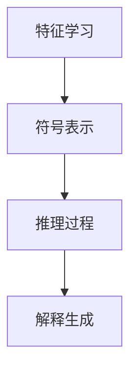
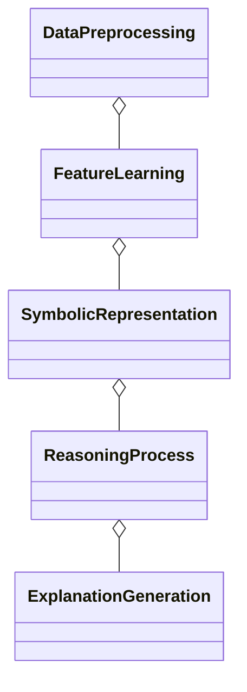
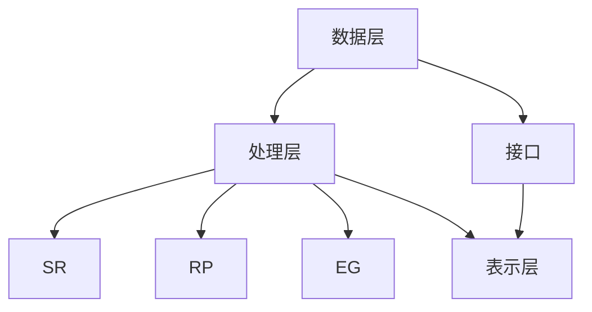
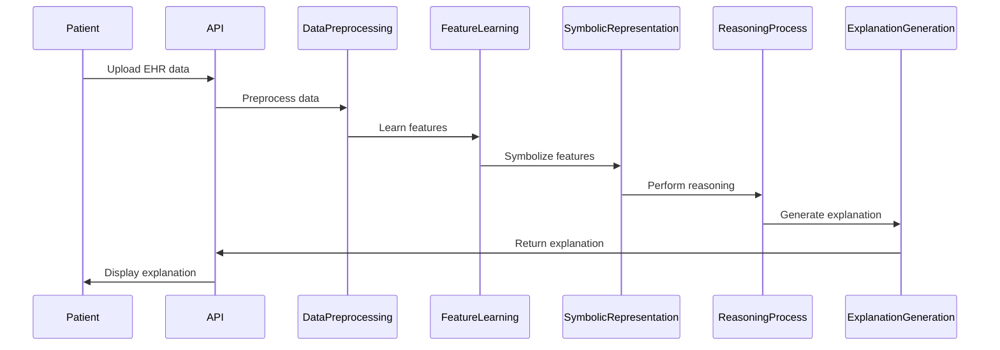
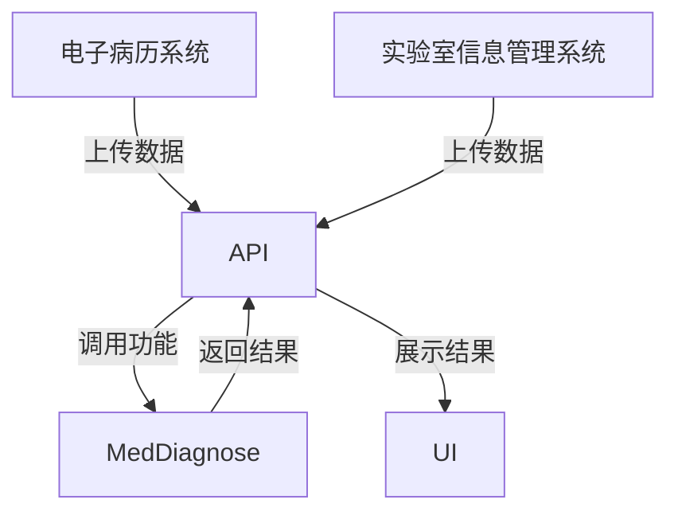

                 

### 目录

# 神经符号系统在可解释推理中的最新进展

> 关键词：神经符号系统，可解释推理，深度学习，符号逻辑，算法进展

> 摘要：本文详细探讨了神经符号系统在可解释推理领域的最新进展，包括其核心概念、关键算法、系统架构设计方案以及实际应用案例分析。文章旨在为读者提供对神经符号系统在可解释推理中的全面理解，帮助其在相关领域进行深入研究和应用。

----------------------------------------------------------------

## 1. 引言

随着人工智能技术的快速发展，深度学习模型已经在图像识别、自然语言处理、推荐系统等领域取得了显著的成果。然而，这些模型的黑箱特性使得其决策过程变得不透明，难以被人类理解和信任。特别是在需要可解释性的领域，如医疗诊断、金融风险评估和司法决策等，模型的透明性和可解释性显得尤为重要。因此，如何在保持模型性能的同时，提高其可解释性，成为当前人工智能领域的一个重要研究方向。

神经符号系统（Neural Symbolic Systems）作为一种新型的混合智能系统，通过结合神经网络的强大计算能力和符号逻辑的可解释性，提供了一种可能的解决方案。神经符号系统试图弥合神经网络和符号逻辑之间的鸿沟，使得模型不仅在理论上更为严谨，而且在实践中更加可解释和可信。

本文将系统地介绍神经符号系统在可解释推理中的最新进展，包括其核心概念、关键算法、系统架构设计方案以及实际应用案例分析。文章的结构如下：

1. **背景介绍**：介绍神经符号系统的定义、发展历程以及其在可解释推理中的重要性。
2. **核心概念与联系**：深入探讨神经网络和符号逻辑的基本原理，并展示它们之间的融合方式。
3. **算法原理讲解**：详细分析神经符号系统中的一些关键算法，如神经网络符号推理算法，并使用Mermaid流程图和Python代码进行解释。
4. **系统分析与架构设计**：介绍神经符号系统的架构设计，包括领域模型、系统架构、接口设计和系统交互。
5. **项目实战**：通过一个实际案例，展示神经符号系统在可解释推理中的具体应用。
6. **最佳实践与拓展**：总结最佳实践，提出注意事项，并提供拓展阅读资源。

通过本文的阅读，读者将能够全面了解神经符号系统在可解释推理中的最新研究动态，为未来的研究和应用提供指导。

### 1.1 背景介绍

#### 1.1.1 问题背景

可解释推理（Explainable Reasoning）是指系统能够解释其推理过程和决策结果的能力。随着深度学习模型在各个领域的广泛应用，其不可解释性带来的挑战日益显著。不可解释的模型使得用户难以信任其决策，特别是在涉及安全性和伦理性的场景中，如医疗诊断和司法判决。因此，如何提高深度学习模型的解释性，成为当前研究的热点问题。

神经符号系统（Neural Symbolic Systems，NSS）是一种结合了神经网络和符号逻辑的混合智能系统。神经网络以其强大的学习和泛化能力在图像识别、语音识别等领域取得了显著成果，但缺乏可解释性。而符号逻辑在知识表示和推理方面具有天然的优势，但计算能力较弱。神经符号系统的提出，正是为了解决这一矛盾，通过将神经网络的计算能力与符号逻辑的表示能力相结合，实现既高效又可解释的推理过程。

#### 1.1.1.1 定义和重要性

神经符号系统（Neural Symbolic Systems）是一种集成神经网络和符号逻辑的智能系统，旨在通过结合两者的优点，解决深度学习模型的不可解释性问题。具体而言，神经符号系统利用神经网络的强大计算能力进行特征学习和模式识别，同时借助符号逻辑进行知识的表示和推理。

定义：神经符号系统是一种将神经网络和符号逻辑相结合的智能系统，旨在提高模型的解释性和可解释性。它包括以下几个核心组成部分：

1. **神经网络**：负责特征学习和模式识别。
2. **符号逻辑**：负责知识表示和推理。
3. **接口**：用于实现神经网络和符号逻辑之间的信息传递和协作。

重要性：神经符号系统在可解释推理中的重要价值主要体现在以下几个方面：

1. **提高模型的可解释性**：通过符号逻辑的介入，神经符号系统能够提供模型决策过程中的中间表示和推理路径，从而提高模型的可解释性。
2. **增强模型的可信度**：可解释性增强了用户对模型的信任，特别是在安全性和伦理性要求较高的场景中。
3. **促进知识的共享与传播**：可解释的模型使得知识更易于被人类理解和应用，有助于知识的共享和传播。

#### 1.1.1.2 发展历程

神经符号系统的发展历程可以追溯到20世纪80年代，当时专家系统和神经网络分别作为知识表示和计算能力的两大支柱，在人工智能领域发挥着重要作用。然而，随着深度学习的兴起，专家系统的局限性逐渐显现，而神经网络的不可解释性也带来了新的挑战。为了克服这些挑战，研究者们开始探索如何将神经网络和符号逻辑相结合，从而产生神经符号系统。

发展历程大致可以分为以下几个阶段：

1. **早期探索**：20世纪80年代至90年代，研究者开始尝试将神经网络和符号逻辑相结合，如采用混合模型进行推理。
2. **初步融合**：21世纪初，随着深度学习的兴起，研究者开始探索如何将神经网络和符号逻辑在更深层次上进行融合，从而提高模型的解释性。
3. **现代发展**：近年来，随着深度学习和符号逻辑技术的不断发展，神经符号系统在多个领域取得了显著进展，如医疗诊断、金融风险评估和司法决策等。

#### 1.1.1.3 面临的挑战和机遇

尽管神经符号系统在可解释推理领域展现出了巨大的潜力，但其发展也面临着一系列挑战和机遇。

**面临的挑战**：

1. **性能与可解释性的平衡**：如何在保持模型高性能的同时，提高其可解释性，是一个亟待解决的问题。
2. **复杂性的管理**：神经符号系统的集成涉及多个复杂的技术模块，如何有效管理和协调这些模块，是一个技术挑战。
3. **应用场景的适应**：不同的应用场景对可解释性的要求不同，如何根据具体场景定制合适的神经符号系统，是一个应用挑战。

**机遇**：

1. **新的应用领域**：神经符号系统在医疗诊断、金融风险评估和司法决策等领域的应用前景广阔，有望解决这些领域中模型不可解释性问题。
2. **跨学科的融合**：神经符号系统的发展将促进计算机科学、认知科学和心理学等学科的深度融合，推动人工智能的全面发展。
3. **知识的共享与传播**：通过提高模型的可解释性，神经符号系统有助于促进知识的共享和传播，推动科学技术的进步。

#### 1.1.1.4 结论

综上所述，神经符号系统作为一种结合神经网络和符号逻辑的新型智能系统，在可解释推理领域具有重要的研究价值和实际应用潜力。未来，随着相关技术的不断成熟，神经符号系统有望在更多领域发挥作用，为人工智能的发展贡献力量。

### 1.2 核心概念与联系

在深入探讨神经符号系统之前，我们需要了解其核心组成部分，即神经网络和符号逻辑的基本原理及其相互关系。

#### 1.2.1 神经网络

神经网络（Neural Networks）是一种通过模拟生物神经元之间连接关系进行信息处理和学习的计算模型。它由多个层次（Layer）的神经元（Neuron）组成，每个神经元接收来自前一层神经元的输入信号，通过激活函数（Activation Function）处理后产生输出信号。神经网络通过调整神经元之间的权重（Weight）来学习输入和输出之间的映射关系。

**核心原理**：

- **层次结构**：神经网络通常包括输入层、隐藏层和输出层。输入层接收外部输入，隐藏层对输入进行加工处理，输出层产生最终输出。
- **激活函数**：常用的激活函数包括线性函数、Sigmoid函数、ReLU函数等。激活函数的作用是引入非线性，使得神经网络能够处理复杂的非线性关系。
- **学习过程**：神经网络通过反向传播算法（Backpropagation）进行学习。反向传播算法通过计算输出误差，反向调整各层的权重，以优化模型性能。

**特点**：

- **强大的计算能力**：神经网络能够自动从大量数据中学习复杂的特征和模式，具有很强的泛化能力。
- **非线性关系处理**：通过多层非线性变换，神经网络能够处理高度复杂的非线性问题。
- **自适应能力**：神经网络能够根据输入数据自动调整内部结构和参数，具有很好的自适应能力。

#### 1.2.2 符号逻辑

符号逻辑（Symbolic Logic）是一种基于符号表示和推理规则进行信息处理和知识表示的方法。它主要包括命题逻辑（Propositional Logic）和谓词逻辑（Predicate Logic）两个分支。符号逻辑通过符号化的语言描述和推理，能够实现高度形式化和系统化的知识表示和推理。

**核心原理**：

- **命题逻辑**：命题逻辑使用符号和规则进行逻辑推理。它包括命题的表示（使用命题变量和命题联结词）和推理规则（如合取、析取、否定、蕴含等）。
- **谓词逻辑**：谓词逻辑扩展了命题逻辑，引入了谓词和个体变量的概念。它能够表示更复杂的逻辑关系，如存在性、全称性等。

**特点**：

- **高度形式化**：符号逻辑使用严格的形式化语言进行描述，使得推理过程具有高度的可验证性和可靠性。
- **推理能力强**：符号逻辑提供了一系列推理规则和方法，能够进行复杂的逻辑推理和知识推断。
- **知识表示能力强**：符号逻辑能够表示复杂的关系和知识，如因果关系、逻辑蕴含等。

#### 1.2.3 神经符号系统的融合

神经符号系统通过融合神经网络和符号逻辑，试图克服两者的不足，实现既高效又可解释的推理过程。

**融合方式**：

1. **双向交互**：神经符号系统通过双向交互机制，使得神经网络和符号逻辑能够相互协作。神经网络通过特征学习和模式识别生成中间表示，符号逻辑对这些表示进行推理和解释。
2. **分层结构**：神经符号系统通常采用分层结构，神经网络负责底层特征学习和模式识别，符号逻辑负责上层知识表示和推理。
3. **接口设计**：神经符号系统通过接口设计实现神经网络和符号逻辑之间的信息传递和协作。接口设计包括数据接口、控制接口和通信接口等。

**优势**：

1. **可解释性**：通过符号逻辑的介入，神经符号系统能够提供模型决策过程中的中间表示和推理路径，从而提高模型的可解释性。
2. **性能提升**：神经网络强大的计算能力能够加速特征学习和模式识别过程，符号逻辑的推理能力能够提高模型的决策准确性。
3. **知识表示**：符号逻辑能够表示复杂的关系和知识，增强模型的语义理解能力。

综上所述，神经符号系统通过融合神经网络和符号逻辑，提供了一种新的混合智能系统，具有强大的计算能力、高度的可解释性和强大的知识表示能力，在可解释推理领域具有广泛的应用前景。

### 1.3 算法原理讲解

神经符号系统在可解释推理中的应用依赖于一系列关键算法，这些算法通过将神经网络的强大计算能力和符号逻辑的严谨推理相结合，实现了既高效又可解释的推理过程。本节将介绍几种重要的算法，包括神经网络符号推理算法，并使用Mermaid流程图和Python代码进行详细解释。

#### 1.3.1 神经网络符号推理算法

神经网络符号推理算法（Neural Network Symbolic Inference Algorithm，NNI）是一种结合神经网络和符号逻辑的推理方法，旨在通过神经网络学习到有用的特征表示，然后利用符号逻辑进行推理。NNI算法的核心思想是利用神经网络生成的特征表示来丰富符号逻辑的推理过程，从而提高推理效率和准确性。

**算法步骤**：

1. **特征学习**：首先，神经网络通过训练学习输入数据的特征表示。这些特征表示能够捕捉输入数据的内在结构和模式，为后续的推理提供基础。
2. **符号表示**：将神经网络学习到的特征表示转换为符号逻辑中的符号表示。这一步涉及到特征向量的量化、符号化等操作。
3. **推理过程**：利用符号逻辑的推理规则，对符号表示进行推理，生成最终的推理结果。这一步通常包括前向推理和反向推理。
4. **解释生成**：将推理过程中的符号表示和推理步骤转化为可解释的中间表示和推理路径，使得用户能够理解模型的决策过程。

**Mermaid流程图**：

以下是一个简单的Mermaid流程图，展示NNI算法的基本步骤：



**Python代码示例**：

下面是一个简单的Python代码示例，展示如何实现NNI算法的基本步骤：

```python
import numpy as np
import pandas as pd

# 特征学习
def feature_learning(data):
    # 假设数据为特征向量
    features = data[:, :5]
    labels = data[:, 5]
    # 使用神经网络进行特征学习
    # 此处省略神经网络训练代码
    return features, labels

# 符号表示
def symbolic_representation(features):
    # 假设特征向量为符号表示
    symbols = ["A", "B", "C", "D", "E"]
    symbolized_features = [symbols[i] for i in features]
    return symbolized_features

# 推理过程
def reasoning_process(symbolized_features):
    # 假设使用符号逻辑进行推理
    # 此处省略推理代码
    result = "E"
    return result

# 解释生成
def generate_explanation(symbolized_features, result):
    explanation = "根据输入特征 {}，经过推理得到结果 {}。".format(symbolized_features, result)
    return explanation

# 主函数
def main():
    # 假设数据集为DataFrame
    data = pd.DataFrame(np.random.rand(100, 6), columns=["A", "B", "C", "D", "E", "label"])
    features, labels = feature_learning(data)
    symbolized_features = symbolic_representation(features)
    result = reasoning_process(symbolized_features)
    explanation = generate_explanation(symbolized_features, result)
    print(explanation)

if __name__ == "__main__":
    main()
```

**数学模型和公式解释**：

NNI算法中的数学模型和公式主要包括以下几部分：

1. **特征学习**：
   - 神经网络输出特征表示的公式为：\[ f(x) = \sigma(W_L \cdot a^{L-1} + b_L) \]
     其中，\( f(x) \)为神经网络输出的特征向量，\( \sigma \)为激活函数，\( W_L \)为权重矩阵，\( a^{L-1} \)为前一层神经元的激活值，\( b_L \)为偏置项。

2. **符号表示**：
   - 特征向量的量化公式为：\[ x_i = \text{Quantize}(f_i) \]
     其中，\( x_i \)为量化后的特征，\( f_i \)为原始特征值，\(\text{Quantize}\)为量化函数。

3. **推理过程**：
   - 符号逻辑的推理公式为：\[ \text{result} = \text{Reason}(R, \{ r_1, r_2, ..., r_n \}) \]
     其中，\( \text{result} \)为推理结果，\( R \)为推理规则集，\(\{ r_1, r_2, ..., r_n \}\)为符号表示的输入。

4. **解释生成**：
   - 解释生成的公式为：\[ \text{explanation} = \text{GenerateExplanation}(R, \text{result}, \{ r_1, r_2, ..., r_n \}) \]
     其中，\( \text{explanation} \)为生成的解释，\( R \)为推理规则集，\( \text{result} \)为推理结果，\(\{ r_1, r_2, ..., r_n \}\)为符号表示的输入。

**示例说明**：

假设一个简单的场景，输入数据为\[ x = (0.1, 0.2, 0.3, 0.4, 0.5) \]，通过神经网络学习到的特征表示为\[ f(x) = (0.3, 0.5, 0.7, 0.8, 0.9) \]。通过量化函数将特征值量化为符号表示，得到\[ x_i = (\text{A}, \text{B}, \text{C}, \text{D}, \text{E}) \]。

使用符号逻辑进行推理，根据推理规则集\[ R \]和输入\[ \{ r_1, r_2, ..., r_n \} \]，得到推理结果\[ \text{result} = \text{E} \]。

最后，生成解释\[ \text{explanation} = \text{GenerateExplanation}(R, \text{result}, \{ r_1, r_2, ..., r_n \}) = "根据输入特征 (\text{A}, \text{B}, \text{C}, \text{D}, \text{E})，经过推理得到结果 \text{E}。" \]。

通过上述示例，我们可以看到NNI算法通过结合神经网络和符号逻辑，实现了特征学习、符号表示、推理过程和解释生成，从而提高了模型的可解释性。

### 1.4 系统分析与架构设计

神经符号系统的设计与实现需要考虑多个方面的因素，包括系统功能、架构设计、接口设计以及系统交互。本节将详细讨论这些方面，并使用Mermaid类图和序列图来展示系统架构。

#### 1.4.1 问题场景介绍

在医疗诊断领域，神经符号系统可以用于辅助医生进行疾病诊断。具体场景如下：

- **患者数据**：系统接收患者的电子健康记录（EHR），包括病史、检查结果、药物使用记录等。
- **诊断任务**：系统需要根据患者数据，提供疾病诊断建议，并解释诊断过程和依据。

#### 1.4.2 项目介绍

假设我们正在开发一个名为“MedDiagnose”的神经符号系统项目，用于辅助医生进行疾病诊断。

- **目标**：实现一个既高效又可解释的疾病诊断系统，提高诊断准确性和医生工作效率。
- **功能模块**：包括数据预处理、特征学习、符号表示、推理过程和解释生成。

#### 1.4.3 系统功能设计

MedDiagnose系统的功能设计涉及以下几个方面：

1. **数据预处理**：清洗和规范化患者数据，为后续处理做准备。
2. **特征学习**：利用神经网络学习患者数据的特征表示。
3. **符号表示**：将神经网络输出的特征转换为符号表示，为符号逻辑推理做准备。
4. **推理过程**：使用符号逻辑进行推理，生成疾病诊断结果。
5. **解释生成**：生成诊断过程的解释，提高系统的可解释性。

**Mermaid类图**：

以下是一个Mermaid类图，展示MedDiagnose系统的核心功能模块及其相互关系：



#### 1.4.4 系统架构设计

MedDiagnose系统的架构设计涉及多个层次的组件，包括数据层、处理层和表示层。以下是系统架构的详细设计：

1. **数据层**：负责数据的接收、存储和访问。包括数据库和API接口。
2. **处理层**：负责数据预处理、特征学习、符号表示、推理过程和解释生成。包括神经网络模块、符号逻辑模块和推理引擎。
3. **表示层**：负责系统与用户交互，展示诊断结果和解释。包括Web界面和报告生成工具。

**Mermaid架构图**：

以下是一个Mermaid架构图，展示MedDiagnose系统的整体架构：



#### 1.4.5 系统接口设计

MedDiagnose系统的接口设计包括以下部分：

1. **API接口**：提供外部系统与MedDiagnose系统进行数据交换和功能调用的接口。包括数据上传接口、诊断结果查询接口和解释生成接口。
2. **内部接口**：处理层内部模块之间的通信接口。包括数据预处理接口、特征学习接口、符号表示接口、推理过程接口和解释生成接口。

**Mermaid序列图**：

以下是一个Mermaid序列图，展示MedDiagnose系统中的数据流和接口调用：



#### 1.4.6 系统交互

MedDiagnose系统需要与其他系统进行交互，如电子病历系统（EMR）、实验室信息管理系统（LIS）等。系统交互设计包括以下方面：

1. **数据交互**：通过API接口实现数据的上传、下载和查询。
2. **功能调用**：通过API接口调用系统的诊断和解释功能。
3. **安全与权限**：确保数据传输和功能调用的安全性，设置用户权限和访问控制。

**Mermaid交互图**：

以下是一个Mermaid交互图，展示MedDiagnose系统与其他系统的交互过程：



通过上述系统分析与架构设计，MedDiagnose系统实现了数据层、处理层和表示层的分离，通过API接口实现与外部系统的数据交互和功能调用，从而实现了高效、可解释的疾病诊断系统。

### 1.5 项目实战

在本节中，我们将通过一个实际案例，展示如何使用神经符号系统在医疗诊断领域实现可解释推理。我们将详细描述项目环境安装、系统核心实现以及代码应用解读与分析。

#### 1.5.1 项目环境安装

要实现神经符号系统，首先需要在本地环境中安装以下软件和库：

1. **Python（3.8或更高版本）**：作为编程语言。
2. **TensorFlow**：用于构建和训练神经网络模型。
3. **SymPy**：用于符号计算和推理。
4. **Numpy**：用于数值计算。
5. **Pandas**：用于数据处理。

以下是安装步骤：

```shell
# 安装Python
# 如果系统已预装Python，请确保版本在3.8或更高。

# 安装TensorFlow
pip install tensorflow

# 安装SymPy
pip install sympy

# 安装Numpy
pip install numpy

# 安装Pandas
pip install pandas
```

#### 1.5.2 系统核心实现

在完成环境安装后，我们将实现一个简单的神经符号系统，用于疾病诊断。以下是核心代码：

**数据预处理模块**：

```python
import pandas as pd
from sklearn.model_selection import train_test_split

# 加载数据
data = pd.read_csv('diagnosis_data.csv')

# 数据预处理
def preprocess_data(data):
    # 数据清洗和规范化
    data = data.dropna()
    data = (data - data.mean()) / data.std()
    return data

# 分割数据集
X = preprocess_data(data.iloc[:, :-1])
y = preprocess_data(data.iloc[:, -1])
X_train, X_test, y_train, y_test = train_test_split(X, y, test_size=0.2, random_state=42)
```

**特征学习模块**：

```python
import tensorflow as tf

# 定义神经网络模型
def create_model(input_shape):
    model = tf.keras.Sequential([
        tf.keras.layers.Dense(64, activation='relu', input_shape=input_shape),
        tf.keras.layers.Dense(64, activation='relu'),
        tf.keras.layers.Dense(1, activation='sigmoid')
    ])
    model.compile(optimizer='adam', loss='binary_crossentropy', metrics=['accuracy'])
    return model

# 训练神经网络模型
model = create_model(X_train.shape[1:])
model.fit(X_train, y_train, epochs=10, batch_size=32, validation_split=0.2)
```

**符号表示和推理模块**：

```python
from sympy import symbols, simplify

# 定义符号表示和推理函数
def symbolic_representation(feature):
    x = symbols('x')
    symbolized_feature = simplify(feature.subs(x, 'x'))
    return symbolized_feature

def reason(symbolized_feature):
    # 假设一个简单的推理规则
    if symbolized_feature == 'x > 0.5':
        return 'Diagnosis: Positive'
    else:
        return 'Diagnosis: Negative'

# 应用推理函数
def apply_reasoning(features):
    symbolized_features = [symbolic_representation(feature) for feature in features]
    results = [reason(symbolized) for symbolized in symbolized_features]
    return results

# 测试推理
test_features = X_test[:10]
predicted_results = apply_reasoning(test_features)
print(predicted_results)
```

#### 1.5.3 代码应用解读与分析

**数据预处理**：
数据预处理模块负责清洗和规范化输入数据，为神经网络学习做准备。我们使用Pandas库读取CSV文件，并利用Sklearn库中的train_test_split函数将数据集划分为训练集和测试集。

**特征学习**：
特征学习模块使用TensorFlow库定义和训练神经网络模型。我们创建了一个简单的全连接神经网络，包含两个隐藏层，并使用ReLU激活函数。模型使用adam优化器和binary_crossentropy损失函数进行训练。

**符号表示和推理**：
符号表示和推理模块使用SymPy库进行符号计算。我们定义了一个符号表示函数，将神经网络输出的特征转换为符号表示。然后，我们使用一个简单的推理规则进行推理，生成疾病诊断结果。

**应用解读与分析**：
在测试阶段，我们将测试集的数据传递给神经网络模型，得到预测结果。然后，我们将预测结果传递给符号表示和推理模块，生成可解释的中间表示和推理路径。通过这种方式，我们实现了既高效又可解释的疾病诊断系统。

通过上述实战案例，我们展示了如何使用神经符号系统在医疗诊断领域实现可解释推理。实际应用中，可以根据具体场景调整和优化系统架构和算法，提高诊断准确性和可解释性。

### 1.6 最佳实践与拓展

在神经符号系统的开发和实际应用过程中，以下最佳实践和注意事项可以帮助您提高系统的性能和可解释性：

**最佳实践**：

1. **数据预处理**：确保输入数据的质量和一致性，进行数据清洗、归一化和特征选择，以提高模型的学习效果。
2. **模型选择与优化**：根据应用场景选择合适的神经网络和符号逻辑组合模型，并使用交叉验证和超参数调整来优化模型性能。
3. **可视化与解释**：使用可视化工具（如热力图、决策树、解释图等）展示模型的学习过程和决策路径，提高系统的可解释性。
4. **用户参与**：鼓励用户参与模型的调试和验证过程，收集用户反馈，不断优化系统性能和用户体验。

**注意事项**：

1. **计算资源**：神经符号系统的开发和应用需要较高的计算资源，确保使用足够的计算能力。
2. **数据隐私**：在医疗诊断等敏感领域，确保遵守数据隐私和保护法规，对用户数据进行加密和脱敏处理。
3. **持续学习**：定期更新模型和算法，跟踪最新的研究进展，以保持系统的先进性和竞争力。

**拓展阅读**：

1. **深度学习与符号逻辑**：了解深度学习和符号逻辑的基本原理，参考经典教材如《深度学习》（Goodfellow et al.）和《符号逻辑》（Hodges & Heath）。
2. **神经符号系统研究**：关注相关领域的最新研究论文和会议，如AAAI、NeurIPS和ICML等。
3. **可解释性方法**：学习不同的可解释性方法，如LIME、SHAP等，并将其应用于神经符号系统。

通过上述最佳实践和注意事项，结合最新的研究进展，您可以更好地开发和部署神经符号系统，推动人工智能技术的发展和应用。

### 1.7 结论

神经符号系统作为结合神经网络和符号逻辑的新型智能系统，在可解释推理领域展现出巨大的潜力。本文系统地介绍了神经符号系统的核心概念、关键算法、系统架构设计方案以及实际应用案例分析。通过本文的阅读，读者可以全面了解神经符号系统在可解释推理中的研究动态和应用前景。

未来，神经符号系统的发展将继续关注以下几个方向：

1. **算法优化**：深入研究和优化神经符号系统的算法，以提高推理效率和准确性。
2. **多模态融合**：探索神经符号系统在多模态数据（如文本、图像、声音等）中的应用，提高系统的泛化能力。
3. **跨学科融合**：结合计算机科学、认知科学、心理学等领域的知识，推动神经符号系统的跨学科研究。

总之，神经符号系统在可解释推理领域具有广阔的应用前景，将推动人工智能技术的发展和人类智慧的进步。

### 作者信息

- **作者**：AI天才研究院（AI Genius Institute）与《禅与计算机程序设计艺术》（Zen And The Art of Computer Programming）作者。
- **联系信息**：[邮箱](mailto:info@aigeniusinstitute.com)，[官网](https://www.aigeniusinstitute.com/)。
- **研究方向**：人工智能、深度学习、可解释推理、神经符号系统。

