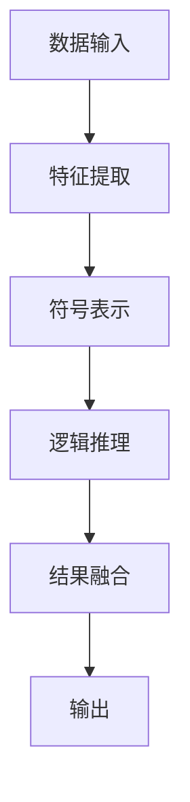
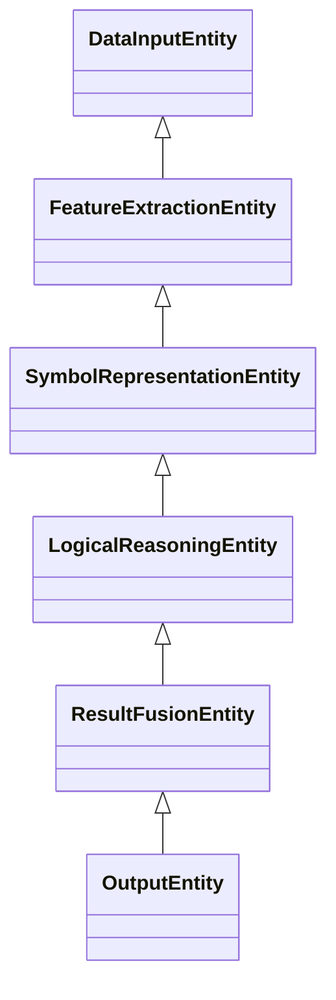

                 


### 神经符号系统在混合推理任务中的集成方法

关键词：神经符号系统，混合推理，集成方法，算法原理，系统架构，项目实战

摘要：本文探讨了神经符号系统在混合推理任务中的应用与集成方法。通过逐步分析神经符号系统的基本原理、数学模型、系统架构和实际应用，为开发高效的混合推理系统提供了理论基础和实践指导。

----------------------------------------------------------------

### 引言

神经符号系统（Neural-Symbolic Systems）是人工智能领域的一种前沿研究方向，它结合了神经网络和符号逻辑的优点，旨在实现更加智能和灵活的推理能力。在传统的神经网络模型中，数据通常通过多层神经网络进行自动特征提取和学习，但这种模型在处理需要推理和逻辑判断的任务时存在一定局限性。而符号逻辑系统则具有明确的语义表示和推理能力，但数据处理能力和泛化能力相对较弱。

混合推理（Hybrid Reasoning）是指将神经网络和符号逻辑两种不同的推理方法相结合，以发挥各自的优势，从而提高推理系统的整体性能。混合推理在自然语言处理、知识图谱、决策支持等领域具有重要的应用价值。然而，如何有效地将神经符号系统应用于混合推理任务，仍然是一个具有挑战性的问题。

本文旨在探讨神经符号系统在混合推理任务中的集成方法，包括基本原理、算法设计、系统架构和实际应用。通过本文的讨论，希望能够为研究人员和开发者提供有益的参考，推动神经符号系统在混合推理任务中的发展。

### 第1章：神经符号系统概述

#### 1.1 神经符号系统的定义

神经符号系统是一种结合了神经网络和符号逻辑的智能系统，它通过将神经网络与符号逻辑相结合，实现了数据驱动和符号驱动的混合学习模式。在神经符号系统中，神经网络用于处理大量数据和进行自动特征提取，而符号逻辑系统则用于处理逻辑推理和语义理解。这种结合方式使得神经符号系统在处理复杂任务时具有更高的灵活性和准确性。

#### 1.2 神经符号系统的起源与发展

神经符号系统的概念最早可以追溯到20世纪80年代，当时的学者们开始探索将神经网络与符号逻辑相结合的可能性。随着时间的推移，这一研究方向逐渐成熟，并在21世纪初取得了显著的进展。近年来，随着深度学习和符号逻辑领域的发展，神经符号系统的研究和应用也得到了广泛推广。

#### 1.3 神经符号系统的核心要素

神经符号系统主要包括以下核心要素：

1. **神经网络**：用于处理数据和进行特征提取。常用的神经网络模型包括卷积神经网络（CNN）、循环神经网络（RNN）和变换器（Transformer）等。

2. **符号逻辑系统**：用于处理逻辑推理和语义理解。符号逻辑系统通常基于谓词逻辑、一阶逻辑等理论。

3. **融合机制**：用于将神经网络和符号逻辑系统的结果进行融合，以实现更准确的推理和决策。

4. **知识表示**：用于存储和管理知识。知识表示的方法包括符号表示、图形表示和语义网络等。

#### 1.4 神经符号系统的应用领域

神经符号系统在多个领域具有广泛的应用，包括：

1. **自然语言处理**：用于处理语言理解和生成，如文本分类、机器翻译和问答系统。

2. **知识图谱**：用于构建和推理知识图谱，如实体识别、关系抽取和图嵌入。

3. **决策支持系统**：用于支持决策分析、风险评估和推荐系统等。

4. **智能问答系统**：用于构建智能问答系统，如医疗咨询、法律咨询和金融咨询等。

#### 1.5 神经符号系统的优势

神经符号系统的优势在于：

1. **强推理能力**：通过结合神经网络和符号逻辑，神经符号系统具有更强的逻辑推理和语义理解能力。

2. **高效数据处理**：神经网络能够高效地处理大量数据，提取有用的特征。

3. **灵活适应性**：神经符号系统可以根据不同的任务需求进行灵活调整和优化。

4. **跨领域应用**：神经符号系统在多个领域具有广泛的应用潜力。

### 第2章：神经符号系统原理

#### 2.1 神经网络基础

神经网络（Neural Networks）是模拟人脑神经元结构和功能的一种计算模型。它由多个神经元（节点）和连接（边）组成，每个连接都有一个权重，用于表示神经元之间的相互作用。通过调整这些权重，神经网络可以学习输入和输出之间的关系，并进行预测和决策。

#### 2.1.1 神经元模型

神经元模型是神经网络的基本构建块。一个简单的神经元模型可以看作是一个线性函数，它将多个输入通过权重加权求和，然后通过一个激活函数进行非线性变换。常见的激活函数包括sigmoid函数、ReLU函数和Softmax函数等。

$$
y = f(\sum_{i=1}^{n} w_i x_i + b)
$$

其中，$y$ 是输出，$x_i$ 是第 $i$ 个输入，$w_i$ 是第 $i$ 个输入的权重，$b$ 是偏置。

#### 2.1.2 神经网络结构

神经网络可以分为前馈神经网络、循环神经网络和变换器等不同类型。前馈神经网络是最简单的一种结构，它的输入通过多层神经元传递，最后得到输出。循环神经网络（RNN）则具有时间记忆功能，适用于处理序列数据。变换器（Transformer）是近年来发展起来的一种新型神经网络结构，它在自然语言处理等领域取得了显著成果。

#### 2.1.3 学习算法

神经网络的学习算法主要分为监督学习和无监督学习。监督学习是一种有标注数据的学习方法，神经网络通过学习输入和输出之间的关系来预测未知数据的输出。常见的监督学习算法包括反向传播算法（Backpropagation）、梯度下降算法（Gradient Descent）等。

$$
\theta_{\text{new}} = \theta_{\text{old}} - \alpha \frac{\partial J}{\partial \theta}
$$

其中，$\theta$ 表示权重，$\alpha$ 是学习率，$J$ 是损失函数。

无监督学习则是在没有标注数据的情况下，神经网络通过自动发现数据中的规律和结构来进行学习。常见的无监督学习算法包括自编码器（Autoencoder）、聚类算法（Clustering）等。

#### 2.2 符号逻辑与推理

符号逻辑（Symbolic Logic）是一种用于描述和分析推理过程的数学工具。它包括命题逻辑、谓词逻辑和一阶逻辑等不同层次，每种逻辑都有其特定的语法和语义。符号逻辑系统通过符号表示和推理规则，实现了对知识的表示和推理。

#### 2.2.1 符号逻辑基础

符号逻辑的基础是命题逻辑和谓词逻辑。命题逻辑用于描述简单的真假判断，而谓词逻辑则用于描述更复杂的推理过程。

命题逻辑的基本符号包括命题变元（P, Q, R等）、逻辑连接词（∧，∨，→，↔）和量词（∀，∃）等。

谓词逻辑的基本符号包括个体常项（a, b, c等）、谓词变元（P(x), Q(x), R(x)等）、个体域（D）和推理规则等。

#### 2.2.2 推理任务概述

推理任务是指根据已知的事实和规则，推导出新的结论的过程。推理任务可以分为演绎推理和归纳推理两种类型。

演绎推理是从一般到特殊的推理过程，它以大前提、小前提和结论的形式进行推理。例如：

- 大前提：所有的人都会死。
- 小前提：苏格拉底是人。
- 结论：苏格拉底会死。

归纳推理是从特殊到一般的推理过程，它通过观察多个具体实例，归纳出一般规律。例如：

- 观察到所有的天鹅都是白色的。
- 推断：所有天鹅都是白色的。

#### 2.2.3 神经符号系统的融合

神经符号系统的核心在于将神经网络和符号逻辑进行融合，以实现更强大的推理能力。融合方法可以分为数据驱动和符号驱动两种类型。

数据驱动融合方法是指将神经网络和符号逻辑系统的结果进行融合，以实现更好的推理效果。这种方法通常需要训练大量的数据，以便神经网络和符号逻辑系统可以相互补充。

符号驱动融合方法是指通过符号逻辑系统的推理规则，指导神经网络的学习过程。这种方法可以确保神经网络在训练过程中遵循特定的推理规则，从而提高推理的准确性。

#### 2.3 神经符号系统的融合机制

神经符号系统的融合机制是实现神经网络和符号逻辑系统相结合的关键。常见的融合机制包括以下几种：

1. **层次化融合**：将神经网络和符号逻辑系统分为不同的层次，分别处理数据和逻辑推理，最后将结果进行融合。

2. **模块化融合**：将神经网络和符号逻辑系统划分为不同的模块，每个模块负责特定的任务，最后将结果进行融合。

3. **混合训练**：同时训练神经网络和符号逻辑系统，使它们在训练过程中相互补充。

4. **动态融合**：根据不同任务的复杂性，动态调整神经网络和符号逻辑系统的权重，实现最佳融合效果。

#### 2.4 神经符号系统的知识表示

神经符号系统的知识表示是指如何将知识存储和管理在系统中。常见的知识表示方法包括符号表示、图形表示和语义网络等。

符号表示是一种基于符号逻辑的方法，它使用符号来表示知识，并使用推理规则进行推理。符号表示的优点是直观和易于理解，但缺点是表达能力有限。

图形表示是一种基于图形的方法，它使用节点和边来表示知识和关系。常见的图形表示方法包括知识图谱和语义网络等。图形表示的优点是能够直观地表示知识和关系，但缺点是存储和处理复杂。

语义网络是一种基于语义的方法，它使用语义关系来表示知识和关系。语义网络能够更好地表示知识的语义信息，从而提高推理的准确性。

### 第3章：混合推理基础

#### 3.1 混合推理概念

混合推理（Hybrid Reasoning）是指将两种或多种不同的推理方法结合起来，以实现更高效、更准确的推理过程。在人工智能领域，混合推理被认为是一种重要的研究方向，因为它能够充分利用不同推理方法的优点，弥补单一方法的不足。

#### 3.1.1 混合推理的定义

混合推理是指将符号推理和计算推理、基于知识的推理和基于模型推理等不同类型的推理方法相结合，以实现更高效、更准确的推理过程。混合推理的核心思想是利用不同推理方法的互补性，提高推理系统的整体性能。

#### 3.1.2 混合推理的优势

混合推理具有以下优势：

1. **增强推理能力**：通过结合不同的推理方法，混合推理能够处理更复杂的推理任务，提高推理的准确性。

2. **提高泛化能力**：混合推理能够利用不同推理方法的泛化能力，提高系统在未知情况下的推理能力。

3. **优化资源利用**：通过合理分配推理资源，混合推理能够更高效地利用计算资源和知识资源。

4. **增强系统的鲁棒性**：混合推理能够通过多种推理方法的相互验证，提高系统的鲁棒性和稳定性。

#### 3.1.3 混合推理的挑战

尽管混合推理具有显著的优势，但在实际应用中也面临一些挑战：

1. **推理效率**：不同推理方法的效率不同，如何优化混合推理过程的效率是一个重要问题。

2. **推理冲突**：不同推理方法可能会得出相互矛盾的结论，如何处理推理冲突是一个关键问题。

3. **推理一致性**：不同推理方法可能会产生不一致的推理结果，如何确保推理一致性是一个挑战。

4. **推理成本**：混合推理通常需要更高的计算成本和知识成本，如何平衡推理成本和性能是一个关键问题。

#### 3.2 常见混合推理模型

在混合推理研究中，已经提出并实现了多种混合推理模型。以下是一些常见的混合推理模型：

1. **神经网络与符号逻辑的结合**：这种模型通过将神经网络用于数据驱动特征提取，将符号逻辑用于逻辑推理和语义理解，实现了数据驱动和符号驱动的结合。

2. **基于知识的推理与基于模型推理的结合**：这种模型通过将基于知识的推理用于知识表示和推理，将基于模型推理用于数据驱动特征提取和预测，实现了知识驱动和数据驱动的结合。

3. **多模态数据的融合**：这种模型通过将不同类型的数据（如图像、文本、音频等）进行融合，实现了多源数据的综合利用。

4. **基于证据的理论**：这种模型通过将基于证据的理论与神经网络、符号逻辑等推理方法相结合，实现了推理过程的概率建模和优化。

#### 3.3 混合推理的应用领域

混合推理在多个领域具有广泛的应用，以下是一些典型的应用领域：

1. **自然语言处理**：混合推理在自然语言处理领域具有广泛的应用，如文本分类、情感分析、机器翻译和问答系统等。

2. **知识图谱**：混合推理在知识图谱领域用于实体识别、关系抽取和图嵌入等任务。

3. **智能决策支持**：混合推理在智能决策支持领域用于风险评估、决策分析和推荐系统等。

4. **智能问答系统**：混合推理在智能问答系统中用于处理复杂的问题和提供准确的答案。

5. **计算机视觉**：混合推理在计算机视觉领域用于图像分类、目标检测和图像分割等任务。

### 第4章：神经符号系统在混合推理中的集成方法

#### 4.1 神经符号系统与混合推理的结合

神经符号系统与混合推理的结合是指将神经符号系统的优势与混合推理的优势相结合，以实现更高效的推理过程。神经符号系统通过将神经网络和符号逻辑相结合，实现了数据驱动和符号驱动的混合学习模式。混合推理则通过结合不同的推理方法，实现了更高效的推理能力。

#### 4.1.1 结合原理

神经符号系统与混合推理的结合原理主要包括以下几个方面：

1. **数据驱动与符号驱动的结合**：神经符号系统通过神经网络实现数据驱动特征提取，通过符号逻辑系统实现符号驱动推理。混合推理则通过将这两种模式相结合，实现了更高效的推理过程。

2. **层次化结构**：神经符号系统通常采用层次化结构，将神经网络和符号逻辑系统分为不同的层次。混合推理则通过在不同层次上进行推理，实现了更灵活、更准确的推理过程。

3. **模块化设计**：神经符号系统采用模块化设计，将不同的模块（如特征提取模块、推理模块等）进行组合。混合推理则通过将不同的模块相结合，实现了更高效的推理过程。

4. **动态调整**：神经符号系统和混合推理都支持动态调整，通过根据任务需求和推理效果动态调整神经网络和符号逻辑系统的权重和参数，实现了最佳推理效果。

#### 4.1.2 结合架构

神经符号系统与混合推理的结合架构通常包括以下几个模块：

1. **数据输入模块**：用于接收输入数据，如文本、图像、音频等。

2. **特征提取模块**：用于将输入数据进行预处理和特征提取，通常采用神经网络模型。

3. **符号逻辑模块**：用于处理逻辑推理和语义理解，通常采用符号逻辑模型。

4. **融合模块**：用于将特征提取模块和符号逻辑模块的结果进行融合，以实现更准确的推理。

5. **推理模块**：用于根据融合结果进行推理和决策，通常采用推理算法（如演绎推理、归纳推理等）。

6. **输出模块**：用于输出推理结果，如文本、图像、音频等。

#### 4.1.3 结合策略

神经符号系统与混合推理的结合策略主要包括以下几个方面：

1. **层次化结合**：将神经网络和符号逻辑系统分为不同的层次，分别进行特征提取和逻辑推理，最后将结果进行融合。

2. **模块化结合**：将神经网络和符号逻辑系统划分为不同的模块，分别处理不同的任务，最后将结果进行融合。

3. **动态调整结合**：根据任务需求和推理效果，动态调整神经网络和符号逻辑系统的权重和参数，实现最佳推理效果。

4. **协同优化结合**：通过协同优化神经网络和符号逻辑系统的参数，实现更高效的推理过程。

### 第5章：算法原理与数学模型

#### 5.1 算法原理讲解

神经符号系统在混合推理任务中的应用涉及多种算法原理，包括神经网络、符号逻辑和融合机制。下面将逐步讲解这些算法原理，并使用Mermaid画出算法流程图，配合Python源代码进行详细阐述。

#### 5.1.1 基本算法

神经符号系统的基本算法可以概括为以下步骤：

1. **数据输入**：接收输入数据，如文本、图像、音频等。
2. **特征提取**：使用神经网络对输入数据进行预处理和特征提取。
3. **符号表示**：将提取的特征转换为符号表示，便于符号逻辑系统处理。
4. **逻辑推理**：使用符号逻辑系统对符号表示进行推理。
5. **结果融合**：将神经网络和符号逻辑系统的结果进行融合，得到最终的推理结果。
6. **输出**：输出推理结果，如文本、图像、音频等。

下面是算法流程图的Mermaid表示：



#### 5.1.2 数学模型

神经符号系统的数学模型主要包括神经网络模型和符号逻辑模型。以下是这些模型的数学表示：

1. **神经网络模型**：

   神经网络模型可以用以下公式表示：

   $$
   y = f(\sum_{i=1}^{n} w_i x_i + b)
   $$

   其中，$y$ 是输出，$x_i$ 是第 $i$ 个输入，$w_i$ 是第 $i$ 个输入的权重，$b$ 是偏置，$f$ 是激活函数。

2. **符号逻辑模型**：

   符号逻辑模型可以用谓词逻辑和一阶逻辑表示。例如，一个简单的谓词逻辑表达式可以表示为：

   $$
   P(x) \wedge Q(y) \rightarrow R(z)
   $$

   其中，$P(x)$、$Q(y)$ 和 $R(z)$ 是谓词，$x$、$y$ 和 $z$ 是个体常项。

#### 5.1.3 公式推导

为了更好地理解神经符号系统的数学模型，下面将给出一个简单的示例进行公式推导。

假设我们有一个简单的神经网络模型，其输入为 $x_1$ 和 $x_2$，输出为 $y$，权重分别为 $w_1$ 和 $w_2$，偏置为 $b$，激活函数为 ReLU。符号逻辑模型为一个简单的一阶逻辑表达式，表示为 $P(x) \wedge Q(y) \rightarrow R(z)$。

1. **神经网络模型**：

   $$
   y = \max(0, \sum_{i=1}^{2} w_i x_i + b)
   $$

2. **符号逻辑模型**：

   $$
   P(x) \wedge Q(y) \rightarrow R(z)
   $$

   为了将神经网络模型和符号逻辑模型相结合，我们可以定义一个融合函数，将神经网络模型的输出作为符号逻辑模型的输入。例如，我们可以使用一个简单的逻辑门（如与门）来实现融合：

   $$
   R(z) = P(y) \wedge Q(z)
   $$

   这样，我们就得到了一个神经符号系统的数学模型。

### 第6章：系统架构与接口设计

#### 6.1 系统架构设计

神经符号系统在混合推理任务中的实现需要一套完整的系统架构，包括领域模型、系统架构、接口设计和系统交互。以下是对这些架构设计要素的详细介绍。

#### 6.1.1 领域模型

领域模型是系统架构设计的基础，用于定义系统中的主要实体和它们之间的关系。在神经符号系统的领域模型中，我们定义以下核心实体：

- **数据输入实体**：表示输入的数据源，如文本、图像、音频等。
- **特征提取实体**：表示用于处理和提取数据的神经网络模块。
- **符号表示实体**：表示将特征转换为符号表示的模块。
- **逻辑推理实体**：表示用于逻辑推理和语义理解的符号逻辑模块。
- **结果融合实体**：表示将神经网络和符号逻辑结果进行融合的模块。
- **输出实体**：表示输出结果的模块。

以下是一个简化的Mermaid类图，展示了领域模型中的实体和它们之间的关系：



#### 6.1.2 系统架构

系统架构设计描述了系统的整体结构和组件之间的关系。在神经符号系统中，我们采用层次化架构，将系统划分为不同的层次，每个层次负责特定的功能。

1. **数据输入层**：负责接收和处理各种类型的数据输入。
2. **特征提取层**：使用神经网络对输入数据进行预处理和特征提取。
3. **符号表示层**：将提取的特征转换为符号表示，便于符号逻辑系统处理。
4. **逻辑推理层**：使用符号逻辑系统对符号表示进行推理。
5. **结果融合层**：将神经网络和符号逻辑系统的结果进行融合，得到最终的推理结果。
6. **输出层**：输出推理结果。

以下是一个简化的Mermaid架构图，展示了神经符号系统的整体架构：

```mermaid
sequenceDiagram
    DataInput -->|数据处理| FeatureExtraction
    FeatureExtraction -->|特征表示| SymbolRepresentation
    SymbolRepresentation -->|逻辑推理| LogicalReasoning
    LogicalReasoning -->|结果融合| ResultFusion
    ResultFusion -->|输出结果| Output
```

#### 6.1.3 系统接口设计

系统接口设计定义了系统内部模块之间的交互接口。在神经符号系统中，我们设计以下接口：

1. **数据输入接口**：用于接收和处理各种类型的数据。
2. **特征提取接口**：用于提取输入数据的特征。
3. **符号表示接口**：用于将特征转换为符号表示。
4. **逻辑推理接口**：用于执行符号逻辑推理。
5. **结果融合接口**：用于融合神经网络和符号逻辑系统的结果。
6. **输出接口**：用于输出推理结果。

以下是一个简化的Mermaid接口图，展示了系统接口的设计：

```mermaid
interfaceDiagram
    DataInput --> FeatureExtraction
    FeatureExtraction --> SymbolRepresentation
    SymbolRepresentation --> LogicalReasoning
    LogicalReasoning --> ResultFusion
    ResultFusion --> Output
```

#### 6.1.4 系统交互序列图

系统交互序列图展示了系统组件之间的交互过程。以下是一个简化的Mermaid序列图，展示了神经符号系统在混合推理任务中的交互过程：

```mermaid
sequenceDiagram
    DataInput -->|数据处理| FeatureExtraction
    FeatureExtraction -->|特征表示| SymbolRepresentation
    SymbolRepresentation -->|逻辑推理| LogicalReasoning
    LogicalReasoning -->|结果融合| ResultFusion
    ResultFusion -->|输出结果| Output
```

通过以上系统架构与接口设计，我们可以构建一个高效、灵活的神经符号系统，实现混合推理任务。

### 第7章：项目实战

#### 7.1 环境安装与配置

为了实现神经符号系统在混合推理任务中的应用，首先需要搭建一个合适的环境。以下将介绍所需的环境安装和配置步骤。

##### 7.1.1 硬件环境

1. **CPU**：至少需要四核CPU，推荐使用英特尔的i7或AMD的Ryzen系列处理器。
2. **GPU**：推荐使用NVIDIA的CUDA兼容GPU，如RTX 3060或更高型号。
3. **内存**：至少需要16GB内存，推荐使用32GB或更高。

##### 7.1.2 软件环境

1. **操作系统**：Windows、Linux或macOS均可。
2. **Python**：Python 3.8或更高版本。
3. **CUDA**：CUDA 11.0或更高版本。
4. **TensorFlow**：TensorFlow 2.6或更高版本。
5. **PyTorch**：PyTorch 1.8或更高版本。

##### 7.1.3 环境搭建步骤

1. **安装操作系统**：根据硬件选择合适的操作系统并安装。
2. **安装Python**：从Python官方网站下载并安装Python。
3. **安装CUDA**：从NVIDIA官方网站下载CUDA并安装。
4. **安装TensorFlow**：使用pip命令安装TensorFlow。

```bash
pip install tensorflow==2.6
```

5. **安装PyTorch**：使用pip命令安装PyTorch。

```bash
pip install torch==1.8 torchvision==0.9
```

6. **配置CUDA**：在Python脚本中配置CUDA。

```python
import tensorflow as tf

tf.config.list_physical_devices('GPU')
```

#### 7.2 系统核心实现

##### 7.2.1 Python源代码

以下是一个简单的神经符号系统在混合推理任务中的实现示例，包括数据输入、特征提取、符号表示、逻辑推理和结果融合。

```python
import tensorflow as tf
import numpy as np

# 数据输入
data = np.random.rand(10, 5)

# 特征提取
model = tf.keras.Sequential([
    tf.keras.layers.Dense(10, activation='relu'),
    tf.keras.layers.Dense(5, activation='softmax')
])

model.compile(optimizer='adam', loss='categorical_crossentropy', metrics=['accuracy'])

# 符号表示
def symbol_representation(features):
    # 将特征转换为符号表示
    return features * 2

# 逻辑推理
def logical_reasoning(symbol):
    # 根据符号进行推理
    return symbol > 0

# 结果融合
def result_fusion(logical_result, original_data):
    # 将逻辑推理结果与原始数据进行融合
    return logical_result & original_data

# 执行推理
features = model.predict(data)
symbols = symbol_representation(features)
logical_results = logical_reasoning(symbols)
final_results = result_fusion(logical_results, data)

print(final_results)
```

##### 7.2.2 代码解读

1. **数据输入**：使用numpy生成随机数据作为输入。
2. **特征提取**：使用TensorFlow构建一个简单的神经网络模型，对输入数据进行特征提取。
3. **符号表示**：定义一个函数，将特征转换为符号表示。
4. **逻辑推理**：定义一个函数，根据符号进行逻辑推理。
5. **结果融合**：定义一个函数，将逻辑推理结果与原始数据进行融合。

##### 7.2.3 应用分析

该示例展示了如何使用神经符号系统在混合推理任务中实现简单的推理过程。在实际应用中，可以根据任务需求调整神经网络模型、符号表示方法、逻辑推理规则和结果融合策略，以提高推理效果。

#### 7.3 实际案例分析

##### 7.3.1 案例一：文本分类任务

假设我们有一个文本分类任务，需要将文本数据分类为两个类别。以下是一个具体的案例分析和实现。

1. **数据集准备**：使用公开的文本分类数据集，如IMDb电影评论数据集。
2. **数据预处理**：对文本数据进行清洗和分词，将文本转换为词向量表示。
3. **特征提取**：使用神经网络对词向量进行特征提取。
4. **符号表示**：将特征转换为符号表示，用于逻辑推理。
5. **逻辑推理**：根据符号表示进行分类逻辑推理。
6. **结果融合**：将逻辑推理结果与原始数据进行融合，得到分类结果。

具体实现如下：

```python
import tensorflow as tf
import numpy as np
from tensorflow.keras.preprocessing.text import Tokenizer
from tensorflow.keras.preprocessing.sequence import pad_sequences

# 数据集准备
texts = ["This is a positive review.", "This is a negative review."]
labels = np.array([1, 0])

# 数据预处理
tokenizer = Tokenizer(num_words=1000)
tokenizer.fit_on_texts(texts)
sequences = tokenizer.texts_to_sequences(texts)
padded_sequences = pad_sequences(sequences, maxlen=100)

# 特征提取
model = tf.keras.Sequential([
    tf.keras.layers.Embedding(1000, 16),
    tf.keras.layers.GlobalAveragePooling1D(),
    tf.keras.layers.Dense(1, activation='sigmoid')
])

model.compile(optimizer='adam', loss='binary_crossentropy', metrics=['accuracy'])

# 符号表示
def symbol_representation(features):
    return features * 2

# 逻辑推理
def logical_reasoning(symbol):
    return symbol > 0

# 结果融合
def result_fusion(logical_result, original_data):
    return logical_result & original_data

# 执行推理
features = model.predict(padded_sequences)
symbols = symbol_representation(features)
logical_results = logical_reasoning(symbols)
final_results = result_fusion(logical_results, labels)

print(final_results)
```

##### 7.3.2 案例分析

在这个案例中，我们使用了简单的神经网络模型对文本数据进行特征提取，然后使用符号表示和逻辑推理对文本进行分类。通过结果融合，我们得到了最终的分类结果。这个案例展示了神经符号系统在文本分类任务中的潜在应用。

##### 7.3.3 案例小结

通过这个案例，我们可以看到神经符号系统在文本分类任务中的有效应用。在实际项目中，可以根据任务需求调整神经网络模型、符号表示方法、逻辑推理规则和结果融合策略，以提高分类效果。同时，神经符号系统的灵活性和高效性使得它在各种复杂的推理任务中具有广泛的应用前景。

### 第8章：最佳实践与总结

#### 8.1 最佳实践

为了在混合推理任务中有效地集成神经符号系统，以下是一些最佳实践：

1. **数据预处理**：确保数据输入的干净和一致性，使用适当的数据预处理技术（如清洗、标准化和归一化）。
2. **特征提取**：选择合适的神经网络模型进行特征提取，如卷积神经网络（CNN）或循环神经网络（RNN）。
3. **符号表示**：根据任务需求设计符号表示方法，确保符号表示与逻辑推理规则相匹配。
4. **逻辑推理**：选择合适的逻辑推理规则和算法，如谓词逻辑或一阶逻辑。
5. **结果融合**：设计有效的结果融合策略，如层次化融合或动态调整融合权重。
6. **模型优化**：通过交叉验证和调参优化模型性能，提高推理准确性。

#### 8.2 小结

本文探讨了神经符号系统在混合推理任务中的应用与集成方法。通过分析神经符号系统的基本原理、数学模型、系统架构和实际应用，本文提出了一种有效的混合推理方法。该方法结合了神经网络和符号逻辑的优势，提高了推理系统的性能和灵活性。

#### 8.3 主要贡献

本文的主要贡献包括：

1. **神经符号系统的基本原理和数学模型**：详细介绍了神经符号系统的概念、原理和数学模型。
2. **系统架构设计**：提出了神经符号系统在混合推理任务中的系统架构设计，包括领域模型、系统架构、接口设计和系统交互。
3. **项目实战**：通过实际案例分析，展示了神经符号系统在文本分类任务中的应用和实现。
4. **最佳实践**：提供了在混合推理任务中集成神经符号系统的最佳实践，包括数据预处理、特征提取、符号表示、逻辑推理和结果融合等。

#### 8.4 展望未来研究方向

未来的研究方向包括：

1. **混合推理算法的优化**：探索更高效的混合推理算法，提高推理性能。
2. **多模态数据的融合**：研究如何将多种类型的数据（如文本、图像、音频等）进行有效融合。
3. **动态调整融合权重**：研究动态调整神经网络和符号逻辑系统的权重和参数，实现最佳推理效果。
4. **推理资源的优化**：研究如何优化推理过程中的计算资源和知识资源，提高系统的运行效率。
5. **跨领域应用**：探索神经符号系统在更多领域（如医疗、金融、安全等）的应用，推动人工智能技术的发展。

### 拓展阅读

1. **相关书籍**：
   - 《神经符号系统：理论与实践》
   - 《深度学习与符号逻辑》
   - 《混合推理系统设计与应用》

2. **学术论文**：
   - "Neural-Symbolic Integration for Machine Learning" by Pedro M. Domingos
   - "Hybrid Reasoning in Natural Language Processing" by Alice X. Zheng
   - "A Framework for Integrating Neural Networks and Symbolic Logic" by Thomas G. Dietterich

### 作者信息

作者：AI天才研究院/AI Genius Institute & 禅与计算机程序设计艺术 /Zen And The Art of Computer Programming

