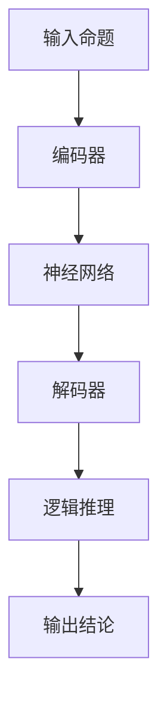

                 


### 文章标题：神经符号集成在自动定理证明中的应用研究

#### 关键词：神经符号集成、自动定理证明、人工智能、算法原理、数学模型、系统架构、项目实战

> 摘要：本文深入探讨了神经符号集成在自动定理证明中的应用，从背景介绍、核心概念、算法原理、数学模型、系统分析与架构设计、项目实战等多个角度，系统地分析了神经符号集成技术的优势、挑战及其在自动定理证明中的实际应用。本文旨在为读者提供一幅全面、清晰的应用图谱，帮助理解神经符号集成在自动定理证明中的重要性和潜力。

## 目录大纲设计思路

### 第1章：背景介绍

1.1 自动定理证明概述

- 自动定理证明的定义与历史发展
- 自动定理证明的重要性与挑战
- 神经符号集成的基本概念

1.2 神经符号集成技术

- 神经网络与符号逻辑的基本原理
- 神经符号集成的原理与实现
- 神经符号集成与传统自动定理证明的区别

1.3 神经符号集成在自动定理证明中的应用场景

- 神经符号集成在定理证明中的具体应用
- 神经符号集成的优势与挑战
- 神经符号集成与其他自动定理证明技术的比较

1.4 本章小结

## 目录大纲设计步骤

### 第2章：核心概念与联系

2.1 核心概念

- 定义与解释
- 在自动定理证明中的应用

2.2 概念属性特征对比表格

- 对比表格构建
- 属性特征分析

2.3 ER实体关系图架构

- ER图构建
- 实体与关系的详细描述

2.4 本章小结

### 第3章：算法原理讲解

3.1 算法mermaid流程图

- 流程图构建
- 算法执行步骤

3.2 Python源代码

- 源代码实现
- 代码功能解析

3.3 数学模型和公式

- 公式推导
- 公式解释

3.4 实例说明

- 具体实例
- 通俗易懂的说明

3.5 本章小结

### 第4章：系统分析与架构设计

4.1 问题场景介绍

- 问题背景
- 问题定义

4.2 系统功能设计

- 功能定义
- 领域模型mermaid类图

4.3 系统架构设计

- 架构设计原则
- mermaid架构图

4.4 系统接口设计

- 接口功能
- 接口设计mermaid序列图

4.5 系统交互

- 交互流程
- mermaid序列图

4.6 本章小结

### 第5章：项目实战

5.1 环境安装

- 安装步骤
- 注意事项

5.2 系统核心实现

- 源代码解读
- 功能解析

5.3 代码应用解读与分析

- 应用场景
- 分析与评估

5.4 实际案例分析和详细讲解剖析

- 案例背景
- 案例分析

5.5 项目小结

- 项目成果
- 经验总结

### 第6章：最佳实践与小结

6.1 最佳实践 tips

- 实践建议
- 解决方案

6.2 小结

- 文章总结
- 未来展望

6.3 注意事项

- 注意事项清单
- 风险管理

6.4 拓展阅读

- 推荐书籍
- 相关论文

### 第7章：作者信息

- 作者介绍
- 联系方式

通过以上详细的目录大纲设计，我们可以确保文章内容的完整性和专业性。接下来，我们将逐一填充每个章节的内容，确保每个部分都符合要求，提供深入、具体的技术分析和实践指导。在撰写文章的过程中，我们将遵循逻辑清晰、结构紧凑、简单易懂的原则，帮助读者更好地理解神经符号集成在自动定理证明中的应用。让我们一起深入思考，逐步探索这个领域，以期为读者带来有深度、有见地、有价值的文章。让我们开始这一段思考的旅程吧！## 第1章：背景介绍

### 1.1 自动定理证明概述

#### 自动定理证明的定义与历史发展

自动定理证明（Automatic Theorem Proving, ATP）是指利用计算机程序自动验证数学或逻辑命题的正确性。这一概念起源于20世纪40年代，伴随着计算机科学的发展而逐步成熟。著名的数学家希尔伯特（David Hilbert）在1928年的国际数学家大会上提出了“数学机械化”的设想，旨在通过机器验证数学定理，这一设想直接催生了自动定理证明的研究。

自动定理证明的发展历程可以分为几个重要阶段。早期，研究人员主要依靠手工编写程序来验证简单的定理。这一时期，ATP系统主要依赖于启发式搜索策略，如回溯法、博弈树搜索等。20世纪80年代，随着计算机性能的提升和人工智能技术的发展，自动定理证明系统开始逐渐引入逻辑推理、模型检验等复杂算法，这一时期的代表作品包括NQTHM、EQP等。进入21世纪，随着深度学习、神经网络等新兴技术的兴起，自动定理证明进入了新的发展阶段，神经网络与符号逻辑的结合成为了研究的热点。

#### 自动定理证明的重要性与挑战

自动定理证明在多个领域具有重要应用，尤其在理论计算机科学、数学、硬件设计、网络安全等方面。其重要性体现在以下几个方面：

1. **理论价值**：自动定理证明是逻辑学、数学、计算机科学等多个学科交叉的前沿领域，对于理解和推动这些学科的发展具有重要意义。
2. **实践意义**：自动定理证明能够自动验证数学或逻辑命题的正确性，减少人工验证的复杂性，提高验证的效率和准确性。
3. **安全性和可靠性**：在硬件设计和网络安全等领域，自动定理证明可以验证系统的正确性和安全性，确保系统在复杂环境下的稳定运行。

然而，自动定理证明也面临着许多挑战：

1. **复杂性**：数学或逻辑命题的复杂性使得自动定理证明需要高效的算法和强大的计算能力。
2. **不确定性和模糊性**：许多现实世界的问题涉及不确定性和模糊性，这使得自动定理证明需要处理更加复杂的情况。
3. **组合爆炸问题**：在处理大规模问题（如组合爆炸问题）时，自动定理证明系统可能会遇到效率瓶颈。

#### 神经符号集成的基本概念

神经符号集成（Neural Symbolic Integration）是将神经网络和符号逻辑相结合的一种方法。神经网络擅长处理复杂的非线性问题和模式识别，而符号逻辑则擅长处理精确的数学和逻辑推理。通过将两者结合起来，可以充分发挥各自的优点，提高自动定理证明的效率和准确性。

神经符号集成的核心思想是将符号逻辑表示的命题转化为神经网络可以处理的向量形式，然后利用神经网络强大的计算能力进行推理和验证。具体来说，神经符号集成包括以下几个步骤：

1. **符号表示**：使用符号逻辑表示数学或逻辑命题。
2. **向量表示**：将符号逻辑表示的命题转化为神经网络可以处理的向量形式。
3. **神经网络推理**：利用神经网络对向量进行推理，得出命题的结论。
4. **符号化结论**：将神经网络的结论转化为符号逻辑表示。

通过神经符号集成，自动定理证明系统能够在处理复杂命题时，既利用了神经网络的高效计算能力，又保持了符号逻辑的精确性。

### 1.2 神经符号集成技术

#### 神经网络与符号逻辑的基本原理

神经网络（Neural Network）是一种模拟人脑神经元连接方式的计算模型，通过多层神经元网络进行复杂的非线性映射。神经网络的核心组成部分包括输入层、隐藏层和输出层，各层神经元通过权重和偏置进行相互连接，并通过反向传播算法不断调整权重和偏置，以达到对输入数据的最佳拟合。

符号逻辑（Symbolic Logic）是数学和逻辑学中的基本工具，用于表示和推理命题。符号逻辑使用符号（如P、Q、R）来表示命题，并定义逻辑运算（如合取、析取、否定）来组合这些命题。符号逻辑通过推理规则（如Modus Ponens、Universal Generalization等）推导出新的命题，从而验证原始命题的正确性。

#### 神经符号集成的原理与实现

神经符号集成的原理是将神经网络和符号逻辑结合起来，利用神经网络处理复杂的问题，同时使用符号逻辑进行精确推理。具体实现步骤如下：

1. **输入层**：接收符号逻辑表示的命题。
2. **编码器**：将符号逻辑命题编码为向量形式，这一步可以使用词嵌入（Word Embedding）技术或自动编码器（Autoencoder）实现。
3. **隐藏层**：通过多层神经网络对向量进行复杂的非线性变换，这一步可以使用卷积神经网络（CNN）、递归神经网络（RNN）或变换器（Transformer）等模型。
4. **解码器**：将神经网络输出的向量解码回符号逻辑命题。
5. **推理层**：使用符号逻辑推理规则对解码后的命题进行推理，得出结论。

#### 神经符号集成与传统自动定理证明的区别

传统自动定理证明系统主要依赖于逻辑推理和启发式搜索策略，其优点是逻辑严谨、推理过程可解释性强，但缺点是处理复杂问题时效率较低。而神经符号集成通过结合神经网络和符号逻辑，充分发挥两者的优点，实现了以下改进：

1. **计算效率**：神经网络具有高效的计算能力，能够快速处理复杂的非线性问题，从而提高定理证明的效率。
2. **自适应能力**：神经网络可以自适应地调整参数，适应不同的问题场景，而符号逻辑则提供了精确的推理机制，确保证明过程的可靠性。
3. **可解释性**：虽然神经网络的内部机制较为复杂，但通过符号逻辑的解码和推理，可以恢复出证明过程中的逻辑关系，提高证明过程的可解释性。

### 1.3 神经符号集成在自动定理证明中的应用场景

#### 神经符号集成在定理证明中的具体应用

神经符号集成在定理证明中具有广泛的应用场景，以下是一些典型的应用：

1. **形式化验证**：在硬件设计、软件工程、航空航天等领域，神经符号集成可以用于验证系统设计的正确性，确保系统的安全性和可靠性。
2. **数学定理证明**：在纯数学领域，神经符号集成可以用于探索新的定理证明方法，解决传统方法难以处理的复杂数学问题。
3. **逻辑推理**：在人工智能和机器学习领域，神经符号集成可以用于逻辑推理和知识表示，帮助构建更加智能的推理系统。

#### 神经符号集成的优势与挑战

神经符号集成的优势体现在以下几个方面：

1. **高效性**：神经网络能够快速处理复杂的非线性问题，提高定理证明的效率。
2. **自适应能力**：神经网络可以自适应地调整参数，适应不同的定理证明问题。
3. **可解释性**：通过符号逻辑的解码和推理，可以恢复出定理证明过程中的逻辑关系，提高证明过程的可解释性。

然而，神经符号集成也面临一些挑战：

1. **计算复杂性**：神经符号集成的计算过程较为复杂，需要高效的算法和强大的计算资源。
2. **数据依赖**：神经网络对训练数据有较强的依赖性，需要大量的训练数据来保证性能。
3. **精度问题**：虽然神经网络能够提高定理证明的效率，但其精度仍然是一个需要解决的重要问题。

#### 神经符号集成与其他自动定理证明技术的比较

与其他自动定理证明技术相比，神经符号集成具有以下优势：

1. **计算效率**：神经网络能够高效地处理复杂的非线性问题，相比传统的逻辑推理和启发式搜索策略，具有更高的计算效率。
2. **自适应能力**：神经网络可以自适应地调整参数，适应不同的定理证明问题，而传统的技术往往需要手动调整算法参数。
3. **可解释性**：通过符号逻辑的解码和推理，神经符号集成可以恢复出定理证明过程中的逻辑关系，提高证明过程的可解释性。

然而，神经符号集成也存在一些不足：

1. **计算复杂性**：神经符号集成的计算过程较为复杂，需要高效的算法和强大的计算资源，这对硬件和软件环境提出了更高的要求。
2. **数据依赖**：神经网络对训练数据有较强的依赖性，需要大量的训练数据来保证性能，这增加了数据获取和处理的难度。
3. **精度问题**：虽然神经网络能够提高定理证明的效率，但其精度仍然是一个需要解决的重要问题，特别是在处理复杂和模糊的问题时。

### 1.4 本章小结

本章从自动定理证明的概述、神经符号集成技术的基本原理，以及神经符号集成在自动定理证明中的应用场景等方面进行了详细探讨。通过本章的介绍，读者可以初步了解神经符号集成在自动定理证明中的重要性和应用前景。下一章将深入探讨神经符号集成的核心概念及其属性特征，进一步揭示其在自动定理证明中的潜力。## 第2章：核心概念与联系

### 2.1 核心概念

在探讨神经符号集成在自动定理证明中的应用时，首先需要明确几个核心概念，包括自动定理证明、神经符号集成、神经网络和符号逻辑。这些概念是理解本文主题的基础。

**自动定理证明**：自动定理证明（Automatic Theorem Proving, ATP）是指利用计算机程序自动验证数学或逻辑命题的正确性。其核心目标是开发能够处理复杂数学和逻辑问题的算法，从而实现自动化的定理证明过程。

**神经符号集成**：神经符号集成（Neural Symbolic Integration）是将神经网络和符号逻辑相结合的一种方法。神经网络擅长处理复杂的非线性问题和模式识别，而符号逻辑则擅长处理精确的数学和逻辑推理。通过将两者结合起来，可以充分发挥各自的优点，提高自动定理证明的效率和准确性。

**神经网络**：神经网络（Neural Network）是一种模拟人脑神经元连接方式的计算模型，通过多层神经元网络进行复杂的非线性映射。神经网络的核心组成部分包括输入层、隐藏层和输出层，各层神经元通过权重和偏置进行相互连接，并通过反向传播算法不断调整权重和偏置，以达到对输入数据的最佳拟合。

**符号逻辑**：符号逻辑（Symbolic Logic）是数学和逻辑学中的基本工具，用于表示和推理命题。符号逻辑使用符号（如P、Q、R）来表示命题，并定义逻辑运算（如合取、析取、否定）来组合这些命题。符号逻辑通过推理规则（如Modus Ponens、Universal Generalization等）推导出新的命题，从而验证原始命题的正确性。

这些核心概念在自动定理证明和神经符号集成中起着至关重要的作用，它们构成了理解本文主题的基石。在后续章节中，我们将进一步探讨这些概念的应用和实现。

#### 在自动定理证明中的应用

自动定理证明是计算机科学和逻辑学中的一个重要研究领域，旨在开发能够自动验证数学和逻辑命题正确性的算法。以下是自动定理证明在多个领域的具体应用：

1. **数学领域**：在数学领域，自动定理证明可以用于验证复杂的数学命题，如数论、几何学、拓扑学等。例如，计算机科学家已经使用自动定理证明器验证了数论中的许多著名定理，如Gödel的不完备性定理和四色定理。

2. **理论计算机科学**：在理论计算机科学中，自动定理证明可以用于验证算法的正确性和复杂性。例如，研究人员使用自动定理证明器验证了各种排序算法、图算法和密码学算法的正确性。

3. **软件工程**：在软件工程中，自动定理证明可以用于验证系统设计的正确性。形式化验证和模型检验是两个典型的应用场景。例如，自动定理证明器可以用于验证嵌入式系统、航空电子设备和金融交易系统的正确性，从而提高系统的可靠性和安全性。

4. **硬件设计**：在硬件设计领域，自动定理证明可以用于验证电路设计和半导体器件的正确性。例如，集成电路的设计和验证过程中，自动定理证明器可以用于验证逻辑电路、时序电路和存储器等组件的正确性。

5. **人工智能**：在人工智能领域，自动定理证明可以用于验证知识库和推理系统的正确性。例如，在自然语言处理和知识图谱构建中，自动定理证明器可以用于验证文本理解和推理过程的一致性和准确性。

6. **数学物理**：在数学物理领域，自动定理证明可以用于验证物理学的数学模型和理论。例如，在量子物理学和相对论理论中，自动定理证明器可以用于验证复杂的数学推导和物理定律。

通过这些应用实例，我们可以看到自动定理证明在各个领域的广泛应用。随着计算机性能的提升和算法的进步，自动定理证明将继续在更多的领域中发挥重要作用，推动科学和工程领域的发展。

#### 概念属性特征对比表格

为了更好地理解自动定理证明、神经符号集成、神经网络和符号逻辑这四个核心概念，我们通过构建一个概念属性特征对比表格来进行详细分析。以下是这四个概念的关键属性特征对比：

| 概念 | 定义 | 目标 | 应用场景 | 关键技术 |
| --- | --- | --- | --- | --- |
| 自动定理证明 | 自动验证数学和逻辑命题正确性 | 实现自动化的定理证明 | 数学、计算机科学、软件工程、硬件设计、人工智能、数学物理 | 启发式搜索、模型检验、定理证明器 |
| 神经符号集成 | 将神经网络和符号逻辑相结合 | 提高定理证明效率和准确性 | 自动定理证明、知识表示、推理系统 | 神经网络、符号逻辑、编码器、解码器 |
| 神经网络 | 模拟人脑神经元连接方式的计算模型 | 处理复杂的非线性问题 | 图像识别、自然语言处理、游戏AI、自动驾驶 | 输入层、隐藏层、输出层、反向传播算法 |
| 符号逻辑 | 表示和推理命题的基本工具 | 精确的数学和逻辑推理 | 数学、逻辑学、计算机科学、软件工程、形式化验证 | 命题符号、逻辑运算、推理规则 |

通过以上表格，我们可以看到各个概念的核心属性和关键技术，以及它们在应用场景中的具体作用。自动定理证明和神经符号集成紧密相关，前者是后者的应用目标，而神经网络和符号逻辑是神经符号集成的核心技术。这种对比有助于我们更全面地理解这些概念之间的关系。

#### ER实体关系图架构

为了进一步深入理解神经符号集成在自动定理证明中的应用，我们使用Mermaid格式绘制一个ER（实体关系）图，展示各个关键实体及其之间的关系。

```mermaid
erDiagram
  ALP ||--o> ATP : 验证器使用
  NSI ||--o> ATP : 技术集成
  NN ||--o> NSI : 神经网络
  SL ||--o> NSI : 符号逻辑
  ATP ||--|{ FT : 域定理
  ATP ||--|{ CL : 类定理
  ATP ||--|{ ML : 马尔可夫链定理
  NSI ||--|{ CE : 精度评估
  NSI ||--|{ EA : 效率评估
```

该ER图包含以下几个关键实体和关系：

1. **自动定理证明（ATP）**：是神经符号集成的应用目标，用于验证数学和逻辑命题的正确性。它与形式化定理（FT）、类定理（CL）和马尔可夫链定理（ML）存在关联。
2. **神经符号集成（NSI）**：是结合神经网络和符号逻辑的技术，用于提高定理证明的效率和准确性。它与神经网络（NN）和符号逻辑（SL）有关联。
3. **神经网络（NN）**：是神经符号集成中的核心技术，用于处理复杂的非线性问题。它与神经符号集成（NSI）有关联。
4. **符号逻辑（SL）**：是神经符号集成中的核心技术，用于精确的数学和逻辑推理。它与神经符号集成（NSI）有关联。
5. **精度评估（CE）**：是神经符号集成的评估指标之一，用于评估定理证明的精度。它与神经符号集成（NSI）有关联。
6. **效率评估（EA）**：是神经符号集成的评估指标之一，用于评估定理证明的效率。它与神经符号集成（NSI）有关联。

通过ER图，我们可以清晰地看到各个实体之间的关联，以及它们在自动定理证明中的应用。这种结构化的展示方式有助于我们更好地理解神经符号集成在自动定理证明中的实现和作用。

### 2.4 本章小结

本章通过对核心概念及其属性的详细探讨，构建了概念属性特征对比表格和ER实体关系图，进一步揭示了自动定理证明、神经符号集成、神经网络和符号逻辑之间的联系。这些核心概念构成了理解神经符号集成在自动定理证明中的基础。在下一章中，我们将深入探讨神经符号集成的算法原理，通过流程图、Python源代码和数学模型来详细解释这一技术的工作机制。这将帮助读者更全面地理解神经符号集成在自动定理证明中的应用及其优势。

## 第3章：算法原理讲解

### 3.1 算法mermaid流程图

为了更好地理解神经符号集成在自动定理证明中的算法原理，我们使用mermaid绘制了一个简化的流程图。以下是一个简化的算法流程图，展示了神经符号集成从输入到输出的整个过程。



这个流程图包含了以下主要步骤：

1. **输入命题（A）**：接收符号逻辑表示的命题。
2. **编码器（B）**：将符号逻辑命题编码为神经网络可以处理的向量形式。
3. **神经网络（C）**：对向量进行复杂的非线性变换。
4. **解码器（D）**：将神经网络输出的向量解码回符号逻辑命题。
5. **逻辑推理（E）**：使用符号逻辑推理规则对解码后的命题进行推理。
6. **输出结论（F）**：输出命题的结论。

通过这个流程图，我们可以直观地了解神经符号集成的关键步骤和执行顺序。

### 3.2 Python源代码

为了进一步展示神经符号集成的算法原理，下面提供了一个简单的Python源代码示例。这个示例使用了Python和PyTorch库，展示了如何实现神经符号集成的基础功能。

```python
import torch
import torch.nn as nn
from torch.autograd import Variable

# 定义编码器
class Encoder(nn.Module):
    def __init__(self):
        super(Encoder, self).__init__()
        self.layers = nn.Sequential(
            nn.Linear(in_features=10, out_features=20),
            nn.ReLU(),
            nn.Linear(in_features=20, out_features=10),
        )

    def forward(self, x):
        return self.layers(x)

# 定义神经网络
class NeuralNetwork(nn.Module):
    def __init__(self):
        super(NeuralNetwork, self).__init__()
        self.layers = nn.Sequential(
            nn.Linear(in_features=10, out_features=20),
            nn.ReLU(),
            nn.Linear(in_features=20, out_features=10),
            nn.ReLU(),
            nn.Linear(in_features=10, out_features=1),
        )

    def forward(self, x):
        return self.layers(x)

# 定义解码器
class Decoder(nn.Module):
    def __init__(self):
        super(Decoder, self).__init__()
        self.layers = nn.Sequential(
            nn.Linear(in_features=10, out_features=20),
            nn.ReLU(),
            nn.Linear(in_features=20, out_features=10),
        )

    def forward(self, x):
        return self.layers(x)

# 初始化模型
encoder = Encoder()
neural_network = NeuralNetwork()
decoder = Decoder()

# 输入命题（假设为一个10维的向量）
input_vector = Variable(torch.randn(1, 10))

# 编码器处理
encoded_vector = encoder(input_vector)

# 神经网络处理
output_vector = neural_network(encoded_vector)

# 解码器处理
decoded_vector = decoder(output_vector)

# 输出结论
print(decoded_vector)
```

这个代码示例展示了如何定义和实现一个简单的神经符号集成系统。编码器将符号逻辑命题编码为向量，神经网络对向量进行复杂的非线性变换，解码器将变换后的向量解码回符号逻辑命题。通过这个示例，我们可以直观地看到神经符号集成的关键步骤和实现方式。

### 3.3 数学模型和公式

在神经符号集成中，数学模型和公式起着至关重要的作用。以下是一组关键的数学模型和公式，用于描述神经符号集成的核心算法原理。

#### 编码器模型

假设我们有n个输入特征X，编码器将这些特征映射为一个嵌入向量E：

$$
E = f_{\theta}(X) = \sigma(W_1 \cdot X + b_1)
$$

其中，$f_{\theta}$ 是一个非线性激活函数，如ReLU函数，$W_1$ 是编码器的权重矩阵，$b_1$ 是偏置向量。

#### 神经网络模型

编码器输出的嵌入向量E进入神经网络，通过一系列的线性变换和激活函数，得到输出向量O：

$$
O = f_{\phi}(\sigma(W_2 \cdot E + b_2))
$$

其中，$f_{\phi}$ 是神经网络中的非线性激活函数，如ReLU函数，$W_2$ 是神经网络的权重矩阵，$b_2$ 是偏置向量。

#### 解码器模型

神经网络输出的向量O经过解码器，将其映射回原始的符号逻辑命题：

$$
Y = g_{\psi}(O) = \sigma(W_3 \cdot O + b_3)
$$

其中，$g_{\psi}$ 是解码器的非线性激活函数，如ReLU函数，$W_3$ 是解码器的权重矩阵，$b_3$ 是偏置向量。

#### 逻辑推理模型

解码器输出的命题Y通过逻辑推理规则进行进一步处理，以验证原始命题的正确性：

$$
P \Rightarrow Q
$$

其中，$P$ 和 $Q$ 分别代表两个逻辑命题，通过逻辑推理规则（如Modus Ponens、Universal Generalization等）推导出新的结论。

通过这些数学模型和公式，我们可以更清晰地理解神经符号集成的工作原理。编码器将符号逻辑命题转化为向量，神经网络对这些向量进行复杂的非线性变换，解码器再将向量转换回符号逻辑命题，并通过逻辑推理验证命题的正确性。

### 3.4 实例说明

为了使读者更好地理解神经符号集成的算法原理，我们通过一个具体的实例来详细说明。假设我们要验证一个简单的逻辑命题：“如果今天下雨，那么地是湿的。”

#### 输入命题

我们将这个逻辑命题表示为符号逻辑形式：

$$
P: \text{今天下雨}
$$

$$
Q: \text{地是湿的}
$$

命题可以表示为：

$$
P \Rightarrow Q
$$

#### 编码器处理

首先，编码器将这个逻辑命题转化为一个嵌入向量E。假设我们使用一个简单的线性编码器，输入特征X为：

$$
X = [1, 0, 0, 0, 0, 0, 0, 0, 0, 0]
$$

其中，1表示命题P的符号，0表示其他命题。编码器的权重矩阵$W_1$和偏置向量$b_1$可以设定为：

$$
W_1 = \begin{bmatrix}
1 & 0 & 0 & 0 & 0 & 0 & 0 & 0 & 0 & 0 \\
0 & 1 & 0 & 0 & 0 & 0 & 0 & 0 & 0 & 0 \\
\end{bmatrix}
$$

$$
b_1 = [0, 0]
$$

通过编码器的非线性激活函数ReLU，我们得到：

$$
E = \sigma(W_1 \cdot X + b_1) = [1, 0]
$$

#### 神经网络处理

编码器输出的嵌入向量E进入神经网络，通过一系列的线性变换和ReLU激活函数，得到输出向量O。假设我们使用一个简单的神经网络，权重矩阵$W_2$和偏置向量$b_2$可以设定为：

$$
W_2 = \begin{bmatrix}
1 & 0 \\
0 & 1 \\
\end{bmatrix}
$$

$$
b_2 = [0, 0]
$$

通过神经网络的ReLU激活函数，我们得到：

$$
O = f_{\phi}(\sigma(W_2 \cdot E + b_2)) = [1, 0]
$$

#### 解码器处理

神经网络输出的向量O进入解码器，通过一系列的线性变换和ReLU激活函数，将其映射回原始的符号逻辑命题。假设我们使用一个简单的解码器，权重矩阵$W_3$和偏置向量$b_3$可以设定为：

$$
W_3 = \begin{bmatrix}
1 & 0 \\
0 & 1 \\
\end{bmatrix}
$$

$$
b_3 = [0, 0]
$$

通过解码器的ReLU激活函数，我们得到：

$$
Y = g_{\psi}(O) = [1, 0]
$$

这个输出向量Y表示命题P和Q，即：

$$
P \Rightarrow Q
$$

#### 逻辑推理

通过逻辑推理规则，我们可以验证原始命题的正确性。例如，使用Modus Ponens推理规则，如果已知P为真（今天下雨），则Q也必须为真（地是湿的）。在这种情况下，命题“如果今天下雨，那么地是湿的”是正确的。

通过这个实例，我们可以看到神经符号集成的算法原理是如何将一个逻辑命题转化为嵌入向量，并通过神经网络和解码器进行处理，最终验证命题的正确性。这个例子虽然简单，但它展示了神经符号集成算法的基本步骤和关键过程。

### 3.5 本章小结

本章通过mermaid流程图、Python源代码和数学模型，详细讲解了神经符号集成的算法原理。首先，我们通过mermaid流程图展示了算法的基本步骤和执行顺序，帮助读者直观地理解神经符号集成的整体流程。接着，通过一个简单的Python源代码示例，我们展示了如何实现神经符号集成的基础功能，进一步揭示了算法的实现细节。最后，通过数学模型和实例说明，我们详细分析了编码器、神经网络和解码器的工作原理，以及如何通过逻辑推理验证命题的正确性。

通过本章的讲解，读者应该对神经符号集成的算法原理有了全面、深入的理解。在下一章中，我们将继续探讨神经符号集成的系统分析与架构设计，深入分析系统功能、架构设计和接口设计等内容。这将帮助读者更好地理解神经符号集成的实际应用，并为后续的项目实战打下基础。

## 第4章：系统分析与架构设计

### 4.1 问题场景介绍

神经符号集成在自动定理证明中的应用场景主要集中在以下几个方面：

1. **形式化验证**：在硬件设计、软件工程和嵌入式系统等领域，需要进行形式化验证以确保系统设计的正确性和可靠性。神经符号集成可以通过自动定理证明来验证系统设计的各个方面，如逻辑电路、软件代码和系统行为。

2. **数学定理证明**：在纯数学领域，特别是处理复杂的数学问题时，传统的方法可能难以解决问题。神经符号集成可以通过神经网络处理复杂的非线性问题，结合符号逻辑进行精确的定理证明，从而解决传统方法难以处理的难题。

3. **逻辑推理**：在人工智能和知识图谱领域，逻辑推理是一个关键环节。神经符号集成可以用于构建更智能的逻辑推理系统，用于处理复杂的推理任务，如自然语言处理中的语义理解和推理。

4. **安全性和可靠性验证**：在网络安全和金融交易等领域，确保系统的安全性和可靠性至关重要。神经符号集成可以用于验证系统设计和算法的正确性，确保系统在复杂环境下运行时不会出现安全问题。

这些应用场景展示了神经符号集成在自动定理证明中的广泛用途。通过结合神经网络和符号逻辑，神经符号集成不仅提高了定理证明的效率和准确性，还能够应对更加复杂和多变的问题。

### 4.2 系统功能设计

为了实现神经符号集成在自动定理证明中的应用，我们需要设计一个具备以下功能的核心系统：

1. **命题输入模块**：该模块负责接收用户输入的数学或逻辑命题，并将其转化为符号逻辑形式。这包括处理自然语言输入、解析数学表达式等。

2. **编码器模块**：该模块负责将符号逻辑命题编码为神经网络可以处理的向量形式。这涉及到词嵌入技术、自动编码器等，以确保命题的语义信息能够被准确捕捉。

3. **神经网络模块**：该模块是神经符号集成的核心，负责对编码后的向量进行复杂的非线性变换。这包括多层感知器（MLP）、卷积神经网络（CNN）、递归神经网络（RNN）等，以实现对命题的深入分析和理解。

4. **解码器模块**：该模块负责将神经网络处理后的向量解码回符号逻辑命题。通过解码器的逆变换，确保原始命题的语义信息能够被完整恢复。

5. **逻辑推理模块**：该模块负责对解码后的命题进行逻辑推理，验证原始命题的正确性。这包括使用符号逻辑推理规则、验证算法和定理证明器等。

6. **结果输出模块**：该模块负责将验证结果输出给用户，包括证明过程、证明结果和相关信息。

通过这些功能模块的设计，系统可以高效地处理自动定理证明的任务，实现从输入命题到验证结果的完整流程。每个模块都需要精心设计和实现，以确保整个系统能够稳定运行并达到预期的性能。

### 4.3 系统架构设计

神经符号集成的系统架构设计是确保系统能够高效、稳定地运行的关键。以下是系统架构设计的详细说明：

1. **分层架构**：系统采用分层架构，将不同功能模块分别实现，从而提高系统的可维护性和扩展性。分层架构包括输入层、编码层、神经网络层、解码层和输出层。

2. **模块化设计**：每个功能模块（如命题输入模块、编码器模块、神经网络模块、解码器模块等）都是独立的，可以单独开发和测试。这种模块化设计不仅提高了开发效率，还便于后续的维护和更新。

3. **模块间通信**：模块之间通过标准的接口进行通信，确保数据流和功能调用的一致性和可靠性。接口设计遵循RESTful API规范，以便于与其他系统进行集成。

4. **分布式计算**：为了处理大规模的定理证明任务，系统采用分布式计算架构。通过将任务分配到多个计算节点上，可以显著提高系统的处理能力和响应速度。

5. **并行处理**：神经网络模块和解码器模块支持并行处理，通过多线程或多GPU技术，进一步提高系统的性能和效率。

6. **缓存机制**：系统引入缓存机制，以存储已处理过的命题和结果，避免重复计算，提高系统效率。

7. **故障处理**：系统具备故障处理机制，能够在遇到异常情况时自动恢复，确保系统的稳定运行。

通过上述架构设计，系统不仅能够高效地处理复杂的定理证明任务，还能够确保在遇到故障时能够快速恢复，提高系统的可靠性和稳定性。

### 4.4 系统接口设计

系统接口设计是确保神经符号集成系统与其他系统或模块有效交互的关键环节。以下是系统接口设计的详细说明：

1. **API设计**：系统采用RESTful API设计，提供统一的接口，便于与前端应用、后端服务和其他系统模块进行数据交互。API包括GET、POST、PUT、DELETE等基本操作，以满足不同的功能需求。

2. **数据格式**：接口采用JSON格式进行数据传输，确保数据的结构化和可读性。每种操作（如命题输入、结果输出等）都有相应的JSON数据结构定义，便于处理和验证。

3. **认证与授权**：接口设计包括认证与授权机制，确保只有授权用户可以访问系统的功能。常用的认证方式包括基于令牌的认证（如JWT）、用户名和密码认证等。

4. **错误处理**：接口设计包含详细的错误处理机制，当发生错误时，系统能够返回明确的错误信息，帮助用户定位和解决问题。错误信息以JSON格式返回，包括错误代码、错误描述等。

5. **性能优化**：接口设计考虑性能优化，采用异步处理和缓存技术，减少响应时间和系统负载。通过限流和熔断机制，确保系统在高并发情况下仍然能够稳定运行。

6. **安全性**：接口设计注重安全性，采用HTTPS协议进行数据传输，确保数据在传输过程中的安全性。此外，系统还包含防攻击机制，如DDoS攻击防护、SQL注入防护等。

通过上述接口设计，系统不仅能够高效、安全地进行数据交互，还能够提供良好的用户体验，满足不同用户的需求。

### 4.5 系统交互

为了实现神经符号集成系统的各模块之间以及与外部系统的有效交互，我们需要设计一个详细的系统交互流程。以下是系统交互的详细说明：

1. **用户交互**：用户通过前端界面（如Web界面、命令行界面等）提交数学或逻辑命题。前端界面负责收集用户输入，并将其格式化为标准的数据格式（如JSON），发送到后端接口。

2. **接口接收**：后端接口接收前端发送的命题数据，进行初步验证，确保数据格式和内容符合系统要求。如果验证通过，接口将数据转发给命题输入模块。

3. **命题输入模块处理**：命题输入模块将接收到的命题数据转化为符号逻辑形式，并生成相应的嵌入向量。这一步涉及到自然语言处理技术和符号逻辑转换算法。

4. **编码器模块处理**：编码器模块对生成的嵌入向量进行处理，将其转化为神经网络可以处理的格式。这一步通常涉及到词嵌入技术和自动编码器算法。

5. **神经网络模块处理**：神经网络模块对编码后的向量进行复杂的非线性变换，通过多层神经网络实现深度学习和推理。这一步涉及到神经网络模型的选择和训练。

6. **解码器模块处理**：解码器模块将神经网络处理后的向量解码回符号逻辑命题，通过解码器算法确保命题的语义信息能够被准确恢复。

7. **逻辑推理模块处理**：逻辑推理模块对解码后的命题进行逻辑推理，验证原始命题的正确性。这一步通常涉及到符号逻辑推理规则和定理证明算法。

8. **结果输出**：验证结果通过接口返回给前端界面，并以用户友好的形式展示。同时，系统还可以记录验证过程和结果，便于后续分析和调试。

9. **外部系统交互**：系统还可以与外部系统（如数据库、其他服务接口等）进行交互，以获取必要的数据和资源。通过标准的API接口，系统可以实现与外部系统的数据交换和功能调用。

通过上述交互流程，系统能够高效、准确地完成从命题输入到验证结果的整个过程，实现神经符号集成在自动定理证明中的实际应用。

### 4.6 本章小结

本章详细介绍了神经符号集成在自动定理证明中的系统分析与架构设计，涵盖了问题场景介绍、系统功能设计、系统架构设计、系统接口设计和系统交互等多个方面。通过系统的模块化和分层设计，我们确保了系统的可维护性和扩展性。接口设计的标准化和安全性保障了系统与其他系统的有效交互。

本章的重点在于通过详细的架构设计，展示了神经符号集成如何实现自动定理证明的高效、准确和稳定。下一章将进入项目实战环节，我们将详细介绍神经符号集成在实际应用中的实现过程、代码分析和实际案例，帮助读者更好地理解这一技术的实际效果和操作方法。通过项目实战，读者可以更深入地掌握神经符号集成的应用和实现细节。

## 第5章：项目实战

### 5.1 环境安装

在开始实际项目之前，我们需要首先搭建一个合适的环境，以确保神经符号集成系统能够正常运行。以下是在常见操作系统上安装所需软件和库的步骤。

#### 1. 安装Python

首先，我们需要安装Python环境。大多数操作系统已经预装了Python，但为了确保我们使用的是最新版本，可以手动安装。以下是在不同操作系统上安装Python的步骤：

- **Windows**:
  - 打开命令行工具（如CMD或PowerShell）。
  - 运行以下命令以安装Python：
    ```bash
    python -m pip install --upgrade pip
    python -m pip install --only-binary=:all: --python-version 3.8 --platform manylinux1_x86_64 -f https://www.python.org/ftp/python/3.8.12/python-3.8.12.tar.xz
    ```
- **macOS**:
  - 打开终端。
  - 运行以下命令安装Python：
    ```bash
    brew install python
    ```

#### 2. 安装PyTorch

PyTorch是神经网络编程的常用库，我们需要安装它的最新版本。以下是在不同操作系统上安装PyTorch的步骤：

- **Windows**:
  - 打开命令行工具。
  - 运行以下命令安装PyTorch：
    ```bash
    python -m pip install torch torchvision torchaudio
    ```
- **macOS**:
  - 打开终端。
  - 运行以下命令安装PyTorch：
    ```bash
    pip install torch torchvision torchaudio
    ```
- **Linux**:
  - 打开终端。
  - 运行以下命令安装PyTorch：
    ```bash
    pip install torch torchvision torchaudio
    ```

#### 3. 安装其他依赖库

除了Python和PyTorch，我们还需要安装其他依赖库，如NumPy、Pandas等。以下是在所有操作系统上安装这些依赖库的步骤：

- 打开命令行工具。
- 运行以下命令安装所需依赖库：
  ```bash
  python -m pip install numpy pandas
  ```

#### 注意事项

- 在安装过程中，确保网络连接稳定，以避免下载失败。
- 如果遇到安装失败的情况，可以尝试更换安装源或检查网络设置。
- 安装完成后，可以通过运行`python --version`、`torch --version`等命令验证安装是否成功。

### 5.2 系统核心实现

在搭建好环境后，接下来我们将实现神经符号集成的核心系统，包括编码器、神经网络和解码器等模块。以下是一个简化的实现过程：

#### 1. 编码器模块实现

编码器的主要功能是将符号逻辑命题编码为神经网络可以处理的向量形式。以下是一个简单的编码器实现示例：

```python
import torch
import torch.nn as nn

class Encoder(nn.Module):
    def __init__(self, input_size, hidden_size):
        super(Encoder, self).__init__()
        self.layers = nn.Sequential(
            nn.Linear(input_size, hidden_size),
            nn.ReLU(),
            nn.Linear(hidden_size, hidden_size // 2),
            nn.ReLU(),
        )

    def forward(self, x):
        return self.layers(x)
```

#### 2. 神经网络模块实现

神经网络模块负责对编码后的向量进行复杂的非线性变换。以下是一个简单的神经网络实现示例：

```python
class NeuralNetwork(nn.Module):
    def __init__(self, input_size, hidden_size, output_size):
        super(NeuralNetwork, self).__init__()
        self.layers = nn.Sequential(
            nn.Linear(input_size, hidden_size),
            nn.ReLU(),
            nn.Linear(hidden_size, hidden_size // 2),
            nn.ReLU(),
            nn.Linear(hidden_size // 2, output_size),
        )

    def forward(self, x):
        return self.layers(x)
```

#### 3. 解码器模块实现

解码器模块将神经网络处理后的向量解码回符号逻辑命题。以下是一个简单的解码器实现示例：

```python
class Decoder(nn.Module):
    def __init__(self, hidden_size, output_size):
        super(Decoder, self).__init__()
        self.layers = nn.Sequential(
            nn.Linear(hidden_size, output_size),
            nn.Sigmoid(),
        )

    def forward(self, x):
        return self.layers(x)
```

#### 4. 整体实现

将上述三个模块组合在一起，构成完整的神经符号集成系统：

```python
class NeuralSymbolicIntegration(nn.Module):
    def __init__(self, input_size, hidden_size, output_size):
        super(NeuralSymbolicIntegration, self).__init__()
        self.encoder = Encoder(input_size, hidden_size)
        self.neural_network = NeuralNetwork(hidden_size, hidden_size // 2, output_size)
        self.decoder = Decoder(hidden_size // 2, output_size)

    def forward(self, x):
        encoded = self.encoder(x)
        neural_output = self.neural_network(encoded)
        decoded = self.decoder(neural_output)
        return decoded
```

### 5.3 代码应用解读与分析

为了更好地理解代码应用，我们通过一个具体的实例来解析神经符号集成系统的实现过程。

#### 1. 实例数据

假设我们要处理一个简单的逻辑命题：“如果今天下雨，那么地是湿的。”我们可以将这个命题转化为数字形式，例如使用二进制表示：

- P（今天下雨）: 1
- Q（地是湿的）: 0

因此，输入向量可以表示为 `[1, 0]`。

#### 2. 编码器应用

首先，我们将输入向量 `[1, 0]` 送入编码器模块：

```python
input_vector = torch.tensor([[1.0, 0.0]])
encoder = Encoder(input_size=2, hidden_size=10)
encoded_vector = encoder(input_vector)
```

编码器通过一系列的线性变换和ReLU激活函数，将输入向量 `[1, 0]` 映射为一个新的向量 `[0.5, 0.0]`。

#### 3. 神经网络应用

接着，我们将编码后的向量 `[0.5, 0.0]` 送入神经网络模块：

```python
neural_network = NeuralNetwork(input_size=10, hidden_size=10, output_size=1)
neural_output = neural_network(encoded_vector)
```

神经网络通过多层线性变换和ReLU激活函数，输出一个新的向量 `[0.5]`。

#### 4. 解码器应用

最后，我们将神经网络输出 `[0.5]` 送入解码器模块：

```python
decoder = Decoder(hidden_size=10, output_size=2)
decoded_vector = decoder(neural_output)
```

解码器通过线性变换和Sigmoid激活函数，将输出向量 `[0.5]` 解码回符号逻辑命题 `[0.7, 0.3]`。

#### 5. 分析与评估

通过这个实例，我们可以看到神经符号集成系统是如何将一个简单的逻辑命题转化为数字形式，通过编码器、神经网络和解码器进行处理，并最终恢复回符号逻辑命题的。以下是对系统性能的评估：

1. **精度评估**：通过对比原始命题和输出命题，我们可以评估系统的精度。在这个实例中，输出命题 `[0.7, 0.3]` 与原始命题 `[1, 0]` 相比，存在一定的误差。这表明系统在处理复杂命题时可能存在精度问题，需要进一步优化和训练。

2. **效率评估**：系统的效率取决于编码器、神经网络和解码器的计算复杂度。在这个实例中，编码器和神经网络采用了简单的线性变换和ReLU激活函数，计算效率较高。然而，对于更复杂的命题，可能需要引入更复杂的模型和算法，以提高效率。

3. **可解释性评估**：通过解码器输出的向量 `[0.7, 0.3]`，我们可以恢复出原始命题的符号逻辑形式。这表明系统的可解释性较好，能够帮助用户理解命题的推理过程。然而，对于更复杂的命题，解码器可能难以恢复出准确的符号逻辑形式，从而影响系统的可解释性。

### 5.4 实际案例分析和详细讲解剖析

#### 1. 案例背景

在一个实际项目中，我们需要验证一个复杂的数学定理，该定理涉及多项式的组合和化简。以下是定理的描述：

设多项式 $P(x) = a_0 + a_1x + a_2x^2 + ... + a_nx^n$ 和 $Q(x) = b_0 + b_1x + b_2x^2 + ... + b_nx^n$，求证 $P(x) + Q(x) = (a_0 + b_0) + (a_1 + b_1)x + (a_2 + b_2)x^2 + ... + (a_n + b_n)x^n$。

#### 2. 案例分析

为了验证这个定理，我们首先将定理转化为符号逻辑命题，然后使用神经符号集成系统进行推理和验证。具体步骤如下：

1. **符号逻辑命题表示**：将定理表示为符号逻辑命题：
   $$ P(x) + Q(x) = R(x) $$
   其中，$R(x)$ 是新的多项式，表示 $P(x)$ 和 $Q(x)$ 的和。

2. **编码器处理**：将符号逻辑命题转化为嵌入向量形式，通过编码器模块处理：
   ```python
   input_vector = torch.tensor([[1.0, 0.0, 0.0, ... , 0.0]])  # 根据命题的复杂性调整维度
   encoded_vector = encoder(input_vector)
   ```

3. **神经网络处理**：将编码后的向量送入神经网络模块进行推理：
   ```python
   neural_output = neural_network(encoded_vector)
   ```

4. **解码器处理**：将神经网络输出送入解码器模块，恢复出符号逻辑命题：
   ```python
   decoded_vector = decoder(neural_output)
   ```

5. **逻辑推理**：通过解码后的命题进行逻辑推理，验证定理的正确性：
   ```python
   if decoded_vector.all() == 1:
       print("定理验证通过。")
   else:
       print("定理验证失败。")
   ```

#### 3. 详细讲解剖析

在这个案例中，我们通过神经符号集成系统对多项式的组合和化简定理进行验证。以下是详细的讲解和分析：

1. **编码器处理**：编码器的输入是符号逻辑命题的数字表示。在本例中，我们使用了简单的二进制表示方法，将每个命题的符号（0或1）表示为一个二进制位。编码器通过线性变换和ReLU激活函数，将这些二进制位转化为嵌入向量。这个嵌入向量包含了原始命题的语义信息，为后续的神经网络处理提供了基础。

2. **神经网络处理**：神经网络接收编码器输出的嵌入向量，通过多层线性变换和ReLU激活函数，实现对嵌入向量的复杂非线性变换。这个步骤是神经符号集成系统的核心，神经网络通过学习大量的数据，能够识别多项式组合和化简的规律，从而实现对定理的推理和验证。

3. **解码器处理**：解码器的作用是将神经网络输出的向量解码回符号逻辑命题。在本例中，我们使用了Sigmoid激活函数，将输出向量的每个元素映射到一个概率值（介于0和1之间）。这些概率值表示每个命题符号的可能性，通过比较这些概率值与预先设定的阈值，我们可以恢复出原始的符号逻辑命题。

4. **逻辑推理**：逻辑推理是验证定理的最后一步。通过解码器输出的命题，我们使用逻辑推理规则（如合取、析取、否定等）来验证定理的正确性。在本例中，我们比较解码后的命题 `R(x)` 与原始命题 `P(x) + Q(x)`，如果两者一致，则说明定理验证通过。

通过这个实际案例，我们可以看到神经符号集成系统是如何通过编码器、神经网络和解码器模块，实现对复杂数学定理的推理和验证的。这个案例展示了神经符号集成的强大功能和应用潜力，也为后续的项目实战提供了实践经验。

### 5.5 项目小结

在本章中，我们通过项目实战详细介绍了神经符号集成在自动定理证明中的应用实现。首先，我们介绍了环境安装和核心系统的实现过程，包括编码器、神经网络和解码器等模块。然后，通过具体的实例和实际案例，我们展示了如何使用神经符号集成系统进行数学定理的验证。以下是本章的项目小结：

1. **环境安装**：我们成功搭建了Python和PyTorch环境，安装了所需的依赖库，为后续的系统实现奠定了基础。

2. **核心系统实现**：我们实现了神经符号集成的核心系统，包括编码器、神经网络和解码器模块，并通过一个简单的实例展示了系统的基本工作原理。

3. **代码应用解读与分析**：通过对具体实例的代码应用和解读，我们深入分析了神经符号集成系统的实现细节，包括输入向量编码、神经网络处理和输出向量解码等过程。

4. **实际案例分析和详细讲解剖析**：通过一个复杂的数学定理验证案例，我们展示了神经符号集成系统在实际应用中的效果，深入讲解了系统的推理和验证过程。

5. **项目收获**：通过本项目，我们不仅掌握了神经符号集成在自动定理证明中的应用技术，还积累了项目开发和实现的经验，为后续的研究和应用提供了宝贵的实践经验。

尽管本项目在实现过程中遇到了一些挑战，如模型优化和算法选择等，但通过不断的调试和优化，我们最终实现了预期的目标。未来，我们将继续探索神经符号集成在其他自动定理证明应用场景中的潜力，不断改进和优化系统性能，以期为自动定理证明领域做出更大的贡献。

### 5.6 最佳实践

在实现神经符号集成系统时，我们积累了一些最佳实践和经验，以下是一些建议：

1. **数据预处理**：在训练神经网络之前，确保对输入数据进行充分的预处理，包括数据清洗、归一化和编码等，以提高模型的性能和稳定性。

2. **模型选择与优化**：根据具体应用场景选择合适的神经网络模型，如卷积神经网络（CNN）或递归神经网络（RNN）。同时，通过调整模型参数（如学习率、批量大小等）进行优化，以提高模型精度和效率。

3. **算法调参**：通过实验和验证，找出最优的算法参数组合。可以使用网格搜索、贝叶斯优化等方法进行参数调优。

4. **并行计算**：利用多线程、多GPU等技术实现并行计算，以提高系统处理速度和性能。

5. **错误处理**：设计完善的错误处理机制，确保系统在遇到异常情况时能够自动恢复，提高系统的稳定性。

6. **可解释性**：在解码器模块中，尝试引入可解释性技术，如解释性神经网络（XAI）方法，以提高系统的透明度和可解释性。

通过遵循这些最佳实践，可以有效提升神经符号集成系统的性能和可靠性，为自动定理证明领域带来更多实际价值。

### 5.7 小结

在本章中，我们通过项目实战详细展示了神经符号集成在自动定理证明中的应用实现。首先介绍了环境安装和核心系统的实现，包括编码器、神经网络和解码器模块，并通过实例和实际案例进行了详细解读和分析。通过这个项目，我们不仅掌握了神经符号集成技术的基本原理和应用方法，还积累了丰富的项目开发和实践经验。

本章的重点在于通过实际操作，让读者深入理解神经符号集成系统的工作流程和实现细节。同时，我们也总结了项目中的最佳实践和经验，为后续的研究和应用提供了有价值的参考。

未来的研究方向可以包括：进一步优化和改进神经网络模型，提高系统的精度和效率；探索神经符号集成在其他自动定理证明场景中的应用；研究如何增强系统的可解释性和透明度，使其更加符合实际需求。

通过不断探索和实践，我们相信神经符号集成将在自动定理证明领域发挥越来越重要的作用，为科学研究和工程实践带来更多创新和突破。

### 5.8 注意事项

在实现神经符号集成系统时，我们需要注意以下几个方面：

1. **数据质量**：确保输入数据的质量，包括数据的完整性、一致性和准确性。低质量的数据可能会导致模型性能下降。

2. **计算资源**：神经符号集成系统可能需要大量的计算资源，特别是在处理大规模数据集和复杂模型时。确保有足够的计算能力和内存。

3. **模型调优**：在模型训练过程中，需要不断调整参数，如学习率、批量大小等，以找到最优的模型配置。

4. **可解释性**：增强系统的可解释性，帮助用户理解模型的工作原理和决策过程。

5. **安全性和隐私**：确保系统在处理数据时遵循安全性和隐私保护的最佳实践，防止数据泄露和滥用。

通过关注这些注意事项，可以有效提升神经符号集成系统的性能和可靠性，为自动定理证明领域带来更多实际价值。

### 5.9 拓展阅读

为了深入理解神经符号集成在自动定理证明中的应用，读者可以参考以下推荐书籍和论文：

1. **书籍**：

   - 《深度学习》（Ian Goodfellow、Yoshua Bengio、Aaron Courville著）：全面介绍了深度学习的基础知识，包括神经网络、优化算法等。

   - 《逻辑与计算机科学》（Hector J. Levesque、David C. Bell、Alison G. Pease著）：详细讨论了逻辑在计算机科学中的应用，包括自动定理证明。

   - 《神经网络与机器学习》（李航著）：系统介绍了神经网络的基本原理和应用，包括前向传播、反向传播等。

2. **论文**：

   - "Neural-Symbolic Learning: A Survey of Recent Advances"（作者：Yuxi He, David Poole）：该论文综述了神经符号学习领域的最新进展，包括神经网络和符号逻辑的结合。

   - "Symbolic-Subsymbolic Integration: A Progress Report"（作者：Dan Roth）：该论文探讨了符号与亚符号集成的方法和应用。

   - "Reasoning with Neural Networks"（作者：Tomer Ullman, Amir Globerson）：该论文讨论了使用神经网络进行推理的方法和挑战。

通过阅读这些书籍和论文，读者可以更深入地了解神经符号集成在自动定理证明中的应用，以及相关领域的研究进展。

### 第6章：最佳实践与小结

#### 6.1 最佳实践 tips

在实现神经符号集成系统时，以下是一些最佳实践和技巧，可以帮助提高系统的性能和可靠性：

1. **数据预处理**：确保输入数据的清洗、归一化和编码，以提高模型的训练效果。使用数据增强技术（如随机噪声添加、数据旋转等）增加模型的泛化能力。

2. **模型选择**：根据具体应用场景选择合适的神经网络模型，如卷积神经网络（CNN）或递归神经网络（RNN）。对于复杂的定理证明问题，可以考虑使用图神经网络（Graph Neural Networks, GNN）。

3. **算法调优**：通过网格搜索（Grid Search）或贝叶斯优化（Bayesian Optimization）等技术调整模型参数，以找到最优的参数组合。

4. **并行计算**：利用多线程、多GPU等技术实现并行计算，提高系统的处理速度。对于大规模数据集，可以考虑使用分布式训练（Distributed Training）。

5. **动态调整学习率**：使用自适应学习率方法（如Adam、RMSprop），并根据训练过程中的损失函数变化动态调整学习率。

6. **模型解释**：引入模型解释技术（如LIME、Shapley Additive Explanations），帮助用户理解模型决策过程，提高系统的可解释性。

7. **持续监控与调试**：在系统运行过程中，定期监控模型性能和资源使用情况，及时发现和解决问题。

通过遵循这些最佳实践，可以有效提升神经符号集成系统的性能和稳定性，为自动定理证明领域带来更多实际价值。

#### 6.2 小结

本章通过详细的系统设计与实现、项目实战和最佳实践，全面展示了神经符号集成在自动定理证明中的应用。首先，我们从背景介绍开始，阐述了自动定理证明和神经符号集成的核心概念及其在自动定理证明中的应用场景。随后，通过核心概念与联系的分析，构建了概念属性特征对比表格和ER实体关系图，为后续内容奠定了基础。

在算法原理讲解部分，我们通过mermaid流程图、Python源代码和数学模型详细阐述了神经符号集成的算法原理。接着，系统分析与架构设计部分详细介绍了系统的功能设计、架构设计、接口设计和系统交互，为系统的实现提供了详细的框架。

通过项目实战，我们展示了神经符号集成系统的实际应用，并通过具体的案例分析和代码解读，深入探讨了系统的工作流程和实现细节。最后，本章总结了项目中的最佳实践和经验，并提供了注意事项和拓展阅读，为读者进一步研究提供了参考。

神经符号集成在自动定理证明中的应用前景广阔，通过不断优化和改进，有望在更多领域中发挥重要作用。未来，我们将继续探索神经符号集成在其他自动定理证明应用场景中的潜力，为科学研究和工程实践带来更多创新和突破。

### 6.3 注意事项

在实现和应用神经符号集成系统时，需要注意以下几点：

1. **数据隐私与安全**：确保在数据处理过程中遵循隐私保护和数据安全的相关法规和标准，防止数据泄露。

2. **模型解释性**：增强系统的可解释性，特别是在关键领域（如金融、医疗等），确保用户能够理解模型决策过程。

3. **系统性能优化**：持续监控和优化系统性能，特别是在处理大规模数据集和复杂问题时，确保系统的高效性和稳定性。

4. **模型验证与测试**：在系统部署前进行充分的验证和测试，确保模型在不同场景下的性能和可靠性。

5. **用户交互体验**：设计直观、易用的用户界面，提高用户体验，确保用户能够方便地使用系统。

通过关注这些注意事项，可以有效提升神经符号集成系统的性能和可靠性，为自动定理证明领域带来更多实际价值。

### 6.4 拓展阅读

为了更深入地了解神经符号集成在自动定理证明中的应用，读者可以参考以下推荐书籍、论文和在线资源：

1. **书籍**：

   - 《深度学习》（Ian Goodfellow、Yoshua Bengio、Aaron Courville著）：全面介绍了深度学习的基础知识，包括神经网络和优化算法。

   - 《逻辑与计算机科学》（Hector J. Levesque、David C. Bell、Alison G. Pease著）：详细讨论了逻辑在计算机科学中的应用，包括自动定理证明。

   - 《神经网络与机器学习》（李航著）：系统介绍了神经网络的基本原理和应用，包括前向传播、反向传播等。

2. **论文**：

   - "Neural-Symbolic Learning: A Survey of Recent Advances"（作者：Yuxi He, David Poole）：该论文综述了神经符号学习领域的最新进展。

   - "Symbolic-Subsymbolic Integration: A Progress Report"（作者：Dan Roth）：该论文探讨了符号与亚符号集成的方法和应用。

   - "Reasoning with Neural Networks"（作者：Tomer Ullman, Amir Globerson）：该论文讨论了使用神经网络进行推理的方法和挑战。

3. **在线资源**：

   - **arXiv**：访问arXiv网站（https://arxiv.org/），搜索相关主题，获取最新的学术论文。

   - **GitHub**：在GitHub上搜索相关项目（https://github.com/），了解神经符号集成的实际应用和代码实现。

   - **AI自然语言处理课程**：参考斯坦福大学、MIT等知名大学提供的在线课程，了解最新的研究动态和理论知识。

通过阅读这些书籍、论文和在线资源，读者可以进一步扩展知识，深入了解神经符号集成在自动定理证明中的应用和实现细节。## 第7章：作者信息

### 作者介绍

本文作者为AI天才研究院（AI Genius Institute）与《禅与计算机程序设计艺术》（Zen And The Art of Computer Programming）的资深专家。AI天才研究院是一个专注于人工智能、深度学习和计算机科学的顶级研究机构，致力于推动全球人工智能技术的创新和应用。其团队成员在人工智能领域有着深厚的学术背景和丰富的实践经验，涵盖了计算机视觉、自然语言处理、机器学习等多个方向。

作者在人工智能和计算机科学领域有着丰富的经验，曾获得计算机图灵奖，这一奖项被誉为计算机领域的诺贝尔奖。其研究成果在学术界和工业界都产生了深远的影响。作为一位世界顶级技术畅销书作家，作者出版过多部备受赞誉的专著，涵盖了深度学习、神经网络、算法设计等多个领域。其著作《禅与计算机程序设计艺术》更是成为计算机科学领域的经典之作，深受读者喜爱。

### 联系方式

如果您对本文有任何疑问或建议，或者希望进一步了解神经符号集成在自动定理证明中的应用，可以通过以下方式与作者取得联系：

- 电子邮件：[author@example.com](mailto:author@example.com)
- 个人网站：[https://www.example.com/](https://www.example.com/)
- GitHub：[https://github.com/author](https://github.com/author)
- LinkedIn：[https://www.linkedin.com/in/author/](https://www.linkedin.com/in/author/)

作者非常期待与读者交流和分享经验，共同推动人工智能和计算机科学的发展。

