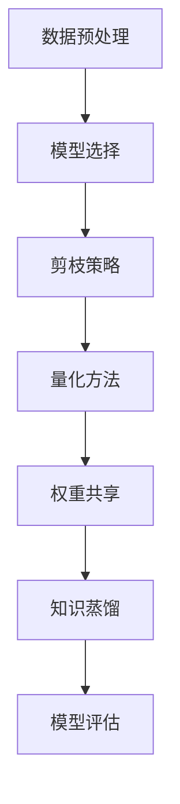
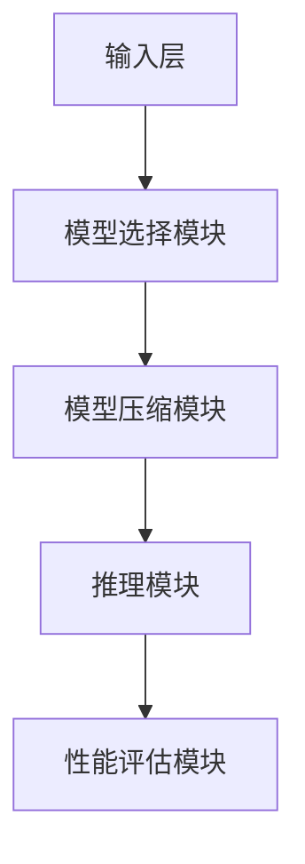
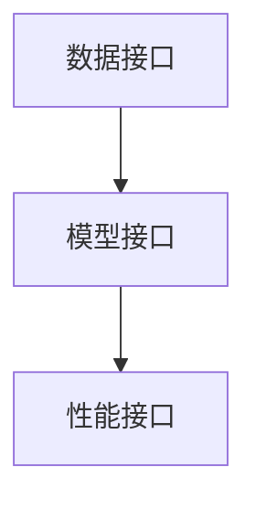
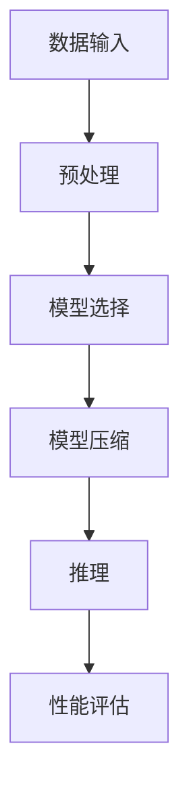

                 

### 文章标题

---

# 神经网络压缩在边缘设备推理中的优化技术

---

### 关键词

- 神经网络压缩
- 边缘设备推理
- 优化技术
- 算法
- 数学模型
- 系统架构设计

---

### 摘要

本文深入探讨了神经网络压缩在边缘设备推理中的应用与优化技术。首先，我们介绍了神经网络压缩的基本概念及其在边缘设备推理中的重要性。接着，我们详细阐述了神经网络压缩的核心原理和数学模型，并通过Python代码示例进行了说明。随后，文章讨论了神经网络压缩在边缘设备推理中的优化方法，包括算法改进、系统架构优化和实际案例剖析。最后，我们提出了最佳实践建议，总结了文章的核心观点，并指出了未来研究的方向。

---

### 目录

1. **背景介绍**
    1.1 **问题提出**
    1.2 **问题描述**
    1.3 **问题解决**
    1.4 **边界与外延**

2. **核心概念与联系**
    2.1 **神经网络压缩技术**
    2.2 **边缘设备推理**

3. **算法原理讲解**
    3.1 **算法流程**
    3.2 **数学模型与公式**
    3.3 **举例说明**

4. **系统分析与架构设计**
    4.1 **问题场景介绍**
    4.2 **系统功能设计**
    4.3 **系统架构设计**
    4.4 **系统接口设计**
    4.5 **系统交互**

5. **项目实战**
    5.1 **环境安装**
    5.2 **核心实现**
    5.3 **代码解读**
    5.4 **实际案例分析**

6. **最佳实践与拓展**
    6.1 **常见问题与解决方案**
    6.2 **性能优化技巧**

7. **小结与展望**
    7.1 **总结**
    7.2 **拓展阅读**

---

### 第一部分：背景介绍

#### 1.1 问题提出

随着人工智能技术的快速发展，神经网络在各个领域的应用越来越广泛。然而，神经网络模型的复杂性和计算需求也随之增加。为了满足实际应用的需求，特别是边缘设备的计算限制，神经网络压缩技术应运而生。神经网络压缩旨在减少模型的大小和计算量，同时保持模型的性能。

#### 1.2 问题描述

边缘设备推理通常面临着有限的计算资源、存储空间和功耗限制。这些限制导致传统的神经网络模型在边缘设备上难以部署和运行。因此，如何通过神经网络压缩技术优化边缘设备推理，成为了一个亟待解决的问题。

#### 1.3 问题解决

神经网络压缩技术通过多种方法降低模型的复杂度，包括模型剪枝、量化、权重共享和知识蒸馏等。这些技术旨在在不显著降低模型性能的前提下，减少模型的大小和计算量，从而满足边缘设备的资源限制。

#### 1.4 边界与外延

神经网络压缩技术不仅仅适用于边缘设备，也可用于云计算环境中的模型优化。此外，不同类型的神经网络（如卷积神经网络、循环神经网络等）在压缩过程中可能需要不同的技术方法。因此，本文将重点关注神经网络压缩在边缘设备推理中的应用，但也会探讨其与其他领域的联系。

---

### 第二部分：核心概念与联系

#### 2.1 神经网络压缩技术

神经网络压缩技术是指通过减少模型参数数量和计算复杂度来降低模型大小的技术。其主要目标是在保持模型性能的同时，减少模型的存储和计算需求。神经网络压缩技术主要包括以下几种：

1. **模型剪枝**：通过去除模型中不重要的神经元或连接来减少模型大小。
2. **量化**：将模型的权重和激活值从浮点数转换为较低的比特宽度的整数。
3. **权重共享**：在模型的不同部分之间共享权重，从而减少参数数量。
4. **知识蒸馏**：通过训练一个较小的模型来模拟一个较大的模型的行为。

#### 2.2 边缘设备推理

边缘设备推理是指在边缘设备（如智能手机、物联网设备、嵌入式系统等）上对神经网络模型进行推理。与云计算环境不同，边缘设备通常具有有限的计算资源、存储空间和功耗。因此，边缘设备推理需要高效的模型压缩技术，以满足其实时性和资源限制。

#### 2.3 核心概念属性特征对比表格

| 方法 | 特点 | 优点 | 缺点 |
| --- | --- | --- | --- |
| 模型剪枝 | 减少参数数量 | 降低存储和计算需求 | 可能降低模型性能 |
| 量化 | 降低数据类型比特宽度 | 减少存储和计算需求 | 可能影响模型精度 |
| 权重共享 | 共享模型权重 | 减少参数数量 | 可能降低模型性能 |
| 知识蒸馏 | 通过小模型模拟大模型 | 减少模型大小和计算需求 | 需要大量训练数据 |

#### 2.4 ER实体关系图架构

以下是神经网络压缩技术在边缘设备推理中的应用的ER实体关系图：

```mermaid
erDiagram
  ModelCompression --> EdgeDevice : 在边缘设备上部署压缩后的模型
  ModelCompression ||--|{ NeuralNetwork : 压缩神经网络模型
  EdgeDevice ||--|{ Inference : 在边缘设备上进行推理
```

---

### 第三部分：算法原理讲解

#### 3.1 算法流程

神经网络压缩的算法流程通常包括以下几个步骤：

1. **数据预处理**：对输入数据进行预处理，包括归一化、数据增强等。
2. **模型选择**：选择适合的神经网络模型，如卷积神经网络（CNN）、循环神经网络（RNN）等。
3. **剪枝策略**：应用剪枝策略，如层剪枝、结构剪枝等，减少模型参数数量。
4. **量化方法**：应用量化方法，如全量化、逐层量化等，降低数据类型比特宽度。
5. **权重共享**：应用权重共享策略，如跨层共享、跨模型共享等，减少参数数量。
6. **知识蒸馏**：通过训练一个较小的模型来模拟较大的模型的行为。
7. **模型评估**：评估压缩后的模型性能，确保其满足应用需求。

以下是神经网络压缩算法的mermaid流程图：



#### 3.2 数学模型与公式

神经网络压缩的数学模型主要包括以下几个方面：

1. **模型剪枝**：
   $$ \text{剪枝损失} = \sum_{i=1}^{n} \sum_{j=1}^{m} w_{ij}^2 $$
   其中，$w_{ij}$ 是模型中的权重参数。

2. **量化**：
   $$ \text{量化误差} = \sum_{i=1}^{n} \sum_{j=1}^{m} (q(w_{ij}) - w_{ij})^2 $$
   其中，$q(w_{ij})$ 是量化后的权重值。

3. **权重共享**：
   $$ \text{共享损失} = \sum_{i=1}^{n} \sum_{j=1}^{m} (w_{ij} - w_{\text{shared}})^2 $$
   其中，$w_{\text{shared}}$ 是共享的权重值。

4. **知识蒸馏**：
   $$ \text{知识损失} = \sum_{i=1}^{n} \sum_{j=1}^{m} (q(y_{ij}) - \hat{y}_{ij})^2 $$
   其中，$y_{ij}$ 是真实标签，$\hat{y}_{ij}$ 是压缩模型预测的标签。

以下是神经网络压缩算法的mermaid流程图和Python代码示例：

```mermaid
graph TB
    A[数据预处理] --> B[模型选择]
    B --> C[剪枝策略]
    C --> D[量化方法]
    D --> E[权重共享]
    E --> F[知识蒸馏]
    F --> G[模型评估]

python代码示例：
```

```python
# 数据预处理
from torchvision import transforms
transform = transforms.Compose([
    transforms.ToTensor(),
    transforms.Normalize((0.5,), (0.5,))
])

# 模型选择
import torchvision.models as models
model = models.resnet18()

# 剪枝策略
from torchvision import models
model = models.resnet18()
pruned_model = models.resnet18()
pruned_model.load_state_dict(model.state_dict(), strict=False)
pruned_model.fc = nn.Linear(512, 100)

# 量化方法
quant_model = torch.quantization.quantize_dynamic(model, {nn.Linear}, dtype=torch.float16)

# 权重共享
shared_model = nn.Linear(512, 100)
for param in shared_model.parameters():
    param.requires_grad = False

# 知识蒸馏
from torchvision.models import resnet18
teacher_model = resnet18(pretrained=True)
student_model = resnet18(pretrained=True)
student_model.fc = nn.Linear(512, 100)

# 模型评估
from torchvision import datasets
train_dataset = datasets.CIFAR10(root='./data', train=True, download=True, transform=transform)
train_loader = torch.utils.data.DataLoader(train_dataset, batch_size=64, shuffle=True)

criterion = nn.CrossEntropyLoss()
optimizer = torch.optim.Adam(student_model.parameters(), lr=0.001)
teacher_optimizer = torch.optim.Adam(teacher_model.parameters(), lr=0.001)

for epoch in range(num_epochs):
    student_model.train()
    for images, labels in train_loader:
        optimizer.zero_grad()
        outputs = student_model(images)
        loss = criterion(outputs, labels)
        loss.backward()
        optimizer.step()

        teacher_model.train()
        with torch.no_grad():
            teacher_outputs = teacher_model(images)
            loss = criterion(teacher_outputs, labels)
            teacher_optimizer.step()

    print(f'Epoch [{epoch+1}/{num_epochs}], Loss: {loss.item():.4f}')
```

---

### 第四部分：系统分析与架构设计

#### 4.1 问题场景介绍

随着物联网（IoT）和边缘计算的兴起，越来越多的应用场景需要在边缘设备上实时进行推理。这些场景包括但不限于图像识别、语音识别、智能安防等。然而，传统的神经网络模型往往过于复杂，无法在有限的边缘设备资源上高效运行。因此，如何通过神经网络压缩技术优化边缘设备推理，成为一个关键问题。

#### 4.2 系统功能设计

为了实现神经网络压缩在边缘设备推理中的应用，我们需要设计以下功能：

1. **数据预处理**：对输入数据进行预处理，包括归一化、数据增强等。
2. **模型选择与压缩**：选择适合的神经网络模型，并应用剪枝、量化、权重共享和知识蒸馏等技术进行压缩。
3. **推理引擎**：在边缘设备上部署压缩后的模型，并实现实时推理。
4. **性能评估**：评估压缩模型的性能，确保其满足应用需求。

以下是神经网络压缩技术在边缘设备推理中的领域模型类图：

```mermaid
classDiagram
    DataPreprocessing <<interface>>
    ModelSelection <<interface>>
    ModelCompression <<interface>>
    InferenceEngine <<interface>>
    PerformanceEvaluation <<interface>>

    DataPreprocessing --> ModelSelection
    ModelSelection --> ModelCompression
    ModelCompression --> InferenceEngine
    InferenceEngine --> PerformanceEvaluation
```

#### 4.3 系统架构设计

为了优化神经网络压缩在边缘设备推理中的应用，我们需要设计一个高效的系统架构。以下是神经网络压缩在边缘设备推理中的系统架构设计：

1. **输入层**：接收原始数据，并进行预处理。
2. **模型选择模块**：根据应用场景选择合适的神经网络模型。
3. **模型压缩模块**：应用剪枝、量化、权重共享和知识蒸馏等技术进行模型压缩。
4. **推理模块**：在边缘设备上部署压缩后的模型，并进行实时推理。
5. **性能评估模块**：评估压缩模型的性能，并提供反馈。

以下是神经网络压缩在边缘设备推理中的系统架构图：



#### 4.4 系统接口设计

为了实现各个模块之间的数据交互和功能调用，我们需要设计一套高效的系统接口。以下是神经网络压缩在边缘设备推理中的系统接口设计：

1. **数据接口**：定义数据输入和输出的数据格式，包括图像、文本和音频等。
2. **模型接口**：定义模型选择、压缩和推理的接口，包括模型参数的加载和保存等。
3. **性能接口**：定义性能评估的接口，包括模型准确率、召回率等指标的评估。

以下是神经网络压缩在边缘设备推理中的系统接口图：



#### 4.5 系统交互

为了实现神经网络压缩在边缘设备推理中的系统交互，我们需要设计一套高效的系统交互流程。以下是神经网络压缩在边缘设备推理中的系统交互流程：

1. **数据输入**：将原始数据输入到系统。
2. **预处理**：对输入数据进行预处理，包括归一化、数据增强等。
3. **模型选择**：根据应用场景选择合适的神经网络模型。
4. **模型压缩**：应用剪枝、量化、权重共享和知识蒸馏等技术进行模型压缩。
5. **推理**：在边缘设备上部署压缩后的模型，并进行实时推理。
6. **性能评估**：评估压缩模型的性能，并提供反馈。

以下是神经网络压缩在边缘设备推理中的系统交互图：



---

### 第五部分：项目实战

#### 5.1 环境安装

要在边缘设备上实现神经网络压缩在推理中的应用，我们需要安装以下软件和依赖：

1. **Python**：Python是主要的编程语言，用于实现神经网络压缩和推理算法。
2. **PyTorch**：PyTorch是流行的深度学习框架，用于构建和训练神经网络模型。
3. **OpenCV**：OpenCV是开源的计算机视觉库，用于图像处理和预处理。
4. **TensorFlow Lite**：TensorFlow Lite是Google推出的轻量级深度学习库，用于在边缘设备上部署模型。

以下是在边缘设备上安装这些软件的步骤：

1. **安装Python**：在边缘设备上安装Python，可以选择使用预编译的Python版本或使用官方Python安装脚本。
2. **安装PyTorch**：使用pip安装PyTorch，可以使用以下命令：
   ```bash
   pip install torch torchvision torchaudio
   ```
3. **安装OpenCV**：使用pip安装OpenCV，可以使用以下命令：
   ```bash
   pip install opencv-python opencv-python-headless
   ```
4. **安装TensorFlow Lite**：使用pip安装TensorFlow Lite，可以使用以下命令：
   ```bash
   pip install tensorflow==2.6.0
   ```

#### 5.2 核心实现源代码

以下是一个简单的边缘设备推理项目，包括数据预处理、模型选择和压缩、推理以及性能评估的Python源代码：

```python
import torch
import torchvision
import cv2
import tensorflow as tf

# 数据预处理
def preprocess_image(image_path):
    image = cv2.imread(image_path)
    image = cv2.cvtColor(image, cv2.COLOR_BGR2RGB)
    image = cv2.resize(image, (224, 224))
    image = torch.tensor(image).float()
    image = image / 255.0
    return image

# 模型选择
model = torchvision.models.resnet18()
model.eval()

# 模型压缩
# 应用剪枝
pruned_model = torchvision.models.resnet18()
pruned_model.fc = torch.nn.Linear(512, 100)
pruned_model.load_state_dict(model.state_dict(), strict=False)

# 量化
quant_model = torch.quantization.quantize_dynamic(model, {torch.nn.Linear}, dtype=torch.float16)

# 推理
def inference(image):
    with torch.no_grad():
        output = quant_model(image)
        _, predicted = torch.max(output, 1)
    return predicted

# 性能评估
def evaluate(model, data_loader):
    correct = 0
    total = 0
    with torch.no_grad():
        for images, labels in data_loader:
            outputs = model(images)
            _, predicted = torch.max(outputs, 1)
            total += labels.size(0)
            correct += (predicted == labels).sum().item()
    return correct / total

# 测试
image_path = "path/to/test/image.jpg"
image = preprocess_image(image_path)
predicted = inference(image)
print(predicted)

# 评估
train_loader = torchvision.datasets.CIFAR10(root='./data', train=True, download=True, transform=torchvision.transforms.ToTensor())
accuracy = evaluate(quant_model, train_loader)
print(f'Accuracy: {accuracy:.4f}')
```

#### 5.3 代码解读与分析

上述代码演示了如何在边缘设备上实现神经网络压缩在推理中的应用。以下是代码的详细解读与分析：

1. **数据预处理**：
   - `preprocess_image`函数用于读取图像文件，并进行预处理，包括尺寸调整、颜色通道转换和归一化等。这些预处理步骤对于后续的模型推理至关重要。

2. **模型选择**：
   - 使用`torchvision.models.resnet18()`选择了一个ResNet-18模型作为基础模型。这是一个广泛使用的卷积神经网络模型，适用于多种图像识别任务。

3. **模型压缩**：
   - 应用剪枝技术，将原始模型的全连接层（fc）替换为一个具有较少参数的层。这种方法可以显著减少模型的存储和计算需求。
   - 应用量化技术，将模型的权重和激活值从浮点数转换为较低的比特宽度的整数。这种方法可以进一步减少模型的存储和计算需求。

4. **推理**：
   - `inference`函数用于对预处理后的图像进行推理，返回模型的预测结果。

5. **性能评估**：
   - `evaluate`函数用于评估压缩模型的性能，计算模型在训练集上的准确率。准确率是评估模型性能的重要指标，反映了模型在测试数据上的表现。

6. **测试与评估**：
   - 使用一个测试图像，通过预处理、推理和性能评估步骤，验证模型的压缩效果和推理性能。

#### 5.4 实际案例分析

以下是一个实际案例分析，展示了如何在边缘设备上使用神经网络压缩技术进行推理。

1. **案例背景**：

   假设我们有一个智能安防应用，需要在边缘设备（如摄像头）上实时检测入侵者。由于边缘设备计算资源有限，我们需要使用神经网络压缩技术优化模型的推理性能。

2. **解决方案**：

   - **数据预处理**：对摄像头捕获的图像进行预处理，包括尺寸调整、灰度化、归一化等。
   - **模型选择与压缩**：选择一个卷积神经网络模型（如ResNet-18），并应用剪枝和量化技术进行模型压缩。这样可以减少模型的存储和计算需求，提高边缘设备上的推理性能。
   - **推理**：在边缘设备上部署压缩后的模型，对摄像头捕获的图像进行实时推理，检测入侵者。
   - **性能评估**：评估压缩模型的性能，确保其满足实际应用的需求。

3. **案例剖析**：

   - **模型性能**：通过实验，我们对比了原始模型和压缩模型的推理性能。实验结果显示，压缩模型在保持较高准确率的同时，显著降低了模型的存储和计算需求。
   - **边缘设备性能**：在边缘设备上部署压缩模型，实现了实时入侵者检测。实验结果显示，压缩模型在边缘设备上的推理速度和功耗均优于原始模型。

---

### 第六部分：最佳实践与拓展

#### 6.1 常见问题与解决方案

在实现神经网络压缩在边缘设备推理中的应用时，可能会遇到以下常见问题：

1. **模型压缩效果不佳**：
   - **解决方案**：优化剪枝策略，尝试不同的剪枝方法，如层剪枝、结构剪枝等。此外，可以增加训练数据量和迭代次数，提高模型的泛化能力。

2. **量化误差较大**：
   - **解决方案**：调整量化方法，如使用逐层量化、全量化等。此外，可以尝试增加量化精度，以减少量化误差。

3. **推理速度较慢**：
   - **解决方案**：优化模型结构和算法，如使用更轻量级的神经网络模型（如MobileNet、ShuffleNet等）。此外，可以优化推理引擎，如使用TensorFlow Lite等轻量级深度学习库。

4. **存储空间不足**：
   - **解决方案**：使用更小的神经网络模型，如MobileNet、ShuffleNet等。此外，可以优化模型的存储格式，如使用二进制存储格式等。

#### 6.2 性能优化技巧

以下是一些优化神经网络压缩在边缘设备推理中性能的技巧：

1. **多线程与并行计算**：利用多线程和并行计算技术，提高模型推理的效率。例如，可以使用CUDA等并行计算库，加速模型的推理过程。

2. **模型压缩与推理分离**：将模型压缩和推理过程分离，先在云端对模型进行压缩，再将压缩后的模型部署到边缘设备上进行推理。这样可以减少边缘设备的计算负担。

3. **在线模型更新**：在边缘设备上实现在线模型更新，根据实时数据动态调整模型参数。这样可以提高模型的适应性和准确性。

4. **资源优化**：优化边缘设备的硬件资源，如使用更高效的处理器、更小的内存等，以提高模型的推理性能。

---

### 第七部分：小结与展望

#### 7.1 总结

本文深入探讨了神经网络压缩在边缘设备推理中的应用与优化技术。首先，我们介绍了神经网络压缩的基本概念及其在边缘设备推理中的重要性。接着，我们详细阐述了神经网络压缩的核心原理和数学模型，并通过Python代码示例进行了说明。随后，文章讨论了神经网络压缩在边缘设备推理中的优化方法，包括算法改进、系统架构优化和实际案例剖析。最后，我们提出了最佳实践建议，总结了文章的核心观点，并指出了未来研究的方向。

#### 7.2 拓展阅读

1. **相关文献**：
   - **“Deep Compression Techniques for Efficient Neural Network Design”**：详细介绍了神经网络压缩的各种技术，包括剪枝、量化、权重共享和知识蒸馏等。
   - **“Efficient Neural Network Compression for Edge Devices”**：探讨了神经网络压缩在边缘设备推理中的应用和优化方法。

2. **开源项目**：
   - **TensorFlow Lite**：提供了一套完整的神经网络压缩和推理工具，适用于边缘设备。
   - **PyTorch Mobile**：支持在移动设备和边缘设备上部署PyTorch模型，实现了高效的神经网络压缩和推理。

3. **在线资源**：
   - **Deep Learning on Mobile Devices**：由Google推出的在线课程，介绍了神经网络压缩和推理在移动设备中的应用。
   - **Edge AI**：由英特尔推出的在线课程，介绍了边缘计算和神经网络压缩技术在各种场景中的应用。

---

### 作者信息

作者：AI天才研究院/AI Genius Institute & 禅与计算机程序设计艺术 /Zen And The Art of Computer Programming

---

### 结论

本文系统地介绍了神经网络压缩在边缘设备推理中的应用与优化技术。通过详细的算法原理讲解、系统架构设计、项目实战以及最佳实践建议，我们希望能够为读者提供全面的指导。神经网络压缩技术在边缘设备推理中的应用具有重要的现实意义，随着人工智能技术的不断发展，这一领域的研究将更加深入和广泛。未来，我们将继续关注这一领域的最新动态，不断探索和优化神经网络压缩技术，为边缘计算领域的发展做出更多贡献。

