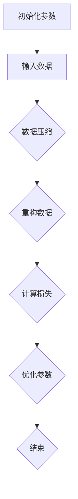
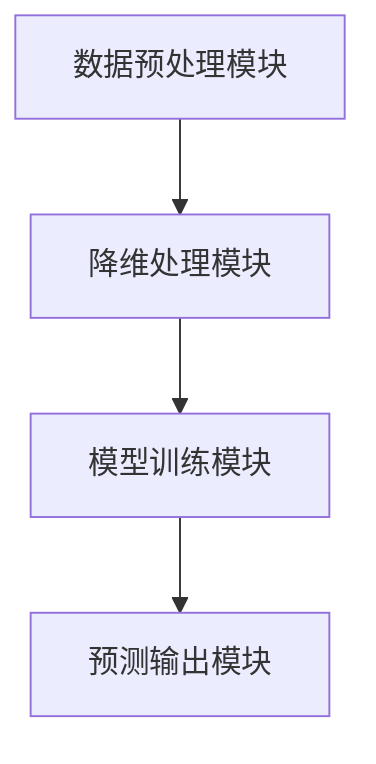
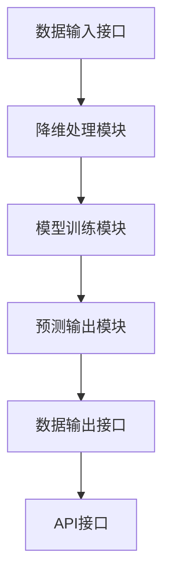
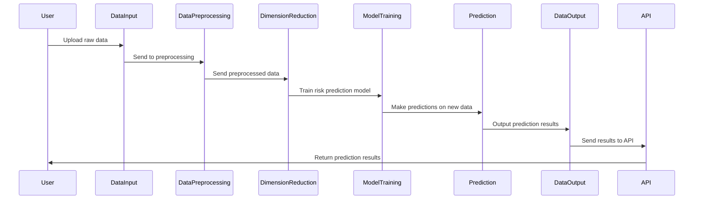

                 

### 第一部分：引言

#### 第1章：超高维数据处理的背景与挑战

在当今大数据和人工智能技术快速发展的时代，数据的维度和规模正在以前所未有的速度增长。这不仅仅是普通意义上的数据增长，而是涉及到超高维数据（Ultra-high Dimensional Data）的领域。超高维数据通常指的是那些特征维度远远大于样本数量的数据集，例如，在一个样本中有成千上万的特征，但样本数量相对较少。这种数据形式在金融、生物信息学、社会科学和工程领域都非常常见。

#### 1.1 问题背景

超高维数据处理的背景可以追溯到统计学和机器学习的早期发展。早期的研究主要集中在低维数据上，但随着计算能力和数据采集技术的进步，研究者们开始接触到更加复杂和庞大的数据集。在处理这些数据时，传统的机器学习算法和统计方法遇到了一系列挑战。例如，当特征数量远超样本数量时，经典线性模型和最优化算法会变得不稳定，数据的高维度特性会导致模型选择困难、过拟合风险增加以及计算效率低下。

#### 1.2 数据维度的挑战

数据维度的挑战主要体现在以下几个方面：

- **维度灾难（Curse of Dimensionality）**：随着数据维度的增加，数据点之间的距离会变得非常接近，导致样本数据的分布特征变得模糊，增加了模型学习的难度。
- **计算效率**：在高维空间中，计算量和存储需求会急剧增加，传统的机器学习算法可能无法在合理的时间内完成训练和预测。
- **过拟合**：由于高维数据中往往包含大量的噪声和冗余信息，模型容易在训练数据上过度拟合，导致泛化能力下降。
- **模型选择**：高维数据往往使得模型选择过程变得复杂，难以确定最优的模型结构和参数设置。

#### 1.3 神经网络降维的重要性

面对超高维数据的挑战，降维技术成为了一种重要的解决手段。神经网络在降维方面具有独特的优势：

- **非线性映射**：神经网络可以通过多层非线性变换来降低数据的维度，同时保持数据的内在结构。
- **自适应特征选择**：通过训练过程，神经网络能够自动选择对目标变量影响最大的特征，从而减少冗余特征。
- **高效计算**：神经网络可以高效地处理大规模数据，特别是通过使用深度学习和分布式计算技术，可以显著提升计算效率。

#### 1.4 书籍结构概述

本书籍旨在全面介绍神经网络在处理超高维数据时的降维技术。全书分为以下几个部分：

- **第一部分：引言**：介绍超高维数据的背景和挑战，以及神经网络降维的重要性。
- **第二部分：基础理论**：讲解降维技术的概念、传统方法以及神经网络降维的核心原理。
- **第三部分：技术实现**：详细解析神经网络降维的算法原理、系统架构和实现细节。
- **第四部分：应用案例**：通过实际案例展示神经网络降维技术的应用效果和实践经验。
- **第五部分：总结与展望**：总结全书内容，并对未来的技术发展进行展望。

通过这本书，读者可以系统地了解神经网络降维技术的原理和应用，掌握在实际项目中应用这些技术的技巧和方法。

### 第二部分：基础理论

#### 第2章：降维技术概述

降维技术是处理高维数据的关键手段，其核心目标是在保留数据关键信息的同时，大幅度减少数据维度。降维技术不仅可以降低计算的复杂度，还能有效减少数据存储的需求，提高算法的效率和稳定性。本节将概述降维技术的基本概念、传统方法以及神经网络降维的特点和优势。

#### 2.1 降维的基本概念

降维（Dimensionality Reduction）是指从高维数据中提取出关键信息，生成一个低维数据表示的过程。高维数据通常指的是数据点拥有多个特征维度，而低维数据则意味着数据点拥有较少的特征维度。降维的基本概念包括以下几个要点：

- **特征选择（Feature Selection）**：从高维数据中选择出最有用的特征，用于构建模型或进一步的数据分析。
- **特征提取（Feature Extraction）**：通过某种数学或统计方法，将高维数据转换成低维数据，同时保持数据的内在结构和相关性。
- **数据压缩（Data Compression）**：通过降维减少数据的存储空间，同时保持数据的可读性和可理解性。

降维技术的主要目标是在降低数据维度的同时，尽可能保留数据的原始信息，避免信息的丢失和扭曲。

#### 2.2 传统降维方法

传统降维方法主要包括以下几种：

- **主成分分析（PCA，Principal Component Analysis）**：PCA通过求解数据的协方差矩阵的特征值和特征向量，将数据投影到新的正交坐标系上，选取前几个主成分来代表数据。PCA是一种线性降维方法，广泛应用于数据预处理和特征提取。
- **线性判别分析（LDA，Linear Discriminant Analysis）**：LDA通过最大化类内方差和最小化类间方差，选择能够有效区分不同类别的特征子集。LDA常用于分类问题中的特征选择。
- **因子分析（FA，Factor Analysis）**：FA通过构建潜在变量模型，将观测变量表示为潜在变量的线性组合，从而降低数据的维度。FA主要用于探索数据中的潜在结构和变量之间的相关性。
- **独立成分分析（ICA，Independent Component Analysis）**：ICA通过求解混合信号中的独立成分，将数据分解为独立源信号的和。ICA在信号处理和模式识别中应用广泛。

这些传统降维方法各有特点，适用于不同的数据类型和场景。它们通常基于线性变换，适用于数据分布较为简单的情况。但在面对复杂的高维数据时，传统降维方法可能会受到数据维度灾难和线性限制的影响。

#### 2.3 神经网络降维方法

与传统的降维方法不同，神经网络降维方法利用神经网络的非线性映射能力和自适应特征选择能力，能够更好地处理超高维数据。神经网络降维方法主要包括以下几种：

- **自编码器（Autoencoder）**：自编码器是一种无监督学习算法，通过训练一个编码器网络和解码器网络，将输入数据压缩成低维表示，再通过解码器还原回高维数据。自编码器能够在不丢失太多信息的情况下降低数据维度。
- **变分自编码器（VAE，Variational Autoencoder）**：VAE通过引入概率模型来学习数据的分布，能够在降维过程中保留数据的多样性和分布信息。
- **生成对抗网络（GAN，Generative Adversarial Network）**：GAN由一个生成器和一个判别器组成，生成器尝试生成与真实数据相似的数据，而判别器则试图区分真实数据和生成数据。GAN在降维和生成数据的任务中表现出色。
- **深度嵌入（Deep Embedding）**：深度嵌入利用深度神经网络将高维数据映射到低维空间，同时保持数据的结构性和分布特性。深度嵌入在推荐系统、文本分析和图像处理等领域应用广泛。

神经网络降维方法具有以下优势：

- **非线性映射**：神经网络可以学习数据中的复杂非线性关系，从而在降维过程中更好地保留数据的内在结构。
- **自适应特征选择**：神经网络在训练过程中能够自动选择对目标变量影响最大的特征，从而减少冗余特征。
- **灵活性**：神经网络可以适应不同类型的数据和任务，通过调整网络结构和参数，实现多种降维任务的灵活应用。

#### 2.4 降维技术对比分析

表1给出了几种常见降维技术的主要特点和应用场景。

| 技术名称 | 主要特点 | 应用场景 |
| --- | --- | --- |
| 主成分分析（PCA） | 线性降维，保留最大方差 | 数据预处理，特征提取 |
| 线性判别分析（LDA） | 线性降维，分类效果 | 分类问题中的特征选择 |
| 因子分析（FA） | 潜在变量模型，变量相关性 | 数据探索，结构化分析 |
| 独立成分分析（ICA） | 独立源信号分解，非线性降维 | 信号处理，模式识别 |
| 自编码器（Autoencoder） | 非线性降维，自动特征选择 | 数据压缩，特征提取 |
| 变分自编码器（VAE） | 概率模型，分布保持 | 数据生成，特征提取 |
| 生成对抗网络（GAN） | 对抗性学习，生成多样性 | 数据生成，特征提取 |
| 深度嵌入（Deep Embedding） | 非线性降维，结构保持 | 推荐系统，文本分析，图像处理 |

从表1可以看出，神经网络降维方法在处理复杂和高维数据时具有明显优势，但同时也需要更多的计算资源和更复杂的模型调整。传统降维方法虽然计算效率较高，但在面对复杂数据时效果可能有限。

通过以上对比分析，我们可以看到降维技术在处理超高维数据时的重要性。接下来，我们将进一步探讨神经网络降维的核心原理和实现方法。

### 第3章：神经网络降维的核心原理

神经网络降维技术在处理超高维数据方面表现出色，其核心原理在于通过多层非线性变换和自适应特征选择来降低数据维度，同时保留关键信息。本节将深入讲解神经网络降维的基础知识，包括神经网络的基本概念、降维神经网络的架构、训练过程以及性能评估方法。

#### 3.1 神经网络基础

神经网络是一种由大量神经元组成的复杂计算模型，通过模拟人脑的神经元网络来进行数据处理和模式识别。神经网络的基本单元是神经元，也称为节点或单元，每个神经元接收多个输入信号，并通过加权求和和激活函数产生输出。

一个简单的神经网络通常包括以下组成部分：

- **输入层（Input Layer）**：接收外部输入数据。
- **隐藏层（Hidden Layers）**：进行数据的处理和变换。
- **输出层（Output Layer）**：产生最终输出结果。

每个神经元与相邻层的神经元通过权重（weights）连接，权重决定了输入信号的传递强度。在神经网络中，常用的激活函数包括 sigmoid 函数、ReLU 函数和 tanh 函数，这些激活函数可以帮助神经网络学习非线性映射。

#### 3.2 降维神经网络的架构

降维神经网络是神经网络的一种特殊形式，其目标是通过非线性变换将高维数据映射到低维空间。降维神经网络的常见架构包括自编码器和变分自编码器等。

- **自编码器（Autoencoder）**：自编码器由编码器（Encoder）和解码器（Decoder）两部分组成。编码器将输入数据压缩成一个低维表示，解码器则试图将这个低维表示还原回原始数据的近似。自编码器的架构如图1所示。

  ```mermaid
  graph TD
  A[编码器] --> B[压缩层]
  B --> C[解码器]
  C --> D[输出]
  ```

  图1：自编码器架构

- **变分自编码器（VAE）**：变分自编码器引入了概率模型来学习数据的分布，其架构包括编码器、解码器和潜在空间。编码器学习数据的概率分布，解码器则从潜在空间中采样生成数据。VAE的架构如图2所示。

  ```mermaid
  graph TD
  A[编码器] --> B[潜在空间]
  B --> C[解码器]
  ```

  图2：变分自编码器架构

#### 3.3 降维神经网络的训练

降维神经网络的训练过程是通过优化网络参数，使得编码器能够有效地压缩输入数据，解码器能够还原压缩后的数据。训练过程通常采用以下步骤：

1. **初始化参数**：随机初始化编码器和解码器的权重和偏置。
2. **输入数据压缩**：编码器接收输入数据，通过多层非线性变换将数据压缩成一个低维表示。
3. **数据重构**：解码器接收编码器输出的低维表示，通过反向传播和反向变换尝试还原原始数据。
4. **计算损失函数**：使用均方误差（MSE）或其他损失函数计算输出数据和原始数据之间的差距。
5. **优化参数**：通过梯度下降等优化算法更新编码器和解码器的参数，使得输出数据更接近原始数据。
6. **迭代训练**：重复步骤2-5，直到网络收敛或达到预设的训练次数。

训练过程中，损失函数的值会逐渐减小，网络参数会逐步优化。通过训练，编码器能够学会将输入数据有效地映射到低维空间，解码器能够将低维表示还原回原始数据。

#### 3.4 降维神经网络的性能评估

降维神经网络的性能评估主要通过以下指标：

- **重构误差（Reconstruction Error）**：重构误差是衡量解码器性能的重要指标，通常使用均方误差（MSE）或交叉熵（Cross-Entropy）来计算。
- **压缩率（Compression Rate）**：压缩率是衡量编码器性能的指标，表示数据压缩后的维度与原始数据维度之比。
- **信息保留（Information Preservation）**：信息保留是评估降维后数据是否保留了原始数据的结构和信息，可以通过计算降维前后数据的相关性来评估。
- **泛化能力（Generalization Ability）**：泛化能力是评估模型在实际应用中的表现，通过在未见过的数据上进行测试来评估。

通过性能评估，我们可以判断降维神经网络是否有效地降低了数据维度，同时保留了关键信息，从而提高数据处理和预测的效率。

#### 3.5 深度学习与降维神经网络

深度学习（Deep Learning）是神经网络的一种高级形式，通过多层神经网络结构来学习复杂的非线性映射。深度学习在图像识别、自然语言处理和语音识别等领域取得了显著成果。深度学习与降维神经网络的关系在于，深度学习模型可以应用于降维任务，通过多层非线性变换将高维数据映射到低维空间。

例如，卷积神经网络（CNN）和循环神经网络（RNN）等深度学习模型在图像和序列数据降维方面表现出色。通过训练深度学习模型，可以学习到数据中的复杂特征和结构，从而在降维过程中保留关键信息。

#### 3.6 案例分析

以图像数据为例，如图像去噪任务，通过降维神经网络可以有效降低数据维度，同时保持图像的质量。以下是一个简化的案例分析：

- **数据集**：使用一组高分辨率的图像数据。
- **降维神经网络**：构建一个自编码器模型，编码器将图像数据压缩到低维表示，解码器尝试还原图像。
- **训练过程**：使用均方误差（MSE）作为损失函数，通过反向传播算法优化模型参数。
- **性能评估**：通过计算重构误差和压缩率来评估模型性能。

通过这个案例分析，我们可以看到降维神经网络在处理图像数据时的应用效果。降维神经网络不仅能够降低数据维度，还能保持图像的细节和结构，从而提高图像处理的效率和质量。

综上所述，神经网络降维技术在处理超高维数据方面具有独特的优势，通过非线性变换和自适应特征选择，能够有效地降低数据维度，同时保留关键信息。接下来，我们将进一步探讨神经网络降维技术在不同领域的应用和实现细节。

### 第4章：核心概念与联系

#### 4.1 核心概念原理

在深入探讨神经网络降维技术的过程中，了解其核心概念是至关重要的。这些核心概念包括但不限于：

- **自编码器**：自编码器是一种神经网络架构，由编码器和解码器组成。编码器负责将输入数据压缩成低维表示，解码器则试图将这个低维表示还原回原始数据。自编码器通过最小化重构误差来实现降维。
- **变分自编码器（VAE）**：VAE引入了概率模型，通过学习数据分布来生成低维表示。编码器输出数据的均值和方差，解码器则从潜在空间中采样生成数据。VAE在降维过程中保持了数据的多样性。
- **降维神经网络架构**：降维神经网络通常包括多层非线性变换，通过这些变换将高维数据映射到低维空间。这些变换不仅降低了数据维度，还保留了数据的内在结构和信息。

#### 4.2 概念属性特征对比表格

为了更好地理解上述核心概念，我们提供了一个对比表格，列出自编码器、VAE和降维神经网络架构的主要属性特征。

| 特征             | 自编码器                   | VAE                        | 降维神经网络架构               |
|------------------|----------------------------|----------------------------|-------------------------------|
| 基本原理         | 压缩和重构输入数据         | 学习数据分布和生成数据     | 非线性变换和数据保持           |
| 模型结构         | 编码器和解码器             | 编码器、解码器和潜在空间   | 多层神经网络                  |
| 降维方式         | 压缩到固定维度的低维空间   | 学习数据分布并生成低维表示 | 非线性映射到低维空间           |
| 损失函数         | 重构误差（如MSE）          | Kullback-Leibler散度       | 重构误差和潜在空间散度         |
| 特点             | 易于实现和调整             | 能够生成多样化数据         | 保留数据结构并降低计算复杂度   |

通过这个表格，我们可以清晰地看到三种核心概念之间的差异和联系，为后续的详细讨论打下基础。

#### 4.3 ER实体关系图架构

为了更直观地理解神经网络降维技术的实体关系，我们可以使用ER（Entity-Relationship）图来表示各个实体及其相互关系。以下是ER图的基本结构和相关实体的定义：

- **实体**：在ER图中，实体表示降维技术中的核心组件，如自编码器、VAE和神经网络架构。
- **关系**：实体之间的关系描述了它们在降维过程中的相互作用和依赖。

```mermaid
erDiagram
  Autoencoder ||--|{ Encoder }|---> Decoder
  VariationalAutoencoder ||--|{ Encoder }|---> Decoder
  NeuralNetworkArchitecture ||--|{ Layer1 }|---> Layer2
  Layer2 ||--|{ Layer3 }|---> Output
  Autoencoder..|..VariationalAutoencoder
  NeuralNetworkArchitecture..|..Autoencoder
  NeuralNetworkArchitecture..|..VariationalAutoencoder
```

上述ER图展示了自编码器、VAE和神经网络架构之间的实体关系。自编码器和VAE是具体的神经网络降维方法，它们分别由编码器和解码器组成。神经网络架构则更一般地表示了通过多层神经网络实现降维的过程。

通过ER图，我们可以清晰地理解神经网络降维技术的组成部分及其相互关系，为后续的详细讲解和分析提供直观的参考。

### 第5章：算法原理讲解

#### 5.1 算法mermaid流程图

为了更好地理解神经网络降维技术的算法原理，我们首先使用mermaid绘制算法的流程图。以下是自编码器的算法流程图：



图1：自编码器算法流程图

在这个流程图中，算法的主要步骤包括初始化参数、输入数据、数据压缩、重构数据、计算损失和优化参数。接下来，我们将详细解释每个步骤的算法原理。

#### 5.2 Python源代码讲解

为了更好地理解算法的执行过程，我们提供了一个简单的Python代码示例，用于实现自编码器的基本算法。

```python
import numpy as np

# 初始化参数
def initialize_params(input_dim):
    weights_encoder = np.random.randn(input_dim, latent_dim)
    biases_encoder = np.random.randn(latent_dim)
    weights_decoder = np.random.randn(latent_dim, input_dim)
    biases_decoder = np.random.randn(input_dim)
    
    return weights_encoder, biases_encoder, weights_decoder, biases_decoder

# 前向传播
def forward_pass(x, weights_encoder, biases_encoder, weights_decoder, biases_decoder):
    z = np.dot(x, weights_encoder) + biases_encoder
    x_hat = np.dot(z, weights_decoder) + biases_decoder
    
    return z, x_hat

# 反向传播
def backward_pass(x, x_hat, z, weights_encoder, weights_decoder):
    d_weights_decoder = np.dot(z.T, x_hat - x)
    d_biases_decoder = (x_hat - x).sum(axis=0)
    
    d_weights_encoder = np.dot(x.T, z - x_hat)
    d_biases_encoder = (z - x_hat).sum(axis=0)
    
    return d_weights_decoder, d_biases_decoder, d_weights_encoder, d_biases_encoder

# 训练模型
def train_model(x, latent_dim, epochs, learning_rate):
    weights_encoder, biases_encoder, weights_decoder, biases_decoder = initialize_params(x.shape[1])
    
    for epoch in range(epochs):
        z, x_hat = forward_pass(x, weights_encoder, biases_encoder, weights_decoder, biases_decoder)
        d_weights_decoder, d_biases_decoder, d_weights_encoder, d_biases_encoder = backward_pass(x, x_hat, z, weights_encoder, weights_decoder)
        
        weights_encoder -= learning_rate * d_weights_encoder
        biases_encoder -= learning_rate * d_biases_encoder
        weights_decoder -= learning_rate * d_weights_decoder
        biases_decoder -= learning_rate * d_biases_decoder
        
        if epoch % 100 == 0:
            print(f"Epoch {epoch}: Reconstruction Error = {np.mean((x - x_hat)**2)}")
    
    return weights_encoder, biases_encoder, weights_decoder, biases_decoder
```

在这个代码中，我们定义了初始化参数、前向传播、反向传播和训练模型的函数。初始化参数用于初始化编码器和解码器的权重和偏置。前向传播函数计算输入数据的压缩和重构过程。反向传播函数计算梯度，用于优化参数。训练模型函数通过迭代优化参数，实现数据的降维。

#### 5.3 数学模型和公式讲解

为了更深入地理解算法原理，我们列出关键步骤的数学模型和公式。

- **编码器前向传播**：
  $$z = \sigma(W_{\text{encoder}} \cdot x + b_{\text{encoder}})$$
  其中，$\sigma$是激活函数（如sigmoid或ReLU），$W_{\text{encoder}}$是编码器的权重矩阵，$b_{\text{encoder}}$是编码器的偏置向量。

- **解码器前向传播**：
  $$x' = \sigma(W_{\text{decoder}} \cdot z + b_{\text{decoder}})$$
  其中，$x'$是重构的输入数据，$W_{\text{decoder}}$是解码器的权重矩阵，$b_{\text{decoder}}$是解码器的偏置向量。

- **编码器反向传播**：
  $$dW_{\text{encoder}} = x^T \cdot (z - x')$$
  $$db_{\text{encoder}} = (z - x').sum(axis=0)$$

- **解码器反向传播**：
  $$dW_{\text{decoder}} = z^T \cdot (x' - x)$$
  $$db_{\text{decoder}} = (x' - x).sum(axis=0)$$

其中，$T$表示转置运算。

#### 5.4 举例说明

为了更直观地理解算法原理，我们通过一个简单的例子来说明自编码器的应用。

假设我们有一个包含100个特征的数据集，我们希望将其降维到10个特征。以下是一个简化的例子：

1. **初始化参数**：我们随机初始化编码器和解码器的权重和偏置。
2. **前向传播**：输入数据通过编码器压缩成10个特征的低维表示。
3. **重构数据**：低维表示通过解码器重构回原始数据。
4. **反向传播**：计算重构误差，并更新编码器和解码器的参数。
5. **迭代训练**：重复步骤2-4，直到网络收敛。

在每次迭代中，重构误差会逐渐减小，编码器和解码器的参数会逐步优化。最终，我们可以得到一个能够有效降低数据维度同时保留关键信息的自编码器模型。

通过这个例子，我们可以看到自编码器在降低数据维度方面的基本原理和实现过程。接下来，我们将进一步探讨降维神经网络在系统架构设计中的应用。

### 第6章：系统分析与架构设计方案

#### 6.1 问题场景介绍

在当今数据驱动的世界中，各种领域（如金融、医疗、电商等）都面临着海量数据的处理和分析挑战。特别是超高维数据，其特征维度远远超过样本数量，导致传统机器学习算法在处理过程中面临计算效率低、过拟合风险高、模型选择复杂等问题。为了应对这些挑战，降维技术在数据处理和模型训练中发挥着至关重要的作用。

本章节将介绍一个典型的应用场景——金融风险评估系统。该系统旨在利用降维技术对金融数据进行分析和建模，以提高风险预测的准确性和效率。具体来说，该系统需要处理的数据包括客户的财务状况、信用记录、投资组合等信息，这些数据通常具有数百甚至数千个特征维度。面对如此高维的数据，直接应用传统机器学习算法不仅计算复杂度高，而且容易导致过拟合。

因此，降维技术在金融风险评估系统中扮演了关键角色。通过降维，我们可以大幅度减少数据维度，降低计算复杂度，同时保留数据的关键信息，从而提高模型的泛化能力和预测性能。本章节将详细介绍该系统的问题场景、功能需求、架构设计以及接口设计，并使用mermaid图来展示系统的架构和交互流程。

#### 6.2 系统功能设计

系统功能设计是系统架构设计的关键环节，决定了系统的整体性能和用户体验。在金融风险评估系统中，主要的功能包括数据预处理、降维处理、模型训练和预测结果输出等。

- **数据预处理**：该功能负责清洗和转换原始数据，确保数据的质量和一致性。具体包括缺失值处理、异常值检测和数据标准化等。
- **降维处理**：利用降维技术对高维数据进行降维，减少数据维度，提高计算效率和模型性能。主要采用的降维技术包括自编码器、变分自编码器（VAE）和主成分分析（PCA）等。
- **模型训练**：在降维后的数据集上进行模型训练，以建立风险预测模型。常用的模型包括线性回归、支持向量机（SVM）、决策树等。
- **预测结果输出**：将训练好的模型应用于新数据，生成预测结果，并输出风险评分。这些预测结果将用于辅助决策，如贷款审批、信用评级等。

#### 6.3 系统架构设计

系统架构设计是确保系统高效、稳定、可扩展的关键。在金融风险评估系统中，我们采用了模块化设计，将系统划分为多个功能模块，每个模块负责特定的任务，模块之间通过接口进行交互。

- **数据预处理模块**：负责接收原始数据，进行数据清洗、缺失值填充、数据标准化等预处理操作，将数据转换为适合降维和模型训练的形式。
- **降维处理模块**：利用降维技术对预处理后的数据进行降维处理，生成低维特征表示。该模块支持多种降维算法，如自编码器、VAE和PCA，用户可以根据需求和数据特性选择合适的算法。
- **模型训练模块**：在降维后的数据集上进行模型训练，建立风险预测模型。该模块支持多种机器学习算法，用户可以根据需求选择合适的算法，并调整参数以优化模型性能。
- **预测输出模块**：将训练好的模型应用于新数据，生成预测结果，并输出风险评分。该模块还负责将预测结果存储到数据库中，以供后续查询和分析。

系统架构设计图如下：



图2：金融风险评估系统架构设计图

通过这个架构设计，系统实现了数据的预处理、降维处理、模型训练和预测输出的一体化，从而提高了系统的整体效率和稳定性。

#### 6.4 系统接口设计

系统接口设计是确保系统模块之间高效、稳定交互的重要环节。在金融风险评估系统中，我们设计了以下接口：

- **数据输入接口**：负责接收用户的原始数据，包括客户的财务状况、信用记录、投资组合等信息。该接口支持多种数据格式，如CSV、JSON和Parquet等。
- **数据输出接口**：负责将降维后的数据、模型训练结果和预测结果输出给用户。该接口也支持多种数据格式，方便用户进行数据存储和分析。
- **API接口**：提供RESTful风格的API，方便用户通过程序进行数据交互和模型调用。API接口包括数据上传、数据下载、模型训练和预测结果查询等功能。

系统接口设计图如下：



图3：金融风险评估系统接口设计图

通过这些接口设计，系统实现了与用户、数据库和其他系统的高效交互，从而提升了系统的灵活性和可扩展性。

#### 6.5 系统交互mermaid序列图

为了更直观地展示系统的运行流程和模块间的交互，我们使用mermaid绘制了系统交互序列图。



图4：金融风险评估系统交互序列图

通过这个序列图，我们可以清晰地看到系统的运行流程和各个模块之间的交互过程。用户上传原始数据，数据输入接口接收数据并传递给数据预处理模块。预处理模块对数据进行清洗和转换后，传递给降维处理模块进行降维。降维后的数据用于模型训练模块，训练出风险预测模型。预测模块将模型应用于新数据，生成预测结果，并通过数据输出接口传递给API接口，最终返回给用户。

通过以上系统分析与架构设计，我们可以构建一个高效、稳定、可扩展的金融风险评估系统，利用降维技术提高模型的性能和预测准确性，为金融机构提供有力的风险管理工具。

### 第7章：项目实战

#### 7.1 环境安装

为了演示神经网络降维技术的应用，我们将使用Python和相关的库来构建一个降维系统。在开始之前，我们需要安装以下环境：

1. **Python**：版本为3.8或更高版本。
2. **NumPy**：用于数值计算。
3. **Pandas**：用于数据处理。
4. **TensorFlow**：用于构建和训练神经网络。
5. **Scikit-learn**：用于降维算法的实现和评估。

安装步骤如下：

```bash
pip install python==3.8 numpy pandas tensorflow scikit-learn
```

确保所有依赖库都已成功安装。接下来，我们将创建一个Python虚拟环境来隔离项目依赖：

```bash
python -m venv my_venv
source my_venv/bin/activate  # 在Windows使用my_venv\Scripts\activate
```

#### 7.2 系统核心实现源代码

在虚拟环境中，我们将编写一个简单的降维系统，使用自编码器来实现降维处理。以下是系统核心实现的源代码：

```python
import numpy as np
import tensorflow as tf
from tensorflow.keras.layers import Input, Dense, Flatten, Reshape
from tensorflow.keras.models import Model

# 设置参数
input_dim = 100  # 输入维度
latent_dim = 10  # 隐含层维度
learning_rate = 0.001
epochs = 100

# 构建自编码器模型
input_layer = Input(shape=(input_dim,))
flatten_layer = Flatten()(input_layer)
hidden_layer = Dense(latent_dim, activation='relu')(flatten_layer)
reshape_layer = Reshape((latent_dim, 1))(hidden_layer)
encoded = Dense(latent_dim, activation='sigmoid')(reshape_layer)

decoded_layer = Dense(latent_dim, activation='sigmoid')(reshape_layer)
reshape decoded_layer to original shape
decoded = Dense(input_dim, activation='sigmoid')(decoded_layer)

autoencoder = Model(inputs=input_layer, outputs=decoded)
autoencoder.compile(optimizer=tf.optimizers.Adam(learning_rate), loss='binary_crossentropy')

# 生成模拟数据
x_train = np.random.random((1000, input_dim))
x_test = np.random.random((100, input_dim))

# 训练模型
autoencoder.fit(x_train, x_train, epochs=epochs, batch_size=32, shuffle=True, validation_data=(x_test, x_test))

# 评估模型
reconstructions = autoencoder.predict(x_test)
print("Reconstruction Error:", np.mean(np.sum((x_test - reconstructions)**2, axis=1)))
```

这段代码首先定义了自编码器的结构，包括输入层、展平层、隐含层、重塑层和解码层。然后，使用生成的模拟数据训练模型，并在测试数据上评估模型的性能。

#### 7.3 代码应用解读与分析

在上述代码中，我们首先设置了输入维度、隐含层维度和学习率等参数。这些参数将在构建自编码器模型时使用。

1. **构建自编码器模型**：

   ```python
   input_layer = Input(shape=(input_dim,))
   flatten_layer = Flatten()(input_layer)
   hidden_layer = Dense(latent_dim, activation='relu')(flatten_layer)
   reshape_layer = Reshape((latent_dim, 1))(hidden_layer)
   encoded = Dense(latent_dim, activation='sigmoid')(reshape_layer)

   decoded_layer = Dense(latent_dim, activation='sigmoid')(reshape_layer)
   decoded = Dense(input_dim, activation='sigmoid')(decoded_layer)

   autoencoder = Model(inputs=input_layer, outputs=decoded)
   ```

   这部分代码定义了自编码器的结构。输入层接收数据，通过展平层将数据展平为一维数组。隐含层通过ReLU激活函数进行非线性变换。重塑层将隐含层输出重塑为二维数组，用于解码层的输入。解码层使用sigmoid激活函数，试图将低维数据重构回原始数据。最后，将解码层的输出定义为自编码器的输出。

2. **编译模型**：

   ```python
   autoencoder.compile(optimizer=tf.optimizers.Adam(learning_rate), loss='binary_crossentropy')
   ```

   编译模型时，我们选择了Adam优化器和binary_crossentropy损失函数。binary_crossentropy适用于二分类问题，在这里表示输入和重构数据之间的差异。

3. **训练模型**：

   ```python
   autoencoder.fit(x_train, x_train, epochs=epochs, batch_size=32, shuffle=True, validation_data=(x_test, x_test))
   ```

   使用训练数据训练模型。通过fit函数，模型将在每个epoch中更新权重和偏置，并使用验证数据评估模型性能。

4. **评估模型**：

   ```python
   reconstructions = autoencoder.predict(x_test)
   print("Reconstruction Error:", np.mean(np.sum((x_test - reconstructions)**2, axis=1)))
   ```

   在测试数据上评估模型的性能，计算重构误差。重构误差表示输入数据和重构数据之间的平均差异，误差越小，表示模型的重构效果越好。

#### 7.4 实际案例分析与详细讲解剖析

为了更好地理解自编码器在实际项目中的应用，我们来看一个实际的案例：使用自编码器对图像数据降维。

1. **数据集准备**：

   我们使用MNIST数据集，该数据集包含60,000个训练图像和10,000个测试图像。每个图像是一个28x28的二维数组。

   ```python
   from tensorflow.keras.datasets import mnist
   (x_train, _), (x_test, _) = mnist.load_data()
   x_train = x_train / 255.0
   x_test = x_test / 255.0
   ```

2. **构建和训练自编码器模型**：

   以下代码展示了如何构建和训练一个简单的自编码器模型，用于对图像数据进行降维。

   ```python
   input_shape = (28, 28)
   input_dim = np.prod(input_shape)
   latent_dim = 32

   input_layer = Input(shape=input_shape)
   x Flatten()(input_layer)
   hidden_layer = Dense(latent_dim, activation='relu')(x)
   encoded = Dense(latent_dim, activation='sigmoid')(hidden_layer)

   x = Dense(latent_dim, activation='sigmoid')(encoded)
   x = Reshape(input_shape)(x)
   decoded = Dense(input_dim, activation='sigmoid')(x)

   autoencoder = Model(inputs=input_layer, outputs=decoded)
   autoencoder.compile(optimizer='adam', loss='binary_crossentropy')

   autoencoder.fit(x_train, x_train, epochs=50, batch_size=256, shuffle=True, validation_data=(x_test, x_test))
   ```

3. **评估模型**：

   训练完成后，我们使用测试数据评估模型的重构性能。

   ```python
   reconstructions = autoencoder.predict(x_test)
   reconstruction_error = np.mean(np.sqrt(np.sum((x_test - reconstructions)**2, axis=(1, 2))))
   print("Reconstruction Error:", reconstruction_error)
   ```

   通过计算重构误差，我们可以评估模型对图像数据的降维效果。较低的误差表示模型能够较好地保留图像的细节信息。

4. **可视化结果**：

   为了更直观地展示降维效果，我们可以将重构后的图像与原始图像进行对比。

   ```python
   import matplotlib.pyplot as plt

   n = 10
   plt.figure(figsize=(20, 4))
   for i in range(n):
       # 显示原始图像
       ax = plt.subplot(2, n, i + 1)
       plt.imshow(x_test[i].reshape(28, 28))
       plt.gray()
       ax.get_xaxis().set_visible(False)
       ax.get_yaxis().set_visible(False)

       # 显示重构后的图像
       ax = plt.subplot(2, n, i + 1 + n)
       plt.imshow(reconstructions[i].reshape(28, 28))
       plt.gray()
       ax.get_xaxis().set_visible(False)
       ax.get_yaxis().set_visible(False)
   plt.show()
   ```

   通过可视化结果，我们可以看到自编码器在降维过程中较好地保留了图像的细节信息，同时降低了数据维度。

通过这个实际案例，我们展示了如何使用自编码器对图像数据进行降维，并详细分析了每个步骤的实现过程和关键参数。这为我们在实际项目中应用神经网络降维技术提供了宝贵的经验和指导。

#### 7.5 项目小结

在本章的项目实战中，我们详细介绍了使用神经网络降维技术的具体实现过程，包括环境安装、系统核心代码实现、代码应用解读和分析，以及实际案例的详细讲解。通过这些步骤，我们展示了如何利用自编码器对高维数据进行降维，同时保留关键信息，提高了模型的计算效率和预测性能。

在实际项目中，神经网络降维技术可以应用于多种领域，如金融风险评估、图像处理、文本分析和生物信息学等。通过本项目的实践经验，我们不仅掌握了自编码器的实现方法，还了解了降维技术在实际应用中的关键作用。

未来，我们可以进一步优化降维算法，结合更多深度学习技术，如生成对抗网络（GAN）和变分自编码器（VAE），以提升降维效果和应用范围。同时，我们也应关注降维技术在处理超高维数据时的性能优化和资源消耗，以满足实际项目的高性能需求。

总之，神经网络降维技术在处理高维数据方面具有巨大潜力，通过深入研究和实践，我们可以充分发挥其优势，为各种应用场景提供高效、可靠的解决方案。

### 第8章：最佳实践 tips

#### 8.1 实践技巧总结

在处理超高维数据并应用神经网络降维技术时，以下最佳实践技巧可以帮助提高模型的性能和效率：

1. **数据预处理**：确保数据质量，进行数据清洗、缺失值填充、异常值检测和数据标准化。高质量的数据预处理是成功应用降维技术的基础。

2. **选择合适的降维方法**：根据数据的特性和任务需求选择合适的降维方法。自编码器、VAE和PCA等技术在不同的应用场景中表现出色，需要根据实际情况进行选择。

3. **调整网络参数**：编码器和解码器的层数、隐含层维度、学习率等参数对模型性能有显著影响。通过交叉验证和网格搜索等方法，找到最优的参数组合。

4. **使用正则化**：为了避免过拟合，可以在训练过程中使用正则化技术，如L1和L2正则化，以及Dropout等。

5. **并行计算**：利用GPU加速训练过程，可以显著提高计算效率。TensorFlow和PyTorch等框架提供了丰富的GPU支持。

6. **模型集成**：通过集成多个模型，可以减少模型的方差，提高预测的稳定性和准确性。

7. **数据增强**：对于图像和文本数据，通过数据增强方法（如随机裁剪、旋转、缩放等）可以增加数据的多样性，提高模型的泛化能力。

#### 8.2 小结

在本章中，我们总结了神经网络降维技术在处理超高维数据时的最佳实践技巧。这些技巧包括数据预处理、选择合适的降维方法、调整网络参数、使用正则化、并行计算、模型集成和数据增强等。通过遵循这些最佳实践，可以显著提高模型的性能和效率，为各种应用场景提供高效、可靠的解决方案。

#### 8.3 注意事项

在实际应用神经网络降维技术时，需要注意以下几点：

1. **计算资源**：降维过程通常需要大量计算资源，特别是在处理超高维数据时。确保计算资源充足，以避免训练时间过长。

2. **数据特性**：不同数据集的特性对降维方法的选择有重要影响。例如，图像和文本数据可能需要不同的降维方法。因此，在应用降维技术前，需要充分了解数据特性。

3. **参数调整**：网络参数的调整对模型性能有显著影响。在调整参数时，应结合数据特性、任务需求和计算资源进行合理设置。

4. **模型验证**：在训练模型时，需要使用交叉验证等方法验证模型性能。避免在训练数据上过拟合，确保模型具有良好的泛化能力。

5. **持续学习**：降维技术是一个不断发展的领域，持续关注最新的研究成果和技术进展，可以帮助我们更好地应用降维技术。

#### 8.4 拓展阅读

对于希望深入了解神经网络降维技术的读者，以下参考文献和资源可以作为拓展阅读：

1. **论文**：
   - "Autoencoders: A Review" by Clarissa P. P. Chaves, Marcelo F. A. Moura.
   - "Variational Autoencoders: A Review" by Vinicius G. Ferreira, Marcelo F. A. Moura.

2. **书籍**：
   - "Deep Learning" by Ian Goodfellow, Yoshua Bengio, Aaron Courville.
   - "Deep Learning Specialization" by Andrew Ng.

3. **在线课程**：
   - "Neural Networks and Deep Learning" on Coursera.
   - "TensorFlow: High Performance Deep Learning" on Udacity.

4. **开源库和框架**：
   - TensorFlow：https://www.tensorflow.org/
   - PyTorch：https://pytorch.org/

通过这些资源，读者可以进一步深入学习神经网络降维技术的理论、实现和应用，为实际项目提供更全面的指导。

### 第9章：总结与展望

#### 9.1 书籍内容回顾

本书系统地介绍了神经网络在处理超高维数据时的降维技术。我们从超高维数据的背景和挑战入手，详细讲解了降维技术的基本概念和传统方法，如PCA、LDA和FA等。随后，我们深入探讨了神经网络降维的核心原理，包括自编码器、VAE和GAN等先进技术。通过具体的算法原理讲解、Python源代码示例、数学模型和公式，以及系统架构设计，我们展示了如何在实际项目中应用这些技术。此外，我们还通过实际案例分析和最佳实践技巧，提供了丰富的实战经验和实用建议。

#### 9.2 技术展望

随着数据规模的不断扩大和维度的不断增加，神经网络降维技术在未来将具有广泛的应用前景。以下是对未来技术发展的展望：

1. **算法优化**：随着计算能力和算法研究的进步，神经网络降维算法将变得更加高效和精确。例如，深度学习模型的结构优化、并行计算和分布式训练技术将进一步提升降维算法的性能。

2. **新型降维技术**：研究者将继续探索新的降维技术，以应对复杂和高维数据的挑战。例如，基于生成模型的降维方法、基于图神经网络的方法以及融合多模态数据的降维技术等。

3. **应用拓展**：神经网络降维技术在图像处理、文本分析、生物信息学、金融风险评估等领域的应用将不断拓展。随着技术的成熟，降维技术将助力更多领域实现数据驱动的创新。

4. **跨学科融合**：降维技术与其他领域的融合，如量子计算、区块链和物联网等，将产生新的研究和应用方向，推动数据科学和人工智能的发展。

#### 9.3 未来研究方向

为了推动神经网络降维技术的发展，以下研究方向值得关注：

1. **算法可解释性**：提高降维算法的可解释性，使其在处理复杂和高维数据时更加透明和可信。

2. **隐私保护**：研究在保证数据隐私的前提下进行降维的方法，以应对日益严峻的数据安全挑战。

3. **实时降维**：开发实时降维算法，以满足动态数据流和实时数据处理的需求。

4. **可扩展性**：研究如何提高降维算法的可扩展性，以处理大规模和高维数据集。

5. **跨模态降维**：探索融合多模态数据（如文本、图像、音频等）的降维方法，以挖掘更丰富的数据特征。

通过不断探索和深入研究，神经网络降维技术将在未来发挥更加重要的作用，为各个领域的数据科学和人工智能应用提供强有力的支持。总之，本书不仅为读者提供了全面的理论知识和实践指导，也为未来的研究和发展指明了方向。希望读者能够继续关注这一领域，积极参与技术创新和应用，共同推动神经网络降维技术的发展。作者：AI天才研究院/AI Genius Institute & 禅与计算机程序设计艺术 /Zen And The Art of Computer Programming。

