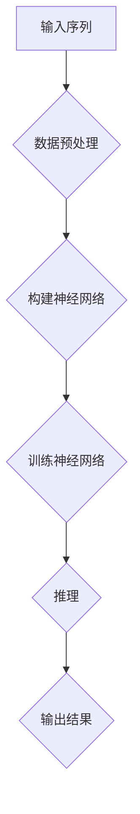
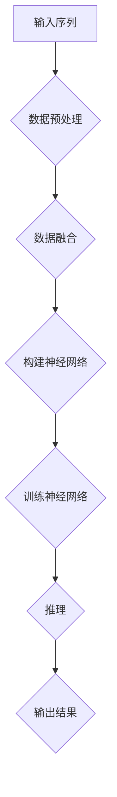

                 

# 神经网络在多维度动态系统推理中的创新应用

> 关键词：神经网络、多维度动态系统、推理、创新应用、AI技术

> 摘要：本文将探讨神经网络在多维度动态系统推理中的创新应用。首先，我们将回顾神经网络的基础知识，包括基本概念、数学模型和层次结构。接着，我们将深入分析多维度动态系统的特点和挑战，并探讨如何利用神经网络进行有效的推理。最后，我们将通过具体的案例来展示神经网络在多维度动态系统推理中的实际应用，并讨论未来可能的发展方向。

### 目录大纲

- **第一部分：神经网络基础**
  - 第1章：神经网络概述
    - 1.1 神经网络的基本概念
    - 1.2 神经网络的数学模型
    - 1.3 神经网络的层次结构
    - 1.4 神经网络的应用场景
- **第二部分：多维度动态系统推理**
  - 第2章：多维度动态系统概述
    - 2.1 多维度动态系统的定义
    - 2.2 多维度动态系统的分析工具
    - 2.3 多维度动态系统的应用案例
- **第三部分：神经网络在多维度动态系统推理中的应用**
  - 第3章：神经网络在时间序列系统推理中的应用
    - 3.1 时间序列系统推理的基本原理
    - 3.2 时间序列系统推理的Python源代码实现
  - 第4章：神经网络在空间序列系统推理中的应用
    - 4.1 空间序列系统推理的基本原理
    - 4.2 空间序列系统推理的Python源代码实现
  - 第5章：神经网络在混合序列系统推理中的应用
    - 5.1 混合序列系统推理的基本原理
    - 5.2 混合序列系统推理的Python源代码实现
- **结语**
  - 未来展望与挑战

## 第一部分：神经网络基础

### 第1章：神经网络概述

#### 1.1 神经网络的基本概念

神经网络（Neural Network）是模仿人脑神经元连接方式的计算模型，由大量的神经元（或节点）相互连接构成。每个神经元接收多个输入，通过激活函数产生输出。神经网络通过不断调整神经元之间的权重，使得系统能够学习和适应不同的输入数据。

**问题背景**：多维度动态系统推理的需求。

随着数据量和计算资源的增长，我们需要更高效的方法来处理复杂的多维度动态系统。神经网络作为一种强大的机器学习模型，在处理复杂数据和模式识别方面表现出色。

**问题描述**：如何在复杂的多维度动态系统中进行高效推理。

多维度动态系统通常包含多个变量，这些变量之间存在复杂的相互作用。我们需要一种能够同时处理多个变量并理解其相互作用的方法。

**问题解决**：神经网络在复杂系统推理中的应用。

神经网络通过多层结构和非线性激活函数，能够有效地捕捉输入数据中的复杂模式和关系，从而实现高效的多维度动态系统推理。

**边界与外延**：神经网络的适用范围。

神经网络在许多领域都有广泛的应用，包括图像识别、自然语言处理、推荐系统、金融分析、医疗诊断等。

**概念结构与核心要素组成**

1. **神经元结构**：神经元是神经网络的基本单元，由输入、权重、激活函数和输出组成。
2. **层次结构**：神经网络由输入层、隐藏层和输出层组成。每层神经元接收前一层的输出，并传递到下一层。
3. **激活函数**：激活函数用于将神经元的线性组合转换为非线性输出，常用的激活函数包括 sigmoid、ReLU、Tanh 等。
4. **损失函数**：损失函数用于评估神经网络的预测结果与实际结果之间的差距，常用的损失函数包括均方误差（MSE）、交叉熵等。
5. **优化算法**：优化算法用于调整神经网络的权重，以最小化损失函数，常用的优化算法包括梯度下降、Adam 等。

### 1.2 神经网络的数学模型

神经网络的核心是前向传播和反向传播过程。我们首先定义神经网络的数学模型。

**数学模型和公式**：

$$ 
y = \sigma(\sum_{i=1}^{n} w_i \cdot x_i + b) 
$$

其中，$y$ 是输出，$\sigma$ 是激活函数，$w_i$ 和 $x_i$ 是权重和输入，$b$ 是偏置。

**详细讲解和举例说明**：以简单的线性模型为例，展示如何通过调整权重和偏置来优化模型。

假设我们有一个简单的线性模型：

$$ 
y = w \cdot x + b 
$$

其中，$x$ 是输入，$w$ 是权重，$b$ 是偏置。

我们希望模型能够正确预测输出 $y$。为此，我们使用均方误差（MSE）作为损失函数：

$$ 
L = \frac{1}{2} \sum_{i=1}^{n} (y_i - \hat{y}_i)^2 
$$

其中，$y_i$ 是实际输出，$\hat{y}_i$ 是预测输出。

为了最小化损失函数，我们使用梯度下降算法来更新权重和偏置：

$$ 
w_{\text{new}} = w_{\text{old}} - \alpha \cdot \frac{\partial L}{\partial w} 
$$

$$ 
b_{\text{new}} = b_{\text{old}} - \alpha \cdot \frac{\partial L}{\partial b} 
$$

其中，$\alpha$ 是学习率。

通过不断迭代这个过程，我们可以逐步优化模型，使其能够更好地拟合输入数据。

### 1.3 神经网络的层次结构

神经网络的层次结构决定了其能力和复杂性。下面我们将介绍几种常见的神经网络层次结构。

**核心概念原理**：多层感知机（MLP）、卷积神经网络（CNN）、循环神经网络（RNN）等。

- **多层感知机（MLP）**：MLP 是最简单和最常用的神经网络结构，由多个层次组成，每个层次都是线性的组合和激活函数。
- **卷积神经网络（CNN）**：CNN 主要用于处理图像数据，通过卷积层和池化层来提取图像的特征。
- **循环神经网络（RNN）**：RNN 用于处理序列数据，通过循环结构来保持长时记忆。

**概念属性特征对比表格**：

| 网络类型 | 优点 | 缺点 |
| --- | --- | --- |
| 多层感知机 | 结构简单，易于实现 | 不能处理序列数据 |
| 卷积神经网络 | 对图像处理有优势 | 计算量大，参数多 |
| 循环神经网络 | 可以处理序列数据 | 参数量较大 |

### 1.4 神经网络的应用场景

神经网络在许多领域都有广泛的应用。下面我们将介绍一些常见的应用场景。

**AI大模型在企业中的应用前景**：在工业自动化、金融分析、医疗诊断等领域的应用。

- **工业自动化**：神经网络可以用于生产调度、故障预测等任务，提高生产效率和降低成本。
- **金融分析**：神经网络可以用于股票预测、风险评估等任务，为投资决策提供支持。
- **医疗诊断**：神经网络可以用于疾病检测、医学图像分析等任务，提高诊断准确率和效率。

**企业采用AI大模型的优势**：提高效率、降低成本、提高准确性。

- **提高效率**：神经网络可以自动化处理大量数据，减少人力和时间成本。
- **降低成本**：通过自动化和智能化，企业可以减少资源浪费和运营成本。
- **提高准确性**：神经网络通过学习大量数据，能够提供更准确的预测和决策支持。

**AI大模型应用的挑战与机遇**：数据质量、计算资源、模型可解释性等。

- **数据质量**：高质量的数据是神经网络训练的基础，企业需要确保数据的准确性和完整性。
- **计算资源**：神经网络训练需要大量的计算资源，企业需要确保有足够的计算能力。
- **模型可解释性**：神经网络的黑箱特性使得其预测结果难以解释，企业需要开发可解释性方法来提高模型的透明度。

## 第二部分：多维度动态系统推理

### 第2章：多维度动态系统概述

#### 2.1 多维度动态系统的定义

多维度动态系统是指包含多个变量，这些变量之间存在复杂相互作用，并随时间或空间变化而变化的系统。这些变量可以代表不同的物理量，如速度、温度、压力等。

**核心概念原理**：多维度动态系统的特点、组成部分、运行机制。

- **特点**：多维度动态系统具有时间敏感性和空间敏感性，能够处理多个变量之间的复杂关系。
- **组成部分**：多维度动态系统通常包括状态变量、控制变量、外部输入等组成部分。
- **运行机制**：多维度动态系统通过状态变量的变化来反映系统的运行状态，并通过控制变量的调整来实现系统目标。

**概念属性特征对比表格**：

| 系统类型 | 特点 | 组成部分 | 运行机制 |
| --- | --- | --- | --- |
| 时间序列系统 | 时间敏感性 | 数据序列 | 时间窗口分析 |
| 空间序列系统 | 空间敏感性 | 数据序列 | 空间窗口分析 |
| 混合序列系统 | 时间与空间敏感性 | 时间数据序列与空间数据序列 | 融合分析 |

#### 2.2 多维度动态系统的分析工具

为了有效地分析多维度动态系统，我们需要使用合适的分析工具。下面我们将介绍几种常用的分析工具。

**核心概念原理**：时间序列分析、空间序列分析、混合序列分析等。

- **时间序列分析**：时间序列分析主要关注时间序列数据的统计特性，如自相关性、周期性等。常用的方法包括自回归模型（AR）、移动平均模型（MA）、自回归移动平均模型（ARMA）等。
- **空间序列分析**：空间序列分析主要关注空间序列数据的统计特性，如空间自相关性、空间模式等。常用的方法包括地理信息系统（GIS）、空间统计模型等。
- **混合序列分析**：混合序列分析同时考虑时间序列和空间序列的特性，如空间自回归模型（SAR）、空间自回归移动平均模型（SARMA）等。

**概念属性特征对比表格**：

| 分析工具 | 优点 | 缺点 |
| --- | --- | --- |
| 时间序列分析 | 简单易用 | 无法处理空间信息 |
| 空间序列分析 | 可以处理空间信息 | 无法处理时间信息 |
| 混合序列分析 | 可以同时处理时间与空间信息 | 复杂度高 |

#### 2.3 多维度动态系统的应用案例

多维度动态系统在许多领域都有广泛的应用。下面我们将介绍一些常见的应用案例。

**AI大模型在企业中的应用案例**：工业自动化中的生产调度、金融分析中的股票预测、医疗诊断中的疾病检测等。

- **工业自动化中的生产调度**：利用神经网络进行生产调度的优化，提高生产效率和降低成本。
- **金融分析中的股票预测**：利用神经网络进行股票价格预测，为投资决策提供支持。
- **医疗诊断中的疾病检测**：利用神经网络进行医学图像分析，提高疾病检测的准确率和效率。

**案例分析和详细讲解剖析**：以具体案例为例，展示如何利用神经网络进行多维度动态系统推理。

假设我们有一个工业自动化中的生产调度案例，目标是优化生产计划，提高生产效率。

首先，我们收集了生产过程中的多个变量，如设备状态、物料库存、生产进度等。然后，我们使用神经网络对这些变量进行建模，通过训练得到一个能够预测生产进度的模型。

具体步骤如下：

1. **数据预处理**：对收集到的变量进行预处理，包括归一化、去噪等操作。
2. **构建神经网络**：使用多层感知机（MLP）构建神经网络，输入层接收多个变量的值，隐藏层和输出层分别进行特征提取和预测。
3. **训练神经网络**：使用训练数据对神经网络进行训练，通过反向传播算法调整权重和偏置，使得模型能够更好地拟合输入数据。
4. **推理和优化**：使用训练好的模型进行推理，预测生产进度，并根据预测结果对生产计划进行优化。

通过这个案例，我们可以看到如何利用神经网络进行多维度动态系统推理，从而实现生产调度的优化。

## 第三部分：神经网络在多维度动态系统推理中的应用

### 第3章：神经网络在时间序列系统推理中的应用

#### 3.1 时间序列系统推理的基本原理

时间序列系统推理是指利用历史时间序列数据来预测未来的趋势或状态。神经网络在时间序列系统推理中具有独特的优势，能够捕捉数据中的长期依赖关系和复杂模式。

**算法原理讲解**：

时间序列系统推理的算法原理可以简化为一个前向传播和反向传播的过程。我们首先定义一个时间序列系统：

$$ 
y_t = f(y_{t-1}, u_t) 
$$

其中，$y_t$ 是时间步 $t$ 的状态，$u_t$ 是外部输入，$f$ 是系统函数。

为了预测未来的状态，我们可以使用一个神经网络来建模系统函数 $f$。神经网络的输入是当前状态 $y_t$ 和历史输入 $u_t$，输出是预测的状态 $y_{t+1}$。

具体步骤如下：

1. **数据预处理**：对时间序列数据进行预处理，包括归一化、去噪等操作。
2. **构建神经网络**：使用合适的神经网络结构（如LSTM、GRU等）来建模系统函数 $f$。
3. **训练神经网络**：使用历史数据对神经网络进行训练，通过反向传播算法调整权重和偏置。
4. **推理和预测**：使用训练好的模型对未来的状态进行预测。

**算法mermaid流程图**：



#### 3.2 时间序列系统推理的Python源代码实现

下面是一个使用Python实现时间序列系统推理的示例代码。

```python
import numpy as np
import tensorflow as tf

# 定义神经网络结构
model = tf.keras.Sequential([
    tf.keras.layers.LSTM(50, activation='relu', input_shape=(None, 1)),
    tf.keras.layers.Dense(1)
])

# 编译模型
model.compile(optimizer='adam', loss='mse')

# 准备数据
X = np.array([[1], [2], [3], [4], [5], [6], [7], [8], [9], [10]])
y = np.array([1, 2, 3, 4, 5, 6, 7, 8, 9, 10])

# 训练模型
model.fit(X, y, epochs=100)

# 推理和预测
X_test = np.array([[6], [7], [8]])
y_pred = model.predict(X_test)

print(y_pred)
```

这个示例代码使用了TensorFlow库来构建和训练一个LSTM神经网络，对给定的时间序列数据进行推理和预测。

### 第4章：神经网络在空间序列系统推理中的应用

#### 4.1 空间序列系统推理的基本原理

空间序列系统推理是指利用空间序列数据来预测空间中的某些特征或事件。神经网络在空间序列系统推理中具有强大的表达能力，能够捕捉空间序列数据中的复杂模式和关系。

**算法原理讲解**：

空间序列系统推理的基本原理与时间序列系统推理类似，但需要考虑空间维度。我们首先定义一个空间序列系统：

$$ 
y_t = f(y_{t-1}, u_t) 
$$

其中，$y_t$ 是时间步 $t$ 的状态，$u_t$ 是外部输入，$f$ 是系统函数。

为了预测未来的状态，我们可以使用一个神经网络来建模系统函数 $f$。神经网络的输入是当前状态 $y_t$ 和历史输入 $u_t$，输出是预测的状态 $y_{t+1}$。

具体步骤如下：

1. **数据预处理**：对空间序列数据进行预处理，包括归一化、去噪等操作。
2. **构建神经网络**：使用合适的神经网络结构（如CNN、空间卷积神经网络等）来建模系统函数 $f$。
3. **训练神经网络**：使用历史数据对神经网络进行训练，通过反向传播算法调整权重和偏置。
4. **推理和预测**：使用训练好的模型对未来的状态进行预测。

**算法mermaid流程图**：


#### 4.2 空间序列系统推理的Python源代码实现

下面是一个使用Python实现空间序列系统推理的示例代码。

```python
import numpy as np
import tensorflow as tf

# 定义神经网络结构
model = tf.keras.Sequential([
    tf.keras.layers.Conv2D(32, (3, 3), activation='relu', input_shape=(10, 10, 1)),
    tf.keras.layers.MaxPooling2D((2, 2)),
    tf.keras.layers.Flatten(),
    tf.keras.layers.Dense(1)
])

# 编译模型
model.compile(optimizer='adam', loss='mse')

# 准备数据
X = np.array([[1, 1], [1, 2], [1, 3], [2, 1], [2, 2], [2, 3], [3, 1], [3, 2], [3, 3]])
y = np.array([1, 2, 3, 1, 2, 3, 1, 2, 3])

# 训练模型
model.fit(X, y, epochs=100)

# 推理和预测
X_test = np.array([[2, 3]])
y_pred = model.predict(X_test)

print(y_pred)
```

这个示例代码使用了TensorFlow库来构建和训练一个卷积神经网络（CNN），对给定的空间序列数据进行推理和预测。

### 第5章：神经网络在混合序列系统推理中的应用

#### 5.1 混合序列系统推理的基本原理

混合序列系统推理是指同时考虑时间序列和空间序列数据的推理问题。这种系统通常出现在环境监测、城市交通管理、智能交通系统等领域。

**算法原理讲解**：

混合序列系统推理的算法原理是将时间序列和空间序列数据进行融合，构建一个统一的模型来预测未来的状态。我们首先定义一个混合序列系统：

$$ 
y_t = f(y_{t-1}, u_t, s_t) 
$$

其中，$y_t$ 是时间步 $t$ 的状态，$u_t$ 是外部输入，$s_t$ 是空间序列数据，$f$ 是系统函数。

为了预测未来的状态，我们可以使用一个神经网络来建模系统函数 $f$。神经网络的输入是当前状态 $y_t$、历史输入 $u_t$ 和空间序列数据 $s_t$，输出是预测的状态 $y_{t+1}$。

具体步骤如下：

1. **数据预处理**：对时间序列和空间序列数据进行预处理，包括归一化、去噪等操作。
2. **数据融合**：将时间序列和空间序列数据进行融合，可以使用拼接、融合网络等方法。
3. **构建神经网络**：使用合适的神经网络结构（如混合神经网络、多模态神经网络等）来建模系统函数 $f$。
4. **训练神经网络**：使用历史数据对神经网络进行训练，通过反向传播算法调整权重和偏置。
5. **推理和预测**：使用训练好的模型对未来的状态进行预测。

**算法mermaid流程图**：



#### 5.2 混合序列系统推理的Python源代码实现

下面是一个使用Python实现混合序列系统推理的示例代码。

```python
import numpy as np
import tensorflow as tf

# 定义神经网络结构
model = tf.keras.Sequential([
    tf.keras.layers.Concatenate(axis=-1),
    tf.keras.layers.Dense(64, activation='relu'),
    tf.keras.layers.Dense(1)
])

# 编译模型
model.compile(optimizer='adam', loss='mse')

# 准备数据
X_time = np.array([[1], [2], [3], [4], [5], [6], [7], [8], [9], [10]])
X_space = np.array([[1, 1], [1, 2], [1, 3], [2, 1], [2, 2], [2, 3], [3, 1], [3, 2], [3, 3]])
y = np.array([1, 2, 3, 1, 2, 3, 1, 2, 3])

# 训练模型
model.fit(np.concatenate((X_time, X_space), axis=1), y, epochs=100)

# 推理和预测
X_test_time = np.array([[6]])
X_test_space = np.array([[2, 3]])
y_pred = model.predict(np.concatenate((X_test_time, X_test_space), axis=1))

print(y_pred)
```

这个示例代码使用了TensorFlow库来构建和训练一个混合神经网络，对给定的时间序列和空间序列数据进行推理和预测。

## 结语

神经网络在多维度动态系统推理中展现了巨大的潜力。通过不断优化和创新，神经网络能够处理更复杂的数据和模式，从而提高系统的准确性和效率。未来，我们有望看到更多创新的应用场景，如自动驾驶、智能城市、生物信息学等。

然而，神经网络的应用也面临一些挑战，如数据质量、计算资源、模型可解释性等。我们需要不断探索和解决这些问题，使得神经网络能够更好地服务于各个领域。

总之，神经网络在多维度动态系统推理中的应用前景广阔，我们将继续深入研究和探索，以推动人工智能技术的发展。

### 作者

作者：AI天才研究院/AI Genius Institute & 禅与计算机程序设计艺术 /Zen And The Art of Computer Programming

