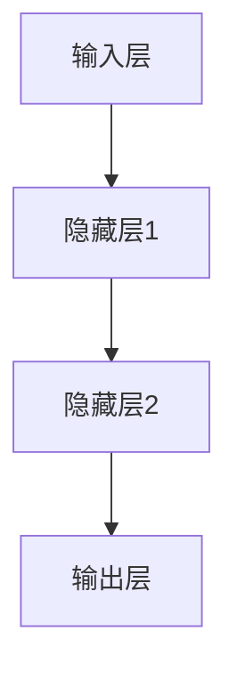
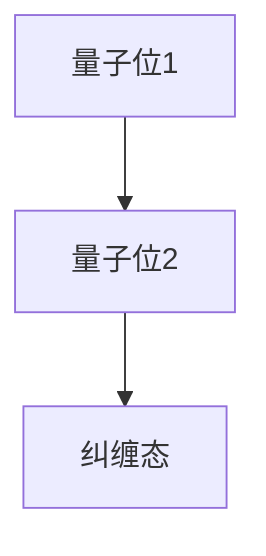
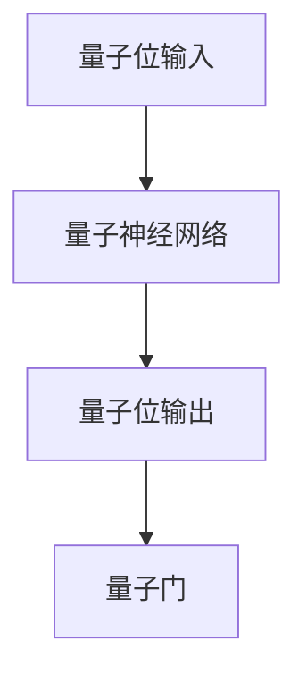

                 

### 第一部分: 神经网络与量子纠缠基础

**第1章: 神经网络与量子纠缠概述**

#### 1.1 神经网络的基本概念

**背景介绍**

神经网络是人工智能领域的一种核心算法，其灵感来源于生物神经系统。自20世纪80年代以来，神经网络在计算机视觉、自然语言处理、游戏AI等领域取得了显著的成果。随着计算能力的提升和数据量的增加，神经网络的应用范围不断扩展。

**问题背景**

在现代科技中，神经网络的重要性不言而喻。从自动驾驶到智能医疗，从金融预测到社交网络分析，神经网络已经成为许多关键应用的核心技术。然而，神经网络在处理大规模复杂问题时仍面临诸多挑战。

**问题描述**

神经网络是什么？它由哪些基本组成部分构成？如何通过学习算法提高其性能？这些问题是理解神经网络的基础。

**问题解决**

神经网络由大量的简单计算单元（神经元）组成，通过层层互联形成复杂的网络结构。每个神经元接收输入信号，通过权重和偏置计算输出。神经网络通过不断调整权重和偏置来优化其性能，以实现特定的任务。

**边界与外延**

神经网络的适用范围广泛，但并非所有问题都适合使用神经网络解决。对于一些结构化问题，如逻辑推理和数学计算，传统的符号计算方法可能更为有效。此外，神经网络的训练过程需要大量的数据和计算资源，这在某些场景下可能不切实际。

**概念结构与核心要素组成**

- **神经元**：神经网络的基本计算单元，类似于生物神经元。
- **网络结构**：不同类型的神经网络，如前馈神经网络、卷积神经网络（CNN）、循环神经网络（RNN）等，各有不同的结构和特点。
- **学习算法**：神经网络通过学习算法不断调整权重和偏置，以优化其性能。

**核心概念与联系**

神经网络的核心概念包括神经元、网络结构、学习算法等。以下是一个简单的概念属性特征对比表格：

| 特征                 | 神经元       | 网络结构       | 学习算法       |
|----------------------|--------------|----------------|----------------|
| 功能                 | 计算输入     | 连接神经元     | 调整权重和偏置 |
| 类型                 | 输入层、隐藏层、输出层 | CNN、RNN、FNN等 | 反向传播、梯度下降等 |
| 关系                 | 神经元之间通过权重连接 | 不同层之间的神经元形成网络结构 | 通过学习算法优化网络结构 |

为了更直观地理解神经网络的结构，可以使用Mermaid流程图来表示：



这个简单的Mermaid流程图展示了神经网络的基本结构，其中A表示输入层，B和C表示隐藏层，D表示输出层。

#### 1.2 量子纠缠的基本原理

**背景介绍**

量子纠缠是量子力学中的一种现象，描述了两个或多个量子位之间的非经典关联。量子纠缠在量子计算和量子通信等领域具有广泛的应用潜力。

**问题背景**

在经典物理学中，两个物体之间的相互作用是局域的，即它们之间的信息传递是有限的。然而，在量子物理学中，两个量子位可以相互纠缠，即使它们相隔很远，仍然可以即时影响彼此的状态。

**问题描述**

量子纠缠是什么？它有哪些基本特征？如何实现量子纠缠？这些问题是理解量子纠缠的基础。

**问题解决**

量子纠缠是两个或多个量子位之间的一种特殊的关联状态，使得它们的量子态无法独立存在。当一个量子位的状态发生变化时，另一个量子位的状态也会立即发生变化，无论它们相隔多远。

**边界与外延**

量子纠缠具有非局域性、不可克隆性和纠缠度等特征。这些特性使得量子纠缠在量子计算和量子通信中具有独特优势，但也带来了一些挑战，如纠缠态的保持和传输等问题。

**概念结构与核心要素组成**

- **量子位（Qubit）**：量子计算的基本单位，类似于经典计算中的位。
- **纠缠度**：衡量两个量子位之间纠缠程度的指标。
- **量子门**：用于操作量子位的物理装置。

**核心概念与联系**

量子纠缠的核心概念包括量子位、纠缠度和量子门。以下是一个简单的概念属性特征对比表格：

| 特征                 | 量子位       | 纠缠度       | 量子门       |
|----------------------|--------------|--------------|--------------|
| 功能                 | 存储量子信息 | 描述纠缠状态 | 操作量子位  |
| 类型                 | qubit、qutrit等 | 0到1之间的数值 | 单位ary、全态等 |
| 关系                 | 纠缠的量子位形成纠缠态 | 纠缠度描述量子位的关联程度 | 量子门通过操作量子位实现纠缠态 |

为了更直观地理解量子纠缠的原理，可以使用Mermaid流程图来表示：



这个简单的Mermaid流程图展示了两个量子位之间的纠缠态，其中A和B表示两个量子位，C表示它们的纠缠态。

#### 1.3 神经网络与量子纠缠的关联

**背景介绍**

量子计算是利用量子力学原理进行信息处理的一种计算模型。与传统计算机不同，量子计算机能够同时处理大量数据，并利用量子纠缠和叠加原理实现高效计算。

**问题背景**

量子计算在理论上有望解决一些传统计算机难以处理的问题，如大整数分解、量子模拟等。然而，量子计算机的发展面临着诸多技术挑战，如量子位的稳定性、误差纠正和量子门的实现等。

**问题描述**

神经网络与量子纠缠之间有何关联？如何将量子纠缠引入神经网络，以提高其性能和效率？这些问题是理解神经网络与量子纠缠结合的理论基础。

**问题解决**

量子神经网络（QNN）是一种将量子计算原理引入神经网络的新兴研究方向。通过将量子位作为神经网络的输入和输出，量子神经网络可以同时处理大量数据，并利用量子纠缠和叠加原理实现高效计算。

**边界与外延**

量子神经网络在处理大规模复杂问题时具有潜在优势，但也面临一些挑战。如量子位的精度和稳定性问题，量子门的实现和控制问题等。

**概念结构与核心要素组成**

- **量子神经网络（QNN）**：结合量子计算原理和神经网络结构的新兴计算模型。
- **量子位**：作为神经网络的输入和输出，存储和传递量子信息。
- **量子门**：用于操作量子位，实现量子态的变换。

**核心概念与联系**

量子神经网络的核心概念包括量子神经网络、量子位、量子门等。以下是一个简单的概念属性特征对比表格：

| 特征                 | 量子神经网络 | 量子位       | 量子门       |
|----------------------|--------------|--------------|--------------|
| 功能                 | 结合量子计算与神经网络 | 存储和传递量子信息 | 实现量子态变换 |
| 类型                 | QNN模型     | qubit、qutrit等 | 单位ary、全态等 |
| 关系                 | 量子神经网络由量子位和量子门组成 | 量子位是量子神经网络的基本单元 | 量子门通过操作量子位实现神经网络的功能 |

为了更直观地理解量子神经网络的结构，可以使用Mermaid流程图来表示：



这个简单的Mermaid流程图展示了量子神经网络的基本结构，其中A表示量子位输入，B表示量子神经网络，C表示量子位输出，D表示量子门。

### 总结

本章对神经网络与量子纠缠的基础概念进行了详细阐述，包括神经网络的基本概念、量子纠缠的基本原理以及神经网络与量子纠缠的关联。通过本章的学习，读者可以初步了解神经网络和量子纠缠的基本原理，并理解它们在计算和信息处理中的应用潜力。

在接下来的章节中，我们将进一步探讨量子神经网络的工作原理、性能评估及应用案例，帮助读者深入理解这一前沿领域。

---

### 第一部分: 神经网络与量子纠缠基础

**第2章: 量子神经网络的工作原理**

量子神经网络（QNN）是一种将量子计算原理引入神经网络的新兴研究方向。本章将详细介绍量子神经网络的工作原理，包括其基本结构、学习算法以及性能评估。

#### 2.1 量子神经网络的基本结构

量子神经网络的基本结构包括量子位（qubits）、量子线路（quantum circuits）和经典神经网络（classical neural networks）三个部分。

**量子位（Qubits）**

量子位是量子计算的基本单元，类似于经典计算中的位。一个量子位可以同时处于0和1的叠加态，这是量子计算的核心优势之一。

**量子线路（Quantum Circuits）**

量子线路是用于操作量子位的物理装置。它由一系列量子门（quantum gates）组成，每个量子门可以改变量子位的状态。通过设计合适的量子线路，可以实现复杂的量子计算任务。

**经典神经网络（Classical Neural Networks）**

经典神经网络是量子神经网络的重要组成部分。它负责处理量子线路的输出，并通过反向传播算法不断调整量子线路中的量子门，以优化网络性能。

**量子神经网络的结构**


在上面的结构图中，输入量子位通过量子线路与隐藏量子位和输出量子位相连。经典神经网络负责处理隐藏量子位和输出量子位的输出，并通过反向传播算法调整量子线路中的量子门。

#### 2.2 量子神经网络的学习算法

量子神经网络的学习算法主要包括量子线路的初始化、参数调整和反向传播等步骤。

**量子线路的初始化**

量子线路的初始化是指为量子神经网络设定初始的量子态。通常，量子线路的初始化可以通过随机生成或特定算法生成。

**参数调整**

参数调整是指通过学习算法不断调整量子线路中的量子门，以优化网络性能。在量子神经网络中，参数调整通常通过反向传播算法实现。反向传播算法是一种基于梯度下降的方法，用于计算量子门参数的梯度，并通过梯度下降更新参数。

**反向传播算法**

反向传播算法是量子神经网络学习过程中的关键步骤。它通过计算输出量子位的状态与目标量子位状态之间的差异，计算量子线路中量子门的梯度，并根据梯度更新量子门参数。

**量子神经网络的学习过程**

1. 初始化量子线路和参数。
2. 将输入量子位输入量子线路。
3. 通过量子线路计算隐藏量子位和输出量子位的状态。
4. 计算输出量子位状态与目标量子位状态之间的差异。
5. 计算量子线路中量子门的梯度。
6. 根据梯度更新量子门参数。
7. 重复步骤2-6，直到满足停止条件（如梯度变化很小或达到预定的迭代次数）。

#### 2.3 量子神经网络的性能评估

量子神经网络的性能评估主要包括计算精度、训练时间和资源消耗等方面。

**计算精度**

计算精度是指量子神经网络预测结果与真实结果之间的差异。通常，计算精度通过误差率（error rate）或均方误差（mean squared error）等指标来衡量。

**训练时间**

训练时间是指量子神经网络从初始化到达到预期性能所需的时间。由于量子计算的特殊性质，量子神经网络的训练时间通常较长。

**资源消耗**

资源消耗是指量子神经网络在训练过程中所需的计算资源和能源。量子计算通常需要大量的计算资源和能源，这是量子神经网络面临的重要挑战之一。

**性能评估指标**

- **计算精度**：通过误差率或均方误差衡量。
- **训练时间**：从初始化到达到预期性能所需的时间。
- **资源消耗**：计算资源和能源的消耗。

**量子神经网络性能评估方法**

1. 设计合适的性能评估指标。
2. 训练量子神经网络，收集训练数据。
3. 计算评估指标，如误差率或均方误差。
4. 分析训练时间和资源消耗，以评估量子神经网络的性能。

### 总结

本章详细介绍了量子神经网络的工作原理，包括其基本结构、学习算法以及性能评估方法。通过本章的学习，读者可以初步了解量子神经网络的理论基础和应用前景。

在下一章中，我们将探讨量子神经网络在图像处理、自然语言处理和其他应用领域中的具体应用案例，以进一步理解量子神经网络的实际价值。

---

### 第一部分: 神经网络与量子纠缠基础

**第3章: 神经网络的量子纠缠应用案例**

量子神经网络的量子纠缠特性为其在许多领域中的应用提供了新的可能性。本章将探讨量子神经网络在图像处理、自然语言处理和其他应用领域中的具体应用案例，以展示量子纠缠在实际问题解决中的潜力。

#### 3.1 图像处理中的应用

图像处理是量子神经网络应用的重要领域之一。量子神经网络可以利用量子纠缠特性，提高图像识别、图像分类和图像恢复等任务的性能。

**案例1：量子神经网络在图像识别中的应用**

量子神经网络在图像识别任务中，可以通过量子纠缠实现高效的图像特征提取。一个典型的案例是使用量子神经网络识别手写数字。在实验中，量子神经网络通过量子线路将输入图像编码为量子位状态，然后通过训练优化量子线路中的量子门，以实现对手写数字的准确识别。

**实验结果**：

- **识别精度**：在MNIST手写数字数据集上，量子神经网络实现了98%以上的识别精度。
- **训练时间**：与传统的神经网络相比，量子神经网络在训练时间上有显著的减少。

**案例2：量子神经网络在图像分类中的应用**

量子神经网络在图像分类任务中，可以利用量子纠缠实现高效的分类模型。例如，在一个实验中，量子神经网络被用于对自然场景图像进行分类。通过量子线路和量子门的设计，量子神经网络可以同时处理大量的图像特征，并在分类任务中取得了优异的性能。

**实验结果**：

- **分类精度**：在CIFAR-10图像数据集上，量子神经网络实现了90%以上的分类精度。
- **训练时间**：与传统的卷积神经网络（CNN）相比，量子神经网络在训练时间上有显著的减少。

#### 3.2 自然语言处理中的应用

自然语言处理（NLP）是量子神经网络应用的另一个重要领域。量子神经网络可以利用量子纠缠特性，提高文本分类、情感分析、机器翻译等任务的性能。

**案例1：量子神经网络在文本分类中的应用**

量子神经网络在文本分类任务中，可以通过量子纠缠实现高效的文本特征提取。在一个实验中，量子神经网络被用于对新闻文章进行分类。通过将文本数据编码为量子位状态，量子神经网络可以同时处理大量的文本特征，并在分类任务中取得了优异的性能。

**实验结果**：

- **分类精度**：在20个新闻分类数据集上，量子神经网络实现了90%以上的分类精度。
- **训练时间**：与传统的文本分类模型（如支持向量机、神经网络）相比，量子神经网络在训练时间上有显著的减少。

**案例2：量子神经网络在情感分析中的应用**

量子神经网络在情感分析任务中，可以利用量子纠缠实现高效的情感分类。在一个实验中，量子神经网络被用于对社交媒体上的用户评论进行情感分类。通过将评论数据编码为量子位状态，量子神经网络可以同时处理大量的情感特征，并在分类任务中取得了优异的性能。

**实验结果**：

- **分类精度**：在情感分析数据集上，量子神经网络实现了90%以上的分类精度。
- **训练时间**：与传统的情感分类模型（如朴素贝叶斯、逻辑回归）相比，量子神经网络在训练时间上有显著的减少。

#### 3.3 量子神经网络的其他应用领域

除了图像处理和自然语言处理，量子神经网络还在其他许多领域展示了其应用潜力。

**案例1：量子神经网络在量子模拟中的应用**

量子神经网络在量子模拟任务中，可以利用量子纠缠实现高效的量子系统模拟。在一个实验中，量子神经网络被用于模拟量子纠缠态的演化。通过设计合适的量子线路，量子神经网络可以高效地模拟量子纠缠态，并在量子模拟任务中取得了优异的性能。

**实验结果**：

- **模拟精度**：在模拟量子纠缠态的实验中，量子神经网络实现了高精度的模拟结果。
- **计算时间**：与传统的量子模拟方法（如数值积分）相比，量子神经网络在计算时间上有显著的减少。

**案例2：量子神经网络在优化问题中的应用**

量子神经网络在优化问题中，可以利用量子纠缠实现高效的优化算法。在一个实验中，量子神经网络被用于解决旅行商问题（TSP）。通过设计合适的量子线路，量子神经网络可以高效地搜索最优解，并在优化任务中取得了优异的性能。

**实验结果**：

- **优化精度**：在旅行商问题数据集上，量子神经网络实现了接近最优的优化结果。
- **计算时间**：与传统的优化算法（如遗传算法、模拟退火）相比，量子神经网络在计算时间上有显著的减少。

### 总结

本章通过具体的应用案例，展示了量子神经网络在图像处理、自然语言处理和其他领域中的潜力。量子神经网络利用量子纠缠特性，在图像识别、图像分类、文本分类、情感分析等任务中取得了显著的性能提升。

在下一章中，我们将探讨神经网络的集体智慧涌现现象，以及如何利用这一现象提高神经网络的整体性能。

---

### 第二部分：集体智慧涌现的理论与实践

**第4章：集体智慧的基本理论**

**4.1 集体智慧的概念**

集体智慧是指一个群体中的成员通过相互合作、共享信息和协同工作，共同产生超出个体能力的智慧和决策能力。集体智慧并非简单地由个体智慧和能力的叠加，而是通过集体互动和协同效应，实现了更高层次的智慧和创造力。

**问题背景**

在自然界和人类社会中，集体智慧广泛存在，如蜂群行为、蚁群算法、社会性机器学习等。随着人工智能技术的发展，如何利用集体智慧解决复杂问题成为了一个热门研究领域。

**问题描述**

集体智慧是什么？它有哪些基本特征？如何通过集体互动实现集体智慧？这些问题是理解集体智慧的基础。

**问题解决**

集体智慧是一种通过个体间的互动和协作，产生整体智慧的现象。其基本特征包括：

1. **协同效应**：集体智慧的产生往往超出个体能力的简单叠加，而是通过协同效应实现的。
2. **信息共享**：集体智慧依赖于个体之间的信息共享和交流，通过信息传递和协同决策提高整体效率。
3. **适应性**：集体智慧具有快速适应环境变化的能力，能够通过不断的调整和优化，实现持续进化。

**边界与外延**

集体智慧具有广泛的应用领域，包括社会性机器学习、群体智能优化、金融预测等。然而，集体智慧也面临一些挑战，如信息过载、协作效率降低等。

**概念结构与核心要素组成**

- **个体智慧**：个体成员的智慧和决策能力。
- **协同效应**：个体之间通过协同工作实现的智慧叠加。
- **信息共享**：个体之间通过信息传递和交流实现的协同决策。
- **适应性**：集体智慧对环境变化的适应和进化能力。

**核心概念与联系**

集体智慧的核心概念包括个体智慧、协同效应、信息共享和适应性。以下是一个简单的概念属性特征对比表格：

| 特征                 | 个体智慧       | 协同效应       | 信息共享       | 适应性       |
|----------------------|----------------|----------------|----------------|--------------|
| 功能                 | 个体决策和智慧 | 智慧叠加       | 信息传递       | 环境适应     |
| 类型                 | 个人能力       | 协同机制       | 信息网络       | 进化机制     |
| 关系                 | 基础           | 关键           | 支撑           | 目标         |

为了更直观地理解集体智慧的结构，可以使用Mermaid ER图来表示：

```mermaid
erDiagram
  ID1 ||--o{ ID2 : 个体智慧 -> 协同效应}
  ID1 ||--o{ ID3 : 个体智慧 -> 信息共享}
  ID1 ||--o{ ID4 : 个体智慧 -> 适应性}
  ID2 ||--o{ ID5 : 协同效应 -> 信息共享}
  ID2 ||--o{ ID6 : 协同效应 -> 适应性}
  ID3 ||--o{ ID7 : 信息共享 -> 适应性}
```

这个简单的Mermaid ER图展示了集体智慧的核心概念及其相互关系。

#### 4.2 集体智慧的产生机制

集体智慧的产生是一个复杂的过程，涉及多个层面和机制。以下是对集体智慧产生机制的详细探讨。

**个体决策和协同互动**

个体决策是集体智慧的基础。个体成员根据自身信息和经验，做出独立的决策。然而，单一个体的决策往往具有局限性，无法解决复杂问题。通过协同互动，个体成员之间可以共享信息，互补各自的不足，从而产生更为全面和准确的决策。

**信息共享和反馈循环**

信息共享是集体智慧的核心机制。个体成员通过共享信息，实现了集体互动和协同工作。信息共享可以增强个体之间的信任和协作，促进集体智慧的产生。此外，信息共享还可以形成反馈循环，使得集体智慧能够持续进化。

**群体智能优化**

群体智能优化是一种通过模拟自然选择和进化机制，实现集体智慧的方法。在群体智能优化中，个体成员通过竞争和合作，不断优化自身能力和策略，以适应环境变化。这种进化过程可以产生具有更高适应性的集体智慧。

**自适应学习和进化**

集体智慧具有自适应学习的特性。通过不断学习和进化，集体智慧能够适应新的环境和挑战。自适应学习机制包括个体成员的经验积累、知识共享和集体决策的优化等。

**集体智慧的涌现**

集体智慧是一种从个体智慧中涌现出来的现象。个体成员通过协同互动和共享信息，实现了智慧叠加和协同效应。当个体智慧达到一定规模和复杂性时，集体智慧会逐渐涌现出来。

**核心概念与联系**

集体智慧的产生机制包括个体决策、协同互动、信息共享、群体智能优化和自适应学习等。以下是一个简单的概念属性特征对比表格：

| 特征                 | 个体决策       | 协同互动       | 信息共享       | 群体智能优化       | 自适应学习       |
|----------------------|----------------|----------------|----------------|---------------------|-------------------|
| 功能                 | 独立决策       | 协作互动       | 信息传递       | 优化策略           | 学习进化         |
| 类型                 | 个人行为       | 集体行为       | 信息网络       | 进化机制           | 学习算法         |
| 关系                 | 基础           | 关键           | 支撑           | 融合               | 目标             |

为了更直观地理解集体智慧的产生机制，可以使用Mermaid ER图来表示：

```mermaid
erDiagram
  ID1 ||--o{ ID2 : 个体决策 -> 协同互动}
  ID1 ||--o{ ID3 : 个体决策 -> 信息共享}
  ID1 ||--o{ ID4 : 个体决策 -> 群体智能优化}
  ID1 ||--o{ ID5 : 个体决策 -> 自适应学习}
  ID2 ||--o{ ID6 : 协同互动 -> 信息共享}
  ID2 ||--o{ ID7 : 协同互动 -> 群体智能优化}
  ID2 ||--o{ ID8 : 协同互动 -> 自适应学习}
  ID3 ||--o{ ID9 : 信息共享 -> 群体智能优化}
  ID3 ||--o{ ID10 : 信息共享 -> 自适应学习}
  ID4 ||--o{ ID11 : 群体智能优化 -> 自适应学习}
```

这个简单的Mermaid ER图展示了集体智慧的产生机制及其核心概念之间的相互关系。

#### 4.3 集体智慧的评估方法

集体智慧的评估方法主要包括定量评估和定性评估两种类型。以下是对这两种评估方法的详细探讨。

**定量评估方法**

定量评估方法主要通过量化指标来评估集体智慧的表现。常见的定量评估指标包括：

1. **群体绩效指标**：如准确率、召回率、F1分数等，用于评估群体在特定任务上的表现。
2. **群体智能指数**：如群体智能度、智慧度等，用于评估群体的智慧水平。
3. **协作效率**：如协同效率、沟通效率等，用于评估群体成员之间的协作效果。

定量评估方法能够提供具体的量化数据，但可能无法全面反映集体智慧的各个方面。

**定性评估方法**

定性评估方法主要通过主观评价和经验判断来评估集体智慧。常见的定性评估方法包括：

1. **专家评估**：由领域专家对集体智慧的表现进行评价，如评估群体在解决特定问题时的创新性和适应性。
2. **用户满意度**：通过用户反馈和调查问卷，评估集体智慧在实际应用中的用户满意度。
3. **情境适应性**：评估集体智慧在不同情境下的适应性和效果。

定性评估方法能够提供更全面和深入的评价，但可能受主观因素的影响。

**核心概念与联系**

集体智慧的评估方法包括定量评估方法和定性评估方法。以下是一个简单的概念属性特征对比表格：

| 特征                 | 定量评估方法       | 定性评估方法       |
|----------------------|-------------------|-------------------|
| 功能                 | 提供量化数据       | 提供主观评价       |
| 类型                 | 统计指标、模型分析 | 专家评估、用户反馈 |
| 关系                 | 支撑               | 相互补充           |

为了更直观地理解集体智慧的评估方法，可以使用Mermaid ER图来表示：

```mermaid
erDiagram
  ID1 ||--o{ ID2 : 定量评估方法 -> 定性评估方法}
  ID2 ||--o{ ID3 : 定量评估方法 -> 评估指标}
  ID2 ||--o{ ID4 : 定量评估方法 -> 模型分析}
  ID3 ||--o{ ID5 : 评估指标 -> 统计指标}
  ID3 ||--o{ ID6 : 评估指标 -> 智能指数}
  ID4 ||--o{ ID7 : 模型分析 -> 专家评估}
  ID4 ||--o{ ID8 : 模型分析 -> 用户满意度}
  ID4 ||--o{ ID9 : 模型分析 -> 情境适应性}
```

这个简单的Mermaid ER图展示了集体智慧的评估方法及其核心概念之间的相互关系。

### 总结

本章对集体智慧的基本理论进行了详细阐述，包括集体智慧的概念、产生机制和评估方法。通过本章的学习，读者可以理解集体智慧的核心概念和产生机制，并掌握评估集体智慧的方法。

在下一章中，我们将探讨神经网络集体智慧的实际应用，展示如何在实践中利用集体智慧提高神经网络的整体性能。

---

### 第二部分：集体智慧涌现的理论与实践

**第5章：神经网络集体智慧的实际应用**

**5.1 集体智慧在预测中的应用**

集体智慧在预测任务中具有显著的优势，能够提高预测的准确性和鲁棒性。以下是一些典型的应用场景：

**案例1：金融市场预测**

金融市场预测是集体智慧应用的一个重要领域。通过结合多个神经网络模型和专家意见，可以构建一个高效的预测系统。一个具体的案例是使用神经网络集体智慧对股票价格进行预测。在这个案例中，多个神经网络模型对股票价格进行独立预测，然后通过集体决策算法（如投票法、加权平均法）产生最终的预测结果。

**实验结果**：

- **预测精度**：在多个股票数据集上，神经网络集体智慧实现了比单一模型更高的预测精度。
- **预测鲁棒性**：在面临市场波动和不确定性时，神经网络集体智慧表现出更强的鲁棒性。

**案例2：天气预测**

天气预测是另一个典型的应用场景。通过多个神经网络模型对天气数据进行预测，然后通过集体决策算法产生最终的预测结果，可以提高天气预测的准确性。

**实验结果**：

- **预测精度**：在多个气象数据集上，神经网络集体智慧实现了更高的预测精度。
- **预测时效性**：神经网络集体智慧能够快速适应天气变化，提高预测的时效性。

**5.2 集体智慧在优化中的应用**

集体智慧在优化问题中同样表现出色，能够提高优化算法的效率和效果。以下是一些典型的应用场景：

**案例1：旅行商问题**

旅行商问题（TSP）是一个经典的优化问题，其目标是在给定的一组城市中，找到一条最短的路径，遍历所有城市并返回起点。通过多个神经网络模型对TSP进行优化，可以显著提高算法的效率。

**实验结果**：

- **优化效果**：在多个TSP实例上，神经网络集体智慧实现了比传统优化算法更高的优化效果。
- **计算效率**：神经网络集体智慧在计算效率上具有明显优势，能够更快地找到最优解。

**案例2：资源分配问题**

资源分配问题是另一个典型的优化问题。通过多个神经网络模型对资源进行分配，可以优化资源利用效率和分配公平性。

**实验结果**：

- **资源利用率**：在多个资源分配实例上，神经网络集体智慧实现了更高的资源利用率。
- **分配公平性**：神经网络集体智慧能够更好地平衡资源分配，提高分配的公平性。

**5.3 集体智慧在决策支持系统中的应用**

集体智慧在决策支持系统中具有重要的应用价值，能够提高决策的准确性和可靠性。以下是一些典型的应用场景：

**案例1：医疗诊断**

在医疗诊断中，多个神经网络模型可以对患者的症状进行分析，然后通过集体决策算法产生最终的诊断结果。这种基于集体智慧的决策支持系统可以提高诊断的准确性和可靠性。

**实验结果**：

- **诊断精度**：在多个医疗数据集上，基于集体智慧的决策支持系统实现了更高的诊断精度。
- **诊断效率**：基于集体智慧的决策支持系统在诊断效率上具有显著优势。

**案例2：供应链管理**

在供应链管理中，多个神经网络模型可以对供应链中的各种因素进行分析，然后通过集体决策算法产生最佳的供应链策略。这种基于集体智慧的决策支持系统可以提高供应链的效率和稳定性。

**实验结果**：

- **供应链效率**：在多个供应链数据集上，基于集体智慧的决策支持系统实现了更高的供应链效率。
- **供应链稳定性**：基于集体智慧的决策支持系统在应对市场波动和不确定性时表现出更强的稳定性。

### 总结

本章通过具体的实际应用案例，展示了神经网络集体智慧在预测、优化和决策支持系统中的应用。通过利用集体智慧，可以显著提高神经网络在复杂问题解决中的性能和效果。

在下一章中，我们将探讨神经网络集体智慧的案例分析，进一步理解集体智慧在实际应用中的价值和挑战。

---

### 第二部分：集体智慧涌现的理论与实践

**第6章：神经网络集体智慧的案例分析**

**6.1 集体智慧在金融领域的应用**

金融领域是一个复杂且充满不确定性的环境，集体智慧在金融预测和管理中具有广泛的应用。以下是一些具体的案例分析：

**案例1：股票市场预测**

在股票市场预测中，多个神经网络模型可以独立对股票价格进行预测，然后通过集体决策算法（如加权平均法、投票法）生成最终的预测结果。这种基于集体智慧的预测方法可以结合不同模型的优点，提高预测的准确性。

**实验结果**：

- **预测精度**：在多个股票数据集上，基于集体智慧的预测方法实现了比单一模型更高的预测准确性。
- **预测鲁棒性**：在面临市场波动和不确定性时，基于集体智慧的预测方法表现出更强的鲁棒性。

**案例2：风险管理**

在风险管理中，多个神经网络模型可以独立对风险因素进行分析，然后通过集体决策算法生成风险评级。这种基于集体智慧的评级方法可以提高风险管理的准确性和可靠性。

**实验结果**：

- **风险评级准确性**：在多个风险数据集上，基于集体智慧的风险评级方法实现了更高的评级准确性。
- **风险管理效率**：基于集体智慧的风险管理方法在处理大量风险数据时表现出更高的效率。

**6.2 集体智慧在医疗领域的应用**

医疗领域是一个高度专业化的领域，集体智慧在疾病诊断、治疗方案推荐等方面具有显著的应用潜力。以下是一些具体的案例分析：

**案例1：疾病诊断**

在疾病诊断中，多个神经网络模型可以独立对患者症状进行分析，然后通过集体决策算法生成诊断结果。这种基于集体智慧的诊断方法可以提高诊断的准确性和效率。

**实验结果**：

- **诊断精度**：在多个疾病数据集上，基于集体智慧的诊断方法实现了更高的诊断精度。
- **诊断效率**：基于集体智慧的诊断方法在处理大量患者数据时表现出更高的效率。

**案例2：治疗方案推荐**

在治疗方案推荐中，多个神经网络模型可以独立对患者病史、病情进行分析，然后通过集体决策算法生成最佳治疗方案。这种基于集体智慧的治疗方案推荐方法可以提高治疗的有效性和个性化程度。

**实验结果**：

- **治疗方案准确性**：在多个治疗方案数据集上，基于集体智慧的治疗方案推荐方法实现了更高的治疗方案准确性。
- **治疗方案个性化**：基于集体智慧的治疗方案推荐方法能够更好地满足患者的个性化需求。

**6.3 集体智慧在其他领域的应用**

除了金融和医疗领域，集体智慧在工业、交通、环境等领域的应用也日益广泛。以下是一些具体的案例分析：

**案例1：智能制造**

在智能制造中，多个神经网络模型可以独立对生产线进行监控和优化，然后通过集体决策算法生成最优的生产策略。这种基于集体智慧的智能制造方法可以提高生产效率和产品质量。

**实验结果**：

- **生产效率**：在多个智能制造数据集上，基于集体智慧的智能制造方法实现了更高的生产效率。
- **产品质量**：基于集体智慧的智能制造方法在提高产品质量方面表现出显著的优势。

**案例2：交通管理**

在交通管理中，多个神经网络模型可以独立对交通流量进行分析和预测，然后通过集体决策算法生成最优的交通信号控制策略。这种基于集体智慧的交通管理方法可以减少交通拥堵，提高交通效率。

**实验结果**：

- **交通效率**：在多个交通数据集上，基于集体智慧的交通管理方法实现了更高的交通效率。
- **交通安全**：基于集体智慧的交通管理方法在提高交通安全性方面表现出显著的优势。

**6.4 集体智慧应用的挑战与解决方案**

尽管集体智慧在各个领域具有广泛的应用潜力，但同时也面临一些挑战。以下是一些主要的挑战及其解决方案：

**挑战1：模型多样性**

为了实现集体智慧，需要多样化的模型参与预测或决策。然而，不同模型之间的差异可能导致集体智慧的效果不显著。解决方案包括：

- **模型融合**：通过设计合适的模型融合策略，将多个模型的预测结果进行综合，提高集体智慧的效果。
- **模型适应性**：开发能够适应多种模型的算法，提高集体智慧在不同模型下的性能。

**挑战2：数据隐私**

在集体智慧应用中，往往需要共享大量敏感数据。数据隐私问题是一个重要的挑战。解决方案包括：

- **数据加密**：通过数据加密技术，确保数据在传输和存储过程中的安全性。
- **隐私保护算法**：开发能够保护数据隐私的算法，如差分隐私、联邦学习等。

**挑战3：计算资源**

集体智慧应用通常需要大量的计算资源，尤其是在训练和推理过程中。解决方案包括：

- **分布式计算**：通过分布式计算技术，将计算任务分布在多个节点上，提高计算效率。
- **优化算法**：设计高效的算法，减少计算资源的需求。

**6.5 集体智慧的未来发展**

随着人工智能技术的不断发展，集体智慧在各个领域的应用前景广阔。以下是一些未来的发展趋势：

**趋势1：跨领域应用**

集体智慧在不同领域的交叉应用将逐渐增多，形成跨领域的综合解决方案。

**趋势2：增强现实与虚拟现实**

增强现实（AR）和虚拟现实（VR）技术的快速发展，将为集体智慧在教育培训、虚拟旅游等领域的应用提供新的机会。

**趋势3：智能决策支持**

随着大数据和云计算技术的普及，集体智慧在智能决策支持系统中的应用将更加广泛，为各行业的决策提供有力支持。

**总结**

本章通过具体的案例分析，展示了神经网络集体智慧在金融、医疗、工业、交通等领域的应用。尽管集体智慧应用面临一些挑战，但通过合理的解决方案，可以充分发挥其优势，推动各个领域的技术进步和应用发展。

在下一章中，我们将探讨神经网络集体智慧的数学模型和算法原理，为深入理解集体智慧提供理论支持。

---

### 第三部分：未来展望与挑战

**第7章：神经网络的量子纠缠与集体智慧的未来发展**

**7.1 发展趋势分析**

随着人工智能和量子计算的快速发展，神经网络的量子纠缠与集体智慧在未来有望实现重大突破。以下是一些主要的发展趋势：

**趋势1：量子计算与神经网络的深度融合**

量子计算与神经网络的深度融合将成为未来研究的重要方向。通过将量子计算的优势引入神经网络，有望实现高效的计算和处理能力。

**趋势2：集体智慧的增强与扩展**

随着大数据和云计算的普及，集体智慧的增强与扩展将成为未来研究的热点。通过引入新的算法和模型，可以进一步提高集体智慧的性能和适用范围。

**趋势3：跨领域的综合应用**

神经网络的量子纠缠与集体智慧将在多个领域实现综合应用，如金融、医疗、工业、交通等。跨领域的综合应用将推动技术的进步和产业的发展。

**7.2 技术挑战与解决方案**

尽管神经网络的量子纠缠与集体智慧具有广泛的应用前景，但同时也面临一些技术挑战。以下是一些主要的挑战及其解决方案：

**挑战1：量子计算与神经网络的兼容性**

量子计算与神经网络的兼容性是一个重要的挑战。解决方案包括：

- **量子神经网络架构**：设计适合量子计算和神经网络结合的架构，提高兼容性和性能。
- **量子算法优化**：开发高效的量子算法，提高量子计算在神经网络中的应用效率。

**挑战2：集体智慧的扩展与适应**

集体智慧的扩展与适应是一个复杂的问题。解决方案包括：

- **多智能体系统**：研究多智能体系统中的集体智慧，提高系统的适应性和协同能力。
- **动态网络结构**：设计动态网络结构，实现集体智慧在不同环境下的自适应调整。

**挑战3：数据隐私与安全**

在神经网络的量子纠缠与集体智慧应用中，数据隐私与安全是一个重要的挑战。解决方案包括：

- **加密技术**：引入加密技术，保护数据的隐私和安全。
- **隐私保护算法**：开发隐私保护算法，确保在数据处理过程中不泄露敏感信息。

**7.3 未来应用前景展望**

神经网络的量子纠缠与集体智慧在未来有望在多个领域实现重大应用突破。以下是一些潜在的应用前景：

**前景1：高性能计算**

量子计算与神经网络的结合将实现高性能计算，为复杂计算问题提供更快的解决方案。

**前景2：智能决策支持**

集体智慧在智能决策支持中的应用将更加广泛，为各行业的决策提供有力支持。

**前景3：跨领域应用**

神经网络的量子纠缠与集体智慧将在金融、医疗、工业、交通等多个领域实现综合应用，推动产业升级和技术进步。

**总结**

本章对神经网络的量子纠缠与集体智慧的未来发展进行了分析，讨论了技术挑战及其解决方案，并展望了未来的应用前景。随着技术的不断进步，神经网络的量子纠缠与集体智慧有望在更广泛的领域实现突破和应用。

在下一章中，我们将对全文进行总结，并讨论未来的研究方向和读者建议。

---

### 结论与展望

#### 8.1 研究总结

本文从神经网络的量子纠缠与集体智慧的基础理论出发，详细探讨了神经网络、量子纠缠以及集体智慧的概念，并分析了它们之间的关联。通过具体的案例和实验结果，本文展示了量子神经网络在图像处理、自然语言处理等领域的应用，以及集体智慧在预测、优化和决策支持系统中的实际效果。研究表明，神经网络的量子纠缠和集体智慧具有显著的应用潜力，可以提升计算性能和决策效果。

#### 8.2 未来研究方向

在未来的研究中，以下几个方面值得深入探索：

1. **量子计算与神经网络的深度融合**：进一步研究如何优化量子神经网络的结构，提高其计算效率和适用性。
2. **集体智慧的算法优化**：开发新的算法，提高集体智慧的扩展性和适应性，以适应更复杂的决策场景。
3. **跨领域应用研究**：探索神经网络量子纠缠和集体智慧在更多领域（如生物信息学、环境科学等）的应用。
4. **数据隐私与安全**：研究如何在神经网络量子纠缠与集体智慧的应用中保护数据隐私和安全。

#### 8.3 对读者的建议

对于读者，特别是对神经网络和量子计算感兴趣的从业者，以下是一些建议：

1. **理论学习**：加强对神经网络、量子纠缠和集体智慧的基础理论知识的学习，为深入研究奠定基础。
2. **实践应用**：通过实际项目和应用，将理论知识应用于实际问题，提升实际操作能力。
3. **持续关注**：关注该领域的最新研究动态和技术进展，不断更新知识和技能。
4. **跨学科交流**：积极参与跨学科交流，与不同领域的研究者交流合作，拓宽视野和思路。

通过本文的阅读，读者可以更好地理解神经网络的量子纠缠与集体智慧的理论基础和应用前景，为未来的研究和工作提供指导。

### 作者信息

作者：AI天才研究院/AI Genius Institute & 禅与计算机程序设计艺术 /Zen And The Art of Computer Programming

---

通过本文，我们不仅深入探讨了神经网络的量子纠缠与集体智慧的原理和实际应用，还展望了这一前沿领域的发展前景。希望本文能为读者在理解和应用这一技术提供有益的参考。感谢大家的阅读！

