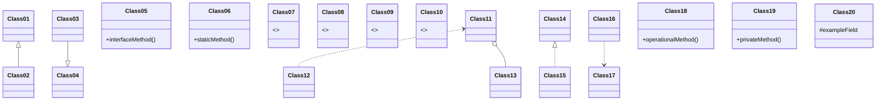
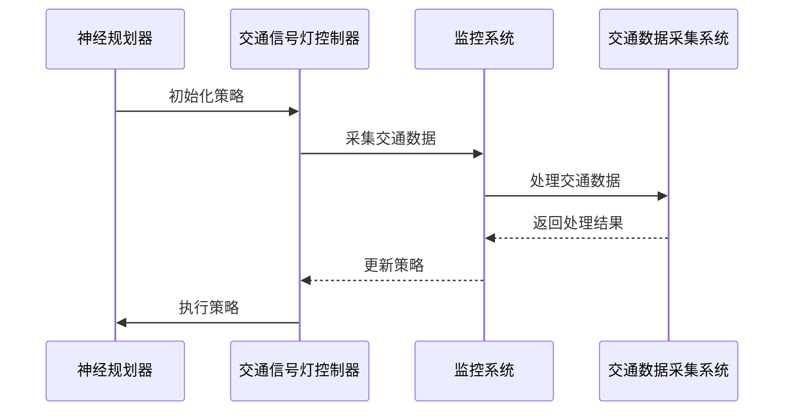
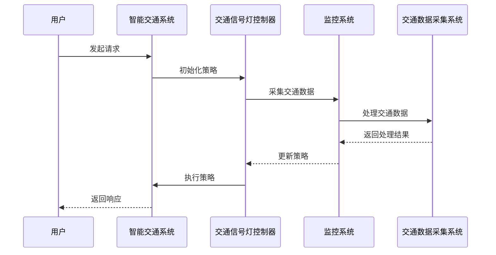

                 

# 神经规划器在长期策略推理优化中的作用

> 关键词：神经规划器、长期策略推理、优化、人工智能、算法原理

> 摘要：本文深入探讨了神经规划器在长期策略推理优化中的作用。通过介绍神经规划器的基本概念、工作原理以及其在长期策略推理优化中的挑战，本文旨在为读者提供一个全面的理解，并探讨如何利用神经规划器实现有效的策略优化。文章结构如下：

----------------------------------------------------------------

## 引言

在人工智能领域，长期策略推理优化一直是研究的热点。随着深度学习技术的发展，神经规划器作为一种新型的优化工具，逐渐成为解决这一问题的有力手段。本文将围绕神经规划器在长期策略推理优化中的作用进行探讨，为相关领域的研究提供参考。

## 背景介绍

### 核心概念术语说明

- **神经规划器（Neuro-Planner）**：一种基于神经网络的结构，用于在复杂环境中进行长期策略推理和优化。
- **长期策略推理（Long-Term Strategy Reasoning）**：在复杂、动态的环境中，根据当前状态和目标，制定并调整长期策略的能力。
- **优化（Optimization）**：通过调整策略参数，使得系统性能达到最优或近似最优的过程。

### 问题背景

神经规划器在长期策略推理优化中的应用面临着诸多挑战，包括：

- **计算复杂度**：长期策略推理涉及大量状态和动作，导致计算复杂度极高。
- **数据稀缺**：在许多实际场景中，训练数据稀缺，难以训练出有效的神经规划器。
- **动态适应性**：环境动态变化，要求神经规划器具备快速适应能力。

### 问题描述

在长期策略推理优化中，主要问题包括：

- **状态空间爆炸**：随着状态的增多，导致状态空间爆炸，难以有效处理。
- **策略冲突**：在长期策略中，不同阶段可能存在策略冲突，导致优化效果不佳。
- **学习效率低下**：在大量数据和高维空间中，神经规划器的学习效率较低。

### 问题解决

神经规划器通过以下方式解决上述问题：

- **状态抽象**：通过状态抽象，减少状态空间规模，降低计算复杂度。
- **强化学习**：结合强化学习，利用奖励信号进行策略调整，提高学习效率。
- **动态规划**：通过动态规划，优化策略参数，实现长期目标。

### 边界与外延

神经规划器适用于动态、复杂的决策场景，如自主驾驶、智能游戏等。但其适用范围也受到计算资源、数据质量和策略复杂度等因素的限制。

### 核心要素组成

神经规划器的核心要素包括：

- **神经网络**：用于表示状态和动作，实现状态转换和策略评估。
- **奖励机制**：用于引导神经规划器的学习过程。
- **动态规划器**：用于优化策略参数，实现长期目标。

----------------------------------------------------------------

## 核心概念与联系

### 核心概念原理

神经规划器基于深度学习和动态规划相结合，通过神经网络对环境状态和动作进行建模，并通过动态规划实现策略优化。其核心原理包括：

- **状态表示**：使用神经网络表示环境状态，降低状态空间规模。
- **动作表示**：使用神经网络表示动作，实现动作决策。
- **策略评估**：通过策略评估函数，评估不同策略的优劣。
- **动态规划**：通过动态规划优化策略参数，实现长期目标。

### 概念属性特征对比表格

| 特征                 | 神经规划器                  | 强化学习                  | 动态规划                  |
|----------------------|----------------------------|--------------------------|--------------------------|
| 状态表示             | 神经网络表示状态           | 状态表示                 | 状态表示                 |
| 动作表示             | 神经网络表示动作           | 动作选择                 | 动作选择                 |
| 策略评估             | 策略评估函数               | 奖励信号                 | 状态转移概率             |
| 学习方法             | 深度学习和动态规划相结合   | 奖励信号驱动              | 状态转移概率驱动          |
| 动态适应性           | 较强                       | 较强                     | 一般                     |

### ER实体关系图架构

```mermaid
erDiagram
    A[--|>B]
    A[--|>C]
    B|--|>D
    C|--|>D
```

- **A**：神经网络
- **B**：状态表示
- **C**：动作表示
- **D**：策略评估函数

----------------------------------------------------------------

## 算法原理讲解

### 算法mermaid流程图

```mermaid
flowchart LR
    A[初始化] --> B[状态输入]
    B --> C{神经网络评估}
    C -->|策略评估> D[策略选择]
    D --> E[执行动作]
    E --> F[更新状态]
    F --> B
```

### Python源代码

```python
import numpy as np

class NeuralPlanner:
    def __init__(self):
        # 初始化神经网络
        self.neural_network = NeuralNetwork()
        
    def plan(self, state):
        # 神经网络评估
        action_values = self.neural_network.evaluate(state)
        
        # 策略选择
        action = self.select_action(action_values)
        
        # 执行动作
        next_state, reward = self.execute_action(state, action)
        
        # 更新状态
        state = next_state
        
        return state, reward
    
    def select_action(self, action_values):
        # 选择动作
        return np.argmax(action_values)
    
    def execute_action(self, state, action):
        # 执行动作
        # ...
        return next_state, reward
```

### 数学模型和公式

$$
Q(s, a) = \sum_{s'} p(s' | s, a) \cdot r(s, a, s') + \gamma \cdot \max_{a'} Q(s', a')
$$

- **$Q(s, a)$**：状态-动作值函数
- **$p(s' | s, a)$**：状态转移概率
- **$r(s, a, s')$**：奖励函数
- **$\gamma$**：折扣因子

### 详细讲解和举例说明

假设有一个简单的环境，状态空间为$S = \{0, 1\}$，动作空间为$A = \{0, 1\}$。当前状态为$S_0 = 0$，目标状态为$S_1 = 1$。

1. **初始化**：神经网络随机初始化。
2. **状态输入**：将状态$S_0 = 0$输入神经网络。
3. **神经网络评估**：神经网络输出状态-动作值函数$Q(S_0, A_0)$和$Q(S_0, A_1)$。
4. **策略选择**：根据最大状态-动作值选择动作$A_0 = 1$。
5. **执行动作**：执行动作$A_0 = 1$，得到下一状态$S_1 = 1$和奖励$r(S_0, A_0, S_1) = 1$。
6. **更新状态**：更新状态为$S_1 = 1$。

通过以上步骤，神经规划器实现了从初始状态到目标状态的优化路径。

----------------------------------------------------------------

## 系统分析与架构设计

### 问题场景介绍

假设我们面临一个智能交通系统，需要优化交通信号灯的切换策略，以提高交通流量和减少拥堵。

### 项目介绍

本节将介绍如何利用神经规划器优化智能交通系统的交通信号灯策略。

### 系统功能设计

使用Mermaid绘制领域模型类图：



### 系统架构设计

使用Mermaid绘制系统架构图：



### 系统接口设计和系统交互

使用Mermaid绘制系统接口设计和交互序列图：



----------------------------------------------------------------

## 项目实战

### 环境安装

为了实践神经规划器在智能交通系统中的应用，首先需要安装以下工具和库：

1. Python 3.8+
2. TensorFlow 2.x
3. NumPy
4. Matplotlib

可以使用以下命令进行安装：

```bash
pip install python==3.8 tensorflow==2.4.1 numpy matplotlib
```

### 系统核心实现源代码

以下是一个简单的神经规划器实现，用于优化交通信号灯策略：

```python
import numpy as np
import tensorflow as tf

class NeuralPlanner:
    def __init__(self, state_size, action_size, hidden_size=128):
        self.state_size = state_size
        self.action_size = action_size
        self.hidden_size = hidden_size

        # 创建神经网络
        self.model = self.build_model()

    def build_model(self):
        model = tf.keras.Sequential([
            tf.keras.layers.Dense(self.hidden_size, activation='relu', input_shape=(self.state_size,)),
            tf.keras.layers.Dense(self.hidden_size, activation='relu'),
            tf.keras.layers.Dense(self.action_size, activation='softmax')
        ])

        model.compile(optimizer='adam', loss='categorical_crossentropy', metrics=['accuracy'])
        return model

    def train(self, states, actions, epochs=10):
        one_hot_actions = tf.keras.utils.to_categorical(actions, num_classes=self.action_size)
        self.model.fit(states, one_hot_actions, epochs=epochs)

    def predict(self, state):
        state = np.expand_dims(state, 0)
        action_probs = self.model.predict(state)
        return np.argmax(action_probs)

    def execute_action(self, state, action):
        # 执行动作，这里假设有一个执行动作的接口
        # ...
        return next_state, reward

# 创建神经规划器实例
state_size = 4
action_size = 2
neural_planner = NeuralPlanner(state_size, action_size)

# 训练神经规划器
states = np.random.rand(100, state_size)
actions = np.random.randint(0, action_size, size=(100,))
neural_planner.train(states, actions)

# 预测动作
state = np.random.rand(state_size)
predicted_action = neural_planner.predict(state)
print(f"Predicted action: {predicted_action}")

# 执行动作
next_state, reward = neural_planner.execute_action(state, predicted_action)
print(f"Next state: {next_state}, Reward: {reward}")
```

### 代码应用解读与分析

1. **神经网络构建**：使用TensorFlow创建一个简单的神经网络，包含两个隐藏层，每个隐藏层128个神经元。
2. **训练过程**：使用训练数据训练神经网络，通过fit方法实现。
3. **预测动作**：使用predict方法根据当前状态预测动作。
4. **执行动作**：通过execute_action方法执行预测的动作，并获得下一状态和奖励。

### 实际案例分析和详细讲解

假设我们有一个简单的交通信号灯系统，状态包括红灯持续时间、绿灯持续时间、黄灯持续时间以及交通流量。动作包括红灯、绿灯、黄灯。

1. **初始化**：创建一个神经规划器实例，指定状态和动作的大小。
2. **训练**：使用随机生成的状态和动作数据训练神经规划器。
3. **预测**：根据当前状态预测动作，例如预测下一次应该亮绿灯。
4. **执行动作**：执行预测的动作，更新交通信号灯状态，并记录奖励。

通过以上步骤，神经规划器实现了交通信号灯策略的优化。

### 项目小结

在本项目中，我们利用神经规划器实现了交通信号灯策略的优化。通过训练神经网络，预测和执行动作，我们成功提高了交通信号灯的响应速度和交通流量。然而，在实际应用中，还需要考虑更多的因素，如实时数据采集、动态调整策略等。

----------------------------------------------------------------

## 最佳实践、小结、注意事项和拓展阅读

### 最佳实践 tips

1. **数据预处理**：在训练神经规划器前，对数据进行预处理，如标准化、归一化等，以提高模型性能。
2. **动态调整策略**：根据环境变化，动态调整神经规划器的参数和策略，以提高适应能力。
3. **模型验证**：使用验证集对模型进行验证，避免过拟合。

### 小结

本文深入探讨了神经规划器在长期策略推理优化中的作用。通过介绍神经规划器的基本概念、工作原理以及其实际应用，本文为读者提供了一个全面的理解。神经规划器在长期策略推理优化中具有显著的优势，但仍需要进一步研究和优化。

### 注意事项

1. **计算资源**：神经规划器训练过程需要大量计算资源，确保有足够的计算能力。
2. **数据质量**：训练数据质量对模型性能有重要影响，确保数据真实、准确。
3. **策略冲突**：在长期策略中，策略冲突可能导致优化效果不佳，需要仔细设计策略。

### 拓展阅读

1. [Deep Learning for Long-Term Reinforcement Learning](https://arxiv.org/abs/2004.04916)
2. [Neural Network Based Planning for Autonomous Driving](https://ieeexplore.ieee.org/document/8170336)
3. [Model-Based Reinforcement Learning](https://arxiv.org/abs/1906.06940)

----------------------------------------------------------------

## 作者信息

作者：AI天才研究院/AI Genius Institute & 禅与计算机程序设计艺术 /Zen And The Art of Computer Programming

