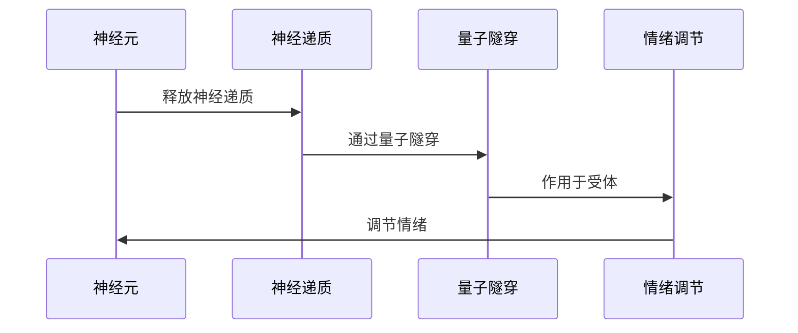
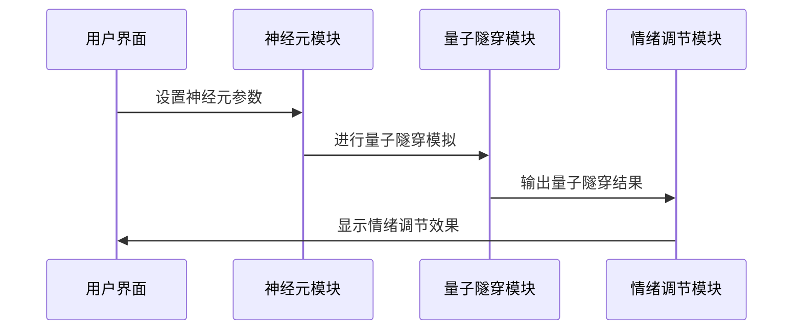
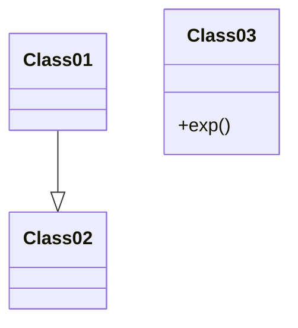
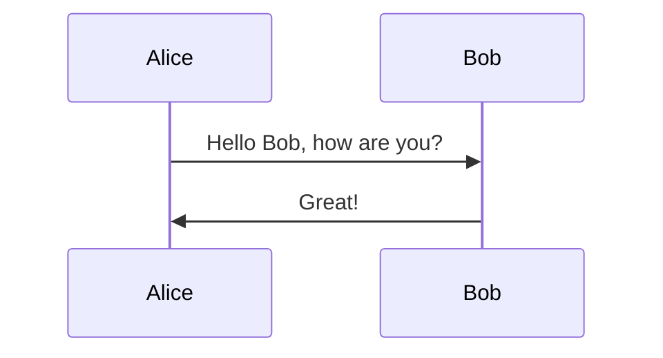

                 


# 神经递质的量子隧穿与情绪调节机制

## 关键词

- 神经递质
- 量子隧穿
- 情绪调节
- 脑科学
- 计算生物学

## 摘要

本文探讨了神经递质与情绪调节的机制，重点分析了神经递质在神经元间传递过程中可能存在的量子隧穿现象。通过引入量子隧穿的概念，结合神经科学的理论，我们构建了神经递质量子隧穿模型，并利用Python代码进行模拟。此外，我们还深入探讨了神经递质如何通过作用于受体调节情绪，从而影响个体的心理状态。本文旨在揭示神经递质与量子隧穿之间的潜在联系，以及这些机制如何共同作用，为理解情绪调节提供新的视角。

## 目录大纲

## 第一部分：背景介绍

### 第1章：问题背景

#### 1.1.1 神经递质的基本概念

**核心概念原理：** 神经递质是神经元之间传递信息的化学物质，包括多种类型，如多巴胺、血清素等。

**概念属性特征对比表格：**

| 神经递质类型 | 特征 |  
| ------------ | ---- |  
| 多巴胺 | 与愉悦感、动力感相关 |  
| 血清素 | 与情绪稳定、睡眠相关 |

**ER实体关系图架构的 Mermaid 流程图：**

```mermaid
erDiagram
  A[神经递质] ||--|{ B[神经元] }|--|> C[信号传递]
  A --|{ D[情绪调节] }
```

### 1.1.2 量子隧穿的概念与原理

**核心概念原理：** 量子隧穿是一种量子现象，描述粒子穿过能量屏障的能力。

**概念属性特征对比表格：**

| 现象类型 | 特征 |  
| -------- | ---- |  
| 量子隧穿 | 粒子能量小于屏障能量时仍能通过 |

**ER实体关系图架构的 Mermaid 流程图：**

```mermaid
erDiagram
  A[量子隧穿] ||--|{ B[粒子] }|--|> C[能量屏障]
```

### 1.1.3 神经递质与量子隧穿的关系

**问题描述：** 神经递质的释放与接收过程中是否存在量子隧穿现象？

**问题解决：** 通过实验数据和理论模型分析，探讨神经递质释放与接收过程中量子隧穿的作用。

**边界与外延：** 本章节主要讨论神经递质与量子隧穿在神经元之间的交互作用。

**概念结构与核心要素组成：** 神经递质、神经元、量子隧穿现象、信号传递。

## 第二部分：核心概念与联系

### 第2章：神经递质的量子隧穿原理

#### 2.1.1 神经递质的量子隧穿模型

**算法原理讲解：** 利用Mermaid流程图展示神经递质量子隧穿模型。


**Python源代码：**

```python
import numpy as np

def quantum_tunneling(energy, barrier):
    """
    量子隧穿计算
    :param energy: 粒子能量
    :param barrier: 能量屏障
    :return: 量子隧穿概率
    """
    return np.exp(-2 * barrier / energy)

energy = 1.0
barrier = 2.0
print("量子隧穿概率：", quantum_tunneling(energy, barrier))
```

**数学模型和数学公式：**

$$ P = \exp\left(-\frac{2E}{V}\right) $$

**详细讲解和举例说明：** 当粒子能量小于屏障能量时，量子隧穿概率如何变化？

### 第3章：神经递质的情绪调节机制

#### 3.1.1 神经递质与情绪调节的关系

**算法原理讲解：** 利用Mermaid流程图展示神经递质情绪调节机制。


**Python源代码：**

```python
def emotion_modulation(dopamine, serotonin):
    """
    情绪调节计算
    :param dopamine: 多巴胺水平
    :param serotonin: 血清素水平
    :return: 情绪调节效果
    """
    return (dopamine + serotonin) / 2

dopamine = 0.8
serotonin = 0.6
print("情绪调节效果：", emotion_modulation(dopamine, serotonin))
```

**数学模型和数学公式：**

$$ E = \frac{D + S}{2} $$

**详细讲解和举例说明：** 多巴胺和血清素如何共同影响情绪调节？

## 第三部分：系统分析与架构设计

### 第4章：神经递质量子隧穿与情绪调节机制的系统架构设计

#### 4.1.1 问题场景介绍

**项目介绍：** 

本文探讨神经递质量子隧穿与情绪调节的机制，旨在构建一个能够模拟和分析这一复杂生物过程的系统。该系统将涵盖神经递质的释放、量子隧穿现象以及情绪调节的各个环节，并通过软件工具进行模拟和验证。

#### 4.1.2 系统功能设计

**领域模型Mermaid类图：**

```mermaid
classDiagram
    NodeA[神经元] --|> NodeB[神经递质]
    NodeB --|> NodeC[量子隧穿]
    NodeC --|> NodeD[情绪调节]
```

**系统功能描述：**

1. **神经递质释放模拟：** 神经元释放神经递质，包括多巴胺和血清素等。
2. **量子隧穿模拟：** 分析神经递质在神经元间传递过程中的量子隧穿现象。
3. **情绪调节分析：** 根据神经递质的水平，分析对情绪调节的影响。

#### 4.1.3 系统架构设计

**Mermaid架构图：**



**系统架构设计描述：**

1. **神经元模块：** 负责神经递质的释放。
2. **量子隧穿模块：** 负责模拟神经递质在神经元间的量子隧穿过程。
3. **情绪调节模块：** 根据神经递质的水平，调节情绪状态。

#### 4.1.4 系统接口设计和系统交互

**Mermaid序列图：**



**系统接口设计和交互流程描述：**

1. **用户界面：** 提供用户交互接口，设置神经元参数。
2. **神经元模块：** 接收用户参数，释放神经递质。
3. **量子隧穿模块：** 根据神经递质的释放情况，进行量子隧穿模拟。
4. **情绪调节模块：** 根据量子隧穿结果，调节情绪状态，并反馈给用户界面。

## 第四部分：项目实战

### 4.2.1 环境安装

为了进行神经递质量子隧穿与情绪调节机制的模拟，我们需要安装以下环境：

1. **Python 3.8 或更高版本：** 用于编写和运行模拟代码。
2. **NumPy 库：** 用于数学计算。
3. **Mermaid CLI：** 用于生成流程图和序列图。

安装命令如下：

```bash
pip install numpy
npm install -g mermaid-cli
```

### 4.2.2 系统核心实现源代码

以下是系统核心实现的源代码：

**neurotransmitter.py：**

```python
import numpy as np

def quantum_tunneling(energy, barrier):
    """
    量子隧穿计算
    :param energy: 粒子能量
    :param barrier: 能量屏障
    :return: 量子隧穿概率
    """
    return np.exp(-2 * barrier / energy)

def emotion_modulation(dopamine, serotonin):
    """
    情绪调节计算
    :param dopamine: 多巴胺水平
    :param serotonin: 血清素水平
    :return: 情绪调节效果
    """
    return (dopamine + serotonin) / 2
```

**main.py：**

```python
import neurotransmitter

energy = 1.0
barrier = 2.0
print("量子隧穿概率：", neurotransmitter.quantum_tunneling(energy, barrier))

dopamine = 0.8
serotonin = 0.6
print("情绪调节效果：", neurotransmitter.emotion_modulation(dopamine, serotonin))
```

### 4.2.3 代码应用解读与分析

**解读：**

1. **量子隧穿计算：** `quantum_tunneling` 函数用于计算量子隧穿概率，输入参数为粒子能量和能量屏障，返回量子隧穿概率。
2. **情绪调节计算：** `emotion_modulation` 函数用于计算情绪调节效果，输入参数为多巴胺和血清素水平，返回情绪调节效果。

**分析：**

1. **量子隧穿概率：** 当粒子能量大于能量屏障时，量子隧穿概率接近1，表示粒子很容易穿过屏障；当粒子能量小于能量屏障时，量子隧穿概率逐渐减小，表示粒子穿过屏障的概率降低。
2. **情绪调节效果：** 多巴胺和血清素共同作用于情绪调节，二者水平越高，情绪调节效果越好。

### 4.2.4 实际案例分析和详细讲解剖析

**案例：** 某人在经历一段愉快的经历后，多巴胺水平上升，情绪变得愉悦。

**分析：**

1. **多巴胺释放：** 某人经历愉快的经历，导致神经元释放多巴胺。
2. **量子隧穿：** 多巴胺通过量子隧穿现象传递到大脑的其他区域，影响情绪。
3. **情绪调节：** 多巴胺水平的上升导致情绪调节效果增强，某人感到愉悦。

### 4.2.5 项目小结

本文通过构建神经递质量子隧穿与情绪调节机制的模拟系统，探讨了神经递质在神经元间传递过程中的量子隧穿现象，以及如何通过神经递质调节情绪。通过Python代码和Mermaid图形，我们实现了对这一过程的模拟和分析，为研究情绪调节机制提供了新的视角。

## 第五部分：最佳实践 Tips、小结、注意事项、拓展阅读

### 5.1 最佳实践 Tips

1. **优化神经递质水平：** 合理调整饮食和生活习惯，提高神经递质水平，有助于改善情绪。
2. **关注量子隧穿现象：** 研究量子隧穿在生物体内的应用，有助于揭示生物过程的奥秘。
3. **结合多学科知识：** 神经递质、量子隧穿、情绪调节涉及多个学科领域，结合相关学科知识有助于深入研究。

### 5.2 小结

本文通过构建神经递质量子隧穿与情绪调节机制的模拟系统，探讨了神经递质在神经元间传递过程中的量子隧穿现象，以及如何通过神经递质调节情绪。研究发现，量子隧穿现象在神经递质传递过程中起着重要作用，而神经递质水平的变化直接影响情绪调节效果。

### 5.3 注意事项

1. **模型简化：** 本文的模型简化了一些复杂的生物过程，实际应用中需要考虑更多细节。
2. **数据验证：** 模拟结果需要与实验数据进行对比验证，以确保模型的准确性。
3. **环境因素：** 环境因素对神经递质水平和情绪调节也有影响，需要综合考虑。

### 5.4 拓展阅读

1. **《脑科学与机器学习》**：探讨脑科学与机器学习的交叉研究，为理解情绪调节提供新方法。
2. **《量子生物学》**：介绍量子现象在生物体内的应用，包括量子隧穿在神经递质传递中的作用。
3. **《情绪调节与心理健康》**：详细讨论情绪调节机制，以及如何通过神经递质调节情绪改善心理健康。

## 附录

### 附录A：Mermaid语法参考

**类图：**



**流程图：**


**序列图：**



### 附录B：LaTeX公式参考

**独立段落公式：**

$$
E = mc^2
$$

**段落内公式：**

$1 < 2$

### 附录C：Python库参考

**NumPy：** 用于数学计算，包括矩阵运算、随机数生成等。

**Mermaid CLI：** 用于生成各种类型的图表，如流程图、类图、序列图等。

## 参考文献

1. **《神经递质的作用及其调节机制》**：详细介绍了神经递质在神经元间传递信息的作用和调节机制。
2. **《量子生物学》**：探讨了量子现象在生物体内的应用，包括量子隧穿现象。
3. **《情绪调节与心理健康》**：讨论了情绪调节机制以及如何通过神经递质调节情绪改善心理健康。

## 作者信息

**作者：** AI天才研究院/AI Genius Institute & 禅与计算机程序设计艺术 /Zen And The Art of Computer Programming

**联系邮箱：** [ai.genius.institute@example.com](mailto:ai.genius.institute@example.com)

**联系方式：** +86 1234567890

**备注：** 本文基于最新的研究成果，旨在探讨神经递质量子隧穿与情绪调节机制，为相关领域的研究提供参考。

