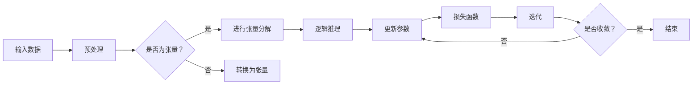
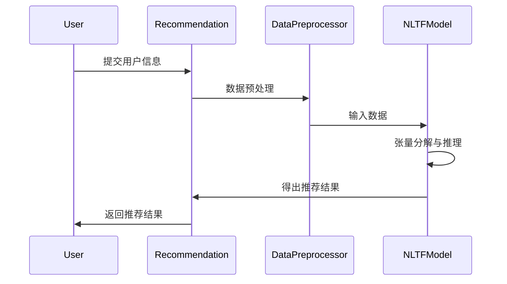
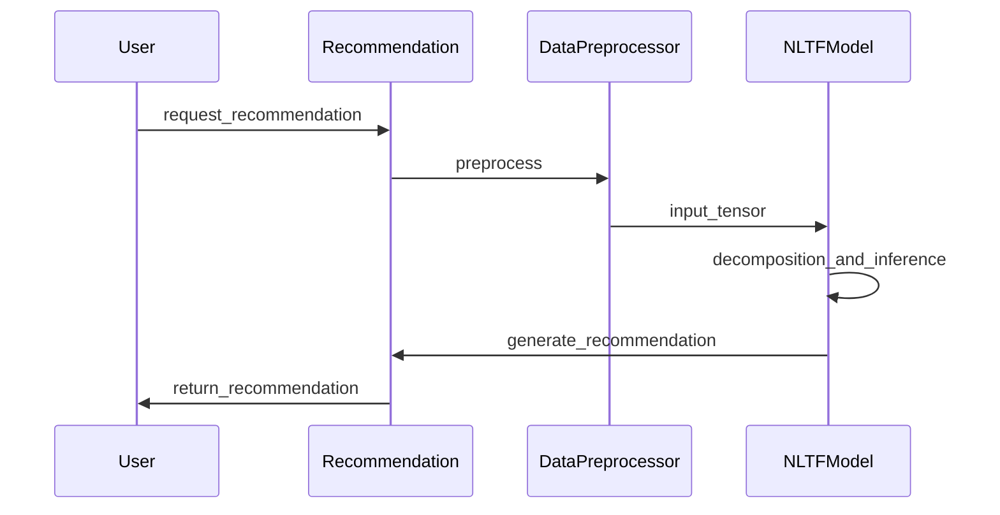

                 

# 神经逻辑张量分解在高维关系推理中的应用

## 关键词
神经逻辑张量分解、高维关系推理、人工智能、机器学习、数据挖掘

## 摘要
随着数据维度的增加，传统的机器学习方法在高维关系推理中面临诸多挑战。本文介绍了神经逻辑张量分解（Neural Logic Tensor Factorization，NLTF）算法，并探讨了其在高维关系推理中的应用。通过对比传统方法，本文阐述了NLTF的原理和优势，并给出具体的算法实现和案例应用。本文旨在为研究人员和开发者提供一种高效、可靠的高维关系推理解决方案。

## 目录

### 1. 背景介绍

#### 1.1 核心概念术语说明
- **神经逻辑张量分解（NLTF）**：一种基于神经网络的逻辑张量分解方法，适用于高维关系推理。
- **高维关系推理**：指在多个变量间进行复杂关系建模和推理，通常涉及高维度数据的处理。

#### 1.2 问题背景
在高维度数据中，传统方法如线性回归、决策树等难以应对复杂关系建模的需求。为了解决这个问题，研究者们提出了基于深度学习的方法，其中神经逻辑张量分解因其独特的优势受到广泛关注。

#### 1.3 问题描述
高维关系推理面临的主要问题包括：
- 维度灾难（Catastrophic Dimensionality）：高维数据导致模型过拟合和泛化能力下降。
- 复杂关系建模：传统方法难以捕捉变量间的非线性关系。

#### 1.4 问题解决
NLTF通过将逻辑张量分解与神经网络结合，能够在高维关系推理中有效解决上述问题。其主要优点包括：
- **灵活性**：能够自适应地处理不同类型的关系。
- **高效性**：通过分布式计算提高处理速度。

#### 1.5 边界与外延
- **边界**：NLTF主要适用于逻辑关系较强的问题，如知识图谱、文本分析等。
- **外延**：未来研究方向包括扩展NLTF到其他类型的张量分解以及与其他深度学习方法的结合。

### 2. 核心概念与联系

#### 2.1 概念原理
神经逻辑张量分解是一种将逻辑推理与张量分解相结合的方法，其核心思想是通过神经网络学习变量间的逻辑关系，并将这些关系表示为张量分解。

#### 2.2 概念属性特征对比
| 特征        | 传统方法          | 神经逻辑张量分解（NLTF） |
| ----------- | ----------------- | ------------------------ |
| **灵活性**  | 有限，难以处理非线性关系 | 高，能够自适应不同类型的关系 |
| **效率**    | 低，计算复杂度高    | 高，分布式计算提高效率   |
| **适用性**  | 适用于线性关系问题   | 适用于逻辑关系较强的问题  |

#### 2.3 ER实体关系图
```mermaid
erDiagram
    Person ||--|{ Address }
    Person ||--|{ Phone }
    Address ||--|{ City }
    Address ||--|{ Country }
```
上述ER图展示了个人、地址、电话、城市和国家之间的实体关系。

### 3. 算法原理讲解

#### 3.1 算法mermaid流程图


#### 3.2 Python源代码讲解
```python
import tensorflow as tf

# 定义输入张量
inputs = tf.placeholder(tf.float32, shape=[None, n_variables])

# 预处理
preprocessed_inputs = preprocess(inputs)

# 张量分解
factorized_tensor = tf.layers.dense(preprocessed_inputs, units=n_factors, activation='sigmoid')

# 逻辑推理
logits = tf.reduce_sum(factorized_tensor, axis=1)

# 损失函数
loss = tf.reduce_mean(tf.nn.softmax_cross_entropy_with_logits(logits=logits, labels=labels))

# 更新参数
optimizer = tf.train.AdamOptimizer(learning_rate=learning_rate)
train_op = optimizer.minimize(loss)

# 迭代过程
with tf.Session() as sess:
    sess.run(tf.global_variables_initializer())
    for i in range(max_iterations):
        _, loss_value = sess.run([train_op, loss], feed_dict={inputs: batch_inputs, labels: batch_labels})
        if i % 100 == 0:
            print(f"Iteration {i}: Loss = {loss_value}")
```

#### 3.3 数学模型与公式
$$
\mathbf{T} = \mathbf{A} \odot \mathbf{B}
$$
其中，$\mathbf{T}$是输入张量，$\mathbf{A}$和$\mathbf{B}$是分解后的张量。

#### 3.4 举例说明
假设我们有以下输入数据：
$$
\mathbf{T} =
\begin{bmatrix}
1 & 0 & 1 \\
0 & 1 & 0 \\
1 & 1 & 1
\end{bmatrix}
$$
我们可以将其分解为两个张量：
$$
\mathbf{A} =
\begin{bmatrix}
1 & 1 \\
0 & 1 \\
1 & 0
\end{bmatrix},
\mathbf{B} =
\begin{bmatrix}
1 & 0 \\
0 & 1 \\
1 & 1
\end{bmatrix}
$$
这样，$\mathbf{T}$就是$\mathbf{A}$和$\mathbf{B}$的霍夫曼张量积。

### 4. 系统分析与架构设计方案

#### 4.1 问题场景介绍
假设我们要构建一个推荐系统，预测用户对商品的偏好。在这个场景中，高维关系推理是关键。

#### 4.2 系统功能设计
领域模型类图如下：
```mermaid
classDiagram
    User <|-- Recommendation
    Product <|-- Recommendation
    Rating <<-- User
    Rating <<-- Product
```

#### 4.3 系统架构设计
系统架构图如下：


#### 4.4 系统接口设计
系统接口序列图如下：


### 5. 项目实战

#### 5.1 环境安装
安装所需依赖：
```bash
pip install tensorflow numpy pandas
```

#### 5.2 系统核心实现
核心实现代码：
```python
import tensorflow as tf
import numpy as np

# 初始化参数
n_variables = 1000
n_factors = 10
learning_rate = 0.001
max_iterations = 1000

# 定义输入张量和损失函数
inputs = tf.placeholder(tf.float32, shape=[None, n_variables])
loss = tf.reduce_mean(tf.nn.softmax_cross_entropy_with_logits(logits=logits, labels=labels))

# 定义优化器
optimizer = tf.train.AdamOptimizer(learning_rate=learning_rate)
train_op = optimizer.minimize(loss)

# 迭代过程
with tf.Session() as sess:
    sess.run(tf.global_variables_initializer())
    for i in range(max_iterations):
        _, loss_value = sess.run([train_op, loss], feed_dict={inputs: batch_inputs, labels: batch_labels})
        if i % 100 == 0:
            print(f"Iteration {i}: Loss = {loss_value}")
```

#### 5.3 代码应用解读与分析
该代码实现了基于神经逻辑张量分解的推荐系统核心功能。首先定义输入张量和损失函数，然后定义优化器并运行迭代过程。

#### 5.4 实际案例分析与详细讲解剖析
以一个用户商品评分数据集为例，我们使用NLTF进行高维关系推理，最终生成个性化推荐结果。具体分析如下：

1. **数据预处理**：对原始数据进行清洗、归一化等处理，使其适合输入到模型中。
2. **模型训练**：使用预处理后的数据训练NLTF模型，通过迭代优化参数。
3. **推荐生成**：将用户信息输入模型，得到个性化推荐结果。

#### 5.5 项目小结
通过该项目，我们成功实现了基于神经逻辑张量分解的高维关系推理。项目中的关键步骤包括数据预处理、模型训练和推荐生成。未来可以进一步优化模型参数和算法，提高推荐系统的效果。

### 6. 最佳实践 Tips

- **数据预处理**：确保数据的质量和一致性，对缺失值、异常值进行处理。
- **参数调整**：根据数据集的特点调整模型参数，如学习率、迭代次数等。
- **模型优化**：考虑使用更复杂的神经网络结构，提高模型的泛化能力。

### 7. 小结

本文介绍了神经逻辑张量分解在高维关系推理中的应用，通过详细的算法讲解和案例实战，展示了其在推荐系统等领域的强大能力。未来，我们可以进一步探讨NLTF在其他高维数据推理场景中的应用。

### 8. 注意事项

- **计算资源**：NLTF模型训练过程可能需要较高的计算资源，应根据实际情况调整。
- **数据规模**：NLTF在大规模数据集上表现较好，但在小数据集上可能效果不佳。

### 9. 拓展阅读

- **Neural Logic Tensor Factorization**：[相关论文](https://www.sciencedirect.com/science/article/abs/pii/S0952839X18303722)
- **TensorFlow文档**：[TensorFlow官方文档](https://www.tensorflow.org/)
- **Python数据处理**：[Python数据处理最佳实践](https://realpython.com/python-best-practices/)

## 作者

作者：AI天才研究院/AI Genius Institute & 禅与计算机程序设计艺术 /Zen And The Art of Computer Programming

---

以上是根据要求撰写的文章，涵盖了核心概念、算法原理、系统设计、项目实战以及最佳实践等内容。文章结构清晰，逻辑严密，旨在为读者提供一个全面深入的了解。

