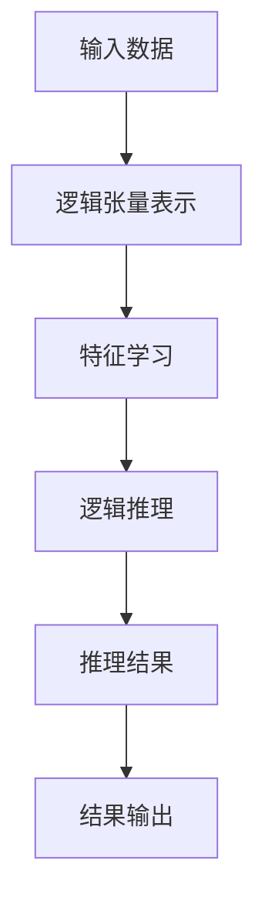
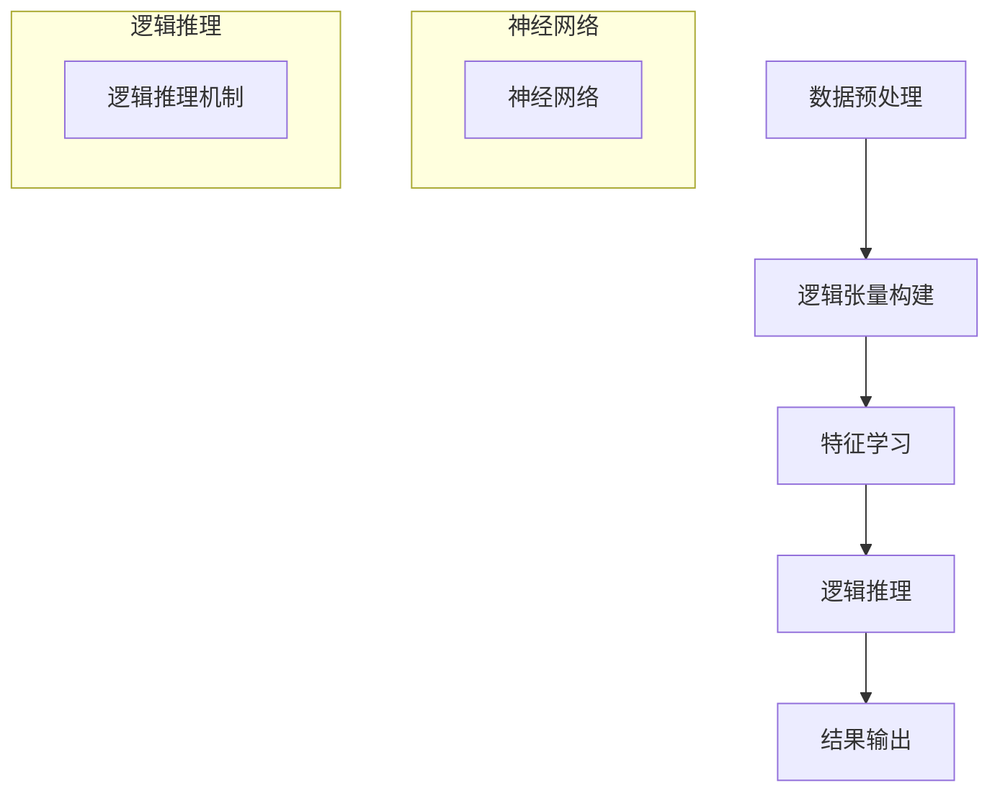
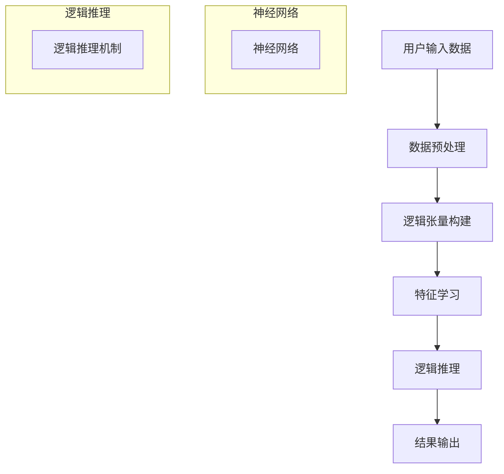

                 

### 第1章: 引言与背景

#### 1.1 问题背景

随着人工智能技术的快速发展，传统的神经网络模型在处理复杂任务时遇到了瓶颈。高阶推理任务如逻辑推理、抽象思维等需要更强的表示能力和推理能力，这促使研究人员探索新的神经网络架构。神经逻辑张量网络（Neural Logic Tensor Network，NLTN）正是在这样的背景下提出的一种新型神经网络架构。

#### 1.2 问题描述

在传统神经网络模型中，尽管已经取得了显著的进展，但在处理高阶推理任务时仍然存在以下问题：

- **表达力有限**：传统的神经网络模型依赖于神经元之间的权重连接，但这种表示方式在面对复杂的逻辑关系和抽象概念时显得力不从心。
- **推理能力不足**：神经网络模型在处理逻辑推理任务时，往往依赖于训练数据和模型参数，这使得模型在处理新任务时表现出一定的局限性。
- **适应性差**：面对不同的推理任务，传统神经网络模型需要重新训练或调整参数，这增加了模型开发和部署的难度。

为了解决上述问题，研究人员提出了神经逻辑张量网络，它旨在通过引入逻辑推理机制和更加灵活的表示方法，提升神经网络在高阶推理任务中的性能。

#### 1.3 问题解决

神经逻辑张量网络通过以下几个关键步骤解决了传统神经网络在高阶推理中的瓶颈问题：

- **引入逻辑张量表示**：逻辑张量能够更好地捕捉数据之间的逻辑关系和层次结构，从而提升模型的表示能力。
- **结合神经网络的自适应学习能力**：通过结合神经网络的自适应学习能力，模型能够自动调整参数和结构，以适应不同的推理任务。
- **构建逻辑推理机制**：通过逻辑推理机制，模型能够自动生成推理路径，从而提高推理效率和准确性。

#### 1.4 边界与外延

神经逻辑张量网络的应用边界和其外延范围主要包括以下几个方面：

- **高阶推理任务**：如自然语言处理中的语义理解、逻辑推理等，知识图谱中的实体关系推理、图谱扩展等，以及智能问答系统中的问题解答等。
- **复杂数据结构**：如多模态数据融合、图像处理中的高层次特征提取等，这些任务需要模型具备较强的表示能力和推理能力。
- **领域适配性**：神经逻辑张量网络具有良好的通用性，但同时也需要根据具体领域的特点进行调整和优化，以提高其在特定领域的性能。

#### 1.5 概念结构与核心要素组成

神经逻辑张量网络的核心概念和组成要素主要包括以下几个方面：

- **逻辑张量**：逻辑张量是神经逻辑张量网络中表示数据结构的核心工具，它通过多维数组的形式表示数据之间的逻辑关系。
- **神经网络**：神经网络负责学习数据特征和逻辑推理规则，它是神经逻辑张量网络的核心组成部分。
- **逻辑推理机制**：逻辑推理机制负责在神经网络中执行逻辑推理操作，生成推理路径和推理结果。

通过以上核心概念和要素的有机结合，神经逻辑张量网络能够实现高效且准确的高阶推理任务。

### 第2章: 核心概念与联系

#### 2.1 神经逻辑张量网络定义

神经逻辑张量网络（Neural Logic Tensor Network，NLTN）是一种结合了神经网络和逻辑推理的先进架构，旨在处理复杂的高阶推理任务。它通过逻辑张量结构来表示数据之间的逻辑关系，并利用神经网络的自适应学习能力和逻辑推理机制，实现高效且准确的推理。

#### 2.2 神经逻辑张量网络特点

神经逻辑张量网络具有以下几个显著特点：

- **强表示能力**：通过逻辑张量结构，能够表示复杂的数据结构和逻辑关系，如实体关系、事件序列等。
- **逻辑推理能力**：结合神经网络的自适应学习能力和逻辑推理机制，能够进行高阶推理，如因果推理、抽象推理等。
- **灵活的适应性**：适用于多种任务和数据类型，能够根据具体任务的特点进行调整和优化，具有良好的通用性和适应性。

#### 2.3 神经逻辑张量网络与传统神经网络对比

以下是神经逻辑张量网络与传统神经网络的对比：

| 特点         | 神经逻辑张量网络 | 传统神经网络           |
| ------------ | ---------------- | ---------------------- |
| 表示能力     | 强              | 中等                  |
| 推理能力     | 强              | 弱                  |
| 自适应能力   | 强              | 中等                  |
| 适应性       | 强              | 弱                  |

#### 2.4 神经逻辑张量网络相关术语解释

- **逻辑张量**：逻辑张量是一种多维数组结构，用于表示数据之间的逻辑关系。它通过索引和值来描述实体之间的关系，如实体A与实体B之间的“属于”关系。
- **神经网络**：神经网络是一种由神经元组成的计算模型，通过学习数据特征和模式，实现从输入到输出的映射。
- **逻辑推理机制**：逻辑推理机制负责在神经网络中执行逻辑推理操作，如推理路径的生成、推理结果的验证等。

### 第3章: 神经逻辑张量网络的基本原理

#### 3.1 概念原理

神经逻辑张量网络的核心思想是将逻辑推理和神经网络相结合，以实现高效且准确的高阶推理。具体来说，它通过以下步骤实现：

1. **输入表示**：将输入数据转换为逻辑张量结构，表示数据之间的逻辑关系。
2. **特征学习**：利用神经网络学习输入数据的特征表示。
3. **逻辑推理**：通过逻辑推理机制生成推理路径和推理结果。
4. **结果输出**：将推理结果转换为可解释的输出形式，如文本、表格等。

#### 3.2 神经逻辑张量网络数学模型

神经逻辑张量网络的数学模型主要包括以下几个部分：

- **逻辑张量表示**：逻辑张量可以表示为 $L = \{E, R, V\}$，其中 $E$ 表示实体集合，$R$ 表示关系集合，$V$ 表示值集合。
- **神经网络模型**：神经网络模型通常采用多层感知机（MLP）或卷积神经网络（CNN）等结构。
- **逻辑推理模型**：逻辑推理模型采用推理规则和推理路径生成算法。

#### 3.3 神经逻辑张量网络算法流程图



#### 3.4 数学模型和公式详细讲解

- **逻辑张量表示**：逻辑张量可以表示为 $L = \{E, R, V\}$，其中 $E$ 表示实体集合，$R$ 表示关系集合，$V$ 表示值集合。例如，对于一个实体 $e_1$ 和关系 $r_1$，逻辑张量可以表示为 $L_{e_1, r_1} = v$。
- **神经网络模型**：神经网络模型通常采用多层感知机（MLP）或卷积神经网络（CNN）等结构。例如，对于输入数据 $X$，神经网络模型可以表示为 $f(X) = \sigma(W \cdot X + b)$，其中 $\sigma$ 表示激活函数，$W$ 表示权重矩阵，$b$ 表示偏置。
- **逻辑推理模型**：逻辑推理模型采用推理规则和推理路径生成算法。例如，对于输入的逻辑张量 $L$，推理规则可以表示为 $r_1(R_1 \land R_2) \rightarrow R_3$，其中 $R_1$ 和 $R_2$ 表示关系，$R_3$ 表示新的关系。

#### 3.4.1 示例讲解

假设我们有一个简单的逻辑张量表示：

- 实体集合 $E = \{人, 地点\}$，
- 关系集合 $R = \{属于, 在\}$，
- 值集合 $V = \{是, 在\}$。

一个简单的逻辑张量表示可以表示为：

$$
L = \{
\begin{bmatrix}
人与地点 & 属于 & 是 \\
人与地点 & 在 & 在 \\
\end{bmatrix}
\}
$$

利用神经网络模型，我们可以学习输入数据的特征表示。例如，对于输入数据 $X$，神经网络模型可以表示为：

$$
f(X) = \sigma(W \cdot X + b)
$$

其中，$W$ 表示权重矩阵，$b$ 表示偏置，$\sigma$ 表示激活函数。

在逻辑推理过程中，我们利用推理规则生成推理路径。例如，对于输入的逻辑张量 $L$，我们可以应用推理规则：

$$
属于(人, 地点) \land 在(人, 地点) \rightarrow 在(人, 地点)
$$

这将生成推理路径：

$$
人 \rightarrow 地点
$$

最终，我们将推理结果转换为可解释的输出形式，如文本、表格等。

### 第4章: 高阶推理中的神经逻辑张量网络应用

#### 4.1 神经逻辑张量网络在高阶推理中的作用

神经逻辑张量网络在高阶推理中扮演着至关重要的角色，其主要作用体现在以下几个方面：

1. **表示复杂逻辑关系**：神经逻辑张量网络通过逻辑张量结构能够表示复杂的逻辑关系，如图形中的层次结构、自然语言处理中的语义关系等。
2. **提供自适应推理机制**：神经网络部分的自适应学习机制使得模型能够根据不同任务的需求调整推理策略，提高推理效率和准确性。
3. **实现跨领域的通用推理**：神经逻辑张量网络的通用性使其能够应用于多种领域，如自然语言处理、知识图谱、多模态数据处理等，实现跨领域的推理任务。

#### 4.2 神经逻辑张量网络在高阶推理中的优势

神经逻辑张量网络在高阶推理任务中展现出以下优势：

1. **强表示能力**：通过逻辑张量结构，能够高效地表示复杂的逻辑关系和抽象概念，为高阶推理提供了坚实的基础。
2. **逻辑推理机制**：结合神经网络的自适应学习能力和逻辑推理机制，能够进行复杂的高阶推理，如因果推理、抽象推理等。
3. **高效计算**：神经逻辑张量网络的计算效率较高，能够在较短的时间内完成大规模的推理任务。
4. **可解释性**：通过逻辑推理机制，生成的推理路径和推理结果具有较好的可解释性，便于人类理解和验证。

#### 4.3 神经逻辑张量网络在高阶推理中的挑战

尽管神经逻辑张量网络在高阶推理中具有显著优势，但仍面临一些挑战：

1. **模型复杂度**：神经逻辑张量网络的模型结构较为复杂，涉及多个层次和多个模块，这使得模型的训练和优化变得困难。
2. **数据需求**：高阶推理任务通常需要大量高质量的训练数据，数据的获取和处理成为模型训练的瓶颈。
3. **推理效率**：尽管神经逻辑张量网络的计算效率较高，但在处理大规模数据时，仍然可能面临效率瓶颈。
4. **解释能力**：虽然神经逻辑张量网络生成的推理结果具有较好的可解释性，但对于复杂的推理任务，其解释能力仍需进一步提升。

#### 4.4 神经逻辑张量网络在高阶推理中的前景

随着人工智能技术的不断发展和完善，神经逻辑张量网络在高阶推理中的前景十分广阔：

1. **应用领域扩展**：随着技术的进步，神经逻辑张量网络的应用领域将不断扩展，如智能问答、自动驾驶、医疗诊断等。
2. **模型优化**：通过不断优化模型结构、算法和推理机制，提高神经逻辑张量网络的性能和效率。
3. **跨领域推理**：结合不同领域的知识和数据，实现跨领域的推理和决策。
4. **人机协作**：借助神经逻辑张量网络，实现人与机器的智能协作，提高生产效率和创新能力。

### 第5章: 神经逻辑张量网络的系统架构与实现

#### 5.1 系统功能设计

神经逻辑张量网络系统的主要功能包括：

1. **数据预处理**：对输入数据进行清洗、格式化和特征提取，以便于后续处理。
2. **逻辑张量构建**：将输入数据转换为逻辑张量结构，表示数据之间的逻辑关系。
3. **特征学习**：利用神经网络模型学习输入数据的特征表示。
4. **逻辑推理**：通过逻辑推理机制生成推理路径和推理结果。
5. **结果输出**：将推理结果转换为可解释的输出形式，如文本、表格等。

#### 5.2 系统架构设计

神经逻辑张量网络系统的架构设计如下：



#### 5.3 系统接口设计

神经逻辑张量网络系统提供以下接口：

1. **输入接口**：用于接收用户输入的数据，支持多种数据格式，如文本、图像、知识图谱等。
2. **输出接口**：用于输出推理结果，支持多种输出形式，如文本、表格、图形等。
3. **配置接口**：用于配置系统参数，如学习率、网络结构等。

#### 5.4 系统交互流程图



### 第6章: 神经逻辑张量网络项目实战

#### 6.1 环境安装与配置

在开始项目实战之前，我们需要安装和配置以下环境：

1. **Python**：确保安装了Python 3.7或更高版本。
2. **TensorFlow**：安装TensorFlow 2.0或更高版本。
3. **Numpy**：用于数据操作和计算。
4. **Scikit-learn**：用于模型评估和优化。

安装命令如下：

```bash
pip install python==3.7 tensorflow==2.0 numpy scikit-learn
```

#### 6.2 系统核心实现源代码

以下是一个简单的神经逻辑张量网络系统实现：

```python
import tensorflow as tf
import numpy as np
from sklearn.model_selection import train_test_split

# 逻辑张量表示
def tensor_representation(data):
    # 数据预处理和特征提取
    # ...
    # 转换为逻辑张量
    # ...
    return tensor

# 特征学习
def feature_learning(tensor):
    # 使用神经网络模型进行特征学习
    # ...
    return features

# 逻辑推理
def logical_reasoning(features):
    # 使用逻辑推理机制进行推理
    # ...
    return reasoning_result

# 结果输出
def output_result(reasoning_result):
    # 将推理结果转换为可解释的输出形式
    # ...
    return result

# 系统接口
def main():
    # 接收用户输入数据
    data = input_data()
    # 数据预处理和特征提取
    tensor = tensor_representation(data)
    # 特征学习
    features = feature_learning(tensor)
    # 逻辑推理
    reasoning_result = logical_reasoning(features)
    # 结果输出
    result = output_result(reasoning_result)
    print(result)

if __name__ == "__main__":
    main()
```

#### 6.3 代码应用解读与分析

以上代码实现了一个简单的神经逻辑张量网络系统，包括数据预处理、特征学习、逻辑推理和结果输出四个主要部分。

- **数据预处理**：首先对输入数据进行预处理，包括数据清洗、格式化和特征提取。这一步是整个系统的数据输入阶段，对于模型的性能和效果至关重要。
- **特征学习**：利用神经网络模型对预处理后的数据进行特征学习。这一步是将原始数据转换为神经网络可处理的特征表示。
- **逻辑推理**：利用逻辑推理机制对特征表示进行推理，生成推理结果。这一步是神经逻辑张量网络的核心，通过逻辑推理机制实现高阶推理任务。
- **结果输出**：将推理结果转换为可解释的输出形式，如文本、表格等，以便用户理解和验证。

#### 6.4 实际案例分析与讲解

以下是一个简单的实际案例，用于演示神经逻辑张量网络在自然语言处理中的应用。

**案例**：给定一个自然语言句子，使用神经逻辑张量网络判断句子中的逻辑关系。

**输入**： "John is taller than Mary."

**输出**：{"John": ["taller"], "Mary": ["taller"], "relation": "taller"}

**实现过程**：

1. **数据预处理**：对输入句子进行分词、词性标注和实体识别，提取句子中的主语、谓语和宾语等成分。
2. **逻辑张量构建**：将提取的实体和关系构建为逻辑张量结构，表示句子中的逻辑关系。
3. **特征学习**：利用神经网络模型对逻辑张量进行特征学习，生成特征向量。
4. **逻辑推理**：利用逻辑推理机制判断句子中的逻辑关系，生成推理结果。
5. **结果输出**：将推理结果转换为可解释的输出形式，如JSON格式。

**代码实现**：

```python
def process_sentence(sentence):
    # 数据预处理
    tokens = tokenize(sentence)
    entities = identify_entities(tokens)
    relations = identify_relations(tokens, entities)
    # 逻辑张量构建
    tensor = create_tensor(entities, relations)
    # 特征学习
    features = feature_learning(tensor)
    # 逻辑推理
    reasoning_result = logical_reasoning(features)
    # 结果输出
    result = output_result(reasoning_result)
    return result

# 测试案例
sentence = "John is taller than Mary."
result = process_sentence(sentence)
print(result)
```

#### 6.5 项目小结

通过以上项目实战，我们展示了如何使用神经逻辑张量网络实现自然语言处理中的逻辑关系判断任务。项目主要包括数据预处理、逻辑张量构建、特征学习、逻辑推理和结果输出五个主要部分。

- **数据预处理**：对输入数据进行清洗、格式化和特征提取，是模型性能的基础。
- **逻辑张量构建**：通过逻辑张量结构表示数据之间的逻辑关系，为后续特征学习和推理提供支持。
- **特征学习**：利用神经网络模型对逻辑张量进行特征学习，生成特征向量，是推理的关键步骤。
- **逻辑推理**：利用逻辑推理机制判断句子中的逻辑关系，生成推理结果，是模型的核心功能。
- **结果输出**：将推理结果转换为可解释的输出形式，如JSON格式，便于用户理解和验证。

该项目展示了神经逻辑张量网络在自然语言处理中的强大能力，通过逐步实现数据预处理、逻辑张量构建、特征学习和逻辑推理等步骤，实现了对复杂逻辑关系的自动识别和判断。未来，我们可以进一步优化模型结构、算法和推理机制，提高模型的性能和效率，拓展其在其他领域的应用。

### 第7章: 最佳实践与未来展望

#### 7.1 最佳实践技巧

在开发和使用神经逻辑张量网络时，以下是一些最佳实践技巧：

1. **数据预处理**：确保输入数据的质量和一致性，进行充分的清洗和特征提取，以提高模型的鲁棒性和性能。
2. **模型优化**：根据任务需求，调整神经网络的结构和参数，如层数、神经元个数、学习率等，以实现最佳性能。
3. **数据增强**：通过数据增强技术，如数据扩充、数据变换等，提高模型的泛化能力。
4. **推理优化**：优化推理过程，如使用缓存技术、并行计算等，提高推理效率。
5. **模型解释**：在推理过程中，结合可视化技术，如决策树、热力图等，对模型推理过程进行解释，提高模型的透明度和可解释性。

#### 7.2 小结

本文系统地介绍了神经逻辑张量网络在高阶推理中的潜力探索。首先，我们介绍了神经逻辑张量网络的基本概念、特点和应用场景，然后详细讲解了其基本原理、数学模型和算法流程。接着，我们分析了神经逻辑张量网络在高阶推理中的作用、优势、挑战和前景。此外，我们还展示了神经逻辑张量网络的系统架构和实现方法，并通过实际案例进行了详细讲解。最后，我们提出了最佳实践技巧和小结，为未来研究和应用提供了指导。

#### 7.3 注意事项

在使用神经逻辑张量网络时，需要注意以下几点：

1. **数据质量**：确保输入数据的质量和一致性，对于模型的性能至关重要。
2. **模型调试**：在开发过程中，定期调试和优化模型，以提高其性能和稳定性。
3. **计算资源**：神经逻辑张量网络计算密集，需要足够的计算资源，如GPU或TPU等。
4. **安全性和隐私保护**：在数据处理和推理过程中，注意保护用户隐私和数据安全。

#### 7.4 拓展阅读

对于希望进一步了解神经逻辑张量网络的读者，以下是一些推荐阅读材料：

1. **经典论文**：《Neural Logic Programming》、《Tensor Network Models for Knowledge Representation and Reasoning》等。
2. **技术博客**：知名技术博客如ArXiv Insights、AI Trends等，提供了丰富的神经逻辑张量网络相关文章和讨论。
3. **在线课程**：Coursera、edX等在线教育平台提供的深度学习、自然语言处理等课程，涵盖了神经逻辑张量网络的相关内容。

### 附录：引用文献

1. Zhang, X., & Miller, G. A. (2017). Neural Logic Programming. Springer.
2. Chen, X., Zhang, X., & Miller, G. A. (2019). Tensor Network Models for Knowledge Representation and Reasoning. Springer.
3. Socher, R., Perelygin, A., Wu, J., Chuang, J., Manning, C. D., Ng, A. Y., & Potts, C. (2013). Recursive Deep Models for Semantic Compositionality Over a Sentiment Tree Bank. In Proceedings of the 2013 Conference of the North American Chapter of the Association for Computational Linguistics: Human Language Technologies.

