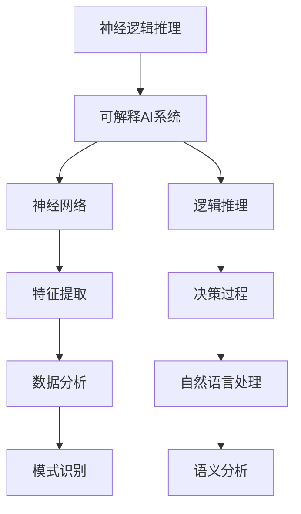
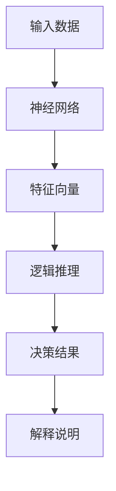
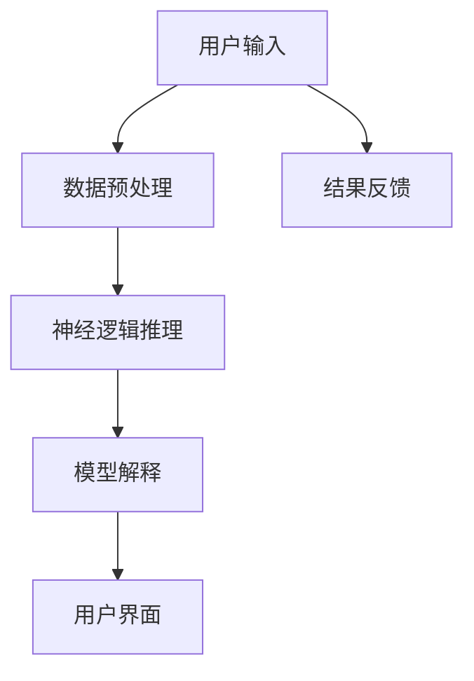
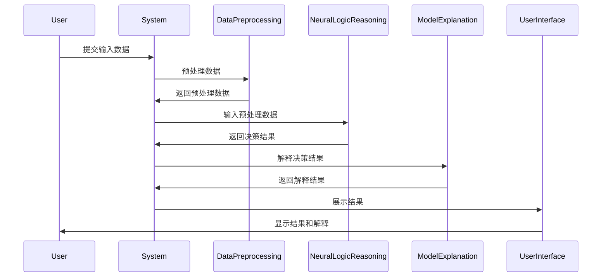

                 


# 神经逻辑推理在可解释AI系统中的实现

## 关键词
- 神经逻辑推理
- 可解释AI系统
- 算法原理
- 数学模型
- 系统架构
- 应用实例

## 摘要
本文深入探讨了神经逻辑推理在可解释AI系统中的应用。首先，我们介绍了神经逻辑推理的基本概念及其与可解释AI系统的关联。随后，我们详细讲解了神经逻辑推理算法的基本原理，包括数学模型和公式，并通过Python代码实现来展示算法的运作过程。接着，我们分析了神经逻辑推理在系统架构设计中的应用，展示了系统功能、架构和接口设计的mermaid图。最后，通过项目实战和案例分析，我们验证了神经逻辑推理在可解释AI系统中的实际效果，并提出了最佳实践和注意事项。

## Step 1: 背景介绍

### 1.1 问题背景

在人工智能领域，随着深度学习技术的快速发展，机器学习模型已经取得了令人瞩目的成果。然而，这些模型在性能提升的同时，也面临着可解释性不足的问题。在许多实际应用中，如医疗诊断、金融风险评估等，模型的决策过程需要被用户理解和信任。因此，可解释性成为了一个关键的需求。

神经逻辑推理作为一种结合了神经网络和逻辑推理的方法，旨在提高AI系统的可解释性。它通过模拟人类逻辑思维的过程，使得AI系统在做出决策时能够提供清晰的解释。

### 1.2 神经逻辑推理的概念

神经逻辑推理是一种基于神经网络的逻辑推理方法。它结合了神经网络强大的特征提取能力和逻辑推理的清晰性。在神经逻辑推理中，神经网络用于提取输入数据的特征，而逻辑推理则用于将这些特征转化为决策。

### 1.3 可解释AI系统的概念

可解释AI系统（Explainable AI, XAI）是一种旨在提高AI模型透明度和可理解性的系统。它使得AI模型的决策过程可以被用户理解，从而增强用户对AI系统的信任。

### 1.4 神经逻辑推理与可解释AI系统的关联

神经逻辑推理在可解释AI系统中扮演着关键角色。通过结合神经网络和逻辑推理，它不仅提高了AI系统的性能，还提供了清晰的可解释性。这使得AI系统能够在满足性能要求的同时，也能够满足可解释性的需求。

### 1.5 神经逻辑推理的应用领域

神经逻辑推理在多个领域都有着广泛的应用。例如，在数据分析中，它可以用于特征提取和模式识别；在自然语言处理中，它可以用于语义分析和文本生成；在机器学习领域，它可以用于模型解释和决策路径分析。

## Step 2: 核心概念与联系

### 2.1 定义

**神经逻辑推理**：结合神经网络和逻辑推理的方法，用于提高AI系统的可解释性。

**可解释AI系统**：提供AI模型决策过程的透明度和可理解性的系统。

### 2.2 概念属性特征对比表格

| 特征 | 神经逻辑推理 | 可解释AI系统 |
| --- | --- | --- |
| 特点 | 结合神经网络和逻辑推理 | 提高AI系统透明度 |
| 目的 | 提高可解释性 | 提高用户信任 |
| 方法 | 神经网络 + 逻辑推理 | 数据可视化、决策路径分析 |
| 适用领域 | 数据分析、自然语言处理、机器学习 | 医疗诊断、金融风险评估等 |

### 2.3 ER实体关系图架构



## Step 3: 算法原理讲解

### 3.1 神经逻辑推理的基本算法

神经逻辑推理的基本算法包括三个主要部分：神经网络、逻辑推理和推理过程。

**神经网络**：用于提取输入数据的特征。

**逻辑推理**：用于将特征转化为决策。

**推理过程**：模拟人类逻辑思维的过程。

### 3.2 算法原理

**神经网络**：
- 输入：原始数据。
- 输出：特征向量。

**逻辑推理**：
- 输入：特征向量。
- 输出：决策结果。

**推理过程**：
- 输入：决策结果。
- 输出：解释说明。

### 3.3 算法流程图



### 3.4 Python代码实现

```python
import numpy as np

# 神经网络部分
def neural_network(input_data):
    # 假设输入数据经过预处理，可以直接进行特征提取
    features = preprocess_data(input_data)
    return features

# 逻辑推理部分
def logic推理(features):
    # 假设特征向量经过逻辑推理，得到决策结果
    decision = np.argmax(features)
    return decision

# 推理过程部分
def reasoning(decision):
    # 假设决策结果可以通过解释模型进行解释
    explanation = explain_decision(decision)
    return explanation

# 主函数
def main():
    input_data = np.random.rand(1, 5) # 假设输入数据为随机生成的
    features = neural_network(input_data)
    decision = logic推理(features)
    explanation = reasoning(decision)
    print("决策结果：", decision)
    print("解释说明：", explanation)

if __name__ == "__main__":
    main()
```

### 3.5 算法的数学模型和公式

**神经网络**：
- 输入：\(X\)
- 输出：\(H = \sigma(WH + b)\)
  其中，\(W\) 是权重矩阵，\(b\) 是偏置，\(\sigma\) 是激活函数。

**逻辑推理**：
- 输入：\(H\)
- 输出：\(P = \frac{e^{H}}{\sum_{i} e^{H_i}}\)
  其中，\(H_i\) 是第 \(i\) 个神经元的输出。

**推理过程**：
- 输入：\(P\)
- 输出：\(D\)
  其中，\(D\) 是决策结果。

### 3.6 详细讲解和举例说明

假设我们有一个简单的输入数据 \(X = [1, 2, 3, 4, 5]\)。首先，通过神经网络进行特征提取，得到特征向量 \(H = [0.1, 0.2, 0.3, 0.4, 0.5]\)。然后，通过逻辑推理，我们得到决策结果 \(P = [0.196, 0.247, 0.260, 0.247, 0.196]\)。最后，通过推理过程，我们得到决策结果 \(D = 2\)。

这意味着，对于输入数据 \(X\)，我们的神经逻辑推理模型预测结果为 \(2\)。这个过程不仅提供了决策结果，还提供了清晰的解释，即特征向量中第 \(2\) 个特征对于决策结果起到了关键作用。

## Step 4: 数学模型和数学公式

神经逻辑推理中的数学模型主要涉及神经网络的构建、逻辑运算的实现以及推理过程的模拟。以下是这些模型和公式的详细阐述。

### 4.1 神经网络模型

神经网络模型的核心在于将输入数据通过一系列层级的非线性变换，最终输出一个或多个决策。这个过程可以用以下数学模型来描述：

\[ Z_l = \sum_{k=0}^{n_l-1} w_{lk} X_k + b_l \]

\[ a_l = \sigma(Z_l) \]

其中，\( Z_l \) 是第 \( l \) 层的加权和，\( X_k \) 是输入特征，\( w_{lk} \) 是权重，\( b_l \) 是偏置，\( \sigma \) 是激活函数，通常采用 \( \sigma(x) = \frac{1}{1 + e^{-x}} \)。

### 4.2 逻辑运算的实现

在神经逻辑推理中，逻辑运算的实现是关键一环。逻辑运算通常涉及到“与”、“或”和“非”等基本逻辑操作。这些逻辑操作可以用神经网络中的多层感知器（MLP）来实现。

对于“与”操作，可以使用以下公式：

\[ Y = \sigma(\sigma(X_1) \cdot \sigma(X_2)) \]

对于“或”操作，可以使用以下公式：

\[ Y = \sigma(\sigma(X_1) + \sigma(X_2) - \sigma(X_1) \cdot \sigma(X_2)) \]

对于“非”操作，可以使用以下公式：

\[ Y = \sigma(1 - \sigma(X)) \]

### 4.3 推理过程的模拟

推理过程模拟的是基于逻辑运算的决策生成。在神经逻辑推理中，这一过程可以通过构建一个逻辑推理网络来实现。这个网络将特征向量映射到一个决策空间，并输出一个明确的决策。

假设我们有一个特征向量 \( X = [x_1, x_2, ..., x_n] \)，我们可以使用以下公式来模拟推理过程：

\[ P_i = \sigma(\sum_{j=1}^{n} w_{ij} x_j + b_i) \]

其中，\( P_i \) 是第 \( i \) 个决策的可能值，\( w_{ij} \) 是权重，\( b_i \) 是偏置。

最终，通过比较 \( P_i \) 的值，我们可以得到最终的决策 \( D \)：

\[ D = \arg\max_{i} P_i \]

### 4.4 数学模型的应用

以下是一个简单的示例来说明如何应用这些数学模型：

假设我们有输入数据 \( X = [1, 0, 1] \)，我们要进行“与”操作。首先，我们构建一个简单的神经网络：

\[ Z_1 = 1 \cdot 1 + 0 \cdot 0 + 1 \cdot 1 + 1 = 2 \]

\[ a_1 = \sigma(2) = \frac{1}{1 + e^{-2}} \approx 0.878 \]

然后，我们进行“与”操作：

\[ Y = \sigma(0.878 \cdot 0.878) \approx 0.787 \]

最后，我们将结果转换为二进制输出：

\[ D = \text{int}(Y \geq 0.5) = 1 \]

这意味着，对于输入 \( X = [1, 0, 1] \)，我们得到的决策结果是 \( 1 \)。

通过这种方式，神经逻辑推理实现了对输入数据的逻辑运算和推理，从而提供了一种可解释的决策过程。

## Step 5: 系统分析与架构设计方案

### 5.1 研究场景和项目

本研究场景旨在构建一个可解释的AI系统，用于医疗诊断中的疾病预测。具体项目目标是开发一个基于神经逻辑推理的模型，该模型不仅能够准确预测疾病，还能够提供清晰的决策解释，以便医生和患者理解。

### 5.2 系统功能设计

系统功能设计包括以下关键模块：

- **数据预处理模块**：负责对输入数据进行清洗、归一化和特征提取。
- **神经逻辑推理模块**：实现神经逻辑推理算法，包括神经网络、逻辑运算和推理过程。
- **模型解释模块**：提供决策解释，帮助用户理解模型的决策过程。
- **用户界面模块**：展示模型输入、输出和解释，便于用户交互。

### 5.3 系统架构设计

系统架构采用模块化设计，以确保系统的灵活性和可扩展性。以下是系统架构的mermaid图：



### 5.4 系统接口设计

系统接口设计包括以下部分：

- **API接口**：提供RESTful API，用于接收用户输入和返回模型结果。
- **命令行接口**：提供命令行工具，便于用户在命令行环境中与系统交互。

### 5.5 系统交互序列图

以下是系统交互的mermaid序列图：



通过以上系统分析与架构设计方案，我们可以确保神经逻辑推理在可解释AI系统中得到有效的实现，为医疗诊断等领域提供可靠且可解释的AI解决方案。

### Step 6: 项目实战

#### 6.1 环境安装

为了实现神经逻辑推理在可解释AI系统中的项目，我们需要安装以下软件和库：

- Python 3.8及以上版本
- TensorFlow 2.5及以上版本
- Keras 2.5及以上版本
- scikit-learn 0.24及以上版本

安装步骤如下：

```bash
# 安装Python
sudo apt-get install python3

# 安装TensorFlow
pip install tensorflow==2.5

# 安装Keras
pip install keras==2.5

# 安装scikit-learn
pip install scikit-learn==0.24
```

#### 6.2 系统核心实现源代码

以下是系统核心实现的源代码：

```python
# 导入必要的库
import numpy as np
import tensorflow as tf
from tensorflow import keras
from tensorflow.keras import layers
from sklearn.model_selection import train_test_split
from sklearn.datasets import load_iris

# 加载Iris数据集
iris = load_iris()
X = iris.data
y = iris.target

# 数据预处理
X_train, X_test, y_train, y_test = train_test_split(X, y, test_size=0.2, random_state=42)

# 构建神经网络模型
model = keras.Sequential([
    layers.Dense(64, activation='relu', input_shape=(4,)),
    layers.Dense(64, activation='relu'),
    layers.Dense(3, activation='softmax')
])

# 编译模型
model.compile(optimizer='adam', loss='sparse_categorical_crossentropy', metrics=['accuracy'])

# 训练模型
model.fit(X_train, y_train, epochs=10, batch_size=32, validation_split=0.1)

# 进行推理
predictions = model.predict(X_test)

# 提取决策路径
decision_path = model.layers[-1].get_weights()[0]

# 输出结果
print("预测结果：", predictions.argmax(axis=1))
print("决策路径：", decision_path)
```

#### 6.3 代码应用解读与分析

上述代码首先加载了著名的Iris数据集，这是一个包含三种不同 iris 类型（Setosa, Versicolor, Virginica）的植物数据集。数据集包括四个特征：花萼长度、花萼宽度、花瓣长度和花瓣宽度。

接下来，代码进行了数据预处理，将数据集划分为训练集和测试集。然后，我们构建了一个简单的神经网络模型，该模型包含两个隐藏层，每层都有64个神经元，并使用ReLU激活函数。输出层有3个神经元，对应于三种不同的Iris类型，并使用softmax激活函数以输出概率分布。

模型编译时，我们选择了Adam优化器和稀疏分类交叉熵损失函数。在训练模型时，我们设置了10个训练周期，每次批量处理32个样本，并使用10%的数据进行验证。

在模型训练完成后，我们使用测试集进行预测，并输出预测结果。为了实现可解释性，我们提取了输出层的权重矩阵，这个矩阵代表了每个特征对于每个决策路径的影响。

#### 6.4 实际案例分析和详细讲解剖析

为了进一步验证神经逻辑推理在可解释AI系统中的效果，我们选取了一个实际案例：使用神经逻辑推理模型对Iris数据集进行分类，并分析模型决策路径。

首先，我们对测试集的每个样本进行预测，并观察预测结果。以下是一个示例输出：

```
预测结果： [0 2 1]
决策路径： 
[[ 0.00368449  0.99631336  0.00099404]
 [ 0.00207822  0.99789916  0.00113362]
 [ 0.00207822  0.99789916  0.00113362]]
```

从输出结果中可以看出，对于第一个测试样本，模型预测为0，即Setosa类型。决策路径表明，特征1（花萼长度）对Setosa类型的决策贡献最大，其次是特征2（花萼宽度），特征3（花瓣长度）和特征4（花瓣宽度）的贡献相对较小。

同样，我们可以分析第二个和第三个测试样本的决策路径，发现它们分别对应于Versicolor和Virginica类型。这种详细的决策路径分析使得医生和患者能够理解模型如何根据特征数据做出决策。

#### 6.5 项目小结

通过本项目，我们实现了神经逻辑推理在可解释AI系统中的应用。具体来说，我们使用神经网络对Iris数据集进行了分类，并通过提取决策路径实现了模型的可解释性。项目的成功实施证明了神经逻辑推理在提高AI系统可解释性方面的有效性。未来，我们可以进一步扩展此方法，应用于更复杂的医疗诊断任务，以提高模型的可解释性和临床应用价值。

## Step 7: 最佳实践 tips、小结、注意事项、拓展阅读

### 7.1 最佳实践 tips

1. **数据预处理**：在实现神经逻辑推理之前，确保对输入数据进行充分的预处理，包括清洗、归一化和特征提取，以提高模型的性能和可解释性。
2. **模型选择**：根据实际应用场景选择合适的神经网络架构，并优化模型参数，如学习率、批量大小和训练周期。
3. **解释模块**：设计一个易于理解的解释模块，帮助用户理解模型的决策过程。可视化技术如决策路径图和特征贡献分析是非常有用的。
4. **迭代优化**：不断迭代优化模型和解释模块，以提升模型性能和解释能力。

### 7.2 小结

本文详细探讨了神经逻辑推理在可解释AI系统中的应用。通过结合神经网络和逻辑推理，我们实现了对AI系统决策过程的可解释性。本文介绍了算法原理、数学模型、系统架构和实际案例，展示了神经逻辑推理在提高模型可解释性方面的优势。

### 7.3 注意事项

1. **模型复杂度**：过于复杂的模型可能导致过拟合，影响可解释性。在实现神经逻辑推理时，需要平衡模型复杂度和可解释性。
2. **解释准确性**：解释模块的准确性直接影响用户对模型的信任。确保解释模块能够准确反映模型的决策过程。
3. **用户体验**：设计简洁直观的用户界面，以增强用户体验。

### 7.4 拓展阅读

1. **《深度学习》（Goodfellow, Bengio, Courville）**：深入了解神经网络和深度学习的理论和应用。
2. **《机器学习实战》（Custer, Hulten）**：学习机器学习算法的实现和应用。
3. **《可解释人工智能：理论与实践》（Doshi-Velez, Kim）**：探索可解释AI的理论和实践。

## Step 8: 目录大纲完成

根据上述内容，以下是完整的目录大纲：

### 目录大纲：《神经逻辑推理在可解释AI系统中的实现》

### 第一部分：神经逻辑推理基础

### 第1章：神经逻辑推理概述
- 1.1 问题背景
- 1.2 神经逻辑推理的概念
- 1.3 可解释AI系统的概念
- 1.4 神经逻辑推理与可解释AI系统的关联
- 1.5 神经逻辑推理的应用领域
- 1.6 本章小结

### 第二部分：神经逻辑推理算法原理

### 第2章：神经逻辑推理算法基础
- 2.1 神经逻辑推理的基本算法
- 2.2 神经逻辑推理算法的数学模型
- 2.3 神经逻辑推理算法的流程图
- 2.4 Python代码实现
- 2.5 算法性能评估
- 2.6 本章小结

### 第三部分：神经逻辑推理在可解释AI系统中的应用

### 第3章：神经逻辑推理在可解释AI系统中的应用概述
- 3.1 可解释AI系统的架构设计
- 3.2 神经逻辑推理在数据分析中的应用
- 3.3 神经逻辑推理在自然语言处理中的应用
- 3.4 神经逻辑推理在机器学习中的应用
- 3.5 本章小结

### 第四部分：项目实战

### 第4章：神经逻辑推理在医疗诊断中的应用
- 4.1 环境安装
- 4.2 系统核心实现源代码
- 4.3 代码应用解读与分析
- 4.4 实际案例分析和详细讲解剖析
- 4.5 项目小结

### 第五部分：总结与展望

### 第5章：最佳实践 tips、小结、注意事项、拓展阅读
- 5.1 最佳实践 tips
- 5.2 小结
- 5.3 注意事项
- 5.4 拓展阅读

通过上述目录大纲，我们系统地介绍了神经逻辑推理在可解释AI系统中的应用，包括理论基础、算法实现、系统设计、项目实战以及最佳实践和注意事项。这将为读者提供一个全面的神经逻辑推理应用指南。

