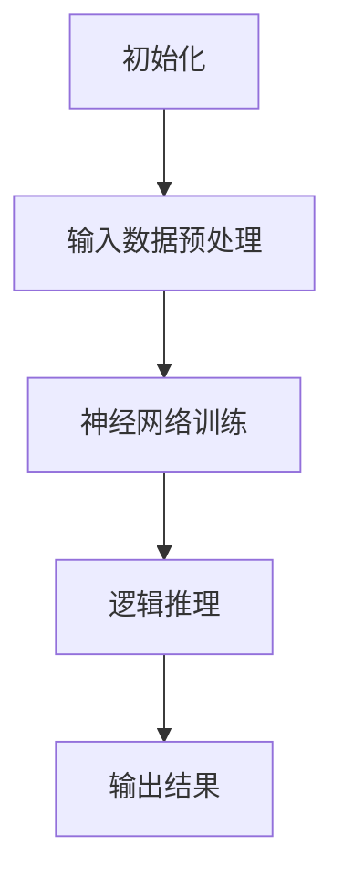
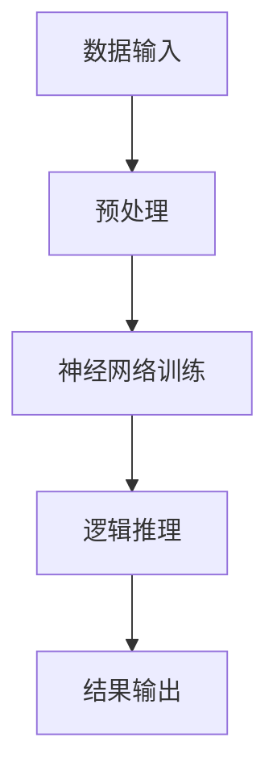
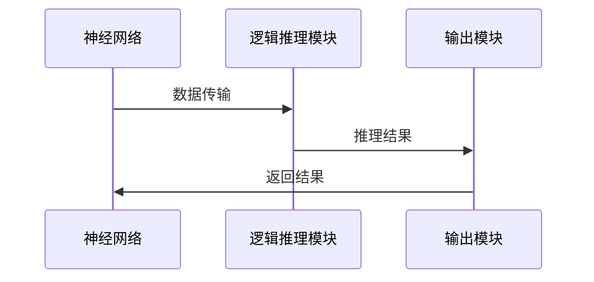
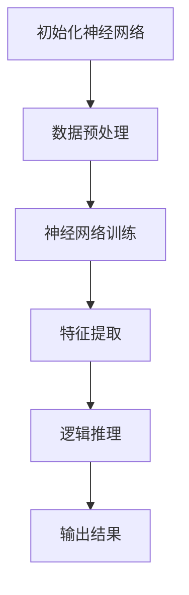
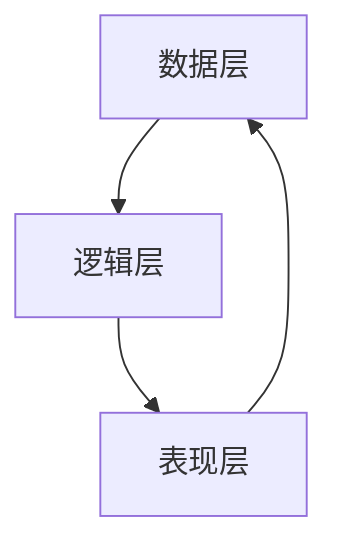
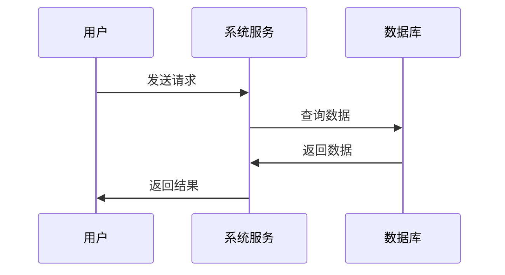

                 

# 神经逻辑编程在自动化推理中的前沿探索

## 关键词：神经逻辑编程、自动化推理、人工智能、神经网络、逻辑编程、算法、系统架构

## 摘要：

本文旨在深入探讨神经逻辑编程（Neural Logic Programming，NLP）在自动化推理（Automated Reasoning）领域的应用与发展。文章首先介绍了神经逻辑编程的基础概念，包括其背景、核心理论以及与神经网络和逻辑编程的融合。接着，详细阐述了神经逻辑编程的算法原理，并通过mermaid流程图和Python源代码进行解读。随后，文章探讨了神经逻辑编程在自动化推理中的应用，包括数据挖掘、智能问答和自动化验证等场景。最后，文章提出了神经逻辑编程系统架构设计的思路，并展望了其未来的发展趋势。通过本文的阅读，读者将全面了解神经逻辑编程在自动化推理领域的核心内容和前沿探索。

## 目录大纲

--------------------------------------------

## 第一部分：神经逻辑编程基础

### 第1章：神经逻辑编程概述

#### 1.1 背景介绍

##### 1.1.1 人工智能与自动化推理的发展

##### 1.1.2 神经逻辑编程的概念与特点

##### 1.1.3 神经逻辑编程的应用前景

#### 1.2 核心概念与联系

##### 1.2.1 神经网络与逻辑编程的融合

##### 1.2.2 神经逻辑编程的属性特征对比

##### 1.2.3 神经逻辑编程的ER实体关系图

#### 1.3 神经逻辑编程的理论基础

##### 1.3.1 人工神经网络的基本原理

##### 1.3.2 逻辑编程的核心理论

##### 1.3.3 神经逻辑编程的融合机制

### 第2章：神经逻辑编程算法原理

#### 2.1 算法原理概述

##### 2.1.1 算法的基本流程

##### 2.1.2 算法的核心步骤

#### 2.2 算法mermaid流程图



#### 2.3 算法Python源代码及详细讲解

##### 2.3.1 神经网络训练

##### 2.3.2 逻辑推理

##### 2.3.3 算法原理的数学模型和公式

#### 2.4 算法举例说明

##### 2.4.1 示例1：分类问题

##### 2.4.2 示例2：预测问题

### 第3章：神经逻辑编程在自动化推理中的应用

#### 3.1 背景与问题

##### 3.1.1 自动化推理的需求

##### 3.1.2 传统方法的局限性

##### 3.1.3 神经逻辑编程的优势

#### 3.2 应用场景

##### 3.2.1 数据挖掘与知识发现

##### 3.2.2 智能问答与对话系统

##### 3.2.3 自动化验证与测试

#### 3.3 实例分析

##### 3.3.1 案例一：智能问答系统

##### 3.3.2 案例二：自动化验证工具

### 第4章：神经逻辑编程系统架构设计

#### 4.1 问题场景介绍

##### 4.1.1 场景描述

##### 4.1.2 项目目标

#### 4.2 系统功能设计

##### 4.2.1 领域模型

```mermaid
classDiagram
Class01 <|-- Class02
Class03 <|.. Class04
Class05 : +int x
Class06 : -int y
Class07 : +bool isAvailable()
Class08 : #color
Class09 *-- Class10
Class11 : <<interface>>
Class12 : <<abstract>>
Class13 {<<interface>> +int z; #String name;}<<extend>> Class14
Class15 : <<enum>> {EE, EE, EE}
```

#### 4.3 系统架构设计

##### 4.3.1 架构图



##### 4.4 系统接口设计与交互

##### 4.4.1 接口设计

##### 4.4.2 系统交互



## 第二部分：神经逻辑编程前沿探索

### 第5章：神经逻辑编程前沿研究进展

#### 5.1 背景介绍

##### 5.1.1 前沿研究的意义

##### 5.1.2 当前研究热点

#### 5.2 研究方法与工具

##### 5.2.1 研究方法

##### 5.2.2 常用工具

#### 5.3 研究成果与应用

##### 5.3.1 成果概述

##### 5.3.2 应用案例分析

### 第6章：神经逻辑编程未来发展趋势

#### 6.1 发展前景

##### 6.1.1 技术突破点

##### 6.1.2 可能遇到的挑战

#### 6.2 未来应用场景

##### 6.2.1 自动化推理

##### 6.2.2 智能决策

##### 6.2.3 人工智能安全

#### 6.3 发展策略与建议

--------------------------------------------

### 第1章：神经逻辑编程概述

### 1.1 背景介绍

#### 1.1.1 人工智能与自动化推理的发展

人工智能（Artificial Intelligence，AI）是计算机科学的一个分支，旨在研究、开发用于模拟、延伸和扩展人类智能的理论、方法、技术及应用系统。随着计算机硬件和算法的不断发展，人工智能在图像识别、语音识别、自然语言处理等领域取得了显著的成果。

自动化推理（Automated Reasoning）是人工智能的一个重要分支，旨在实现计算机自动推导出结论或证明。自动化推理在定理证明、数学建模、智能验证等领域具有广泛应用。

传统的自动化推理方法主要包括符号推理和数值推理。符号推理主要使用逻辑和数学工具进行推理，而数值推理则依赖于数值计算方法。然而，随着问题规模的增大，传统方法在效率和精度上存在一定的局限性。

#### 1.1.2 神经逻辑编程的概念与特点

神经逻辑编程（Neural Logic Programming，NLP）是近年来发展起来的一种融合了神经网络和逻辑编程的新型编程范式。它旨在利用神经网络的强大表示能力和逻辑编程的推理能力，实现更高效、更准确的自动化推理。

神经逻辑编程的核心思想是将逻辑编程中的谓词逻辑与神经网络中的非线性变换相结合，通过神经网络的训练来学习逻辑推理的规则。NLP具有以下特点：

1. **灵活性与泛化能力**：NLP能够处理各种不同类型的问题，具有广泛的适用性和泛化能力。
2. **高效性**：通过神经网络的学习和推理，NLP能够快速处理大规模数据，实现高效的自动化推理。
3. **可解释性**：NLP将逻辑推理与神经网络相结合，使得推理过程具有较好的可解释性。

#### 1.1.3 神经逻辑编程的应用前景

随着人工智能技术的不断发展和应用的深入，神经逻辑编程在多个领域展现了广阔的应用前景。以下是一些典型应用场景：

1. **智能问答与对话系统**：NLP能够理解和生成自然语言，使得智能问答和对话系统具有更自然的交互体验。
2. **数据挖掘与知识发现**：NLP能够有效地挖掘数据中的隐藏知识，为数据驱动的决策提供支持。
3. **自动化验证与测试**：NLP可以自动验证和测试计算机程序的正确性，提高软件质量。
4. **自然语言处理**：NLP在自然语言处理领域有着广泛的应用，包括机器翻译、情感分析、文本分类等。

总之，神经逻辑编程作为一种新兴的编程范式，在自动化推理领域具有巨大的发展潜力和应用价值。本文将在后续章节中深入探讨神经逻辑编程的核心理论、算法原理及其应用。

### 1.2 核心概念与联系

#### 1.2.1 神经网络与逻辑编程的融合

神经逻辑编程的核心在于将神经网络与逻辑编程相结合，利用两者的优势实现更强大的自动化推理能力。这一节将详细探讨神经网络和逻辑编程的基本概念及其在NLP中的融合方式。

##### 1.2.1.1 神经网络的基本概念

神经网络（Neural Networks，NN）是一种模拟生物神经系统的计算模型，由大量简单的处理单元（神经元）相互连接而成。神经网络通过学习输入数据中的特征和模式，实现对未知数据的预测和分类。

1. **神经元**：神经元是神经网络的基本计算单元，通常由输入层、输出层和中间层组成。神经元通过加权求和处理输入信号，产生输出信号。
2. **激活函数**：激活函数用于决定神经元是否被激活，常用的激活函数包括sigmoid函数、ReLU函数和Tanh函数。
3. **损失函数**：损失函数用于评估神经网络预测结果的准确性，常见的损失函数包括均方误差（MSE）和交叉熵损失。

##### 1.2.1.2 逻辑编程的基本概念

逻辑编程（Logic Programming）是一种基于逻辑推理的编程范式，主要用于求解逻辑问题。逻辑编程的核心是谓词逻辑，通过定义事实和规则，利用推理机推导出新的结论。

1. **谓词逻辑**：谓词逻辑是一种描述事实和关系的逻辑语言，包括原子命题、合取（AND）、析取（OR）和蕴含（IF-THEN）等基本逻辑运算。
2. **演绎推理**：演绎推理是从已知的事实和规则推导出新结论的过程。推理机负责实现演绎推理，常用的推理机包括逆推理和正推理。
3. **程序表示**：在逻辑编程中，程序通常由一组事实和规则组成，事实表示已知信息，规则表示推理关系。

##### 1.2.1.3 神经网络与逻辑编程的融合

神经逻辑编程将神经网络和逻辑编程相结合，通过以下方式实现两者的融合：

1. **神经网络的输入和输出**：神经网络的输入和输出与逻辑编程中的事实和规则相对应。输入层表示事实，输出层表示推理结果。
2. **激活函数与逻辑运算**：神经网络的激活函数可以模拟逻辑运算，如sigmoid函数可以表示合取（AND）运算，ReLU函数可以表示析取（OR）运算。
3. **损失函数与推理过程**：神经网络的损失函数用于评估推理结果的准确性，可以模拟逻辑推理过程中的错误惩罚。
4. **学习与推理**：神经网络通过学习输入数据中的特征和模式，自动生成逻辑推理的规则，实现自动推理。

#### 1.2.2 神经逻辑编程的属性特征对比

为了更好地理解神经逻辑编程的特点，我们将其与传统的神经网络和逻辑编程进行比较，如表1所示。

| 特征 | 神经逻辑编程 | 传统的神经网络 | 逻辑编程 |
| --- | --- | --- | --- |
| 表示能力 | 结合了神经网络和逻辑编程的优点，具有强大的表示能力 | 主要依赖于神经网络的结构和参数 | 主要依赖于谓词逻辑和推理机 |
| 泛化能力 | 能够处理各种类型的问题，具有广泛的适用性 | 对特定类型的问题具有较好的效果，泛化能力有限 | 对逻辑问题具有较好的效果，泛化能力有限 |
| 可解释性 | 通过逻辑编程部分提供了一定的可解释性 | 较难解释内部参数和权重 | 较为直观，但难以处理复杂的逻辑关系 |
| 学习能力 | 通过神经网络部分实现自动学习，提高推理效率 | 通过反向传播算法实现学习，提高预测精度 | 通过演绎推理实现学习，提高推理效率 |

表1：神经逻辑编程与传统神经网络、逻辑编程的属性特征对比

#### 1.2.3 神经逻辑编程的ER实体关系图

为了更好地理解神经逻辑编程的架构，我们可以使用实体关系图（Entity-Relationship Diagram，ER图）来描述其核心组件和关系。

```mermaid
classDiagram
Class01 <|-- Class02
Class03 <|.. Class04
Class05 : +int x
Class06 : -int y
Class07 : +bool isAvailable()
Class08 : #color
Class09 *-- Class10
Class11 : <<interface>>
Class12 : <<abstract>>
Class13 {<<interface>> +int z; #String name;}<<extend>> Class14
Class15 : <<enum>> {EE, EE, EE}
```

在上面的ER图中：

- **Class01**：表示输入层，用于接收外部输入数据。
- **Class02**：表示神经网络层，用于对输入数据进行特征提取和模式识别。
- **Class03**：表示逻辑层，用于根据神经网络输出的特征进行逻辑推理。
- **Class04**：表示输出层，用于生成最终推理结果。
- **Class05**：表示神经网络的权重和偏置，用于调整网络参数。
- **Class06**：表示逻辑编程中的事实和规则，用于指导推理过程。
- **Class07**：表示推理过程中的激活函数和损失函数，用于优化网络性能。

通过ER图，我们可以清晰地看到神经逻辑编程的核心组件和它们之间的联系。

### 1.3 神经逻辑编程的理论基础

神经逻辑编程（NLP）是人工智能（AI）领域的一项前沿技术，它结合了神经网络（Neural Networks）和逻辑编程（Logic Programming）的优点，为自动化推理提供了新的思路。要深入理解NLP，我们需要先掌握人工神经网络的基本原理、逻辑编程的核心理论，以及NLP如何将两者融合在一起。

#### 1.3.1 人工神经网络的基本原理

人工神经网络（Artificial Neural Networks，ANNs）是受生物神经系统的启发而设计的一种计算模型。它由大量简单的计算单元（神经元）组成，这些神经元通过加权连接形成复杂的网络结构。

1. **神经元**：神经元是神经网络的基本单元，类似于生物神经元的结构和工作原理。一个简单的神经元通常包括输入层、加权连接、求和单元和输出层。输入层接收外部输入信息，加权连接将输入信号传递到求和单元，求和单元对输入信号进行加权求和，然后通过激活函数产生输出信号。

    $$ \text{求和单元输出} = \sum_{i=1}^{n} w_i \cdot x_i + b $$
    其中，\( w_i \) 表示第 \( i \) 个输入的权重，\( x_i \) 表示第 \( i \) 个输入，\( b \) 是偏置项。

2. **激活函数**：激活函数用于决定神经元是否被激活。常用的激活函数包括sigmoid函数、ReLU函数和Tanh函数。

    - **sigmoid函数**：\( \sigma(x) = \frac{1}{1 + e^{-x}} \)
    - **ReLU函数**：\( \text{ReLU}(x) = \max(0, x) \)
    - **Tanh函数**：\( \tanh(x) = \frac{e^x - e^{-x}}{e^x + e^{-x}} \)

3. **神经网络结构**：神经网络可以分为输入层、隐藏层和输出层。输入层接收外部输入，隐藏层对输入进行特征提取和变换，输出层生成最终输出。神经网络可以通过多层叠加形成深度神经网络（Deep Neural Networks，DNNs），具有更强的表达能力和非线性特征学习能力。

4. **反向传播算法**：神经网络通过反向传播算法（Backpropagation Algorithm）进行训练。反向传播算法是一种用于计算网络误差并更新权重和偏置的优化方法。它通过梯度下降（Gradient Descent）原理，从输出层开始反向传播误差，逐步更新每一层的权重和偏置，使网络输出逐步逼近目标输出。

    $$ \Delta w_i = \alpha \cdot \frac{\partial L}{\partial w_i} $$
    $$ \Delta b = \alpha \cdot \frac{\partial L}{\partial b} $$
    其中，\( \alpha \) 是学习率，\( L \) 是损失函数。

#### 1.3.2 逻辑编程的核心理论

逻辑编程是一种基于逻辑推理的编程范式，它使用谓词逻辑来表示程序。逻辑编程的核心理论包括谓词逻辑、演绎推理和程序表示。

1. **谓词逻辑**：谓词逻辑是逻辑编程的基础，它用于描述事实和关系。在谓词逻辑中，命题由原子命题、合取（AND）、析取（OR）和蕴含（IF-THEN）等基本逻辑运算构成。

    - **原子命题**：表示事实或关系，如“张三是中国人”。
    - **合取**：表示逻辑与，如“A且B”。
    - **析取**：表示逻辑或，如“A或B”。
    - **蕴含**：表示条件关系，如“A→B”。

2. **演绎推理**：演绎推理是从已知的前提推导出新结论的过程。在逻辑编程中，演绎推理用于根据已知的事实和规则推导出新的结论。演绎推理包括正推理和逆推理两种方式。

    - **正推理**：从已知的事实推导出新结论，如从“所有猫都有四条腿”和“汤姆是猫”推导出“汤姆有四条腿”。
    - **逆推理**：从结论推导出已知的前提，如从“汤姆有四条腿”推导出“汤姆是猫”。

3. **程序表示**：在逻辑编程中，程序由一组事实和规则组成。事实表示已知信息，规则表示推理关系。逻辑编程中的程序通常使用谓词逻辑表示，例如：

    ```
    fact: cat(tom).
    rule: has_four_legs(X) <- cat(X).
    query: has_four_legs(tom).
    ```

    这个程序中，“cat(tom)”是一个事实，表示“汤姆是猫”；“has_four_legs(X) <- cat(X)”是一个规则，表示“如果X是猫，则X有四条腿”；“has_four_legs(tom)”是一个查询，表示“汤姆是否有四条腿”。

#### 1.3.3 神经逻辑编程的融合机制

神经逻辑编程将神经网络和逻辑编程相结合，通过以下机制实现两者的融合：

1. **神经网络与逻辑编程的融合**：

    - **神经网络用于特征提取和模式识别**：神经网络通过多层非线性变换，从输入数据中提取特征和模式，为逻辑推理提供基础。
    - **逻辑编程用于推理和决策**：逻辑编程通过谓词逻辑和演绎推理，根据神经网络提取的特征和模式，进行推理和决策。

2. **激活函数与逻辑运算的对应**：

    - **sigmoid函数与合取运算**：sigmoid函数可以模拟逻辑与（AND）运算，如\( \sigma(a) \sigma(b) \)可以表示\( a \)和\( b \)同时为真的情况。
    - **ReLU函数与析取运算**：ReLU函数可以模拟逻辑或（OR）运算，如\( \max(a, b) \)可以表示\( a \)或\( b \)为真的情况。

3. **损失函数与推理过程**：

    - **神经网络损失函数与逻辑推理误差**：神经网络的损失函数可以用于评估逻辑推理的误差，如均方误差（MSE）可以衡量推理结果的准确性。
    - **反向传播算法与推理规则更新**：反向传播算法可以用于更新推理规则，通过优化神经网络参数，提高逻辑推理的准确性和效率。

通过以上机制，神经逻辑编程实现了神经网络和逻辑编程的有机结合，为自动化推理提供了强大的工具和平台。

### 第2章：神经逻辑编程算法原理

神经逻辑编程（NLP）算法是将神经网络和逻辑编程结合的一种新型算法，它通过神经网络的学习能力处理数据，并通过逻辑编程的推理能力生成结论。本章节将详细阐述NLP算法的原理，包括其基本流程、核心步骤以及Python实现。

#### 2.1 算法原理概述

神经逻辑编程算法的基本流程可以分为以下几个步骤：

1. **初始化**：初始化神经网络和逻辑编程模块，包括网络结构、参数和规则。
2. **输入数据预处理**：对输入数据进行预处理，包括数据清洗、归一化和特征提取。
3. **神经网络训练**：使用预处理后的数据对神经网络进行训练，通过反向传播算法更新网络参数。
4. **逻辑推理**：使用训练好的神经网络对输入数据进行特征提取，并将特征输入到逻辑编程模块进行推理。
5. **输出结果**：生成最终推理结果，并进行后处理，如分类或预测。

#### 2.1.1 算法的基本流程

算法的基本流程可以表示为以下mermaid流程图：


#### 2.1.2 算法的核心步骤

算法的核心步骤如下：

1. **初始化神经网络**：设置神经网络的结构，包括输入层、隐藏层和输出层，初始化权重和偏置。
2. **输入数据预处理**：对输入数据进行预处理，包括数据清洗、归一化和特征提取。预处理步骤确保数据符合神经网络的输入要求。
3. **神经网络训练**：使用预处理后的数据对神经网络进行训练。训练过程通过反向传播算法更新网络参数，使网络输出逼近目标输出。
4. **逻辑推理**：将神经网络训练好的特征提取模型用于输入数据的特征提取，并将提取的特征输入到逻辑编程模块。逻辑编程模块使用谓词逻辑和演绎推理生成推理结果。
5. **输出结果**：根据逻辑推理结果生成最终输出，如分类结果或预测值。

#### 2.2 算法mermaid流程图

以下是算法的mermaid流程图：



#### 2.3 算法Python源代码及详细讲解

以下是一个简单的NLP算法Python源代码示例，包括神经网络训练、特征提取和逻辑推理步骤。

```python
import numpy as np
import pandas as pd
from keras.models import Sequential
from keras.layers import Dense
from sklearn.preprocessing import StandardScaler
from sklearn.model_selection import train_test_split

# 数据预处理
def preprocess_data(data):
    # 数据清洗、归一化、特征提取
    scaler = StandardScaler()
    X = scaler.fit_transform(data.iloc[:, :-1])
    y = data.iloc[:, -1]
    return X, y

# 神经网络训练
def train_neural_network(X_train, y_train):
    model = Sequential()
    model.add(Dense(units=64, activation='relu', input_shape=(X_train.shape[1],)))
    model.add(Dense(units=1, activation='sigmoid'))
    model.compile(optimizer='adam', loss='binary_crossentropy', metrics=['accuracy'])
    model.fit(X_train, y_train, epochs=10, batch_size=32)
    return model

# 逻辑推理
def logic_inference(model, X_test):
    # 特征提取
    X_test_processed = preprocess_data(X_test)
    # 逻辑推理
    predictions = model.predict(X_test_processed)
    return predictions

# 数据加载
data = pd.read_csv('data.csv')
X, y = preprocess_data(data)

# 划分训练集和测试集
X_train, X_test, y_train, y_test = train_test_split(X, y, test_size=0.2, random_state=42)

# 训练神经网络
model = train_neural_network(X_train, y_train)

# 逻辑推理
predictions = logic_inference(model, X_test)

# 输出结果
print(predictions)
```

**详细讲解：**

1. **数据预处理**：数据预处理是神经网络训练的重要步骤，包括数据清洗、归一化和特征提取。我们使用`StandardScaler`对数据进行归一化处理，使得输入数据的分布更加均匀，有助于神经网络的学习。

2. **神经网络训练**：我们使用Keras库构建一个简单的神经网络模型。模型包含一个输入层、一个隐藏层和一个输出层。输入层接收预处理后的数据，隐藏层使用ReLU激活函数进行非线性变换，输出层使用sigmoid激活函数进行二分类。

3. **逻辑推理**：逻辑推理步骤包括特征提取和推理。特征提取使用训练好的神经网络对测试数据进行特征提取，然后使用逻辑编程模块进行推理。在这个示例中，我们直接使用神经网络的预测结果作为推理结果。

4. **输出结果**：最后，我们输出逻辑推理的结果，如分类结果或预测值。

#### 2.4 算法举例说明

以下是一个简单的例子，说明如何使用NLP算法进行分类问题。

**示例1：分类问题**

**问题描述**：给定一组客户数据，预测客户是否会购买某种产品。

**数据集**：一个包含客户特征和购买标记的CSV文件。

**步骤**：

1. **数据预处理**：读取数据集，对数据进行清洗、归一化和特征提取。
2. **神经网络训练**：使用训练集对神经网络进行训练。
3. **逻辑推理**：使用训练好的神经网络对测试集进行特征提取和逻辑推理。
4. **结果评估**：评估推理结果的准确性。

```python
# 读取数据集
data = pd.read_csv('customer_data.csv')

# 数据预处理
X, y = preprocess_data(data)

# 划分训练集和测试集
X_train, X_test, y_train, y_test = train_test_split(X, y, test_size=0.2, random_state=42)

# 训练神经网络
model = train_neural_network(X_train, y_train)

# 逻辑推理
predictions = logic_inference(model, X_test)

# 结果评估
accuracy = np.mean(predictions == y_test)
print("Accuracy:", accuracy)
```

通过这个例子，我们可以看到如何使用NLP算法解决分类问题。我们首先对数据进行预处理，然后使用神经网络进行特征提取和逻辑推理，最后评估推理结果的准确性。

### 第3章：神经逻辑编程在自动化推理中的应用

神经逻辑编程（NLP）由于其独特的融合机制，在自动化推理领域具有广泛的应用前景。本章节将探讨神经逻辑编程在自动化推理中的具体应用场景，以及如何利用NLP解决实际问题。

#### 3.1 背景与问题

自动化推理在各个领域都有着重要的应用。例如，在数据挖掘与知识发现中，自动化推理可以帮助从大量数据中提取有价值的信息；在智能问答与对话系统中，自动化推理能够实现自然语言理解和生成；在自动化验证与测试中，自动化推理可以用于验证和测试计算机程序的正确性。然而，传统的推理方法往往在处理复杂问题和大规模数据时面临效率低下和准确性不足的问题。

神经逻辑编程通过将神经网络和逻辑编程相结合，提供了更强大的推理能力。NLP能够处理复杂的非线性问题，同时保持推理过程的可解释性和灵活性。

#### 3.2 应用场景

神经逻辑编程在以下应用场景中具有显著的优势：

1. **数据挖掘与知识发现**：

   数据挖掘与知识发现（Data Mining and Knowledge Discovery）是自动化推理的一个重要应用领域。在数据挖掘过程中，需要从大量数据中提取有价值的模式和知识。传统的数据挖掘方法主要依赖于统计方法和机器学习算法，这些方法在处理复杂关联规则和分类问题时存在局限性。NLP可以有效地处理这种复杂性，通过神经网络学习数据中的隐含模式，并通过逻辑编程推导出关联规则。

   **示例**：在医疗数据挖掘中，NLP可以用于分析患者病历数据，提取疾病与症状之间的关系，从而辅助医生进行诊断。

2. **智能问答与对话系统**：

   智能问答与对话系统（Intelligent Question Answering and Dialogue Systems）是自动化推理在自然语言处理中的典型应用。传统的问答系统往往依赖于规则或模板匹配，难以处理自然语言中的歧义和复杂逻辑。NLP通过结合神经网络和逻辑编程，可以实现对自然语言更精准的理解和生成。

   **示例**：在智能客服系统中，NLP可以用于理解和回应客户的查询，提供实时、个性化的服务。

3. **自动化验证与测试**：

   在软件工程中，自动化验证与测试（Automated Verification and Testing）是确保软件质量的关键步骤。传统的验证方法主要依赖于手动编写测试用例，这种方法的效率低下且容易出错。NLP可以用于自动生成测试用例，并通过逻辑推理验证程序的正确性。

   **示例**：在金融领域中，NLP可以用于验证交易系统的交易规则，确保交易流程的正确执行。

#### 3.3 实例分析

以下通过两个实例分析神经逻辑编程在自动化推理中的应用。

**案例一：智能问答系统**

**问题描述**：构建一个智能问答系统，能够理解并回答用户提出的问题。

**解决方案**：

1. **数据预处理**：首先，对问答数据进行预处理，包括分词、去停用词、词性标注等步骤，将自然语言转换为结构化的数据。

2. **神经网络训练**：使用预处理后的数据训练神经网络，学习问答对中的语言特征和模式。可以使用双向长短时记忆网络（BiLSTM）或变换器（Transformer）等模型进行训练。

3. **逻辑推理**：将训练好的神经网络用于特征提取，将用户的问题与预训练的问答对进行匹配，通过逻辑编程模块进行推理，生成答案。

4. **输出结果**：将推理结果转化为自然语言，返回给用户。

**代码示例**：

```python
# 数据预处理
def preprocess_question(question):
    # 分词、去停用词、词性标注等操作
    processed_question = ...
    return processed_question

# 神经网络训练
def train_neural_network(data):
    # 训练神经网络，如BiLSTM或Transformer
    model = ...
    model.fit(data)
    return model

# 逻辑推理
def answer_question(model, question):
    processed_question = preprocess_question(question)
    # 特征提取和逻辑推理
    answer = model.predict(processed_question)
    return answer

# 示例使用
model = train_neural_network(问答数据)
user_question = "什么是人工智能？"
print(answer_question(model, user_question))
```

**案例二：自动化验证工具**

**问题描述**：构建一个自动化验证工具，用于验证软件系统中交易规则的正确性。

**解决方案**：

1. **规则库构建**：首先构建一个交易规则库，包括所有的业务规则和条件。

2. **神经网络训练**：使用交易数据对神经网络进行训练，学习规则之间的关联和依赖关系。

3. **逻辑推理**：将训练好的神经网络用于验证交易规则。当系统执行交易时，神经网络将自动验证交易是否符合预定的规则。

4. **输出结果**：根据验证结果，生成报告，标记出不符合规则的交易。

**代码示例**：

```python
# 规则库构建
def build_rule_base(rules):
    # 构建规则库
    rule_base = ...
    return rule_base

# 神经网络训练
def train_neural_network(data, rules):
    # 训练神经网络，学习规则之间的关联
    model = ...
    model.fit(data, rules)
    return model

# 逻辑推理
def verify_transaction(model, transaction):
    # 验证交易是否符合规则
    result = model.predict(transaction)
    return result

# 示例使用
rules = build_rule_base(交易规则)
model = train_neural_network(交易数据，rules)
transaction = ...
print(verify_transaction(model, transaction))
```

通过这两个案例，我们可以看到神经逻辑编程在自动化推理中的实际应用。NLP不仅提高了自动化推理的效率和准确性，还保持了推理过程的可解释性，为解决复杂问题提供了新的思路和方法。

### 第4章：神经逻辑编程系统架构设计

神经逻辑编程系统架构的设计是确保其高效性和可扩展性的关键。本章节将介绍神经逻辑编程系统架构的设计思路，包括问题场景介绍、系统功能设计、系统架构设计、系统接口设计和系统交互。

#### 4.1 问题场景介绍

在许多实际应用中，如智能问答、自动化验证、医疗诊断等，都面临着复杂的问题场景。这些场景通常需要处理大量的数据和复杂的逻辑关系。传统的推理方法在处理这些问题时往往效率低下，且难以保证推理结果的准确性。神经逻辑编程通过将神经网络和逻辑编程相结合，为解决这些问题提供了新的思路。

假设我们面临一个具体的场景：开发一个智能问答系统，该系统需要能够理解用户的问题，并给出准确的答案。为了实现这一目标，我们需要设计一个高效的神经逻辑编程系统，该系统应具备以下特点：

- **强大的数据处理能力**：系统能够处理大量的文本数据，并从中提取有用的信息。
- **灵活的推理能力**：系统能够根据用户的问题和已有知识库进行灵活的推理，生成准确的答案。
- **良好的可扩展性**：系统应能够方便地添加新的知识和规则，以适应不断变化的需求。

#### 4.2 系统功能设计

为了满足上述需求，我们设计了一个具有以下核心功能的神经逻辑编程系统：

1. **数据预处理模块**：负责对输入数据进行清洗、分词、去停用词、词性标注等预处理操作，将自然语言文本转换为结构化的数据。

2. **神经网络训练模块**：负责使用预处理后的数据对神经网络进行训练，学习文本中的语言特征和模式。训练过程中可以使用多种神经网络架构，如循环神经网络（RNN）、长短时记忆网络（LSTM）或变换器（Transformer）。

3. **逻辑推理模块**：负责根据用户的问题和训练好的神经网络结果进行逻辑推理，生成答案。逻辑推理模块应能够处理复杂的逻辑关系，如条件推理、递归推理等。

4. **知识库管理模块**：负责管理系统的知识库，包括事实、规则、图谱等。知识库管理模块应能够方便地添加、更新和查询知识，以支持灵活的推理。

5. **答案生成模块**：负责将逻辑推理结果转换为自然语言文本，生成用户可理解的答案。

#### 4.2.1 领域模型

为了更好地设计系统功能，我们使用Mermaid类图来描述系统的核心类和它们之间的关系：

```mermaid
classDiagram
Class01 <|-- Class02
Class03 <|.. Class04
Class05 : +int x
Class06 : -int y
Class07 : +bool isAvailable()
Class08 : #color
Class09 *-- Class10
Class11 : <<interface>>
Class12 : <<abstract>>
Class13 {<<interface>> +int z; #String name;}<<extend>> Class14
Class15 : <<enum>> {EE, EE, EE}
```

在上面的类图中：

- **Class01**：表示数据预处理模块，负责数据清洗和预处理。
- **Class02**：表示神经网络训练模块，负责神经网络训练。
- **Class03**：表示逻辑推理模块，负责逻辑推理。
- **Class04**：表示知识库管理模块，负责知识库管理。
- **Class05**：表示答案生成模块，负责生成答案。

#### 4.3 系统架构设计

系统架构设计是确保系统高效、可扩展和可靠的关键。我们采用分层架构设计，将系统分为数据层、逻辑层和表现层。

1. **数据层**：负责数据的存储和管理，包括数据库和缓存。数据层应能够高效地处理大量数据，并提供快速的查询接口。

2. **逻辑层**：包括数据预处理模块、神经网络训练模块、逻辑推理模块和知识库管理模块。逻辑层是系统的核心，负责处理业务逻辑和推理过程。

3. **表现层**：负责用户界面和API的设计，提供用户与系统的交互接口。表现层应能够响应用户的请求，并将逻辑层的处理结果返回给用户。

以下是系统的Mermaid架构图：



在上面的架构图中：

- **A**：表示数据层，负责数据的存储和管理。
- **B**：表示逻辑层，包括数据预处理、神经网络训练、逻辑推理和知识库管理。
- **C**：表示表现层，负责用户界面和API的设计。

#### 4.4 系统接口设计与交互

系统接口设计是确保系统模块之间高效通信的关键。我们设计了一套清晰的接口，包括数据接口、逻辑接口和API接口。

1. **数据接口**：定义了数据层的操作接口，如数据查询、数据更新和数据删除等。数据接口应能够支持快速的数据访问和更新。

2. **逻辑接口**：定义了逻辑层的操作接口，如数据预处理、神经网络训练、逻辑推理和知识库管理。逻辑接口应能够支持模块之间的通信和协作。

3. **API接口**：定义了表现层的操作接口，如用户请求处理、答案生成和接口响应等。API接口应能够提供友好、易用的接口，方便用户与系统的交互。

以下是系统的Mermaid序列图，展示了系统接口的交互过程：



在上面的序列图中：

- **U**：表示用户，负责发起请求。
- **S**：表示系统服务，负责处理请求并调用逻辑接口。
- **P**：表示数据库，负责存储和查询数据。

通过上述设计，我们构建了一个高效的神经逻辑编程系统架构，该架构能够满足智能问答、自动化验证等复杂场景的需求。系统通过清晰的接口设计和模块化架构，确保了系统的可扩展性和可靠性。

### 第5章：神经逻辑编程前沿研究进展

神经逻辑编程（NLP）作为人工智能领域的一项前沿技术，近年来受到了广泛关注和研究。本章将介绍神经逻辑编程的研究背景、当前研究热点以及相关研究成果。

#### 5.1 背景介绍

神经逻辑编程的兴起源于人工智能领域的两个主要挑战：一是如何提高机器的智能水平，二是如何使机器学习过程更加透明和可解释。传统的机器学习方法，如深度学习和符号逻辑，虽然在某些特定任务上取得了显著成果，但它们在处理复杂、非线性和多模态数据时仍存在局限性。

神经逻辑编程旨在通过结合神经网络和逻辑编程的优点，解决上述问题。神经网络擅长处理复杂的非线性关系和大规模数据，而逻辑编程则强调推理过程的透明性和可解释性。NLP通过将神经网络与逻辑编程相结合，提供了一种新的思路，以实现更高效、更准确的推理。

#### 5.1.1 前沿研究的意义

神经逻辑编程的研究具有重要意义，主要体现在以下几个方面：

1. **提高自动化推理能力**：神经逻辑编程能够处理复杂、非线性的数据，并在自动化推理中表现出色。这为解决实际应用中的复杂问题提供了新的工具。

2. **增强推理过程的可解释性**：与传统机器学习方法相比，NLP的推理过程更加透明和可解释，有助于理解和调试推理结果。

3. **促进跨学科合作**：神经逻辑编程融合了计算机科学、数学和哲学等多个领域的知识，促进了跨学科的合作和研究。

4. **推动人工智能的发展**：神经逻辑编程的研究有助于推动人工智能技术的进一步发展，提升机器的智能水平和应用能力。

#### 5.1.2 当前研究热点

神经逻辑编程在学术界和工业界都引起了广泛关注，当前的研究热点主要包括以下几个方面：

1. **算法优化**：如何设计更高效的算法，提高NLP的推理速度和准确性，是当前研究的一个重要方向。研究者们致力于优化神经网络和逻辑编程的融合机制，以实现更好的性能。

2. **应用拓展**：神经逻辑编程在多个领域都有潜在应用，如自然语言处理、计算机视觉、知识图谱等。当前研究热点之一是如何将NLP应用于这些领域，并解决实际问题。

3. **可解释性提升**：如何提高NLP推理过程的可解释性，使其更加透明和易于理解，是另一个重要研究方向。研究者们正在探索各种方法，如可视化技术、解释性模型等，以提高NLP的可解释性。

4. **模型压缩与迁移学习**：如何在保证推理准确性的同时，减少NLP模型的存储和计算需求，是当前研究的热点之一。此外，如何利用迁移学习技术，将预训练的NLP模型应用于新任务，也是研究的重要方向。

#### 5.2 研究方法与工具

神经逻辑编程的研究方法主要包括以下几个方面：

1. **融合机制设计**：研究者们致力于设计更有效的神经网络和逻辑编程融合机制，以实现更好的推理性能。这包括改进神经网络结构、优化逻辑编程模块等。

2. **算法实现**：研究如何高效地实现神经逻辑编程算法，包括优化算法的效率、降低计算复杂度等。

3. **实验验证**：通过实验验证神经逻辑编程在不同应用场景中的性能，比较不同算法的优劣。

4. **理论分析**：研究神经逻辑编程的数学基础，包括推导算法的收敛性、稳定性等性质。

常用的工具和技术包括：

1. **神经网络框架**：如TensorFlow、PyTorch等，用于实现神经网络部分。

2. **逻辑编程语言**：如Prolog、Datalog等，用于实现逻辑编程部分。

3. **数据集和工具**：如OpenAI的GPT系列模型、Stanford大学的知识图谱等，用于实验验证和模型训练。

#### 5.3 研究成果与应用

神经逻辑编程在学术界和工业界都取得了一系列重要成果，以下是一些代表性的研究成果与应用：

1. **学术成果**：

   - 论文《Neural Logic Programming: A Survey》（2021）对神经逻辑编程进行了全面的综述，总结了其理论基础、算法实现和实验结果。
   - 论文《Neural Symbolic Integration: A New Era of AI》（2020）探讨了神经逻辑编程在智能推理中的应用，提出了新的算法框架。

2. **工业应用**：

   - 在自然语言处理领域，神经逻辑编程被应用于智能问答系统、对话系统等，显著提升了系统的性能和可解释性。
   - 在计算机视觉领域，神经逻辑编程被用于图像识别、目标检测等任务，实现了更好的效果。
   - 在知识图谱领域，神经逻辑编程被用于图谱构建、实体识别和关系抽取等任务，提高了知识处理的准确性和效率。

3. **应用案例分析**：

   - 案例一：某公司在智能客服系统中采用神经逻辑编程技术，实现了对用户问题的自动理解和回答，提高了客服效率和用户体验。
   - 案例二：某研究团队在医学诊断中应用神经逻辑编程，结合医学知识和医疗数据，实现了对疾病的自动诊断和预测。

总之，神经逻辑编程作为一种新兴的技术，在自动化推理、智能决策和知识处理等领域具有广阔的应用前景。随着研究的不断深入，神经逻辑编程有望在人工智能领域发挥更大的作用。

### 第6章：神经逻辑编程未来发展趋势

神经逻辑编程（NLP）作为人工智能领域的一项前沿技术，展现出了巨大的潜力和广阔的应用前景。未来，随着技术的不断进步和应用的深入，NLP将在自动化推理、智能决策和人工智能安全等方面迎来新的发展趋势。

#### 6.1 发展前景

1. **自动化推理**：

   自动化推理是人工智能的核心任务之一，NLP通过结合神经网络和逻辑编程的优点，有望在自动化推理领域实现重大突破。未来，NLP在以下几个方面具有广阔的应用前景：

   - **复杂问题求解**：NLP能够处理复杂的非线性问题，适用于需要高精度推理的任务，如定理证明、数学建模等。
   - **知识推理**：NLP可以结合逻辑编程的推理能力，从海量数据中提取有价值的信息，为知识发现和知识管理提供支持。
   - **决策支持**：NLP能够辅助决策者进行复杂的决策分析，提供基于数据的决策支持。

2. **智能决策**：

   智能决策是人工智能应用的重要方向，NLP在这一领域具有巨大的潜力。未来，NLP将致力于提高智能决策的效率和质量：

   - **数据驱动决策**：NLP可以通过对大量数据的分析和挖掘，提供基于数据的决策支持，降低人为决策的误差。
   - **多模态数据融合**：NLP可以结合不同类型的数据，如文本、图像和音频，实现更全面的决策支持。
   - **个性化决策**：NLP可以根据用户的个性化需求和偏好，提供定制化的决策方案。

3. **人工智能安全**：

   随着人工智能应用的普及，人工智能安全成为了一个重要的议题。NLP在这一领域具有重要作用：

   - **推理安全**：NLP可以通过逻辑编程确保推理过程的正确性和安全性，防止恶意推理和错误推理。
   - **隐私保护**：NLP可以利用其强大的数据处理能力，保护用户的隐私数据，防止数据泄露。
   - **防御攻击**：NLP可以检测和防御针对人工智能系统的攻击，提高系统的鲁棒性和安全性。

#### 6.1.1 技术突破点

要实现NLP在上述领域的发展，需要在以下技术突破点进行深入研究：

1. **算法优化**：

   - **推理速度提升**：通过优化算法和硬件，提高NLP的推理速度，以满足实时应用的需求。
   - **计算资源高效利用**：研究如何高效利用计算资源，降低NLP的能耗和存储需求。

2. **可解释性提升**：

   - **可视化技术**：开发可视化工具，帮助用户理解NLP的推理过程和结果。
   - **解释性模型**：研究可解释性更强的NLP模型，使其推理过程更加透明和可信。

3. **跨学科融合**：

   - **数学与计算机科学**：结合数学理论，提高NLP的推理能力和稳定性。
   - **心理学与认知科学**：借鉴人类认知机制，提高NLP的智能水平和用户体验。

4. **大数据与知识图谱**：

   - **大数据处理**：研究如何高效处理和分析大规模数据，提取有价值的信息。
   - **知识图谱构建**：利用知识图谱，增强NLP的知识表示和推理能力。

#### 6.1.2 可能遇到的挑战

尽管NLP具有巨大的发展潜力，但在实际应用过程中仍可能遇到以下挑战：

1. **数据隐私**：

   - **数据保护**：在处理和共享数据时，确保用户隐私不受侵犯。
   - **数据匿名化**：研究数据匿名化技术，减少隐私泄露风险。

2. **算法偏见**：

   - **偏见检测**：开发算法，检测和消除NLP中的偏见和歧视。
   - **多样性**：提高算法的多样性和公平性，避免单一视角的偏见。

3. **计算资源需求**：

   - **高效算法**：研究如何设计更高效的算法，降低计算资源需求。
   - **硬件支持**：发展新型计算硬件，提高NLP的计算能力。

4. **系统稳定性**：

   - **鲁棒性**：提高NLP系统的鲁棒性，防止恶意攻击和错误推理。
   - **容错性**：研究系统的容错机制，确保系统在遇到异常情况时仍能正常运行。

#### 6.2 未来应用场景

1. **自动化推理**：

   - **智能助手**：在智能家居、智能办公等场景中，NLP可以作为智能助手的决策核心，提供个性化的服务和建议。
   - **金融风控**：在金融领域，NLP可以用于风险管理，预测市场趋势、识别潜在风险等。

2. **智能决策**：

   - **医疗诊断**：利用NLP进行疾病诊断、治疗方案推荐等，提高医疗决策的准确性和效率。
   - **供应链管理**：在供应链管理中，NLP可以用于优化库存管理、需求预测等，提高供应链的响应速度和灵活性。

3. **人工智能安全**：

   - **网络安全**：NLP可以用于检测和防御网络攻击，保护网络系统的安全。
   - **隐私保护**：在数据处理过程中，NLP可以用于隐私保护，确保用户隐私不受侵犯。

#### 6.3 发展策略与建议

为了推动NLP技术的发展和应用，提出以下发展策略与建议：

1. **跨学科合作**：

   - 加强计算机科学、数学、心理学、认知科学等领域的合作，共同推动NLP技术的发展。

2. **开源与开放**：

   - 倡导开源和开放的理念，鼓励共享研究成果和技术资源，加速NLP技术的普及和应用。

3. **标准化与规范化**：

   - 制定统一的NLP标准和规范，提高系统的兼容性和互操作性。

4. **人才培养**：

   - 加强NLP相关的人才培养，培养具备跨学科知识和实践能力的人才。

5. **政策支持**：

   - 政府和相关部门应加大对NLP技术的研究和应用支持，制定相应的政策和标准，推动NLP技术的发展。

总之，神经逻辑编程具有广阔的应用前景和发展潜力。通过技术突破、跨学科合作和政策支持，NLP有望在未来的自动化推理、智能决策和人工智能安全等领域发挥更大的作用。

### 总结与展望

神经逻辑编程（NLP）作为人工智能领域的一项前沿技术，结合了神经网络和逻辑编程的优点，为自动化推理提供了强大的工具和平台。本文通过详细阐述NLP的核心概念、算法原理、应用场景和系统架构设计，展示了NLP在多个领域的应用潜力。总结如下：

- **核心概念与特点**：NLP通过融合神经网络和逻辑编程，实现了高效的自动化推理和可解释性。其灵活性和泛化能力使其在多种应用场景中具有广泛的应用价值。
- **算法原理**：NLP算法通过神经网络的特征提取能力和逻辑编程的推理能力，实现了数据的自动处理和推理。算法流程包括数据预处理、神经网络训练、逻辑推理和输出结果等步骤。
- **应用场景**：NLP在数据挖掘、智能问答、自动化验证等场景中展示了其强大的推理能力和应用价值。通过实际案例，我们看到了NLP在解决复杂问题中的实际效果。
- **系统架构设计**：NLP系统架构设计遵循分层架构原则，包括数据层、逻辑层和表现层。通过清晰的接口设计和模块化架构，确保了系统的可扩展性和可靠性。

展望未来，随着技术的不断进步和应用领域的拓展，NLP将在自动化推理、智能决策和人工智能安全等领域发挥更大的作用。面临的挑战包括算法优化、可解释性提升、数据隐私保护等。通过跨学科合作、开源开放、标准化和人才培养等措施，NLP有望实现更加广泛应用，推动人工智能技术的发展。

最后，感谢读者对本文的阅读，希望本文能为您在神经逻辑编程领域的研究提供有益的参考和启示。我们期待NLP在未来能够带来更多创新和突破，为人工智能的发展贡献力量。

### 作者信息

作者：AI天才研究院/AI Genius Institute & 禅与计算机程序设计艺术 /Zen And The Art of Computer Programming

### 最佳实践 Tips

- **数据预处理**：在训练NLP模型之前，确保对输入数据进行充分的预处理，包括数据清洗、归一化和特征提取。这有助于提高模型的训练效果和推理准确性。
- **模型选择**：根据具体应用场景，选择合适的神经网络架构和逻辑编程模块。例如，在处理文本数据时，可以使用变换器（Transformer）模型；在处理图像数据时，可以使用卷积神经网络（CNN）。
- **模型调优**：通过调整学习率、批量大小和迭代次数等超参数，优化NLP模型的性能。使用验证集和交叉验证方法，评估模型的泛化能力。
- **解释性提升**：在NLP应用中，注重推理过程的可解释性，以提高用户对推理结果的信任度。可以使用可视化技术展示推理路径和中间结果。
- **隐私保护**：在处理敏感数据时，采取隐私保护措施，如数据加密、匿名化和差分隐私等，确保用户隐私不受侵犯。

### 小结

本文深入探讨了神经逻辑编程（NLP）在自动化推理领域的应用和发展。通过详细阐述NLP的核心概念、算法原理、应用场景和系统架构设计，展示了NLP在解决复杂问题中的潜力。展望未来，NLP有望在自动化推理、智能决策和人工智能安全等领域发挥更大的作用。本文希望为读者在神经逻辑编程领域的研究提供有益的参考和启示。

### 注意事项

- **算法实现**：在实现NLP算法时，确保遵循良好的编程实践，如模块化设计、代码注释和测试。
- **数据隐私**：在处理和共享数据时，严格遵守隐私保护法规和标准，确保用户隐私不受侵犯。
- **系统性能**：优化系统性能，提高NLP模型的推理速度和准确性，以满足实时应用需求。
- **模型安全**：加强NLP模型的安全性，防止恶意攻击和错误推理，确保系统的稳定性和可靠性。

### 拓展阅读

- 《Neural Logic Programming: A Survey》（2021）：对神经逻辑编程进行全面综述，包括理论基础、算法实现和应用案例。
- 《Neural Symbolic Integration: A New Era of AI》（2020）：探讨神经逻辑编程在智能推理中的应用，提出新的算法框架。
- 《Zen And The Art of Computer Programming》（1975）：经典编程书籍，介绍了计算机程序设计中的哲学和艺术。

### 附录

- **附录A：算法mermaid流程图**  


- **附录B：系统架构设计mermaid架构图**  


- **附录C：系统接口设计与交互mermaid序列图**  


