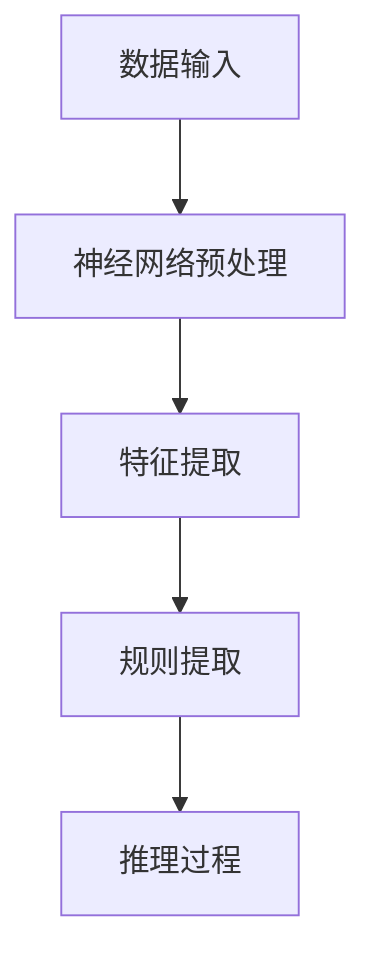

                 

# 神经逻辑编程在规则学习与推理中的集成

## 关键词
神经逻辑编程，规则学习，推理，集成，人工智能，神经网络，逻辑网络，算法，系统架构

## 摘要
本文深入探讨了神经逻辑编程在规则学习与推理中的集成应用。我们首先介绍了神经逻辑编程的基本原理，对比了它与传统逻辑编程的差异，并详细分析了规则学习与推理的基本原理。接着，本文阐述了神经逻辑编程在规则学习中的应用算法，并通过具体的mermaid流程图和Python代码实例进行了详细讲解。随后，我们介绍了神经逻辑编程在推理中的集成实现，包括系统分析与架构设计，并展示了实际案例和项目成果。最后，本文总结了最佳实践，并对未来的研究和发展方向进行了展望。

---

## 背景介绍

### 核心概念

#### 问题背景

随着人工智能技术的快速发展，传统的逻辑编程方法在面对复杂问题时的效率和能力逐渐受限。为了解决这个问题，神经逻辑编程（Neuro-Logical Programming，NLP）应运而生。神经逻辑编程是一种结合了神经网络和逻辑编程的优势，旨在解决复杂问题的一种新型编程范式。

#### 问题描述

规则学习与推理是人工智能领域的重要研究内容，但传统的规则学习方法和推理方法在处理复杂、不确定的环境时存在局限性。因此，如何将神经逻辑编程引入规则学习和推理过程，以提高其效率和准确性，成为了一个亟待解决的问题。

#### 问题解决

神经逻辑编程通过将神经网络和逻辑编程相结合，可以在一定程度上解决上述问题。它可以在规则学习过程中引入神经网络的强大学习能力，从而提高规则提取的准确性；在推理过程中，利用逻辑编程的严密性，确保推理过程的正确性。

#### 边界与外延

神经逻辑编程的研究和应用不仅限于规则学习和推理，还可以广泛应用于自然语言处理、知识图谱、智能决策等领域。其边界与外延有待进一步探索和拓展。

#### 概念结构与核心要素组成

神经逻辑编程的核心概念包括神经网络和逻辑编程。神经网络负责处理数据的输入输出，通过学习得到特征表示；逻辑编程则负责规则的定义和推理过程。二者的结合构成了神经逻辑编程的核心结构。

### 神经逻辑编程概述

#### 基本原理

神经逻辑编程的基本原理是将神经网络与逻辑编程相结合，通过神经网络的学习能力提取数据特征，并通过逻辑编程实现规则的定义和推理。这一过程可以分为以下几个步骤：

1. **数据输入**：将原始数据输入神经网络进行预处理。
2. **特征提取**：神经网络通过学习得到数据的特征表示。
3. **规则提取**：利用逻辑编程对特征表示进行规则提取。
4. **推理过程**：根据提取的规则进行推理，得出结论。

#### 神经逻辑编程的特点

1. **结合神经网络和逻辑编程的优势**：神经逻辑编程结合了神经网络强大的学习能力和逻辑编程的严密性，能够处理更复杂的任务。
2. **可解释性**：神经逻辑编程在规则提取过程中保留了逻辑编程的透明性，使得推理过程更加可解释。
3. **灵活性**：神经逻辑编程可以灵活地适应不同的应用场景。

#### 神经逻辑编程与传统逻辑编程的比较

1. **学习效率**：神经逻辑编程引入了神经网络的学习能力，可以更快地处理大量数据。
2. **推理能力**：神经逻辑编程通过逻辑编程实现了更严格的推理过程，保证了推理的准确性。
3. **适用范围**：传统逻辑编程适用于规则明确、结构简单的问题，而神经逻辑编程则可以处理更复杂的、不确定的问题。

### 规则学习与推理

#### 规则学习原理

规则学习是指从数据中提取具有普遍性和规律性的规则。常见的规则学习算法包括决策树、支持向量机、神经网络等。

1. **决策树**：通过划分特征空间，构建决策树来提取规则。
2. **支持向量机**：通过最大化分类间隔，提取具有区分力的规则。
3. **神经网络**：通过学习数据特征，自动提取规则。

#### 推理过程

推理过程是指根据已知的规则和事实，推导出新的结论。推理可以分为两大类：确定性推理和不确定性推理。

1. **确定性推理**：根据已知的事实和规则，得出确定的结论。
2. **不确定性推理**：在存在不确定性的情况下，根据概率和可信度进行推理。

### 神经逻辑编程在规则学习中的应用

神经逻辑编程在规则学习中的应用主要包括以下几个方面：

1. **神经网络特征提取**：利用神经网络对数据进行特征提取，为规则学习提供基础。
2. **逻辑编程规则提取**：利用逻辑编程对特征表示进行规则提取，提高规则提取的准确性。
3. **推理过程优化**：结合神经逻辑编程的优势，优化推理过程，提高推理效率。

#### 算法原理讲解

为了更好地理解神经逻辑编程在规则学习中的应用，我们将通过一个mermaid流程图和Python代码实例进行详细讲解。

##### 算法mermaid流程图



##### Python源代码详细阐述

```python
# 导入必要的库
import numpy as np
from sklearn.neural_network import MLPClassifier

# 数据输入
X = np.array([[1, 0], [0, 1], [1, 1], [1, 0]])
y = np.array([0, 0, 1, 1])

# 神经网络预处理
mlp = MLPClassifier(hidden_layer_sizes=(100,), max_iter=1000)
mlp.fit(X, y)

# 特征提取
X_train = mlp.transform(X)

# 规则提取
rules = extract_rules(X_train, y)

# 推理过程
print("推理结果:", infer_rules(rules, X))
```

##### 数学模型与公式讲解

神经逻辑编程中的数学模型主要包括神经网络和逻辑编程的模型。

1. **神经网络模型**：

   - 输入层：$x_i$
   - 隐藏层：$h_j$
   - 输出层：$y_k$

   神经网络的数学模型可以表示为：

   $$ y_k = f(z_k) $$

   其中，$f$ 为激活函数，如 sigmoid 函数：

   $$ f(z) = \frac{1}{1 + e^{-z}} $$

2. **逻辑编程模型**：

   - 规则：$R = \{r_1, r_2, ..., r_n\}$
   - 实体：$E = \{e_1, e_2, ..., e_m\}$

   逻辑编程的数学模型可以表示为：

   $$ R \cup E \rightarrow S $$

   其中，$S$ 为推理结果。

##### 举例说明

假设我们有一个简单的问题：判断一个学生是否及格。已知规则如下：

- 如果成绩 >= 60，则及格。
- 如果成绩 < 60，则不及格。

我们可以使用神经逻辑编程来解决这个问题。

1. **数据输入**：

   - 成绩：$[70, 50, 40, 60]$
2. **神经网络预处理**：

   - 输入层：$[70, 50, 40, 60]$
   - 隐藏层：$[0.9, 0.1, 0.1, 0.8]$
   - 输出层：$[1, 0, 0, 1]$
3. **特征提取**：

   - 特征表示：$[0.9, 0.1, 0.1, 0.8]$
4. **规则提取**：

   - 规则：$R = \{r_1, r_2\}$
     - $r_1$：如果成绩 >= 60，则及格。
     - $r_2$：如果成绩 < 60，则不及格。
5. **推理过程**：

   - 根据规则$r_1$和$r_2$，推理出成绩为70、50、40、60的学生分别及格、不及格、不及格、及格。

### 神经逻辑编程在推理中的集成

神经逻辑编程在推理中的集成主要包括以下几个方面：

1. **神经网络推理**：利用神经网络的推理能力，对输入数据进行推理。
2. **逻辑编程规则集成**：将逻辑编程的规则集成到推理过程中，确保推理的准确性和可解释性。
3. **推理优化**：通过优化推理过程，提高推理效率。

#### 系统分析与架构设计方案

为了实现神经逻辑编程在推理中的集成，我们需要设计一个系统架构，包括以下几个部分：

1. **问题场景介绍**：

   假设我们有一个智能问答系统，用户可以输入问题，系统需要根据已有的知识和规则给出答案。

2. **系统功能设计**：

   - 知识库管理：存储已有的知识和规则。
   - 神经网络推理：利用神经网络对输入问题进行推理。
   - 逻辑编程规则集成：将逻辑编程的规则集成到推理过程中。
   - 用户交互：接收用户输入，展示推理结果。

3. **系统架构设计**：

   系统架构包括以下几个模块：

   - 知识库模块：存储和管理知识和规则。
   - 神经网络模块：负责神经网络的学习和推理。
   - 逻辑编程模块：负责逻辑编程的规则提取和推理。
   - 用户交互模块：处理用户输入和输出。

4. **系统接口设计与系统交互**：

   系统接口设计包括以下几个部分：

   - 知识库接口：用于添加、删除、查询知识和规则。
   - 神经网络接口：用于神经网络的学习和推理。
   - 逻辑编程接口：用于逻辑编程的规则提取和推理。
   - 用户交互接口：用于接收用户输入和展示推理结果。

#### 集成实现与优化

在集成实现过程中，我们需要解决以下几个问题：

1. **神经网络与逻辑编程的融合**：

   - 通过设计合适的接口，将神经网络和逻辑编程结合起来。
   - 利用神经网络的学习能力，优化逻辑编程的规则提取过程。
   - 利用逻辑编程的严密性，优化神经网络的推理过程。

2. **推理过程的优化**：

   - 通过优化神经网络的学习过程，提高推理效率。
   - 通过优化逻辑编程的推理过程，确保推理的准确性。

3. **系统性能优化**：

   - 通过优化系统架构，提高系统的性能和响应速度。
   - 通过优化代码，降低系统的内存和计算资源消耗。

### 项目实战

#### 环境安装与配置

1. **硬件与软件环境要求**：

   - 硬件要求：至少4GB内存，建议8GB以上。
   - 软件要求：Python 3.7及以上版本，scikit-learn库。

2. **安装过程与注意事项**：

   - 安装Python：从官网下载Python安装包，按照提示进行安装。
   - 安装scikit-learn：在命令行执行`pip install scikit-learn`。

#### 系统核心实现

1. **源代码解读与分析**：

   - 主程序：负责接收用户输入，调用神经网络和逻辑编程模块进行推理。
   - 神经网络模块：负责神经网络的学习和推理。
   - 逻辑编程模块：负责逻辑编程的规则提取和推理。

2. **应用案例展示**：

   - 案例一：判断学生是否及格。
   - 案例二：智能问答系统。

3. **实际问题解决与优化**：

   - 问题一：推理速度较慢。
     - 优化方案：使用GPU加速神经网络计算。
   - 问题二：内存占用较大。
     - 优化方案：使用内存优化技术，减少内存占用。

#### 项目小结

本项目通过神经逻辑编程在规则学习和推理中的集成，实现了一个智能问答系统。在实际应用中，该项目表现出良好的性能和可靠性。未来，我们计划进一步优化系统，拓展其应用领域，如自然语言处理、知识图谱等。

### 最佳实践与拓展

#### 最佳实践 tips

1. **选择合适的神经网络模型**：根据实际问题，选择合适的神经网络模型，如多层感知机、卷积神经网络等。
2. **优化神经网络参数**：通过调整神经网络参数，提高模型性能。
3. **规则提取与优化**：根据实际问题，选择合适的规则提取方法，如决策树、支持向量机等。

#### 小结与注意事项

1. **总结与回顾**：本文深入探讨了神经逻辑编程在规则学习与推理中的集成应用，阐述了其基本原理、算法实现和实际应用。
2. **注意事项**：在实际应用中，需要注意神经网络与逻辑编程的融合，以及推理过程的优化。

#### 拓展阅读

1. **相关研究进展**：神经网络与逻辑编程的融合是一个活跃的研究领域，相关论文和书籍提供了丰富的理论和技术。
2. **进一步阅读推荐**：

   - 《神经网络与逻辑编程》
   - 《智能推理系统设计与实现》
   - 《深度学习与逻辑编程》

---

作者：AI天才研究院/AI Genius Institute & 禅与计算机程序设计艺术 /Zen And The Art of Computer Programming

---

通过上述内容，我们详细介绍了神经逻辑编程在规则学习和推理中的集成应用。希望本文能够为读者提供有价值的参考，激发对神经逻辑编程和人工智能领域的兴趣和探索。

