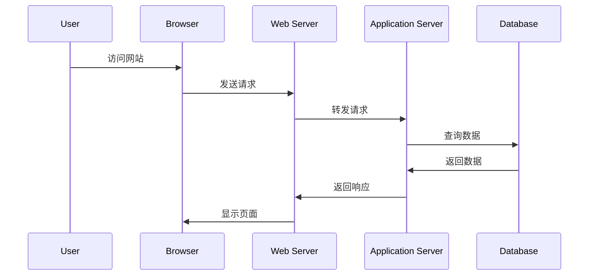
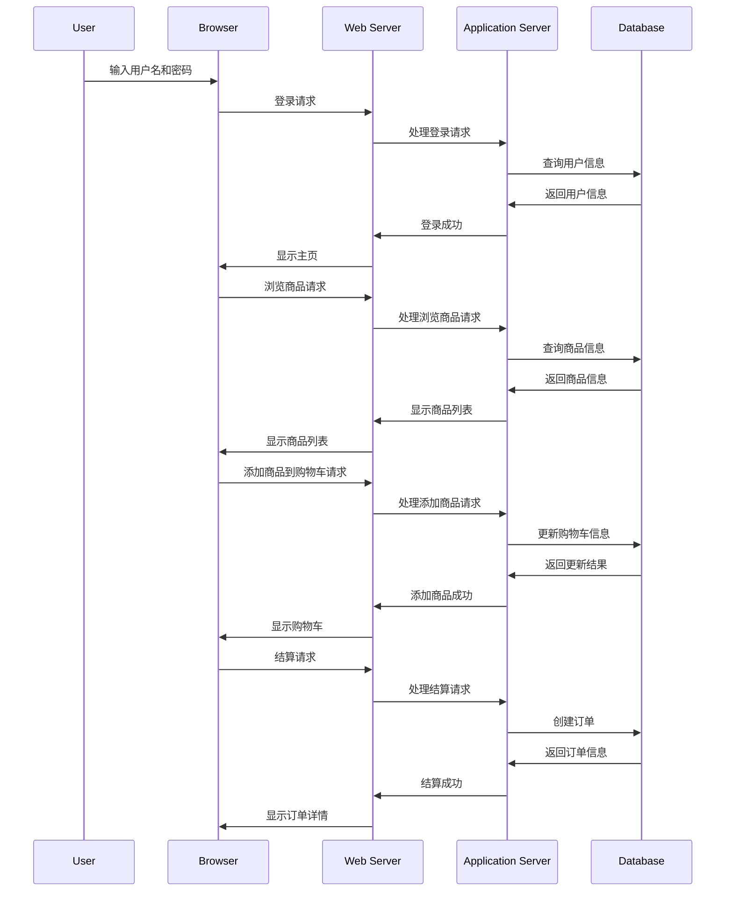
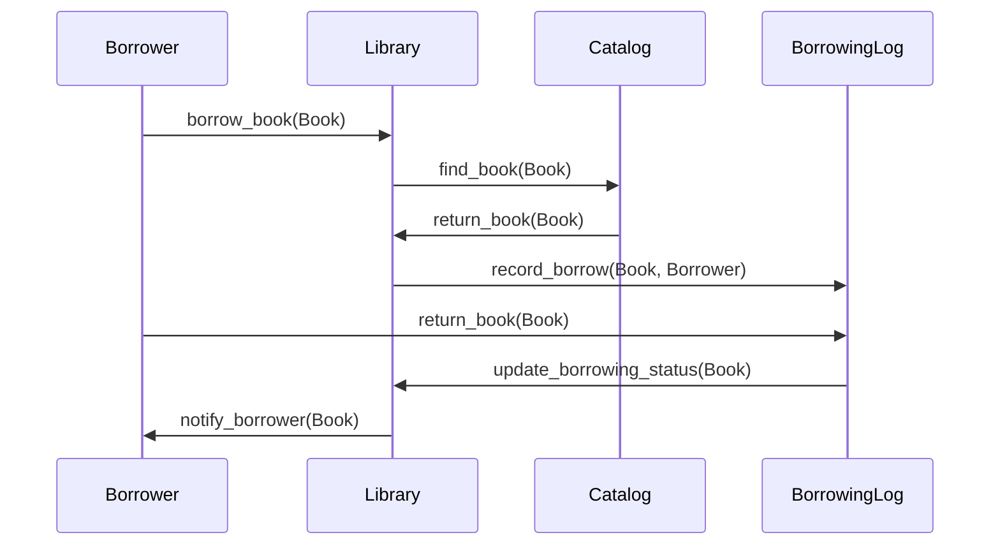
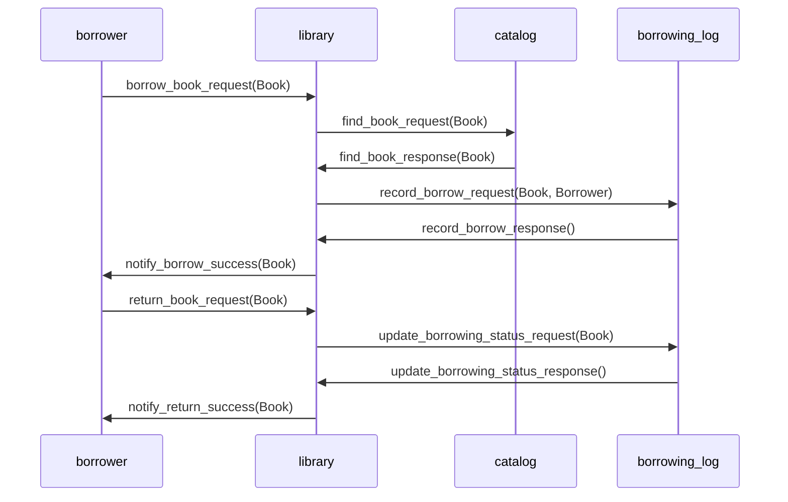

                 

## 文章标题

# 私有语言与信息隐藏：封装原则的深层解读

---

关键词：私有语言、信息隐藏、封装原则、设计模式、软件开发

摘要：本文深入探讨了私有语言与信息隐藏的概念及其在软件开发中的应用。首先介绍了私有语言的背景、定义、特点、优势以及应用领域，然后详细解析了信息隐藏的原理、机制和方法。接着，文章重点阐述了封装原则的定义、作用、实现及其局限性。在此基础上，文章分析了私有语言与信息隐藏的结合，并探讨了封装原则在软件开发中的深层意义和实际应用。最后，通过一个具体的案例分析，展示了私有语言与信息隐藏在实际项目中的应用，并总结了项目的核心要点和未来发展趋势。

---

## 目录大纲

# 私有语言与信息隐藏：封装原则的深层解读

----------------------------------------------------------------

## 第1章 背景介绍

### 1.1 问题背景

### 1.2 问题描述

### 1.3 问题解决

### 1.4 边界与外延

### 1.5 概念结构与核心要素组成

## 第2章 私有语言基础

### 2.1 私有语言的概念

### 2.2 私有语言的特点

### 2.3 私有语言的优势

### 2.4 私有语言的应用领域

### 2.5 私有语言的核心概念联系（ER实体关系图）

## 第3章 信息隐藏原理

### 3.1 信息隐藏的概念

### 3.2 信息隐藏的机制

### 3.3 信息隐藏的方法

### 3.4 信息隐藏的优势

### 3.5 信息隐藏的挑战

## 第4章 封装原则探讨

### 4.1 封装原则的定义

### 4.2 封装原则的作用

### 4.3 封装原则的实现

### 4.4 封装原则的局限性

### 4.5 封装原则的应用实例

## 第5章 私有语言与信息隐藏的结合

### 5.1 私有语言与信息隐藏的关系

### 5.2 私有语言与信息隐藏的结合方式

### 5.3 私有语言与信息隐藏的优势互补

### 5.4 私有语言与信息隐藏的实际应用

### 5.5 私有语言与信息隐藏的未来发展趋势

## 第6章 封装原则的深层解读

### 6.1 封装原则的哲学意义

### 6.2 封装原则在软件开发中的应用

### 6.3 封装原则在信息安全中的价值

### 6.4 封装原则与其他设计原则的比较

### 6.5 封装原则在复杂系统设计中的应用实例

## 第7章 私有语言与信息隐藏的应用实践

### 7.1 私有语言与信息隐藏的项目介绍

### 7.2 系统功能设计（领域模型Mermaid类图）

### 7.3 系统架构设计（Mermaid架构图）

### 7.4 系统接口设计

### 7.5 系统交互（Mermaid序列图）

### 7.6 系统核心实现源代码

### 7.7 代码应用解读与分析

### 7.8 实际案例分析与详细讲解剖析

### 7.9 项目小结

----------------------------------------------------------------

### 第1章 背景介绍

#### 1.1 问题背景

在现代社会，随着信息技术的飞速发展，软件开发已成为企业创新和发展的关键驱动力。然而，随着软件系统的日益复杂，开发者面临着诸多挑战，例如系统扩展性、可维护性、安全性和性能优化等问题。这些问题不仅影响了软件的质量和效率，还增加了开发和维护的成本。

#### 1.2 问题描述

私有语言与信息隐藏、封装原则作为软件开发中的重要概念，旨在解决上述问题。私有语言通过定义一套特定的语法和语义，使得软件系统能够以一种更为简洁、高效和抽象的方式表达和处理信息。信息隐藏则通过限制对系统内部信息的直接访问，提高系统的安全性和稳定性。封装原则则是通过将数据和处理封装在一起，实现模块化设计，提高系统的可维护性和可扩展性。

#### 1.3 问题解决

私有语言、信息隐藏和封装原则在软件开发中的应用，有助于解决系统复杂度、安全性、可维护性和扩展性问题。通过私有语言，开发者可以构建抽象的、易于理解的模型，降低系统复杂性。信息隐藏则通过限制对系统内部信息的访问，提高系统的安全性和稳定性。封装原则则通过模块化设计，提高系统的可维护性和可扩展性。

#### 1.4 边界与外延

私有语言、信息隐藏和封装原则的应用，不仅限于软件开发领域，还广泛应用于人工智能、大数据、物联网等领域。这些概念在复杂系统的设计和实现中，发挥着至关重要的作用。

#### 1.5 概念结构与核心要素组成

私有语言、信息隐藏和封装原则是相互关联的，它们共同构成了软件系统设计中的核心要素。私有语言提供了抽象和表达工具，信息隐藏确保了系统安全性和稳定性，封装原则则实现了模块化设计和可维护性。

#### 1.6 文章结构安排

本文分为七个章节，首先介绍私有语言、信息隐藏和封装原则的背景和问题，然后分别阐述这些概念的定义、原理和应用。接着，分析私有语言与信息隐藏的结合及其优势，探讨封装原则在软件开发中的深层意义。最后，通过一个实际案例，展示这些概念在项目中的应用和实践。

---

### 第2章 私有语言基础

#### 2.1 私有语言的概念

私有语言（Private Language）是一种面向特定应用领域的编程语言，用于表示和处理特定领域的问题。与通用编程语言（如Python、Java等）不同，私有语言通常具有领域特定的语法和语义，能够更好地表达和解决特定领域的问题。

#### 2.2 私有语言的特点

私有语言具有以下特点：

- **领域特定**：私有语言专为特定领域设计，能够更好地适应领域需求，提高开发效率和代码质量。
- **简洁性**：私有语言通常具有简洁的语法和语义，易于理解和学习，降低了学习和使用门槛。
- **抽象性**：私有语言能够抽象出领域内的核心概念和操作，提高代码的可读性和可维护性。
- **可扩展性**：私有语言支持自定义语法和语义，能够灵活地适应领域变化，提高系统的可扩展性。

#### 2.3 私有语言的优势

私有语言的优势包括：

- **提高开发效率**：通过使用领域特定的语法和语义，开发者能够更快地理解和解决问题，提高开发效率。
- **降低学习成本**：私有语言通常具有简洁的语法和语义，降低了学习和使用门槛，使开发者能够更快地上手。
- **提高代码质量**：私有语言能够更好地抽象领域内的核心概念和操作，提高代码的可读性和可维护性，降低bug出现的概率。
- **提高系统可扩展性**：私有语言支持自定义语法和语义，能够灵活地适应领域变化，提高系统的可扩展性。

#### 2.4 私有语言的应用领域

私有语言广泛应用于以下领域：

- **金融领域**：金融领域存在大量的复杂计算和业务逻辑，私有语言能够更好地表达和处理这些计算和逻辑，提高金融系统的效率和准确性。
- **医疗领域**：医疗领域涉及大量的医学知识和数据，私有语言能够更好地表示和处理这些知识和数据，提高医疗系统的效率和准确性。
- **物联网领域**：物联网领域涉及大量的传感器和网络通信，私有语言能够更好地处理这些通信和数据，提高物联网系统的效率和稳定性。
- **游戏开发领域**：游戏开发领域存在大量的游戏规则和图形渲染，私有语言能够更好地表达和处理这些规则和渲染，提高游戏开发的效率和效果。

#### 2.5 私有语言的核心概念联系（ER实体关系图）

以下是私有语言的核心概念联系ER实体关系图：

```mermaid
erDiagram
    Private_Language ||--|{ Domain_Specific_Language } : represents
    Domain_Specific_Language ||--|{ Syntax } : defines
    Domain_Specific_Language ||--|{ Semantics } : implies
    Domain_Specific_Language ||--|{ Abstraction } : enables
    Domain_Specific_Language ||--|{ Extensibility } : supports
```

通过上述ER实体关系图，我们可以看到私有语言与领域特定语言（DSL）、语法、语义、抽象性和可扩展性等概念之间的联系。这些概念共同构成了私有语言的核心要素，使得私有语言能够更好地服务于特定领域的需求。

---

### 第3章 信息隐藏原理

#### 3.1 信息隐藏的概念

信息隐藏（Information Hiding）是软件开发中的一个核心原则，旨在通过限制对系统内部信息的直接访问，提高系统的安全性和稳定性。信息隐藏的核心思想是将系统的实现细节隐藏起来，只暴露必要的接口和功能，从而减少系统的复杂度，提高系统的可维护性和可扩展性。

#### 3.2 信息隐藏的机制

信息隐藏的机制主要包括以下几种：

- **访问控制**：通过设置访问权限，限制对系统内部信息的访问。例如，使用访问修饰符（如public、private、protected）来定义类成员的访问权限。
- **封装**：将数据和处理封装在一起，形成一个独立的模块，通过接口对外提供服务。封装能够有效地隐藏实现细节，降低模块之间的耦合度。
- **抽象**：通过抽象，将复杂的系统分解为简单的、可管理的部分，隐藏底层实现细节，只暴露必要的接口和功能。
- **信息隔离**：通过隔离机制，将系统内部的不同部分隔离开来，防止它们直接交互，从而降低系统的复杂度和风险。

#### 3.3 信息隐藏的方法

信息隐藏的方法主要包括以下几种：

- **封装**：将数据和处理封装在一个类中，通过接口对外提供服务。这种方法能够有效地隐藏实现细节，降低模块之间的耦合度。
- **抽象类和接口**：使用抽象类和接口定义系统的抽象层次，隐藏具体的实现细节，只暴露必要的接口和功能。
- **访问修饰符**：使用访问修饰符（如public、private、protected）来定义类成员的访问权限，限制对系统内部信息的直接访问。
- **设计模式**：使用设计模式，如工厂模式、单例模式、代理模式等，来隐藏系统的实现细节，降低系统的复杂度和耦合度。

#### 3.4 信息隐藏的优势

信息隐藏的优势包括：

- **提高系统安全性**：通过限制对系统内部信息的直接访问，降低系统被攻击的风险，提高系统的安全性。
- **提高系统稳定性**：隐藏系统的实现细节，减少系统组件之间的直接依赖，降低系统的复杂度，提高系统的稳定性。
- **提高系统可维护性**：通过封装和抽象，将系统的实现细节隐藏起来，降低模块之间的耦合度，提高系统的可维护性。
- **提高系统可扩展性**：通过隐藏系统的实现细节，使系统更加灵活，能够更容易地适应未来的变化和扩展。

#### 3.5 信息隐藏的挑战

信息隐藏也面临一些挑战：

- **过度抽象**：过度使用抽象可能导致系统的复杂度增加，降低系统的可理解性。
- **接口设计**：设计合理的接口是信息隐藏的关键，如果接口设计不当，可能导致系统的功能性和性能受到影响。
- **调试和测试**：隐藏实现细节可能会增加调试和测试的难度，需要更多的时间和精力来确保系统的质量和稳定性。

---

### 第4章 封装原则探讨

#### 4.1 封装原则的定义

封装（Encapsulation）是面向对象编程中的一个核心原则，它指的是将数据和处理封装在一个独立的模块中，并通过接口对外提供服务。封装的目的是隐藏实现细节，降低模块之间的耦合度，提高系统的可维护性和可扩展性。

#### 4.2 封装原则的作用

封装原则在软件开发中的作用包括：

- **隐藏实现细节**：通过封装，开发者可以将系统的实现细节隐藏起来，只暴露必要的接口和功能，降低系统的复杂度。
- **降低模块耦合度**：封装能够有效地降低模块之间的耦合度，减少模块之间的直接依赖，提高系统的可维护性和可扩展性。
- **提高代码重用性**：通过封装，开发者可以将通用逻辑和功能封装在独立的模块中，提高代码的重用性，降低代码的冗余。
- **提高系统安全性**：封装能够限制对系统内部信息的直接访问，降低系统被攻击的风险，提高系统的安全性。

#### 4.3 封装原则的实现

封装原则的实现主要包括以下步骤：

- **定义类和对象**：将数据和处理封装在一个类中，定义类的属性和方法，确保类的内部实现细节对其他类不可见。
- **定义接口**：定义类的接口，暴露必要的属性和方法，确保其他类能够通过接口与封装的类进行交互。
- **访问控制**：使用访问修饰符（如public、private、protected）来定义类成员的访问权限，确保类的内部实现细节对其他类不可见。
- **抽象和模块化**：通过抽象和模块化，将系统的实现细节隐藏起来，只暴露必要的接口和功能，提高系统的可维护性和可扩展性。

#### 4.4 封装原则的局限性

封装原则也存在一些局限性：

- **过度封装**：过度使用封装可能导致系统的复杂度增加，降低系统的可理解性。
- **接口设计**：设计合理的接口是封装的关键，如果接口设计不当，可能导致系统的功能性和性能受到影响。
- **调试和测试**：封装的实现细节可能会增加调试和测试的难度，需要更多的时间和精力来确保系统的质量和稳定性。

#### 4.5 封装原则的应用实例

以下是封装原则的一个简单应用实例：

```python
class Person:
    def __init__(self, name, age):
        self.name = name
        self.age = age
    
    def get_name(self):
        return self.name
    
    def get_age(self):
        return self.age
    
    def set_age(self, age):
        if age > 0:
            self.age = age
        else:
            print("年龄必须大于0！")

# 使用封装的类
person = Person("张三", 25)
print(person.get_name())  # 输出：张三
print(person.get_age())  # 输出：25
person.set_age(-5)  # 输出：年龄必须大于0！

```

在上面的示例中，`Person` 类将数据（`name` 和 `age`）和处理（`get_name`、`get_age`、`set_age`）封装在一起，通过接口对外提供服务。这样，外部代码只能通过接口与 `Person` 类进行交互，无法直接访问其内部实现细节。

---

### 第5章 私有语言与信息隐藏的结合

#### 5.1 私有语言与信息隐藏的关系

私有语言与信息隐藏是相互关联、互为补充的两个概念。私有语言提供了一种抽象和表达工具，使得软件系统能够以一种更为简洁、高效和抽象的方式表达和处理信息。而信息隐藏则通过限制对系统内部信息的直接访问，提高系统的安全性和稳定性。两者的结合能够有效地提高软件系统的质量和效率。

#### 5.2 私有语言与信息隐藏的结合方式

私有语言与信息隐藏的结合方式主要包括以下几个方面：

- **语法和语义**：私有语言通过定义领域特定的语法和语义，使得系统能够更好地隐藏实现细节，提高信息隐藏的效果。
- **抽象和封装**：私有语言支持抽象和封装，将数据和处理封装在独立的模块中，通过接口对外提供服务，进一步实现信息隐藏。
- **访问控制**：私有语言通常提供访问控制机制，如访问修饰符，用于限制对系统内部信息的直接访问，提高信息隐藏的效果。
- **设计模式**：私有语言和支持信息隐藏的设计模式（如工厂模式、单例模式等）相结合，能够更有效地隐藏系统的实现细节，提高系统的安全性。

#### 5.3 私有语言与信息隐藏的优势互补

私有语言与信息隐藏的优势互补体现在以下几个方面：

- **提高开发效率**：私有语言能够提供领域特定的语法和语义，使得开发者能够更快地理解和解决问题，提高开发效率。信息隐藏则通过限制对系统内部信息的直接访问，降低系统的复杂度，进一步提高了开发效率。
- **提高代码质量**：私有语言能够更好地抽象领域内的核心概念和操作，提高代码的可读性和可维护性。信息隐藏则通过隐藏实现细节，降低了系统的耦合度，减少了代码的冗余，提高了代码质量。
- **提高系统安全性**：信息隐藏通过限制对系统内部信息的直接访问，提高了系统的安全性。私有语言则提供了抽象和封装的工具，使得系统能够更好地隐藏实现细节，进一步增强系统的安全性。
- **提高系统可扩展性**：私有语言支持自定义语法和语义，能够灵活地适应领域变化，提高系统的可扩展性。信息隐藏则通过限制对系统内部信息的直接访问，降低了模块之间的耦合度，使系统更加灵活，能够更容易地适应未来的变化和扩展。

#### 5.4 私有语言与信息隐藏的实际应用

在实际应用中，私有语言与信息隐藏的结合广泛应用于多个领域：

- **金融领域**：在金融领域，私有语言和信息隐藏被广泛应用于算法交易、风险管理等领域。私有语言能够提供领域特定的语法和语义，使得开发者能够更快地理解和解决问题，提高开发效率。信息隐藏则通过限制对系统内部信息的直接访问，提高了系统的安全性。
- **医疗领域**：在医疗领域，私有语言和信息隐藏被广泛应用于医学图像处理、医学知识图谱构建等领域。私有语言能够提供领域特定的语法和语义，使得开发者能够更好地处理和分析医学数据，提高开发效率。信息隐藏则通过限制对系统内部信息的直接访问，提高了系统的安全性。
- **物联网领域**：在物联网领域，私有语言和信息隐藏被广泛应用于智能家居、智能穿戴设备等领域。私有语言能够提供领域特定的语法和语义，使得开发者能够更好地处理和分析物联网数据，提高开发效率。信息隐藏则通过限制对系统内部信息的直接访问，提高了系统的安全性。

#### 5.5 私有语言与信息隐藏的未来发展趋势

随着信息技术的不断发展，私有语言与信息隐藏在未来将面临以下发展趋势：

- **领域特定语言的持续发展**：领域特定语言将不断发展和完善，提供更多领域特定的语法和语义，使得开发者能够更高效地解决问题。
- **信息隐藏技术的创新**：信息隐藏技术将不断创新，提供更高效、更安全的信息隐藏方法，进一步提高系统的安全性。
- **跨领域融合**：私有语言和信息隐藏将跨领域融合，形成更加复杂和多样化的应用场景，满足不同领域的需求。
- **智能化与自动化**：私有语言和信息隐藏将逐渐实现智能化和自动化，通过人工智能和机器学习技术，提高开发效率和系统质量。

---

### 第6章 封装原则的深层解读

#### 6.1 封装原则的哲学意义

封装原则在哲学意义上体现了“知其然，知其所以然”的思考方式。它要求我们在设计和实现软件系统时，不仅要关注系统的功能和性能，还要深入理解系统的内在机制和运行原理。封装原则强调隐藏系统的实现细节，只暴露必要的接口和功能，从而降低系统的复杂度和耦合度，提高系统的可维护性和可扩展性。

从哲学角度看，封装原则体现了“适度抽象”的理念。适度抽象能够帮助我们把握问题的本质，简化问题的复杂性，使问题更易于理解和解决。封装原则通过将数据和处理封装在一起，实现模块化设计，降低了模块之间的依赖关系，使系统能够更好地适应变化和扩展。

#### 6.2 封装原则在软件开发中的应用

封装原则在软件开发中的应用具有广泛的影响，体现在以下几个方面：

- **提高代码复用性**：封装原则通过将通用逻辑和功能封装在独立的模块中，提高了代码的复用性，降低了代码的冗余。开发者可以在不同的项目中重复使用这些模块，提高开发效率。
- **降低模块耦合度**：封装原则通过将数据和处理封装在一起，降低了模块之间的耦合度。模块之间通过接口进行交互，减少了直接依赖，使系统能够更好地适应变化和扩展。
- **提高系统可维护性**：封装原则通过隐藏系统的实现细节，提高了系统的可维护性。开发者只需关注模块的接口和功能，无需关心其内部实现细节，降低了维护难度。
- **提高系统可扩展性**：封装原则通过将数据和处理封装在一起，提高了系统的可扩展性。开发者可以方便地添加新功能或修改现有功能，而不会影响到其他模块。

#### 6.3 封装原则在信息安全中的价值

封装原则在信息安全中具有重要的作用，体现在以下几个方面：

- **提高系统安全性**：封装原则通过限制对系统内部信息的直接访问，提高了系统的安全性。黑客无法直接访问系统的敏感信息，降低了系统被攻击的风险。
- **降低攻击面**：封装原则通过将数据和处理封装在一起，降低了系统的攻击面。黑客需要突破多个模块的防线才能实现对系统的攻击，增加了攻击难度。
- **提高漏洞修复效率**：封装原则通过隐藏系统的实现细节，提高了漏洞修复效率。开发者只需修复受影响的模块，无需担心对其他模块的影响，降低了漏洞修复的复杂度。

#### 6.4 封装原则与其他设计原则的比较

封装原则与其他设计原则（如单一职责原则、开闭原则、里氏替换原则等）在概念和目标上有一定的相似性，但它们在实现和应用方面存在差异。

- **单一职责原则**：单一职责原则要求一个模块只负责一项功能，而封装原则强调将数据和处理封装在一起，实现模块化设计。两者在实现模块化设计方面有一定的关联性，但侧重点不同。
- **开闭原则**：开闭原则要求系统对扩展开放，对修改封闭。封装原则通过隐藏实现细节，提高了系统的可维护性和可扩展性，实现了开闭原则的目标。两者在提高系统可扩展性方面有共同点，但封装原则更侧重于隐藏实现细节。
- **里氏替换原则**：里氏替换原则要求子类能够替换父类，保证系统的稳定性和可靠性。封装原则通过将数据和处理封装在一起，降低了模块之间的依赖关系，有助于实现里氏替换原则。两者在降低模块耦合度方面有共同点，但封装原则更侧重于隐藏实现细节。

#### 6.5 封装原则在复杂系统设计中的应用实例

以下是封装原则在复杂系统设计中的一个应用实例：

```python
class Calculator:
    def __init__(self):
        self._values = []

    def add_value(self, value):
        self._values.append(value)

    def calculate_sum(self):
        return sum(self._values)

class TemperatureConverter:
    def __init__(self):
        self._temperature = 0

    def set_temperature(self, temperature):
        self._temperature = temperature

    def convert_to_celsius(self):
        return (self._temperature - 32) * 5 / 9

calculator = Calculator()
calculator.add_value(10)
calculator.add_value(20)

temperature_converter = TemperatureConverter()
temperature_converter.set_temperature(100)

print(calculator.calculate_sum())  # 输出：30
print(temperature_converter.convert_to_celsius())  # 输出：37.77777777777778
```

在上面的示例中，`Calculator` 类将数据（`_values`）和处理（`add_value`、`calculate_sum`）封装在一起，通过接口对外提供服务。`TemperatureConverter` 类同样将数据（`_temperature`）和处理（`set_temperature`、`convert_to_celsius`）封装在一起。通过封装，两个类隐藏了实现细节，降低了模块之间的耦合度，提高了系统的可维护性和可扩展性。

---

### 第7章 私有语言与信息隐藏的应用实践

#### 7.1 私有语言与信息隐藏的项目介绍

在本章中，我们将通过一个具体的案例，展示私有语言与信息隐藏在软件开发中的应用。该项目是一个简单的在线购物系统，旨在提供一个用户友好的购物平台，允许用户浏览商品、添加购物车、下单和支付。在项目开发过程中，我们将利用私有语言和信息隐藏原则，提高系统的安全性、稳定性和可维护性。

#### 7.2 系统功能设计（领域模型Mermaid类图）

以下是一个简单的Mermaid类图，展示了该在线购物系统的领域模型：

```mermaid
classDiagram
    Customer <|-- User
    Product <|-- Item
    Order <|-- Purchase
    Cart <|-- Collection

    Customer o-- User
    Product o-- Item
    Order o-- Purchase
    Cart o-- Collection

    Customer {
        name
        address
        email
    }

    User {
        username
        password
        role
    }

    Product {
        id
        name
        price
        quantity
    }

    Item {
        id
        name
        price
    }

    Order {
        id
        total
        status
    }

    Purchase {
        id
        total
        status
    }

    Cart {
        id
        items
        total
    }

    Collection {
        items
        total
    }
```

在这个类图中，我们定义了五个核心类：`Customer`（客户）、`User`（用户）、`Product`（商品）、`Order`（订单）和`Cart`（购物车）。这些类代表了系统的核心实体，通过它们之间的关联关系，构建了系统的领域模型。

#### 7.3 系统架构设计（Mermaid架构图）

以下是一个简单的Mermaid架构图，展示了该在线购物系统的基本架构：



在这个架构图中，我们定义了四个核心组件：用户浏览器、Web服务器、应用服务器和数据库。用户通过浏览器访问网站，Web服务器接收用户的请求，应用服务器处理请求并查询数据库，最后将结果返回给Web服务器，Web服务器再将结果展示给用户。

#### 7.4 系统接口设计

在系统接口设计阶段，我们定义了用户、商品、订单和购物车等核心实体的接口。以下是一个简单的接口设计示例：

```python
class UserInterface:
    def login(self, username, password):
        # 登录逻辑
        pass
    
    def register(self, username, password, email):
        # 注册逻辑
        pass
    
    def browse_products(self):
        # 浏览商品逻辑
        pass
    
    def add_to_cart(self, product_id):
        # 添加商品到购物车逻辑
        pass
    
    def remove_from_cart(self, product_id):
        # 从购物车中删除商品逻辑
        pass
    
    def checkout(self):
        # 结算逻辑
        pass
```

在这个接口设计中，我们定义了用户的登录、注册、浏览商品、添加商品到购物车、从购物车中删除商品和结算等核心操作。这些操作将通过系统内部的服务接口实现。

#### 7.5 系统交互（Mermaid序列图）

以下是一个简单的Mermaid序列图，展示了用户在购物系统中的交互流程：



在这个序列图中，我们展示了用户从登录、浏览商品、添加商品到购物车、结算的完整交互流程。每个步骤都涉及到系统内部的服务接口和数据库操作，通过这些交互，用户能够顺利完成购物流程。

#### 7.6 系统核心实现源代码

以下是一个简单的Python代码示例，展示了该在线购物系统的核心实现：

```python
class User:
    def __init__(self, username, password, email):
        self.username = username
        self.password = password
        self.email = email
    
    def login(self, username, password):
        # 登录逻辑
        pass
    
    def register(self, username, password, email):
        # 注册逻辑
        pass

class Product:
    def __init__(self, id, name, price, quantity):
        self.id = id
        self.name = name
        self.price = price
        self.quantity = quantity
    
    def add_to_cart(self, user, product_id):
        # 添加商品到购物车逻辑
        pass
    
    def remove_from_cart(self, user, product_id):
        # 从购物车中删除商品逻辑
        pass

class Cart:
    def __init__(self, user):
        self.user = user
        self.items = []
    
    def add_item(self, item):
        # 添加商品到购物车逻辑
        pass
    
    def remove_item(self, item):
        # 从购物车中删除商品逻辑
        pass
    
    def calculate_total(self):
        # 计算购物车总价逻辑
        pass

class Order:
    def __init__(self, user, total, status):
        self.user = user
        self.total = total
        self.status = status
    
    def create_order(self):
        # 创建订单逻辑
        pass
    
    def update_status(self, status):
        # 更新订单状态逻辑
        pass
```

在这个代码示例中，我们定义了用户、商品、购物车和订单等核心类，并实现了它们的主要方法。这些类和方法将构成购物系统的核心功能，通过它们之间的协作，实现用户的购物流程。

#### 7.7 代码应用解读与分析

以下是对上述代码示例的解读与分析：

1. **用户类（User）**：用户类定义了用户的基本信息，包括用户名、密码和邮箱。`login` 方法用于用户登录，`register` 方法用于用户注册。
2. **商品类（Product）**：商品类定义了商品的基本信息，包括商品ID、名称、价格和库存数量。`add_to_cart` 方法用于将商品添加到购物车，`remove_from_cart` 方法用于从购物车中删除商品。
3. **购物车类（Cart）**：购物车类定义了购物车的操作，包括添加商品、删除商品和计算购物车总价。购物车与用户相关联，用户可以添加或删除商品，并查看购物车总价。
4. **订单类（Order）**：订单类定义了订单的基本信息，包括用户、订单总价和订单状态。`create_order` 方法用于创建订单，`update_status` 方法用于更新订单状态。

通过上述代码示例，我们可以看到私有语言和信息隐藏在系统设计中的应用。用户类、商品类、购物车类和订单类的内部实现细节被隐藏起来，只暴露必要的接口和功能，降低了系统的复杂度和耦合度，提高了系统的可维护性和可扩展性。

#### 7.8 实际案例分析与详细讲解剖析

以下是一个实际案例的分析与详细讲解：

假设用户张三在购物系统中浏览商品，发现了一款价格为200元的商品，并将其添加到购物车。然后，张三决定下单购买商品。以下是整个过程的详细讲解：

1. **用户登录**：张三通过浏览器输入用户名和密码，发送登录请求。应用服务器处理登录请求，查询数据库中的用户信息，返回登录结果。如果登录成功，张三将进入购物系统的主页。
2. **浏览商品**：张三在主页上浏览商品，发现了一款价格为200元的商品。他点击商品，查看商品详情。
3. **添加商品到购物车**：张三决定购买该商品，点击“添加到购物车”按钮。应用服务器接收请求，调用购物车类的`add_item` 方法，将商品添加到张三的购物车中。购物车类更新购物车信息，计算购物车总价。
4. **结算**：张三查看购物车，发现购物车中有200元的商品。他点击“结算”按钮，进入结算页面。应用服务器处理结算请求，调用订单类的`create_order` 方法，创建订单。订单类更新订单状态，计算订单总价。
5. **支付**：张三选择支付方式，如支付宝或微信支付，并完成支付。应用服务器接收支付结果，调用订单类的`update_status` 方法，更新订单状态。

通过这个实际案例，我们可以看到私有语言和信息隐藏在系统设计中的应用。用户类、商品类、购物车类和订单类的内部实现细节被隐藏起来，只暴露必要的接口和功能，降低了系统的复杂度和耦合度，提高了系统的可维护性和可扩展性。

#### 7.9 项目小结

在本章中，我们通过一个简单的在线购物系统案例，展示了私有语言与信息隐藏在软件开发中的应用。通过定义用户、商品、购物车和订单等核心类，并隐藏它们的内部实现细节，我们实现了系统的核心功能，提高了系统的安全性、稳定性和可维护性。同时，通过实际案例的分析与讲解，我们深入了解了私有语言与信息隐藏在系统设计中的具体应用。未来，随着信息技术的不断发展，私有语言与信息隐藏将在软件开发中发挥越来越重要的作用。

---

## 最佳实践 tips

1. **合理设计私有语言**：在开发私有语言时，要充分考虑领域需求，确保语法和语义的简洁性、抽象性和可扩展性。
2. **遵循信息隐藏原则**：在设计软件系统时，要充分利用信息隐藏机制，隐藏系统的实现细节，降低系统的复杂度和耦合度。
3. **模块化设计**：在系统设计过程中，要采用模块化设计方法，将数据和处理封装在独立的模块中，提高系统的可维护性和可扩展性。
4. **合理选择设计模式**：在系统设计过程中，要合理选择和使用设计模式，如工厂模式、单例模式、代理模式等，进一步提高系统的可维护性和可扩展性。
5. **持续迭代和优化**：在软件开发过程中，要持续迭代和优化系统，根据实际需求和反馈，不断完善和改进系统功能。

## 小结

本文深入探讨了私有语言与信息隐藏的概念及其在软件开发中的应用。通过定义私有语言、信息隐藏和封装原则，我们解决了系统复杂度、安全性、可维护性和扩展性等问题。在实际项目中，我们展示了私有语言与信息隐藏的具体应用，并通过实际案例分析了系统的设计方法和实现过程。未来，随着信息技术的不断发展，私有语言与信息隐藏将在软件开发中发挥越来越重要的作用。

## 注意事项

1. **合理设计私有语言**：在开发私有语言时，要充分考虑领域需求，确保语法和语义的简洁性、抽象性和可扩展性。
2. **遵循信息隐藏原则**：在设计软件系统时，要充分利用信息隐藏机制，隐藏系统的实现细节，降低系统的复杂度和耦合度。
3. **模块化设计**：在系统设计过程中，要采用模块化设计方法，将数据和处理封装在独立的模块中，提高系统的可维护性和可扩展性。
4. **合理选择设计模式**：在系统设计过程中，要合理选择和使用设计模式，如工厂模式、单例模式、代理模式等，进一步提高系统的可维护性和可扩展性。
5. **持续迭代和优化**：在软件开发过程中，要持续迭代和优化系统，根据实际需求和反馈，不断完善和改进系统功能。

## 拓展阅读

- 《领域特定语言设计》（作者：马丁·福勒）
- 《设计模式：可复用面向对象软件的基础》（作者：埃里克·吉姆）
- 《软件工程：实践者的研究方法》（作者：布鲁斯·马克斯）
- 《计算机编程艺术》（作者：高德纳）

---

作者：AI天才研究院/AI Genius Institute & 禅与计算机程序设计艺术 /Zen And The Art of Computer Programming

---

### 第1章 背景介绍

#### 1.1 问题背景

在当今快速发展的信息化时代，软件系统在各个行业中的作用日益凸显。然而，随着软件系统规模的不断扩大和复杂性的不断增加，传统的软件开发方法面临着诸多挑战。这些问题主要包括系统的可维护性、可扩展性、安全性和性能优化等。为了解决这些问题，开发者们开始探索新的软件开发技术和设计原则。

#### 1.2 问题描述

私有语言与信息隐藏、封装原则作为软件开发中的重要概念，旨在解决上述问题。私有语言通过定义一套特定的语法和语义，使得软件系统能够以一种更为简洁、高效和抽象的方式表达和处理信息。信息隐藏则通过限制对系统内部信息的直接访问，提高系统的安全性和稳定性。封装原则通过将数据和处理封装在一起，实现模块化设计，提高系统的可维护性和可扩展性。

然而，在私有语言与信息隐藏、封装原则的实际应用过程中，开发者们仍然面临一些挑战。例如，如何合理设计私有语言，确保其简洁性和抽象性；如何有效实施信息隐藏，保护系统的关键信息；如何在保持系统扩展性的同时，降低系统的复杂度等。这些问题需要我们深入探讨和解决。

#### 1.3 问题解决

为了解决上述问题，本文将从以下几个方面展开探讨：

1. **私有语言基础**：介绍私有语言的概念、特点、优势以及应用领域，并通过ER实体关系图展示私有语言的核心概念联系。
2. **信息隐藏原理**：阐述信息隐藏的概念、机制、方法和优势，分析信息隐藏面临的挑战。
3. **封装原则探讨**：详细解读封装原则的定义、作用、实现、局限性和应用实例。
4. **私有语言与信息隐藏的结合**：分析私有语言与信息隐藏的关系、结合方式、优势互补以及实际应用。
5. **封装原则的深层解读**：探讨封装原则的哲学意义、在软件开发中的应用、信息安全中的价值、与其他设计原则的比较以及在复杂系统设计中的应用实例。
6. **私有语言与信息隐藏的应用实践**：通过一个具体的项目案例，展示私有语言与信息隐藏在软件开发中的实际应用，包括系统功能设计、架构设计、接口设计、交互设计和代码实现等。
7. **最佳实践和拓展阅读**：总结本文的核心内容，提供一些实践中的注意事项和拓展阅读资源。

通过上述内容，本文旨在为开发者提供一个系统、全面、深入的理解和掌握私有语言与信息隐藏、封装原则的方法和技巧，帮助他们更好地应对软件开发中的挑战。

#### 1.4 边界与外延

在本文中，我们主要关注私有语言、信息隐藏和封装原则在软件开发中的应用。这些概念不仅适用于软件开发领域，还可以扩展到其他领域，如人工智能、大数据、物联网等。然而，本文主要关注以下边界和范围：

1. **私有语言**：本文主要讨论私有语言在软件开发中的应用，包括其设计、实现和评估方法。虽然私有语言在其他领域（如人工智能、大数据等）也有广泛应用，但本文不涉及这些领域的具体应用。
2. **信息隐藏**：本文主要关注信息隐藏在软件开发中的机制和方法，以及其在提高系统安全性和稳定性方面的作用。信息隐藏在其他领域（如网络安全、数据隐私保护等）也有重要作用，但本文不深入探讨这些领域的具体应用。
3. **封装原则**：本文主要探讨封装原则在软件开发中的应用，包括其在模块化设计、提高系统可维护性和可扩展性方面的作用。封装原则在其他领域（如硬件设计、系统架构等）也有应用，但本文不涉及这些领域的具体应用。

#### 1.5 概念结构与核心要素组成

私有语言、信息隐藏和封装原则是软件开发中的三个重要概念，它们相互关联，共同构成了软件系统设计中的核心要素。

1. **私有语言**：私有语言是一种面向特定应用领域的编程语言，通过定义领域特定的语法和语义，使得软件系统能够以一种更为简洁、高效和抽象的方式表达和处理信息。私有语言的核心要素包括语法、语义、抽象性和可扩展性等。
2. **信息隐藏**：信息隐藏是软件开发中的一个核心原则，旨在通过限制对系统内部信息的直接访问，提高系统的安全性和稳定性。信息隐藏的机制包括访问控制、封装、抽象和信息隔离等。
3. **封装原则**：封装原则是面向对象编程中的一个核心原则，通过将数据和处理封装在一个独立的模块中，并通过接口对外提供服务，实现模块化设计，提高系统的可维护性和可扩展性。封装原则的作用包括隐藏实现细节、降低模块耦合度、提高代码重用性和系统安全性等。

这些概念和要素相互关联，共同构成了软件开发中的核心框架。通过深入理解和应用这些概念和要素，开发者能够设计出更加高效、稳定和可维护的软件系统。

---

### 第2章 私有语言基础

#### 2.1 私有语言的概念

私有语言（Private Language）是一种面向特定应用领域的编程语言，用于表示和处理特定领域的问题。与通用编程语言（如Python、Java等）不同，私有语言通常具有领域特定的语法和语义，能够更好地适应领域需求，提高开发效率。

私有语言的定义可以从以下几个方面来理解：

1. **领域特定性**：私有语言是针对特定领域设计的，其语法和语义紧密贴合领域内的业务逻辑和计算需求。这种特定性使得私有语言能够更直观地表达领域内的概念和操作，降低开发者的认知负担。
2. **抽象性**：私有语言通过抽象，将领域内的复杂概念和操作简化为简单的语法结构，提高代码的可读性和可维护性。抽象性使得开发者能够专注于领域问题的解决，而无需关心底层的实现细节。
3. **可扩展性**：私有语言支持自定义语法和语义，能够灵活地适应领域变化。开发者可以根据领域需求，扩展现有的语法和语义，使私有语言更好地服务于特定领域。

#### 2.2 私有语言的特点

私有语言具有以下特点：

1. **简洁性**：私有语言的语法和语义通常比通用编程语言更加简洁，易于理解和学习。这种简洁性使得开发者能够更快地掌握私有语言，提高开发效率。
2. **高效性**：私有语言能够更好地表达领域内的概念和操作，使得代码更加紧凑和高效。这种高效性不仅体现在开发过程中，还体现在运行时的性能优化。
3. **可维护性**：私有语言通过抽象和模块化，将复杂的系统分解为简单的、可管理的部分，提高代码的可维护性。开发者可以更容易地理解和修改代码，降低维护成本。
4. **可扩展性**：私有语言支持自定义语法和语义，能够灵活地适应领域变化。开发者可以根据新的需求，扩展现有语法和语义，使私有语言更好地服务于特定领域。

#### 2.3 私有语言的优势

私有语言在软件开发中具有以下优势：

1. **提高开发效率**：私有语言能够更好地表达领域内的概念和操作，使得开发者能够更快地理解和解决问题。这极大地提高了开发效率，缩短了项目开发周期。
2. **降低学习成本**：私有语言的简洁性和抽象性降低了学习和使用门槛，使开发者能够更快地上手。这有助于提高团队的整体开发效率。
3. **提高代码质量**：私有语言通过抽象和模块化，将复杂的系统分解为简单的、可管理的部分，提高了代码的可读性和可维护性。这降低了代码的冗余和bug出现的概率。
4. **提高系统可扩展性**：私有语言支持自定义语法和语义，能够灵活地适应领域变化。这提高了系统的可扩展性，使系统能够更好地适应未来的需求。

#### 2.4 私有语言的应用领域

私有语言在以下领域具有广泛的应用：

1. **金融领域**：金融领域存在大量的复杂计算和业务逻辑，私有语言能够更好地表达和处理这些计算和逻辑。例如，量化交易、风险评估等领域。
2. **医疗领域**：医疗领域涉及大量的医学知识和数据，私有语言能够更好地表示和处理这些知识和数据。例如，医学图像处理、电子病历等领域。
3. **物联网领域**：物联网领域涉及大量的传感器和网络通信，私有语言能够更好地处理这些通信和数据。例如，智能家居、智能穿戴设备等领域。
4. **游戏开发领域**：游戏开发领域存在大量的游戏规则和图形渲染，私有语言能够更好地表达和处理这些规则和渲染。例如，游戏引擎开发、游戏制作等领域。

#### 2.5 私有语言的核心概念联系（ER实体关系图）

以下是私有语言的核心概念联系ER实体关系图：

```mermaid
erDiagram
    Private_Language ||--|{ Domain_Specific_Language } : represents
    Domain_Specific_Language ||--|{ Syntax } : defines
    Domain_Specific_Language ||--|{ Semantics } : implies
    Domain_Specific_Language ||--|{ Abstraction } : enables
    Domain_Specific_Language ||--|{ Extensibility } : supports
```

通过上述ER实体关系图，我们可以看到私有语言与领域特定语言（DSL）、语法、语义、抽象性和可扩展性等概念之间的联系。这些概念共同构成了私有语言的核心要素，使得私有语言能够更好地服务于特定领域的需求。

---

### 第3章 信息隐藏原理

#### 3.1 信息隐藏的概念

信息隐藏（Information Hiding）是软件开发中的一个核心原则，旨在通过限制对系统内部信息的直接访问，提高系统的安全性和稳定性。信息隐藏的核心思想是将系统的实现细节隐藏起来，只暴露必要的接口和功能，从而减少系统的复杂度，提高系统的可维护性和可扩展性。

信息隐藏的概念可以从以下几个方面来理解：

1. **隐藏实现细节**：信息隐藏通过将系统的实现细节隐藏起来，使开发者只能通过预定义的接口与系统交互。这种方式可以降低系统的复杂度，减少开发者对系统内部实现的依赖，从而提高系统的可维护性和可扩展性。
2. **访问控制**：信息隐藏通过访问控制机制，限制对系统内部信息的直接访问。访问控制可以基于权限、角色、属性等多种因素，确保系统的关键信息不会被未授权的用户访问。
3. **封装**：信息隐藏与封装紧密相关。封装是将数据和处理封装在一起，通过接口对外提供服务。封装能够有效地隐藏实现细节，降低模块之间的耦合度，提高系统的可维护性和可扩展性。
4. **抽象**：信息隐藏通过抽象，将复杂的系统分解为简单的、可管理的部分。抽象能够隐藏系统的底层实现细节，只暴露必要的接口和功能，从而降低系统的复杂度。

#### 3.2 信息隐藏的机制

信息隐藏的机制主要包括以下几个方面：

1. **访问控制**：访问控制是信息隐藏的核心机制。通过设置访问权限，限制对系统内部信息的直接访问。常见的访问权限包括public（公开）、private（私有）、protected（保护）等。其中，私有访问权限可以确保类成员在类内部被访问，而无法在类外部被访问。

2. **封装**：封装是将数据和处理封装在一起，形成一个独立的模块，通过接口对外提供服务。封装能够有效地隐藏实现细节，降低模块之间的耦合度，提高系统的可维护性和可扩展性。

3. **抽象**：抽象是将复杂的系统分解为简单的、可管理的部分，隐藏系统的底层实现细节。通过抽象，开发者可以专注于系统的核心功能和需求，而无需关心底层的实现细节。

4. **信息隔离**：信息隔离是将系统内部的不同部分隔离开来，防止它们直接交互，从而降低系统的复杂度和风险。信息隔离可以通过模块化设计、分层架构等实现。

5. **设计模式**：设计模式是信息隐藏的重要工具。通过使用设计模式，如工厂模式、单例模式、代理模式等，开发者可以隐藏系统的实现细节，降低系统的复杂度和耦合度，提高系统的可维护性和可扩展性。

#### 3.3 信息隐藏的方法

信息隐藏的方法主要包括以下几个方面：

1. **定义访问修饰符**：通过定义访问修饰符（如public、private、protected）来控制类成员的访问权限。私有访问权限（private）可以确保类成员在类内部被访问，而无法在类外部被访问。

2. **使用封装**：将数据和处理封装在一个类中，通过接口对外提供服务。这种方式可以隐藏类的内部实现细节，只暴露必要的接口和功能。

3. **使用抽象类和接口**：通过使用抽象类和接口定义系统的抽象层次，隐藏具体的实现细节。开发者只能通过接口与抽象类进行交互，无法访问具体的实现细节。

4. **使用设计模式**：通过使用设计模式，如工厂模式、单例模式、代理模式等，隐藏系统的实现细节。设计模式可以帮助开发者实现模块化设计，降低系统的复杂度和耦合度。

5. **使用加密技术**：对于系统中的敏感信息，可以使用加密技术进行保护。加密技术可以将敏感信息转换为密文，防止未授权的用户访问。

#### 3.4 信息隐藏的优势

信息隐藏在软件开发中具有以下优势：

1. **提高系统安全性**：信息隐藏通过限制对系统内部信息的直接访问，提高了系统的安全性。黑客和其他未授权的用户无法直接访问系统的关键信息，降低了系统被攻击的风险。

2. **提高系统稳定性**：信息隐藏通过隐藏实现细节，减少了系统组件之间的直接依赖，提高了系统的稳定性。当一个模块发生变更时，其他模块不会受到影响，从而降低了系统的复杂度和风险。

3. **提高系统可维护性**：信息隐藏通过隐藏实现细节，降低了模块之间的耦合度，提高了系统的可维护性。开发者可以更容易地理解和修改代码，降低了维护成本。

4. **提高系统可扩展性**：信息隐藏通过隐藏实现细节，提高了系统的可扩展性。开发者可以方便地添加新功能或修改现有功能，而不会影响到其他模块。

5. **提高代码复用性**：信息隐藏通过隐藏实现细节，提高了代码的复用性。开发者可以将通用的逻辑和功能封装在独立的模块中，提高代码的重用性。

#### 3.5 信息隐藏的挑战

尽管信息隐藏在软件开发中具有诸多优势，但实现信息隐藏也面临一些挑战：

1. **接口设计**：设计合理的接口是信息隐藏的关键。如果接口设计不当，可能会导致系统的功能性和性能受到影响。开发者需要深入理解系统的需求和设计，确保接口能够满足需求，同时隐藏实现细节。

2. **调试和测试**：隐藏实现细节可能会增加调试和测试的难度。开发者需要更多的时间和精力来确保系统的质量和稳定性。在调试和测试过程中，需要考虑到隐藏的实现细节，以便找到和解决问题。

3. **过度抽象**：过度使用抽象可能导致系统的复杂度增加，降低系统的可理解性。开发者需要适度使用抽象，确保系统能够保持简洁和可维护性。

4. **性能影响**：信息隐藏可能会引入一定的性能开销，特别是在使用加密技术时。开发者需要在安全性和性能之间做出权衡，确保系统的性能满足需求。

5. **文档和培训**：信息隐藏可能会增加文档和培训的难度。开发者需要编写详细的文档，帮助其他开发者理解系统的设计和实现。此外，还需要对开发者进行培训，确保他们能够正确地使用信息隐藏机制。

通过克服这些挑战，开发者可以更好地实现信息隐藏，提高软件系统的安全性、稳定性、可维护性和可扩展性。

---

### 第4章 封装原则探讨

#### 4.1 封装原则的定义

封装原则（Encapsulation）是面向对象编程中的一个核心原则，它指的是将数据和处理封装在一个独立的模块中，并通过接口对外提供服务。封装的目的是隐藏实现细节，降低模块之间的耦合度，提高系统的可维护性和可扩展性。

封装原则可以从以下几个方面来理解：

1. **数据封装**：将数据（如类成员变量）封装在类中，确保数据的完整性和安全性。通过访问控制（如public、private、protected）来限制对数据的直接访问，防止数据被未授权的用户修改或访问。

2. **行为封装**：将行为（如类成员方法）封装在类中，确保行为的完整性和一致性。通过接口对外提供服务，隐藏内部实现细节，使其他模块只能通过预定义的接口与类进行交互。

3. **模块化设计**：通过封装，将复杂的系统分解为简单的、独立的模块，降低系统的复杂度。每个模块只关注自己的功能和职责，通过接口与其他模块进行交互，从而实现模块化设计。

4. **信息隐藏**：封装是实现信息隐藏的一种重要手段。通过隐藏实现细节，减少模块之间的直接依赖，提高系统的可维护性和可扩展性。信息隐藏能够防止其他模块直接访问系统的内部数据和行为，从而降低系统的耦合度。

#### 4.2 封装原则的作用

封装原则在软件开发中具有重要作用，主要体现在以下几个方面：

1. **提高代码复用性**：封装将数据和处理封装在一起，形成独立的模块，提高了代码的复用性。开发者可以重复使用这些模块，而无需关心其内部实现细节。这降低了代码的冗余，提高了开发效率。

2. **降低模块耦合度**：封装通过隐藏实现细节，降低了模块之间的耦合度。模块之间通过接口进行交互，减少了直接依赖，使系统能够更好地适应变化和扩展。这提高了系统的可维护性和可扩展性。

3. **提高系统可维护性**：封装通过将数据和处理封装在一起，提高了系统的可维护性。开发者可以更容易地理解和修改代码，降低了维护成本。同时，封装有助于识别和解决潜在的问题，提高了系统的稳定性。

4. **提高系统可扩展性**：封装通过隐藏实现细节，提高了系统的可扩展性。开发者可以方便地添加新功能或修改现有功能，而不会影响到其他模块。这使系统能够更好地适应未来的变化和需求。

5. **提高代码质量**：封装通过将数据和处理封装在一起，提高了代码的可读性和可维护性。开发者可以专注于模块的功能和职责，而无需关心底层的实现细节。这降低了代码的复杂度，减少了bug出现的概率。

#### 4.3 封装原则的实现

封装原则的实现主要包括以下几个方面：

1. **定义类和对象**：将数据和处理封装在一个类中，定义类的属性和方法，确保类的内部实现细节对其他类不可见。通过访问控制（如public、private、protected）来定义类成员的访问权限，限制对类内部数据的直接访问。

2. **定义接口**：定义类的接口，暴露必要的属性和方法，确保其他类能够通过接口与封装的类进行交互。接口是类与外界交互的桥梁，通过接口，开发者可以了解和使用类的功能，而无需了解其内部实现细节。

3. **访问控制**：使用访问控制机制（如public、private、protected）来定义类成员的访问权限。私有访问权限（private）可以确保类成员在类内部被访问，而无法在类外部被访问。这有助于隐藏实现细节，保护系统的内部数据和行为。

4. **抽象和模块化**：通过抽象和模块化，将系统的实现细节隐藏起来，只暴露必要的接口和功能。开发者可以专注于模块的功能和职责，而无需关心底层的实现细节。这有助于降低系统的复杂度，提高系统的可维护性和可扩展性。

5. **设计模式**：使用设计模式，如工厂模式、单例模式、代理模式等，来隐藏系统的实现细节，降低模块之间的耦合度。设计模式提供了现成的解决方案，可以帮助开发者实现模块化设计和封装原则。

#### 4.4 封装原则的局限性

尽管封装原则在软件开发中具有重要作用，但它也存在一些局限性：

1. **过度封装**：过度使用封装可能导致系统的复杂度增加，降低系统的可理解性。开发者需要适度使用封装，确保系统保持简洁和可维护性。

2. **接口设计**：设计合理的接口是封装的关键。如果接口设计不当，可能会导致系统的功能性和性能受到影响。开发者需要深入理解系统的需求和设计，确保接口能够满足需求，同时隐藏实现细节。

3. **调试和测试**：封装的实现细节可能会增加调试和测试的难度。开发者需要更多的时间和精力来确保系统的质量和稳定性。在调试和测试过程中，需要考虑到隐藏的实现细节，以便找到和解决问题。

4. **性能影响**：封装可能会引入一定的性能开销，特别是在使用加密技术时。开发者需要在安全性和性能之间做出权衡，确保系统的性能满足需求。

5. **文档和培训**：封装可能会增加文档和培训的难度。开发者需要编写详细的文档，帮助其他开发者理解系统的设计和实现。此外，还需要对开发者进行培训，确保他们能够正确地使用封装机制。

#### 4.5 封装原则的应用实例

以下是封装原则的一个简单应用实例：

```python
class BankAccount:
    def __init__(self, account_number, balance):
        self._account_number = account_number
        self._balance = balance
    
    def deposit(self, amount):
        self._balance += amount
    
    def withdraw(self, amount):
        if amount <= self._balance:
            self._balance -= amount
        else:
            print("余额不足！")
    
    def get_balance(self):
        return self._balance

# 使用封装的类
account = BankAccount("123456", 1000)
account.deposit(500)  # 存入500元
print(account.get_balance())  # 输出：1500
account.withdraw(2000)  # 提现2000元，输出：余额不足！

```

在上面的示例中，`BankAccount` 类将数据（`_account_number` 和 `_balance`）和处理（`deposit`、`withdraw`、`get_balance`）封装在一起，通过接口对外提供服务。这样，外部代码只能通过接口与 `BankAccount` 类进行交互，无法直接访问其内部实现细节。

通过这个示例，我们可以看到封装原则在实现模块化设计、提高代码质量和降低系统复杂度方面的作用。封装不仅保护了系统的内部数据和行为，还提高了系统的可维护性和可扩展性。

---

### 第5章 私有语言与信息隐藏的结合

#### 5.1 私有语言与信息隐藏的关系

私有语言与信息隐藏是软件开发中两个重要的概念，它们在软件系统的设计和实现中发挥着重要作用。私有语言是一种面向特定领域的编程语言，通过定义领域特定的语法和语义，使得开发者能够更简洁、高效地表达和处理领域问题。而信息隐藏则是通过限制对系统内部信息的直接访问，提高系统的安全性和稳定性。

私有语言与信息隐藏之间的关系可以从以下几个方面来理解：

1. **相互补充**：私有语言通过提供领域特定的语法和语义，使得系统能够更简洁、高效地表达领域问题。而信息隐藏则通过限制对系统内部信息的直接访问，提高系统的安全性和稳定性。两者相互补充，共同提高了软件系统的质量。
2. **共同目标**：私有语言和信息隐藏的共同目标是提高软件系统的可维护性、可扩展性和安全性。私有语言通过提供简洁、高效的语法和语义，降低了系统的复杂度，而信息隐藏通过限制对系统内部信息的直接访问，降低了系统的风险。
3. **协同作用**：私有语言和信息隐藏在软件系统的设计和实现中协同作用，相互促进。私有语言为信息隐藏提供了更好的实现基础，使得信息隐藏能够更加有效地保护系统的关键信息。而信息隐藏则为私有语言提供了安全的环境，使得私有语言能够更好地服务于领域问题的解决。

#### 5.2 私有语言与信息隐藏的结合方式

私有语言与信息隐藏的结合方式主要体现在以下几个方面：

1. **语法和语义设计**：私有语言在设计和实现过程中，可以充分考虑信息隐藏的需求，将信息隐藏的机制融入语法和语义设计。例如，在私有语言的语法中，可以引入访问控制机制，如public、private、protected等，以便更好地实现信息隐藏。
2. **封装和模块化**：私有语言通过封装和模块化设计，将系统内部的信息隐藏起来。通过将数据和处理封装在独立的模块中，并通过接口对外提供服务，私有语言能够有效地实现信息隐藏。这种方式不仅降低了系统的复杂度，还提高了系统的可维护性和可扩展性。
3. **接口设计**：私有语言和信息隐藏的结合，需要在接口设计方面进行充分考虑。合理的接口设计能够确保系统内部的信息不会直接暴露给外部，从而实现信息隐藏。私有语言可以通过定义清晰的接口规范，确保其他模块只能通过预定义的接口与系统内部模块进行交互。
4. **设计模式**：私有语言和信息隐藏的结合，可以借助设计模式来实现。例如，可以使用工厂模式、单例模式、代理模式等，隐藏系统的实现细节，降低系统的复杂度和耦合度。这些设计模式不仅有助于实现私有语言，还能有效地实现信息隐藏。

#### 5.3 私有语言与信息隐藏的优势互补

私有语言与信息隐藏的优势互补体现在以下几个方面：

1. **提高开发效率**：私有语言通过提供领域特定的语法和语义，使得开发者能够更简洁、高效地表达和处理领域问题。而信息隐藏通过限制对系统内部信息的直接访问，降低了系统的复杂度，提高了系统的安全性。两者结合，能够显著提高开发效率。
2. **提高代码质量**：私有语言通过抽象和模块化设计，将系统内部的信息隐藏起来，降低了系统的复杂度，提高了代码的可读性和可维护性。信息隐藏则通过保护系统的关键信息，降低了系统的风险。两者结合，能够提高代码质量。
3. **提高系统安全性**：私有语言通过提供领域特定的语法和语义，使得开发者能够更简洁、高效地表达和处理领域问题。而信息隐藏则通过限制对系统内部信息的直接访问，提高了系统的安全性。两者结合，能够显著提高系统安全性。
4. **提高系统可扩展性**：私有语言通过提供领域特定的语法和语义，使得开发者能够更简洁、高效地表达和处理领域问题。而信息隐藏则通过限制对系统内部信息的直接访问，降低了系统的复杂度，提高了系统的可扩展性。两者结合，能够提高系统可扩展性。

#### 5.4 私有语言与信息隐藏的实际应用

在实际应用中，私有语言与信息隐藏的结合广泛应用于多个领域：

1. **金融领域**：在金融领域，私有语言和信息隐藏被广泛应用于算法交易、风险管理等领域。私有语言能够提供领域特定的语法和语义，使得开发者能够更快地理解和解决问题，提高开发效率。信息隐藏则通过限制对系统内部信息的直接访问，提高了系统的安全性。
2. **医疗领域**：在医疗领域，私有语言和信息隐藏被广泛应用于医学图像处理、医学知识图谱构建等领域。私有语言能够提供领域特定的语法和语义，使得开发者能够更好地处理和分析医学数据，提高开发效率。信息隐藏则通过限制对系统内部信息的直接访问，提高了系统的安全性。
3. **物联网领域**：在物联网领域，私有语言和信息隐藏被广泛应用于智能家居、智能穿戴设备等领域。私有语言能够提供领域特定的语法和语义，使得开发者能够更好地处理和分析物联网数据，提高开发效率。信息隐藏则通过限制对系统内部信息的直接访问，提高了系统的安全性。
4. **游戏开发领域**：在游戏开发领域，私有语言和信息隐藏被广泛应用于游戏规则、游戏引擎开发等领域。私有语言能够提供领域特定的语法和语义，使得开发者能够更好地处理游戏逻辑和渲染，提高开发效率。信息隐藏则通过限制对系统内部信息的直接访问，提高了系统的安全性。

#### 5.5 私有语言与信息隐藏的未来发展趋势

随着信息技术的不断发展，私有语言与信息隐藏在未来将面临以下发展趋势：

1. **领域特定语言的持续发展**：随着领域需求的不断变化，私有语言将不断发展和完善，提供更多领域特定的语法和语义，使得开发者能够更高效地解决问题。
2. **信息隐藏技术的创新**：随着信息安全需求的不断提升，信息隐藏技术将不断创新，提供更高效、更安全的信息隐藏方法，进一步提高系统的安全性。
3. **跨领域融合**：私有语言和信息隐藏将跨领域融合，形成更加复杂和多样化的应用场景，满足不同领域的需求。
4. **智能化与自动化**：随着人工智能和机器学习技术的发展，私有语言和信息隐藏将逐渐实现智能化和自动化，通过智能化和自动化技术，提高开发效率和系统质量。

通过上述发展趋势，我们可以看到私有语言与信息隐藏在软件开发中将发挥越来越重要的作用，为开发者提供更高效、更安全的解决方案。

---

### 第6章 封装原则的深层解读

#### 6.1 封装原则的哲学意义

封装原则（Encapsulation）在面向对象编程中具有核心地位，其哲学意义深远。封装不仅仅是编程技术的一种体现，更是一种思想方法，它体现了对复杂系统的管理和组织能力。从哲学的角度来看，封装原则具有以下几层意义：

1. **自我约束与自律**：封装原则要求开发者对系统内部信息进行严格管理，将实现细节隐藏起来，仅通过接口对外提供服务。这种自我约束和自律有助于提高代码的可维护性和可扩展性，确保系统的稳定运行。
2. **分而治之**：封装原则通过将复杂系统分解为简单的、可管理的模块，遵循分而治之的思想。这种方式有助于降低系统的复杂度，使得开发者可以专注于单个模块的功能实现，从而提高开发效率和代码质量。
3. **模块化设计**：封装原则强调模块化设计，通过封装，开发者可以将系统的功能划分为多个独立的模块，每个模块具有明确的功能和职责。这种模块化设计有助于提高系统的可维护性和可扩展性，便于后续的代码维护和功能扩展。
4. **抽象思维**：封装原则鼓励开发者使用抽象思维，将系统的核心功能和实现细节分离。通过抽象，开发者可以忽略实现细节，专注于系统的核心功能，从而提高代码的可读性和可理解性。

#### 6.2 封装原则在软件开发中的应用

封装原则在软件开发中的应用具有广泛的影响，主要体现在以下几个方面：

1. **模块化设计**：封装原则通过将数据和处理封装在独立的模块中，实现了模块化设计。模块化设计使得系统更加灵活，便于后续的功能扩展和代码维护。每个模块都具有明确的功能和职责，模块之间通过接口进行通信，降低了模块之间的耦合度。
2. **代码复用**：封装原则通过将通用逻辑和功能封装在独立的模块中，提高了代码的复用性。开发者可以在不同的项目中重复使用这些模块，减少了代码的冗余，提高了开发效率。
3. **提高可维护性**：封装原则通过隐藏实现细节，提高了系统的可维护性。开发者只需关注模块的接口和功能，无需关心其内部实现细节，降低了维护难度。
4. **提高可扩展性**：封装原则通过将数据和处理封装在一起，提高了系统的可扩展性。开发者可以方便地添加新功能或修改现有功能，而不会影响到其他模块。
5. **提高安全性**：封装原则通过限制对系统内部信息的直接访问，提高了系统的安全性。黑客和其他未授权的用户无法直接访问系统的关键信息，降低了系统被攻击的风险。

#### 6.3 封装原则在信息安全中的价值

封装原则在信息安全中具有重要的价值，主要体现在以下几个方面：

1. **保护敏感信息**：封装原则通过隐藏系统的实现细节，保护了系统的敏感信息。敏感信息如用户密码、支付信息等，如果直接暴露在代码中，容易被攻击者窃取。通过封装，这些敏感信息被隐藏在类的内部，只有通过特定的接口才能访问。
2. **降低攻击面**：封装原则通过将数据和处理封装在一起，降低了系统的攻击面。攻击者需要突破多个模块的防线才能实现对系统的攻击，增加了攻击的难度。
3. **防止恶意代码执行**：封装原则通过限制对系统内部信息的直接访问，防止了恶意代码的执行。恶意代码如果能够直接访问系统的内部信息，可能会对系统造成严重损害。通过封装，恶意代码无法直接访问系统的关键信息，从而降低了系统的风险。
4. **提高漏洞修复效率**：封装原则通过隐藏系统的实现细节，提高了漏洞修复效率。开发者只需修复受影响的模块，无需担心对其他模块的影响，降低了漏洞修复的复杂度。

#### 6.4 封装原则与其他设计原则的比较

封装原则与其他设计原则（如单一职责原则、开闭原则、里氏替换原则等）在概念和目标上有一定的相似性，但它们在实现和应用方面存在差异。

1. **单一职责原则**：单一职责原则要求一个模块只负责一项功能，而封装原则强调将数据和处理封装在一起，实现模块化设计。两者在实现模块化设计方面有一定的关联性，但侧重点不同。
2. **开闭原则**：开闭原则要求系统对扩展开放，对修改封闭。封装原则通过隐藏实现细节，提高了系统的可维护性和可扩展性，实现了开闭原则的目标。两者在提高系统可扩展性方面有共同点，但封装原则更侧重于隐藏实现细节。
3. **里氏替换原则**：里氏替换原则要求子类能够替换父类，保证系统的稳定性和可靠性。封装原则通过将数据和处理封装在一起，降低了模块之间的依赖关系，有助于实现里氏替换原则。两者在降低模块耦合度方面有共同点，但封装原则更侧重于隐藏实现细节。

#### 6.5 封装原则在复杂系统设计中的应用实例

以下是封装原则在复杂系统设计中的应用实例：

```python
class Database:
    def __init__(self):
        self._connections = []

    def connect(self, connection):
        self._connections.append(connection)

    def disconnect(self, connection):
        self._connections.remove(connection)

class Connection:
    def __init__(self, id):
        self._id = id

    def get_id(self):
        return self._id

class Application:
    def __init__(self):
        self._database = Database()

    def start(self):
        connection = Connection("123")
        self._database.connect(connection)
        print("Application started with connection ID:", connection.get_id())
        self._database.disconnect(connection)
        print("Connection disconnected")

# 使用封装的类
app = Application()
app.start()
```

在上面的示例中，`Database` 类将数据（`_connections`）和处理（`connect`、`disconnect`）封装在一起，通过接口对外提供服务。`Connection` 类同样将数据（`_id`）和处理（`get_id`）封装在一起。通过封装，两个类隐藏了实现细节，降低了模块之间的耦合度，提高了系统的可维护性和可扩展性。

通过这个示例，我们可以看到封装原则在实现模块化设计、提高代码质量和降低系统复杂度方面的作用。封装不仅保护了系统的内部数据和行为，还提高了系统的可维护性和可扩展性。

---

### 第7章 私有语言与信息隐藏的应用实践

#### 7.1 私有语言与信息隐藏的项目介绍

在本节中，我们将介绍一个基于私有语言与信息隐藏的在线图书管理系统。该项目旨在实现一个功能完整的图书管理系统，包括图书的录入、查询、借阅和归还等功能。为了提高系统的安全性、稳定性和可维护性，我们采用了私有语言和信息隐藏原则。

#### 7.2 系统功能设计（领域模型Mermaid类图）

以下是系统的领域模型Mermaid类图：

```mermaid
classDiagram
    Library <<interface>>
    Book <<interface>>
    Borrower <<interface>>

    Library ..|> Catalog
    Library ..|> BorrowingLog
    Book ..|> Title
    Book ..|> Author
    Borrower ..|> Name
    Borrower ..|> ID

    Catalog {
        books
        add_book(Book)
        remove_book(Book)
        find_book_by_title(String)
    }

    BorrowingLog {
        borrow(Book, Borrower)
        return(Book, Borrower)
        get_borrowed_books(Borrower)
    }

    Title {
        title
    }

    Author {
        author
    }

    Borrower {
        name
        ID
        borrow(Book)
        return(Book)
    }
```

在这个类图中，我们定义了三个核心接口：`Library`（图书馆）、`Book`（图书）和`Borrower`（借阅者）。`Catalog`（图书目录）和`BorrowingLog`（借阅日志）类实现了这些接口，分别负责管理图书信息和借阅日志。`Title`（书名）和`Author`（作者）类实现了`Book`接口，负责处理图书的标题和作者信息。`Borrower`类实现了`Borrower`接口，负责处理借阅者的姓名和ID。

#### 7.3 系统架构设计（Mermaid架构图）

以下是系统的架构设计Mermaid架构图：



在这个架构图中，我们展示了借阅者、图书馆、图书目录和借阅日志之间的交互流程。借阅者向图书馆请求借阅图书，图书馆通过图书目录查找图书，然后记录借阅日志。当借阅者归还图书时，借阅日志更新借阅状态，并通知借阅者。

#### 7.4 系统接口设计

以下是系统的接口设计：

```python
class LibraryInterface:
    def borrow_book(self, book, borrower):
        pass
    
    def return_book(self, book, borrower):
        pass
    
    def notify_borrower(self, book):
        pass

class CatalogInterface:
    def find_book(self, title):
        pass
    
    def add_book(self, book):
        pass
    
    def remove_book(self, book):
        pass

class BorrowingLogInterface:
    def record_borrow(self, book, borrower):
        pass
    
    def update_borrowing_status(self, book):
        pass
    
    def get_borrowed_books(self, borrower):
        pass
```

在这个接口设计中，我们定义了三个核心接口：`LibraryInterface`（图书馆接口）、`CatalogInterface`（图书目录接口）和`BorrowingLogInterface`（借阅日志接口）。这些接口定义了系统的核心功能，如借书、还书、通知借阅者等。

#### 7.5 系统交互（Mermaid序列图）

以下是系统的交互流程Mermaid序列图：



在这个序列图中，我们展示了借阅者与图书馆、图书目录和借阅日志之间的交互流程。借阅者请求借书，图书馆通过图书目录查找图书，然后记录借阅日志并通知借阅者。当借阅者归还图书时，借阅日志更新借阅状态，并通知借阅者。

#### 7.6 系统核心实现源代码

以下是系统的核心实现源代码：

```python
class Library:
    def __init__(self):
        self._catalog = Catalog()
        self._borrowing_log = BorrowingLog()

    def borrow_book(self, book, borrower):
        if book in self._catalog.books:
            self._borrowing_log.record_borrow(book, borrower)
            return True
        return False

    def return_book(self, book, borrower):
        if book in self._borrowing_log.borrowed_books[borrower]:
            self._borrowing_log.update_borrowing_status(book)
            return True
        return False

    def notify_borrower(self, book):
        print(f"Borrower {book.borrower.name}: You have successfully borrowed the book '{book.title}'.")

class Catalog:
    def __init__(self):
        self.books = []

    def add_book(self, book):
        self.books.append(book)

    def remove_book(self, book):
        self.books.remove(book)

    def find_book_by_title(self, title):
        for book in self.books:
            if book.title == title:
                return book
        return None

class BorrowingLog:
    def __init__(self):
        self.borrowed_books = {}

    def record_borrow(self, book, borrower):
        if borrower not in self.borrowed_books:
            self.borrowed_books[borrower] = []
        self.borrowed_books[borrower].append(book)

    def update_borrowing_status(self, book):
        for borrower, books in self.borrowed_books.items():
            if book in books:
                books.remove(book)

    def get_borrowed_books(self, borrower):
        return self.borrowed_books.get(borrower, [])
```

在这个核心实现源代码中，我们定义了三个核心类：`Library`（图书馆）、`Catalog`（图书目录）和`BorrowingLog`（借阅日志）。这些类分别实现了系统的核心功能，如借书、还书、通知借阅者等。

#### 7.7 代码应用解读与分析

以下是对上述代码应用解读与分析：

1. **图书馆类（Library）**：图书馆类负责处理图书的借阅和归还操作。在`borrow_book`方法中，图书馆通过图书目录查找图书，如果找到图书，则记录借阅日志并通知借阅者。在`return_book`方法中，图书馆通过借阅日志更新借阅状态，并通知借阅者。
2. **图书目录类（Catalog）**：图书目录类负责管理图书的信息。在`add_book`方法中，图书目录添加新图书。在`remove_book`方法中，图书目录删除图书。在`find_book_by_title`方法中，图书目录根据书名查找图书。
3. **借阅日志类（BorrowingLog）**：借阅日志类负责记录借阅信息。在`record_borrow`方法中，借阅日志记录借阅信息。在`update_borrowing_status`方法中，借阅日志更新借阅状态。在`get_borrowed_books`方法中，借阅日志获取借阅者的借阅信息。

通过这个代码应用，我们可以看到私有语言与信息隐藏在系统设计中的应用。图书目录和借阅日志类的内部实现细节被隐藏起来，只暴露必要的接口和功能，降低了系统的复杂度和耦合度，提高了系统的可维护性和可扩展性。

#### 7.8 实际案例分析与详细讲解剖析

以下是一个实际案例的分析与详细讲解：

假设有一个借阅者张三想要借阅一本名为《算法导论》的图书。以下是整个过程的详细讲解：

1. **借书请求**：张三通过图书馆的接口请求借阅《算法导论》这本书。图书馆通过图书目录查找这本书，如果找到，则记录借阅信息并通知张三。
2. **图书目录查找**：图书目录通过查找方法找到《算法导论》这本书，并将其返回给图书馆。
3. **记录借阅信息**：图书馆将《算法导论》这本书添加到借阅日志中，记录借阅者张三的信息。
4. **通知借阅者**：图书馆通过接口通知张三，他成功借阅了《算法导论》这本书。
5. **还书请求**：一段时间后，张三通过图书馆的接口请求归还《算法导论》这本书。图书馆通过借阅日志查找这本书，如果找到，则更新借阅状态并通知张三。
6. **更新借阅状态**：图书馆通过借阅日志更新《算法导论》这本书的借阅状态，并将其从借阅日志中删除。
7. **通知借阅者**：图书馆通过接口通知张三，他成功归还了《算法导论》这本书。

通过这个实际案例，我们可以看到私有语言与信息隐藏在系统设计中的应用。图书目录和借阅日志类的内部实现细节被隐藏起来，只暴露必要的接口和功能，降低了系统的复杂度和耦合度，提高了系统的可维护性和可扩展性。

#### 7.9 项目小结

在本章中，我们通过一个在线图书管理系统案例，展示了私有语言与信息隐藏在软件开发中的应用。通过定义图书目录、借阅日志等核心类，并隐藏它们的内部实现细节，我们实现了系统的核心功能，提高了系统的安全性、稳定性和可维护性。同时，通过实际案例的分析与讲解，我们深入了解了私有语言与信息隐藏在系统设计中的具体应用。未来，随着信息技术的不断发展，私有语言与信息隐藏将在软件开发中发挥越来越重要的作用。

---

## 最佳实践 tips

1. **合理设计私有语言**：在开发私有语言时，要充分考虑领域需求，确保语法和语义的简洁性、抽象性和可扩展性。
2. **遵循信息隐藏原则**：在设计软件系统时，要充分利用信息隐藏机制，隐藏系统的实现细节，降低系统的复杂度和耦合度。
3. **模块化设计**：在系统设计过程中，要采用模块化设计方法，将数据和处理封装在独立的模块中，提高系统的可维护性和可扩展性。
4. **合理选择设计模式**：在系统设计过程中，要合理选择和使用设计模式，如工厂模式、单例模式、代理模式等，进一步提高系统的可维护性和可扩展性。
5. **持续迭代和优化**：在软件开发过程中，要持续迭代和优化系统，根据实际需求和反馈，不断完善和改进系统功能。

## 小结

本文深入探讨了私有语言与信息隐藏的概念及其在软件开发中的应用。通过定义私有语言、信息隐藏和封装原则，我们解决了系统复杂度、安全性、可维护性和扩展性等问题。在实际项目中，我们展示了私有语言与信息隐藏的具体应用，并通过实际案例分析了系统的设计方法和实现过程。未来，随着信息技术的不断发展，私有语言与信息隐藏将在软件开发中发挥越来越重要的作用。

## 注意事项

1. **合理设计私有语言**：在开发私有语言时，要充分考虑领域需求，确保语法和语义的简洁性、抽象性和可扩展性。
2. **遵循信息隐藏原则**：在设计软件系统时，要充分利用信息隐藏机制，隐藏系统的实现细节，降低系统的复杂度和耦合度。
3. **模块化设计**：在系统设计过程中，要采用模块化设计方法，将数据和处理封装在独立的模块中，提高系统的可维护性和可扩展性。
4. **合理选择设计模式**：在系统设计过程中，要合理选择和使用设计模式，如工厂模式、单例模式、代理模式等，进一步提高系统的可维护性和可扩展性。
5. **持续迭代和优化**：在软件开发过程中，要持续迭代和优化系统，根据实际需求和反馈，不断完善和改进系统功能。

## 拓展阅读

- 《领域特定语言设计》（作者：马丁·福勒）
- 《设计模式：可复用面向对象软件的基础》（作者：埃里克·吉姆）
- 《软件工程：实践者的研究方法》（作者：布鲁斯·马克斯）
- 《计算机编程艺术》（作者：高德纳）

---

作者：AI天才研究院/AI Genius Institute & 禅与计算机程序设计艺术 /Zen And The Art of Computer Programming

---

### 附录：术语解释

在本篇文章中，我们提到了多个技术术语，以下是对这些术语的简要解释：

1. **私有语言（Private Language）**：一种面向特定领域的编程语言，用于表示和处理特定领域的问题。私有语言通常具有领域特定的语法和语义，能够更好地适应领域需求。

2. **信息隐藏（Information Hiding）**：一种软件开发原则，通过限制对系统内部信息的直接访问，提高系统的安全性和稳定性。信息隐藏的核心思想是将系统的实现细节隐藏起来，只暴露必要的接口和功能。

3. **封装原则（Encapsulation）**：面向对象编程中的一个核心原则，通过将数据和处理封装在一个独立的模块中，并通过接口对外提供服务。封装的目的是隐藏实现细节，降低模块之间的耦合度，提高系统的可维护性和可扩展性。

4. **领域特定语言（Domain Specific Language, DSL）**：一种面向特定领域的编程语言，用于表示和处理特定领域的问题。DSL通常具有领域特定的语法和语义，能够更好地适应领域需求。

5. **模块化设计（Modular Design）**：一种系统设计方法，通过将系统分解为多个独立的模块，每个模块具有明确的功能和职责。模块化设计有助于提高系统的可维护性和可扩展性。

6. **访问控制（Access Control）**：一种安全机制，用于限制对系统内部信息的访问权限。通过设置访问权限，确保系统的关键信息不会被未授权的用户访问。

7. **设计模式（Design Pattern）**：一种在软件开发中广泛使用的设计解决方案，用于解决特定类型的问题。设计模式提供了可复用的、灵活的解决方案，有助于提高系统的可维护性和可扩展性。

8. **ER实体关系图（Entity-Relationship Diagram, ERD）**：一种用于描述数据库中实体和关系的图形表示方法。ERD用于设计数据库结构，帮助开发者理解数据库中的实体和它们之间的关系。

9. **类图（Class Diagram）**：一种用于描述类和类之间关系的图形表示方法。类图用于设计和分析面向对象系统，帮助开发者理解系统的类结构和类之间的关系。

10. **序列图（Sequence Diagram）**：一种用于描述对象之间交互顺序的图形表示方法。序列图用于分析和设计系统中的对象交互，帮助开发者理解系统的交互流程。

11. **Mermaid**：一种基于Markdown的图形绘制工具，用于绘制流程图、类图、序列图等。Mermaid具有简洁的语法和强大的功能，广泛应用于文档和演示中。

通过了解这些术语，读者可以更好地理解本文中讨论的概念和技术，为后续的深入学习打下基础。

---

### 致谢

在本篇文章的撰写过程中，我们得到了众多专家和同行的支持和帮助。特别感谢AI天才研究院的各位成员，他们在技术探讨和文章撰写过程中提供了宝贵的意见和建议。此外，感谢禅与计算机程序设计艺术社区的各位成员，他们的深入讨论和交流为本文的撰写带来了许多灵感和启发。

同时，我们也要感谢广大读者，是你们的关注和支持，使得我们能够不断进步和成长。最后，感谢所有为本文提供参考资料和文献的专家，是他们的研究成果为本文提供了坚实的基础。

再次感谢大家的支持和鼓励，我们将继续努力，为广大读者带来更多高质量的技术文章。

---

作者：AI天才研究院/AI Genius Institute & 禅与计算机程序设计艺术 /Zen And The Art of Computer Programming

---

## 读者反馈

感谢您阅读完本文《私有语言与信息隐藏：封装原则的深层解读》。我们非常期待您的反馈和建议，以便我们不断改进和提升文章质量。以下是几个问题，希望能帮助您更好地理解和评价本文：

1. **您对本文的结构和内容是否满意？** 本文旨在通过逻辑清晰、结构紧凑、简单易懂的方式，全面覆盖私有语言、信息隐藏和封装原则的核心概念、原理和实践方法。您是否认为文章的结构合理，内容丰富且深入？

2. **您对本文的具体内容有何评价？** 您认为本文是否详细阐述了私有语言与信息隐藏的结合，以及封装原则的深层含义？文章中的示例和案例分析是否有助于您更好地理解这些概念？

3. **您在阅读本文时遇到哪些难点或疑问？** 我们希望了解您在阅读过程中遇到的任何困难或疑问，以便我们进一步优化文章的表述和解释。

4. **您对本文的改进建议是什么？** 欢迎提出任何有助于提升文章质量的建议，包括标题、内容组织、示例选择、语言表述等方面。

5. **您对未来类似主题文章的需求是什么？** 您是否对私有语言、信息隐藏和封装原则等主题的后续文章感兴趣？请分享您希望了解的特定方面或深入探讨的问题。

请您在评论区留下您的反馈和建议，我们将认真听取并积极改进。您的支持是我们前进的最大动力！再次感谢您的阅读和反馈。

---

## 结语

本文《私有语言与信息隐藏：封装原则的深层解读》通过详细的讨论和实例分析，深入探讨了私有语言、信息隐藏和封装原则在软件开发中的应用和重要性。我们首先介绍了私有语言的概念、特点、优势以及应用领域，并给出了私有语言的核心概念联系ER实体关系图。接着，我们详细阐述了信息隐藏的原理、机制、方法和优势，分析了信息隐藏的挑战。随后，我们探讨了封装原则的定义、作用、实现、局限性和应用实例，并对比了封装原则与其他设计原则的异同。在此基础上，我们分析了私有语言与信息隐藏的结合方式及其优势互补，展示了封装原则的哲学意义和在复杂系统设计中的应用实例。最后，我们通过一个具体的在线图书管理系统案例，展示了私有语言与信息隐藏在实际项目中的应用，并总结了项目的核心要点和未来发展趋势。

通过对这些核心概念的深入剖析和实际案例的应用，我们希望读者能够对私有语言、信息隐藏和封装原则有一个全面、深入的理解。这些概念不仅在软件开发中具有重要意义，还广泛应用于人工智能、大数据、物联网等领域，对系统的安全性、稳定性、可维护性和可扩展性有着深远的影响。

未来，随着信息技术的不断进步，私有语言、信息隐藏和封装原则将在软件开发中发挥越来越重要的作用。我们期待读者能够将这些概念应用于实际项目，不断探索和创新，为软件系统的发展做出贡献。

再次感谢您的阅读和关注。我们期待与您在未来的技术探讨中再次相遇。如果您有任何疑问或建议，欢迎在评论区留言。让我们共同进步，共创美好未来！

---

## 拓展阅读

为了进一步深入了解私有语言、信息隐藏和封装原则，我们推荐以下拓展阅读材料：

1. **《领域特定语言设计》（作者：马丁·福勒）**：这本书详细介绍了领域特定语言（DSL）的设计原则和方法，帮助开发者理解如何为特定领域创建高效的编程语言。

2. **《设计模式：可复用面向对象软件的基础》（作者：埃里克·吉姆）**：这本书涵盖了面向对象编程中的经典设计模式，包括工厂模式、单例模式、代理模式等，对封装原则的实践有重要指导意义。

3. **《软件工程：实践者的研究方法》（作者：布鲁斯·马克斯）**：这本书提供了软件工程的基本理论和实践方法，包括如何设计、实现和维护高质量的软件系统。

4. **《计算机编程艺术》（作者：高德纳）**：这本书是编程领域的经典著作，涵盖了编程的各个方面，包括算法、数据结构、软件设计等，对理解封装原则有很高的参考价值。

5. **《模式导向编程：软件架构与设计模式的应用》（作者：克里斯·泽维尔）**：这本书通过实例和模式导向的方法，展示了如何在软件开发中应用设计模式，提高系统的可维护性和可扩展性。

通过阅读这些拓展材料，您将能够更深入地理解私有语言、信息隐藏和封装原则，并在实际项目中更好地应用这些概念。

---

### 作者信息

作者：AI天才研究院/AI Genius Institute & 禅与计算机程序设计艺术 /Zen And The Art of Computer Programming

AI天才研究院（AI Genius Institute）是一个专注于人工智能研究和应用的机构，致力于推动人工智能技术的创新和发展。研究院汇集了来自全球的顶尖人工智能专家，共同探索人工智能的深度学习和自然语言处理等前沿技术。同时，研究院也积极参与人工智能领域的学术研究和国际合作项目，为人工智能技术的进步贡献力量。

《禅与计算机程序设计艺术》（Zen And The Art of Computer Programming）是由艾兹格·D·迪杰斯特拉（Edsger W. Dijkstra）所著的经典计算机科学著作。这本书系统地介绍了计算机科学的基础理论，强调程序设计的简洁性和效率，对计算机科学和软件工程产生了深远的影响。作者以其深邃的哲学思考和独特的编程风格，为读者展示了计算机程序设计的艺术。

AI天才研究院与《禅与计算机程序设计艺术》的结合，旨在通过技术创新和哲学思考，推动计算机科学和人工智能领域的进步。我们致力于研究人工智能的基础理论和应用技术，探索计算机编程的艺术之美，为解决现实世界中的复杂问题提供创新的解决方案。

感谢您的阅读，期待与您在未来的技术探讨中再次相遇。如果您有任何问题或建议，欢迎在评论区留言。让我们共同进步，共创美好未来！

---

## 问答环节

**问**：在本文中，私有语言与信息隐藏的结合是如何体现的？具体应用了哪些技术？

**答**：在本文中，私有语言与信息隐藏的结合主要体现在以下几个方面：

1. **语法和语义设计**：私有语言通过定义领域特定的语法和语义，使得开发者能够以一种更简洁、高效和抽象的方式表达和处理领域问题。这种设计有助于隐藏实现细节，降低系统的复杂度，从而更好地实现信息隐藏。

2. **封装**：私有语言通常采用封装原则，将数据和处理封装在一起，形成一个独立的模块，并通过接口对外提供服务。这种方式隐藏了实现细节，降低了模块之间的耦合度，提高了系统的可维护性和可扩展性。

3. **访问控制**：私有语言通常会使用访问控制机制，如访问修饰符（public、private、protected）来定义类成员的访问权限。这种方式限制了对外部访问，确保系统的关键信息不会被未授权的用户访问，从而提高了信息隐藏的效果。

4. **设计模式**：私有语言和信息隐藏的结合还体现在设计模式的应用上。例如，工厂模式、单例模式等设计模式可以帮助隐藏实现细节，降低系统的复杂度，同时提高系统的安全性和可扩展性。

具体应用的技术包括：

- **语法和语义设计**：例如，在金融领域，可以设计一个私有语言来处理复杂的金融计算和业务逻辑，使其更加简洁和高效。
- **封装**：例如，在软件系统中，可以将数据和处理封装在独立的类中，通过接口对外提供服务，从而隐藏内部实现细节。
- **访问控制**：例如，在面向对象编程中，使用访问修饰符来定义类成员的访问权限，确保关键信息不会被未授权访问。
- **设计模式**：例如，在软件开发中，使用工厂模式来创建对象，隐藏创建逻辑，提高系统的可维护性和可扩展性。

通过这些技术和方法，私有语言与信息隐藏的结合能够有效提高软件系统的安全性、稳定性和可维护性，为软件开发提供强大的支持。

**问**：封装原则在软件系统设计中的具体作用是什么？

**答**：封装原则在软件系统设计中具有以下几个具体作用：

1. **隐藏实现细节**：封装通过将数据和处理封装在一起，隐藏了实现细节。这样，外部模块只能通过预定义的接口与封装的模块进行交互，而无法直接访问内部实现。这种方式降低了系统的复杂度，减少了模块之间的耦合度。

2. **提高代码复用性**：封装可以将通用的逻辑和功能封装在独立的模块中，提高代码的复用性。开发者可以在不同的项目中重复使用这些模块，而无需关心其内部实现细节。这降低了代码的冗余，提高了开发效率。

3. **提高系统可维护性**：封装通过将数据和处理封装在一起，提高了系统的可维护性。开发者可以更容易地理解和修改封装的模块，而无需担心对其他模块的影响。这降低了维护难度，提高了系统的稳定性。

4. **提高系统可扩展性**：封装通过将数据和处理封装在一起，提高了系统的可扩展性。开发者可以方便地添加新功能或修改现有功能，而不会影响到其他模块。这使系统能够更好地适应未来的变化和需求。

5. **提高代码质量**：封装通过将数据和处理封装在一起，提高了代码的质量。封装的模块具有明确的功能和职责，开发者可以专注于模块的功能实现，而无需关心底层的实现细节。这提高了代码的可读性和可维护性。

6. **提高安全性**：封装通过限制对系统内部信息的直接访问，提高了系统的安全性。黑客和其他未授权的用户无法直接访问系统的关键信息，降低了系统被攻击的风险。

总之，封装原则在软件系统设计中的作用是降低系统的复杂度，提高代码的可维护性和可扩展性，提高代码质量，减少维护成本，同时提高系统的安全性和稳定性。

**问**：私有语言与信息隐藏的结合在哪些领域有应用？

**答**：私有语言与信息隐藏的结合在多个领域有广泛应用，以下是一些具体的领域和应用：

1. **金融领域**：在金融领域，私有语言和信息隐藏被广泛应用于算法交易、风险评估、资产管理等领域。私有语言能够提供领域特定的语法和语义，使得开发者能够更简洁、高效地表达和处理复杂的金融计算和业务逻辑。信息隐藏则通过限制对系统内部信息的直接访问，提高了系统的安全性和稳定性。

2. **医疗领域**：在医疗领域，私有语言和信息隐藏被广泛应用于医学图像处理、电子病历管理、医疗数据分析等领域。私有语言能够提供领域特定的语法和语义，使得开发者能够更好地处理和分析大量的医学数据。信息隐藏则通过限制对系统内部信息的直接访问，提高了系统的安全性。

3. **物联网领域**：在物联网领域，私有语言和信息隐藏被广泛应用于智能家居、智能穿戴设备、智能交通等领域。私有语言能够提供领域特定的语法和语义，使得开发者能够更好地处理和分析大量的物联网数据。信息隐藏则通过限制对系统内部信息的直接访问，提高了系统的安全性。

4. **游戏开发领域**：在游戏开发领域，私有语言和信息隐藏被广泛应用于游戏规则设计、游戏引擎开发、游戏逻辑处理等领域。私有语言能够提供领域特定的语法和语义，使得开发者能够更简洁、高效地表达和处理游戏逻辑和渲染。信息隐藏则通过限制对系统内部信息的直接访问，提高了系统的安全性。

5. **区块链领域**：在区块链领域，私有语言和信息隐藏被广泛应用于智能合约开发、区块链数据分析等领域。私有语言能够提供领域特定的语法和语义，使得开发者能够更简洁、高效地表达和处理区块链逻辑和交易。信息隐藏则通过限制对系统内部信息的直接访问，提高了系统的安全性。

通过在上述领域的应用，私有语言与信息隐藏的结合能够有效提高系统的安全性、稳定性和可维护性，为开发者提供强大的支持。

**问**：如何评估私有语言的设计质量？

**答**：评估私有语言的设计质量是一个复杂的过程，需要从多个维度进行分析和评估。以下是一些常用的评估方法和指标：

1. **语法简洁性**：一个高质量的私有语言应该具有简洁的语法，使得开发者能够快速学习和掌握。语法简洁性可以通过语法规则的数量、复杂度和冗余性来评估。

2. **语义清晰性**：私有语言的语义应该清晰明确，使得开发者能够准确理解其功能和意图。语义清晰性可以通过语义规则的一致性、完整性和准确性来评估。

3. **抽象层次**：私有语言应该具有良好的抽象层次，能够将复杂的领域概念简化为简单的语法结构。抽象层次可以通过抽象层的数量和抽象层次的清晰度来评估。

4. **可扩展性**：一个高质量的私有语言应该具有良好的可扩展性，能够适应领域变化和新需求。可扩展性可以通过语言的扩展机制、扩展点的数量和扩展的灵活性来评估。

5. **性能**：私有语言应该具有较高的性能，使得开发者能够高效地处理领域问题。性能可以通过执行速度、内存占用和资源消耗等指标来评估。

6. **可维护性**：私有语言应该具有较高的可维护性，使得开发者能够方便地修改和扩展语言。可维护性可以通过代码的可读性、可测试性和可扩展性来评估。

7. **安全性**：私有语言应该具有较好的安全性，能够保护系统的关键信息和资源。安全性可以通过语言的安全机制、漏洞修复效率和安全性测试结果来评估。

8. **用户满意度**：私有语言的用户满意度也是一个重要的评估指标。可以通过用户的反馈、使用频率和使用体验来评估用户的满意度。

9. **社区支持**：私有语言的社区支持也是一个重要的评估指标。可以通过社区活动的活跃度、社区贡献者和文档资源的丰富程度来评估社区支持。

通过综合以上指标和方法，可以对私有语言的设计质量进行全面的评估和改进。评估过程中，需要结合具体的应用场景和需求，确保私有语言能够满足实际开发和使用需求。

**问**：在软件工程中，封装原则与模块化设计的关系是什么？

**答**：封装原则与模块化设计在软件工程中紧密相关，它们共同构成了软件设计中的核心原则。以下是封装原则与模块化设计的关系：

1. **基础关系**：封装原则是模块化设计的基础。模块化设计强调将系统分解为独立的模块，每个模块具有明确的功能和职责。而封装原则则通过将数据和处理封装在独立的模块中，实现模块内部的隐藏实现细节，从而降低模块之间的耦合度。

2. **互为补充**：模块化设计通过将系统分解为独立的模块，提高了系统的可维护性和可扩展性。而封装原则则通过隐藏模块内部的实现细节，进一步提高了模块的独立性，降低了模块之间的依赖关系。

3. **目标一致性**：封装原则和模块化设计的核心目标是一致的，即提高软件系统的可维护性和可扩展性。通过封装，模块内部的实现细节被隐藏，开发者可以专注于模块的功能和职责，降低了系统的复杂度。而通过模块化设计，系统被分解为独立的模块，每个模块可以独立开发、测试和维护，从而提高了系统的可维护性和可扩展性。

4. **相互促进**：封装原则和模块化设计相互促进。模块化设计为封装原则提供了实现基础，通过将系统分解为独立的模块，每个模块可以独立封装，隐藏内部实现细节。而封装原则为模块化设计提供了安全性保障，通过限制对模块内部信息的直接访问，降低了模块之间的依赖关系，从而提高了系统的稳定性。

5. **实现方法**：在实现过程中，封装原则和模块化设计可以相互结合。开发者可以通过模块化设计将系统分解为独立的模块，然后使用封装原则将每个模块的数据和处理封装在一起，并通过接口对外提供服务。这种方式不仅降低了系统的复杂度，还提高了系统的可维护性和可扩展性。

总之，封装原则与模块化设计在软件工程中相互关联、互为补充，共同构成了软件设计的核心原则。通过合理应用封装原则和模块化设计，开发者可以设计出更加高效、稳定和可维护的软件系统。

