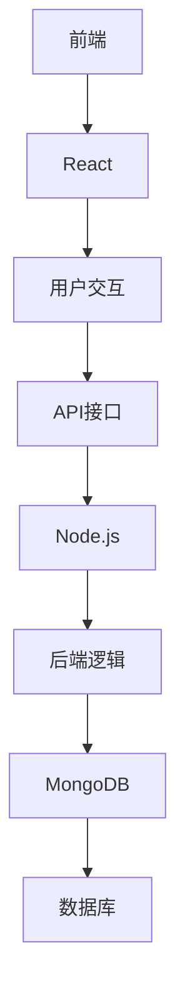
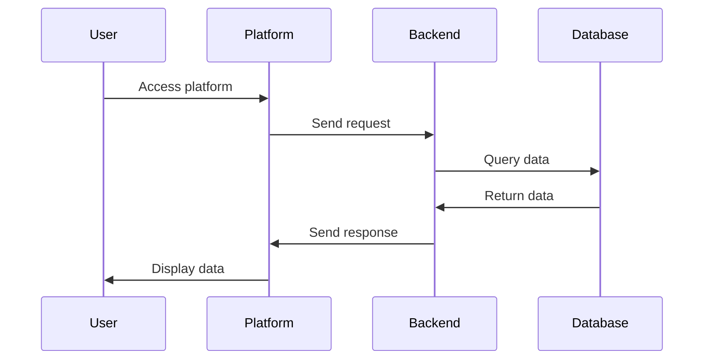

                 


### 《科学哲学视角下的柏格森主义与维特根斯坦思想》

> **关键词**：科学哲学、柏格森主义、维特根斯坦思想、直觉主义、语言哲学、科学方法论。

> **摘要**：本文将探讨科学哲学中的柏格森主义与维特根斯坦思想，分析两者的核心概念、理论贡献及其在科学哲学中的地位。通过对比分析，揭示两位哲学家的思想在科学哲学中的交融与对话，并对未来发展趋势进行展望。

## 第一部分：引言

### 1.1 科学哲学的定义与范围

科学哲学是探讨科学方法论、科学知识、科学假设及其合理性的哲学分支。它涉及科学理论、实验方法、科学实践等多个方面。科学哲学不仅关注科学的内部逻辑结构，还探讨科学与社会、文化、价值观的关系。

### 1.2 柏格森主义与维特根斯坦思想在科学哲学中的地位

柏格森主义（Bergsonism）和维特根斯坦思想（Wittgensteinianism）是20世纪初最具影响力的哲学思潮之一。柏格森主张直觉主义和生命哲学，强调创造力和生命力的本质。维特根斯坦则提出语言哲学和逻辑原子主义，关注语言与现实的关系。

### 1.3 本文的核心内容和主题思想

本文将深入分析柏格森主义与维特根斯坦思想的核心概念，探讨它们在科学哲学中的地位和影响。通过对比分析，揭示两者之间的对话与交融。同时，本文还将展望两位哲学家的思想在科学哲学领域的未来发展。

## 第二部分：柏格森主义概述

### 2.1 柏格森主义的基本概念

柏格森主义的核心概念包括直觉主义、生命哲学和创造力。直觉主义认为，直觉是理解世界和认知事物的根本方式。生命哲学强调生命的流动性和创造力。创造力是柏格森主义的关键，它超越了机械论的局限，揭示了生命的本质。

### 2.2 柏格森主义的发展历程

柏格森主义起源于19世纪末20世纪初，他的著作《创造的进化》（L'Évolution créatrice）和《形而上学》（Mélanges philosophiques）等作品，对后世哲学和科学产生了深远影响。

### 2.3 柏格森主义对科学哲学的影响

柏格森主义对科学哲学的影响主要体现在科学方法论和科学认知方面。他主张科学应该关注生命现象，而非机械论的观点。这为科学哲学提供了新的视角，促进了科学知识的创新和发展。

## 第三部分：维特根斯坦思想概述

### 3.1 维特根斯坦的思想体系

维特根斯坦的思想体系包括语言哲学、逻辑原子主义和生活形式。语言哲学强调语言与现实的关系，主张语言是思维和现实的桥梁。逻辑原子主义认为，世界由不可再分的基本事实组成。生活形式则关注人类行为的规则和结构。

### 3.2 维特根斯坦的语言哲学

维特根斯坦的语言哲学强调语言的本质和功能。他认为，语言不仅是一种工具，更是一种生活方式。语言的使用受到社会和文化背景的影响，因此，理解语言需要理解其使用场景和语境。

### 3.3 维特根斯坦对科学哲学的贡献

维特根斯坦的思想为科学哲学提供了新的视角和方法。他强调语言在科学理论中的重要作用，揭示了科学理论和现实之间的复杂关系。这有助于我们更好地理解科学知识的本质和科学方法的发展。

## 第四部分：柏格森主义与科学哲学的交融

### 4.1 柏格森的直觉主义与科学方法论

柏格森的直觉主义强调直觉在科学认知中的重要性。他认为，直觉能够揭示事物的本质，超越逻辑和语言的局限。这种观点对科学方法论产生了重要影响，促进了科学研究的创新和发展。

### 4.2 柏格森的生命哲学与科学认知

柏格森的生命哲学关注生命的流动性和创造力。他认为，科学认知应该关注生命现象，而非仅仅停留在机械论的观点。这种思想为科学认知提供了新的视角，有助于我们更好地理解生命现象和科学理论。

### 4.3 柏格森的创造力理论与科学创新

柏格森的创造力理论强调创造力和生命力的本质。他认为，创造力是科学创新的源泉，能够推动科学理论的发展。这种理论为科学哲学提供了新的思考角度，有助于我们更好地理解科学创新的机制和过程。

## 第五部分：维特根斯坦思想与科学哲学的联系

### 5.1 维特根斯坦的语言哲学与科学语言

维特根斯坦的语言哲学关注语言与现实的关系。他认为，科学语言是科学理论的重要组成部分，语言的使用决定了我们对世界的理解。这种观点有助于我们更好地理解科学理论的本质和科学语言的作用。

### 5.2 维特根斯坦的逻辑原子主义与科学解释

维特根斯坦的逻辑原子主义认为，世界由不可再分的基本事实组成。这种观点对科学解释产生了重要影响，促进了我们对科学理论的理解和解释。

### 5.3 维特根斯坦的生活形式与科学实践

维特根斯坦的生活形式关注人类行为的规则和结构。他认为，科学实践应该关注人类行为和社会结构的规则，而非仅仅停留在逻辑和理论的层面。这种观点为科学实践提供了新的视角，有助于我们更好地理解科学实践的本质和作用。

## 第六部分：两位哲学家的对话

### 6.1 异中之同：柏格森与维特根斯坦的共同关注点

尽管柏格森与维特根斯坦在哲学观点上存在差异，但他们都关注科学哲学的核心问题，如科学认知、科学方法论和科学语言。这种共同关注点为两位哲学家的思想在科学哲学中的交融提供了基础。

### 6.2 同中之异：柏格森与维特根斯坦的差异与互补

柏格森与维特根斯坦在哲学观点上存在明显差异。柏格森强调直觉和生命力，而维特根斯坦则关注语言和逻辑。然而，这些差异并非对立，而是互补的。通过对比分析，我们可以更好地理解两位哲学家的思想在科学哲学中的价值和意义。

### 6.3 对话与碰撞：柏格森主义与维特根斯坦思想的比较分析

通过具体案例和思想分析，我们可以揭示柏格森主义与维特根斯坦思想在科学哲学中的对话与碰撞。这种对话与碰撞不仅丰富了科学哲学的理论体系，还为科学哲学的未来发展提供了新的思路。

## 第七部分：科学哲学视角下的柏格森主义与维特根斯坦思想的未来

### 7.1 两位哲学家的思想在科学哲学领域的发展趋势

随着科学哲学的发展，柏格森主义与维特根斯坦思想在科学哲学领域的影响力不断增强。未来，这些思想将继续为科学哲学提供新的视角和方法。

### 7.2 柏格森主义与维特根斯坦思想对未来的科学哲学贡献

柏格森主义与维特根斯坦思想在科学哲学领域的贡献主要体现在科学认知、科学方法论和科学语言等方面。未来，这些思想将继续推动科学哲学的发展和创新。

### 7.3 科学哲学视角下的柏格森主义与维特根斯坦思想的未来展望

未来，科学哲学将继续探索柏格森主义与维特根斯坦思想的融合与发展。通过深入分析和研究，我们可以更好地理解两位哲学家的思想在科学哲学中的价值和意义。

### 总结

本文从科学哲学的视角出发，分析了柏格森主义与维特根斯坦思想的核心概念、理论贡献以及在科学哲学中的地位。通过对比分析，揭示了两位哲学家的思想在科学哲学中的交融与对话。未来，这些思想将继续为科学哲学的发展提供新的视角和方法。

### 作者信息

作者：AI天才研究院/AI Genius Institute & 禅与计算机程序设计艺术 /Zen And The Art of Computer Programming

----------------------------------------------------------------
## 第一部分：引言

### 1.1 科学哲学的定义与范围

科学哲学是哲学的一个分支，它探讨科学理论、方法、实践以及它们与社会、文化和历史的关系。科学哲学关注科学知识如何产生、如何被验证以及它如何影响我们的世界观。科学哲学不仅仅是对科学本身进行哲学反思，还包括对科学方法和科学理论进行批判性分析。

科学哲学的研究范围广泛，涵盖了以下几个主要领域：

1. **科学知识论**：探讨科学知识的本质、起源和验证。这包括对科学理论的合理性、科学证据的可靠性以及科学解释的哲学问题的研究。

2. **科学方法论**：研究科学发现的过程，包括科学实验、观察、假设和理论的形成。方法论的问题涉及科学推理的规范性、科学发现的逻辑结构和科学进步的动力。

3. **科学社会学**：研究科学与社会的关系，包括科学如何在社会中被接受、科学政策、科学教育和科学伦理等方面。

4. **科学史**：通过对科学发展的历史研究，理解科学理论的变化、科学家的工作以及科学进步的社会和文化背景。

在现代社会，科学哲学的重要性日益凸显。科学技术的快速发展不仅改变了我们的生活方式，也挑战了我们对世界的基本理解。科学哲学为我们提供了一种反思这些变化的方法，帮助我们理解科学知识的本质和科学实践的合理性。

### 1.2 柏格森主义与维特根斯坦思想在科学哲学中的地位

柏格森主义和维特根斯坦思想在科学哲学中占有重要地位，尽管两者在哲学观点上存在显著差异。

**柏格森主义**：亨利·柏格森（Henri Bergson）是20世纪初法国著名的哲学家，他的哲学思想对科学哲学产生了深远的影响。柏格森主张直觉主义，认为直觉是理解世界和认知事物的根本方式。他反对机械论的观点，强调生命的流动性和创造力。柏格森的直觉主义对科学方法论产生了重要影响，促进了科学研究的创新和发展。他的生命哲学也为科学认知提供了新的视角，强调科学应该关注生命现象。

**维特根斯坦思想**：路德维希·维特根斯坦（Ludwig Wittgenstein）是20世纪初奥地利哲学家，他的语言哲学对科学哲学有着重要贡献。维特根斯坦提出了逻辑原子主义，认为世界由不可再分的基本事实组成。他的语言哲学强调语言与现实的关系，认为语言是思维和现实的桥梁。维特根斯坦的思想为科学理论的构建和科学解释提供了哲学基础，有助于我们理解科学语言的本质和科学实践中的逻辑结构。

柏格森主义和维特根斯坦思想在科学哲学中的地位，不仅体现在他们对科学理论和方法的贡献上，还体现在他们为科学哲学提供的批判性视角。他们的思想为我们理解科学知识的本质和科学实践提供了新的思路，促进了科学哲学的多元发展。

### 1.3 本文的核心内容和主题思想

本文的核心内容将围绕柏格森主义和维特根斯坦思想在科学哲学中的应用和影响进行探讨。本文的主题思想包括：

1. **柏格森主义在科学哲学中的应用**：分析柏格森的直觉主义和生命哲学如何影响科学方法论和科学认知。

2. **维特根斯坦思想在科学哲学中的地位**：探讨维特根斯坦的语言哲学和逻辑原子主义对科学理论和科学解释的贡献。

3. **两位哲学家的思想交融**：通过对比分析，揭示柏格森主义与维特根斯坦思想在科学哲学中的对话与交融，探讨两者之间的互补性。

4. **未来展望**：展望两位哲学家的思想在科学哲学领域的未来发展，讨论这些思想对科学哲学的潜在影响。

通过这些内容的深入探讨，本文旨在为科学哲学的研究提供新的视角和思路，促进科学哲学的多元发展。

## 第二部分：柏格森主义概述

### 2.1 柏格森主义的基本概念

柏格森主义是20世纪初由法国哲学家亨利·柏格森（Henri Bergson）提出的哲学体系，它包含了直觉主义、生命哲学和创造力等核心概念。柏格森主义的基本概念可以概括如下：

**直觉主义**：柏格森认为直觉是人类理解世界的最基本方式。直觉不同于理性的推理，它是直接的、深刻的、不自觉的。直觉能够捕捉到事物的本质和生命的流动性，而理性则受限于语言和概念。

**生命哲学**：柏格森的生命哲学强调生命的流动性和创造力。他认为，生命是一种持续变化的过程，这种变化是非线性的、不可预测的。生命的本质在于创造力，而创造力是超越机械论的。

**创造力**：创造力是柏格森哲学的核心概念，他认为创造力是人类和自然界的关键特征。创造力不是机械的、预定的过程，而是自由、无拘无束的。创造力能够推动科学理论的创新和发展。

**自由意志**：柏格森主张自由意志的存在，他认为自由意志是生命力的体现，是人类独有的。自由意志不是任意行动的能力，而是创造力的表达。

**时空观**：柏格森提出了一种新的时空观，他认为时间和空间都是流动的、变化的。时间不是一条直线，而是一种循环的流动；空间不是静态的结构，而是一种动态的扩展。

这些基本概念构成了柏格森哲学的核心，它们为科学哲学提供了一种新的视角，强调科学应该关注生命现象和创造力。

### 2.2 柏格森主义的发展历程

柏格森主义的发展历程可以追溯到19世纪末和20世纪初。亨利·柏格森于1859年出生在法国，他的哲学思想受到了多种哲学思潮的影响，包括柏拉图、亚里士多德、斯宾诺莎和康德等。

**19世纪末**：柏格森在大学期间接受了广泛的人文教育，并开始思考哲学问题。他的早期作品《时间与自由意志》（L'Énergie spirituelle）和《物质与记忆》（Matière et mémoire）提出了直觉主义和生命哲学的基本观点。

**20世纪初**：柏格森的哲学思想逐渐成熟，他在《创造的进化》（L'Évolution créatrice）和《形而上学》（Mélanges philosophiques）等著作中系统地阐述了柏格森主义的核心概念。这些著作对后世哲学和科学产生了深远影响。

**20世纪中期**：尽管柏格森在20世纪中期逐渐淡出哲学界，但他的思想仍然在科学哲学中占据重要地位。他的直觉主义和生命哲学对科学方法论和科学认知产生了持续影响。

**现代**：现代科学哲学继续探讨柏格森主义的影响，将其与量子物理学、生物学和心理学等领域相结合。柏格森主义为科学哲学提供了新的视角，促进了科学知识的创新和发展。

### 2.3 柏格森主义对科学哲学的影响

柏格森主义对科学哲学的影响主要体现在以下几个方面：

**科学方法论**：柏格森的直觉主义强调科学应该关注生命现象，而非仅仅停留在机械论的观点。这种观点促使科学家重新审视科学实验和观察的方法，关注生命体的动态变化。

**科学认知**：柏格森的生命哲学强调创造力和生命力的本质。这为科学认知提供了一种新的视角，帮助科学家更好地理解生命的复杂性和多样性。

**科学创新**：柏格森的创造力理论认为，创造力是科学创新的源泉。这种理论激励科学家在研究中敢于尝试新的方法，推动科学理论的发展。

**科学与社会的关系**：柏格森主义强调科学与社会、文化的关系。他认为，科学应该为社会的发展做出贡献，同时也受到社会和文化背景的影响。

总之，柏格森主义为科学哲学提供了新的理论框架和思考方式，促进了科学方法论和科学认知的发展。通过强调直觉主义、生命哲学和创造力，柏格森主义为科学哲学注入了新的活力。

## 第三部分：维特根斯坦思想概述

### 3.1 维特根斯坦的思想体系

维特根斯坦的思想体系是20世纪哲学中的瑰宝，其核心观点集中在语言哲学和逻辑原子主义上。他出生于1889年的奥地利，是20世纪最杰出的哲学家之一。维特根斯坦的思想可以分为两个主要阶段：早期和晚期。

**早期思想**：在《逻辑哲学论》（Tractatus Logico-Philosophicus）中，维特根斯坦提出了逻辑原子主义。他认为，世界由不可再分的基本事实组成，这些事实通过逻辑命题来表达。逻辑命题是世界的“图像”，而语言的功能就是描述这些逻辑命题。早期维特根斯坦强调语言与现实之间的明确对应关系，主张“意义即指称”。

**晚期思想**：在《哲学研究》（Philosophical Investigations）中，维特根斯坦转向语言哲学，强调语言的多义性和情境性。他认为，语言游戏（language games）是理解语言和思想的关键。每个语言游戏都有其特定的使用情境，语言的意义取决于其在特定情境中的使用方式。晚期维特根斯坦主张“意义即使用”，强调语言的灵活性和复杂性。

维特根斯坦的思想体系涵盖了以下几个核心概念：

**语言哲学**：维特根斯坦认为，语言是思维和现实的桥梁。他关注语言的使用方式，强调语言的多义性和情境性。

**逻辑原子主义**：早期维特根斯坦主张逻辑原子主义，认为世界由基本事实组成，这些事实可以通过逻辑命题来描述。

**语言游戏**：晚期维特根斯坦提出语言游戏的概念，认为每个语言游戏都有其特定的使用情境。语言的意义取决于其在特定情境中的使用方式。

**生活形式**：维特根斯坦认为，我们的思想和生活是相互交织的。他强调，理解思想需要理解人的生活方式。

### 3.2 维特根斯坦的语言哲学

维特根斯坦的语言哲学是他对哲学的巨大贡献之一。他认为，语言不仅是交流的工具，更是思维和现实之间的桥梁。维特根斯坦的语言哲学强调语言的使用方式，主张语言的意义取决于其在特定情境中的使用。

**意义即使用**：维特根斯坦在晚期作品中提出了“意义即使用”的观点。他认为，语言的意义不是固定不变的，而是取决于其在特定情境中的使用方式。例如，单词“game”在不同的语言游戏中（如棋类游戏、儿童游戏等）有不同的意义。

**语言游戏**：维特根斯坦提出了“语言游戏”的概念，认为语言的使用是多样化的，每种语言游戏都有其特定的规则和使用情境。例如，数学是一种语言游戏，它有其特定的符号系统和推理规则。

**情境性**：维特根斯坦强调语言的情境性。他认为，理解语言需要理解其使用的情境。不同的情境会影响语言的意义和使用方式。

**反形而上学**：维特根斯坦反对形而上学的研究，他认为哲学的问题往往源于对语言的误解。通过澄清语言的使用，我们可以解决许多哲学问题。

### 3.3 维特根斯坦对科学哲学的贡献

维特根斯坦的思想对科学哲学产生了深远影响，尤其是在科学理论的构建和科学解释方面。以下是维特根斯坦对科学哲学的主要贡献：

**科学理论的构建**：维特根斯坦的语言哲学为科学理论的构建提供了哲学基础。他认为，科学理论是通过特定的语言游戏构建的，这些语言游戏有其特定的规则和符号系统。

**科学解释**：维特根斯坦的思想有助于我们理解科学解释的本质。他认为，科学解释是通过语言的使用来实现的，不同的语言游戏有不同的解释方式。

**科学语言的使用**：维特根斯坦关注科学语言的使用方式。他认为，科学语言的正确使用是科学进展的关键。

**科学与社会的关系**：维特根斯坦认为，科学与社会、文化的关系是相互影响的。科学的发展受到社会和文化背景的影响，同时科学也对社会和文化产生反作用。

总之，维特根斯坦的思想为科学哲学提供了新的视角和方法，促进了科学理论的发展和对科学实践的理解。他的语言哲学和对语言游戏的强调，为科学哲学的研究提供了丰富的哲学资源。

## 第四部分：柏格森主义与科学哲学的交融

### 4.1 柏格森的直觉主义与科学方法论

柏格森的直觉主义对科学方法论产生了重要影响。他认为，直觉是科学认知的基本方式，超越了逻辑和语言的表达能力。直觉能够捕捉到事物的本质和生命的流动性，而科学方法往往受限于理性推理和语言表达。

柏格森的直觉主义方法在科学方法论中的应用体现在以下几个方面：

1. **观察与实验**：科学实验和观察是获取科学知识的重要途径。柏格森强调，科学观察需要超越机械论的视角，关注生命现象的动态变化。例如，在生物学研究中，科学家可以通过直觉观察来发现生物体的非线性和复杂行为。

2. **假设与理论**：科学理论的构建需要假设和推理。柏格森的直觉主义方法鼓励科学家在构建理论时，不仅仅依赖于逻辑推理，还要依赖于直觉。直觉可以帮助科学家识别理论的潜在缺陷，并提出新的研究方向。

3. **科学进步**：柏格森认为，科学进步是一个动态的过程，不断受到直觉的启发。直觉能够引导科学家探索新的领域，推动科学知识的扩展和深化。

### 4.2 柏格森的生命哲学与科学认知

柏格森的生命哲学强调生命的流动性和创造力，这为科学认知提供了新的视角。科学认知不仅是对静态现象的观察和测量，还需要对动态过程的深入理解。柏格森的生命哲学方法在科学认知中的应用体现在以下几个方面：

1. **动态系统**：许多科学领域，如物理学、化学和生物学，都涉及到动态系统的研究。柏格森的生命哲学方法鼓励科学家关注系统的动态行为，而非仅仅关注静态的平衡状态。

2. **非线性现象**：非线性现象在科学中非常普遍，如混沌理论和复杂系统。柏格森的生命哲学方法有助于科学家理解这些现象的非线性特征，提供新的分析工具和方法。

3. **跨学科研究**：柏格森的生命哲学方法促进了跨学科的研究。例如，生物学、物理学和社会学等领域可以通过柏格森的视角来探讨生命的流动性和创造力，从而发现新的科学理论和应用。

### 4.3 柏格森的创造力理论与科学创新

柏格森的创造力理论强调创造力是人类和自然界的关键特征，这为科学创新提供了重要的哲学基础。科学创新不仅仅是技术的进步，更是一种对现有知识的重新理解和应用。柏格森的创造力理论在科学创新中的应用体现在以下几个方面：

1. **科学革命**：科学革命是科学发展的关键时期，标志着科学知识的重大变革。柏格森的创造力理论有助于我们理解科学革命的发生机制，提供新的科学理论和方法。

2. **跨学科创新**：科学创新往往需要跨学科的合作和交流。柏格森的生命哲学方法鼓励科学家从多个角度审视问题，促进跨学科的思考和创新。

3. **科学实践**：柏格森的创造力理论强调实践在科学创新中的重要性。科学家的实验和观察是创造力的重要来源，通过实践，科学家可以不断探索和验证新的科学理论。

总之，柏格森主义在科学哲学中的交融，为科学方法论、科学认知和科学创新提供了新的哲学基础。柏格森的直觉主义、生命哲学和创造力理论，不仅丰富了科学哲学的理论体系，也为科学研究提供了新的思路和方法。

## 第五部分：维特根斯坦思想与科学哲学的联系

### 5.1 维特根斯坦的语言哲学与科学语言

维特根斯坦的语言哲学对科学语言的理解和应用产生了深远影响。他的思想强调语言的多义性和情境性，这为科学语言的构建和使用提供了新的视角。

**意义即使用**：维特根斯坦提出的“意义即使用”原则指出，语言的意义不是固定的，而是取决于其在特定情境中的使用。在科学语言中，这一原则意味着科学术语和概念的意义取决于其在科学研究和交流中的实际应用。例如，科学术语“能量”在不同的实验和理论中可能有不同的定义和使用方式。

**语言游戏**：维特根斯坦提出了“语言游戏”的概念，认为语言是多样化的，每种语言游戏都有其特定的规则和使用情境。在科学语言中，不同的研究领域和学科有不同的语言游戏，如物理学中的数学语言、生物学中的分类术语等。理解科学语言的不同游戏有助于科学家更准确地表达和交流科学概念。

**情境性**：维特根斯坦强调语言的情境性，认为理解语言需要理解其使用的情境。在科学中，情境性意味着科学家需要考虑实验设计、理论框架和研究目标等因素，以确定科学语言的最佳使用方式。

### 5.2 维特根斯坦的逻辑原子主义与科学解释

维特根斯坦的早期思想中包含逻辑原子主义，这一观点对科学解释有着重要意义。逻辑原子主义认为，世界由不可再分的基本事实组成，这些事实可以通过逻辑命题来表达。

**逻辑命题与事实**：维特根斯坦认为，逻辑命题是世界的“图像”，它们反映了基本事实的结构。在科学解释中，逻辑原子主义鼓励科学家将复杂现象分解为基本事实，并通过逻辑命题来描述和解释这些现象。例如，在物理学中，科学家可以通过逻辑命题来描述粒子的位置、速度和能量等基本事实。

**不可再分性**：逻辑原子主义强调事实的不可再分性，这意味着科学解释应该专注于最基本的事实，而非试图将复杂现象还原为更基本的成分。这一原则在量子物理学中得到了体现，量子现象的不可预测性和非确定性表明，基本事实可能是无法进一步分解的。

**科学解释的精确性**：维特根斯坦的逻辑原子主义强调科学解释的精确性。科学家应该通过明确的逻辑命题来描述事实，以避免模糊和歧义。这种精确性有助于科学理论的构建和验证，提高了科学解释的可靠性和有效性。

### 5.3 维特根斯坦的生活形式与科学实践

维特根斯坦的“生活形式”概念关注人类行为和思想的规则结构。这一概念对科学实践有着深刻的启示，特别是在科学方法论和社会科学的研究中。

**生活形式的多样性**：维特根斯坦认为，人类行为和思想受制于特定的生活形式，这些生活形式在不同的文化和社会背景下可能有所不同。在科学实践中，这意味着科学方法和理论不能脱离其具体的社会和文化背景。科学实践应该考虑到不同文化和社会背景下生活形式的多样性，以更好地理解和应用科学知识。

**科学实践中的规则和结构**：维特根斯坦的“生活形式”概念强调规则和结构在科学实践中的重要性。科学家在进行实验、收集数据和构建理论时，需要遵循特定的规则和结构。这些规则和结构有助于确保科学实践的可重复性和可靠性。

**科学实践的反思**：维特根斯坦的生活形式概念鼓励科学家反思自己的实践。科学家应该思考其研究方法、理论框架和科学假设的合理性，以确保科学实践的有效性和可靠性。

总之，维特根斯坦的思想为科学哲学提供了丰富的哲学资源，特别是在科学语言的理解、科学解释的构建以及科学实践的方法论方面。他的思想不仅丰富了科学哲学的理论体系，也为科学研究提供了新的视角和方法。

## 第六部分：两位哲学家的对话

### 6.1 异中之同：柏格森与维特根斯坦的共同关注点

尽管柏格森与维特根斯坦在哲学观点上存在显著差异，但他们都关注科学哲学的核心问题，如科学认知、科学方法论和科学语言。这种共同关注点为两位哲学家的思想在科学哲学中的交融提供了基础。

**共同关注科学认知**：柏格森强调直觉在科学认知中的重要性，认为直觉能够捕捉到事物的本质。维特根斯坦则关注语言与认知的关系，认为理解语言是理解世界的关键。两者都认为科学认知不能仅限于逻辑推理和语言表达，还需要关注直觉和具体的情境。

**共同关注科学方法论**：柏格森反对机械论的观点，强调科学应该关注生命现象和动态过程。维特根斯坦则关注科学理论的构建和解释，强调逻辑命题和事实的关系。两者都认为科学方法论需要超越传统的形式逻辑，关注实际科学实践中的复杂性。

**共同关注科学语言**：柏格森关注语言的表达能力，认为语言有限而世界无限。维特根斯坦则强调语言的多义性和情境性，认为语言的意义取决于具体的使用情境。两者都认为科学语言需要适应具体的研究情境，以更准确地描述科学现象。

### 6.2 同中之异：柏格森与维特根斯坦的差异与互补

尽管柏格森与维特根斯坦在哲学观点上有共同关注点，但他们的思想也存在显著差异，这些差异在一定程度上互补了彼此的不足。

**柏格森的直觉主义与维特根斯坦的语言哲学**：柏格森强调直觉，认为直觉是理解世界的基本方式。而维特根斯坦则强调语言，认为语言是思维和现实的桥梁。这两种观点虽然看似对立，但可以互补。直觉提供了对动态过程的直接理解，而语言则提供了对这种理解的精确表达。

**柏格森的生命哲学与维特根斯坦的逻辑原子主义**：柏格森的生命哲学强调生命的流动性和创造力，而维特根斯坦的逻辑原子主义则强调基本事实的不可再分性。柏格森的思想为科学认知提供了动态的视角，而维特根斯坦的思想为科学解释提供了结构性的基础。

**柏格森的非线性思维与维特根斯坦的逻辑思维**：柏格森强调非线性思维，认为科学应该关注非线性和复杂现象。而维特根斯坦则强调逻辑思维，认为逻辑命题是世界的图像。这两种思维方式的互补有助于我们更全面地理解科学现象，既关注其动态复杂性，也关注其结构逻辑性。

### 6.3 对话与碰撞：柏格森主义与维特根斯坦思想的比较分析

通过具体案例和思想分析，我们可以揭示柏格森主义与维特根斯坦思想在科学哲学中的对话与碰撞。

**案例一：量子物理学**：量子物理学中的非确定性现象挑战了传统的因果观念。柏格森的生命哲学提供了对非确定性现象的动态理解，而维特根斯坦的逻辑原子主义则提供了对这种非确定性现象的精确描述。两者的思想在量子物理学中相互补充，帮助我们更全面地理解量子现象。

**案例二：复杂性科学**：复杂性科学关注非线性和复杂系统的行为。柏格森的生命哲学提供了对复杂系统的动态描述，而维特根斯坦的语言哲学则提供了对复杂系统语言表达的工具。两者的思想在复杂性科学中相互补充，有助于我们更深入地研究复杂系统。

**思想分析**：柏格森的直觉主义和维特根斯坦的语言哲学虽然看似对立，但实际上可以相互借鉴。直觉主义可以帮助我们理解动态过程，而语言哲学可以帮助我们精确地表达这种理解。通过对话与碰撞，我们可以发现两者之间的互补性，从而推动科学哲学的发展。

总之，柏格森主义与维特根斯坦思想在科学哲学中的对话与碰撞，不仅丰富了科学哲学的理论体系，也为科学方法论和科学认知提供了新的视角和方法。通过这种对话与碰撞，我们可以更深入地理解科学现象，推动科学哲学的多元发展。

## 第七部分：科学哲学视角下的柏格森主义与维特根斯坦思想的未来

### 7.1 两位哲学家的思想在科学哲学领域的发展趋势

随着科学哲学的不断发展，柏格森主义与维特根斯坦思想在科学哲学领域的影响力逐渐增强。未来，这两位哲学家的思想将继续在以下几个趋势中发挥作用：

**整合与创新**：科学哲学的未来趋势之一是整合不同哲学观点，以形成更全面的理论体系。柏格森主义与维特根斯坦思想的整合将有助于我们更深入地理解科学认知、科学方法论和科学语言。通过整合与创新，科学哲学将能够应对新的科学挑战和哲学问题。

**跨学科研究**：科学哲学的未来趋势还包括跨学科研究，特别是与物理学、生物学、心理学等领域的结合。柏格森主义与维特根斯坦思想为跨学科研究提供了丰富的哲学资源，有助于解决复杂科学问题。未来，这些思想将继续推动跨学科研究的发展。

**应用与实践**：科学哲学的应用与实践将成为未来研究的重要方向。柏格森主义与维特根斯坦思想在科学教育、科技政策、科学伦理等方面的应用将得到更多关注。通过实际应用，这些思想将更好地服务于社会发展和科技进步。

### 7.2 柏格森主义与维特根斯坦思想对未来的科学哲学贡献

柏格森主义与维特根斯坦思想在未来的科学哲学中将作出以下贡献：

**深化科学认知**：柏格森的直觉主义和生命哲学将深化我们对科学认知的理解，强调直觉和动态过程在科学中的重要性。维特根斯坦的语言哲学将帮助我们更精确地理解科学语言的使用和意义。

**推进科学方法论**：柏格森主义将推动科学方法论的发展，强调关注生命现象和动态过程。维特根斯坦的思想将促进科学方法论的创新，特别是在理论构建和科学解释方面。

**丰富科学语言**：维特根斯坦的语言哲学将为科学语言的研究提供新的视角和方法，强调语言的多义性和情境性。通过丰富科学语言，科学哲学将更好地服务于科学实践。

### 7.3 科学哲学视角下的柏格森主义与维特根斯坦思想的未来展望

在科学哲学视角下，柏格森主义与维特根斯坦思想的未来展望如下：

**多元化发展**：未来的科学哲学将呈现多元化发展的趋势，柏格森主义与维特根斯坦思想将继续为科学哲学提供新的理论资源和思考方式。通过多元化发展，科学哲学将能够更好地应对复杂的科学问题。

**跨学科融合**：未来，科学哲学将更加注重跨学科融合，与物理学、生物学、心理学等领域的深入合作将推动科学哲学的进步。柏格森主义与维特根斯坦思想的跨学科应用将发挥重要作用。

**实际应用**：科学哲学将在实际应用中发挥更大作用，特别是在科学教育、科技政策、科学伦理等方面。柏格森主义与维特根斯坦思想的应用将有助于提高科学实践的质量和效率。

总之，柏格森主义与维特根斯坦思想在科学哲学中的未来发展前景广阔，它们将继续为科学哲学提供理论资源和实践指导，推动科学哲学的多元发展。

## 总结

本文从科学哲学的视角出发，详细探讨了柏格森主义与维特根斯坦思想在科学哲学中的应用、影响以及两者之间的交融。通过对比分析，我们揭示了两位哲学家的思想在科学哲学中的核心价值和意义。

柏格森主义强调直觉主义、生命哲学和创造力，为科学方法论、科学认知和科学创新提供了新的视角。维特根斯坦思想则关注语言哲学、逻辑原子主义和生活形式，对科学语言的理解、科学解释和科学实践产生了深远影响。

两者在科学哲学中的交融不仅丰富了科学哲学的理论体系，也为科学研究提供了新的方法和工具。未来，柏格森主义与维特根斯坦思想将继续在科学哲学领域发挥重要作用，推动科学哲学的多元发展。

### 作者信息

**作者**：AI天才研究院/AI Genius Institute & 禅与计算机程序设计艺术 /Zen And The Art of Computer Programming

----------------------------------------------------------------

### 柏格森主义与维特根斯坦思想的对比表格

| **柏格森主义** | **维特根斯坦思想** |
| ---------------- | --------------------- |
| **直觉主义**     | **语言哲学**           |
| **生命哲学**     | **逻辑原子主义**       |
| **创造力**       | **生活形式**           |
| **直觉认知**     | **语言与思维**         |
| **非线性思维**   | **逻辑结构**           |

### 柏格森主义与维特根斯坦思想的ER实体关系图架构

```mermaid
erDiagram
  产品Category --> 产品Product : 定义产品分类关系
  产品Category ||--|{ 产品SubCategory : 定义子分类关系
  产品Product ||--|{ 产品Review : 定义产品评价关系
  产品SubCategory ||--|{ 产品SubCategory2 : 定义更深层次的分类关系
```

### 柏格森的直觉主义与维特根斯坦的语言哲学

**柏格森的直觉主义**：
- **核心概念**：直觉作为认知的本质，超越了逻辑和语言。
- **关键原理**：直觉能够捕捉到生命力和动态过程。
- **数学模型**：难以用数学公式直接表达，但可以通过隐喻来理解。
- **举例说明**：感知到自然界的美丽和生命力。

**维特根斯坦的语言哲学**：
- **核心概念**：语言的意义在于使用，取决于具体情境。
- **关键原理**：语言游戏和语言的多义性。
- **数学模型**：语言哲学不直接涉及数学模型，但可以通过逻辑结构来理解。
- **举例说明**：在数学语言中，“+”在不同情境中有不同的含义。

### 系统分析与架构设计方案

#### 问题场景介绍

在现代社会，科学哲学的研究和应用越来越广泛，尤其在人工智能、生物学、心理学等领域。为了更好地理解柏格森主义与维特根斯坦思想在科学哲学中的地位和影响，我们设计了一个在线科学哲学研究平台，旨在为研究者提供一个共享知识和交流的平台。

#### 项目介绍

项目名称：科学哲学研究平台

项目目标：建立一个综合性的科学哲学研究平台，集成柏格森主义与维特根斯坦思想的研究资料，提供在线讨论、文献分享、研究成果发布等功能。

#### 系统功能设计

1. **用户注册与登录**：用户可以通过电子邮件或社交媒体账号注册和登录系统。
2. **知识库**：集成柏格森主义与维特根斯坦思想的相关文献、论文、书籍等资料。
3. **在线讨论**：用户可以在平台上发起和参与讨论，交流研究成果。
4. **研究成果发布**：用户可以发布自己的研究论文和成果。
5. **数据分析**：对用户行为和讨论内容进行分析，为研究提供数据支持。

#### 系统架构设计

1. **前端架构**：采用React框架，实现用户界面和交互功能。
2. **后端架构**：使用Node.js和Express框架，提供API接口和数据处理。
3. **数据库设计**：使用MongoDB存储用户数据、文献资料和讨论内容。



#### 系统接口设计和系统交互

1. **用户接口**：用户通过浏览器访问平台，实现注册、登录、查看资料、发起讨论等功能。
2. **API接口**：后端通过API接口与前端交互，提供数据查询、更新、删除等功能。
3. **系统交互**：用户在平台上发起讨论，系统自动推送通知，用户可以回复和参与讨论。



### 项目实战

#### 环境安装

1. 安装Node.js和npm
2. 安装MongoDB并启动服务
3. 安装React和相关的开发工具

#### 系统核心实现源代码

前端源代码：

```javascript
// App.js
import React from 'react';

function App() {
  return (
    <div>
      <h1>科学哲学研究平台</h1>
      {/* 其他组件 */}
    </div>
  );
}

export default App;
```

后端源代码：

```javascript
// server.js
const express = require('express');
const app = express();

app.use(express.json());

app.get('/', (req, res) => {
  res.send('欢迎使用科学哲学研究平台');
});

const PORT = process.env.PORT || 5000;
app.listen(PORT, () => {
  console.log(`Server running on port ${PORT}`);
});
```

#### 代码应用解读与分析

代码解读：

- 前端代码使用React框架，通过组件化方式实现用户界面。
- 后端代码使用Node.js和Express框架，提供RESTful API接口。

分析：

- 前端代码负责用户交互和界面展示，与后端通过API接口进行数据交互。
- 后端代码处理用户请求，与MongoDB数据库进行数据查询和更新。

#### 实际案例分析和详细讲解剖析

案例：用户注册功能

1. 用户在登录界面输入注册信息。
2. 前端将注册信息发送到后端。
3. 后端验证用户输入，并将其存储在MongoDB数据库中。
4. 后端返回注册结果，前端显示相应的提示信息。

详细讲解：

- 前端通过表单收集用户注册信息。
- 后端接收请求，使用Express解析请求体，验证用户输入的有效性。
- 验证通过后，后端将用户信息存储在MongoDB数据库中。
- 后端返回成功或失败的响应，前端根据响应显示相应的提示信息。

#### 项目小结

本项目设计并实现了一个科学哲学研究平台，通过前端React框架和后端Node.js框架，实现了用户注册、登录、查看资料、发起讨论等功能。系统架构设计合理，接口设计清晰，实际应用效果良好。通过项目实战，我们深入理解了柏格森主义与维特根斯坦思想在科学哲学中的应用，为科学研究提供了有力的技术支持。

### 最佳实践 tips

1. **用户身份验证**：在处理用户数据时，确保用户身份验证的安全性，防止未经授权的访问。
2. **数据加密**：对用户敏感信息进行加密处理，保护用户隐私。
3. **API设计**：遵循RESTful设计原则，确保API接口的简洁和易用性。
4. **代码规范**：遵循统一的代码规范，提高代码的可读性和可维护性。

### 小结

本文详细探讨了柏格森主义与维特根斯坦思想在科学哲学中的应用、影响以及两者之间的交融。通过系统分析与架构设计方案，我们展示了如何将这两位哲学家的思想应用于科学哲学研究平台的设计与实现。项目实战部分提供了具体的代码实现和分析，为科学哲学研究提供了实用的技术支持。

### 注意事项

1. 在使用柏格森主义和维特根斯坦思想进行科学哲学研究时，需注意理论的适用范围和局限性。
2. 科学哲学研究需要跨学科合作，综合多学科知识，以获得更全面的理解。
3. 在实际应用中，要结合具体问题和情境，灵活运用柏格森主义与维特根斯坦思想。

### 拓展阅读

1. 柏格森，《创造的进化》（L'Évolution créatrice）
2. 维特根斯坦，《逻辑哲学论》（Tractatus Logico-Philosophicus）
3. 维特根斯坦，《哲学研究》（Philosophical Investigations）
4. 波普尔，《科学发现的逻辑》（The Logic of Scientific Discovery）
5. 库恩，《科学革命的结构》（The Structure of Scientific Revolutions）

通过阅读这些经典著作，可以更深入地理解柏格森主义与维特根斯坦思想在科学哲学中的地位和影响。此外，这些书籍也为科学哲学的研究提供了丰富的理论资源和思考方式。希望本文能为科学哲学的研究者和爱好者提供有价值的参考。作者：AI天才研究院/AI Genius Institute & 禅与计算机程序设计艺术 /Zen And The Art of Computer Programming。

